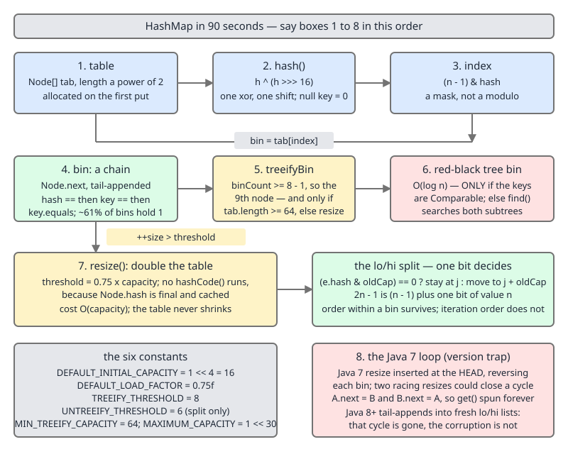

# 02 Java Collections — Interview, INTERNALS tier — summary and questions 1–9 (§5.1)

**Target version: Java 21 LTS.** | [Index](00-index.md)
Previous: [91c-interview-intermediate-c-puzzles.md](91c-interview-intermediate-c-puzzles.md) · Next: [92a-interview-internals-a2-questions-10-18.md](92a-interview-internals-a2-questions-10-18.md)

The INTERNALS tier is source-level: named methods, named constants, real line numbers, and the
reason each number is what it is. This file carries the tier summary table across all **18 subject
folders** and questions 1–9 of 36 — the nine canonical `HashMap` questions, which are
§5.1.1–5.1.9 and the ones you are most likely to be asked. Questions 10–18, one source-level
question per remaining subject folder, are in
[92a](92a-interview-internals-a2-questions-10-18.md); questions 19–36 are in
[92b](92b-interview-internals-b-questions-19-36.md); the five puzzles are in
[92c](92c-interview-internals-c-puzzles-and-checklist.md), and the flat atomic concept checklist in
[92d](92d-interview-internals-d-atomic-concept-checklist.md).

Every line number below is JDK 21 unless stated. No figure on this page is a JMH result: every
measurement quoted in this set is single-shot wall clock on an Apple M4 Pro with JDK
21.0.7+8-LTS-245, and the *ratio* is the claim, never the nanoseconds.

## Tier summary table — the mechanism per subject

| Subject | The mechanism to be able to walk | The named thing to quote | The correction to make |
|---|---|---|---|
| The framework itself | the six `Abstract*` skeletons and what each derives | `AbstractList` derives its iterator from `get` | `AbstractMap.get` is O(n) unless you override it |
| Ordering contracts | `String.hashCode`'s 31-fold and its cached `hash` field | `hashIsZero` (Java 13+) distinguishes "0" from "not computed" | `"Aa"`/`"BB"` both hash to 2112 — collisions are engineerable |
| Iteration | `modCount`/`expectedModCount`, checked at the top of `next()` | `ArrayList.Itr` has `cursor`, `lastRet`, `expectedModCount` | fail-fast is best-effort; the second-to-last-element case is silent |
| Sequenced collections (21) | `ReversedLinkedHashMapView` holding one `base` field | its `reversed()` is `return base;` (`LinkedHashMap.java:1224`) | double reversal **is** identity for lists and `LinkedHashMap`, not for `TreeMap` |
| Cost and memory | header 12 B, array header 16 B, ref 4 B, round to 8 | `Node` 32, `Entry` 40, `TreeNode` 56 | compressed oops end at ~32 GB, and the cliff scales with `ObjectAlignmentInBytes` |
| `ArrayList` | two distinct empty-array sentinels compared by **identity** | `DEFAULT_CAPACITY = 10`, `ArraysSupport.newLength` | `SOFT_MAX_ARRAY_LENGTH` is `Integer.MAX_VALUE - 8`, not `MAX_VALUE` |
| `LinkedList` | `node(int)`'s bidirectional shortcut | forward when `index < (size >> 1)` | worst case is `⌊(n−1)/2⌋` hops, not `n/2` |
| `ArrayDeque` | circular buffer, `head`/`tail`, one slot always null | `inc`/`dec`/`sub`, no `%`; capacity 17 | the power-of-two mask went in **JDK 9**, capacity 16→17 in **JDK 12** |
| `PriorityQueue` | `siftUp`/`siftDown` moving a hole, not swapping | `heapify` backwards from `(n >>> 1) - 1`, O(n) | `removeAt` returns the moved element; the iterator needs `forgetMeNot` |
| `HashMap` | table → bin → chain or tree, and the one-bit resize split | 16, 0.75, 8, 6, 64, `1 << 30` | treeify bounds an attack **only for `Comparable` keys** |
| `LinkedHashMap` | four allocation overrides plus three `afterNode*` hooks | `linkNodeAtEnd` (JDK 21), `linkNodeLast` (8/17) | `afterNodeAccess` has **8** call sites, not the javadoc's three |
| `TreeMap` | `fixAfterInsertion`'s 4 cases, `fixAfterDeletion`'s 4 mirrored | height ≤ `2·log₂(n+1)`; `buildFromSorted` is O(n) | key identity is `compare == 0`; range views fence writes only |
| Sets | `HashSet` is a `HashMap` with one shared `PRESENT` | `Collections.newSetFromMap` generalises it | `CopyOnWriteArraySet` and `EnumSet` break the pattern |
| Specialised maps and sets | ordinal array; identity probe; `Entry extends WeakReference` | `RegularEnumSet`'s single `long`; `nextKeyIndex` is `i + 2` | `EnumMap.EntryIterator` allocates a **fresh** entry per `next()` |
| Immutability and views | open addressing with `EXPAND_FACTOR = 2` and a per-run salt | `probe` returns `i` or `-(i+1)`; `SALT32L` from `nanoTime` | the salt drives **iterators only**; placement is deterministic |
| Concurrent collections | CAS an empty bin, `synchronized (f)` on a populated one | `MOVED`/`TREEBIN`/`RESERVED` = −1/−2/−3; stride ≥ 16 | `sizeCtl`'s javadoc is stale; `Segment` still exists as a stub |
| Utility surfaces | TimSort's run stack and its invariants | `MIN_MERGE = 32`; JDK-8072909 | the JDK's fix enlarged the stack bound, it did not fix the merge logic |
| Build it | writing `MyHashMap` is what makes resize answerable | a sorted-array bin gives O(log n) lookup but O(n) insert | a hand-built LRU costs 64 B/entry against `LinkedHashMap`'s 40 |

## Q&A 1–9 — the nine `HashMap` questions

### Q1. "How does `HashMap` work internally?" — the 90-second answer and the 10-minute answer (§5.1.1)

**The 90-second answer.** It is an array of bins. `hash(key)` takes the key's `hashCode()` and
xors it with its own top 16 bits; the bin index is `(n - 1) & hash`, a mask rather than a modulo,
which is why the capacity is always a power of two. A bin is a singly-linked chain of `Node`s, each
holding the cached hash, the key, the value and a `next` pointer — and once a bin would hold nine
nodes, in a table of at least 64 slots, it converts to a red-black tree. The map doubles when size
exceeds 75% of capacity, and on the doubling each entry either stays at index `j` or moves to
`j + oldCapacity`, decided by a single bit.

That is the whole model, and everything else is a detail hanging off it.



**The 10-minute answer** adds the mechanism behind each box, and this is the order to say it in.

1. **Lazy allocation.** `new HashMap<>()` allocates one object and no table. The `threshold` field
   does double duty: while `table == null` it holds the *pending capacity*, and once the table
   exists it holds `capacity × loadFactor`. `resize()` is both the allocator and the grower; there is
   no `initTable`.
2. **`hash()`** is `(key == null) ? 0 : (h = key.hashCode()) ^ (h >>> 16)`, one line at `:336`,
   unchanged since JDK 8. `>>>` and not `>>`, so the top half is not sign-extended.
3. **The index** is `(n - 1) & hash`. This keeps only the low `log₂ n` bits, which is exactly why
   step 2 exists — see Q6.
4. **`getNode`** loads `tab[index]`, then compares
   `e.hash == hash && ((k = e.key) == key || (key != null && key.equals(k)))`. Three gates, cheapest
   first: a cached `int`, then a reference compare, then user code. On a one-node bin — about 61% of
   bins at load factor 0.75 — there is no loop and no `instanceof` at all, because the `TreeNode`
   check is guarded by `first.next != null`.
5. **`putVal`** has an empty-bin fast path (`tab[i] = newNode(...)`, one allocation, one store), a
   chain walk that counts nodes, and an update path that returns early — an overwrite of an existing
   key bumps neither `size` nor `modCount`.
6. **`treeifyBin`** fires when `binCount >= TREEIFY_THRESHOLD - 1`. `binCount` counts `next` hops
   from an already-rejected head, so the bin holds **nine** nodes at conversion, not eight. And if
   `tab.length < MIN_TREEIFY_CAPACITY = 64` it calls `resize()` instead and treeifies nothing.
7. **`resize()`** doubles capacity and threshold, then walks the old table. A single-node bin is
   placed directly with the full new mask. A chain is split into a lo list and a hi list by
   `(e.hash & oldCap) == 0`, tail-appended, and hung at `j` and `j + oldCap`. A tree bin goes through
   `TreeNode.split`, which walks the surviving `next` overlay and untreeifies either half that comes
   out at 6 nodes or fewer. **No `hashCode()` is called anywhere in a resize**, because `Node.hash`
   is `final` and cached.
8. **The `LinkedHashMap` seam.** Four package-private allocation methods (`newNode`,
   `replacementNode`, `newTreeNode`, `replacementTreeNode`) and three empty hooks
   (`afterNodeAccess`, `afterNodeInsertion`, `afterNodeRemoval`, at `:1941`–`:1943`). `HashMap`
   never writes `new Node<>` directly — that is the entire extension mechanism.

**If they push:** the honest boundaries are worth naming. Removal never shrinks the table and
neither does `clear()`; iteration is O(capacity + size); and iteration order within a *treeified*
bin is not insertion order, because `moveRootToFront` splices the current red-black root to the head
of the chain.

**One-line close:** an array of bins, masked index over a spread hash, chain that becomes a tree at
nine nodes in a 64-slot table, doubling at 75% with a one-bit split.

### Q2. "What happens when two keys have the same hash code?" (§5.1.2)

**Model answer.** Nothing goes wrong — collisions are the designed-for case. Both keys land in the
same bin and the bin becomes a chain: `putVal` walks it comparing hash, then `==`, then `equals`,
and appends at the tail if no node matches. Lookup does the same walk, so a bin of length `k` costs
up to `k` comparisons.

Two distinctions to draw, because interviewers conflate them. **Equal hash codes** do not mean
**equal bin index**: two keys collide in a bin whenever their *spread* hashes agree in the low
`log₂ n` bits, which is far more common than a full 32-bit collision. And equal hash codes with
unequal keys is perfectly legal — the contract only forbids the reverse.

Once a bin would hold nine nodes and the table is at least 64 slots, the chain converts to a
red-black tree, bounding that bin at O(log n) instead of O(n). Before Java 8 there was no such
bound, which is what made hash-collision denial of service practical.

**If they push:** the treeified bound requires the keys to be **`Comparable`**. `putTreeVal` can only
use `compareTo` when `comparableClassFor(key)` returns non-null — the class must literally declare
`implements Comparable<Self>` — and otherwise it falls back to `tieBreakOrder`, which orders by class
name then `System.identityHashCode`. That is not an order a *lookup* key shares, so `TreeNode.find`
has to search both subtrees. Measured with 20,000 identical-hash keys: a never-treeifying chain took
312 ms, a treeified bin of `Comparable` keys 2.06 ms, and a treeified bin of non-`Comparable` keys
**529 ms — worse than no tree at all**. `String` is `Comparable`, so the real attack surface is
covered; a custom key type gets nothing.

**One-line close:** they share a bin and the bin becomes a chain, then a red-black tree at nine
nodes in a 64-slot table — and that tree only helps if the keys are `Comparable`.

### Q3. "Why is the default load factor 0.75?" (§5.1.3)

**Model answer.** It is the point where the space cost and the collision cost cross, and the JDK's
own class comment gives the Poisson argument for it.

If hashes are uniform, the number of keys landing in a given bin is Poisson-distributed. The class
comment (`HashMap.java:177`–`:200`) tabulates it at **λ = 0.5**, and the numbers are the
justification: `P(k = 8)` is about `5.9 × 10⁻⁸`, and `P(k ≥ 8)` about `6.2 × 10⁻⁸`, which is
0.062 bins per million. So at that load, an eight-node bin is a once-in-tens-of-millions event —
which is what makes treeification a rare fallback rather than a normal path.

The space side: at load factor 0.75 the table array is a minority of the footprint. Measured for
1,000 entries, the array is about 20% of `Node`-plus-array bytes at both 0.5 and 0.75, 11% at 1.0
and 6% at 2.0 — so pushing the factor up buys little memory while lengthening every chain. Measured
lookup cost per `get` over a million keys went 11.9 / 12.3 / 14.4 / 18.2 ns at 0.5 / 0.75 / 1.0 /
2.0. The ratio is the finding: 0.5 buys you almost nothing over 0.75, and 2.0 costs you half again.

**If they push:** two subtleties. λ = 0.5 is the **time-averaged** load, not the peak — a map at
factor 0.75 sits between about 0.375 just after a resize and 0.75 just before the next, so the table
understates bin lengths at the worst moment (`P(k ≥ 8)` at λ = 0.75 is `1.28 × 10⁻⁶`, twenty times
higher). And the power-of-two rounding often erases the difference entirely: at n = 1,000 and
n = 1,000,000, load factors 0.5 and 0.75 produce the **same table size**.

And a detail that shows you read the source rather than a summary: the JDK's own Poisson table has a
wrong digit. It prints `4: 0.00157952`, where `e^-0.5 · 0.5⁴ / 4!` is `0.0015795069…`, which rounds
to `0.00157951`. The other nine rows are exact.

**One-line close:** the Poisson table at λ = 0.5 makes an 8-node bin a 6-in-100-million event while
the array is only ~20% of the footprint — and going above 0.75 lengthens chains without saving
meaningful memory.

### Q4. "Why 8 for treeify and 6 for untreeify?" (§5.1.4)

**Model answer.** 8 because it is the point where a chain is statistically impossible rather than
merely unlucky, and 6 because the gap between them is **hysteresis**.

The 8 comes from the same Poisson table as the load factor: at λ = 0.5, `P(k ≥ 8)` is about
6 in 100 million, so a bin reaching eight nodes is evidence that the hashes are *not* uniform — an
adversary, or a bad `hashCode` — rather than bad luck. That is the right trigger for switching to a
structure with a worst-case bound. Below that, a `TreeNode` costs 56 bytes against a `Node`'s 32, a
75% surcharge, so treeifying early would be paying for a bound you do not need.

The 6 exists because a single threshold would thrash. If a bin converted at 8 and reverted at 8, a
bin oscillating around that size would treeify and untreeify repeatedly, each conversion being O(k)
plus allocation. The gap must exceed the maximum size change per operation, which is 1 — so any gap
of 2 or more works, and 6 was chosen to leave a genuine band.

**If they push:** this is where most candidates state something false, and getting it right is worth
real credit. **`UNTREEIFY_THRESHOLD` is never consulted on removal.** There are exactly three
`untreeify` call sites in JDK 21 — `HashMap.java:2212` inside `removeTreeNode`, and `:2326` and
`:2335` inside `split()` — and the constant is read only at `:2325` and `:2334`, i.e. **only during a
resize split**. The removal path's guard at `:2207`–`:2211` is purely *structural*:

```
if (root == null
    || (movable && (root.right == null || (rl = root.left) == null || rl.left == null)))
```

It untreeifies on the tree's *shape*, not on a count. Consequence: a bin can sit at 6, 5 or 4 nodes
and still be a `TreeNode` tree. Measured on JDK 21.0.7, a 13-node bin stayed a tree down to 4 nodes
and flipped at 3 — and the exact flip point is removal-order dependent, because the guard reads
shape. The same structure holds in JDK 8, so this is not a version change; the folklore was always
wrong.

**One-line close:** 8 is the Poisson-impossible point, 6 is the hysteresis band — and 6 is only
tested during a resize split, never on a plain `remove`, where the trigger is tree shape.

### Q5. "Why is `HashMap`'s capacity a power of two?" (§5.1.5)

**Model answer.** So that the bin index can be a mask instead of a division: `(n - 1) & hash`.
When `n` is `2^k`, `n - 1` is `k` low one-bits, so the AND keeps the low `k` bits of the hash and
nothing else — one instruction, no integer divide.

But the *deciding* argument is not the index, it is the **resize**. With a power-of-two table,
doubling means the new mask is the old mask plus exactly one more bit, of value `oldCap`. So
`hash & (2n - 1)` is `(hash & (n - 1)) | (hash & n)`: every entry's new index is either its old
index `j`, or `j + oldCap`, and which one is decided by a **single bit test**,
`(e.hash & oldCap) == 0`. A resize is therefore one bit test per node and no arithmetic at all.

Compare `Hashtable`, which indexes with `(hash & 0x7FFFFFFF) % tab.length`. Its destinations after a
growth are unrelated to the source, so it must compute a full modulo per entry — for a table of
2²⁰ entries, about a million integer divisions, on a non-pipelined unit. Measured mask versus
modulo in this set: about 1.96× per element. The divide is the smaller half of the argument; the
resize is the larger.

**If they push:** `tableSizeFor` is what enforces it — `-1 >>> Integer.numberOfLeadingZeros(cap - 1)`
then `+ 1`, at `:377`, clamped at `1 << 30`. So any capacity you pass is rounded **up** to a power
of two: `new HashMap<>(100)` gets 128. And the price of masking is that it discards the high bits
entirely, which is exactly why `hash()` must fold them down first — the two design choices are one
decision.

**One-line close:** the index becomes a mask, and more importantly a resize becomes one bit test per
entry — which is the reason `Hashtable`'s prime modulus lost.

### Q6. "Why does `HashMap` xor the high bits?" (§5.1.6)

**Model answer.** Because the index throws the high bits away. `(n - 1) & hash` keeps only the low
`log₂ n` bits — for a default 16-slot table, four bits. So any `hashCode` whose entropy lives in the
upper half distributes terribly: two keys differing only above bit 4 collide every time.

`hash()` fixes it with one line: `(h = key.hashCode()) ^ (h >>> 16)`. That folds the top 16 bits
down onto the bottom 16 with an xor, so the high entropy reaches the mask. The shift is `>>>`, not
`>>`, so a negative hash does not sign-extend and re-poison the top half.

The design decision worth explaining is **why so cheap**. Java 7 spread with four shifts and four
xors plus a load of a random seed and a branch. Java 8 replaced it with one shift and one xor, and
the JDK's own comment gives the reason: with treeification in place, a bin that *does* degenerate is
bounded at O(log n) anyway, so the spread only has to be good enough to make degeneracy rare — it no
longer has to prevent it. A better mixer would cost every `put` and `get` to defend against a case
that now has a floor under it.

**If they push:** the same change removed Java 7u6's alternative hashing — the seeded, `String`-only
`hashSeed` and the `jdk.map.althashing.threshold` property — which was off by default and did not
survive into Java 8. And `Hashtable` has no spread function at all: it uses the raw `hashCode()`,
which is defensible only because a modulo consumes all the bits rather than just the low ones.

**One-line close:** the mask keeps only the low bits, so one xor-shift folds the high bits down —
and it is deliberately cheap, because treeification already bounds the bad case — for
`Comparable` keys.

### Q7. "What happens on a `HashMap` resize, and why does order matter?" (§5.1.7)

**Model answer.** `resize()` does four jobs and they are worth separating: allocate the first
table; honour a constructor-requested capacity; double an existing table; and relieve a
`treeifyBin` that found the table smaller than 64 slots.

The transfer loop, at `:712`–`:759`, walks the old table index by index. For each bin it nulls
`oldTab[j]` first — GC help while the copy proceeds — and then takes one of three paths:

- **single node**: placed directly with `newTab[e.hash & (newCap - 1)] = e`, no lo/hi setup. This is
  the common case: at load factor 0.75 about 53% of bins are empty and about 30% hold exactly one
  node.
- **chain**: split into a lo list and a hi list by `(e.hash & oldCap) == 0`, each built by
  **tail insertion**, then hung at `j` and `j + oldCap` with the tails nulled.
- **tree**: `TreeNode.split(this, newTab, j, oldCap)`, which walks the `next` overlay, deals nodes
  into two halves, and untreeifies a half that comes out at 6 nodes or fewer.

Order matters in two different senses, and the distinction is the answer.

**Within a bin, relative order is preserved** — Java 8 tail-appends into fresh lists, so a chain
`A → B → C` keeps that relative order in whichever half each node lands. Java 7 inserted at the
head, so it *reversed* every bin on every resize.

**Iteration order of the map is not preserved and is not a guarantee.** Keys that shared a bin are
now `oldCap` apart, so the interleaving changes wholesale. If you need order, that is
`LinkedHashMap` or `TreeMap`, not a `HashMap` that happens to look stable.

**If they push:** two things nobody mentions. The threshold-doubling shortcut `newThr = oldThr << 1`
is guarded by `oldCap >= DEFAULT_INITIAL_CAPACITY`, because with a non-default load factor float
truncation drifts at small capacities — at 0.7f, 4→8 gives 4 where the correct threshold is 5. And
at `MAXIMUM_CAPACITY` the method sets `threshold = Integer.MAX_VALUE` and returns the *old* table:
the map never resizes again, and nothing throws. Publication order inside the method is also
deliberate — `threshold` set, array allocated, `table` assigned, *then* the transfer.

**One-line close:** double, then move each entry to `j` or `j + oldCap` by one bit test, with no
`hashCode()` calls — relative order inside a bin survives, map iteration order does not.

### Q8. "What went wrong with `HashMap` in Java 7 under concurrency?" (§5.1.8)

**Model answer.** Two racing resizes could build a **cycle** in a bin, and then a reader spun
forever at 100% CPU with no exception — in a `get`, not in a `put`, which is what made it so hard to
diagnose.

The mechanism is head insertion. Java 7's `transfer` moved each entry with
`e.next = newTable[i]; newTable[i] = e;` — it *re-headed a live chain*. With two threads transferring
the same bin, one thread can write `B.next = A` while the other subsequently writes `A.next = B`,
and the bin now loops. Nothing detects it; the next lookup that walks that bin never terminates.

Java 8 removed **that specific cycle** by changing the algorithm rather than by adding locking: the
transfer builds two fresh lo/hi lists by tail insertion and publishes them at the end, so no live
chain is ever re-headed. That is the whole fix, and it is worth saying precisely, because the common
version of this story stops there and is wrong.

**`HashMap` is still completely unsafe under concurrent writes in Java 8+**, just more quietly. The
failure modes, all with real mechanisms:

- **lost entries** — two threads each call `resize()`, both publish `table = newTab`, and the loser's
  transferred entries are unreachable; `size` was never decremented, so the map now lies about its
  own count.
- **resurrected entries** — `removeNode` writes `p.next = node.next` on a chain another thread has
  already migrated, and a stale `next` pointer relinks a removed node.
- **torn `size`** — `++size` is not atomic, so the count drifts from reality permanently.
- **`NullPointerException` or `ArrayIndexOutOfBoundsException` thrown from inside `HashMap`**, from
  a thread reading a table another thread is mid-way through replacing.

And `modCount` is itself racy, so fail-fast cannot be relied on to tell you any of this — the
javadoc says fail-fast behaviour "cannot be guaranteed".

**One-line close:** Java 7's head-insertion resize could close a cycle and hang a reader; Java 8's
tail insertion killed the cycle and not the corruption — lost entries, resurrected entries and a
torn `size` remain.

### Q9. "Why can a `HashMap` key not be mutable?" (§5.1.9)

**Model answer.** Because the bin was chosen at insertion time and nothing ever recomputes it.
`Node.hash` is a `final int`, set from `hash(key)` when the node is created. Mutate a field that
`hashCode()` reads, and the key's *current* hash no longer matches the bin it lives in — so
`get`, `containsKey` and `remove` all compute a different index, look in a different bin, and miss.

The entry is not lost, which is what makes the symptom confusing: iteration still yields it,
`size()` still counts it, and a heap dump still shows it. It is **unreachable by key**. In a
long-lived map that reads as a slow leak, because the code that would have removed the entry can no
longer find it.

The comparison order makes it worse in a specific way: `e.hash == hash` is the first gate, so a
mismatched hash short-circuits *before* `equals` is ever called. Even a perfectly correct `equals`
cannot rescue you.

**If they push:** two refinements. Holding the *same reference* still finds it, because the
reference compare `(k = e.key) == key` succeeds — so the bug reproduces only when the lookup key is
a different-but-equal object, which is exactly the production case and not the unit-test case. And
the same trap has a serialization form: `HashMap.readObject` re-`put`s every entry under the
**reading** JVM's hashes, so if a key's `hashCode` changed between write and read, the entry lands
in a different bucket and is unreachable in the deserialised map.

The rule that follows: keys should be immutable, or at least the fields `hashCode`/`equals` read
should be. A `record` with immutable components is the right default; if you must use a mutable
object, remove it before mutating and re-insert after.

**One-line close:** the hash is cached in a `final` field at insert, so mutating a hashed field
strands the entry in its old bin — visible to iteration, unreachable by key.

## Pitfalls

### Quoting the untreeify threshold as the removal trigger

**Wrong**

> "A tree bin reverts to a linked list once it drops below `UNTREEIFY_THRESHOLD = 6` entries."

**Right**

> "`UNTREEIFY_THRESHOLD` is read only inside `TreeNode.split`, during a resize — `HashMap.java:2325`
> and `:2335`. The removal path's guard at `:2207` is **structural**: it untreeifies when the tree
> root is missing a child or a grandchild, with no reference to any count. So a bin can hold 6, 5 or
> 4 nodes and still be a tree; measured on JDK 21.0.7, a 13-node bin stayed a tree down to 4 and
> flipped at 3, and the exact point is removal-order dependent."

**Why people believe it:** the constant is named for the operation, it sits three lines below
`TREEIFY_THRESHOLD`, and the symmetry is too tidy to question. The same structure is in JDK 8, so
this was never a version change — the folklore was always wrong.

### Reciting the `sizeCtl` encoding from the JDK's own field comment

**Wrong**

> "`ConcurrentHashMap`'s `sizeCtl` is `-1` while initialising and `-(1 + the number of active
> resizing threads)` during a resize — so two resizers means `-3`."

That is what the field comment at `ConcurrentHashMap.java:792`–`:799` says, and it has not been true
since Java 8 shipped.

**Right**

> "`-1` while initialising is correct. During a resize the **first** resizer CASes
> `sizeCtl = (resizeStamp(n) << RESIZE_STAMP_SHIFT) + 2`, and each helper CASes `sc + 1`. So the low
> 16 bits hold `2 + helpers` and the high 16 hold a **stamp identifying which table size is being
> resized**, which is what stops a thread joining a resize that already finished and restarted. For
> `n = 16`: `numberOfLeadingZeros(16) = 27`, `resizeStamp(16) = 27 | (1 << 15) = 32795`, and
> `32795 << 16` is `-2145714176` signed — so the first resizer sets `sizeCtl = -2145714174`, not
> `-2`."

**Why people believe it:** because the JDK's own comment is the source of the error, and essentially
every article repeats it. This is the strongest "I read the code, not the comment" detail in the
topic — and the reason to check a claim against the source even when the source's prose agrees with
the folklore.

## Cheat sheet

| Question | The one-line answer |
|---|---|
| `HashMap` in one sentence | array of bins, masked index over a spread hash, chain or red-black tree per bin |
| `hash()` | `(h = key.hashCode()) ^ (h >>> 16)` at `:336`; null key → 0 |
| Index | `(n - 1) & hash` — a mask, which is why capacity is a power of two |
| Comparison order in a bin | cached `int` hash, then `==`, then `equals` |
| Treeify trigger | `binCount >= TREEIFY_THRESHOLD - 1` → the **9th** node, and only if `tab.length >= 64` |
| Below capacity 64 | `treeifyBin` calls `resize()` and treeifies nothing |
| Treeify bound | O(log n) **only for `Comparable` keys**; 312 ms chain / 2.06 ms tree / 529 ms non-`Comparable` |
| `tieBreakOrder` | class name then `identityHashCode`; never returns 0; not an order a lookup key shares |
| Untreeify | 3 call sites: `removeTreeNode` `:2212`, `split` `:2326`/`:2335`; the constant only at `:2325`/`:2334` |
| Untreeify on removal | **structural** guard at `:2207` — tree shape, not a count |
| Load factor 0.75 | Poisson λ = 0.5: `P(k ≥ 8) ≈ 6.2e-8`; the array is only ~20% of the footprint |
| JDK Poisson table erratum | prints `4: 0.00157952`; true value rounds to `0.00157951` |
| Hysteresis | 8 − 6 = 2, which must exceed the max per-op size change of 1 |
| Resize split | `(e.hash & oldCap) == 0` → stay at `j`, else `j + oldCap` |
| Why one bit | `2n − 1` is `(n − 1)` plus one bit of value `n` |
| `hashCode()` calls per resize | **zero** — `Node.hash` is `final` and cached |
| Single-node bin at resize | placed directly with the full new mask; ~30% of bins |
| Threshold shortcut guard | `oldCap >= 16`, because float truncation drifts at small capacities |
| At `MAXIMUM_CAPACITY` | `threshold = Integer.MAX_VALUE`, old table returned, never resizes again |
| Java 7 concurrency bug | head-insertion resize closed a cycle; a **reader** spun at 100% CPU |
| Java 8+ | tail insertion into fresh lo/hi lists killed that cycle; lost/resurrected entries and torn `size` remain |
| Mutable key | `Node.hash` is final, so the entry is stranded in its old bin — unreachable by key, still iterable |

## Self-test

**Q1.** A bin in a 32-slot table has eight colliding keys and you add a ninth. What happens?

<details><summary>Answer</summary>

The table resizes to 64 slots; the bin is **not** treeified. `treeifyBin` checks
`tab.length < MIN_TREEIFY_CAPACITY = 64` first, and when that holds it calls `resize()` and returns —
on the reasoning that a small table with a long bin is more likely under-sized than
adversarially attacked, and doubling is cheaper than treeifying. So with default sizing and
all-colliding keys, the first `TreeNode` appears at the **11th** entry (16→32 at the 9th, 32→64 at
the 10th, tree at the 11th), where a map pre-sized to at least 64 slots treeifies at the 9th.

</details>

**Q2.** `resize()` never calls `hashCode()`. Why does that matter, and what did Java 7 do?

<details><summary>Answer</summary>

It matters for both cost and safety. `Node.hash` is a `final int` set at insertion, so a resize is
pure pointer work — one bit test per node — with no user code on the path. Java 7's
`transfer(Entry[], boolean rehash)` could re-invoke `hashCode()` per entry when its alternative
hashing was enabled, which meant a resize ran arbitrary user code, in a method already holding the
table mid-replacement. Caching also makes the comparison order sound: `e.hash == hash` is the first
gate in the bin walk, so a mismatched key never reaches `equals` — and it is the direct cause of the
mutable-key trap, since nothing ever recomputes.

</details>

**Q3.** Where does the number "nine nodes" come from, when the constant is 8?

<details><summary>Answer</summary>

From what `binCount` counts. In `putVal`'s chain walk, `binCount` counts `next` hops starting from a
head that has *already been rejected* — the source comment on the test is literally `// -1 for 1st`.
The test is `if (binCount >= TREEIFY_THRESHOLD - 1) treeifyBin(tab, hash);`, and it is evaluated at
the append exit, after the new node has been linked. So the bin holds eight existing nodes plus the
newcomer — nine — when `treeifyBin` is called. A key match `break`s out before the test, so an
overwrite never treeifies.

</details>

**Q4.** A `TreeNode` is 56 bytes and a `Node` is 32. Where does the 24 go, and what does a
plain `HashMap` waste?

<details><summary>Answer</summary>

`TreeNode` adds `parent`, `left`, `right`, `prev` (4 bytes each under compressed oops) and a
`boolean red`, taking 36 to 53, which pads to 56 — a 75% surcharge per node, permanent for as long
as the bin stays a tree. A 10,000-key single bin therefore costs about 240 KB extra. The waste in a
plain `HashMap` is subtler: `HashMap.TreeNode extends LinkedHashMap.Entry`, so every tree node
carries `before` and `after` references that a plain `HashMap` never uses — 8 bytes per tree node,
always null. That inheritance exists so that one tree-node type serves both `HashMap` and
`LinkedHashMap`.

</details>

**Q5.** `treeifyBin` is called with `(tab, hash)` rather than with the bin index the caller already
computed. Why?

<details><summary>Answer</summary>

Because `treeifyBin` may **resize** before it treeifies, and a resize invalidates the index. Its
first action is to check `tab == null || tab.length < MIN_TREEIFY_CAPACITY`, in which case it calls
`resize()` and returns without building a tree at all — and after that doubling, the bin the caller
was looking at has been split across two new indices. So the method re-derives
`index = (n - 1) & hash` from the hash after deciding which path it is on. It is a small signal of
the same discipline visible elsewhere in the class: nothing caches a derived index across an
operation that can reallocate the table.

</details>

**Q6.** `putIfAbsent` on a key that is present but mapped to `null` — what happens?

<details><summary>Answer</summary>

It **overwrites** the null with your value and returns `null`. `putIfAbsent` is `putVal(..., true,
true)`, and the `onlyIfAbsent` flag suppresses the write only when the existing value is non-null:
the source is `if (!onlyIfAbsent || oldValue == null) e.value = value;`. So "absent" means *no
value*, not *no key*. The return value is genuinely ambiguous here — `null` means both "there was no
mapping, I inserted" and "there was a mapping to null, I overwrote it" — which is why `containsKey`
still exists, and why storing `null` values in a map you also query with `putIfAbsent` or
`getOrDefault` is a design you will regret.

</details>

---

**Leaves covered:** 5.1.1, 5.1.2, 5.1.3, 5.1.4, 5.1.5, 5.1.6, 5.1.7, 5.1.8, 5.1.9 (9 leaves)
**Leaves deferred:** none
**Diagrams included:** D-151
**Target version:** Java 21 LTS
**Lines:** 513
