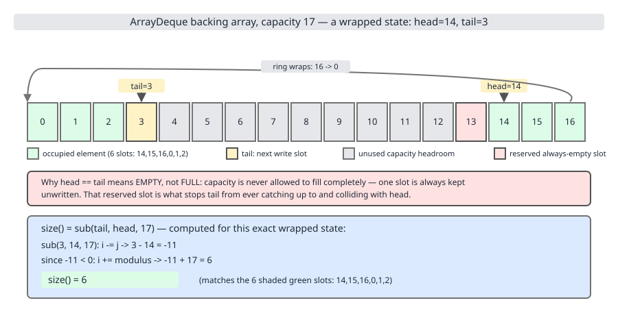
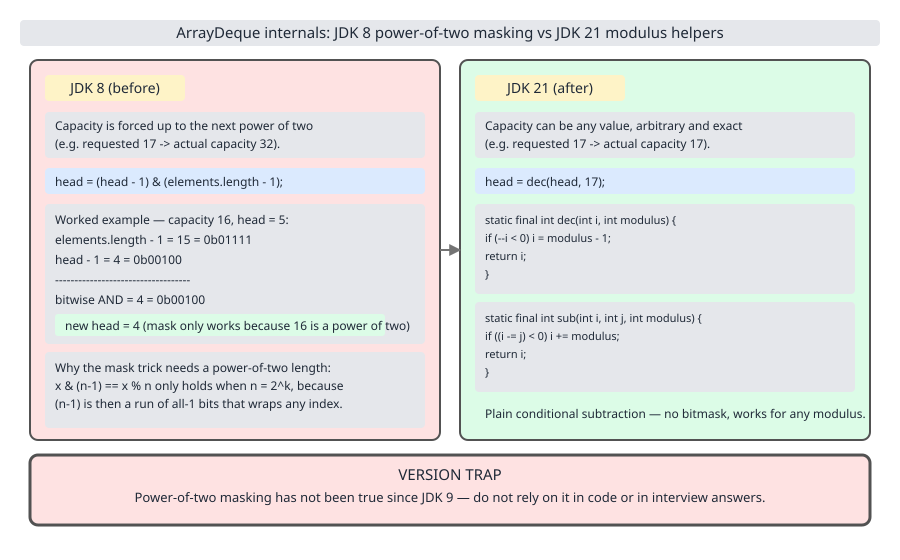
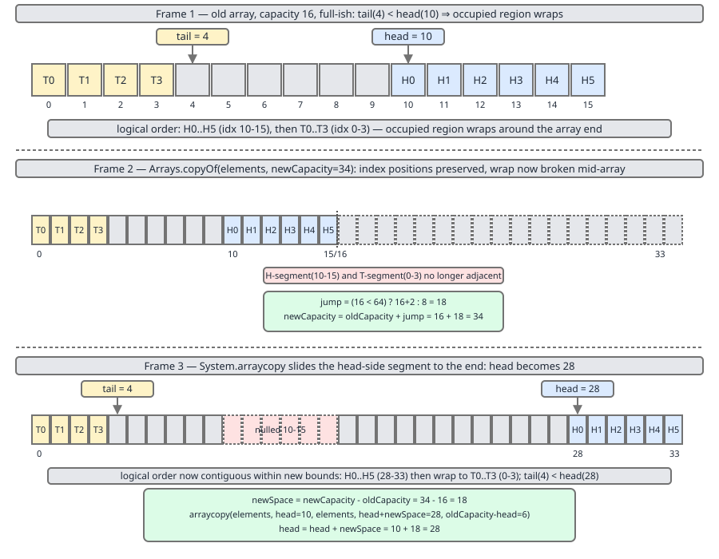

# 02 Java Collections — `ArrayDeque` — INTERNALS (§3.4 `ArrayDeque` source walk)

**Target version: Java 21 LTS.** | [Index](../00-index.md)
Previous: [linked-list/03-build-my-linked-list-b-iterators-and-benchmark.md](../linked-list/03-build-my-linked-list-b-iterators-and-benchmark.md) · Next: [array-deque/02-build-my-array-deque.md](02-build-my-array-deque.md)

`ArrayDeque` is 1,200 lines of source built on three fields and four four-line static helpers. Everything else — the strange nested loops, the null prohibition, the fact that `size()` is arithmetic rather than a counter — falls out of one design decision: store the elements in a circular window of an ordinary array, and keep exactly one slot of that array permanently empty.

Two things this file will correct, because both are repeated everywhere and both have been false since **JDK 9**:

- `ArrayDeque`'s capacity is **not** a power of two, and there is no bitmask.
- The no-arg constructor does **not** allocate 16 slots. It allocates 17.

Everything below is quoted from `java.base/java/util/ArrayDeque.java` in **JDK 21.0.7**, with line numbers, and cross-checked against the JDK 8, 9, 11, 12 and 17 sources of the same file.

---

## The field set

```java
public class ArrayDeque<E> extends AbstractCollection<E>
                           implements Deque<E>, Cloneable, Serializable
```
— `java.base/java/util/ArrayDeque.java`, JDK 21, lines 88–89.

It extends `AbstractCollection`, not `AbstractList`: there is no indexed access to inherit. `Deque` extends `SequencedCollection` in Java 21 (`java.base/java/util/Deque.java`, line 204), which is how `ArrayDeque` acquired `reversed()` without a single line changing in `ArrayDeque` itself.

| Field | Declared as | Line | What it is |
|---|---|---|---|
| `elements` | `transient Object[]` | 109 | The backing array. Capacity is `elements.length`, never a field |
| `head` | `transient int` | 117 | Index of the first element; arbitrary and equal to `tail` when empty |
| `tail` | `transient int` | 124 | Index of the **next write slot**. `elements[tail]` is always `null` |
| `MAX_ARRAY_SIZE` | `private static final int` | 132 | `Integer.MAX_VALUE - 8`, i.e. 2,147,483,639 |

```java
    transient Object[] elements;
    transient int head;
    transient int tail;
```
— lines 109, 117, 124, Javadoc elided. (leaf 3.4.1)

All three are `transient`: serialization writes the *logical* sequence, not the physical array, which is why a deque that has wrapped round the end of its buffer deserializes into a clean, unwrapped one (leaf 3.4.19, below).

There is no `size` field and no `modCount` field. Both are derived.

---

### The circular buffer, and the slot that is deliberately wasted

**Mental model.** Picture a clock face with 17 positions. `head` is the hand pointing at the oldest element; `tail` is the hand pointing at the next free position. Adding to the back advances `tail` clockwise; adding to the front moves `head` anticlockwise. Neither hand ever moves the elements themselves — a deque of a million elements does zero copying per `addFirst` and zero per `addLast`, which is exactly what a `LinkedList` gives you and an `ArrayList` does not.

The awkward part is telling *full* from *empty*. Both states have the two hands on the same number. `ArrayDeque` breaks the tie by refusing to ever be full: **the array always has at least one `null` slot, and it is always at `tail`.** So `head == tail` unambiguously means empty, and a 17-slot array holds at most 16 elements.

**Why it exists.** The alternatives are worse. A separate `size` or `count` field costs 4 bytes on every instance and, more importantly, has to be kept in sync on every mutation, so every method gains a write. A "full" boolean has the same problem. A reserved slot costs one array element — 4 bytes with compressed oops — once per deque, regardless of size, and buys the invariant for free.

**When it matters.** Whenever you reason about capacity. `new ArrayDeque<>(100)` allocates 101 slots and grows on the 101st element, not the 100th. Whenever you read the source, because `head == tail` appears as the empty test and as the *grow* trigger, and the two are told apart only by whether `elements[head]` is null.

**How it works.** The class comment states the invariant directly:

```java
    /**
     * The array in which the elements of the deque are stored.
     * All array cells not holding deque elements are always null.
     * The array always has at least one null slot (at tail).
     */
```
— lines 104–108. (leaf 3.4.2)

Size is then pure arithmetic over the two hands:

```java
    public int size() {
        return sub(tail, head, elements.length);
    }

    public boolean isEmpty() {
        return head == tail;
    }
```
— lines 647–649 and 656–658. (leaf 3.4.15)

`sub(i, j, modulus)` is circular distance: `i - j`, plus the modulus if that went negative. So a deque with `head = 28`, `tail = 9` in a 36-slot array has size `9 - 28 = -19`, `+36 = 17`. Those are real numbers from a measured run; see the grow section.



Look at the shaded slot in the diagram. It is not "the slot after the last element" in any fixed sense — it is wherever `tail` currently points, and it migrates as you push and pop. There is exactly one of it, always.

**Insight:** `size()` is O(1) but it is *arithmetic*, not a field read, and it re-reads `elements.length` from the array header on every call. Hoist it out of a hot loop the way you would hoist `list.size()`; the JIT usually does, but only when it can prove the array reference has not changed.

**Interview:** "Why does `ArrayDeque` waste an array slot?" — Because `head == tail` has to mean one thing, and the cheapest way to make it mean *empty* is to guarantee the deque is never full. The alternative is a size field written on every mutation.

> An `ArrayDeque` is a fixed array used as a circular window, with `head` at the first element, `tail` at the next free slot, and the guarantee that at least one slot is always free — which is what makes `head == tail` mean empty rather than full.

---

### Version trap: the power-of-two mask is gone, and has been since JDK 9

**Mental model.** In Java 8 the array length was forced to a power of two so that wraparound could be a single AND instruction: `(head - 1) & (elements.length - 1)`. In Java 21 the array can be any length at all, and wraparound is a branch: `if (--i < 0) i = modulus - 1`. The JDK traded one bitwise op for one predictable branch and got back the ability to allocate exactly the capacity you asked for.

**Why it changed.** Power-of-two rounding wastes memory in the worst place. A `new ArrayDeque<>(1000)` under Java 8 allocated 1024 slots; `new ArrayDeque<>(1_100_000)` allocated 2,097,152 — nearly twice what you asked for, 4 MB of it dead. And the growth policy was forced to doubling, because anything else breaks the power-of-two property, so a large deque could only ever grow by 100% at a time. Dropping the constraint let JDK 9 adopt the same "double while small, +50% when large" policy `ArrayList` and `PriorityQueue` use.

**When it matters.** Every time you read old material, every time you answer a question about `ArrayDeque` sizing, and any time you are tempted to write `deque.size() & (capacity - 1)` in a reimplementation because a blog told you that is what the JDK does.

**How it works** — the four helpers, verbatim and complete:

```java
    static final int inc(int i, int modulus) {
        if (++i >= modulus) i = 0;
        return i;
    }

    static final int dec(int i, int modulus) {
        if (--i < 0) i = modulus - 1;
        return i;
    }

    static final int inc(int i, int distance, int modulus) {
        if ((i += distance) - modulus >= 0) i -= modulus;
        return i;
    }

    static final int sub(int i, int j, int modulus) {
        if ((i -= j) < 0) i += modulus;
        return i;
    }
```
— lines 216–250. (leaf 3.4.4)

Four methods, one branch each, no division and no modulo operator anywhere. That is the whole point: `%` on a non-constant divisor is an integer division, tens of cycles on most cores; a compare-and-conditional-move is one or two. Each helper carries a precondition in its Javadoc — `0 <= i < modulus` — and each is written so the postcondition holds without a loop, which is only sound because no single step ever moves more than one full lap. The two-argument `inc` and `dec` step by one; the three-argument `inc` requires `0 <= distance <= modulus`; `sub` requires that `i` be logically ahead of `j`, and documents that it disambiguates the `i == j` corner to "empty", returning 0.

Here is the Java 8 code the folklore is describing:

```java
    // JDK 8 only
    private static final int MIN_INITIAL_CAPACITY = 8;

    public void addFirst(E e) {
        if (e == null) throw new NullPointerException();
        elements[head = (head - 1) & (elements.length - 1)] = e;
        if (head == tail) doubleCapacity();
    }

    public int size() {
        return (tail - head) & (elements.length - 1);
    }
```
— `java/util/ArrayDeque.java`, JDK 8u202, lines 118, 232–236 and 589–591.



**Which release changed it, exactly.** Verified by reading the same file across five JDKs:

| JDK | Wraparound | No-arg capacity | Growth |
|---|---|---|---|
| 8u202 | `& (elements.length - 1)`, power of two enforced by `calculateSize` (line 121) | `new Object[16]`, line 192 | `doubleCapacity()`, line 154 — always ×2 |
| 9 | `inc`/`dec`/`sub`, line 217 onwards | `new Object[16]`, line 182 | `grow(int)` with the jump |
| 11.0.27 | `inc`/`dec`/`sub`, line 218 onwards | `new Object[16]`, line 183 | `grow(int)` with the jump |
| 12 | `inc`/`dec`/`sub` | `new Object[16 + 1]` | `grow(int)` with the jump |
| 17.0.15 / 21.0.7 | `inc`/`dec`/`sub`, line 217 / 216 | `new Object[16 + 1]`, line 182 / 181 | `grow(int)` with the jump |

So there were **two** changes, not one. **JDK 9** removed the mask and the power-of-two requirement. **JDK 12** added the `+ 1`: before that, a no-arg deque with the reserved-slot invariant allocated 16 slots and could only hold 15 elements, which contradicted its own Javadoc ("an initial capacity sufficient to hold 16 elements"). (leaf 3.4.3)

**Pitfall:** The wrong belief is "`ArrayDeque` capacity is always a power of two, so you can mask instead of branching." The symptom, if you build on it, is silent corruption: `sub(tail, head, 17)` and `(tail - head) & 16` disagree for almost every input, so a reimplementation that mixes the two designs reports wrong sizes and drops elements. The fix is to pick one design and use it consistently — which is exactly what [row 30](02-build-my-array-deque.md) builds both ways to show.

**Interview:** "How does `ArrayDeque` wrap around?" — In Java 21, with `inc`/`dec`/`sub`, one compare-and-branch each; the power-of-two bitmask is the Java 8 implementation and was removed in JDK 9 so that capacity could be exact and growth could be 1.5× rather than forced doubling.

> Since JDK 9, `ArrayDeque` places no constraint on `elements.length`; circular index arithmetic is done by four branch-based static helpers rather than by masking against `length - 1`.

---

### Capacity 17, and `grow`'s two-phase jump-then-unwrap

**Mental model.** Growing a circular buffer is harder than growing a linear one, because after `Arrays.copyOf` the elements are still in their old positions but the array is longer — and if the sequence was wrapped, the copy has just opened a hole in the middle of it. So `grow` is two steps: allocate and copy, then *slide the head-side segment to the far end* so the logical sequence is contiguous again around the new, larger ring.

**Why it exists.** Because the deque only grows when it is exactly full, and "exactly full" is precisely the state in which the sequence is guaranteed to occupy every slot — which means it is wrapped unless `head` happens to be 0.

**How it works** — the constructors first:

```java
    public ArrayDeque() {
        elements = new Object[16 + 1];
    }

    public ArrayDeque(int numElements) {
        elements =
            new Object[(numElements < 1) ? 1 :
                       (numElements == Integer.MAX_VALUE) ? Integer.MAX_VALUE :
                       numElements + 1];
    }
```
— lines 180–182 and 190–196. (leaves 3.4.5, 3.4.6)

The `+ 1` is the reserved slot, paid for at construction. The two guards handle the ends of the range: `numElements < 1` (including negatives, which `ArrayDeque` does not reject) floors at a 1-slot array, i.e. a deque that holds zero elements and grows on the first `add`; and `numElements == Integer.MAX_VALUE` is special-cased because `Integer.MAX_VALUE + 1` overflows to `Integer.MIN_VALUE` and `new Object[-2147483648]` throws `NegativeArraySizeException` rather than the `OutOfMemoryError` a caller would expect. (leaf 3.4.9, first half)

Measured on JDK 21.0.7, reading `elements.length` reflectively:

```
fresh capacity      = 17
sized ctor (100)    = 101
sized ctor (0)      = 1
sized ctor (1)      = 2
```

Then `grow`:

```java
    private void grow(int needed) {
        // overflow-conscious code
        final int oldCapacity = elements.length;
        int newCapacity;
        // Double capacity if small; else grow by 50%
        int jump = (oldCapacity < 64) ? (oldCapacity + 2) : (oldCapacity >> 1);
        if (jump < needed
            || (newCapacity = (oldCapacity + jump)) - MAX_ARRAY_SIZE > 0)
            newCapacity = newCapacity(needed, jump);
        final Object[] es = elements = Arrays.copyOf(elements, newCapacity);
        // Exceptionally, here tail == head needs to be disambiguated
        if (tail < head || (tail == head && es[head] != null)) {
            // wrap around; slide first leg forward to end of array
            int newSpace = newCapacity - oldCapacity;
            System.arraycopy(es, head,
                             es, head + newSpace,
                             oldCapacity - head);
            for (int i = head, to = (head += newSpace); i < to; i++)
                es[i] = null;
        }
    }
```
— lines 139–159. (leaves 3.4.7, 3.4.8)

Line by line. `jump` is the *growth amount*, not the new capacity: `oldCapacity + 2` below 64, `oldCapacity >> 1` at or above it. The `+ 2` rather than `+ oldCapacity` matters at the small end — from 17 the jump is 19, giving 36, so it is slightly more than doubling for tiny deques, which is deliberate: it gets a 1-slot deque to a useful size in few steps (1 → 4 → 10 → 22 → 46 → 92 → 138). At 64 and above the policy is +50%, the same as `ArrayList` and `PriorityQueue`.

The `if` has two escape clauses. `jump < needed` handles `addAll` of a large collection, where the preferred growth is not enough. `(oldCapacity + jump) - MAX_ARRAY_SIZE > 0` is the overflow-conscious form of `oldCapacity + jump > MAX_ARRAY_SIZE`: written as a subtraction so that it stays correct when the sum has already wrapped negative. Either sends the calculation to `newCapacity(needed, jump)`:

```java
    private int newCapacity(int needed, int jump) {
        final int oldCapacity = elements.length, minCapacity;
        if ((minCapacity = oldCapacity + needed) - MAX_ARRAY_SIZE > 0) {
            if (minCapacity < 0)
                throw new IllegalStateException("Sorry, deque too big");
            return Integer.MAX_VALUE;
        }
        if (needed > jump)
            return minCapacity;
        return (oldCapacity + jump - MAX_ARRAY_SIZE < 0)
            ? oldCapacity + jump
            : MAX_ARRAY_SIZE;
    }
```
— lines 162–174. (leaf 3.4.9)

`MAX_ARRAY_SIZE = Integer.MAX_VALUE - 8` = 2,147,483,639, the eight-word slack some VMs reserve for array headers. Above it, the method returns `Integer.MAX_VALUE` and lets the allocation itself fail with `OutOfMemoryError: Requested array size exceeds VM limit`; only a genuinely negative (overflowed) `minCapacity` produces the `IllegalStateException("Sorry, deque too big")`. `ArrayDeque` predates `ArraysSupport.newLength` and still carries its own copy of this logic, unlike `ArrayList` and `PriorityQueue`, which delegate.

**The un-wrap slide** is the second half of `grow`, and the condition deserves care. `tail < head` is the ordinary wrapped case. The extra clause `tail == head && es[head] != null` exists because `grow` is called from `addFirst`/`addLast` *at the moment the two hands collide* — so the usual "`head == tail` means empty" reading is exactly wrong here, and the code disambiguates by checking whether that slot actually holds an element. The comment on line 149 says so in one line.

Given the wrap, `newSpace = newCapacity - oldCapacity` is the number of slots that just appeared at the end. The head-side leg — the `oldCapacity - head` elements from `head` to the old end — moves forward by exactly `newSpace`, landing flush against the new end. Then the vacated slots are nulled (they must be: every non-element cell is `null`, by invariant), and `head` is advanced by `newSpace` in the same expression that computes the loop bound.



Watch the middle frame: immediately after `copyOf`, the deque is *incorrect* — the logical sequence has a run of nulls in it. The slide is not an optimisation, it is what restores the invariant.

A measured run on JDK 21.0.7, filling a fresh deque from both ends until it wraps and then forcing one grow:

```
wrapped 16 elements = capacity 17, head 9, tail 8
  raw array         = [0, 1, 2, 3, 4, 5, 6, 7, null, -8, -7, -6, -5, -4, -3, -2, -1]
after the grow      = capacity 36, head 28, tail 9
  raw array         = [0, 1, 2, 3, 4, 5, 6, 7, 99, null, null, null, null, null, null, null,
                       null, null, null, null, null, null, null, null, null, null, null, null,
                       -8, -7, -6, -5, -4, -3, -2, -1]
  logical order     = [-8, -7, -6, -5, -4, -3, -2, -1, 0, 1, 2, 3, 4, 5, 6, 7, 99]
```

Read it against the code: `oldCapacity` 17, `jump` = 17 + 2 = 19, `newCapacity` 36, `newSpace` 19, the eight head-side elements at indices 9..16 slide to 28..35, `head` becomes 9 + 19 = 28. Size is `sub(9, 28, 36)` = `9 - 28 = -19`, `+36` = 17. The nineteen nulls in the middle are the new slack, and one of them — index 9 — is the reserved `tail` slot.

> `ArrayDeque.grow` allocates `oldCapacity + jump` where `jump` is `oldCapacity + 2` below capacity 64 and `oldCapacity >> 1` at or above it, then, if the sequence was wrapped, slides the head-side leg to the end of the new array so the ring is contiguous again.

---

### The four primitive operations, and why the traversal loops look wrong

**Mental model.** Every mutator on `ArrayDeque` — `add`, `offer`, `push`, `pop`, `remove`, `poll`, `element`, `peek`, and both `First`/`Last` variants of each — is defined in terms of exactly four methods. The class says so in a comment at line 273: "The main insertion and extraction methods are addFirst, addLast, pollFirst, pollLast. The other methods are defined in terms of these."

```java
    public void addFirst(E e) {
        if (e == null)
            throw new NullPointerException();
        final Object[] es = elements;
        es[head = dec(head, es.length)] = e;
        if (head == tail)
            grow(1);
    }

    public void addLast(E e) {
        if (e == null)
            throw new NullPointerException();
        final Object[] es = elements;
        es[tail] = e;
        if (head == (tail = inc(tail, es.length)))
            grow(1);
    }
```
— lines 283–290 and 300–308. (leaves 3.4.10, 3.4.11)

Note the asymmetry. `addFirst` moves `head` *first*, then writes; `addLast` writes *first*, then moves `tail`. That is forced by what the two indices mean: `head` points at an occupied slot, `tail` at a free one. Both then test `head == tail` and grow — that is, they grow *after* the write, when the buffer has just become full, which is why `grow`'s wrap check needs the `es[head] != null` disambiguation.

`elements` is copied into a local `es` in both. That is not style: reading a field twice forces the JIT to prove no intervening write, and the local makes the array reference obviously loop-invariant. The same pattern is everywhere in this class.

```java
    public E pollFirst() {
        final Object[] es;
        final int h;
        E e = elementAt(es = elements, h = head);
        if (e != null) {
            es[h] = null;
            head = inc(h, es.length);
        }
        return e;
    }

    public E pollLast() {
        final Object[] es;
        final int t;
        E e = elementAt(es = elements, t = dec(tail, es.length));
        if (e != null)
            es[tail = t] = null;
        return e;
    }
```
— lines 375–384 and 386–393. (leaf 3.4.12)

The empty test is `e != null`, not `head == tail`. Reading the slot and checking the value does double duty — it is the emptiness test *and* the value fetch, one array load instead of two. The `es[h] = null` write is mandatory: leaving the reference in place would keep a polled element strongly reachable for as long as the deque lives, the same GC-help nulling `ArrayList.fastRemove` and `LinkedList.unlink` do. `peekFirst`/`peekLast` (lines 416–423) are the same expressions minus the mutation; `getFirst`/`getLast` (lines 397–413) add a `throw new NoSuchElementException()` when the fetch comes back null.

**The two-slice traversal.** Every full walk of the deque — `contains`, `clear`, `toArray`, `forEach`, `removeIf`, `writeObject`, `Itr.forEachRemaining`, the spliterator — is written as this shape:

```java
    public boolean contains(Object o) {
        if (o != null) {
            final Object[] es = elements;
            for (int i = head, end = tail, to = (i <= end) ? end : es.length;
                 ; i = 0, to = end) {
                for (; i < to; i++)
                    if (o.equals(es[i]))
                        return true;
                if (to == end) break;
            }
        }
        return false;
    }
```
— lines 1001–1013. (leaves 3.4.13, 3.4.17)

An outer loop with no condition, an inner loop that is a plain ascending `for`, and a break at the bottom. It runs the inner loop once when the sequence is contiguous (`head <= tail`, so `to == end` immediately) and twice when it is wrapped: first `head`..`length`, then `0`..`tail`. The class comment explains the shape, at lines 92–102:

> Because in a circular array, elements are in general stored in two disjoint such slices, we help the VM by writing unusual nested loops for all traversals over the elements. Having only one hot inner loop body instead of two or three eases human maintenance and encourages VM loop inlining into the caller.

**Insight:** the inner loop is a textbook counted loop over an array with a monotonic index — exactly the shape HotSpot's loop optimiser recognises for range-check elimination, unrolling and vectorisation. Written the obvious way, as two separate loops or as one loop with `i = inc(i, len)` inside, you get either duplicated bodies (bad for inlining budget) or a loop with a data-dependent index (no range-check elimination). The odd nesting is a deliberate compromise: one body, two runs.

`contains` also answers leaf 3.4.17 by construction — it is O(n), there is no index arithmetic to exploit, and `ArrayDeque` is not a `List` and offers no `get(int)` at all. If you need indexed access to a double-ended structure, you want an `ArrayList` with a manual offset, or `ArrayDeque` plus a `toArray()` when you actually need to look inside.

---

## Supporting facts

**Null prohibition (leaf 3.4.14).** `null` is the marker for "this slot holds no element" — the class comment's "All array cells not holding deque elements are always null" is load-bearing. If a stored `null` were legal, `pollFirst`'s `e != null` test could not distinguish "empty deque" from "the first element is null", `nonNullElementAt`'s comodification check would fire on valid data, and `peekFirst()` returning `null` would be ambiguous. So `addFirst`/`addLast` throw `NullPointerException` on entry, with no message:

```
addLast(null)       = NullPointerException, message null
empty peekFirst     = null  (indistinguishable from a stored null)
```

This is a consequence of the representation, not a policy choice — and it is why the `Queue` contract's `poll()`-returns-null idiom works at all. The same reasoning bans nulls from `PriorityQueue`, `ConcurrentLinkedQueue` and the blocking queues; it does not apply to `LinkedList`, which uses a `Node` object rather than a sentinel value and therefore accepts nulls despite implementing `Deque`.

**`nonNullElementAt` (line 266).** The iterator reads slots through this rather than `elementAt`, and throws `ConcurrentModificationException` when it finds a null. `ArrayDeque` has no `modCount`, so this null check *is* its comodification detection — and the Javadoc admits its limits: "This check doesn't catch all possible comodifications, but does catch ones that corrupt traversal." An `ArrayDeque` iterator is therefore weaker than `ArrayList`'s: some concurrent modifications go undetected and simply produce wrong results.

**Why it beats the alternatives (leaf 3.4.16).**

| Use | `ArrayDeque` | The alternative | Why `ArrayDeque` wins |
|---|---|---|---|
| FIFO queue | 4 bytes per element, contiguous | `LinkedList`: 24-byte `Node` per element | 6× the memory and one cache miss per element on traversal; see [D-76](../diagrams/D-76-per-element-memory-arraylist-vs-linkedlist.svg) |
| LIFO stack | unsynchronised, iterates top-down | `Stack`: every method `synchronized`, iterates *bottom-up* | `Stack` pays an uncontended lock per op and its iteration order is the reverse of what a stack means; see [framework/07-legacy-a](../framework/07-legacy-a-vector-stack-hashtable.md) |
| Both ends | O(1) at both, zero allocation | `ArrayList`: `add(0, e)` is O(n) | one `arraycopy` of the whole list per front insert |

The javadoc states it outright: "likely to be faster than `Stack` when used as a stack, and faster than `LinkedList` when used as a queue." The only structural reasons to reach for `LinkedList` instead are that you need nulls, or you need `List` indexing, or you hold `ListIterator`s and insert at the cursor.

**`SequencedCollection` (leaf 3.4.18).** `Deque<E> extends Queue<E>, SequencedCollection<E>` in Java 21, and `Deque.reversed()` is a default method at line 632 of `Deque.java` returning a `ReverseOrderDequeView`. It is a **view**, not a copy: writes through it hit the same array, `reversed().reversed()` returns a deque with the original orientation, and `addFirst` on the view is `addLast` on the source. `ArrayDeque` itself gained the whole `SequencedCollection` surface — `getFirst`, `getLast`, `addFirst`, `addLast`, `removeFirst`, `removeLast`, `reversed()` — without one line of change, because it already had six of the seven. See [sequenced-collections/01](../sequenced-collections/01-sequenced-collections.md).

**`clone` and serialization (leaf 3.4.19).** `clone()` (line 1148) calls `super.clone()` and then `Arrays.copyOf(elements, elements.length)`, so the copy is shallow in the elements but has its own array — and it *preserves* the wrap, because `head` and `tail` come across unchanged from the field-by-field superclass clone. Serialization does the opposite: `writeObject` (line 1172) writes `size()` and then walks the two slices in logical order, and `readObject` (line 1197) allocates `new Object[size + 1]`, fills from index 0 and sets `tail = size`, leaving `head` at 0. **A deserialized `ArrayDeque` is always unwrapped and always sized to exactly `size + 1`** — so round-tripping a deque through serialization is also the cheapest way to trim it. `readObject` routes the length through `SharedSecrets.getJavaObjectInputStreamAccess().checkArray` first, which enforces any `-Djdk.serialFilter` array-size limit before the allocation happens.

**`delete(int i)` (line 605)** is the one genuinely fiddly method: removing from the middle picks whichever side is shorter (`front < back`), shifts it, and returns `true` when the *back* elements moved left. The boolean is not decoration — `DeqIterator.postDelete` reads it and decrements `cursor`, because a left shift has just moved an unvisited element into a slot the cursor already passed. Same problem, and the same class of fix, as `PriorityQueue`'s `forgetMeNot`; see [priority-queue/02](../priority-queue/02-internals-b-traps.md).

**`clear()` (line 1036)** delegates to `circularClear`, nulls every occupied slot in the two-slice pattern, then sets `head = tail = 0`. It does **not** shrink the array. A deque that briefly held a million elements holds a 4 MB `Object[]` for as long as the deque itself is reachable; there is no `trimToSize`.

---

## Pitfalls

### Believing `ArrayDeque` rounds capacity to a power of two

**Wrong**

```java
ArrayDeque<Integer> d = new ArrayDeque<>(1000);
// belief: "capacity is 1024, so I can mask"
int capacity = 1024;
int firstSlot = (someIndex - 1) & (capacity - 1);   // nonsense on JDK 9+
```

Under JDK 21 that deque's `elements.length` is 1001. Masking against 1023 indexes outside the live window, and against 1000 (not a power of two minus one) produces indices that skip and repeat. Under JDK 8 the same construction really did allocate 1024.

**Right**

```java
ArrayDeque<Integer> d = new ArrayDeque<>(1000);
// capacity is exactly 1001: 1000 requested + 1 reserved slot.
// Wraparound is a branch, not a mask:
//     dec(i, modulus) -> if (--i < 0) i = modulus - 1;
```

**Why people believe it:** it was true, in the shipped JDK, for the eleven years between Java 6 (when `ArrayDeque` was introduced) and Java 9. Nearly every blog post, book chapter and Stack Overflow answer about `ArrayDeque` internals was written in that window and has never been revised.

### Expecting `poll()` on an `ArrayDeque` of possibly-null values to work

**Wrong**

```java
Deque<String> d = new ArrayDeque<>();
d.addLast(readOptionalHeader());     // may legitimately return null
```

Output: `java.lang.NullPointerException` at `ArrayDeque.addLast`, with no message and nothing in it naming the deque or the value. The failure is at *insertion*, far from the code that produced the null.

**Right**

```java
Deque<Optional<String>> d = new ArrayDeque<>();
d.addLast(Optional.ofNullable(readOptionalHeader()));
// or, if you must store nulls, LinkedList — which accepts them,
// at the cost of 24 bytes per node and one cache miss per traversal step.
```

**Why people believe it:** `List` implementations mostly accept nulls, `Deque` is in the same package and looks like a list with fewer methods, and the `Queue` javadoc's null prohibition is easy to skim past.

### Assuming `clear()` releases the memory

**Wrong**

```java
ArrayDeque<byte[]> spike = new ArrayDeque<>();
for (int i = 0; i < 1_000_000; i++) spike.addLast(new byte[0]);
spike.clear();
// belief: the deque is now small
```

The elements are collectable, but `elements.length` is still over a million — roughly 4 MB retained, visible in a heap dump as a large `java.lang.Object[]` dominated by the deque.

**Right**

```java
spike = new ArrayDeque<>();   // drop the whole thing; or
spike = new ArrayDeque<>(spike);  // rebuild at exactly size + 1
```

**Why people believe it:** `ArrayList` has the same behaviour but at least offers `trimToSize()`. `ArrayDeque` offers nothing, so the only trim is a reconstruction.

---

## Cheat sheet

| Fact | Value |
|---|---|
| Fields | `Object[] elements`, `int head`, `int tail` — all `transient`; no `size`, no `modCount` |
| `head` / `tail` | first element / **next free slot**; `elements[tail]` is always `null` |
| Empty test | `head == tail` |
| `size()` | `sub(tail, head, elements.length)` — arithmetic, not a field |
| No-arg capacity | **17** (`new Object[16 + 1]`) since JDK 12; 16 in JDK 8–11 |
| `new ArrayDeque<>(n)` | `n + 1` slots; `n < 1` → 1; `n == Integer.MAX_VALUE` → `Integer.MAX_VALUE` |
| Power-of-two capacity | **JDK 8 only.** Removed in JDK 9 |
| Wraparound | `inc`/`dec`/`sub`/`inc(i,distance,m)` — one branch each, no `%` |
| Growth `jump` | `oldCapacity < 64 ? oldCapacity + 2 : oldCapacity >> 1` |
| `MAX_ARRAY_SIZE` | `Integer.MAX_VALUE - 8` = 2,147,483,639 |
| After grow | if `tail < head` (or `tail == head` with a non-null slot), slide the head leg forward by `newCapacity - oldCapacity` |
| Nulls | rejected, `NullPointerException`, because `null` marks an empty slot |
| Comodification | no `modCount`; `nonNullElementAt` throws CME on a null slot — partial detection only |
| Traversal | two disjoint slices, one hot inner loop, for VM loop inlining |
| `contains`, `remove(Object)` | O(n) |
| Indexed access | none — not a `List` |
| Java 21 | `Deque extends SequencedCollection`; `reversed()` is a default returning a write-through view |
| `clear()` | nulls the slots, does not shrink the array; no `trimToSize` |
| Deserialization | always produces an unwrapped array of exactly `size + 1` |

---

## Self-test

**Q1.** `new ArrayDeque<>(16)` — how many elements can it hold before the first `grow`, and what is `elements.length`?

<details><summary>Answer</summary>

`elements.length` is 17, and it holds 16. The constructor allocates `numElements + 1`. The 17th `addLast` writes into the last free slot, advances `tail` onto `head`, sees `head == tail` and calls `grow(1)`. The reserved slot means capacity in the useful sense is always `elements.length - 1`.

</details>

**Q2.** In `grow`, why is the wrap test `tail < head || (tail == head && es[head] != null)` rather than just `tail < head`?

<details><summary>Answer</summary>

Because `grow` is only ever called from `addFirst`/`addLast` at the instant the two hands collide, and a collision at index 0 with `head == 0` gives `tail == head` while the buffer is genuinely full and wrapped-at-zero. Everywhere else in the class `head == tail` means empty; here it means full. The `es[head] != null` check resolves it: an empty deque's `head` slot is null, a full one's is not. The measured run in the grow section hits exactly this case — 17 `addLast` calls end with `head = 0, tail = 0` before the grow and `head = 19` after it.

</details>

**Q3.** Why does `ArrayDeque` reject `null` when `LinkedList`, which also implements `Deque`, accepts it?

<details><summary>Answer</summary>

Representation. `ArrayDeque` stores elements directly in an `Object[]` and uses `null` in a slot to mean "no element here" — that is what makes `pollFirst`'s single `e != null` test both the emptiness check and the value fetch, and what lets the invariant "all cells not holding elements are null" be checked cheaply. A stored `null` would make those indistinguishable. `LinkedList` stores each element inside a `Node` object, so the *presence* of a node is the marker and the `item` field is free to be null.

</details>

**Q4.** A deque with capacity 17 grows. What is the new capacity, and what would it be at capacity 100?

<details><summary>Answer</summary>

From 17: `jump = 17 + 2 = 19` (because 17 < 64), so 36. From 100: `jump = 100 >> 1 = 50`, so 150. The switch is at capacity 64 — below it the policy is "old + 2", slightly more than doubling; at and above it, +50%, the same factor `ArrayList` and `PriorityQueue` use. Neither is a power of two, and neither is required to be.

</details>

**Q5.** Why are all the traversal loops in `ArrayDeque` written as an unconditional outer `for` wrapping an ordinary counted inner `for`?

<details><summary>Answer</summary>

Because the live elements occupy at most two contiguous slices of the array — `head`..`length` and `0`..`tail` — and the shape runs the inner loop once for a contiguous deque and twice for a wrapped one, with a single loop body either way. One body means one inlining cost and one set of loop optimisations; the inner loop's index is monotonic over an array, which is what HotSpot needs for range-check elimination and unrolling. The class comment at lines 92–102 states this as the reason.

</details>

**Q6.** You serialize an `ArrayDeque` that has capacity 1,000,001 and size 3, then deserialize it. What is the capacity of the result?

<details><summary>Answer</summary>

Four. `writeObject` writes `size()` and then the three elements in logical order; `readObject` allocates `new Object[size + 1]`, fills indices 0, 1, 2 and sets `tail = 3`, `head = 0`. The wrap is gone and the slack is gone. Round-tripping is the only trimming mechanism `ArrayDeque` offers, since it has no `trimToSize`.

</details>

**Q7.** `deque.iterator()` is walking, and another thread calls `deque.addFirst(x)`. Does it throw `ConcurrentModificationException`?

<details><summary>Answer</summary>

Sometimes, and that is the honest answer. `ArrayDeque` has no `modCount`, so there is no counter comparison. `DeqIterator.next` reads through `nonNullElementAt`, which throws CME only if the slot it is about to read is `null` — i.e. only when the modification actually corrupted the traversal window. `forEachRemaining` adds a second check, `sub(tail, cursor, es.length) != r`. The Javadoc for `nonNullElementAt` says plainly that this "doesn't catch all possible comodifications". Concurrent use of an `ArrayDeque` can therefore produce silently wrong iteration rather than a clean failure — use `ConcurrentLinkedDeque` or `LinkedBlockingDeque`.

</details>

**Q8.** Someone shows you `head = (head - 1) & (elements.length - 1)` and says it is `ArrayDeque.addFirst`. What do you say?

<details><summary>Answer</summary>

That it is `ArrayDeque.addFirst` in Java 8 — `java/util/ArrayDeque.java`, 8u202, line 234 — and that JDK 9 replaced it with `es[head = dec(head, es.length)] = e`, where `dec` is `if (--i < 0) i = modulus - 1`. The mask required `elements.length` to be a power of two, which forced both capacity rounding (`new ArrayDeque<>(1000)` allocated 1024) and pure doubling on growth. Removing it let capacity be exact and let growth follow the same `< 64 ? +2 : ×1.5` policy as the rest of the JDK's array-backed collections. A second, smaller change landed in JDK 12: the no-arg constructor went from `new Object[16]` to `new Object[16 + 1]`, so that a default deque really does hold 16 elements rather than 15.

</details>

---

**Leaves covered:** 3.4.1–3.4.19 (19 leaves)
**Leaves deferred:** none
**Diagrams included:** D-77, D-78, D-79
**Target version:** Java 21 LTS
**Lines:** 565
