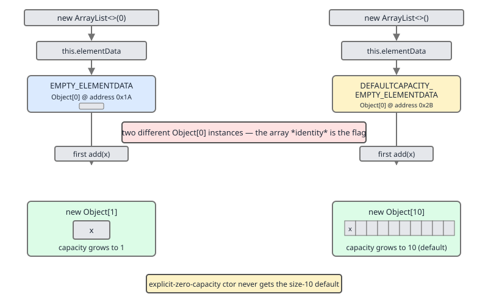
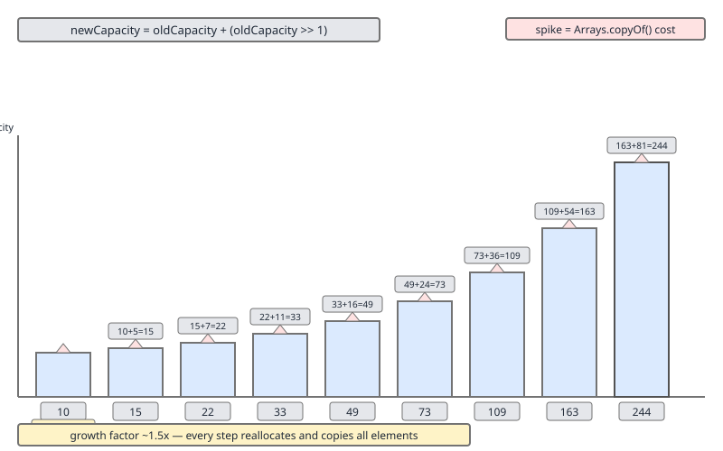

# 02 Java Collections — `ArrayList` — INTERNALS (§3.1 `ArrayList` source walk — constants, empty sentinels and growth)

**Target version: Java 21 LTS.** | [Index](../00-index.md)
Previous: [cost-and-memory/04-observability.md](../cost-and-memory/04-observability.md) · Next: [array-list/02-internals-b-mutation.md](02-internals-b-mutation.md)

An `ArrayList` is three fields and one arithmetic expression. The three fields are an `Object[]`, an `int`, and a `modCount` inherited from `AbstractList`. The arithmetic expression is `oldCapacity + (oldCapacity >> 1)`, wrapped in an overflow-safe helper. Everything people find surprising about `ArrayList` — why an empty list allocates nothing, why `new ArrayList<>(0)` behaves differently from `new ArrayList<>()`, why capacity goes 10, 15, 22 and not 10, 20, 40 — falls out of those two facts plus one deliberate trick with array *identity*.

This file walks the JDK 21 source for the field set and the growth path. Mutation, `System.arraycopy` shifting, and `modCount`/fail-fast live in the next file.

## The field set

| Member | Declared as | Line | What it is |
|---|---|---|---|
| `DEFAULT_CAPACITY` | `private static final int = 10` | 118 | Capacity a default-constructed list inflates to on first `add` |
| `EMPTY_ELEMENTDATA` | `private static final Object[] = {}` | 123 | Shared zero-length array for *explicitly* empty lists |
| `DEFAULTCAPACITY_EMPTY_ELEMENTDATA` | `private static final Object[] = {}` | 130 | Shared zero-length array for *default-constructed* lists |
| `elementData` | `transient Object[]` | 138 | The backing store. **Capacity is `elementData.length`** |
| `size` | `private int` | 145 | Number of live elements. Always `size <= elementData.length` |

All from `java.base/java/util/ArrayList.java`, JDK 21.

```java
    private static final int DEFAULT_CAPACITY = 10;
```
— `java.base/java/util/ArrayList.java`, JDK 21, line 118. (leaf 3.1.1)

```java
    transient Object[] elementData; // non-private to simplify nested class access

    private int size;
```
— same file, lines 138 and 145. (leaf 3.1.4)

Two consequences worth fixing in memory now. **Capacity is not a field.** There is no `capacity` variable and no public `capacity()` method — `elementData.length` *is* the capacity, which is why every observability trick for `ArrayList` capacity goes through reflection or a heap dump. And `elementData` is `transient`: serialization writes `size` plus exactly `size` elements via `writeObject`, so a list with capacity 1_000_000 and size 3 serializes three elements, not a million nulls.

`elementData` is package-private rather than `private` so that `Itr`, `ListItr`, `SubList` and `ArrayList.this`-accessing nested classes reach it without a synthetic accessor method — a real inlining concern, and the same motivation as the split-out `add(E, Object[], int)` helper we meet below.

---

### The two empty-array sentinels, and array identity as a flag

**Mental model.** The JDK needs a default-constructed `ArrayList` to allocate *nothing* until you actually add something, but it also needs to remember, at that first `add`, that you never asked for a specific capacity — so it should jump to 10 rather than to 1. That is one bit of state. Rather than spend an `int` or a `boolean` field on it (and pay 4 or 8 bytes on every instance, forever, on every list in the heap), the JDK encodes the bit in *which* shared empty array the field points at. Two distinct `new Object[0]` objects, identical in every observable way except their addresses, used as a one-bit flag read by `==`.

**Why it exists.** Before Java 7, `new ArrayList<>()` eagerly allocated `new Object[10]`. Applications that create millions of small or never-populated lists — one per row of a result set, one per node of a tree, one per entry of a map — paid 10 references plus an array header each, for lists that often stayed empty. JDK-6989669 made the default constructor lazy. The `DEFAULTCAPACITY_EMPTY_ELEMENTDATA`/`EMPTY_ELEMENTDATA` split arrived with that change, to keep laziness from destroying the "default capacity is 10" behaviour.

**When it matters to you.** Only when you are reading the source, writing something that reflects on `elementData`, or answering an interview question. You cannot observe the difference through the public API — `size()`, `isEmpty()`, `equals`, iteration all behave identically. It becomes visible the instant you add one element.

**How it works** — the declarations and the comment that explains them:

```java
    /**
     * Shared empty array instance used for empty instances.
     */
    private static final Object[] EMPTY_ELEMENTDATA = {};

    /**
     * Shared empty array instance used for default sized empty instances. We
     * distinguish this from EMPTY_ELEMENTDATA to know how much to inflate when
     * first element is added.
     */
    private static final Object[] DEFAULTCAPACITY_EMPTY_ELEMENTDATA = {};
```
— `java.base/java/util/ArrayList.java`, JDK 21, lines 120–130. (leaf 3.1.2)

Both are zero-length. `EMPTY_ELEMENTDATA.equals(DEFAULTCAPACITY_EMPTY_ELEMENTDATA)` is `false` only because arrays use identity equality; `Arrays.equals` on them is `true`. The distinction is **purely identity**, and the code reads it with `==`, never `.equals`.

Which constructor picks which:

```java
    public ArrayList(int initialCapacity) {
        if (initialCapacity > 0) {
            this.elementData = new Object[initialCapacity];
        } else if (initialCapacity == 0) {
            this.elementData = EMPTY_ELEMENTDATA;
        } else {
            throw new IllegalArgumentException("Illegal Capacity: "+
                                               initialCapacity);
        }
    }

    public ArrayList() {
        this.elementData = DEFAULTCAPACITY_EMPTY_ELEMENTDATA;
    }
```
— same file, lines 155–170 (Javadoc elided from the quote; the bodies are verbatim).

The collection constructor at line 178 takes a third path: it adopts `c.toArray()` directly when `c.getClass() == ArrayList.class`, copies via `Arrays.copyOf(a, size, Object[].class)` otherwise, and falls back to `EMPTY_ELEMENTDATA` — *not* the default-capacity sentinel — when `c` is empty. So `new ArrayList<>(List.of())` behaves like `new ArrayList<>(0)`, growing to 1 on first add, not to 10.



Look at the two arrows in the diagram: they land on two different heap objects that are byte-for-byte identical. The `==` test in `grow` is the only thing that tells them apart.

The read side is `grow(int)`, line 231:

```java
    private Object[] grow(int minCapacity) {
        int oldCapacity = elementData.length;
        if (oldCapacity > 0 || elementData != DEFAULTCAPACITY_EMPTY_ELEMENTDATA) {
            int newCapacity = ArraysSupport.newLength(oldCapacity,
                    minCapacity - oldCapacity, /* minimum growth */
                    oldCapacity >> 1           /* preferred growth */);
            return elementData = Arrays.copyOf(elementData, newCapacity);
        } else {
            return elementData = new Object[Math.max(DEFAULT_CAPACITY, minCapacity)];
        }
    }
```
— `java.base/java/util/ArrayList.java`, JDK 21, line 231. (leaf 3.1.5)

The `else` branch is reached only when `oldCapacity == 0` **and** the identity check says this is a default-constructed list. That is the whole payoff: `new ArrayList<>()` takes the `else` and lands on `Math.max(10, 1) == 10`; `new ArrayList<>(0)` fails the identity check, takes the `if`, and computes `newLength(0, 1, 0)`. (leaf 3.1.3)

`ensureCapacity` reads the same flag, at line 215, to avoid a pointless allocation:

```java
    public void ensureCapacity(int minCapacity) {
        if (minCapacity > elementData.length
            && !(elementData == DEFAULTCAPACITY_EMPTY_ELEMENTDATA
                 && minCapacity <= DEFAULT_CAPACITY)) {
            modCount++;
            grow(minCapacity);
        }
    }
```

`new ArrayList<>().ensureCapacity(7)` therefore allocates nothing — the list is going to get 10 anyway on first add, so pre-allocating 7 would be strictly worse.

**Runnable proof** that the two paths diverge (needs `--add-opens java.base/java.util=ALL-UNNAMED`):

```java
import java.lang.reflect.Field;
import java.util.ArrayList;
import java.util.List;

public class SentinelProof {

    private static final Field ELEMENT_DATA;

    static {
        try {
            ELEMENT_DATA = ArrayList.class.getDeclaredField("elementData");
            ELEMENT_DATA.setAccessible(true);
        } catch (ReflectiveOperationException e) {
            throw new ExceptionInInitializerError(e);
        }
    }

    static int capacity(ArrayList<?> list) {
        try {
            return ((Object[]) ELEMENT_DATA.get(list)).length;
        } catch (IllegalAccessException e) {
            throw new AssertionError(e);
        }
    }

    public static void main(String[] args) {
        var defaultList = new ArrayList<String>();
        var zeroList = new ArrayList<String>(0);
        var fromEmpty = new ArrayList<String>(List.of());

        System.out.println("before add: default=" + capacity(defaultList)
                + " zero=" + capacity(zeroList)
                + " fromEmpty=" + capacity(fromEmpty));

        defaultList.add("a");
        zeroList.add("a");
        fromEmpty.add("a");

        System.out.println("after add:  default=" + capacity(defaultList)
                + " zero=" + capacity(zeroList)
                + " fromEmpty=" + capacity(fromEmpty));
    }
}
```

Output on JDK 21.0.7:

```
before add: default=0 zero=0 fromEmpty=0
after add:  default=10 zero=1 fromEmpty=1
```

**Insight:** `new ArrayList<>(0)` is not a micro-optimisation of `new ArrayList<>()`. Both allocate zero bytes of backing array up front, so the "saving" is nil; what you actually buy is a growth sequence starting at 1 — capacity stepping 1, 2, 3, 4, 6, 9, 13 (verified on JDK 21: adding eight elements to `new ArrayList<>(0)` walks 1, 2, 3, 4, 6, 9). Six `Arrays.copyOf` calls to reach nine elements, where the default list would have done zero.

**Pitfall:** "an empty `ArrayList` wastes 10 slots." False since Java 7. `new ArrayList<>()` holds a reference to a shared, static, zero-length array. A million empty default lists share one array object between them.

> The two zero-length sentinels are the same value at different addresses, and `grow` reads the address, not the value, to decide whether first-add inflation goes to `DEFAULT_CAPACITY` or to exactly what was asked for.

---

### `grow` and `ArraysSupport.newLength`

**Mental model.** `grow` does not compute a new capacity. It states a *request* — "I currently have `oldCapacity`; I need at least this much more; I'd prefer half again as much" — and hands it to a shared, overflow-safe arithmetic helper. Preference wins when it is bigger and fits; need wins otherwise. That single `Math.max` is why the whole thing never gets stuck.

**Why it exists.** Growth arithmetic near `Integer.MAX_VALUE` is where hand-rolled resize code goes wrong: `oldCapacity * 2` silently goes negative, `newCapacity - minCapacity <= 0` comparisons need to be written overflow-consciously, and every collection in the JDK reimplemented the same subtle logic. `ArraysSupport.newLength` centralises it once for `ArrayList`, `ArrayDeque`, `StringBuilder`/`AbstractStringBuilder`, `Vector`, the `java.io` byte streams, and more.

**Version trap.** This delegation is *not* how older JDKs looked. In JDK 11, `ArrayList` carried its own `private static final int MAX_ARRAY_SIZE = Integer.MAX_VALUE - 8;` (line 228) and its own `newCapacity(int)`/`hugeCapacity(int)` pair which inlined the arithmetic (`java.base/java/util/ArrayList.java`, JDK 11.0.27, lines 228–276). By JDK 17 those were gone and `grow` delegates to `ArraysSupport.newLength` exactly as in JDK 21 (`java.base/java/util/ArrayList.java`, JDK 17.0.15, line 234). If an interviewer asks you to name `MAX_ARRAY_SIZE`, they are quoting a pre-17 `ArrayList`; the equivalent today is `jdk.internal.util.ArraysSupport.SOFT_MAX_ARRAY_LENGTH`, and it is not in `ArrayList` at all.

**When it applies.** Every capacity-increasing path: `add(E)`, `add(int, E)`, `addAll`, `ensureCapacity`, and deserialization.

**How it works.** The trigger is the split-out add helper:

```java
    private void add(E e, Object[] elementData, int s) {
        if (s == elementData.length)
            elementData = grow();
        elementData[s] = e;
        size = s + 1;
    }

    public boolean add(E e) {
        modCount++;
        add(e, elementData, size);
        return true;
    }
```
— `java.base/java/util/ArrayList.java`, JDK 21, lines 481 and 494. The split exists, per the comment at line 475, "to keep method bytecode size under 35 (the `-XX:MaxInlineSize` default value)".

`grow()` with no argument, line 243, is just `return grow(size + 1);` — the append case always asks for exactly one more slot as its *minimum*.

Then the helper:

```java
    public static int newLength(int oldLength, int minGrowth, int prefGrowth) {
        // preconditions not checked because of inlining
        // assert oldLength >= 0
        // assert minGrowth > 0

        int prefLength = oldLength + Math.max(minGrowth, prefGrowth); // might overflow
        if (0 < prefLength && prefLength <= SOFT_MAX_ARRAY_LENGTH) {
            return prefLength;
        } else {
            // put code cold in a separate method
            return hugeLength(oldLength, minGrowth);
        }
    }
```
— `java.base/jdk/internal/util/ArraysSupport.java`, JDK 21, line 735. (leaf 3.1.6)

Three moving parts. `Math.max(minGrowth, prefGrowth)` — preference is a floor-raised suggestion, never a cap. The `0 < prefLength` guard catches signed overflow, since `oldLength + growth` going negative is exactly the wrap case. And the cold path is a separate method so the hot path stays small enough for the JIT to inline.

**The capacity-1 trap.** `oldCapacity >> 1` is integer division by two, rounding toward zero. At `oldCapacity == 1` that is `0`, and at `oldCapacity == 0` it is also `0`. If `grow` used `oldCapacity + (oldCapacity >> 1)` directly, a list at capacity 1 would compute a new capacity of 1 and never grow — an infinite loop or an `ArrayIndexOutOfBoundsException`. `Math.max(minGrowth, prefGrowth)` inside `newLength` is what rescues it: `newLength(1, 1, 0)` gives `1 + max(1, 0) == 2`. Likewise `newLength(0, 1, 0)` gives `1`, which is exactly what `new ArrayList<>(0)` grows to on its first add. (leaf 3.1.9)

Tracing the small capacities by hand, and confirmed empirically on JDK 21.0.7:

| `oldCapacity` | `minGrowth` | `prefGrowth = oldCapacity >> 1` | `max` | new capacity |
|---|---|---|---|---|
| 0 | 1 | 0 | 1 | 1 |
| 1 | 1 | 0 | 1 | 2 |
| 2 | 1 | 1 | 1 | 3 |
| 3 | 1 | 1 | 1 | 4 |
| 4 | 1 | 2 | 2 | 6 |
| 6 | 1 | 3 | 3 | 9 |
| 9 | 1 | 4 | 4 | 13 |

Below capacity 4, growth is +1 per resize — the 1.5x factor does not take hold until the preferred growth exceeds the minimum.

**`addAll` jumps straight to the required size.** `addAll(Collection)` at line 751:

```java
    public boolean addAll(Collection<? extends E> c) {
        Object[] a = c.toArray();
        modCount++;
        int numNew = a.length;
        if (numNew == 0)
            return false;
        Object[] elementData;
        final int s;
        if (numNew > (elementData = this.elementData).length - (s = size))
            elementData = grow(s + numNew);
        System.arraycopy(a, 0, elementData, s, numNew);
        size = s + numNew;
        return true;
    }
```

Here `minGrowth = (s + numNew) - oldCapacity` is large, so `Math.max(minGrowth, oldCapacity >> 1)` picks `minGrowth` and the list resizes exactly once, to exactly `size + numNew` — no 1.5x headroom at all. Verified: a list holding one element (capacity 10) after `addAll` of a 1000-element collection has capacity **1001**, not 1500 and not 1024. (leaf 3.1.10)

**Insight:** that is a genuine trade-off, not a bug. A bulk add resizes once, so amortisation has nothing to amortise; adding slack would be pure waste for the common load-once-then-read pattern. The cost is that a bulk add followed by a stream of single adds resizes immediately on the very next `add`.

**Interview:** "How many array copies does `new ArrayList<>()` do to reach 1000 elements?" Count the growth sequence past 1000 — 10, 15, 22, 33, 49, 73, 109, 163, 244, 366, 549, 823, 1234 — twelve `Arrays.copyOf` calls after the initial allocation. `new ArrayList<>(1000)` does zero.

> `grow` never decides a capacity itself; it declares a minimum need and a preferred need to `ArraysSupport.newLength`, which takes the larger, verifies it did not overflow, and clamps it against the soft array-length maximum.

---

### `SOFT_MAX_ARRAY_LENGTH` and `hugeLength`

**Mental model.** HotSpot cannot allocate an array of length `Integer.MAX_VALUE`; the array header eats a few words and the request fails with `OutOfMemoryError: Requested array size exceeds VM limit` even on a huge heap. `SOFT_MAX_ARRAY_LENGTH` is a conservative under-estimate of that limit that the JDK aims for. It is **soft** because it is a target for *speculative* growth only — if you genuinely require more, `newLength` will hand you more and let the VM be the one to say no.

**Why it exists.** The VM limit is implementation-specific and depends on the object header size, so no portable constant can be exactly right. Rather than guess low and cap users out of legitimately allocatable arrays, the JDK guesses low for the *preferred* size and passes the *required* size through untouched.

**How it works:**

```java
    public static final int SOFT_MAX_ARRAY_LENGTH = Integer.MAX_VALUE - 8;
```
— `java.base/jdk/internal/util/ArraysSupport.java`, JDK 21, line 692. That is 2_147_483_639. The Javadoc at lines 680–691 spells out the reason: some JVMs "have an implementation limit that will cause `OutOfMemoryError("Requested array size exceeds VM limit")` … even if there is sufficient heap available", and "the soft maximum value is chosen conservatively so as to be smaller than any implementation limit that is likely to be encountered."

```java
    private static int hugeLength(int oldLength, int minGrowth) {
        int minLength = oldLength + minGrowth;
        if (minLength < 0) { // overflow
            throw new OutOfMemoryError(
                "Required array length " + oldLength + " + " + minGrowth + " is too large");
        } else if (minLength <= SOFT_MAX_ARRAY_LENGTH) {
            return SOFT_MAX_ARRAY_LENGTH;
        } else {
            return minLength;
        }
    }
```
— same file, line 749. (leaf 3.1.7)

Read the three branches as a policy statement:

| Situation | `hugeLength` returns | Meaning |
|---|---|---|
| `oldLength + minGrowth` overflows `int` | throws `OutOfMemoryError` | The request is unrepresentable. The only hard failure. |
| Required length ≤ 2_147_483_639 | `SOFT_MAX_ARRAY_LENGTH` | Preferred 1.5x overshot the soft max; clamp to it, you still get room. |
| Required length > 2_147_483_639 | `minLength` (up to `Integer.MAX_VALUE`) | You asked for more than the soft max. You get it. Soft. |

So the soft max is a ceiling on *ambition*, never on *need*. The Javadoc is explicit: "the soft maximum will be exceeded if the minimum growth amount requires it", and the method "may compute and return a length value up to and including `Integer.MAX_VALUE` that might exceed the JVM's implementation limit. In that case, the caller will likely attempt an array allocation with that length and encounter an `OutOfMemoryError`."

**Pitfall:** treating `Integer.MAX_VALUE - 8` as `ArrayList`'s maximum size. It is not a maximum; it is a growth target, and it is not `ArrayList`'s constant at all in JDK 17+. An `ArrayList` can reach `Integer.MAX_VALUE` elements if the VM and heap allow. It can never exceed that, because `size` is an `int` and `elementData` is a Java array.

**Interview:** "What happens when an `ArrayList` grows past two billion elements?" The 1.5x preferred length overflows or exceeds the soft max, `newLength` falls into `hugeLength`, and you get either `SOFT_MAX_ARRAY_LENGTH`, or your exact required length, or `OutOfMemoryError("Required array length …  is too large")` if the required length itself overflows `int`.

> `SOFT_MAX_ARRAY_LENGTH` is `Integer.MAX_VALUE - 8`: a conservative ceiling on speculative growth that `hugeLength` will knowingly exceed when the caller's minimum requirement demands it, throwing `OutOfMemoryError` only on genuine `int` overflow.

---

### The 1.5x growth sequence

**Mental model.** Each resize allocates a new array 50% larger and copies everything across. The copy is O(n), but n grows geometrically, so the *total* copying work across n appends is a convergent geometric series — 3n element copies, bounded — which is what makes `add` amortised O(1). The 1.5 factor is the JDK's chosen point on the space/copy-count trade-off.

**Why 1.5 and not 2.** Doubling copies less often but wastes up to 50% of the allocated array and, critically, can never reuse previously freed blocks: with a factor of 2, the sum of all previously freed arrays (1 + 2 + 4 + … + 2^(k-1) = 2^k − 1) is always smaller than the next request (2^(k+1)), so the allocator must reach for fresh memory every time. With 1.5, freed blocks eventually coalesce into a hole big enough for a later request. 1.5 also keeps peak transient footprint at 2.5x rather than 3x during the copy, when old and new arrays are both live.

**When to bypass it entirely.** If you know the final size, pass it to the constructor. `new ArrayList<>(expectedSize)` does one allocation and zero copies. Sizing matters most for large lists built in a hot loop; for a list of five it is noise.

**How it works** — the sequence from the default, computed step by step as `next = old + (old >> 1)`:

| Step | Old capacity | `old >> 1` | New capacity | Elements copied by this resize |
|---|---|---|---|---|
| 0 | — | — | 10 (fresh allocation, no copy) | 0 |
| 1 | 10 | 5 | 15 | 10 |
| 2 | 15 | 7 | 22 | 15 |
| 3 | 22 | 11 | 33 | 22 |
| 4 | 33 | 16 | 49 | 33 |
| 5 | 49 | 24 | 73 | 49 |
| 6 | 73 | 36 | 109 | 73 |
| 7 | 109 | 54 | 163 | 109 |
| 8 | 163 | 81 | 244 | 163 |

10 → 15 → 22 → 33 → 49 → 73 → 109 → 163 → 244. (leaf 3.1.8) Note where the rounding bites: 15 >> 1 is 7, not 7.5, so 15 → 22 rather than 22.5; 73 >> 1 is 36, so 73 → 109. The effective factor is slightly *under* 1.5 at every odd capacity. Verified empirically on JDK 21.0.7 by reflecting on `elementData.length` while appending: `10 15 22 33 49 73 109 163 244 366`.



The spikes in the diagram are the `Arrays.copyOf` calls. They get taller and rarer; the area under them is what "amortised O(1)" is measuring.

**Version trap — "`ArrayList` doubles".** It does not, and never has in any released JDK. Java 8's `ArrayList.grow` computed `int newCapacity = oldCapacity + (oldCapacity >> 1);` — the same 1.5x. What people are remembering is **`Vector`**, whose growth policy is genuinely doubling: `Vector.grow` uses `capacityIncrement > 0 ? capacityIncrement : oldCapacity` as its preferred growth, so with the default `capacityIncrement == 0` it grows by `oldCapacity`, i.e. 2x. `Hashtable` (3x + 1) and `HashMap` (2x, but that is a bucket-count power-of-two constraint, not an amortisation choice) contribute to the confusion. If you say "`ArrayList` doubles" in an interview you are quoting `Vector`.

**Runnable measurement** of the sequence and of the copy cost:

```java
import java.lang.reflect.Field;
import java.util.ArrayList;

public class GrowthTrace {

    public static void main(String[] args) throws Exception {
        Field f = ArrayList.class.getDeclaredField("elementData");
        f.setAccessible(true);

        var list = new ArrayList<Integer>();
        int lastCapacity = -1;
        long totalCopied = 0;
        var steps = new StringBuilder();

        for (int i = 0; i < 300; i++) {
            list.add(i);
            int capacity = ((Object[]) f.get(list)).length;
            if (capacity != lastCapacity) {
                if (lastCapacity > 0) {
                    totalCopied += lastCapacity;
                }
                steps.append(capacity).append(' ');
                lastCapacity = capacity;
            }
        }

        System.out.println("capacities: " + steps.toString().trim());
        System.out.println("elements copied by resizes for 300 adds: " + totalCopied);
    }
}
```

Run with `--add-opens java.base/java.util=ALL-UNNAMED`. On JDK 21.0.7 it prints `capacities: 10 15 22 33 49 73 109 163 244 366` and `elements copied by resizes for 300 adds: 718` — 2.4 copies per element inserted, comfortably inside the geometric-series bound of 3.

**Insight:** the amortised cost is bounded by `factor / (factor - 1)` copies per element. At 1.5 that is 3; at 2.0 it is 2. Doubling copies *less*, not more. The JDK trades a third more copying for materially better allocator behaviour and lower peak footprint.

> `ArrayList` grows by `oldCapacity + (oldCapacity >> 1)` — a nominal 1.5x, rounded down at odd capacities — giving the sequence 10, 15, 22, 33, 49, 73, 109, 163, 244 from the default, and amortised O(1) `add` at roughly three element copies per element added.

---

## Pitfalls

### Believing `ArrayList` doubles its capacity

**Wrong**

```java
var list = new ArrayList<Integer>();
for (int i = 0; i < 20; i++) list.add(i);
// Belief: capacity walked 10 -> 20, and is now exactly 20.
```

Reflecting on `elementData.length` after those 20 adds prints **22**, not 20. The walk was 10 → 15 → 22.

**Right**

```java
// The real rule, from ArrayList.grow via ArraysSupport.newLength:
int newCapacity = oldCapacity + Math.max(minGrowth, oldCapacity >> 1);
// 10 -> 15 -> 22 -> 33 -> 49 -> 73 -> 109 -> 163 -> 244
```

**Why people believe it:** `Vector` really does double (its preferred growth is `oldCapacity` when `capacityIncrement` is 0), `HashMap` really does double its bucket table, and textbook treatments of amortised analysis always use 2 because the arithmetic is cleaner. `ArrayList` is the odd one out.

### Reaching for `new ArrayList<>(0)` to "save memory"

**Wrong**

```java
// Belief: this is the lean version of new ArrayList<>().
var lean = new ArrayList<String>(0);
for (String s : someTenItemSource) lean.add(s);
```

Both constructors allocate zero backing-array bytes. But `lean` grows 1, 2, 3, 4, 6, 9, 13 — seven `Arrays.copyOf` calls to hold ten items, where the default list does none.

**Right**

```java
var list = new ArrayList<String>();          // free until first add, then jumps to 10
var sized = new ArrayList<String>(10);       // one allocation, zero copies, if you know the size
```

**Why people believe it:** the pre-Java-7 behaviour, where `new ArrayList<>()` really did eagerly allocate `new Object[10]`. That has not been true since JDK-6989669.

### Quoting `MAX_ARRAY_SIZE` as an `ArrayList` field

**Wrong**

```java
// "ArrayList caps out at ArrayList.MAX_ARRAY_SIZE, which is Integer.MAX_VALUE - 8."
```

There is no such field in JDK 17 or JDK 21 `ArrayList`, and it was never a cap — it was a growth target.

**Right**

```java
// jdk.internal.util.ArraysSupport, JDK 21, line 692:
public static final int SOFT_MAX_ARRAY_LENGTH = Integer.MAX_VALUE - 8;
// "Soft": hugeLength returns minLength above it when the caller genuinely needs more.
```

**Why people believe it:** `MAX_ARRAY_SIZE` was a real `private static final int` in `ArrayList` up to and including JDK 11 (`java.base/java/util/ArrayList.java`, JDK 11.0.27, line 228), and the JDK 11 Javadoc's "Attempts to allocate larger arrays may result in `OutOfMemoryError`" reads like a hard cap.

### Expecting `addAll` to leave 1.5x headroom

**Wrong**

```java
var list = new ArrayList<Integer>();
list.add(1);                                            // capacity 10
list.addAll(IntStream.range(0, 1000).boxed().toList()); // expected 1500 or 1024
```

Actual capacity: **1001**. `minGrowth` (992) beats `prefGrowth` (5), so `Math.max` picks the exact requirement.

**Right**

```java
var list = new ArrayList<Integer>(1024);   // ask for the headroom explicitly if you want it
list.add(1);
list.addAll(IntStream.range(0, 1000).boxed().toList());  // still 1024, no resize at all
```

**Why people believe it:** the 1.5x rule is taught as unconditional. It is only the *preferred* growth, and preferred loses to required.

## Cheat sheet

| Item | Value / expression | Source |
|---|---|---|
| `DEFAULT_CAPACITY` | `10` | `ArrayList.java` L118 |
| `EMPTY_ELEMENTDATA` | `{}` — for `new ArrayList<>(0)` and empty-collection ctor | L123 |
| `DEFAULTCAPACITY_EMPTY_ELEMENTDATA` | `{}` — for `new ArrayList<>()` | L130 |
| Capacity | `elementData.length` (no field, no accessor) | L138 |
| `grow(minCapacity)` | `newLength(oldCap, minCapacity - oldCap, oldCap >> 1)` | L231 |
| `grow()` | `grow(size + 1)` | L243 |
| First-add inflation, default ctor | `Math.max(DEFAULT_CAPACITY, minCapacity)` → 10 | L231 else-branch |
| First-add inflation, `new ArrayList<>(0)` | `newLength(0, 1, 0)` → **1** | — |
| `newLength` core | `oldLength + Math.max(minGrowth, prefGrowth)` | `ArraysSupport.java` L735 |
| `SOFT_MAX_ARRAY_LENGTH` | `Integer.MAX_VALUE - 8` = 2_147_483_639 | `ArraysSupport.java` L692 |
| `hugeLength` | OOME on overflow; else `max(SOFT_MAX, minLength)` | `ArraysSupport.java` L749 |
| Default growth sequence | 10, 15, 22, 33, 49, 73, 109, 163, 244 | computed |
| `new ArrayList<>(0)` sequence | 1, 2, 3, 4, 6, 9, 13 | computed |
| `addAll` growth | exactly `size + numNew`, no headroom | `ArrayList.java` L751 |
| Amortised copies per element | ~3 (`f/(f-1)` at f = 1.5) | — |
| **Not** the policy | 2x — that is `Vector` | — |
| Pre-JDK-17 form | `ArrayList.MAX_ARRAY_SIZE` + inline `newCapacity`/`hugeCapacity` | JDK 11 L228–276 |

## Self-test

**Q1.** Both empty sentinels are zero-length `Object[]`. What operation distinguishes them, and where?

<details><summary>Answer</summary>

Reference identity, via `==`, in exactly two places: `grow(int)` at line 231 (`elementData != DEFAULTCAPACITY_EMPTY_ELEMENTDATA`) and `ensureCapacity(int)` at line 215 (`elementData == DEFAULTCAPACITY_EMPTY_ELEMENTDATA`). Nothing about their *contents* differs — `Arrays.equals` on them returns `true`. The JDK is using object identity as a one-bit field it did not want to pay for on every instance.

</details>

**Q2.** What capacity does `new ArrayList<>(0)` have after one `add`? Trace it.

<details><summary>Answer</summary>

**1.** The constructor set `elementData = EMPTY_ELEMENTDATA`, so `oldCapacity == 0` but the identity check `elementData != DEFAULTCAPACITY_EMPTY_ELEMENTDATA` is true, and `grow` takes the `if` branch. It calls `newLength(0, 1 - 0, 0 >> 1)` = `newLength(0, 1, 0)`, which computes `prefLength = 0 + Math.max(1, 0) = 1`. That is in `(0, SOFT_MAX_ARRAY_LENGTH]`, so 1 is returned. `new ArrayList<>()` under the same single add gets 10, from the `else` branch's `Math.max(DEFAULT_CAPACITY, 1)`.

</details>

**Q3.** `oldCapacity >> 1` is 0 when `oldCapacity` is 1. Why does a capacity-1 list still grow?

<details><summary>Answer</summary>

Because `grow` passes `oldCapacity >> 1` as the *preferred* growth, not the actual growth, and `newLength` computes `oldLength + Math.max(minGrowth, prefGrowth)`. With `oldLength == 1`, `minGrowth == 1`, `prefGrowth == 0`, the `Math.max` picks 1 and the new capacity is 2. Had `grow` used `oldCapacity + (oldCapacity >> 1)` directly it would have returned 1 again — no growth, and an infinite loop or an out-of-bounds write.

</details>

**Q4.** Why is `SOFT_MAX_ARRAY_LENGTH` called *soft*?

<details><summary>Answer</summary>

Because `hugeLength` will return a value above it. It clamps only *speculative* growth: if `oldLength + minGrowth` exceeds `SOFT_MAX_ARRAY_LENGTH`, `hugeLength` returns `minLength` (up to `Integer.MAX_VALUE`) rather than refusing. It throws `OutOfMemoryError` only when `oldLength + minGrowth` overflows `int` and goes negative. The constant is a conservative under-estimate of a JVM-implementation array-length limit that no portable constant can name exactly.

</details>

**Q5.** A list built with `new ArrayList<>()` has just received its 250th element. How many times has `Arrays.copyOf` run?

<details><summary>Answer</summary>

Nine. The initial allocation to 10 is a `new Object[10]`, not a copy. Then 10 → 15, 15 → 22, 22 → 33, 33 → 49, 49 → 73, 73 → 109, 109 → 163, 163 → 244, 244 → 366: nine `Arrays.copyOf` calls, and the list sits at capacity 366 holding 250 elements.

</details>

**Q6.** Your service does `list.addAll(bigCollection)` on a fresh `ArrayList`. How much slack capacity does it end up with?

<details><summary>Answer</summary>

None. `addAll` calls `grow(s + numNew)`, so `minGrowth = s + numNew - oldCapacity` swamps `prefGrowth = oldCapacity >> 1`, `Math.max` picks the minimum, and capacity lands on exactly `size + numNew`. Measured on JDK 21: a list at capacity 10 holding one element, after `addAll` of 1000 elements, has capacity 1001. The very next single `add` triggers another resize.

</details>

**Q7.** What did `ArrayList.grow` look like in JDK 11, and what replaced it?

<details><summary>Answer</summary>

JDK 11's `grow(int)` (line 237) delegated to a private `newCapacity(int)` that inlined `int newCapacity = oldCapacity + (oldCapacity >> 1);`, checked it against a private `MAX_ARRAY_SIZE = Integer.MAX_VALUE - 8` (line 228), and fell back to a private `hugeCapacity(int)` returning `Integer.MAX_VALUE` or `MAX_ARRAY_SIZE`. By JDK 17 all three were gone, replaced by a call to the shared `jdk.internal.util.ArraysSupport.newLength(oldCapacity, minCapacity - oldCapacity, oldCapacity >> 1)`. The observable growth policy is unchanged — 1.5x either way; the overflow handling is now centralised and shared with `ArrayDeque`, `AbstractStringBuilder`, `Vector` and the `java.io` streams.

</details>

**Q8.** Someone claims doubling would make `add` cheaper. Are they right, and what is the counter-argument?

<details><summary>Answer</summary>

On copy count, yes: amortised copies per element are `f/(f-1)`, so 2 at a factor of 2 versus 3 at 1.5. Doubling copies a third less. The counter-arguments are allocator behaviour and peak footprint. With factor 2 the sum of all previously freed arrays is always one short of the next request, so freed blocks can never be reused for a later growth; at 1.5 they eventually coalesce into a usable hole. And during the copy both arrays are live, so peak transient footprint is 2.5x the old array at factor 1.5 versus 3x at factor 2. The JDK chose the memory side of the trade.

</details>

---

**Leaves covered:** 3.1.1, 3.1.2, 3.1.3, 3.1.4, 3.1.5, 3.1.6, 3.1.7, 3.1.8, 3.1.9, 3.1.10 (10 leaves)
**Leaves deferred:** none
**Diagrams included:** D-64, D-65
**Target version:** Java 21 LTS
**Lines:** 586
