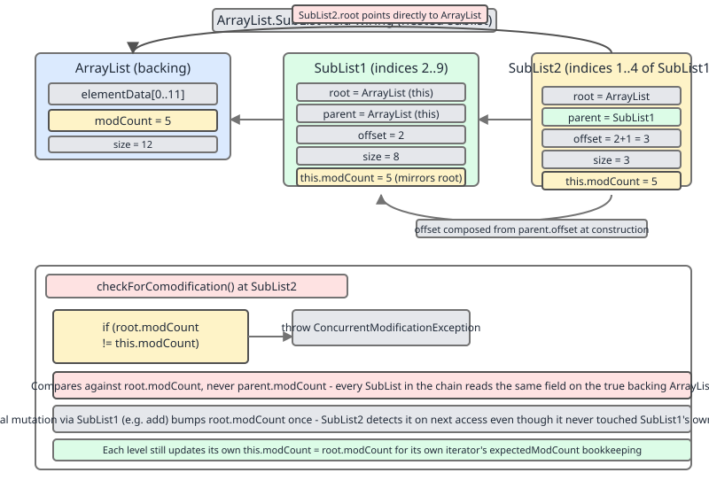
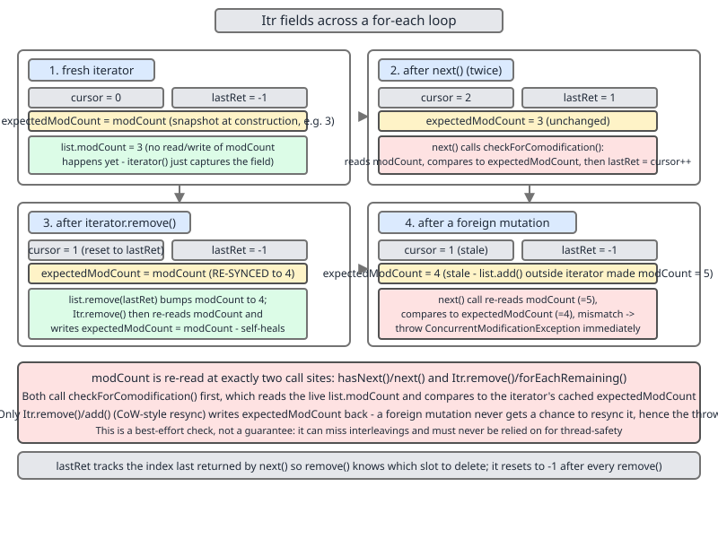

# 02 Java Collections — `ArrayList` — INTERNALS (§3.1 `ArrayList` source walk — sublists, iterators, spliterators and the siblings)

**Target version: Java 21 LTS.** | [Index](../00-index.md)
Previous: [array-list/02b-internals-bulk-removal.md](02b-internals-bulk-removal.md) · Next: [array-list/04-amortised-analysis.md](04-amortised-analysis.md)

`ArrayList` is one array and one `int`. Everything in this file is a *second object* that borrows that array: a view (`SubList`), a cursor (`Itr`/`ListItr`), a splittable cursor (`ArrayListSpliterator`), or a differently-governed clone of the whole design (`Vector`, `CopyOnWriteArrayList`). Each borrower needs an answer to the same question — *how do I know the array moved under me?* — and each answers it differently.

| Borrower | Holds | Staleness detector | Owns storage? |
|---|---|---|---|
| `ArrayList.SubList` | `root`, `parent`, `offset`, `size` | own `modCount` vs `root.modCount` | no |
| `Itr` / `ListItr` | `cursor`, `lastRet`, `expectedModCount` | `expectedModCount` vs outer `modCount` | no |
| `ArrayListSpliterator` | `index`, `fence`, `expectedModCount` | `expectedModCount`, checked *after* the action | no |
| `Vector` | its own `elementData` | `modCount`, plus a monitor on every method | yes |
| `CopyOnWriteArrayList` | `volatile Object[] array` | none needed — snapshot | yes |

The full `modCount`/`expectedModCount` contract lives in [`../iteration/02-fail-fast-fail-safe.md`](../iteration/02-fail-fast-fail-safe.md); the `trySplit` contract and the eight characteristic bits live in [`../iteration/03-internals-spliterator.md`](../iteration/03-internals-spliterator.md). This file covers only what is `ArrayList`-specific.

---

## `SubList` — a window with an address book *(leaves 3.1.24, 3.1.25)*

**Mental model.** A `SubList` is not a copy and not a wrapper around its immediate parent. It is a pair of integers — `offset` and `size` — plus a direct pointer to the *root* `ArrayList`. Every read is `root.elementData[offset + index]`. The `parent` pointer exists for exactly one job: propagating size changes back up a chain of nested sublists. Think of it as a street address (`root` + `offset`) rather than a forwarding chain.

**Why it exists.** Before views, range operations needed either a copy (`Arrays.copyOfRange`, allocating) or a `(list, from, to)` triple threaded through every helper. `subList` lets any range be passed to any `List`-taking API, which is why `Collections.sort(list.subList(3, 9))` and the `list.subList(from, to).clear()` idiom work at all.

**When to reach for it.** Use it for a scoped mutation or a scoped read that you consume immediately — a clear, a sort, a `Collections.reverse` on a window. Do not use it as a stored field or a return value from a public API: it holds the whole root array alive (a 10-element view of a 10-million-element list pins all 10 million) and it becomes undefined the instant anyone touches the root directly. When you want a detached range, `new ArrayList<>(list.subList(a, b))` or `list.stream().skip(a).limit(b - a).toList()`.

**Mechanism.** `SubList` is a `private static class` implementing `RandomAccess`, declared at `java.base/java/util/ArrayList.java`, JDK 21, line 1194, with exactly four fields (lines 1195–1198):

```java
private static class SubList<E> extends AbstractList<E> implements RandomAccess {
    private final ArrayList<E> root;
    private final SubList<E> parent;
    private final int offset;
    private int size;
}
```

Two constructors. The top-level one sets `parent = null` and `offset = fromIndex`; the nested one sets `root = parent.root` and `offset = parent.offset + fromIndex` — so `offset` is always absolute against the root array, never relative to the parent (lines 1203–1219). `modCount` is inherited from `AbstractList` and seeded from `root.modCount` (top-level) or `parent.modCount` (nested), which are equal at construction time.

The comodification check compares against the **root**, never the parent (`ArrayList.java`, JDK 21, line 1495):

```java
private void checkForComodification() {
    if (root.modCount != modCount)
        throw new ConcurrentModificationException();
}
```

This is what makes the view fail-fast against *any* structural change anywhere in the tree, not just changes made through its own parent. Note this is a different method from `ArrayList.checkForComodification(int)` at line 653, which takes the expected value as a parameter and is used by `equals`/`hashCode`/`forEach` to detect self-interference from a caller-supplied lambda.

Writes go straight to the root, then fix up the chain (`ArrayList.java`, JDK 21, lines 1240–1244 and 1500–1507):

```java
public void add(int index, E element) {
    rangeCheckForAdd(index);
    checkForComodification();
    root.add(offset + index, element);
    updateSizeAndModCount(1);
}

private void updateSizeAndModCount(int sizeChange) {
    SubList<E> slist = this;
    do {
        slist.size += sizeChange;
        slist.modCount = root.modCount;
        slist = slist.parent;
    } while (slist != null);
}
```



Read the diagram left to right: both sublists point at the same `root`, `offset` accumulates absolutely, and the dashed arrows show `updateSizeAndModCount` walking *up* the `parent` chain — never down. A sibling or child view of the mutated one is not repaired, and will throw on its next access.

**Version delta.** In Java 8 `SubList` was a *non-static inner* class (`java/util/ArrayList.java`, JDK 8u202, line 1018) with fields `AbstractList<E> parent`, `int parentOffset`, `int offset`, `int size` — no `root`. Mutation delegated one level at a time: `parent.add(parentOffset + index, e); this.modCount = parent.modCount; this.size++;` (JDK 8u202, lines 1052–1057), so a sublist-of-a-sublist-of-a-sublist paid O(depth) virtual calls per write and each level re-ran its own range check. JDK 9 rewrote it to the static `root`/`parent` form, making every write a single direct call on the root plus a cheap upward size fixup. The externally visible `ConcurrentModificationException` semantics are the same in both — JDK 8's check was `if (ArrayList.this.modCount != this.modCount)` (JDK 8u202, line 1238), which also resolves to the root.

```java
List<String> root = new ArrayList<>(List.of("a", "b", "c", "d", "e", "f"));
List<String> mid = root.subList(1, 5);      // b c d e   offset=1
List<String> inner = mid.subList(1, 3);     // c d       offset=2 (absolute)

inner.set(0, "C");
System.out.println(root);                   // [a, b, C, d, e, f]

inner.add("X");                             // root.add(4, "X"); fixes inner then mid
System.out.println(root);                   // [a, b, C, d, X, e, f]
System.out.println(mid);                    // [b, C, d, X, e]  -- repaired upward
System.out.println(inner);                  // [C, d, X]

mid.remove(0);                              // mutating the PARENT does not repair the child
System.out.println(mid);                    // [C, d, X, e]
try {
    inner.get(0);
} catch (ConcurrentModificationException e) {
    System.out.println("inner is dead: " + e.getClass().getSimpleName());
}
```

**Gotcha.** `size()` itself calls `checkForComodification()` (line 1230), so even a read-only `subList.size()` throws after a foreign mutation. There is no "peek safely" operation on a stale view — the view is all-or-nothing.

> A `SubList` is a fixed `[offset, offset+size)` window onto the root `ArrayList`'s array, validated on every operation against `root.modCount`, with `parent` used solely to propagate size changes upward.

---

## `Itr` and `ListItr` — three ints and a defensive local *(leaves 3.1.26, 3.1.27)*

**Mental model.** `Itr` is a finger on the array plus a memory of where the array's shape was when the finger was placed. `cursor` is where the finger points *next*; `lastRet` is where it pointed *last*, and is the only index `remove()` and `set()` are allowed to touch; `expectedModCount` is the remembered shape.

**Why it exists.** `AbstractList` already supplies a generic `Itr` built on `get(i)`. For `ArrayList` that costs a bounds check and a virtual call per element. `ArrayList` overrides it — the class comment at line 1032 is literally "An optimized version of AbstractList.Itr" — to read the backing array directly.

**When to reach for it.** Use the iterator (or the for-each loop that compiles to it) whenever you may need to remove during traversal: `it.remove()` is the only in-loop removal that keeps `expectedModCount` in sync. Prefer `removeIf` when the predicate is pure — it is a single bulk pass with one `modCount` bump (see `02b-internals-bulk-removal.md`). Prefer an index loop only when you need the index itself; it skips the iterator allocation, though escape analysis usually erases that anyway.

**Mechanism** (`ArrayList.java`, JDK 21, lines 1035–1038 and 1046–1058):

```java
private class Itr implements Iterator<E> {
    int cursor;       // index of next element to return
    int lastRet = -1; // index of last element returned; -1 if no such
    int expectedModCount = modCount;

    public E next() {
        checkForComodification();
        int i = cursor;
        if (i >= size)
            throw new NoSuchElementException();
        Object[] elementData = ArrayList.this.elementData;
        if (i >= elementData.length)
            throw new ConcurrentModificationException();
        cursor = i + 1;
        return (E) elementData[lastRet = i];
    }
}
```

Three things to notice. First, `checkForComodification()` runs **once, at the top** — the field `modCount` is re-read exactly there and nowhere else in the method. Second, `ArrayList.this.elementData` is copied into a *local* `elementData` before use; the local frees the JIT from re-loading the (mutable, non-final) outer field on every access and lets it hoist the array's length. Third, that local is the reason for the `i >= elementData.length` check: between the `modCount` read and the array read, an unsynchronised concurrent writer could have swapped in a *smaller* array, and `size` alone would not catch it. That branch converts a would-be `ArrayIndexOutOfBoundsException` into the documented `ConcurrentModificationException`.

`remove()` (line 1060) is the only method that repairs the iterator: it deletes at `lastRet`, rewinds `cursor = lastRet`, sets `lastRet = -1` (so a second `remove()` without an intervening `next()` throws `IllegalStateException`), and re-syncs `expectedModCount = modCount`.



Panel 3 is the one to study: after `remove()`, `cursor` has moved *backwards* and `expectedModCount` has caught up. Panel 4 shows the foreign mutation — only `modCount` moved, so the very next `next()` fails at its single check point.

**`ListItr`** (line 1102) extends `Itr` and adds only the backward half: `previous()` mirrors `next()` with the same local-variable trick, `set(e)` writes at `lastRet` *without* touching `modCount` (a set is not a structural change), and `add(e)` inserts at `cursor`, advances it, and clears `lastRet` — so `set()` immediately after `add()` throws `IllegalStateException`.

**`forEachRemaining`** (line 1069) is the outlier: it hoists `size` and `elementData` into locals and checks `modCount == expectedModCount` in the *loop condition*, writing `cursor` and `lastRet` back only once at the end — "update once at end to reduce heap write traffic", per the source comment.

**`SubList`'s iterator** (line 1365) is a separate anonymous `ListIterator` with the same three fields, but seeded `expectedModCount = SubList.this.modCount` and indexing `elementData[offset + i]`. It is not an `Itr` subclass, so none of `Itr`'s code is shared with it.

**Gotcha.** `hasNext()` is `cursor != size` (line 1044) — not `<`. If a concurrent removal drops `size` below `cursor`, the loop does not terminate early; it keeps calling `next()`, which throws `ConcurrentModificationException`. That is deliberate: silently truncating would be worse than failing.

> `Itr` is a three-field cursor (`cursor`, `lastRet`, `expectedModCount`) that reads the backing array through a method-local copy and validates `modCount` exactly once per `next()`, before the read.

---

## `ArrayListSpliterator` — the same cursor, cut in half *(leaf 3.1.28)*

**Mental model.** Take `Itr`, replace "next index" with "half-open range `[index, fence)`", and add one operation: hand the front half of your range to a new object and keep the back half. That is the whole class. Because the source is an array, splitting is pure arithmetic — no elements move, no memory is allocated beyond the small spliterator object.

**Why it exists.** `Stream.parallel()` needs a source it can partition without traversing. A plain `Iterator` cannot be partitioned at all; `Arrays.spliterator` could partition, but would not detect concurrent modification. The class comment (line 1622) says exactly this: "If `ArrayList`s were immutable, or structurally immutable, we could implement their spliterators with `Arrays.spliterator`."

**When to reach for it.** You almost never construct one; you get it from `list.spliterator()` or `list.parallelStream()`. Parallelism pays off here more than for almost any other collection — perfectly balanced splits, contiguous memory, exact sizes — but only above a few thousand elements with a non-trivial per-element cost. Below that, `LinkedList`'s spliterator (unsized, split by buffering) and `ArrayList`'s both lose to a plain sequential loop.

**Mechanism** (`ArrayList.java`, JDK 21, lines 1615–1617, 1620, 1673–1677, 1719–1721):

```java
@Override
public Spliterator<E> spliterator() {
    return new ArrayListSpliterator(0, -1, 0);
}

public ArrayListSpliterator trySplit() {
    int hi = getFence(), lo = index, mid = (lo + hi) >>> 1;
    return (lo >= mid) ? null :  // divide range in half unless too small
        new ArrayListSpliterator(lo, index = mid, expectedModCount);
}

public int characteristics() {
    return Spliterator.ORDERED | Spliterator.SIZED | Spliterator.SUBSIZED;
}
```

`fence = -1` marks the spliterator as **late-binding**: `getFence()` (line 1666) commits `fence = size` and `expectedModCount = modCount` on first use, so a list mutated between `spliterator()` and the first traversal is legal, not a `ConcurrentModificationException`.

`trySplit` uses `(lo + hi) >>> 1`, the unsigned shift, so the midpoint is correct even if `lo + hi` overflows `int` — the same idiom as `Arrays.binarySearch`. The *prefix* `[lo, mid)` goes to the returned new spliterator and `this` keeps the suffix `[mid, hi)` via the side-effecting `index = mid`. Returning `null` when `lo >= mid` (a range of 0 or 1) is what terminates the recursive fork.

`SIZED` holds because `estimateSize()` is `getFence() - index`, exact. `SUBSIZED` holds because arithmetic halving means every child is exact too — this is what lets the fork/join framework size its output arrays up front instead of buffering. `ORDERED` holds because array index *is* encounter order. Not reported: `IMMUTABLE`, `CONCURRENT`, `NONNULL`, `DISTINCT`, `SORTED`.

`forEachRemaining` (line 1687) checks `modCount` only **once at the end** of the loop — the comment at line 1633 justifies this as the deliberate trade: "we perform only a single `ConcurrentModificationException` check at the end of `forEach` (the most performance-sensitive method)". `tryAdvance` (line 1679) also checks *after* calling the action, not before.

```java
List<Integer> list = new ArrayList<>();
for (int i = 0; i < 8; i++) list.add(i);

Spliterator<Integer> right = list.spliterator();
System.out.println(right.estimateSize());                       // 8
System.out.println(right.hasCharacteristics(Spliterator.SUBSIZED)); // true

Spliterator<Integer> left = right.trySplit();                   // [0,4) / [4,8)
System.out.println(left.estimateSize() + " " + right.estimateSize()); // 4 4

Spliterator<Integer> leftLeft = left.trySplit();                // [0,2) / [2,4)
StringBuilder sb = new StringBuilder();
leftLeft.forEachRemaining(sb::append);
System.out.println(sb);                                         // 01
```

**Gotcha.** Because the check is post-action, a parallel stream can apply your lambda to elements from a half-mutated list *before* it throws. If the lambda has side effects, some of them have already happened. `ConcurrentModificationException` here is a debugging aid, not a transaction boundary.

`SubList.spliterator()` (line 1509) does not return an `ArrayListSpliterator`; it returns an anonymous `Spliterator` that late-binds to `offset + size`. Its `trySplit`, however, returns `root.new ArrayListSpliterator(lo, index = mid, expectedModCount)` — once bound, the range is absolute against the root array, so the ordinary class can take over.

> `ArrayListSpliterator` is a `[index, fence)` range over the backing array that reports `ORDERED | SIZED | SUBSIZED`, binds lazily on first use, and splits by unsigned-shift midpoint, giving away the prefix and keeping the suffix.

---

## Supporting facts

**`RandomAccess` (leaf 3.1.29).** A marker interface with zero methods (`java.base/java/util/RandomAccess.java`, JDK 21 — the body is `public interface RandomAccess { }`), added in 1.4. `ArrayList`, `ArrayList.SubList`, `Vector`, `CopyOnWriteArrayList` and `Arrays.asList`'s `ArrayList` all implement it; `LinkedList` does not. `Collections` branches on `list instanceof RandomAccess` in a dozen algorithms, each guarded by a size threshold below which the branch is not worth taking (`java.base/java/util/Collections.java`, JDK 21, lines 106–113):

| Constant | Value | Used by |
|---|---|---|
| `BINARYSEARCH_THRESHOLD` | 5000 | `binarySearch` (lines 215, 322) |
| `REVERSE_THRESHOLD` | 18 | `reverse` (line 385) |
| `SHUFFLE_THRESHOLD` | 5 | `shuffle` (line 484) |
| `FILL_THRESHOLD` | 25 | `fill` (line 552) |
| `ROTATE_THRESHOLD` | 100 | `rotate` (line 803) |
| `COPY_THRESHOLD` | 10 | `copy` (line 588) |
| `REPLACEALL_THRESHOLD` | 11 | `replaceAll` (line 869) |
| `INDEXOFSUBLIST_THRESHOLD` | 35 | `indexOfSubList` (lines 932, 985) |

The condition reads `if (size < THRESHOLD || list instanceof RandomAccess)` — small lists take the index path regardless, because allocating iterators costs more than a few `get` calls. The wrappers propagate the marker: `Collections.unmodifiableList` returns `UnmodifiableRandomAccessList` (line 1477) and `synchronizedList` returns `SynchronizedRandomAccessList` (line 2676) only when the wrapped list has it. For the runtime cost consequences of the switch, see [`../cost-and-memory/01-master-cost-table.md`](../cost-and-memory/01-master-cost-table.md).

**The two array-size OOMEs (leaf 3.1.30).** `OutOfMemoryError: Requested array size exceeds VM limit` comes from the *VM's* array allocation path when the requested length exceeds the maximum array length the VM can represent (`Integer.MAX_VALUE` minus a header-dependent margin); no amount of heap fixes it. `OutOfMemoryError: Java heap space` means the request was legal but there was no contiguous room. Verified on JDK 21.0.7 with `-Xmx64m`:

```java
public class TwoOomes {
    public static void main(String[] args) {
        try {
            Object[] tooBig = new Object[Integer.MAX_VALUE];
            System.out.println(tooBig.length);
        } catch (OutOfMemoryError e) {
            System.out.println("A: " + e.getMessage());  // Requested array size exceeds VM limit
        }
        try {
            List<Object> list = new ArrayList<>();
            while (true) list.add(new long[1024]);
        } catch (OutOfMemoryError e) {
            System.out.println("B: " + e.getMessage());  // Java heap space
        }
    }
}
```

Message A reproduces at any heap size — it is a representation limit, not a capacity one. Message B needs a small `-Xmx` (64m is comfortable) to hit quickly; add `-XX:+HeapDumpOnOutOfMemoryError` to capture it. A third message exists on the growth path: `ArraysSupport.hugeLength` throws `OutOfMemoryError: Required array length <old> + <growth> is too large` when `oldLength + minGrowth` overflows `int` (`java.base/jdk/internal/util/ArraysSupport.java`, JDK 21, lines 749–753). The soft cap it grows to is `SOFT_MAX_ARRAY_LENGTH = Integer.MAX_VALUE - 8` (line 692). Growth mechanics are covered in `06`.

---

## `Vector` and `CopyOnWriteArrayList` — the two other array lists *(leaves 3.1.31, 3.1.32)*

**Mental model.** Three classes, one array, three concurrency stories. `ArrayList` says *you* synchronise. `Vector` locks the whole object on every call, so each call is atomic and nothing composed of two calls is. `CopyOnWriteArrayList` never locks readers at all: readers grab the current array reference and are then immune to everything, because writers never touch a published array — they build a new one and swap the `volatile` field.

**Why they exist.** `Vector` predates the Collections Framework (JDK 1.0) and was retrofitted onto `List` in 1.2; its synchronisation is a 1996 default, not a design choice you would repeat. `CopyOnWriteArrayList` (1.5, Doug Lea) exists for the listener-list shape: thousands of iterations, a handful of mutations, and a hard requirement that iteration never throw.

**Choosing.**

| | `ArrayList` | `Vector` | `CopyOnWriteArrayList` |
|---|---|---|---|
| Thread safety | none | monitor on every method | lock-free reads, locked writes |
| Read cost | array index | array index + monitor | array index (`volatile` read) |
| `add` cost | amortised O(1) | amortised O(1) + monitor | **O(n) always** — full array copy |
| Growth | `oldCapacity >> 1` (1.5x) | `capacityIncrement > 0 ? capacityIncrement : oldCapacity` | exactly `len + 1` |
| Iterator | fail-fast (`CME`) | fail-fast (`CME`) | snapshot, never throws |
| `Iterator.remove` | supported | supported | `UnsupportedOperationException` |
| Compound ops atomic | no | **no** | no |
| Use when | single-threaded (default) | never in new code | read-dominated listener lists |

**Mechanism — `Vector`.** The `protected int capacityIncrement` field (`java.base/java/util/Vector.java`, JDK 21, line 125) is settable only through `Vector(int initialCapacity, int capacityIncrement)`. `grow` (line 256):

```java
private Object[] grow(int minCapacity) {
    int oldCapacity = elementData.length;
    int newCapacity = ArraysSupport.newLength(oldCapacity,
            minCapacity - oldCapacity, /* minimum growth */
            capacityIncrement > 0 ? capacityIncrement : oldCapacity
                                       /* preferred growth */);
    return elementData = Arrays.copyOf(elementData, newCapacity);
}
```

The widely repeated "`Vector` doubles" is a simplification worth stating precisely: the *preferred* growth is `oldCapacity` — i.e. doubling — **only when `capacityIncrement` is zero or negative**, which is the default. Construct with `new Vector<>(10, 5)` and it grows by 5 each time, linearly. Contrast `ArrayList.grow`, whose preferred growth is `oldCapacity >> 1`, giving 1.5x.

Roughly every public method carries `synchronized`: `get` (line 748), `set` (766), `add` (794), `remove` (841), `size` (304), even `toString` (1082) and `hashCode` (1074). `Vector.subList` (line 1120) is the giveaway that the model is broken — it returns `Collections.synchronizedList(super.subList(...), this)`, hand-threading the mutex through because per-method locking cannot express a view.

**Mechanism — `CopyOnWriteArrayList`.** Three members carry the design (`java.base/java/util/concurrent/CopyOnWriteArrayList.java`, JDK 21, lines 110, 116–125):

```java
/** The array, accessed only via getArray/setArray. */
private transient volatile Object[] array;

final Object[] getArray()          { return array; }
final void     setArray(Object[] a) { array = a; }
```

`volatile` on the field is the whole memory-model argument: `setArray` is a volatile write, `getArray` a volatile read, so a reader that observes the new reference also observes every element store made before the swap. Every mutator copies (line 461):

```java
public boolean add(E e) {
    synchronized (lock) {
        Object[] es = getArray();
        int len = es.length;
        es = Arrays.copyOf(es, len + 1);
        es[len] = e;
        setArray(es);
        return true;
    }
}
```

Note `len + 1` — no spare capacity, so *n* appends cost O(n²) total. And note the lock: `final transient Object lock = new Object()` (line 107), a plain monitor.

**Version delta.** JDK 8 used `final transient ReentrantLock lock = new ReentrantLock()` (`java/util/concurrent/CopyOnWriteArrayList.java`, JDK 8u202, line 97) with explicit `lock()`/`unlock()` in `try`/`finally`. JDK 9 replaced it with a plain `Object` monitor, verified present in JDK 11.0.27 (line 102) and JDK 21 (line 107); the source comment reads "We have a mild preference for builtin monitors over `ReentrantLock` when either will do." The motive was serialisation and `ReentrantLock`'s own initialisation cost, not contention behaviour. The leaf's phrasing "`ReentrantLock lock`" is true of Java 8 and stale for anything from Java 9 on — interviewers still quote it.

**Gotcha.** A `CopyOnWriteArrayList` iterator is a snapshot of the array as of `iterator()`. It will not see later writes and it cannot remove — `Iterator.remove` throws `UnsupportedOperationException`, because there is nothing to remove *from*. Neither `Vector` nor `CopyOnWriteArrayList` makes check-then-act atomic; `if (!v.contains(x)) v.add(x);` races in both.

> `Vector` is `ArrayList` with a monitor on every method and a configurable linear growth increment; `CopyOnWriteArrayList` is `ArrayList` with a `volatile` array reference that writers replace wholesale under a monitor, trading O(n) writes for lock-free, never-throwing reads.

---

## Pitfalls

### Treating `subList` as a copy

**Wrong**

```java
List<String> log = new ArrayList<>(List.of("a", "b", "c", "d", "e"));
List<String> recent = log.subList(3, 5);   // "just the tail"
log.add("f");                              // unrelated append
System.out.println(recent);                // ConcurrentModificationException
```

**Right**

```java
List<String> log = new ArrayList<>(List.of("a", "b", "c", "d", "e"));
List<String> recent = new ArrayList<>(log.subList(3, 5));  // detach now
log.add("f");
System.out.println(recent);                // [d, e]
```

**Why people believe it:** the method returns a `List` and every other `List`-returning method in the JDK (`List.copyOf`, `stream().toList()`, `Arrays.asList`) hands back something you can hold. `subList` is the outlier, and its Javadoc buries the warning under the word "undefined".

### Believing `Vector` makes your code thread-safe

**Wrong**

```java
Vector<Integer> v = new Vector<>();
// two threads running this interleave between size() and add()
if (v.size() < 10) {
    v.add(compute());     // can exceed 10: size() and add() are separately atomic
}
```

**Right**

```java
List<Integer> v = new ArrayList<>();
Object mutex = new Object();
synchronized (mutex) {
    if (v.size() < 10) {
        v.add(compute()); // the whole check-then-act is one critical section
    }
}
```

**Why people believe it:** "synchronized on every method" sounds like the class is safe, and for a single call it is. Atomicity does not compose — two atomic operations back to back are not one atomic operation, and no per-method lock can fix that.

### Reaching for `CopyOnWriteArrayList` as a general concurrent list

**Wrong**

```java
List<Event> queue = new CopyOnWriteArrayList<>();
for (int i = 0; i < 100_000; i++) {
    queue.add(new Event(i));   // 100k array copies: ~5 * 10^9 element writes
}
```

**Right**

```java
Queue<Event> queue = new ConcurrentLinkedQueue<>();   // write-heavy: O(1) offer
for (int i = 0; i < 100_000; i++) {
    queue.add(new Event(i));
}
// or, if a List is genuinely required and writes are frequent:
List<Event> guarded = Collections.synchronizedList(new ArrayList<>());
```

**Why people believe it:** it lives in `java.util.concurrent` and implements `List`, so it reads as "the concurrent `ArrayList`". It is not — it is the concurrent *listener list*, correct only when reads vastly outnumber writes.

---

## Cheat sheet

| Thing | Fact | Source line (JDK 21) |
|---|---|---|
| `SubList` fields | `root`, `parent`, `offset`, `size` (+ inherited `modCount`) | `ArrayList.java` 1194–1198 |
| `SubList` check | `root.modCount != modCount` — root, not parent | `ArrayList.java` 1495 |
| `SubList` offset | absolute: `parent.offset + fromIndex` | `ArrayList.java` 1217 |
| Size fixup | `updateSizeAndModCount` walks `parent` chain upward only | `ArrayList.java` 1500 |
| `Itr` fields | `cursor`, `lastRet = -1`, `expectedModCount` | `ArrayList.java` 1036–1038 |
| `Itr.next()` | one `modCount` check at top; array copied to a local | `ArrayList.java` 1047–1058 |
| `hasNext()` | `cursor != size` (not `<`) | `ArrayList.java` 1044 |
| `ListItr` | adds `previous`/`set`/`add`; `set` does not bump `modCount` | `ArrayList.java` 1102 |
| Spliterator chars | `ORDERED \| SIZED \| SUBSIZED` | `ArrayList.java` 1719 |
| `trySplit` | `mid = (lo + hi) >>> 1`; gives prefix, keeps suffix; `null` if `lo >= mid` | `ArrayList.java` 1673 |
| Binding | `fence = -1` until `getFence()`; late-binding | `ArrayList.java` 1666 |
| `RandomAccess` | zero methods; `Collections` branches on `instanceof` | `RandomAccess.java` |
| Thresholds | binarySearch 5000, reverse 18, shuffle 5, fill 25, rotate 100, copy 10, replaceAll 11, indexOfSubList 35 | `Collections.java` 106–113 |
| VM limit OOME | `Requested array size exceeds VM limit` — length > VM max | any heap size |
| Heap OOME | `Java heap space` — legal length, no room | needs small `-Xmx` |
| Soft cap | `SOFT_MAX_ARRAY_LENGTH = Integer.MAX_VALUE - 8` | `ArraysSupport.java` 692 |
| `Vector` growth | `capacityIncrement > 0 ? capacityIncrement : oldCapacity` | `Vector.java` 256–262 |
| `Vector` locking | `synchronized` on essentially every public method | `Vector.java` 748, 794, … |
| COWAL fields | `private transient volatile Object[] array`; `final transient Object lock` | `CopyOnWriteArrayList.java` 110, 107 |
| COWAL `add` | `Arrays.copyOf(es, len + 1)` under `synchronized (lock)` — O(n) | `CopyOnWriteArrayList.java` 461 |
| Version traps | JDK 8 `SubList` was inner with `parentOffset`; JDK 8 COWAL used `ReentrantLock` | JDK 8u202 1018, 97 |

---

## Self-test

**Q1.** `SubList.checkForComodification` compares against `root.modCount` rather than `parent.modCount`. Why does that matter for a sublist of a sublist?

<details><summary>Answer</summary>

`parent.modCount` is a mirror that is only refreshed by `updateSizeAndModCount`, which runs when the *child* mutates and walks upward. If someone mutates the root directly, or mutates a sibling view, the parent's mirror is just as stale as the child's — comparing them would agree and the check would pass on a corrupt view. Comparing against `root.modCount` is comparing against the single authoritative counter, so any structural change anywhere in the tree is detected by every view in it.

</details>

**Q2.** Why does `Itr.next()` copy `ArrayList.this.elementData` into a local variable before reading it?

<details><summary>Answer</summary>

Two reasons. Performance: `elementData` is a non-final mutable field of the enclosing instance, so without the local the JIT must re-load it on each access and cannot hoist `.length`; a local lets it keep the reference in a register. Correctness under abuse: with the reference pinned, the subsequent `if (i >= elementData.length) throw new ConcurrentModificationException()` tests the exact array it is about to index. An unsynchronised writer that swapped in a shorter array after the `modCount` check would otherwise produce an `ArrayIndexOutOfBoundsException` instead of the documented `ConcurrentModificationException`.

</details>

**Q3.** `ArrayListSpliterator` reports `SUBSIZED`. What breaks if it did not?

<details><summary>Answer</summary>

`SUBSIZED` promises that every spliterator produced by `trySplit` is itself `SIZED` — its size is exactly known. The fork/join pipeline uses that to allocate the exact output array for each leaf task up front and write results into disjoint slices, with no buffering and no final concatenation. Without it, a sized parallel operation such as `toArray` would have to buffer each leaf into a growable node and copy-merge at the end. `ArrayList` gets `SUBSIZED` for free because `trySplit` is arithmetic on a half-open index range — both halves have exactly computable lengths.

</details>

**Q4.** Does `Vector` grow by 2x? Answer precisely.

<details><summary>Answer</summary>

Only when `capacityIncrement` is zero or negative, which is the default and the case for `new Vector<>()` and `new Vector<>(int)`. `Vector.grow` passes `capacityIncrement > 0 ? capacityIncrement : oldCapacity` as the *preferred* growth to `ArraysSupport.newLength`, so the default preferred new capacity is `oldCapacity + oldCapacity` = 2x. With `new Vector<>(10, 5)` it grows by 5 elements each time — linear, not geometric, which makes *n* appends O(n²/increment). For contrast, `ArrayList` passes `oldCapacity >> 1`, giving 1.5x.

</details>

**Q5.** A `CopyOnWriteArrayList` iterator never throws `ConcurrentModificationException`. What is the cost of that guarantee, and what does it break?

<details><summary>Answer</summary>

The guarantee comes from the iterator capturing `getArray()` once and reading only that snapshot; since mutators never modify a published array, the snapshot can never change. Costs: (1) every mutator is O(n) — `add` is `Arrays.copyOf(es, len + 1)` with no spare capacity, so *n* appends are O(n²); (2) the iterator is arbitrarily stale, seeing neither additions nor removals made after it was created; (3) `Iterator.remove`, `set` and `add` all throw `UnsupportedOperationException`, because writing through to a frozen snapshot is meaningless. It is correct for listener lists and wrong for anything write-heavy.

</details>

**Q6.** Distinguish `OutOfMemoryError: Requested array size exceeds VM limit` from `OutOfMemoryError: Java heap space`, and say which one raising `-Xmx` fixes.

<details><summary>Answer</summary>

"Requested array size exceeds VM limit" is thrown by the VM's array allocation path when the requested length exceeds the maximum array length the VM can represent — roughly `Integer.MAX_VALUE` minus header words. It is a representation limit; raising `-Xmx` never helps, and the fix is to not ask for one array that big (chunk it, or use a different structure). "Java heap space" means the length was legal but the collector could not find room; raising `-Xmx`, or reducing live-set size, can fix it. There is also a third, JDK-internal message on the growth path: `Required array length <old> + <growth> is too large`, thrown by `ArraysSupport.hugeLength` when `oldLength + minGrowth` overflows `int`.

</details>

**Q7.** `Collections.reverse` checks `size < REVERSE_THRESHOLD || list instanceof RandomAccess`. Why the size clause at all, given the `instanceof` already covers `ArrayList`?

<details><summary>Answer</summary>

The `instanceof` covers lists that *declare* fast indexing; the size clause covers lists that do not declare it but are small enough that it does not matter. Below 18 elements, walking a `LinkedList` with `get(i)` is at most a few hundred pointer hops, which is cheaper than allocating two `ListIterator` objects and paying their virtual calls. The thresholds are tuned per algorithm precisely because the crossover differs: `shuffle` uses 5, `binarySearch` uses 5000 — binary search only touches log n positions, so the index path stays competitive on a sequential list for far longer.

</details>

**Q8.** You call `list.spliterator()`, then `list.add(x)`, then start traversing. Throw or not? What if you swap the last two steps?

<details><summary>Answer</summary>

No throw. `ArrayListSpliterator` is constructed with `fence = -1` and binds lazily: `getFence()` sets both `fence = size` and `expectedModCount = modCount` on first use, which is at the start of traversal — after the `add`. The spliterator therefore sees the new element and its baseline is the post-`add` `modCount`. Swap the order — begin traversing, then mutate — and it does throw, but note *when*: `forEachRemaining` checks `modCount` only once, after the loop, and `tryAdvance` checks after invoking the action, so your lambda may already have run against inconsistent state before the `ConcurrentModificationException` surfaces.

</details>

---

**Leaves covered:** 3.1.24–3.1.32 (9 leaves)
**Leaves deferred:** none
**Diagrams included:** D-69, D-70
**Target version:** Java 21 LTS
**Lines:** 505
