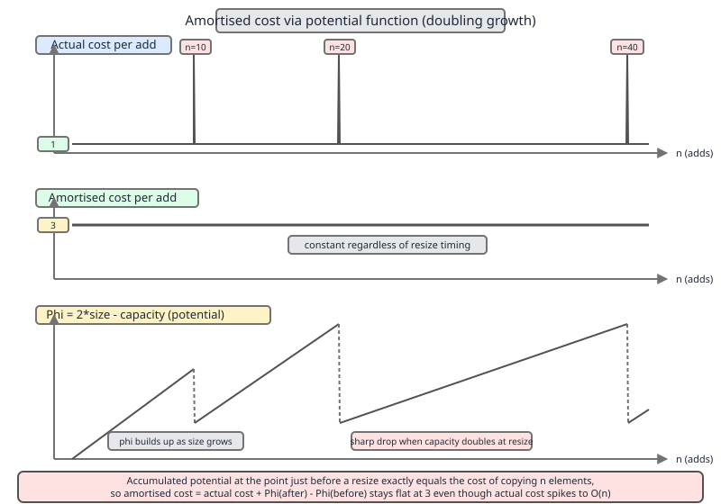
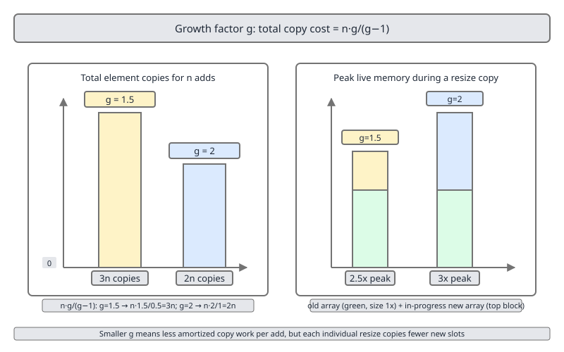
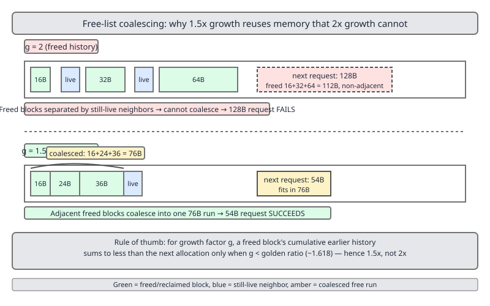

# 02 Java Collections — `ArrayList` — INTERNALS (§3.2 Amortised analysis, properly)

**Target version: Java 21 LTS.** | [Index](../00-index.md)
Previous: [array-list/03-internals-c-views-and-iterators.md](03-internals-c-views-and-iterators.md) · Next: [array-list/05-build-my-array-list.md](05-build-my-array-list.md)

This file proves the cost claims the rest of the set asserts. The `grow`/`newLength` source walk and the `10, 15, 22, 33, 49, 73, 109, 163, 244` capacity sequence live in [01-internals-a-growth.md](01-internals-a-growth.md); the cost table lives in [../cost-and-memory/01-master-cost-table.md](../cost-and-memory/01-master-cost-table.md); the `siftDown` mechanism lives in [../priority-queue/01-internals-a-heap.md](../priority-queue/01-internals-a-heap.md). Here we do the algebra.

## The three analysis methods — the map before the streets

There is one amortised bound. There are three ways to prove it, and interviewers pick the one that matches how they think.

| Method | What you actually do | Best at proving | Weakest at |
|---|---|---|---|
| **Aggregate** | Sum the true cost of a whole sequence of `n` operations, divide by `n` | A single-operation-type sequence, like `n` calls to `add` | Mixed sequences; gives one average for all op types |
| **Accounting (banker's)** | Charge each operation a fixed *amortised* price; bank the surplus as credits on specific data structure elements; expensive ops spend banked credits | Structures with several op types at different prices (`push`/`pop`, `add`/`remove`) | Requires you to guess the right price up front |
| **Potential** | Define `Φ(state) ≥ 0`, `Φ(initial) = 0`; amortised cost = actual cost + `ΔΦ` | Machine-checkable proofs; a structure whose "stored work" is a clean function of its state | Finding the function; a wrong `Φ` silently proves nothing |

All three give the same number. Aggregate is the fastest to say out loud, potential is the one that survives cross-examination.

---

## Amortised is not average

Picture a phone contract. You pay £30 a month, no variance. Once every two years the handset dies and the operator hands you a £600 replacement free. Your *amortised* handset cost is £25/month — a **guarantee written into the contract**, not an observation about typical users. Nobody sampled a distribution of customers; the £600 was pre-paid by 24 flat payments the contract *forced* you to make.

Average-case is the opposite: it assumes a distribution over inputs and reports the expectation. An adversary who knows your hash function makes average-case `HashMap` lookup behave like its worst case. No adversary can make `n` calls to `ArrayList.add` cost more than `4n` element writes, because the bound is over the sequence, not over a distribution.

**Why the concept exists.** Worst-case-per-operation is useless for `ArrayList.add`: it is O(n), and multiplying by `n` predicts O(n²) for a loop that really runs in O(n). Average-case is unsound, because there is no input distribution — the expensive `add` calls are *determined* by sequence position, not sampled. Tarjan formalised the gap in 1985 ("Amortized Computational Complexity"): a worst-case bound on a sequence, amortised over the operations in it.

**When to reach for each framing.**

| You want to claim | Use | Because |
|---|---|---|
| "A loop of `n` appends is O(n)" | Amortised | Holds for every sequence, adversary included |
| "A random `get(key)` costs O(1)" | Average / expected | Depends on hash distribution; an adversary breaks it |
| "This call will return within 200 µs" | Neither — you need **worst case per operation** | Amortised explicitly permits one O(n) call |

**Insight:** amortised bounds compose with loops; expected bounds compose with independence assumptions; worst-case bounds compose with latency SLOs. Reaching for the wrong one is how "amortised O(1)" ends up in a p99 latency budget.

**The mechanism, three ways.** Fix growth factor `g > 1`. Start from capacity `c₀`, append `n` elements. Capacities visited are `c₀, c₀g, c₀g², …, c_L`, where `c_L` is the last capacity reached.

**(1) Aggregate.** Every `add` writes exactly one element: `n` writes. Every `grow` copies the whole old array. The old arrays copied are `c₀, c₀g, …, c_{L-1}`, so:

```
copies = c₀ + c₀g + … + c_{L-1} = c_{L-1} · (1 + 1/g + 1/g² + …) = c_{L-1} · g/(g-1)

clean case, n lands on a capacity boundary, so c_{L-1} = n/g:
  copies = (n/g) · g/(g-1) = n/(g-1)
  total  = n (writes) + n/(g-1) (copies) = n · g/(g-1)
    g = 1.5 → 3n  →  amortised 3 per add
    g = 2.0 → 2n  →  amortised 2 per add
```

The whole tower of copies is a constant multiple of the last one, because a geometric series is dominated by its final term. If `n` lands just *after* a resize instead, `c_{L-1} → n` and copies rise to `n·g/(g-1)` — `3n` at `g = 1.5`, total `4n`. The honest statement: **`n` appends cost between `3n` and `4n` element writes at `g = 1.5`, and between `2n` and `3n` at `g = 2`.** Both are Θ(n), both O(1) amortised.

**(2) Accounting (banker's).** Take `g = 2` first, because the numbers are prettiest. Charge every `add` **3 credits**: 1 pays for the write, 2 are banked on the element just written. When the array is full at capacity `c`, the elements added since the last resize number `c − c/2 = c/2`, each carrying 2 banked credits, so the bank holds `c` credits — exactly the `c` copies the resize costs. The bank hits zero and never goes negative. Amortised cost = 3, constant, proven.

At `g = 1.5` the same bookkeeping needs a bigger charge. Elements added since the last resize number `c − c/1.5 = c/3`, and they must fund `c` copies, so each must bank **3** credits and the charge is **4 credits per add**. That matches the aggregate upper bound of `4n` exactly. Fewer elements between resizes means each one carries more of the bill.

**(3) Potential function.** For the doubling case `g = 2`, define `Φ = 2·size − capacity`. Then `Φ(empty) = 0` and `Φ ≥ 0` always, because immediately after a resize `size = capacity/2` and it only rises from there.

```
cheap add:  actual = 1,     ΔΦ = 2                        → amortised = 3
resize add: actual = c + 1, ΔΦ = 2(c+1) − 2c − (2c − c)
                               = 2 − c                    → amortised = c+1 + 2−c = 3
```



Both branches give 3 — constant, done. The diagram shows exactly that classic doubling case. **`Φ = 2·size − capacity` does *not* work for the JDK's actual factor of 1.5** — plug `g = 1.5` in and the resize branch yields `0.5c + 3`, which is not constant, so the proof fails. The correct family is:

```
Φ_g = (g/(g−1))·size − (1/(g−1))·capacity

g = 2.0 → Φ = 2·size − 1·capacity,  amortised 3
g = 1.5 → Φ = 3·size − 2·capacity,  amortised 4
```

Check `g = 1.5`: cheap add gives `1 + 3 = 4`; the resize add gives `(c+1) + [3(c+1) − 2(1.5c) − (3c − 2c)] = (c+1) + (3 − c) = 4`. Non-negativity holds because right after a resize `size = (2/3)·capacity`, so `Φ = 3·(2c/3) − 2c = 0`.

**A minimal concrete example.** This reproduces the JDK's real capacity schedule and counts the copies, so the algebra above is checkable rather than believed.

```java
public final class AmortisedCounter {

    record Result(int growCalls, long copies, int finalCapacity) {}

    /** Mirrors ArrayList.grow + ArraysSupport.newLength for a chosen preferred growth. */
    static Result simulate(int n, boolean doubling) {
        int capacity = 10, size = 0, growCalls = 0;   // 10 = DEFAULT_CAPACITY
        long copies = 0;
        for (int i = 0; i < n; i++) {
            if (size == capacity) {
                int prefGrowth = doubling ? capacity : (capacity >> 1);
                copies += capacity;                   // Arrays.copyOf copies the old array
                capacity += Math.max(1, prefGrowth);  // minGrowth = 1
                growCalls++;
            }
            size++;
        }
        return new Result(growCalls, copies, capacity);
    }

    public static void main(String[] args) {
        int n = 1_000_000;
        for (boolean doubling : new boolean[] { false, true }) {
            Result r = simulate(n, doubling);
            System.out.printf("g=%s  grows=%d  copies=%,d (%.2f n)  finalCap=%,d  waste=%,d%n",
                    doubling ? "2.0" : "1.5", r.growCalls(), r.copies(),
                    r.copies() / (double) n, r.finalCapacity(), r.finalCapacity() - n);
        }
    }
}
```

Measured output:

```
g=1.5  grows=29  copies=2,430,972 (2.43 n)  finalCap=1,215,487  waste=215,487
g=2.0  grows=17  copies=1,310,710 (1.31 n)  finalCap=1,310,720  waste=310,720
```

`2.43n` sits inside the predicted `[2n, 3n]` band for `g = 1.5`, and `1.31n` inside `[n, 2n]` for `g = 2`. The bound is not tight for a specific `n` — it is tight over the phase.

**The gotcha.** Amortised bounds are not preserved by any operation that *lowers* the potential without doing the work. `ArrayList.clear()` sets `size = 0` but leaves `capacity` alone, so `Φ = 3·0 − 2·c` goes **negative** and the proof's precondition breaks. Harmless here (a lower capacity requirement only reduces future work), but a structure that grew *and* shrank geometrically at the same threshold would thrash: alternate `add`/`remove` across the boundary and every operation costs O(n). Shrink-capable structures use hysteresis — shrink at 1/4 full, not 1/2 — precisely to keep `Φ` non-negative.

> **Amortised cost** is the total cost of a worst-case sequence of `n` operations divided by `n` — a guarantee over every sequence, with no probability distribution anywhere in the statement.

### Supporting fact — why any `g > 1` works and `g = 1` does not (3.2.5)

For `g > 1` the copy total is `c_{L-1}·g/(g−1)`, a constant times `n`, so amortised cost is the constant `g/(g−1)` — bounded for every `g > 1`, though it blows up as `g → 1⁺` (at `g = 1.01` it is 101 writes per add). For `g = 1` (grow by a fixed `+k`) the capacities are `k, 2k, 3k, …, n` and copies sum to `≈ n²/(2k)` — Θ(n²) total, **O(n) amortised per add**. Geometric growth is not an optimisation; it is the difference between linear and quadratic.

`ArraysSupport.newLength` (`jdk/internal/util/ArraysSupport.java` line 735) makes the bottom of the range concrete:

```java
int prefLength = oldLength + Math.max(minGrowth, prefGrowth); // might overflow
```

At `oldLength == 1` the preferred growth is `1 >> 1 == 0`; without the `Math.max` the new length would be `1`, no growth at all, and `add` would loop forever. The `Math.max` is the floor guaranteeing a strictly increasing sequence — the source-level boundary between "factor 1 is still progress" and "factor 0 is not".

---

## Why the JDK chose 1.5x, not 2x

Think of the allocator's free list as a shelf of returned boxes. Each resize returns one box and asks for a bigger one. The question is whether the pile of returned boxes ever adds up to the size of the box you are about to ask for. Under doubling it provably never does — `1 + 2 + 4 + … + 2^(k-1) = 2^k − 1`, one short, forever. Under 1.5x it does, after a handful of steps.

**Why it exists, and the version trap first.** `ArrayList` **has never doubled in any released JDK.** From `java/util/ArrayList.java` line 231:

```java
private Object[] grow(int minCapacity) {
    int oldCapacity = elementData.length;
    if (oldCapacity > 0 || elementData != DEFAULTCAPACITY_EMPTY_ELEMENTDATA) {
        int newCapacity = ArraysSupport.newLength(oldCapacity,
                minCapacity - oldCapacity, /* minimum growth */
                oldCapacity >> 1           /* preferred growth */);
        return elementData = Arrays.copyOf(elementData, newCapacity);
    } else {
        return elementData = new Object[Math.max(DEFAULT_CAPACITY, minCapacity)];
    }
}
```

`oldCapacity >> 1` is `+50%`, i.e. **1.5x**. This is unchanged from Java 6 through Java 21.

**Version trap:** "`ArrayList` doubles" is folklore that was never true. What people are confusing it with is **`Vector`**, whose javadoc specifies that when `capacityIncrement` is zero (the default), "the capacity of the vector is doubled each time it needs to grow" — genuine 2x. `HashMap` also genuinely doubles its bucket table. Interviewers still ask for "the doubling"; answer with the `oldCapacity >> 1` line and name `Vector` as the thing that actually doubles.

**When 1.5 wins and when 2 wins.**

| Criterion | `g = 1.5` | `g = 2` | Winner |
|---|---|---|---|
| Total copies for `n` appends | `2n` – `3n` | `n` – `2n` | 2 |
| `grow` calls for `n = 10⁶` | 29 | 17 | 2 |
| Freed blocks reusable for the next request | Yes, after 4 reallocations | Never | 1.5 |
| Peak live bytes during the copy | `2.5×` final size | `3×` final size | 1.5 |
| Trailing waste at `n = 10⁶` | 215,487 slots (21.5%) | 310,720 slots (31.1%) | 1.5 |

**The mechanism, argument one — peak memory during the copy.** `Arrays.copyOf` holds both arrays live at once, so the process holds `c + g·c` slots for `c` live elements: `2.5c` at `g = 1.5`, `3c` at `g = 2`. A 20% higher transient footprint at exactly the moment you can least afford it — a large resize is a common trigger for an allocation failure or a G1 humongous allocation.



**Argument two — memory reuse / block coalescing.** After `k` reallocations the allocator holds freed blocks summing to `c₀·(g^k − 1)/(g − 1)`, and the next request is `c₀·g^k`. Reuse becomes possible when

```
(g^k − 1)/(g − 1)  ≥  g^k        for some k
```

which has a solution exactly when `g² − g − 1 < 0`, i.e. `g < φ ≈ 1.618`, the golden ratio. At `g = 2` the sum is always one block short — provably, forever. This is stated directly in Facebook's `folly` FBVector design note:

> "it can be mathematically proven that a growth factor of 2 is rigorously the worst possible because it never allows the vector to reuse any of its previously-allocated memory."

> "any number smaller than 2 guarantees that you'll at some point be able to reuse the previous chunks. For instance, choosing 1.5 as the factor allows memory reuse after 4 reallocations; 1.45 allows memory reuse after 3 reallocations; and 1.3 allows reuse after only 2 reallocations."

Source: <https://github.com/facebook/folly/blob/main/folly/docs/FBVector.md>. The golden-ratio derivation predates folly and appears in the `comp.lang.c++.moderated` thread "vector growth factor of 1.5" (<https://groups.google.com/g/comp.lang.c++.moderated/c/asH_VojWKJw>), widely credited to Andrew Koenig. **Unverified:** the attribution to Koenig by name — the thread exists and contains the argument, but the Google Groups archive yields no per-message byline. The original 2003 posting with author headers would settle it.



**Caveat that stops this being a slam dunk on the JVM:** the coalescing argument assumes a `malloc`-style first-fit allocator over a shared heap. HotSpot allocates arrays by bumping a pointer in a TLAB and reclaims via a moving collector, so "freed blocks" are not on a free list waiting to be coalesced at all. The argument is strong for C++; for Java the peak-memory and trailing-waste arguments carry more of the weight.

**The counter-argument, quantified (3.2.7).** 1.5x means more resizes, hence more `System.arraycopy` work. Concretely, 1,000,000 appends from `new ArrayList<>()`:

```
g = 1.5 capacities: 10, 15, 22, 33, 49, 73, 109, 163, 244, 366, 549, 823, 1234, 1851,
                    2776, 4164, 6246, 9369, 14053, 21079, 31618, 47427, 71140, 106710,
                    160065, 240097, 360145, 540217, 810325, 1215487
g = 2.0 capacities: 10, 20, 40, 80, 160, 320, 640, 1280, 2560, 5120, 10240, 20480,
                    40960, 81920, 163840, 327680, 655360, 1310720
```

| Metric (n = 1,000,000) | `g = 1.5` (actual JDK) | `g = 2` (hypothetical) | Cost of choosing 1.5 |
|---|---|---|---|
| `grow` calls | 29 | 17 | +12 calls (+71%) |
| Element copies | 2,430,972 | 1,310,710 | **+1,120,262 copies (+85%)** |
| Final capacity | 1,215,487 | 1,310,720 | −95,233 slots |
| Trailing waste | 215,487 (21.5%) | 310,720 (31.1%) | −95,233 slots saved |
| Peak refs held during last copy | 2,025,812 | 1,966,080 | +59,732 |

So 1.5x costs **85% more copy work** to save **95,233 reference slots** (≈ 372 KB with 4-byte compressed oops). `System.arraycopy` is an intrinsic running at memory bandwidth, so 1.1M extra reference copies is on the order of a millisecond spread over 29 events. Note the last row: at this particular `n`, `g = 1.5` is actually *worse* on transient peak, because its final resize landed later in its phase — the `2.5×` vs `3×` advantage is about the worst instant, not about every `n`. The two factors are close and the JDK's choice is defensible rather than dominant; `new ArrayList<>(n)` beats both at zero resizes.

> **Growth factor** is the ratio `newCapacity / oldCapacity`. Any value above 1 gives O(1) amortised append; values below the golden ratio additionally let the allocator recycle previously freed blocks; the JDK uses 1.5 via `oldCapacity >> 1`.

### Supporting fact — what other runtimes do (3.2.8)

| Runtime | Factor | Primary source (verified 2026-08) |
|---|---|---|
| **CPython `list`** | `newsize + newsize/8 + 6`, rounded up to a multiple of 4 — ≈**1.125x plus a constant**. Growth pattern `0, 4, 8, 16, 24, 32, 40, 52, 64, 76` | `Objects/listobject.c`, `list_resize`: `new_allocated = ((size_t)newsize + (newsize >> 3) + 6) & ~(size_t)3;` — unchanged through current `main` (3.12/3.13/3.14) |
| **libstdc++ (GCC) `std::vector`** | **2x** | `bits/stl_vector.h`, `_M_check_len`: if the requested increment `__n < size()` it is raised to `size()`, returning `size() + size()`; the comment reads "Grow by (at least) doubling" |
| **MSVC STL `std::vector`** | **1.5x** | `stl/inc/vector`, `_Calculate_growth`: `const size_type _Geometric = _Oldcapacity + _Oldcapacity / 2;` |
| **Go slices** | 2x below a 256-element threshold, then a smoothed convergence toward 1.25x, then rounded up to an allocator size class | `runtime/slice.go`, `nextslicecap`: `const threshold = 256; if oldCap < threshold { return doublecap }` then `newcap += (newcap + 3*threshold) >> 2` |
| **Java `ArrayList`** | **1.5x** | `ArrayList.java` line 231, `oldCapacity >> 1` |
| **Java `Vector`** | **2x** when `capacityIncrement <= 0`; otherwise `+capacityIncrement` (linear, Θ(n²)) | `Vector` javadoc, specified behaviour |

**Version trap in Go:** the widely quoted rule "double below 1024 elements, then 1.25x" was replaced in **Go 1.18** (commit `2dda92f`, "runtime: make slice growth formula a bit smoother"). The threshold moved from 1024 to **256** and the flat 1.25x became the iterated formula above, which approaches 1.25x asymptotically rather than jumping to it. Quoting the pre-1.18 rule today is wrong.

That C++'s two major implementations disagree — GCC 2x, MSVC 1.5x — is itself the answer to "which factor is correct": the standard does not specify one, and two teams of experts reading the same evidence chose differently.

---

## Amortised O(1) does not mean predictable latency

The phone contract again. Your amortised handset cost is £25/month and that is genuinely true. It is also true that in month 19 you were without a phone for three days. The amortised figure smoothed away exactly the thing you cared about.

`ArrayList.add` is amortised O(1) and, at the 29th resize of a million-element list, performs a single 810,325-reference `System.arraycopy` plus an 1,215,487-slot allocation. That call is roughly six orders of magnitude slower than its neighbours. Averaging is a *reporting* choice; the pause is a *physical* event and your p99.9 sees it.

**Why this matters.** The failure signature: a service with a flat p50 shows periodic p99.9 spikes correlated with request *volume* rather than request *type*, because the one request that triggers the resize of a growing accumulator pays for the 810,324 that did not. Three things go wrong at once, in order of severity:

**(1) The copy** — Θ(n) references moved, a few hundred microseconds to low milliseconds at 1M. **(2) The allocation** — a 1,215,487-slot `Object[]` is ~4.6 MB with compressed oops, above G1's humongous threshold for any region size up to 2 MB, so it is allocated outside the TLAB, needs contiguous regions, and can trigger a concurrent cycle. **(3) The garbage** — the old 810,325-slot array dies instantly, in the old generation if the list was long-lived, a classic old-gen churn source.

**Mitigation, and the sibling that wins.**

| Symptom | Fix | Trade-off |
|---|---|---|
| Known final size | `new ArrayList<>(n)` or `ensureCapacity(n)` | Zero resizes; requires knowing `n` |
| Unknown size, hard tail-latency SLO | `LinkedList`, or a chunked list (`ArrayDeque`-style segmented buffer) | True per-op O(1) worst case, but 3–4× memory per element and no random access |
| Unknown size, throughput matters more | Leave `ArrayList` alone | Best total throughput; accept the spikes |

**Interview:** "`ArrayList.add` is amortised O(1) — is it a good fit for a 99.9th-percentile latency budget?" Answer: no, unless you pre-size. Amortised O(1) permits a single O(n) operation; a percentile SLO is a per-operation worst-case constraint, and amortised bounds say nothing about per-operation worst case by construction.

> **Amortised O(1)** bounds the *total* work of a sequence, so it bounds throughput. It places no bound whatsoever on the cost of any *individual* operation, so it says nothing about tail latency.

---

## `heapify` is O(n), not O(n log n)

Building a heap top-down (`n` inserts, each sifting *up* to the root) is O(n log n) because the expensive nodes are the many leaves. Building it bottom-up (`siftDown` from the last internal node backwards) inverts the geometry: the nodes with far to travel are the few near the root, and the nodes that are numerous have nowhere to go. Half the array is leaves and is skipped entirely.

**Why it exists.** `new PriorityQueue<>(someCollection)` and `PriorityQueue.addAll` would be O(n log n) if implemented as `n` calls to `offer`. Floyd's 1964 bottom-up construction makes it O(n) — a genuine asymptotic improvement, not a constant factor, and the JDK uses it.

**The mechanism — the `Sum h/2^h` argument.** In a complete binary tree of `n` nodes, the number of nodes at height `h` (leaves are height 0) is at most `⌈n / 2^(h+1)⌉`. A `siftDown` from height `h` costs at most `h` swaps. Total:

```
T(n)  ≤  Σ_{h=0}^{log n}  (n / 2^(h+1)) · h
      =  (n/2) · Σ_{h=0}^{log n} h / 2^h
      ≤  (n/2) · Σ_{h=0}^{∞}   h / 2^h
```

The tail sum is a standard closed form: `Σ_{h≥0} h·x^h = x/(1−x)²`, so at `x = 1/2` it equals `(1/2)/(1/4) = 2`, giving `T(n) ≤ (n/2)·2 = n`, i.e. **O(n)**. The series converges because `h` grows linearly while the node count at height `h` shrinks exponentially: the `n/2` leaves contribute zero, the `n/4` nodes at `h = 1` contribute `n/4`, the `n/8` at `h = 2` contribute `2n/8`, and the single root contributes `log n` — the whole tower sums to less than `n`.

The JDK's loop (`java/util/PriorityQueue.java` line 725):

```java
private void heapify() {
    final Object[] es = queue;
    int n = size, i = (n >>> 1) - 1;
    final Comparator<? super E> cmp;
    if ((cmp = comparator) == null)
        for (; i >= 0; i--)
            siftDownComparable(i, (E) es[i], es, n);
    else
        for (; i >= 0; i--)
            siftDownUsingComparator(i, (E) es[i], es, n, cmp);
}
```

`i = (n >>> 1) - 1` is the last internal node: indices `n/2` through `n-1` are leaves and are never visited. The loop counts *down*, which is what makes the invariant hold — when `siftDown(i)` runs, both subtrees of `i` are already heaps. No diagram in the manifest illustrates the height-sum; `siftDown` itself is diagrammed in [../priority-queue/01-internals-a-heap.md](../priority-queue/01-internals-a-heap.md).

**A minimal concrete example.** Count the real comparisons a Floyd build performs on a million random ints.

```java
import java.util.List;
import java.util.PriorityQueue;
import java.util.Random;

public final class HeapifyVsOffer {

    /** Floyd bottom-up build of a max-heap, counting comparisons. */
    static long floydBuild(int[] a) {
        long comparisons = 0;
        int half = a.length >>> 1;
        for (int i = half - 1; i >= 0; i--) {          // exactly PriorityQueue's start index
            int k = i, x = a[i];
            while (k < half) {
                int child = 2 * k + 1, right = child + 1;
                if (right < a.length) { comparisons++; if (a[right] > a[child]) child = right; }
                comparisons++;
                if (x >= a[child]) break;
                a[k] = a[child];
                k = child;
            }
            a[k] = x;
        }
        return comparisons;
    }

    public static void main(String[] args) {
        int n = 1 << 20;                               // log2 n = 20
        int[] a = new int[n];
        Random r = new Random(42);
        for (int i = 0; i < n; i++) a[i] = r.nextInt();
        System.out.printf("comparisons = %.2f n  (n log n would be 20 n)%n", floydBuild(a) / (double) n);

        PriorityQueue<Integer> pq = new PriorityQueue<>(List.of(5, 3, 9, 1, 7));  // heapify()
        System.out.println(pq.poll() + " " + pq.poll());   // 1 3
    }
}
```

The comparison count lands near `2n`, not near `n log n = 20n`. The constant is the `2` from `Σ h/2^h`.

**The gotcha.** `new PriorityQueue<>(collection)` is O(n) **only when the argument is a plain `Collection`**. When the argument is a `SortedSet` or another `PriorityQueue`, the JDK skips `heapify` entirely (the array is already heap-ordered), which is faster still. But `addAll` on an *existing non-empty* queue calls `offer` per element — O(n log n). Building fresh from the collection and building by `addAll` are not the same cost.

> **Floyd's `heapify`** turns an arbitrary array into a heap in O(n) by sifting *down* from the last internal node backwards; the bound follows from `Σ_{h≥0} h/2^h = 2`.

### Supporting fact — heap-then-drain is not better than sorting (3.2.14)

Build the heap in O(n), then `poll()` all `n` elements. Each `poll` moves the last element to the root and sifts it down, and that element genuinely came from a leaf, so it usually travels the full `log n`. Total: **O(n) + O(n log n) = O(n log n)** — asymptotically identical to `Arrays.sort`, and with a worse constant, because `poll` does two comparisons per level and has terrible cache locality (index `k` jumps to `2k+1`). This *is* heapsort. It is not a shortcut. Use a heap when you need the smallest element *now* and may never need the rest, or when you need a streaming top-`k` in O(n log k); use `sort` when you need everything ordered.

---

## The same argument elsewhere (3.2.10–3.2.12)

| Structure | Claim | Why it holds | Where it differs from `ArrayList` |
|---|---|---|---|
| `HashMap.put` | Amortised O(1) | Table doubles, so `n` puts trigger `log n` resizes copying `1 + 2 + 4 + … + n/2 < n` entries total — the aggregate argument with `g = 2` | Adds a second requirement: load factor 0.75 caps the *expected* chain length at O(1). Two bounds stacked, and the chain bound is **expected**, not amortised — a collision attack breaks it (mitigated since Java 8 by treeifying a bin at 8 entries, giving O(log n) worst case per bucket) |
| `ArrayDeque.add{First,Last}` | Amortised O(1) at **both** ends | Circular buffer: `head` and `tail` move modulo capacity, so neither end shifts. Growth is geometric, so the same series argument applies | The constant is **not** `ArrayList`'s. See below |
| `PriorityQueue.offer` | O(log n) worst case, **expected O(1)** sift distance | A new element lands at a leaf and sifts *up*. Under a random insertion order it stops after ~1.6 comparisons on average, because `1/2` of nodes are leaves, `1/4` at height 1, and the probability of climbing `k` levels decays like `2^-k` | The O(1) here is **expected over random inputs**, not amortised. A sorted-descending insertion sequence makes every `offer` climb to the root: O(n log n) total, and no amortisation saves it |

`ArrayDeque`'s growth (`/tmp/jdk21src/java.base/java/util/ArrayDeque.java` line 139):

```java
// Double capacity if small; else grow by 50%
int jump = (oldCapacity < 64) ? (oldCapacity + 2) : (oldCapacity >> 1);
```

Below 64 the capacity roughly **doubles** (`oldCapacity + oldCapacity + 2`); at and above 64 it grows by 50%. So the series is two-phase: the small prefix runs at `g ≈ 2` (amortised ≈ 3 per add) and the tail at `g = 1.5` (amortised ≈ 4). Both are constants, the sum of two geometric series is still Θ(n), and the bound holds — but quoting "`ArrayDeque` is `ArrayList`'s amortised constant" is wrong. The doubling-while-small phase makes the first 64 elements cheaper per element than `ArrayList`'s, and `ArrayDeque` capacities are not the `10, 15, 22, 33` sequence.

---

## Pitfalls

### Saying "`ArrayList` doubles its capacity"

**Wrong**

```java
var list = new ArrayList<Integer>();
for (int i = 0; i < 25; i++) list.add(i);
// Doubling story predicts capacities 10 -> 20 -> 40.
// Reflection on elementData shows 10 -> 15 -> 22 -> 33.
```

**Right**

```java
// ArrayList.java line 231: preferred growth is oldCapacity >> 1, i.e. +50%.
int newCapacity = ArraysSupport.newLength(oldCapacity,
        minCapacity - oldCapacity, /* minimum growth */
        oldCapacity >> 1);         /* preferred growth = 50% */
// Vector is the class that doubles: its javadoc specifies that when
// capacityIncrement <= 0, "the capacity of the vector is doubled".
```

**Why people believe it:** every textbook derives the amortised bound with `g = 2` because the algebra is cleanest there, and `Vector` — the class `ArrayList` replaced — really does double. The `2n` figure and the `Φ = 2·size − capacity` function are both doubling artefacts that got attached to the wrong class.

### Putting "amortised O(1)" into a latency budget

**Wrong**

```java
// "add is amortised O(1), so per-iteration latency is bounded."
List<Event> window = new ArrayList<>();
for (Event e : stream) {
    long t0 = System.nanoTime();
    window.add(e);                                  // p99.9 here is NOT flat
    latencyHistogram.record(System.nanoTime() - t0);
}
```

**Right**

```java
List<Event> window = new ArrayList<>(EXPECTED_WINDOW_SIZE);   // no resize can occur
for (Event e : stream) {
    long t0 = System.nanoTime();
    window.add(e);                                  // now genuinely flat
    latencyHistogram.record(System.nanoTime() - t0);
}
// If EXPECTED_WINDOW_SIZE is unknowable and the tail SLO is hard, what you need
// is a per-operation O(1) worst case, which ArrayList cannot give at any factor.
```

**Why people believe it:** "O(1)" reads as a per-call promise in every other context. Amortised is the one qualifier that changes the *quantifier* — from "every call" to "the sum of all calls" — and the word is easy to skim past.

### Treating `heapify` and `n × offer` as interchangeable

**Wrong**

```java
var pq = new PriorityQueue<Integer>();
pq.addAll(data);              // n calls to offer: O(n log n)
```

**Right**

```java
var pq = new PriorityQueue<>(data);   // constructor calls heapify(): O(n)
```

**Why people believe it:** both produce an identical, correct heap, and both read as "put everything in". The constructor is the only path that reaches Floyd's bottom-up build; `addAll` on an existing queue is `n` sift-ups.

---

## Cheat sheet

| Fact | Value |
|---|---|
| `ArrayList` growth factor | **1.5x** — `oldCapacity >> 1` (`ArrayList.java:231`), Java 6 through 21 |
| `Vector` growth factor | 2x when `capacityIncrement <= 0` |
| Aggregate total for `n` appends | `n · g/(g−1)` at a capacity boundary → **3n** at `g=1.5`, **2n** at `g=2`; up to 4n / 3n mid-phase |
| Accounting charge per `add` | 4 credits at `g = 1.5`; 3 credits at `g = 2` |
| Potential function | `Φ = (g/(g−1))·size − (1/(g−1))·capacity` → `3s − 2c` at 1.5, `2s − c` at 2 |
| `g = 1` (fixed `+k`) | Θ(n²) total, O(n) amortised per add |
| Reuse threshold | Freed blocks can satisfy the next request iff `g < φ ≈ 1.618` |
| Peak live during copy | `(1+g)·c` → 2.5c at 1.5, 3c at 2 |
| n = 10⁶ appends, `g=1.5` | 29 grows, 2,430,972 copies, final cap 1,215,487 |
| n = 10⁶ appends, `g=2` | 17 grows, 1,310,710 copies, final cap 1,310,720 |
| CPython list | ≈1.125x + constant: `(newsize + (newsize>>3) + 6) & ~3` |
| libstdc++ / MSVC `vector` | 2x / 1.5x |
| Go slices (1.18+) | 2x below 256, then `newcap += (newcap + 768) >> 2` |
| `heapify` | O(n), from `Σ_{h≥0} h/2^h = 2`; loop starts at `(n >>> 1) - 1` |
| Heap build + drain all | O(n) + O(n log n) = O(n log n) — this is heapsort, not a shortcut |
| `PriorityQueue.offer` | O(log n) worst case, **expected** O(1) sift distance (~1.6 comparisons) |
| `ArrayDeque` growth | `+oldCapacity+2` below 64 (≈2x), `+50%` at and above — two-phase, different constant from `ArrayList` |
| Amortised vs expected | Amortised = over a sequence, adversary-proof. Expected = over an input distribution, adversary-breakable |

---

## Self-test

**Q1.** A colleague says "`ArrayList.add` is O(1) on average." What is wrong with that sentence?

<details><summary>Answer</summary>

Two things. First, "average" implies a distribution over inputs; there is none — the expensive adds are determined by sequence position, and the bound holds for every possible sequence including an adversarial one. The correct word is *amortised*. Second, the amortised bound is a statement about total work over `n` operations, so it justifies "a loop of `n` appends is O(n)" but not "this particular `add` is fast". An individual `add` is O(n) worst case.

</details>

**Q2.** `Φ = 2·size − capacity` proves amortised 3 for a doubling array. Show that it fails for `ArrayList`'s actual factor, and give the fix.

<details><summary>Answer</summary>

At `g = 1.5`, on the resize add with `size = capacity = c`: `ΔΦ = 2(c+1) − 1.5c − (2c − c) = −0.5c + 2`, so amortised cost `= (c+1) + (−0.5c + 2) = 0.5c + 3` — grows with `c`, so nothing is proven. The fix is `Φ = 3·size − 2·capacity`: the cheap add gives `1 + 3 = 4`, and the resize add gives `(c+1) + [3(c+1) − 3c − c] = (c+1) + (3 − c) = 4`. Non-negativity holds because immediately after a resize `size = (2/3)·capacity`, giving `Φ = 0`. In general `Φ_g = (g/(g−1))·size − (1/(g−1))·capacity`.

</details>

**Q3.** Why does a growth factor above the golden ratio prevent memory reuse, and does that argument apply to the JVM?

<details><summary>Answer</summary>

After `k` reallocations the freed blocks sum to `c₀(g^k − 1)/(g − 1)` while the next request is `c₀g^k`. Reuse is possible only when `(g^k − 1)/(g−1) ≥ g^k` for some `k`, which requires `g² − g − 1 < 0`, i.e. `g < φ ≈ 1.618`. At `g = 2` the freed blocks are always exactly one short. folly's FBVector doc states this directly. On the JVM the argument is weak: HotSpot bump-allocates arrays in TLABs and reclaims with a moving collector, so there is no free list to coalesce. For Java the real 1.5x arguments are lower peak memory during the copy (`2.5c` vs `3c`) and lower trailing waste.

</details>

**Q4.** Prove `heapify` is O(n) and explain why `n` calls to `offer` is not.

<details><summary>Answer</summary>

Bottom-up, a node at height `h` sifts *down* at most `h` levels, and there are at most `n/2^(h+1)` nodes at height `h`. Total `≤ (n/2)·Σ_{h≥0} h/2^h`, and `Σ h·x^h = x/(1−x)²` gives 2 at `x = 1/2`, so the total is `≤ n`. The `n/2` leaves cost zero. Top-down insertion inverts the geometry: a new element enters at a leaf and sifts *up*, and the majority of nodes are leaves that can climb the full `log n` — so the many nodes are the expensive ones and the sum is `Θ(n log n)`. In the JDK, `new PriorityQueue<>(collection)` calls `heapify` (O(n)); `addAll` on a non-empty queue calls `offer` per element (O(n log n)).

</details>

**Q5.** `PriorityQueue.offer` is described as "expected O(1)". Is that the same kind of claim as `ArrayList.add`'s amortised O(1)?

<details><summary>Answer</summary>

No. `offer`'s O(1) is *expected over a random insertion order* — half the nodes are leaves, a quarter sit one level up, and the probability of climbing `k` levels decays like `2^-k`, giving ~1.6 comparisons on average. It is an average-case claim and an adversary breaks it: insert in descending order and every element climbs to the root, `Θ(n log n)` overall, with no amortisation to recover it. `ArrayList.add`'s amortised O(1) holds for every sequence, adversarial or not. Worst case per `offer` remains O(log n).

</details>

**Q6.** `ArrayDeque` is also amortised O(1) at both ends. Is the constant the same as `ArrayList`'s?

<details><summary>Answer</summary>

No. `ArrayDeque.grow` (line 139) uses `jump = (oldCapacity < 64) ? (oldCapacity + 2) : (oldCapacity >> 1)`, so it roughly doubles while the capacity is under 64 and grows by 50% after. That is two geometric phases with different ratios — amortised ≈3 per add in the doubling phase, ≈4 in the 1.5x phase — rather than `ArrayList`'s single `g = 1.5` series. The bound is still O(1) because the sum of two geometric series is still Θ(n). Both ends are cheap for a different reason: the buffer is circular, so `addFirst` moves `head` backwards modulo capacity instead of shifting elements.

</details>

---

**Leaves covered:** 3.2.1–3.2.14 (14 leaves)
**Leaves deferred:** none
**Diagrams included:** D-71, D-72, D-73
**Target version:** Java 21 LTS
**Lines:** 523
