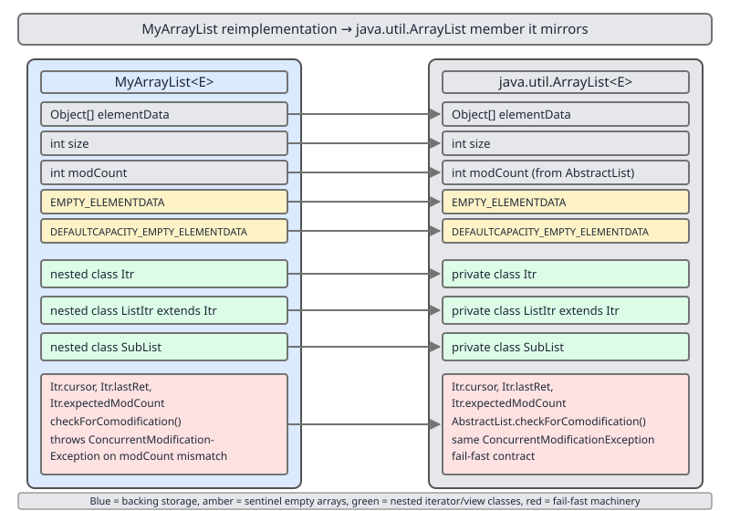

# 02 Java Collections — `ArrayList` — INTERNALS (§4.1 `MyArrayList<E>` — fields, growth and the core operations)

**Target version: Java 21 LTS.** | [Index](../00-index.md)
Previous: [array-list/04-amortised-analysis.md](04-amortised-analysis.md) · Next: [array-list/06-build-my-array-list-b-iterators.md](06-build-my-array-list-b-iterators.md)

Reading `java.util.ArrayList` teaches you what it does. Writing it teaches you *why every line is where it is*.

**The class is presented in five parts.** The complete, compiling `MyArrayList<E>` is the concatenation of the code blocks in this file and in [06](06-build-my-array-list-b-iterators.md), [07](07-build-my-array-list-c-sublist-and-equality.md), [08](08-build-my-array-list-d-bulk-sort-spliterator-and-diff.md) and [09](09-build-my-array-list-e-spliterator-diff-and-benchmark.md), in that order — typing out any one file alone gives you a class that does not compile. Every block is copied from a single source file that builds under JDK 21 with `-Xlint:all` and zero warnings; the compile command and the full runtime output of the demo `main` are at the end of [09](09-build-my-array-list-e-spliterator-diff-and-benchmark.md).

This file covers the storage core: the class head, the two empty-array sentinels, `grow`, the accessors, removal and the linear scans.

---

## The class map before the code



Look at the three arrows leaving `modCount`. It is written by the outer list and *read* by three nested types — `Itr`, `SubList`, `MySpliterator` — none of which own it. That single shared counter is the whole fail-fast design, and it is why a change made through any one of them is visible as a failure to the other two.

| Member of `MyArrayList` | Mirrors in `java.util.ArrayList` | Purpose |
|---|---|---|
| `Object[] elementData` | `elementData`, line 138 | The backing store. Length is *capacity*, not size. |
| `int size` | `size`, line 144 | Live element count. Everything past it is `null`. |
| `int modCount` (inherited) | `AbstractList.modCount` | Structural-change counter; the fail-fast token. |
| `EMPTY_ELEMENTDATA` | line 123 | Shared array for `new MyArrayList<>(0)`. |
| `DEFAULTCAPACITY_EMPTY_ELEMENTDATA` | line 130 | Shared array for `new MyArrayList<>()`. |
| `grow(int)` / `newLength` | `grow`, line 231 / `ArraysSupport.newLength`, line 735 | 1.5x growth with an overflow-safe clamp. |
| `Itr` / `ListItr` ([06](06-build-my-array-list-b-iterators.md)) | lines 1035 / 1102 | Fail-fast forward and bidirectional cursors. |
| `SubList` ([07](07-build-my-array-list-c-sublist-and-equality.md)) | line 1194 | Offset-into-parent write-through view. |
| `MySpliterator` ([08](08-build-my-array-list-d-bulk-sort-spliterator-and-diff.md)) | `ArrayListSpliterator`, line 1620 | Midpoint-splitting parallel source. |

**The design decision, stated up front.** `MyArrayList<E> extends AbstractList<E> implements List<E>, RandomAccess`. That is exactly what `java.util.ArrayList` does (`java.base/java/util/ArrayList.java`, JDK 21, line 119). `List<E>` declares 28 abstract methods; implementing it bare would mean hand-writing `containsAll`, iterator plumbing, `removeRange` and the `SubList` scaffolding before any of the interesting mechanics appear. Extending `AbstractList` inherits a handful and lets the rest be the point of the exercise. What we therefore inherit rather than write: `containsAll`, `AbstractCollection`'s helpers, the `ListIterator`-based defaults that `SubList` leans on, and the `modCount` field itself. That inheritance is a row in the diff table in [08](08-build-my-array-list-d-bulk-sort-spliterator-and-diff.md), because it is a real difference in how much of the mechanism you can see.

---

### The class head and the two empty-array sentinels (4.1.1, 4.1.2)

**Mental model.** An `ArrayList` is a slab plus a watermark. The slab is `elementData`, the watermark is `size`. Growth is the cost of replacing the slab; everything else is arithmetic against the watermark. The two sentinels exist because at construction time you do not yet know whether the caller wants a slab at all.

**Why they exist.** Before Java 7, `new ArrayList<>()` eagerly allocated `new Object[10]`. A program holding a million empty lists as map values paid ten million reference slots for nothing. JDK 7 introduced lazy allocation with one shared empty array; JDK 8 split it into *two*. The second exists to answer a question the first cannot: when the first element arrives, do I inflate to 10, or to 1?

- `new MyArrayList<>()` → `DEFAULTCAPACITY_EMPTY_ELEMENTDATA` → "the caller expressed no opinion, give them 10".
- `new MyArrayList<>(0)` → `EMPTY_ELEMENTDATA` → "the caller explicitly said zero, honour it, grow one at a time".

Both are `{}` — `length == 0`, identical content. They are distinguished only by **reference identity**, and that is the entire trick.

**When this matters, and when it does not.** It matters when you hold many empty lists (map values, per-entity buffers), and when you call `new ArrayList<>(0)` in a hot loop expecting frugality. It does not matter for a list you fill immediately; after the first two growths the two histories converge in cost. If you know the final size, `new MyArrayList<>(n)` beats both and skips growth entirely — see the sizing discussion in [01-internals-a-growth.md](01-internals-a-growth.md).

```java
public class MyArrayList<E> extends AbstractList<E> implements List<E>, RandomAccess {

    private static final int DEFAULT_CAPACITY = 10;
    private static final int SOFT_MAX_ARRAY_LENGTH = Integer.MAX_VALUE - 8;

    private static final Object[] EMPTY_ELEMENTDATA = {};
    private static final Object[] DEFAULTCAPACITY_EMPTY_ELEMENTDATA = {};

    Object[] elementData;
    private int size;
    // int modCount is inherited, protected, from java.util.AbstractList

    public MyArrayList() {
        this.elementData = DEFAULTCAPACITY_EMPTY_ELEMENTDATA;
    }

    public MyArrayList(int initialCapacity) {
        if (initialCapacity > 0) {
            this.elementData = new Object[initialCapacity];
        } else if (initialCapacity == 0) {
            this.elementData = EMPTY_ELEMENTDATA;
        } else {
            throw new IllegalArgumentException("Illegal Capacity: " + initialCapacity);
        }
    }

    public MyArrayList(Collection<? extends E> c) {
        Object[] a = c.toArray();
        if ((size = a.length) != 0) {
            this.elementData = Arrays.copyOf(a, size, Object[].class);
        } else {
            this.elementData = EMPTY_ELEMENTDATA;
        }
    }

    @SuppressWarnings("unchecked")
    static <E> E elementAt(Object[] es, int index) {
        return (E) es[index];
    }

    /** Exposed for the demo; java.util.ArrayList has no such accessor. */
    public int capacity() {
        return elementData.length;
    }
```

The `Arrays.copyOf(a, size, Object[].class)` in the collection constructor is not decoration. `c.toArray()` is permitted to return an array whose runtime type is *not* `Object[]` — `Arrays.asList("a").toArray()` historically returned a `String[]`, and storing an `Integer` into a `String[]` throws `ArrayStoreException`. This is JDK bug 6260652, fixed in Java 9; the three-argument `copyOf` forces the runtime type back to `Object[]`. See [D-02](../diagrams/D-02-array-covariance-hole.svg) and [01-internals-a-growth.md](01-internals-a-growth.md).

**Insight:** `capacity()` exists only so the demo can print it. `java.util.ArrayList` deliberately exposes no capacity getter — capacity is an implementation detail, and publishing it would freeze the growth policy into the API contract forever.

**Version trap:** "`new ArrayList<>()` allocates an array of 10" is true of Java 6 and earlier and false since Java 7. The claim still appears in interview prep material. What is true in Java 21: the array of 10 appears on the *first `add`*, not in the constructor.

**Interview:** *Why two empty arrays that are both `{}`?* Reference identity lets `grow` distinguish "defaulted, inflate to 10" from "explicitly zero, inflate to 1", using no extra field and no extra byte per instance.

> A sentinel array is a shared zero-length array whose *identity*, not its contents, encodes the construction history the growth policy needs.

---

### `grow` and the overflow-safe `newLength` (4.1.3)

**Mental model.** Growth answers one question: given where I am and the minimum I need, how big should the next slab be? The answer has a preferred component (1.5x, for amortisation) and a hard component (whatever the caller actually needs now), and the arithmetic has to survive both overflowing `int`.

**Why it exists.** Doubling wastes up to half the array; growing by a constant makes append quadratic. `oldCapacity + (oldCapacity >> 1)` is the compromise: geometric, so append stays amortised O(1), with a factor small enough that the peak transient footprint during a copy is 2.5x the live data rather than 3x. [04-amortised-analysis.md](04-amortised-analysis.md) does the accounting.

**How it works.** The real one delegates to `ArraysSupport.newLength(oldCapacity, minCapacity - oldCapacity, oldCapacity >> 1)` (`java.base/java/util/ArrayList.java`, JDK 21, line 237). `ArraysSupport` lives in `jdk.internal.util`, a package not exported to the unnamed module, so `MyArrayList` cannot call it and must reproduce the logic verbatim. That constraint is itself a diff-table row in [08](08-build-my-array-list-d-bulk-sort-spliterator-and-diff.md).

```java
    static int newLength(int oldLength, int minGrowth, int prefGrowth) {
        int prefLength = oldLength + Math.max(minGrowth, prefGrowth); // may overflow
        if (0 < prefLength && prefLength <= SOFT_MAX_ARRAY_LENGTH) {
            return prefLength;
        }
        return hugeLength(oldLength, minGrowth);
    }

    private static int hugeLength(int oldLength, int minGrowth) {
        int minLength = oldLength + minGrowth;
        if (minLength < 0) { // overflow: the request itself is impossible
            throw new OutOfMemoryError(
                "Required array length " + oldLength + " + " + minGrowth + " is too large");
        } else if (minLength <= SOFT_MAX_ARRAY_LENGTH) {
            return SOFT_MAX_ARRAY_LENGTH;
        } else {
            return minLength;
        }
    }

    private Object[] grow(int minCapacity) {
        int oldCapacity = elementData.length;
        if (oldCapacity > 0 || elementData != DEFAULTCAPACITY_EMPTY_ELEMENTDATA) {
            int newCapacity = newLength(oldCapacity,
                    minCapacity - oldCapacity, // minimum growth
                    oldCapacity >> 1);         // preferred growth
            return elementData = Arrays.copyOf(elementData, newCapacity);
        } else {
            return elementData = new Object[Math.max(DEFAULT_CAPACITY, minCapacity)];
        }
    }

    private Object[] grow() {
        return grow(size + 1);
    }
```

Four lines carry the decisions.

`0 < prefLength` is the overflow test. `oldLength + prefGrowth` on an array of 1.5 billion wraps negative; the check catches the wrap without wider arithmetic and without a branch on the common path — one add, one compare, one return, small enough to inline. The cold fallback lives in a separate `hugeLength` for exactly that reason.

`SOFT_MAX_ARRAY_LENGTH = Integer.MAX_VALUE - 8` (`ArraysSupport.java`, JDK 21, line 692) is not a JVM limit; it is a conservative under-estimate of one. HotSpot reserves array header words, so the true maximum length is implementation-specific and slightly below `Integer.MAX_VALUE`. Clamping means the *preferred* 1.5x growth stops there, but `hugeLength` still returns `minLength` above it when the caller genuinely needs those slots — a preference, not a wall.

`oldCapacity > 0 || elementData != DEFAULTCAPACITY_EMPTY_ELEMENTDATA` is the sentinel discrimination, ordered to short-circuit on the overwhelmingly common non-empty case before touching the reference comparison. Reaching the `else` means the array is the defaulted sentinel, so inflate to `max(10, minCapacity)` — `max`, not plain 10, because `addAll` of 50 elements to a fresh list must not grow twice.

`grow()` with no argument passes `size + 1`, making `minGrowth` exactly 1 and letting `prefGrowth` win for any capacity of 2 or more. That is why a single `add` on a full array of 10 produces 15 and not 11.

**Verified.** From the demo run:

```
default capacity before first add -> 0
default capacity after first add  -> 10
capacity after 11 adds            -> 15
zero-arg capacity before add      -> 0
zero-arg capacity after 1 add     -> 1
zero-arg capacity after 2 adds    -> 2
zero-arg capacity after 3 adds    -> 3
zero-arg capacity after 4 adds    -> 4
```

The zero-capacity sequence is 0, 1, 2, 3, 4 rather than 0, 1, 2, 4, 8 because `oldCapacity >> 1` is 0 for capacities 0 and 1, and for capacity 3 gives `3 + 1 = 4`. Only from capacity 4 does the 1.5x term dominate: next 6, then 9, then 13.

**Interview:** *Why not `Integer.MAX_VALUE` as the cap?* Because HotSpot cannot actually allocate an array of that length — the header occupies part of the object — and the exact limit varies by JVM. `MAX_VALUE - 8` is chosen to sit below any plausible implementation limit.

> `grow` computes a *preferred* 1.5x target, clamps it to a soft array-length maximum, and falls back to the caller's literal minimum only when the preference cannot be honoured — throwing `OutOfMemoryError` only if even the minimum overflows `int`.

---

### The accessors: `add`, `add(int,E)`, `set`, `get` (4.1.4)

**Mental model.** `get` and `set` are array indexing with a bounds check. `add` at the tail is a store plus a watermark bump. `add` in the middle is the only one that costs anything: it opens a one-slot gap with `System.arraycopy` and fills it.

**Why `Objects.checkIndex`.** Added in Java 9 specifically to be an intrinsic candidate. HotSpot recognises it and can fold it into the array access's own implicit bounds check, so the explicit check often costs nothing after JIT. Hand-writing `if (i < 0 || i >= size) throw new IndexOutOfBoundsException(...)` is semantically identical and measurably worse, because the message concatenation sits on the fast path unless the compiler hoists it.

```java
    @Override
    public int size() {
        return size;
    }

    @Override
    public boolean isEmpty() {
        return size == 0;
    }

    @Override
    public E get(int index) {
        Objects.checkIndex(index, size);
        return elementAt(elementData, index);
    }

    @Override
    public E set(int index, E element) {
        Objects.checkIndex(index, size);
        E oldValue = elementAt(elementData, index);
        elementData[index] = element;
        return oldValue;
    }

    @Override
    public boolean add(E e) {
        modCount++;
        add(e, elementData, size);
        return true;
    }

    private void add(E e, Object[] es, int s) {
        if (s == es.length) {
            es = grow();
        }
        es[s] = e;
        size = s + 1;
    }

    @Override
    public void add(int index, E element) {
        rangeCheckForAdd(index, size);
        modCount++;
        final int s = size;
        Object[] es = elementData;
        if (s == es.length) {
            es = grow();
        }
        System.arraycopy(es, index, es, index + 1, s - index);
        es[index] = element;
        size = s + 1;
    }

    private static void rangeCheckForAdd(int index, int size) {
        if (index > size || index < 0) {
            throw new IndexOutOfBoundsException("Index: " + index + ", Size: " + size);
        }
    }
```

Three decisions.

**`set` does not touch `modCount`.** Replacing an element is not a structural change — the size does not move, no cursor is invalidated. This is why `listIterator.set(x)` is legal mid-iteration and `list.add(x)` is not; [06](06-build-my-array-list-b-iterators.md) leans on it.

**The private three-argument `add(E, Object[], int)`** exists in the real one too (line 481). Hoisting `elementData` and `size` into parameters lets the JIT keep them in registers across the fast path and keeps the public `add(E)` body small enough to inline into caller loops. A JIT-shaped refactor, not a readability one.

**`rangeCheckForAdd` allows `index == size`, `checkIndex` does not.** Appending at the end is a legal insertion point but an illegal read position. Two different checks, two different exception messages, and they are not interchangeable. `Objects.checkIndex` has no inclusive-upper-bound variant that fits, so this one is hand-written.

**Verified:** `add(2,"c")` on `[a, b, d]` gives `[a, b, c, d]`; `new MyArrayList<String>(List.of("a")).get(5)` gives the message `Index 5 out of bounds for length 1`, character-identical to `java.util.ArrayList`, because both come from `Objects.checkIndex`.

> The accessors are array arithmetic with two distinct bounds checks: a read check with an exclusive upper bound of `size`, and an insert check with an inclusive one.

---

### `remove(int)`, `remove(Object)` and the trailing-null clear (4.1.5)

**Mental model.** Removal is the mirror of insertion: close the gap left-to-right with one `arraycopy`, then explicitly null the slot now past the watermark. That final null is not tidiness — it is the difference between a leak and a correct data structure.

**Why the null matters.** `size` shrinks but `elementData.length` does not. Leave the old reference in the vacated slot and the array — strongly reachable from the list — keeps the removed object alive indefinitely. A list that grows to 100 000 and shrinks to 3 would pin 99 997 dead objects. See the heap-dump walkthrough in [02-internals-b-mutation.md](02-internals-b-mutation.md) and [D-142](../diagrams/D-142-heap-dump-leak-hunt.svg).

```java
    @Override
    public E remove(int index) {
        Objects.checkIndex(index, size);
        final Object[] es = elementData;
        E oldValue = elementAt(es, index);
        fastRemove(es, index);
        return oldValue;
    }

    @Override
    public boolean remove(Object o) {
        final Object[] es = elementData;
        final int sz = size;
        int i = 0;
        found: {
            if (o == null) {
                for (; i < sz; i++) {
                    if (es[i] == null) {
                        break found;
                    }
                }
            } else {
                for (; i < sz; i++) {
                    if (o.equals(es[i])) {
                        break found;
                    }
                }
            }
            return false;
        }
        fastRemove(es, i);
        return true;
    }

    private void fastRemove(Object[] es, int i) {
        modCount++;
        final int newSize = size - 1;
        if (newSize > i) {
            System.arraycopy(es, i + 1, es, i, newSize - i);
        }
        es[size = newSize] = null;
    }

    private void shiftTailOverGap(Object[] es, int lo, int hi) {
        System.arraycopy(es, hi, es, lo, size - hi);
        for (int to = size, i = (size -= hi - lo); i < to; i++) {
            es[i] = null;
        }
    }

    @Override
    protected void removeRange(int fromIndex, int toIndex) {
        if (fromIndex > toIndex) {
            throw new IndexOutOfBoundsException(
                "fromIndex(" + fromIndex + ") > toIndex(" + toIndex + ")");
        }
        modCount++;
        shiftTailOverGap(elementData, fromIndex, toIndex);
    }
```

`fastRemove` is named "fast" because it skips the bounds check its callers already did. The guard `if (newSize > i)` suppresses a zero-length `arraycopy` when removing the last element — correct but pure overhead.

`es[size = newSize] = null` assigns the new size and uses it as the index of the slot to clear. After the shift, the removed element's duplicate sits at exactly `newSize`, one past the new watermark.

`shiftTailOverGap` (line 827) generalises this to a range and is the shared engine behind `removeRange`, `removeIf`, `removeAll` and `retainAll` ([08](08-build-my-array-list-d-bulk-sort-spliterator-and-diff.md)). Its null loop captures the *old* size into `to`, decrements `size` in the initialiser, and clears everything between the new and old watermarks — a variable number of slots, unlike `fastRemove`'s always-one.

**`remove(int)` shifts; `remove(Object)` scans then shifts.** Unrelated in cost: O(n − i) versus O(n) plus O(n − i).

**Verified.** After `remove(1)` on `[a, b, c]`: `[a, c] size=2 capacity=3`, and the demo's direct read of `elementData[2]` returns `null`. Capacity stays 3 — **removal never shrinks the array**; only `trimToSize` does ([07](07-build-my-array-list-c-sublist-and-equality.md)).

**Insight:** removal is the only place the invariant "everything at index ≥ `size` is `null`" can be violated, and every removal path in the class routes through `fastRemove` or `shiftTailOverGap` precisely so it is enforced in exactly two places.

> Removal closes the gap with one `arraycopy` and nulls every slot between the new and old sizes, because the backing array outlives the elements it no longer logically contains.

---

### The scans: `indexOf`, `lastIndexOf`, `contains` (4.1.6)

Supporting facts, three of them, one mechanism: a linear scan with the loop split on the null case, so the hot path never evaluates `o == null` per element.

```java
    @Override
    public int indexOf(Object o) {
        return indexOfRange(o, 0, size);
    }

    int indexOfRange(Object o, int start, int end) {
        Object[] es = elementData;
        if (o == null) {
            for (int i = start; i < end; i++) {
                if (es[i] == null) {
                    return i;
                }
            }
        } else {
            for (int i = start; i < end; i++) {
                if (o.equals(es[i])) {
                    return i;
                }
            }
        }
        return -1;
    }

    @Override
    public int lastIndexOf(Object o) {
        return lastIndexOfRange(o, 0, size);
    }

    int lastIndexOfRange(Object o, int start, int end) {
        Object[] es = elementData;
        if (o == null) {
            for (int i = end - 1; i >= start; i--) {
                if (es[i] == null) {
                    return i;
                }
            }
        } else {
            for (int i = end - 1; i >= start; i--) {
                if (o.equals(es[i])) {
                    return i;
                }
            }
        }
        return -1;
    }

    @Override
    public boolean contains(Object o) {
        return indexOf(o) >= 0;
    }

    @Override
    public Object[] toArray() {
        return Arrays.copyOf(elementData, size);
    }

    @Override
    @SuppressWarnings("unchecked")
    public <T> T[] toArray(T[] a) {
        if (a.length < size) {
            return (T[]) Arrays.copyOf(elementData, size, a.getClass());
        }
        System.arraycopy(elementData, 0, a, 0, size);
        if (a.length > size) {
            a[size] = null;
        }
        return a;
    }
```

The comparison is `o.equals(es[i])`, argument-first, so a `null` *stored element* is handled by the caller's `equals` rather than throwing. The range-taking variants exist so `SubList` can reuse them against an offset window without copying ([07](07-build-my-array-list-c-sublist-and-equality.md)). `contains` is `indexOf(o) >= 0`, not a fourth loop — the JIT inlines it away.

`toArray(T[])` writing `a[size] = null` when the caller's array is oversized is the documented `Collection` contract: it lets a caller who knows the collection contains no nulls use that trailing null as a terminator.

> The scans are linear, split on nullness of the *query* rather than per element, and expressed as range operations so views can share them.

---

## Pitfalls

### Believing the growth sequence from an explicit small capacity is 1.5x

**Wrong**

```java
MyArrayList<String> zero = new MyArrayList<>(0);
for (int i = 0; i < 4; i++) {
    zero.add("x");
    System.out.println(zero.capacity());
}
// expected 1, 2, 4, 8 -- doubling, or at least 1.5x
```

Actual output from the demo: `1`, `2`, `3`, `4`. Four allocations and four full copies for four elements.

**Right**

```java
MyArrayList<String> sized = new MyArrayList<>(4); // or just new MyArrayList<>()
for (int i = 0; i < 4; i++) {
    sized.add("x");
}
// capacity stays 4 throughout: zero reallocations
```

`oldCapacity >> 1` is integer division. For capacities 0, 1, 2 and 3 the preferred growth is 0, 0, 1 and 1, so `Math.max(minGrowth, prefGrowth)` picks the minimum growth of 1 every time. Geometric growth only takes over from capacity 4 upwards.

**Why people believe it:** "ArrayList grows by 50%" is repeated without the qualifier that 50% of a small number, floored, is often zero — and the widely-quoted 10 / 15 / 22 / 33 sequence starts from the *defaulted* path, which never passes through capacities 1 to 3.

### Calling `remove` with an `int` on a `List<Integer>`

**Wrong**

```java
List<Integer> l = new MyArrayList<>(List.of(10, 20, 30));
l.remove(2);                     // intent: remove the value 2
System.out.println(l);           // [10, 20] -- removed position 2, i.e. the value 30
```

**Right**

```java
List<Integer> l = new MyArrayList<>(List.of(10, 20, 30));
l.remove(Integer.valueOf(2));    // remove(Object): scans, finds nothing
System.out.println(l);           // [10, 20, 30] -- unchanged, and remove returned false
```

Java's overload resolution runs a first phase without boxing, so the literal `2` binds to `remove(int)` and never reaches `remove(Object)`. There is no way to make the index form mean "by value"; box explicitly at the call site. The costs differ too — the index form is O(n − i) with no `equals` calls, the object form is O(n) `equals` calls plus the shift.

**Why people believe it:** every other `Collection` method that takes an element takes `Object`, so `remove` looks like it should too, and the compiler is silent because both overloads are applicable.

### Hand-rolling the insert shift as a forward loop

**Wrong**

```java
// intending to open a gap at `index` before storing the new element
for (int i = index; i < size; i++) {
    es[i + 1] = es[i];           // reads a slot this loop already overwrote
}
es[index] = element;
// [a, b, c, d] with add(1, "X") -> [a, X, b, b, b]
```

**Right**

```java
System.arraycopy(es, index, es, index + 1, s - index);
es[index] = element;
// [a, b, c, d] with add(1, "X") -> [a, X, b, c, d]
```

`System.arraycopy` is specified to behave as if the source region were first copied to a temporary, so overlapping source and destination are safe in both directions. A hand-written loop has no such guarantee: shifting *right* must iterate right-to-left, or the first element smears across the tail.

**Why people believe it:** the equivalent shift for *removal* moves left and a forward loop is correct there, so the pattern gets copied to the insertion side where the direction is reversed.

---

## Cheat sheet

| Item | Value / rule |
|---|---|
| `DEFAULT_CAPACITY` | 10, applied on first `add` from the defaulted sentinel |
| `SOFT_MAX_ARRAY_LENGTH` | `Integer.MAX_VALUE - 8` |
| Growth formula | `oldCapacity + (oldCapacity >> 1)`, floored by the caller's minimum |
| Defaulted growth sequence | 10, 15, 22, 33, 49, 73 |
| `new MyArrayList<>(0)` sequence | 1, 2, 3, 4, 6, 9, 13 |
| Two sentinels | distinguished by reference identity, both `{}` |
| `modCount++` here | `add`, `add(int,E)`, `remove`, `removeRange` |
| No `modCount++` | `set`, `get`, `indexOf`, `contains`, `size`, `toArray` |
| Read bounds check | `Objects.checkIndex(i, size)` — exclusive upper bound, intrinsic candidate |
| Insert bounds check | `rangeCheckForAdd` — allows `i == size` |
| `add(int,E)` cost | O(n − i): one right-shifting `arraycopy` |
| `remove(int)` cost | O(n − i): one left-shifting `arraycopy` plus one null store |
| `remove(Object)` cost | O(n) scan, then O(n − i) shift |
| Trailing-null clear | `fastRemove` nulls 1 slot; `shiftTailOverGap` nulls `hi − lo` |
| Constructor from a `Collection` | three-arg `Arrays.copyOf` to force `Object[]` runtime type |
| Removal and capacity | removal never shrinks the array |

---

## Self-test

**Q1.** Both empty sentinels are `{}`. What information does having two of them actually carry, and where is it read?

<details><summary>Answer</summary>

The information is *reference identity*, encoding how the list was constructed: `DEFAULTCAPACITY_EMPTY_ELEMENTDATA` means no capacity hint was given, `EMPTY_ELEMENTDATA` means the caller explicitly asked for zero. It is read in exactly two places. In `grow(int)`, the test `oldCapacity > 0 || elementData != DEFAULTCAPACITY_EMPTY_ELEMENTDATA` decides whether the first inflation goes to `max(10, minCapacity)` or to the ordinary path (which from length 0 yields the caller's literal minimum, 1). In `ensureCapacity` ([07](07-build-my-array-list-c-sublist-and-equality.md)), the same reference test suppresses a pointless growth when the request is 10 or less on a defaulted list. Encoding this as a boolean field would cost bytes on every instance including the millions of non-empty ones; encoding it as identity costs nothing.

</details>

**Q2.** `newLength` tests `0 < prefLength` before comparing against the soft maximum. Why is that first half there, given the second half would also reject an oversized value?

<details><summary>Answer</summary>

Because `prefLength = oldLength + Math.max(minGrowth, prefGrowth)` is `int` arithmetic that can overflow. An `oldLength` near 1.5 billion plus its own half wraps to a *negative* number, and a negative number is trivially `<= SOFT_MAX_ARRAY_LENGTH`, so the second test alone would return it and the caller would try to allocate an array of negative length. The `0 <` test catches the wrap. It costs one comparison on a path already only two instructions long, and keeps the method small enough for HotSpot to inline — which is why the cold fallback lives in a separate `hugeLength` rather than inline in the `else`.

</details>

**Q3.** Why does `fastRemove` write `es[size = newSize] = null` rather than just decrementing `size`?

<details><summary>Answer</summary>

Because after the `arraycopy` shifts the tail one slot left, index `newSize` holds a stale duplicate of the element that used to be last. Decrementing `size` alone would hide it logically while leaving the reference reachable from `elementData`, which is itself reachable from the list, so the removed object could never be collected. A list that peaked at 100 000 and shrank to 3 would pin 99 997 dead objects. The fused `es[size = newSize] = null` assigns the new watermark and clears the slot at that watermark in one statement, making the coupling explicit. Every removal path routes through this method or `shiftTailOverGap`, so the invariant "everything at index ≥ `size` is `null`" is enforced in exactly two places.

</details>

**Q4.** `get` uses `Objects.checkIndex(index, size)` and `add(int,E)` uses `rangeCheckForAdd`. Why can they not share one check?

<details><summary>Answer</summary>

Their legal ranges differ. A read is valid for indices `0` to `size - 1`; an insertion is valid for `0` to `size` inclusive, because appending at the end is a legal insertion point. `Objects.checkIndex` implements the exclusive-upper-bound form and has no inclusive variant, so the insert check is hand-written. Beyond correctness, the read check is worth keeping as `Objects.checkIndex` specifically: it was added in Java 9 as a HotSpot intrinsic candidate, so the JIT can fold it into the array access's own implicit bounds check and often emit nothing at all. A hand-rolled read check with a concatenated exception message would sit on the hot path unless the compiler managed to hoist the string building, which it cannot always do.

</details>

**Q5.** `add(E)` is a two-line method that delegates to a private `add(E, Object[], int)`. What does the split buy?

<details><summary>Answer</summary>

Register allocation and inlining. Passing `elementData` and `size` as parameters lets the JIT keep them in registers for the duration of the call rather than re-reading two fields from the heap, and it keeps the public `add(E)` body — a `modCount++`, a call and a `return true` — small enough to be inlined into a caller's tight append loop even when the private helper is not. `java.util.ArrayList` does exactly the same at line 481. It is a shape chosen for the compiler, not for the reader; the same code written as one method is equally correct and measurably slower in an append benchmark.

</details>

**Q6.** Why is `indexOf` written as two separate loops rather than one loop with `Objects.equals(o, es[i])`?

<details><summary>Answer</summary>

To keep the null test out of the per-element path. `Objects.equals` evaluates `o == es[i] || (o != null && o.equals(es[i]))` on every element, so a scan of a million elements does a million redundant null checks on a query value that cannot change during the loop. Splitting hoists that decision out: the null branch compares references, the non-null branch calls `o.equals(es[i])` directly. Note the argument order — `o.equals(es[i])`, not `es[i].equals(o)` — so a `null` *stored* element is handled by the caller's `equals` implementation instead of throwing `NullPointerException`. The same split appears in `lastIndexOf`, and both are written as range methods so `SubList` can reuse them over an offset window.

</details>

**Q7.** The `Collection` constructor calls the three-argument `Arrays.copyOf(a, size, Object[].class)`. What breaks with the two-argument version?

<details><summary>Answer</summary>

`Arrays.copyOf(a, size)` preserves the runtime component type of `a`, and `c.toArray()` is not required to return an `Object[]`. `Arrays.asList("x").toArray()` historically returned a `String[]`. The list would then be backed by a `String[]`, and the first `add` of a non-`String` would throw `ArrayStoreException` from deep inside `add` — a failure with no obvious connection to the constructor that caused it. This is JDK bug 6260652; the JDK fixed `Arrays.asList` in Java 9 but kept the defensive three-argument copy, because `toArray` is overridable by any third-party collection and the contract still permits a narrower array type. It is the same array-covariance hole drawn in [D-02](../diagrams/D-02-array-covariance-hole.svg).

</details>

---

**Leaves covered:** 4.1.1–4.1.6 (6 leaves)
**Leaves deferred:** none
**Diagrams included:** D-145
**Target version:** Java 21 LTS
**Lines:** 600
