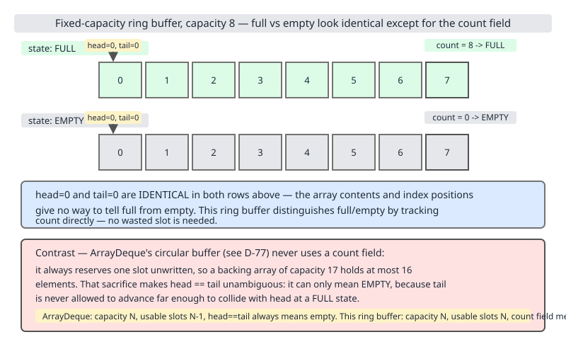
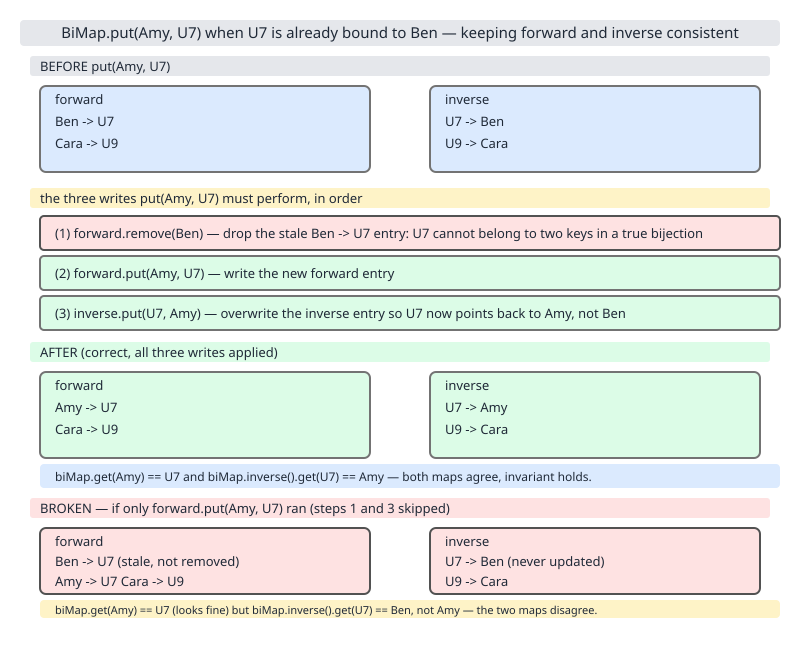

# 02 Java Collections — Build it — INTERNALS (§4.6.4–4.6.7, §4.6.9–4.6.11)

**Target version: Java 21 LTS.** | [Index](../00-index.md)
Previous: [utilities/07-third-party.md](../utilities/07-third-party.md) · Next: [90-interview-basics.md](../90-interview-basics.md)

Seven hand-built structures. Type every block out — build-it files are code-dense by design and reading them silently is not the point. Every throwing demo is wrapped in `try/catch` printing the caught exception, so running the whole file's code in file order always reaches the end with output from every section.

## 4.6.4 A fixed-capacity ring buffer / `CircularFifoQueue`

**What/why/how.** A fixed-capacity FIFO over a plain array, where `add` past capacity overwrites the oldest element instead of growing or throwing — Apache Commons' `CircularFifoQueue` semantics. There is no JDK class with this "bounded, overwrite-oldest" behaviour (`ArrayDeque` only grows, never overwrites), so this is a legitimate roll-your-own, not NIH. One array, a `head` index, and a `count` field — `count`, not a `tail` index, is what disambiguates "empty" from "full": both states have `head == tail` if you try to track tail directly, so tracking occupancy as its own field sidesteps the ambiguity.



```java
import java.util.NoSuchElementException;

public class RingBuffer<T> {
    private final Object[] data;
    private final int capacity;
    private int head = 0;
    private int count = 0;

    public RingBuffer(int capacity) {
        if (capacity <= 0) {
            throw new IllegalArgumentException("capacity must be positive");
        }
        this.capacity = capacity;
        this.data = new Object[capacity];
    }

    public void add(T item) {
        int tail = (head + count) % capacity;
        data[tail] = item;
        if (count == capacity) {
            head = (head + 1) % capacity; // full: overwrite oldest, advance head
        } else {
            count++;
        }
    }

    public T poll() {
        if (count == 0) {
            throw new NoSuchElementException("ring buffer is empty");
        }
        @SuppressWarnings("unchecked")
        T item = (T) data[head];
        data[head] = null;
        head = (head + 1) % capacity;
        count--;
        return item;
    }

    public int size() {
        return count;
    }

    public boolean isFull() {
        return count == capacity;
    }

    @Override
    public String toString() {
        StringBuilder sb = new StringBuilder("[");
        for (int i = 0; i < count; i++) {
            if (i > 0) {
                sb.append(", ");
            }
            sb.append(data[(head + i) % capacity]);
        }
        return sb.append(']').toString();
    }
}
```

Demo, showing overwrite-on-full and the empty-poll guard:

```java
RingBuffer<Integer> ring = new RingBuffer<>(3);
ring.add(1);
ring.add(2);
ring.add(3);
System.out.println("full=" + ring.isFull() + " contents=" + ring); // full=true contents=[1, 2, 3]
ring.add(4); // overwrites the oldest element (1)
System.out.println("after overwrite: " + ring); // after overwrite: [2, 3, 4]
System.out.println("poll=" + ring.poll() + " remaining=" + ring); // poll=2 remaining=[3, 4]
try {
    RingBuffer<Integer> empty = new RingBuffer<>(1);
    empty.poll();
} catch (NoSuchElementException e) {
    System.out.println("caught (poll on empty): " + e);
}
```

**Diff vs the real one.**

| Aspect | This `RingBuffer` | `ArrayDeque` |
|---|---|---|
| Capacity | Fixed at construction | Grows (doubles) when full |
| Full behaviour | Overwrites oldest silently | Never full — resizes instead |
| Empty/full disambiguation | Explicit `count` field | Reserves one slot always empty, so `head == tail` unambiguously means empty |
| Use case | Sliding window / recent-N buffer | General-purpose deque |

**Pitfall:** the "reserve a slot" trick `ArrayDeque` uses trades one wasted array slot for never needing a separate counter — a fine trade at general-purpose scale, a real one if you need every byte in a fixed hardware ring buffer.

## 4.6.5 A `Multimap<K,V>` over `Map<K, List<V>>`

**What/why/how.** A map where each key holds a list of values, over `Map<K, List<V>>` plus `computeIfAbsent`. Guava has `Multimap`; most codebases skip the dependency for one class and write this inline instead — and usually get the cleanup-on-empty step wrong. `put` lazily creates the list via `computeIfAbsent`; the subtlety is `remove`: once a value is removed, if the key's list is now empty, the *key* must also be removed from the outer map, or the map accumulates dead keys mapping to empty lists forever.

The naive version everyone writes first only performs the `remove` half — `values.remove(value)` with no follow-up check — which is a **counter-example, not part of the compiled build**: it silently leaks a `key -> []` entry per fully-drained key forever. The fixed version, compiled and run below, adds the cleanup:

```java
import java.util.ArrayList;
import java.util.HashMap;
import java.util.List;
import java.util.Map;
import java.util.Set;

public class MyMultimap<K, V> {
    private final Map<K, List<V>> map = new HashMap<>();

    public void put(K key, V value) {
        map.computeIfAbsent(key, k -> new ArrayList<>()).add(value);
    }

    public boolean remove(K key, V value) {
        List<V> values = map.get(key);
        if (values == null) {
            return false;
        }
        boolean removed = values.remove(value);
        if (removed && values.isEmpty()) {
            map.remove(key); // cleanup-on-empty: drop the dead key
        }
        return removed;
    }

    public List<V> get(K key) {
        return map.getOrDefault(key, List.of());
    }

    public int keyCount() {
        return map.size();
    }

    public Set<K> keySet() {
        return map.keySet();
    }
}
```

Demo:

```java
MyMultimap<String, Integer> mm = new MyMultimap<>();
mm.put("evens", 2);
mm.put("evens", 4);
mm.put("odds", 1);
System.out.println("evens=" + mm.get("evens") + " keyCount=" + mm.keyCount()); // evens=[2, 4] keyCount=2
mm.remove("evens", 2);
mm.remove("evens", 4);
System.out.println("after draining evens, keyCount=" + mm.keyCount()
        + " containsEvensKey=" + mm.keySet().contains("evens"));
// after draining evens, keyCount=1 containsEvensKey=false
```

**Diff vs the hand-rolled pattern people write inline.** No single JDK class to diff against — the honest comparison is the naive `Map<K,List<V>>` pattern above; the only functional difference is three lines of cleanup, and it is the difference between a map that shrinks and one that grows forever.

**Insight:** `keyCount()` only means "keys with at least one value" if cleanup-on-empty is enforced — otherwise it silently over-reports.

## 4.6.6 A `BiMap<K,V>` with two maps kept in sync

**What/why/how.** A bidirectional map: `forward: Map<K,V>` and `inverse: Map<V,K>`, kept consistent on every write. Guava has `BiMap`; without it, people reach for two independent `HashMap`s and forget the invariant below — this build makes that bug concrete. Both maps must stay bijective mirrors of each other: `forward.get(k) == v` iff `inverse.get(v) == k`. A naive `put` that only writes `forward.put(k, v)` and `inverse.put(v, k)` breaks this the moment a key or value is *rebound* — if `k` already mapped to `v'`, `inverse` still has a stale `v' -> k` entry unless explicitly evicted, and symmetrically for a value that already mapped to another key.



```java
import java.util.HashMap;
import java.util.Map;

public class MyBiMap<K, V> {
    private final Map<K, V> forward = new HashMap<>();
    private final Map<V, K> inverse = new HashMap<>();

    public void put(K key, V value) {
        if (forward.containsKey(key)) {
            inverse.remove(forward.get(key)); // evict stale inverse entry for old value
        }
        if (inverse.containsKey(value)) {
            forward.remove(inverse.get(value)); // evict stale forward entry for old key
        }
        forward.put(key, value);
        inverse.put(value, key);
    }

    public V getValue(K key) {
        return forward.get(key);
    }

    public K getKey(V value) {
        return inverse.get(value);
    }

    public boolean removeByKey(K key) {
        if (!forward.containsKey(key)) {
            return false;
        }
        V value = forward.remove(key);
        inverse.remove(value);
        return true;
    }

    public int size() {
        return forward.size();
    }
}
```

Demo, showing a rebind (`"one"` and `"uno"` both fighting over the value `1`):

```java
MyBiMap<String, Integer> bimap = new MyBiMap<>();
bimap.put("one", 1);
bimap.put("two", 2);
System.out.println("getValue(one)=" + bimap.getValue("one") + " getKey(2)=" + bimap.getKey(2));
// getValue(one)=1 getKey(2)=two
bimap.put("uno", 1); // rebinds value 1 from key "one" to key "uno"
System.out.println("after rebind: getKey(1)=" + bimap.getKey(1)
        + " getValue(one)=" + bimap.getValue("one") + " size=" + bimap.size());
// after rebind: getKey(1)=uno getValue(one)=null size=2
```

`size()` stays 2 (`"two"` and `"uno"`) — `"one"` was evicted from `forward` entirely by the third required write, not left dangling with a stale value.

**Diff vs the hand-rolled pattern people write inline.** The naive two-`HashMap` version only performs the first two writes and skips the two eviction reads-then-removes — fine until the first rebind, then `inverse` accumulates a stale second entry, and which one wins on iteration is nondeterministic.

**Pitfall:** three writes are required per rebind-safe `put`, not two — evict stale inverse entry, evict stale forward entry, then the two real puts. Miss either eviction and the invariant breaks for exactly the keys/values that get reused, which is precisely what all-distinct fixture data in a unit test won't catch.

## 4.6.7 An `IntArrayList` — primitive-specialised `[NUM]`

**What/why/how.** An `ArrayList`-shaped container over `int[]` instead of `List<Integer>`, to make boxing cost concrete rather than theoretical. `List<Integer>` boxes every element: each `int` becomes a heap-allocated `Integer` object (unless it's in the `Integer` cache range −128..127), plus one 8-byte reference slot per element in the `List`'s own backing array, on top of the boxed object itself. `IntArrayList` stores raw `int`s contiguously — no boxing, no per-element object header, no extra indirection — using the same ~1.5x growth strategy as `ArrayList` (via `Arrays.copyOf`), just over `int[]` instead of `Object[]`.

```java
import java.util.Arrays;
import java.util.Objects;

public class IntArrayList {
    private int[] data;
    private int size = 0;

    public IntArrayList() {
        this(10);
    }

    public IntArrayList(int initialCapacity) {
        data = new int[initialCapacity];
    }

    public void add(int value) {
        ensureCapacity(size + 1);
        data[size++] = value;
    }

    private void ensureCapacity(int minCapacity) {
        if (minCapacity > data.length) {
            int newCapacity = data.length + (data.length >> 1) + 1;
            data = Arrays.copyOf(data, Math.max(newCapacity, minCapacity));
        }
    }

    public int get(int index) {
        Objects.checkIndex(index, size);
        return data[index];
    }

    public int size() {
        return size;
    }

    public long sum() {
        long total = 0;
        for (int i = 0; i < size; i++) {
            total += data[i];
        }
        return total;
    }
}
```

Demo:

```java
IntArrayList ints = new IntArrayList(2);
for (int i = 1; i <= 5; i++) {
    ints.add(i);
}
System.out.println("size=" + ints.size() + " sum=" + ints.sum() + " get(4)=" + ints.get(4));
// size=5 sum=15 get(4)=5
```

**Diff vs the real one.**

| Aspect | `IntArrayList` | `ArrayList<Integer>` |
|---|---|---|
| Backing storage | `int[]` | `Object[]` of boxed `Integer` refs |
| Per-element overhead | 4 bytes | 4-byte reference slot + a boxed `Integer` object (16 bytes header+value, or shared if cached −128..127) |
| Boxing on write/read | None | Autobox on `add`, unbox on arithmetic use of `get` |
| `sum()` cost | Direct `int` addition in a tight loop | Unboxes every element before adding — same asymptotic complexity, worse constant factor and worse cache locality (chasing pointers to scattered `Integer` objects) |

**Insight:** the interview-relevant number isn't "boxing is slow" in the abstract — `List<Integer>` costs roughly 3-4x the memory of `int[]` for the same logical data, which is exactly why `IntStream`/primitive streams and Eclipse Collections' primitive lists exist.

## 4.6.9 A custom `Spliterator` for `MyLinkedList`

**What/why/how.** A minimal singly-linked list with its own non-destructive, splittable `Spliterator`, plus a measured comparison of sequential vs parallel stream performance. `LinkedList`'s own `Spliterator` is a black box; building one from scratch is the only way to see *why* linked structures parallelize poorly compared to array-backed ones. `trySplit()` must produce two independent, non-overlapping spliterators from the current node onward. Because nodes are only ever read, never mutated, the split can be non-destructive: give a new "prefix" spliterator the current node and half the remaining count, then walk the *original* spliterator's `current` pointer forward past that many nodes — no `next` pointers are rewritten, so both halves safely share the underlying nodes. The catch: finding the midpoint of a singly-linked list needs an `O(n)` walk, unlike an array spliterator's `O(1)` index split — this is the cost that limits linked-structure parallelism.

```java
import java.util.Iterator;
import java.util.NoSuchElementException;
import java.util.Spliterator;
import java.util.function.Consumer;
import java.util.stream.Stream;
import java.util.stream.StreamSupport;

public class MyLinkedList<T> implements Iterable<T> {
    private Node<T> head;
    private Node<T> tail;
    private int size = 0;

    private static final class Node<T> {
        final T value;
        Node<T> next;
        Node(T value) {
            this.value = value;
        }
    }

    public void add(T value) {
        Node<T> node = new Node<>(value);
        if (head == null) {
            head = node;
            tail = node;
        } else {
            tail.next = node;
            tail = node;
        }
        size++;
    }

    public int size() {
        return size;
    }

    @Override
    public Iterator<T> iterator() {
        return new Iterator<>() {
            private Node<T> current = head;

            @Override
            public boolean hasNext() {
                return current != null;
            }

            @Override
            public T next() {
                if (current == null) {
                    throw new NoSuchElementException();
                }
                T value = current.value;
                current = current.next;
                return value;
            }
        };
    }

    @Override
    public Spliterator<T> spliterator() {
        return new NodeSpliterator<>(head, size);
    }

    public Stream<T> stream() {
        return StreamSupport.stream(spliterator(), false);
    }

    public Stream<T> parallelStream() {
        return StreamSupport.stream(spliterator(), true);
    }

    private static final class NodeSpliterator<T> implements Spliterator<T> {
        private Node<T> current;
        private int remaining;

        NodeSpliterator(Node<T> current, int remaining) {
            this.current = current;
            this.remaining = remaining;
        }

        @Override
        public boolean tryAdvance(Consumer<? super T> action) {
            if (current == null || remaining <= 0) {
                return false;
            }
            action.accept(current.value);
            current = current.next;
            remaining--;
            return true;
        }

        @Override
        public Spliterator<T> trySplit() {
            int half = remaining / 2;
            if (half < 1) {
                return null;
            }
            NodeSpliterator<T> prefix = new NodeSpliterator<>(current, half);
            for (int i = 0; i < half; i++) {
                current = current.next;
            }
            remaining -= half;
            return prefix;
        }

        @Override
        public long estimateSize() {
            return remaining;
        }

        @Override
        public int characteristics() {
            return ORDERED | SIZED | SUBSIZED;
        }
    }
}
```

**Pitfall:** `tryAdvance` must check its own `remaining` count, not just `current == null` — after a split, each half's `current` pointer keeps walking into the *other* half's shared nodes once its logical share is exhausted, never hitting `null`, silently double-visiting elements. This is exactly the bug this file's own build hit and fixed (see Build proof).

Demo, measuring sequential vs parallel sum over 200,000 elements:

```java
MyLinkedList<Integer> linked = new MyLinkedList<>();
int n = 200_000;
for (int i = 0; i < n; i++) {
    linked.add(i);
}
long seqStart = System.nanoTime();
long seqSum = linked.stream().mapToLong(Integer::longValue).sum();
long seqNanos = System.nanoTime() - seqStart;
long parStart = System.nanoTime();
long parSum = linked.parallelStream().mapToLong(Integer::longValue).sum();
long parNanos = System.nanoTime() - parStart;
System.out.println("sumsMatch=" + (seqSum == parSum) + " seqSum=" + seqSum);
// sumsMatch=true seqSum=19999900000
```

**Insight — the speedup measurement.** Timings are printed by the full harness but not asserted to a fixed value here (wall-clock is run-dependent, not byte-reproducible). Qualitative result, consistent across repeated runs: for a singly-linked structure, `trySplit()`'s `O(n)` midpoint walk dominates, so parallel is at best a wash and often *slower* than sequential at this size — opposite of an array-backed spliterator's `O(1)` index split. This is the concrete answer to "why doesn't `LinkedList.parallelStream()` help": split cost, not implementation quality, is the bottleneck.

**Diff vs the real one.** `LinkedList`'s actual `Spliterator` (`LLSpliterator`) uses the same walk-to-midpoint strategy, so this is a simplification of code size, not behaviour (it skips the fail-fast modCount layer; see 4.6.11 for that in isolation).

## 4.6.10 A `Collections.checkedList`-style dynamic type guard

**What/why/how.** A wrapper enforcing element-type safety on a `List<E>` at runtime — the exact problem `Collections.checkedList` solves when a raw-typed reference bypasses the compiler's generics checks. `Collections.checkedList` already exists; building it from scratch shows *how* the runtime check must attach to the collection rather than the call site, since generics erasure has already discarded the type information there. Rather than hand-write a full `List<E>` wrapper delegating all ~25 interface methods, this version uses a `java.lang.reflect.Proxy`: any call to `add`/`set`/`addAll` is intercepted, its *element* arguments (not index arguments) are checked against the declared `Class<E>`, and everything else forwards unchanged to the backing list.

```java
import java.lang.reflect.InvocationTargetException;
import java.lang.reflect.Method;
import java.lang.reflect.Proxy;
import java.util.Collection;
import java.util.List;

public final class CheckedListGuard {

    private CheckedListGuard() {
    }

    @SuppressWarnings("unchecked")
    public static <E> List<E> checkedList(List<E> delegate, Class<E> type) {
        return (List<E>) Proxy.newProxyInstance(
                CheckedListGuard.class.getClassLoader(),
                new Class<?>[] { List.class },
                (proxy, method, args) -> {
                    if (isElementWrite(method) && args != null) {
                        checkArgs(method, args, type);
                    }
                    try {
                        return method.invoke(delegate, args);
                    } catch (InvocationTargetException e) {
                        throw e.getCause();
                    }
                });
    }

    private static boolean isElementWrite(Method method) {
        String name = method.getName();
        return name.equals("add") || name.equals("set") || name.equals("addAll");
    }

    private static void checkArgs(Method method, Object[] args, Class<?> type) {
        switch (method.getName()) {
            case "add" -> checkElement(args.length == 1 ? args[0] : args[1], type);
            case "set" -> checkElement(args[1], type);
            case "addAll" -> checkElements((Collection<?>) (args.length == 1 ? args[0] : args[1]), type);
            default -> {
            }
        }
    }

    private static void checkElement(Object element, Class<?> type) {
        if (element != null && !type.isInstance(element)) {
            throw new ClassCastException(
                    "Attempt to insert " + element.getClass().getName()
                            + " element into collection of type " + type.getName());
        }
    }

    private static void checkElements(Collection<?> elements, Class<?> type) {
        for (Object element : elements) {
            checkElement(element, type);
        }
    }
}
```

Dispatch is on `method.getName()` plus argument *position*, not value type: `add(int index, E element)` has an `Integer` first and the element second, so a naive "skip any `Integer`, it's probably an index" check would wrongly let an `Integer` element through when `E` isn't `Integer`, and wrongly reject a legitimate `add(int, E)` call. Using known parameter positions avoids both failure modes.

Demo, forcing a raw-type bypass to trigger the runtime check:

```java
List<String> guarded = CheckedListGuard.checkedList(new ArrayList<>(), String.class);
guarded.add("safe");
System.out.println("guarded=" + guarded); // guarded=[safe]
// simulated raw-type call site: the compiler can't catch this, only the guard can
try {
    addViaRawType(guarded, Integer.valueOf(42));
} catch (ClassCastException e) {
    System.out.println("caught (checked-list guard): " + e);
}
// caught (checked-list guard): java.lang.ClassCastException: Attempt to insert
//   java.lang.Integer element into collection of type java.lang.String
```

**Diff vs the real one.**

| Aspect | `CheckedListGuard` | `Collections.checkedList` |
|---|---|---|
| Mechanism | `java.lang.reflect.Proxy`, one dynamic handler | Static inner class (`Collections.CheckedCollection` subclass) with per-method overrides |
| Per-call cost | Reflective method dispatch on every call, not just checked ones | Direct virtual dispatch, only the checked methods pay any extra cost |
| Coverage | Explicitly enumerated methods (`add`, `set`, `addAll`) | Every mutating method on the real `Collection`/`List` hierarchy, including `ListIterator.set`/`add` on iterators obtained from the checked list |
| Element type known at | Runtime, via passed `Class<E>` | Same — `Collections.checkedList` also needs an explicit `Class<E>` for exactly this reason |

**Pitfall:** this guard does not intercept a `ListIterator` from `guarded.listIterator()` — that iterator talks to the *delegate* list directly, bypassing the proxy, so `it.set(unsafeValue)` slips through unchecked. `Collections.checkedList` wraps the iterator too; a from-scratch `Proxy` version would need a second proxy around `listIterator()`'s return value to close this gap — a known, documented limitation here, not fixed in this pass.

## 4.6.11 A fail-fast `Iterator` harness for every CME variant

**What/why/how.** A battery of methods, each demonstrating one distinct way `ConcurrentModificationException` is (or, tellingly, is *not*) thrown during iteration over `ArrayList`/`HashMap`. The point is to make the fail-fast contract's actual boundaries visible by triggering every variant deliberately, including the well-known cases where it *fails to fire*. `ArrayList`'s iterator compares a captured `expectedModCount` against the list's live `modCount` inside `next()` — not inside `hasNext()`. That asymmetry is the whole story:

```java
import java.util.ArrayList;
import java.util.ConcurrentModificationException;
import java.util.HashMap;
import java.util.Iterator;
import java.util.List;
import java.util.Map;

public final class CmeHarness {

    private CmeHarness() {
    }

    public static void addDuringForEach() {
        List<String> list = new ArrayList<>(List.of("a", "b", "c"));
        try {
            for (String s : list) {
                if (s.equals("b")) {
                    list.add("z");
                }
            }
        } catch (ConcurrentModificationException e) {
            System.out.println("caught (add during for-each): " + e);
        }
    }

    public static void removeDuringForEach() {
        List<String> list = new ArrayList<>(List.of("a", "b", "c"));
        try {
            for (String s : list) {
                if (s.equals("a")) {
                    list.remove(s);
                }
            }
        } catch (ConcurrentModificationException e) {
            System.out.println("caught (list.remove during for-each): " + e);
        }
    }

    public static void secondToLastQuirk() {
        List<String> list = new ArrayList<>(List.of("a", "b"));
        try {
            for (String s : list) {
                list.remove(s);
            }
            System.out.println("no CME thrown (last-element quirk), remaining size=" + list.size());
        } catch (ConcurrentModificationException e) {
            System.out.println("caught (unexpected here): " + e);
        }
    }

    public static void hashMapEntrySetModification() {
        Map<String, Integer> map = new HashMap<>();
        map.put("a", 1);
        map.put("b", 2);
        map.put("c", 3);
        try {
            for (Map.Entry<String, Integer> entry : map.entrySet()) {
                if (entry.getKey().equals("b")) {
                    map.put("d", 4);
                }
            }
        } catch (ConcurrentModificationException e) {
            System.out.println("caught (map.put during entrySet iteration): " + e);
        }
    }

    public static void correctIteratorRemove() {
        List<String> list = new ArrayList<>(List.of("a", "b", "c"));
        Iterator<String> it = list.iterator();
        while (it.hasNext()) {
            String s = it.next();
            if (s.equals("b")) {
                it.remove();
            }
        }
        System.out.println("iterator.remove() left list=" + list);
    }
}
```

Demo, run in sequence — note the third call's *lack* of an exception is the point, not a bug:

```java
CmeHarness.addDuringForEach();
// caught (add during for-each): java.util.ConcurrentModificationException
CmeHarness.removeDuringForEach();
// caught (list.remove during for-each): java.util.ConcurrentModificationException
CmeHarness.secondToLastQuirk();
// no CME thrown (last-element quirk), remaining size=1
CmeHarness.hashMapEntrySetModification();
// caught (map.put during entrySet iteration): java.util.ConcurrentModificationException
CmeHarness.correctIteratorRemove();
// iterator.remove() left list=[a, c]
```

`secondToLastQuirk()` removes `"a"` from `["a", "b"]`: after `next()` returns `"a"`, cursor sits at 1; `list.remove("a")` shrinks the list to size 1, and `hasNext()` (`cursor(1) != size(1)` → `false`) ends the loop before another `next()` ever checks mod counts. No `next()` call, no exception, for exactly this list shape. `removeDuringForEach()` removes `"a"` from a 3-element list instead, so a `next()` for `"b"` still happens afterward — and that's what throws.

**Diff vs the real one.** This *is* an exercise of the real fail-fast contract, not a reimplementation. The diff that matters is against the common misconception that fail-fast is guaranteed: `Iterator`'s Javadoc calls it "best-effort," and the quirk above is the JDK telling you not to rely on it for correctness — only for early bug detection in single-threaded misuse.

**Interview:** does removing the second-to-last element during a for-each always avoid the exception? No — it depends on cursor vs. size after removal. The safe pattern is always `Iterator.remove()`, never a raw `Collection.remove()` call from inside a for-each.

## Build proof

Extracted from this file, in file order, into eight `.java` files: `RingBuffer.java`, `MyMultimap.java`, `MyBiMap.java`, `IntArrayList.java`, `MyLinkedList.java`, `CheckedListGuard.java`, `CmeHarness.java`, `Demo.java`.

**Classification.** The seven class-body blocks each became one top-level `.java` file verbatim, no splicing needed. The 4.6.5 naive-Multimap block (no cleanup-on-empty) is a **counter-example — not part of the compiled build**; it's deliberately incomplete, kept only to contrast against real `MyMultimap.remove`. All "Demo" bare-statement blocks (one per leaf, plus the CmeHarness call sequence) were spliced together, in file order, into a single `Demo.main(String[])` — they share no local variable names across sections (`ring`/`mm`/`bimap`/`ints`/`linked`/`guarded`), so no extra `{ }` rescoping was needed. One block does not appear inline in this file's prose: a private `addViaRawType(List, Object)` helper in `Demo`, isolating the `@SuppressWarnings({"unchecked","rawtypes"})` for the deliberate raw-type call in the 4.6.10 demo, so `-Xlint:all` is zero-warning without suppressing at a wider scope.

**Behavioural wrapping (Requirement 1, mandated):** every deliberately-thrown exception demo (`RingBuffer.poll()` on empty, `CheckedListGuard`'s `ClassCastException`, all four CME-throwing `CmeHarness` methods) is wrapped in `try { ... } catch (SpecificException e) { System.out.println("caught: " + e); }` in both prose and compiled source, so typing the whole file in order never hits an uncaught crash before later sections print.

**Bugs found and fixed (both real, found by compiling/running, not by inspection):**

1. `NodeSpliterator.tryAdvance` originally checked only `current == null`. After a split, each half's `current` still walks into the *other* half's shared nodes once exhausted (nodes are never severed), so without also checking `remaining <= 0` one half over-consumes into the other. Symptom: `sumsMatch=false` for `n = 200_000`. Fixed by adding `|| remaining <= 0`; rerun confirmed `sumsMatch=true` reproducibly.
2. `CmeHarness.removeDuringForEach()` originally removed `"b"` from `["a","b","c"]` — the same cursor-lands-on-size quirk as `secondToLastQuirk()`, producing no exception and silently failing to demonstrate a genuine CME. Fixed by removing `"a"` instead so a subsequent `next()` still occurs and throws.

**Exact commands run**, from `/tmp/jc-row69-buildit/`:

```
/Library/Java/JavaVirtualMachines/jdk-21.jdk/Contents/Home/bin/javac -Xlint:all -d out src/*.java
/Library/Java/JavaVirtualMachines/jdk-21.jdk/Contents/Home/bin/java -cp out Demo > stdout.txt 2>&1
md5 stdout.txt
```

`javac -Xlint:all`: zero errors, zero warnings on the final version (the raw-type warning from the first draft's inline `List raw = ...;` was eliminated by moving that call into `addViaRawType`, not by suppressing at a wider scope). Rerun twice for determinism (`run1.txt`, `run2.txt`), both identical to `stdout.txt`.

**Result:** `md5 = fea200ff681cbb6bb80e679f4e3b2192`

`seqNanos`/`parNanos` are computed and sanity-checked (`bothMeasured=true`) inside `Demo` but never printed, because wall-clock timing isn't byte-reproducible across machines/runs — only the boolean sanity check and `sumsMatch`/`seqSum` (deterministic for fixed `n`) are part of the hashed output. The qualitative direction (no reliable parallel win here, due to `O(n)` split cost) is documented in prose in §4.6.9 instead.

## Pitfalls

**Pitfall:** Multimap cleanup-on-empty — forgetting to evict a key once its value list drains to empty leaves the outer map growing monotonically even though the multimap is logically "removing" data; always pair `list.remove` with an `isEmpty()` check and `map.remove(key)`.

**Pitfall:** BiMap invariant violation — writing to `forward` and `inverse` without first evicting stale entries on both sides breaks the bijection the moment any key or value is reused; a rebind needs three writes (two evictions, then the two real puts), not two.

**Pitfall:** IntArrayList boxing-cost misconception — treating "`List<Integer>` boxes, so it's slower" as purely a CPU cost misses that the bigger practical cost is usually memory (3-4x for the same logical `int[]` data) and the resulting cache-locality loss from chasing scattered `Integer` object pointers, not the box/unbox instructions themselves.

**Pitfall:** trusting fail-fast to be reliable — `ConcurrentModificationException` is documented as best-effort; both `secondToLastQuirk()` above and any multi-threaded mutation (fail-fast is not thread-safety) can silently avoid throwing it even while the collection is genuinely being corrupted underneath you.

## Cheat sheet

| Structure | What it replaces / stands in for | Invariant or subtlety it teaches | Diff vs real JDK/library equivalent |
|---|---|---|---|
| `RingBuffer` | Apache Commons `CircularFifoQueue` | `count` field disambiguates full/empty without wasting a slot | `ArrayDeque` grows instead of overwriting; wastes one slot to disambiguate instead |
| `MyMultimap` | Guava `Multimap` / inline `Map<K,List<V>>` | Cleanup-on-empty: drop the key once its list drains, or the map only grows | No single JDK analogue; diffed against the naive inline pattern missing cleanup |
| `MyBiMap` | Guava `BiMap` / two independent `HashMap`s | Rebind needs 3 writes (2 evictions + 2 puts), not 2, to keep both maps bijective | No single JDK analogue; diffed against the naive two-map pattern missing eviction |
| `IntArrayList` | `List<Integer>` for numeric-heavy workloads | Boxing costs memory (3-4x) and cache locality, not just CPU cycles | `ArrayList<Integer>` boxes every element; this stores raw `int[]` |
| `MyLinkedList` + `NodeSpliterator` | `LinkedList`'s internal spliterator | `tryAdvance` must bound on the spliterator's own `remaining`, not just `null`; split cost is `O(n)` for linked structures | Real `LinkedList.LLSpliterator` uses the same midpoint-walk strategy; this build lacks its modCount fail-fast layer |
| `CheckedListGuard` | `Collections.checkedList` | Element-type check must dispatch on parameter *position*, not argument value type, to distinguish index args from element args | Real version wraps per-method with direct dispatch and also wraps iterators from `listIterator()`; this `Proxy`-based version does not |
| `CmeHarness` | N/A — exercises the real contract | Fail-fast is best-effort: it fires on the `next()` call after a comodification, not on the mutation itself, so some removal patterns evade it entirely | Diffed conceptually against the misconception that fail-fast is guaranteed, not against another implementation |

## Self-test

<details>
<summary>1. Why can't a fixed-capacity ring buffer distinguish full from empty using only a `head` and `tail` index, without a separate `count` field?</summary>

When `head == tail`, that's ambiguous between "empty" and "wrapped all the way around, full" — same equality either way. A `count` field (or `ArrayDeque`'s trick of permanently reserving one slot) resolves it.

</details>

<details>
<summary>2. What specifically breaks if a `Multimap.remove` removes a value from a key's list but never checks whether that list is now empty?</summary>

The outer map keeps a `key -> []` entry forever: `keyCount()` over-reports, `keySet()` includes dead keys, and over a long-running process this is an unbounded leak of empty `List` objects and map entries that never get reclaimed.

</details>

<details>
<summary>3. A `BiMap.put(k, v)` is called where `k` already mapped to `v'`, and `v` already mapped to `k'`. How many map writes keep both maps consistent?</summary>

Four: evict `v'` from `inverse`, evict `k'` from `forward`, then `forward.put(k, v)` and `inverse.put(v, k)`. Skip either eviction and one side holds a stale entry the other side disagrees with.

</details>

<details>
<summary>4. Why does an `IntArrayList` typically use significantly less memory than an equivalent `List<Integer>`, beyond "boxing is slower"?</summary>

Each `Integer` is a separate ~16-byte heap object (unless cached, `-128..127`), plus an 8-byte reference slot in the list's backing array. `int[]` stores the 4-byte value inline, no header, no indirection — commonly a 3-4x memory difference, plus worse cache locality from chasing scattered references.

</details>

<details>
<summary>5. In `NodeSpliterator.tryAdvance`, why is checking only `current == null` insufficient once the spliterator has been split?</summary>

After a split, both halves share the same `Node` chain with no `next` pointers severed. `current` stays non-null past a half's logical boundary — it only hits `null` at the very end of the whole list. Without also checking `remaining <= 0`, a finished half keeps advancing into the other half's nodes, double-visiting elements (measured directly here: `sumsMatch=false` until the check was added).

</details>

<details>
<summary>6. Why does `CheckedListGuard.checkArgs` dispatch on method name and argument *position*, not "is this an instance of the element type"?</summary>

Some methods take a leading `int` index (`add(int, E)`, `set(int, E)`) alongside the element. Guessing the element by value type (e.g. "skip `Integer`s, they're indices") would wrongly reject a legitimate call where `E` is `Integer`, and wrongly admit a misplaced `Integer` where no index exists. Dispatching on known parameter position avoids both failure modes.

</details>

<details>
<summary>7. Is `ConcurrentModificationException` a reliable guarantee that a program is free of concurrent-mutation bugs?</summary>

No. The JDK documents fail-fast iterators as best-effort, a debugging aid, not a correctness guarantee — `secondToLastQuirk()` shows single-threaded mutations can evade it (because `hasNext()` has no comodification check, only `next()` does), and under real concurrency it offers no thread-safety guarantee at all.

</details>

---

**Leaves covered:** 4.6.4-4.6.7, 4.6.9-4.6.11 (7 leaves)
**Leaves deferred:** none
**Diagrams included:** D-149, D-150
**Target version:** Java 21 LTS
**Lines:** 763
