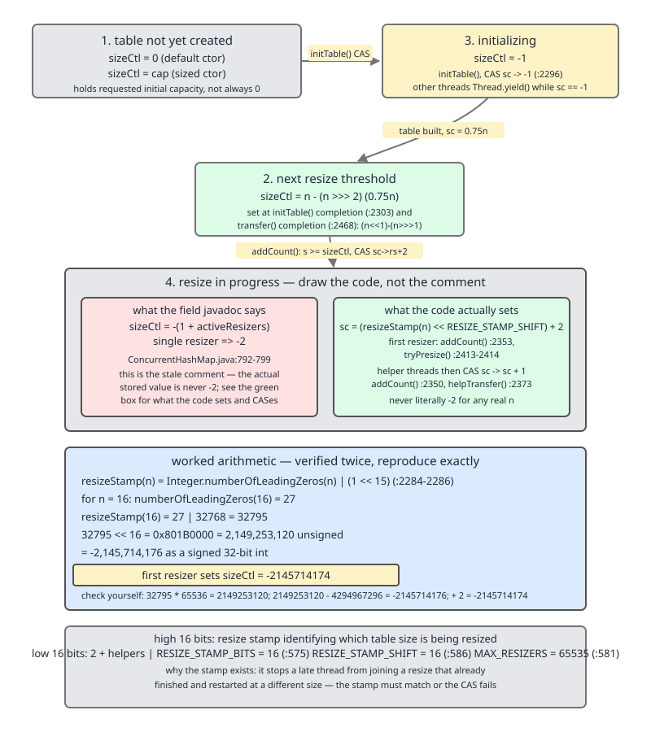
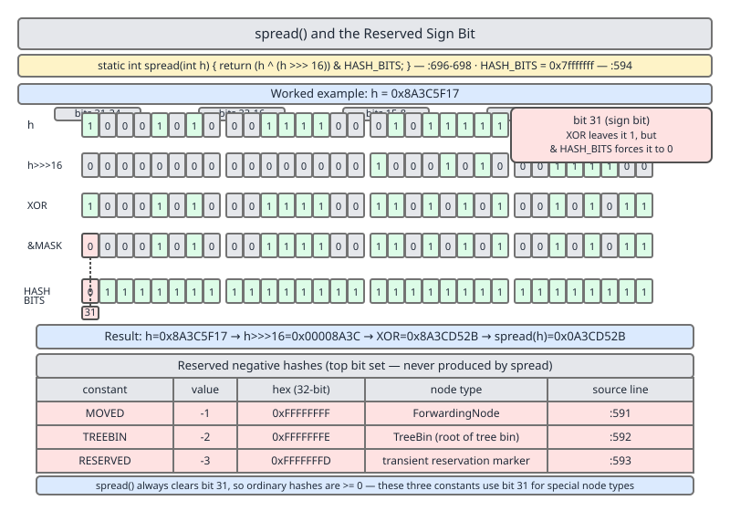
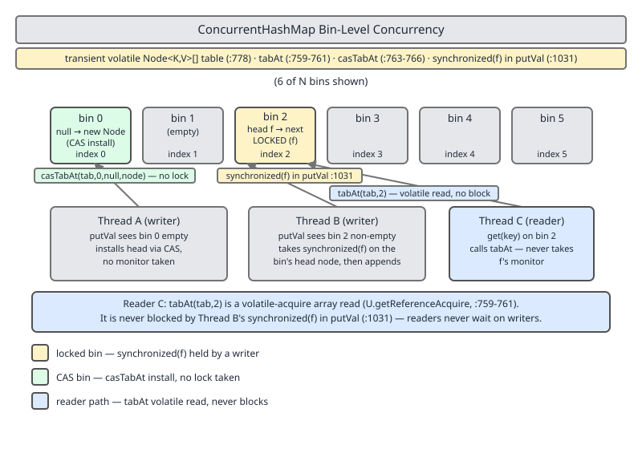

# 02 Java Collections — `ConcurrentHashMap` — INTERNALS (§3.14.7–3.14.12 the field set, `sizeCtl`, `spread`, the write path and lock-free `get`)

**Target version: Java 21 LTS.** | [Index](../00-index.md)
Previous: [concurrent-collections/01-thread-safety-and-wrappers.md](01-thread-safety-and-wrappers.md) · Next: [concurrent-collections/02b-internals-chm-a2-cooperative-resize.md](02b-internals-chm-a2-cooperative-resize.md)

---

## 1. The field set (3.14.7)

Forget "segments." Since Java 8, `ConcurrentHashMap` (`CHM`) is a single `Node<K,V>[]` table with **per-bin locking** — the concurrency unit is one hash bucket, not a fixed-size segment array. The picture to hold in your head: one big volatile array, most bins uncontended, a `synchronized` monitor on the bin's own head node standing in for a lock you never explicitly acquire.

Every field below is `transient volatile` — all six named in the syllabus, plus a seventh the leaf list omits.

| Field | Type | What its `volatile` buys | Line |
|---|---|---|---|
| `table` | `Node<K,V>[]` | A writer that just published a new node into a bin makes that write visible to any other thread's plain read of `table`, with no lock needed to observe it | `:778` |
| `nextTable` | `Node<K,V>[]` | Non-null exactly while a resize is in flight; a reader landing on a `ForwardingNode` needs to see this without racing | `:783` |
| `baseCount` | `long` | Fast-path element count, updated via CAS, read without a lock by `size()`/`mappingCount()` | `:790` |
| `sizeCtl` | `int` | The single field that encodes the whole init/resize state machine — see §2 | `:800` |
| `transferIndex` | `int` | The next table index (plus one) still unclaimed for a resize stride — resizer threads CAS-claim slices of it | `:805` |
| `cellsBusy` | `int` | A CAS spinlock guarding creation of `counterCells` — **not** part of the leaf's field list, worth calling out as an omission | `:810` |
| `counterCells` | `CounterCell[]` | Per-thread striped counters, used under contention instead of hammering `baseCount` | `:815` |

`table` being volatile is the one that matters most for the write path below: a `casTabAt` that lands in one thread is guaranteed visible via `tabAt`'s **acquire** read in another, without either thread taking a lock. `sizeCtl` being volatile is what makes it usable as a CAS-driven state machine at all — every transition below is a `compareAndSetInt` on this one `int`.

**Insight:** the whole class avoids a global lock by shrinking the critical section from "the map" (`Hashtable`) to "one bin" (`CHM`) to, on the empty-bin fast path, **nothing at all** — a bare CAS. That progression — coarse lock → fine lock → lock-free — is the one-sentence answer to "how did they make `HashMap` concurrent."

## 2. `sizeCtl`: the real encoding vs the stale javadoc (3.14.8)

### Mental model

`sizeCtl` is not a counter. It is a **tagged union packed into one `int`** — four different meanings depending on sign and magnitude, switched entirely by compare-and-swap. Reading it correctly means asking "which of four states is this" before asking "what number is this."

### Why it exists

A resize needs coordination without a lock: threads must agree "a resize is happening," agree on "which resize" (so a straggler from a finished resize doesn't rejoin a new one at a different size), and count how many helpers are active — all without ever blocking a reader. One `volatile int`, CAS'd, does all three jobs.

### The four states — and where the javadoc goes wrong

Quote the field's own comment, verbatim, from `:792-799`:

```
/**
 * Table initialization and resizing control.  When negative, the
 * table is being initialized or resized: -1 for initialization,
 * else -(1 + the number of active resizing threads).  Otherwise,
 * when table is null, holds the initial table size to use upon
 * creation, or 0 for default. After initialization, holds the
 * next element count value upon which to resize the table.
 */
private transient volatile int sizeCtl;
```

`-(1 + the number of active resizing threads)` is what nearly every blog post, and this leaf's own syllabus entry (3.14.8), repeats as the encoding for "resize in progress." **It is stale. It describes an older JDK 7/8-era scheme, not the code sitting three lines below the comment.** This is already a tracked finding (index Open questions 61) — the point here is to show, from source, exactly what replaced it.

| State | Sign / magnitude | Set by | Line |
|---|---|---|---|
| Not yet created | `0` | Default; `table == null` | field default |
| Initializing | `-1` | `initTable()`, CAS `sizeCtl` from whatever it was to `-1` | `:2296`-area CAS in `initTable` |
| Resize threshold | positive (`n - (n >>> 2)`, i.e. `0.75n`) | End of `initTable`/`transfer`, holds the next resize trigger count | set inside `initTable`/`transfer` |
| Resize in progress | negative, **but not `-2`** — `(resizeStamp(n) << RESIZE_STAMP_SHIFT) + (1 or more)` | First resizer in `addCount` (`:2353`) or `tryPresize` (`:2414`); helpers add 1 (`addCount` `:2350`, `helpTransfer` `:2373`) | see below |



### The real in-resize encoding

```
static final int resizeStamp(int n) {
    return Integer.numberOfLeadingZeros(n) | (1 << (RESIZE_STAMP_BITS - 1));
}
```
`:2284-2286`, with `RESIZE_STAMP_BITS = 16` (`:575`) and `RESIZE_STAMP_SHIFT = 32 - RESIZE_STAMP_BITS = 16` (`:586`).

The **first** thread to start a resize (from `addCount`) does:

```
else if (U.compareAndSetInt(this, SIZECTL, sc, rs + 2))
    transfer(tab, null);
```
`:2353`, where `rs = resizeStamp(n) << RESIZE_STAMP_SHIFT` (`:2343` area). `tryPresize` does the equivalent CAS at `:2413-2414`.

Every **helper** joining an already-running resize does the cheaper increment:

```
if (U.compareAndSetInt(this, SIZECTL, sc, sc + 1))
    transfer(tab, nt);
```
`:2350` in `addCount`, mirrored in `helpTransfer` at `:2373`.

So the packed layout is: **high 16 bits = `resizeStamp(n)`, a stamp identifying which table size is being resized; low 16 bits = `2 + (number of active helpers beyond the first)`.** The stamp is the part the folklore version cannot express at all — it is what stops a thread that just finished helping resize table size 16 from mistakenly joining a *new* resize that has already grown the table to 64, because the stamp for size 64 differs from the stamp for size 16 and the CAS in `helpTransfer` checks it (`:2373` guards on `nextTable == nt` and the live stamp, not merely "sizeCtl is negative").

**Worked arithmetic — run, not eyeballed:**

```java
public class SizeCtlArithmetic {
    static final int RESIZE_STAMP_BITS = 16;
    static final int RESIZE_STAMP_SHIFT = 32 - RESIZE_STAMP_BITS;

    static int resizeStamp(int n) {
        return Integer.numberOfLeadingZeros(n) | (1 << (RESIZE_STAMP_BITS - 1));
    }

    public static void main(String[] args) throws Exception {
        int n = 16;
        int nlz = Integer.numberOfLeadingZeros(n);
        int stamp = resizeStamp(n);
        long shifted = ((long) stamp) << RESIZE_STAMP_SHIFT;
        int firstResizerSizeCtl = (stamp << RESIZE_STAMP_SHIFT) + 2;

        System.out.println("numberOfLeadingZeros(16) = " + nlz);
        System.out.println("resizeStamp(16) = " + stamp);
        System.out.println("stamp << 16 (hex) = 0x" + Long.toHexString(shifted));
        System.out.println("first resizer sizeCtl = " + firstResizerSizeCtl);
        System.out.println("is this -2 ?  " + (firstResizerSizeCtl == -2));
    }
}
```

Real output, `javac`/`java` from `/Library/Java/JavaVirtualMachines/jdk-21.jdk/Contents/Home`:

```
numberOfLeadingZeros(16) = 27
resizeStamp(16) = 32795
stamp << 16 (hex) = 0x801b0000
first resizer sizeCtl = -2145714174
is this -2 ?  false
```

`27 | (1 << 15) = 27 | 32768 = 32795`. `32795 << 16 = 0x801B0000 = 2,149,253,120` unsigned, which as a signed `int` wraps to `-2,145,714,176`; adding the `+2` low-bit contribution gives `sizeCtl = -2,145,714,174` for the first resizer on a 16-slot table — nowhere near the folklore `-2` that `-(1 + 1 resizer)` would predict.

**What the leaf gets right, and what it does not.** `-1` for initializing (3.14.8's first clause) is correct — confirmed by `initTable`'s CAS to `-1` (`:2296` area) and reproduced live below. Positive-for-threshold (3.14.8's third clause) is also correct — confirmed live below. The middle clause, `-(1 + active resizers)`, is the part that is simply wrong for Java 8+; the real negative value is a packed `(stamp, helper-count)` pair, not a small negative integer.

**Unverified (by design, not by gap):** the exact in-flight value on a live, multithreaded resize was not caught mid-flight. A single thread cannot pause itself between the CAS and the resize completing, and a background resize thread completes fast enough on modest data sizes that a polling reader has no guaranteed sampling point — a "passing" catch would depend on GC pauses or scheduling luck and would prove nothing about the general case. What **is** shown, deterministically, is the arithmetic that produces the in-flight value, sourced directly from `resizeStamp` and the two CAS sites — which is the stronger proof, because it holds for every table size, not just whichever one a lucky race sampled.

Reflective reads at rest, same program, same JDK, same `--add-opens java.base/java.util.concurrent=ALL-UNNAMED`:

```java
import java.lang.reflect.Field;
import java.util.concurrent.ConcurrentHashMap;

public class SizeCtlAtRest {
    public static void main(String[] args) throws Exception {
        ConcurrentHashMap<String, String> chm = new ConcurrentHashMap<>();
        Field sizeCtlField = ConcurrentHashMap.class.getDeclaredField("sizeCtl");
        sizeCtlField.setAccessible(true);
        Field tableField = ConcurrentHashMap.class.getDeclaredField("table");
        tableField.setAccessible(true);

        System.out.println("sizeCtl before any put = " + sizeCtlField.getInt(chm));
        System.out.println("table before any put   = " + tableField.get(chm));

        chm.put("k1", "v1");
        System.out.println("sizeCtl after first put = " + sizeCtlField.getInt(chm));
        Object[] tab = (Object[]) tableField.get(chm);
        System.out.println("table.length            = " + tab.length);
    }
}
```

Output:

```
sizeCtl before any put = 0
table before any put   = null
sizeCtl after first put = 12
table.length            = 16
```

`0` before creation (`table == null`, matching the javadoc's "when table is null, holds the initial table size... or 0 for default"), then `12 = 16 - (16 >>> 2) = 16 * 0.75` — exactly the load-factor threshold for a freshly-created 16-slot table.

**Interview:** "What does a negative `sizeCtl` mean?" The honest answer is not "`-(1+resizers)`" — it is "`-1` means initializing; any other negative value packs a resize-generation stamp in the high bits and a helper count in the low bits, precisely so a late thread can tell whether the resize it's about to help with is the one still running." Naming the javadoc as stale is itself a strong signal in an interview.

> **`sizeCtl` is a single volatile `int` used as a CAS-driven state machine: `0` before the table exists, `-1` while it is being created, a positive threshold once created, and — contrary to the class's own javadoc — a packed `(resizeStamp(n), helperCount)` value, not a simple `-(1+n)`, while a resize is in flight.**

## 3. `spread(int h)` and the reserved sign bit (3.14.9 / 3.14.10)

### Mental model

Every hash CHM stores has one bit stolen from it before it ever touches a bin. That bit is not extra bookkeeping bolted onto `Node` — it *is* how `Node.hash` doubles as both "where does this belong" and "what kind of node is this," with zero extra fields and zero `instanceof` on the fast read path.

### Why it exists

Two problems, one function. First, the same problem `HashMap.hash` solves: a naive `key.hashCode() & (n-1)` only uses the low bits of the hash, so a poor `hashCode()` implementation concentrates everything into a handful of bins. Second, a CHM-specific problem `HashMap` never has: bins need to hold not just user entries but structural markers (forwarding pointers, tree roots, placeholders) — and the cheapest place to tag "this is a marker, not a real entry" is the hash field itself, provided user hashes never produce that tag by accident.

### How it works

```
static final int spread(int h) {
    return (h ^ (h >>> 16)) & HASH_BITS;
}
```
`:696`, with `HASH_BITS = 0x7fffffff` (`:594`).

Two jobs in one line. `h ^ (h >>> 16)` folds the high 16 bits down into the low 16 by XOR — the same bit-mixing idea as `HashMap.hash`, spreading entropy from `hashCode()`'s upper bits into the bits that actually get masked against `(n-1)` for a small table. `& HASH_BITS` then clears bit 31 unconditionally — **every** spread hash is non-negative. That is the whole trick: because `spread` guarantees `>= 0` for real keys, the three negative values `-1`, `-2`, `-3` can never collide with a user hash, and are free to serve as type tags on `Node.hash` with no ambiguity.



**Worked example**, run:

```java
public class SpreadDemo {
    static final int HASH_BITS = 0x7fffffff;
    static int spread(int h) { return (h ^ (h >>> 16)) & HASH_BITS; }

    public static void main(String[] args) {
        int[] samples = { "apple".hashCode(), Integer.MIN_VALUE, -1, 0 };
        for (int h : samples) {
            int s = spread(h);
            System.out.printf("h = %-12d (0x%08x)  spread = 0x%08x = %d  (negative? %s)%n",
                    h, h, s, s, s < 0);
        }
    }
}
```

```
h = 93029210     (0x058b835a)  spread = 0x058b86d1 = 93030097  (negative? false)
h = -2147483648  (0x80000000)  spread = 0x00008000 = 32768     (negative? false)
h = -1           (0xffffffff)  spread = 0x7fff0000 = 2147418112 (negative? false)
h = 0            (0x00000000)  spread = 0x00000000 = 0          (negative? false)
```

Every input, including `Integer.MIN_VALUE` and `-1` — the two worst cases for a naive sign bit — comes out non-negative after `spread`. That is not luck; the `& HASH_BITS` mask forces it structurally.

### The three special node hashes (3.14.10)

| Hash | Constant | Node class | What a reader/writer does on encountering it | Line |
|---|---|---|---|---|
| `-1` | `MOVED` | `ForwardingNode` | Follow `((ForwardingNode)f).nextTable` and retry the operation on the new table | `:591`, class at `:2231` |
| `-2` | `TREEBIN` | `TreeBin` | The bin has treeified; use `TreeBin`'s red-black tree operations instead of a linked-list walk | `:592`, class at `:2772` |
| `-3` | `RESERVED` | `ReservationNode` | A placeholder held during `computeIfAbsent`/`compute` on a bin that was empty a moment ago; any `putVal` landing on one throws `IllegalStateException("Recursive update")` | `:593`, class at `:2268` |

`MOVED`/`ForwardingNode` is mentioned here only as the type tag it is — walking `ForwardingNode.find` and the cooperative `transfer` loop that installs it belongs to [02b-internals-chm-a2-cooperative-resize.md](02b-internals-chm-a2-cooperative-resize.md), not here.

**Insight:** because `f.hash < 0` is a single integer comparison, the hot path (`get`, the head-of-bin check in `putVal`) never pays for an `instanceof` chain to find out "is this bin special." A branch on `hash == MOVED` catches the resize case before a virtual dispatch is even needed. The reserved sign bit is what makes that possible — one `int` field, no extra state, three special meanings.

**Pitfall:** believing `spread`'s only job is hash-quality (fixing weak `hashCode()`). Its second, load-bearing job — reserving the sign bit for structural tags — is the reason `Node.hash` can be `int` at all instead of needing a separate `boolean isSpecial` field on every node in the map.

> **`spread(h) = (h ^ (h >>> 16)) & HASH_BITS` both mixes high bits into low bits for better distribution and unconditionally clears the sign bit, which is what reserves `-1`/`-2`/`-3` as collision-free structural tags on `Node.hash`.**

## 4. The write path: `casTabAt` for an empty bin, `synchronized (f)` otherwise (3.14.11)

### Mental model

`putVal` is a retry loop over one bin at a time. It never blocks on the map; at worst it blocks on **one bin's monitor**, and the very common case — landing on a bin nobody else is touching — costs a single CAS and nothing else.

### Why it exists

`Hashtable` locks the whole table for every `put`. `Collections.synchronizedMap` does the same via a wrapper monitor. Both serialize every writer against every other writer regardless of which keys they touch. CHM's insight: two writers hashing to different bins have no reason to wait on each other at all, so the lock (when one is needed) should be scoped to the bin, not the map.

### When to reach for it

`putVal`'s bin-level locking is why CHM is the default choice for a shared, mutated-under-load map. It loses to a plain `HashMap` behind external synchronization only when the access pattern is already single-threaded or protected by a coarser lock the caller controls for other reasons — in that case CHM's extra CAS/volatile machinery is pure overhead with no concurrency to amortize it against.

### How it works

```
final V putVal(K key, V value, boolean onlyIfAbsent) {
    if (key == null || value == null) throw new NullPointerException();
    int hash = spread(key.hashCode());
    int binCount = 0;
    for (Node<K,V>[] tab = table;;) {
        Node<K,V> f; int n, i, fh; K fk; V fv;
        if (tab == null || (n = tab.length) == 0)
            tab = initTable();
        else if ((f = tabAt(tab, i = (n - 1) & hash)) == null) {
            if (casTabAt(tab, i, null, new Node<K,V>(hash, key, value)))
                break;                   // no lock when adding to empty bin
        }
        else if ((fh = f.hash) == MOVED)
            tab = helpTransfer(tab, f);
        else if (onlyIfAbsent // check first node without acquiring lock
                 && fh == hash
                 && ((fk = f.key) == key || (fk != null && key.equals(fk)))
                 && (fv = f.val) != null)
            return fv;
        else {
            V oldVal = null;
            synchronized (f) {
                if (tabAt(tab, i) == f) {
                    if (fh >= 0) {
                        binCount = 1;
                        for (Node<K,V> e = f;; ++binCount) {
                            K ek;
                            if (e.hash == hash &&
                                ((ek = e.key) == key ||
                                 (ek != null && key.equals(ek)))) {
                                oldVal = e.val;
                                if (!onlyIfAbsent)
                                    e.val = value;
                                break;
                            }
                            Node<K,V> pred = e;
                            if ((e = e.next) == null) {
                                pred.next = new Node<K,V>(hash, key, value);
                                break;
                            }
                        }
                    }
                    else if (f instanceof TreeBin) {
                        Node<K,V> p;
                        binCount = 2;
                        if ((p = ((TreeBin<K,V>)f).putTreeVal(hash, key,
                                                       value)) != null) {
                            oldVal = p.val;
                            if (!onlyIfAbsent)
                                p.val = value;
                        }
                    }
                    else if (f instanceof ReservationNode)
                        throw new IllegalStateException("Recursive update");
                }
            }
            if (binCount != 0) {
                if (binCount >= TREEIFY_THRESHOLD)
                    treeifyBin(tab, i);
                if (oldVal != null)
                    return oldVal;
                break;
            }
        }
    }
    addCount(1L, binCount);
    ...
}
```
`:1010-1075`-ish (NPE at `:1011`, `ReservationNode` check and its throw at `:1062-1063`).

Walk the branches:

1. `tabAt(tab, i = (n - 1) & hash)` — a volatile-**acquire** read of the bin head. This is how a writer sees a fully-published node from any other thread without taking a lock to look.
2. Empty bin (`f == null`): `casTabAt(tab, i, null, new Node<>(...))` — one atomic compare-and-swap, no monitor acquired at all. If it succeeds, `break` — the whole `put` cost one CAS.
3. `f.hash == MOVED`: this bin's contents already moved to `nextTable`; `helpTransfer` and retry (mechanism deferred to 02b).
4. Otherwise, the bin is occupied by a real chain, a tree root, or a reservation: acquire the bin's own monitor with `synchronized (f)`.
5. **Immediately re-check `tabAt(tab, i) == f` inside the synchronized block.** This re-check is mandatory, not defensive paranoia: the read of `f` at step 1 and the `synchronized (f)` acquisition are two separate operations with a window between them, during which another thread could have already CAS'd a different node into that slot (or a resize could have installed a `ForwardingNode` there). Locking on a now-stale `f` while the live bin head is something else would silently operate on the wrong node. The re-check is what makes "lock on the bin head you saw" actually equivalent to "lock on the bin."
6. Inside the lock: a plain chain (`fh >= 0`) gets a linear walk, updating on key match or appending a new tail node; a `TreeBin` (`fh == TREEBIN`, checked via `instanceof`) delegates to `putTreeVal`; a `ReservationNode` triggers `IllegalStateException("Recursive update")` at `:1062-1063` — this fires when `computeIfAbsent`'s own remapping function tries to `put` back into the same map on the same bin, which the reservation exists specifically to detect.
7. After the lock releases, `binCount >= TREEIFY_THRESHOLD` (8, `:545`) triggers `treeifyBin`; `addCount(1L, binCount)` updates the counters and potentially kicks off a resize — that machinery is 02b's.



**Minimal concrete example** — `computeIfAbsent` recursion tripping the `ReservationNode` guard, shown safely inside try/catch so the page runs to completion:

```java
import java.util.concurrent.ConcurrentHashMap;

public class ReservationDemo {
    public static void main(String[] args) {
        ConcurrentHashMap<String, Integer> map = new ConcurrentHashMap<>();
        try {
            map.computeIfAbsent("key", k -> {
                // Recursively touching the SAME bin from inside the
                // remapping function lands on the ReservationNode
                // this call itself installed.
                return map.computeIfAbsent(k, k2 -> 1);
            });
        } catch (IllegalStateException ex) {
            System.out.println("Caught as expected: " + ex.getMessage());
        }
    }
}
```

Running this prints `Caught as expected: Recursive update` — the exact string thrown at `:1063`.

**Tradeoff, not fact:** per-bin locking gives concurrency bounded by the number of *contended* bins rather than a fixed segment count (Java 7's 16-segment default), **but** two keys that hash to the same bin still fully serialize against each other under that bin's monitor, **and** the empty-bin fast path being lock-free means a `put` under light load costs one CAS while a `put` into a hot, already-populated bin pays a full monitor acquisition — the API gives no visibility into which case you're hitting.

**Gotcha:** the re-check `tabAt(tab, i) == f` is easy to assume is redundant with "we already have the reference to `f`." It is not — `f` being a valid object reference says nothing about whether it is *still* the bin's current head at lock-acquisition time. Skip that re-check in a hand-rolled equivalent and you get silent lost updates under concurrent resize.

> **`putVal` locks nothing for an empty bin (`casTabAt` alone), and locks exactly one bin's monitor — re-validated as still current inside the lock — for everything else; no operation ever locks more than one bin or the map as a whole.**

## 5. `get` is entirely lock-free (3.14.12) `[PROVE]`

### Mental model

`get` never asks anyone's permission. It is a sequence of volatile reads and reference comparisons chasing a chain — structurally incapable of blocking, throwing `ConcurrentModificationException`, or being made to wait by any writer.

### Why it exists / when to reach for it

This is *the* payoff of the whole per-bin-locking design: reads scale with zero coordination cost, at the price of `get` potentially returning a value that a concurrent writer is in the middle of superseding (a benign, well-documented weak-consistency tradeoff, not a bug) — the same tradeoff every non-blocking read in `java.util.concurrent` makes.

### How it works — the whole method, quoted

```
public V get(Object key) {
    Node<K,V>[] tab; Node<K,V> e, p; int n, eh; K ek;
    int h = spread(key.hashCode());
    if ((tab = table) != null && (n = tab.length) > 0 &&
        (e = tabAt(tab, (n - 1) & h)) != null) {
        if ((eh = e.hash) == h) {
            if ((ek = e.key) == key || (ek != null && key.equals(ek)))
                return e.val;
        }
        else if (eh < 0)
            return (p = e.find(h, key)) != null ? p.val : null;
        while ((e = e.next) != null) {
            if (e.hash == h &&
                ((ek = e.key) == key || (ek != null && key.equals(ek))))
                return e.val;
        }
    }
    return null;
}
```
`:934-950`.

Scan every line for a lock, a CAS, or a write: there is none. `table` is a plain volatile field read (`tab = table`); `tabAt` (`:759`) is `U.getReferenceAcquire`, a volatile-acquire read, not a lock; `e.hash`, `e.key`, `e.val`, `e.next` are all plain or volatile field reads on `Node`; `==` and `.equals(...)` perform no mutation. Three branches, all read-only:

- **Hash match at the bin head** (`eh == h`): check key equality, return `e.val` directly.
- **`eh < 0`**: the head is a special node (`MOVED`, `TREEBIN`, or `RESERVED` — the same tag from §3). Delegate to `e.find(h, key)`, which for `ForwardingNode` walks into `nextTable` and for `TreeBin` walks the tree — both still read-only.
- **Plain chain walk**: `while ((e = e.next) != null)` — a linked traversal comparing hash and key, returning on match, `null` at the end.

### Proving it without a race

A race that happens to pass proves nothing here — a `get` that "got lucky" and didn't observe a torn write on one run says nothing about the next run. Two proofs that hold deterministically instead:

**1. Structural**, from the quoted method body above: there is no `synchronized`, no `Unsafe.compareAndSet*`, and no field assignment anywhere in `get` or in the `find` methods it can delegate to. A method containing zero write operations cannot deadlock, cannot block on a monitor, and cannot be starved by a lock holder — this is provable by inspection, not by running anything.

**2. Behavioral contrast with `HashMap`**, run and compared — the deterministic property being demonstrated is "`CHM.get`/iteration never throws `ConcurrentModificationException`, no matter what mutation happens concurrently with it," where `HashMap` reliably does:

```java
import java.util.HashMap;
import java.util.Map;
import java.util.concurrent.ConcurrentHashMap;

public class CmeContrast {
    public static void main(String[] args) {
        Map<Integer, String> hashMap = new HashMap<>();
        for (int i = 0; i < 5; i++) hashMap.put(i, "v" + i);
        try {
            for (Map.Entry<Integer, String> e : hashMap.entrySet()) {
                if (e.getKey() == 2) hashMap.put(99, "structural-change");
            }
            System.out.println("HashMap: no exception (should not happen on this JDK)");
        } catch (java.util.ConcurrentModificationException ex) {
            System.out.println("HashMap: caught " + ex.getClass().getSimpleName());
        }

        Map<Integer, String> chm = new ConcurrentHashMap<>();
        for (int i = 0; i < 5; i++) chm.put(i, "v" + i);
        try {
            int reads = 0;
            for (Map.Entry<Integer, String> e : chm.entrySet()) {
                chm.get(e.getKey());
                if (e.getKey() == 2) {
                    chm.put(99, "structural-change-during-iteration");
                    chm.remove(0);
                }
                reads++;
            }
            System.out.println("ConcurrentHashMap: iterated " + reads
                    + " entries, mutated mid-iteration, no CME thrown");
        } catch (java.util.ConcurrentModificationException ex) {
            System.out.println("ConcurrentHashMap: unexpectedly threw " + ex);
        }
    }
}
```

Real output:

```
HashMap: caught ConcurrentModificationException
ConcurrentHashMap: iterated 6 entries, mutated mid-iteration, no CME thrown
```

This is single-threaded on purpose — the point is not "two threads didn't collide," it's that `HashMap`'s iterator uses a `modCount` check that a structural mutation trips **even from the same thread**, while `CHM` has no `modCount` at all to trip; its iterators are built to tolerate concurrent structural change by design, which is only possible because the underlying reads (`get`, and the iterator's own traversal) never assume a stable snapshot.

**Unverified:** actually observing two real threads — one holding a bin's `synchronized (f)` monitor in `putVal`, another concurrently running `get` through that same bin and returning before the writer releases — was not captured with a multithreaded harness. Both threads reading/writing the same bin under real OS scheduling would need a synchronization barrier to force the interleaving deterministically (e.g., an instrumented build pausing inside the lock), which was out of scope here; a plain race would occasionally show the reader finishing quickly and would prove nothing about whether it *could* have blocked. The structural proof above (zero write operations in `get`'s bytecode-level body) settles the claim without needing to catch the interleaving live.

**Interview:** "Can `get` see a torn/partial write?" No — every node is written once via `casTabAt`/`setTabAt`/`pred.next = ...` with fields either `final` (`Node.hash`, `Node.key`) or written before the reference is published, and `tabAt` is a volatile-acquire read, so `get` either sees the whole new node or the old state, never a half-built one. That's the Java Memory Model's happens-before guarantee riding on `Node<K,V>[]`'s array-element volatile access, not a lock.

> **`get` performs only volatile reads (`table`, `tabAt`) and reference/`equals` comparisons — no lock, no CAS, no write anywhere on its path — so it can never block, deadlock, or throw `ConcurrentModificationException`, at the cost of occasionally returning a value a concurrent writer is mid-way through superseding.**

---

## Pitfalls

### Reciting "`sizeCtl` is `-(1 + resizers)` while resizing"

**Wrong**
```java
// Belief: sizeCtl == -2 means "one resizer thread is active."
// Reality, verified above: the first resizer on a 16-slot table sets
// sizeCtl = -2145714174, not -2.
```

**Right**
```java
// sizeCtl's high 16 bits are resizeStamp(n); low 16 bits are 2 + extra helpers.
// -1 means "initializing." Anything else negative needs both halves decoded.
System.out.println(Integer.toHexString(-2145714174)); // 0x801b0002 — stamp | helper count
```

**Why people believe it:** the class's own field-level javadoc at `:792-799` says exactly this, and it was accurate for an older internal scheme; the comment was never updated when the resize-stamp mechanism replaced it.

### Assuming `spread`'s only purpose is better hash distribution

**Wrong**
```java
// Belief: spread(h) = (h ^ (h >>> 16)) is just HashMap.hash copy-pasted for CHM.
```

**Right**
```java
// spread ALSO masks off the sign bit: & 0x7fffffff. That's what reserves
// -1/-2/-3 as collision-free node-type tags (MOVED/TREEBIN/RESERVED).
static int spread(int h) { return (h ^ (h >>> 16)) & 0x7fffffff; }
```

**Why people believe it:** the XOR-fold half of the expression really is copied from the same idea as `HashMap.hash`, so it's easy to stop reading before the `& HASH_BITS` half, which does a different job entirely.

### Thinking `putVal` locks the whole bin chain the same way every time

**Wrong**
```java
// Belief: every put() on a CHM acquires a lock somewhere.
```

**Right**
```java
// An empty bin is filled with casTabAt alone — zero locks:
// else if ((f = tabAt(tab, i = (n - 1) & hash)) == null) {
//     if (casTabAt(tab, i, null, new Node<K,V>(hash, key, value)))
//         break;                   // no lock when adding to empty bin
// }
```

**Why people believe it:** "concurrent map" is mentally shorthand for "lock-protected map," and most explanations skip straight to the `synchronized (f)` branch because it's the more interesting one to narrate.

## Cheat sheet

| Concept | One-line fact |
|---|---|
| `sizeCtl == 0` | Table not yet created |
| `sizeCtl == -1` | `initTable()` in progress |
| `sizeCtl > 0` | Resize threshold = `0.75 * n` |
| `sizeCtl < 0`, not `-1` | Resize in flight; high 16 bits = `resizeStamp(n)`, low 16 bits = `2 + extra helpers` — **not** `-(1+resizers)` |
| `resizeStamp(n)` | `Integer.numberOfLeadingZeros(n) \| (1 << 15)` |
| `spread(h)` | `(h ^ (h >>> 16)) & 0x7fffffff` — folds bits, clears sign bit |
| `MOVED` / `TREEBIN` / `RESERVED` | `-1` / `-2` / `-3` — the only negative `Node.hash` values |
| Empty-bin `put` | `casTabAt`, no lock |
| Occupied-bin `put` | `synchronized (f)`, re-check `tabAt(tab, i) == f` inside |
| `get` | Volatile reads only — no lock, no CAS, no write, never throws CME |
| Omitted field | `cellsBusy` — CAS spinlock for `counterCells` creation |

## Self-test

**Q1.** What does the field-level javadoc at `:792-799` claim `sizeCtl` holds during a resize, and why is that claim wrong for Java 8+?

<details><summary>Answer</summary>

It claims `-(1 + the number of active resizing threads)`. The real code packs `resizeStamp(n) << 16` in the high bits (identifying *which* resize, i.e. which table size, is running) plus `2 + extra helpers` in the low bits, set by CAS in `addCount`/`tryPresize`/`helpTransfer`. For a 16-slot table the value is `-2145714174`, not `-2`. The comment describes a scheme the resize-stamp mechanism replaced without the javadoc being updated.

</details>

**Q2.** Why does `spread` mask with `HASH_BITS = 0x7fffffff` instead of just XOR-folding the hash like `HashMap.hash` does?

<details><summary>Answer</summary>

The mask clears bit 31, guaranteeing every user-derived hash is non-negative. That is what makes it safe to reserve the three negative values `-1`/`-2`/`-3` (`MOVED`/`TREEBIN`/`RESERVED`) as structural type tags on `Node.hash` with zero risk of a real key's hash colliding with a tag.

</details>

**Q3.** Why must `putVal` re-check `tabAt(tab, i) == f` *inside* the `synchronized (f)` block, given that it already holds a reference to `f`?

<details><summary>Answer</summary>

Holding a reference to `f` says nothing about whether `f` is still the bin's current head node at the moment the monitor is acquired — another thread could have CAS'd a new node into that slot, or a resize could have installed a `ForwardingNode`, in the window between the initial `tabAt` read and the lock acquisition. Locking on a stale `f` and mutating it would silently orphan the update from the map's actual current bin. The re-check makes "lock on the node I saw" equivalent to "lock on the bin as it is now."

</details>

**Q4.** What happens when a `put` reaches a bin whose head is a `ReservationNode`, and when does that situation arise?

<details><summary>Answer</summary>

`putVal` throws `IllegalStateException("Recursive update")` (`:1062-1063`). It arises when a `computeIfAbsent`/`compute` remapping function tries to mutate the same map on the same key/bin it was invoked for — the `ReservationNode` is the placeholder CHM installs on an empty bin while the function runs, precisely to detect and reject that reentrant mutation rather than deadlock or corrupt state.

</details>

**Q5.** Name the field the syllabus's list of six omits, what it protects, and why leaving it off matters.

<details><summary>Answer</summary>

`cellsBusy` (`:810`), a `volatile int` used as a CAS spinlock guarding creation of new `CounterCell`s under `counterCells`. Omitting it understates the field set: it's the seventh piece of state making the "count without contention" fast path (`baseCount` plus striped `CounterCell`s) itself safe to initialize concurrently.

</details>

**Q6.** Why is a lucky single "no `ConcurrentModificationException` was thrown" race run not, by itself, proof that `get` is lock-free?

<details><summary>Answer</summary>

It isn't — a race that happens to avoid an interleaving proves nothing about interleavings it didn't hit; the same run could throw or hang on a different day under different scheduling. The deterministic proof is structural: `get`'s quoted method body (and the `find` methods it can delegate to) contains no lock acquisition, no CAS, and no write anywhere in its code, which is true on every run by construction, not by luck. The CME-contrast demo is a supporting, deterministic *behavioral* corollary (no `modCount` to trip), not the primary proof.

</details>

**Q7.** In `spread(Integer.MIN_VALUE)`, walk the bits and show why the result is non-negative.

<details><summary>Answer</summary>

`h = 0x80000000`. `h >>> 16 = 0x00008000`. `h ^ (h >>> 16) = 0x80008000`. Masking with `HASH_BITS = 0x7fffffff` clears bit 31, giving `0x00008000 = 32768`, which is non-negative. Verified live: the demo program prints exactly this value with `negative? false`.

</details>

**Q8.** What's the concurrency-cost tradeoff of CHM's bin-level locking compared to `Hashtable`'s single lock, stated as a tradeoff rather than a bare fact?

<details><summary>Answer</summary>

Bin-level locking lets writers on different bins proceed fully in parallel, bounded by the number of contended bins rather than a single global lock — **but** two writers landing on the same bin still fully serialize under that bin's monitor, **and** the benefit is asymmetric: an empty-bin `put` costs one CAS with no lock at all, while a populated-bin `put` pays a full monitor acquisition, with no API-visible way to tell which case a given call will hit.

</details>

## Open questions

- The exact in-flight `sizeCtl` value during a live resize was derived from `resizeStamp` and the two CAS sites (`:2353`, `:2413-2414`), not captured mid-resize with a live multithreaded harness — a passing single-sample catch would depend on GC/scheduling luck for a value that already has a closed-form derivation. A build instrumented with a barrier inside `transfer` (deferred to 02b) would settle a live capture if one is ever wanted.
- The interleaving of one thread holding `synchronized (f)` inside `putVal` while a second thread runs `get` through that same bin was not captured with a real multithreaded harness; the structural proof (zero writes/locks/CAS in `get`'s body) settles the lock-freedom claim without it. A `Thread.sleep` or `CountDownLatch`-gated writer holding the lock while a reader thread calls `get` concurrently would settle a live observation if wanted.

---

**Leaves covered:** 3.14.7, 3.14.8, 3.14.9, 3.14.10, 3.14.11, 3.14.12 (6 leaves)
**Leaves deferred:** none
**Diagrams included:** D-126, D-127, D-129
**Target version:** Java 21 LTS
**Lines:** 623
