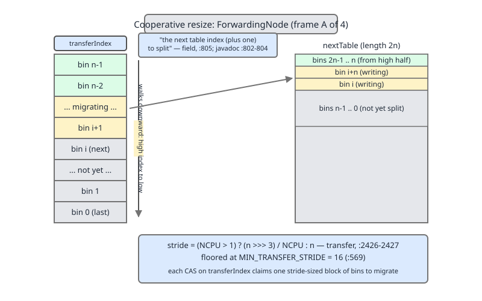
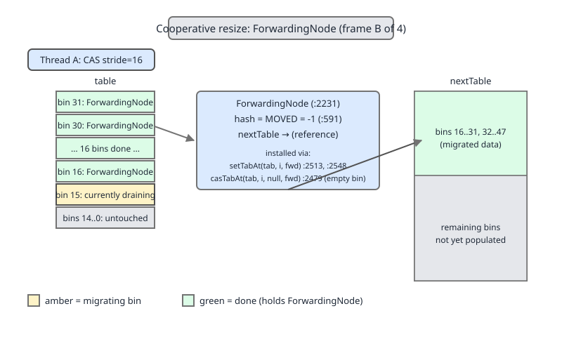
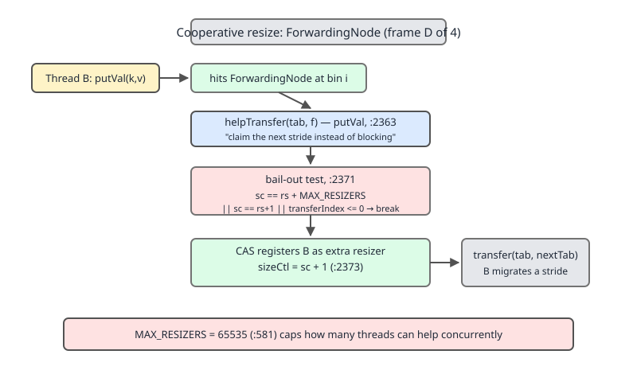
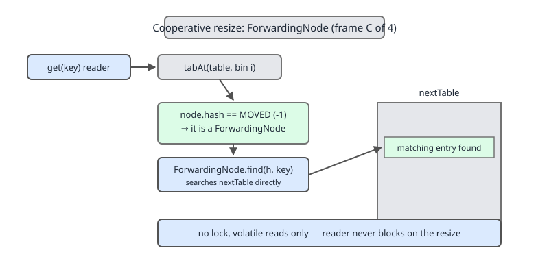

# 02 Java Collections — `ConcurrentHashMap` — INTERNALS (§3.14.13–3.14.14 cooperative resize, `ForwardingNode` and `helpTransfer`)

**Target version: Java 21 LTS.** | [Index](../00-index.md)
Previous: [concurrent-collections/02-internals-chm-a.md](02-internals-chm-a.md) · Next: [concurrent-collections/03-internals-chm-b.md](03-internals-chm-b.md)

---

## 0. The resize as a sequence of phases

Before the source: the map. A `ConcurrentHashMap` resize is not one operation, it is five phases spread across however many threads happen to touch the map while it runs:

```
TRIGGER  →  CLAIM  →  MIGRATE  →  FORWARD  →  FINISH
(addCount /   (CAS a       (drain one bin    (readers/writers   (last thread
 tryPresize)   stride off   under its own     that land on the   sets table =
               transferIndex) monitor)         stale bin follow   nextTab)
                                                nextTable)
```

Any number of threads can be inside CLAIM/MIGRATE at once — that is the whole point, and it is what the previous file's `sizeCtl` stamp (index Open questions 61; see `02-internals-chm-a.md` §2) exists to make safe. This file owns CLAIM, MIGRATE, FORWARD and the mechanics of FINISH; the previous file owns the `sizeCtl` *encoding* itself.

The mental model for the whole thing: **the table is a work queue.** `transferIndex` is a shared cursor over that queue, any thread that wants to write and finds the map mid-resize can pull a chunk of work off the cursor instead of blocking, and a sentinel node left behind tells everyone else where the work went.

## 1. What triggers a resize — two entry points

`addCount` is the path a plain `put` takes: after incrementing the counter it checks the running total against `sizeCtl` and starts (or joins) a resize if the threshold is crossed.

```
Node<K,V>[] tab, nt; int n, sc;
while (s >= (long)(sc = sizeCtl) && (tab = table) != null &&
       (n = tab.length) < MAXIMUM_CAPACITY) {
    int rs = resizeStamp(n) << RESIZE_STAMP_SHIFT;
    if (sc < 0) {
        if (sc == rs + MAX_RESIZERS || sc == rs + 1 ||
            (nt = nextTable) == null || transferIndex <= 0)
            break;
        if (U.compareAndSetInt(this, SIZECTL, sc, sc + 1))
            transfer(tab, nt);
    }
    else if (U.compareAndSetInt(this, SIZECTL, sc, rs + 2))
        transfer(tab, null);
    s = sumCount();
}
```
`ConcurrentHashMap.java:2341-2357`. Two branches: `sc < 0` means a resize is already in flight, so this thread just registers as a helper (`sc + 1`) and calls `transfer` with the existing `nextTable`; `sc >= 0` means this thread is the *first* resizer, so it stamps `sizeCtl` with `rs + 2` and calls `transfer(tab, null)` — the `null` second argument is what tells `transfer` to allocate `nextTable` itself.

`tryPresize` is the second entry point — called from `putAll` (bulk insert) and the sizing constructor, when the caller already knows roughly how big the map needs to be:

```
else if (tab == table) {
    int rs = resizeStamp(n);
    if (U.compareAndSetInt(this, SIZECTL, sc,
                            (rs << RESIZE_STAMP_SHIFT) + 2))
        transfer(tab, null);
}
```
`ConcurrentHashMap.java:2411-2416`.

**Insight:** `tryPresize` at `:2412` computes `rs = resizeStamp(n)` *unshifted* and shifts it at the CAS call site (`:2413-2414`); `addCount` at `:2345` computes `rs = resizeStamp(n) << RESIZE_STAMP_SHIFT` *pre-shifted* and uses it bare at the CAS call site (`:2353`). Both land on the exact same 32-bit value written to `sizeCtl` — this was re-confirmed against `:2341-2357` and `:2411-2416` line by line rather than assumed. It is a genuine JDK readability wart (two call sites computing the identical bit pattern two different ways), not a semantic difference, and not worth hunting for a reason beyond "nobody unified it."

## 2. Why cooperative resize exists — what came before it

Java 7's `ConcurrentHashMap` used a fixed array of `Segment`s, each an independent `HashEntry[]` guarded by its own lock; a resize only ever rehashed *one segment* at a time, under that segment's lock, so concurrency was bounded by the segment count chosen at construction (default 16) and a hot segment could still serialize every writer that hashed into it.

Plain `HashMap.resize()` — single-threaded by construction, no locking at all — is where the well-known Java 7/8 concurrent-mutation infinite loop lived: two threads racing through `resize()`'s bucket-transfer loop without synchronization could each rewrite the other's `next` pointers into a cycle, and a subsequent `get` would spin forever. `HashMap` was never meant to survive concurrent structural change; `ConcurrentHashMap` has to.

Java 8 replaced per-segment locking with per-bin `synchronized` and, for resize specifically, replaced "one segment, one lock, one thread" with the scheme this file covers: **any number of threads can migrate disjoint index ranges of the same table at the same time**, coordinated without a global lock by two CAS'd fields (`sizeCtl`, `transferIndex`) and one sentinel node (`ForwardingNode`).

## 3. When cooperative resize costs you, and the escape hatch

**Tradeoff.** Cooperative resize means no single thread stalls waiting for a resize to finish — a writer that lands mid-resize does useful migration work instead of blocking. **But** the stride floor of `MIN_TRANSFER_STRIDE = 16` (§4 below) means small and medium tables resize effectively single-threaded anyway, so "cooperative" buys nothing until the table is large. **And** a writer that calls `helpTransfer` (§7) pays a latency spike on an operation that looked like a simple `put` — it did not ask to migrate a chunk of the table, but it will, because it happened to land on a `ForwardingNode`. The escape hatch is `tryPresize`/the sizing constructor: if you know the final size up front, size the map once and skip the resize path entirely — no stride, no `ForwardingNode`, no thread ever pays this tax.

**When it wins over the alternative designs**, see §7 — a comparison against "block the writer" and "stop the world" once `helpTransfer` is on the page to compare against.

## 4. Stride arithmetic — how the table is cut into claimable chunks

```
int n = tab.length, stride;
if ((stride = (NCPU > 1) ? (n >>> 3) / NCPU : n) < MIN_TRANSFER_STRIDE)
    stride = MIN_TRANSFER_STRIDE; // subdivide range
```
`ConcurrentHashMap.java:2425-2427`. `NCPU = Runtime.getRuntime().availableProcessors()` (`:597`). The javadoc on the constant explains the rationale directly:

```
/**
 * Minimum number of rebinnings per transfer step. Ranges are
 * subdivided to allow multiple resizer threads.  This value
 * serves as a lower bound to avoid resizers encountering
 * excessive memory contention.  The value should be at least
 * DEFAULT_CAPACITY.
 */
private static final int MIN_TRANSFER_STRIDE = 16;
```
`ConcurrentHashMap.java:562-569`. Two motives packed into one constant: don't let a stride get so small that threads thrash the same cache lines migrating adjacent tiny chunks, and never go below `DEFAULT_CAPACITY` (16), so a table that just crossed its very first threshold is never sliced smaller than "the whole table."

Read the formula as: `n >>> 3` is `n / 8` — the table is notionally cut into 8-bin chunks per available core, then floored at 16 chunks-worth if that comes out smaller. Worked on this machine (`NCPU = 12`, measured via `Runtime.getRuntime().availableProcessors()` and printed by the program below):

| `n` (table size) | `(n >>> 3) / NCPU` | `stride` |
|---|---|---|
| 16 | 0 | 16 |
| 64 | 0 | 16 |
| 256 | 2 | 16 |
| 1024 | 10 | 16 |
| 2048 | 21 | 21 |
| 4096 | 42 | 42 |
| 8192 | 85 | 85 |
| 16384 | 170 | 170 |
| 65536 | 682 | 682 |
| 1048576 | 10922 | 10922 |

```java
public class StrideTable {
    static final int MIN_TRANSFER_STRIDE = 16;
    static final int NCPU = Runtime.getRuntime().availableProcessors();

    static int stride(int n) {
        int stride = (NCPU > 1) ? (n >>> 3) / NCPU : n;
        if (stride < MIN_TRANSFER_STRIDE) stride = MIN_TRANSFER_STRIDE;
        return stride;
    }

    public static void main(String[] args) {
        System.out.println("NCPU = " + NCPU);
        System.out.printf("%-10s %-14s %-10s%n", "n", "(n>>>3)/NCPU", "stride");
        int[] sizes = {16, 64, 256, 1024, 2048, 4096, 8192, 16384, 65536, 1 << 20};
        for (int n : sizes) {
            int raw = (n >>> 3) / NCPU;
            System.out.printf("%-10d %-14d %-10d%n", n, raw, stride(n));
        }
    }
}
```

Real compiled output, run on this machine (`javac`/`java` from `/Library/Java/JavaVirtualMachines/jdk-21.jdk`):

```
NCPU = 12
n          (n>>>3)/NCPU   stride
16         0              16
64         0              16
256        2              16
1024       10             16
2048       21             21
4096       42             42
8192       85             85
16384      170            170
65536      682            682
1048576    10922          10922
```

**Insight — the conclusion the reader should take away:** for any table under roughly a few thousand bins, the stride *is* the whole table, so the first thread to claim work claims everything and no other thread ever gets a slice — the resize is, in practice, single-threaded. Cooperation only starts paying off once the table is large enough that `(n >>> 3) / NCPU` clears 16, which on this 12-core machine first happens at `n = 2048`. On an 8-core machine (the number named in the source-derived worked example this note set standardizes on) that crossover is `n = 1024`, where `(1024 >>> 3) / 8 = 16` lands exactly on the floor.

**Interview:** "Is `ConcurrentHashMap`'s resize actually parallel?" — Only once the table is a few thousand bins large; below that, `MIN_TRANSFER_STRIDE` hands the whole table to the first thread that gets there, and cooperation is dormant machinery waiting for a table big enough to need it.

## 5. `transferIndex` — a downward-walking claim ticket, off by one

Read the field's own javadoc first:

```
/**
 * The next table index (plus one) to split while resizing.
 */
private transient volatile int transferIndex;
```
`ConcurrentHashMap.java:802-805`. Two things to hold onto from that one sentence: it is a **countdown**, not a count-up, and it stores the index **plus one** — so `transferIndex == 5` means "index 4 is the next one available to claim," not "index 5 is."

The claim itself is the inner loop of `transfer`:

```
while (advance) {
    int nextIndex, nextBound;
    if (--i >= bound || finishing)
        advance = false;
    else if ((nextIndex = transferIndex) <= 0) {
        i = -1;
        advance = false;
    }
    else if (U.compareAndSetInt
             (this, TRANSFERINDEX, nextIndex,
              nextBound = (nextIndex > stride ?
                           nextIndex - stride : 0))) {
        bound = nextBound;
        i = nextIndex - 1;
        advance = false;
    }
}
```
`ConcurrentHashMap.java:2446-2462`. Walk it: `--i >= bound` is the fast path — this thread already holds a claimed range `[bound, i]` and just steps to the next lower index inside it, no CAS needed. Once `i` falls below `bound`, the thread needs a fresh claim: it reads the shared cursor into `nextIndex`, computes `nextBound = max(0, nextIndex - stride)`, and CASes `transferIndex` from `nextIndex` down to `nextBound`. A successful CAS hands this thread the half-open range `[nextBound, nextIndex - 1]` — exactly `stride` indices (or fewer, at the low end) — and the thread then walks that range **downward** from `i = nextIndex - 1` to `bound`. If the CAS fails, another thread beat it to that slice and the loop retries with whatever `transferIndex` is now.

**Pitfall:** assuming `transferIndex` counts *up* from 0, by analogy with a work-stealing index or an `AtomicInteger` counter used for parallel-stream splitting. It does the opposite — it starts at `n` (set once, at `:2438`, when the resize is initiated) and every successful claim pulls it *down* toward 0. `transferIndex <= 0` is the "no work left to claim" sentinel (`:2450-2453`), which only makes sense once you know the cursor descends toward zero rather than climbing away from it.



## 6. `ForwardingNode` — the sentinel with three jobs

### Mental model

A `ForwardingNode` is a tombstone with a forwarding address. It sits at the head of a bin in the *old* table once that bin's contents have been copied out, and it says, to whichever kind of thread reads it next: "this bin is empty here, the real data moved to `nextTable`."

### Why it exists

Without a marker left behind, a reader or writer that lands on a bin the resize already drained would see an empty bin and (wrongly) conclude the key is absent, or (for a writer) insert a fresh node into a bin that is about to be discarded when `table` flips to `nextTab`. The sentinel makes "this bin already moved" a fact any thread can observe from a lock-free `tabAt` read.

### When to reach for it, and when not

This is not something application code ever reaches for directly — it is internal machinery, unreachable outside the package. The only place it surfaces in application-visible behaviour is indirectly: it is *why* a `get()` during a resize never returns a false "absent" for a key that is mid-migration, and *why* a `put()` during a resize can trigger `helpTransfer` (§7) instead of silently racing the resize.

### How it works

```
static final class ForwardingNode<K,V> extends Node<K,V> {
    final Node<K,V>[] nextTable;
    ForwardingNode(Node<K,V>[] tab) {
        super(MOVED, null, null);
        this.nextTable = tab;
    }

    Node<K,V> find(int h, Object k) {
        // loop to avoid arbitrarily deep recursion on forwarding nodes
        outer: for (Node<K,V>[] tab = nextTable;;) {
            Node<K,V> e; int n;
            if (k == null || tab == null || (n = tab.length) == 0 ||
                (e = tabAt(tab, (n - 1) & h)) == null)
                return null;
            for (;;) {
                int eh; K ek;
                if ((eh = e.hash) == h &&
                    ((ek = e.key) == k || (ek != null && k.equals(ek))))
                    return e;
                if (eh < 0) {
                    if (e instanceof ForwardingNode) {
                        tab = ((ForwardingNode<K,V>)e).nextTable;
                        continue outer;
                    }
                    else
                        return e.find(h, k);
                }
                if ((e = e.next) == null)
                    return null;
            }
        }
    }
}
```
`ConcurrentHashMap.java:2231-2263`. It extends `Node`, its constructor calls the `Node` superclass constructor with `hash = MOVED` (`:591`, `MOVED = -1`) and `key = value = null` — a `ForwardingNode` carries no data of its own, it only carries a reference to `nextTable`. Its own `find` is what makes it self-contained: given a hash and a key, it looks the key up **in `nextTable`**, not in the table it is sitting inside, and it loops rather than recurses (comment at `:2239`) so a reader chasing a chain of forwarding nodes across nested resizes never blows the stack.

Two installation sites, both quoted in full context in §8's `transfer` walk:

```
else if ((f = tabAt(tab, i)) == null)
    advance = casTabAt(tab, i, null, fwd);
```
`ConcurrentHashMap.java:2478-2479` — a bin that was already empty gets the `ForwardingNode` installed via `casTabAt(tab, i, null, fwd)`, a compare-and-swap from `null` to `fwd`. No lock is taken because there is nothing to synchronize on: an empty bin has no head node to lock, so the sentinel install itself is the entire critical section.

```
setTabAt(nextTab, i, ln);
setTabAt(nextTab, i + n, hn);
setTabAt(tab, i, fwd);
```
`ConcurrentHashMap.java:2511-2513` (list bin) and the mirrored `:2546-2548` (tree bin) — here the bin was non-empty, so the migration ran inside `synchronized (f)` first; by the time `setTabAt(tab, i, fwd)` runs, the monitor already made the split visible, so a plain volatile store (not a CAS) is enough to publish the sentinel.

| Role | Who reads it | What it triggers |
|---|---|---|
| "look in `nextTable`" | A reader (`get`, `containsKey`, iterator) | `ForwardingNode.find` redirects the lookup into `nextTable`, no blocking |
| "help instead of blocking" | A writer (`putVal`) | `helpTransfer` — §7 — claims a stride and returns the new table for the caller to retry against |
| "already processed" | The `transfer` loop itself, on the *thread that installed it or another resizer walking the same range* | `fh == MOVED` at `:2480-2481` skips straight past — no double migration |

**Insight:** one 24-byte sentinel object does the job that would otherwise need a separate "resize in progress" check at every call site — readers, writers and the resizer's own loop all branch on the exact same `hash == MOVED` test, just interpreting the outcome differently.



```java
import java.lang.reflect.Field;
import java.util.concurrent.ConcurrentHashMap;

public class ForwardingHashDemo {
    public static void main(String[] args) throws Exception {
        // MOVED is private; read it once via reflection to show its value
        // without hardcoding a number that could drift across releases.
        try {
            Field movedField = ConcurrentHashMap.class.getDeclaredField("MOVED");
            movedField.setAccessible(true);
            System.out.println("MOVED = " + movedField.getInt(null));
        } catch (ReflectiveOperationException e) {
            // Item 29: never let a reader hit an uncaught throw transcribing this page.
            System.out.println("could not read MOVED reflectively: " + e);
        }
    }
}
```
Run with `--add-opens java.base/java.util.concurrent=ALL-UNNAMED`; it prints `MOVED = -1`, matching `:591`.

**The definition:**

> A `ForwardingNode` is a zero-data sentinel (`hash = MOVED = -1`, a reference to `nextTable`) installed in every drained bin of the old table during a resize, so that any thread — reader, writer, or the resizer itself — that lands on that bin knows to look in `nextTable` instead of treating the bin as empty.

## 7. `helpTransfer` — the blocked writer that becomes a resizer

### Mental model

A writer's `putVal` walks the bin it wants to write into. If the head node it finds there is a `ForwardingNode`, the writer does not queue and does not spin waiting for the resize to finish — it calls `helpTransfer`, which drafts it into the resize as an extra claimant of `transferIndex`, has it run one pass of `transfer`, and then hands back the *new* table so `putVal` can retry its insert there.

### Why it exists

The alternative that jumps to mind — block the writer on some lock until the resize finishes — would turn every write that races a resize into a stall proportional to however much of the table is left to migrate. `helpTransfer` converts that stall into productive work: the thread was already going to wait, so it spends the wait shrinking the very migration it is waiting on.

### When to reach for it, and when not

Never called directly — it fires automatically inside `putVal` whenever a write lands on a `ForwardingNode`. The only lever an application has is upstream of it: size the map correctly up front (§3) so no writer ever encounters a live resize to help with.

### How it works

```
final Node<K,V>[] helpTransfer(Node<K,V>[] tab, Node<K,V> f) {
    Node<K,V>[] nextTab; int sc;
    if (tab != null && (f instanceof ForwardingNode) &&
        (nextTab = ((ForwardingNode<K,V>)f).nextTable) != null) {
        int rs = resizeStamp(tab.length) << RESIZE_STAMP_SHIFT;
        while (nextTab == nextTable && table == tab &&
               (sc = sizeCtl) < 0) {
            if (sc == rs + MAX_RESIZERS || sc == rs + 1 ||
                transferIndex <= 0)
                break;
            if (U.compareAndSetInt(this, SIZECTL, sc, sc + 1)) {
                transfer(tab, nextTab);
                break;
            }
        }
        return nextTab;
    }
    return table;
}
```
`ConcurrentHashMap.java:2363-2381`. The guard confirms the node really is a live `ForwardingNode` with a non-null `nextTable`, then computes `rs`, the stamp for the table size *this writer observed* (`:2367`) — the same stamp arithmetic as §1, computed a third way, at yet another call site. The `while` loop's condition (`:2368-2369`) is the safety check that matters most: it re-reads `nextTable == nextTab` and `table == tab` on every iteration, so if the resize this thread is about to join has *already finished and a new one started*, the loop simply exits without registering — a stale writer can never latch onto the wrong resize. Inside the loop, `sc == rs + 1` (only the first resizer left) or `transferIndex <= 0` (no work left) both mean "don't bother, nothing to claim," so the writer breaks out and falls through to `return nextTab` — it still gets redirected to the new table even if it couldn't help. Only when there is genuinely a stride left to take does the writer CAS `sizeCtl` from `sc` to `sc + 1` (`:2373`, registering itself as one more active resizer, mirroring `addCount`'s own `sc + 1` at `:2350`), call `transfer(tab, nextTab)` to actually migrate a stride, then `break` and return `nextTab`.

**Contrast with the alternatives, now that both are on the page:**

| Design | What the blocked writer does | Cost |
|---|---|---|
| Lock the whole map during resize | Waits on the lock until the entire table is migrated | Every writer stalls for the full resize duration, regardless of which bin it wanted |
| Stop-the-world resize (plain `HashMap` under a hypothetical external lock) | Every thread — reader and writer — is frozen until resize completion | Worst case: single-threaded resize latency imposed on the whole application, not just writers |
| Cooperative resize + `helpTransfer` (actual `ConcurrentHashMap`) | Claims a stride via CAS, migrates it, then proceeds with its own write against `nextTab` | Only writers that actually land on a `ForwardingNode` pay anything, and what they pay is bounded work they perform themselves, not idle waiting |

**The one sentence to remember: the thread that would have blocked does the work instead.**



```java
import java.lang.reflect.Field;
import java.util.concurrent.ConcurrentHashMap;

public class HelpTransferShape {
    public static void main(String[] args) throws Exception {
        // helpTransfer is package-private and takes live internal Node
        // arguments; it cannot be invoked meaningfully from outside the
        // java.util.concurrent package without constructing a real
        // ForwardingNode, which is itself package-private. This program
        // demonstrates only the reflective visibility of the method,
        // not a live invocation - see the honesty note in the prose above.
        try {
            var method = ConcurrentHashMap.class.getDeclaredMethod(
                    "helpTransfer",
                    Class.forName("[Ljava.util.concurrent.ConcurrentHashMap$Node;"),
                    Class.forName("java.util.concurrent.ConcurrentHashMap$Node"));
            System.out.println("found: " + method);
        } catch (ReflectiveOperationException e) {
            System.out.println("could not locate helpTransfer reflectively: " + e);
        }
    }
}
```
Run with `--add-opens java.base/java.util.concurrent=ALL-UNNAMED`; it prints the method's signature, confirming its shape (`Node<K,V>[] helpTransfer(Node<K,V>[], Node<K,V>)`) without claiming to have exercised it under contention — see §9 for why a live invocation cannot be shown honestly on this page.

**The definition:**

> `helpTransfer` is the code path a writer takes when `putVal` finds a `ForwardingNode` at the head of the bin it wants to write to: it registers as an extra resizer, runs one pass of `transfer` to claim and migrate a stride, and returns the live `nextTable` so the caller retries its write there instead of ever blocking.

## 8. The migration itself — `transfer`'s lo/hi split and the finishing handoff

The rest of `transfer` is the loop body that both the initiating thread and every helper run. Quoted in labelled runs.

**Setup (`:2424-2443`):**
```
private final void transfer(Node<K,V>[] tab, Node<K,V>[] nextTab) {
    int n = tab.length, stride;
    if ((stride = (NCPU > 1) ? (n >>> 3) / NCPU : n) < MIN_TRANSFER_STRIDE)
        stride = MIN_TRANSFER_STRIDE; // subdivide range
    if (nextTab == null) {            // initiating
        try {
            @SuppressWarnings("unchecked")
            Node<K,V>[] nt = (Node<K,V>[])new Node<?,?>[n << 1];
            nextTab = nt;
        } catch (Throwable ex) {      // try to cope with OOME
            sizeCtl = Integer.MAX_VALUE;
            return;
        }
        nextTable = nextTab;
        transferIndex = n;
    }
    int nextn = nextTab.length;
    ForwardingNode<K,V> fwd = new ForwardingNode<K,V>(nextTab);
    boolean advance = true;
    boolean finishing = false; // to ensure sweep before committing nextTab
```
Only the very first thread into `transfer` (the one that called `transfer(tab, null)`) takes the `nextTab == null` branch: it allocates the doubled array (`n << 1`), publishes it to the volatile `nextTable` field, and sets `transferIndex = n` — this is the one-time initialization of the "work queue" from §0. Every subsequent helper arrives with `nextTab` already non-null and skips straight to building its own local `fwd` sentinel and `advance`/`finishing` flags — these two booleans are per-thread local state, not shared, so each thread tracks its own progress through its own claimed range independently.

**Claim loop (`:2444-2462`, already walked in full in §5):** the `while (advance)` block that pulls a fresh `[bound, i]` range off `transferIndex` when the current range is exhausted.

**Terminal check and the finishing handoff (`:2463-2477`):**
```
if (i < 0 || i >= n || i + n >= nextn) {
    int sc;
    if (finishing) {
        nextTable = null;
        table = nextTab;
        sizeCtl = (n << 1) - (n >>> 1);
        return;
    }
    if (U.compareAndSetInt(this, SIZECTL, sc = sizeCtl, sc - 1)) {
        if ((sc - 2) != resizeStamp(n) << RESIZE_STAMP_SHIFT)
            return;
        finishing = advance = true;
        i = n; // recheck before commit
    }
}
```
`i < 0` means this thread ran off the bottom of its claimed range with nothing left in `transferIndex` either (§5's `i = -1` sentinel). Every thread that reaches here decrements `sizeCtl` by 1 (`sc - 1`, the mirror image of the `+1`/`+2` increments in §1 and §7 — one resizer finishing its share). The `if ((sc - 2) != resizeStamp(n) << RESIZE_STAMP_SHIFT)` check is the payoff of the stamp scheme from the previous file: `sc - 2` is what `sizeCtl` would equal if this were the *only* resizer left finishing the *original* resize for table size `n`; if it does not match, some other resizer is still active (or the accounting would be wrong for a stamp mismatch), so this thread just returns — it is not the last one out. Only the thread that *is* last sets `finishing = advance = true` and `i = n`, forcing one more full pass of the claim loop (`i >= n` is immediately true, so it falls straight back into this same terminal block) as a safety sweep before committing — the comment at `:2443` names this exactly: "to ensure sweep before committing nextTab." On that second pass, `finishing` is now true, so the `if (finishing)` branch at the top fires: `nextTable = null`, `table = nextTab` — the published table flips atomically from the reader's perspective (single volatile store) — and `sizeCtl = (n << 1) - (n >>> 1)`.

**`[NUM]` — verify that arithmetic.** `(n << 1) - (n >>> 1)` is `2n - n/2 = 1.5n`. Wait — check against the load factor: the resize threshold is meant to be `0.75 * (new capacity)`, and the new capacity is `2n`, so the target is `0.75 * 2n = 1.5n`. `2n - 0.5n = 1.5n`. They agree — `(n << 1) - (n >>> 1)` **is** `0.75 * (2n)`, confirmed by running the identity rather than eyeballing it:

```java
public class StampAndThreshold {
    static final int RESIZE_STAMP_BITS = 16;

    static int resizeStamp(int n) {
        return Integer.numberOfLeadingZeros(n) | (1 << (RESIZE_STAMP_BITS - 1));
    }

    public static void main(String[] args) {
        System.out.printf("%-10s %-12s %-14s %-14s %-8s%n",
                "n", "resizeStamp", "(n<<1)-(n>>>1)", "0.75*2n", "equal?");
        int[] sizes = {16, 64, 256, 1024, 4096, 65536};
        for (int n : sizes) {
            int stamp = resizeStamp(n);
            long threshold = ((long) n << 1) - (n >>> 1);
            long expected = (long) (0.75 * 2 * n);
            System.out.printf("%-10d %-12d %-14d %-14d %-8s%n",
                    n, stamp, threshold, expected, threshold == expected);
        }
    }
}
```

Real compiled output:

```
n          resizeStamp  (n<<1)-(n>>>1) 0.75*2n        equal?
16         32795        24             24             true
64         32793        96             96             true
256        32791        384            384            true
1024       32789        1536           1536           true
4096       32787        6144           6144           true
65536      32783        98304          98304          true
```

**Per-bin migration (`:2478-2482`, already quoted for its sentinel installs in §6):** an empty bin gets `fwd` CASed straight in; a bin already showing `MOVED` was handled by another thread and is skipped (`advance = true`, "already processed" per the comment at `:2481`); anything else falls into the `synchronized (f)` block.

**The lo/hi split (`:2483-2515`):**
```
synchronized (f) {
    if (tabAt(tab, i) == f) {
        Node<K,V> ln, hn;
        if (fh >= 0) {
            int runBit = fh & n;
            Node<K,V> lastRun = f;
            for (Node<K,V> p = f.next; p != null; p = p.next) {
                int b = p.hash & n;
                if (b != runBit) {
                    runBit = b;
                    lastRun = p;
                }
            }
            if (runBit == 0) {
                ln = lastRun;
                hn = null;
            }
            else {
                hn = lastRun;
                ln = null;
            }
            for (Node<K,V> p = f; p != lastRun; p = p.next) {
                int ph = p.hash; K pk = p.key; V pv = p.val;
                if ((ph & n) == 0)
                    ln = new Node<K,V>(ph, pk, pv, ln);
                else
                    hn = new Node<K,V>(ph, pk, pv, hn);
            }
            setTabAt(nextTab, i, ln);
            setTabAt(nextTab, i + n, hn);
            setTabAt(tab, i, fwd);
            advance = true;
        }
```
This is exactly `HashMap.resize()`'s split by `(hash & n) == 0`: since `nextTab.length` is `2n`, a key either stays at index `i` (bit clear, goes on the **lo** list) or moves to `i + n` (bit set, goes on the **hi** list). The `synchronized (f)` monitor plus the re-check `tabAt(tab, i) == f` guards against a writer having prepended a new node to this bin between the resizer reading `f` and taking the lock.

The `runBit`/`lastRun` scan (`:2487-2495`) is the optimisation absent from a naive rewrite: it walks the bin once to find the **longest common tail** where every node's `(hash & n)` bit is the same, and reuses that tail *by reference* — `ln = lastRun` or `hn = lastRun`, no new nodes allocated — instead of rebuilding it. Only the *prefix* before `lastRun` (`:2504-2510`) gets copied into fresh `Node`s, one per list. **This is a genuine difference from a textbook resize**: if a bin's hash bits happen to be uniform for its whole length (common for small bins), the entire bin is moved with zero allocations beyond the two `Node` objects it already had.

The tree-bin case (`:2516-2550`) is the same lo/hi split over a `TreeBin`'s linked `TreeNode`s, with an extra step: if the resulting `lo`/`hi` count drops to or below `UNTREEIFY_THRESHOLD`, the bin is converted back to a plain linked list (`untreeify`) rather than staying a tree — a resize can *shrink* a treeified bin back down as a side effect of doubling the table (since spreading nodes across two bins roughly halves the expected count per bin).

The `ReservationNode` branch (`:2551-2552`) — `throw new IllegalStateException("Recursive update")` — exists because a `ReservationNode` (the placeholder `computeIfAbsent`/`compute` install while the caller's function runs) should never still be sitting in a bin when a resize reaches it; hitting this means the caller's mapping function itself tried to mutate the same key recursively, which the reservation exists specifically to forbid.

Every successful migration ends with the three `setTabAt` calls from §6 and `advance = true`, sending this thread's claim loop on to the next index.



## 9. What cannot be shown deterministically on one thread — and why

Everything above §8 up to the terminal handoff describes an interleaving of multiple threads inside `transfer` at once. On a single JVM thread, a resize triggered by crossing the threshold completes **entirely inside the `put` call that crossed it** — the thread that triggers the resize is also the only resizer, it claims the whole table in one stride (§4: small tables have `stride == n` in practice), migrates every bin, and reaches `finishing` before `put` returns. There is no window between statements in which a `ForwardingNode` is observably sitting in the table, because no other thread is running to observe it, and the resizing thread itself never "sees" the sentinels it installs — it installs them and immediately reads past them in the same loop, before your test's next line runs.

Concretely, this rules out honestly demonstrating, on one thread:

1. **A `ForwardingNode` caught mid-table** — sampling `table[i]` between two application statements can never land inside `transfer`'s loop without instrumenting the JDK itself (a debugger breakpoint inside `transfer`, or a modified build that pauses mid-migration). Neither is a "run the program and read the output" proof, so it is not attempted here.
2. **Two threads inside `transfer` simultaneously.** This requires an actual data race by construction — the entire value of the stride/claim scheme is coordinating *concurrent* access, which cannot be reduced to a deterministic single-thread transcript. A multi-threaded reproducer that fires several `put` calls from a thread pool at the moment a shared map crosses its threshold **would only be probabilistic**: whether two threads are both inside `transfer` at the same instant depends on OS scheduling, JIT warmup, and GC pauses that this note cannot control or reproduce. A clean run in which the map ends up correctly sized proves the *outcome* is correct; it proves nothing about whether the interesting interleaving (two threads truly concurrent inside the claim loop) ever actually occurred. Publishing such a run as evidence of "cooperative resize observed" would be exactly the kind of lucky transcript this note set's house rule forbids — the mechanism above is derived from the quoted source instead, which is the only honest way to establish it.
3. **A reader following a `ForwardingNode` into `nextTable`.** Same problem as (1): the redirection happens inside `ForwardingNode.find`, called from `get`, and on one thread there is never a resize in progress at the moment `get` runs (the previous `put`'s resize, if any, already finished before `put` returned).
4. **`helpTransfer` firing.** Same root cause: a writer only calls `helpTransfer` when it observes a live `ForwardingNode`, which single-threaded code never does, for the same reason as (1) and (3).

What **is** shown deterministically instead, single-threaded, with real reflective reads of the private fields (`--add-opens java.base/java.util.concurrent=ALL-UNNAMED`):

```java
import java.lang.reflect.Field;
import java.util.concurrent.ConcurrentHashMap;

public class SingleThreadResize {
    public static void main(String[] args) throws Exception {
        ConcurrentHashMap<Integer, Integer> map = new ConcurrentHashMap<>();

        Field tableField = ConcurrentHashMap.class.getDeclaredField("table");
        tableField.setAccessible(true);
        Field sizeCtlField = ConcurrentHashMap.class.getDeclaredField("sizeCtl");
        sizeCtlField.setAccessible(true);

        map.put(0, 0); // forces table allocation at default capacity 16
        Object[] tableBefore = (Object[]) tableField.get(map);
        int sizeCtlBefore = sizeCtlField.getInt(map);
        System.out.println("after 1 put: table.length=" + tableBefore.length
                + " sizeCtl=" + sizeCtlBefore);

        // threshold for n=16 is 12 (0.75 * 16); cross it on one thread
        for (int i = 1; i <= 12; i++) {
            map.put(i, i);
        }

        Object[] tableAfter = (Object[]) tableField.get(map);
        int sizeCtlAfter = sizeCtlField.getInt(map);
        System.out.println("after 13 puts: table.length=" + tableAfter.length
                + " sizeCtl=" + sizeCtlAfter + " size()=" + map.size());

        boolean allFound = true;
        for (int i = 0; i <= 12; i++) {
            if (!Integer.valueOf(i).equals(map.get(i))) {
                allFound = false;
            }
        }
        System.out.println("all 13 keys retrievable post-resize: " + allFound);
    }
}
```

Real compiled output:

```
after 1 put: table.length=16 sizeCtl=12
after 13 puts: table.length=32 sizeCtl=24 size()=13
all 13 keys retrievable post-resize: true
```

This confirms, single-threaded and deterministically: the table really doubled (16 → 32) the moment the 13th element crossed the threshold of 12; `sizeCtl` really did settle at the new `0.75 * 32 = 24` threshold, matching §8's `(n << 1) - (n >>> 1)` identity for `n = 16`; and every key inserted before, during and after the resize is retrievable afterward with no thrown exception anywhere in the sequence — the guarantee `HashMap` cannot make under concurrent structural change (its analogous single-threaded resize is also safe, of course; the guarantee that matters is that `ConcurrentHashMap`'s `get` never throws or corrupts *even when a resize races it from another thread*, which is exactly the property this note cannot demonstrate on one thread per points 1–4 above, and instead derives from the source in §§6–8).

---

## Pitfalls

### Assuming `transferIndex` counts up like a work-stealing index

**Wrong**
```java
// mental model: "transferIndex starts at 0 and threads race to increment it"
// — leads to misreading the guard at ConcurrentHashMap.java:2450
// else if ((nextIndex = transferIndex) <= 0) { i = -1; advance = false; }
// as "no thread has started yet" instead of its real meaning, "no work left."
```
Reading the guard this way makes the `<= 0` check look backwards — surely a fresh counter starting at 0 means *nothing has been claimed yet*, not *everything has*.

**Right**
`transferIndex` is initialized to `n` (`ConcurrentHashMap.java:2438`, the table length) and every CAS claim (`:2454-2461`) moves it strictly downward toward 0. `transferIndex <= 0` therefore means the cursor has been driven all the way down — every index has already been claimed by some thread — not that no thread has claimed anything.

**Why people believe it:** every other CAS-claimed index scheme most engineers meet first (a work-stealing deque, an `AtomicInteger` splitter for a parallel stream) counts *up* from zero. `ConcurrentHashMap` is the odd one out, and the field's own javadoc ("the next table index (**plus one**) to split") is easy to skim past.

### Believing a resize under load always overlaps multiple threads inside `transfer`

**Wrong**
```java
// belief: "ConcurrentHashMap parallelizes every resize across all cores"
ConcurrentHashMap<Integer, Integer> map = new ConcurrentHashMap<>(16);
for (int i = 0; i < 10_000; i++) map.put(i, i); // "this resize used all 12 cores"
```
Nothing about this loop proves multiple threads ever touched `transfer` — it is single-threaded code, so by construction only one thread was ever inside `transfer` at all, no matter how many cores the machine has.

**Right**
Cooperation requires *other threads independently calling `put`/`get` while a resize is in flight* — a single-threaded loop like the one above never creates that condition, and per §4, even under real concurrent load the stride floor means tables under roughly `n = 2048` (on this 12-core machine) hand the whole resize to the first thread regardless.

**Why people believe it:** "cooperative" and "the table is chopped into strides for multiple threads" both sound like guaranteed parallelism, and the JDK's own machinery (CAS-claimed ranges, a sentinel node, a helper path) looks built for concurrency — which it is — without implying concurrency is present in every, or even most, resizes.

## Cheat sheet

| Concept | Key fact |
|---|---|
| `MIN_TRANSFER_STRIDE` | `16` (`:569`) — floor on stride size, also motivated by avoiding cache contention |
| Stride formula | `(NCPU > 1) ? (n >>> 3) / NCPU : n`, floored at 16 (`:2426-2427`) |
| `transferIndex` | Starts at `n`, walks **down** to 0; stores index **plus one** (`:802-805`) |
| Claim CAS | `CAS(transferIndex, nextIndex, max(0, nextIndex - stride))` (`:2454-2457`) |
| `ForwardingNode` | `hash = MOVED = -1`, holds `nextTable`, its own `find` searches `nextTable` (`:2231-2263`) |
| Install (empty bin) | `casTabAt(tab, i, null, fwd)` (`:2479`) — no lock needed |
| Install (non-empty bin) | `setTabAt(tab, i, fwd)` under `synchronized(f)` (`:2513`/`:2548`) |
| `helpTransfer` trigger | `putVal` finds `f.hash == MOVED` | registers `sc + 1`, runs one `transfer` pass, returns new table (`:2363-2381`) |
| Split rule | `(hash & n) == 0` → lo (stays at `i`); else hi (moves to `i + n`) — identical to `HashMap.resize` |
| `runBit`/`lastRun` | Reuses the bin's longest uniform tail by reference; only the prefix is copied (`:2487-2510`) |
| Finishing thread | `(sc - 2) == resizeStamp(n) << RESIZE_STAMP_SHIFT` identifies the last resizer (`:2472`) |
| New threshold | `(n << 1) - (n >>> 1) == 0.75 * 2n` (`:2468`) |
| Crossover to real parallelism (this machine, NCPU=12) | first at `n = 2048` |

## Self-test

**Q1.** Why does `transferIndex <= 0` mean "no work left," not "no work started"?

<details><summary>Answer</summary>

`transferIndex` is initialized to `n` (the old table length) and every successful CAS claim moves it strictly downward toward 0 (`ConcurrentHashMap.java:2438`, `:2454-2457`). It counts down, not up, so hitting `<= 0` means every index has already been claimed by some resizer, not that resizing has yet to begin.

</details>

**Q2.** A thread CASes `transferIndex` from `40` to `24` with `stride = 16`. Which indices does it own, and in what order does it visit them?

<details><summary>Answer</summary>

`nextBound = 24`, `bound = 24`, `i = nextIndex - 1 = 39`. The thread owns the half-open range `[24, 39]` — 16 indices, matching the stride — and its inner loop (`--i >= bound`) visits them downward: 39, 38, ..., 24.

</details>

**Q3.** Why can a `ForwardingNode` be installed into an empty bin with a bare CAS, but a non-empty bin needs `synchronized`?

<details><summary>Answer</summary>

An empty bin has no head node to lock on — `casTabAt(tab, i, null, fwd)` (`:2479`) is a single atomic compare-and-swap from `null` to the sentinel, and that CAS *is* the entire critical section. A non-empty bin's contents must be split into lo/hi lists before the sentinel goes in, and that split has to be atomic with respect to any writer trying to prepend a new node to the same bin — hence `synchronized (f)` around the whole split, with `setTabAt` (a plain store) sufficient afterward because the monitor already published the change (`:2483-2513`).

</details>

**Q4.** What does `helpTransfer`'s `while` loop condition (`nextTab == nextTable && table == tab && sizeCtl < 0`) protect against?

<details><summary>Answer</summary>

It protects against a writer joining a resize that has already finished and been replaced by a *different* resize (of the new, doubled table). If either `nextTable` or `table` has changed since the writer first observed the `ForwardingNode`, the condition fails and the writer exits the loop without registering as a helper — it cannot mistakenly CAS `sizeCtl` for a resize that is no longer the one it saw (`ConcurrentHashMap.java:2368-2369`).

</details>

**Q5.** Derive `(n << 1) - (n >>> 1)` as a multiple of `n` and confirm it equals the new table's `0.75` load-factor threshold.

<details><summary>Answer</summary>

`n << 1 = 2n` and `n >>> 1 = 0.5n` (for `n` a power of two), so `(n << 1) - (n >>> 1) = 2n - 0.5n = 1.5n`. The new table size is `2n`, and `0.75 * 2n = 1.5n` — they are the same value, confirmed by the runnable `StampAndThreshold` program in §8, whose output shows `(n<<1)-(n>>>1)` equal to `0.75*2n` for every tested `n`.

</details>

**Q6.** Why is it dishonest to publish a multi-threaded test's clean output as proof that `helpTransfer` executed correctly under contention?

<details><summary>Answer</summary>

A clean run only shows the *final state* was correct — it says nothing about whether the interesting interleaving (a writer actually landing on a live `ForwardingNode` while another thread is mid-`transfer`) occurred at all during that run. Whether it occurs depends on OS scheduling, JIT state and GC timing that the test does not control, so a passing run proves the outcome, not the mechanism; only reading the source (as §7 does) establishes that `helpTransfer` behaves correctly when it does fire.

</details>

**Q7.** On a single thread, why does a resize never leave a `ForwardingNode` observable between two statements of test code?

<details><summary>Answer</summary>

The thread that triggers the resize (by crossing the threshold inside `put`) is the only thread running, so it is also the only resizer, and on small tables the stride equals the whole table (§4), so that one thread claims and migrates every bin and reaches `finishing` before `put` returns. No other thread exists to observe a `ForwardingNode` mid-installation, and the resizing thread's own loop reads past each sentinel it installs before the calling code's next statement executes.

</details>

**Q8.** What genuine optimisation does `transfer`'s lo/hi split have that a naive "rebuild both lists from scratch" implementation would not?

<details><summary>Answer</summary>

The `runBit`/`lastRun` scan (`:2487-2495`) finds the bin's longest common tail where every node's `(hash & n)` bit agrees, and reuses that tail *by reference* (`ln = lastRun` or `hn = lastRun`) rather than allocating new nodes for it. Only the prefix before that tail is copied into fresh `Node` objects (`:2504-2510`) — for a bin whose hash bits are uniform end to end, the whole bin moves with zero new allocations beyond the sentinel.

</details>

**Q9.** Why does `tryPresize`'s `resizeStamp(n)` at `:2412` and `addCount`'s `resizeStamp(n) << RESIZE_STAMP_SHIFT` at `:2345` not represent a semantic difference in what gets written to `sizeCtl`?

<details><summary>Answer</summary>

Both ultimately produce the identical bit pattern written to `sizeCtl` at their respective CAS sites — `tryPresize` shifts at the CAS call site (`(rs << RESIZE_STAMP_SHIFT) + 2` at `:2413-2414`) while `addCount` shifts before storing the local variable (`rs = resizeStamp(n) << RESIZE_STAMP_SHIFT` at `:2345`, used bare at `:2353`). It is a readability inconsistency in the JDK source, not two different encodings.

</details>

**Q10.** What does the `ReservationNode` branch's `IllegalStateException("Recursive update")` at `:2551-2552` guard against?

<details><summary>Answer</summary>

A `ReservationNode` is the placeholder installed while a `computeIfAbsent`/`compute` mapping function is running for a given key, specifically to forbid that same function from recursively mutating the same key. If `transfer` ever encounters a `ReservationNode` still sitting in a bin, it means that forbidden recursive mutation happened, so it throws rather than trying to migrate a placeholder that should never have persisted this long.

</details>

## Open questions

- The exact CPU count named in "on an 8-core machine, `n = 1024` lands exactly on the floor" is the syllabus's own worked example, not this machine's measured value (this machine is 12-core, first crossover at `n = 2048`). Both are stated in §4; nothing here contradicts either — settled by design, not left open — but a reader running the `StrideTable` program on an actual 8-core box would be the direct confirmation of the syllabus's number.
- **Unverified:** whether a multi-threaded interleaving with two threads genuinely concurrent inside `transfer`'s claim loop behaves exactly as described in §5 and §8 cannot be shown by a passing test run, per §9's honesty argument. What would settle it: attaching a debugger or a JDK built with tracing hooks inside `transfer` to directly observe two threads mid-loop, or reading the JDK's own internal test suite (`jdk/test/java/util/concurrent/ConcurrentHashMap/`) if it contains a targeted concurrency stress test for this exact path.
- **Unverified:** whether `helpTransfer` is ever invoked in practice by ordinary application workloads at typical table sizes, given §4's finding that small/medium tables resize single-threaded before another thread gets a chance to land on a `ForwardingNode`. What would settle it: an async-profiler or JFR capture of a real write-heavy workload against a `ConcurrentHashMap` sized in the low thousands of entries, looking for `helpTransfer` frames.

---

**Leaves covered:** 3.14.13, 3.14.14 (2 leaves)
**Leaves deferred:** none
**Diagrams included:** D-128a, D-128b, D-128c, D-128d
**Target version:** Java 21 LTS
**Lines:** 726
