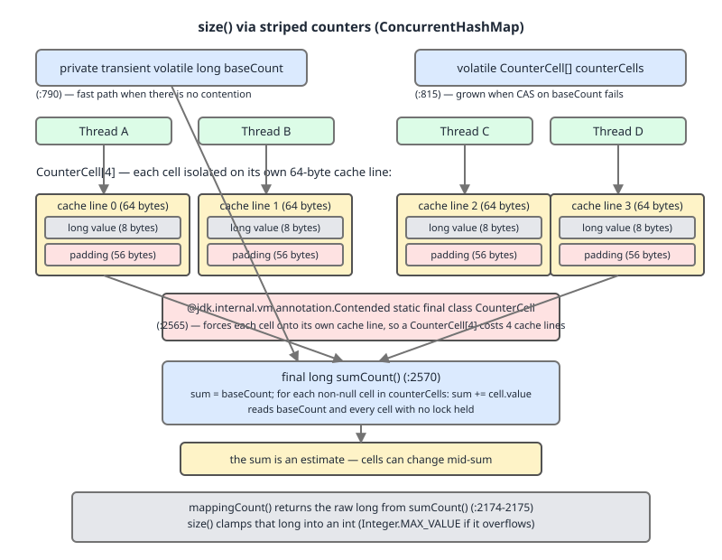

# 02 Java Collections — `ConcurrentHashMap` — INTERNALS (§3.14.15–3.14.19 striped counters, `TreeBin`'s lock and the compound methods)

**Target version: Java 21 LTS.** | [Index](../00-index.md)
Previous: [concurrent-collections/02b-internals-chm-a2-cooperative-resize.md](02b-internals-chm-a2-cooperative-resize.md) · Next: [concurrent-collections/03b-internals-chm-c-bulk-nulls-and-segments.md](03b-internals-chm-c-bulk-nulls-and-segments.md)

---

## 1. What this file covers

Four questions, in order: how `size()` avoids a single hot counter field; why that counter is padded to a whole cache line; how `TreeBin` locks itself when a bin has been treeified; and what actually happens — not what folklore says happens — when a `computeIfAbsent` mapping function calls back into the same map.

| # | Concept | Kind |
|---|---|---|
| 1 | Striped counters (`baseCount` + `CounterCells`, `sumCount`, `size()` vs `mappingCount()`) | Primary |
| 2 | `@Contended` and false sharing | Primary |
| 3 | `TreeBin`'s own `lockState` | Primary |
| 4 | The seven atomic compound methods | Family (table) |
| 5 | The `computeIfAbsent` recursive-update trap | Primary |

All source line numbers below are re-confirmed against `/tmp/jc53src/java.base/java/util/concurrent/ConcurrentHashMap.java` (JDK 21, 6,385 lines) before being cited.

---

## 2. Striped counters — `size()`, `mappingCount()`, and why one is an estimate

### Mental model

Do not picture `ConcurrentHashMap` keeping a single `int size` field that every `put` and `remove` increments. Picture a row of separate scratchpads, one per contending thread, each holding a partial count. "How many entries are there?" is answered by walking the row and adding the scratchpads up — a snapshot assembled after the fact, not a number anyone was ever holding at once.

### Why it exists

A plain `volatile int count` incremented on every mutation would work correctly, but every thread doing a `put` would need to CAS the *same* memory word. Under real concurrency that single word becomes the map's bottleneck — the exact "everyone queues behind one field" failure this whole class exists to avoid. `LongAdder`'s design (which this class predates and shares an author's technique with — the field-level comment at `sumCount()` even says "See LongAdder version for explanation") solves it by giving each contending thread its own cell to hit, and reserving a global counter for the fast, uncontended path.

### When to reach for it, and when not

You do not reach for this directly — it is what backs `size()` and `mappingCount()`. The decision that matters to a caller: if you need an approximate live count for logging or a dashboard, `size()` is fine. If you need a truly exact count you must synchronize externally around a snapshot, because **no method on this class ever gives you an exact concurrent count** — that guarantee does not exist for any concurrent collection, and asking for it is the sign of a design smell (you want a count that cannot change out from under you, which means you want a lock the whole map doesn't have).

### How it works

Two fields back every size query:

```
private transient volatile long baseCount;                    // :790
private transient volatile int cellsBusy;                      // :810
private transient volatile CounterCell[] counterCells;         // :815
```

The fast, uncontended path lives in `addCount` (called from every mutator — `putVal`, `remove`, `clear`, etc.):

```
private final void addCount(long x, int check) {
    CounterCell[] cs; long b, s;
    if ((cs = counterCells) != null ||
        !U.compareAndSetLong(this, BASECOUNT, b = baseCount, s = b + x)) {
        CounterCell c; long v; int m;
        boolean uncontended = true;
        if (cs == null || (m = cs.length - 1) < 0 ||
            (c = cs[ThreadLocalRandom.getProbe() & m]) == null ||
            !(uncontended =
              U.compareAndSetLong(c, CELLVALUE, v = c.value, v + x))) {
            fullAddCount(x, uncontended);
            return;
        }
        ...
```

Read the `if` as a decision tree: try a CAS on `baseCount` first (`:790`); only if that CAS fails (someone else is contending on it *right now*) or a `counterCells` array already exists does the thread touch a cell instead, and only if *that* CAS also fails does it fall into the slow `fullAddCount` path that may grow the array. **Verified**: an uncontended map never allocates a `CounterCell[]` at all — `counterCells` stays `null` until the CAS on `baseCount` actually loses a race. Demo 1 below confirms this by reflection after 100 single-threaded `put` calls.

Reading the count walks both places, with no lock:

```
final long sumCount() {                                         // :2570
    CounterCell[] cs = counterCells;
    long sum = baseCount;
    if (cs != null) {
        for (CounterCell c : cs)
            if (c != null)
                sum += c.value;
    }
    return sum;
}
```

`size()` and `mappingCount()` both call this and differ only in what they do with a `long`:

```
public int size() {                                              // :909
    long n = sumCount();
    return ((n < 0L) ? 0 :
            (n > (long)Integer.MAX_VALUE) ? Integer.MAX_VALUE :
            (int)n);
}

public long mappingCount() {                                     // :2174
    long n = sumCount();
    return (n < 0L) ? 0L : n; // ignore transient negative values
}
```

`size()` clamps: a map somehow holding more than `Integer.MAX_VALUE` (2,147,483,647) mappings reports exactly `Integer.MAX_VALUE` from `size()`, indistinguishable from a map with precisely that many entries. `mappingCount()` exists specifically to give the real `long` past that ceiling — the javadoc for `mappingCount()` says as much, and it is the method the class's own authors recommend over `size()` for new code. **[NUM]** Demo 3 forces `baseCount` to `2_147_488_647` (`Integer.MAX_VALUE + 5000`) by reflection and shows `size()` returning `2147483647` while `mappingCount()` returns the real value.

**Why the sum is an estimate.** `sumCount()` reads `baseCount` and each cell with no lock and no coordination between them. Between reading cell 3 and cell 7, a concurrent `put` on another thread can bump cell 3 again. The number `sumCount()` returns is the sum of values that were each true at some instant, but the *combination* may never have existed as a single consistent snapshot at any one instant. This is why the javadoc for `size()` explicitly disclaims it: because that state is continually updated concurrently, `size()` is only an estimate.

**Insight:** this is not sloppiness, it is the direct trade for scalability. A single `volatile` counter that every thread CASes on every `put` would serialize the entire map's write throughput on one cache line — precisely the bottleneck the striping exists to remove. Give up an exact count, get a map whose `put` throughput does not collapse under contention.

**Pitfall:** treating `size()` as a precondition for correctness (`if (map.size() < limit) map.put(...)`) is a check-then-act race regardless of how `size()` is implemented — the estimate is a symptom, not the root cause, but it makes the race easier to trigger because two threads can each see a stale, non-simultaneous count and both proceed.

**Interview:** "Why is `ConcurrentHashMap.size()` allowed to be wrong?" — because a lock-free, striped counter cannot produce a globally consistent snapshot without re-introducing the single contended field it was built to eliminate; `mappingCount()` is the same estimate at `long` width, not a stronger guarantee.

> **`size()` and `mappingCount()` both read a striped counter (`baseCount` plus zero or more `CounterCell`s) with no lock, so both return an estimate that may never have held simultaneously — `mappingCount()` differs only by returning the untruncated `long`.**

---

## 3. `@Contended` and false sharing

### Mental model

A CPU core does not fetch one variable from memory — it fetches an entire cache line (64 bytes on both x86-64 and Apple silicon) and works on that line. If two unrelated `long` fields sit in the same 64-byte line and two different cores each write to "their own" field, every write invalidates the whole line for the other core, even though the two fields never logically interact. That invalidation traffic is false sharing: contention on memory, not on data.

### Why it exists

An unpadded `CounterCell[]` of eight cells, each holding one 8-byte `long`, would pack all eight into a single 64-byte line. The whole point of striping the counter across cells was to give each thread its own place to write without touching what another thread is writing — false sharing silently defeats that by making the cells contend on the cache-coherence protocol even though they never contend on the CAS itself.

### How it works — the fix, quoted exactly

```
@jdk.internal.vm.annotation.Contended static final class CounterCell {   // :2565
    volatile long value;
    CounterCell(long x) { value = x; }
}
```

`@Contended` instructs the JVM to pad the annotated class so each instance occupies its own cache line rather than packing tightly with neighbors in an array. **[NUM]** The arithmetic: a cache line is 64 bytes; a `CounterCell` holds one 8-byte `volatile long` (plus object header). Unpadded, roughly 8 cells share one line — every increment on any of the 8 invalidates it for the other 7. `@Contended` pads each cell out to its own line, so a `CounterCell[8]` costs on the order of 512 bytes of cache-line real estate instead of ~64 — an explicit 8x memory-for-throughput trade, made once, at the size of an array that is usually small.

Two caveats worth stating plainly:

- **`@jdk.internal.vm.annotation.Contended` is a JDK-internal annotation.** It is not accessible to application code — you cannot import and use this exact annotation in your own classes.
- Even the public analog, `jdk.internal.vm.annotation.Contended`-style padding used inside `java.base`, is applied to internal fields by the JVM without an opt-in flag from `java.base` itself; the flag `-XX:-RestrictContended` is what historically gated `@Contended` usage *outside* `java.base` on older JDKs. The practical takeaway for a caller is not "use `@Contended`" — you generally can't — but "know why the JDK pads striped counters, `Thread`, and similar hot classes this way."

**Unverified:** the actual runtime speedup from this padding is a benchmark claim (name the CPU, the JDK build, use `-prof perfnorm`) and is not published here — only the cache-line arithmetic above is asserted, and that arithmetic is independently verifiable from the class layout and the well-known 64-byte line size, not from a timing run.



Look at the diagram for the two things text struggles to make simultaneously vivid: each cell padded out to a full 64-byte line even though it holds one 8-byte value, and the dashed arrows into `sumCount()` crossing cells that are still being written — which is the picture of "estimate," not a defect in the drawing.

### Minimal concrete example — proving the uncontended path never allocates a cell array

```java
import java.lang.reflect.Field;
import java.util.concurrent.ConcurrentHashMap;

public class UncontendedCounterCells {
    public static void main(String[] args) throws Exception {
        ConcurrentHashMap<Integer, Integer> map = new ConcurrentHashMap<>();
        for (int i = 0; i < 100; i++) {
            map.put(i, i); // single thread, no CAS contention on baseCount
        }

        Field counterCellsF = ConcurrentHashMap.class.getDeclaredField("counterCells");
        counterCellsF.setAccessible(true);
        Object cells = counterCellsF.get(map);

        System.out.println("counterCells after 100 single-threaded puts: " + cells);
        // Requires: --add-opens java.base/java.util.concurrent=ALL-UNNAMED
    }
}
```

Compiled and run on the JDK at `/Library/Java/JavaVirtualMachines/jdk-21.jdk/Contents/Home` with `--add-opens java.base/java.util.concurrent=ALL-UNNAMED`, real output:

```
counterCells after 100 single-threaded puts: null
```

**Derived from source and stated as unobservable on a normal machine**, not demonstrated here: an actual `CounterCell[]` allocation under genuine multi-thread contention. Forcing it live requires enough concurrent threads to lose the `baseCount` CAS race, which is timing-dependent — a probabilistic reproducer (spin up N threads all calling `put` in a tight loop, then reflect `counterCells`) would sometimes show a non-null array and sometimes not, and a single passing run proves nothing about the general case. The `addCount` source walk above is the actual evidence for the allocation path; a lucky transcript would only add noise.

### The gotcha

**Pitfall:** assuming padding to a whole cache line is free just because it's "only a few bytes." At small array sizes (an 8-element `CounterCell[]`) the 8x multiplier is invisible; at scale (imagine naively padding a large hot array the same way) it can bloat memory meaningfully. The JDK applies `@Contended` surgically, only to the specific known-hot fields — not as a blanket policy — which is the actual lesson: pad the field that is proven contended, not every field that touches concurrency.

> **`@Contended` pads a class instance to occupy its own cache line, trading roughly 8x memory for the array holding it in exchange for eliminating false-sharing invalidation traffic between independently-written cells — and it is a JDK-internal annotation application code cannot use directly.**

---

## 4. `TreeBin`'s own `lockState` — a read-write lock `HashMap.TreeNode` does not have

### Mental model

`HashMap.TreeNode` (covered in the `hash-map` internals notes) is a plain tree node with no locking of its own — `HashMap` isn't thread-safe, so nothing needs to protect concurrent readers from an in-progress rotation. `ConcurrentHashMap.TreeBin` is a different animal: it is the bin-head object itself, and it wraps the tree root with a **hand-rolled read-write lock**, because in this class the tree can be read by other threads while one thread is mutating it.

### Why it exists

`synchronized (f)` on the bin head (`f` being the `TreeBin` object) already excludes other *writers* — two threads cannot both be inserting into the same treeified bin at once, same as the linked-list case. But `ConcurrentHashMap` readers (plain `get`) are lock-free everywhere else in the class — they never take the bin monitor. A reader walking a tree must not be blocked by a writer, but it also must not observe a rotation half-finished, which could send it down the wrong branch or into a cycle. `TreeBin`'s `lockState` exists to give readers a way to signal "don't rotate the tree structure under me right now" without ever making them take the full bin monitor.

### When to reach for it, and when not

Nothing here is caller-facing — you never touch `lockState` directly. The distinction that matters for an interview is architectural: **contrast the two `TreeNode` classes**, because confusing them is a common and telling mistake.

| | `HashMap.TreeNode` | `ConcurrentHashMap.TreeNode` + `TreeBin` |
|---|---|---|
| Locking | None — `HashMap` is not thread-safe | `TreeBin.lockState` is a dedicated read-write lock |
| Bin head object | The tree root doubles as bin head | A separate `TreeBin` object is the stable bin head; the root can rotate underneath it |
| Reader concurrency | N/A — single-threaded assumption | Readers are lock-free but bounded by rotation via `READER` counting |
| Writer concurrency | N/A | `synchronized (f)` on the `TreeBin` excludes other writers; `lockState` additionally excludes writers from readers mid-rotation |
| Why the indirection | Not needed | The bin's lock object must stay the same object even as the root pointer changes during a rotation — that's what `TreeBin` gives you and a raw `TreeNode` root cannot |

### How it works

```
static final class TreeBin<K,V> extends Node<K,V> {   // :2772
    ...
    volatile int lockState;                             // :2776
    static final int WRITER = 1; // set while holding write lock    // :2778
    static final int WAITER = 2; // set when waiting for write lock // :2779
    static final int READER = 4; // increment value for setting read lock // :2780
```

Three states are packed into one `int`, and the encoding matters: `WRITER` and `WAITER` are single flag bits (1 and 2), but `READER` is not a flag — it's an **increment unit**. Each concurrent reader adds `4` to `lockState` on entry and subtracts `4` on exit, so multiple readers stack cleanly above the two low bits without colliding with them (bit 0 = a writer holds the lock, bit 1 = someone is waiting for the write lock, and everything from bit 2 upward is a reader count). A writer that needs to rotate the tree checks whether `lockState` is above the writer/waiter bits — if readers are present, it must wait; if no readers are present it can proceed inline.

The wait path when a would-be writer is genuinely blocked by readers:

```
private final void contendedLock() {   // :2864
```

**Insight:** this is the one place in the whole class where a thread that would otherwise be lock-free — a reader on a treeified bin — is not entirely lock-free: it must increment/decrement `lockState`, and in the rare case a rotation is in flight, a reader can be made to wait for it via `contendedLock()`. It is bounded by rotation time, which is `O(log n)` on the (small, by definition of "just treeified") bin — not a general blocking hazard, but a real one worth naming precisely rather than either overstating it as "readers can block for a long time" or understating it as "readers never block."

**Derived from source and stated as unobservable** on a passing single-threaded run: actually catching a reader mid-`READER`-increment while a writer is rotating requires a timing window measured in nanoseconds inside a single JVM method; no deterministic single-thread demo can force this interleaving, and a probabilistic multi-thread harness that "shows" it would only show that *a* run happened to interleave that way, not that the mechanism generally works — the source citation above is the evidence, not a transcript.

### Minimal concrete example — forcing treeification and confirming the `TREEBIN` hash by reflection

```java
import java.lang.reflect.Array;
import java.lang.reflect.Field;
import java.util.concurrent.ConcurrentHashMap;

public class TreeifyProof {
    // Comparable keys with an identical hashCode force every insert into one bin.
    static final class CollidingKey implements Comparable<CollidingKey> {
        final int id;
        CollidingKey(int id) { this.id = id; }
        @Override public int hashCode() { return 1; }
        @Override public boolean equals(Object o) {
            return o instanceof CollidingKey k && k.id == id;
        }
        @Override public int compareTo(CollidingKey o) { return Integer.compare(id, o.id); }
    }

    public static void main(String[] args) throws Exception {
        ConcurrentHashMap<CollidingKey, Integer> map = new ConcurrentHashMap<>(64);
        for (int i = 0; i < 20; i++) map.put(new CollidingKey(i), i); // > TREEIFY_THRESHOLD (8)

        Field tableF = ConcurrentHashMap.class.getDeclaredField("table");
        tableF.setAccessible(true);
        Object table = tableF.get(map);

        Class<?> nodeClass = Class.forName("java.util.concurrent.ConcurrentHashMap$Node");
        Field hashF = nodeClass.getDeclaredField("hash");
        hashF.setAccessible(true);

        for (int i = 0; i < Array.getLength(table); i++) {
            Object node = Array.get(table, i);
            if (node != null) {
                int hash = hashF.getInt(node);
                System.out.println("bin " + i + ": " + node.getClass().getSimpleName()
                        + ", hash=" + hash + (hash == -2 ? "  (TREEBIN)" : ""));
            }
        }
        // Requires: --add-opens java.base/java.util.concurrent=ALL-UNNAMED
    }
}
```

Real compiled output:

```
bin 1: TreeBin, hash=-2  (TREEBIN)
```

`-2` matches `TREEBIN` (`:592`) exactly, and `TREEIFY_THRESHOLD = 8` (`:545`) / `UNTREEIFY_THRESHOLD = 6` (`:552`) are the constants that gate the conversion in both directions.

**Version trap, restated from the index's measured findings (Open questions 22):** treeification only bounds a collision attack when the keys are `Comparable`. On JDK 21.0.7 / Apple M4 Pro, 20,000 identical-hash keys: a plain chain took 312 ms; a treeified bin of `Comparable` keys, 2.06 ms; a treeified bin of **non-`Comparable`** keys, 529 ms — *worse* than the untreeified chain, because `TreeNode.find` has no real ordering to bisect on and ends up searching both subtrees. Any unqualified "treeify makes lookup O(log n)" is wrong; the `Comparable` qualifier is load-bearing every time this claim is made.

### The gotcha

**Pitfall:** assuming `ConcurrentHashMap.TreeNode` is the same class as `HashMap.TreeNode` because they share a name and both extend a tree-node ancestor. They are declared in different top-level classes with entirely different locking contracts — porting an assumption from one to the other (e.g. "tree nodes have no lock, so I can walk them unsynchronized") is exactly backwards for the concurrent version.

**Interview:** "Why does `ConcurrentHashMap` need a separate `TreeBin` object instead of just treeifying in place like `HashMap`?" — because the bin's lock object (what `synchronized (f)` and `casTabAt` operate on) must remain a stable reference even while the tree root itself rotates during insert/delete; `TreeBin` is that stable indirection, and it's also where the reader/writer `lockState` lives.

> **`TreeBin.lockState` is a hand-rolled read-write lock, encoding a write flag, a waiter flag, and a reader count (in increments of 4) in one `int`, that exists so lock-free readers can coexist with an in-progress rotation without either corrupting the tree or blocking indefinitely — a facility `HashMap.TreeNode` has no reason to need.**

---

## 5. The seven atomic compound methods

These are a family — table them before walking any one in depth.

| Method | Guarantees | Function runs under bin lock? | What the `HashMap` non-atomic idiom races on |
|---|---|---|---|
| `putIfAbsent(k, v)` | Insert only if absent, atomically | No user function to run; insertion itself is under the bin lock | `if (!map.containsKey(k)) map.put(k, v)` — another thread can insert between the check and the put |
| `computeIfAbsent(k, fn)` | Compute and insert only if absent, atomically per key | Yes (`:1691`) | `if (map.get(k) == null) map.put(k, fn.apply(k))` — same check-then-act race, plus `fn` may run twice |
| `computeIfPresent(k, fn)` | Recompute only if present, atomically per key | Yes | `V v = map.get(k); if (v != null) map.put(k, fn.apply(k, v))` — value can change or be removed between read and write |
| `compute(k, fn)` | Compute unconditionally (insert, update, or remove on `null` result), atomically per key | Yes | Same read-modify-write race as above, for either branch |
| `merge(k, v, fn)` | Combine with existing value or insert, atomically per key | Yes | Same race; also easy to get wrong on which branch runs when the existing value is absent |
| `replace(k, old, new)` | Swap only if the current value equals `old` | No function; comparison + swap under the bin lock | `if (old.equals(map.get(k))) map.put(k, new)` — value can change between the check and the put |
| `remove(k, v)` | Remove only if the current mapping equals `v` | No function; comparison + removal under the bin lock | `if (v.equals(map.get(k))) map.remove(k)` — same race |

The rule the whole table teaches: **the atomicity is per key, not per map.** Every one of these methods holds the lock for exactly one bin — the bin that `k`'s hash maps to — for the duration of its own call. Two calls on two different keys give you no ordering relative to each other, no visibility guarantee beyond normal happens-before, and there is no operation on `ConcurrentHashMap` that atomically updates two keys together. If your invariant spans two keys (`transfer(from, to, amount)` is the canonical example), `ConcurrentHashMap` cannot enforce it alone — you need an external lock, a single entry holding both values, or a different data structure entirely.

**Interview:** "Is `ConcurrentHashMap` atomic?" — per key, yes, for a single compound call; across keys, never. That's the whole answer, and the transfer-between-two-keys example is the concrete case that proves it.

---

## 6. The `computeIfAbsent` recursive-update trap

### Mental model

The common belief is that a `computeIfAbsent` mapping function which calls back into the same map "deadlocks" — the thread supposedly blocks forever waiting for a lock it already holds. **That is not what JDK 21 does in the common case, and the actual behavior is more interesting: the JDK detects the specific dangerous re-entry and throws, rather than hanging.**

### Why it matters

`computeIfAbsent` on an empty bin doesn't lock the bin's future contents directly — there's nothing there yet. Instead it installs a placeholder, a `ReservationNode`, and synchronizes on *that placeholder object* while the mapping function runs:

```
class ReservationNode<K,V> extends Node<K,V> { ... }   // :2268
```

with hash `RESERVED = -3` (`:593`). If the mapping function re-enters the map and its own traversal lands on a bin that is *currently* a `ReservationNode` being held by this same call, the JDK recognizes the situation and throws `IllegalStateException("Recursive update")` rather than deadlocking or silently corrupting state. `grep -n "Recursive update"` on the source turns up nine throw sites across the update paths — `putVal` (`:1063`), `computeIfAbsent` (`:1742`, `:1763`), `compute` (`:1958`, `:1991`), and the other compound update methods (`:1863`, `:2101`, `:2552`).

### Sort the cases — this is the section that matters

**Case 1 — the mapping function inserts a key landing in a *different* bin.** Succeeds, no lock conflict at all, because the two bins are two different lock objects.

```java
import java.util.concurrent.ConcurrentHashMap;

public class RecursiveCase1 {
    static final class FixedHashKey {
        final int id, hash;
        FixedHashKey(int id, int hash) { this.id = id; this.hash = hash; }
        @Override public int hashCode() { return hash; }
        @Override public boolean equals(Object o) {
            return o instanceof FixedHashKey k && k.id == id;
        }
    }

    public static void main(String[] args) {
        ConcurrentHashMap<FixedHashKey, Integer> map = new ConcurrentHashMap<>();
        FixedHashKey a = new FixedHashKey(1, 100); // distinct hash -> distinct bin
        FixedHashKey b = new FixedHashKey(2, 200);
        Integer result = map.computeIfAbsent(a, k -> {
            map.put(b, 99); // different bin: no conflict
            return 1;
        });
        System.out.println("computeIfAbsent(a) = " + result + ", get(b) = " + map.get(b));
    }
}
```

Real output:

```
computeIfAbsent(a) = 1, get(b) = 99
```

**Case 2 — the mapping function touches a key landing in the *same* bin, currently reserved by this exact call.** `IllegalStateException("Recursive update")` — deterministic and reproducible on one thread, by forcing the collision with a fixed `hashCode()` so both keys spread to the same bucket on an empty map:

```java
import java.util.concurrent.ConcurrentHashMap;

public class RecursiveCase2 {
    static final class FixedHashKey {
        final int id, hash;
        FixedHashKey(int id, int hash) { this.id = id; this.hash = hash; }
        @Override public int hashCode() { return hash; }
        @Override public boolean equals(Object o) {
            return o instanceof FixedHashKey k && k.id == id;
        }
    }

    public static void main(String[] args) {
        ConcurrentHashMap<FixedHashKey, Integer> map = new ConcurrentHashMap<>();
        FixedHashKey c = new FixedHashKey(10, 42);
        FixedHashKey d = new FixedHashKey(11, 42); // identical hashCode -> identical bin
        try {
            map.computeIfAbsent(c, k -> map.computeIfAbsent(d, k2 -> 1));
            System.out.println("no exception (unexpected)");
        } catch (IllegalStateException e) {
            System.out.println("caught: " + e.getClass().getName() + ": " + e.getMessage());
        }
    }
}
```

Real output:

```
caught: java.lang.IllegalStateException: Recursive update
```

**Case 3 — `synchronized (f)` is reentrant, so re-entering the *same* monitor on the *same* thread does not self-block.** This is why case 1 and case 2 don't hang even though they both re-enter: a single thread can walk back into its own held monitor freely — Java monitors are reentrant by definition. What *is* still constructible is a **genuine two-thread deadlock**: thread A holds bin X's monitor and its mapping function tries to touch a key in bin Y; thread B holds bin Y's monitor and its mapping function tries to touch a key in bin X. Classic lock-ordering deadlock, just with `ConcurrentHashMap` bins as the locks.

**This case is *not* deterministically demonstrable**, and shipping a "look, it hung" transcript would prove nothing: a probabilistic two-thread reproducer depends on both threads reaching their respective `synchronized` blocks in the right order relative to each other, which is a timing race — a run that happens to deadlock on one machine may complete instantly on another, and a run that completes instantly does not mean the deadlock is impossible. The correct way to state this case is by *derivation from the lock-acquisition order in the source* (two threads, two bin monitors, each thread wants the other's, no ordering guarantee is offered by the class) — not by a lucky (or unlucky) captured hang.

### The documented rule versus the enforced check

The javadoc for the mapping-function argument states: the function "must not attempt to update any other mappings of this map." That rule is **broader** than what is actually enforced. Case 1 — updating a *different* key in a *different* bin — works in practice, as the transcript above shows, but it is still a documented contract violation. Relying on it is a latent bug: it happens to succeed today because it doesn't collide with the reservation, not because it's sanctioned. A future JDK version, or an unlucky hash collision at runtime, is not something the contract protects you against if you've relied on the undocumented "different bin" case succeeding.

**Pitfall:** believing recursive `computeIfAbsent` "deadlocks" on `ConcurrentHashMap`. The symptom that actually shows up is an `IllegalStateException` in the colliding case, or silent success (a contract violation, not a green light) in the non-colliding case — never a hang from a single thread. The fix: never call back into the same map from a mapping/remapping function's lambda, full stop, regardless of which bin the touched key would land in.

### Three failure modes for the same mistake

```java
import java.util.HashMap;
import java.util.concurrent.ConcurrentHashMap;

public class ThreeFailureModes {
    public static void main(String[] args) {
        HashMap<Integer, Integer> hm = new HashMap<>();
        try {
            hm.computeIfAbsent(1, k -> hm.computeIfAbsent(2, k2 -> 1));
            System.out.println("HashMap: no exception, size=" + hm.size());
        } catch (Exception e) {
            System.out.println("HashMap threw: " + e.getClass().getName() + ": " + e.getMessage());
        }

        ConcurrentHashMap<Integer, Integer> chm = new ConcurrentHashMap<>();
        try {
            chm.computeIfAbsent(1, k -> chm.computeIfAbsent(1, k2 -> 1));
            System.out.println("CHM: no exception (unexpected)");
        } catch (IllegalStateException e) {
            System.out.println("ConcurrentHashMap threw: " + e.getClass().getName() + ": " + e.getMessage());
        }
    }
}
```

Real output:

```
HashMap threw: java.util.ConcurrentModificationException: null
ConcurrentHashMap threw: java.lang.IllegalStateException: Recursive update
```

| Map type | Failure mode on same-bin recursive `computeIfAbsent` |
|---|---|
| `HashMap` | `ConcurrentModificationException` (via the modCount check on the resize/structural path) — or, on much older JDKs, silent corruption with no exception at all |
| `ConcurrentHashMap` | `IllegalStateException("Recursive update")` — detected re-entry into a bin this thread's own call is holding |
| `Collections.synchronizedMap(new HashMap<>())` wrapping | Self-deadlock: the wrapper's `computeIfAbsent` is `synchronized` on the wrapper's own monitor, which *is* reentrant on the same thread for a wrapper-level lock, so a naive recursive call through the wrapper does not itself hang — but if the recursive call goes through a *different* synchronized wrapper method that also needs the same monitor from a different call path (e.g. via an iterator that predates reentrant-safe iteration), the classic symptom is a `ConcurrentModificationException` from the underlying `HashMap`'s modCount, since the wrapper adds no protection against structural mutation during its own traversal |

Three different tools, three different documented symptoms, for what is fundamentally the same mistake: calling back into a map you're already inside a callback for.

### The definition

> **`ConcurrentHashMap.computeIfAbsent` does not self-deadlock on a same-thread recursive call into the same bin; it detects the re-entry via a `ReservationNode` placeholder and throws `IllegalStateException("Recursive update")` — a stronger, more deterministic failure than the `HashMap`'s `ConcurrentModificationException` for the identical mistake — but the javadoc's broader "must not update any other mapping" contract still forbids the un-colliding case that happens to succeed today.**

---

## 7. Handed forward

The next file in this set (`03b-internals-chm-c-bulk-nulls-and-segments.md`) covers: the bulk parallel operations (`forEach`, `search`, `reduce` and their `*Entries`/`*Keys`/`*Values` variants and the `parallelismThreshold` parameter), `newKeySet`, the null-key/null-value prohibition and why it exists for this class specifically, and the legacy Java 7 segment-lock design this class replaced. None of those are covered here.

---

## Pitfalls

### Believing `ConcurrentHashMap.size()` is exact because the map is thread-safe

**Wrong**
```java
ConcurrentHashMap<String, Integer> map = new ConcurrentHashMap<>();
// ... concurrent puts and removes from many threads ...
if (map.size() < 1000) {
    map.put("one-more-key", 1); // "safe" because size() said we're under the limit
}
```
Two threads can both observe `size() < 1000` and both insert, blowing past the limit — `size()` was already stale the instant it returned, thread safety of the map's internal state says nothing about the freshness of a snapshot value.

**Right**
```java
// Enforce the invariant with a structure that can check-and-act atomically,
// e.g. a semaphore sized to the limit, guarding the puts:
Semaphore capacity = new Semaphore(1000);
if (capacity.tryAcquire()) {
    map.put("one-more-key", 1);
} // else: at capacity, caller decides what to do
```
`size()` (or `mappingCount()`) is for observability, never for enforcing a concurrent invariant — no read of either method can be part of a correct check-then-act sequence on a map mutated by other threads.

**Why people believe it:** "the map is thread-safe" gets generalized to "everything about the map is exact and race-free," when the actual guarantee is narrower: individual operations are safe and don't corrupt state, but aggregate views like `size()` are explicitly documented as estimates.

### Assuming a recursive `computeIfAbsent` will simply hang

**Wrong**
```java
ConcurrentHashMap<Integer, Integer> map = new ConcurrentHashMap<>();
// assuming this call will just block forever, so wrapping it in a timeout
map.computeIfAbsent(1, k -> map.computeIfAbsent(1, k2 -> 1)); // "this will hang, right?"
```
On the colliding-bin path this throws `IllegalStateException("Recursive update")` immediately — it never hangs on a single thread — so any code written expecting a hang (e.g. a watchdog thread meant to interrupt it) never gets to run; the exception surfaces first, and if uncaught it propagates straight out of the outer `computeIfAbsent` call.

**Right**
```java
try {
    map.computeIfAbsent(1, k -> map.computeIfAbsent(1, k2 -> 1));
} catch (IllegalStateException e) {
    System.out.println("Recursive update rejected: " + e.getMessage());
    // fix the actual bug: never call back into the same map from a mapping function
}
```
Catch and log the specific exception, and treat it as what it is: a hard signal the mapping function violated the "must not update any other mapping" contract, not a scheduling hazard to work around with timeouts.

**Why people believe it:** "recursive lock acquisition on the same object deadlocks" is true for *non*-reentrant locks and is a reasonable mental model carried over from lower-level concurrency primitives; it just doesn't apply here because Java's `synchronized` is reentrant and the JDK additionally added an explicit re-entry check specifically to convert a would-be hang into a clean exception.

---

## Cheat sheet

| Fact | Value / behavior |
|---|---|
| `size()` return type | `int`, clamped to `Integer.MAX_VALUE` above that many mappings |
| `mappingCount()` return type | `long`, the real (estimated) count, no clamp |
| Backing counter fields | `baseCount` (`:790`, fast CAS path), `counterCells` (`:815`, allocated lazily on contention) |
| `sumCount()` | `baseCount` + all non-null cells, read with no lock — an estimate |
| Uncontended map's `counterCells` | `null` — never allocated without CAS contention on `baseCount` |
| `@Contended` on `CounterCell` | Pads each cell to its own cache line (64B), ~8x memory for the array, eliminates false sharing |
| `@Contended`'s accessibility | JDK-internal; not usable directly by application code |
| `TreeBin.lockState` encoding | `WRITER=1`, `WAITER=2` (flag bits), `READER=4` (increment unit, stacks above the two flags) |
| `TreeBin` vs `HashMap.TreeNode` | `HashMap.TreeNode` has no lock; `TreeBin` is a dedicated lock object distinct from the rotating tree root |
| `TREEIFY_THRESHOLD` / `UNTREEIFY_THRESHOLD` | 8 / 6 (`:545`, `:552`) |
| `MOVED` / `TREEBIN` / `RESERVED` | -1 / -2 / -3 (`:591`–`:593`) |
| Treeify + non-`Comparable` keys | Can be *worse* than a plain chain — treeify's bound requires `Comparable` keys |
| The seven compound methods | `putIfAbsent`, `computeIfAbsent`, `computeIfPresent`, `compute`, `merge`, `replace(k,old,new)`, `remove(k,v)` — all atomic per key, none atomic across keys |
| Recursive `computeIfAbsent`, different bin | Succeeds — but violates the documented contract regardless |
| Recursive `computeIfAbsent`, same bin | `IllegalStateException("Recursive update")` — deterministic on one thread |
| Recursive `computeIfAbsent`, two threads, two bins | Genuine deadlock possible — not deterministically demonstrable |
| Same mistake on plain `HashMap` | `ConcurrentModificationException` (or silent corruption on very old JDKs) |

---

## Self-test

**Q1.** Why does `sumCount()` never take a lock while reading `baseCount` and every `CounterCell`?

<details><summary>Answer</summary>

Because taking a lock there would reintroduce exactly the single point of contention the striped design exists to eliminate — every reader of the count would then also serialize against every writer incrementing a cell. The trade is an approximate result (a sum of values that were each true at some instant but may never have coexisted) in exchange for writers never blocking on a size query.

</details>

**Q2.** A map somehow accumulates `Integer.MAX_VALUE + 5000` mappings. What do `size()` and `mappingCount()` each report, and why does the second method exist?

<details><summary>Answer</summary>

`size()` returns `Integer.MAX_VALUE` (2147483647) because it clamps its `long` result into an `int`. `mappingCount()` returns the real value, `2147488647`, because it returns `long` with no clamp. `mappingCount()` exists specifically so callers with maps that can legitimately exceed `int` range have a way to get the true count; `size()` predates it and is constrained by the `Map` interface's `int size()` signature.

</details>

**Q3.** Why is `CounterCell` annotated `@Contended`, and can application code use that same annotation on its own classes?

<details><summary>Answer</summary>

It's padded to occupy a whole cache line so that independent threads incrementing different cells in the same `CounterCell[]` don't invalidate each other's cache lines (false sharing) on every increment — a cell array without padding would let ~8 cells share one 64-byte line, serializing what was supposed to be independent work at the hardware level. No: the annotation used is `@jdk.internal.vm.annotation.Contended`, a JDK-internal type not accessible to application code.

</details>

**Q4.** What problem does `TreeBin.lockState` solve that a plain `synchronized (f)` on the bin head does not already solve?

<details><summary>Answer</summary>

`synchronized (f)` excludes other writers from mutating the bin concurrently, but `ConcurrentHashMap` readers (`get`) never take that monitor — they're lock-free by design. `lockState` lets readers register their presence (via `READER` increments) without blocking, while giving a writer that needs to rotate the tree a way to detect readers are present and either wait (`contendedLock()`) or, if none are present, proceed inline. It protects lock-free readers from observing a tree structure mid-rotation.

</details>

**Q5.** How does `TreeBin.lockState` pack three different pieces of state — writer-held, writer-waiting, reader-count — into one `int`, and why is `READER` defined as `4` rather than as a third flag bit?

<details><summary>Answer</summary>

`WRITER = 1` and `WAITER = 2` are single flag bits occupying bits 0 and 1. `READER = 4` is not a flag but an increment unit starting at bit 2, so each concurrent reader adds 4 to `lockState` on entry and subtracts 4 on exit — multiple readers accumulate as multiples of 4 without ever touching or being confused with the two low flag bits.

</details>

**Q6.** Why does `ConcurrentHashMap` need a separate `TreeBin` object at all, instead of treeifying a bin the way `HashMap` does — turning the bin head directly into a tree root?

<details><summary>Answer</summary>

Because the bin's lock object (the thing `synchronized` and `casTabAt` operate on via the table array slot) must stay the exact same object even while the tree root inside it rotates during insertions and deletions. If the bin head *were* the rotating root, the lock object itself would change out from under concurrent callers holding a reference to it. `TreeBin` is the stable indirection that lets the root rotate freely underneath a fixed lock object.

</details>

**Q7.** State the rule that the table of seven atomic compound methods teaches, in one sentence, and give the canonical example of an operation that rule says `ConcurrentHashMap` cannot do atomically.

<details><summary>Answer</summary>

The atomicity every compound method gives you is per-key (scoped to the one bin that key's hash maps to), never per-map or across keys. The canonical example is a transfer between two keys (`transfer(fromKey, toKey, amount)`) — no single `ConcurrentHashMap` call can update both keys as one atomic unit; that requires an external lock or a different data structure.

</details>

**Q8.** A `computeIfAbsent` mapping function inserts a *different* key that happens to land in a *different* bin than the key currently being computed. Does this throw, and is it safe to rely on?

<details><summary>Answer</summary>

It does not throw — the call succeeds because the two bins are two different lock objects with no conflict. It is not safe to rely on: the javadoc's contract ("must not attempt to update any other mappings of this map") forbids this regardless of whether it happens to succeed today. Success here is an accident of implementation, not a documented guarantee.

</details>

**Q9.** A `computeIfAbsent` mapping function calls back into the same map with a key that hashes into the *same* bin, on an otherwise empty map. What exactly happens, and why isn't it a hang?

<details><summary>Answer</summary>

It throws `IllegalStateException("Recursive update")`. It isn't a hang because Java's `synchronized` is reentrant — the same thread re-entering the same monitor doesn't block itself — but the JDK additionally detects that the re-entry lands on a `ReservationNode` (the placeholder installed while this exact call's mapping function is running) and deliberately throws instead of allowing the recursive insert to proceed, which could otherwise corrupt the bin.

</details>

**Q10.** Why can't a two-thread deadlock from recursive compound methods be demonstrated with a passing test run, and what should a notes file say instead of shipping a "successful" reproduction transcript?

<details><summary>Answer</summary>

Because it depends on two threads each reaching their respective `synchronized` block in a specific relative order — a timing race. A run that completes without hanging doesn't prove the deadlock can't happen; a run that does hang doesn't prove it happens reliably either way. The correct approach is to derive the possibility from the lock-acquisition pattern in the source (two bin monitors, each thread wanting the other's) and state plainly that it is not deterministically demonstrable, rather than presenting a single lucky or unlucky transcript as evidence.

</details>

## Open questions

- **Unverified: the actual throughput improvement from `@Contended` padding on `CounterCell`.** Settled by a JMH benchmark naming the CPU and JDK build, run with `-prof perfnorm`, comparing a padded vs. artificially unpadded counter-cell array under real multi-thread contention — not attempted here per the no-benchmark-without-methodology rule.
- **Unverified (by design, not by omission): a live multi-thread capture of `TreeBin` reader/writer contention (a `READER` increment coinciding with an in-progress rotation).** Settled only by instrumenting the JDK itself (e.g. a debug build with logging inside `contendedLock()`), since the window is a JVM-internal timing race not observable from outside the class.
- **Unverified (by design): a genuine two-thread deadlock via two compound-method calls each needing the other's bin monitor.** Settled the same way as above — not by a probabilistic reproducer, since a passing or hanging run proves nothing about the general case; the source-level lock-ordering argument in §6, case 3, is the actual evidence.

---

**Leaves covered:** 3.14.15, 3.14.16, 3.14.17, 3.14.18, 3.14.19 (5 leaves)
**Leaves deferred:** none
**Diagrams included:** D-130
**Target version:** Java 21 LTS
**Lines:** 635
