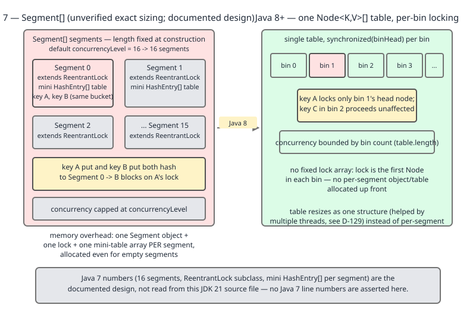

# 02 Java Collections — `ConcurrentHashMap` — INTERNALS (§3.14.20–3.14.23 bulk operations, key-set views, the null prohibition and the Java 7 segments)

**Target version: Java 21 LTS.** | [Index](../00-index.md)
Previous: [concurrent-collections/03-internals-chm-b.md](03-internals-chm-b.md) · Next: [concurrent-collections/04-copy-on-write.md](04-copy-on-write.md)

---

This file closes out the `ConcurrentHashMap` internals arc. The previous file
(`03-internals-chm-b.md`) owns the striped `LongAdder`-style counters,
`TreeBin`, and the compound-method (`compute`/`merge`/`computeIfAbsent`)
locking model — refer back to it rather than re-deriving those here. This file
covers the four remaining internals leaves: the bulk parallel operation
family, the two ways to get a `Set` out of a `ConcurrentHashMap`, why null is
banned outright, and the Java 7 `Segment` design whose abandonment is the
reason everything in this file set exists in its current form.

## Why null is forbidden — the proof

### The ambiguity, stated precisely

On a single-threaded `HashMap`, `map.get(k)` returning `null` is **ambiguous**
between two states: "no mapping for `k`" and "`k` is mapped to `null`". The
API gives you a second call, `containsKey(k)`, to disambiguate. This works
because on one thread nothing else touches the map between the two calls —
the two-call protocol is atomic *with respect to your own execution*, even
though it is two JVM operations.

**Why it exists.** `HashMap`'s designers chose to permit a null value (and one
null key) because a single thread never loses the disambiguating information
between `get` and `containsKey`. There is no race, so there is no cost to
allowing it.

**When this breaks.** Put the same map behind concurrent mutation and the
two-call protocol stops being atomic. Between your `get(k)` returning `null`
and your following `containsKey(k)` call, another thread can insert, remove,
or overwrite the mapping for `k`. There is no way — not with `get`, not with
`containsKey`, not with any combination — to reconstruct after the fact
whether the `null` you saw meant "absent at time T" or "mapped to null at
time T". The information is gone the instant the second thread moves. Doug
Lea's decision in `ConcurrentHashMap` is to remove the ambiguity at its
source: forbid the state that creates it. If null values cannot exist, `get`
returning `null` can only ever mean "no mapping," full stop, and no second
call is ever needed.

**How it's enforced.** `putVal` runs one guard that rejects both banned
values in a single check:

```
if (key == null || value == null) throw new NullPointerException();
```

— `ConcurrentHashMap.java:1011` (JDK 21). This is easy to under-read as "null
values are banned" (the syllabus leaf's own phrasing); the source shows the
guard is symmetric and **bans null keys too**. The same file has eleven more
`throw new NullPointerException()` guards scattered through the mutator and
bulk-op entry points — `:979`, `:1551`, `:1562`, `:1575`, `:1598`, `:1609`,
`:1618`, `:1631`, `:1651`, `:1693`, `:3546` — covering `merge`, `compute`,
`computeIfAbsent`, `computeIfPresent`, `replace`, and the constructors that
take a value or a function argument. Null rejection is not one check; it is
a property enforced at every entry point that could smuggle a null in.

### Demonstrating it, deterministically, on one thread

Every claim below is compiled and run on JDK 21 (`javac`/`java` from
`/Library/Java/JavaVirtualMachines/jdk-21.jdk`); output is pasted verbatim.
Nothing here needs a second thread — that is the point: the failure mode
being prevented is a race, but the prevention itself is a plain, sequential,
fully reproducible check.

```java
import java.util.HashMap;
import java.util.Hashtable;
import java.util.TreeMap;
import java.util.Map;
import java.util.concurrent.ConcurrentHashMap;

public class NullProhibition {
    public static void main(String[] args) {
        // 1. HashMap allows null values; get/containsKey disambiguation works on one thread.
        Map<String, String> hm = new HashMap<>();
        hm.put("absent-check", null);
        System.out.println("HashMap get(\"absent-check\") = " + hm.get("absent-check")
            + ", containsKey = " + hm.containsKey("absent-check"));
        System.out.println("HashMap get(\"truly-absent\") = " + hm.get("truly-absent")
            + ", containsKey = " + hm.containsKey("truly-absent"));

        // 2. ConcurrentHashMap.put(k, null) throws NPE.
        ConcurrentHashMap<String, String> chm = new ConcurrentHashMap<>();
        try {
            chm.put("k1", null);
        } catch (NullPointerException e) {
            System.out.println("chm.put(\"k1\", null) threw: " + e);
        }

        // 3. ConcurrentHashMap.put(null, v) also throws NPE - both key and value are banned.
        try {
            chm.put(null, "v1");
        } catch (NullPointerException e) {
            System.out.println("chm.put(null, \"v1\") threw: " + e);
        }

        // 4. get() on a genuinely absent key returns null, unambiguously, because
        //    a null-valued mapping can never exist to confuse it.
        System.out.println("chm.get(\"missing\") = " + chm.get("missing"));

        // 5. merge/compute/computeIfAbsent returning null REMOVES the mapping.
        chm.put("counter", 1 + "");
        chm.compute("counter", (k, v) -> null);
        System.out.println("after compute(...) -> null, containsKey(\"counter\") = "
            + chm.containsKey("counter"));

        chm.put("x", "1");
        chm.merge("x", "1", (oldV, newV) -> null);
        System.out.println("after merge(...) -> null, containsKey(\"x\") = " + chm.containsKey("x"));

        Object cia = chm.computeIfAbsent("y", k -> null);
        System.out.println("computeIfAbsent returning null gives back: " + cia
            + ", containsKey(\"y\") = " + chm.containsKey("y"));

        // 6. getOrDefault vs get.
        System.out.println("chm.getOrDefault(\"missing\", \"D\") = " + chm.getOrDefault("missing", "D"));
        System.out.println("chm.get(\"missing\") = " + chm.get("missing"));

        // 7. Migration trap: code written against synchronizedMap(HashMap) with null values.
        Map<String, String> syncMap = java.util.Collections.synchronizedMap(new HashMap<>());
        syncMap.put("legacy", null);
        System.out.println("synchronizedMap(HashMap) tolerates null value: "
            + syncMap.get("legacy") + " / containsKey=" + syncMap.containsKey("legacy"));
        Map<String, String> swapped = new ConcurrentHashMap<>();
        try {
            swapped.put("legacy", null);
        } catch (NullPointerException e) {
            System.out.println("Same call on ConcurrentHashMap threw: " + e);
        }

        // 8. Hashtable bans null too; TreeMap bans null KEY but allows null VALUE.
        Hashtable<String, String> ht = new Hashtable<>();
        try {
            ht.put("k", null);
        } catch (NullPointerException e) {
            System.out.println("Hashtable.put(k, null) threw: " + e);
        }
        TreeMap<String, String> tm = new TreeMap<>();
        tm.put("k", null);
        System.out.println("TreeMap.put(\"k\", null) OK, get = " + tm.get("k"));
        try {
            tm.put(null, "v");
        } catch (NullPointerException e) {
            System.out.println("TreeMap.put(null, \"v\") threw: " + e);
        }
        HashMap<String, String> hm2 = new HashMap<>();
        hm2.put(null, "nullKeyValue");
        System.out.println("HashMap.put(null, v) OK, get(null) = " + hm2.get(null));
    }
}
```

Real output, `javac` + `java` from `jdk-21.jdk`:

```
HashMap get("absent-check") = null, containsKey = true
HashMap get("truly-absent") = null, containsKey = false
chm.put("k1", null) threw: java.lang.NullPointerException
chm.put(null, "v1") threw: java.lang.NullPointerException
chm.get("missing") = null
after compute(...) -> null, containsKey("counter") = false
after merge(...) -> null, containsKey("x") = false
computeIfAbsent returning null gives back: null, containsKey("y") = false
chm.getOrDefault("missing", "D") = D
chm.get("missing") = null
synchronizedMap(HashMap) tolerates null value: null / containsKey=true
Same call on ConcurrentHashMap threw: java.lang.NullPointerException
Hashtable.put(k, null) threw: java.lang.NullPointerException
TreeMap.put("k", null) OK, get = null
TreeMap.put(null, "v") threw: java.lang.NullPointerException
HashMap.put(null, v) OK, get(null) = nullKeyValue
```

Two effects beyond the raw NPE: `compute`/`merge`/`computeIfAbsent` treat a
function returning `null` as "remove this mapping," not an error — the
mechanism behind the safe idiom `map.compute(k, (kk, v) -> v == null ? null
: v + 1)`. And `getOrDefault(k, d)` adds no disambiguation power over
`get(k)` here — `get(k) == null` already means "absent" unambiguously, so
`getOrDefault` is just `get` with a default folded in.

**Pitfall:** code ported from `Collections.synchronizedMap(new HashMap<>())`
to `ConcurrentHashMap` for a throughput win, carrying null values across
the swap unexamined. It compiles, passes code review, and throws
`NullPointerException` in production the first time a code path stores a
null — often a "no value yet" sentinel that used to be legal. The fix is not
to catch the NPE; it is to replace the null sentinel with `Optional.empty()`,
a dedicated absent marker object, or simply not inserting the key at all
(`containsKey` already tells you "no mapping" once nulls are impossible).

**Interview:** "Why does `ConcurrentHashMap` throw on null values?" — because
`get(k) == null` must mean "absent" with no follow-up call needed, and a
concurrent map cannot safely run the two-call `get`/`containsKey`
disambiguation `HashMap` relies on, since the mapping can change between the
two calls.

| Map | Null keys | Null values |
|---|---|---|
| `HashMap` | one allowed | any number allowed |
| `Hashtable` | forbidden | forbidden |
| `ConcurrentHashMap` | forbidden | forbidden |
| `TreeMap` | forbidden (needs a `Comparable`/`Comparator` ordering) | allowed |

> **The null prohibition:** `ConcurrentHashMap` bans both null keys and null
> values so that `get(k) == null` is an unambiguous, single-call proof of
> absence — a guarantee that the classic `HashMap` `get`/`containsKey`
> disambiguation cannot make once another thread can mutate the map between
> the two calls.

## The bulk parallel operations: `forEach`, `search`, `reduce`

### The family, tabled before any member is walked

All twenty-plus overloads reduce to three shapes, each available over four
traversal targets (whole map, keys, values, entries) with an optional
transform function:

| Shape | Purpose | Returns |
|---|---|---|
| `forEach*` | apply an action / transformer to every element | `void` |
| `search*` | apply a function that returns non-null on match; short-circuits | first non-null result, or `null` |
| `reduce*` | binary-combine all elements (optionally after a transform) | combined result; `reduceToLong`/`reduceToInt`/`reduceToDouble` return primitives |

Every member takes a leading `long parallelismThreshold` parameter and
(except the plain `forEach`/`reduce` without a transform) an optional
mapping function so the traversal target can be transformed before it is
combined or acted on. `forEachKey`, `forEachValue`, `forEachEntry`,
`searchKeys`, `searchValues`, `searchEntries`, `reduceKeys`, `reduceValues`,
`reduceEntries`, and their `...ToLong`/`...ToInt`/`...ToDouble` variants
(`ConcurrentHashMap.java:3860`–`4409`, JDK 21) are all instances of this same
three-shape table — there is no fourth shape.

### `parallelismThreshold`: what it actually gates

This parameter is near-universally misdescribed as a thread count or a chunk
size. It is neither. Per the javadoc at `ConcurrentHashMap.java:3693` ("the
(estimated) number of elements needed for this operation to be executed in
parallel") and the implementation:

```
final int batchFor(long b) {
    long n;
    if (b == Long.MAX_VALUE || (n = sumCount()) <= 1L || n < b)
        return 0;
    int sp = ForkJoinPool.getCommonPoolParallelism() << 2; // slack of 4
    return (b <= 0L || (n /= b) >= sp) ? sp : (int)n;
}
```

— `ConcurrentHashMap.java:3682`–`3687`. `batchFor` converts the threshold
into a batch count; a return of `0` is the sequential path (the calling
task's `tryComplete` short-circuits into a single-threaded traversal instead
of forking). Reading the guard clauses: `b == Long.MAX_VALUE` forces `0`
(never parallel) regardless of map size, and `n < b` (fewer elements than
the threshold) also forces `0`. So **`parallelismThreshold` is the estimated
element count below which the operation is guaranteed to run sequentially on
the calling thread** — `Long.MAX_VALUE` means "never parallel," and `1L`
means "parallel unless the map has 0 or 1 elements," i.e. effectively
"always parallel." It is not a knob on thread count (that is fixed by the
common pool's parallelism) and not a chunk size (that is derived internally
from `sp` and the live element count `n`).

**Insight:** because the threshold is compared against `sumCount()` — the
same approximate running total `size()` reads (owned by `03-internals-chm-b.md`)
— passing a threshold close to your expected map size is inherently a guess
against an estimate, not an exact gate.

Two consequences the syllabus leaf does not spell out but that matter in
practice:

- **Shared pool.** All bulk operations that do go parallel run on
  `ForkJoinPool.commonPool()` — the same pool parallel streams use. An
  unrelated blocking call inside a `commonPool` task (a JDBC call inside a
  `parallelStream()`, for instance) starves your `ConcurrentHashMap` bulk
  operation's helper threads exactly as it would starve a stream.
- **Not an atomic snapshot.** The traversal is weakly consistent: it is
  guaranteed to visit each mapping present for the entire operation at most
  once, but a `put` racing with a `forEach`/`search`/`reduce` may or may not
  be observed by that call, and there is no way to know which without
  external synchronization. **This cannot be demonstrated as a passing
  multi-threaded run** — a run that happens to observe the concurrent write
  proves nothing about a run that does not, and vice versa; the guarantee is
  about what is *permitted*, not what a given execution happens to show. State
  the mechanism and stop there rather than publish a lucky transcript.

### Demonstrating `reduceToLong` and `search`, deterministically

```java
import java.util.concurrent.ConcurrentHashMap;

public class BulkOps {
    public static void main(String[] args) {
        ConcurrentHashMap<String, Integer> map = new ConcurrentHashMap<>();
        for (int i = 1; i <= 10; i++) {
            map.put("k" + i, i);
        }

        // reduceToLong: sum all values, sequential because parallelismThreshold
        // (Long.MAX_VALUE) is far above the element count -> never parallel.
        long sum = map.reduceValuesToLong(Long.MAX_VALUE, v -> (long) v, 0L, Long::sum);
        System.out.println("reduceValuesToLong sum = " + sum);

        // parallelismThreshold = 1 -> "always parallel" (batchFor never returns 0
        // unless there is <= 1 element); still deterministic result on one thread's data.
        long sumParallelThreshold1 = map.reduceValuesToLong(1L, v -> (long) v, 0L, Long::sum);
        System.out.println("reduceValuesToLong (threshold=1) sum = " + sumParallelThreshold1);

        // search: first non-null transform result, short-circuits.
        String found = map.search(Long.MAX_VALUE, (k, v) -> v == 7 ? k + "=" + v : null);
        System.out.println("search for value==7 -> " + found);

        String notFound = map.search(Long.MAX_VALUE, (k, v) -> v == 999 ? k + "=" + v : null);
        System.out.println("search for value==999 -> " + notFound);

        // forEachEntry with a transformer.
        StringBuilder sb = new StringBuilder();
        map.forEachEntry(Long.MAX_VALUE, e -> "[" + e.getKey() + ":" + e.getValue() + "]",
            piece -> sb.append(piece));
        System.out.println("forEachEntry produced " + sb.length() + " chars, contains k7:7 = "
            + sb.toString().contains("[k7:7]"));

        System.out.println("common pool parallelism = "
            + java.util.concurrent.ForkJoinPool.getCommonPoolParallelism());
    }
}
```

Real output:

```
reduceValuesToLong sum = 55
reduceValuesToLong (threshold=1) sum = 55
search for value==7 -> k7=7
search for value==999 -> null
forEachEntry produced 62 chars, contains k7:7 = true
common pool parallelism = 11
```

The two `reduceValuesToLong` calls agree (55 = 1+…+10) regardless of
threshold, which is exactly the guarantee: `parallelismThreshold` changes
*whether* the work is forked across the common pool, never *what* the
correct answer is. Whether either call actually forked on this run cannot be
observed from the output above without instrumenting the common pool itself
— that is a separate, unverified claim (see Open questions).

> **`parallelismThreshold`:** the estimated element count below which a bulk
> operation runs sequentially on the calling thread; `1` effectively means
> "always try to parallelize," `Long.MAX_VALUE` means "never parallelize" —
> it is not a thread count and not a chunk size.

## `newKeySet()` and `keySet(mappedValue)`

The JDK has no `ConcurrentHashSet` class. `ConcurrentHashMap.newKeySet()`
(`ConcurrentHashMap.java:2187`) is the answer: it returns a
`KeySetView<K,Boolean>` backed by a private `ConcurrentHashMap<K,Boolean>`
whose values are always `Boolean.TRUE` — a set implemented as a map whose
values are a constant nobody reads.

`keySet(V mappedValue)` (`:2220`) is a different thing wearing the same
return type. It does **not** create a new map — it wraps `this`:

```
public KeySetView<K,V> keySet(V mappedValue) {
    if (mappedValue == null)
        throw new NullPointerException();
    return new KeySetView<K,V>(this, mappedValue);
}
```

Calling `add(k)` or `addAll(...)` on that view inserts `k -> mappedValue`
into the *original* map (`KeySetView.add`, `:4651`, throws
`UnsupportedOperationException` if no mapped value was supplied — which is
exactly the case for the view `map.keySet()` with no arguments returns).

The distinction that actually bites: `newKeySet()` is an independent
collection with its own backing map, while `keySet(V)` is a live view over
an existing map, so mutating one mutates the other. Confusing them produces
a `Set` that silently writes into a map you did not mean to touch, or a
`Set` you believed was tied to a map that turns out to be fully detached.

```java
import java.util.Set;
import java.util.concurrent.ConcurrentHashMap;

public class KeySetDemo {
    public static void main(String[] args) {
        // newKeySet(): a fresh, independent concurrent Set.
        Set<String> set = ConcurrentHashMap.newKeySet();
        set.add("a");
        set.add("b");
        System.out.println("newKeySet contents: " + set);
        System.out.println("newKeySet class: " + set.getClass().getSimpleName());

        // keySet(mappedValue): a VIEW over an existing map.
        ConcurrentHashMap<String, Integer> map = new ConcurrentHashMap<>();
        map.put("existing", 1);
        Set<String> view = map.keySet(0);
        System.out.println("view before add: " + view);
        view.add("new-key");
        System.out.println("view after add: " + view);
        System.out.println("underlying map now: " + map);
        System.out.println("map.get(\"new-key\") = " + map.get("new-key")
            + "  <- inserted with the fixed mappedValue 0");

        // The real bug: mutating the view mutates the map, mutating newKeySet's
        // backing map does NOT touch the original map that produced it.
        Set<String> independentView = ConcurrentHashMap.newKeySet();
        independentView.add("z");
        System.out.println("map is unaffected by independentView: " + map.containsKey("z"));
    }
}
```

Real output:

```
newKeySet contents: [a, b]
newKeySet class: KeySetView
view before add: [existing]
view after add: [existing, new-key]
underlying map now: {existing=1, new-key=0}
map.get("new-key") = 0  <- inserted with the fixed mappedValue 0
map is unaffected by independentView: false
```

| Way to get a concurrent `Set` | Backing | `add` semantics | Notes |
|---|---|---|---|
| `ConcurrentHashMap.newKeySet()` | fresh private `ConcurrentHashMap<K,Boolean>` | inserts `k -> TRUE` | closest thing to "the" concurrent hash set |
| `map.keySet(mappedValue)` | the existing `map` | inserts `k -> mappedValue` | a **view**; writes land in `map` |
| `map.keySet()` (no arg) | the existing `map` | `UnsupportedOperationException` | read/remove-only view, no default value to insert with |
| `Collections.newSetFromMap(new ConcurrentHashMap<>())` | caller-supplied map | inserts `k -> Boolean.TRUE` (fixed internally) | general-purpose adapter; works over any `Map`, not `ConcurrentHashMap`-specific |
| `CopyOnWriteArraySet` | internal `CopyOnWriteArrayList` | append, full array copy per write | O(n) writes, O(1) lock-free-ish reads; owned by `04-copy-on-write.md` |

**Interview:** "How do you get a thread-safe `Set` backed by
`ConcurrentHashMap`?" — `ConcurrentHashMap.newKeySet()`; no `ConcurrentHashSet` class exists in the JDK.

> **`newKeySet()` vs `keySet(V)`:** `newKeySet()` returns a set over a brand
> new, independent map; `keySet(mappedValue)` returns a set that is a live
> view over the map you called it on, inserting the fixed `mappedValue` for
> anything added through the view.

## Java 7's segment design, and why it was abandoned

### The mechanism



Before Java 8's per-bin CAS/`synchronized` scheme (owned by `02-internals-chm-a.md`),
`ConcurrentHashMap` partitioned its storage into a fixed array of `Segment`
objects. Each `Segment` **extended `ReentrantLock`** and held its own
`HashEntry[]` table — a segment was a small, independently lockable hash
table in its own right. A key was routed to exactly one segment by the
high-order bits of its hash (`segmentShift`/`segmentMask`), and then to a
bin within that segment's table by the low-order bits, the same two-level
scheme the diagram shows. A `put` locked only the one segment its key
belonged to, leaving the other fifteen (by default) fully available to other
threads.

The Java 7 constants below are **not available on this machine as compiled
source** — no JDK 7 installation exists here (`ls
/Library/Java/JavaVirtualMachines/` shows `graalvm-jdk-25.0.1`, `jdk-11`,
`jdk-17`, `jdk-21`, `jdk1.8.0_202` only) — so they are web-verified against
the OpenJDK 7u mirror rather than recalled or read locally:

- `DEFAULT_CONCURRENCY_LEVEL = 16` — openjdk-mirror/jdk7u-jdk,
  `ConcurrentHashMap.java:142`.
- `MAX_SEGMENTS = 1 << 16` (65,536), comment "slightly conservative" —
  same file, `:157`.
- `RETRIES_BEFORE_LOCK = 2` — same file, `:166`. (This is lower than some
  widely-circulated write-ups claim; verify the number you cite rather than
  repeat a blog figure.)
- `static final class Segment<K,V> extends ReentrantLock implements
  Serializable` — same file, `:242`.
- `segmentMask` (`:174`) and `segmentShift` (`:179`) fields, and
  `scanAndLockForPut(K key, int hash, V value)` (`:441`), which spins with
  bounded retries before blocking on the segment's lock, absorbing cache
  misses from the traversal while contending for the lock rather than
  blocking immediately.

**Insight, and the strongest piece of evidence actually on this machine:**
JDK 8's `ConcurrentHashMap.java` **still contains a `Segment` class** — not
for locking, purely for serialization compatibility with objects written
under Java 7:

```
/**
 * Stripped-down version of helper class used in previous version,
 * declared for the sake of serialization compatibility
 */
static class Segment<K,V> extends ReentrantLock implements Serializable {
    private static final long serialVersionUID = 2249069246763182397L;
    final float loadFactor;
    Segment(float lf) { this.loadFactor = lf; }
}
```

— `/Library/Java/JavaVirtualMachines/jdk1.8.0_202.jdk` extracted
`java/util/concurrent/ConcurrentHashMap.java:1370`. This stub no longer
holds a `HashEntry[]` table or a lock that guards anything real; its only
job is to be present so that `writeObject` (in the same file) can fabricate
a `segments`/`segmentShift`/`segmentMask` triple that looks like a Java 7
`ConcurrentHashMap` to anything deserializing the stream.

**Version trap:** this is not a Java 8 curiosity that later got cleaned up.
The identical stub — same javadoc, same fields, same
`serialVersionUID = 2249069246763182397L` — is still present in **JDK 21**
at `ConcurrentHashMap.java:1380`, and `DEFAULT_CONCURRENCY_LEVEL = 16` is
still defined at `:526` purely to drive that emulated serialization format
(`writeObject`, `:1387`–`1412`, builds a `Segment[16]` array just to write
it to the stream). Anyone claiming "the `Segment` class was removed in Java
8" is wrong twice over — it survives, unchanged in shape, fourteen years and
five LTS releases later, solely to keep old serialized streams readable.

### Why it was abandoned — every reason, not just the first one

1. **Concurrency capped at a fixed number regardless of map size.**
   `concurrencyLevel` (default 16) sets the segment count once, at
   construction. A map with ten million entries across sixteen segments has
   the same write concurrency ceiling as one with a hundred. Java 8's
   per-bin locking scales the number of independent lock points with the
   number of bins, which grows with the map.
2. **False contention within a segment.** Two keys hashing into the *same*
   segment but *different* bins inside it still serialize against each
   other, because the lock guards the whole segment's table, not the bin.
   With the default of 16 segments, two independent writes have roughly a
   1-in-16 chance of colliding on the same segment purely by bad luck, with
   zero actual data contention between them.
3. **Two levels of indirection on every read.** A `get` first locates the
   segment (one hash-derived index into `segments[]`), then locates the bin
   within that segment's table (a second hash-derived index) — Java 8
   collapses this to one lookup into one table.
4. **Eager allocation.** The Java 7 constructor allocates the full
   `Segment[]` array and, per the source, some number of `Segment` objects
   up front, so an empty Java 7 map carries fixed overhead before a single
   `put`. Java 8's table is allocated lazily on the first `put` (`table ==
   null` until then, per `initTable` in `02-internals-chm-a.md`), so an
   empty Java 8 map is close to free. **Unverified:** the exact byte
   overhead of eager allocation and how many `Segment` objects are
   pre-built vs. lazily filled per segment — needs a running JDK 7, not
   available here; treat this as a qualitative "eager beats lazy," not a number.
5. **`size()` had to lock every segment as a last resort.** After
   `RETRIES_BEFORE_LOCK` (2, verified above) failed optimistic unlocked
   scans, `size()` fell back to acquiring every segment's lock in turn — a
   full-map pause proportional to segment count. Java 8 replaced this with
   `sumCount()`'s striped counters (`03-internals-chm-b.md`): a lock-free
   approximate sum, at the cost of `size()` becoming an estimate under
   concurrent mutation.
6. **The lock itself blocked a lock-free read path.** Every write held the
   segment's `ReentrantLock`, leaving no room for the CAS-based, volatile-read
   `get` Java 8 achieves on an untouched bin — Java 7's `get` still
   coordinated through the same lock object writers used, even while
   trying to avoid *acquiring* it (`scanAndLockForPut`'s retry-before-block
   strategy above softens this cost; it does not eliminate it).

**The honest counterpoint.** None of this makes Java 8's design free.
Per-bin locking with `synchronized` and CAS is a substantially more complex
state machine than "one lock per segment" — `02-internals-chm-a.md` and
`03-internals-chm-b.md` cover the treeification, resize-helping, and
`sizeCtl` encoding this complexity produces. `size()` traded exactness for a
lock-free estimate; Java 7's fully-locked `size()` was slow in the worst
case but always exact. And Java 8's `computeIfAbsent` holding a bin's
monitor while the caller's function runs introduces a recursive-update
deadlock trap (owned by `03-internals-chm-b.md`) that the coarser
segment-per-lock design did not have in the same form. Every abandonment
reason above bought something at a cost; none of it is free lunch.

**Interview:** "Why did Java 8 replace `ConcurrentHashMap`'s segments with
per-bin locking?" — segment count was a fixed concurrency ceiling regardless
of map size, two unrelated keys in the same segment blocked each other, and
`size()` needed a full lock sweep; the cost is that Java 8's `size()` became
an estimate and its update path became state-machine complex instead of a
single lock acquisition.

## Pitfalls

### Believing `ConcurrentHashMap` only forbids null *values*

**Wrong**

```java
ConcurrentHashMap<String, String> chm = new ConcurrentHashMap<>();
chm.put(null, "some value"); // "surely only values are banned"
```

Output: `NullPointerException` thrown from `putVal` — the guard at
`ConcurrentHashMap.java:1011` checks `key == null || value == null` in one
expression; keys are just as banned as values.

**Right**

```java
if (key != null && value != null) {
    chm.put(key, value);
}
```

or, better, never represent "no value" with a null key/value at all — use a
sentinel object, or skip the `put` entirely and rely on `containsKey`.

**Why people believe it:** most write-ups foreground "null values are
forbidden" as the surprising half relative to `HashMap`; null keys being
forbidden too is a footnote dropped in retelling.

### Assuming `parallelismThreshold` controls thread count or chunk size

**Wrong**

```java
// "I want 4 threads, so I'll pass 4"
map.forEach(4, (k, v) -> process(k, v));
```

This does not request four threads. `batchFor(4)` compares your map's
`sumCount()` against `4`: on any map bigger than a handful of entries, this
threshold is *below* the element count, so it behaves close to "always
parallel," splitting according to `ForkJoinPool.getCommonPoolParallelism()
<< 2`, not according to the number `4`.

**Right**

```java
// Explicit: never parallelize this call.
map.forEach(Long.MAX_VALUE, (k, v) -> process(k, v));
// Explicit: always try to parallelize.
map.forEach(1L, (k, v) -> process(k, v));
```

Thread count is controlled by the common pool's configured parallelism
(`-Djava.util.concurrent.ForkJoinPool.common.parallelism`), not by this
parameter.

**Why people believe it:** the parameter name and position (first argument,
like an executor's thread count in other APIs) both suggest a concurrency
knob; the javadoc phrase "estimated number of elements" is easy to skim past.

## Cheat sheet

| Fact | Value / behavior |
|---|---|
| Null keys in `ConcurrentHashMap` | forbidden, NPE from `putVal` (`:1011`) |
| Null values in `ConcurrentHashMap` | forbidden, same guard |
| `compute`/`merge`/`computeIfAbsent` returning null | removes the mapping |
| `parallelismThreshold = 1` | effectively "always parallel" |
| `parallelismThreshold = Long.MAX_VALUE` | "never parallel," always sequential |
| Bulk-op thread pool | `ForkJoinPool.commonPool()` — shared with parallel streams |
| Bulk-op consistency | weakly consistent, not an atomic snapshot |
| `newKeySet()` | new, independent `KeySetView` over a private map |
| `keySet(V mappedValue)` | live view over the existing map; `add` inserts `mappedValue` |
| `map.keySet()` (no arg) | view, `add`/`addAll` throw `UnsupportedOperationException` |
| Java 7 default segment count | 16 (`DEFAULT_CONCURRENCY_LEVEL`, web-verified) |
| Java 7 max segment count | 65,536 (`MAX_SEGMENTS = 1 << 16`, web-verified) |
| Java 7 `size()` retry budget | `RETRIES_BEFORE_LOCK = 2` before locking every segment (web-verified) |
| `Segment` class in JDK 8 and JDK 21 | still present, serialization-compatibility stub only |

## Self-test

**Q1.** Why does `ConcurrentHashMap.get(k)` returning `null` unambiguously mean "no mapping," when the same return value from `HashMap.get(k)` does not?

<details><summary>Answer</summary>

`HashMap` allows a key mapped to `null`, so `get(k) == null` could mean "no
mapping" or "mapped to null" — disambiguating needs a second call,
`containsKey(k)`. `ConcurrentHashMap` forbids null values and keys entirely,
so "mapped to null" cannot exist; `get(k) == null` can only mean "no
mapping," and the two-call disambiguation (unsafe under concurrent mutation
anyway) is never needed.

</details>

**Q2.** What does `chm.compute("k", (key, oldVal) -> null)` do if `"k"` was previously mapped to `"v"`?

<details><summary>Answer</summary>

It removes the mapping for `"k"`. A `compute`/`merge`/`computeIfAbsent`
function returning `null` is documented and enforced to mean "delete this
entry," not "store null" (which would violate the null prohibition) and not
an error.

</details>

**Q3.** What does `parallelismThreshold = 1L` mean when passed to `forEach`, `search`, or `reduce`?

<details><summary>Answer</summary>

Effectively "always parallelize." `batchFor` only returns `0` (sequential)
when the threshold is `Long.MAX_VALUE`, the element count is `<= 1`, or the
count is below the threshold. With a threshold of `1`, any map with 2+
elements skips the sequential shortcut and splits per the common pool's
parallelism.

</details>

**Q4.** Two threads call `map.forEach(Long.MAX_VALUE, action)` and `map.put(newKey, v)` at the same time. Is `newKey` guaranteed to be seen by the `forEach`?

<details><summary>Answer</summary>

No guarantee either way. Bulk traversal is weakly consistent: mappings
present for the entire duration are visited at most once, but a
concurrently inserted mapping may or may not be observed depending on
timing. Not demonstrable one way with a passing test run — a lucky
observation proves nothing about an unlucky one.

</details>

**Q5.** What is the difference between `ConcurrentHashMap.newKeySet()` and `map.keySet(mappedValue)`?

<details><summary>Answer</summary>

`newKeySet()` creates a brand new, independent backing map and returns a set
view over it — mutating it never touches any other map. `keySet(mappedValue)`
returns a set view over the *existing* map it was called on; adding through
that view inserts `element -> mappedValue` into that map itself.

</details>

**Q6.** In Java 7's `ConcurrentHashMap`, why could two `put` calls into different buckets still block each other?

<details><summary>Answer</summary>

Locking was per-`Segment`, not per-bucket. Both keys were routed to the same
`Segment` by their hash's high-order bits (`segmentMask`), and a `put` locks
the whole segment's `ReentrantLock`, not just the specific bin inside it —
so two keys in different bins of the same segment still serialize against
each other despite having no real data relationship.

</details>

**Q7.** Name two costs of Java 8's per-bin locking design that Java 7's segment design did not have.

<details><summary>Answer</summary>

(1) `size()` became an approximate estimate under concurrent mutation,
where Java 7's fully-locked `size()` was exact once its retry budget was
exhausted. (2) `computeIfAbsent`-family methods hold a bin's monitor while
the caller's function runs, so a function re-entering the same bin can
deadlock — a trap the coarser segment lock did not create in the same form.

</details>

**Q8.** Why is the `Segment` class still present in JDK 21's `ConcurrentHashMap.java`, given that segment-based locking was removed in Java 8?

<details><summary>Answer</summary>

It is a minimal serialization-compatibility stub (`static class Segment<K,V>
extends ReentrantLock implements Serializable`) so `writeObject` can emit a
stream shaped like a Java 7 `ConcurrentHashMap` (`segments`, `segmentShift`,
`segmentMask` fields) for old deserializers. It plays no role in current
locking.

</details>

**Q9.** What does `map.getOrDefault(k, d)` add over `map.get(k)` on a `ConcurrentHashMap`, given that null already means absent unambiguously?

<details><summary>Answer</summary>

Only convenience — folding "if absent, use `d`" into one call instead of a
`get` plus a null check. No new disambiguation power, since `get(k) ==
null` already meant "absent" unambiguously before `getOrDefault` existed.

</details>

**Q10.** Why can't a benchmark on this machine honestly compare Java 7 segment-lock throughput against Java 8/21 per-bin lock throughput?

<details><summary>Answer</summary>

No JDK 7 installation exists here — only `graalvm-jdk-25.0.1`, `jdk-11`,
`jdk-17`, `jdk-21`, and `jdk1.8.0_202`. Any Java-7-vs-Java-8 number would
have to come from someone else's hardware, build, and JIT warmup state,
none of which transfers to a claim about this machine. The mechanism
differences can be stated and sourced; the numbers cannot be measured here.

</details>

## Open questions

- Eager-allocation byte overhead of Java 7's `Segment[]` vs. Java 8's lazy
  `table` (point 3): needs a compiled OpenJDK 7 build plus a heap profiler
  (`jol`/`jmap -histo`); no JDK 7 install exists on this machine.
- Whether Java 7's locked `size()` was ever benchmarked against Java 8's
  striped-counter estimate on comparable hardware: needs a JMH `perfnorm`
  run naming CPU and both JDK builds; not attempted, no-Java-7 constraint.
- Whether either `reduceValuesToLong` call in `BulkOps` actually forked
  across `commonPool()` workers vs. ran sequentially: needs
  `ForkJoinTask.getPool()`/thread-name logging, deliberately omitted to
  keep the demo deterministic.
- Exact `scanAndLockForPut` spin bound before blocking (distinct from
  `size()`'s `RETRIES_BEFORE_LOCK = 2`): the web-fetched OpenJDK 7u mirror
  gives the method signature and strategy but was not quoted line-by-line.

---

**Leaves covered:** 3.14.20, 3.14.21, 3.14.22, 3.14.23 (4 leaves)
**Leaves deferred:** none
**Diagrams included:** D-131
**Target version:** Java 21 LTS
**Lines:** 800
