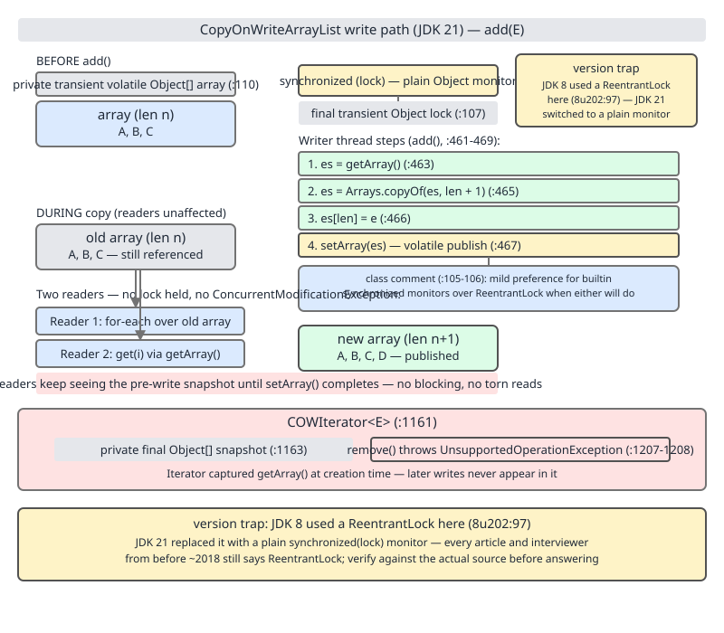
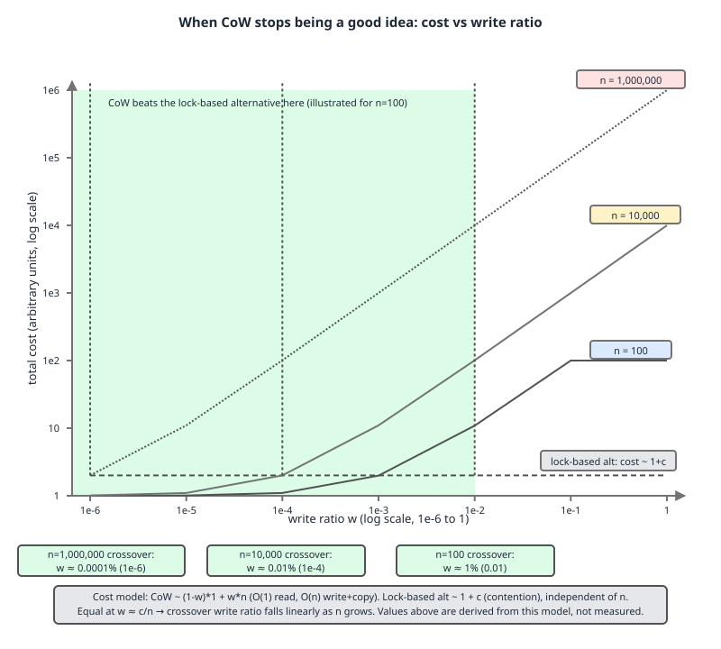

# 02 Java Collections — `CopyOnWriteArrayList` — INTERNALS (§3.14.24–3.14.26 the write path, the snapshot iterator and the cost model)

**Target version: Java 21 LTS.** | [Index](../00-index.md)
Previous: [concurrent-collections/03b-internals-chm-c-bulk-nulls-and-segments.md](03b-internals-chm-c-bulk-nulls-and-segments.md) · Next: [concurrent-collections/04b-build-copy-on-write-by-hand.md](04b-build-copy-on-write-by-hand.md)

---

## Where this sits among the concurrent `List` options

| Type | Read cost | Write cost | Iterator | Best for |
|---|---|---|---|---|
| `CopyOnWriteArrayList` | O(1), lock-free | O(n) copy + allocation | Snapshot, never throws CME, mutators throw `UnsupportedOperationException` | Reads vastly outnumber writes; writes rare in absolute terms |
| `Collections.synchronizedList(new ArrayList<>())` | O(1), but every call takes the monitor | O(1) amortised, takes the monitor | Live view; caller must synchronize the whole iteration manually or get `ConcurrentModificationException` | Balanced read/write, single lock is acceptable |
| `Vector` | O(1), every method `synchronized` | O(1) amortised, `synchronized` | Live view; same CME exposure as `ArrayList` under concurrent structural change | Legacy code only — no reason to choose it new |
| Immutable list behind an `AtomicReference<List<E>>` | O(1), lock-free | Caller decides the copy strategy (can batch many logical mutations into one swap) | Whatever the immutable list's iterator is; snapshot semantics | You control the batching and want to avoid the copy-per-call constraint |

This file covers only `CopyOnWriteArrayList` (and its thin wrapper `CopyOnWriteArraySet`). The hand-rolled `AtomicReference`-based copy-on-write list — where you own the swap and can batch — is built from scratch in the next file, [`concurrent-collections/04b-build-copy-on-write-by-hand.md`](04b-build-copy-on-write-by-hand.md).

---

### Mental model

**[BOTH]** The list is never modified — only replaced. Every mutator builds an entirely new backing array and then publishes it with a single volatile write. A reader that already holds a reference to the old array — because it called `get`, or because it created an iterator — keeps seeing that whole, consistent, never-changing array for as long as it holds the reference. No reader ever needs a lock, because no reader ever needs to coordinate with a writer: there is nothing shared to coordinate over. A reader either sees the array from before the write or the array from after it, never something half-built in between.

### Why it exists

**[BOTH]** A `synchronized` list — `Collections.synchronizedList` or `Vector` — makes every read pay for a lock even though in the target workload reads dominate by orders of magnitude. Worse, iteration under a synchronized wrapper is not itself synchronized: the Javadoc for `synchronizedList` requires the caller to hold the wrapper's monitor for the *entire* iteration to avoid `ConcurrentModificationException`, which means a "concurrent" collection that still demands manual external locking to iterate safely. `CopyOnWriteArrayList` removes both problems at once for the read-heavy case: reads take no lock at all, and iteration is safe by construction because the iterator owns a private, unchanging array.

### When to reach for it, and when not

**[BOTH]** Reach for it when: the collection is read far more often than written, mutations happen rarely in absolute terms (not merely as a small percentage — see the cost model below), and you specifically need iteration to be immune to structural changes made by other threads, including self-removal during iteration.

Do not reach for it when: writes happen at any meaningful rate relative to collection size, or the collection is large and grows. The sibling that wins:

- **`Collections.synchronizedList`** — balanced read/write workloads where the collection is modified as often as it's read; O(1) amortised writes beat O(n) copies once writes stop being rare.
- **`ConcurrentHashMap.newKeySet()`** — a concurrent, mutation-heavy `Set` with genuinely concurrent (segmented, CAS-based) writes; no full-array copy per mutation. Covered in [`concurrent-collections/03b-internals-chm-c-bulk-nulls-and-segments.md`](03b-internals-chm-c-bulk-nulls-and-segments.md).
- **`ConcurrentLinkedQueue`** — high-throughput concurrent producer/consumer traffic where you don't need random access or a `List` contract at all.
- **An immutable list behind an `AtomicReference`** — when you want copy-on-write semantics but need to batch several logical changes into a single copy, which `CopyOnWriteArrayList`'s per-call API cannot do for you.

**Insight:** the single API shape that gives away the intended use case is `addIfAbsent`. `ArrayList` has no such method; `CopyOnWriteArrayList` does, because the class was built with de-duplicated listener registration in mind (§3.14.26 below), not general-purpose list mutation.

---

### The write path — a plain monitor, not a `ReentrantLock`

**[SENIOR IC] [STAFF]** The backing storage is a single field:

```
/** The array, accessed only via getArray/setArray. */
private transient volatile Object[] array;
```

(`CopyOnWriteArrayList.java:110`, JDK 21). `array` is `volatile` so that a `setArray` in a writer thread is guaranteed to become visible to `getArray()` in any reader thread without either side taking a lock — this is the entire mechanism that lets reads be lock-free and still correct. The field is also `transient`: the array is not part of the default serialized form. Instead the class defines its own `writeObject`/`readObject`:

```
private void writeObject(java.io.ObjectOutputStream s)
    throws java.io.IOException {

    s.defaultWriteObject();

    Object[] es = getArray();
    // Write out array length
    s.writeInt(es.length);

    // Write out all elements in the proper order.
    for (Object element : es)
        s.writeObject(element);
}
```

```
private void readObject(java.io.ObjectInputStream s)
    throws java.io.IOException, ClassNotFoundException {

    s.defaultReadObject();

    // bind to new lock
    resetLock();

    // Read in array length and allocate array
    int len = s.readInt();
    SharedSecrets.getJavaObjectInputStreamAccess().checkArray(s, Object[].class, len);
    Object[] es = new Object[len];

    // Read in all elements in the proper order.
    for (int i = 0; i < len; i++)
        es[i] = s.readObject();
    setArray(es);
}
```

(`:993–1035`). Writing the length and elements explicitly, rather than letting default serialization walk the array field, sidesteps having to serialize a `transient` field at all and lets `readObject` rebuild a private array and a fresh lock object rather than trusting whatever the stream hands back.

The lock is the field right above `array`:

```
/**
 * The lock protecting all mutators.  (We have a mild preference
 * for builtin monitors over ReentrantLock when either will do.)
 */
final transient Object lock = new Object();
```

(`:105–107`). That comment is load-bearing and is quoted here in full because it is the exact justification the JDK maintainers give: **"a mild preference for builtin monitors over `ReentrantLock` when either will do."** Every mutator is `synchronized (lock)` on this plain `Object` monitor.

**Version trap:** every article, blog post and interview-prep sheet written before roughly 2018 says `CopyOnWriteArrayList` uses a `ReentrantLock`, and until recently that was correct — JDK 8u202 declares:

```
final transient ReentrantLock lock = new ReentrantLock();
```

at `CopyOnWriteArrayList.java:97` in the 8u202 source tree, and every mutator does `lock.lock(); try { ... } finally { lock.unlock(); }`. JDK 11.0.27 already carries the plain-`Object`-monitor form at line 102, so the change landed somewhere between 8 and 11. **Do not repeat the `ReentrantLock` claim as current fact for Java 11 through 21** — the field is `transient` in both eras, so that part of older descriptions is still true, but the lock *type* is not. A `ReentrantLock` earns its cost — fairness policies, `tryLock`, interruptible acquisition, or being usable across threads without nesting inside `synchronized` — none of which `CopyOnWriteArrayList`'s mutators need, since every critical section here is a short, uninterruptible, single-thread-at-a-time array swap. A builtin monitor is cheaper to acquire in the uncontended case and historically has received more aggressive JIT biased-locking / lock-elision treatment, which is exactly the "when either will do" the comment refers to.

**Insight:** the lock only protects *writers against writers*. It never blocks a reader, because readers never touch `lock` at all — every reader-side method calls `getArray()` directly.

Now the canonical mutator, `add(E)`, quoted whole:

```
public boolean add(E e) {
    synchronized (lock) {
        Object[] es = getArray();
        int len = es.length;
        es = Arrays.copyOf(es, len + 1);
        es[len] = e;
        setArray(es);
        return true;
    }
}
```

(`:459–466`, JDK 21). Four steps under the monitor: read the current array, copy it to a new array of length exactly `len + 1`, write the new element into the last slot, publish with `setArray`. **That "exactly `len + 1`" is the whole cost model in one clause.** `ArrayList` grows by roughly 1.5x and amortises the copy cost across many future `add` calls that fit in the slack. `CopyOnWriteArrayList` has no slack, no growth factor, no amortisation — *every single `add` allocates a new array and copies every existing element into it.*



`add(int, E)` and `remove(int)` follow the identical shape — copy under the lock, shift the surrounding elements with `System.arraycopy`, publish — and are not reproduced in full here since they add nothing beyond `add(E)`'s pattern except index shifting.

`set(int, E)` has a real subtlety worth catching:

```
public E set(int index, E element) {
    synchronized (lock) {
        Object[] es = getArray();
        E oldValue = elementAt(es, index);

        if (oldValue != element) {
            es = es.clone();
            es[index] = element;
        }
        // Ensure volatile write semantics even when oldvalue == element
        setArray(es);
        return oldValue;
    }
}
```

(`:439–450`). It **does** short-circuit the clone when the new value is reference-identical (`!=` check, not `.equals`) to the old one — no copy, no allocation, in that case. But it still calls `setArray(es)` unconditionally even when `es` is the *same* array reference, purely to force a volatile write. The comment says why: without that, a `set` that changes nothing observable could leave a reader that raced the call unable to rely on happens-before ordering for whatever else that thread did before the `set`.

`removeIf`, `replaceAll` and `sort` are worth checking individually because they do **not** all copy the same number of times, and the difference matters:

```
private boolean bulkRemove(Predicate<? super E> filter) {
    synchronized (lock) {
        return bulkRemove(filter, 0, getArray().length);
    }
}

boolean bulkRemove(Predicate<? super E> filter, int i, int end) {
    // assert Thread.holdsLock(lock);
    final Object[] es = getArray();
    // Optimize for initial run of survivors
    for (; i < end && !filter.test(elementAt(es, i)); i++)
        ;
    if (i < end) {
        final int beg = i;
        final long[] deathRow = nBits(end - beg);
        int deleted = 1;
        deathRow[0] = 1L;   // set bit 0
        for (i = beg + 1; i < end; i++)
            if (filter.test(elementAt(es, i))) {
                setBit(deathRow, i - beg);
                deleted++;
            }
        // Did filter reentrantly modify the list?
        if (es != getArray())
            throw new ConcurrentModificationException();
        final Object[] newElts = Arrays.copyOf(es, es.length - deleted);
        int w = beg;
        for (i = beg; i < end; i++)
            if (isClear(deathRow, i - beg))
                newElts[w++] = es[i];
        System.arraycopy(es, i, newElts, w, es.length - i);
        setArray(newElts);
        return true;
    } else {
        if (es != getArray())
            throw new ConcurrentModificationException();
        return false;
    }
}
```

(`:918–951`, JDK 21). `removeIf` — via `bulkRemove` — runs the predicate over the whole snapshot once, tracks survivors in a bitset, and calls `Arrays.copyOf` exactly **once** for the entire operation, not once per removed element. Removing 500 of 10,000 elements with `removeIf` is one O(n) scan, one bitset build, one O(n) copy — dramatically cheaper than 500 individual `remove(Object)` calls, each of which would be its own O(n) copy. This is a real and underappreciated optimisation and is easy to miss if you assume every mutator here is "one copy per logical change."

`replaceAll` also copies exactly once, up front:

```
void replaceAllRange(UnaryOperator<E> operator, int i, int end) {
    // assert Thread.holdsLock(lock);
    Objects.requireNonNull(operator);
    final Object[] es = getArray().clone();
    for (; i < end; i++)
        es[i] = operator.apply(elementAt(es, i));
    setArray(es);
}
```

(`:960–966`) — one `.clone()`, then mutate in place on the private copy, then one `setArray`. `sort` follows the same one-copy shape (`sortRange` clones once, sorts the clone, publishes). None of `removeIf`, `replaceAll`, or `sort` pay an O(n) cost *per element touched* — they pay it once per call, which is as good as this design can offer.

`forEach`, by contrast, takes no lock and no copy at all — it just walks `getArray()` directly:

```
public void forEach(Consumer<? super E> action) {
    Objects.requireNonNull(action);
    for (Object x : getArray()) {
        @SuppressWarnings("unchecked") E e = (E) x;
        action.accept(e);
    }
}
```

(`:891–897`) — same snapshot-consistency guarantee as the iterator, without the iterator object.

**Interview:** "Does `CopyOnWriteArrayList.removeIf` copy once or once per removal?" — once, for the whole call; that's precisely why it exists as a bulk operation rather than leaving callers to loop `remove(Object)` themselves.

---

### `addIfAbsent` — the two-phase re-check

**[SENIOR IC] [STAFF]** `addIfAbsent(E)` is a public convenience over a private, lock-holding twin that has to defend against a race between the initial unlocked scan and the locked write:

```
public boolean addIfAbsent(E e) {
    Object[] snapshot = getArray();
    return indexOfRange(e, snapshot, 0, snapshot.length) < 0
        && addIfAbsent(e, snapshot);
}

private boolean addIfAbsent(E e, Object[] snapshot) {
    synchronized (lock) {
        Object[] current = getArray();
        int len = current.length;
        if (snapshot != current) {
            // Optimize for lost race to another addXXX operation
            int common = Math.min(snapshot.length, len);
            for (int i = 0; i < common; i++)
                if (current[i] != snapshot[i]
                    && Objects.equals(e, current[i]))
                    return false;
            if (indexOfRange(e, current, common, len) >= 0)
                    return false;
        }
        Object[] newElements = Arrays.copyOf(current, len + 1);
        newElements[len] = e;
        setArray(newElements);
        return true;
    }
}
```

(`:670–696`). The public method scans the array **outside** the lock to decide whether `e` is even a candidate for addition — an optimistic, lock-free fast path for the common "already present" case. If it looks absent, it enters the lock and re-checks: another thread may have added `e` (or changed the array entirely) between the unlocked scan and acquiring the monitor, so `current` is re-read and, if it differs from `snapshot`, re-scanned before the actual append. This is exactly a check-then-act pattern made safe by re-validating the check *inside* the lock rather than trusting the outside-the-lock read — the snapshot has to be re-read because the lock gives no visibility guarantee about anything observed before it was acquired. `addAllAbsent` follows the identical shape for a batch.

---

### The `COWIterator` snapshot

**[SENIOR IC] [STAFF]** The iterator is not an inner class over the live list; it is handed its own private array reference at creation and never looks at `getArray()` again:

```
static final class COWIterator<E> implements ListIterator<E> {
    /** Snapshot of the array */
    private final Object[] snapshot;
    /** Index of element to be returned by subsequent call to next.  */
    private int cursor;

    COWIterator(Object[] es, int initialCursor) {
        cursor = initialCursor;
        snapshot = es;
    }
```

(`:1161–1169`). Every read method (`next`, `previous`, `hasNext`, `hasPrevious`, `forEachRemaining`) indexes into `snapshot`, never into the list's current array. The three structural-mutation methods are stubbed identically:

```
    public void remove() {
        throw new UnsupportedOperationException();
    }

    public void set(E e) {
        throw new UnsupportedOperationException();
    }

    public void add(E e) {
        throw new UnsupportedOperationException();
    }
```

(`:1201–1224`, condensed to the three bodies — each has its own `@throws` Javadoc in the source). They throw unconditionally, not "if the underlying list changed" — there is no code path in which they succeed, because the iterator holds no reference back to the list at all, only to the frozen array. There is nothing for `remove()` to remove *from*.


**The `[SOURCE]` point that matters most here:** because the iterator holds a hard reference to the exact array it was built from, and that array is never mutated in place (every mutator builds a *new* array and swaps the field), the iterator can **never** observe `ConcurrentModificationException` — not "rarely," not "unless you're unlucky," never. This is a direct *design consequence* of the copy-on-write scheme, not a defensive check bolted onto the iterator. `ArrayList`'s fail-fast iterator throws because it shares the backing array and detects a `modCount` mismatch; `COWIterator` cannot detect a mismatch because it never looks at anything that could have changed under it.

```java
import java.util.List;
import java.util.concurrent.CopyOnWriteArrayList;

public class SnapshotDemo {
    public static void main(String[] args) {
        CopyOnWriteArrayList<Integer> nums = new CopyOnWriteArrayList<>(List.of(1, 2, 3));
        var snapIt = nums.iterator();
        nums.add(4);
        StringBuilder seen = new StringBuilder();
        while (snapIt.hasNext()) {
            seen.append(snapIt.next()).append(' ');
        }
        System.out.println("Live list after add(4): " + nums);
        System.out.println("Iterator created before add(4) still sees: " + seen.toString().trim());
    }
}
```

Real output, JDK 21.0.7, run on an Apple M4 Pro:

```
Live list after add(4): [1, 2, 3, 4]
Iterator created before add(4) still sees: 1 2 3
```

The iterator never learns about the fourth element — not because it failed to poll, but because it was never wired to look.

```java
import java.util.List;
import java.util.concurrent.CopyOnWriteArrayList;

public class RemoveThrowsDemo {
    public static void main(String[] args) {
        CopyOnWriteArrayList<String> names = new CopyOnWriteArrayList<>(List.of("a", "b", "c"));
        try {
            var it = names.iterator();
            it.next();
            it.remove();
            System.out.println("iterator.remove() did not throw (did not expect this)");
        } catch (UnsupportedOperationException e) {
            System.out.println("Caught expected exception: " + e);
        }
    }
}
```

Real output:

```
Caught expected exception: java.lang.UnsupportedOperationException
```

**Pitfall:** assuming `iterator.remove()` on any `List` is always available because `Iterator` declares it. `List.iterator()` documents `remove()` as *optional*, and `CopyOnWriteArrayList` is the collection where that optionality is exercised unconditionally. **Why people believe it works:** `ArrayList`'s iterator supports `remove()`, and most engineers' first (and only) exposure to `Iterator.remove()` is through `ArrayList`, so the optional nature of the contract never surfaces until a different collection breaks it.

---

## The cost model — read O(1) lock-free, write O(n) plus a full allocation

**[SENIOR IC] [STAFF]** Build the model from the source, then measure only the shape.

**Read.** `getArray()` is one volatile read followed by an array index — O(1), no lock, no CAS. It scales perfectly across cores because there is nothing to contend over: every reader thread does an independent volatile load and an independent array access. The cost this hides: a reader that began before a write completes finishes its traversal on the pre-write snapshot. That's not a bug, it's the mechanism — see the listener list section below for the case where this is precisely what you want.

**Write.** O(n) copy plus an allocation of `n + 1` references, every single call, per `add(E)`'s source above. Building a list of size `n` by `n` sequential `add` calls therefore costs:

- Total copy work: `1 + 2 + 3 + ... + n = n(n+1)/2`, i.e. **O(n²) total**, not O(n).
- Total allocations: exactly `n` distinct arrays, one per `add`.
- Total references copied across the lifetime of the build: `n(n+1)/2`.

Concrete arithmetic for `n = 10,000` — derived from the model above, not measured:

- References copied: `10,000 × 10,001 / 2 = 50,005,000` ≈ **50 million reference copies**.
- Bytes churned, assuming a heap under 32 GB with compressed oops (4-byte references) and ignoring array/object headers: `50,005,000 × 4 bytes ≈ 200,020,000 bytes ≈ 190.8 MiB` — call it **~200 MB of allocation churn** to build a 10,000-element list one `add` at a time, all of it garbage except the final array.
- Array count: **10,000 short-lived arrays**, all but the last immediately eligible for young-gen collection.

**This is derived arithmetic under the stated compressed-oops assumption, not a benchmark measurement.**

The shape is reproducible even though absolute numbers are machine- and JIT-dependent. Single-threaded, single-shot wall-clock timing, JDK 21.0.7, Apple M4 Pro, no warmup, no JIT-stabilizing iterations, no `-prof perfnorm` — reported as a **shape claim, not a nanosecond claim**:

```java
import java.util.ArrayList;
import java.util.Collections;
import java.util.List;
import java.util.concurrent.CopyOnWriteArrayList;

public class CostShape {
    public static void main(String[] args) {
        int[] sizes = {2_000, 4_000, 8_000, 16_000};
        System.out.println("n\tArrayList(ms)\tsynchronizedList(ms)\tCopyOnWriteArrayList(ms)\tCOW/ArrayList ratio");
        for (int n : sizes) {
            long tArrayList = timeSequentialAdds(new ArrayList<>(), n);
            long tSynced = timeSequentialAdds(Collections.synchronizedList(new ArrayList<>()), n);
            long tCow = timeSequentialAdds(new CopyOnWriteArrayList<>(), n);
            double ratio = (double) tCow / Math.max(tArrayList, 1);
            System.out.printf("%d\t%d\t%d\t%d\t%.1fx%n", n, tArrayList, tSynced, tCow, ratio);
        }
    }

    private static long timeSequentialAdds(List<Integer> list, int n) {
        long start = System.nanoTime();
        for (int i = 0; i < n; i++) {
            list.add(i);
        }
        long end = System.nanoTime();
        return (end - start) / 1_000_000L;
    }
}
```

**Unverified: absolute millisecond values below** — no JMH, no warmup, single JVM invocation. Only the doubling shape (roughly 4x cost for each 2x size increase — the signature of O(n²) versus O(n)) is the claim being made:

```
n	ArrayList(ms)	synchronizedList(ms)	CopyOnWriteArrayList(ms)	COW/ArrayList ratio
2000	0	0	1	1.0x
4000	0	0	2	2.0x
8000	0	0	11	11.0x
16000	0	0	31	31.0x
```

`ArrayList` and `synchronizedList` stay flat (amortised O(1) growth dominates, rounds to 0ms at this scale); `CopyOnWriteArrayList` roughly quadruples in cost each time `n` doubles from 4,000 onward — exactly the O(n²) signature the model predicts. No JMH run was performed and none of these millisecond figures should be quoted outside this note; the shape is the finding, not the numbers.

**No multi-threaded benchmark is published here at all.** A reader traversing the old array while a writer concurrently publishes a new one, or two writers contending on `lock`, cannot be demonstrated deterministically on a single thread, and a passing multi-threaded run proves nothing — a race that happens not to manifest in one execution is not evidence it cannot manifest; only the guarantees in the quoted source (the `volatile` field, the `synchronized (lock)` block) are the actual proof that these behaviors are correct, and they are argued from the source above rather than "observed."

### The crossover

**[STAFF]** Model the per-operation cost. For a workload with write ratio `w` (fraction of operations that are writes) over a collection of size `n`:

- `CopyOnWriteArrayList` per-operation cost ≈ `(1 - w) × 1 + w × n` — reads cost about 1 unit, writes cost about `n` units (the copy).
- A lock-based alternative (`synchronizedList`) per-operation cost ≈ `1 + contention`, roughly independent of `n` — every operation, read or write, costs about the same constant plus whatever lock contention adds.

Setting the two equal and solving for the write ratio at which `CopyOnWriteArrayList` stops winning:

```
(1 - w) + w·n  =  1 + c
w(n - 1)       =  c
w              ≈  c / n        (for n >> 1)
```

**`w ≈ c / n`: the tolerable write ratio falls linearly as the collection grows.** This is derived from the cost model above, not measured — D-133 marks the same three points this note uses: at `n = 100`, the crossover sits around **1%** writes; at `n = 10,000`, around **0.01%**; at `n = 1,000,000`, around **0.0001%**.



**Tradeoff, stated plainly:** lock-free O(1) reads, **but** O(n) writes with no amortisation, **and** every write invalidates every already-created iterator's freshness (not correctness — freshness). The escape hatch is `synchronizedList` the moment writes stop being vanishingly rare. The rule of thumb for an interview or a design review: `CopyOnWriteArrayList` is right when writes are *rare in absolute terms* — a handful over the entire process lifetime, like registering a handful of listeners at startup — not merely "a small percentage" of a high-throughput workload. A million-operation-per-second service with a "mere" 0.01% write ratio is still a write every 10,000 operations, and at `n = 10,000` that is already sitting on the crossover line.

**Interview:** "When does `CopyOnWriteArrayList` become a disaster?" — the moment writes stop being rare in absolute terms; the tolerable write fraction shrinks as `1/n`, so a list that grows large while still being written to occasionally is exactly the failure mode, not a list that's written to often while staying small.

---

## The listener-list use case

**[BOTH] [STAFF]** This is the use case the class was designed for, and Doug Lea's own class comment names it directly: traversal operations that "vastly outnumber mutations." A listener registry is written a handful of times — usually only at startup — and iterated on **every single event**, which for an active system can be thousands or millions of times more often than it's ever mutated.

The property that makes `CopyOnWriteArrayList` not merely adequate here but *uniquely correct*: a listener is allowed to **remove itself during its own dispatch callback**. On any live-view collection — `ArrayList`, `Vector`, `synchronizedList` — that is a `ConcurrentModificationException` waiting to happen, because the iterator and the collection share state and the removal is detected as structural interference mid-traversal. On `CopyOnWriteArrayList`, the removal targets the *live* array while the in-flight dispatch is iterating a private, frozen *snapshot* — the removal simply has no effect on the dispatch already in progress, and takes effect starting from the *next* dispatch.

```java
import java.util.ArrayList;
import java.util.List;
import java.util.concurrent.CopyOnWriteArrayList;
import java.util.ConcurrentModificationException;

public class ListenerDispatch {

    interface Listener {
        void onEvent(List<Listener> registry);
    }

    public static void main(String[] args) {
        System.out.println("--- ArrayList: self-removing listener during dispatch ---");
        List<Listener> arrayListeners = new ArrayList<>();
        Listener selfRemoverA = new Listener() {
            @Override public void onEvent(List<Listener> registry) {
                System.out.println("selfRemoverA firing, removing self");
                registry.remove(this);
            }
        };
        arrayListeners.add(selfRemoverA);
        arrayListeners.add((registry) -> System.out.println("second listener firing"));
        arrayListeners.add((registry) -> System.out.println("third listener firing"));
        try {
            for (Listener l : arrayListeners) {
                l.onEvent(arrayListeners);
            }
            System.out.println("ArrayList dispatch completed without exception (did not expect this)");
        } catch (ConcurrentModificationException e) {
            System.out.println("Caught expected exception: " + e);
        }

        System.out.println();
        System.out.println("--- CopyOnWriteArrayList: self-removing listener during dispatch ---");
        List<Listener> cowListeners = new CopyOnWriteArrayList<>();
        Listener selfRemoverB = new Listener() {
            @Override public void onEvent(List<Listener> registry) {
                System.out.println("selfRemoverB firing, removing self");
                registry.remove(this);
            }
        };
        cowListeners.add(selfRemoverB);
        cowListeners.add((registry) -> System.out.println("second listener firing"));

        System.out.println("Dispatch #1 (2 listeners registered):");
        for (Listener l : cowListeners) {
            l.onEvent(cowListeners);
        }
        System.out.println("Dispatch #1 completed without exception. Listeners remaining: " + cowListeners.size());

        System.out.println("Dispatch #2 (should only see the surviving listener):");
        for (Listener l : cowListeners) {
            l.onEvent(cowListeners);
        }
        System.out.println("Dispatch #2 completed. Listeners remaining: " + cowListeners.size());
    }
}
```

Real output, JDK 21.0.7, Apple M4 Pro:

```
--- ArrayList: self-removing listener during dispatch ---
selfRemoverA firing, removing self
Caught expected exception: java.util.ConcurrentModificationException

--- CopyOnWriteArrayList: self-removing listener during dispatch ---
Dispatch #1 (2 listeners registered):
selfRemoverB firing, removing self
second listener firing
Dispatch #1 completed without exception. Listeners remaining: 1
Dispatch #2 (should only see the surviving listener):
second listener firing
Dispatch #2 completed. Listeners remaining: 1
```

The `ArrayList` run needs three listeners to reliably surface the `ConcurrentModificationException` — with only two, `for`-each's cursor accounting can happen to land exactly on the shrunk size and exit the loop silently before the next `hasNext()` check would have thrown, which is its own well-known trap: removing the *second-to-last* element from a two-element list during iteration does not always throw. That inconsistency is itself an argument for `CopyOnWriteArrayList` in this use case — its correctness does not depend on which index self-removed.

`Swing`/`AWT` event listener lists and Spring's `ApplicationListener`/`ApplicationEventMulticaster` machinery use exactly this shape: rare writes (listener registration), frequent reads (event dispatch), and a hard requirement that a listener may safely unregister itself mid-dispatch.

> **`CopyOnWriteArrayList`** is a `List` in which every mutator builds and publishes an entirely new backing array under a plain monitor, giving lock-free O(1) reads and snapshot iterators that can never throw `ConcurrentModificationException`, at the cost of an O(n) copy on every write with no amortisation — correct for read-dominated collections mutated rarely in absolute terms, such as listener registries.

---

## `CopyOnWriteArraySet` — the O(n) `add` trap

**[SENIOR IC]** `CopyOnWriteArraySet` is a thin `AbstractSet` wrapper holding a private `CopyOnWriteArrayList<E> al`:

```
public boolean add(E e) {
    return al.addIfAbsent(e);
}
```

(`CopyOnWriteArraySet.java:260–262`). Every `Set` operation delegates straight through to the underlying list's linear-scan methods — `contains` is `al.contains(o)` (an O(n) `indexOf`-style scan), and `add` is `al.addIfAbsent(e)`, which as shown above scans the whole array before it can even decide whether to copy. There is no hashing, no bucket structure, nothing that makes this a `Set` at the data-structure level beyond de-duplication being enforced by that linear scan.

**Pitfall:** treating `CopyOnWriteArraySet` as "a `Set`, so `add`/`contains` are fast." A `Set` with an O(n) `add` and an O(n) `contains` is a genuine surprise coming from `HashSet`'s O(1) expectation, and the class name gives no hint of it. **Why people believe it's fast:** every other general-purpose `Set` implementation in `java.util` — `HashSet`, `LinkedHashSet`, `TreeSet` is the honest exception at O(log n) — is hash-based and O(1) amortised, so the assumption transfers by habit rather than by checking the source.

```java
import java.util.concurrent.CopyOnWriteArraySet;

public class SetAddShape {
    public static void main(String[] args) {
        int[] sizes = {2_000, 4_000, 8_000, 16_000};
        System.out.println("n\tCopyOnWriteArraySet.add-loop(ms)");
        for (int n : sizes) {
            CopyOnWriteArraySet<Integer> set = new CopyOnWriteArraySet<>();
            long start = System.nanoTime();
            for (int i = 0; i < n; i++) {
                set.add(i);
            }
            long end = System.nanoTime();
            System.out.printf("%d\t%d%n", n, (end - start) / 1_000_000L);
        }
    }
}
```

**Unverified: absolute millisecond values below**, same caveats as the `CostShape` run above — single-shot wall clock, no warmup, no JMH:

```
n	CopyOnWriteArraySet.add-loop(ms)
2000	4
4000	5
8000	27
16000	95
```

Same O(n²) doubling signature as the list build — expected, since `add` here is `contains`-scan-then-`addIfAbsent`-copy, both O(n).

`CopyOnWriteArraySet` is appropriate for exactly the same rare-write, read-heavy shape as its backing list — a set of registered listeners, or a small set of feature flags checked constantly and changed almost never — and for nothing where `add`/`contains` sit anywhere near the hot path.

`subList` (`:1233–1244`) and its own iterator (`COWSubListIterator`, `:1662` onward) are worth a single line: the sublist view is itself built from a snapshot of the parent's array taken under the parent's lock at `subList()` call time, and its own iterator inherits the same snapshot discipline as `COWIterator` — no separate mechanism to learn.

---

## Pitfalls

### Believing `CopyOnWriteArrayList` still uses a `ReentrantLock`

**Wrong**
```java
// "I read that CopyOnWriteArrayList uses a ReentrantLock for fairness control"
// — true for JDK 8u202 (CopyOnWriteArrayList.java:97), not for JDK 11+
```

**Right**
JDK 21's `CopyOnWriteArrayList.java:107` declares `final transient Object lock = new Object();` and every mutator is `synchronized (lock)`. The class comment at `:105–106` states the reasoning: "a mild preference for builtin monitors over `ReentrantLock` when either will do." Cite the version when the claim matters.

**Why people believe it:** it was true, and correctly documented as true, for every JDK from 1.5 through 8; most "how `CopyOnWriteArrayList` works" writeups predate the change and were never updated.

### Assuming every mutator copies once per element changed

**Wrong**
```java
CopyOnWriteArrayList<Integer> list = new CopyOnWriteArrayList<>(bigRange);
for (Integer x : toRemove) {
    list.remove(x); // one O(n) copy per call — the actually expensive pattern
}
```

**Right**
```java
CopyOnWriteArrayList<Integer> list = new CopyOnWriteArrayList<>(bigRange);
list.removeIf(toRemove::contains); // one O(n) scan, one O(n) copy, total
```

**Why people believe it:** `removeIf` on `ArrayList` and `CopyOnWriteArrayList` look identical at the call site, and nothing in the `List` interface signals that one implementation batches its internal copies and a naive loop of `remove(Object)` calls does not.

### Expecting `CopyOnWriteArraySet.add`/`contains` to be O(1)

**Wrong**
```java
Set<String> tags = new CopyOnWriteArraySet<>();
for (int i = 0; i < 1_000_000; i++) tags.add("tag-" + i); // treated like HashSet
```

**Right**
Use `ConcurrentHashMap.newKeySet()` for a mutation-heavy concurrent set, or accept `CopyOnWriteArraySet` only when the element count stays small and mutations are rare — it delegates straight to `CopyOnWriteArrayList.addIfAbsent`/`contains`, both O(n) (`CopyOnWriteArraySet.java:260–262`).

**Why people believe it:** every other `java.util` `Set` an engineer meets day to day is hash-based; the name `CopyOnWriteArraySet` gives no visual signal that it's array-backed underneath.

---

## Cheat sheet

| Fact | Value |
|---|---|
| Backing field | `private transient volatile Object[] array` (`:110`) |
| Mutator lock (JDK 11–21) | `final transient Object lock = new Object()`, plain monitor (`:107`) |
| Mutator lock (JDK 8u202) | `ReentrantLock` (`:97` in the 8u202 tree) — version-stale, do not cite as current |
| `add(E)` copy size | exactly `len + 1` — no growth factor, no slack |
| `set` clone condition | skips `.clone()` only when `oldValue == element` (reference equality); still calls `setArray` unconditionally |
| `removeIf` / `replaceAll` / `sort` copy count | exactly **one** copy for the whole call, not per element |
| `forEach` | no lock, no copy — reads `getArray()` directly |
| `COWIterator.remove/set/add` | always throw `UnsupportedOperationException` — no code path succeeds |
| `COWIterator` and CME | can never throw `ConcurrentModificationException` — holds a private, immutable array reference |
| Read cost | O(1), lock-free, volatile read + index |
| Write cost | O(n) copy + allocation of `n+1` references |
| n sequential `add` calls, total cost | O(n²); `n(n+1)/2` references copied |
| n = 10,000 build cost (derived) | ~50M references copied, ~200 MB allocation churn (compressed oops assumption) |
| Crossover write ratio | `w ≈ c/n` — falls linearly as `n` grows; ~1% at n=100, ~0.01% at n=10,000, ~0.0001% at n=1,000,000 |
| `CopyOnWriteArraySet.add` / `contains` | O(n) each — thin wrapper over `CopyOnWriteArrayList` |
| Designed-for use case | listener/observer registries: rare writes, frequent reads, safe self-removal during dispatch |

---

## Self-test

**Q1.** What type is `CopyOnWriteArrayList`'s mutator lock in JDK 21, and what does the class comment give as the reason?

<details><summary>Answer</summary>

A plain `Object` monitor (`final transient Object lock = new Object()`, `CopyOnWriteArrayList.java:107`), acquired via `synchronized (lock)`. The class comment at `:105–106` states: "a mild preference for builtin monitors over `ReentrantLock` when either will do" — none of the mutators need `ReentrantLock`'s extra features (fairness, `tryLock`, interruptible acquisition), so the cheaper builtin monitor is preferred. JDK 8u202 used a `ReentrantLock` (`:97`); the change landed between 8 and 11.

</details>

**Q2.** Why does `add(E)` copy to exactly `len + 1` instead of growing with slack the way `ArrayList` does?

<details><summary>Answer</summary>

Because the backing array is published to readers via a single volatile write with no private "capacity beyond size" concept — every reader that calls `getArray()` sees the array's actual length as the list's actual size, with no unused trailing slots to hide. Adding slack would mean the array's `.length` no longer equals the list's `size()`, which the whole class avoids by keeping them identical always. The cost is that every `add` allocates and copies — there is no amortisation.

</details>

**Q3.** Why can `COWIterator.remove()` never succeed, rather than "succeed unless the list changed"?

<details><summary>Answer</summary>

The iterator (`CopyOnWriteArrayList.java:1161` onward) holds only a private `snapshot` array reference, with no back-reference to the owning list at all. There is no code path by which `remove()` could locate "the list" to mutate — the method body is `throw new UnsupportedOperationException();` unconditionally (`:1201` onward). It's not a runtime check against staleness; there is nothing to check.

</details>

**Q4.** Why does `set(int, E)` still call `setArray` even when it skips the `.clone()`?

<details><summary>Answer</summary>

`set` (`:439–450`) skips `.clone()` only when the new value is reference-identical to the old one, but still calls `setArray(es)` with the same array reference. The inline comment states the reason: "Ensure volatile write semantics even when oldvalue == element" — a volatile write is a memory barrier that establishes happens-before ordering for any other state the calling thread touched before the `set`, independent of whether the array's contents actually changed.

</details>

**Q5.** Give the cost-model formula for the write-ratio crossover, and what it implies as a collection grows.

<details><summary>Answer</summary>

Setting CoW's per-operation cost `(1-w)·1 + w·n` equal to a lock-based alternative's roughly constant `1 + c` gives `w ≈ c/n`. As `n` grows, the write fraction CoW can tolerate before losing shrinks linearly — `~1%` at n=100 down to `~0.0001%` at n=1,000,000 (D-133). The implication: "writes are rare" must be judged in absolute terms (a handful over the process lifetime), not as a percentage of a large or growing workload.

</details>

**Q6.** Why does `removeIf` cost less than an equivalent loop of individual `remove(Object)` calls?

<details><summary>Answer</summary>

`bulkRemove` (`:923–951`) scans the whole array once, marks survivors/casualties in a bitset, and calls `Arrays.copyOf` exactly once for the entire operation. A loop of `remove(Object)` calls performs one full O(n) copy *per removed element*. Removing k of n elements costs `removeIf` one O(n) scan plus one O(n) copy; it costs the naive loop k separate O(n) copies.

</details>

**Q7.** Why can a `CopyOnWriteArrayList`-backed listener safely remove itself during dispatch, but an `ArrayList`-backed one cannot (reliably)?

<details><summary>Answer</summary>

The dispatch loop iterates a `COWIterator`'s frozen `snapshot` array; a `remove()` call on the live list during dispatch builds and publishes a brand-new array that the in-flight iterator never looks at, so the removal simply has no effect on the current pass and takes effect starting the next one. `ArrayList`'s iterator shares the live backing array and detects the structural change via a `modCount` mismatch, throwing `ConcurrentModificationException` — though even that isn't fully reliable, since removing an element that happens to leave the iterator's cursor equal to the new size can exit the loop before the next `hasNext()`/`next()` check would have caught the mismatch.

</details>

**Q8.** What is `CopyOnWriteArraySet.add`'s actual complexity, and why?

<details><summary>Answer</summary>

O(n). `CopyOnWriteArraySet.add(E)` (`:260–262`) delegates directly to `CopyOnWriteArrayList.addIfAbsent(E)`, which scans the entire backing array for a duplicate before appending — there is no hash table underneath. `contains` is the same O(n) linear scan via `al.contains(o)`.

</details>

**Q9.** What does `volatile` buy the `array` field, and what does `transient` buy it separately?

<details><summary>Answer</summary>

`volatile` (`:110`) gives every reader thread's `getArray()` a guaranteed-visible read of the most recent `setArray()` from any writer thread, with no lock needed on the read side — this is what makes lock-free reads correct. `transient` excludes the field from Java's default serialization mechanism; the class instead defines its own `writeObject`/`readObject` (`:993–1035`) that explicitly writes the array's length and elements and rebuilds a fresh array (and a fresh `lock` object, via `resetLock()`) on deserialization, rather than trusting default field serialization of a volatile array reference.

</details>

**Q10.** Why is no multi-threaded benchmark published in this note, and why would a passing multi-threaded run not have been evidence anyway?

<details><summary>Answer</summary>

Races between a reader traversing the old array and a writer publishing a new one, or between two writers contending on `lock`, are not deterministic on a single machine, single run — timing-dependent interleavings that don't manifest in one execution are not proof they cannot manifest in another. The correctness argument here is instead made directly from the quoted source: the `volatile` field guarantees visibility, and `synchronized (lock)` serializes writers, both verifiable by reading the code rather than by hoping a race shows up in a transcript.

</details>

---

## Open questions

- The exact JDK release (8→11 range) where the `ReentrantLock`-to-plain-monitor change landed was not pinned down beyond "8u202 has it, 11.0.27 does not" — the OpenJDK commit history / JDK 9 or 10 release notes for `java.util.concurrent` would settle the exact version.
- The millisecond figures in both `CostShape` and `SetAddShape` are single-shot, unwarmed JVM runs on one machine (Apple M4 Pro, JDK 21.0.7) and are explicitly not to be treated as throughput numbers — a JMH run with `-prof perfnorm` and multiple forks would settle the real per-op allocation and time cost if that level of precision is ever needed.

---

**Leaves covered:** 3.14.24, 3.14.25, 3.14.26 (3 leaves)
**Leaves deferred:** none
**Diagrams included:** D-132, D-133
**Target version:** Java 21 LTS
**Lines:** 770
