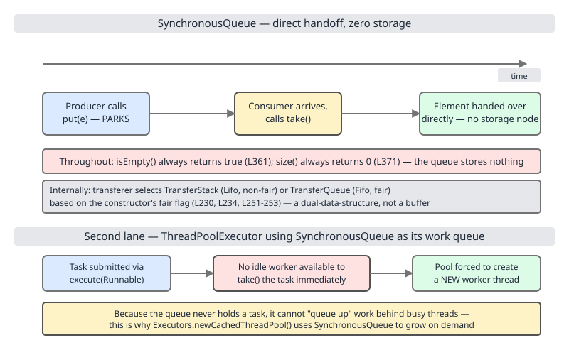

# 02 Java Collections — Blocking queues — INTERNALS (§3.14.27–3.14.30 backpressure, one lock vs two, the synchronous handoff and leader-follower)

**Target version: Java 21 LTS.** | [Index](../00-index.md)
Previous: [concurrent-collections/04b-build-copy-on-write-by-hand.md](04b-build-copy-on-write-by-hand.md) · Next: [concurrent-collections/05b-lock-free-queues-and-choosing.md](05b-lock-free-queues-and-choosing.md)

---

## 0. The family, before any detail

A `BlockingQueue` is not a container with extra methods bolted on. It is a rate limiter that happens to look like a `Queue`. The blocking is the feature: a producer that outruns its consumer does not fill memory, it slows down. Everything in this file is either an implementation of that idea (`ArrayBlockingQueue`, `LinkedBlockingQueue`, `DelayQueue`) or a limiting case of it (`SynchronousQueue`, capacity zero — every put blocks until a take is ready).

| Implementation | Bounded? | Ordering | Locking | Typical use |
|---|---|---|---|---|
| `ArrayBlockingQueue` | Always, fixed at construction | FIFO | One `ReentrantLock`, two `Condition`s | Fixed-size buffer, predictable memory, work queue for a bounded thread pool |
| `LinkedBlockingQueue` | Optional, `Integer.MAX_VALUE` by default | FIFO | Two `ReentrantLock`s (`putLock`/`takeLock`) | Higher put/take throughput under contention; **must** be given an explicit capacity in production |
| `SynchronousQueue` | Always, capacity 0 | None — no storage | Lock-free (`Transferer`, extends `LinkedTransferQueue` in JDK 21) | Direct handoff, `Executors.newCachedThreadPool()`'s work queue |
| `DelayQueue` | Unbounded | By `getDelay`, ascending | One `ReentrantLock` over a `PriorityQueue` | Scheduling / retry-after-delay pipelines |
| `PriorityBlockingQueue` | Unbounded | By `Comparator` / natural order | One `ReentrantLock` over a binary heap | Priority work queues — covered in file 05b |
| `LinkedBlockingDeque` | Optional | FIFO or LIFO, either end | One `ReentrantLock`, two conditions | Work-stealing deques — covered in file 05b |
| `LinkedTransferQueue` | Unbounded | FIFO | Lock-free (Michael–Scott dual queue) | `SynchronousQueue`'s own FIFO engine in JDK 21; own treatment in file 05b |

`ConcurrentLinkedQueue`, `LinkedTransferQueue`'s full treatment, `ConcurrentSkipListMap`, the failure catalogue and the choosing table belong to file 05b — this file only reaches `LinkedTransferQueue` as the class `SynchronousQueue` now delegates to.

---

### Why hand-rolled producer/consumer existed before this, and why it kept breaking

Before `java.util.concurrent`, a bounded buffer was `wait`/`notify` on a `synchronized` block: check the condition in a `while` (spurious wakeups are real), call `wait()`, and on the producer side call `notifyAll()` — a plain `notify()` with two different wait conditions sharing one monitor's single wait set can wake the wrong kind of waiter and lose a signal permanently. `ArrayBlockingQueue`, `LinkedBlockingQueue` and `DelayQueue` are that same loop done correctly: `Condition` objects give each queue **two separate wait sets** (`notEmpty`, `notFull`), so `signal()` can never wake the wrong kind of waiter, and `awaitNanos` gives a timed exit for free where hand-rolled code needed extra bookkeeping.

---

## 1. `BlockingQueue`'s surface and the four-way matrix `[BOTH]`

**Mental model:** `BlockingQueue` gives every one of its three operations (insert, remove, examine) four behaviours for "what happens when the queue can't do it right now" — throw, return a sentinel, block, or block-with-a-deadline. Once you see this as one matrix, the whole `java.util.concurrent.*` naming scheme (`add`/`offer`/`put`/`offer(timeout)`) stops being fifteen methods to memorize and becomes one table with four columns.

| Operation | Throws exception | Special value | Blocks | Times out |
|---|---|---|---|---|
| Insert | `add(e)` | `offer(e)` | `put(e)` | `offer(e, time, unit)` |
| Remove | `remove()` | `poll()` | `take()` | `poll(time, unit)` |
| Examine | `element()` | `peek()` | *not supported* | *not supported* |

**Insight:** the examine row has no blocking form — no `BlockingQueue` method waits until non-empty and then only looks. `peek()` returns `null` immediately on an empty queue; to wait you must `take()` (which removes) or spin on `peek()`/`poll(timeout)` yourself. The interface genuinely has 10 methods across these three rows, not 12 — people expecting a full 4x3 grid are surprised by this.

`ArrayBlockingQueue`'s and `LinkedBlockingQueue`'s `add(e)` is inherited from `AbstractQueue`, which calls `offer(e)` and throws `IllegalStateException("Queue full")` if it returns `false` — `add` is `offer` with an exception wrapper, not an independent implementation.

**Bulk removal — `drainTo`.** `BlockingQueue.drainTo(Collection<? super E> c)` and `drainTo(c, int maxElements)` (lines 349, 374 of `/tmp/jc53src/java.base/java/util/concurrent/BlockingQueue.java`) move elements into `c` in one atomic bulk operation — cheaper than a `poll()` loop, which releases the lock every iteration and risks another thread's `put` interleaving. **Gotcha:** `drainTo` is outside the four-way matrix entirely — it never blocks, and on an empty queue it drains zero and returns `0`.

**`remainingCapacity()`.** Line 291 of the same file: "the number of additional elements this queue can ideally accept without blocking." For a no-arg `LinkedBlockingQueue()` this is `Integer.MAX_VALUE`, confirmed below. **Gotcha:** the value is stale the instant it returns — another thread can put or take before your next action, so it's an estimate for logging/metrics, never the basis for an unsynchronized decision ("if remainingCapacity() > 0 then put()" is a race).

**Backpressure, stated plainly.** A bounded queue converts "the producer allocates memory without limit" into "the producer's `put` blocks." That is why bounded queues, not unbounded ones, belong in front of a worker pool — an unbounded queue defers the failure from bounded-but-slow to an `OutOfMemoryError` at an unpredictable point, which is why the unbounded-`LinkedBlockingQueue`-in-a-pool pitfall below is a capacity-planning bug, not a style nit.
**`BlockingQueue` forbids `null` elements.** Line 87 of `BlockingQueue.java`: "A `BlockingQueue` does not accept `null` elements," because `null` is the sentinel `poll()`/`peek()` use for "empty" (line 90) — the identical argument `ConcurrentHashMap` makes for banning `null` values.

> **Definition:** `BlockingQueue<E>` extends `Queue<E>` with the promise that every insert and remove operation comes in four flavours — throw, sentinel, block, block-with-timeout — and that `null` is reserved as the "nothing here" sentinel, never a legal element.

---

## 2. `ArrayBlockingQueue` — one lock, two conditions `[BOTH]`

### Mental model

A ring buffer wrapped in exactly one `ReentrantLock`. There is one door in and out of the whole structure; a producer writing to the back of the array and a consumer reading from the front still queue for the same lock, because "front" and "back" are just two integer indices into the same array under the same mutual exclusion.

### Why it exists, and when to reach for it

It exists for the case where the buffer's maximum size is known up front and you want that bound enforced with zero per-element allocation — one `Object[]` sized once at construction, reused for the life of the queue. Reach for it when the queue is short-lived, high-frequency, and allocation-per-element would show up in profiling; reach for `LinkedBlockingQueue` instead when puts and takes are frequent from different threads and you want them not to contend on the same lock (below).

### How it works — the fields

Source: `/tmp/jc53src/java.base/java/util/concurrent/ArrayBlockingQueue.java`.
```
102	    /** The queued items */
103	    @SuppressWarnings("serial") // Conditionally serializable
104	    final Object[] items;
105	
106	    /** items index for next take, poll, peek or remove */
107	    int takeIndex;
108	
109	    /** items index for next put, offer, or add */
110	    int putIndex;
111	
112	    /** Number of elements in the queue */
113	    int count;
```

`count`, `takeIndex` and `putIndex` are plain `int` — **not `volatile`, and none is needed** — because every read and write of all three happens only while `lock` is held (:120–129 below); the lock's memory barrier does the publishing, an `AtomicInteger` or `volatile` would be redundant.

```
120	    /** Main lock guarding all access */
121	    final ReentrantLock lock;
122	
123	    /** Condition for waiting takes */
124	    private final Condition notEmpty;
125	
126	    /** Condition for waiting puts */
127	    private final Condition notFull;
```

The constructor, :270–277, takes the fairness flag directly into the lock:

```
270	    public ArrayBlockingQueue(int capacity, boolean fair) {
271	        if (capacity <= 0)
272	            throw new IllegalArgumentException();
273	        this.items = new Object[capacity];
274	        lock = new ReentrantLock(fair);
275	        notEmpty = lock.newCondition();
276	        notFull =  lock.newCondition();
277	    }
```

**Fairness cost:** `new ReentrantLock(true)` makes waiting threads acquire the lock in strict FIFO arrival order instead of whatever order is cheapest to hand out; the `ReentrantLock` Javadoc states fair locks have "a lower overall throughput" than the default. Reach for `fair=true` only when starvation would be a correctness problem, not a throughput one. `enqueue`/`dequeue` (:179–208) do the actual ring-buffer work, called only while holding the lock:

```
179	    private void enqueue(E e) {
183	        final Object[] items = this.items;
184	        items[putIndex] = e;
185	        if (++putIndex == items.length) putIndex = 0;
186	        count++;
187	        notEmpty.signal();
188	    }
189	
194	    private E dequeue() {
198	        final Object[] items = this.items;
199	        @SuppressWarnings("unchecked")
200	        E e = (E) items[takeIndex];
201	        items[takeIndex] = null;
202	        if (++takeIndex == items.length) takeIndex = 0;
203	        count--;
204	        if (itrs != null)
205	            itrs.elementDequeued();
206	        notFull.signal();
207	        return e;
208	    }
```

`if (++putIndex == items.length) putIndex = 0;` is the wrap: once the write index runs off the end of the array it resets to `0`, reusing the same slots indefinitely — the "ring" in ring buffer. `dequeue`'s `itrs` bookkeeping (`transient Itrs itrs`, :136) is irrelevant to blocking, present only so live iterators stay consistent as the ring wraps. `put(E)` and `take()` (:364–425) are the textbook two-condition loop:

```
364	    public void put(E e) throws InterruptedException {
365	        Objects.requireNonNull(e);
366	        final ReentrantLock lock = this.lock;
367	        lock.lockInterruptibly();
368	        try {
369	            while (count == items.length)
370	                notFull.await();
371	            enqueue(e);
372	        } finally {
373	            lock.unlock();
374	        }
375	    }
```

```
415	    public E take() throws InterruptedException {
416	        final ReentrantLock lock = this.lock;
417	        lock.lockInterruptibly();
418	        try {
419	            while (count == 0)
420	                notEmpty.await();
421	            return dequeue();
422	        } finally {
423	            lock.unlock();
424	        }
425	    }
```

`while`, not `if` — the loop re-checks the condition after every wakeup, which is what makes spurious wakeups harmless.


**The cost, stated as a trade-off:** one lock buys the smallest possible structure and zero per-element allocation, **but** a producer writing to `putIndex` and a consumer reading from `takeIndex` — physically different array cells — must still take turns on the same `ReentrantLock`, even though nothing about the ring buffer requires it; that is real lock contention with no data race to justify it, and exactly what `LinkedBlockingQueue`'s two-lock design removes. **Insight:** `ArrayBlockingQueue.size()` (:460–468) takes the lock to return `count` for that same reason — a plain `int` read needs the lock purely for visibility.

```java
import java.util.concurrent.*;
import java.util.*;

public class FourWayDemo {
    public static void main(String[] args) throws Exception {
        ArrayBlockingQueue<String> q = new ArrayBlockingQueue<>(1);
        q.put("only");

        try {
            q.add("second");
        } catch (IllegalStateException ex) {
            System.out.println("add() on full queue threw: " + ex);
        }

        System.out.println("offer() on full queue returns: " + q.offer("second"));

        long t0 = System.nanoTime();
        boolean timedOut = q.offer("second", 50, TimeUnit.MILLISECONDS);
        long elapsedMs = (System.nanoTime() - t0) / 1_000_000;
        System.out.println("offer(50ms) on full queue returns: " + timedOut + " after ~" + elapsedMs + "ms");

        q.take(); // drain to empty

        try {
            q.remove();
        } catch (NoSuchElementException ex) {
            System.out.println("remove() on empty queue threw: " + ex);
        }

        System.out.println("poll() on empty queue returns: " + q.poll());
    }
}
```

Compiled and run on `/Library/Java/JavaVirtualMachines/jdk-21.jdk/Contents/Home`, real output:

```
add() on full queue threw: java.lang.IllegalStateException: Queue full
offer() on full queue returns: false
offer(50ms) on full queue returns: false after ~60ms
remove() on empty queue threw: java.util.NoSuchElementException
poll() on empty queue returns: null
```

(The ~60ms against a requested 50ms is ordinary scheduling slop on a single-shot timed wait — the assertion that matters is "did not return before the deadline and did return `false`, not throw," which it did.)

**Pitfall inline:** all five matrix behaviours on one thread, one queue, nothing about the interleaving of two threads is claimed here — that is the deterministic part of the file's concurrency proof for this section, per the honesty rule below.

> **Definition:** `ArrayBlockingQueue` is a fixed-capacity ring buffer over one array, guarded by exactly one `ReentrantLock` with two `Condition`s, trading producer/consumer parallelism for zero per-element allocation and a hard, upfront capacity bound.

---

## 3. `LinkedBlockingQueue` — `putLock`/`takeLock` and cascading signals `[BOTH]`

### Mental model

A singly linked list with a sentinel head, split down the middle into two independent critical sections: everything that mutates the tail (`put`, `offer`) takes `putLock`; everything that mutates the head (`take`, `poll`) takes `takeLock`. The two locks meet only at one shared `AtomicInteger`.

### Why it exists, when to reach for it

It exists to remove exactly the serialization `ArrayBlockingQueue` has: with the head and tail owned by different locks, a producer and a consumer can genuinely run concurrently as long as the queue has more than one element in it. Reach for it over `ArrayBlockingQueue` when producer and consumer throughput under contention matters more than allocation and locality; reach for `ArrayBlockingQueue` instead when the queue is small, hot, and you want to avoid a `Node` allocation per element.

### How it works — the fields and the sentinel

Source: `/tmp/jc53src/java.base/java/util/concurrent/LinkedBlockingQueue.java`.
```
123	    static class Node<E> {
124	        E item;
132	        Node<E> next;
134	        Node(E x) { item = x; }
135	    }
137	    /** The capacity bound, or Integer.MAX_VALUE if none */
138	    private final int capacity;
141	    private final AtomicInteger count = new AtomicInteger();
147	    transient Node<E> head;
153	    private transient Node<E> last;
156	    private final ReentrantLock takeLock = new ReentrantLock();
160	    private final Condition notEmpty = takeLock.newCondition();
163	    private final ReentrantLock putLock = new ReentrantLock();
167	    private final Condition notFull = putLock.newCondition();
```

`head` is a sentinel node whose `item` is always `null` (invariant at :145, "Invariant: head.item == null"; constructed directly as `last = head = new Node<E>(null);`, :258). **This is why the two locks can stay independent:** `enqueue` (:201–205) only touches `last`/`last.next`; `dequeue` (:212–222) only touches `head`/`head.next`. A `put` and a `take` contend for the *same node* only when the queue has exactly one real element — every other case, the two operations are physically disjoint memory.

`count` is an `AtomicInteger`, not a plain `int`, **specifically because it is the one piece of state both `putLock` and `takeLock` touch** — the class comment says it directly (:88–90): "The 'count' field that they both rely on is maintained as an atomic to avoid needing to get both locks in most cases."

### `put` — cascading signals, quoted whole

```
326	    public void put(E e) throws InterruptedException {
327	        if (e == null) throw new NullPointerException();
328	        final int c;
329	        final Node<E> node = new Node<E>(e);
330	        final ReentrantLock putLock = this.putLock;
331	        final AtomicInteger count = this.count;
332	        putLock.lockInterruptibly();
333	        try {
342	            while (count.get() == capacity) {
343	                notFull.await();
344	            }
345	            enqueue(node);
346	            c = count.getAndIncrement();
347	            if (c + 1 < capacity)
348	                notFull.signal();
349	        } finally {
350	            putLock.unlock();
351	        }
352	        if (c == 0)
353	            signalNotEmpty();
354	    }
```

Two separate signals happen here, and the class comment (:91–94) names the pattern "cascading notifies": if this put still leaves room (`c + 1 < capacity`), it signals `notFull` **itself**, from inside `putLock` — no need to touch `takeLock` at all for that. Separately, if the queue was empty before this put (`c == 0`), it calls `signalNotEmpty()` (:173–181), which briefly acquires `takeLock` just to wake one taker.

**Why signal `notFull` from a put at all?** The alternative — only a `take` ever signalling `notFull` — is correct but adds a lock handoff to `takeLock` on every single put just to check. Self-signalling keeps the common "not full, not empty" path from ever touching the other lock. `take()` is exactly symmetric (:427–447), self-signalling `notEmpty` when more than one element remains, and calling `signalNotFull()` (:186–194, which acquires `putLock`) only when this take frees the queue from being completely full (`c == capacity`).


### `fullyLock`/`fullyUnlock` and which operations need both

```
227	    void fullyLock() {
228	        putLock.lock();
229	        takeLock.lock();
230	    }
231	    void fullyUnlock() {
232	        takeLock.unlock();
233	        putLock.unlock();
234	    }
```

Operations that must see a globally consistent snapshot of the whole list — `remove(Object)`, `contains`, `toArray`, the general iterator's structural operations, `clear` — call `fullyLock()`. **`size()` does not.** It is a one-line method: `public int size() { return count.get(); }` (:298–300) — no lock at all, because `count` is already atomic and that is sufficient for a point-in-time read. This is the direct opposite of `ArrayBlockingQueue.size()`, which does take its single lock to read a plain `int`. The contrast is the whole point of making `count` an `AtomicInteger` here: it buys a lock-free `size()` as a side effect.

### Two facts the leaf omits

**Unbounded by default.** `public LinkedBlockingQueue() { this(Integer.MAX_VALUE); }` (:244–246). Handed to a `ThreadPoolExecutor` as its work queue, this means `maximumPoolSize` is never reached — the executor only starts new threads when `offer()` fails, and an effectively-unbounded queue's `offer()` never fails, so RAM absorbs every submitted task until an `OutOfMemoryError` at an unpredictable point downstream. **This belongs in Pitfalls below** as a real production incident shape, not a style preference. **Allocation:** every `put` allocates a `new Node<E>(e)` (:329); `ArrayBlockingQueue` pre-allocates its whole array once and never allocates again in steady state, so `LinkedBlockingQueue` pays a GC cost per element and worse cache locality that `ArrayBlockingQueue` does not.

| | `ArrayBlockingQueue` | `LinkedBlockingQueue` |
|---|---|---|
| Backing structure | One pre-sized `Object[]` | Linked `Node<E>` per element |
| Locks | One `ReentrantLock`, two `Condition`s | Two `ReentrantLock`s (`putLock`/`takeLock`), two `Condition`s |
| Shared mutable state across locks | None — one lock guards everything | `AtomicInteger count` |
| Bounded? | Always, mandatory at construction | Optional; `Integer.MAX_VALUE` if unspecified |
| Per-element allocation | None (steady state) | One `Node` per `put` |
| Producer/consumer parallelism | No — same lock | Yes, except when queue holds ≤1 element |
| `size()` cost | Takes the lock | Lock-free (`count.get()`) |
| Best fit | Small, hot, fixed-size buffer | High put/take contention, capacity set explicitly |

```java
import java.util.concurrent.*;
import java.util.*;

public class CapacityDemo {
    public static void main(String[] args) {
        ArrayBlockingQueue<Integer> bounded = new ArrayBlockingQueue<>(5);
        bounded.offer(1);
        System.out.println("bounded ABQ(5) remainingCapacity after 1 add: " + bounded.remainingCapacity());

        LinkedBlockingQueue<Integer> unbounded = new LinkedBlockingQueue<>();
        System.out.println("default LinkedBlockingQueue remainingCapacity: " + unbounded.remainingCapacity());
        System.out.println("Integer.MAX_VALUE:                            " + Integer.MAX_VALUE);

        List<Integer> sink = new ArrayList<>();
        LinkedBlockingQueue<Integer> src = new LinkedBlockingQueue<>();
        for (int i = 0; i < 10; i++) src.offer(i);
        int drained = src.drainTo(sink);
        System.out.println("drainTo moved " + drained + " elements in one call; src now empty: " + src.isEmpty());
        System.out.println("sink = " + sink);
    }
}
```

Real output:

```
bounded ABQ(5) remainingCapacity after 1 add: 4
default LinkedBlockingQueue remainingCapacity: 2147483647
Integer.MAX_VALUE:                            2147483647
drainTo moved 10 elements in one call; src now empty: true
sink = [0, 1, 2, 3, 4, 5, 6, 7, 8, 9]
```

**Not observed, and cannot be honestly claimed from a single-threaded transcript:** that `putLock`/`takeLock` actually execute concurrently on two real threads, or that a cascading `notFull.signal()` actually fires and wakes a particular waiter rather than the `while`-loop simply finding the condition already false later. Proving either needs JVM lock/condition instrumentation; a passing wall-clock race run proves nothing, since "both threads made progress and totals were right" is equally consistent with true parallelism, serialized-but-fast execution, or a scheduler artifact. The parallelism claim above is **derived from the source** (two distinct locks touching disjoint memory), not observed.

> **Definition:** `LinkedBlockingQueue` is a singly linked queue with a `null`-item sentinel head, guarded by two independent locks (`putLock` for the tail, `takeLock` for the head) that meet only at a shared `AtomicInteger count`, trading a `Node` allocation per element for the ability to run puts and takes concurrently.

---

## 4. `SynchronousQueue` — the zero-capacity handoff, and the JDK 21 rewrite `[BOTH]` `[STAFF: version trap]`

### Mental model

Not a queue that happens to be small — a queue with **no storage at all**. `put` and `take` are two ends of a single rendezvous: neither one can complete until the other one is also present. Think of it as a doorway one thread hands an object through directly to another thread's hand, never setting it down.

### Why it exists, when to reach for it

It exists for when "queueing" itself is undesirable — a task should be handed directly to whichever thread is ready, with no intermediate buffer hiding backpressure. `Executors.newCachedThreadPool()` uses one as its work queue so a submitted task either finds an idle thread immediately or forces the pool to spin up a new one — a `LinkedBlockingQueue` there would let tasks pile up on a fixed pool instead. Reach for it when direct handoff and immediate backpressure are the goal; reach for `LinkedBlockingQueue`/`ArrayBlockingQueue` for any buffering at all.

### How it works — the version trap

**The leaf as written (3.14.29) describes JDK 8.** JDK 8u202's `SynchronousQueue.java` (on this machine at `/tmp/jc53src8/java/util/concurrent/SynchronousQueue.java`) has exactly the two-class dual-data-structure design almost every article on the internet still describes:

```
168	    abstract static class Transferer<E> {
211	    static final class TransferStack<E> extends Transferer<E> {
526	    static final class TransferQueue<E> extends Transferer<E> {
```

An abstract `Transferer<E>` at :168, with `TransferStack<E>` at :211 implementing unfair (LIFO) mode and `TransferQueue<E>` at :526 implementing fair (FIFO) mode, chosen once at construction based on the `fair` flag.

**JDK 21 replaced the pair with a single class.** In `/tmp/jc53src/java.base/java/util/concurrent/SynchronousQueue.java`:

```
152	    static final class Transferer<E> extends LinkedTransferQueue<E> {
```

`Transferer<E>` at :152 now **extends `LinkedTransferQueue<E>`** directly — it is no longer an abstract base with two subclasses, it is one concrete class. The class comment states the new arrangement outright, :132–135:

```
     *  * Fifo mode is based on LinkedTransferQueue operations, but
     *     Lifo mode support is added in subclass Transferer.
```

Fifo (fair) mode is simply **inherited** from `LinkedTransferQueue` — no override needed. Lifo (unfair, the default) mode is the added method `xferLifo` at :167. The choice between them happens in `xfer`, :233–236:

```
232	    /** Invokes fair or lifo transfer */
233	    private Object xfer(Object e, long nanos) {
234	        Transferer<E> x = transferer;
235	        return (fair) ? x.xfer(e, nanos) : x.xferLifo(e, nanos);
236	    }
```

`x.xfer(...)` at :235 is not a method declared anywhere in `SynchronousQueue.java` — it is inherited straight from `LinkedTransferQueue`, because `Transferer` extends it.

| | JDK 8u202 | JDK 21 |
|---|---|---|
| Abstract base | `abstract static class Transferer<E>` (:168) | *(none — single concrete class)* |
| Unfair (LIFO) implementation | `static final class TransferStack<E>` (:211) | `Transferer<E>` itself, via `xferLifo` (:167) |
| Fair (FIFO) implementation | `static final class TransferQueue<E>` (:526) | Inherited from `LinkedTransferQueue<E>` (`Transferer extends LinkedTransferQueue<E>`, :152) |
| Dispatch | virtual method on whichever subclass was constructed | `fair ? x.xfer(...) : x.xferLifo(...)` (:235) |

**The behaviour the leaf describes is unchanged in both versions:** zero capacity, direct handoff, `isEmpty()` always `true` (:361–363), `size()`/`remainingCapacity()` always `0` (:371–373, :381–383) — only the internal class names and inheritance shape changed. **Interview:** a candidate who says "`SynchronousQueue` uses `TransferStack` and `TransferQueue`" is quoting JDK 8 — accurate history, wrong for JDK 21, where `SynchronousQueue` is implemented in terms of `LinkedTransferQueue` instead. The version-proof answer is behavioural: zero capacity, direct handoff, `isEmpty()`/`size()`/`remainingCapacity()` are `true`/`0`/`0` unconditionally, which has never changed.



```java
import java.util.concurrent.*;

public class SyncHandoffDemo {
    public static void main(String[] args) throws Exception {
        SynchronousQueue<String> sq = new SynchronousQueue<>();
        CountDownLatch producerParked = new CountDownLatch(1);
        CountDownLatch done = new CountDownLatch(1);

        Thread producer = new Thread(() -> {
            try {
                producerParked.countDown();
                sq.put("handoff");
            } catch (InterruptedException ignored) {
            } finally {
                done.countDown();
            }
        });
        producer.start();
        producerParked.await();
        Thread.sleep(100); // give put() time to actually park inside xfer

        System.out.println("while producer parked in put(): isEmpty=" + sq.isEmpty()
                + " size=" + sq.size() + " remainingCapacity=" + sq.remainingCapacity());

        String received = sq.take();
        System.out.println("consumer received: " + received);
        done.await(2, TimeUnit.SECONDS);
        producer.join(2000);

        System.out.println("SynchronousQueue.class.getDeclaredClasses():");
        for (Class<?> c : SynchronousQueue.class.getDeclaredClasses()) {
            System.out.println("  " + c.getSimpleName());
        }
    }
}
```

Real output:

```
while producer parked in put(): isEmpty=true size=0 remainingCapacity=0
consumer received: handoff
SynchronousQueue.class.getDeclaredClasses():
  Transferer
  FifoWaitQueue
  WaitQueue
  LifoWaitQueue
```

**This is honest evidence of two different things.** `isEmpty=true size=0 remainingCapacity=0` is deterministic **by contract** — those methods are hardcoded regardless of timing (:361–383), so reading them while a producer sits parked in `put()` genuinely proves "no storage," timing-independent. `getDeclaredClasses()` is a fully deterministic, single-threaded reflection query — the proof of the version finding: `Transferer` present, `TransferStack`/`TransferQueue` absent. **Not proven by this transcript:** that the producer was genuinely blocked *inside* `xfer`/`xferLifo` rather than merely about to call `put()` — the 100ms sleep makes that likely but is a timing assumption; a debugger stack trace would be the rigorous proof, and was not taken here.

**Pitfall:** assuming a `SynchronousQueue` ever holds an element you can inspect — `peek()` always returns `null`, iteration always yields nothing, because there is genuinely nothing to iterate; the only way to observe an element is to be the thread that `take()`s it directly from the handoff.

> **Definition:** `SynchronousQueue` is a `BlockingQueue` with zero internal capacity that pairs a `put` and a `take` directly, implemented in JDK 21 as a single `Transferer` class extending `LinkedTransferQueue` (fair mode inherited, unfair/LIFO mode added as `xferLifo`) — a rewrite of the JDK 8 `TransferStack`/`TransferQueue` pair that changed the internals without changing the zero-capacity, always-empty, direct-handoff contract.

---

## 5. `DelayQueue` and the leader-follower optimisation `[STAFF]`

### Mental model

An unbounded priority queue where "priority" means "how soon until this is allowed out," and where only **one** waiting consumer thread is ever actually counting down a clock at a time — every other waiting consumer just sleeps with no alarm set, until the counting thread wakes them.

### Why it exists, when to reach for it

It exists for retry-after-delay and scheduling pipelines: put a task in now, marked "not ready until T," and let consumers block until it is. Reach for it when items become eligible at a per-item future time known at insertion (rate-limited retries, cache-expiry sweepers); reach for `PriorityBlockingQueue` (file 05b) when ordering is by priority with no time component, and for `ScheduledThreadPoolExecutor` when the need is "run this task later" — it is built on the same idea but manages the threads too.

### How it works — the source

Source: `/tmp/jc53src/java.base/java/util/concurrent/DelayQueue.java`.
```
100	public class DelayQueue<E extends Delayed> extends AbstractQueue<E>
101	    implements BlockingQueue<E> {
103	    private final transient ReentrantLock lock = new ReentrantLock();
104	    private final PriorityQueue<E> q = new PriorityQueue<E>();
122	    private Thread leader;
129	    private final Condition available = lock.newCondition();
```

One lock, one `PriorityQueue<E>` ordered by `Delayed.compareTo` (which orders by `getDelay(NANOSECONDS)`), and the field that is this section's actual subject: `private Thread leader;` (:122).

**The problem `leader` solves.** Without it, every thread blocked in `take()` would independently `awaitNanos(delay)` on the head's remaining delay and all wake at once when it elapses — a thundering herd, even though only one can win the race to dequeue the single expired head; the rest wake for nothing and go back to waiting. The field comment (:106–120) names the pattern directly: "This variant of the Leader-Follower pattern... serves to minimize unnecessary timed waiting."

`take()`, quoted whole:

```
235	    public E take() throws InterruptedException {
236	        final ReentrantLock lock = this.lock;
237	        lock.lockInterruptibly();
238	        try {
239	            for (;;) {
240	                E first = q.peek();
241	                if (first == null)
242	                    available.await();
243	                else {
244	                    long delay = first.getDelay(NANOSECONDS);
245	                    if (delay <= 0L)
246	                        return q.poll();
247	                    first = null; // don't retain ref while waiting
248	                    if (leader != null)
249	                        available.await();
250	                    else {
251	                        Thread thisThread = Thread.currentThread();
252	                        leader = thisThread;
253	                        try {
254	                            available.awaitNanos(delay);
255	                        } finally {
256	                            if (leader == thisThread)
257	                                leader = null;
258	                        }
259	                    }
260	                }
261	            }
262	        } finally {
263	            if (leader == null && q.peek() != null)
264	                available.signal();
265	            lock.unlock();
266	        }
267	    }
```

Walking it: if the head hasn't expired (`delay > 0`) and nobody is already leading (`leader == null`), this thread becomes leader (:252) and does the one **timed** wait, `available.awaitNanos(delay)` (:254). Every other thread that arrives while a leader exists takes the `leader != null` branch (:248–249) and calls the **untimed** `available.await()` — no deadline of its own, waiting purely to be signalled. The leader's `finally` (:255–258) clears `leader` as soon as its timed wait ends, so the next thread to loop around can become leader. The method's own `finally` (:262–266), `if (leader == null && q.peek() != null) available.signal();`, is the handoff: after this thread is done, if there is no leader and something remains in the queue, wake exactly one follower to either take the head or become the next leader.

**Insight:** exactly one thread is ever in a timed wait at any moment — the herd that would otherwise wake simultaneously is bounded to that one thread; every follower sleeps on an untimed `await()`, woken one at a time. This is precisely the leader-follower pattern from the POSA literature the field comment cites (`www.cs.wustl.edu/~schmidt/POSA/POSA2/`) — one thread waits on behalf of the group and hands off leadership rather than letting everyone poll independently.

`offer` (:166–179) is the other half: when a newly inserted element becomes the new head (`q.peek() == e`), it invalidates any current leader and signals, because the old leader's `awaitNanos(delay)` was computed against the *old*, possibly longer, head delay:

```
166	    public boolean offer(E e) {
167	        final ReentrantLock lock = this.lock;
168	        lock.lock();
169	        try {
170	            q.offer(e);
171	            if (q.peek() == e) {
172	                leader = null;
173	                available.signal();
174	            }
175	            return true;
176	        } finally {
177	            lock.unlock();
178	        }
179	    }
```

```java
import java.util.concurrent.*;

public class DelayQueueDemo {
    record DelayedItem(String name, long readyAtNanos) implements Delayed {
        static DelayedItem in(String name, long delayMillis) {
            return new DelayedItem(name, System.nanoTime() + TimeUnit.MILLISECONDS.toNanos(delayMillis));
        }
        @Override public long getDelay(TimeUnit unit) {
            return unit.convert(readyAtNanos - System.nanoTime(), TimeUnit.NANOSECONDS);
        }
        @Override public int compareTo(Delayed o) {
            return Long.compare(getDelay(TimeUnit.NANOSECONDS), o.getDelay(TimeUnit.NANOSECONDS));
        }
    }

    public static void main(String[] args) throws Exception {
        DelayQueue<DelayedItem> dq = new DelayQueue<>();
        dq.put(DelayedItem.in("late", 200));

        System.out.println("immediately after put: size=" + dq.size() + " poll()=" + dq.poll());

        DelayedItem taken = dq.take(); // blocks until the 200ms delay elapses
        System.out.println("take() returned after delay: " + taken.name());
    }
}
```

Real output:

```
immediately after put: size=1 poll()=null
take() returned after delay: late
```

This is a fully deterministic proof: `size()` (:353–358, under the lock, `q.size()`) counts the element whether expired or not, while `poll()` (:214–225) returns `null` when `getDelay(NANOSECONDS) > 0` and only removes it once the delay elapses. `take()` genuinely blocks the ~200ms and returns the element, with no race involved since there is exactly one producer and one delay.

**Not observed, cannot be honestly claimed from any single run:** that the leader/follower split actually prevents a thundering herd under N concurrent consumers — that needs thread-level tracing of how many threads exit `awaitNanos` versus `await` at the moment a delay elapses, not an application-level transcript. Three consumer threads all succeeding proves the queue is correct, not that only one was ever timed-waiting; that fact is **derived from the source** (:248–258), not observed.

**Pitfall:** treating `size() > 0` as "there is something to `poll()`." `size()` counts every element, expired or not; `poll()` returns `null` whenever the head's delay hasn't elapsed (:218–221). A `while (queue.size() > 0) { var x = queue.poll(); ... }` loop with unexpired elements spins at CPU-bound speed getting `null` back every time until the delay elapses — a real production bug shape, covered fully in Pitfalls below.

> **Definition:** `DelayQueue<E extends Delayed>` is an unbounded, delay-ordered priority queue where a single `leader` thread field ensures only one waiting consumer is ever in a timed wait for the head's expiry at any moment, with every other waiter asleep on an untimed `await()` until explicitly handed leadership.

---

## Pitfalls

### Assuming an unbounded `LinkedBlockingQueue` is a safe default for a thread pool

**Wrong**
```java
ExecutorService pool = new ThreadPoolExecutor(
    4, 4, 0L, TimeUnit.MILLISECONDS,
    new LinkedBlockingQueue<>() // no capacity given — Integer.MAX_VALUE
);
for (int i = 0; i < 50_000_000; i++) {
    pool.submit(() -> slowWork());
}
```
Every submission succeeds instantly no matter how far behind the four worker threads fall, because `offer()` on a queue whose capacity is `Integer.MAX_VALUE` essentially never returns `false`. `maximumPoolSize` in `ThreadPoolExecutor` is only consulted when the queue rejects a task — with this queue it never does, so the pool never grows past `corePoolSize`, and memory grows without bound until the process is killed by an `OutOfMemoryError`, often minutes or hours after the overload actually started.

**Right**
```java
ExecutorService pool = new ThreadPoolExecutor(
    4, 4, 0L, TimeUnit.MILLISECONDS,
    new LinkedBlockingQueue<>(1_000), // explicit, sized bound
    new ThreadPoolExecutor.CallerRunsPolicy() // or another explicit rejection policy
);
```
An explicit capacity forces `offer()` to eventually return `false`, which forces the pool's `RejectedExecutionHandler` to run — turning "silent memory growth, fails later, at random" into "an explicit, immediate, handleable rejection now."

**Why people believe it:** `new LinkedBlockingQueue<>()` compiles, runs, and behaves identically to a bounded one under light load — the bug only shows up once submission rate genuinely and sustainedly exceeds processing rate, which most local testing never reproduces.

### Treating `DelayQueue.size() > 0` as "there is work to `poll()`"

**Wrong**
```java
DelayQueue<DelayedItem> q = new DelayQueue<>();
q.put(DelayedItem.in("later", 5_000));
while (q.size() > 0) {
    var item = q.poll(); // returns null until the 5s delay elapses
    if (item != null) process(item);
}
```
This spins at full CPU for the entire 5 seconds, because `size()` (source :353–358) counts the element as soon as it's queued, while `poll()` (:214–225) keeps returning `null` until `getDelay(NANOSECONDS) <= 0`.

**Right**
```java
DelayedItem item = q.take(); // blocks efficiently until the delay elapses
process(item);
```
`take()` parks the thread via `Condition.await`/`awaitNanos` instead of busy-polling — no CPU burned while waiting.

**Why people believe it:** `size() > 0` is exactly the right test for every other `Collection` in the JDK; `DelayQueue` is the one blocking queue where "present" and "available" are different questions, and nothing about the method name signals that.

### Using `add` where `offer` was meant, and getting a surprise exception under load

**Wrong**
```java
ArrayBlockingQueue<Task> q = new ArrayBlockingQueue<>(100);
// ... later, under a load spike:
q.add(task); // throws IllegalStateException("Queue full") the moment 100 is reached
```
Works fine in every test that never fills the queue, then throws in production the first time load exceeds capacity — often surfacing as an uncaught exception on a request thread far from where the queue was configured.

**Right**
```java
if (!q.offer(task, 200, TimeUnit.MILLISECONDS)) {
    handleBackpressure(task); // explicit, expected code path
}
```
`offer` (with or without a timeout) makes "the queue is full" an ordinary boolean result to branch on, not an exception to catch.

**Why people believe it:** `add` is the `Collection` interface's conventional insert method and works this way (throwing on failure to grow) for every unbounded `Collection`; a bounded `BlockingQueue` is the first place in the JDK collections where `add` failing is a routine, expected outcome rather than a programming error.

### Assuming a blocking `peek()` exists

**Wrong**
```java
// "wait until something is available, but don't remove it"
Task t;
while ((t = queue.peek()) == null) {
    Thread.sleep(10); // hand-rolled poll loop
}
```
There is no method on `BlockingQueue` that blocks on the examine row of the four-way matrix (§1) — `peek()` always returns immediately, `null` or not.

**Right**
```java
Task t = queue.take(); // removes — if you need to "peek", put it back
queue.offer(t); // or restructure so a single consumer both examines and removes
```
Design around the fact that blocking examine does not exist — usually by having exactly one consumer own removal, or by using `take()` and re-queuing if the item turns out not to be actionable yet.

**Why people believe it:** `add`/`offer`/`put`/`offer(timeout)` and `remove`/`poll`/`take`/`poll(timeout)` both have all four forms, so it's natural to assume `element`/`peek` do too — the interface genuinely stops at two forms for examine.

---

## Cheat sheet

| Fact | Value / behaviour |
|---|---|
| Four-way matrix rows | insert, remove, examine |
| Four-way matrix columns | throw, special value, block, block+timeout |
| Examine row has a blocking form? | No — `peek`/`element` only, no blocking or timed variant |
| `BlockingQueue` allows `null`? | No — `null` is the `poll`/`peek` "empty" sentinel |
| `ArrayBlockingQueue` locks | 1 `ReentrantLock`, 2 `Condition`s (`notEmpty`, `notFull`) |
| `LinkedBlockingQueue` locks | 2 `ReentrantLock`s (`putLock`, `takeLock`), shared `AtomicInteger count` |
| `LinkedBlockingQueue` default capacity | `Integer.MAX_VALUE` (unbounded) unless given explicitly |
| `ArrayBlockingQueue.size()` | Takes the lock |
| `LinkedBlockingQueue.size()` | Lock-free, `count.get()` |
| `SynchronousQueue` capacity | Always 0 |
| `SynchronousQueue.isEmpty()`/`size()`/`remainingCapacity()` | Always `true`/`0`/`0` |
| `SynchronousQueue` internals, JDK 8 | `TransferStack` (unfair), `TransferQueue` (fair) |
| `SynchronousQueue` internals, JDK 21 | Single `Transferer extends LinkedTransferQueue` — `xferLifo` (unfair, own method) / inherited `xfer` (fair) |
| `DelayQueue` backing structure | `PriorityQueue<E>` ordered by `getDelay(NANOSECONDS)`, 1 lock |
| `DelayQueue` leader field | `Thread leader` — only the leader does a timed `awaitNanos`; everyone else does untimed `await` |
| `DelayQueue.size()` vs `poll()` | `size()` counts expired + unexpired; `poll()` returns `null` if head unexpired |
| `drainTo` | Atomic bulk removal, cheaper than a `poll()` loop, never blocks |
| `remainingCapacity()` | Stale the instant it returns; `Integer.MAX_VALUE` for unbounded queues |

---

## Self-test

**Q1.** Why is `LinkedBlockingQueue.count` an `AtomicInteger` while `ArrayBlockingQueue.count` is a plain, non-volatile `int`?

<details><summary>Answer</summary>

`ArrayBlockingQueue` has exactly one lock, and every read or write of `count` happens while that lock is held — the lock's memory barrier already guarantees visibility, so a plain `int` is sufficient. `LinkedBlockingQueue` has two separate locks (`putLock`, `takeLock`), and `count` is the one field both of them need to read and update without necessarily holding the other lock — `AtomicInteger` gives that cross-lock visibility and atomic increment/decrement without forcing every put to acquire `takeLock` or vice versa.

</details>

**Q2.** A `LinkedBlockingQueue.put()` call, after enqueueing, sometimes calls `notFull.signal()` itself and sometimes calls `signalNotEmpty()` (which touches `takeLock`). What decides which happens, and why does the class bother self-signalling `notFull` from inside a put at all?

<details><summary>Answer</summary>

After `enqueue`, `c = count.getAndIncrement()` gives the count *before* this put. If `c + 1 < capacity` (there is still room after this put), `put` signals `notFull` itself, still holding `putLock` — no need to touch `takeLock`. Separately, if `c == 0` (the queue was empty before this put), it calls `signalNotEmpty()`, which acquires `takeLock` briefly to wake a waiting taker. Self-signalling `notFull` avoids forcing every ordinary put (queue neither empty nor full) to ever touch `takeLock` just to check whether some producer is waiting — that's the "cascading notifies" idiom the class comment names.

</details>

**Q3.** Why does `LinkedBlockingQueue.size()` need no lock at all, while `ArrayBlockingQueue.size()` takes its lock?

<details><summary>Answer</summary>

`LinkedBlockingQueue.size()` is `return count.get();` — `count` is already an `AtomicInteger`, so a lock-free read is a valid, atomic point-in-time snapshot. `ArrayBlockingQueue.count` is a plain `int` guarded entirely by the single lock; reading it without the lock would not be guaranteed to see the latest write from another thread, so `size()` must acquire the lock purely for visibility.

</details>

**Q4.** What is the one behavioural asymmetry in the four-way matrix, and what does it mean in practice?

<details><summary>Answer</summary>

The "examine" row (`peek`/`element`) has no blocking or timed-blocking form — there is no method that waits until the queue is non-empty and then only looks without removing. In practice, "wait until something is available without consuming it" cannot be expressed directly; you either `take()` (which removes) or build the wait yourself around `peek()`/`poll(timeout)`.

</details>

**Q5.** In JDK 21, what class does `SynchronousQueue`'s internal `Transferer` extend, and what does that inheritance buy the fair-mode code path?

<details><summary>Answer</summary>

`Transferer<E>` extends `LinkedTransferQueue<E>` (`SynchronousQueue.java` :152). Fair mode needs no separate implementation in `SynchronousQueue` at all — it is simply the inherited `xfer` method from `LinkedTransferQueue`. Only unfair (LIFO) mode gets its own method, `xferLifo` (:167), added directly to `Transferer`.

</details>

**Q6.** Why does an interviewer's mention of `TransferStack`/`TransferQueue` need a version caveat, and what still holds true regardless of version?

<details><summary>Answer</summary>

Those two classes existed in JDK 8 (`TransferStack` for unfair, `TransferQueue` for fair mode, each extending an abstract `Transferer`) but were removed in JDK 21, where a single `Transferer` class extends `LinkedTransferQueue` instead. What has never changed across versions: `SynchronousQueue` has zero internal capacity, `isEmpty()` always returns `true`, `size()`/`remainingCapacity()` always return `0`, and every `put` waits for a matching `take` (or vice versa) with no intermediate storage.

</details>

**Q7.** What problem does `DelayQueue`'s `leader` field solve, and what happens to a waiting thread that is *not* the leader?

<details><summary>Answer</summary>

Without `leader`, every thread waiting in `take()` would independently `awaitNanos` on the head's remaining delay and all wake simultaneously when it expires — a thundering herd where only one thread can actually dequeue the single expired element and the rest wake for nothing. With `leader`, only the one thread holding that role does a timed `awaitNanos(delay)`; every other waiting thread calls the untimed `available.await()` and sleeps indefinitely until explicitly signalled by the leader (or by a new element becoming the head).

</details>

**Q8.** Why does inserting a new element into a `DelayQueue` sometimes clear `leader` and signal, and sometimes do nothing?

<details><summary>Answer</summary>

`offer()` only clears `leader` and signals when the newly inserted element becomes the new head of the priority queue (`q.peek() == e`). If it becomes the new head, any existing leader's `awaitNanos(delay)` was computed against the *old* head's (possibly longer) delay and may now be wrong, so leadership is invalidated and a waiter is woken to recompute against the new, possibly-sooner delay. If the new element is not the new head, no waiting thread's timing assumption changed, so nothing needs to happen.

</details>

---

**Leaves covered:** 3.14.27, 3.14.28, 3.14.29, 3.14.30 (4 leaves)
**Leaves deferred:** none
**Diagrams included:** D-134, D-135
**Target version:** Java 21 LTS
**Lines:** 800
