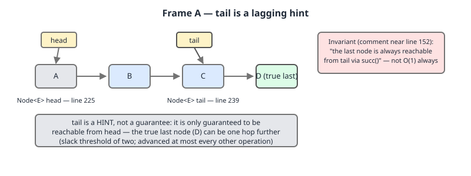
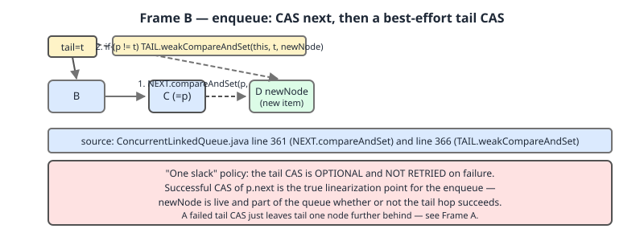
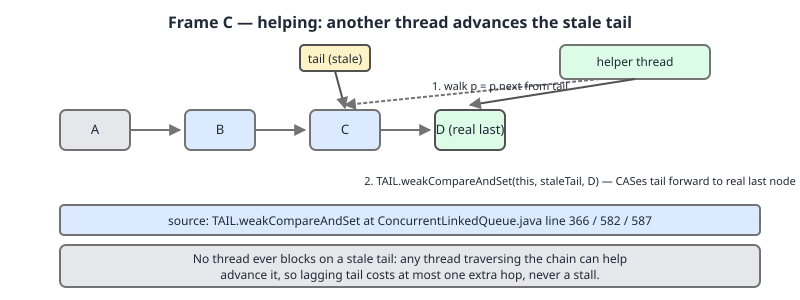
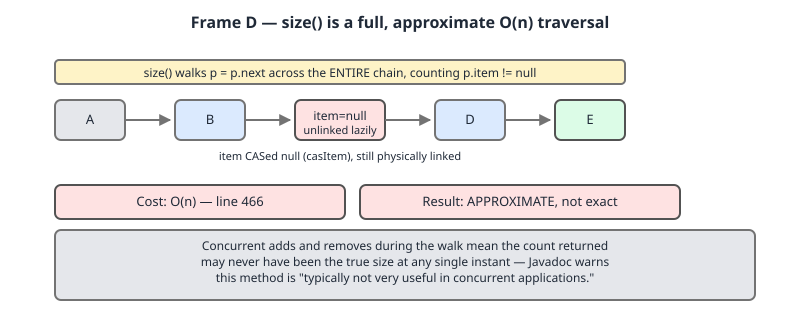

# 02 Java Collections — Lock-free collections and choosing — INTERNALS (§3.14.31–3.14.33 Michael-Scott, transfer queues and skip lists)

**Target version: Java 21 LTS.** | [Index](../00-index.md)
Previous: [concurrent-collections/05-blocking-and-lock-free-queues.md](05-blocking-and-lock-free-queues.md) · Next: [concurrent-collections/05c-failure-catalogue-and-choosing.md](05c-failure-catalogue-and-choosing.md)

---

## The lock-free family, before the mechanism

The previous file (05) covered the blocking queues — `ArrayBlockingQueue`,
`LinkedBlockingQueue`, `SynchronousQueue`'s own contract, `DelayQueue` — all of which
park a waiting thread. This file covers the collections that never park: every
operation either finishes or gets pushed back onto the CAS loop to retry. Mental model
for the whole family: **no thread ever waits for another; every thread is prepared to
find the structure mid-repair and to finish that repair itself before its own work.**

| Class | Bounded? | Ordering | `size()` cost | Use for |
|---|---|---|---|---|
| `ConcurrentLinkedQueue` | No | FIFO | O(n), approximate | Unbounded lock-free FIFO queue, no backpressure needed |
| `ConcurrentLinkedDeque` | No | FIFO both ends | O(n), approximate | Same, but need push/pop at both ends — covered in the previous file's deque material; not re-walked here |
| `LinkedTransferQueue` | No | FIFO | O(n), approximate | Producer must know a consumer actually received the item (`transfer`), not merely that it was enqueued |
| `ConcurrentSkipListMap` | No | Sorted (`Comparable`/`Comparator`) | O(n), approximate | The only concurrent **sorted** map — there is no `ConcurrentTreeMap` |
| `ConcurrentSkipListSet` | No | Sorted | O(n), approximate | `ConcurrentSkipListMap.keySet()`-backed set; sorted analogue of `ConcurrentHashMap.newKeySet()` |

None of these five is bounded, so none provides backpressure — a pipeline needing to
stall a fast producer still reaches for a `BlockingQueue` (previous file), not this table.

---

## `ConcurrentLinkedQueue`: the Michael–Scott queue

### Mental model, why it exists, when to reach for it

Picture a singly linked list where `head` and `tail` are less "pointers to the ends"
and more "cached hints, usually right, always fixable." An enqueuer walks from wherever
`tail` points until it finds the real last node — usually zero hops — links the new
node on with a single CAS, then takes at most one more CAS to try moving `tail`
forward; if that second CAS is lost, nobody retries it, the next enqueuer just walks
one extra hop and fixes it. Nobody ever blocks waiting for `tail` to be accurate,
because nothing in the algorithm requires it to be. Before this, an unbounded
thread-safe FIFO queue meant `LinkedBlockingQueue`, which locks on every offer/poll and
parks arriving threads. `ConcurrentLinkedQueue` (JDK 5, Michael & Scott's 1996
algorithm) gives the same guarantee with no lock — a thread that loses a CAS race just
retries in user space instead of asking the OS to reschedule it. Reach for it for an
unbounded, non-blocking, multi-producer/multi-consumer FIFO queue where nothing needs
to block waiting for data — e.g. a poller-drained work-stealing inbox. **Not** the
right tool if you need backpressure (unbounded, grows without limit) or a consumer
that actually blocks until data arrives (`poll()` returns `null` on empty; use a
`BlockingQueue`).

### How it works — the source

The class's own internal doc comment is the best primary source in the JDK here:

```
 * This is a modification of the Michael & Scott algorithm,
 * adapted for a garbage-collected environment, with support for
 * interior node deletion (to support e.g. remove(Object)).  For
 * explanation, read the paper.
 *
 * Note that like most non-blocking algorithms in this package,
 * this implementation relies on the fact that in garbage
 * collected systems, there is no possibility of ABA problems due
 * to recycled nodes, so there is no need to use "counted
 * pointers" or related techniques seen in versions used in
 * non-GC'ed settings.
 *
 * The fundamental invariants are:
 * - There is exactly one (last) Node with a null next reference,
 *   which is CASed when enqueueing.  This last Node can be
 *   reached in O(1) time from tail, but tail is merely an
 *   optimization - it can always be reached in O(N) time from
 *   head as well.
```
(`ConcurrentLinkedQueue.java:114–131`)

`tail` is explicitly "merely an optimization" — the one invariant is that the true
last node is always reachable from `head`. The comment states the slack policy too:

```
 * Both head and tail are permitted to lag.  In fact, failing to
 * update them every time one could is a significant optimization
 * (fewer CASes). As with LinkedTransferQueue (see the internal
 * documentation for that class), we use a slack threshold of two;
 * that is, we update head/tail when the current pointer appears
 * to be two or more steps away from the first/last node.
 *
 * Since head and tail are updated concurrently and independently,
 * it is possible for tail to lag behind head (why not)?
```
(`ConcurrentLinkedQueue.java:153–161`)

`head` and `tail` are `volatile Node<E>` fields, and `Node<E>` itself carries a
`volatile E item` and `volatile Node<E> next` (`ConcurrentLinkedQueue.java:184–209`).



**`offer(E)`**, quoted whole:

```
    public boolean offer(E e) {
        final Node<E> newNode = new Node<E>(Objects.requireNonNull(e));

        for (Node<E> t = tail, p = t;;) {
            Node<E> q = p.next;
            if (q == null) {
                // p is last node
                if (NEXT.compareAndSet(p, null, newNode)) {
                    // Successful CAS is the linearization point
                    // for e to become an element of this queue,
                    // and for newNode to become "live".
                    if (p != t) // hop two nodes at a time; failure is OK
                        TAIL.weakCompareAndSet(this, t, newNode);
                    return true;
                }
                // Lost CAS race to another thread; re-read next
            }
            else if (p == q)
                // We have fallen off list. If tail is unchanged, it
                // will also be off-list, in which case we need to
                // jump to head, from which all live nodes are always
                // reachable. Else the new tail is a better bet.
                p = (t != (t = tail)) ? t : head;
            else
                // Check for tail updates after two hops.
                p = (p != t && t != (t = tail)) ? t : q;
        }
    }
```
(`ConcurrentLinkedQueue.java:354–381`)

The loop starts at `tail` (line 357), walks via `p.next` to the real last node
(`next == null`), links on with `NEXT.compareAndSet(p, null, newNode)` (line 361).
**Two details most write-ups skip:** (1) `TAIL.weakCompareAndSet(this, t, newNode)`
(line 366) is allowed to fail and is never retried — losing it costs nothing but a
stale `tail`, which the next `offer` fixes itself with one extra hop; the trade is one
fewer contended CAS for at most a one-node walk, capped by the slack-of-two policy.
(2) `if (p != t)` (line 365) is the "advance every other operation" rule — a thread
whose own walk found `tail` already accurate (`p == t`) never touches it; only a
thread that hopped past a stale `tail` bothers moving it.





**`poll()`**, quoted whole:

```
    public E poll() {
        restartFromHead: for (;;) {
            for (Node<E> h = head, p = h, q;; p = q) {
                final E item;
                if ((item = p.item) != null && p.casItem(item, null)) {
                    // Successful CAS is the linearization point
                    // for item to be removed from this queue.
                    if (p != h) // hop two nodes at a time
                        updateHead(h, ((q = p.next) != null) ? q : p);
                    return item;
                }
                else if ((q = p.next) == null) {
                    updateHead(h, p);
                    return null;
                }
                else if (p == q)
                    continue restartFromHead;
            }
        }
    }
```
(`ConcurrentLinkedQueue.java:383–402`)

`p.casItem(item, null)` (`ITEM.compareAndSet`, `ConcurrentLinkedQueue.java:206–209`)
**logically** removes the element by nulling `item`; the node isn't unlinked yet.
`updateHead` advances `head` past it with the same slack rule:

```
    final void updateHead(Node<E> h, Node<E> p) {
        // assert h != null && p != null && (h == p || h.item == null);
        if (h != p && HEAD.compareAndSet(this, h, p))
            NEXT.setRelease(h, h);
    }
```
(`ConcurrentLinkedQueue.java:290–294`)

**The self-link is the clever detail here.** `NEXT.setRelease(h, h)` makes the
just-dequeued node point at itself:

```
 * be of the kind understood by the GC.  We use the trick of
 * linking a Node that has just been dequeued to itself.  Such a
 * self-link implicitly means to advance to head.
```
(`ConcurrentLinkedQueue.java:149–151`)

Any thread still holding that node — a slow iterator, a stale `peek()` — sees
`p.next == p`, exactly the `p == q` check above, meaning "restart from `head`." A
safe, self-contained signal instead of a dangling pointer. **Insight:** this is what
lets dequeued nodes become GC-eligible immediately — without it every dequeued node
would need to stay reachable from *something*, preventing collection of an unbounded
amount of garbage as the queue cycles under load.

**`size()`**, quoted whole:

```
    public int size() {
        restartFromHead: for (;;) {
            int count = 0;
            for (Node<E> p = first(); p != null;) {
                if (p.item != null)
                    if (++count == Integer.MAX_VALUE)
                        break;  // @see Collection.size()
                if (p == (p = p.next))
                    continue restartFromHead;
            }
            return count;
        }
    }
```
(`ConcurrentLinkedQueue.java:466–478`)

It walks the **entire chain from `head`** counting non-null-`item` nodes — O(n), and
approximate since concurrent offers/polls can happen mid-traversal. Contrast `isEmpty()`:

```
    public boolean isEmpty() {
        return first() == null;
    }
```
(`ConcurrentLinkedQueue.java:446–448`)

`first()` stops at the first live node (`ConcurrentLinkedQueue.java:427–439`) — O(1)
amortized. **Practical rule: `isEmpty()` is O(1), `size()` is O(n).**



### A minimal concrete example

```java
import java.util.concurrent.ConcurrentLinkedQueue;
import java.util.Iterator;

public class Demo {
    public static void main(String[] args) {
        ConcurrentLinkedQueue<Integer> q = new ConcurrentLinkedQueue<>();
        for (int i = 1; i <= 5; i++) q.offer(i);

        System.out.println("isEmpty: " + q.isEmpty());   // false, O(1)
        System.out.println("size: " + q.size());          // 5, O(n) traversal

        Integer polled = q.poll();
        System.out.println("polled: " + polled);          // 1
        System.out.println("size after poll: " + q.size()); // 4

        Iterator<Integer> it = q.iterator();
        while (it.hasNext()) {
            Integer v = it.next();
            if (v == 3) { q.offer(99); q.poll(); }         // mutate mid-iteration
        }
        System.out.println("final: " + q + " size=" + q.size());
    }
}
```
Actual output on JDK 21:
```
isEmpty: false
size: 5
polled: 1
size after poll: 4
final: [2, 3, 4, 5] size=4
```
No `ConcurrentModificationException` at any point — the iterator is weakly consistent.

### The gotcha

**Pitfall:** treating this as if it gave backpressure because it's "the concurrent
one." It's unbounded; a producer that outpaces its consumer grows it without limit.
Need a bound? Use `ArrayBlockingQueue` (previous file), not this class.

> **`ConcurrentLinkedQueue` is a lock-free, unbounded FIFO queue in which `head` and
> `tail` are advancing hints rather than hard pointers — every operation is correct even
> when they lag, because the true ends are always reachable by walking forward.**

---

## `LinkedTransferQueue`: the dual queue

### Mental model, why it exists, when to reach for it

Most queues hold *data* waiting for a consumer. A dual queue can instead hold
*requests* waiting for a producer. Nodes are one of two kinds — data or request — and
the queue never holds both at once: as soon as a request and a data node would
coexist, they cancel each other out and both vanish. A `take()` on an empty queue does
not park on a condition variable the way `LinkedBlockingQueue.take()` does; it enqueues
*itself*, as a request, for a producer to fulfil directly. `LinkedBlockingQueue.put`
returns once queued — it says nothing about whether anyone received it. Some producers
need "block until a consumer has actually taken this element," e.g. a task handoff
where the caller must know work started before proceeding. Before `LinkedTransferQueue`
(JDK 7), the only way to get that was `SynchronousQueue`, which has no internal
buffering at all; `LinkedTransferQueue` generalizes it into an unbounded buffering
queue that also offers the handoff guarantee on demand, through `transfer`. Reach for
it when a producer needs to know its item was received, not merely enqueued — if
"eventually consumed" is enough, plain `offer`/`put` on any queue is cheaper; if you
need zero buffering at all, `SynchronousQueue` is the narrower tool, and as shown
below it's now literally built out of this class.

### How it works — the source

JDK 21's `LinkedTransferQueue` names its lineage directly:

```
 * Dual Queues, introduced by Scherer and Scott
 * (http://www.cs.rochester.edu/~scott/papers/2004_DISC_dual_DS.pdf)
 * are (linked) queues in which nodes may represent either data or
 * requests.  When a thread tries to enqueue a data node, but
 * encounters a request node, it instead "matches" and removes it;
 * and vice versa for enqueuing requests. Blocking Dual Queues
 * arrange that threads enqueuing unmatched requests block until
 * other threads provide the match. Dual Synchronous Queues (see
```
(`LinkedTransferQueue.java:99–106`)

The node type is `DualNode`, carrying a mode flag:

```
    static final class DualNode implements ForkJoinPool.ManagedBlocker {
        volatile Object item;   // initially non-null if isData; CASed to match
        DualNode next;          // accessed only in chains of volatile ops
        Thread waiter;          // access order constrained by context
        final boolean isData;   // false if this is a request node
```
(`LinkedTransferQueue.java:358–362`)

`isData` marks a node as data versus a waiting request. `xfer` walks the chain
matching a data node against a request node via a CAS on `item`; a match on either
side lets both complete. The public entry points funnel through it with materially
different contracts:

| Method | Enqueues if no match? | Blocks? | Returns |
|---|---|---|---|
| `put(E)` | Yes, always | Never (unbounded) | nothing (`void`) |
| `offer(E)` | Yes, always | Never | `true` always |
| `tryTransfer(E)` | **No** — fails immediately | No | `true` iff a waiting consumer took it right now |
| `transfer(E)` | Yes, if no immediate consumer | **Yes** — until a consumer receives it | nothing (blocks to completion) |
| `tryTransfer(E, timeout, unit)` | Yes, if no immediate consumer | Yes, bounded by timeout | `true` iff received before timeout |

Source for the contrast (`put` versus `tryTransfer`):

```
    public void put(E e) {
        Objects.requireNonNull(e);
        xfer(e, -1L);
    }
```
```
    public boolean tryTransfer(E e) {
        Objects.requireNonNull(e);
        return xfer(e, 0L) == null;
    }
```
(`LinkedTransferQueue.java:1145–1148`, `1202–1205`)

`put` calls `xfer` with `-1L` (never block, always enqueue if unmatched);
`tryTransfer(E)` calls it with `0L` (zero wait: match now or fail, nothing left
queued on failure); `transfer(E)` calls it with `Long.MAX_VALUE` (block until
matched). **Insight:** the three differ only in what timeout `xfer` gets for an
unmatched call.

**Connecting to `SynchronousQueue`** (previous file; index Open questions 62): JDK
21's `SynchronousQueue` is *not* a hand-rolled transfer stack:

```
    static final class Transferer<E> extends LinkedTransferQueue<E> {
```
(`SynchronousQueue.java:152`, `xferLifo` at `167`)

It is mechanically a `LinkedTransferQueue` in LIFO mode where every operation
behaves like `transfer`/`take` with zero buffering. Like `ConcurrentLinkedQueue`,
`LinkedTransferQueue` itself is **unbounded** — `put`/`offer` never block.

### A minimal concrete example

```java
import java.util.concurrent.CountDownLatch;
import java.util.concurrent.LinkedTransferQueue;
import java.util.concurrent.TimeUnit;

public class Demo {
    public static void main(String[] args) throws InterruptedException {
        LinkedTransferQueue<String> q1 = new LinkedTransferQueue<>();
        System.out.println("tryTransfer, no consumer: " + q1.tryTransfer("x"));
        System.out.println("size after failed tryTransfer: " + q1.size());

        LinkedTransferQueue<String> q2 = new LinkedTransferQueue<>();
        q2.put("y");
        System.out.println("put succeeds immediately, size: " + q2.size());

        LinkedTransferQueue<String> q3 = new LinkedTransferQueue<>();
        CountDownLatch consumerReady = new CountDownLatch(1);
        CountDownLatch received = new CountDownLatch(1);
        String[] result = new String[1];
        Thread consumer = new Thread(() -> {
            try {
                consumerReady.countDown();
                result[0] = q3.take();
                received.countDown();
            } catch (InterruptedException ignored) { }
        });
        consumer.setDaemon(true);
        consumer.start();
        consumerReady.await(2, TimeUnit.SECONDS);
        q3.transfer("z");
        System.out.println("transfer received within timeout: "
            + received.await(2, TimeUnit.SECONDS) + " value=" + result[0]);
    }
}
```
Actual output on JDK 21:
```
tryTransfer, no consumer: false
size after failed tryTransfer: 0
put succeeds immediately, size: 1
transfer received within timeout: true value=z
```
That contrast — `tryTransfer` failing and leaving nothing queued, `put` succeeding and
leaving one item queued, `transfer` blocking until a real consumer arrives — is the
entire point of the class, demonstrated with a bounded, always-terminating harness.

### The gotcha

**Pitfall:** calling `put` when the code actually needs `transfer`'s guarantee. `put`
returning does **not** mean anyone received the element — only that it is now sitting
in the queue. Code that assumes otherwise (e.g. "the item was put, so the worker has
started") is racing its own assumption.

> **`LinkedTransferQueue` is an unbounded dual queue: `put`/`offer` enqueue and return,
> while `transfer` blocks until a consumer actually receives the specific element,
> the one handoff guarantee no other JDK queue's `put` gives you.**

---

## `ConcurrentSkipListMap`: the concurrent sorted map

### Mental model, why it exists, when to reach for it

A skip list is a linked list with express lanes stacked on top of it. The base lane
has every key, in order; each lane above it holds a random, sparser subset, so a
search can "fly" along a high lane skipping many nodes, dropping a lane only once
narrowed to the right neighbourhood. `ConcurrentSkipListMap` makes every lane-change
and link a CAS instead of a lock, so many threads search and insert down different
lanes without blocking each other. `TreeMap` is a red-black tree — excellent single-
threaded, but rebalancing under concurrent mutation without a global lock is very
hard, and the JDK ships no lock-free balanced tree. A skip list is friendlier to
lock-free insertion because adding one node at one or more levels is a small, local,
CAS-able operation with no rebalancing step; `ConcurrentSkipListMap` (JDK 6) is the
JDK's only concurrent map that also keeps entries sorted. Reach for it whenever you
need a concurrently-mutated map or set with sorted iteration or range views
(`headMap`, `tailMap`, `subMap`, `ceilingKey`, `floorKey`) — there is no other
concurrent choice for that shape. Skip it if you don't need ordering:
`ConcurrentHashMap` is faster for plain lookup and O(1) on `size()`.

### How it works — the source, and a correction to the syllabus's premise

JDK 21 uses two node types, `Node<K,V>` for the base list and `Index<K,V>` for the
express lanes — no separate `HeadIndex` class; `head` is just an `Index<K,V>` field:

```
    static final class Node<K,V> {
        final K key; // currently, never detached
        V val;
        Node<K,V> next;
```
(`ConcurrentSkipListMap.java:360–363`)
```
    static final class Index<K,V> {
        final Node<K,V> node;  // currently, never detached
        final Index<K,V> down;
        Index<K,V> right;
```
(`ConcurrentSkipListMap.java:374–377`; both classes also carry a trivial
all-fields constructor, omitted here as boilerplate. This is the post-JDK 12
rewritten shape — older write-ups describing a distinct `HeadIndex extends Index`
class describe the pre-rewrite version and are a version trap if repeated
unqualified.)

**The level-probability claim needs verification, and the syllabus's "p = 0.25" is
right about the wrong thing.** The class's own internal doc comment says:

```
 * Indexing uses skip list parameters that maintain good search
 * performance while using sparser-than-usual indices: The
 * hardwired parameters k=1, p=0.5 (see method doPut) mean that
 * about one-quarter of the nodes have indices. Of those that do,
 * half have one level, a quarter have two, and so on (see Pugh's
```
(`ConcurrentSkipListMap.java:246–250`)

The **per-level continuation probability actually hardwired in `doPut` is 0.5, not
0.25** — the code that decides this is a run-of-bits test:

```
                if (z != null) {
                    int lr = ThreadLocalRandom.nextSecondarySeed();
                    if ((lr & 0x3) == 0) {       // add indices with 1/4 prob
                        int hr = ThreadLocalRandom.nextSecondarySeed();
                        long rnd = ((long)hr << 32) | ((long)lr & 0xffffffffL);
                        int skips = levels;      // levels to descend before add
                        Index<K,V> x = null;
                        for (;;) {               // create at most 62 indices
                            x = new Index<K,V>(z, x, null);
                            if (rnd >= 0L || --skips < 0)
                                break;
                            else
                                rnd <<= 1;
                        }
```
(`ConcurrentSkipListMap.java:660–673`)

**Finding:** `(lr & 0x3) == 0` is the *gate* — only a 1-in-4 chance a newly inserted
node gets **any** index at all (level 1). *Given* it clears that gate, each additional
level is granted by testing one more random bit (`rnd >= 0L`), a 1-in-2 chance per
level — matching the comment's own "of those that do, half have one level, a quarter
have two." So **0.25 is the fraction of nodes indexed at all**, not the per-level
probability the syllabus leaf implies; the per-level geometric parameter hardwired in
`doPut` is **p = 0.5**, exactly as the comment states ("k=1, p=0.5"). Citing "p = 0.25"
as the level-doubling probability, unqualified, is wrong; as "about a quarter of nodes
get indexed at all," it's correct.

**Insertion** is CAS-based at the base level:

```
                    if (c < 0 &&
                        NEXT.compareAndSet(b, n,
                                           p = new Node<K,V>(key, value, n))) {
                        z = p;
                        break;
                    }
```
(`ConcurrentSkipListMap.java:652–657`)

**Deletion is two phases, and has to be.** The value is CASed to `null` first — the
linearization point at which the entry is logically gone — and the physical unlink
happens afterward, possibly by a completely different thread that merely walked past
the dead node:

```
                else if (VAL.compareAndSet(n, v, null)) {
                    result = v;
                    unlinkNode(b, n);
```
(`ConcurrentSkipListMap.java:780–782`)

A single-CAS unlink is unsafe on a lock-free singly linked list: unlinking `n` means
changing its predecessor's `next` to skip over it, but a second thread inserting
*after* `n` could simultaneously CAS `n.next`, and there is no atomic way to change two
nodes' links at once without a lock. Splitting into "mark dead" (one CAS, always safe)
and "physically unlink" (a separate CAS, retryable by whoever gets there first) is the
classic Harris/Michael result for lock-free linked structures, and why every lock-free
JDK collection in this family follows the same two-step shape.

**No `ConcurrentModificationException`, ever — proven deterministically.** The
iterators are weakly consistent: they tolerate structural changes mid-traversal rather
than throwing. Provable on a single thread with no race at all — mutate the map inside
its own iteration loop and show it completes, then do the same to a `TreeMap` and watch
it throw:

```java
import java.util.ConcurrentModificationException;
import java.util.Map;
import java.util.TreeMap;
import java.util.concurrent.ConcurrentSkipListMap;

public class Demo {
    public static void main(String[] args) {
        ConcurrentSkipListMap<Integer, String> cslm = new ConcurrentSkipListMap<>();
        for (int i = 0; i < 10; i++) cslm.put(i, "v" + i);

        int count = 0;
        for (Map.Entry<Integer, String> e : cslm.entrySet()) {
            count++;
            // Insert at a key guaranteed to sort before everything else, so the
            // ascending iterator (already past that region) never revisits it,
            // and remove the entry just visited -- both mid-iteration.
            cslm.put(-1 - e.getKey(), "added");
            cslm.remove(e.getKey());
        }
        System.out.println("CSLM: iterated " + count + " entries while mutating, "
            + "loop completed, no exception. final size=" + cslm.size());

        TreeMap<Integer, String> tree = new TreeMap<>();
        for (int i = 0; i < 10; i++) tree.put(i, "v" + i);
        try {
            for (Map.Entry<Integer, String> e : tree.entrySet()) {
                tree.put(1000 + e.getKey(), "added");
            }
            System.out.println("TreeMap: loop completed (unexpected)");
        } catch (ConcurrentModificationException cme) {
            System.out.println("TreeMap: caught expected " + cme.getClass().getSimpleName());
        }
    }
}
```
Actual output on JDK 21:
```
CSLM: iterated 10 entries while mutating, loop completed, no exception. final size=10
TreeMap: caught expected ConcurrentModificationException
```

`size()` is O(n) here too — no maintained counter, it walks the base list. There is
no `ConcurrentTreeMap`; this class and `ConcurrentSkipListSet` are the only sorted
concurrent collections the JDK ships.

### The gotcha

**Pitfall:** assuming `ConcurrentSkipListMap.size()` is O(1) the way `ConcurrentHashMap`'s
mostly is. It is not — it is a full base-list traversal, same cost profile as
`ConcurrentLinkedQueue.size()`, and equally approximate under concurrent mutation.

> **`ConcurrentSkipListMap` is a lock-free sorted map built as randomly-leveled express
> lanes over an ordered linked list, where insertion is a single CAS and deletion is
> two CASes — mark-dead, then unlink — because no single CAS can safely remove a node
> from a lock-free linked structure.**

---

## Pitfalls

### Using `queue.size() > 0` instead of `!queue.isEmpty()` on a `ConcurrentLinkedQueue`

**Wrong**
```java
ConcurrentLinkedQueue<Integer> q = new ConcurrentLinkedQueue<>();
q.offer(1);
if (q.size() > 0) {          // walks the entire chain just to compare against 0
    System.out.println("has work");
}
```

**Right**
```java
if (!q.isEmpty()) {          // O(1) — checks for one live node, not a full count
    System.out.println("has work");
}
```
**Why people believe it:** on `ArrayList`/`HashMap`, `size()` is a free cached-field
read; the identical API shape hides that this one is a full O(n) traversal by design.

### Expecting backpressure from an unbounded lock-free queue

**Wrong**
```java
ConcurrentLinkedQueue<Task> inbox = new ConcurrentLinkedQueue<>();
// assume a fast producer will be "naturally throttled" by the queue
```

**Right**
```java
BlockingQueue<Task> inbox = new ArrayBlockingQueue<>(1000);
inbox.put(task); // blocks the producer once the queue is full
```
**Why people believe it:** "concurrent" and "thread-safe" get conflated with "safe
under any load shape" — a runaway producer grows this queue until the heap is
exhausted, with no signal back to it.

### Expecting `ConcurrentHashMap` to give a sorted view

**Wrong**
```java
ConcurrentHashMap<Integer, String> m = new ConcurrentHashMap<>();
m.put(3, "c"); m.put(1, "a"); m.put(2, "b");
System.out.println(m.keySet()); // NOT guaranteed [1, 2, 3]
```

**Right**
```java
ConcurrentSkipListMap<Integer, String> m = new ConcurrentSkipListMap<>();
m.put(3, "c"); m.put(1, "a"); m.put(2, "b");
System.out.println(m.keySet()); // [1, 2, 3], always
```
**Why people believe it:** `TreeMap`/`HashMap` train the reflex "sorted means Tree in
the name" — the concurrent sorted map is named after skip-list internals instead;
there is no `ConcurrentTreeMap`.

---

## Cheat sheet

| Fact | Value |
|---|---|
| `ConcurrentLinkedQueue` tail slack | Advances every other op (`p != t` check), `weakCompareAndSet`, failure not retried |
| `ConcurrentLinkedQueue.size()` | O(n), approximate; `isEmpty()` is O(1) |
| `ConcurrentLinkedQueue` dequeue trick | Self-link (`next = this`) on unlinked nodes signals "restart from head" |
| `LinkedTransferQueue` node kinds | `DualNode.isData` — data node or request node, never both live at once |
| `put` vs `transfer` | `put` returns once enqueued; `transfer` blocks until a consumer receives it |
| `tryTransfer(e)` on empty queue, no consumer | Returns `false`, nothing enqueued |
| `SynchronousQueue` internals (JDK 21) | `Transferer extends LinkedTransferQueue` (`SynchronousQueue.java:152`) |
| `ConcurrentSkipListMap` node types | `Node<K,V>` (base list), `Index<K,V>` (levels) — no separate `HeadIndex` class post-rewrite |
| Level probability, verified | Gate: 1/4 chance of any index at all (`lr & 0x3 == 0`); given an index, 1/2 chance per extra level — **not** a flat 0.25 per level |
| `ConcurrentSkipListMap` deletion | Two phases: CAS value to `null` (logical), then unlink (physical, by any thread) |
| `ConcurrentSkipListMap` iterator | Weakly consistent — never throws CME |
| `ConcurrentSkipListMap.size()` | O(n), not cached |

---

## Self-test

**Q1.** Why is `ConcurrentLinkedQueue.tail` allowed to lag behind the true last node?

<details><summary>Answer</summary>

The true last node is always reachable from `head`; `tail` is documented as "merely an
optimization." Its advancing CAS (`ConcurrentLinkedQueue.java:365–366`) is a
`weakCompareAndSet` that's allowed to fail and is never retried — the next `offer`
walks one extra hop and fixes it itself, capped at one node by the slack-of-two policy.

</details>

**Q2.** What does the self-link (`next = this`) on a dequeued node mean, and why is it necessary?

<details><summary>Answer</summary>

It signals "you fell off the live chain, restart from `head`." Without it, a stale
reader would need the dequeued node to stay reachable from something to avoid a null
dereference, which would prevent GC of an unbounded amount of dequeued garbage.

</details>

**Q3.** Difference between `LinkedTransferQueue.put(e)` and `transfer(e)`; what does `tryTransfer(e)` (no timeout) resemble?

<details><summary>Answer</summary>

`put` enqueues and returns immediately, never blocking. `transfer` blocks until a
consumer actually receives the element. `tryTransfer(e)` resembles neither fully: it
needs an immediate match like `transfer`, but never enqueues and never waits —
`xfer(e, 0L)` fails fast if no consumer is ready.

</details>

**Q4.** The doc comment says "k=1, p=0.5." Where does the syllabus's "0.25" legitimately come from?

<details><summary>Answer</summary>

`(lr & 0x3) == 0` gates whether a node gets indexed at all — 1-in-4 odds
(`ConcurrentSkipListMap.java:662`). Only nodes that clear it then get each extra level
at 1-in-2 odds (`rnd >= 0L`). So 0.25 is the fraction of nodes indexed at all, not the
per-level probability — that parameter is 0.5, exactly as the comment states.

</details>

**Q5.** Why does `ConcurrentSkipListMap` delete an entry in two CAS phases instead of one?

<details><summary>Answer</summary>

A single-CAS unlink is unsafe on a lock-free linked list: removing a node changes its
predecessor's `next`, but a concurrent insert after it could CAS that same field. CAS
the value to `null` first (safe, logical deletion), unlink separately and retryably —
the classic Harris/Michael technique.

</details>

---

**Leaves covered:** 3.14.31, 3.14.32, 3.14.33 (3 leaves)
**Leaves deferred:** none
**Diagrams included:** D-136a, D-136b, D-136c, D-136d
**Target version:** Java 21 LTS
**Lines:** 766
