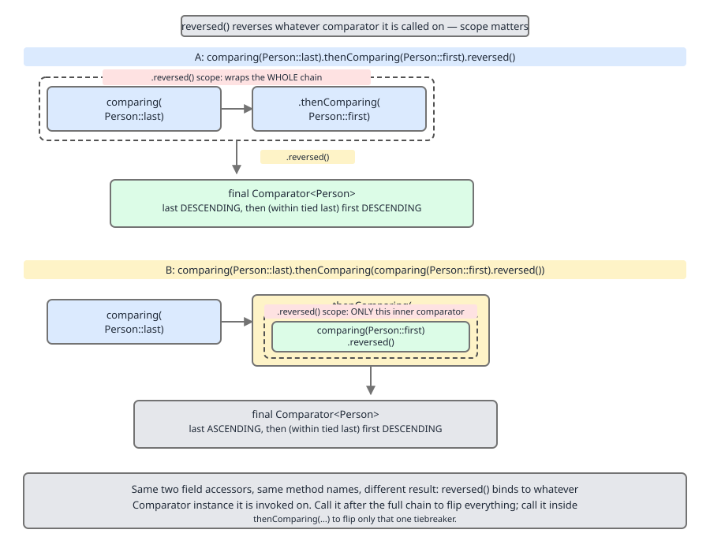
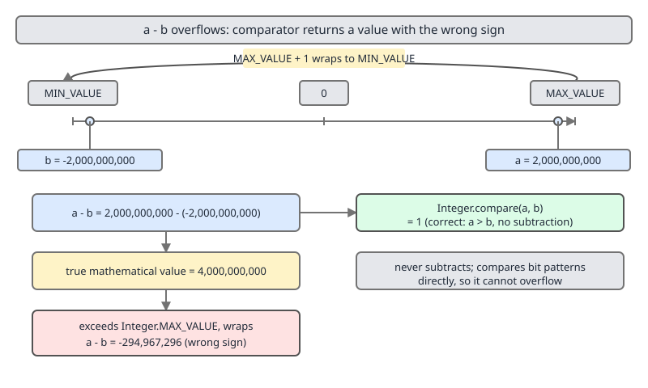

# 02 Java Collections — Ordering contracts — BASICS (§1.6 Ordering: Comparable, Comparator, natural order)

**Target version: Java 21 LTS.** | [Index](../00-index.md)
Previous: [framework/08-abstract-skeletons.md](../framework/08-abstract-skeletons.md) · Next: [contracts/02-equals-hashcode-contract.md](02-equals-hashcode-contract.md)

Two mechanisms answer "which of these comes first": a type's own opinion
(`Comparable`, "natural order") and an external, swappable opinion
(`Comparator`). Sorted collections (`TreeMap`, `TreeSet`, `PriorityQueue`)
and sorting utilities (`Collections.sort`, `Arrays.sort`, `Stream.sorted`)
run on whichever you hand them. Get either wrong and the failure is
silent — a collection that "loses" elements, a sort that throws at
runtime, or a comparator that flips its answer for the same pair.

| Mechanism | Who decides order | Fixed or swappable | Typical home |
|---|---|---|---|
| `Comparable<T>` | The type itself, via `compareTo` | Fixed — one natural order per type | `Integer`, `String`, `LocalDate` |
| `Comparator<T>` | An external object | Swappable — as many as you like | Sorting by a field, reverse order, multi-key sort |

## §1.6 Ordering: `Comparable`, `Comparator`, natural order

### 1.6.1–1.6.2 The `Comparable.compareTo` contract, and "consistent with equals"

**Mental model.** `compareTo` is `equals` for order instead of identity: it
answers not "are these the same" but "where does this one sit relative to
that one." A type that implements `Comparable<T>` is declaring one canonical
answer to that question, baked into the object, usable anywhere a sort or a
sorted collection is needed without the caller supplying anything extra.

**Why it exists.** Before `Comparable` (Java 1.2, with the Collections
Framework), sorting needed a bespoke comparison function at every call
site. `Comparable` centralizes that declaration on the type itself, so
`Collections.sort(list)` and `new TreeSet<>()` work with zero extra
arguments for any type that opts in.

**When to reach for it, and when not.** Implement `Comparable` when a type
has one obvious, stable, universally-agreed order — `Integer` by magnitude,
`LocalDate` by chronology. Do not implement it when a type has several
equally valid orders (`Person` by name in one screen, by age in another) —
that is what `Comparator` is for; forcing one order into `compareTo`
invites callers to rely on a "natural" order that only suits one use case.

**How it works — the contract.** `compareTo` returns negative, zero, or
positive as `this` is less than, equal to, or greater than the argument,
and must satisfy three algebraic laws for all `x`, `y`, `z` of the type:

- **Sign consistency:** `sgn(x.compareTo(y)) == -sgn(y.compareTo(x))`, and
  it must throw the same exception in the reversed call if it throws at all.
- **Transitivity:** `x.compareTo(y) > 0 && y.compareTo(z) > 0` implies
  `x.compareTo(z) > 0`.
- **Zero-implies-consistent-sign:** `x.compareTo(y) == 0` implies
  `sgn(x.compareTo(z)) == sgn(y.compareTo(z))` for every `z` — if two
  elements compare equal to each other, every third element must rank the
  same way against both of them.

The javadoc adds a *recommendation*, not a hard rule: `(x.compareTo(y) == 0)
== x.equals(y)` — "consistent with equals." A type is free to violate this;
the contract above is all sorted collections actually depend on for
correctness. Violating it has a specific, well-known casualty, next.

**Insight:** `compareTo == 0` is a stronger claim than it looks — it is not
just "these two are tied," it is "every collection that orders by
`compareTo` is entitled to treat these two as interchangeable," including
`TreeSet`/`TreeMap`, which use `compareTo == 0` as their notion of
*duplicate key*, not `equals`.

```java
public final class Money implements Comparable<Money> {
    private final long cents;

    public Money(long cents) { this.cents = cents; }

    @Override
    public int compareTo(Money other) {
        return Long.compare(this.cents, other.cents); // never `cents - other.cents`
    }
}
```

**Pitfall:** `BigDecimal` is the textbook violator of "consistent with
equals" — `new BigDecimal("2.0").compareTo(new BigDecimal("2.00")) == 0`
(same numeric value) but `.equals(...)` is `false` (scale differs: 1
decimal digit vs. 2). The symptom shows up the moment `BigDecimal` values
go into two different collection families — worked in full in 1.6.3. Never
assume `compareTo == 0` implies `equals == true` for a type you didn't
write; check the javadoc.

> **`Comparable<T>.compareTo(T o)`** returns the sign of `this` relative to
> `o`, must be antisymmetric and transitive across the whole type, and
> *should* — but is not required to — agree with `equals`.

### 1.6.3 `BigDecimal` in a `TreeSet` vs. a `HashSet` — the demonstration `[TRAP]` `[X-REF 03]`

1.6.2's violation made concrete — "equals and compareTo can disagree"
undersells how differently the two collection families behave when it does.

```java
Set<BigDecimal> tree = new TreeSet<>();
tree.add(new BigDecimal("2.0"));
tree.add(new BigDecimal("2.00"));
System.out.println(tree.size());   // 1 — compareTo says they're the same key

Set<BigDecimal> hash = new HashSet<>();
hash.add(new BigDecimal("2.0"));
hash.add(new BigDecimal("2.00"));
System.out.println(hash.size());   // 2 — equals (and hashCode) say they differ
```

**Insight:** a sorted collection uses `compareTo` (or its `Comparator`) as
its *sole* notion of element identity — `equals`/`hashCode` are never
consulted. A hash-based collection uses `equals`/`hashCode` and never
calls `compareTo`. The families can disagree about how many distinct
elements the same input produces, and neither is "wrong" — each faithfully
applies its own contract. `BigDecimal`'s full scale/`equals` semantics
belong to core-Java numeric types, not the collections framework — see
guide `03 Java core` (`src/topics/03-*`).

**Pitfall:** using `BigDecimal` as a `HashMap` key expecting `2.0` and
`2.00` to collide on the belief "equal value means equal key" — two
entries appear where one was expected. Fix: normalize scale before hashing
(`stripTrailingZeros()`, with care around `BigDecimal.ZERO`), or use a
`TreeMap` if compareTo-equality is what you want.

### 1.6.4 Natural ordering of the JDK types

| Type family | Natural order | Surprise |
|---|---|---|
| Numeric wrappers (`Integer`, `Long`, `Double`, …) | Ascending numeric value | `Double`/`Float` order `NaN` as greatest and distinguish `-0.0` from `0.0` — see 1.6.12 |
| `String` | Lexicographic by UTF-16 **code unit**, not by locale or code point | `"Z".compareTo("a") < 0` because `'Z'` (90) < `'a'` (97); supplementary characters compare by surrogate pair, which is not the same as code-point order |
| `Boolean` | `FALSE < TRUE` | None — added late (Java 5) but unsurprising |
| Enums | Declaration order (`ordinal()`), not alphabetical | Reordering enum constants silently reorders every `TreeSet<MyEnum>` and every `compareTo` call in the codebase |
| `java.time` types (`LocalDate`, `LocalDateTime`, `Instant`, …) | Chronological | `LocalDateTime.compareTo` ignores `ZoneId` entirely — two identical local times in different zones compare equal even though they are different instants |

**Pitfall:** assuming `String.compareTo` sorts the way a human expects.
`"Banana".compareTo("apple") < 0` because `'B'` (66) sorts before `'a'`
(97) — every uppercase letter sorts before every lowercase letter in
UTF-16 code-unit order. Fix: `String.CASE_INSENSITIVE_ORDER`, or a
`Collator` for genuinely human-visible sorting — next.

### 1.6.5 `String` ordering vs. `Collator` for human-visible sorting `[RESEARCH]`

**Verified against `java.text.Collator` javadoc (JDK 21).** `String`'s
natural order is a mechanical UTF-16 code-unit comparison — fast, stable,
locale-independent, and *not* how any human language sorts words.
`java.text.Collator.getInstance(Locale)` builds a locale-aware comparator
instead: it can ignore case and accents at the primary strength level, and
orders accented letters next to their base letter (é next to e, not off in
a Unicode code-point back-alley). `Collator` exposes tunable **strength**
levels — `PRIMARY` (base letter only), `SECONDARY` (adds accents),
`TERTIARY` (adds case, the default) — so "café" vs. "cafe" can be treated
as equal or distinct depending on the strength chosen.

```java
List<String> words = new ArrayList<>(List.of("café", "cafe", "Zebra", "apple"));
words.sort(String::compareTo);                     // code-unit order: Zebra, apple, cafe, café
words.sort(Collator.getInstance(Locale.FRENCH));   // locale order: apple, cafe, café, Zebra
```

**Pitfall:** shipping `String.compareTo`-sorted lists to end users and
calling it "alphabetical." It is alphabetical only for pure lowercase
ASCII; mixed case, diacritics, or non-Latin scripts need `Collator`, which
is meaningfully slower (locale rule tables vs. a raw `char` walk) — a
UI-facing sort, not the default for internal, machine-only ordering.

> **`Collator`** provides locale-sensitive, human-expectation string
> ordering with tunable strength, at a real performance cost over
> `String.compareTo`'s raw code-unit comparison.

### 1.6.6 `Comparator` as a functional interface

**Supporting fact.** `Comparator<T>` has one abstract method,
`int compare(T a, T b)`, with the same sign contract as `compareTo` — so
any lambda `(a, b) -> ...` or method reference matching that shape is a
`Comparator`. `Comparator.comparing(Person::getName)` and
`(p1, p2) -> p1.getName().compareTo(p2.getName())` are equivalent; the
factory method form documents intent and avoids hand-writing the
comparison. No gotcha beyond the sign contract already covered in 1.6.1.

> A **`Comparator<T>`** is a functional interface — `int compare(T a, T b)`
> — so any two-argument lambda with matching sign semantics is one.

### 1.6.7–1.6.8 `Comparator.comparing`/`thenComparing` chaining, and `reversed()`

**Mental model.** A comparator chain is a tie-breaker pipeline: try the
first key, and only if it says "equal" does control fall through to the
next key, and so on. `reversed()` does not touch one link in that pipeline
— it wraps the *entire pipeline built so far* in a single sign flip.

**Why it exists.** Sorting by last name, then first name on a tie, then
age on a further tie, used to mean one hand-written `compareTo` with
cascading `if` blocks; `comparing().thenComparing()` expresses the same
cascade declaratively, one key at a time.

**When to reach for it.** Any multi-key sort — a bare `comparing(...)`
(optionally `.reversed()`) suffices for a single key; reach for
`thenComparing` the moment two records can share the primary key.

**How it works.** `Comparator.comparing(keyExtractor)` builds a comparator
around one `Function<T, U>` where `U extends Comparable<U>`.
`.thenComparing(nextKeyExtractor)` returns a *new* comparator that first
delegates to the original, calling the new key extractor only when the
original returns `0`. `.reversed()` returns a new comparator that negates
the sign of whatever the original returns — and by the time `.reversed()`
is called, that "original" may already be a multi-key chain, so negating
it negates the *whole cascade's final verdict*, not just the last key.



```java
record Employee(String lastName, String firstName, int salary) {}

Comparator<Employee> byNameThenSalary =
        Comparator.comparing(Employee::lastName)
                   .thenComparing(Employee::firstName)
                   .thenComparingInt(Employee::salary);

// Reverses the WHOLE chain — every field flips, lastName included:
Comparator<Employee> fullyReversed = byNameThenSalary.reversed();

// To reverse only the salary tie-break, reverse it BEFORE chaining it on:
Comparator<Employee> onlySalaryReversed =
        Comparator.comparing(Employee::lastName)
                   .thenComparing(Employee::firstName)
                   .thenComparing(Comparator.comparingInt(Employee::salary).reversed());
```

**Pitfall:** calling `.reversed()` at the end of a chain expecting it to
flip only the last `.thenComparing(...)` call — an entire multi-key sort
comes out backwards, primary key included, when only the tie-breaker was
meant to invert. Fix: reverse the individual key comparator with
`Comparator.comparingInt(Employee::salary).reversed()` and chain *that*.
`Comparator`'s full method surface is inventoried in
[framework/02-interface-method-surfaces.md](../framework/02-interface-method-surfaces.md).

> **`Comparator.reversed()`** negates the sign of the entire comparator it
> is called on — including every `thenComparing` link already chained onto
> it, not just the most recently added one.

### 1.6.9 `nullsFirst`/`nullsLast` wrap a comparator, not a key extractor

**Supporting fact.** `Comparator.nullsFirst(cmp)` returns a new comparator
that treats `null` elements as smallest and delegates to `cmp` for any
non-null pair; `nullsLast` is the mirror image. The argument is a full
`Comparator<T>`, never a key-extractor function — so
`nullsFirst(Comparator.comparing(Person::getName))` is correct, but
`Comparator.comparing(Person::getName, nullsFirst(...))` differs: it wraps
`nullsFirst` around the *key* comparator, which only helps if the
extracted key (not the element) can be null. Mixing the two up compiles
fine and still throws `NullPointerException` from the wrong layer.

> **`Comparator.nullsFirst(Comparator<T> cmp)`** sorts `null` elements to
> the front and defers to `cmp` otherwise — it wraps a comparator of the
> element type, not a key-extraction function.

### 1.6.10 Primitive specializations avoid boxing `[NUM]`

**Mental model.** `comparingInt`/`comparingLong`/`comparingDouble` are
`comparing` with the key extractor typed to return a primitive
(`ToIntFunction<T>` etc.) instead of a boxed `Integer`/`Long`/`Double` — the
comparison itself then runs on primitives via `Integer.compare` internally,
no boxed intermediate object required.

**Why it exists.** `Comparator.comparing(Person::getAge)` with an `int`
getter forces autoboxing: the compiler wraps the `int` return in an
`Integer` because `comparing`'s generic signature needs a
`Comparable`-typed key. `comparingInt` exists purely to route around that.

**How it works, with the arithmetic `[NUM]`.** A comparison sort of `n`
elements makes roughly `n·log₂n` comparisons. Each `comparing(Person::getAge)`
comparison boxes *two* `Integer`s (one per side), so the whole sort costs
roughly `2·n·log₂n` boxed allocations, each at least 16 bytes on a modern
JVM (12-byte header rounded to 16 — full header layout in
[cost-and-memory/02-internals-memory-headers.md](../cost-and-memory/02-internals-memory-headers.md)).
For `n = 1000`, that is `2 × 1000 × 10 ≈ 20,000` boxed `Integer`s (~320 KB
of garbage), entirely avoided by `comparingInt`.

```java
list.sort(Comparator.comparing(Person::getAge));    // boxes an Integer per side
list.sort(Comparator.comparingInt(Person::getAge)); // compares int primitives directly
```

**Pitfall:** assuming the JIT always erases this boxing. Escape analysis
can eliminate some short-lived boxed values, but a boxed `Integer` handed
across a generic `Comparable.compareTo` virtual call is a well-known case
the JIT frequently cannot scalarize — the allocation is real in practice.

> **`comparingInt`/`comparingLong`/`comparingDouble`** compare on
> primitives directly, avoiding the `Integer`/`Long`/`Double` boxing that
> the generic `comparing` overload forces on a primitive-returning key
> extractor.

### 1.6.11 Never subtract to compare `[PROVE]` `[TRAP]`

**Mental model.** `a - b` treats subtraction as a stand-in for "sign of the
difference," but subtraction on fixed-width signed integers can overflow —
and overflow silently flips the sign, which is exactly the one bit a
comparator is not allowed to get wrong.

**Why it exists (as a pitfall).** `(a, b) -> a - b` reads as an elegant
one-liner and works for small values, so it spreads by imitation — until
it meets a dataset with values near `Integer.MIN_VALUE`/`MAX_VALUE`.

**The proof — worked on the page.** Let `a = 2_000_000_000` and
`b = -2_000_000_000`. Mathematically `a - b = 4_000_000_000`. A signed
32-bit `int` holds only `[-2_147_483_648, 2_147_483_647]`, so
`4_000_000_000` wraps modulo 2³²: `4_000_000_000 - 4_294_967_296 =
-294_967_296`. So `a - b` evaluates to a **negative** number, which a
comparator reads as "`a` is less than `b`" — but `a` is obviously *greater*
than `b`. The subtraction comparator gives the exactly wrong answer.

```java
Comparator<Integer> broken = (x, y) -> x - y;
int a = 2_000_000_000, b = -2_000_000_000;
System.out.println(broken.compare(a, b));     // -294967296  (claims a < b — wrong)
System.out.println(Integer.compare(a, b));    // 1           (correctly says a > b)
```

Handed to a real sort, this breaks transitivity across the dataset:
TimSort actively detects contract violations during merging and throws
`IllegalArgumentException: Comparison method violates its general
contract!` rather than silently mis-sorting. Even without throwing, a
`TreeSet`/`TreeMap` built on such a comparator can silently drop elements
it believes are duplicates, or fail `contains`/`get` for keys actually
present. TimSort's invariant checks are covered in
[utilities/02-sorting-a-timsort.md](../utilities/02-sorting-a-timsort.md).



**Fix.** Use `Integer.compare(a, b)` (or `Long.compare`, `Double.compare`)
— these compare via branching, not arithmetic, and cannot overflow.

**Pitfall:** "It works in all my tests" — test data rarely has extreme
values, so a production dataset eventually contains two values whose
difference exceeds the primitive's range, and the sort or tree collection
corrupts silently or throws at an unrelated call site. Fix:
`Integer.compare`/`Long.compare`, always — never `a - b`.

> Never implement a comparator as `a - b`. Signed integer subtraction can
> overflow and silently invert the sign; use `Integer.compare`/
> `Long.compare`/`Double.compare`, which cannot.

### 1.6.12 Comparing doubles: `Double.compare` vs. `<` for `NaN` and `-0.0` `[TRAP]`

**Mental model.** `<` and `==` implement IEEE 754 comparison, where `NaN`
compares unordered with everything (`NaN < x`, `NaN == x`, and `NaN > x`
are all `false`) and `-0.0 == 0.0` is `true`. `Double.compare` instead
imposes a *total order* — every value, including `NaN`, has one defined
place — because a sort algorithm cannot tolerate "neither less, greater,
nor equal" as an answer.

**Why it exists.** `TreeSet<Double>`, `Arrays.sort(double[])`, and any
`Comparator<Double>` need a strict total order to satisfy the
`Comparable`/`Comparator` contract from 1.6.1; raw IEEE comparison operators
do not provide one.

**How it works.** `Double.compare(d1, d2)` treats `Double.NaN` as *greater
than* every other value including `Double.POSITIVE_INFINITY`, and treats
two `NaN`s as equal to each other. It also distinguishes `-0.0` from
`0.0`, ordering `-0.0` as *less than* `0.0` — even though `-0.0 == 0.0` is
`true` under `==`.

```java
List<Double> values = new ArrayList<>(List.of(3.0, Double.NaN, 1.0, -0.0, 0.0));

values.sort((x, y) -> x < y ? -1 : (x > y ? 1 : 0)); // BROKEN: NaN falsely "equal" to all
values.sort(Double::compare);                        // -0.0, 0.0, 1.0, 3.0, NaN
```

**Pitfall:** writing a "manual" double comparator with `<`/`>` on the
belief that they are a safe basis for a `Comparator<Double>`. A list
containing `NaN` then sorts into a nonsensical, non-reproducible order
(and, per 1.6.11's TimSort note, can throw the contract-violation
exception) because every `NaN` comparison returns `0`. Fix:
`Double.compare`/`Double::compare`, always.

> **`Double.compare(d1, d2)`** imposes IEEE 754's missing total order:
> `NaN` sorts as the unique greatest value, and `-0.0` sorts strictly
> before `0.0` — behaviour `<`/`>`/`==` do not provide.

### 1.6.13–1.6.14 Comparator as part of collection identity, and `naturalOrder()` vs. `null`

**Supporting fact.** A `TreeMap`/`TreeSet`/`PriorityQueue` constructed with
an explicit `Comparator` stores it as instance state — consulted on every
`put`/`add`/`contains`/`remove`, and written out by `writeObject` when
serialized, so deserializing elsewhere needs that comparator's class
resolvable. Ordering is baked into the tree at insertion time, so a live
collection's comparator cannot be swapped; a rebuild (new collection,
re-insert) is the only path. Full key-identity mechanics are walked
source-level in
[tree-map/03-internals-b1-key-identity-and-nulls.md](../tree-map/03-internals-b1-key-identity-and-nulls.md).

`Comparator.naturalOrder()` and passing `null` to a `TreeMap`/`TreeSet`
constructor both delegate to the elements' own `compareTo`, but are not
interchangeable at the type level. `naturalOrder()` returns a real
`Comparator<T>`, usable anywhere one is required (`thenComparing`,
`Collections.max(list, cmp)`). A `null` argument is a sentinel the
collection's internal code branches on (`if (comparator != null) ... else
((Comparable) key).compareTo(...)`) — not a `Comparator` value, and not
passable where one is expected.

> A sorted collection's comparator (explicit, or `null` for natural
> ordering) is fixed at construction, is part of the collection's
> serialized state, and cannot be changed without rebuilding the
> collection.

### 1.6.15 `Map.Entry.comparingByValue()`

**Supporting fact.** `Map.Entry.comparingByValue()` returns a
`Comparator<Map.Entry<K,V>>` comparing entries by value using the value
type's natural order (an overload accepts an explicit
`Comparator<? super V>`); `comparingByKey()` is the key-based sibling. Both
exist so `entrySet().stream().sorted(Map.Entry.comparingByValue())` sorts
entries by value without hand-writing the comparator. The gotcha is scope:
this sorts a *view* — it cannot reorder the source `HashMap`/`TreeMap`
itself, since only `TreeMap` maintains internal order, and that order is
by key. Collecting the sorted stream into a `LinkedHashMap` for an
iterable, order-preserving result is worked in
[utilities/03-sorting-b-primitives.md](../utilities/03-sorting-b-primitives.md).

> **`Map.Entry.comparingByValue()`** builds a `Comparator<Entry<K,V>>` over
> entry values; it orders a stream/list of entries, it does not reorder the
> source map.

## Pitfalls

### Assuming `compareTo == 0` means `equals` agrees

**Wrong**
```java
BigDecimal a = new BigDecimal("2.0");
BigDecimal b = new BigDecimal("2.00");
if (a.compareTo(b) == 0) {
    assert a.equals(b); // fails — scale differs, equals returns false
}
```

**Right**
```java
// Decide up front which notion of equality the code needs, and use the
// matching collection: TreeSet<>() for compareTo-based dedup,
// HashSet<>() for equals/hashCode-based dedup — do not assume they agree.
Set<BigDecimal> byNumericValue = new TreeSet<>();
byNumericValue.add(a);
byNumericValue.add(b); // size stays 1: same numeric value
```

**Why people believe it:** the javadoc phrases the alignment as a strong
recommendation, and most hand-written `Comparable` types keep the two in
sync, so `BigDecimal`'s exception is easy to forget.

### Writing a comparator as `a - b`

**Wrong**
```java
list.sort((a, b) -> a - b); // overflows for extreme int pairs
```

**Right**
```java
list.sort(Integer::compare); // or Comparator.comparingInt(keyFn) for a key extractor
```

**Why people believe it:** it is shorter and passes every test written
with small, everyday-range numbers.

### Sorting doubles with `<`/`>` instead of `Double.compare`

**Wrong**
```java
values.sort((x, y) -> x < y ? -1 : (x > y ? 1 : 0)); // NaN silently breaks this
```

**Right**
```java
values.sort(Double::compare); // total order, NaN greatest, -0.0 < 0.0
```

**Why people believe it:** `<`/`>` work correctly for every value that is
not `NaN` or a signed zero, so the bug only shows once such a value lands.

## Cheat sheet

| Concept | One-line rule |
|---|---|
| `compareTo` contract | Sign-consistent, antisymmetric, transitive; `==0` should (not must) match `equals` |
| `BigDecimal` trap | `2.0`.compareTo(`2.00`) == 0, but `.equals` is `false` (scale differs) |
| `String` natural order | UTF-16 code unit, not locale — `"Z" < "a"` |
| Human-visible string sort | `Collator.getInstance(locale)`, not `compareTo` |
| `thenComparing` | Cascades only on a `0` (tie) from the prior key |
| `reversed()` | Flips the sign of the *entire* chain built so far |
| `nullsFirst`/`nullsLast` | Wraps a `Comparator<T>`, not a key extractor |
| `comparingInt`/`Long`/`Double` | Avoids boxing `comparing` forces on a primitive getter |
| Comparator arithmetic | Never `a - b`; use `Integer.compare`/`Long.compare` — overflow inverts sign |
| Double comparator | `Double.compare`, not `<`/`>` — handles `NaN` and `-0.0` correctly |
| Sorted collection's comparator | Fixed at construction, part of serialized identity, not swappable live |
| `naturalOrder()` vs. `null` | Both use `compareTo`, but only `naturalOrder()` is a passable `Comparator` value |
| `Map.Entry.comparingByValue()` | Comparator for a stream/list view; does not reorder the source map |

## Self-test

**Q1.** Why can a `TreeSet<BigDecimal>` and a `HashSet<BigDecimal>` end up
with different sizes after inserting the same two values?

<details><summary>Answer</summary>

`TreeSet` uses `compareTo` for identity; `"2.0"` and `"2.00"` compare
equal, so the set stays at size 1. `HashSet` uses `equals`/`hashCode`,
which also compares scale, so both are kept — size 2. Each family is
internally consistent; they just use different identity criteria, and
`BigDecimal` is the type that makes them disagree.

</details>

**Q2.** What exactly does `Comparator.reversed()` reverse when called at
the end of a `comparing().thenComparing().thenComparing()` chain?

<details><summary>Answer</summary>

The sign of whatever the entire chain returns, not just the last
`thenComparing` link — the chain evaluates normally, and only the final
result gets negated. To reverse one key in the middle of a multi-key sort,
reverse that key's own comparator before chaining it in.

</details>

**Q3.** Why does `(a, b) -> a - b` fail as an `int` comparator, and what
concrete pair of values demonstrates the failure?

<details><summary>Answer</summary>

Signed 32-bit subtraction can overflow and wrap modulo 2³², silently
flipping its sign. For `a = 2_000_000_000`, `b = -2_000_000_000`, the true
difference `4_000_000_000` wraps to `-294_967_296` — falsely claiming
`a < b`. `Integer.compare(a, b)` correctly returns `1`.

</details>

**Q4.** A list contains `Double.NaN`. What goes wrong if it is sorted with
`(x, y) -> x < y ? -1 : (x > y ? 1 : 0)`, and what fixes it?

<details><summary>Answer</summary>

`NaN < x`, `NaN > x`, `NaN == x` are all `false` under IEEE 754, so the
hand-written comparator falls through to `0` ("equal") for every `NaN`
comparison — not transitively consistent with the rest of the data, which
produces a garbage sort order. `Double.compare` fixes it by defining `NaN`
as the unique greatest value with a real total-order answer for every pair.

</details>

**Q5.** Why does `Comparator.comparing(Person::getAge)` box more objects
than `Comparator.comparingInt(Person::getAge)`, and roughly how many extra
allocations does that cost for 1,000 elements?

<details><summary>Answer</summary>

`comparing` requires a `Comparable`-typed key, so an `int` getter is
autoboxed on both sides of every comparison; `comparingInt` compares
primitives directly. A sort of `n` elements makes ~`n·log₂n` comparisons,
each boxing two `Integer`s, so `n = 1000` costs roughly
`2 × 1000 × 10 ≈ 20,000` boxed objects — about 320 KB of avoidable garbage.

</details>

**Q6.** What is the difference between `Comparator.nullsFirst(cmp)` and
`Comparator.comparing(Person::getName, Comparator.nullsFirst(...))`?

<details><summary>Answer</summary>

`nullsFirst(cmp)` wraps an element-typed `Comparator<T>` and short-circuits
when the element is `null`. The second form supplies `nullsFirst` as the
key-comparator to `comparing`, guarding only the *extracted key* — it does
nothing if `Person` itself can be `null`. Using the wrong layer still
throws `NullPointerException`.

</details>

**Q7.** Why can `Map.Entry.comparingByValue()` not be used to make a
`HashMap` iterate in value order?

<details><summary>Answer</summary>

It produces a `Comparator<Map.Entry<K,V>>` for sorting a stream/list
*view* — `HashMap` maintains no order at all and holds no comparator to
reach into. Getting an iterable, value-ordered result requires sorting
`entrySet().stream()` with it and collecting into a `LinkedHashMap`.

</details>

---

**Leaves covered:** 1.6.1–1.6.15 (15 leaves)
**Leaves deferred:** none
**Diagrams included:** D-13, D-14
**Target version:** Java 21 LTS
**Lines:**      595
