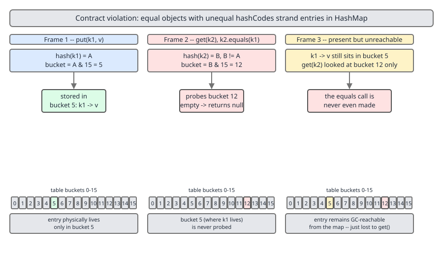
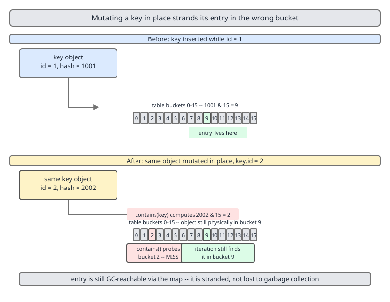
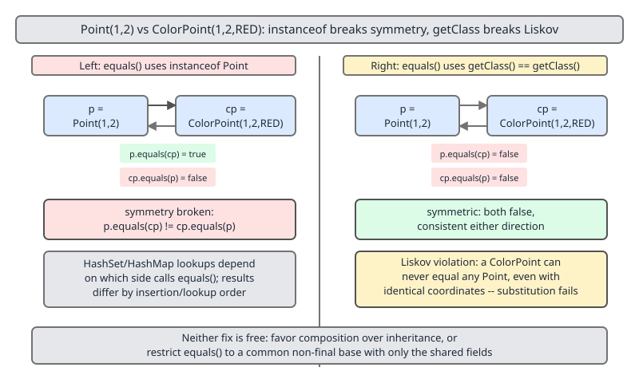

# 02 Java Collections — Ordering contracts — BASICS (§1.7 The equals/hashCode contract, part 1)

**Target version: Java 21 LTS.** | [Index](../00-index.md)
Previous: [contracts/01-ordering.md](01-ordering.md) · Next: [contracts/03-equals-hashcode-jdk.md](03-equals-hashcode-jdk.md)

## Hierarchy before details

Every hash-based structure (`HashMap`, `HashSet`, `HashSet`-backed dedup) answers "have I seen
this object before?" in two steps: `hashCode()` narrows the search to one bucket, `equals()`
confirms identity once you're standing inside it. `hashCode` is the coarse filter; `equals` is
the fine one. Get the coarse filter wrong and the fine one never even runs — the object is
looked for in the wrong bucket entirely. That asymmetry — one cheap int comparison gating an
expensive one — is why the contract between them is load-bearing, not cosmetic.

## `equals`: the mental model

Picture two designers checking whether two ID badges belong to the same person. `equals` is
that check. Java's `Object.equals` defaults to `==` — same badge, same object reference. Most
domain classes want more: same *content*. Once you override that check, five rules must hold
or every hash/tree structure built on it silently misbehaves.

### Why it exists

Reference identity is the only equality Java can give you for free, because it needs zero
knowledge of the type. But most business logic operates on values, not references: two
`Money(10, "USD")` instances should compare equal even though they're different objects on the
heap. `equals` is the escape hatch from identity to value semantics.

### When to reach for it / when not

Override `equals` (and `hashCode` with it) when the type has natural value identity — DTOs,
value objects, IDs, coordinates. Leave the default identity `equals` alone for mutable entities
with no natural key (a `Connection`, a `Thread`, most JPA-managed entities without a business
key) — giving such a type value equality invites exactly the mutable-key trap in leaf 1.7.4.

### How it works — the five clauses

For any non-null references `x`, `y`, `z`:

| Clause | Requirement |
|---|---|
| Reflexive | `x.equals(x)` is always `true`. |
| Symmetric | `x.equals(y)` iff `y.equals(x)`. |
| Transitive | if `x.equals(y)` and `y.equals(z)`, then `x.equals(z)`. |
| Consistent | repeated calls return the same result, provided no fields used in the comparison change. |
| Null-false | `x.equals(null)` is always `false`, never a `NullPointerException`. |

These aren't style preferences — they're the assumptions `HashMap.get`, `TreeSet.contains`, and
`List.indexOf` are written against. Break symmetry and `a.equals(b)` can find `b` in a
`HashSet` while `b.equals(a)` fails to find `a`, depending on lookup direction.

> The **`equals` contract** is Java's specification that a type's equality check be reflexive, symmetric, transitive, consistent, and false against null — the general rules every `Object.equals` override must satisfy regardless of what "equal" means for that type.

## `hashCode`: the mental model

If `equals` is checking two badges are the same person, `hashCode` is the filing-cabinet drawer
number written on the badge. Two badges for the same person must be filed in the same drawer —
otherwise a search for "this person" opens the wrong drawer and finds nothing.

### Why it exists

A hash table's whole performance case rests on being able to compute, in O(1), which of N
buckets an object lives in, without linear-scanning all of them. `hashCode()` is that
computation. `equals` cannot do this job — it takes another object as input and says nothing
about *where* to look.

### When to reach for it / when not

`hashCode` must be overridden whenever `equals` is overridden — never one without the other.
Overriding only `equals` compiles fine and is the single most common way to build a
correctness bug into hash-backed collections (see leaf 1.7.3 below).

### How it works — the contract clauses

1. **Consistent**: repeated calls on the same object return the same int, as long as no
   `equals`-participating field changes.
2. **Equal ⇒ equal hashes**: if `a.equals(b)`, then `a.hashCode() == b.hashCode()`. Mandatory.
3. **Unequal *may* collide**: if `!a.equals(b)`, their hash codes are *not* required to differ —
   collisions are legal and expected; they just shouldn't be the norm (a good hash function
   spreads unequal objects across many int values).

> The **`hashCode` contract** requires only that equal objects produce equal hashes and that the value be stable while the object is in a hash structure; unequal objects are permitted to collide, which is why every hash collection must still call `equals`.



## Why breaking equal ⇒ equal-hash strands the object `[PROVE]`

### Mental model

A `HashMap.get(key)` never scans every bucket. It computes `key.hashCode()`, derives a bucket
index, and only inside that one bucket does it run `equals()` against candidates. If two equal
objects hash differently, a `put` with one and a `get` with the other open *different* drawers.

### Proof sketch

```
put(k1, v)   →  bucket = hash(k1.hashCode())  →  entry stored in bucket B1
get(k2)      →  k2.equals(k1) == true, but k2.hashCode() != k1.hashCode()
             →  bucket = hash(k2.hashCode())  →  looks in bucket B2 != B1
             →  B2 has no matching entry      →  get returns null
```

The entry is not lost — it is sitting in `B1`, findable by *iteration* (`entrySet()` walks
every bucket) — but `containsKey`, `get`, and `remove` are all bucket-targeted and will never
see it via `k2`. This is the concrete mechanism behind "undiscoverable": not deleted, just
permanently unreachable through the API that matters.

**Pitfall:** a class that overrides `equals` but inherits `Object.hashCode()` (identity hash)
violates this immediately — two content-equal instances get essentially random, different
hashes.

> **Hash stranding** is the failure mode where an object with equal-but-differently-hashed states becomes permanently unreachable via `get`/`contains`/`remove` because those calls compute a different bucket than the one the entry actually lives in.

## The mutable-key trap `[TRAP]`

### Mental model

Filing a badge by drawer number, then changing the person's name printed on the badge without
re-filing it. The drawer number on the cabinet index still reflects the *old* name.

### Why it exists (as a failure mode)

`HashMap`/`HashSet` compute a key's bucket **once**, at insertion time, and never revisit that
placement. If the key object is mutated afterward in a field that `hashCode()` reads, the
object's *current* hash code no longer matches the bucket it lives in.

### Mechanism

```
Set<Point> points = new HashSet<>();
Point p = new Point(1, 1);       // hashCode computed from (x, y) = (1, 1)
points.add(p);                    // stored in bucket derived from hash(1,1)

p.setX(99);                       // mutate a hash-participating field in place

points.contains(p);                // false! recomputes hash(99,1), looks in wrong bucket
points.remove(p);                  // also false — same reason, entry never removed
for (Point q : points) { ... }    // true — iteration walks all buckets, finds p
```

The entry is retained (it leaks — you can never `remove` it through the mutated reference) and
still visible to iteration, but invisible to every targeted lookup. This is a leak plus a
correctness bug in one.



**Insight:** this is precisely why immutable value types (final fields, no setters) are the
default recommendation for map/set keys — an immutable key's hash code cannot drift out of sync
with its bucket, because it never changes after construction.

> The **mutable-key trap** is the bug where mutating a hash-participating field on an object already stored as a map/set key strands the entry in its original bucket, since the map fixes the key's bucket at insertion time and never re-hashes it.

## Overloading `equals(MyType)` instead of overriding `equals(Object)` `[TRAP]`

### Mechanism

`Object.equals` has signature `equals(Object)`. Writing `equals(Point other)` does not override
it — it *overloads* it, creating a second, unrelated method. The compiler accepts this silently
because overloading is legal; no `@Override` failure occurs unless you add the annotation.

```java
public boolean equals(Point other) {   // overload, NOT an override — bug
    return this.x == other.x && this.y == other.y;
}
```

Any code that calls `equals` polymorphically through an `Object` reference — every collection
internal does exactly this — dispatches to the inherited identity `Object.equals`, ignoring
your logic entirely. `HashSet.contains` will use reference equality; direct calls like
`p1.equals(p2)` where both are statically typed `Point` will use your overload — the same two
objects compare equal or not equal depending on the *static type* of the reference, which is
the symmetry violation in disguise.

**Pitfall:** always add `@Override` to `equals(Object o)`. The annotation turns this exact
mistake into a compile error the moment the signature doesn't match.

> **Overloading `equals`** is defining a method named `equals` with a parameter type other than `Object`, which creates an unrelated second method instead of overriding `Object.equals`, so polymorphic callers silently fall back to identity comparison.

## `getClass()` vs `instanceof` in `equals` `[TRAP]`

### Mental model

Two competing definitions of "same kind of thing": exact same runtime class (`getClass()`), or
anything that IS-A the type (`instanceof`). Each buys a different property and gives up the
other.

### The `Point` / `ColorPoint` example

```java
class Point {
    private final int x, y;
    @Override public boolean equals(Object o) {
        if (!(o instanceof Point p)) return false;      // instanceof form
        return x == p.x && y == p.y;
    }
}

class ColorPoint extends Point {
    private final String color;
    @Override public boolean equals(Object o) {
        if (!(o instanceof ColorPoint cp)) return false;
        return super.equals(cp) && color.equals(cp.color);
    }
}
```

```
Point p        = new Point(1, 1);
ColorPoint cp  = new ColorPoint(1, 1, "RED");

p.equals(cp)   → true   (Point.equals only checks instanceof Point — cp qualifies)
cp.equals(p)   → false  (ColorPoint.equals requires instanceof ColorPoint — p doesn't qualify)
```

`instanceof` gives asymmetry the instant a subclass adds a comparable field, because the
comparison isn't required to be mutual. Switching `Point.equals` to `if (o == null ||
getClass() != o.getClass()) return false;` restores symmetry — `p.equals(cp)` and
`cp.equals(p)` are now both `false` — but at the cost of Liskov substitution: a `ColorPoint`
can never equal *any* `Point`-typed comparison, even one written to be fully substitutable,
because `getClass()` pins equality to the exact runtime type.

| Approach | Symmetry | Liskov substitutability | Typical use |
|---|---|---|---|
| `instanceof` check only | broken once a subclass adds fields | preserved | flat class hierarchies, no field-adding subclasses |
| `getClass()` check | preserved | broken (subclass never equals superclass instance) | class hierarchies where subtypes add comparable state |
| Favor composition over inheritance | n/a | n/a | Effective Java's actual recommendation — avoid the dilemma |



**Interview:** this exact `Point`/`ColorPoint` pair is one of the most common `equals` questions
asked — know both which contract clause breaks (symmetry, for `instanceof`) and why the
`getClass()` fix has its own cost (Liskov), rather than presenting `getClass()` as a free fix.

> The **`getClass()` vs `instanceof` choice** in `equals` is a trade-off between symmetry (guaranteed by `getClass()`) and Liskov substitutability (guaranteed by `instanceof`) that cannot be had simultaneously once a subclass adds comparable fields.

## `record` generated `equals`/`hashCode` `[X-REF 04]`

A `record` (finalized in Java 16) generates `equals`, `hashCode`, and `toString` from its
component list automatically: `equals` compares every component, `hashCode` combines every
component's hash, and the class is implicitly `final`, so the `getClass()`-vs-`instanceof`
dilemma above cannot arise — there are no subclasses to be asymmetric against.

```java
record Point(int x, int y) { }

Point a = new Point(1, 1);
Point b = new Point(1, 1);
a.equals(b);       // true — component-wise
a.hashCode() == b.hashCode();  // true — guaranteed by generation, contract-safe by construction
```

**Tradeoff:** records give you a contract-correct `equals`/`hashCode` for free and eliminate an
entire class of hand-written bugs — but the generation is purely mechanical. See the array
caveat immediately below, and full JDK-source behavior in the next file
(`03-equals-hashcode-jdk.md`).

> A **record's generated `equals`/`hashCode`** is a mechanical, component-wise implementation the compiler produces from the component list, contract-correct by construction because the class is implicitly final.

## Records as map keys — the array-component caveat `[TRAP]`

Records are the default choice for map/set keys precisely because they're immutable and their
`equals`/`hashCode` are contract-correct by construction — this sidesteps the mutable-key trap
above entirely. One caveat: array components break that guarantee silently.

```java
record Coordinates(int[] values) { }

Coordinates c1 = new Coordinates(new int[]{1, 2});
Coordinates c2 = new Coordinates(new int[]{1, 2});

c1.equals(c2);   // false! array's equals is Object identity, arrays don't override it
```

The generated `equals` calls `Objects.equals` per component — and for an array component that
resolves to `Arrays.equals`'s *absence*, i.e. plain reference equality, because arrays never
override `equals`/`hashCode` themselves. Two records wrapping content-identical arrays compare
unequal. Prefer `List<Integer>` (or another type with real value equality) over an array
component whenever a record will be used as a key or compared for equality.

> The **array-component caveat** is that a record component of array type keeps `Object`'s reference-identity `equals`, so two records wrapping content-identical arrays compare unequal despite the record itself being generated correctly.

## `Objects.*` and `Arrays.*` helpers

Mechanism: `java.util.Objects` provides null-safe building blocks for hand-written `equals`/
`hashCode` so you don't reimplement null checks yourself: `Objects.equals(a, b)` (null-safe
equality, `true` if both null), `Objects.hashCode(o)` (`0` if null), `Objects.hash(Object...)`
(combines several fields' hashes in one call), and `Objects.requireNonNull(o)` (fail-fast
null guard, typically used in constructors, not directly in `equals`).

Gotcha: `Arrays.hashCode(Object[])` hashes only the top level — nested arrays hash by their
identity, same trap as record array components above. `Arrays.deepHashCode(Object[])` recurses
into nested arrays and produces the value-based hash you almost always actually want for
multi-dimensional or jagged arrays.

> **`Objects`** is a static utility class of null-tolerant convenience wrappers around the per-object contract methods — it does not change the contract, only makes correct implementations less error-prone to write by hand.

## `Objects.hash` allocates a varargs array `[NUM]`

Mechanism: `Objects.hash(a, b, c)` desugars to `Arrays.hashCode(new Object[]{a, b, c})` — every
call allocates a new `Object[]` to box the arguments (primitives get autoboxed too), then walks
it computing `31 * result + element.hashCode()` per slot. For a `hashCode()` called millions of
times per second — every `HashMap.put`/`get` on a hot path — that's a per-call array allocation
purely for a bookkeeping convenience.

Gotcha: this is why performance-sensitive `hashCode()` overrides write the accumulation loop by
hand instead of delegating to `Objects.hash`:

```java
@Override
public int hashCode() {
    int result = 17;
    result = 31 * result + Integer.hashCode(x);
    result = 31 * result + Integer.hashCode(y);
    return result;
}
```

No allocation, same shape of computation, safe for hot paths. Reach for `Objects.hash` in
ordinary code where clarity outweighs a few nanoseconds and an escape-analyzable short-lived
array; write the loop by hand once profiling shows `hashCode()` on the flame graph.

> **`Objects.hash(...)`** is a varargs convenience that boxes its arguments into a new `Object[]` on every call before hashing them, trading a per-call allocation for implementation brevity.

## The `31` multiplier `[PROVE]`

### Mental model

Combining several field hashes into one int needs a mixing step, or fields at the same
position in different objects with the same values but swapped order (or fields that happen to
sum equally) collide constantly. Multiplying the running hash by a constant before adding each
field's contribution is that mixing step.

### Why `31` specifically

`31` is odd and prime. Odd matters because multiplying by an even number can lose information
by shifting bits out of the top and never getting a `1` back into the bottom bit consistently —
over repeated multiplication, evenness biases the result toward a smaller effective bit space.
Prime matters because it minimizes systematic collisions from common factors when hash
components themselves share structure (e.g. array indices, small sequential IDs).

### The identity `[PROVE]`

```
31 * i == (i << 5) - i
```

Proof: `31 = 32 - 1 = 2^5 - 1`. So `31 * i = (2^5) * i - i = (i << 5) - i`. This means a JIT
compiler (or a human optimizing by hand historically) can replace a multiply instruction with a
shift and a subtract — on older hardware without fast integer multiply, this was a genuine
throughput win. On modern JITs the compiler performs this strength-reduction automatically, so
the identity today is mostly interview trivia and a mental-arithmetic shortcut, not something
you need to hand-optimize yourself.

**Interview:** be ready to derive `31*i == (i<<5) - i` on a whiteboard from `31 = 2^5 - 1`
without needing to have memorized it — the derivation itself is the thing being tested, not the
constant.

> The **`31` multiplier** is the odd-prime constant used to mix accumulated field hashes in a `hashCode` implementation, chosen because oddness avoids losing bits under repeated multiplication and primality minimizes systematic collisions.

## Pitfalls

**Wrong:**
```java
class User {
    private String email;
    void setEmail(String e) { this.email = e; }   // mutates a hash-participating field
    @Override public int hashCode() { return email.hashCode(); }
    @Override public boolean equals(Object o) {
        return o instanceof User u && email.equals(u.email);
    }
}
Set<User> seen = new HashSet<>();
User u = new User("a@x.com");
seen.add(u);
u.setEmail("b@x.com");          // mutate after insertion
seen.contains(u);                // false — stranded, see leaf 1.7.4
```

**Right:** make the hashed field final and remove the setter, or never mutate an object after
it's been used as a hash key — copy-and-replace instead:
```java
record User(String email) { }
Set<User> seen = new HashSet<>();
User u = new User("a@x.com");
seen.add(u);
User updated = new User("b@x.com");   // new object, old one still correctly findable
```

**Wrong:**
```java
@Override public boolean equals(Object o) {
    if (getClass() != o.getClass()) return false;   // NPE if o is null: o.getClass()
    ...
}
```

**Right:** null-check before touching `o`, and prefer `instanceof` pattern matching, which
short-circuits on `null` automatically:
```java
@Override public boolean equals(Object o) {
    if (!(o instanceof Point p)) return false;   // false for null, wrong type, in one check
    return x == p.x && y == p.y;
}
```

**Wrong:**
```java
public boolean equals(Point other) {   // overload, not override — no @Override, compiles silently
    return x == other.x && y == other.y;
}
```

**Right:**
```java
@Override public boolean equals(Object o) {   // @Override forces the correct signature
    return o instanceof Point p && x == p.x && y == p.y;
}
```

## Cheat sheet

| Concept | One-line rule |
|---|---|
| `equals` contract | reflexive, symmetric, transitive, consistent, null → false |
| `hashCode` contract | consistent; equal objects ⇒ equal hashes; unequal objects may collide |
| Broken equal⇒hash | object becomes unreachable via `get`/`contains`/`remove`, still visible to iteration |
| Mutable-key trap | mutate a hashed field after insertion → stranded in old bucket, leaked |
| `equals(MyType)` overload | silently bypasses your logic under polymorphic dispatch; always add `@Override` |
| `getClass()` vs `instanceof` | `getClass()` preserves symmetry, breaks Liskov; `instanceof` is the reverse |
| `record` equals/hashCode | component-wise, generated, correct by construction, class is implicitly final |
| Record + array component | array field keeps identity equality — use `List<T>` instead |
| `Objects.hash` | convenient, allocates a varargs array — hand-roll the loop on hot paths |
| `31` multiplier | odd prime; `31*i == (i<<5) - i` since `31 = 2^5 - 1` |

## Self-test

<details><summary>Why does breaking "equal objects must have equal hash codes" make an object undiscoverable rather than merely slow?</summary>
Because lookups are bucket-targeted, not linear scans. If a key's current hash code doesn't match the bucket it was stored under, `get`/`contains`/`remove` compute a different bucket index and never reach the entry — it's not degraded performance, it's a wrong-answer bug. The entry is still findable via full iteration, which is why it looks like a "leak" rather than a crash.
</details>

<details><summary>What exactly goes wrong in the mutable-key trap, mechanically?</summary>
A HashMap/HashSet computes and fixes a key's bucket at insertion time, from `hashCode()` at that moment. If a hash-participating field is mutated afterward, `hashCode()` now returns a different value, but the entry hasn't moved. Targeted lookups recompute the new hash, check the new (wrong) bucket, and fail — the entry is retained but effectively unremovable and unfindable through the mutated reference.
</details>

<details><summary>Why is overloading `equals(MyType)` instead of overriding `equals(Object)` dangerous, and how do you prevent it?</summary>
Because `Object.equals` has signature `equals(Object)`; a method named `equals` with any other parameter type is a separate overload, not a polymorphic override. Code that calls `equals` through an `Object`-typed reference — which is what every collection internal does — dispatches to inherited identity equality, ignoring your logic. Always annotate `equals(Object o)` with `@Override` so a signature mismatch is a compile error.
</details>

<details><summary>In the Point/ColorPoint example, which equals() contract clause breaks with instanceof checks, and what's the tradeoff of fixing it with getClass()?</summary>
`instanceof`-based equals breaks symmetry: `point.equals(colorPoint)` can be true (colorPoint qualifies as instanceof Point) while `colorPoint.equals(point)` is false (point doesn't qualify as instanceof ColorPoint). Switching to `getClass()` comparison restores symmetry but breaks Liskov substitution — a ColorPoint can never equal any Point, even in contexts where full substitutability was intended.
</details>

<details><summary>Why can't a record have the getClass()-vs-instanceof dilemma?</summary>
Records are implicitly final — they cannot be subclassed, so there is no scenario where a subclass adds fields and creates asymmetry. The generated equals compares the exact record type's components; there's no hierarchy to be asymmetric across.
</details>

<details><summary>Why does a record with an array component break value equality even though records are "correct by construction"?</summary>
The generated equals is component-wise and delegates each component's comparison to that component's own equals. Arrays never override equals/hashCode from Object, so array components compare by reference identity regardless of content. The record's construction is correct — it faithfully forwards to each component's equals — the array type itself is the source of the surprise.
</details>

<details><summary>Why do hot-path hashCode() implementations avoid Objects.hash(...)?</summary>
`Objects.hash(a, b, c)` allocates a new Object[] (with autoboxing for primitives) on every call to pass as varargs, then walks it. For a hashCode() invoked on every HashMap put/get, that's a per-call allocation for what should be a cheap, allocation-free computation. Hand-writing the `31 * result + field.hashCode()` accumulation avoids the allocation entirely.
</details>

<details><summary>Derive why 31 * i equals (i << 5) - i.</summary>
31 = 32 - 1 = 2^5 - 1. So 31 * i = (2^5) * i - 1 * i = (i << 5) - i, since multiplying by 2^5 is a left shift by 5 bits. This lets the identity be reconstructed from first principles rather than memorized.
</details>

---

**Leaves covered:** 1.7.1–1.7.11 (11 leaves)
**Leaves deferred:** none
**Diagrams included:** D-15, D-16, D-17
**Target version:** Java 21 LTS
**Lines:**      475
