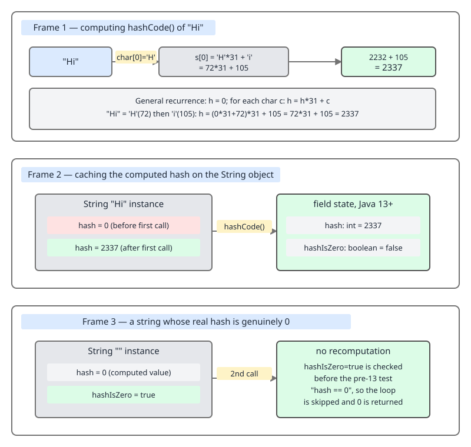
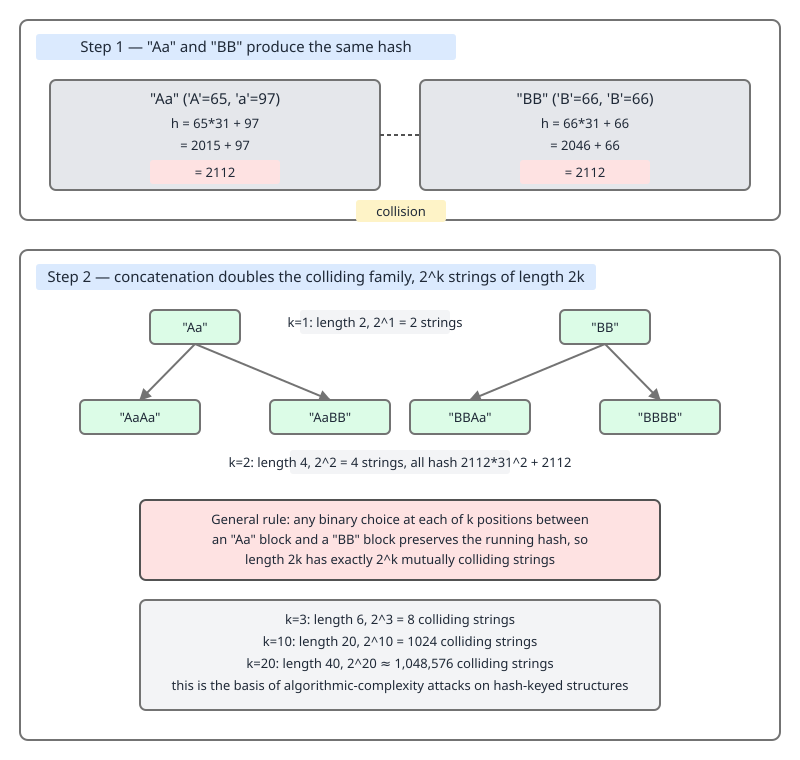

# 02 Java Collections — Ordering contracts — BASICS (§1.7 The equals/hashCode contract, part 2: the JDK's own implementations)

**Target version: Java 21 LTS.** | [Index](../00-index.md)
Previous: [contracts/02-equals-hashcode-contract.md](02-equals-hashcode-contract.md) · Next: [contracts/04-generics-and-boxing.md](04-generics-and-boxing.md)

The previous file derived the *contract* — reflexivity, symmetry, transitivity, the
equal-implies-equal-hash rule, the mutable-key trap, `getClass` vs `instanceof`, `Objects.hash`,
and why `31` is the multiplier of choice — none of that repeats here. This file covers what the
JDK's *own* types do inside `hashCode()`/`equals()`, and the costs those concrete choices carry.
Out of scope, by pointer only: treeify mechanics (`../hash-map/04-internals-d-treeify.md`);
`IdentityHashMap` internals (`../specialised-maps/03-identity-and-weak.md`,
`04-internals-identity-weak.md`); `EnumMap`/`EnumSet` internals
(`../specialised-maps/01-enum-collections.md`, `02-internals-enum-map-set.md`); the `Abstract*`
skeletons as base classes (`../framework/08-abstract-skeletons.md`); `String` interning (guide
`03 Java core`, `src/topics/03-*`).

## `String.hashCode`: the mental model

Picture a `String` as a fixed sequence of digits in base 31, and `hashCode()` as that number
computed once and stapled to the object like a receipt — printed once, never reprinted. The
Javadoc formula:

```
s[0]*31^(n-1) + s[1]*31^(n-2) + ... + s[n-1]
```

where `s[i]` is the `i`-th UTF-16 code unit and `n` is the length. An empty string hashes to `0`.

**Why it exists:** `String` keys are the most common key type in every `HashMap` ever written —
config maps, JSON parsing, headers, ID-keyed caches. Recomputing the polynomial on every call
would tax every long-string lookup on top of the `equals` cost already paid inside the bucket.
`String` is immutable, so the hash can never change after construction — computing it once and
reusing it forever is always correct.

**When to reach for it / when not:** you never call `String.hashCode()` directly except for
logging or your own hash-based structure — `HashMap`/`HashSet` call it on every
`put`/`get`/`contains`. Caching means repeated lookups on the same instance are cheap; the
formula being public and stable means it is spoofable (next concept).

### How it works — the cache and the Java 13 `hashIsZero` flag

`String` stores two private, non-`volatile` fields: `private int hash;` (defaulting to `0`,
meaning "uncomputed") and, since Java 13, `private boolean hashIsZero;`. The real Java 21 source:

```java
public int hashCode() {
    int h = hash;
    if (h == 0 && !hashIsZero) {
        h = isLatin1() ? StringLatin1.hashCode(value)
                        : StringUTF16.hashCode(value);
        if (h == 0) {
            hashIsZero = true;
        } else {
            hash = h;
        }
    }
    return h;
}
```

Line by line: `h == 0 && !hashIsZero` is the cache-miss test — "no cached nonzero value, and we
haven't already proven the real hash is zero." Only then is the polynomial computed
(`StringLatin1`/`StringUTF16` pick the byte-width-appropriate loop). If the fresh hash is `0`,
`hashIsZero` flips to `true` instead of writing `0` into `hash` — the flag, not the field,
becomes the cache signal. Otherwise the nonzero value is stored in `hash` as before.

Before Java 13 (JDK-8054307), there was only the `hash` field, and a cached value of exactly `0`
was indistinguishable from "not yet computed." A string whose real hash happens to be `0` — the
empty string, or an engineered example such as `"polygenelubricants"` — silently lost the caching
benefit and recomputed on *every single call*. `hashIsZero` gives "the real hash is zero" its own
bit, independent of `hash`.

Neither field is `volatile`, deliberately: two racing threads both run the same deterministic
polynomial and arrive at the same `int`, so a lost or duplicated write is harmless — worst case
the hash is computed twice, and both observe a correct value. A textbook *benign data race*,
safe only because the computation is pure and idempotent; the same pattern would be unsafe for a
field whose recompute step has side effects.



### A minimal concrete example

```java
void demonstrateCaching() {
    String s = "Hi";
    int h = s.hashCode();
    // 'H' = 72, 'i' = 105
    // 72*31 + 105 = 2232 + 105 = 2337
    System.out.println(h);              // 2337
    System.out.println(s.hashCode());   // 2337 again, served from the `hash` field
}
```

### The gotcha

The cache only helps because `String` is immutable and the hash is set once, ever. Caching a
mutable "string-like" type's hash the same way without invalidating it on mutation reproduces
the mutable-key trap from the previous file — self-inflicted, inside your own type.

> **Definition:** `String.hashCode()` computes `s[0]*31^(n-1) + ... + s[n-1]` once, caches it in
> a private, non-`volatile` `hash` field, and — since Java 13 (JDK-8054307) — uses a companion
> non-`volatile` `hashIsZero` boolean so that a legitimately-zero hash is also recognized as
> cached rather than recomputed on every call; the race between threads computing the cache for
> the first time is benign because the computation is pure and deterministic.

## Engineered `String` collisions: the mental model

If `hashCode` is a receipt, an engineered collision is two different purchases that print an
identical receipt number. `"Aa"` and `"BB"` are different strings, yet
`"Aa".hashCode() == "BB".hashCode()`, because the base-31 polynomial gives both exactly `2112`.

**Why it exists as a documented consequence, not a bug:** the base-31 formula is unavoidably
many-to-one — vastly more possible 2-character strings exist than possible `int` values — so
collisions are mathematically inevitable for anyone who goes looking. This pair collides because
31 is small enough that simple integer arithmetic lines two weighted sums up exactly. It is a
published property of a public algorithm, not an obscure edge case, which is precisely why it is
exploitable.

**When it matters / when it doesn't:** for ordinary keys, collisions are rare and harmless —
`equals` still filters false positives inside the bucket. They matter the moment an attacker
controls the *set* of keys inserted into a server-side `HashMap` — form-parameter names, header
names, JSON keys. Thousands of distinct, all-colliding strings turn every operation from O(1)
toward O(n) per lookup and O(n²) to insert the whole set — an algorithmic-complexity
denial-of-service, the class of attack documented as CVE-2011-4858. How `HashMap` caps the
damage (bucket treeification) is covered in `../hash-map/04-internals-d-treeify.md`, not here.

### How it works — the arithmetic

```
"Aa": 'A'*31 + 'a' = 65*31 + 97 = 2015 + 97 = 2112
"BB": 'B'*31 + 'B' = 66*31 + 66 = 2046 + 66 = 2112
"FB": 'F'*31 + 'B' = 70*31 + 66 = 2170 + 66 = 2236
"Ea": 'E'*31 + 'a' = 69*31 + 97 = 2139 + 97 = 2236
```

Both pairs are engineered by picking `(c1, c2)` and `(c1', c2')` such that
`c1*31 + c2 == c1'*31 + c2'` — trivial once the constant (31) is known. The property doubles:
concatenate any colliding pair with itself (or with another colliding pair) and the
concatenation still collides, because `String.hashCode` folds left-to-right through the same
31-multiplier at every position — a 2-character collision produces `2^k` distinct
`2k`-character strings that all share one hash code. At `k = 16`, that is `2^16 = 65,536`
distinct 32-character strings landing in a single bucket — enough to make every lookup against
that bucket degrade from O(1) toward the bucket's linear (or, post-treeify, logarithmic) cost.



### A minimal concrete example

```java
void demonstrateCollision() {
    Set<String> collided = new HashSet<>();
    collided.add("Aa");
    collided.add("BB");
    System.out.println("Aa".hashCode() == "BB".hashCode()); // true
    System.out.println(collided.size());                    // 2 — equals() still distinguishes them
}
```

### The gotcha

Equal hash codes never mean equal objects — `"Aa".equals("BB")` is `false`. The danger is never
correctness, only performance: enough colliding keys degrade a `HashMap`'s worst case, which is
why user-controlled key sets on a public endpoint deserve a treeifying JDK (Java 8+, automatic)
or, for a genuinely adversarial threat model, a keyed/salted hash seeded per process.

> **Definition:** an engineered `String` collision is a deliberately constructed pair or family
> of distinct strings whose `hashCode()` values are equal by design, exploiting the small
> constant (`31`) and public formula of `String.hashCode()` to force many attacker-chosen keys
> into one hash bucket.

## Enum identity `hashCode`: the mental model

An enum constant is a singleton with a name tag, but its `hashCode()` ignores the tag entirely —
it hashes the object the way a raw `new Object()` would: by identity, by *where it happens to
sit*, not by what it's called.

**Why it exists:** `Enum` cannot let subclasses override `equals`/`hashCode` the way ordinary
classes can, because enum constants are only ever meaningfully compared by identity — exactly
one `MONDAY` per classloading, so `==` already gives correct equality, and a content-based
override would be strictly more work for no better an answer. `Enum` declares both methods
`final`:

```java
public final int hashCode() {
    return super.hashCode();
}
```

`super.hashCode()` is `Object.hashCode()` — the JVM's identity hash, from runtime identity
rather than the constant's name or `ordinal()`. `[RESEARCH]` verified against the JDK 21 `Enum`
source: `hashCode()` is indeed `final` and delegates exactly this way.

**When it matters / when it doesn't:** it doesn't matter for `equals`-based lookups —
`enumValue.equals(other)`/`map.get(enumValue)` work as expected, since the *same* singleton
always hashes the *same* within one JVM run. It matters the moment you depend on the *iteration
order* of a hash-based structure keyed by enums surviving across separate runs — logs, snapshot
tests, serialized cache dumps.

### How it works — identity hash is per-run, not per-name

The hash value is JVM-assigned at first use and has no fixed relationship to `ordinal()` or
`name()`. Two runs of the same program, on the same JVM version, can and do produce different
identity hashes for the same constant, because object placement — and therefore identity-hash
assignment — is not guaranteed reproducible run to run.

```java
enum Day { MON, TUE, WED }

void demonstrateEnumHashOrder() {
    Map<Day, Integer> counts = new HashMap<>();
    counts.put(Day.WED, 3);
    counts.put(Day.MON, 1);
    counts.put(Day.TUE, 2);
    System.out.println(counts.keySet()); // order not guaranteed to match across JVM runs
}
```

Run this program twice and `counts.keySet()` can print `[MON, TUE, WED]` in one run and
`[WED, MON, TUE]` in another — same source, same inputs, different bucket layout, because the
bucket a key lands in is a function of an identity hash the JVM is free to reassign. `EnumMap`
sidesteps the question: array-backed, indexed by `ordinal()`, so iteration order is always
declaration order, every run, forever. No diagram is assigned to this concept; the code above
carries the shape.

### The gotcha

**Pitfall:** assuming a `HashMap<SomeEnum, V>` iterates in a fixed order because "enums are
constants, so their hash must be stable." The symptom is a flaky test or a log diff that changes
between CI runs with zero code changes. **Fix:** use `EnumMap`/`EnumSet` whenever iteration
order must be reproducible or declaration-ordered; reach for `HashMap` only when genericity over
key type matters more than order.

> **Definition:** enum `hashCode()` is `final`, delegates to `Object.hashCode()`'s
> identity-based value, and is therefore stable only within a single JVM run — never across
> runs — which is exactly the gap `EnumMap`/`EnumSet` (ordinal-indexed, array-backed) exist to
> close.

## Cross-implementation `equals`: the mental model

Two collections don't ask "are you literally the same class as me?" — they ask "do you and I
agree on the same interface's notion of sameness, with contents arranged the way that interface
demands?" `AbstractList` and `AbstractSet` bake this directly into the JDK: `equals` is defined
at the *interface family* level, never at the concrete-class level.

**Why it exists:** without this rule, `new ArrayList<>(List.of(1,2)).equals(new
LinkedList<>(List.of(1,2)))` would be `false` purely because the classes differ, even though
both represent "a list containing 1 then 2." That would make collections useless as value
objects and defeat the point of programming against `List`/`Set` rather than
`ArrayList`/`HashSet`.

**When to rely on it / when it surprises you:** rely on it freely across implementations of the
*same* interface — guaranteed `true` for two `List`s (any concrete classes) with the same
elements in the same order. It surprises engineers who assume "same bucket of things" implies
equality across *families*: a `List` never equals a `Set`, in either direction, even with
identical elements, because each `equals` starts by requiring the other object to be its own
family.

### How it works — the source

`AbstractList.equals` (JDK source):

```java
public boolean equals(Object o) {
    if (o == this) return true;
    if (!(o instanceof List)) return false;

    ListIterator<E> e1 = listIterator();
    ListIterator<?> e2 = ((List<?>) o).listIterator();
    while (e1.hasNext() && e2.hasNext()) {
        E o1 = e1.next();
        Object o2 = e2.next();
        if (!(o1 == null ? o2 == null : o1.equals(o2)))
            return false;
    }
    return !(e1.hasNext() || e2.hasNext());
}
```

The `instanceof List` guard is the whole trick: any `List` passes it; a `Set` never does. The
walk compares position by position and only succeeds if both iterators exhaust together.
`AbstractSet.equals`:

```java
public boolean equals(Object o) {
    if (o == this) return true;
    if (!(o instanceof Set)) return false;
    Collection<?> c = (Collection<?>) o;
    if (c.size() != size()) return false;
    try {
        return containsAll(c);
    } catch (ClassCastException | NullPointerException unused) {
        return false;
    }
}
```

Here the guard is `instanceof Set`; no positional walk — same size plus mutual containment
suffices, since `Set` promises nothing about order. No diagram is assigned to this concept; the
two source quotes above carry the shape.

### A minimal concrete example

```java
void demonstrateCrossImplEquals() {
    List<Integer> arrayBacked = new ArrayList<>(List.of(1, 2, 3));
    List<Integer> linkedBacked = new LinkedList<>(List.of(1, 2, 3));
    Set<Integer> asSet = new HashSet<>(List.of(1, 2, 3));

    System.out.println(arrayBacked.equals(linkedBacked));    // true  — both List, same order
    System.out.println(arrayBacked.equals(asSet));            // false — List vs Set, never equal
    System.out.println(asSet.equals(new TreeSet<>(asSet)));   // true  — both Set, order irrelevant
}
```

### The gotcha

**Pitfall:** expecting `someList.equals(someSet)` to be `true` when both hold `{1, 2, 3}`.
**Symptom:** a silent `false` from code that "obviously" compares the same elements. **Fix:**
compare a `List` to a `List` and a `Set` to a `Set`; if you need cross-family comparison,
compare `new ArrayList<>(set)`-style normalized views explicitly, never rely on `equals`.

> **Definition:** cross-implementation `equals`, as implemented once in `AbstractList` and
> `AbstractSet`, guarantees that any two collections sharing a root interface (`List` or `Set`)
> are equal exactly when their contents satisfy that interface's notion of sameness —
> position-sensitive for `List`, membership-only for `Set` — regardless of concrete class, and
> never equal across different root interfaces.

## `hashCode` of `List`/`Set`/`Map`: the mental model

Each collection family computes `hashCode` to match its own `equals` — the equal-implies-equal-
hash rule from the previous file, one level up, at the collection itself.

**Why it exists:** without a pinned formula, two equal lists from different implementations
could hash differently, and a `HashSet<List<Integer>>` would silently fail to dedupe equal
lists. The JDK fixes exact formulas in the interface Javadoc so any conforming implementation —
including a hand-rolled `List` — hashes compatibly with every other one.

**When it matters / when it doesn't:** it matters whenever a collection is itself used as a key
or set element — `Set<List<Integer>>`, `Map<Set<String>, V>`. It doesn't matter for a collection
used only as a leaf value that nothing ever calls `hashCode()` on directly.

### How it works — the three formulas, quoted

`AbstractList.hashCode`:

```java
public int hashCode() {
    int hashCode = 1;
    for (E e : this)
        hashCode = 31 * hashCode + (e == null ? 0 : e.hashCode());
    return hashCode;
}
```

`AbstractSet.hashCode` (inherited from `AbstractCollection`):

```java
public int hashCode() {
    int h = 0;
    Iterator<E> i = iterator();
    while (i.hasNext()) {
        E obj = i.next();
        if (obj != null) h += obj.hashCode();
    }
    return h;
}
```

`AbstractMap.hashCode`, summing each entry's hash, where `Map.Entry.hashCode` is defined as
`(key==null ? 0 : key.hashCode()) ^ (value==null ? 0 : value.hashCode())`:

```java
public int hashCode() {
    int h = 0;
    for (Entry<K, V> entry : entrySet())
        h += entry.hashCode();
    return h;
}
```

| Family | Formula (source) | Worked example over `{1, 2, 3}` | Result | Order-sensitive? |
|---|---|---|---|---|
| `List` | `31`-fold: `h = 1; h = 31*h + e.hashCode()` per element | `((1*31+1)*31+2)*31+3` = `(32*31+2)*31+3` = `994*31+3` | `30817` | Yes |
| `Set` | Sum of element hashes | `1 + 2 + 3` | `6` | No |
| `Map` | Sum of `key.hashCode() ^ value.hashCode()` per entry | `(1^1)+(2^2)+(3^3)` = `0+0+0` | `0` | No |

That table is D-20's full content — three formulas, one worked example each, the
order-sensitivity consequence, no SVG needed. The consequence follows from each family's
`equals`: `List.equals` is positional, so its hash must change under reordering (31-fold,
non-commutative); `Set.equals`/`Map.equals` are membership-based, so their hashes use addition —
commutative, order-blind by construction.

### A minimal concrete example

```java
void demonstrateCollectionHashCodes() {
    List<Integer> list = List.of(1, 2, 3);
    Set<Integer> set = Set.of(1, 2, 3);
    Map<Integer, Integer> map = Map.of(1, 1, 2, 2, 3, 3);

    System.out.println(list.hashCode()); // 30817
    System.out.println(set.hashCode());  // 6
    System.out.println(map.hashCode());  // 0

    List<Integer> reversed = List.of(3, 2, 1);
    System.out.println(list.hashCode() == reversed.hashCode());     // false — order matters
    System.out.println(Set.of(3, 2, 1).hashCode() == set.hashCode()); // true  — order doesn't
}
```

### The gotcha

**Pitfall:** nesting a *mutable* `List` as a `HashMap` key or `HashSet` element and mutating it
after insertion. **Symptom:** the entry becomes unreachable via `get`/`contains` because the
recomputed hash no longer matches the bucket it was filed under. **Fix:** this is the mutable-key
trap from the previous file, one level up — use an immutable snapshot (`List.copyOf`) as the key
instead of the live, mutable list.

> **Definition:** `List.hashCode()` folds element hashes through a base-31, position-sensitive
> polynomial matching `List.equals`'s positional comparison; `Set.hashCode()` and the per-entry
> component of `Map.hashCode()` sum (respectively XOR-combine per entry) element or key/value
> hashes, order-insensitively, matching `Set.equals`/`Map.equals`'s membership-based comparison.

## Supporting facts

### `Integer`, `Long`, `Double`, `Boolean` hashCode formulas

| Type | Formula | Worked example | Surprise |
|---|---|---|---|
| `Integer` | `hashCode() == intValue()` | `hashCode(42) = 42` | None — the int itself |
| `Long` | `(int)(value ^ (value >>> 32))` — xor-fold high 32 bits into low 32 | `1L`: high=`0`, low=`1`, `0^1=1` → hash `1`. `4294967297L` (`2^32+1`): high=`1`, low=`1`, `1^1=0` → hash `0` | `1L` and `4294967297L` do **not** collide (`1 ≠ 0`) — the fold only collides values whose high/low halves coincidentally xor to the same result |
| `Double` | `Long.hashCode(Double.doubleToLongBits(value))` — reinterpret IEEE-754 bits as a `long`, then xor-fold | `doubleToLongBits(1.0) = 0x3FF0000000000000L`, folded | `-0.0` and `0.0` hash differently despite `-0.0 == 0.0`; `Double.equals` treats them as unequal for exactly this reason |
| `Boolean` | `1231` if `true`, `1237` if `false` | — | Arbitrary primes, not derived from anything — pure trivia, cited to show you've read the source |

### `System.identityHashCode` and `IdentityHashMap`

`System.identityHashCode(obj)` returns the hash `Object.hashCode()` would have produced had it
not been overridden — accessible even for a type whose `hashCode()` is overridden.
`IdentityHashMap` uses `==` and this identity hash instead of `.equals()`/`.hashCode()`
throughout — the tool for reference-identity semantics, e.g. tracking "have I visited this exact
object" during a graph traversal, where the key type's overridden `equals` would give the wrong
answer. Internals: `../specialised-maps/03-identity-and-weak.md`.

### Self-referential collections and `StackOverflowError`

`List`/`Set`/`Map` `hashCode()` recurses into every element's `hashCode()`. If a collection
contains itself, that recursion never terminates:

```java
void demonstrateSelfReferenceHashCode() {
    List<Object> list = new ArrayList<>();
    list.add(list);
    list.hashCode(); // StackOverflowError
}
```

**Pitfall:** assuming `toString()` and `hashCode()` behave the same way here, since both "print
all the elements." **Symptom:** `list.toString()` prints `[(this Collection)]` and returns
cleanly; `list.hashCode()` throws `StackOverflowError` on the same list. **Fix:**
`AbstractCollection.toString()` explicitly special-cases `e == this`; `AbstractList.hashCode()`
and `AbstractSet.hashCode()` have no equivalent guard. `List.of(...)` sidesteps the issue by
copying at construction, so self-insertion isn't expressible for an immutable list;
`ConcurrentHashMap` and `Arrays.deepHashCode` have their own, separately-documented cycle
behaviors not covered here.

### Lombok `@EqualsAndHashCode` pitfalls `[X-REF 08]`

Lombok's `@EqualsAndHashCode` generates `equals`/`hashCode` from a class's fields, and two
defaults deserve scrutiny before accepting them on a JPA entity. `callSuper` defaults to
`false`, so a subclass's generated methods silently ignore superclass fields unless you opt in
with `@EqualsAndHashCode(callSuper = true)` — broken if the superclass carries meaningful state.
Lombok also includes *all* non-static, non-transient fields by default, so on a JPA entity a
lazily-loaded `@OneToMany`/`@ManyToOne` association gets touched by `hashCode()`, triggering an
unwanted lazy load or a `LazyInitializationException`, and a mutable field reproduces the
mutable-key trap once it changes after the entity sits in a `HashSet`. Fix:
`@EqualsAndHashCode(onlyExplicitlyIncluded = true)` with only the immutable business key/ID
marked `@EqualsAndHashCode.Include`, or a hand-written `equals`/`hashCode` on the ID alone. Guide
`08 Spring Data JPA` (`src/topics/08-*`) covers the full entity-identity treatment this feeds
into.

## Pitfalls

### Assuming enum-keyed `HashMap` iteration order is reproducible

**Wrong**
```java
Map<Day, Integer> counts = new HashMap<>();
counts.put(Day.WED, 3); counts.put(Day.MON, 1); counts.put(Day.TUE, 2);
System.out.println(counts.keySet()); // "always [MON, TUE, WED]" — false assumption
```
**Right**
```java
Map<Day, Integer> counts = new EnumMap<>(Day.class);
counts.put(Day.WED, 3); counts.put(Day.MON, 1); counts.put(Day.TUE, 2);
System.out.println(counts.keySet()); // always [MON, TUE, WED] — ordinal order, guaranteed
```
**Why people believe it:** enum constants look like fixed constants, so their hash feels fixed
too. It isn't: the hash is identity-based and JVM-run-dependent.

### Assuming any two collections with the same elements are equal regardless of family

**Wrong**
```java
List<Integer> l = List.of(1, 2, 3);
Set<Integer> s = Set.of(1, 2, 3);
System.out.println(l.equals(s)); // "true, same elements" — false assumption; prints false
```
**Right**
```java
System.out.println(new HashSet<>(l).equals(s)); // true — now comparing Set to Set
```
**Why people believe it:** both look like "a bag of 1, 2, 3," with nothing in the syntax
signaling that `equals` is scoped to the root interface, not the elements.

### Assuming `list.add(list)` fails fast or is handled gracefully

**Wrong**
```java
List<Object> list = new ArrayList<>();
list.add(list);
list.hashCode(); // "the JDK will detect the cycle" — it throws StackOverflowError instead
```
**Right**
```java
// never insert a mutable collection into itself; for legitimate cycles,
// track visited nodes with an IdentityHashMap instead
```
**Why people believe it:** `toString()` on the same self-referential list *does* handle the
cycle gracefully (`AbstractCollection.toString`'s `e == this` guard), so it's easy to assume
`hashCode()` got the same treatment. It didn't.

## Cheat sheet

| Concept | Key fact |
|---|---|
| `String.hashCode` | `s[0]*31^(n-1)+...+s[n-1]`, cached in non-`volatile` `hash` field |
| `hashIsZero` | Java 13+ (JDK-8054307) flag distinguishing "hash is 0" from "not yet computed" |
| `"Aa"`/`"BB"`, `"FB"`/`"Ea"` | Engineered collisions (both 2112 / 2236) — enable complexity-DoS (CVE-2011-4858 class) |
| Collision doubling | One 2-char collision ⇒ `2^k` colliding strings of length `2k` |
| `Integer.hashCode()` | `== intValue()` |
| `Long.hashCode()` | `(int)(value ^ (value >>> 32))` |
| `Double.hashCode()` | `doubleToLongBits` then xor-fold; `0.0` and `-0.0` differ |
| `Boolean.hashCode()` | `1231` (true) / `1237` (false) — arbitrary constants |
| Enum `hashCode()` | `final`, identity-based, stable only within one JVM run — use `EnumMap`/`EnumSet` |
| `System.identityHashCode` | Original `Object.hashCode()` value, bypasses overrides |
| `IdentityHashMap` | Uses `==`/identity hash instead of `.equals()`/`.hashCode()` |
| Cross-impl `equals` | Same root interface + matching contents ⇒ equal, regardless of class; `List` never `== Set` |
| `List.hashCode()` | 31-fold over elements — order-sensitive |
| `Set.hashCode()` | Sum of element hashes — order-insensitive |
| `Map.hashCode()` | Sum of `key.hashCode() ^ value.hashCode()` per entry — order-insensitive |
| Self-referential collection | `toString()` guards `e == this`; `hashCode()` does not ⇒ `StackOverflowError` |
| Lombok `@EqualsAndHashCode` | Default `callSuper=false`; default includes all fields, including lazy JPA associations |

## Self-test

<details><summary>Why is it safe that `String`'s `hash` and `hashIsZero` fields are not `volatile`?</summary>
The computation they cache is pure and deterministic — any racing thread arrives at the same
value, so a lost or duplicated write only costs an extra recomputation, never a wrong result. A
benign data race, safe only because the recompute step has no side effects.
</details>

<details><summary>What problem did the Java 13 `hashIsZero` flag solve?</summary>
Before Java 13, a cached `hash` of `0` was indistinguishable from "not yet computed," so a string
whose real hash is `0` recomputed on every call. `hashIsZero = true` is now set instead of
writing `0` into `hash`, so the cache-hit check `h == 0 && !hashIsZero` recognizes a real zero
hash as already cached.
</details>

<details><summary>Why do "Aa" and "BB" hash to the same value, and how does that scale into a denial-of-service?</summary>
Both reduce to `c0*31 + c1`: `65*31+97 = 66*31+66 = 2112`. Because the fold applies identically
at every position, concatenating colliding pairs preserves the collision, so one 2-character
collision yields `2^k` colliding strings of length `2k` — enough attacker-supplied keys to force
one `HashMap` bucket into O(n) (or O(log n) post-treeify) per lookup.
</details>

<details><summary>Is Enum.hashCode() final, and what does it return?</summary>
Yes — `public final int hashCode() { return super.hashCode(); }`, delegating to `Object`'s
identity-based hash. `final` specifically prevents subclasses overriding it with a content-based
version, since enum constants are singletons for which identity equality is already correct.
</details>

<details><summary>Why does the List hashCode formula fold with 31 while the Set formula just sums?</summary>
`List.equals` is order-sensitive, so its hash must change under reordering — the 31-fold is not
commutative. `Set.equals` is order-insensitive, so its hash uses plain addition, which is
commutative and gives the same result regardless of iteration order.
</details>

<details><summary>What happens when you call list.add(list) and then list.hashCode()? What about list.toString()?</summary>
`list.hashCode()` throws `StackOverflowError` — the recursive fold into every element's hash,
including the list's own, never terminates. `list.toString()` returns cleanly, printing
`[(this Collection)]`, because `AbstractCollection.toString()` explicitly checks `e == this`.
</details>

---

**Leaves covered:** 1.7.12–1.7.21 (10 leaves)
**Leaves deferred:** none
**Diagrams included:** D-18, D-19 embedded; D-20 rendered as a table
**Target version:** Java 21 LTS
**Lines:**      600
