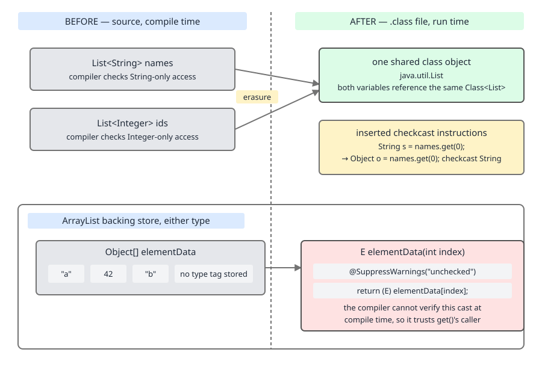
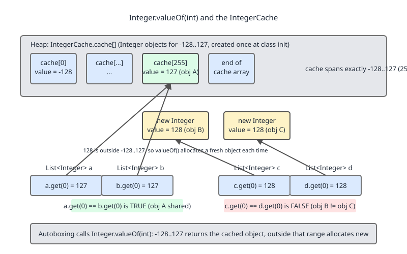

# 02 Java Collections — Ordering contracts — BASICS (§1.8 Generics and boxing as they bear on collections)

**Target version: Java 21 LTS.** | [Index](../00-index.md)
Previous: [contracts/03-equals-hashcode-jdk.md](03-equals-hashcode-jdk.md) · Next: [contracts/05-wildcards-and-pecs.md](05-wildcards-and-pecs.md)

Generics and boxing are the two compiler tricks that make `List<Integer>`
feel like a first-class numeric container when, underneath, the JVM has no
concept of `List<Integer>` and no boxed `int` in a register. This file
covers what the compiler actually inserts, what it costs at runtime, and
where that cost bites in interviews and production.

## 1.8.1–1.8.2 Type erasure and why `ArrayList` holds `Object[]`

### Mental model first

At the source level `List<String>` and `List<Integer>` look like different
types. At the class-file level they are the *same* class:
`java.util.ArrayList`, with one field `Object[] elementData`. The compiler
erases every type parameter to its bound (`Object` if unbounded) and inserts
casts at the call sites that need them. There is no `ArrayList<String>`
class file — there is one `ArrayList` class file plus compiler-generated
casts wherever you read from it.

### Why it exists

Generics (Java 5, 2004) landed on a JVM and stdlib that had shipped raw
collections since 1998. Erasure kept old bytecode binary-compatible with new
generic code — a pre-generics `.class` calling `List.add(Object)` still
links against generic `List<E>.add(E)`, since erasure makes them the same
signature. Reifying generics (the C# approach) would have needed a new
bytecode format and broken every existing JAR.

### When it matters / when it doesn't

Matters for reflection (nothing at runtime tells you `E` for a `List`
instance), for overloading (`void m(List<String>)` and `void
m(List<Integer>)` collide — same erasure), and for reading JDK source with
raw `Object[]` fields. Invisible in everyday `add`/`get` usage.

### How it works

`ArrayList<E>` cannot declare `private E[] elementData` and instantiate it
with `new E[cap]`, because `E` does not exist at runtime — `new E[cap]`
would need a runtime class token the JVM does not have. So the JDK declares
the backing field as `Object[]` and casts on the way out:

```java
// java.util.ArrayList, simplified
transient Object[] elementData;

@SuppressWarnings("unchecked")
E elementData(int index) {
    return (E) elementData[index];
}
```

The `@SuppressWarnings("unchecked")` on that cast is the whole trick made
visible: the JDK authors know the cast is unchecked and could theoretically
fail, but they have proven by construction (every `add` only ever stores an
`E`) that it never will *if you avoid raw types*. `[SOURCE]`

### Diagram



### Minimal concrete example

```java
import java.util.ArrayList;
import java.util.List;

void erasureDemo() {
    List<String> strings = new ArrayList<>();
    List<Integer> ints = new ArrayList<>();
    System.out.println(strings.getClass() == ints.getClass()); // true — same Class object
}
```

### The gotcha

`instanceof List<String>` does not compile — there is nothing at runtime to
check against beyond raw `List`. Only `instanceof List<?>` is legal, because
`?` has no erasure-time information to lose.

### Definition

> **Type erasure** is the compile-time removal of generic type parameters,
> replaced by their bound (or `Object`) in the emitted bytecode, with
> compiler-inserted casts at the sites that need the original type back.

## 1.8.3 Heap pollution and `@SafeVarargs`

**Heap pollution** is a state where a variable of a parameterized type
references an object that is not of that type — it happens when erasure lets
incompatible values sit side by side in the same erased array. Varargs of a
generic type (`static <T> List<T> listOf(T... args)`) create an array of
erased type `Object[]` under the hood; if the method internally stores into
that array in a way visible to the caller, you can leak heap pollution.
`List.of(...)` and `Arrays.asList(...)` are annotated `@SafeVarargs`
(available since Java 7) because the JDK authors have verified the varargs
array is never exposed or mutated unsafely — the annotation is a promise to
the compiler, not a fix. Without it, generic varargs methods produce an
"unchecked generic array creation" warning at every call site.

## 1.8.4 Raw types and the unchecked-warning cliff

A **raw type** is a generic type used without its type argument — `List`
instead of `List<String>`. Raw types exist solely for backward compatibility
with pre-Java-5 code; using one in new code is a code smell. A raw `List`
reference to a `List<String>` bypasses the compiler's type checking
entirely, so an `Integer` can enter a `List<String>` with only an unchecked
warning, no compile error:

```java
List<String> strings = new ArrayList<>();
List raw = strings;          // unchecked warning here
raw.add(42);                 // compiles! corrupts strings at runtime
String s = strings.get(0);   // ClassCastException, thrown far from the cause
```

The `ClassCastException` fires at the `get`, not the `add` — corruption and
failure land in different methods, sometimes different files. This is the
textbook case for treating "it compiled" as insufficient proof of
correctness whenever a raw type or unchecked warning is in play.

## 1.8.5 The diamond `<>` and target typing

The diamond operator (Java 7+) lets the compiler infer the constructor's
type argument from the target type — the variable, parameter, or return
type it's assigned to:

```java
Map<String, List<Integer>> m = new HashMap<>();   // infers <String, List<Integer>>
```

Pure compile-time sugar — no effect on erasure, boxing, or runtime
representation. It exists only to remove the redundancy of
`new ArrayList<String>()` when the left side already says `List<String>`.

## 1.8.6 Autoboxing on every `add`/`get`

### Mental model first

`List<Integer>` cannot hold `int` — generics only work over reference types,
because erasure needs a uniform `Object`-compatible representation. Every
`int` you `add` to a `List<Integer>` is autoboxed to an `Integer` at the
call site; every `Integer` you `get` back is, if assigned to an `int`,
auto-unboxed. The compiler inserts `Integer.valueOf(x)` and `.intValue()`
calls — you never see them in source, but they are in the bytecode.

### Why it exists

Autoboxing (Java 5) shipped alongside generics for exactly this reason:
generics erase to reference types, so without it, using primitives with
generic collections would need manual `new Integer(x)` / `x.intValue()` at
every call site. Autoboxing hides the ceremony; it does not remove the cost.

### When it's fine / when it isn't

Fine: small collections, config objects, anywhere readability trumps a few
thousand boxed values' overhead. Not fine: numeric hot loops — a
`Map<Integer,Integer>` accumulator rebuilds `Integer` objects on every put
outside the cache range (§1.8.7), and every `get` chases a pointer instead
of reading a primitive slot.

### How it works

```java
List<Integer> xs = new ArrayList<>();
xs.add(5);              // compiler emits: xs.add(Integer.valueOf(5))
int y = xs.get(0);      // compiler emits: int y = xs.get(0).intValue()
```

`Integer.valueOf` — not `new Integer(...)` — is what the compiler calls,
which is why the cache in §1.8.7 is reachable through ordinary autoboxing.

### The gotcha

Autoboxing is per element, not per collection — `list.add(i)` in a loop of
a million iterations is a million `Integer.valueOf` calls, most of which
(above 127) are genuine allocations.

### Definition

> **Autoboxing/unboxing** is the compiler-inserted conversion between a
> primitive type and its wrapper class, invoked automatically wherever a
> primitive is used where a reference type is expected, or vice versa.

## 1.8.7 The `Integer` cache

### Mental model first

`Integer.valueOf(int)` is not `new Integer(int)`. For the range −128..127 it
returns a **shared, pre-allocated instance** from a static cache; outside
that range it allocates a fresh `Integer` every call. `==` on two `Integer`
references compares identity, so two autoboxed values in the cached range
can look reference-equal by accident, and two outside it never will.

### Why it exists

Small integers are used constantly (loop counters, indices, small counts),
so the JDK trades a fixed, small footprint (256 pre-built objects) for
avoiding millions of redundant tiny allocations. A classic space-for-time
cache, sized to the range the JDK authors judged "common enough to matter."

### When it matters

Only when someone uses `==` instead of `.equals()` to compare boxed
values — which should never happen, but does, especially when code is
migrated from `int` to `Integer` and the `==` survives unnoticed. `[TRAP]`

### How it works

```java
// java.lang.Integer, simplified
private static class IntegerCache {
    static final Integer[] cache = new Integer[256]; // -128..127
    static { for (int i = 0; i < 256; i++) cache[i] = new Integer(i - 128); }
}

public static Integer valueOf(int i) {
    if (i >= -128 && i <= 127) return IntegerCache.cache[i + 128];
    return new Integer(i);
}
```

The cache upper bound can be raised with
`-XX:AutoBoxCacheMax=<N>` but is never lowered below 127, and the range is
not part of the `Integer` public API contract — relying on its exact bounds
in production code is relying on an implementation detail. `[X-REF 03]`

### Diagram



### Minimal concrete example

```java
void integerCacheDemo() {
    Integer a = 127, b = 127;
    System.out.println(a == b);        // true  — both from IntegerCache

    Integer c = 128, d = 128;
    System.out.println(c == d);        // false — both freshly allocated

    Integer e = 200, f = 200;
    System.out.println(e.equals(f));   // true  — always correct
}
```

### The gotcha

`list.get(0) == list.get(1)` on a `List<Integer>` can silently pass a test
suite when the stored values happen to be small, then break the moment
someone changes a fixture value to 200 — a bug that reproduces only outside
the cache range.

### Definition

> **The Integer cache** is a static pool of shared `Integer` instances for
> the range −128..127, returned by `Integer.valueOf` (and hence by
> autoboxing) instead of allocating a new object, making `==` comparisons on
> boxed integers in that range coincidentally succeed.

**Pitfall:** comparing boxed `Integer`s with `==` and trusting it because a
quick test in the −128..127 range passed.
**Insight:** `==` on any wrapper type is an identity check, never a value
check — always use `.equals()` or `Objects.equals()`, and this is exactly
why `Comparable`/`equals` overrides matter for boxed types (`[X-REF 03]`).
**Interview:** "why does `Integer a = 127; Integer b = 127; a == b` print
true but 128 print false" is a standard trap question — the correct answer
names the cache, its range, and states that relying on it is a bug, not a
feature.

## 1.8.8 Boxing cost in bytes and in indirection

### Mental model first

`int[]` is a single contiguous block of 4-byte slots. `List<Integer>` is an
array of *pointers* to separately heap-allocated `Integer` objects, each
carrying a full object header. Boxing does not just cost extra bytes — it
costs an extra memory indirection (a pointer chase) on every read, which
defeats CPU cache-line prefetching that a flat primitive array gets for
free.

### Why it exists

Not a cost-driven design choice — a structural consequence of erasure
(§1.8.1–1.8.2): generics only work over reference types, so any generic
collection of "integers" must hold boxed `Integer` references, never raw
`int`s.

### When it's fine / when it isn't

Fine for general-purpose code and moderate-sized collections where
readability outweighs a few percent of memory/CPU. Not fine for
numeric-heavy hot paths — large `int[]`-shaped datasets in
memory-constrained services, or tight-loop aggregations where
pointer-chasing dominates the runtime profile.

### How it works — the numbers

On a 64-bit JVM with compressed oops (the default up to ~32 GB heaps):

| Representation | Per-element cost | 1M elements |
|---|---|---|
| `int[]` | 4 bytes, inline | ~4 MB (+16 B array header) |
| `Integer` object (outside cache) | 16 bytes (12-byte header + 4-byte value, rounded to 8-byte alignment) | 16 MB objects |
| `List<Integer>`/`ArrayList` overhead | +4 bytes/element for the reference in the backing array | +4 MB |
| **Total for `List<Integer>`** | ~20 bytes/element | ~20 MB |

That is roughly **5x** the memory of the equivalent `int[]`, before
counting `ArrayList`'s own capacity slack. The 5x figure is the standard
number quoted for this trade-off; the exact bytes shift slightly with JVM
flags (compressed oops on/off, object alignment), but the order of
magnitude — object header dominating a 4-byte payload — does not.

### Diagram

![Boxing blow-up: int[] vs List<Integer>, ~5x memory](../diagrams/D-23-boxing-blowup.svg)

### Minimal concrete example

```java
int[] primitives = new int[1_000_000];          // ~4 MB
List<Integer> boxed = new ArrayList<>(1_000_000);
for (int i = 0; i < 1_000_000; i++) {
    boxed.add(i);                                 // ~20 MB once populated
}
```

### The gotcha

The 5x is a *floor*, not a ceiling — `ArrayList`'s growth strategy
over-allocates capacity (§1.8.10-adjacent topic, covered in the ArrayList
file), so a `List<Integer>` built with repeated `add()` and no
size-hinting constructor can carry meaningfully more overhead than the
back-of-envelope number above.

### Definition

> **Boxing cost** is the combined memory overhead of an object header per
> boxed primitive plus the reference-array indirection required to store
> boxed objects in a generic collection, roughly 5x the size of an
> equivalent primitive array for `int`/`Integer`.

> **Tradeoff, not fact:** `List<Integer>` costs about 5x the memory of
> `int[]` and adds a pointer-chase per access. The escape hatch when a hot
> path can't absorb that is a primitive-specialised collection (fastutil,
> Eclipse Collections) or a raw `int[]`/`List<int[]>` — not a rewrite of
> the whole codebase's collection choice.

## 1.8.9 `Map<Integer,Integer>` in a hot loop

A `HashMap<Integer,Integer>` used as a numeric accumulator pays boxing on
both key and value on every `put`/`get`/`merge`, plus `HashMap`'s own
per-entry node overhead (hash, key ref, value ref, next ref — commonly 32+
bytes/entry beyond the boxed objects). When profiling shows this as a
bottleneck, the standard mitigation is a primitive-specialised map from a
third-party library — the JDK never shipped primitive collection
specializations:

| Option | What it avoids | Cost |
|---|---|---|
| fastutil `Int2IntOpenHashMap` | boxing on key and value, `Map.Entry` node overhead | new dependency |
| Eclipse Collections `MutableIntIntMap` | same, plus a richer primitive-stream API | new dependency, different idiom |
| Hand-rolled `int[]`-based open addressing | everything, including library overhead | you own the bugs |

## 1.8.10 `List<int[]>` vs `List<List<Integer>>`

For 2-D numeric data, `List<int[]>` pays boxing once per *row* — the outer
`List` holds boxed references, but each row's numbers live in a flat,
unboxed `int[]`. `List<List<Integer>>` boxes every single number. For
anything beyond a handful of rows, `List<int[]>` is the practical middle
ground between full boxing and adopting a primitive-collections library,
at the cost of losing the richer `List` API on each row (no
`Collections.sort`, no `Comparator` composition — back to `Arrays` utility
methods).

```java
List<int[]> matrix = new ArrayList<>();   // each row: flat, unboxed
matrix.add(new int[]{1, 2, 3});
```

## 1.8.11 Unboxing NPE

### Mental model first

`Map<K, Integer>.get(key)` returns `null` for a missing key, not a
sentinel `int`. If that `null` is auto-unboxed into a primitive `int`, the
compiler's inserted `.intValue()` call throws `NullPointerException` — the
crash site is the unboxing, not the lookup, which is why the stack trace
alone under-explains the bug.

### Why it exists

A direct consequence of autoboxing's asymmetry: boxing a primitive never
fails, but unboxing a `null` reference always does — there is no primitive
representation of "no value." `getOrDefault`/`Optional`-shaped APIs exist
partly to sidestep this exact failure mode.

### When it bites

Any `Map<K, Integer>` (or `Long`, `Double`, ...) lookup assigned directly to
a primitive variable when the key might be absent — most of the time a
`Map` is used as a lookup rather than an iteration target. Boxing cost is
diagrammed in D-23 above; this is the runtime consequence of the same
null-vs-primitive boundary.

### How it works

```java
Map<String, Integer> counts = new HashMap<>();

int broken = counts.get("missing");           // null → .intValue() → NPE
int safe = counts.getOrDefault("missing", 0); // 0 — reference side, no unbox of null
```

### The gotcha

`counts.get(key) + 1` on a missing key NPEs during the implicit unboxing of
the `+`, not during the `.get()` call itself — easy to misdiagnose as a
"map bug" when it's an unboxing bug one expression later.

### Definition

> **Unboxing NPE** is a `NullPointerException` thrown when a `null`
> wrapper reference (most commonly from `Map.get` on a missing key) is
> implicitly unboxed into a primitive by compiler-inserted `.xxxValue()`
> call.

**Pitfall:** assigning `map.get(key)` straight into a primitive variable
without checking for a missing key.
**Insight:** `getOrDefault`, `computeIfAbsent`, and `Optional.ofNullable`
all exist to keep a possibly-missing value on the reference side of the
boxing boundary until you've decided what "absent" means numerically.
**Interview:** "why does `int x = map.get(k)` sometimes throw NPE" is
answered by naming the missing-key → `null` → auto-unbox chain, not by
blaming `HashMap`.

## 1.8.12 Generic method signatures you must be able to read

Collection APIs lean on bounded and wildcard-bounded type parameters that
look dense until you decompose them mechanically. The canonical example:

```java
<T extends Comparable<? super T>> void sort(List<T> list)
```

Read it left to right: `T` must implement `Comparable` for some
type that is `T` or a supertype of `T` — not necessarily `Comparable<T>`
itself. This is what lets you sort a `List<Dog>` when only `Animal`
(a superclass of `Dog`) implements `Comparable<Animal>` — `Dog` doesn't need
its own `Comparable<Dog>` if it inherits one from `Animal` via
`Comparable<? super Dog>`. `[X-REF 03]` This "consumer wildcard on a bound"
pattern is a specific instance of the PECS principle covered fully in the
next file.

## Pitfalls

- **Wrong:** `if (a == b)` to compare two `Integer` values. **Right:**
  `a.equals(b)` or `Objects.equals(a, b)` — `==` on wrappers is identity,
  and the −128..127 cache makes small values a false-positive trap.
- **Wrong:** `int x = map.get(key);` on a `Map` where `key` might be
  absent. **Right:** `int x = map.getOrDefault(key, 0);` — keep the
  possibly-null value on the reference side until you've picked a default.
- **Wrong:** assuming a raw-type assignment that "compiled fine" is safe.
  **Right:** treat every unchecked warning as a defect to fix, not noise to
  suppress — a raw `List` reference can insert the wrong type with no
  compile error, failing later and far away at an unrelated `get()`.

## Cheat sheet

| Concept | One-line takeaway |
|---|---|
| Type erasure | `List<String>`/`List<Integer>` are one class at runtime; compiler inserts casts |
| `ArrayList` backing store | `Object[]` + `@SuppressWarnings("unchecked")` cast in `elementData(int)` |
| Heap pollution | Erasure lets incompatible values share an erased array; `@SafeVarargs` is a verified promise, not a fix |
| Raw types | Bypass generic type checking entirely; unchecked warning now, `ClassCastException` later, elsewhere |
| Diamond `<>` | Compile-time-only inference from target type; no runtime effect |
| Autoboxing | Compiler-inserted `Integer.valueOf`/`.intValue()` on every primitive/reference boundary crossing |
| Integer cache | `−128..127` shared instances from `valueOf`; `==` "works" by accident in range, fails outside it |
| Boxing cost | ~5x memory of `int[]`, plus a pointer chase per access |
| Numeric hot loops | Prefer fastutil/Eclipse Collections primitive maps or raw arrays over `Map<Integer,Integer>` |
| `List<int[]>` | Boxes once per row instead of once per element — practical middle ground |
| Unboxing NPE | `map.get(missingKey)` → `null` → auto-unbox → `NullPointerException` |
| `<T extends Comparable<? super T>>` | `T` (or any supertype of `T`) must be `Comparable` |

## Self-test

<details><summary>Why can't `ArrayList<E>` declare its backing field as `E[]`?</summary>
`E` is erased at runtime — no class token exists for `new E[cap]`. The field
is `Object[]`, cast back to `E` (`@SuppressWarnings("unchecked")`) on read.
</details>

<details><summary>What does `@SafeVarargs` guarantee, and what does it not?</summary>
A promise the varargs array is never exposed to unsafe operations. It
suppresses the unchecked warning but adds no runtime check — a wrong
`@SafeVarargs` on an unsafe method still compiles.
</details>

<details><summary>Why does `Integer a = 127, b = 127; a == b` print `true` but `200` prints `false`?</summary>
`Integer.valueOf` returns a shared cached instance for `-128..127`, a fresh
object outside it. `==` is identity, so only cached values coincide.
Implementation detail, not a guarantee — always use `.equals()`.
</details>

<details><summary>Roughly how much more memory does `List<Integer>` use than `int[]` for a million elements?</summary>
About 5x — `int[]` is ~4 bytes/element inline; `List<Integer>` pays a
~16-byte header per boxed `Integer` plus a 4-byte reference per slot.
</details>

<details><summary>Why does `int x = map.get(missingKey);` throw NPE instead of returning a default?</summary>
`Map.get` returns `null` for an absent key; assigning to a primitive forces
the compiler's `.intValue()` unboxing call, which throws on `null`. Use
`getOrDefault`.
</details>

<details><summary>What does `<T extends Comparable<? super T>>` allow that `<T extends Comparable<T>>` would not?</summary>
`T` can satisfy the bound via a `Comparable` implemented by a *supertype* —
e.g. sorting `List<Dog>` when only `Animal` implements `Comparable<Animal>`.
</details>

<details><summary>Is a raw-type assignment that compiles without error necessarily safe?</summary>
No. It bypasses compile-time checking on inserts with only an unchecked
warning; the failure surfaces later as a `ClassCastException` elsewhere.
</details>

<details><summary>Why is `List<int[]>` sometimes preferred over `List<List<Integer>>`?</summary>
It boxes once per row instead of once per element — a middle ground that
avoids full boxing without adopting a primitive-collections library.
</details>

---

**Leaves covered:** 1.8.1–1.8.12 (12 leaves)
**Leaves deferred:** none
**Diagrams included:** D-21, D-22, D-23
**Target version:** Java 21 LTS
**Lines:**      540
