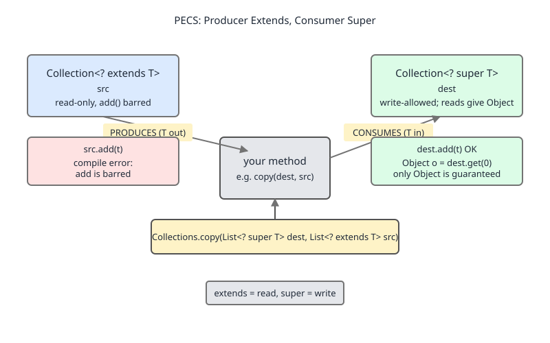
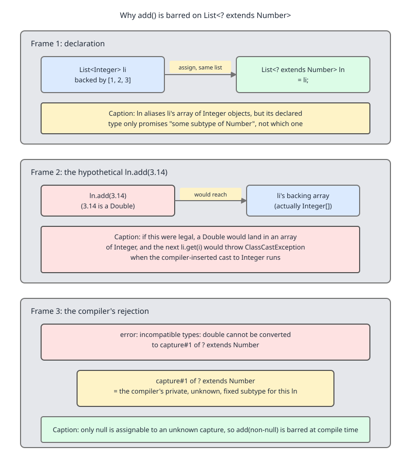

# 02 Java Collections — Ordering contracts — INTERMEDIATE (§2.5 Wildcards and PECS as the Collections API uses them)

**Target version: Java 21 LTS.** | [Index](../00-index.md)
Previous: [contracts/04-generics-and-boxing.md](04-generics-and-boxing.md) · Next: [iteration/01-basics-iteration.md](../iteration/01-basics-iteration.md)

You already know the mnemonic: Producer `extends`, Consumer `super` — PECS. What you likely cannot yet do is open `java.util.Collections` and explain, signature by signature, why each wildcard sits where it does. That is the entire job of this file: take real JDK method signatures and derive the wildcard from the contract they must satisfy, not the other way around.

## §2.5.1 — PECS itself, and where it actually comes from

### The mnemonic, derived rather than recited

**Mental model.** A generic type parameter site is either a *source* the method reads from, or a *sink* the method writes into. If a parameter is a source — the method only ever pulls values out of it — the caller should be allowed to hand over a collection of any subtype, because pulling a `Number` out of a `List<Integer>` is always safe: an `Integer` *is-a* `Number`. If a parameter is a sink — the method pushes values into it — the caller should be allowed to hand over a collection of any supertype, because pushing an `Integer` into a `List<Number>` is always safe: the slot can hold anything that is-a `Number`.

**Why it exists.** Without wildcards, a method declared `void addAll(Collection<E> c)` can only accept a `Collection<E>` exactly — not a `Collection<Integer>` when `E` is `Number`, even though every `Integer` is safely a `Number`. Generics are invariant (§2.5.8), so without an escape hatch the API would be far more restrictive than the type system it sits on top of actually requires.

**When to reach for `extends` vs `super` vs neither.** If the type parameter is read-only in the method body, use `? extends T` (producer). If it is write-only, use `? super T` (consumer). If the method both reads elements out and expects to write the *same* concrete type back in — e.g. `void reverse(List<T> list)`, which swaps elements it read from the same list — leave it invariant; PECS does not apply because the parameter is both source and sink of the *same* value.

**How it works.** `? extends T` means "some unknown subtype of `T`" — the compiler lets you *read* a `T` (any subtype is safely widened to `T`) but forbids you from *writing* anything except `null`, because it does not know the exact subtype, so it cannot verify any write is type-safe (worked in full in §2.5.9). `? super T` is the mirror: the compiler lets you *write* a `T` (safely narrowed into any supertype's slot) but any *read* comes back typed only as `Object`, because the only thing every supertype of `T` up to `Object` guarantees is that it holds an `Object`.

`[X-REF 03]` Wildcards are Java's *use-site* variance mechanism — variance is declared per call, not baked into the class the way Kotlin's `out`/`in` or C#'s declaration-site variance bake it into the class definition. The full comparison of declaration-site vs. use-site variance, and why Java's designers chose use-site, belongs to the generics-as-a-language-feature guide (`src/topics/03-*`, "Java core"); this file only needs the consequence, which is that every collection method must opt into variance individually, and that is why you see `? extends`/`? super` scattered across `java.util` rather than baked into `List<T>` itself.



```java
// Producer: only ever reads T out. extends is correct and sufficient.
static double sum(Collection<? extends Number> nums) {
    double total = 0.0;
    for (Number n : nums) total += n.doubleValue();   // read as Number: fine
    // nums.add(1);  // would not compile — see §2.5.9
    return total;
}

// Consumer: only ever writes T in. super is correct and sufficient.
static void fillWithZero(Collection<? super Integer> sink, int count) {
    for (int i = 0; i < count; i++) sink.add(0);       // write Integer: fine
    // Integer x = sink.iterator().next();  // would not compile: only Object comes out
}
```

**Interview:** "State PECS and justify it, don't just recite it." Answer: producer extends because reading a subtype as its supertype is always safe (covariant read); consumer super because writing a subtype into a supertype's slot is always safe (contravariant write); invariant when the same parameter is both.

> **Definition:** PECS says a wildcard-typed parameter should be `? extends T` if the method only reads `T` values from it, and `? super T` if the method only writes `T` values into it, because those are exactly the directions in which the substitution stays type-safe.

## §2.5.2 — `Collection.addAll(Collection<? extends E>)`

**Signature (`java.util.Collection<E>`, Java 21):**
```java
boolean addAll(Collection<? extends E> c);
```
**Why `extends`:** the method only *reads* elements out of `c` to insert them into `this`. `c` is a pure producer.

**What breaks without it:** if the signature were `addAll(Collection<E> c)`, then given `List<Number> nums` you could not call `nums.addAll(someListOfIntegers)` — `List<Integer>` is not a `List<Number>` (§2.5.8), so an invariant signature would reject a call that is obviously safe.

```java
List<Number> nums = new ArrayList<>();
List<Integer> ints = List.of(1, 2, 3);
nums.addAll(ints);          // compiles only because addAll takes Collection<? extends E>
```

## §2.5.3 — `Collections.copy(List<? super T> dest, List<? extends T> src)`

This is PECS carried in a single line: `src` is the producer (`extends`), `dest` is the consumer (`super`).

**Signature (`java.util.Collections`, Java 21):**
```java
static <T> void copy(List<? super T> dest, List<? extends T> src);
```

Walk it element by element:
- `src` is read-only in the method body — each element is pulled out and written into `dest` — so it is `? extends T`.
- `dest` is write-only — each slot is overwritten with an element pulled from `src` — so it is `? super T`.
- `T` itself is inferred from `src`'s element type, and `dest`'s wildcard only needs to be able to *accept* that type, not equal it exactly.

**What breaks with the wildcards removed:** `copy(List<T> dest, List<T> src)` would force `dest` and `src` to share the exact same type argument. `Collections.copy(new ArrayList<Object>(), List.of("a", "b"))` — a completely safe call, copying `String`s into a `List<Object>` — would not compile, because `List<Object>` and `List<String>` are unrelated types under invariance.

```java
List<Object> dest = new ArrayList<>(Collections.nCopies(3, null));
List<String> src = List.of("x", "y", "z");
Collections.copy(dest, src);      // T inferred as String; dest accepts because Object super String
```

**Precondition worth knowing (not a wildcard point, a runtime one):** `dest.size()` must be `>= src.size()` or the call throws `IndexOutOfBoundsException` — `copy` overwrites existing slots, it does not grow the list. That belongs to `Collections.copy` the utility method in its own right; see `../utilities/01-collections-and-arrays.md` for the full method (including its `RandomAccess`-driven implementation branch).

## §2.5.4 — `Comparator<? super T>` in `sort`, `TreeMap`, `PriorityQueue`

### Why a comparator parameter is a consumer of `T`, not a producer

**Mental model.** A `Comparator<Date>` is a machine that knows how to order two `Date`s. Handing it two `Timestamp`s (a `Date` subtype) is perfectly safe — the machine only needs `Date`-level behavior to do its job. So a method that *sorts a `List<Timestamp>`* should happily accept a `Comparator<Date>`: the comparator is being *fed* `Timestamp` values, i.e., the method writes `T` into the comparator's `compare` calls. That makes the comparator parameter a consumer of `T`, and PECS says consumer takes `super`.

**Why it exists.** Comparators are naturally written against a general type once and reused for every subtype — a `Comparator<Object>` that orders by `toString()`, say, should work for `List<String>`, `List<Integer>`, anything. Without `? super T`, every subtype would need its own copy of the same comparator logic re-typed to match exactly.

**When it doesn't apply:** a `Comparable<T>` (as opposed to `Comparator`) is implemented *by* `T` itself, not handed in from outside, so there is no wildcard to add there — that shape is handled by the bound in §2.5.5, not by a wildcard parameter.

**How it works — three real signatures, same shape:**
```java
// List<E>
void sort(Comparator<? super E> c);

// TreeMap<K,V> constructor
TreeMap(Comparator<? super K> comparator);

// PriorityQueue<E> constructor
PriorityQueue(int initialCapacity, Comparator<? super E> comparator);
```
In each, `T`/`E`/`K` is written *into* the comparator (the comparator consumes it via `compare(a, b)`), and the comparator's own type parameter must therefore be `T` or any supertype — hence `super`.

**What breaks without `? super`:** `void sort(Comparator<E> c)` on `List<Timestamp>` would reject a `Comparator<Date>`, even though comparing two `Timestamp`s using `Date`-level rules is exactly what you asked for and is completely safe.

```java
class Event implements Comparable<Event> {
    final Date occurredAt;
    Event(Date occurredAt) { this.occurredAt = occurredAt; }
    public int compareTo(Event o) { return occurredAt.compareTo(o.occurredAt); }
}

Comparator<Date> byDateOnly = Comparator.naturalOrder();
List<Timestamp> stamps = new ArrayList<>(List.of(new Timestamp(200), new Timestamp(100)));
stamps.sort(byDateOnly);   // compiles: Comparator<? super Timestamp> accepts Comparator<Date>
```

**Gotcha:** the comparator's `compare` method still only ever *sees* `Date` behavior, never `Timestamp`-specific behavior — if `Timestamp` added nanosecond precision that `Date.compareTo` ignores, a `Comparator<Date>` would silently ignore it too. `super` buys you reuse, not extra precision.

> **Definition:** `Comparator<? super T>` accepts a comparator written for `T` or any of its supertypes, because the method only ever feeds `T` values into the comparator — a consumer role, which is why PECS assigns it `super`.

## §2.5.5 — Unpacking `<T extends Comparable<? super T>>` `[PROVE]`

This is the bound on `Collections.sort`, `Collections.max`, and `Collections.min`. It looks dense; unpack it one layer at a time and justify each layer against a case that breaks without it.

**Layer 1 — why `T extends Comparable<T>>` is not enough.**

Define a two-class hierarchy:
```java
class Shape implements Comparable<Shape> {
    final double area;
    Shape(double area) { this.area = area; }
    public int compareTo(Shape o) { return Double.compare(area, o.area); }
}

class Circle extends Shape {
    Circle(double radius) { super(Math.PI * radius * radius); }
}
```
`Circle` does **not** implement `Comparable<Circle>` — it inherits `Comparable<Shape>` from `Shape`. `Circle` is `Comparable<Shape>`, not `Comparable<Circle>`.

Now suppose `Collections.sort` were declared:
```java
static <T extends Comparable<T>> void sort(List<T> list);   // hypothetical, wrong
```
Call it with `List<Circle>`. The compiler must find a `T` such that `Circle` satisfies `T extends Comparable<T>`. Try `T = Circle`: does `Circle` implement `Comparable<Circle>`? No — it implements `Comparable<Shape>`. **Rejected.** There is no other candidate `T` that both equals `Circle` (needed for the `List<T>` to be `List<Circle>`) and matches `Comparable<T>`. The hypothetical signature cannot sort `List<Circle>` at all, even though every `Circle` is perfectly comparable via its inherited `compareTo`.

**Layer 2 — `? super T` admits exactly this case.**

The real signature:
```java
static <T extends Comparable<? super T>> void sort(List<T> list);
```
Instantiate `T = Circle`. The bound requires `Circle extends Comparable<? super Circle>` — i.e., `Circle` must implement `Comparable` of *some supertype of `Circle`*. `Shape` is a supertype of `Circle`, and `Circle` (via inheritance) implements `Comparable<Shape>`. `Shape` matches `? super Circle`. **Bound satisfied.**

```java
List<Circle> circles = new ArrayList<>(List.of(new Circle(3), new Circle(1), new Circle(2)));
Collections.sort(circles);   // compiles: Circle extends Comparable<Shape>, Shape super Circle
```

The same reasoning applies to the textbook JDK pair `java.sql.Timestamp extends java.util.Date`, where `Date implements Comparable<Date>` and `Timestamp` inherits that `Comparable<Date>` rather than declaring its own `Comparable<Timestamp>` — `List<Timestamp>` is only sortable by `Collections.sort` because the bound accepts `Comparable<? super Timestamp>`, and `Date` qualifies.

**Real signatures, verified against `java.util.Collections` (Java 21):**
```java
static <T extends Comparable<? super T>> void sort(List<T> list);
static <T extends Comparable<? super T>> T max(Collection<? extends T> coll);
static <T extends Comparable<? super T>> T min(Collection<? extends T> coll);
```

**Interview:** "Why isn't `T extends Comparable<T>` sufficient?" Answer: it fails for any type that inherits its `compareTo` from a superclass rather than implementing `Comparable` of itself directly — `? super T` widens the requirement to "comparable against itself or anything above it," which is what inheritance of `compareTo` actually produces.

> **Definition:** `<T extends Comparable<? super T>>` requires that `T` be comparable to itself *or to any of its supertypes* — because a type may satisfy `Comparable` only through an inherited implementation typed against an ancestor, not against itself.

## §2.5.6 — `Collections.max(Collection<? extends T>, Comparator<? super T>)`

Two wildcards, two different reasons, in one signature:

```java
static <T> T max(Collection<? extends T> coll, Comparator<? super T> comp);
```

- `coll` is a producer — `max` only reads elements out of it — so `? extends T` (same reasoning as §2.5.2/2.5.3).
- `comp` is fed `T` values to compare — a consumer — so `? super T` (same reasoning as §2.5.4).

**What breaks with both removed:** `max(Collection<T> coll, Comparator<T> comp)` would reject `Collections.max(listOfIntegers, comparatorOfNumbers)` even though comparing `Integer`s with `Number`-level logic and reading them out of a plain `Collection` are both obviously safe. The two-wildcard form is the composition of §2.5.2's producer rule and §2.5.4's consumer rule applied to the same type variable in one call.

```java
List<Integer> scores = List.of(3, 9, 1, 7);
Comparator<Number> byValue = Comparator.comparingDouble(Number::doubleValue);
int top = Collections.max(scores, byValue);   // T inferred as Integer
```

## §2.5.7 — Unbounded `Collection<?>` and what you can still call on it

`Collection<?>` means "a collection of some fixed but unknown type." It is shorthand for `Collection<? extends Object>` — a pure producer of `Object`, with no consumer side at all (not even `? super Object`, since `Object` is already the top).

| Member | Allowed? | Why |
|---|---|---|
| `size()`, `isEmpty()` | Yes | Do not touch element type. |
| `clear()` | Yes | Removes everything; never needs to know the element type. |
| `contains(Object o)` | Yes | Parameter is `Object`, not `E` — always safe to call. |
| `remove(Object o)` | Yes | Same reason as `contains`. |
| `iterator()` | Yes, yields `Object` | Compiler only knows "some type," so widens every read to `Object`. |
| `for (Object x : coll)` | Yes | Same as above — the loop variable can only be declared `Object`. |
| `add(E e)` | No, except `add(null)` | Compiler cannot verify any non-null value matches the unknown captured type (full proof in §2.5.9, same argument as `? extends`). |
| `addAll(Collection<?> c)` | No | Same barrier — the source's captured type is unknown too. |

**Insight:** `Collection<?>` is strictly more restrictive on writes than `Collection<? extends Number>` is on writes — both bar everything except `null` — but `Collection<?>` is what you reach for when you don't even care what the element type *is*, only that you can read it as `Object` or call type-erased methods like `size()`.

## §2.5.8 — `List<Object>` is not a supertype of `List<String>` `[TRAP]`

**Pitfall:** the wrong belief is that generics behave like arrays — that because `String` is-a `Object`, `List<String>` must be-a `List<Object>`. It is not; generics are invariant.

**The array version — compiles, fails at runtime:**
```java
Object[] a = new String[1];   // legal: arrays are covariant
a[0] = 42;                    // compiles (Object slot), throws at runtime
// java.lang.ArrayStoreException: java.lang.Integer
```
This is the exact covariance hole documented as the framework's founding motivation for generics in `../framework/01-basics-why-and-hierarchy.md` — arrays remember their runtime component type and throw when violated; this file picks up the story from the *caller's* side of a generic API.

**The generic version — fails at compile time instead:**
```java
List<Object> objs = new ArrayList<String>();   
// compile error: incompatible types:
// ArrayList<String> cannot be converted to List<Object>
```
There is no runtime exception here because the compiler refuses the assignment outright — generics trade the array's late (runtime) failure for an early (compile-time) one, at the cost of being unable to express "any list of some subtype of `Object`" with a plain type.

**The fix:** `List<? extends Object>` (equivalently, just `List<?>`) *is* a valid supertype of `List<String>`, because it says "a list of *some* type that is-a `Object`," not "a list whose type argument is exactly `Object`."

```java
List<? extends Object> objs = new ArrayList<String>();   // compiles
```

**Why people believe it:** arrays really are covariant, and most engineers meet arrays before they meet generics — the intuition carries over and turns out to be wrong precisely because generics were designed to close the hole arrays leave open.

## §2.5.9 — Why you cannot `add` to a `List<? extends Number>` `[PROVE]`

Assume the opposite and derive the contradiction.

```java
List<Integer> li = new ArrayList<>();
li.add(1);
List<? extends Number> ln = li;    // legal: Integer is-a Number, producer view
// ln.add(3.14);                   // suppose, hypothetically, this compiled
```

If `ln.add(3.14)` compiled, the `Double` `3.14` would be inserted into the very same list object that `li` still references — `ln` and `li` are two references to one `ArrayList`. After that call, `li.get(0)` — an expression the compiler has typed as `Integer` — would actually return a `Double` at runtime. The compiler inserts an implicit `checkcast` at every generic read (this is erasure, covered fully in `04-generics-and-boxing.md`), so `Integer x = li.get(0);` would throw `ClassCastException: class java.lang.Double cannot be cast to class java.lang.Integer` — on a line of source code that contains no visible cast at all. That would violate Java's compile-time type-safety guarantee (a well-typed program should not throw `ClassCastException` from code the compiler accepted without warning). Therefore the compiler must reject `ln.add(3.14)` before this contradiction can ever arise.

**The actual compiler error (`javac`, Java 21):**
```
error: incompatible types: double cannot be converted to CAP#1
    ln.add(3.14);
          ^
  where CAP#1 is a fresh type-variable:
    CAP#1 extends Number from capture of ? extends Number
```

**The one thing you *can* pass:** `ln.add(null)` compiles, because `null` is a member of every reference type — it introduces no type it could ever be wrong about.

```java
ln.add(null);   // compiles; adds a null Number reference
```

**Why the compiler must be this conservative:** it does not know the *exact* runtime type behind `? extends Number` — only that it is *some* subtype. Any concrete value you try to pass (a `Double`, an `Integer`, even a `Number`) might not match whatever that unknown subtype actually is, so the only universally safe value is one that has no type of its own to mismatch.

> **Definition:** `add` is barred on `List<? extends Number>` because the wildcard names an unknown-but-fixed subtype captured for the expression, and no concrete value — other than `null` — can be proven to match a type the compiler cannot see.



## §2.5.10 — `Map<String, ? extends Number>` in real API design

**The shape:** a method that only *reads* the numeric values of a map — say, to sum them — should accept `Map<String, ? extends Number>`, not `Map<String, Number>`.

```java
static double totalOf(Map<String, ? extends Number> balances) {
    double total = 0.0;
    for (Number n : balances.values()) total += n.doubleValue();
    return total;
}
```

**What breaks with the narrower signature:** `static double totalOf(Map<String, Number> balances)` would reject a call with `Map<String, Integer>` — a completely ordinary shape for, say, a map of account IDs to integer cent balances — because `Map<String, Integer>` is not a `Map<String, Number>` under invariance (same rule as §2.5.8, applied to a map's value type instead of a list's element type).

```java
Map<String, Integer> cents = Map.of("acct-1", 500, "acct-2", 1200);
totalOf(cents);   // compiles only because the parameter is Map<String, ? extends Number>
```

**The counterpart rule for return types — do not return a wildcard type.** A method declared to *return* `Map<String, ? extends Number>` pushes the capture problem onto every caller: the caller receives a value it cannot write into (the same `add`-is-barred restriction from §2.5.9, now on `put`), and cannot even name the exact type to declare a variable for further generic use without going through `?` again. Producer-extends is a rule for *input* parameters; a returned collection should almost always be the sharpest concrete or invariant type the method actually produces, so the caller regains full read/write capability.

## §2.5.11 — Reading capture conversion in a `javac` error

Take the error from §2.5.9 apart clause by clause:

```
error: incompatible types: double cannot be converted to CAP#1
    ln.add(3.14);
          ^
  where CAP#1 is a fresh type-variable:
    CAP#1 extends Number from capture of ? extends Number
```

- **`capture of ? extends Number`** — the compiler cannot reason about a wildcard directly at a call site, so it invents a fresh, single, fixed type variable — here named `CAP#1` — to stand in for "whatever the real unknown subtype of `Number` is," for the duration of evaluating this one expression. This process is called *capture conversion*.
- **`CAP#1 extends Number`** — the invented variable inherits the wildcard's bound, so the compiler still knows it is *some* `Number` subtype, just not which one.
- **Why the message names a type the source never wrote** — `CAP#1` appears nowhere in your code; it is compiler-internal bookkeeping surfaced in the diagnostic because the actual reason for rejection ("double is not a subtype of the unknown captured type") cannot be stated without naming the placeholder.
- **What to change to fix it** — you cannot "fix" a capture error by casting your way around it safely (a cast to `(Number) 3.14` still fails for the same underlying reason, just later or with a raw-type warning). The real fix is structural: either don't call a mutator on a `? extends` reference (use `? super` if you truly need to write), or narrow the declared type back to the concrete `List<Integer>` at the point where you need to mutate it.

**Interview:** "You see `capture of ? extends E` in a compiler error — what does that tell you, and what do you do?" Answer: it tells you code tried to write into a wildcard-typed reference that the compiler can only read from; fix by either switching the parameter to `? super` if a write is genuinely needed, or by holding a reference to the concrete invariant type at the call site instead of the wildcard type.

## Scope notes

Erasure, heap pollution, raw types, and the `Integer` cache/boxing rules that this file's `[PROVE]` in §2.5.9 leans on for "the compiler inserts a checkcast" live in `04-generics-and-boxing.md` (`Previous`, above) — read that first if the checkcast claim in §2.5.9 felt unmotivated. Array covariance as the framework's founding motivation for generics is in `../framework/01-basics-why-and-hierarchy.md`. `Collections.copy`, `max`, and `min` as utility methods in their own right — signatures beyond the wildcard shape, plus their `RandomAccess` fast paths — are in `../utilities/01-collections-and-arrays.md`. Comparator combinators (`thenComparing`, `reversed`, `nullsFirst`) and the ordering contract itself are in `01-ordering.md`. Declaration-site vs. use-site variance as a language-design choice, and why Java picked use-site wildcards over C#/Kotlin-style declaration-site variance, is covered in the generics chapter of guide 03 ("Java core", `src/topics/03-*`) — this file only needed the consequence (§2.5.1's `[X-REF 03]`), not the full design history. Why type erasure forces libraries like Jackson to use a `TypeReference` token to recover generic type information at runtime is covered in guide 12 ("API design").

## Pitfalls

### Believing `List<Object>` is a supertype of `List<String>`

**Wrong**
```java
List<Object> objs = new ArrayList<String>();
// error: incompatible types: ArrayList<String> cannot be converted to List<Object>
```

**Right**
```java
List<? extends Object> objs = new ArrayList<String>();   // compiles
```

**Why people believe it:** arrays are genuinely covariant (`Object[] a = new String[1];` compiles), and most engineers meet array covariance before generics, so the intuition transfers — incorrectly, since generics were deliberately made invariant to catch the mismatch at compile time instead of at runtime.

### Trying to `add` a concrete value to a `List<? extends Number>`

**Wrong**
```java
List<? extends Number> ln = new ArrayList<Integer>();
ln.add(3.14);   // error: incompatible types: double cannot be converted to CAP#1
```

**Right**
```java
List<Integer> li = new ArrayList<>();
li.add(3);                 // mutate through the concrete, invariant reference
List<? extends Number> ln = li;    // then widen for read-only use
```

**Why people believe it:** `3.14` is a `Number`, and the list is declared as holding "some kind of `Number`," so it looks like it should fit — the belief ignores that the wildcard hides the *exact* subtype, and the compiler must protect every possible concrete subtype behind it, not just the one you happen to be thinking of.

## Cheat sheet

| Situation | Wildcard | Rule |
|---|---|---|
| Method only reads `T` out | `? extends T` | Producer — PECS |
| Method only writes `T` in | `? super T` | Consumer — PECS |
| Method reads and writes the same value | none (invariant `T`) | PECS doesn't apply |
| `Collection.addAll` parameter | `? extends E` | Source is pure producer |
| `Collections.copy` dest / src | `super T` / `extends T` | Both wildcards, one signature |
| `List.sort`, `TreeMap`, `PriorityQueue` comparator | `Comparator<? super T>` | Comparator consumes `T` |
| `Collections.sort/max/min` bound | `T extends Comparable<? super T>` | Admits inherited `compareTo` |
| Unbounded wildcard | `Collection<?>` | `size/clear/contains/remove` OK; `add` barred except `null` |
| `List<Object>` vs `List<? extends Object>` | invariant vs. covariant | Only the second is a supertype of `List<String>` |
| `add` on `? extends` | barred except `null` | No value is provably safe for an unknown subtype |
| Return type shape | avoid wildcards | Wildcard returns push capture problems onto every caller |
| `capture of ? extends E` in an error | compiler-invented placeholder | Names the unknown-but-fixed type for one expression |

## Self-test

**Q1.** Why does `Collection.addAll` take `Collection<? extends E>` instead of `Collection<E>`?

<details><summary>Answer</summary>

Because `addAll` only reads elements out of the argument to insert them — a producer role. `? extends E` lets you pass a `Collection` of any subtype of `E` (e.g., a `List<Integer>` into a method expecting to add to a `List<Number>`), which an invariant `Collection<E>` parameter would reject even though the call is type-safe.

</details>

**Q2.** Why does `List.sort` take `Comparator<? super E>` rather than `Comparator<E>`?

<details><summary>Answer</summary>

The comparator is a consumer — the method feeds it `E` values via `compare(a, b)`. A `Comparator<Date>` is safe to use for sorting `List<Timestamp>` because comparing by `Date`-level rules on `Timestamp` values is safe; `super` lets a comparator written against a general type be reused for every subtype, which is the entire point of writing it against the general type in the first place.

</details>

**Q3.** Why is `T extends Comparable<T>` insufficient as the bound for `Collections.sort`?

<details><summary>Answer</summary>

Some types satisfy `Comparable` only through an inherited implementation typed against an ancestor — e.g., a subclass that never overrides `compareTo` implements `Comparable<Superclass>`, not `Comparable<Subclass>`. Instantiating `T` as the subclass fails the plain `Comparable<T>` bound because the subclass does not implement `Comparable` of itself. `Comparable<? super T>` widens the requirement to "comparable to itself or any supertype," which the inherited implementation satisfies.

</details>

**Q4.** What is the one value you can always pass to `add` on a `List<? extends Number>`, and why?

<details><summary>Answer</summary>

`null`. The compiler cannot verify that any concrete value matches the unknown captured subtype behind the wildcard, but `null` is a member of every reference type, so it introduces no type that could ever mismatch.

</details>

**Q5.** Is `List<Object>` a supertype of `List<String>`? What is?

<details><summary>Answer</summary>

No — generics are invariant, so `List<Object>` and `List<String>` are unrelated types; assigning an `ArrayList<String>` to a `List<Object>` variable is a compile error. `List<? extends Object>` (equivalently `List<?>`) is a valid supertype of `List<String>`, because it names "some type that is-a `Object`" rather than "exactly `Object`."

</details>

**Q6.** In `Collections.copy(List<? super T> dest, List<? extends T> src)`, why does `dest` get `super` and `src` get `extends`?

<details><summary>Answer</summary>

`src` is read-only in the method (elements are pulled out) — a producer, so `extends`. `dest` is write-only (elements are written in) — a consumer, so `super`. `T` is inferred from `src`, and `dest`'s wildcard only needs to be able to accept that inferred type, not equal it exactly.

</details>

**Q7.** What can you still call on a `Collection<?>`, given that `add` is barred?

<details><summary>Answer</summary>

Anything that does not require knowing the element type: `size()`, `isEmpty()`, `clear()`, `contains(Object)`, `remove(Object)` (all take/return `Object` or nothing), and `iterator()`/for-each, which yields elements typed as `Object`. Only writes of a non-null, type-specific value are barred.

</details>

**Q8.** Why should a method avoid *returning* a wildcard type like `Map<String, ? extends Number>`?

<details><summary>Answer</summary>

A caller receiving a wildcard-typed value inherits the same restrictions the producer/consumer analysis places on parameters — it cannot write into the result (same barrier as `add` on `? extends`), pushing the capture problem onto every caller instead of resolving it once inside the method. Return types should be the sharpest concrete or invariant type the method actually produces.

</details>

**Q9.** What does `capture of ? extends Number` mean in a `javac` error, and why does the message reference a type your code never wrote?

<details><summary>Answer</summary>

The compiler cannot reason about the wildcard `? extends Number` directly, so at the point of use it invents a fresh, fixed placeholder type variable (e.g., `CAP#1`) to stand in for "whichever specific subtype this is, for this one expression" — that placeholder appears in the diagnostic because the rejection reason must name some type, and the only one available is the compiler's own invented capture variable.

</details>

**Q10.** Why does a `Comparator<Date>` work for sorting a `List<Timestamp>`, but a hypothetical invariant `Comparator<T>` parameter would not accept it?

<details><summary>Answer</summary>

`Timestamp extends Date`, so `Date` is a supertype of `Timestamp`; the comparator only needs `Date`-level behavior to compare two `Timestamp`s, which is always safe. An invariant `Comparator<T>` parameter would require the comparator's type argument to be exactly `Timestamp`, rejecting the perfectly safe, more general `Comparator<Date>` — exactly the gap `? super T` is designed to close.

</details>

---

**Leaves covered:** 2.5.1–2.5.11 (11 leaves)
**Leaves deferred:** none
**Diagrams included:** D-40, D-41
**Target version:** Java 21 LTS
**Lines:**      458
