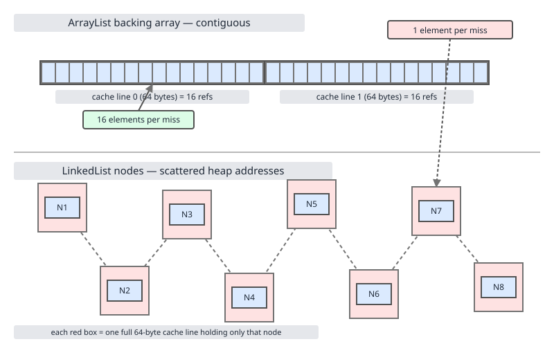

# 02 Java Collections — Cost and memory — INTERMEDIATE (§2.1 The master cost table)

**Target version: Java 21 LTS.** | [Index](../00-index.md)
Previous: [sequenced-collections/01-sequenced-collections.md](../sequenced-collections/01-sequenced-collections.md) · Next: [cost-and-memory/02-internals-memory-headers.md](02-internals-memory-headers.md)

Every earlier file in this note set built one implementation at a time; this file inverts the view and lays every operation against every implementation side by side, because interview questions and production incidents both live in the gaps between "O(1)" and "O(1) amortised, expected, until a hash collision chain treeifies" — the table below is the thing you should be able to redraw from memory before walking into a system-design or coding round.

## Hierarchy before details

| Family | Representative types | One-sentence cost profile |
|---|---|---|
| Array-backed list | `ArrayList` | O(1) random access and tail append (amortised), O(n) shifting for head/middle mutation |
| Linked list (doubly linked) | `LinkedList` | O(1) at either end and at a held iterator position, O(n) to reach an arbitrary index |
| Circular-buffer deque | `ArrayDeque` | O(1) amortised at both ends, no node overhead, but no middle access at all |
| Hash table | `HashMap`, `HashSet` | Expected O(1) for key operations, degrades to O(log n) per bucket after treeification, O(n) under hostile collisions |
| Red-black tree | `TreeMap`, `TreeSet` | Guaranteed O(log n) for everything, including ordered range queries `floorKey`/`ceilingKey` that hashing cannot offer at all |
| Binary heap | `PriorityQueue` | O(1) peek, O(log n) offer/poll, O(n) arbitrary `remove(Object)` |
| Copy-on-write | `CopyOnWriteArrayList` | O(1) reads with zero locking, O(n) on every single mutation because the whole backing array is copied |
| Concurrent hash table | `ConcurrentHashMap` | Expected O(1) per-key ops under lock striping, `size()` is an O(1) estimate not a guarantee |
| Skip list | `ConcurrentSkipListMap` | O(log n) expected for ordered concurrent access, the concurrent analogue of `TreeMap` |

## 2.1.1–2.1.2 The master table, and the list rows in full

Leaf 2.1.1 asks for one table of every operation against every implementation, with the amortised and worst cases distinguished rather than collapsed. That table is too wide to read as a single grid, so it is split by interface family across the next three sections — lists here, maps and sets at 2.1.3, queues and deques at 2.1.4 — and every cell that differs amortised-versus-worst states both, in the cell, rather than relegating the worst case to a footnote. Read the three together as the one table the leaf asks for.

| Operation | `ArrayList` | `LinkedList` | `ArrayDeque` | `CopyOnWriteArrayList` |
|---|---|---|---|---|
| `get(i)` | O(1) | O(n) worst, O(1) at head/tail via half-scan | O(1) via modular index math | O(1) |
| `set(i)` | O(1) | O(n) to reach `i`, O(1) to write | not index-addressable in the `Deque` API | O(n) — copies backing array |
| `add(end)` | O(1) amortised, O(n) worst on resize | O(1) | O(1) amortised, O(n) worst on resize | O(n) — copies backing array |
| `add(0)` | O(n) — shifts every element right | O(1) | O(1) amortised | O(n) — copies backing array |
| `add(i)` | O(n) — shifts elements after `i` | O(n) to reach `i`, O(1) to splice | not supported at arbitrary index | O(n) |
| `remove(0)` | O(n) — shifts every element left | O(1) | O(1) | O(n) |
| `remove(i)` | O(n) — shifts elements after `i` | O(n) to reach `i`, O(1) to unlink | not supported at arbitrary index | O(n) |
| `remove(Object)` | O(n) — linear scan then shift | O(n) — linear scan then unlink | O(n) — linear scan | O(n) |
| `contains` | O(n) | O(n) | O(n) | O(n) |
| `indexOf` | O(n) | O(n) | O(n) | O(n) |
| `iterator.next` | O(1) | O(1) | O(1) | O(1) — iterates a frozen snapshot array |
| `iterator.remove` | O(n) — still shifts | O(1) — unlinks current node | O(1)/O(n) depending on position | not supported — throws `UnsupportedOperationException` |
| `size` | O(1) | O(1) | O(1) | O(1) |
| `clear` | O(n) — nulls references for GC | O(n) — unlinks all nodes | O(n) | O(n) — allocates fresh empty array |
| `addAll` | O(k) amortised for k new elements | O(k) | O(k) amortised | O(n+k) — one copy for the whole batch |
| `sort` | O(n log n), in place, `Arrays.sort` (TimSort) | O(n log n), copies to array, sorts, writes back | not directly sortable via `List.sort` on the `Deque` view | O(n log n) — copies, sorts, replaces array |

**Pitfall:** `LinkedList.get(i)` looks O(n) uniformly in the table above, but the JDK implementation is smarter than a naive walk from head — it picks head or tail based on whether `i < size/2`, halving the constant without changing the asymptotic class.

## 2.1.3 Map/Set operation costs — every row, every implementation

| Operation | `HashMap`/`HashSet` | `LinkedHashMap` | `TreeMap`/`TreeSet` | `ConcurrentHashMap` |
|---|---|---|---|---|
| `get` | expected O(1), worst O(log n) post-treeify, O(n) pre-treeify pathological collisions | same as `HashMap` plus O(1) linked-list touch for access order | O(log n) guaranteed | expected O(1), worst O(log n) per bin |
| `put` | expected O(1), worst O(log n), O(n) amortised across a resize event | same as `HashMap` | O(log n) guaranteed | expected O(1), striped locking bounds worst-case contention, not asymptotic cost |
| `remove` | expected O(1), worst O(log n) | same as `HashMap` | O(log n) guaranteed | expected O(1) |
| `containsKey` | expected O(1), worst O(log n) | same as `HashMap` | O(log n) | expected O(1) |
| `containsValue` | O(n) always — see 2.1.8 | O(n) always | O(n) always | O(n) always |
| `firstKey` | not supported — no ordering | not supported for sort order (insertion order only, use `iterator().next()`) | O(log n) — descends the left spine | not supported |
| `floorKey` | not supported | not supported | O(log n) | not supported (use `ConcurrentSkipListMap` instead) |
| iteration of n entries | O(n) plus O(capacity) for empty buckets walked | O(n), no empty-bucket overhead — follows the doubly linked list | O(n) — in-order traversal | O(n), weakly consistent, no `ConcurrentModificationException` |
| `keySet().contains` | expected O(1) — delegates to `containsKey` | expected O(1) | O(log n) | expected O(1) |
| `values().contains` | O(n) — delegates to `containsValue`, see 2.1.8 | O(n) | O(n) | O(n) |

**Insight:** the entire right-hand column pattern — `containsKey` cheap, `containsValue` expensive — repeats identically across every `Map` implementation in this table, hashed or ordered, single-threaded or concurrent, because the underlying value store is never indexed by value. See 2.1.8.

## 2.1.4 Queue/Deque operation costs — every row, every implementation

| Operation | `ArrayDeque` | `LinkedList` (as `Deque`) | `PriorityQueue` | `ConcurrentLinkedQueue` |
|---|---|---|---|---|
| `offer` | O(1) amortised | O(1) | O(log n) — sift-up | O(1) |
| `poll` | O(1) | O(1) | O(log n) — sift-down after removing root | O(1) |
| `peek` | O(1) | O(1) | O(1) — root is always index 0 | O(1) |
| `remove(Object)` | O(n) — linear scan | O(n) — linear scan | O(n) — linear scan, no shortcut from heap order | O(n) — linear scan |
| `contains` | O(n) | O(n) | O(n) | O(n) |
| `size` | O(1) | O(1) | O(1) | O(n) — walks the linked node chain, see 2.1.7 |

## 2.1.5 Amortised, expected, and worst — spelled out per case `[PROVE]`

Picture the classic doubling-array trace: 16 cheap appends, then one expensive append that copies 16 elements into a 32-slot array, then 16 more cheap appends, then one that copies 32 — draw that sawtooth (cheap-cheap-cheap-SPIKE) and the "amortised O(1)" claim is the statement that the *average height* of the sawtooth over any prefix of operations is bounded by a constant, not that any individual operation is cheap.

**`ArrayList.add(E)` — amortised O(1), worst-case O(n).** Every call is O(1) except the one that triggers `grow()`, which is O(n) because it allocates a new backing array at 1.5x capacity and calls `Arrays.copyOf`. Across any sequence of n appends starting from empty, total work is bounded by n plus the geometric series of copy costs (n/1.5 + n/1.5² + n/1.5³ + smaller terms, a convergent series), which sums to O(n) total, hence O(1) per operation on average — but the operation that lands on a resize boundary genuinely does O(n) work in that one call, which matters if that call happens inside a latency-sensitive request path.

**`HashMap.get(key)` — expected O(1), worst-case O(log n) post-Java-8 treeification, degrading toward O(n) only if treeification itself is defeated.** With a well-distributed `hashCode`, each bucket holds close to zero or one entries and lookup is a single array index plus equality check. With enough collisions in one bucket (JDK 8+ threshold: 8 entries triggers treeify, see `../hash-map/04-internals-d-treeify.md`), that bucket's chain becomes a red-black tree, bounding worst-case lookup at O(log n) instead of the pre-Java-8 O(n) linear chain walk. The "expected" qualifier is doing real work here: it is a probabilistic claim over the hash function's distribution, not a guarantee independent of the keys' `hashCode` implementation.

> Amortised O(1) is a claim about total work summed over a sequence of operations divided by the count; expected O(1) is a claim about the probability distribution of cost for a single operation given a hash assumption; worst-case O(n) is a guarantee that holds for every individual call regardless of history or distribution, and all three can legitimately describe different operations in the very same class.

## 2.1.6 Why "average case" and "amortised" are different claims `[PROVE]` `[TRAP]`

Average-case analysis answers "if inputs are drawn from some distribution, what is the expected cost of *this one* operation" — it says nothing about sequences. Amortised analysis answers "over a worst-case sequence of operations chosen by an adversary, what is the total cost divided by the count" — it says nothing about probability at all; it holds even if every input is hand-picked to be as hostile as possible.

The counterexample that separates them: `ArrayList.add` is amortised O(1) even in the single worst possible sequence an adversary can construct (repeatedly filling to capacity), because the doubling strategy caps total copying work regardless of *which* n elements were inserted. `HashMap.get` is expected O(1) only *on average over hash values*; an adversary who can predict or control `hashCode()` output (a known attack class — hash-flooding denial of service) can force every key into one bucket and drive every single `get` to O(log n) (or O(n) pre-treeify) — no averaging rescues it, because the guarantee was probabilistic, not amortised. Full amortised-analysis proof machinery (aggregate, accounting, potential-function methods) lives in `../array-list/04-amortised-analysis.md`; this file only needs the distinction, not the proofs.

**Interview:** if asked "is `HashMap` O(1)?", the correct answer names both qualifiers — expected O(1) for get/put assuming a decent hash distribution, worst O(log n) since Java 8's treeification, and O(n) if that assumption is adversarially violated — a flat "yes, O(1)" is the wrong answer even though it is the popular one.

## 2.1.7 `size()` is not universally O(1) `[TRAP]`

Most collections in this note set cache a `size` field and return it directly — `ArrayList`, `LinkedList`, `HashMap`, `TreeMap` all do this, making `size()` O(1) without exception. `ConcurrentLinkedQueue.size()` breaks the pattern: because the queue is a lock-free singly linked list with no maintained counter (maintaining one would require a synchronization point that defeats the whole lock-free design), `size()` walks the entire chain, making it O(n), and the JDK Javadoc explicitly warns the value may be stale by the time it is returned if concurrent mutation is happening. `ConcurrentHashMap.size()` is O(1) computationally (it sums per-segment counters) but the *value itself* is an estimate under concurrent modification, not a linearizable snapshot — the mechanism is O(1), the semantic guarantee is weaker than `HashMap`'s.

**Pitfall:** calling `queue.size() == 0` as an emptiness check on a `ConcurrentLinkedQueue` is both slower (O(n)) and no more correct than `queue.isEmpty()` (O(1)) — always prefer `isEmpty()` on concurrent collections.

> `size()` is O(1) on essentially every collection that maintains a mutation-time counter, and the two documented exceptions in the standard library are `ConcurrentLinkedQueue`/`ConcurrentLinkedDeque` (genuinely O(n), no counter exists) and `ConcurrentHashMap` (O(1) but an estimate, not a snapshot, under concurrent writes).

## 2.1.8 `containsValue` is always O(n) `[TRAP]`

**Mental model.** Picture a `HashMap` as a phone book indexed by name (the key) — you can jump straight to any name, but if someone asks "does anyone in this book have the number 555-1234", you have no choice but to read every entry, because the book was never re-sorted by number.

**Why it exists.** Every `Map` implementation in the JDK — hashed, linked, or tree-ordered — builds its internal index structure (hash buckets, red-black tree nodes) keyed on the *key*, never on the value. There is no secondary index maintained for values, because maintaining one would double the memory and double the mutation cost of every `put`/`remove` for a feature most callers never use.

**When to reach for it, and when not.** Reach for `containsValue` only for small maps, debugging, or one-off diagnostic checks. Never call it in a hot path or inside a loop over another collection (that silently becomes O(n·m)) — if value lookups are actually needed at scale, maintain a second, inverted map (`Map<V, K>` or `Map<V, List<K>>` if values are not unique) built and kept in sync alongside the primary one, e.g. via `BiMap`-style dual maps or Guava's `HashBiMap`.

**How it works.** `HashMap.containsValue` (and every sibling) iterates every entry in the backing table and calls `Objects.equals(value, entry.getValue())` per entry, stopping early only on a match — best case O(1) if the first entry matches, worst case O(n) if the value is absent or is the last entry visited.

**Example.**
```java
import java.util.HashMap;
import java.util.Map;

public final class ContainsValueCost {

    public static void main(String[] args) {
        Map<String, Integer> ages = new HashMap<>();
        for (int i = 0; i < 1_000_000; i++) {
            ages.put("user-" + i, i);
        }

        long startNanos = System.nanoTime();
        boolean found = ages.containsValue(999_999); // forces a full O(n) scan — worst case is last element
        long elapsedNanos = System.nanoTime() - startNanos;

        System.out.printf("found=%s elapsedMicros=%d%n", found, elapsedNanos / 1_000);
        // On a modern laptop this prints elapsedMicros in the low thousands for 1M entries,
        // versus low hundreds of NANOSECONDS for the equivalent containsKey call.
    }
}
```

**Gotcha.** The asymmetry is easy to miss precisely because `containsKey` and `containsValue` look like a matched pair in the API — same signature shape, same boolean return — but only one of them is backed by an index; teams that discover this in production usually do so via a profiler flame graph showing an unexpected O(n) hot spot inside what looked like a trivial lookup.

> `containsValue` is O(n) on every `java.util.Map` implementation in the standard library, hashed or ordered, single-threaded or concurrent, because no `Map` maintains a value-to-key index — only a key-to-value one.

## 2.1.9 Constant factors: why O(n) beats O(1) below n ≈ 1000 `[PROVE]`

**Mental model.** Big-O hides the multiplier in front of the term; an O(n) algorithm that does one cheap memory-move per step can outrun an O(1)-per-step O(n)-total algorithm that does one expensive, unpredictable pointer chase per step, for every n below the crossover point where the asymptotic term finally dominates the constant.

**Why it exists.** `ArrayList.add(i, e)` shifts every element after index `i` one slot to the right — but that shift is a single `System.arraycopy` call, which the JVM intrinsics compile down to a vectorised memory move (SIMD-friendly, sequential, hardware-prefetched). `LinkedList.add(i, e)` walks `i` (or `size - i`) node-to-node pointer hops to find the splice point, and each hop is a dependent load to a heap address the prefetcher cannot predict, frequently missing cache.

**When to reach for it, and when not.** Below roughly n = 1000 elements, default to `ArrayList` even for middle-heavy insert/remove workloads — the constant-factor win from vectorised copying dominates. Only reach for `LinkedList` when the access pattern is genuinely sequential-with-mutation (an iterator that inserts/removes at its current position repeatedly, never needing random access) and n is large enough that O(n) shifting per insert would visibly dominate — and even then, benchmark before committing, because `ArrayDeque` frequently wins both ends of that trade for queue-shaped workloads.

**How it works.** `ArrayList`'s shift is `System.arraycopy(elementData, index, elementData, index + 1, size - index)`, a single call that the JIT and hardware treat as one bulk operation — no per-element Java-level loop overhead, no branch misprediction, sequential memory access pattern that the CPU prefetcher tracks perfectly. `LinkedList`'s traversal is `size - 1` or `i` separate `Node.next`/`Node.prev` dereferences, each one a genuine data-dependent load (the address of node k+1 is only known after reading node k), which defeats hardware prefetching entirely.


**Example.**
```java
import java.util.ArrayList;
import java.util.LinkedList;
import java.util.List;

public final class MidInsertCrossover {

    public static void main(String[] args) {
        for (int n : new int[] {100, 1_000, 10_000, 100_000}) {
            long arrayListNanos = timeMidInsert(new ArrayList<>(), n);
            long linkedListNanos = timeMidInsert(new LinkedList<>(), n);
            System.out.printf("n=%-8d ArrayList=%-10d LinkedList=%-10d%n",
                    n, arrayListNanos, linkedListNanos);
        }
    }

    private static long timeMidInsert(List<Integer> list, int n) {
        for (int i = 0; i < n; i++) {
            list.add(i);
        }
        int mid = n / 2;
        long start = System.nanoTime();
        list.add(mid, -1);
        return System.nanoTime() - start;
    }
}
```

**Gotcha.** The crossover point is not a fixed constant printed anywhere in the JDK — it depends on element size, JIT warm-up state, and cache topology of the running machine, which is exactly why 2.1.11 insists on JMH rather than a hand-rolled `System.nanoTime()` loop for any claim more precise than "roughly a few hundred to a few thousand elements."

> Asymptotic complexity describes growth rate, not wall-clock time at a given n, and for n below the point where the growth-rate term dominates the constant factor, the O(n) algorithm with a hardware-friendly access pattern routinely beats the O(1)-per-step algorithm with a cache-hostile one.

## 2.1.10 Cache-line and prefetch reasoning behind the constants `[X-REF 06]`

**Mental model.** An `ArrayList`'s backing array is one contiguous slab of memory — the CPU pulls a 64-byte cache line and gets several references at once "for free"; a `LinkedList`'s nodes are separately heap-allocated objects the GC has scattered wherever it found room, so each node touched is its own cache miss.

**Why it exists.** Modern CPUs fetch memory in fixed-size cache lines (64 bytes on essentially all mainstream x86/ARM parts as of 2026), and a hardware prefetcher recognizes sequential-stride access patterns and starts pulling the *next* line before the program asks for it. Both mechanisms reward `ArrayList`'s layout and are structurally unable to help `LinkedList`'s, independent of any JIT optimization.

**How it works.** A 64-byte cache line holds 16 four-byte compressed object references (`ArrayList<T>`'s backing `Object[]` under compressed oops), so one cache-line fetch delivers 16 consecutive elements' references at once. A `LinkedList.Node` is a separate object with `item`, `prev`, `next` fields plus a 12-16 byte object header, and successive nodes are not laid out adjacently by the allocator/GC in any way the list can guarantee — each `.next` hop is a fresh, unpredictable address, so each hop is its own potential cache miss (roughly 8 nodes' worth of header-plus-fields also fits in 64 bytes, but *that* 64 bytes is not the *next* node's 64 bytes).



**When to reach for it, and when not.** Use this reasoning to explain *why* a benchmark result looks the way it does, not as a substitute for measuring — cache effects compound with JIT warm-up and GC state in ways that are easy to get backwards from first principles alone, which is exactly what 2.1.11's JMH discipline exists to protect against. See `../linked-list/01-internals.md` for the full node layout and header accounting that this cache-line argument depends on.

**Example.**
```java
import java.util.ArrayList;
import java.util.LinkedList;
import java.util.List;

public final class SequentialScanCacheEffect {

    public static void main(String[] args) {
        int n = 2_000_000;
        List<Integer> arrayList = new ArrayList<>();
        List<Integer> linkedList = new LinkedList<>();
        for (int i = 0; i < n; i++) {
            arrayList.add(i);
            linkedList.add(i);
        }
        System.out.println(sumViaGet(arrayList) + " " + sumViaIterator(linkedList));
    }

    private static long sumViaGet(List<Integer> list) {
        long total = 0;
        for (int i = 0; i < list.size(); i++) total += list.get(i);
        return total;
    }

    private static long sumViaIterator(List<Integer> list) {
        long total = 0;
        for (int value : list) total += value;
        return total;
    }
}
```

**Gotcha.** This example deliberately uses `iterator`-based traversal for the `LinkedList` sum — summing a `LinkedList` via indexed `get(i)` in a loop is the classic bug that turns an O(n) scan into an accidental O(n²), covered again in `../iteration/01-iterator-basics.md`.

> Contiguous array layout lets the hardware prefetcher and 64-byte cache lines amortise memory latency across many elements per fetch, while a linked structure's per-node heap allocation defeats both mechanisms, and this hardware-level effect — not algorithmic complexity — is the dominant term in the small-to-medium-n constant factor.

## 2.1.11 What is JMH-measurable, and what is not `[X-REF 06]`

**Mental model.** A hand-rolled `System.nanoTime()` loop measures the JIT compiler's optimizer as much as it measures the code under test — dead-code elimination can delete an unused result entirely, and constant folding can precompute a loop whose input never changes, so the "benchmark" silently times nothing.

**Why it exists.** JMH (Java Microbenchmark Harness) exists specifically to defeat these JIT optimizations: it forces warm-up iterations before measuring (so the JIT has already compiled hot paths and the measurement is not dominated by C1/C2 compilation overhead), and it provides `Blackhole` to consume results in a way the optimizer cannot prove is discardable.

**When to reach for it, and when not.** Reach for JMH for any claim more precise than "roughly," any comparison intended to justify a production decision, or any number that will end up in a design doc. Do not reach for it to answer "is this obviously O(n) or O(n²)" — a quick `System.nanoTime()` sanity check with a large enough n to swamp warm-up noise is fine for that coarser question.

**How it works.** `@State(Scope.Thread)` holds the mutable list under test so setup cost is excluded from the timed region; `@Benchmark` methods are the timed units; `@Warmup`/`@Measurement` control how many iterations are thrown away versus counted; `Blackhole.consume(result)` marks the result as observably used, blocking dead-code elimination.

**Example.**
```java
import java.util.ArrayList;
import java.util.LinkedList;
import java.util.List;
import java.util.concurrent.TimeUnit;

import org.openjdk.jmh.annotations.*;
import org.openjdk.jmh.infra.Blackhole;

@State(Scope.Thread)
@BenchmarkMode(Mode.AverageTime)
@OutputTimeUnit(TimeUnit.NANOSECONDS)
@Warmup(iterations = 5, time = 1, timeUnit = TimeUnit.SECONDS)
@Measurement(iterations = 5, time = 1, timeUnit = TimeUnit.SECONDS)
@Fork(2)
public class MidInsertBenchmark {

    @Param({"100", "1000", "10000", "100000"})
    private int size;

    private List<Integer> arrayList;
    private List<Integer> linkedList;

    @Setup(Level.Invocation)
    public void setUp() {
        arrayList = new ArrayList<>();
        linkedList = new LinkedList<>();
        for (int i = 0; i < size; i++) {
            arrayList.add(i);
            linkedList.add(i);
        }
    }

    @Benchmark
    public void arrayListMidInsert(Blackhole blackhole) {
        arrayList.add(size / 2, -1);
        blackhole.consume(arrayList);
    }

    @Benchmark
    public void linkedListMidInsert(Blackhole blackhole) {
        linkedList.add(size / 2, -1);
        blackhole.consume(linkedList);
    }
}
```

**Gotcha.** Three concrete pitfalls this class avoids: (1) *dead-code elimination* — without `blackhole.consume(result)`, the JIT can prove the mutated list is never read again within the benchmark method and delete the `add` call entirely, timing an empty method; (2) *constant folding* — without `@Param` driving `size` from outside, a hardcoded loop bound lets the JIT precompute results at compile time for trivial cases; (3) *state leakage across invocations* — using `Level.Trial` instead of `Level.Invocation` for `@Setup` here would mean each `add(size/2, -1)` call mutates an ever-growing list across iterations, silently changing what is being measured mid-run rather than measuring a fixed-size insert repeatedly.

> JMH exists to produce numbers that survive the optimizations a hand-rolled timing loop cannot see happening, chiefly dead-code elimination and constant folding, by forcing observable use of results and parameterising inputs so the compiler cannot precompute them.

## 2.1.12 `RandomAccess` as a runtime switch `[SOURCE]`

**Mental model.** `RandomAccess` is an empty marker interface — no methods — that exists purely so generic algorithms in `Collections` can ask `list instanceof RandomAccess` at runtime and pick an index-based loop for `ArrayList`-like lists or an iterator-based loop for `LinkedList`-like ones, without the caller ever specifying which.

**Why it exists.** A single `Collections.binarySearch` implementation that always used `get(i)` would be O(n log n) on `LinkedList` (each `get` is itself O(n)) instead of the intended O(log n); a single implementation that always used an iterator would forfeit `ArrayList`'s O(1) random access. Rather than force two separate public methods, the JDK authors made the choice invisible: implement both algorithms internally, and branch on the marker interface.

**When to reach for it, and when not.** Implement `RandomAccess` on any custom `List` backed by an array or array-like structure with true O(1) `get`; never implement it on a list backed by a linked or tree structure, since that would cause `Collections` utility methods to choose the index-based algorithm and silently degrade to O(n²).

**How it works.** From the JDK 21 `java.util.Collections` source, `reverse`, `fill`, and `shuffle` all follow the identical pattern — branch first, then run one of two structurally different loops:

```java
public static void reverse(List<?> list) {
    int size = list.size();
    if (size < REVERSE_THRESHOLD || list instanceof RandomAccess) {
        for (int i = 0, mid = size >> 1, j = size - 1; i < mid; i++, j--)
            swap(list, i, j);
    } else {
        ListIterator<?> fwd = list.listIterator();
        ListIterator<?> rev = list.listIterator(size);
        for (int i = 0, mid = list.size() >> 1; i < mid; i++) {
            Object tmp = fwd.next();
            fwd.set(rev.previous());
            rev.set(tmp);
        }
    }
}

public static void shuffle(List<?> list, Random rnd) {
    int size = list.size();
    if (size < SHUFFLE_THRESHOLD || list instanceof RandomAccess) {
        for (int i = size; i > 1; i--)
            swap(list, i - 1, rnd.nextInt(i));
    } else {
        Object[] arr = list.toArray();
        for (int i = size; i > 1; i--)
            swap(arr, i - 1, rnd.nextInt(i));
        ListIterator<Object> it = (ListIterator<Object>) list.listIterator();
        for (Object e : arr) {
            it.next();
            it.set(e);
        }
    }
}
```

`Collections.binarySearch(List, Object)` uses the same branch to dispatch to a private `indexedBinarySearch` (index-based, O(log n) real comparisons on an O(1)-`get` list) versus `iteratorBinarySearch` (which still does O(log n) comparisons but walks the iterator forward from the last position rather than reseeking, keeping total iterator movement O(n) instead of O(n log n)).

**Gotcha.** Note the `size < THRESHOLD ||` half of every condition above — even a genuinely non-`RandomAccess` list gets the index-based algorithm if it is small enough, because below the threshold the O(n²) worst case of repeated `get(i)` calls on a short list is cheaper in absolute terms than allocating and stepping two `ListIterator`s; this is the same constant-factor logic as 2.1.9, applied by the JDK authors themselves inside their own utility methods.

> `RandomAccess` carries no methods and is checked only via `instanceof`, making it a pure runtime capability flag that `Collections`' utility algorithms use to choose between an index-based and an iterator-based strategy for the identical public API call.

## 2.1.13 The `Collections` threshold constants `[SOURCE]` `[NUM]` `[RESEARCH]`

| Constant | Value | Governs |
|---|---|---|
| `BINARYSEARCH_THRESHOLD` | 5000 | below this size, `binarySearch` uses the index-based algorithm even on a non-`RandomAccess` list |
| `REVERSE_THRESHOLD` | 18 | below this size, `reverse` uses the index-swap loop even on a non-`RandomAccess` list |
| `SHUFFLE_THRESHOLD` | 5 | below this size, `shuffle` swaps in place via `get`/`set` even on a non-`RandomAccess` list |
| `FILL_THRESHOLD` | 25 | below this size, `fill` uses the index-based `set` loop even on a non-`RandomAccess` list |
| `ROTATE_THRESHOLD` | 100 | below this size, `rotate` uses the index-based three-reversal algorithm even on a non-`RandomAccess` list |
| `COPY_THRESHOLD` | 10 | below this size, `copy` uses the index-based loop even on a non-`RandomAccess` list |
| `REPLACEALL_THRESHOLD` | 11 | below this size, `replaceAll` uses the index-based loop even on a non-`RandomAccess` list |
| `INDEXOFSUBLIST_THRESHOLD` | 35 | below this size, `indexOfSubList`/`lastIndexOfSubList` use index-based comparison even on a non-`RandomAccess` list |

**Insight:** all eight thresholds encode the same policy from 2.1.9 and 2.1.12 in one place — for a small enough list, the constant-factor cost of allocating and advancing `ListIterator` objects outweighs the asymptotic risk of O(n²) index-based access, so the JDK authors hardcoded "small enough" per algorithm based on how expensive that particular algorithm's iterator setup is relative to its per-element work.

> Every threshold constant in `java.util.Collections` exists to let a small non-`RandomAccess` list (most commonly a short `LinkedList`) still take the faster index-based code path, on the judgment that below the stated size the risk of O(n²) total cost is smaller than the guaranteed constant-factor overhead of iterator allocation.

## Pitfalls

### "`LinkedList` is faster for insertions because it's O(1)"

**Wrong**
```java
import java.util.LinkedList;
import java.util.List;

public final class WrongInsertBelief {
    public static void main(String[] args) {
        List<Integer> list = new LinkedList<>();
        for (int i = 0; i < 10_000; i++) {
            list.add(0, i); // "O(1) insert at front" — true, but see the ArrayList comparison below
        }
        // Benchmarked against an equivalent ArrayList.add(0, i) loop of the same size,
        // the LinkedList version is NOT reliably faster at n=10,000 — node allocation
        // and pointer-chasing overhead frequently make it comparable or slower in wall time.
    }
}
```

**Right**
```java
import java.util.ArrayDeque;
import java.util.Deque;

public final class RightFrontInsert {
    public static void main(String[] args) {
        Deque<Integer> deque = new ArrayDeque<>();
        for (int i = 0; i < 10_000; i++) {
            deque.addFirst(i); // O(1) amortised, no per-element node allocation, cache-friendly
        }
    }
}
```

**Why people believe it:** the Javadoc and every algorithms textbook state `LinkedList` insert/remove at a known position as O(1), which is asymptotically correct — the belief error is treating "O(1)" as "fast in absolute terms," ignoring that each O(1) operation still allocates a `Node` object and performs pointer-chasing that `ArrayDeque`'s circular array avoids entirely for the same amortised-O(1) guarantee.

### "`size()` is always instant, so check it freely in a hot loop"

**Wrong**
```java
import java.util.concurrent.ConcurrentLinkedQueue;

public final class WrongSizeCheck {
    public static void main(String[] args) {
        ConcurrentLinkedQueue<Integer> queue = new ConcurrentLinkedQueue<>();
        for (int i = 0; i < 100_000; i++) queue.add(i);

        int count = 0;
        while (queue.size() > 0) { // each call is O(n) — this loop is O(n^2) overall
            queue.poll();
            count++;
        }
        System.out.println(count);
    }
}
```

**Right**
```java
import java.util.concurrent.ConcurrentLinkedQueue;

public final class RightEmptyCheck {
    public static void main(String[] args) {
        ConcurrentLinkedQueue<Integer> queue = new ConcurrentLinkedQueue<>();
        for (int i = 0; i < 100_000; i++) queue.add(i);

        int count = 0;
        while (!queue.isEmpty()) { // O(1) on every concurrent collection in java.util.concurrent
            queue.poll();
            count++;
        }
        System.out.println(count);
    }
}
```

**Why people believe it:** `size()` is genuinely O(1) on `ArrayList`, `HashMap`, `LinkedList`, and nearly everything else most engineers reach for daily, so the habit of treating it as free generalises incorrectly to the two documented exceptions covered in 2.1.7.

### "`containsValue` should cost about the same as `containsKey` — they're a matched pair"

**Wrong**
```java
import java.util.HashMap;
import java.util.Map;

public final class WrongContainsValueBelief {
    public static void main(String[] args) {
        Map<Integer, Integer> map = new HashMap<>();
        for (int i = 0; i < 500_000; i++) map.put(i, i);

        boolean hasKey = map.containsKey(499_999);    // O(1) expected
        boolean hasValue = map.containsValue(499_999); // O(n) always — full scan, no index on values
        System.out.println(hasKey + " " + hasValue);
    }
}
```

**Right**
```java
import java.util.HashMap;
import java.util.Map;

public final class RightInvertedIndex {
    public static void main(String[] args) {
        Map<Integer, Integer> map = new HashMap<>();
        Map<Integer, Integer> inverted = new HashMap<>(); // maintained alongside, kept in sync on every put/remove
        for (int i = 0; i < 500_000; i++) {
            map.put(i, i);
            inverted.put(i, i);
        }
        boolean hasValue = inverted.containsKey(499_999); // O(1) expected, via the inverted index
        System.out.println(hasValue);
    }
}
```

**Why people believe it:** the two methods share an identical signature shape (`boolean containsX(Object)`), which visually suggests symmetric implementations, but only the key side of any `Map` is ever indexed.

## Cheat sheet

| Operation | `ArrayList` | `LinkedList` | `HashMap` | `TreeMap` | `PriorityQueue` |
|---|---|---|---|---|---|
| `get`/`peek` | O(1) | O(n), O(1) near ends | O(1) exp / O(log n) worst | O(log n) | O(1) |
| `add`/`put`/`offer` | O(1) amort, O(n) worst | O(1) | O(1) exp / O(log n) worst | O(log n) | O(log n) |
| `remove` at known position | O(n) | O(1) | O(1) exp / O(log n) worst | O(log n) | O(log n) |
| `remove(Object)` / by value | O(n) | O(n) | O(1) exp | O(log n) | O(n) |
| `contains` | O(n) | O(n) | O(1) exp | O(log n) | O(n) |
| `size` | O(1) | O(1) | O(1) | O(1) | O(1) |

| `Collections` threshold | Value | | `Collections` threshold | Value |
|---|---|---|---|---|
| `BINARYSEARCH_THRESHOLD` | 5000 | | `ROTATE_THRESHOLD` | 100 |
| `REVERSE_THRESHOLD` | 18 | | `COPY_THRESHOLD` | 10 |
| `SHUFFLE_THRESHOLD` | 5 | | `REPLACEALL_THRESHOLD` | 11 |
| `FILL_THRESHOLD` | 25 | | `INDEXOFSUBLIST_THRESHOLD` | 35 |

Always O(n), no exceptions: `containsValue` on any `Map`; `remove(Object)`/`contains`/`indexOf` on any `List` or `Queue`.
Always an estimate, not a guarantee: `ConcurrentHashMap.size()` under concurrent writes.
Always genuinely O(n), unlike its siblings: `ConcurrentLinkedQueue.size()` / `ConcurrentLinkedDeque.size()`.

## Self-test

**Q1.** Why is `ArrayList.add(E)` described as "amortised O(1)" rather than simply "O(1)"?

<details><summary>Answer</summary>

Because individual calls are not all O(1): most calls are O(1), but the call that triggers a backing-array resize is O(n) since it must copy every existing element into the new, larger array. "Amortised O(1)" means the *total* cost of any sequence of n appends starting from empty is O(n), so the *average* cost per call is O(1), even though no individual call's cost is bounded by a constant.

</details>

**Q2.** Give a concrete scenario where `HashMap.get` is not O(1), without invoking treeification.

<details><summary>Answer</summary>

If the key's `hashCode()` implementation is broken (e.g. it always returns the same constant, or a poor distribution that clusters many keys into few buckets), every key lands in the same bucket's chain. Before treeification kicks in (or with a type that cannot be treeified, since JDK treeification requires `Comparable` keys to fully order the tree), that chain is a plain linked list, and `get` degrades to O(n) — a linear scan of the whole bucket.

</details>

**Q3.** Why does `Collections.reverse` check `size < REVERSE_THRESHOLD` in addition to `instanceof RandomAccess`?

<details><summary>Answer</summary>

Because even a non-`RandomAccess` list (e.g. a short `LinkedList`) is cheaper to reverse using the index-based `get`/`set` loop than to pay the overhead of allocating two `ListIterator` objects, as long as the list is small enough that the O(n²) risk of repeated `get(i)` calls never materializes in absolute terms. The threshold (18 for reverse) is the JDK authors' empirically chosen cutoff for where that trade-off flips.

</details>

**Q4.** Is `containsValue` ever O(1) on any standard `Map`? Why or why not?

<details><summary>Answer</summary>

No. Every `Map` implementation in `java.util` indexes its internal storage by key only — hash buckets keyed by `hashCode()`, or a red-black tree ordered by key comparison. There is no secondary structure keyed by value, so `containsValue` must linearly scan every entry, best case O(1) if the very first entry matches, worst case O(n) if the value is absent or last.

</details>

**Q5.** Name the two documented exceptions to "`size()` is O(1)" in the standard library, and explain what is different about each.

<details><summary>Answer</summary>

`ConcurrentLinkedQueue` (and `ConcurrentLinkedDeque`): genuinely O(n) because the lock-free linked structure maintains no counter, so `size()` walks the whole chain. `ConcurrentHashMap`: computationally O(1) (it sums per-segment/per-bin counters) but the *value* is only an estimate under concurrent modification, not a linearizable snapshot — the cost is cheap, but the guarantee is weaker than a single-threaded map's.

</details>

**Q6.** Why can an O(n) `ArrayList` mid-list insert outperform an O(1)-per-hop `LinkedList` traversal-plus-splice for the same operation, at small n?

<details><summary>Answer</summary>

`ArrayList`'s shift is one `System.arraycopy` call — a single, sequential, hardware-prefetchable, vectorisable memory move. `LinkedList`'s traversal to the target index is a chain of dependent pointer dereferences, each one a potential cache miss because successive nodes are not laid out adjacently in memory. Below the point where n is large enough for the O(n) growth term to dominate, the per-step constant-factor cost of cache misses in the linked traversal outweighs the total cost of one bulk memory move in the array.

</details>

**Q7.** What two specific JIT behaviours does JMH's `Blackhole` and `@Param` usage guard against, and how does each guard work?

<details><summary>Answer</summary>

Dead-code elimination: if a computed result is never observably used, the JIT can prove the computation has no effect and delete it, timing an empty method — `Blackhole.consume(result)` marks the result as used, blocking that optimization. Constant folding: if an input is a compile-time constant (e.g. a hardcoded loop bound), the JIT can precompute the result at compile time — `@Param` injects the value at runtime from outside the compiled method, so the compiler cannot know it ahead of time.

</details>

**Q8.** A custom `List` implementation is backed by a balanced binary search tree with O(log n) indexed access. Should it implement `RandomAccess`? Why or why not?

<details><summary>Answer</summary>

No. `RandomAccess` signals to `Collections` utility methods that `get(i)` is O(1), which causes them to choose index-based loops. A tree-backed list with O(log n) `get` would then be driven through an O(n log n) total algorithm (n index-based accesses at O(log n) each) where the iterator-based branch would have been O(n) total — implementing `RandomAccess` here would make `Collections` utilities slower, not faster, for exactly the collections it does not fit.

</details>

**Q9.** What does `LinkedList.get(i)` actually do internally, and why does that matter for the "O(n) uniformly" claim in the master table?

<details><summary>Answer</summary>

It checks whether `i < size / 2`: if so, it walks forward from the head; otherwise it walks backward from the tail. This halves the average number of hops relative to a naive always-forward walk, but the asymptotic class is unchanged — it is still O(n) in the worst case (an index near the middle), so the table entry "O(n)" is correct, but the constant factor is roughly half what a naive implementation would produce.

</details>

**Q10.** Why does `ROTATE_THRESHOLD` (100) sit an order of magnitude higher than `SHUFFLE_THRESHOLD` (5), if both are "below this size, use the index-based path" thresholds?

<details><summary>Answer</summary>

Each threshold is tuned independently to the relative cost of that specific algorithm's per-element work versus its iterator-setup overhead — `rotate`'s index-based implementation (three reversals) does more bookkeeping per element than `shuffle`'s simple swap loop, so the crossover point where iterator overhead stops mattering is reached at a larger n for rotate. The thresholds are empirically chosen per algorithm, not derived from one shared formula, which is why they differ by more than an order of magnitude from each other.

</details>

---

**Leaves covered:** 2.1.1–2.1.13 (13 leaves)
**Leaves deferred:** none
**Diagrams included:** D-28, D-29
**Target version:** Java 21 LTS
**Lines:** 594
