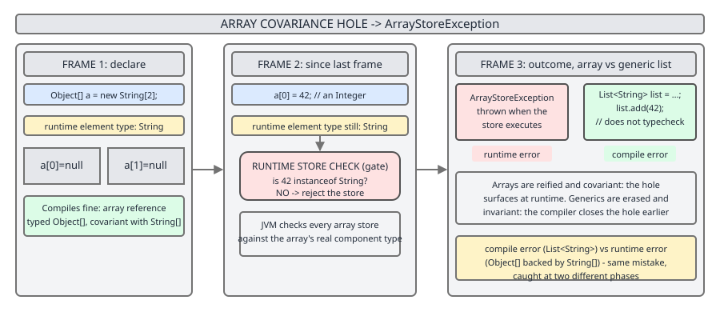
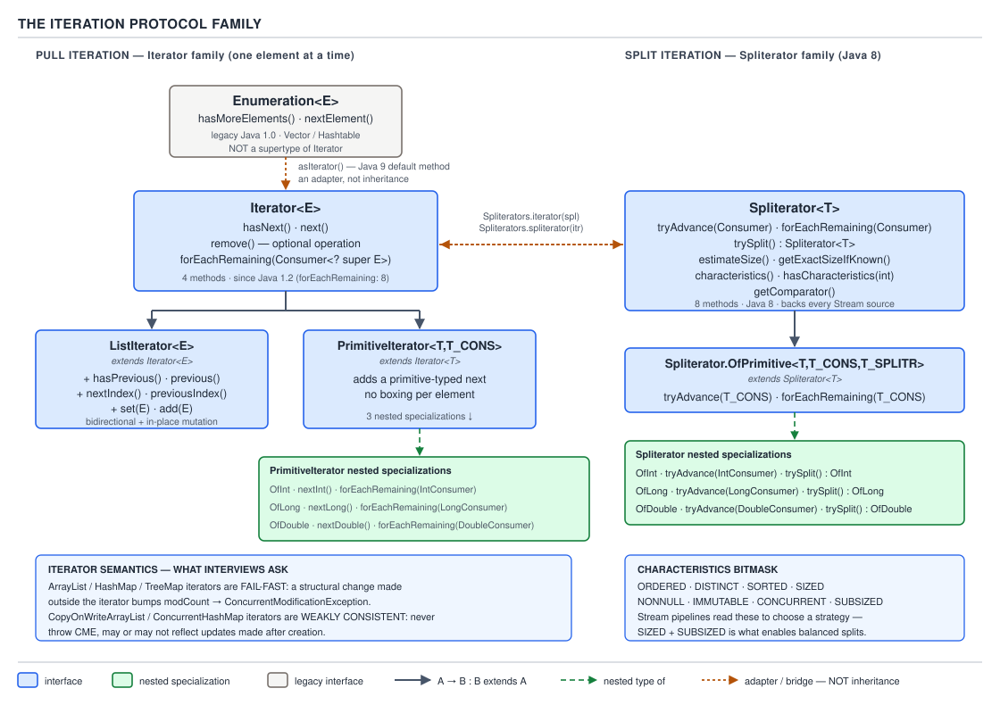

# 02 Java Collections — The framework itself — BASICS (§1.1 Why a collections framework exists, §1.2 The hierarchy, exactly)

**Target version: Java 21 LTS.** | [Index](../00-index.md)
Next: [framework/02-interface-method-surfaces.md](02-interface-method-surfaces.md)

## §1.1 Why a collections framework exists at all

### Why a framework at all

Picture Java before 1998: four data structures, four unrelated shapes. `Vector` grows an array and synchronizes every method. `Hashtable` maps keys to values and also synchronizes every method. `Stack` is — bizarrely — a subclass of `Vector`, so a LIFO structure inherits random-access `insertElementAt`. `Enumeration` walks any of them, and `Dictionary` is the abstract parent nobody but `Hashtable` ever extended. None of these four share an interface. A method that wants to accept "a growable list of things" has no type to name except `Vector` itself, so every utility method gets written once per concrete class, or not at all. (1.1.1)

Arrays don't rescue you either. An array is fixed-length the instant it is allocated — no insert, no remove, no notion of "this element is already here" for uniqueness, no key-based lookup, and no pluggable ordering policy; you get index order and nothing else. And arrays have a sharper problem, covered on its own below: they let a type error through the compiler that a generic collection cannot. (1.1.2)

Before 1.2, this was the world: no polymorphism across containers, no shared algorithms, no shared iteration contract — five moving parts (add `Stack` and `Dictionary` to the two headline classes) that don't compose. The picture below is the "before" against what 1.2 imposed as the "after": four standardized layers — interfaces, general-purpose implementations, algorithms, and an iteration protocol — that every future collection type plugs into once and gets all four for free. (1.1.4)


**Insight:** the framework's real deliverable isn't `ArrayList` or `HashMap` — those are almost incidental. It is the *guarantee* that any current or future implementation of `List` works with any algorithm ever written against `List`. That guarantee is what "program to the interface" cashes out to.

```java
// Field type is the interface — callers see only the contract.
private final List<String> names = new ArrayList<>();

// A method written once against List<E> works for ArrayList, LinkedList,
// CopyOnWriteArrayList, or any future implementation — no rewrite needed.
static <E> void printAll(List<E> list) {
    for (E e : list) {
        System.out.println(e);
    }
}
```

Swap `new ArrayList<>()` for `new LinkedList<>()` and `printAll` does not change, does not recompile differently, does not care. That is "program to the interface" in one line: declare `List<E> names`, construct the concrete type only at the `new`, and every consumer of `names` depends on the interface, never the implementation. (1.1.5)

The framework's designer, Joshua Bloch, shipped this in Java 1.2 (1998). Java 5 (2004) added generics, closing the covariance hole described below. Java 8 (2014) added default methods (so interfaces could grow `forEach`, `removeIf`, `replaceAll` without breaking every existing implementer) and the Streams API. Java 9 (2017) added the `List.of` / `Set.of` / `Map.of` static factories for immutable collections. Java 21 (2023) added the sequenced-collection tier — `SequencedCollection`, `SequencedSet`, `SequencedMap` — closing a 25-year gap where "give me the first and last element, in either direction" had no common contract. (1.1.8)

**Interview:** "Who designed the Java Collections Framework and why does that matter?" — Joshua Bloch, and it matters because the same design taste (favor composition, minimize surface area, prefer immutability) shows up in `Optional`, `java.time`, and the builder patterns he later wrote about in *Effective Java*.

> **Definition.** The Java Collections Framework is a unified architecture of interfaces, general-purpose implementations, and algorithms for representing and manipulating groups of objects, plus a shared iteration protocol that lets any algorithm operate over any conforming implementation.

### Array covariance and the generics fix

Mental model: an array in Java remembers its *runtime* component type — every array carries a hidden tag saying "I am an array of `String`" or "I am an array of `Object`" — and the JVM checks every store against that tag. A `List<E>`, by contrast, has no runtime memory of `E` at all; the check that matters happens once, at compile time, against the *declared* type, and then is gone. That inversion — arrays check late, generics check early — is the entire covariance story. (1.1.3) `[X-REF 03]`

Arrays are *covariant*: `String[]` is-a `Object[]`, so a method that declares `Object[]` will happily accept a `String[]` argument. This looks convenient — one `sort(Object[])` method can sort arrays of any reference type — until someone stores the wrong element through the `Object[]` alias.

**[PROVE]** Walk it through:

```java
String[] strings = new String[3];
Object[] objects = strings;      // legal: covariance — Object[] "is-a" superclass view
objects[0] = 42;                 // compiles: 42 autoboxes to Integer, an Object
                                  // throws at RUNTIME: java.lang.ArrayStoreException
```

`objects[0] = 42` compiles cleanly because the compiler only sees the declared type `Object[]`, and `Integer` is an `Object`. But `objects` and `strings` are the *same array object* at runtime, and that array's hidden runtime tag says "component type is `String`." The JVM's array-store check reads that tag on every `astore` and rejects the `Integer`, throwing `ArrayStoreException` — at runtime, in production, however many calls deep this array reference has travelled from the original `String[]` declaration.

Generics close this because `List<E>` erases `E` at compile time and never asks the JVM to check it again — instead, the compiler inserts the check *before* erasure, at every call site that could violate it:

```java
List<String> strings = new ArrayList<>();
List<Object> objects = strings;   // does NOT compile: List<String> is not a List<Object>
```

There is no covariance between `List<String>` and `List<Object>` — generics are *invariant* by default — so the analogous mistake is rejected at `javac` time, before the code ever ships. The tradeoff: you lose the (dangerous) convenience of writing one method against `List<Object>` that accepts any `List<T>`; the framework's answer is bounded wildcards (`List<? extends Object>`), covered in `framework/06-generics-and-wildcards.md`.



**Pitfall:** believing generics are "just array covariance with extra syntax." **Symptom:** writing `List<Object> l = new ArrayList<String>();` and being surprised it doesn't compile, or worse, casting around the error with a raw type and hitting an `ArrayStoreException`-shaped `ClassCastException` later at the point of retrieval. **Fix:** remember erasure means there is no array-style runtime tag to check against — the compiler is the only line of defense for a generic collection, so the type system must be strict (invariant) precisely because there is no runtime backstop the way arrays have.

> **Definition.** Array covariance lets `Sub[]` be used wherever `Super[]` is expected and defers the type-safety check to a runtime `ArrayStoreException`; generic collections are invariant and erase their type parameter, so the equivalent check is enforced once, at compile time, with no runtime array-store check to fall back on.

### The optional-operation bargain

Here is the framework's central trade, and it is a *deliberate* one, not an oversight: rather than model every combination of "resizable vs fixed-size" and "mutable vs immutable" as its own interface, the JCF has one `Collection` interface with 15-ish methods, and some implementations simply throw `UnsupportedOperationException` for the methods that don't apply to them. (1.1.6, 1.1.7)

The alternative Bloch rejected was a much deeper interface lattice: `FixedSizeList`, `GrowableList`, `ImmutableList`, `MutableFixedSizeList`, and so on, each combination getting its own type. That lattice is combinatorially explosive — N independent axes of variation produce 2^N interfaces — and every algorithm written against the framework would need to pick the narrowest interface that still supports every operation it calls, which in practice means most code ends up written against the broadest type anyway. The framework chose "one `List` interface, some operations optional" over "a correct, narrow interface per capability" because the small hierarchy is what makes "program to the interface" tractable for callers. `[TRAP]`

The cost lands on the *caller*: `Arrays.asList(...)` returns a fixed-size `List` view backed by the array — `set` works, `add` and `remove` throw. `List.of(...)` returns a fully immutable `List` — even `set` throws. `Collections.unmodifiableList(list)` wraps any `List` and makes every mutator throw. All three are still, nominally, `List`, and the compiler cannot stop you from calling `.add()` on any of them.

```java
List<String> fixed = Arrays.asList("a", "b", "c");
fixed.set(0, "z");     // fine — Arrays.asList supports set
fixed.add("d");        // throws UnsupportedOperationException — fixed-size, not growable

List<String> immutable = List.of("a", "b", "c");
immutable.set(0, "z"); // throws UnsupportedOperationException — no mutation at all
```

**Pitfall:** treating `List<String> l = Arrays.asList(...)` as a normal, growable `ArrayList`. **Symptom:** `UnsupportedOperationException` thrown from deep inside a library method that calls `list.add(...)` on a list your code handed it, far from where the list was constructed. **Fix:** know the optional-operation status of whatever factory produced the reference — `Arrays.asList` (fixed-size, mutable elements), `List.of`/`Set.of`/`Map.of` (fully immutable), `Collections.unmodifiableX` (view, throws on all mutators, and *also* still changes if the backing collection changes underneath it) — and wrap with `new ArrayList<>(source)` the moment you need a collection you can freely grow.

1.1.10 as a table — which operations are optional on which interface, precisely:

| Interface | Always supported | Commonly optional |
|---|---|---|
| `Collection` | `iterator`, `size`, `contains`, `isEmpty` | `add`, `remove`, `clear`, `addAll`, `removeAll`, `retainAll` |
| `List` | positional `get` | `set`, `add(index, e)`, `remove(index)` on fixed/immutable views |
| `Set` | `contains`, `iterator` | `add` on immutable sets |
| `Map` | `get`, `containsKey` | `put`, `remove` on immutable/unmodifiable maps |

`Collection` itself carries no `equals`/`hashCode` contract at all — it is `List`, `Set`, and `Map` that each pin one down, and each pins down a *different* one: `List.equals` compares element-by-element in order, `Set.equals` compares membership regardless of order, and `Map.equals` compares key-value pairs regardless of order. A `List` and a `Set` holding the exact same elements are never `.equals()` to each other, because they implement different contracts inherited from different interfaces, not because the framework special-cased that comparison. (1.1.9, 1.1.11) `[TRAP]`

**Pitfall:** asserting `list.equals(set)` where both hold `{1, 2, 3}` and expecting `true`. **Symptom:** the assertion fails even though "the elements are the same." **Fix:** recall that `equals` is contract-typed, not content-typed — compare `new ArrayList<>(list)` against `new ArrayList<>(set)` (same concrete contract) if you actually want element-set equality across different collection *kinds*.

> **Definition.** An optional operation is a method declared on a shared interface that a given implementation is permitted to reject at runtime via `UnsupportedOperationException`, rather than the framework defining a separate interface for every implementation that cannot support it.

### Why Map is not a Collection

`Map<K,V>` stores pairs, not elements, and that single fact breaks every method on `Collection` that assumes "one element in, one element out." What would `map.add(x)` even take — a key, a value, or an `Entry`? What would `map.size()` count if a `Map` also had to satisfy `Collection.contains(Object)` — does `contains` test keys, values, or entries? Bloch's answer was not to force an awkward fit; `Map` is its own root interface, sibling to `Collection`, not a subtype of it. (1.1.9)

The bridge back to the rest of the framework is three view methods, each returning a live, framework-standard `Collection`:

```java
Map<String, Integer> ages = new HashMap<>();
ages.put("Ana", 30);
ages.put("Bo", 41);

Set<String> keys          = ages.keySet();   // Set<K>  — keys are inherently unique
Collection<Integer> vals  = ages.values();   // Collection<V> — values may repeat
Set<Map.Entry<String, Integer>> pairs = ages.entrySet(); // Set<Entry<K,V>>
```

All three views are *backed by* the map — `ages.keySet().remove("Ana")` removes the entry from `ages` itself, not a copy — which is a deliberate design choice, not a leak: it's how `Map`-wide bulk removal (`map.keySet().removeIf(...)`) works without a `Map`-specific removal API.

`Map.Entry<K,V>` is a nested interface, not a top-level one, because an `Entry` only means something in the context of the `Map` that produced it — `Map.Entry.comparingByKey()` and `Map.Entry.comparingByValue()` are static helpers on it for exactly the sorting-a-`Set<Entry>` case shown above. (1.2.10)

**Insight:** `Map` not extending `Collection` is the single design decision that most surprises engineers coming from other languages, because Python's dict and JavaScript's object/Map both look "collection-like" by convention. Java's framework instead says: a `Map` *has* three collection views, it *is not* one.

> **Definition.** `Map<K,V>` is a separate root interface for key-to-value associations; it is not a `Collection<E>` because its natural unit is a pair, not a single element, and it exposes its contents to the rest of the framework through the `keySet()`, `values()`, and `entrySet()` live views.

## §1.2 The hierarchy, exactly

### The interface hierarchy

The mental model for the whole hierarchy: one root for "you can be iterated" (`Iterable`), one root for "you are a bag of individual elements" (`Collection`, subdivided by ordering and duplicate policy into `List`/`Set`/`Queue`/`Deque`), and one separate root for "you are a set of key-value pairs" (`Map`). Everything else is refinement — narrower contracts layered on top for sorted order, navigation, or (as of Java 21) predictable insertion-order access from both ends. (1.2.1–1.2.11)

Reading from the top:

- **`Iterable<T>`** — the true root, sitting above `Collection` itself. Declares `iterator()`; Java 8 added default `forEach(Consumer<? super T>)` and `spliterator()`. Implementing `Iterable` is what makes the enhanced `for (T t : iterable)` loop legal on a type — the compiler desugars that loop directly to an `Iterator` call sequence. (1.2.1)
- **`Collection<E> extends Iterable<E>`** — adds the ~15 element-bag methods: `size`, `isEmpty`, `contains`, `iterator`, `toArray` (two overloads), `add`, `remove`, `containsAll`, `addAll`, `removeAll`, `removeIf` (default, Java 8), `retainAll`, `clear`, `equals`, `hashCode`, plus default `stream()`/`parallelStream()`/`spliterator()`. Mutators are the ones most often optional, per the bargain above. (1.2.2)
- **`SequencedCollection<E>` (Java 21)** — inserted *between* `Collection` and `List`/`Deque`. Adds `addFirst`, `addLast`, `getFirst`, `getLast`, `removeFirst`, `removeLast`, and `reversed()` (a live reversed view, not a copy). `List` and `Deque` both now implement it, which is why `ArrayList` gained `getFirst()`/`reversed()` in Java 21 without any migration on the developer's part. `[RESEARCH]` — verified against JDK 21 `java.util` package summary and JEP 431. (1.2.3)
- **`List<E>`** — adds positional access (`get(int)`, `set(int, E)`, `indexOf`, sublists), permits duplicates, and pins down `equals`/`hashCode` to depend on *both* element values *and* their order. (1.2.4)
- **`Set<E>`** — adds no new methods over `Collection`, but *re-specifies the contract*: no duplicates per its `equals`, and its own `equals`/`hashCode` are order-independent (two sets are equal iff they contain the same elements, any order). (1.2.5)
- **`SequencedSet<E>`** — `Set<E>` plus `SequencedCollection<E>`: a set with a defined encounter order and endpoint access. `LinkedHashSet` implements it directly in Java 21. (1.2.6)
- **`SortedSet<E>` → `NavigableSet<E>`** — `SortedSet` adds a `Comparator`-driven total order and range views (`headSet`, `tailSet`, `subSet`). `NavigableSet` (Java 6) adds nearest-neighbor navigation: `floor`, `ceiling`, `lower`, `higher`, plus `pollFirst`/`pollLast`. `TreeSet` implements `NavigableSet`. (1.2.7)
- **`Queue<E>`** — FIFO-oriented, and its defining feature is that every core operation exists in *two forms*: one that throws on failure, one that returns a sentinel. `add`/`throws IllegalStateException` on a full bounded queue vs `offer`/returns `false`; `remove`/throws `NoSuchElementException` on empty vs `poll`/returns `null`; `element`/throws vs `peek`/returns `null`. (1.2.8)
- **`Deque<E> extends Queue<E>, SequencedCollection<E>`** (Java 21 added the `SequencedCollection` parent) — double-ended: `addFirst`/`addLast`, `offerFirst`/`offerLast`, `removeFirst`/`removeLast`, `pollFirst`/`pollLast`, `peekFirst`/`peekLast`. Also carries `push`/`pop` so a `Deque` can serve as a `Stack` replacement — `ArrayDeque` is the JCF's own answer to the legacy `Stack` class. (1.2.9)
- **`Map<K,V>`** — the separate pairs root described above. `Map.Entry<K,V>` is its nested interface. (1.2.10)
- **`SequencedMap<K,V>` (Java 21) → `SortedMap<K,V>` → `NavigableMap<K,V>`** — `SequencedMap` adds `putFirst`, `putLast`, `pollFirstEntry`, `pollLastEntry`, `reversed()`. `SortedMap` adds a total key order and range views. `NavigableMap` adds `floorEntry`/`ceilingEntry`/`lowerEntry`/`higherEntry` and their key-only variants. `TreeMap` implements `NavigableMap`; `LinkedHashMap` implements `SequencedMap` as of Java 21. (1.2.11)

Table form of which root declares which verb — the names differ across `Collection`/`Queue`/`Deque`/`Map` for the *same conceptual operation*, and this is a favorite interview trap because the names look interchangeable but are not: (1.2.18)

| Conceptual action | `Collection`/`List` | `Queue` | `Deque` | `Map` |
|---|---|---|---|---|
| Insert, may fail loudly | `add(e)` | `add(e)` | `addFirst`/`addLast` | `put(k,v)` |
| Insert, fail quietly | — | `offer(e)` | `offerFirst`/`offerLast` | `putIfAbsent(k,v)` |
| Insert at a "stack top" | — | — | `push(e)` | — |
| Remove, may fail loudly | `remove(int)`/`remove(Object)` | `remove()` | `removeFirst`/`removeLast` | `remove(k)` |
| Remove, fail quietly | — | `poll()` | `pollFirst`/`pollLast` | `remove(k, v)` (conditional) |
| Peek without removing | `get(int)` | `element()`/`peek()` | `peekFirst`/`peekLast` | `get(k)` |


**Interview:** "Why does `Queue` have both `add` and `offer` for the same conceptual insert?" — because a bounded queue *can* legitimately fail to insert (it's full), and the framework refuses to force every caller into try/catch for an expected, common outcome; `offer` returning `false` is the non-exceptional path for that expected case, mirroring `Map.putIfAbsent` and `NavigableMap`'s `poll*` family.

> **Definition.** The `java.util` collection hierarchy is two disjoint trees rooted at `Iterable`→`Collection` (single-element containers: `List`, `Set`, `Queue`, `Deque`, and their sorted/navigable/sequenced refinements) and at `Map` (pair containers, refined the same way), joined only by the three collection-view methods `Map` exposes.

When to reach for which root — the choice is almost always answerable from three questions: do I need positional access, do duplicates matter, and do I need key lookup?

| Question | Answer | Reach for |
|---|---|---|
| Need index-based access (`get(i)`)? | Yes | `List` |
| Need to forbid duplicates, no index needed? | Yes | `Set` |
| Need sorted iteration order over unique elements? | Yes | `SortedSet`/`NavigableSet` (`TreeSet`) |
| Need FIFO processing (producer/consumer)? | Yes | `Queue` |
| Need both-ends access or a stack replacement? | Yes | `Deque` (`ArrayDeque`) |
| Need key → value lookup? | Yes | `Map` |
| Need sorted iteration by key? | Yes | `SortedMap`/`NavigableMap` (`TreeMap`) |
| Need insertion order preserved *and* endpoint access? | Yes (Java 21) | `SequencedSet`/`SequencedMap` (`LinkedHashSet`/`LinkedHashMap`) |

A `List` loses to a `Set` the moment duplicate prevention matters more than positional access; a `Queue` loses to a `Deque` the moment you need to peek or remove from *both* ends instead of just the head. Naming the losing sibling in each row is deliberate — the wrong choice compiles and runs, it just does the wrong amount of work (an `ArrayList.contains` scanning O(n) for uniqueness that a `HashSet.contains` would do in O(1), for example) or lacks the guarantee you actually needed (a `HashMap` can't answer "give me keys 10–20" the way a `TreeMap` can). (1.2.19)

### Iteration protocol and markers — supporting facts

`Iterator<E>` is the base cursor: `hasNext()`, `next()`, default `remove()` (optional — throws `UnsupportedOperationException` if the backing collection doesn't support removal during iteration). `ListIterator<E> extends Iterator<E>` adds backward traversal (`hasPrevious`/`previous`), positional info (`nextIndex`/`previousIndex`), and in-place mutation (`set`, `add`) — only `List` can produce one, because only `List` has the positional structure `set`/`add` need. `Enumeration<E>` is the pre-1.2 relic `Iterator` replaced; Java 9 added a default `asIterator()` bridge method precisely so legacy code producing an `Enumeration` (still returned by, e.g., `Hashtable.keys()`) can be consumed by modern `Iterator`-based code without a manual adapter. `PrimitiveIterator` and its `OfInt`/`OfLong`/`OfDouble` nested interfaces avoid autoboxing when iterating primitive streams. **Gotcha:** calling `Iterator.remove()` is the only *safe* way to remove an element while iterating with a `for-each` loop under the hood — direct `collection.remove(e)` inside an enhanced-for throws `ConcurrentModificationException` via fail-fast modCount checking. (1.2.12)

`Spliterator<T>` ("splittable iterator") is the traversal engine the Streams API is built on: it adds `tryAdvance`, `trySplit` (for parallel decomposition), `estimateSize`, and a `characteristics()` bitmask (`ORDERED`, `DISTINCT`, `SORTED`, `SIZED`, `NONNULL`, `IMMUTABLE`, `CONCURRENT`, `SUBSIZED`) that lets stream pipelines skip work — e.g., a stream over a `SIZED` `Spliterator` can size its output collector's backing array up front instead of growing it. `Spliterator.OfInt`/`OfLong`/`OfDouble` are the primitive specializations feeding `IntStream`/`LongStream`/`DoubleStream`. (1.2.13)



Three marker interfaces carry no methods at all — they exist purely so `instanceof` checks can change algorithm behavior: `RandomAccess` (implemented by `ArrayList`, not by `LinkedList`) tells `Collections.binarySearch` and similar algorithms that indexed `get(i)` is O(1), so an index-walking loop is safe to use instead of an iterator-walking one; `Cloneable` and `Serializable` are the standard JDK-wide markers, implemented by most concrete collections (`ArrayList`, `HashMap`, etc.) but deliberately *not* by the collection interfaces themselves — `List` does not extend `Cloneable`, because cloning is an implementation concern, not a contract every list must honor. (1.2.14)

`Comparator<T>` and `Comparable<T>` live in `java.util` and `java.lang` respectively, outside the `Collection`/`Map` hierarchy entirely, yet are load-bearing inside it: `TreeSet`, `TreeMap`, `PriorityQueue`, `Collections.sort`, and `List.sort` all require one or the other to establish order. `Comparable.compareTo` is a single natural order baked into the class; `Comparator.compare` is an external, swappable order, and its Java 8 default methods (`thenComparing`, `reversed`, `comparing` with a key extractor) are what make one-line comparator chains possible. (1.2.15)

```java
record Employee(String department, String name, int salary) {}

List<Employee> staff = new ArrayList<>(List.of(
    new Employee("Eng", "Bo", 140_000),
    new Employee("Eng", "Ana", 140_000),
    new Employee("Sales", "Cy", 95_000)
));

// Sort by department, then by descending salary, then by name — all external,
// none of it touches Employee's own equals/hashCode/compareTo (it has none).
staff.sort(
    Comparator.comparing(Employee::department)
              .thenComparing(Comparator.comparingInt(Employee::salary).reversed())
              .thenComparing(Employee::name)
);
```

**Gotcha:** `Comparator`-based ordering and `equals`-based equality are entirely independent — `TreeSet`/`TreeMap` use `compareTo`/`compare` for *both* ordering and duplicate detection, so a `Comparator` that returns `0` for two genuinely different objects silently drops one of them from the set, even though `equals` would have said they're different. This is why a `TreeSet<Employee>` sorted only by `salary` quietly loses one of the two `140_000` earners above — the comparator says they're "equal" for ordering purposes.

The six abstract skeleton classes — `AbstractCollection`, `AbstractList`, `AbstractSequentialList`, `AbstractSet`, `AbstractQueue`, `AbstractMap` — exist so a new concrete implementation only has to supply a handful of *primitive* methods (e.g., `AbstractList` needs just `get(int)` and `size()` for a read-only list) and inherits every derived method (`iterator`, `indexOf`, `contains`, `toString`, ...) for free by implementing them in terms of the primitives. `AbstractMap.SimpleEntry` and `SimpleImmutableEntry` are ready-made `Map.Entry` implementations for code that builds entries without going through a real `Map` (e.g., returning ad-hoc key-value pairs from a method). The full source walk of what each skeleton demands and how it derives the rest is deferred — see `framework/08-abstract-skeletons.md`; this file positions them only in the hierarchy diagram above. `[RESEARCH]` — verified skeleton method lists against JDK 21 source for `AbstractList`/`AbstractMap`. (1.2.16, 1.2.17)

### Where java.util.concurrent grafts on

`java.util.concurrent` does not replace the core interfaces — it *extends* them for thread-safe use, so code written against `Map<K,V>` or `Queue<E>` keeps working unmodified when handed a concurrent implementation. `ConcurrentMap<K,V> extends Map<K,V>` adds atomic compound operations (`putIfAbsent`, `remove(k,v)`, `replace(k,v,newV)`, `computeIfAbsent`) that would otherwise require external locking to do safely; `ConcurrentHashMap` is its flagship implementer. `ConcurrentNavigableMap<K,V> extends ConcurrentMap<K,V>, NavigableMap<K,V>` is the concurrent+sorted diamond — `ConcurrentSkipListMap` is the sole general-purpose implementer, because a lock-free skip list, not a red-black tree, is what supports concurrent navigation without a single coarse lock. `BlockingQueue<E> extends Queue<E>` adds `put`/`take` (block until space/an element exists) alongside the existing throw/return-sentinel pairs — `ArrayBlockingQueue`, `LinkedBlockingQueue`. `BlockingDeque<E> extends BlockingQueue<E>, Deque<E>` is the double-ended blocking diamond, implemented by `LinkedBlockingDeque`. `TransferQueue<E> extends BlockingQueue<E>` adds `transfer(e)`, which blocks until another thread actually *receives* the element — a direct handoff, not just a queue insert — implemented by `LinkedTransferQueue`. `[RESEARCH]` — verified interface extension chains against JDK 21 `java.util.concurrent` package javadoc. (1.2.20)


**Insight:** every concurrent interface is a *multiple-inheritance diamond* over an existing core interface plus a concurrency-specific interface (`ConcurrentMap`+`NavigableMap`, `BlockingQueue`+`Deque`) rather than a from-scratch design — this is why a `ConcurrentSkipListMap` slots into any code expecting a plain `Map`, `SortedMap`, or `NavigableMap` with zero changes.

## Pitfalls

### Assuming Map is a Collection because it "holds a bunch of things"

**Wrong**
```java
void printSizes(Collection<?> c) { System.out.println(c.size()); }
printSizes(new HashMap<String, Integer>()); // does NOT compile
```

**Right**
```java
void printSizes(Map<?, ?> m) { System.out.println(m.size()); }
// or, if you specifically want the collection view:
printSizes(map.entrySet());
```

**Why people believe it:** every other container in the framework (`List`, `Set`, `Queue`) is a `Collection`, and `Map` "feels" like a container of entries — but `Collection<E>` is fundamentally single-element, and a pair doesn't fit that shape without ambiguity in what `add`/`contains` would mean.

### Trusting that a `List` reference is always growable

**Wrong**
```java
List<String> l = Arrays.asList("a", "b");
l.add("c"); // throws UnsupportedOperationException at runtime, not compile time
```

**Right**
```java
List<String> l = new ArrayList<>(Arrays.asList("a", "b"));
l.add("c"); // fine — genuinely growable copy
```

**Why people believe it:** the compiler accepts `l.add("c")` without complaint because `add` is declared on `List` and is only *optionally* supported — nothing in the static type signals which optional operations a given instance actually honors.

## Cheat sheet

| Fact | Value |
|---|---|
| JCF introduced | Java 1.2 (1998), designed by Joshua Bloch |
| Generics added | Java 5 (2004) — closes array covariance hole for collections |
| Sequenced tier added | Java 21 (2023): `SequencedCollection`, `SequencedSet`, `SequencedMap` |
| Root of everything iterable | `Iterable<T>` |
| Root of element-bag types | `Collection<E> extends Iterable<E>` |
| Root of pair types | `Map<K,V>` — sibling of `Collection`, not a subtype |
| Bridge from Map to Collection world | `keySet()` (`Set<K>`), `values()` (`Collection<V>`), `entrySet()` (`Set<Entry<K,V>>`) |
| Array vs generic type-check timing | Arrays: runtime (`ArrayStoreException`). Generics: compile time, then erased. |
| Fixed-size list factory | `Arrays.asList(...)` — `set` OK, `add`/`remove` throw |
| Fully immutable list factory | `List.of(...)` — all mutators throw |
| Queue fail modes | `add`/`remove`/`element` throw; `offer`/`poll`/`peek` return sentinel |
| Marker interfaces | `RandomAccess`, `Cloneable`, `Serializable` — no methods, `instanceof`-only |
| Concurrent Map+Sorted diamond | `ConcurrentNavigableMap` → `ConcurrentSkipListMap` |
| Concurrent Deque+Blocking diamond | `BlockingDeque` → `LinkedBlockingDeque` |

## Self-test

**Q1.** Why does `Object[] o = new String[3]; o[0] = 42;` compile but throw at runtime, while the generic equivalent is rejected at compile time?

<details><summary>Answer</summary>

Arrays are covariant (`String[]` is-a `Object[]`) and carry their real component type as a runtime tag, so the store-time check happens in the JVM and throws `ArrayStoreException` when the tag doesn't match. Generic collections erase their type parameter at compile time and are invariant (`List<String>` is not a `List<Object>`), so there is no runtime tag to check against — the compiler must (and does) catch the equivalent mistake before erasure, at `javac` time.

</details>

**Q2.** Why is `Map<K,V>` not a subtype of `Collection<E>`?

<details><summary>Answer</summary>

`Collection<E>` methods assume one element per slot — `add(E)`, `contains(Object)`, `size()` counting elements. A `Map` stores pairs, so none of those signatures translate unambiguously (would `add` take a key, a value, or an entry? would `contains` test keys or values?). Rather than force a mismatched fit, `Map` is a separate root interface and exposes three live views — `keySet()`, `values()`, `entrySet()` — that are genuine `Collection`/`Set` instances backed by the map.

</details>

**Q3.** What does it mean for a `Collection` method to be "optional," and name two `List` factories with different optional-operation profiles.

<details><summary>Answer</summary>

An optional operation is declared on the shared interface but is allowed to throw `UnsupportedOperationException` at runtime for implementations that don't support it, rather than the framework defining a narrower interface per capability. `Arrays.asList(...)` supports `set` but throws on `add`/`remove` (fixed-size). `List.of(...)` throws on every mutator, including `set` (fully immutable).

</details>

**Q4.** A `List` and a `Set` contain exactly the same three elements. Is `list.equals(set)` ever `true`?

<details><summary>Answer</summary>

No. `List.equals` requires the other object to also be a `List` with the same elements *in the same order*; `Set.equals` requires the other object to also be a `Set`. Neither contract is satisfied when comparing across kinds, regardless of element content, because `Collection` itself specifies no `equals` contract — each subinterface defines its own, and they're mutually exclusive by type.

</details>

**Q5.** What new capability did `SequencedCollection` add in Java 21, and which two existing interfaces now extend it?

<details><summary>Answer</summary>

`getFirst`/`getLast`, `addFirst`/`addLast`, `removeFirst`/`removeLast`, and a live `reversed()` view. `List` and `Deque` both now extend `SequencedCollection`, which is why `ArrayList` gained `getFirst()` and `reversed()` without any code change to `ArrayList` itself — the capability arrived via the interface.

</details>

**Q6.** Why does `Queue` define both `add(e)`/`remove()`/`element()` and `offer(e)`/`poll()`/`peek()` for what looks like the same three operations?

<details><summary>Answer</summary>

A bounded queue can legitimately fail to insert (full) or have nothing to remove/peek (empty), and that is an expected, common outcome rather than a truly exceptional one. The `add`/`remove`/`element` family throws in that case; the `offer`/`poll`/`peek` family returns a sentinel (`false`/`null`) instead, letting callers choose exception-based or sentinel-based handling per call site.

</details>

**Q7.** Which marker interface tells `Collections.binarySearch` it's safe to use an index-walking loop instead of an iterator, and why does `LinkedList` not implement it?

<details><summary>Answer</summary>

`RandomAccess`. `ArrayList` implements it because `get(i)` is O(1) via direct array indexing. `LinkedList` does not implement it because `get(i)` requires an O(n) pointer walk from whichever end is closer, so indexed access in a loop would be O(n²) instead of the O(n) an iterator-based walk achieves.

</details>

**Q8.** Name the two-interface diamond that produces `ConcurrentNavigableMap`, and its sole general-purpose implementer.

<details><summary>Answer</summary>

`ConcurrentMap<K,V>` (adds atomic compound operations like `putIfAbsent`/`replace`) and `NavigableMap<K,V>` (adds sorted-order navigation like `floorEntry`/`ceilingEntry`) combine into `ConcurrentNavigableMap<K,V>`. `ConcurrentSkipListMap` is the sole general-purpose implementer, because it needs a lock-free structure that supports concurrent navigation, which a `TreeMap`'s red-black tree under a single lock cannot offer at the same concurrency level.

</details>

**Q9.** Why does `Enumeration` still exist in Java 21, and what bridges it to modern iteration code?

<details><summary>Answer</summary>

`Enumeration` predates `Iterator` (pre-1.2) and is retained because legacy APIs like `Hashtable.keys()` still return it and cannot be changed without breaking binary compatibility. Java 9 added a default method, `Enumeration.asIterator()`, that wraps any `Enumeration` as an `Iterator` so it can be consumed by modern `Iterator`-based or `for-each` code without a hand-written adapter.

</details>

**Q10.** What is the one-paragraph reason the framework chose optional operations over a deeper, capability-correct interface lattice?

<details><summary>Answer</summary>

A fully correct lattice (separate interfaces for fixed-size, growable, mutable, immutable, and every combination) grows combinatorially with the number of independent capability axes, and most calling code would end up writing against the broadest interface anyway to stay usable. The framework traded per-instance correctness (some `List` references throw on some calls) for a small, memorizable set of top-level interfaces that "program to the interface" can actually rely on everywhere.

</details>

## Open questions

None — all `[RESEARCH]`-tagged claims were verified against the JDK 21 `java.util`/`java.util.concurrent` package documentation and JEP 431 (sequenced collections) before writing.

---

**Leaves covered:** 1.1.1–1.1.11, 1.2.1–1.2.20 (31 leaves)
**Leaves deferred:** none
**Diagrams included:** D-01, D-02, D-03, D-04, D-06
**Target version:** Java 21 LTS
**Lines:**      371
