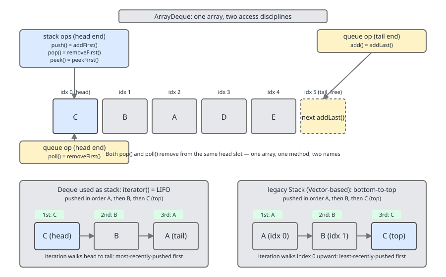
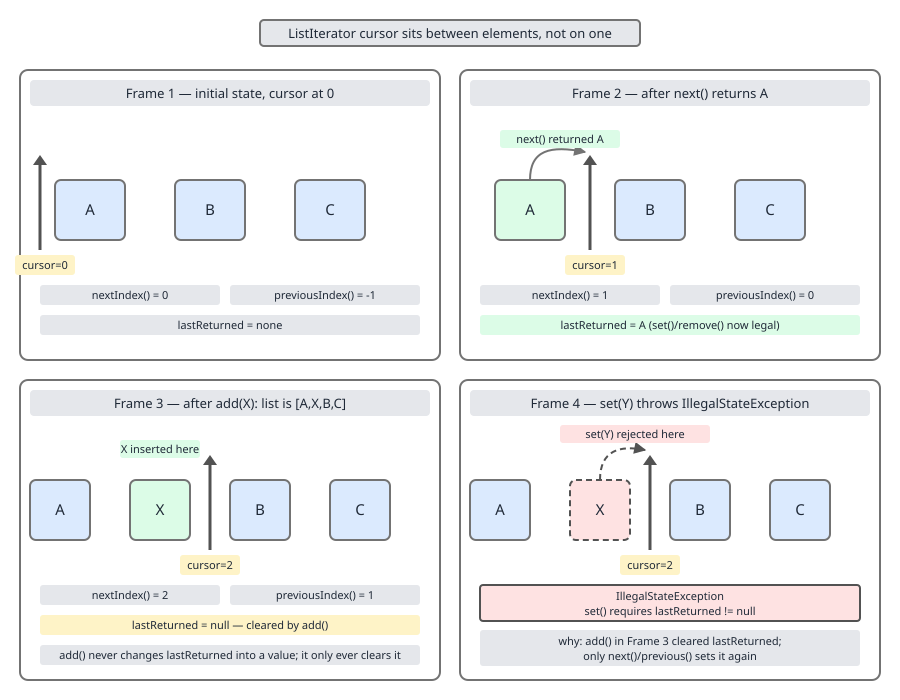

# 02 Java Collections — The framework itself — BASICS (§1.3 Interface method surfaces, method by method)

**Target version: Java 21 LTS.** | [Index](../00-index.md)
Previous: [framework/01-basics-why-and-hierarchy.md](01-basics-why-and-hierarchy.md) · Next: [framework/03-catalogue-a-lists-and-sets.md](03-catalogue-a-lists-and-sets.md)

Reference sheet for the method surface of every core collection interface: what exists, the signature, which interface declares it, and where it bites. Deep semantics for navigation, `compute`/`merge` null handling, comparator combinators, `Spliterator` internals, and immutable factories live elsewhere — this file states the surface and points onward.

## `Collection` — the root surface

**1.3.1** Every `Collection<E>` carries the same nineteen-method surface, inherited by `List`, `Set`, and `Queue` alike:

| Category | Methods |
|---|---|
| Size / query | `size()`, `isEmpty()`, `contains(Object)`, `containsAll(Collection)` |
| Iteration | `iterator()`, `forEach` (via `Iterable`), `spliterator()` |
| Bulk conversion | `toArray()`, `toArray(T[])`, `toArray(IntFunction<T[]>)` (Java 11) |
| Mutation | `add(E)`, `remove(Object)`, `addAll(Collection)`, `removeAll(Collection)`, `retainAll(Collection)`, `removeIf(Predicate)` (Java 8), `clear()` |
| Streams | `stream()`, `parallelStream()` |

`removeIf` is the one bulk-mutation method added after the original 1.2 `Collection` contract, replacing the external-iterator-plus-manual-`remove` boilerplate that Java 8's `Predicate` additions were designed to retire.

### `toArray()` and its two traps

**Mental model.** `toArray` is the escape hatch from the collections framework back into raw arrays — for code that predates generics or needs array semantics (varargs, `Arrays.sort`, native interop).

**Why it exists.** `Collection<E>` cannot simply expose an `E[]` because Java cannot construct a generic array (`new E[size]` does not compile; type erasure leaves no `E` to reify at the `new` site). `toArray` is the sanctioned bridge: the *caller* supplies the concrete component type, either explicitly (the array overload) or not at all (the `Object[]` overload).

**When to reach for it, and when not.** Reach for `toArray(IntFunction)` — `list.toArray(String[]::new)` — for the cleanest call site; Java 11 added it so nobody has to remember which array-size idiom is fastest. Do not reach for the bare `toArray()` when you intend to store the result typed as `E[]` — it returns `Object[]`, full stop (see the trap below). Prefer `stream().toList()` over any `toArray` call when you don't actually need an array.

**How it works.** The array-accepting overload has a three-way contract based on the collection's size vs. the passed-in array's length: **too small** → a new array of the same runtime type is allocated and returned, the caller's array discarded unused; **exact size** → filled in place and returned as-is; **larger** → filled, with the collection's `size()` slot set to `null` (the sentinel most people forget: iterate only to `size()`, not `array.length`, unless you deliberately rely on it).

**1.3.2** `[RESEARCH]` The counter-intuitive part is which case to deliberately trigger. The instinct is to avoid "wasting" an allocation by pre-sizing with `list.toArray(new String[list.size()])`. Aleksey Shipilëv's benchmark ("Arrays of Wisdom of the Ancients") measured this against the "wasteful-looking" `list.toArray(new String[0])` and found the zero-length form faster on modern JVMs across collection sizes. Mechanism: the JIT recognizes the zero-length-array pattern and lowers it to a fast, vectorized `arraycopy` intrinsic; the pre-sized path forces a type-checked, element-by-element store loop because the JVM cannot prove at compile time that the destination array's runtime component type matches every stored reference, so it falls back to `checkcast`-guarded stores. The extra allocation is cheap next to the per-element check it eliminates. `toArray(new T[0])` is now the default recommendation in static-analysis rule sets (e.g. OpenRewrite's "replace toArray arg with empty array" recipe) — treat `toArray(new T[size])` as the legacy idiom.

**Interview:** "Which is faster, `toArray(new T[0])` or `toArray(new T[size])`?" — the zero-length array; the "avoid double allocation" instinct is backwards on modern JVMs.

**Insight:** the reason this surprises people is that the "obvious" optimization (pre-size the array so the JVM never has to allocate a throwaway one) targets the wrong cost. The dominant cost on the pre-sized path is not the allocation you're avoiding — it's the per-element `checkcast` you're introducing.

```java
List<String> names = List.of("ana", "bo", "cy");

Object[] raw = names.toArray();                  // compiles, static type Object[]
String[] typed = names.toArray(new String[0]);   // recommended idiom
String[] typed11 = names.toArray(String[]::new); // Java 11, same result
```

**1.3.3** `[TRAP]` `Collection.toArray()` (no arguments) declares its return type as `Object[]`, not `E[]` — this is unavoidable because of type erasure; there is no `E` left at runtime to build the array from.

**Pitfall:** writing `String[] arr = (String[]) names.toArray();` and hitting a `ClassCastException` at the cast, even though every element in `names` is genuinely a `String`. The runtime array produced by the no-arg `toArray()` is always backed by `Object[]`, and `Object[]` cannot be downcast to `String[]` — arrays carry their component type at runtime, and no amount of static typing on the elements changes what the JVM actually allocated. **Fix:** always use the one-argument or `IntFunction` overload when you need a typed array; never cast the no-arg result.

> `Collection.toArray()` bridges an erased generic type back to raw arrays; only overloads told the target component type can hand back anything more specific than `Object[]`.

## `List` — indexed, ordered, duplicate-permitting

**1.3.4** `List<E>` adds index-based access on top of `Collection`:

| Method | Signature | Notes |
|---|---|---|
| `get` | `E get(int index)` | O(1) array-backed, O(n) linked |
| `set` | `E set(int index, E element)` | returns the replaced element |
| `add` | `void add(int index, E element)` | insertion, not replacement |
| `remove` | `E remove(int index)` | see 1.3.5 for the overload trap |
| `indexOf` / `lastIndexOf` | `int indexOf(Object o)` | linear scan, `-1` if absent |
| `listIterator` | `ListIterator<E> listIterator()` / `(int)` | bidirectional, see below |
| `subList` | `List<E> subList(int from, int to)` | a *view*, not a copy |
| `replaceAll` | `void replaceAll(UnaryOperator<E>)` | Java 8, in-place transform |
| `sort` | `void sort(Comparator<? super E>)` | Java 8, in-place, stable |
| `of` / `copyOf` | static factories | immutable — see `../immutable-collections/02-immutable-factories.md` |
| `reversed` | `List<E> reversed()` | Java 21, a reversed *view* |

**1.3.5** `[TRAP]` `List.remove(int)` and `List.remove(Object)` are two distinct overloads that collide on `List<Integer>`.

**Pitfall:** calling `list.remove(2)` on a `List<Integer>` expecting the value `2` to be removed, but the `int` overload wins overload resolution (an exact primitive match beats autoboxing to `Object`), so the element *at index 2* is removed instead. **Fix:** box explicitly — `list.remove(Integer.valueOf(2))` or `list.remove((Object) 2)` — when you mean "remove this value," and reserve the bare `int` literal for "remove this index."

## `Set`, `SortedSet`, `NavigableSet`

**1.3.6** `Set<E>` adds no methods of its own beyond `Collection` plus the `of`/`copyOf` static factories — the entire contract of a `Set` is behavioral (no duplicates, as defined by `equals`/`hashCode`), not structural. There is nothing new to call; there is a promise about what calling the inherited methods will do. This is why `Set` implementations differ so much from each other (`HashSet`, `LinkedHashSet`, `TreeSet`) while sharing an identical method list — the differences live entirely in ordering and lookup mechanism, catalogued in `03-catalogue-a-lists-and-sets.md`.

**1.3.7** `SortedSet<E>` adds: `Comparator<? super E> comparator()` (`null` means natural ordering), `SortedSet<E> subSet(from, to)`, `SortedSet<E> headSet(to)`, `SortedSet<E> tailSet(from)`, `E first()`, `E last()`. All three range views are *live* views into the backing set, not copies — a write through the view mutates the original and vice versa.

**1.3.8** `[X-REF nn]` `NavigableSet<E>` extends `SortedSet` with closest-match lookups: `lower(e)`/`floor(e)`/`ceiling(e)`/`higher(e)` (strictly-less, less-or-equal, greater-or-equal, strictly-greater), `pollFirst()`/`pollLast()` (retrieve-and-remove), `descendingSet()` (reverse-order view), `descendingIterator()`, and inclusive-flag overloads of `subSet`/`headSet`/`tailSet` that let the caller pick open vs. closed endpoints explicitly, rather than the two-argument versions' fixed [inclusive, exclusive) convention. Red-black tree mechanism and worked inclusive-flag examples: `../tree-map/01-navigable-api.md`. The point to hold here: `NavigableSet` makes a sorted set usable as a *range index*, not just an ordered iteration source — `ceiling`/`floor` answer "what's the closest key to this one" in O(log n), which a plain `HashSet` cannot answer at all.

## `Queue` and the throw-vs-null table

**1.3.9** `Queue<E>` is the first interface where the framework designers had to choose between two failure philosophies for boundary conditions (empty queue, full bounded queue) and, refusing to choose, gave every operation two names instead.

**Mental model.** Every `Queue` operation exists in a pair: one member reports a boundary condition as an *exception*, the other as a *sentinel return value* (`null` or `false`). Choosing which to call is choosing your error-handling style at the call site, not a difference in behavior.

**Why it exists.** Bounded queues (`ArrayBlockingQueue`) can legitimately fail to insert under normal operation — a full queue is expected, not exceptional. Forcing every caller to catch an exception for an expected condition is poor API design; forcing a sentinel check where failure really is exceptional invites silently swallowed bugs. `Queue` ships both.

**When to reach for it, and when not.** Use the throwing form (`add`/`remove`/`element`) when failure indicates a bug you want surfaced loudly. Use the sentinel form (`offer`/`poll`/`peek`) when the boundary condition is a normal, expected outcome you intend to branch on — the common case in producer/consumer loops.

**How it works** — the full pairing, per **D-07**:

| Operation | Throws exception | Returns special value |
|---|---|---|
| Insert | `add(e)` — throws `IllegalStateException` if capacity-restricted and full | `offer(e)` — returns `false` if capacity-restricted and full |
| Remove | `remove()` — throws `NoSuchElementException` if empty | `poll()` — returns `null` if empty |
| Examine | `element()` — throws `NoSuchElementException` if empty | `peek()` — returns `null` if empty |

**Interview:** "Why does `Queue` have both `add` and `offer`?" — insertion failure on a bounded queue is a normal outcome, not a bug; the API gives a non-exceptional way to detect it while keeping the fail-fast style available.

```java
Queue<String> q = new LinkedList<>();
q.offer("a");
q.offer("b");
q.poll();      // "a"
q.poll();      // "b"
q.poll();      // null — empty, no exception
q.element();   // throws NoSuchElementException — empty
```

**1.3.9 gotcha:** the `null`-return convention makes `poll()`/`peek()` ambiguous on a queue that permits `null` elements — you can't tell "empty" from "really `null`" — which is why `ArrayDeque` and every `java.util.concurrent` queue forbid `null` elements outright.

> `Queue` gives every boundary-sensitive operation a throwing name and a sentinel-returning name so the caller decides whether a boundary condition is a bug or a normal outcome.

## `Deque` — stack and queue in one interface

**1.3.10** `Deque<E>` ("double-ended queue," pronounced "deck") extends `Queue` with the same throw/sentinel pairing applied at *both* ends:

| End | Throws | Sentinel |
|---|---|---|
| Insert first | `addFirst(e)` | `offerFirst(e)` |
| Insert last | `addLast(e)` | `offerLast(e)` |
| Remove first | `removeFirst()` | `pollFirst()` |
| Remove last | `removeLast()` | `pollLast()` |
| Examine first | `getFirst()` | `peekFirst()` |
| Examine last | `getLast()` | `peekLast()` |

Plus stack-flavored aliases `push`, `pop`, `peek`, and the linear-scan removers `removeFirstOccurrence(o)` / `removeLastOccurrence(o)`, and `descendingIterator()` for tail-to-head traversal.

**Mental model.** One array (or doubly-linked chain) with two live ends. Read it through the queue-shaped names and it behaves like a FIFO queue; read it through the stack-shaped names and the same structure behaves like a LIFO stack. The data never moves between "modes" — only the vocabulary changes.

**Why it exists.** Before Java 6, `Stack` (synchronized, `Vector`-based, a historical wart) was the only JDK stack, and `LinkedList` was the go-to deque. `Deque` unified both roles behind one interface backed by `ArrayDeque` — a resizable-circular-array implementation with none of `Stack`'s synchronization tax and none of `LinkedList`'s per-node overhead.

**When to reach for it, and when not.** Use `ArrayDeque` for both stack and queue workloads by default — it beats `Stack` (unsynchronized, so faster single-threaded, with none of `Stack`'s legacy baggage) and beats `LinkedList` (better cache locality, no per-element node allocation). Reach for `LinkedList` only when you need `List`'s positional insert/remove-in-the-middle behavior alongside deque operations — `Deque` alone gives no indexed access.

**Interview:** "Why is `ArrayDeque` preferred over `Stack` and `LinkedList`?" — `Stack` is a synchronized `Vector` subclass carrying tax nobody wants single-threaded; `LinkedList` pays a per-element node allocation `ArrayDeque`'s circular array avoids entirely.

**1.3.11** `[TRAP]` The stack-facing names alias head-end operations: `push(e)` ≡ `addFirst(e)`, `pop()` ≡ `removeFirst()`, `peek()` ≡ `peekFirst()` — and, easy to miss, `add(e)` is **not** symmetric with `push`; it aliases `addLast(e)`, the *tail* end.

**Pitfall:** assuming `Deque` used as a stack (via `push`/`pop`) iterates the same direction as the legacy `Stack` class. It does not. `Deque`'s default `iterator()` walks head-to-tail; since `push` inserts at the head, iterating a `Deque`-as-stack visits elements *most-recently-pushed first* — correct LIFO order. `Stack` (extending `Vector`) inserts via `push` at the *end* of its backing array and its `Iterator` walks index 0 upward, visiting **oldest-pushed first** — FIFO order, despite being a stack. **Fix:** never rely on `Stack.iterator()` for LIFO order; to walk a `Deque`-as-stack in insertion order, use `descendingIterator()`.

The disciplines side by side, per **D-08**:



```java
Deque<Integer> stack = new ArrayDeque<>();
stack.push(1); stack.push(2); stack.push(3);
System.out.println(stack.pop());    // 3 — LIFO, as expected

Deque<Integer> asQueue = new ArrayDeque<>();
asQueue.offer(1); asQueue.offer(2); asQueue.offer(3);
System.out.println(asQueue.poll()); // 1 — FIFO, same class, different names
```

> `Deque` is a single two-ended structure that a caller reads as a stack through head-aliased methods (`push`/`pop`/`peek`) or as a queue through tail-inserting, head-removing methods (`offer`/`poll`) — the discipline lives entirely in which method names you choose to call.

## `Map` — the non-`Collection` half of the framework

**1.3.12** `Map<K,V>` does not extend `Collection` (a map is a set of pairs, not a collection of elements — membership and iteration don't fit the same shape). Its core surface:

| Category | Methods |
|---|---|
| Size / query | `size()`, `isEmpty()`, `containsKey(Object)`, `containsValue(Object)` |
| Access | `get(Object)`, `put(K,V)`, `remove(Object)`, `putAll(Map)`, `clear()` |
| Views | `keySet()`, `values()`, `entrySet()` — all three are *live* views |
| Identity | `equals(Object)`, `hashCode()` — defined structurally, pair-by-pair |

**1.3.13** `[X-REF nn]` Java 8 added ten default methods that turn `Map` from a get/put store into a mutable dictionary API: `getOrDefault`, `forEach`, `replaceAll`, `putIfAbsent`, `remove(k,v)`, `replace(k,v)`, `replace(k,old,new)`, `computeIfAbsent`, `computeIfPresent`, `compute`, and `merge`. Mechanism worth holding here: the compute-family functions may return `null`, and a `null` result means *remove the mapping* — this uniform convention is what lets `merge` double as insert-if-absent and accumulate-if-present in one call. Full null-handling truth table and the `wordCounts.merge(word, 1, Integer::sum)` idiom: `../utilities/04-map-default-methods.md`.

**1.3.14** `[X-REF nn]` Static factories mirror `List`'s and `Set`'s: `of` (zero to ten pairs, flat varargs — `Map.of(k1, v1, ...)`), `ofEntries` for more than ten or existing `Entry` objects, `entry(k, v)`, and `copyOf(Map)`. All produce structurally immutable maps that reject `null` keys/values and throw on duplicate keys rather than silently overwriting. Allocation strategy and the deliberately randomized iteration order: `../immutable-collections/02-immutable-factories.md`.

**1.3.15** `[RESEARCH]` `Map.Entry<K,V>` supplies `getKey()`, `getValue()`, `setValue(V)` (throws `UnsupportedOperationException` on entries backed by an immutable map or produced by `Map.entry`), and four comparator statics: `comparingByKey()`, `comparingByValue()`, plus overloads of each accepting an explicit `Comparator`. Java 17 added `Entry.copyOf(Entry)`, an immutable snapshot of a given entry — confirmed against the Java 17 API docs. The comparator statics exist specifically for the common `entrySet().stream().sorted(Map.Entry.comparingByValue())` idiom — sorting a map's entries by value without hand-writing a lambda every time.

**Interview:** "What does `Map.copyOf` guarantee that `new HashMap<>(existingMap)` does not?" — `copyOf` returns a structurally immutable snapshot that rejects further `put`/`remove` calls outright, whereas a defensive-copy constructor still produces a fully mutable map; `copyOf` also short-circuits to return the same reference when the source is already one of the `Map.of`/`copyOf` immutable instances, avoiding a redundant copy.

## `SortedMap` and `NavigableMap`

**1.3.16** `[X-REF nn]` `SortedMap<K,V>` mirrors `SortedSet`: `comparator()`, `subMap(from, to)`, `headMap(to)`, `tailMap(from)`, `firstKey()`, `lastKey()`. Range views are live, same as `SortedSet`'s — mutating a `subMap` writes through to the backing map, and vice versa.

**1.3.17** `[X-REF nn]` `NavigableMap<K,V>` mirrors `NavigableSet`, entry-at-a-time: `lowerEntry`/`lowerKey`, `floorEntry`/`floorKey`, `ceilingEntry`/`ceilingKey`, `higherEntry`/`higherKey`, `firstEntry`, `lastEntry`, `pollFirstEntry`, `pollLastEntry` (atomic retrieve-and-remove), `descendingMap()`, `navigableKeySet()`, `descendingKeySet()`, and the same inclusive-flag range views as `NavigableSet`. Full mechanism and why `pollFirstEntry` beats `firstKey()` + `remove(key)`: `../tree-map/01-navigable-api.md`.

**Pitfall:** relying on `NavigableMap`/`NavigableSet` range views (`subMap`/`subSet`) surviving structural modification of the backing map/set made through a different reference. The views are live for reads and for writes made *through the view itself*, but a key inserted into the backing map that falls outside the view's original bounds simply never appears in it — the view's bounds are fixed at creation time, only its contents are live.

## `Iterator` and `ListIterator`

**1.3.18** `Iterator<E>` is four methods: `hasNext()`, `next()`, `remove()` (default, throws `UnsupportedOperationException` unless overridden — plain read-only views never do), and `forEachRemaining(Consumer)` (Java 8, drains the rest without a manual `hasNext`/`next` loop). `Iterator.remove()` is also the only sanctioned way to remove elements from a collection while iterating it directly — calling the collection's own `remove` mid-loop throws `ConcurrentModificationException` on most implementations.

**1.3.19 / 1.3.20** `ListIterator<E>` extends `Iterator` with bidirectional movement and in-place mutation: `hasPrevious()`, `previous()`, `nextIndex()`, `previousIndex()`, `set(E)`, `add(E)`.

**Mental model.** A `ListIterator` is not positioned *on* an element — it is positioned *between* two elements, like a text cursor between two characters. `nextIndex()`/`previousIndex()` are just the index a subsequent `next()`/`previous()` call would return; both move the cursor across one element and hand it back, in opposite directions.

**Why it exists.** A plain `Iterator` can only remove; it cannot insert or overwrite in place without invalidating itself. Algorithms that rewrite a list while scanning it once need a cursor that supports `set`/`add` without restarting the scan.

**When to reach for it, and when not.** Reach for it when you must mutate a `List` *during* a single pass and positional inserts matter. Do not reach for it for read-only traversal — plain `Iterator`, a for-each loop, or a stream says the same thing with less ceremony. Do not reach for it either when the mutation is a pure removal predicate — `removeIf` (1.3.1) is shorter and cannot get the cursor bookkeeping wrong.

**How it works.** `set(E)` replaces the element most recently returned by `next()`/`previous()`, requiring a prior call to one of those since the last `add`/`remove`. `add(E)` inserts immediately before the cursor's current position and does **not** leave the newly added element eligible as a `set()` target.

**1.3.20** `[TRAP]` The interaction between `add` and `set` is the specific off-by-one that catches almost everyone once.

**Pitfall:** calling `listIterator.add(x)` then immediately `listIterator.set(y)`, expecting `set` to modify the just-added element. It throws `IllegalStateException`. **Why:** `set` is only legal if neither `remove` nor `add` have been called since the last `next`/`previous`; `add` resets "last returned element" to none precisely to prevent this confusion. **Fix:** call `previous()` first to re-establish the element, then `set()`.

The cursor model, across four frames, per **D-10**:



```java
List<Integer> nums = new ArrayList<>(List.of(1, 2, 3));
ListIterator<Integer> it = nums.listIterator();
while (it.hasNext()) {
    int v = it.next();
    if (v == 2) {
        it.set(20);      // replaces 2 -> legal: next() just returned it
        it.add(99);      // inserts 99 after 20, before 3
        // it.set(100);  // would throw IllegalStateException here
    }
}
// nums is now [1, 20, 99, 3]
```

**Interview:** "What's the difference between `Iterator.remove()` and `ListIterator.set()`/`add()`?" — a plain `Iterator` can only delete the last-returned element; `ListIterator` can additionally overwrite it in place or insert a new element around it, because it tracks a cursor position rather than just a "current" reference.

> `ListIterator` is a cursor sitting between elements, not on one; `set` targets whatever `next`/`previous` most recently handed back, and `add` deliberately clears that target so a caller cannot conflate "the element I just inserted" with "the element I just visited."

**Interview:** "Why is `ListIterator.add` documented to insert *before* the cursor rather than *at* it?" — because `next()`/`previous()` already define "at the cursor" as "the element about to be returned," and letting `add` insert there would make the newly added element ambiguous between "the element `next()` will return" and "the element I just inserted" — inserting strictly before the cursor keeps both operations unambiguous.

## `Comparator` — the ordering surface

**1.3.21** `[X-REF nn]` `Comparator<T>` is one abstract method, `compare(T, T)`, wrapped in a large combinator surface: instance methods `reversed()` and three overloads of `thenComparing` (by `Comparator`, by `Function` key extractor, and by `Function` + `Comparator` for the secondary key), plus `thenComparingInt`/`Long`/`Double` for boxing-free primitive key extractors. Static factories: `naturalOrder()`, `reverseOrder()`, `nullsFirst`/`nullsLast(Comparator)`, two overloads of `comparing`, and `comparingInt`/`Long`/`Double`. Every combinator returns a *new* `Comparator` rather than mutating the receiver, which is what makes chains like `comparing(Person::lastName).thenComparing(Person::firstName)` safe to build once and reuse. Full composition rules and `reversed()` vs. `thenComparing` ordering interaction: `../contracts/01-ordering.md`.

**Interview:** "How do you sort a list of `Person` by last name, then first name, nulls-last on last name?" — `list.sort(Comparator.comparing(Person::lastName, Comparator.nullsLast(Comparator.naturalOrder())).thenComparing(Person::firstName))`; the fluent chain is exactly why the combinator surface exists.

## `Spliterator` — the parallel-decomposition surface

**1.3.22** `[X-REF nn]` `Spliterator<T>` (Java 8) is the interface streams are built on: `tryAdvance(Consumer)` (process one element, return whether one existed), `trySplit()` (peel off a prefix as a second `Spliterator` for another thread — `null` when the source can no longer usefully divide), `estimateSize()`, `getExactSizeIfKnown()` (`-1` when not known in constant time). `characteristics()` returns an `int` bitmask (`ORDERED`, `DISTINCT`, `SORTED`, `SIZED`, `SUBSIZED`, `NONNULL`, `IMMUTABLE`, `CONCURRENT`) tested via `hasCharacteristics(int)`; `getComparator()` returns the source ordering if `SORTED` is set; `forEachRemaining(Consumer)` drains the rest in one pass. How a stream pipeline uses these characteristics to decide whether a parallel split is legal, and how `SIZED`/`SUBSIZED` drive work-stealing balance: `../iteration/03-internals-spliterator.md`.

**Interview:** "Why does `Collection.spliterator()` exist alongside `iterator()`?" — `iterator()` is a strictly sequential contract with no notion of splitting; `Spliterator` was added in Java 8 specifically so `stream().parallel()` has a standard way to divide any collection's elements across worker threads without every collection implementing its own ad hoc partitioning scheme.

**Pitfall:** assuming every `Collection` implementation supports every method in the surface table above without exception. `List.of(...)`'s immutable lists implement the full `List` interface but throw `UnsupportedOperationException` from `add`, `remove`, `set`, and `sort` — the interface's method surface is a compile-time contract, not a runtime guarantee that every method succeeds.

## Pitfalls

### Assuming `Collection.toArray()` can be cast to a typed array

**Wrong**
```java
List<String> names = List.of("a", "b");
String[] arr = (String[]) names.toArray();   // ClassCastException at runtime
```

**Right**
```java
String[] arr = names.toArray(new String[0]); // or names.toArray(String[]::new)
```

**Why people believe it:** the generic parameter `E` is visible at the call site, so it looks like the JVM "knows" the element type. Type erasure means that knowledge is gone by runtime for the no-arg overload — only the array-argument overloads carry the component type across.

### Assuming `Deque`-as-stack iterates like `Stack`

**Wrong**
```java
Stack<Integer> legacy = new Stack<>();
legacy.push(1); legacy.push(2); legacy.push(3);
legacy.forEach(System.out::println);   // 1, 2, 3 — oldest first
```

**Right**
```java
Deque<Integer> modern = new ArrayDeque<>();
modern.push(1); modern.push(2); modern.push(3);
modern.forEach(System.out::println);   // 3, 2, 1 — newest first, true LIFO
```

**Why people believe it:** both classes are documented as "stacks" with `push`/`pop`, so their iteration order looks like it should agree. `Stack` predates the `Deque` redesign and inherits `Vector`'s index-0-upward iterator, which walks oldest-to-newest despite being a "stack."

**Insight:** the throw-vs-sentinel duplication in `Queue`/`Deque`, the immutable-map-rejects-mutation behavior above, and `ListIterator`'s cursor-not-element model all trace back to one design principle running through this whole surface: the JDK collection interfaces favor giving the caller an explicit, checkable way to detect an edge condition over silently doing the "convenient" thing and hoping it matches the caller's intent.

## Cheat sheet

| Interface | Signature methods to recall cold | Key gotcha |
|---|---|---|
| `Collection` | `toArray(T[])`, `removeIf` | no-arg `toArray()` is `Object[]` |
| `List` | `get`/`set`/`add(int,E)`, `subList` | `remove(int)` vs `remove(Object)` overload |
| `Set` | none of its own | contract is behavioral, not structural |
| `SortedSet`/`NavigableSet` | `first`/`last`, `floor`/`ceiling` | range views are live |
| `Queue` | `add`/`remove`/`element` vs `offer`/`poll`/`peek` | throw vs. sentinel pairing |
| `Deque` | `push`≡`addFirst`, `add`≡`addLast` | stack iteration order ≠ `Stack`'s |
| `Map` | `computeIfAbsent`, `merge`, `getOrDefault` | `null` function result deletes the mapping |
| `Map.Entry` | `comparingByKey`/`comparingByValue` | `setValue` throws on immutable entries |
| `Iterator`/`ListIterator` | `set` after `add` | throws `IllegalStateException` |
| `Comparator` | `comparing`, `thenComparing` | every combinator returns a new instance |
| `Spliterator` | `trySplit`, `characteristics` | `null` from `trySplit` means "stop splitting" |

Every row above is a promise about the *interface*; the concrete implementation each collection type picks — array-backed, tree-backed, hash-backed — is what the next file in this set catalogues.

## Self-test

**Q1.** Why is `Collection.toArray()` declared to return `Object[]` instead of `E[]`?

<details><summary>Answer</summary>

Type erasure: by runtime the generic parameter `E` no longer exists, so Java cannot execute `new E[n]`. Only overloads that take a caller-supplied array (or an `IntFunction<T[]>`) carry the concrete component type across, because the caller supplies it.

</details>

**Q2.** Between `list.toArray(new String[0])` and `list.toArray(new String[list.size()])`, which is faster, and why?

<details><summary>Answer</summary>

The zero-length form, per Shipilëv's benchmark. The JIT lowers it to a fast array-copy intrinsic; the pre-sized path forces a type-checked, element-by-element store loop (`checkcast` per element) because the JVM cannot statically prove every stored reference matches the destination's runtime component type.

</details>

**Q3.** What happens if you call `list.remove(2)` on a `List<Integer>` containing `[10, 20, 30]`?

<details><summary>Answer</summary>

It removes the element **at index 2** (`30`), not the value `2` — the `int` overload wins over autoboxing to `Object`. To remove the value, box explicitly: `list.remove(Integer.valueOf(2))`.

</details>

**Q4.** Give the throw-vs-sentinel pairing for all three `Queue` boundary operations.

<details><summary>Answer</summary>

Insert: `add` throws `IllegalStateException` vs. `offer` returns `false`. Remove: `remove` throws `NoSuchElementException` vs. `poll` returns `null`. Examine: `element` throws `NoSuchElementException` vs. `peek` returns `null`.

</details>

**Q5.** Why does a `Deque` used as a stack iterate in a different order than `java.util.Stack`?

<details><summary>Answer</summary>

`Deque.push` aliases `addFirst`, and the default iterator walks head-to-tail — most-recently-pushed first, true LIFO. `Stack` (extends `Vector`) appends via `push` at the array's end and its iterator walks index 0 upward — oldest-pushed first, FIFO, despite being a "stack."

</details>

**Q6.** What does `NullPointerException` on `ArrayDeque.offer(null)` protect against?

<details><summary>Answer</summary>

The ambiguity between "the queue is empty" and "the element really is `null`" when reading `poll()`/`peek()`, both of which use `null` as their empty-queue sentinel. Forbidding `null` elements makes that return unambiguous.

</details>

**Q7.** Why does calling `set()` immediately after `add()` on a `ListIterator` throw `IllegalStateException`?

<details><summary>Answer</summary>

`set()` operates on the element most recently returned by `next()`/`previous()`. `add()` resets that "last returned element" tracking to none, so the caller cannot conflate "the element I just inserted" with "the element I just visited."

</details>

**Q8.** What does a `null` return from the function passed to `Map.merge` mean?

<details><summary>Answer</summary>

Remove the mapping for that key (or do nothing if already absent) — all four Java 8 compute-family methods share this "null result deletes" convention.

</details>

**Q9.** What does `Spliterator.trySplit()` returning `null` signal to a stream pipeline?

<details><summary>Answer</summary>

The source can no longer usefully be divided for parallel work; the pipeline processes the remainder sequentially via `tryAdvance`/`forEachRemaining` on the current worker.

</details>

**Q10.** Why does `Set<E>` add no methods beyond `Collection`?

<details><summary>Answer</summary>

`Set`'s contract — no duplicates, per `equals`/`hashCode` — is behavioral, not structural. Nothing new needs calling; what changes is the guarantee behind the inherited methods.

</details>

The interfaces covered here — `Collection` through `Spliterator` — are the vocabulary the rest of this note set assumes fluency in; every subsequent file names these methods without re-explaining them.

## Open questions

None — both `[RESEARCH]` leaves (1.3.2 `toArray` benchmark, 1.3.15 Java 17 `Entry.copyOf`) were confirmed against primary sources.

---

**Leaves covered:** 1.3.1–1.3.22 (22 leaves)
**Leaves deferred:** none
**Diagrams included:** D-08, D-10 (embedded); D-07 (rendered as table)
**Target version:** Java 21 LTS
**Lines:** 391
