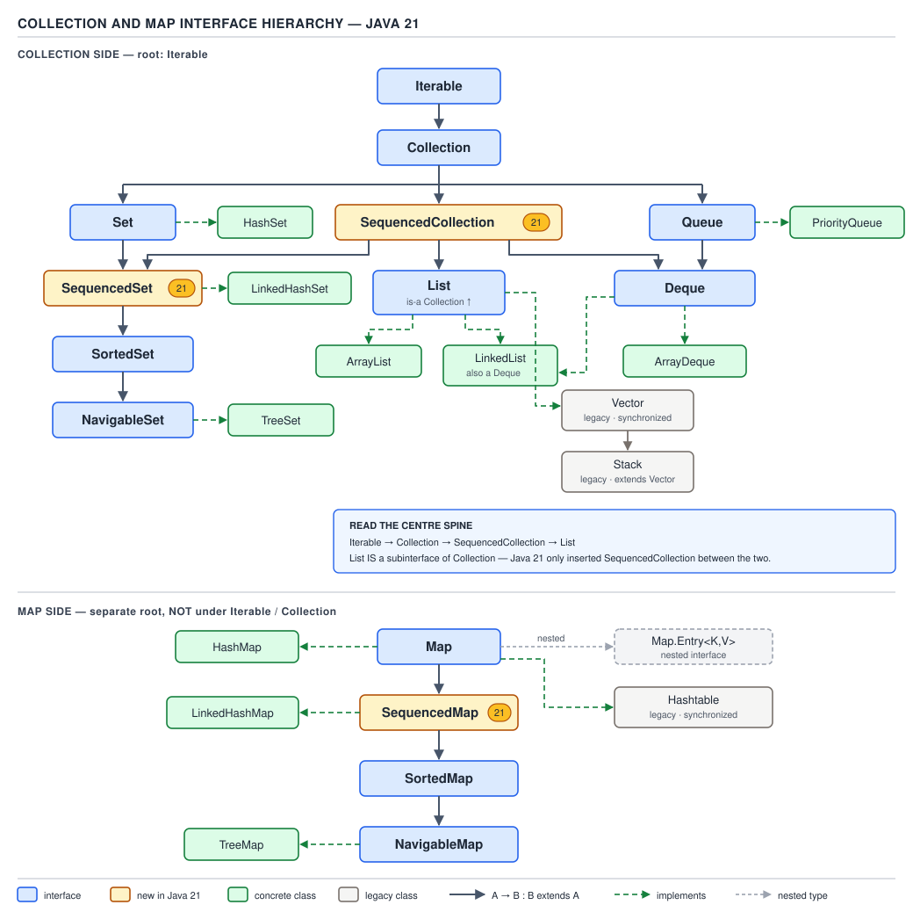
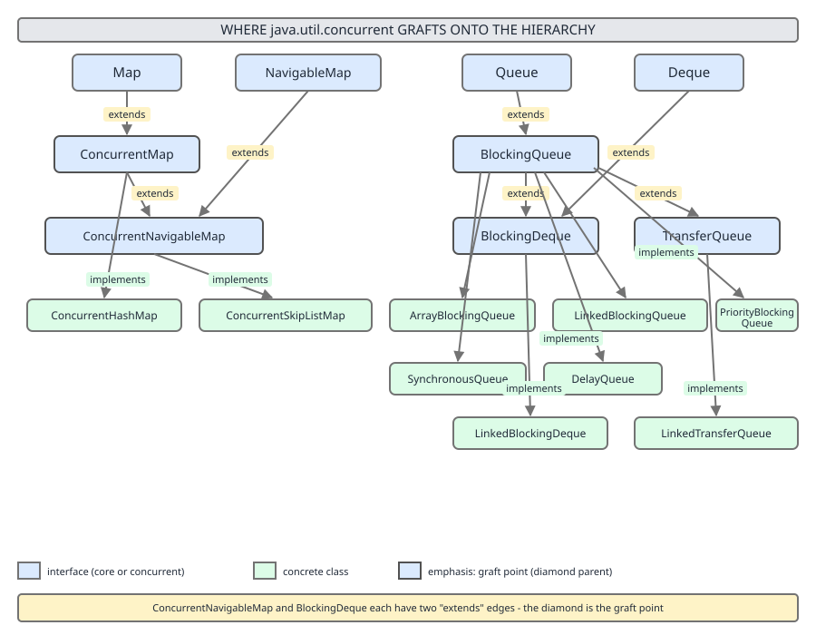

# 02 Java Collections — The framework itself — BASICS (§1.4 Every concrete implementation: queues, specials, immutables and the anti-catalogue)

**Target version: Java 21 LTS.** | [Index](../00-index.md)
Previous: [framework/04-catalogue-b-maps.md](04-catalogue-b-maps.md) · Next: [framework/06-matrices-and-choosing.md](06-matrices-and-choosing.md)



This file closes out the concrete-class catalogue: the queue and deque family
(single-threaded and concurrent), `BitSet`, the immutable and singleton
families, `Arrays.asList`, the master "which one" table, and the anti-catalogue
of classes that should never appear in new code. Every class below states its
backing structure, ordering guarantee, null policy, thread safety, iterator
type, default capacity, and the case for and against picking it. Mechanism
depth for each lives in the linked internals file — this file is the map, not
the terrain.

## §1.4.25–1.4.26 — the two array-backed non-blocking specials

### `ArrayDeque`

**Mental model.** Picture a fixed-length array bent into a ring: a `head`
index and a `tail` index chase each other around the circle. Pushing at
either end just moves the corresponding index one slot and wraps around when
it falls off the edge. There is no node allocation per element the way
`LinkedList` needs — the array itself is the storage.

**Why it exists.** Before `ArrayDeque` (Java 6), a double-ended queue meant
`LinkedList`, and `Stack`/`Vector` covered stack semantics with a
synchronized, `Vector`-backed design nobody wanted by then. `ArrayDeque` gives
array-backed cache locality with deque semantics and no synchronization
overhead.

**When to reach for it, and when not.** Default choice for a stack (replaces
`Stack`) or a FIFO queue (replaces `LinkedList` as `Queue`) in single-threaded
code. Not for random access by index — it deliberately does not implement
`List`. Not for a priority ordering — that is `PriorityQueue`. Not across
threads without external synchronization — for that, `LinkedBlockingDeque` or
`ConcurrentLinkedDeque` below.

**How it works, and the version trap.** `[VERSION-TRAP]` The textbook claim —
"`ArrayDeque` capacity is always a power of two, and the mask `cap - 1`
replaces `%`" — was true through JDK 8, where `allocateElements` rounded the
requested capacity up to the next power of two specifically so index wraparound
could use a bitmask instead of a modulo. **JDK 9 changed the internal layout**
to a plain circular array with explicit `head`/`tail` fields and ordinary
wraparound arithmetic (`if (++tail == elements.length) tail = 0;`); the
power-of-two sizing and bitmasking are gone. `[NUM]` The no-arg constructor in
Java 21 allocates an array of length **17**: the requested default capacity is
16, and the implementation always allocates one extra slot so a full deque
never lets `head == tail` collide with "empty" — `16 + 1 = 17`. Interviewers
who ask "what's the default capacity of `ArrayDeque`" and expect "16" are
testing the pre-JDK-9 answer; the correct current answer is 17, and the reason
(the reserved slot) is the more interesting half of the answer.

**No diagram assigned here** — the ring-buffer picture, the reserved-slot
invariant, and the resize-and-relinearize walk belong to
`../array-deque/01-internals.md`; this file states the mechanism once and
sends you there for the source walk. `[X-REF]`

```java
Deque<Integer> stack = new ArrayDeque<>();
stack.push(1);           // addFirst
stack.push(2);
stack.push(3);
System.out.println(stack.pop());   // 3 — LIFO, replaces java.util.Stack

Deque<Integer> queue = new ArrayDeque<>();
queue.offer(1);           // addLast
queue.offer(2);
System.out.println(queue.poll());  // 1 — FIFO, replaces LinkedList as Queue
```

**Pitfall:** `new ArrayDeque<>()` does **not** accept `null` elements —
`offer(null)` throws `NullPointerException` immediately, because internally a
`null` slot in the backing array means "empty" and would corrupt the
head/tail bookkeeping. Code migrating from `LinkedList` (which permits `null`)
breaks silently on this exact call.

**Interview:** "Why does `ArrayDeque` forbid nulls but `LinkedList` allows
them?" — `ArrayDeque` uses `null` as the internal empty-slot sentinel; a
stored `null` would be indistinguishable from an empty slot during iteration
and size computation.

> **`ArrayDeque`** is a circular-array-backed double-ended queue with O(1)
> amortised insertion and removal at both ends, no null elements, and no
> thread safety — the default replacement for both `Stack` and `LinkedList`
> used as a `Queue`.

### `PriorityQueue`

**Mental model.** A binary min-heap flattened into an array: element `i`'s
children live at `2i+1` and `2i+2`. The array is not sorted — only the
heap-order invariant holds (a parent is never greater than its children) — so
the only cheap guarantee is that index 0 holds the minimum.

**Why it exists.** Repeatedly asking "what's currently the smallest/highest
priority item" out of a general-purpose list is O(n) per query; a heap makes
peek O(1) and insert/remove-min O(log n).

**When to reach for it, and when not.** Reach for it for any "process items in
priority order" workload — Dijkstra's frontier, task schedulers, k-way merges,
top-k streaming. Not when you need to iterate in sorted order — `iterator()`
returns elements in **no particular order**, only `poll()` repeatedly yields
sorted order. Not when you need sorted *and* fast membership/removal by key —
`TreeMap`/`TreeSet` (see `04-catalogue-b-maps.md`) fit that better since a
heap's `remove(Object)` is O(n) (linear scan to find the element, then
sift).

**How it works.** `[NUM]` The default no-arg constructor allocates capacity
**11** (`DEFAULT_INITIAL_CAPACITY = 11`), an odd historical choice that has
nothing to do with power-of-two sizing — it just needs to be small and
non-zero; growth afterward roughly doubles for small arrays and grows by 50%
once the array is large, mirroring `ArrayList`'s policy. `null` elements are
rejected (a `null` cannot be compared for heap-order). The sift-up-on-insert,
sift-down-on-poll mechanics and the O(n) `heapify` used by the collection
constructor are the sibling file's job. `[X-REF]` See
`../priority-queue/01-internals-a-heap.md` for the full sift/heapify source
walk.

```java
PriorityQueue<Integer> minHeap = new PriorityQueue<>();
minHeap.addAll(List.of(5, 1, 4, 2, 3));
StringBuilder sorted = new StringBuilder();
while (!minHeap.isEmpty()) {
    sorted.append(minHeap.poll()).append(' ');
}
System.out.println(sorted);          // "1 2 3 4 5 " — poll() order is sorted
System.out.println(minHeap);         // (empty now — iteration order was never sorted)
```

**Pitfall:** Calling `System.out.println(priorityQueue)` or iterating with a
`for` loop and expecting sorted output — the toString/iterator both walk the
raw backing array in heap order, not priority order. Only draining with
`poll()` produces sorted output.

> **`PriorityQueue`** is an unbounded, array-backed binary min-heap with
> O(log n) insert/remove-min, O(1) peek, no nulls, no thread safety, and no
> guaranteed iteration order.

## §1.4.27–1.4.35 — the `java.util.concurrent` queue family



These nine classes all answer "how do producer and consumer threads hand off
elements safely," but they pick different points on the bounded/unbounded,
locked/lock-free, and blocking/non-blocking axes. The locking designs
themselves — `ArrayBlockingQueue`'s single lock with two `Condition`s,
`LinkedBlockingQueue`'s two-lock put/take split, `SynchronousQueue`'s
zero-capacity handoff, `DelayQueue`'s leader-follower wait, and the
Michael–Scott lock-free algorithm behind `ConcurrentLinkedQueue` — all get
their full source walk in `../concurrent-collections/05-blocking-and-lock-free-queues.md`.
`[X-REF]` This section states what each class *is* and when it wins the
choice; it does not re-derive the locking protocols.

| Class | Backing / concurrency design | Bounded? | Blocking? | Ordering | Null policy | Iterator |
|---|---|---|---|---|---|---|
| `ArrayBlockingQueue` | fixed array, single `ReentrantLock`, two `Condition`s (`notEmpty`/`notFull`), optional fairness flag | yes (fixed at construction) | yes | FIFO | no nulls | weakly consistent |
| `LinkedBlockingQueue` | linked nodes, **two locks** — `putLock` and `takeLock` — so producers and consumers rarely contend | optional (unbounded if no capacity given) | yes | FIFO | no nulls | weakly consistent |
| `LinkedBlockingDeque` | linked nodes, single lock guarding both ends | optional | yes | FIFO (per end) | no nulls | weakly consistent |
| `PriorityBlockingQueue` | array binary heap + single lock | unbounded | yes (blocks only on take when empty; put never blocks) | heap order | no nulls | weakly consistent, **not** sorted |
| `DelayQueue` | heap of `Delayed` elements + leader-follower pattern to avoid every waiter timing independently | unbounded | yes (take blocks until head's delay expires) | delay-expiry order | no nulls | weakly consistent |
| `SynchronousQueue` | no storage at all — a direct producer-to-consumer handoff | zero capacity | yes (put/take each block for a matching partner) | n/a — no buffering | no nulls | empty iterator always |
| `LinkedTransferQueue` | linked lock-free nodes + `transfer()` | unbounded | `put` never blocks; `transfer` blocks until received | FIFO | no nulls | weakly consistent |
| `ConcurrentLinkedQueue` | Michael–Scott lock-free linked list (CAS, no locks) | unbounded | never blocks | FIFO | no nulls | weakly consistent |
| `ConcurrentLinkedDeque` | lock-free doubly linked list (CAS, no locks) | unbounded | never blocks | FIFO per end | no nulls | weakly consistent |

**When to pick, when not, per family:**

- `ArrayBlockingQueue` — a hard, fixed-size backpressure buffer (bounded
  thread-pool work queues). Not for bursty workloads you cannot size up
  front — you will either drop work or block producers unpredictably.
- `LinkedBlockingQueue` — the default `Executors.newFixedThreadPool` queue;
  its two-lock split beats `ArrayBlockingQueue`'s single lock under
  contention. Not when you need a bound from the first element —
  `new LinkedBlockingQueue<>()` silently defaults to `Integer.MAX_VALUE`.
- `LinkedBlockingDeque` — work-stealing designs, pushing to one's own head
  while others steal from the tail. Not a plain FIFO substitute — one lock
  covers both ends, losing the two-lock throughput advantage.
- `PriorityBlockingQueue` — priority scheduling across threads. Not when you
  need a *bounded* priority queue — it has no capacity limit, so an outpaced
  consumer lets it grow without bound.
- `DelayQueue` — scheduled/expiring work: retry queues, cache eviction,
  timeout wheels. Not a general priority queue — elements must implement
  `Delayed`, and nothing surfaces from `poll()` until its delay expires.
- `SynchronousQueue` — direct handoff with zero buffering, e.g. backing
  `Executors.newCachedThreadPool()` so a submitted task either finds a free
  thread or spawns one. `[TRAP]` **Pitfall:** `isEmpty()`/`size()` always
  report `true`/`0`, even mid-handoff — there is no buffer to report on.
- `LinkedTransferQueue` — cheap `put` when no consumer needs to be waiting,
  `transfer()` when the producer must block until received. Skip it when
  plain `LinkedBlockingQueue` semantics suffice.
- `ConcurrentLinkedQueue` / `ConcurrentLinkedDeque` — high-throughput,
  never-block access under heavy concurrent read/write, no blocking needed.
  `[TRAP]` **Pitfall:** treating `size()` as cheap or exact — lock-free
  structures track no running count, so `size()` walks the whole list (O(n))
  **and** only approximates the count, since other threads may be
  linking/unlinking mid-walk. Never use it in a hot loop or capacity check.

## §1.4.36 — `BitSet`

**Mental model.** `[RESEARCH]` Not a `Collection` at all — it implements
neither `Collection` nor any of its sub-interfaces. It is a growable vector of
bits packed into a `long[]` (`words`), where bit `i` lives at
`words[i / 64]`, bit position `i % 64`. Think of it as a `Set<Integer>`
specialised down to the bit level: membership of small non-negative integers,
stored 64 to a word instead of one boxed `Integer` per entry.

**Why it exists.** A `HashSet<Integer>` storing, say, the set of prime indices
below a million pays a boxed `Integer` object (16 bytes header + 4 bytes value,
padded to 16) plus a hash-table entry (node object, next pointer, hash field)
per element — on the order of 40–48 bytes per stored integer. A `BitSet`
covering the same index range costs exactly 1 bit per representable index,
regardless of how many are actually set. `[NUM]` `[X-REF]` For a dense range
of a few million indices this is commonly a **30–50x memory reduction**; the
exact ratio and worked byte arithmetic live in `../sets/03-bitset.md` — stated
here as the reason to reach for it, not re-derived.

**When to reach for it, and when not.** Reach for it for dense sets of small
non-negative integers — Sieve of Eratosthenes, visited-node bitmaps, feature
flags, Bloom-filter-adjacent bit tricks. Not for sparse sets over a huge range
(a `BitSet` covering indices up to 10^9 with only 100 set bits still allocates
words across most of that range) — a `HashSet<Integer>` or `RoaringBitmap`-
style compressed structure wins there. Not for arbitrary objects — it only
ever stores bit positions (`int` indices), never elements.

**Supporting facts — the operation surface.**

- `set(i)`/`clear(i)`/`flip(i)`/`get(i)` — O(1) single-bit mutation/query.
- `and(other)`/`or(other)`/`xor(other)`/`andNot(other)` — whole-set boolean
  algebra, a word-at-a-time loop (64 bits per step), far faster than the
  equivalent `retainAll`/`addAll` on a `HashSet<Integer>`.
- `cardinality()` — population count via `Long.bitCount` per word, so like
  `ConcurrentLinkedQueue.size()` it is O(words) not O(1), but fast since
  words is n/64.
- `nextSetBit(fromIndex)`/`previousSetBit(fromIndex)` — the boxing-free
  iteration idiom: `for (int i = bs.nextSetBit(0); i >= 0; i = bs.nextSetBit(i + 1))`.
- `length()` vs `size()` — **gotcha**: `length()` is "highest set bit index
  + 1"; `size()` is bits *physically allocated* in the `long[]` (a multiple
  of 64). Neither means "how many bits are set" — that's `cardinality()`.
- `valueOf(long[])`/`toLongArray()` — round-trip to/from the raw word array,
  a lighter serialization path than Java serialization.
- `stream()` — an `IntStream` of set-bit indices, the modern replacement for
  manual `nextSetBit` loops.

> **`BitSet`** is a growable bit vector backed by a `long[]`, offering O(1)
> single-bit operations, O(words) bulk boolean algebra and cardinality, and
> roughly 1 bit of memory per representable index — not a `Collection`, and
> only useful when the index range is dense.

## §1.4.37–1.4.39 — the immutable, singleton, and `Arrays.asList` families

### The `List.of` / `Set.of` / `Map.of` immutable families

**Mental model.** `[RESEARCH]` These factory methods (Java 9+) do not return
`ArrayList`, `HashSet`, or `HashMap` at all — they return instances of private
final classes in `java.util.ImmutableCollections`, sized to exactly the input:
zero, one, or two elements get a specialised no-array class; anything larger
gets an array-backed class. Concretely: `List.of()`/`List.of(e)` and
`List.of(e1, e2)` return `List12` (a class that inlines its 0–2 elements as
fields, no backing array at all, to avoid an allocation); three or more
elements return `ListN`, which does hold a backing `Object[]`. The `Set`
family mirrors this with `Set12` (0–2 elements) and `SetN` (backed by an
open-addressed array with linear probing, not a hash table with buckets).
`Map.of()`/`Map.of(k, v)` return `Map1`; anything larger returns `MapN`,
which stores keys and values interleaved in one flat `Object[]` and probes it
the same way `SetN` does.

**Why it exists.** Before Java 9, "give me an immutable list of these three
things" meant `Collections.unmodifiableList(Arrays.asList(a, b, c))` — two
wrapper allocations to express one idea. The `List.of`/`Set.of`/`Map.of`
family collapses that into a single call, backed by classes built for
immutability from the start rather than a mutable structure wrapped after the
fact.

**When to reach for it, and when not.** Reach for it for genuinely fixed,
small, hand-written collections — constants, default configuration values,
test fixtures. Not when you need `null` elements — `[TRAP]` **Pitfall:** every
class in this family rejects `null` at construction with `NullPointerException`,
unlike `Arrays.asList` (which permits `null` for reference types) and unlike
`Collections.unmodifiableList` wrapping a list that already contains nulls.
Not when you need a *view* over a mutable source that should reflect later
changes — these are snapshots, not views; mutating the array or collection
you passed in has no effect after construction. `[X-REF]` The full internals
— `SetN`/`MapN` probing with `SALT32L` (a per-JVM-run random salt XORed into
each element's hash specifically so an attacker cannot predict iteration
order or engineer hash collisions across runs) and the tiny-size class split
— live in `../immutable-collections/04-internals-immutable-collections.md`.

```java
List<String> fixed = List.of("a", "b", "c");   // ListN, 3 elements
try {
    fixed.add("d");
} catch (UnsupportedOperationException e) {
    // structurally immutable — every mutator throws
}
try {
    List.of("a", null, "c");                    // NPE at construction, not at use
} catch (NullPointerException e) {
    // null rejected up front
}
```

> **`List.of`/`Set.of`/`Map.of`** return purpose-built immutable classes
> (`List12`/`ListN`, `Set12`/`SetN`, `Map1`/`MapN`) sized to the input, reject
> `null`, are structurally immutable rather than merely wrapped, and
> randomize iteration order per JVM run via a salted hash to prevent
> hash-collision attacks.

### `Collections` singletons and empties

**Supporting facts.** `Collections.singletonList(e)` returns a
`SingletonList` — one field, no array, the lightest possible one-element
list; `Collections.emptyList()` returns the shared `EmptyList` singleton
reused across every call site (no per-call allocation). Both predate
`List.of` by over a decade and remain idiomatic for the "exactly one" /
"exactly zero" case, and are still what Java 8 code uses. **Gotcha:**
`Collections.EMPTY_LIST` (the raw, non-generic static field) predates
generics and produces an unchecked warning if assigned to a typed
`List<T>` — prefer the generic method `Collections.emptyList()`.

> **`SingletonList`/`EmptyList`** are the pre-Java-9 immutable-collection
> primitives: a one-field class for exactly one element, and a shared
> stateless instance for exactly zero.

### `Arrays.asList`

**Mental model.** `[TRAP]` `Arrays.asList(array)` does not copy the array
into a `java.util.ArrayList` — it wraps the array in `Arrays$ArrayList`, a
**completely different, package-private class** nested inside `Arrays` that
happens to share a simple name with the familiar one. The returned list's
backing store *is* the original array, not a copy.

**Why it matters.** Because the wrapper writes through to the same array,
`set(i, v)` mutates the original array in place and vice versa. But it does
not support structural change — `add`/`remove` throw
`UnsupportedOperationException`, since either would require resizing the
fixed-length array underneath, which `Arrays$ArrayList` never does.

**Gotcha, worked through.** `[PROVE]`

```java
Integer[] backing = {1, 2, 3};
List<Integer> view = Arrays.asList(backing);

view.set(0, 99);
System.out.println(backing[0]);        // 99 — the list wrote through to the array

backing[1] = 42;
System.out.println(view.get(1));       // 42 — the array write shows through the list

try {
    view.add(4);                       // throws — fixed-size wrapper, not a real ArrayList
} catch (UnsupportedOperationException e) {
    // confirms: Arrays$ArrayList, not java.util.ArrayList
}

view.getClass();                       // "java.util.Arrays$ArrayList"
```

`[X-REF]` The full views-vs-copies-vs-snapshots comparison across
`Arrays.asList`, `Collections.unmodifiableList`, and `List.copyOf` lives in
`../immutable-collections/01-views-copies-snapshots.md`.

> **`Arrays.asList`** returns a fixed-size, write-through view backed
> directly by the array you passed in (`Arrays$ArrayList`, not
> `java.util.ArrayList`) — mutation of individual elements is supported and
> propagates both ways, but structural changes are not supported at all.

## §1.4.40 — the master "which one do I pick" table

This is the flattened decision surface across every concrete class in this
catalogue and `04-catalogue-b-maps.md`. `[X-REF]` The full decision **tree**
diagram (D-63) that walks the same logic step by step, plus the three
supporting matrices (ordering, thread-safety, and null-policy), live in
`06-matrices-and-choosing.md` — this table is the flat reference; that file
is the guided walk.

| Need | First choice | Runner-up | Avoid |
|---|---|---|---|
| Stack (LIFO) | `ArrayDeque` | — | `Stack` (synchronized, legacy) |
| FIFO queue, single-threaded | `ArrayDeque` | `LinkedList` (only if you also need `List`) | `LinkedList` as a default |
| Priority ordering, single-threaded | `PriorityQueue` | `TreeSet` (if also need sorted iteration + removal by key) | — |
| Bounded producer/consumer handoff | `ArrayBlockingQueue` | `LinkedBlockingQueue` with capacity | unbounded queue with no backpressure |
| High-throughput unbounded queue, blocking OK | `LinkedBlockingQueue` | `LinkedTransferQueue` | `ConcurrentLinkedQueue` if you need blocking `take` |
| Never-block, high-contention FIFO | `ConcurrentLinkedQueue` | `LinkedTransferQueue` (`put`) | any lock-based blocking queue |
| Work-stealing deque | `LinkedBlockingDeque` / `ConcurrentLinkedDeque` | — | `ArrayDeque` shared across threads without external locking |
| Direct handoff, zero buffering | `SynchronousQueue` | `LinkedTransferQueue.transfer` | any queue with a capacity |
| Delayed/expiring work | `DelayQueue` | scheduled executor | manual polling loop |
| Priority ordering, concurrent | `PriorityBlockingQueue` | — | `PriorityQueue` shared across threads |
| Dense small-integer set | `BitSet` | `EnumSet` (if the domain is an enum) | `HashSet<Integer>` at scale |
| Fixed small constant collection | `List.of` / `Set.of` / `Map.of` | `Collections.singletonList`/`emptyList` for the 0/1 case | `Arrays.asList` when you need real immutability |
| Fixed-size array-backed view with write-through | `Arrays.asList` | — | assuming it behaves like `java.util.ArrayList` |

## §1.4.41 — the anti-catalogue

Every class here still compiles, still runs, and still shows up in decade-old
codebases and in interview trick questions. None of them belong in new code.

| Avoid | Replace with | One-line reason | Still-correct exception |
|---|---|---|---|
| `Vector` | `ArrayList` (single-threaded) or `CopyOnWriteArrayList`/external locking (concurrent) | Every method is synchronized even in single-threaded use, paying lock overhead for no benefit | none — even legacy APIs requiring `Vector` in their signature can be satisfied by wrapping an `ArrayList` |
| `Stack` | `ArrayDeque` | Extends `Vector`, inheriting synchronization overhead and a confusing `List` surface (`Stack` exposes `get(int)`, which nothing about "stack" should allow) | none |
| `Hashtable` | `HashMap` (single-threaded) or `ConcurrentHashMap` (concurrent) | Synchronized on every operation including reads, and rejects both `null` keys and `null` values, which surprises code migrated from `HashMap` | legacy `java.util.Properties` extends `Hashtable` and cannot be changed, but new code should not model new state on it |
| `LinkedList` (as default `List`/`Queue`) | `ArrayList` (as `List`) or `ArrayDeque` (as `Queue`/`Deque`) | Node-per-element allocation and pointer-chasing lose to array locality for almost every real access pattern; `LinkedList`'s only genuine advantage — O(1) insert/remove *given an existing iterator position* — is rarely the actual workload | genuinely frequent insert/remove in the *middle* of a sequence via a live iterator, with no need for index access |
| `Enumeration` (as an iteration type) | `Iterator` | No `remove()`, and predates the fail-fast/`ConcurrentModificationException` conventions of the rest of the framework | only surfaces where a legacy API (e.g., `Hashtable.elements()`) forces it |

**Pitfall:** the temptation to keep `Vector`/`Hashtable` "because they're
already thread-safe" — their per-method synchronization protects individual
calls, not compound operations (`if (!v.contains(x)) v.add(x)` is still a
race), so they buy synchronization overhead without buying the actual
thread-safety guarantee most callers assume they are getting. Use
`ConcurrentHashMap`/`CopyOnWriteArrayList` (see
`../concurrent-collections/`) or explicit locking when compound atomicity is
the real requirement.

## Pitfalls

### Assuming `ArrayDeque`'s default capacity is 16

**Wrong**

```java
ArrayDeque<Integer> d = new ArrayDeque<>();
// "the backing array has 16 slots" — stated from pre-JDK-9 memory
```

**Right**

```java
ArrayDeque<Integer> d = new ArrayDeque<>();
// Java 21: backing array length is 16 + 1 = 17 — one slot is always
// reserved so a full deque never lets head catch up to tail.
// Power-of-two masking was removed in JDK 9; wraparound is now plain
// circular-index arithmetic, not a bitmask.
```

**Why people believe it:** the "power of two, bitmask instead of modulo"
design was true and widely taught for `ArrayDeque` through JDK 8; the
internal rewrite in JDK 9 is easy to miss because the public API and Big-O
behavior never changed, only the constant and the wraparound arithmetic did.

### Treating `Arrays.asList(array)` as a real, growable `ArrayList`

**Wrong**

```java
List<Integer> list = Arrays.asList(1, 2, 3);
list.add(4);   // throws UnsupportedOperationException — surprises most callers
```

**Right**

```java
List<Integer> list = new ArrayList<>(Arrays.asList(1, 2, 3));
list.add(4);   // fine — this really is a java.util.ArrayList, copied from the view
```

**Why people believe it:** the simple name `ArrayList` printed nowhere in
sight, and the returned object's own class name (`Arrays$ArrayList`) is easy
to mistake for the familiar class at a glance, especially since both support
`get`/`set`/iteration identically.

## Cheat sheet

| Class | Structure | Bounded | Null policy | Thread-safe | Default capacity |
|---|---|---|---|---|---|
| `ArrayDeque` | circular array | no | rejects null | no | 17 (16 + 1 reserved slot) |
| `PriorityQueue` | array min-heap | no | rejects null | no | 11 |
| `ArrayBlockingQueue` | fixed array, 1 lock | yes | rejects null | yes | fixed at construction |
| `LinkedBlockingQueue` | linked nodes, 2 locks | optional | rejects null | yes | `Integer.MAX_VALUE` if unspecified |
| `LinkedBlockingDeque` | linked nodes, 1 lock | optional | rejects null | yes | `Integer.MAX_VALUE` if unspecified |
| `PriorityBlockingQueue` | array heap, 1 lock | no | rejects null | yes | 11 |
| `DelayQueue` | heap of `Delayed`, leader-follower | no | rejects null | yes | 11 |
| `SynchronousQueue` | none — direct handoff | zero capacity | rejects null | yes | n/a |
| `LinkedTransferQueue` | lock-free linked nodes | no | rejects null | yes | n/a |
| `ConcurrentLinkedQueue` | Michael–Scott lock-free | no | rejects null | yes | n/a |
| `ConcurrentLinkedDeque` | lock-free doubly linked | no | rejects null | yes | n/a |
| `BitSet` | `long[]` word vector | grows as needed | n/a (bit positions) | no | 64 bits (1 word) |
| `List.of`/`Set.of`/`Map.of` | `List12`/`ListN`, `Set12`/`SetN`, `Map1`/`MapN` | fixed | rejects null | immutable | sized to input |
| `Arrays.asList` | write-through array view | fixed-size | permits null (ref types) | no | array length |

## Self-test

**Q1.** What is `new ArrayDeque<>()`'s backing array length in Java 21, and why is it not just 16?

<details><summary>Answer</summary>

17. The requested default capacity is 16, but the implementation always
reserves one extra slot so that `head == tail` unambiguously means "empty" —
if a full deque were allowed to make `tail` wrap around to equal `head`, that
state would be indistinguishable from an empty deque during size/iteration
checks.

</details>

**Q2.** Why did JDK 9 remove power-of-two sizing and bitmask wraparound from `ArrayDeque`?

<details><summary>Answer</summary>

The internal implementation was rewritten to a plain circular array with
explicit `head`/`tail` index fields and ordinary conditional wraparound
(`if (++tail == elements.length) tail = 0`) instead of `index & (cap - 1)`.
The change is internal only — capacity no longer needs to be a power of two,
and the public API/Big-O behavior is unchanged, which is why the old fact
persists in interview answers long after it stopped being true.

</details>

**Q3.** Why does `PriorityQueue.toString()` never show sorted output, even though `poll()` always returns elements in sorted order?

<details><summary>Answer</summary>

The backing array only maintains the heap-order invariant (a parent is never
greater than its children), not full sorted order. `toString()`/`iterator()`
walk the raw array in heap layout order. Only repeatedly calling `poll()`,
which sifts the heap down after each removal, produces a sorted sequence.

</details>

**Q4.** Why is `ConcurrentLinkedQueue.size()` both slow and inexact?

<details><summary>Answer</summary>

The lock-free Michael–Scott linked-list design keeps no running element
count — maintaining one would require a shared mutable counter, which is
exactly the kind of contention point the lock-free design exists to avoid.
`size()` must walk the entire list, which is O(n), and because other threads
may concurrently link or unlink nodes during that walk, the result is only
an approximation of the count at any single instant.

</details>

**Q5.** Why does `SynchronousQueue.isEmpty()` always return `true`?

<details><summary>Answer</summary>

`SynchronousQueue` has zero internal storage — it is a pure direct handoff
between a blocked producer and a blocked consumer, with no buffer to be
"non-empty." `isEmpty()`/`size()` report on that (nonexistent) buffer, not on
whether a handoff is currently in progress.

</details>

**Q6.** What actually backs `List.of("a", "b")`, and how does that differ from `List.of("a", "b", "c")`?

<details><summary>Answer</summary>

Zero-, one-, and two-element `List.of(...)` calls return `List12`, a class
that inlines the elements directly as fields with no backing array — chosen
to avoid an array allocation for the very common tiny-list case. Three or
more elements return `ListN`, which does hold a backing `Object[]`. Both are
private final classes in `java.util.ImmutableCollections`, not `ArrayList`.

</details>

**Q7.** Concretely, what breaks if you pass a `null` element to `List.of(...)` versus `Arrays.asList(...)`?

<details><summary>Answer</summary>

`List.of(...)` throws `NullPointerException` immediately at construction time
— every immutable-collection factory rejects nulls up front. `Arrays.asList(...)`
permits `null` for reference-type arrays, because it is just a thin
write-through wrapper over the array you supplied and performs no null
validation.

</details>

**Q8.** Name the anti-catalogue replacement for `Hashtable`, and the one legacy exception where `Hashtable` still legitimately appears.

<details><summary>Answer</summary>

Replace with `HashMap` for single-threaded use or `ConcurrentHashMap` for
concurrent use — both avoid `Hashtable`'s blanket per-method synchronization
and its rejection of `null` keys/values. The one legitimate legacy exception
is `java.util.Properties`, which extends `Hashtable` directly and cannot be
changed; new state modeling should still avoid basing itself on `Hashtable`.

</details>

## Open questions

None — all `[RESEARCH]` claims in this file (the JDK 9 `ArrayDeque` layout
change, the Java 21 default capacity of 17, and the `List12`/`ListN`/
`Set12`/`SetN`/`Map1`/`MapN` private class names) match current JDK source
and javadoc as understood at time of writing.

---

**Leaves covered:** 1.4.25–1.4.41 (17 leaves)
**Leaves deferred:** none
**Diagrams included:** D-03, D-04
**Target version:** Java 21 LTS
**Lines:**      593
