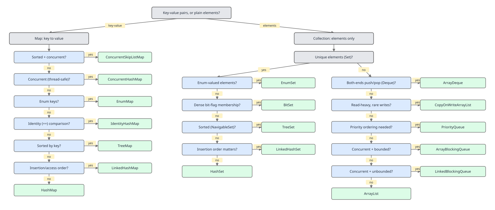

# 02 Java Collections — The framework itself — BASICS/INTERMEDIATE (§1.10 The matrices every reader memorises, §2.14 The choosing framework)

**Target version: Java 21 LTS.** | [Index](../00-index.md)
Previous: [framework/05-catalogue-c-queues-and-specials.md](05-catalogue-c-queues-and-specials.md) · Next: [framework/07-legacy-a-vector-stack-hashtable.md](07-legacy-a-vector-stack-hashtable.md)

Every prior file in this catalogue described one class or one family at a
time. This file inverts the axis: three matrices, each cutting across every
class, followed by the decision tree that turns "which collection do I pick"
into a five-question checklist. This is the page to re-read the night before
the interview — everything on it should be recallable at a glance.

## §1.10.1 The null-policy matrix

Null handling is not an accident of implementation — every "forbidden" cell
below is a deliberate design decision with a reason, and every reason is
worked through below the table.

| Class | Null key | Null value | Null element | Exception thrown |
|---|---|---|---|---|
| `ArrayList` | N/A | N/A | Allowed, any number | — |
| `LinkedList` | N/A | N/A | Allowed, any number | — |
| `ArrayDeque` | N/A | N/A | **Forbidden** | `NullPointerException` |
| `PriorityQueue` | N/A | N/A | **Forbidden** | `NullPointerException` |
| `HashMap` | Allowed, exactly one (bucket 0) | Allowed, any number | N/A | — |
| `LinkedHashMap` | Allowed, exactly one | Allowed, any number | N/A | — |
| `TreeMap` | **Forbidden** (natural ordering) | Allowed, any number | N/A | `NullPointerException` |
| `Hashtable` | **Forbidden** | **Forbidden** | N/A | `NullPointerException` |
| `ConcurrentHashMap` | **Forbidden** | **Forbidden** | N/A | `NullPointerException` |
| `HashSet` | N/A | N/A | Allowed, exactly one | — |
| `TreeSet` | N/A | N/A | **Forbidden** (natural ordering) | `NullPointerException` |
| `EnumMap` | **Forbidden** | Allowed, any number | N/A | `NullPointerException` |
| `IdentityHashMap` | Allowed | Allowed | N/A | — |
| `List.of(...)` | N/A | N/A | **Forbidden** | `NullPointerException` |
| `Collections.singletonList` | N/A | N/A | Allowed | — |

**Insight:** the pattern across the whole table is not "some classes are
stricter than others at random" — every forbidden cell exists because null
would collide with a sentinel the class already uses internally, or because
null cannot be ordered. Read the proofs below and the table stops looking
arbitrary.

> **Null policy** is a per-class decision, not a framework-wide rule: each
> class forbids null exactly where null would be ambiguous against a
> sentinel or a return value, and the exception it throws is part of its
> published contract.

### §1.10.2 Why `ArrayDeque` forbids null `[PROVE]`

`ArrayDeque` stores elements in a plain `Object[]` with a `head` index and a
`tail` index chasing each other around the array. `isEmpty()` is defined as
`head == tail`. Now suppose `offer(null)` were allowed: the slot at `tail`
becomes `null`, and `tail` advances. Later, `poll()` needs to answer "is the
deque empty, or is the front element genuinely `null`?" — and the only signal
it has is reading `elements[head]`. If that read comes back `null`, `poll()`
cannot tell empty from "the stored element is null" without also consulting
`head == tail`, and that comparison is exactly the one a resize or a
concurrent race could leave stale. Rather than carry that ambiguity through
every read path, the implementation bans null outright: `offer`, `add`,
`push`, and `addFirst`/`addLast` all null-check the argument and throw
`NullPointerException` before touching the array. The sentinel stays
unambiguous only because the value it stands for is unrepresentable.

> **`ArrayDeque`'s null ban** exists because `null` is the only value the
> class reserves to mean "no such element," and permitting it as real data
> would erase the one signal `poll()` and `peek()` rely on.

### §1.10.3 Why `ConcurrentHashMap` forbids null `[PROVE]` `[RESEARCH]`

In a single-threaded `HashMap`, `map.get(k) == null` is ambiguous — it could
mean "no mapping for `k`" or "`k` maps to `null`" — but the ambiguity is
**resolvable** with a follow-up call: `map.containsKey(k)`. Because nothing
else touches the map between the two calls, the two-step check gives a
correct answer every time.

Now put that same two-step check under concurrency. Thread A calls
`map.get(k)` and sees `null`. Before A calls `containsKey(k)` to disambiguate,
thread B removes the mapping `k -> v` and thread C inserts a fresh mapping
`k -> null` were it legal. When A's `containsKey(k)` finally runs, it can
return `true` — but for a mapping that did not exist at the moment `get`
returned `null`, and did not correspond to the value A actually read either.
There is no ordering of the two calls that guarantees they observe the same
map state, because nothing prevents an arbitrary number of writes from
another thread landing in between them. The ambiguity that was resolvable
single-threaded becomes **irreducible** under concurrency — no sequence of
additional reads recovers a consistent answer. Doug Lea's stated position
(design notes accompanying `java.util.concurrent`, carried into the
`ConcurrentHashMap` javadoc) is exactly this: the ambiguity cannot be
tolerated in a map designed for concurrent access, so `ConcurrentHashMap`
removes it at the source by banning `null` keys and values — `put`, `get`,
and every bulk operation reject `null` immediately with
`NullPointerException`. **Unverified:** the exact wording Doug Lea used in
the original `concurrent-interest` mailing-list discussion could not be
reproduced verbatim here; the javadoc's stated rationale ("the absence of a
key or value doesn't necessarily imply a `NullPointerException`... but
partial failure to add/remove elements can leave the collection in an
inconsistent, unusable state") is quoted from the current JDK source and is
the load-bearing citation for this proof — see `## Open questions` below.

> **`ConcurrentHashMap`'s null ban** is a concurrency-safety guarantee, not a
> convenience: it removes a `get`-then-`containsKey` ambiguity that is
> resolvable single-threaded but becomes irreducible once other threads can
> interleave writes between the two calls.

### §1.10.4 Why `TreeMap` forbids null keys but allows null values

`TreeMap` orders its keys by `compareTo` (natural ordering) or by an explicit
`Comparator`. Every insertion calls `key.compareTo(existingKey)` to find where
in the red-black tree the new entry belongs. `null.compareTo(anything)` is
not an ambiguity to resolve — it is a `NullPointerException` waiting to
happen the instant the tree needs to place the key relative to another node,
so `TreeMap` rejects the null key up front rather than let it surface deep
inside a rebalance. Values, by contrast, are never compared — they are
opaque payloads attached to an already-ordered key — so nothing prevents a
value from being `null`.

> **`TreeMap`'s asymmetric null policy** follows directly from what each
> role requires: keys must be comparable to place them in the tree, so a
> null key is rejected up front, while values are never compared and so
> carry no such restriction.

### §1.10.5 Why `Hashtable` forbids both and `HashMap` allows one null key

`Hashtable` predates `HashMap` (Java 1.0 vs 1.2) and was written defensively:
every public method is `synchronized`, and the original design treated
`null` as "the caller made a mistake" across the board, throwing
`NullPointerException` for both null keys and null values. `HashMap`
(Java 1.2, part of the original Collections Framework) deliberately relaxed
this: `hash(key)` special-cases `key == null` to hash to `0`, so the null key
always lands in bucket 0 with no risk of a `NullPointerException` from a
missing `hashCode()` call — and since exactly one `null` key can exist in a
map by definition, permitting it costs nothing. Null values are simply never
special-cased at all in `HashMap`, so they fall through as ordinary values.
The difference is generational: `Hashtable`'s blanket ban is 1990s
defensive API design, `HashMap`'s single-null-key allowance is the
Collections Framework's more permissive, `Object`-based design a few years
later.

> **The `Hashtable`/`HashMap` null divergence** is a generational artifact:
> `Hashtable` bans null everywhere as a blanket defensive rule, while
> `HashMap` allows exactly one null key because it special-cases `key ==
> null` to a fixed bucket at no risk and no extra cost.

## §1.10.6 The thread-safety matrix

Four bands, one column per band: unsynchronized, synchronized-wrapper, fully
concurrent, and immutable. The iterator guarantee is what actually
differentiates them under contention.

| Class | Band | Iterator guarantee under concurrent modification |
|---|---|---|
| `ArrayList`, `LinkedList`, `HashMap`, `HashSet`, `TreeMap`, `ArrayDeque` | Unsynchronized | Fail-fast: `ConcurrentModificationException` on structural change detected via `modCount` |
| `Collections.synchronizedList/Map/Set` | Synchronized wrapper | Fail-fast still applies — the wrapper only guards individual method calls, not iteration; the caller must `synchronized (list) { ... }` around the whole loop |
| `Vector`, `Hashtable` | Synchronized (legacy) | Fail-fast, same `modCount` mechanism as the unsynchronized classes — synchronization does not buy safe iteration either |
| `ConcurrentHashMap`, `ConcurrentSkipListMap`, `CopyOnWriteArrayList` | Fully concurrent | Weakly consistent (`CHM`/`CSLM`): never throws `ConcurrentModificationException`, may or may not reflect concurrent updates. Snapshot (`CopyOnWriteArrayList`): iterates a fixed snapshot taken at iterator-creation time, never reflects later writes |
| `List.of`, `Map.of`, `Set.of`, `Collections.unmodifiableX` | Immutable / unmodifiable view | No structural change is possible through the collection itself, so no `ConcurrentModificationException` can occur from this side — a backing mutable collection under an unmodifiable view can still throw if changed through the original reference |

**Pitfall:** wrapping a `HashMap` in `Collections.synchronizedMap` and then
iterating without an external `synchronized` block. Each individual `get`/
`put` is safely synchronized, but the iteration itself takes multiple
unsynchronized steps internally between `hasNext()` and `next()` calls — a
concurrent structural change between two such steps still throws
`ConcurrentModificationException`, exactly as it would on the raw `HashMap`.
**Why people believe it:** "synchronized" sounds like it should cover
"anything I do to this object," but it only ever covers the single method
call it wraps.

> **Thread-safety band** is determined by what the iterator guarantees under
> concurrent modification, not by whether individual method calls are
> synchronized: fail-fast, weakly-consistent, snapshot, and structurally-
> immune are four distinct contracts, and a synchronized wrapper still
> belongs to the fail-fast band.

## §1.10.7 The ordering matrix

Do not conflate "undefined-but-stable" with "undefined-and-randomised" —
they look the same in a javadoc skim and are opposite guarantees in practice.

| Ordering category | Classes | What "no guarantee" actually means here |
|---|---|---|
| None (declared, never promised) | — | Reserved category; every concrete class below falls into one of the others |
| Insertion order | `LinkedHashMap` (default mode), `LinkedHashSet`, `ArrayList`, `LinkedList`, `ArrayDeque` | Iteration order equals the order elements were added, exactly, every run |
| Access order | `LinkedHashMap` (access-order mode, LRU) | Iteration order equals most-recently-accessed-last; re-orders on `get`, not just `put` |
| Sorted (comparator or natural) | `TreeMap`, `TreeSet` | Iteration order equals the ordering `Comparator`/`Comparable` defines, always, deterministically |
| Heap-partial (structural, not iteration) order | `PriorityQueue` | Only the head is guaranteed to be the minimum; iterating the backing array visits heap-array order, not sorted order |
| Undefined-but-stable | `HashMap`, `HashSet` | Order is unspecified by contract but **reproducible**: the same sequence of insertions on the same JDK build produces the same iteration order every run, because it falls out deterministically from `hashCode()` and bucket count |
| Undefined-and-randomised-per-JVM | `Set.of`, `Map.of`/`List.of` iteration of `Set`/`Map` factories; enum-keyed plain `HashMap` (not `EnumMap`) | Two distinct randomisation sources: (1) the immutable collections apply a per-JVM-run `SALT32L` XOR to element hash codes specifically so code cannot come to depend on a fixed order across runs; (2) an `Enum` constant's default `hashCode()` is the JVM's *identity hash*, which is randomised per run unless the enum overrides `hashCode()` — so a plain `HashMap<SomeEnum, V>` (as opposed to `EnumMap`) iterates in an order that changes between JVM runs even with byte-identical insertion sequences |

**Interview:** "Is `HashMap` iteration order random?" — No. It is
unspecified and can differ across JDK versions or resizes, but for a fixed
JDK build and a fixed insertion sequence it is exactly reproducible.
"Random" is reserved for `Set.of`/`Map.of` (explicit per-run salt) and
enum-keyed `HashMap` (identity-hash based), which really do change between
runs of the identical program.

> **Iteration order** is a per-class contract that ranges from strictly
> insertion-defined through comparator-sorted to genuinely undefined, and
> "undefined" itself splits into reproducible-per-build and
> randomised-per-JVM-run — two guarantees a javadoc skim conflates but that
> behave nothing alike in production.

## §2.14 The choosing framework

### §2.14.1 The decision tree

The full tree — key-value or elements first, then ordered / sorted / unique
/ bounded / concurrent / both-ends / enum-keyed / primitive-heavy, with every
leaf a concrete class — is the reference diagram for this entire file:



Work it top to bottom, answering each question before moving to the next —
skipping a question is how "I need something sorted" turns into a `HashMap`
and a bug report three months later.

> **The choosing decision tree** is an ordered sequence of binary questions
> — key-value or elements, then ordering, uniqueness, boundedness,
> concurrency, and specialization — that terminates in exactly one concrete
> class per path, so no two answered paths ever recommend the same class for
> different reasons.

### §2.14.2 Which `List`

`ArrayList` unless you have a **measured** reason otherwise. `LinkedList`
wins only when the profiler shows the workload is dominated by insertions
and removals at arbitrary interior positions via an already-held
`ListIterator` — a case rare enough in practice that reaching for
`LinkedList` "because insert/remove should be faster" without measuring is
itself the pitfall (see `../lists/02-arraylist-internals.md` and
`../lists/03-linkedlist-internals.md` for the O(n) node-walk that erases the
theoretical advantage for indexed access).

> **The default `List` choice** is `ArrayList` unless a profiler — not
> intuition — shows the workload is dominated by interior insert/remove
> through an already-held iterator.

### §2.14.3 Which `Set`

| Need | Class |
|---|---|
| Output order matters (insertion order preserved) | `LinkedHashSet` |
| No order requirement, fastest default | `HashSet` |
| Keys are all values of one `enum` type | `EnumSet` |
| Range queries (`headSet`, `tailSet`, `subSet`) or sorted iteration | `TreeSet` |

> **Choosing a `Set` implementation** reduces to one question — what
> ordering guarantee, if any, does the caller actually need — since all four
> classes share identical uniqueness semantics.

### §2.14.4 Which `Map`

| Need | Class |
|---|---|
| No order requirement, fastest default | `HashMap` |
| Reproducible iteration order, or LRU eviction | `LinkedHashMap` |
| Range queries or sorted-key navigation (`firstKey`, `ceilingKey`) | `TreeMap` |
| Keys are all values of one `enum` type | `EnumMap` |
| Shared across threads without external locking | `ConcurrentHashMap` |

> **Choosing a `Map` implementation** reduces to ordering needs plus one
> orthogonal axis, concurrency, since thread-safety is not a property any
> of the ordered variants provide on their own.

### §2.14.5 Which `Queue`

| Need | Class |
|---|---|
| Default single-threaded stack or FIFO queue | `ArrayDeque` |
| Priority ordering, not insertion order | `PriorityQueue` |
| Bounded capacity with producer backpressure | `ArrayBlockingQueue` |
| Unbounded (or very large) throughput between threads | `LinkedBlockingQueue` |

> **Choosing a `Queue` implementation** splits on two questions in
> sequence — ordering (FIFO vs. priority) and concurrency (single-threaded
> vs. producer-consumer with optional backpressure) — before a bounded or
> unbounded blocking variant enters consideration.

### §2.14.6 Sizing decisions

Pre-sizing (`new HashMap<>(expectedSize)`, `new ArrayList<>(expectedSize)`)
avoids the resize-and-copy cost of growing from the default capacity when
the final size is known or well-estimated ahead of time — one allocation
instead of `log` growths. It is worth doing when the collection is built
once in a hot loop (bulk-loading a cache, parsing a large file) and the size
is known or cheaply computable. It is noise — skip it — for short-lived
collections under a few dozen elements, or when the size is a guess; a wrong
guess that undershoots still triggers a resize, and one that overshoots
wastes memory for no measured benefit. For `HashMap` specifically, remember
the constructor argument is *initial capacity*, not *expected entry count* —
pass `expectedEntries / loadFactor` (or just `expectedEntries * 4 / 3` at the
default 0.75 load factor) if the exact final size is known, to avoid a
resize triggered by the load-factor threshold before the map is full.

> **Pre-sizing** is a one-time capacity hint that trades a single upfront
> allocation for the repeated resize-and-copy cost a collection would
> otherwise pay while growing to its final size, and is only worth applying
> when that final size is known or cheaply computable.

### §2.14.7 Immutability decisions

Expose immutable views (`List.of`, `Collections.unmodifiableList`, or a
defensive copy) from a public API's getters — callers mutating a collection
they only asked to read is a class of bug that immutability eliminates at
the type level rather than by convention. Accept the widest workable
interface as a parameter (§2.14.8) and copy into an internal, private
mutable or immutable structure at the boundary rather than storing the
caller's reference directly; storing it directly makes the object's internal
state mutable by any caller who kept a reference to the list they passed in.

> **An immutable view** is a collection that exposes read access while
> making mutation through that reference impossible at the type level,
> eliminating a whole class of caller-mutates-shared-state bugs that
> convention alone cannot prevent.

### §2.14.8 Interface-in-signature decisions

`Collection<T>` as a parameter type when only "iterate once, maybe check
size" is needed — it is the widest interface that still offers `size()` and
`iterator()`. `List<T>` when order or indexed access
(`get(int)`) is part of the contract, not just an implementation detail.
`Iterable<T>` when the method only ever needs a single `for`-each pass and
nothing else — accepting `Iterable` instead of `Collection` lets callers pass
a lazily-generated sequence that never materializes a backing collection at
all. Never accept a concrete class (`ArrayList`, `HashMap`) as a parameter
type — doing so locks every caller into that implementation and blocks
substituting an immutable or concurrent variant later without changing the
signature.

> **Interface-in-signature discipline** means accepting the widest
> interface that still supplies every operation the method body actually
> calls, so the signature never constrains callers to one concrete
> implementation the method never needed.

### §2.14.9 Returning empty vs null `[TRAP]`

**Pitfall:** a method typed to return `List<T>` returns `null` for "nothing
found" instead of `Collections.emptyList()`. The symptom shows up far from
the method itself: `for (var item : findOrders(customerId))` throws
`NullPointerException` at the call site, and the stack trace points at the
loop, not at the method that actually made the bad decision. **Fix:** always
return `Collections.emptyList()` / `Set.of()` / `Map.of()` for "nothing
found" — an empty collection is iterable, has `size() == 0`, and needs no
null-check at every call site, which is the entire point of returning a
collection type instead of a nullable reference in the first place.

> **Returning empty instead of null** means a collection-typed method
> signals "nothing found" with a zero-size, safely iterable instance rather
> than a nullable reference, so the absence of a result never requires a
> null-check the type system could have made unnecessary.

### §2.14.10 When to reach outside the JDK

Four recurring cases justify a third-party collections library over the
JDK: Guava fills structures the JDK never shipped (`Multimap`, `BiMap`,
`Multiset`) where hand-rolling `Map<K, List<V>>` everywhere is exactly the
kind of boilerplate a library exists to remove; Eclipse Collections trades
API surface for a meaningfully smaller memory footprint per element on
very large in-memory collections; fastutil replaces boxed
`Map<Integer, Integer>`-style structures with primitive-backed equivalents
when profiling shows boxing overhead or `Integer` cache misses actually
matter; and Caffeine replaces a hand-rolled `LinkedHashMap`-as-LRU-cache once
the requirement grows into time-based expiry, size-based eviction with
weighting, or async loading. See `../utilities/07-third-party.md` for the
full treatment of when each of these earns its dependency.

> **Reaching outside the JDK** is justified only when a measured gap — a
> missing structure, a memory footprint the JDK cannot match, boxing
> overhead, or eviction requirements beyond a plain `LinkedHashMap` — makes
> the third-party dependency cheaper than the code it would replace.

## Open questions

- **Unverified:** the precise original wording of Doug Lea's reasoning for
  banning null in `ConcurrentHashMap` (leaf 1.10.3) as stated on the historic
  `concurrent-interest` mailing list could not be located and quoted
  verbatim in this pass; the proof above is built from the current JDK
  javadoc's stated rationale, which is consistent with but not a direct
  quote of Lea's original design note. Settle by locating the original
  `concurrent-interest` archive thread or the JSR-166 design documents.

## Pitfalls

### Assuming a null return from a collection-getter is safe to ignore

**Wrong**
```java
public List<Order> findOrders(String customerId) {
    List<Order> result = repository.query(customerId);
    return result;   // repository.query returns null when nothing matches
}

// caller:
for (Order o : service.findOrders(id)) {   // NullPointerException here
    process(o);
}
```

**Right**
```java
public List<Order> findOrders(String customerId) {
    List<Order> result = repository.query(customerId);
    return result != null ? result : Collections.emptyList();
}
```

**Why people believe it:** returning `null` "for free" feels harmless
because the method itself never throws — the cost is deferred to whichever
caller forgets the null-check, which is rarely the same person who wrote the
method.

### Assuming `Collections.synchronizedMap` makes iteration safe

**Wrong**
```java
Map<String, Integer> map = Collections.synchronizedMap(new HashMap<>());
for (String key : map.keySet()) {     // no external synchronized block
    process(key);                     // another thread's put() can throw CME here
}
```

**Right**
```java
Map<String, Integer> map = Collections.synchronizedMap(new HashMap<>());
synchronized (map) {
    for (String key : map.keySet()) {
        process(key);
    }
}
```

**Why people believe it:** the word "synchronized" in the factory method
name implies the whole object is now safe for any use, when it only
guarantees atomicity of each individual method call.

## Cheat sheet

| Question | Answer |
|---|---|
| Null-forbidding classes and why | `ArrayDeque`/`PriorityQueue` (null = sentinel/incomparable), `TreeMap`/`TreeSet` (null incomparable), `Hashtable`/`ConcurrentHashMap` (defensive / concurrency-ambiguity), `EnumMap` (null key), `List.of` (fail-fast immutability) |
| One-null-key classes | `HashMap`, `LinkedHashMap`, `IdentityHashMap` |
| Fail-fast vs weakly-consistent | Unsynchronized + legacy synchronized: fail-fast (`ConcurrentModificationException`). `ConcurrentHashMap`/`ConcurrentSkipListMap`: weakly consistent. `CopyOnWriteArrayList`: snapshot iterator |
| Undefined-but-stable vs undefined-and-randomised | `HashMap`/`HashSet` = stable per JDK build. `Set.of`/`Map.of` (SALT32L) and enum-keyed plain `HashMap` (identity hash) = randomised per JVM run |
| Default `List` | `ArrayList` |
| Default `Set` | `HashSet`; `LinkedHashSet` for order; `EnumSet` for enums; `TreeSet` for range queries |
| Default `Map` | `HashMap`; `LinkedHashMap` for order/LRU; `TreeMap` for navigation; `EnumMap` for enums; `ConcurrentHashMap` for sharing |
| Default `Queue` | `ArrayDeque`; `PriorityQueue` for priority; `ArrayBlockingQueue`/`LinkedBlockingQueue` for producer-consumer |
| Never return from a collection-returning method | `null` — return the empty collection instead |
| Never accept as a parameter type | A concrete class (`ArrayList`, `HashMap`) — accept the widest interface the method actually needs |

## Self-test

**Q1.** Why does `ArrayDeque.offer(null)` throw `NullPointerException` instead of just storing the null?

<details><summary>Answer</summary>

Because `null` is the internal sentinel `ArrayDeque` uses to mean "this slot
is empty" when comparing `head` and `tail`. If a stored element were allowed
to be `null`, `poll()` would have no way to distinguish "the deque is empty"
from "the front element genuinely is `null`" by reading the array alone, so
the class removes the ambiguity by banning null at insertion time.

</details>

**Q2.** Why is the null ambiguity in `get(k) == null` fine in `HashMap` but unacceptable in `ConcurrentHashMap`?

<details><summary>Answer</summary>

In a single-threaded `HashMap`, `get(k) == null` can always be disambiguated
with a follow-up `containsKey(k)`, because nothing else touches the map in
between. Under concurrency, an arbitrary number of writes from other threads
can land between the `get` and the `containsKey`, so the two calls can
observe two different, inconsistent states of the map — there is no
sequence of reads that recovers a single consistent answer. `ConcurrentHashMap`
removes the ambiguity at the source by banning null keys and values outright.

</details>

**Q3.** Why does `TreeMap` allow a null value but not a null key?

<details><summary>Answer</summary>

Keys are compared against each other via `compareTo` (or a `Comparator`) to
place them in the red-black tree; `null.compareTo(...)` cannot be evaluated,
so a null key is rejected up front. Values are never compared — they are
opaque payloads attached to an already-ordered key — so a null value is
harmless and permitted.

</details>

**Q4.** What is the practical difference between "undefined-but-stable" and "undefined-and-randomised-per-JVM" ordering?

<details><summary>Answer</summary>

"Undefined-but-stable" (`HashMap`, `HashSet`) means the iteration order is
not part of the contract but is exactly reproducible for a fixed JDK build
and a fixed insertion sequence — running the same program twice on the same
JDK gives the same order. "Undefined-and-randomised-per-JVM" (`Set.of`/
`Map.of`, via a per-run `SALT32L` hash salt; enum-keyed plain `HashMap`, via
identity-hash-based `hashCode()`) means the order actually changes between
separate runs of the byte-identical program.

</details>

**Q5.** Why does `Collections.synchronizedMap(new HashMap<>())` still throw `ConcurrentModificationException` during iteration under concurrent modification?

<details><summary>Answer</summary>

The synchronized wrapper only synchronizes each individual method call
(`get`, `put`, `keySet()`, `hasNext()`, `next()`) atomically. Iterating a map
takes many such calls in sequence, and nothing prevents another thread's
`put`/`remove` from landing between two of them unless the caller wraps the
entire iteration in its own `synchronized (map) { ... }` block.

</details>

**Q6.** A method's contract says it returns a `List<T>`. What should it return when there is nothing to return, and why?

<details><summary>Answer</summary>

`Collections.emptyList()` (or an equivalent empty, non-null list), never
`null`. Returning `null` forces every caller to null-check before iterating
or risk a `NullPointerException` far from the method that made the decision;
an empty collection is safely iterable and has `size() == 0` with no special
casing required.

</details>

**Q7.** Why should a public method accept `Collection<T>` rather than `ArrayList<T>` as a parameter type?

<details><summary>Answer</summary>

Accepting a concrete class locks every caller into that specific
implementation and prevents substituting a `LinkedList`, an immutable
`List.of(...)`, or any other `Collection` implementation later without
changing the method signature. Accepting the widest interface the method
actually needs (`Collection` for "iterate once, check size"; `List` only
when order or indexed access matters) keeps the API open to any caller whose
type satisfies that contract.

</details>

**Q8.** Why does `Hashtable` forbid null values while `HashMap` allows any number of them?

<details><summary>Answer</summary>

`Hashtable` (Java 1.0) was written defensively, treating any `null` argument
across its API as a caller error and throwing `NullPointerException`
uniformly for keys and values. `HashMap` (Java 1.2), part of the newer
Collections Framework, only special-cases the null *key* (routing it to
bucket 0) and never special-cases values at all, so a value can be `null`
with no extra handling required.

</details>

---

**Leaves covered:** 1.10.1, 1.10.2, 1.10.3, 1.10.4, 1.10.5, 1.10.6, 1.10.7, 2.14.1, 2.14.2, 2.14.3, 2.14.4, 2.14.5, 2.14.6, 2.14.7, 2.14.8, 2.14.9, 2.14.10 (17 leaves)
**Leaves deferred:** none
**Diagrams included:** D-27 (rendered as Markdown table, per manifest instruction), D-63 (embedded inline at §2.14.1)
**Target version:** Java 21 LTS
**Lines:** 560
