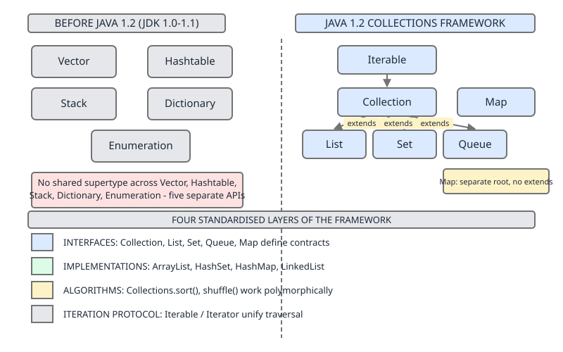

# 02 Java Collections — The framework itself — INTERMEDIATE (§2.15 Legacy members nobody explains)

**Target version: Java 21 LTS.** | [Index](../00-index.md)
Previous: [framework/06-matrices-and-choosing.md](06-matrices-and-choosing.md) · Next: [framework/07-legacy-b-version-history.md](07-legacy-b-version-history.md)

Before the Collections Framework arrived in Java 1.2, the JDK already shipped a handful of container classes — `Vector`, `Hashtable`, `Stack`, `Dictionary`, `Enumeration` — with no shared supertype, no common iteration protocol, and no interface hierarchy. The 1.2 framework didn't replace them; it retrofitted `List`/`Map`/`Iterator` on top of them and left the originals in place for binary compatibility. That's the picture below: five disconnected boxes on the left, four standardised layers on the right, with `Vector` and `Hashtable` awkwardly straddling both.



This file covers what those five classes actually do and why they still exist. The release-by-release story of *when* each retrofit happened, and the version traps buried in that history, are in the next file, [07-legacy-b-version-history.md](07-legacy-b-version-history.md).

## §2.15.1 — `Vector`

### Mental model first

`Vector` is `ArrayList` wearing a `synchronized` keyword on every method — a growable array where *every single call* (`get`, `add`, `size`, `elementAt`) takes the intrinsic lock on the `Vector` instance before doing anything. Picture `ArrayList`'s internals, then imagine `synchronized` stamped on top of each method signature. That's the entire mechanism.

### Why it exists

`Vector` predates the framework — Java 1.0. Back then, thread safety was assumed to belong to the collection itself, so `Vector` (and `Hashtable`) built locking directly into every method. That model fell out of favor once the framework arrived with the observation that whole-method synchronization is usually the wrong granularity for concurrent access (see 2.15.2) — the framework's `ArrayList` ships unsynchronized by design, and callers who need locking wrap it explicitly.

### When to reach for it, and when not

Reach for it: essentially never in new code. The only argument for `Vector` today is an existing API surface that already returns/accepts `Vector` (rare legacy interop, some very old third-party libraries) or `Stack`, which is built on it.

Don't reach for it when you want thread safety — see 2.15.2, the synchronization buys you far less than it appears to. For an unsynchronized growable array, `ArrayList` wins outright: no needless lock acquisition on single-threaded access, same amortized-O(1) `add`. For a *correctly* thread-safe list, `CopyOnWriteArrayList` (read-heavy, few writers) or `Collections.synchronizedList` (matching `Vector`'s method-level locking, but explicit and composable with your own external locking) both win — full treatment in `../concurrent-collections/01-thread-safety-and-wrappers.md` and `../concurrent-collections/04-copy-on-write.md`.

### How it works

Internally: an `Object[] elementData` field, a `size` counter, and a `capacityIncrement` field that controls growth. When `capacityIncrement > 0`, the array grows by exactly that many slots each time it's exceeded; when it's `0` (the default), `Vector` **doubles** capacity — `newCapacity = oldCapacity * 2` — which is the one growth-arithmetic difference from `ArrayList`'s 1.5x growth (`oldCapacity + (oldCapacity >> 1)`). Every mutating and reading method — `add`, `get`, `remove`, `size`, `elementAt`, `addElement`, `removeAllElements`, `firstElement`, `lastElement` — is declared `synchronized`.

- `elementAt(int index)` — pre-generics equivalent of `get(index)`, still present for legacy callers.
- `addElement(Object obj)` — pre-generics equivalent of `add(obj)`; returns `void`, not `boolean`.
- `removeAllElements()` — equivalent of `clear()`, but additionally throws nothing on empty and is itself `synchronized` (so is `clear()`, inherited from `AbstractList` overridden in `Vector`).
- `firstElement()` / `lastElement()` — throw `NoSuchElementException` on empty rather than returning `null` or throwing `IndexOutOfBoundsException`; contrast with `get(0)` / `get(size()-1)`, which throw `IndexOutOfBoundsException`.

```java
Vector<String> v = new Vector<>(4, 0);   // initialCapacity=4, capacityIncrement=0 -> doubles
v.addElement("a");
v.addElement("b");
System.out.println(v.elementAt(0));      // "a"
System.out.println(v.firstElement());    // "a"
System.out.println(v.lastElement());     // "b"
v.removeAllElements();
System.out.println(v.isEmpty());         // true
```

**Pitfall:** assuming `capacityIncrement` still matters for performance tuning the way it did in the 1990s. In practice nobody sets it; the default doubling behaves like any other growable array, and the field survives purely for compatibility with code written when JVMs had far tighter heap budgets.

> `Vector` is a `synchronized`, doubling-growth, pre-generics growable array — the direct ancestor `ArrayList` was built to replace.

## §2.15.2 — Why `Vector` is not a drop-in thread-safe `ArrayList` `[TRAP]` `[PROVE]`

### Mental model first

Method-level synchronization protects *one call* at a time. It says nothing about two calls back to back. If your logic is "check something, then act on what you saw," the check and the act are two separate lock acquisitions — and another thread can slip in between them. `Vector` synchronizes the door to each room; it does not synchronize the hallway between rooms.

### Why it exists (as a belief, and why it's wrong)

The intuition "every method is `synchronized`, therefore the collection is thread-safe for anything I do with it" is natural and wrong. It conflates *method atomicity* with *program atomicity*. `Vector`'s locking guarantees each individual call to `add` or `contains` sees a consistent internal array. It guarantees nothing about the relationship between two calls made by the same thread of logic.

### When this bites, and when it doesn't

It doesn't bite for single-operation access from multiple threads (`v.add(x)` from thread A racing `v.get(0)` from thread B is genuinely safe — each call is atomic and the internal state stays consistent). It bites the moment your code performs a **compound action**: read-then-write, check-then-act, iterate-then-mutate.

### How it works — the actual race, worked through

Two threads run this on a shared `Vector<String>` `v`, both trying to insert `"x"` only if it isn't already present:

```java
Vector<String> v = new Vector<>();

Runnable insertIfAbsent = () -> {
    if (!v.contains("x")) {
        v.add("x");
    }
};

Thread t1 = new Thread(insertIfAbsent);
Thread t2 = new Thread(insertIfAbsent);
t1.start();
t2.start();
t1.join();
t2.join();
System.out.println(v);   // can print [x, x]
```

Walk the interleaving:

1. Thread 1 calls `v.contains("x")` — acquires the lock, scans, finds nothing, releases the lock, returns `false`.
2. **Before thread 1 reaches `v.add("x")`**, the scheduler switches to thread 2.
3. Thread 2 calls `v.contains("x")` — acquires the lock, scans (still empty), releases the lock, returns `false`.
4. Thread 2 calls `v.add("x")` — acquires the lock, appends, releases.
5. Scheduler resumes thread 1, which still holds the (now stale) answer `false` from step 1. It calls `v.add("x")` — acquires the lock, appends, releases.

Result: `v` contains `["x", "x"]`, even though `contains` and `add` were each individually `synchronized` the entire time. The lock was never held across the *gap* between the check and the act — only during each call.

**The fix:** wrap the whole compound action in one `synchronized` block on the same monitor `Vector` already uses internally:

```java
synchronized (v) {
    if (!v.contains("x")) {
        v.add("x");
    }
}
```

Because `Vector`'s own methods synchronize on `this`, taking the lock externally on `v` excludes both threads from the entire compound action, closing the gap. But notice what just happened: the fix is an *external* lock the caller had to add by hand. `Vector`'s built-in per-method locking contributed nothing to correctness here — an unsynchronized `ArrayList` wrapped in the exact same `synchronized (list) { … }` block would behave identically, at the cost of one fewer redundant lock acquisition per call (no double-locking from `Vector`'s internal `synchronized` plus your external one).

**Insight:** thread-safety of a *class* is not the same as thread-safety of a *program*. A collection can be internally perfectly synchronized and your usage of it can still race, because correctness requirements live at the level of your invariant ("no duplicate `x`"), not at the level of any single method call.

### Iteration is fail-fast, not safely serialised

Per-method synchronization also does not make **iteration** atomic, because iteration is many method calls (`hasNext`/`next`, repeatedly), not one. `Vector`'s iterator is fail-fast exactly like `ArrayList`'s: it tracks a `modCount` snapshot at creation and compares it on every `next()`.

```java
Vector<Integer> nums = new Vector<>(List.of(1, 2, 3));
Thread writer = new Thread(() -> nums.add(4));

for (Integer n : nums) {          // for-each uses the fail-fast Iterator
    writer.start();
    try { writer.join(); } catch (InterruptedException ignored) {}
    System.out.println(n);
}
// throws ConcurrentModificationException on the next call to next(),
// it does not safely interleave the writer's insert into the iteration
```

A concurrent structural modification during iteration throws `ConcurrentModificationException` (or, worse, in rare cases produces undefined behaviour if `hasNext`/`next` race without a happens-before edge at all) — it does not get safely serialised the way a per-call lock might suggest. Full `modCount` mechanics are in `../iteration/02-fail-fast-fail-safe.md`.

**Pitfall:** believing "`Vector` is synchronized, so I can safely iterate it from one thread while another thread mutates it." Symptom: intermittent `ConcurrentModificationException`, or silent corruption under `-ea`-off builds. Fix: either external `synchronized (v) { for (...) }` around the *entire* iteration (which serializes the writer out until iteration completes), or don't share the mutable list across threads during iteration at all — reach for `CopyOnWriteArrayList` if concurrent iteration during mutation is the actual requirement (`../concurrent-collections/04-copy-on-write.md`).

> `Vector`'s per-method synchronization makes each individual call atomic, but neither compound check-then-act sequences nor iteration are single calls — both require an external lock that `Vector` does not provide for you.

## §2.15.3 — `Stack` `[TRAP]`

### Mental model first

`Stack` is `Vector` with four extra methods (`push`, `pop`, `peek`, `empty`) and one lookup method (`search`) bolted on — it does not reimplement storage, it *extends* `Vector` and treats the high-index end of the underlying array as the "top" of the stack. Because it inherits `Vector` wholesale, it also inherits `Vector`'s iterator, which knows nothing about "top" and "bottom" — it just walks the array from index 0.

### Why it exists

Same era as `Vector` — Java 1.0, before `Deque` existed. It's a stack shoehorned onto an already-existing growable-array class rather than a purpose-built LIFO structure.

### When to reach for it, and when not

Never for new code. The Javadoc for `Stack` itself recommends `Deque` instead: `ArrayDeque` implements `Deque` and is documented as faster than `Stack` when used as a stack (`push`/`pop`/`peek` on `Deque`), with no synchronization overhead and no surprising inherited `Vector` API surface (`insertElementAt`, `elements()`, index-based `get`, all still technically callable on a `Stack` because it *is* a `Vector` — nothing stops you from indexing into the "stack" at an arbitrary position, which breaks the LIFO abstraction entirely).

### How it works, and the two traps

**`search` returns a 1-based distance, not a 0-based index.** Searching for the element currently on top of the stack returns `1`, not `0`. A miss returns `-1`, not `-1` cast from `indexOf`'s `-1` convention being reused consistently elsewhere in the JDK — it happens to match `indexOf`'s miss value but not its found-value convention.

```java
Stack<String> s = new Stack<>();
s.push("bottom");
s.push("middle");
s.push("top");

System.out.println(s.search("top"));     // 1  (distance from the top, not index 2)
System.out.println(s.search("bottom"));  // 3  (three positions from the top)
System.out.println(s.search("nope"));    // -1 (miss)
```

**Pitfall:** treating `search`'s return value like an `indexOf`-style array index (0-based, `-1` on miss). Symptom: off-by-one logic when converting a `search` result into "how many pops until I reach this element" (that part is actually correct — `search`'s result *is* pop-distance) versus "what array index is this at" (that part is wrong by exactly one, and further scrambled because `search` counts from the top while the backing array is indexed from the bottom). Fix: never use `search`'s return value as an array index into the `Stack`; treat it purely as a 1-based "how many `pop()` calls to reach it" count, or avoid `search` altogether and use `Deque`'s absence of any equivalent method as a signal that this isn't an idiomatic operation to depend on.

**Iteration walks bottom-to-top — the opposite of pop order.** Because `Stack extends Vector` and inherits its iterator unmodified, a for-each loop over a `Stack` visits index 0 first — the element pushed *first*, i.e. the bottom of the stack — and finishes at the last-pushed element, the top. That is backwards from `pop()` order, which removes top-first (last-pushed-first).

```java
Stack<Integer> s = new Stack<>();
s.push(1);
s.push(2);
s.push(3);

for (int x : s) System.out.print(x + " ");   // 1 2 3  -- bottom to top
System.out.println();

while (!s.isEmpty()) System.out.print(s.pop() + " ");  // 3 2 1  -- top to bottom (LIFO)
```

Contrast with `ArrayDeque` used as a stack, whose iterator is explicitly documented to run in the order elements would be popped — top-first:

```java
Deque<Integer> stack = new ArrayDeque<>();
stack.push(1);
stack.push(2);
stack.push(3);

for (int x : stack) System.out.print(x + " ");   // 3 2 1  -- matches pop order
```

**Interview:** "Why does iterating a `java.util.Stack` not give you elements in pop order?" — because `Stack` is bolted onto `Vector`'s array-index iteration rather than being a purpose-built LIFO type; `ArrayDeque` was designed with the stack use case in mind and its iterator order matches `pop()` order by contract.

> `java.util.Stack` is a `Vector` with LIFO methods added on top; its inherited `search` is 1-based with a `-1` miss, and its inherited iterator runs bottom-to-top — both surprises stem from the same root cause, that `Stack` is not a purpose-built stack type.

## §2.15.4 — `Hashtable`

### Mental model first

`Hashtable` is a `Map` implementation from the same 1.0 era as `Vector` — a synchronized, `null`-hostile, modulo-indexed hash table, later retrofitted with the `Map` interface. Think of it as "`HashMap`, but every method is `synchronized`, no key or value may be `null`, and bucket selection uses `hash % capacity` instead of a power-of-two bitmask."

### Why it exists

Same story as `Vector`: pre-framework, method-level synchronization baked into the class itself, and a growth/indexing scheme designed before `HashMap`'s bit-masking trick was adopted.

### When to reach for it, and when not

Never for new single-threaded code — `HashMap` is strictly better (faster, allows one `null` key and multiple `null` values, unsynchronized). For genuinely concurrent maps, `ConcurrentHashMap` wins outright: finer-grained locking (historically per-segment, now per-bin with CAS operations), much better throughput under contention, and it still forbids `null` (a deliberate design choice carried forward from `Hashtable`, for the same reason — `null` as a value is ambiguous with "key absent" in a concurrent map where another thread could remove the key between your `containsKey` and `get`). The only place `Hashtable` legitimately survives is decades-old code that already depends on its exact synchronization semantics and hasn't been touched.

### How it works

**Pitfall:** `contains(Object)` on `Hashtable` means `containsValue`, not `containsKey` — the exact opposite of what every other `Map`-family method name would lead you to assume, and the opposite of what `contains` means on a `Collection`. `Hashtable` predates the `Map` interface (which added `containsKey`/`containsValue` explicitly later); `contains` was the original 1.0 method name and was kept for compatibility once `Map` was retrofitted on top.

```java
Hashtable<String, Integer> t = new Hashtable<>();
t.put("a", 1);
System.out.println(t.contains(1));        // true  -- checks VALUES
System.out.println(t.contains("a"));      // false -- "a" is a key, not a value
System.out.println(t.containsKey("a"));   // true  -- what you probably meant
```

**Growth arithmetic `[NUM]`:** default initial capacity is **11** (an odd number, not a power of two), and `rehash()` grows via `newCapacity = (oldCapacity << 1) + 1` — i.e. `2n + 1`. Starting from 11: `11 → 23 → 47 → 95 → 191 → …`. Each step doubles and adds one, which (starting from an odd number) keeps every capacity odd — that matters for the modulo-indexing scheme below, where an odd capacity spreads hash values across buckets more evenly under `%` than an even one would.

**`HashMap` vs `Hashtable` indexing — a genuine mechanism difference, not just cosmetic:** `HashMap` capacities are always powers of two, and bucket selection is `hash & (capacity - 1)` — a bitmask, computed in a couple of cycles, which only works correctly (i.e., uses all the bits of a well-spread capacity mask) when capacity is a power of two. `Hashtable` instead uses `hash % capacity`, a genuine modulo/division operation, which is why it has no need for power-of-two capacities in the first place — modulo indexing distributes reasonably across *any* capacity, at the cost of an integer division per put/get instead of a bitwise AND. This indexing difference, and how it interacts with `HashMap`'s resize/rehash and iteration order, is covered in full in `../hash-map/05-internals-e-sizing-and-iteration.md`.

`keys()` and `elements()` return `Enumeration<K>` and `Enumeration<V>` respectively — pre-`Iterator` traversal, covered in 2.15.6. `rehash()` is the internal method triggered once the table's load factor threshold is crossed; it allocates the new (`2n+1`-sized) array and re-inserts every entry, recomputing each one's bucket for the new capacity — structurally the same idea as `HashMap`'s resize, just with different capacity arithmetic and, being `Hashtable`, done under the table's lock.

```java
Hashtable<String, Integer> t = new Hashtable<>();  // initial capacity 11
for (int i = 0; i < 9; i++) t.put("k" + i, i);     // crosses default load factor 0.75 -> rehash to 23
```

> `Hashtable` is a synchronized, `null`-forbidding hash map that grows `2n+1` from an initial capacity of 11 and indexes buckets with `hash % capacity` rather than `HashMap`'s power-of-two bitmask.

## §2.15.5 — `Dictionary`

`Dictionary<K,V>` is an abstract *class* (not an interface) predating the framework, declaring the basic key/value contract (`put`, `get`, `remove`, `size`, `isEmpty`, `keys`, `elements`) that `Hashtable` originally implemented before `Map` existed. It sits awkwardly in an interface-first world: today's framework expresses "is a key/value store" via the `Map` interface, but `Dictionary` is a class, so nothing can both extend `Dictionary` for compatibility and freely extend some other class. `Hashtable` is the sole meaningful subclass ever to matter, and it now also implements `Map` — `Dictionary` is a vestigial ancestor kept solely because removing it would break `Hashtable`'s type hierarchy for any code still typed against `Dictionary` directly.

> `Dictionary` is the abstract-class ancestor of `Hashtable` from before `Map` existed — a fossil kept only for `Hashtable`'s inheritance chain.

## §2.15.6 — `Enumeration` vs `Iterator`

### Mental model first

`Enumeration` is `Iterator` with the training wheels welded on: two methods instead of three, read-only, and no defined relationship to concurrent modification at all.

### How it works

| | `Enumeration` | `Iterator` |
|---|---|---|
| Method count | 2 | 2 core + `remove` = 3 |
| Method names | `hasMoreElements()`, `nextElement()` | `hasNext()`, `next()`, `remove()` |
| `remove` support | none | optional (`remove()`, `UnsupportedOperationException` if unsupported) |
| Fail-fast | no defined behaviour — no `modCount` check | yes, for framework collections (`ConcurrentModificationException`) |
| Still encountered in modern JDK | `ZipFile.entries()`, `ServletRequest.getHeaders(name)`, `NetworkInterface.getNetworkInterfaces()`, `Properties.propertyNames()`, `Hashtable.keys()`/`elements()` | everywhere in the framework: `Collection.iterator()`, enhanced for-loop desugaring |

`ListIterator` extends `Iterator` with bidirectional traversal and in-place mutation: `hasPrevious()`, `previous()`, `previousIndex()`, `nextIndex()`, `set(E)`, `add(E)` — seven methods total, available only on `List` implementations (`list.listIterator()`), not on `Set` or `Map` views.

| | `Enumeration` | `Iterator` | `ListIterator` |
|---|---|---|---|
| Direction | forward only | forward only | both directions |
| Can remove | no | yes (`remove`) | yes (`remove`) |
| Can insert mid-traversal | no | no | yes (`add`) |
| Can replace in place | no | no | yes (`set`) |

**Insight:** `Enumeration` surviving into modern APIs isn't nostalgia — `ZipFile`, `ServletRequest`, and `NetworkInterface` are all APIs whose public shape was frozen before or shortly after `Iterator` existed, and changing a public method's return type is a binary-incompatible change. They're stuck with `Enumeration` for the same reason `Vector` and `Hashtable` are stuck existing at all: someone, somewhere, compiled against the old signature.

> `Enumeration` is a two-method, `remove`-less, non-fail-fast predecessor to `Iterator`, still surfacing wherever a public API's method signature was frozen before `Iterator` existed.

## §2.15.7 — `Enumeration.asIterator()` `[RESEARCH]`

Verified against the `java.util.Enumeration` javadoc: `asIterator()` is a **default method added in Java 9** on the `Enumeration` interface itself, returning an `Iterator<E>` that walks the remaining elements of the `Enumeration` it was called on. The returned iterator is a thin adapter — `hasNext()` delegates to `hasMoreElements()`, `next()` delegates to `nextElement()` — and it does **not** support `remove()` (calling it throws `UnsupportedOperationException`, since the adapter has no way to mutate whatever backing structure the original `Enumeration` was reading from).

```java
Hashtable<String, Integer> t = new Hashtable<>();
t.put("a", 1);
t.put("b", 2);

Iterator<String> it = t.keys().asIterator();   // bridges Enumeration -> Iterator, Java 9+
while (it.hasNext()) {
    System.out.println(it.next());
}
```

This exists purely to let modern code that expects an `Iterator` (for-each desugaring, `Iterable`-consuming utility methods, stream-adjacent helpers) consume a legacy `Enumeration`-returning API without hand-rolling the adapter every time.

> `Enumeration.asIterator()` (Java 9+) is a default method that wraps an `Enumeration` in a non-removing `Iterator`, letting legacy `Enumeration`-based APIs interoperate with modern `Iterator`-consuming code.

## §2.15.8 — Why the legacy classes remain

Binary compatibility. Java's promise is that a `.class` file compiled against JDK 1.1 keeps running unmodified on JDK 21 — removing `Vector`, `Stack`, `Hashtable`, `Dictionary`, or `Enumeration` would break every 1998-era `.class` file (and every library still built against them) the moment it tried to load on a modern JVM. The JDK's answer was never "delete and replace," it was "leave the original in place, retrofit it to also satisfy the new interfaces (`List`, `Map`) where feasible, and let new code simply not use it." That retrofit — *when* `Vector` and `Hashtable` actually gained `List`/`Map` interfaces, and the specific version traps that came with it — is the entire subject of the next file.

> The legacy collection classes remain in the JDK solely because deleting them would break binary compatibility with decades of already-compiled `.class` files that reference them directly.

## §2.15.9 — Interview framing: "why not just use `Vector`"

**The 60-second answer:** "`Vector` looks like a thread-safe `ArrayList` because every method is `synchronized`, but that only makes each *individual call* atomic — it doesn't make compound operations like check-then-add atomic, and it doesn't make iteration safe against concurrent modification, since iteration is fail-fast just like `ArrayList`'s. So in practice you either need an external lock around your compound operations — at which point plain `ArrayList` plus that same lock does the same job with less overhead — or you need a collection actually designed for concurrent access, like `CopyOnWriteArrayList` for read-heavy/rarely-mutated lists or `Collections.synchronizedList` when you want `Vector`-equivalent per-call locking without the legacy baggage. `Vector` also predates generics-friendly, doubling-by-default growth being the framework norm, and it drags in `Stack`'s bolted-on LIFO semantics as a side effect of `Stack extends Vector`. There's essentially no situation in new code where `Vector` is the right choice over `ArrayList` plus deliberate synchronization, or a purpose-built concurrent collection."

**The follow-up: "so when *is* `Vector` correct?"** Only when interoperating with an existing API that specifically requires or returns `Vector` (some old Swing APIs, some legacy third-party libraries) — i.e., never by choice, only by an external contract you don't control. Given a free choice, there's no scenario where `Vector` wins over `ArrayList` (unsynchronized, single-threaded) or `CopyOnWriteArrayList`/`Collections.synchronizedList` (correctly synchronized, multi-threaded).

> When asked "why not `Vector`," the answer is: per-method synchronization doesn't cover compound operations or iteration, so you end up adding your own locking anyway — at which point `ArrayList` plus that lock, or a purpose-built concurrent collection, both beat `Vector` outright.

## Table — legacy class to modern replacement

| Legacy class | Modern replacement | One-line reason | Case where legacy still wins |
|---|---|---|---|
| `Vector` | `ArrayList` (single-threaded) / `CopyOnWriteArrayList` or `Collections.synchronizedList` (concurrent) | per-method sync covers single calls only, not compound ops or iteration | existing API contractually requires/returns `Vector` |
| `Stack` | `ArrayDeque` (as a stack) | purpose-built LIFO, pop-order iteration, no `Vector` baggage, faster | none — no correctness or performance case favors `Stack` |
| `Hashtable` | `HashMap` (single-threaded) / `ConcurrentHashMap` (concurrent) | unsynchronized `HashMap` is faster single-threaded; `ConcurrentHashMap` has far better concurrent throughput | legacy code already relying on `Hashtable`'s exact whole-table-locked semantics |
| `Dictionary` | `Map` | interface, not abstract class; fits the framework's type hierarchy | none — only relevant as `Hashtable`'s ancestor |
| `Enumeration` | `Iterator` (or `Enumeration.asIterator()` to bridge) | `remove` support, fail-fast semantics, framework-wide consistency | consuming an existing `Enumeration`-only API you don't control |

## Scope notes

`Properties extends Hashtable<Object,Object>` and calling `put`/`putAll` directly on a `Properties` instance is a documented footgun (it bypasses the type-safety `Properties` layers on top and can insert non-`String` entries that break `store`/`load`) — covered in `framework/04-catalogue-b-maps.md`. The full release-by-release history of when `Vector` and `Hashtable` were retrofitted onto `List`/`Map`, and the three version traps that came out of that retrofit, are the entire subject of the next file, [07-legacy-b-version-history.md](07-legacy-b-version-history.md). `CopyOnWriteArrayList` and `Collections.synchronizedList` — the two actual answers to "I need a thread-safe list" — get full treatment in `../concurrent-collections/01-thread-safety-and-wrappers.md` and `../concurrent-collections/04-copy-on-write.md`. `modCount` and fail-fast mechanics underlying every fail-fast iterator claim above are detailed in `../iteration/02-fail-fast-fail-safe.md`. `Hashtable`'s modulo indexing contrasted in full against `HashMap`'s mask-based indexing lives in `../hash-map/05-internals-e-sizing-and-iteration.md`.

## Pitfalls

### Assuming `Vector`'s synchronized methods make check-then-act safe

**Wrong**
```java
Vector<String> v = new Vector<>();
// two threads both running:
if (!v.contains("x")) {
    v.add("x");
}
// output can be [x, x] -- duplicate inserted despite every method being synchronized
```

**Right**
```java
synchronized (v) {
    if (!v.contains("x")) {
        v.add("x");
    }
}
// external lock covers the whole compound action, closing the gap between check and act
```

**Why people believe it:** every method on `Vector` genuinely is `synchronized`, so it's a reasonable-sounding (but wrong) inference that "synchronized methods" implies "safe compound sequences of those methods."

### Treating `Hashtable.contains` as `containsKey`

**Wrong**
```java
Hashtable<String, Integer> t = new Hashtable<>();
t.put("a", 1);
if (t.contains("a")) { /* assumed: key "a" is present */ }
// actually checks whether "a" is a VALUE anywhere in the table -- coincidentally false here
```

**Right**
```java
if (t.containsKey("a")) { /* correct: checks keys */ }
```

**Why people believe it:** every other `Map` method that mentions a key (`get`, `remove`, `containsKey`) genuinely operates on keys, and `contains` is a natural-sounding shorthand for `containsKey` — it's just that `Hashtable` predates `Map` and kept its original 1.0-era method name, which meant "contains this value," matching `Collection.contains` semantics instead.

### Treating `Stack.search`'s return value as an array index

**Wrong**
```java
Stack<String> s = new Stack<>();
s.push("bottom"); s.push("top");
int idx = s.search("top");
String same = s.get(idx);   // WRONG: get(1) is "top" here by coincidence on a 2-element stack,
                             // but search's contract is distance-from-top, not array index,
                             // and the two diverge on any stack with more than 2 elements
```

**Right**
```java
int distanceFromTop = s.search("top");   // 1-based distance, -1 on miss
// use it only as "how many pops to reach this element," never as an index
```

**Why people believe it:** `indexOf`-style methods across the JDK return 0-based array indices with `-1` on miss, so `search`'s `-1`-on-miss convention looks familiar right up until the found-value convention turns out to be a completely different (1-based, top-relative) number.

## Cheat sheet

| Fact | Value |
|---|---|
| `Vector` growth (default `capacityIncrement=0`) | doubles: `oldCapacity * 2` |
| `Vector.firstElement()`/`lastElement()` on empty | throws `NoSuchElementException` |
| `Stack.search` on top element | returns `1` (not `0`) |
| `Stack.search` on miss | returns `-1` |
| `Stack` iteration order | bottom-to-top (opposite of pop order) |
| `ArrayDeque`-as-stack iteration order | top-to-bottom (matches pop order) |
| `Hashtable` default initial capacity | 11 |
| `Hashtable.rehash()` growth | `2n + 1` (11 → 23 → 47 → 95 → 191) |
| `Hashtable` bucket indexing | `hash % capacity` (modulo) |
| `HashMap` bucket indexing | `hash & (capacity - 1)` (bitmask, requires power-of-two capacity) |
| `Hashtable.contains(x)` means | `containsValue(x)`, not `containsKey(x)` |
| `Enumeration` method count | 2 (`hasMoreElements`, `nextElement`) |
| `Iterator` method count | 2 core + optional `remove` = 3 |
| `ListIterator` method count | 7 (adds `hasPrevious`, `previous`, `nextIndex`, `previousIndex`, `set`, `add`) |
| `Enumeration.asIterator()` added in | Java 9 |
| `Enumeration.asIterator()` supports `remove` | no — `UnsupportedOperationException` |
| Why legacy classes still exist | binary compatibility with pre-1.2 compiled code |

## Self-test

**Q1.** Two threads both run `if (!v.contains(x)) v.add(x);` on a shared `Vector<String>`. Every method `Vector` exposes is `synchronized`. Can this still produce a duplicate `x`? Why?

<details><summary>Answer</summary>

Yes. `synchronized` on each method makes that individual call atomic, but the lock is released between the `contains` call and the `add` call. A thread can read "not present" from `contains`, get preempted before calling `add`, let another thread also read "not present" and insert, and then resume and insert its own copy — two inserts, one stale read each. Fixing it requires wrapping the entire check-then-act sequence in one `synchronized (v) { ... }` block so the lock is held across both calls.

</details>

**Q2.** What does `stack.search("top")` return if `"top"` is the most recently pushed element, and what does it return if `"top"` isn't in the stack at all?

<details><summary>Answer</summary>

`1` for the most recently pushed element (distance from the top is 1-based, so the top itself is distance 1, not 0), and `-1` if the element isn't found.

</details>

**Q3.** Why does iterating a `java.util.Stack` with a for-each loop visit elements in the opposite order to calling `pop()` repeatedly?

<details><summary>Answer</summary>

`Stack extends Vector` and doesn't override `iterator()`, so it inherits `Vector`'s array-index iterator, which walks from index 0 upward — index 0 being the first element pushed, i.e. the bottom of the stack. `pop()`, by contrast, removes from the high-index end (the top) first. So for-each gives bottom-to-top order while `pop()` gives top-to-bottom (LIFO) order — two different traversal directions over the same backing array.

</details>

**Q4.** `Hashtable`'s default initial capacity is 11. After enough insertions to trigger three `rehash()` calls, what is the table's capacity?

<details><summary>Answer</summary>

`rehash()` applies `2n + 1` each time: 11 → 23 (first rehash) → 47 (second) → 95 (third). Capacity after three rehashes is 95.

</details>

**Q5.** `map.contains(value)` is called on a `Hashtable<String, Integer>`. What does it actually check, and what method should have been called instead to check for a key?

<details><summary>Answer</summary>

`Hashtable.contains(Object)` checks whether `value` is present as a **value** anywhere in the table — it's equivalent to `containsValue`, a holdover from before `Map` (with its `containsKey`/`containsValue` split) existed. To check for a key, call `containsKey(key)` instead.

</details>

**Q6.** Why does `HashMap` require power-of-two capacities but `Hashtable` doesn't?

<details><summary>Answer</summary>

`HashMap` indexes buckets with `hash & (capacity - 1)`, a bitmask operation that only correctly uses all the low-order bits of the hash when `capacity - 1` is all ones in binary — true only for powers of two. `Hashtable` instead indexes with `hash % capacity`, an actual modulo operation that distributes reasonably across any capacity value, so it has no structural need to restrict capacities to powers of two (and in fact deliberately keeps them odd, via `2n+1` growth from an odd starting capacity of 11).

</details>

**Q7.** Name two methods `Enumeration` lacks that `Iterator` has, and one modern JDK API that still returns `Enumeration` today.

<details><summary>Answer</summary>

`Enumeration` lacks `remove()` (no mutation during traversal) and has no fail-fast guarantee comparable to `Iterator`'s `modCount` check. Modern APIs still returning `Enumeration` include `ZipFile.entries()`, `ServletRequest.getHeaders(name)`, `NetworkInterface.getNetworkInterfaces()`, and `Properties.propertyNames()`.

</details>

**Q8.** What does `Enumeration.asIterator()` do, when was it added, and can the `Iterator` it returns remove elements?

<details><summary>Answer</summary>

Added in Java 9 as a default method on `Enumeration`, it returns an `Iterator` adapter whose `hasNext()`/`next()` delegate to `hasMoreElements()`/`nextElement()`. It cannot remove elements — calling `remove()` on the returned iterator throws `UnsupportedOperationException`, since the adapter has no mutation path back into whatever produced the original `Enumeration`.

</details>

**Q9.** An interviewer asks "why not just use `Vector`?" and then follows up with "so when is `Vector` actually correct?" What's the follow-up answer?

<details><summary>Answer</summary>

Only when interoperating with an existing API that specifically requires or returns `Vector` — some legacy Swing APIs or older third-party libraries. Given a free choice, there is no scenario where `Vector` beats `ArrayList` (unsynchronized, single-threaded use) or `CopyOnWriteArrayList`/`Collections.synchronizedList` (correctly synchronized, multi-threaded use).

</details>

**Q10.** Why does `java.util` still ship `Vector`, `Hashtable`, `Stack`, `Dictionary`, and `Enumeration` at all, given that better alternatives have existed since Java 1.2?

<details><summary>Answer</summary>

Binary compatibility. Removing any of them would break already-compiled `.class` files from before 1.2 (and libraries still built against them) that reference these types directly. The JDK's policy has been to retrofit compatible interfaces onto the originals where possible (`Vector` implements `List`, `Hashtable` implements `Map`) rather than delete and replace them.

</details>

---

**Leaves covered:** 2.15.1, 2.15.2, 2.15.3, 2.15.4, 2.15.5, 2.15.6, 2.15.7, 2.15.8, 2.15.9 (9 leaves)
**Leaves deferred:** none
**Diagrams included:** D-01 (re-embedded from its canonical home; no new diagram assigned to this file)
**Target version:** Java 21 LTS
**Lines:**      489
