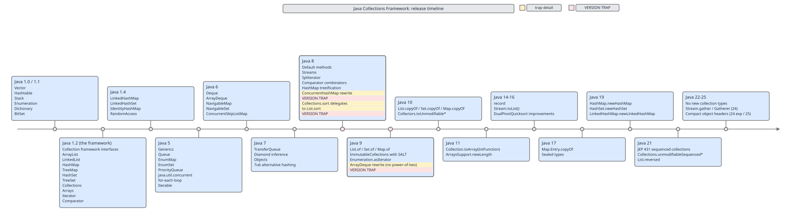

# 02 Java Collections — The framework itself — INTERMEDIATE (§3.16 Version history of the framework)

**Target version: Java 21 LTS.** | [Index](../00-index.md)
Previous: [framework/07-legacy-a-vector-stack-hashtable.md](07-legacy-a-vector-stack-hashtable.md) · Next: [framework/08-abstract-skeletons.md](08-abstract-skeletons.md)

Every claim made about the Collections Framework in this note set is implicitly
a version claim — "`HashMap` treeifies buckets," "`ArrayDeque` never allocates
a power-of-two-sized array," "`Collections.sort` copies to an array first" —
each was true on some JDK and became false, or newly true, on another. This
file is the reference for *when*: thirty years of releases compressed into one
timeline, the three places where the timeline itself is a trap for anyone who
learned Java on an older JDK, the short list of things that actually got
removed, and the one lesson the framework's maintainers learned the hard way
about retrofitting new methods onto old interfaces.

### 3.16.1–3.16.15 Release timeline

**Mental model.** Picture the framework not as a finished artifact but as a
core poured once, in 1.2, and then extended outward release by release,
mostly by addition — new interfaces, new implementations, new default methods
bolted onto existing interfaces — rarely by removal.

**Why it exists as a timeline, not a spec.** The JDK ships on a fixed
cadence (annual since Java 10, with LTS releases every two to three years —
8, 11, 17, 21, 25). Collections features land wherever they're ready, not
grouped by theme, so a feature's *year* is load-bearing: it tells you whether
a codebase targeting an older LTS can use it at all, and it tells an
interviewer whether an answer is dating itself.

**When to reach for this table vs. when not.** Reach for it when you need to
know "is `X` available on Java 11" or "which release introduced `Y`." Don't
use it as a substitute for the mechanism-level notes elsewhere in this set —
knowing *that* `ConcurrentHashMap` was rewritten in Java 8 doesn't tell you
*how* (`../concurrent-collections/`); this file only anchors the release
number.

**How it works — the full table.**

| Release | Year | What shipped |
|---|---|---|
| Java 1.0/1.1 | 1996 | `Vector`, `Hashtable`, `Stack`, `Enumeration`, `Dictionary`, `BitSet` — five disconnected structures, no shared supertype |
| Java 1.2 | 1998 | The framework proper: `Collection`/`List`/`Set`/`Map`/`Iterator`/`Comparator` interfaces, `ArrayList`, `LinkedList`, `HashMap`, `TreeMap`, `HashSet`, `TreeSet`, `Collections`, `Arrays` |
| Java 1.4 | 2002 | `LinkedHashMap`, `LinkedHashSet`, `IdentityHashMap`, `RandomAccess` marker interface, `Collections.rotate`/`swap`/`replaceAll`/`frequency`/`disjoint` `[RESEARCH]` |
| Java 5 | 2004 | Generics, `Queue`, `EnumMap`, `EnumSet`, `PriorityQueue`, `java.util.concurrent` (`ConcurrentHashMap`, `CopyOnWriteArrayList`, `BlockingQueue`), for-each loop, `Iterable` |
| Java 6 | 2006 | `Deque`, `ArrayDeque`, `NavigableMap`, `NavigableSet`, `ConcurrentSkipListMap`, `LinkedBlockingDeque`, `AbstractMap.SimpleEntry` |
| Java 7 | 2011 | `TransferQueue`/`LinkedTransferQueue`, diamond inference (`new ArrayList<>()`), `Objects` utility class, the 7u6 alternative-hashing experiment (randomized `String.hashCode()` seeding to blunt hash-flooding DoS, later superseded by treeification) |
| Java 8 | 2014 | Default methods on `Map`/`Collection`/`Iterable`, the Streams API, `Spliterator`, `Comparator` combinators (`comparing`, `thenComparing`, `reversed`), `HashMap` bucket treeification, **`ConcurrentHashMap` rewrite** (trap, below), **`Collections.sort` delegating to `List.sort`** (trap, below), `StampedLock`, `LongAdder` |
| Java 9 | 2017 | `List.of`/`Set.of`/`Map.of`/`Map.entry`/`Map.ofEntries` immutable factories, the `ImmutableCollections` package with SALT-based iteration-order randomization, `Enumeration.asIterator()`, **`ArrayDeque` internal rewrite** (trap, below) `[RESEARCH]` |
| Java 10 | 2018 | `List.copyOf`/`Set.copyOf`/`Map.copyOf`, `Collectors.toUnmodifiableList/Set/Map` |
| Java 11 | 2018 | `Collection.toArray(IntFunction)`, `ArraysSupport.newLength` unifying array-growth arithmetic across `ArrayList`/`HashMap`/etc., `Optional.isEmpty` |
| Java 14–16 | 2020–21 | `record` types, `Stream.toList()` (a `List.of`-backed terminal shorthand for `.collect(Collectors.toList())`), `DualPivotQuicksort` algorithmic improvements |
| Java 17 | 2021 | `Map.Entry.copyOf`, sealed types (used internally by some JDK collection hierarchies) `[RESEARCH]` |
| Java 19 | 2022 | `HashMap.newHashMap(int)`, `HashSet.newHashSet(int)`, `LinkedHashMap.newLinkedHashMap(int)`, `LinkedHashSet.newLinkedHashSet(int)` — size-aware factories that take an expected element count, not a raw capacity `[RESEARCH]` |
| Java 21 | 2023 | JEP 431 sequenced collections: `SequencedCollection`, `SequencedSet`, `SequencedMap`; `Collections.unmodifiableSequencedCollection/Set/Map`; `Collections.newSequencedSetFromMap`; `List.reversed()` `[RESEARCH]` |
| Java 22–25 | 2024–25 | No new collection interfaces or implementations. Adjacent: `Stream.gather`/`Gatherer` (24), compact object headers (experimental in 24, on by default in 25), `synchronized` blocks no longer pinning virtual threads (24) `[RESEARCH]` |

The diagram below lays the same timeline out spatially, with the three
version traps called out at the release where each was introduced.



**A minimal concrete example — reading the timeline off actual behavior.**

```java
// Compiles and runs identically on Java 8 through Java 25:
List<Integer> xs = new ArrayList<>(List.of(3, 1, 2));
Collections.sort(xs); // Java 8+: delegates to xs.sort(null) internally

// Compiles ONLY on Java 21+:
List<Integer> reversedView = xs.reversed(); // JEP 431, Java 21
```

**Gotcha.** The table lists *introduction* releases, not *availability on
your project*. A codebase pinned to Java 11 cannot use `List.reversed()`
(21), `Stream.toList()` (16), or the `newHashMap(int)` factories (19) —
checking `java.version` in a build script is cheaper than re-deriving this
from memory mid-review.

> The Collections Framework's core interfaces and default implementations
> were fixed in Java 1.2; every release since has added types, default
> methods, or internal rewrites on top of that core, almost never removing
> public API.

### 3.16.7–3.16.9 The three version traps

**Mental model.** A version trap is a belief that was once true, stated
confidently by someone who learned it correctly — and is now false, because
an internal rewrite changed the mechanism while leaving the public contract
(mostly) untouched. All three traps below share this shape: correct claim,
silent expiration date, no compiler warning when the claim goes stale.

**Why they exist.** The JDK's binary- and source-compatibility guarantees
protect the *interface*, not the *implementation*. A method can be
completely reimplemented across a release boundary as long as its contract
(`Deque` still behaves like a deque, `Map` still behaves like a map) holds —
so implementation-level trivia ages out even when API-level trivia doesn't.

**When the old belief still applies vs. when it's now wrong.**

| Trap | Old belief (was true) | Release it broke | New reality |
|---|---|---|---|
| `ArrayDeque` power-of-two sizing | Backing array capacity is always a power of two, like `HashMap` | Java 9 | Internal rewrite changed capacity growth; power-of-two is no longer guaranteed. Only the `Deque` *contract* (O(1) amortized push/pop at both ends) is guaranteed, never the array size |
| `ConcurrentHashMap` segment locking | Concurrency is achieved via a fixed set of `Segment` locks (16 by default), and `size()` sums segment counts | Java 8 | Segments removed entirely; Java 8+ uses per-bin CAS operations and synchronized blocks scoped to individual bins, giving finer-grained concurrency than any fixed segment count could |
| `Collections.sort` copy-to-array | `Collections.sort(list)` copies elements to an `Object[]`, sorts the array with `Arrays.sort`, then copies back into the list | Java 8 | `Collections.sort(list)` now simply calls `list.sort(null)`; each `List` implementation (`ArrayList`, `LinkedList`) is free to sort however suits its internal structure — the copy-out/copy-back dance is no longer guaranteed (though `ArrayList.sort` still does effectively that internally, `LinkedList` does not have to) |

**How it works — why the rewrites were safe to ship as "compatible."**
`Deque`, `Map`, and `List` are interfaces defining behavioral contracts, not
memory layouts. `ArrayDeque`'s capacity, `ConcurrentHashMap`'s locking
granularity, and `Collections.sort`'s internal copy pattern were never part
of any of those contracts' javadoc — they were implementation folklore,
often taught as if they were guarantees, that the JDK maintainers were free
to change because no public method signature or documented behavior
depended on them.

**A minimal concrete example — probing the `ConcurrentHashMap` trap directly.**

```java
ConcurrentHashMap<String, Integer> map = new ConcurrentHashMap<>();
map.put("a", 1);
map.put("b", 2);
// Pre-Java-8 mental model: "size() sums 16 segment counters."
// Java 8+ reality: no Segment class exists in the source at all —
// javap -p java.util.concurrent.ConcurrentHashMap shows CounterCell,
// not Segment, backing the size estimate.
System.out.println(map.size()); // contract unchanged: 2
```

**Gotcha.** None of the three traps changed a single public method
signature — `ArrayDeque` still implements `Deque`, `ConcurrentHashMap` still
implements `ConcurrentMap`, `Collections.sort(List)` still returns `void` and
sorts in place. Code compiled against Java 7 keeps compiling and running
unchanged on Java 21; only *explanations* of the internals go stale, which is
exactly why these traps are interview-dangerous — a candidate can recite a
mechanism that was correct five years ago and be confidently wrong today.

**Insight:** all three traps are instances of the same rule — the JDK
promises API compatibility, never implementation-detail compatibility.
Anything you learned by reading source code or a blog post, rather than the
javadoc contract, has an implicit expiration date.

**Interview:** if asked "how does `ConcurrentHashMap` achieve concurrency,"
the safe answer names the release: "since Java 8, per-bin CAS and
synchronized-block locking; before Java 8, a fixed set of `Segment` locks" —
stating both halves signals the claim is version-aware, not folklore.

> A version trap is an implementation-level belief that was true prior to a
> named release and became false after an internal rewrite, while the
> surrounding interface contract stayed unchanged — `ArrayDeque` sizing
> (Java 9), `ConcurrentHashMap` locking (Java 8), and `Collections.sort`'s
> array copy (Java 8) are the three canonical examples in this framework.

### 3.16.16 The removed/deprecated list

**Mental model.** Given the binary-compatibility guarantee walked in
`07-legacy-a-vector-stack-hashtable.md` (2.15.8) — nothing public is ever
truly deleted — this is necessarily a short list: a handful of behavioral
tightenings and one genuine removal, not a graveyard of missing classes.

**Why it's short.** Removing a public class or narrowing a documented
contract breaks any class file compiled against the old version, forever.
The JDK's answer to "this design was a mistake" is almost always deprecation
(a javadoc or `@Deprecated` warning, API still present and functional) or
quiet API growth alongside the old surface, not deletion.

**When each item matters.** `Observable`/`Observer` matters if you maintain
code older than Java 9. The `RandomAccess`-preservation behavior of
`Collections.unmodifiableList` matters any time you wrap a `List` and later
branch on `instanceof RandomAccess` for an algorithm-selection decision
(binary search vs. linear scan). `Vector.elements()` matters only in code
still using `Enumeration`-based traversal.

**How it works.**

| Item | Status | Detail |
|---|---|---|
| `Collections.unmodifiableList` on a `RandomAccess` source | Preserved, not removed | The returned wrapper implements `RandomAccess` if and only if the wrapped list does — algorithm-selection code (e.g. `Collections.binarySearch`) that checks `instanceof RandomAccess` keeps working correctly through the wrapper |
| `java.util.Observable` / `java.util.Observer` | **Deprecated for removal**, Java 9 | Javadoc calls the observer/observable model "poorly designed" and inadequate for modern needs; superseded in practice by `java.beans.PropertyChangeListener`, reactive streams, or hand-rolled listener patterns — the classes remain present but are marked `@Deprecated(since="9", forRemoval=true)` |
| `Vector.elements()` | Retained | Returns an `Enumeration` over the vector's elements; kept purely for pre-1.2 source compatibility, never recommended for new code (2.15.6 covers `Enumeration` generally) |

**A minimal concrete example — noticing the deprecation without breaking a build.**

```java
import java.util.Observable; // javac -Xlint:deprecation flags this line

@SuppressWarnings("removal")
class LegacySensor extends Observable {
    void tick() {
        setChanged();
        notifyObservers(); // still compiles and runs on Java 21 — deprecated, not removed
    }
}
```

**Gotcha.** `forRemoval=true` on `Observable`/`Observer` is a stated
intention, not a guarantee tied to any announced Java version — it has
already outlived several LTS cycles since Java 9. Treat it as "migrate when
convenient," not "will break on the next upgrade," but do not build new
code against it.

> The framework's removed/deprecated surface is deliberately small:
> `Observable`/`Observer` are marked for eventual removal since Java 9,
> `Vector.elements()` and `RandomAccess`-preserving unmodifiable wrappers are
> retained indefinitely — nothing here has actually been deleted from the
> JDK.

### 3.16.17 The cost of retrofitting old interfaces

**Mental model.** Adding a method to an interface that's implemented
everywhere is not free, even with default methods erasing the *binary*
compatibility problem — it can still be a *source*-compatibility landmine
for any class that happened to already declare a method with the same name
and an incompatible signature.

**Why this came up now.** JEP 431 (Java 21) added `getFirst()`/`getLast()`
(among others) to the new `SequencedCollection` interface, which `List`,
`Deque`, and `LinkedHashSet`'s hierarchy now implement. Any pre-existing
class that implemented `List` (or a supertype) and already declared its own
`getFirst()` method — with a different return type, or different checked
exceptions, or as `abstract` — can fail to compile or fail to override
correctly under Java 21, even though the class never asked for the new
method.

**When this bites vs. when it doesn't.** It doesn't bite ordinary
application code using `ArrayList`, `LinkedList`, or `ArrayDeque` directly —
those didn't declare a conflicting `getFirst()` before Java 21, so the new
default method just becomes available. It bites third-party or in-house
libraries that (a) implement `List`/`Collection` directly, and (b) already
had a method literally named `getFirst` with an incompatible signature —
rare, but not zero, in codebases with pre-existing "first element" DSLs.

**How it works — default methods and the diamond problem for names.** JEP
431 added `getFirst()`, `getLast()`, `addFirst(E)`, `addLast(E)`,
`reversed()` as default (or abstract, per-implementer-overridden) methods on
`SequencedCollection`, which sits in the hierarchy above `List`, `Deque`,
`SortedSet` (via `SequencedSet`), and `LinkedHashMap`'s entry/key/value
views. Because `List` already extends `Collection` and now transitively
`SequencedCollection`, every existing `List` implementation inherits these
methods automatically — the JVM's default-method dispatch handles binary
compatibility for already-compiled `.class` files with no recompilation
needed. The break is strictly at the *source* level: recompiling a class
that already declares an incompatible `getFirst()` against Java 21 can now
fail, or silently change which method is considered an override.


**A minimal concrete example — the retrofit break, reproduced.**

```java
import java.util.AbstractList;

class NumberBucket extends AbstractList<Integer> {
    private final java.util.List<Integer> backing = new java.util.ArrayList<>();

    @Override public Integer get(int index) { return backing.get(index); }
    @Override public int size() { return backing.size(); }
    @Override public void add(int index, Integer e) { backing.add(index, e); }

    // Pre-Java-21 code, written before SequencedCollection existed:
    // intended as "get the first number as a primitive int," NOT an override.
    public int getFirst() {
        return backing.get(0);
    }
}
```

On Java 21, `SequencedCollection.getFirst()` returns `E` (here, `Integer`);
`NumberBucket.getFirst()` returns `int` — a covariant-return mismatch, not a
legal override, so this now fails to compile with an "incompatible return
type" error where it compiled cleanly on Java 17. The fix is a rename
(`firstAsInt()`) or an explicit `@Override` matching the new signature.

**Gotcha.** Default methods solve the *binary* compatibility half of "add a
method to a shipped interface" — old `.jar` files keep running. They do
nothing for *source* compatibility when the colliding name was already taken
with an incompatible signature; that half can only be caught by recompiling,
which is precisely why this surfaces as a build failure during a JDK upgrade
rather than a runtime surprise.

**Interview:** "why is adding a method to a widely-implemented interface
still risky, given default methods?" — the answer is the name-collision
case above: default methods remove the need for every implementer to add
the method, but they cannot remove the possibility that an implementer
already had an incompatibly-shaped method of that exact name.

> Retrofitting a new method onto an interface with many existing
> implementers is binary-compatible by default-method dispatch but can still
> be source-incompatible, if any implementer already declared a
> same-named method with an incompatible signature — exactly what happened
> when JEP 431's `getFirst()`/`getLast()` landed on `List` and `Deque` in
> Java 21.

## Scope notes

This is why `Vector` still exists: the same binary-compatibility contract
that stops the JDK from ever deleting `Vector` or `Hashtable`
(`07-legacy-a-vector-stack-hashtable.md`, 2.15.8) is the contract that makes
every retrofit onto a live interface — the 1.2 grafting of `List` onto
`Vector`, or JEP 431's grafting of `SequencedCollection` onto `List` in
2023 — a source-compatibility risk rather than a clean redesign. Old code
never breaks at the bytecode level; it only ever risks breaking at
recompile time, which is exactly the trade the framework has made,
consistently, for three decades.

## Pitfalls

### Believing `ArrayDeque`'s capacity is always a power of two

**Wrong**

```java
// "ArrayDeque always allocates power-of-two capacity, like HashMap" — pre-Java-9 folklore
ArrayDeque<Integer> dq = new ArrayDeque<>(10);
// assuming internal array length is now 16
```

**Right**

```java
ArrayDeque<Integer> dq = new ArrayDeque<>(10);
// Since the Java 9 internal rewrite, do not assume any specific capacity —
// rely only on the Deque contract (O(1) amortized push/pop both ends),
// never on array-size folklore.
```

**Why people believe it:** pre-Java-9 `ArrayDeque` really did round capacity
up to the next power of two, and that mechanism was widely taught alongside
`HashMap`'s identical-looking bucket sizing. The Java 9 rewrite changed the
growth internals without touching the `Deque` contract, so the belief kept
propagating past its expiration date.

### Believing `ConcurrentHashMap` still uses a fixed set of segment locks

**Wrong**

```java
// "ConcurrentHashMap has 16 segments by default, so at most 16 threads
// can write concurrently without blocking each other" — pre-Java-8 model
```

**Right**

```java
// Since Java 8, there is no Segment class: writes use per-bin CAS and
// synchronized blocks scoped to individual bins, so concurrent-write
// throughput scales with the number of distinct bins actually contended,
// not a fixed constant of 16.
```

**Why people believe it:** the `concurrencyLevel` constructor parameter and
the term "segment" were prominent in pre-Java-8 documentation and interview
prep material, and `concurrencyLevel` is still accepted as a constructor
argument today for compatibility — but it's now only a size hint, not a lock
count, because segments no longer exist.

### Believing `Collections.sort` always copies to an array and back

**Wrong**

```java
// "Collections.sort(list) always does: Object[] a = list.toArray();
//  Arrays.sort(a); back-fill into list" — true through Java 7, generalized
//  as if it always holds
```

**Right**

```java
List<Integer> xs = new ArrayList<>(List.of(3, 1, 2));
Collections.sort(xs); // Java 8+: literally xs.sort(null) — behavior is
// delegated to the specific List implementation, which is free to sort
// however suits its structure (ArrayList still copies internally;
// a hypothetical custom List need not).
```

**Why people believe it:** it was literally true before Java 8, and
`ArrayList.sort` still does something equivalent internally today, so the
old claim "looks" confirmed by observing `ArrayList` — the generalization to
"all `List`s sorted via `Collections.sort` copy to an array" is what broke.

## Cheat sheet

| Fact | Value |
|---|---|
| Framework core (interfaces + first implementations) | Java 1.2 |
| Generics, `Queue`, `java.util.concurrent` | Java 5 |
| `Deque`/`ArrayDeque` introduced | Java 6 |
| Default methods, streams, `HashMap` treeification | Java 8 |
| `ArrayDeque` internal rewrite (trap) | Java 9 |
| `ConcurrentHashMap` internal rewrite (trap) | Java 8 |
| `Collections.sort` delegates to `List.sort` (trap) | Java 8 |
| Immutable collection factories (`List.of` etc.) | Java 9 |
| `List.copyOf`/`Set.copyOf`/`Map.copyOf` | Java 10 |
| `Stream.toList()` | Java 16 |
| Size-aware factories (`HashMap.newHashMap(int)`) | Java 19 |
| Sequenced collections, `List.reversed()` | Java 21 (JEP 431) |
| Last release with a new collection interface/impl | Java 21 |
| `Observable`/`Observer` deprecated for removal | Java 9 |
| Only class genuinely marked for eventual removal | `Observable`/`Observer` |
| JEP 431 source-compatibility break | classes with a pre-existing, incompatible `getFirst`/`getLast` |

## Self-test

**Q1.** In which release did `ConcurrentHashMap` stop using a fixed set of `Segment` locks, and what replaced them?

<details><summary>Answer</summary>

Java 8. Per-bin CAS operations and synchronized blocks scoped to individual
bins replaced the fixed `Segment` array, giving finer-grained concurrency
than any constant segment count could.

</details>

**Q2.** Why doesn't `Collections.sort(list)` necessarily copy the list to an array anymore?

<details><summary>Answer</summary>

Since Java 8, `Collections.sort(list)` simply calls `list.sort(null)`,
delegating to the specific `List` implementation's own `sort` method.
`ArrayList` still sorts via an internal array copy, but that is no longer a
guarantee of the `Collections.sort` API itself — a different `List`
implementation is free to sort without ever materializing a plain array.

</details>

**Q3.** What changed about `ArrayDeque` in Java 9, and what part of its contract did NOT change?

<details><summary>Answer</summary>

The internal array-growth mechanism was rewritten and no longer guarantees
power-of-two capacity. The `Deque` contract — O(1) amortized push/pop at
both ends — was unaffected.

</details>

**Q4.** Name the two classes on the JDK's actual removal list (marked `forRemoval=true`), and the release that marked them.

<details><summary>Answer</summary>

`java.util.Observable` and `java.util.Observer`, marked deprecated for
removal in Java 9.

</details>

**Q5.** What JEP introduced sequenced collections in Java 21, and name two new methods it added to `List`.

<details><summary>Answer</summary>

JEP 431. `getFirst()`/`getLast()` (also `addFirst`/`addLast`/`reversed()`)
were added via the new `SequencedCollection` interface that `List` now
extends.

</details>

**Q6.** Why could JEP 431 break a pre-existing class's *source* compatibility without breaking any already-compiled `.class` file's binary compatibility?

<details><summary>Answer</summary>

Default methods make the addition binary-compatible: already-compiled
classes keep running because the JVM's default-method dispatch supplies the
new method automatically. But a class *source* that already declared an
incompatibly-shaped method of the same name (e.g. `getFirst()` returning
`int` instead of `E`) fails to recompile under the new interface contract,
because that is no longer a valid override.

</details>

**Q7.** What does `Collections.unmodifiableList` do differently when wrapping a `RandomAccess` list versus a non-`RandomAccess` list?

<details><summary>Answer</summary>

The returned unmodifiable wrapper implements `RandomAccess` if and only if
the wrapped list does — this marker is preserved through the wrapper so that
algorithm-selection code (e.g. `Collections.binarySearch`) still picks the
correct algorithm.

</details>

**Q8.** A candidate says "`ArrayList`, `HashMap`, and `ConcurrentHashMap` all got major algorithmic changes in Java 8." Is this accurate?

<details><summary>Answer</summary>

Partially. `HashMap` gained bucket treeification in Java 8, and
`ConcurrentHashMap` was rewritten to drop segment locking in Java 8 —
both correct. `ArrayList` had no comparable Java 8 rewrite; its notable
version-sensitive change (growth-arithmetic unification via
`ArraysSupport.newLength`) landed in Java 11, and its sort delegation is a
consequence of the `Collections.sort`/`List.sort` change, not an `ArrayList`-
specific rewrite.

</details>

**Q9.** Which JDK release last added a genuinely new collection interface or implementation, per this timeline?

<details><summary>Answer</summary>

Java 21, with `SequencedCollection`/`SequencedSet`/`SequencedMap` (JEP 431).
Java 22 through 25 added no new collection interfaces or implementations.

</details>

**Q10.** What single sentence generalizes all three version traps in this file?

<details><summary>Answer</summary>

Each was an implementation-level belief, true before a specific release and
false after an internal rewrite, while the surrounding public interface
contract remained unchanged throughout.

</details>

---

**Leaves covered:** 3.16.1–3.16.17 (17 leaves)
**Leaves deferred:** none
**Diagrams included:** D-141
**Target version:** Java 21 LTS
**Lines:**      517
