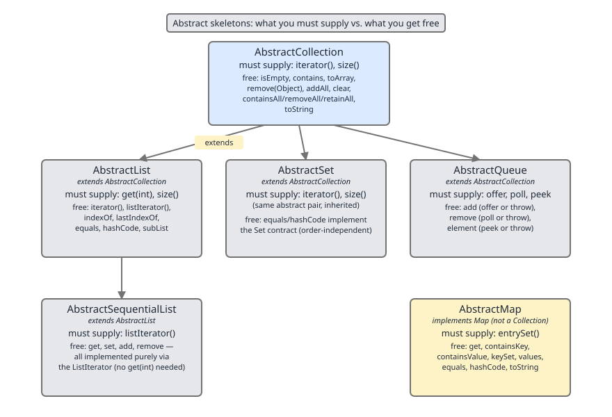
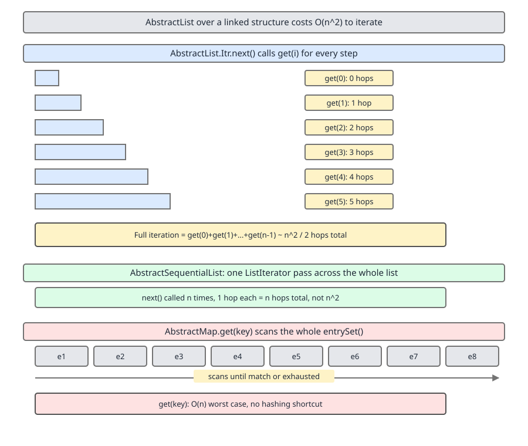
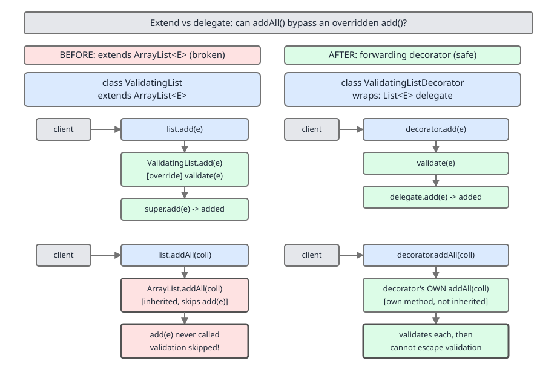

# 02 Java Collections — The framework itself — INTERNALS (§3.18 The abstract skeletons, and writing your own collection)

**Target version: Java 21 LTS.** | [Index](../00-index.md)
Previous: [framework/07-legacy-b-version-history.md](07-legacy-b-version-history.md) · Next: [contracts/01-ordering.md](../contracts/01-ordering.md)

Every concrete collection in the JDK — `ArrayList`, `LinkedList`, `HashSet`, `TreeMap`, `PriorityQueue` — sits on top of a small family of `Abstract*` skeletal classes. The skeletons exist so that implementing a new collection is a five-minute job instead of a two-hundred-line one: you supply the two or three methods that only you know how to do (how your data is actually stored), and the skeleton hands you `iterator()`, `toString()`, `equals()`, `addAll()`, and a dozen other methods built entirely in terms of what you supplied. This file walks each skeleton's contract, shows where that "built entirely in terms of" assumption goes wrong (the two classic quadratic traps), and proves — by writing the code — why extending a concrete class instead of delegating to it is dangerous.

## Hierarchy before details



| Skeleton | Abstract methods you supply | What you get free | `modCount` handled here? | Right base when… | Wrong base when… |
|---|---|---|---|---|---|
| `AbstractCollection` | `iterator()`, `size()` | `isEmpty`, `contains`, `toArray`, `toString`, `addAll`, `remove` (via iterator), `containsAll`, `retainAll`, `removeAll` | No (no positional index concept) | You have a general `Iterable` bag and no ordering/indexing story | You need `List`- or `Map`-style contracts (`equals` by position, `get(int)`) |
| `AbstractList` | `get(int)`, `size()` (+ `set`/`add`/`remove` for mutability) | `iterator()`/`listIterator()` built on `get`, `equals`, `hashCode`, `indexOf`, `subList` | Yes — declares `protected transient int modCount` | Your backing store supports **O(1) random access** (array-backed) | Your backing store is a linked/sequential structure — see 3.18.4 |
| `AbstractSequentialList` | `listIterator(int)`, `size()` | `get`, `set`, `add`, `remove` all reimplemented in terms of the list iterator, so each is O(1) amortized-per-step instead of O(n) per call | Yes, inherited from `AbstractList` | Your backing store is a linked/sequential structure (nodes, no index) | You have random access — `AbstractList` is simpler and equally correct |
| `AbstractSet` | `iterator()`, `size()` (inherited from `AbstractCollection`) | `equals()`/`hashCode()` defined by set-equality (same elements, any order), `removeAll` optimized to iterate the smaller of the two sets | No (sets have no index) | You're building a `Set` and want the size-based `removeAll` optimization free | You actually want list semantics (duplicates, order) |
| `AbstractQueue` | `offer`, `poll`, `peek`, `iterator()`, `size()` | `add` (throws if `offer` returns false), `remove()` (throws if `poll` returns null), `element()` (throws if `peek` returns null) — the capacity-aware trio built on the throwing trio | No | You're building a `Queue` with a natural bounded/unbounded `offer`-style API | You need `Deque` (two-ended) — extend `AbstractCollection` directly or implement `Deque` from scratch |
| `AbstractMap` | `entrySet()` (+ `put` for mutability) | `get`, `containsKey`, `containsValue`, `equals`, `hashCode`, `toString`, `keySet()`/`values()` views built lazily over `entrySet()` | No (maps have no positional index) | You're building a `Map` and can produce an `entrySet()` cheaply | Your `entrySet()` is itself expensive to construct or scan — see 3.18.9 |

## 3.18.1 `AbstractCollection` — implement `iterator()` and `size()`, get everything else

**Mental model.** `AbstractCollection` is the "minimum viable collection" — it treats every collection as nothing more than something you can iterate and count. Every other method it provides is mechanically derivable from those two facts: `isEmpty()` is `size() == 0`, `contains(o)` is "walk the iterator until `equals(o)` matches", `clear()` is "walk the iterator calling `remove()` on each step".

**Why it exists.** Before skeletal implementations, every collection class reimplemented `contains`, `containsAll`, `toString`, `toArray`, and `addAll` from scratch — mostly copy-pasted, occasionally copy-pasted wrong. `AbstractCollection` (Java 1.2, the original Collections Framework) collapsed all of that into two methods.

**When to reach for it, and when not.** Reach for it whenever you're building any `Collection` that isn't a `List`, `Set`, or `Queue` specifically (those have sharper skeletons below that add contract-specific free methods). Don't reach for it if you need `List` positional semantics — `AbstractCollection.equals()` doesn't exist at all (`Collection` doesn't mandate `equals` between arbitrary collections), so a bare `AbstractCollection` subclass has reference equality unless you add your own.

**How it works.** `remove(Object o)` (mutating) is implemented as: get an iterator, walk it, call `Objects.equals` per element, and on match call `it.remove()` and return `true`. `addAll(Collection<? extends E> c)` walks the *argument* collection and calls `this.add(e)` once per element — this is the exact mechanism 3.18.10 exploits. `clear()` walks `iterator()` and calls `it.remove()` until `hasNext()` is false, then lets `NoSuchElementException`/`UnsupportedOperationException` propagate naturally if the iterator doesn't support removal.

**Example.**
```java
final class ImmutableBag<E> extends AbstractCollection<E> {
    private final E[] data;
    ImmutableBag(E[] data) { this.data = data.clone(); }

    @Override public Iterator<E> iterator() {
        return new Iterator<>() {
            int i = 0;
            @Override public boolean hasNext() { return i < data.length; }
            @Override public E next() {
                if (!hasNext()) throw new NoSuchElementException();
                return data[i++];
            }
        };
    }
    @Override public int size() { return data.length; }
}
```
Two methods supplied; `contains`, `toString`, `toArray`, `stream()`, and the enhanced-for loop all work immediately.

**Gotcha.** `AbstractCollection` gives you `toString()` and `toArray()` for free, but **not** `equals()`/`hashCode()` — those are added by `AbstractSet` and by `List`'s own default methods, not by `AbstractCollection` itself. A bare `AbstractCollection` subclass compares by identity unless you override both.

> `AbstractCollection` is the skeleton for `Collection`: supply `iterator()` and `size()`, and every method whose behavior can be derived purely from "walk it, count it" comes free.

## 3.18.2 `AbstractCollection.toString` and `AbstractCollection.toArray` growth loop `[SOURCE]`

**Mental model.** `toArray()` has a problem that no other method here has: it must return a *fixed-size* array, but the only information it has about size — `size()` — may be stale by the time the iterator finishes, because another thread (or the iterator itself firing side effects) can grow or shrink the collection mid-walk. The JDK's fix is: guess the size, walk while you can, and if you run out of room or run out of elements, adapt.

**Why it exists.** A naive `toArray()` — `Object[] a = new Object[size()]; for iterate, a[i++] = e;` — throws `ArrayIndexOutOfBoundsException` if the collection grew during iteration, or silently returns trailing `null`s if it shrank. Both are real bugs `AbstractCollection` had to be defensive against once collections could be concurrently modified.

**How it works — the real Java 21 source (`java.util.AbstractCollection`):**
```java
public Object[] toArray() {
    // Estimate size of array; be prepared to see more or fewer elements
    Object[] r = new Object[size()];
    Iterator<E> it = iterator();
    for (int i = 0; i < r.length; i++) {
        if (!it.hasNext()) // fewer elements than expected
            return Arrays.copyOf(r, i);
        r[i] = it.next();
    }
    return it.hasNext() ? finishToArray(r, it) : r;
}
```
- `Object[] r = new Object[size()]` — the estimate, taken once, before iteration starts.
- The loop fills up to `r.length` slots. If `it.hasNext()` goes false early (collection shrank concurrently), `Arrays.copyOf(r, i)` truncates to the actual count instead of returning trailing nulls.
- If the loop fills `r` completely and the iterator **still** has elements (collection grew), control falls to `finishToArray(r, it)` — the growth loop:
```java
private static <T> T[] finishToArray(T[] r, Iterator<?> it) {
    int i = r.length;
    while (it.hasNext()) {
        int cap = r.length;
        if (i == cap) {
            int newCap = cap + (cap >> 1) + 1;   // grow by 1.5x + 1
            if (newCap - MAX_ARRAY_SIZE > 0)
                newCap = hugeCapacity(cap + 1);
            r = Arrays.copyOf(r, newCap);
        }
        r[i++] = (T) it.next();
    }
    return (i == r.length) ? r : Arrays.copyOf(r, i);
}
```
- `newCap = cap + (cap >> 1) + 1` — the same 1.5x growth factor `ArrayList` uses internally, plus 1 so a zero-length array can still grow.
- `hugeCapacity(cap + 1)` is the **overflow guard**: if `newCap` overflows past `MAX_ARRAY_SIZE` (`Integer.MAX_VALUE - 8`, reserved headroom some VMs use for array headers), it either returns `Integer.MAX_VALUE` if the requested minimum capacity fits, or throws `OutOfMemoryError` — this is what stops `newCap` silently wrapping negative and corrupting `Arrays.copyOf`.
- The final `Arrays.copyOf(r, i)` trims any extra capacity left over from the last growth step.

`toString()` is far simpler but earns its place here because its own guard is easy to miss:
```java
public String toString() {
    Iterator<E> it = iterator();
    if (!it.hasNext()) return "[]";
    StringBuilder sb = new StringBuilder();
    sb.append('[');
    for (;;) {
        E e = it.next();
        sb.append(e == this ? "(this Collection)" : e);
        if (!it.hasNext()) return sb.append(']').toString();
        sb.append(',').append(' ');
    }
}
```
The `e == this` check is the load-bearing line: without it, a collection that (accidentally or deliberately) contains itself recurses through `toString()` forever and blows the stack.

**Gotcha.** `toArray()` re-reading `size()` once up front, then adapting via `finishToArray`, means the returned array is **never guaranteed to reflect a single consistent snapshot** under concurrent modification — it reflects "whatever the iterator happened to produce," which for a fail-fast iterator on a structurally-modified collection throws `ConcurrentModificationException` mid-walk instead of returning a partial array at all.

> `AbstractCollection.toArray()` estimates capacity from `size()`, truncates on iterator underrun, and grows by 1.5x with an overflow-safe cap (`finishToArray`) on iterator overrun — because `size()` and the iterator's actual yield are two independent reads that can disagree.

## 3.18.3–3.18.4 `AbstractList` — `get`/`size`, `modCount`, and the `Itr` quadratic trap

**Mental model.** `AbstractList` assumes exactly one thing beyond `AbstractCollection`: **random access by index is cheap.** Everything it builds — the iterator, `indexOf`, `equals`, `subList` — is expressed as "loop `i` from `0` to `size()`, call `get(i)`." That assumption is free when `get(i)` really is O(1) (array-backed), and catastrophic when it isn't.

**Why it exists.** Before `AbstractList`, `ArrayList`, `Vector`, and `Stack` each hand-wrote their own `Iterator`, `equals`, and `indexOf` — three copies of the same loop, one of which (`Vector`'s) had a synchronization bug that the others didn't.

**When to reach for it, and when not.** Reach for it when your backing store supports O(1) `get(int)` — arrays, ring buffers. Do **not** reach for it when your backing store is a linked structure (nodes with `next`/`prev` pointers) — that's 3.18.5's job, and using `AbstractList` there is the trap below.

**How it works.** `AbstractList` declares:
```java
protected transient int modCount = 0;
```
Every structural mutation method that subclasses override (`add`, `remove`, `clear`) is expected to increment `modCount`; the iterators check it. This is the single field that makes fail-fast iteration possible framework-wide — the full mechanism (`expectedModCount`, what counts as "structural") is covered in `../iteration/02-fail-fast-fail-safe.md`; this file only needs the fact that `AbstractList` is where the field lives.

The default `iterator()` returns an inner class `Itr` whose `next()` is, in essence:
```java
public E next() {
    checkForComodification();
    int i = cursor;
    if (i >= size()) throw new NoSuchElementException();
    cursor = i + 1;
    return get(lastRet = i);   // <-- calls get(i) every single step
}
```
Every single call to `next()` calls `get(cursor)`. For an array-backed list that's O(1) per step, O(n) total — correct. For a structure where `get(i)` itself has to walk `i` nodes from the head, every step of the iteration costs O(i), and summing `1 + 2 + ... + n` gives O(n²) for a full traversal.



**Example — the trap made concrete:**
```java
final class NaiveLinkedList<E> extends AbstractList<E> {
    private record Node<E>(E value, Node<E> next) {}
    private Node<E> head;
    private int size;

    void push(E value) { head = new Node<>(value, head); size++; }

    @Override public E get(int index) {
        Node<E> n = head;
        for (int i = 0; i < index; i++) n = n.next();   // O(index) walk
        return n.value();
    }
    @Override public int size() { return size; }
}
```
Calling `for (String s : naiveList)` on this class invokes the inherited `AbstractList.Itr`, which calls `get(0)`, `get(1)`, `get(2)`, … — an O(n²) full traversal, even though a hand-rolled `Iterator` walking `next` pointers directly would be O(n).

**Pitfall:** the wrong belief is "I extended `AbstractList`, so iteration is O(n) like every other list." The symptom is a traversal that's fine at n = 1,000 and pathological at n = 100,000. The fix: extend `AbstractSequentialList` instead (3.18.5), which builds `get`/`set`/`add`/`remove` on top of a `ListIterator` you supply, rather than building the iterator on top of `get`.

> `AbstractList`'s default iterator is `get(i)` called in a loop — correct and O(n) only when `get(int)` is itself O(1); on a linked structure it silently degrades a full traversal to O(n²).

## 3.18.5 `AbstractSequentialList` — the linked-structure counterpart

**Mental model.** Where `AbstractList` says "give me `get(int)` and I'll build the iterator," `AbstractSequentialList` inverts it: "give me a `ListIterator` and I'll build `get`/`set`/`add`/`remove` from it." This is the correct base for anything shaped like a chain of nodes.

**Why it exists.** `LinkedList` needs `List` conformance (so it can be passed anywhere a `List` is expected) without paying the O(n²) tax of 3.18.4. `AbstractSequentialList` is the skeleton that makes that possible — it is in fact `LinkedList`'s actual superclass.

**When to reach for it, and when not.** Reach for it for any node-chain structure — singly/doubly linked lists, skip lists exposed as a `List`. Don't reach for it for array-backed or index-addressable structures — `AbstractList` is simpler there and gives identical behavior for less code.

**How it works.** You implement one method, `listIterator(int index)`, that returns a `ListIterator` capable of walking forward/backward from `index`. `AbstractSequentialList.get(int index)` is then implemented as `listIterator(index).next()` — one O(index) walk, same as before, but now it's the *only* walk: a full `for` loop using the inherited plain `iterator()` (which delegates to the same `listIterator(0)` and just calls `next()` repeatedly) costs O(n) total, because each `next()` call is O(1) *relative to the iterator's current position* rather than O(1) recomputed from the head every time.

**Example:**
```java
final class MyLinkedList<E> extends AbstractSequentialList<E> {
    private static final class Node<E> { E value; Node<E> prev, next; }
    private final Node<E> head = new Node<>(), tail = new Node<>();
    private int size;
    { head.next = tail; tail.prev = head; }

    @Override public int size() { return size; }

    @Override public ListIterator<E> listIterator(int index) {
        Node<E> cursor = head.next;
        for (int i = 0; i < index; i++) cursor = cursor.next;   // one walk, not one per element
        Node<E> current = cursor;
        return new ListIterator<>() {
            @Override public boolean hasNext() { return current != tail; }
            @Override public E next() { E v = current.value; current = current.next; return v; }
            @Override public boolean hasPrevious() { return current.prev != head; }
            @Override public E previous() { current = current.prev; return current.value; }
            @Override public int nextIndex() { throw new UnsupportedOperationException(); }
            @Override public int previousIndex() { throw new UnsupportedOperationException(); }
            @Override public void remove() { throw new UnsupportedOperationException(); }
            @Override public void set(E e) { throw new UnsupportedOperationException(); }
            @Override public void add(E e) { throw new UnsupportedOperationException(); }
        };
    }
}
```
A full `for`-each over `MyLinkedList` now costs O(n), not O(n²), because the single returned `ListIterator` advances by following `next` pointers rather than re-walking from `head` on every element.

**Gotcha.** `get(int)` and `set(int)` on `AbstractSequentialList` are still individually O(index) — random access into the middle of a linked list is inherently linear. The fix `AbstractSequentialList` provides is only for *sequential* access (a `for`-each or explicit `ListIterator` walk); repeatedly calling `list.get(i)` for arbitrary `i` in a loop is still O(n²) no matter which skeleton you extend, because that access pattern is fundamentally linear-per-call.

> `AbstractSequentialList` supplies `get`/`set`/`add`/`remove` from a single `listIterator(int)`, making sequential traversal O(n) on linked structures — the correct base wherever `AbstractList` would be quadratic.

## 3.18.6 `AbstractSet` — takes `equals`/`hashCode`/`removeAll` off your hands

Purely a contract-refinement over `AbstractCollection`: it adds no new abstract methods, only overrides `equals()` (two sets are equal iff same size and each element of one is `contains`ed by the other — order-independent) and `hashCode()` (sum of each element's hash code, so set-equal collections always hash equal regardless of iteration order). It also overrides `removeAll(Collection<?>)` to iterate whichever of `this` or the argument is smaller, calling `contains`/`remove` against the larger one — an optimization only possible because `AbstractSet` knows both sides are duplicate-free.

**Gotcha.** The `hashCode()` sum-of-elements contract means a `Set<E>` and any other `Set<E>` with the same elements always collide in a `HashMap<Set<E>, V>` key position, which is correct but easy to forget is *intentional* — it's not a bug that two structurally different set implementations hash identically.

> `AbstractSet` adds nothing new to implement; it only refines `equals`/`hashCode` to set semantics and optimizes `removeAll` by iterating the smaller side.

## 3.18.7 `AbstractQueue` — implements `add`/`remove`/`element` in terms of `offer`/`poll`/`peek`

`Queue` has two parallel method families: one throws on failure (`add`, `remove()`, `element()`), one signals failure via a return value (`offer`, `poll`, `peek`). `AbstractQueue` implements the throwing trio purely in terms of the signaling trio you supply — `add(e)` is `if (!offer(e)) throw new IllegalStateException("Queue full")`, `remove()` is `E x = poll(); if (x == null) throw new NoSuchElementException(); return x;`, and `element()` mirrors that for `peek()`.

**Gotcha.** This means the choice of `null` as a queue sentinel is baked into the framework: `offer`/`poll`/`peek` cannot distinguish "empty" from "contains a genuine `null` element," so **no `AbstractQueue` subclass may permit `null` elements** — `LinkedBlockingQueue` and `PriorityQueue` both explicitly reject `null` for exactly this reason.

> `AbstractQueue` builds the throwing API (`add`/`remove`/`element`) on top of the signaling API (`offer`/`poll`/`peek`) you supply, which is why `null` elements are universally banned in `Queue` implementations.

## 3.18.8–3.18.9 `AbstractMap` — `entrySet()`, and the O(n) `get` trap

**Mental model.** `AbstractMap` treats a map as nothing more than a `Set<Entry<K,V>>` — every read operation it provides free is expressed as "scan the entry set looking for a key/value match." That's the entire contract: implement `entrySet()`, and `get`, `containsKey`, `containsValue`, `equals`, `hashCode`, and `toString` all fall out as entry-set scans.

**Why it exists.** Every `Map` implementation needs `equals`/`hashCode`/`toString` defined consistently in terms of its entries — `AbstractMap` centralizes that once instead of each map reimplementing it.

**When to reach for it, and when not.** Reach for it when your `entrySet()` can be produced cheaply — typically because you already maintain a real hash table or tree internally, and `entrySet()` returns a thin view over it (that's exactly what `HashMap`/`TreeMap` do — see 3.18.9 for the failure mode when it isn't cheap). Don't reach for it if your only way to answer "does key K exist" would otherwise be a genuine full scan of an already-materialized list of entries — you're still allowed to, but `get` will cost you O(n), which is the trap below.

**How it works — the real `AbstractMap.get` (Java 21):**
```java
public V get(Object key) {
    Iterator<Entry<K,V>> i = entrySet().iterator();
    Entry<K,V> e;
    if (key == null) {
        while (i.hasNext()) {
            e = i.next();
            if (e.getKey() == null) return e.getValue();
        }
    } else {
        while (i.hasNext()) {
            e = i.next();
            if (key.equals(e.getKey())) return e.getValue();
        }
    }
    return null;
}
```
This is a **linear scan of the entire entry set**, terminating early only on a match. If `entrySet()` itself is a thin view backed by a real hash table (as `HashMap`'s is), this method is never actually called — `HashMap` overrides `get` directly with its own O(1) bucket lookup. But a naive subclass that only implements `entrySet()` — say, backing it with a plain `ArrayList<Entry<K,V>>` — inherits this scan as its *only* lookup path, and every `get`, `containsKey`, and `containsValue` call costs O(n).

**Pitfall — `[TRAP]`:** the wrong belief is "I implemented `AbstractMap`, so I have a map with map-like performance." Concretely:
```java
final class ArrayBackedMap<K, V> extends AbstractMap<K, V> {
    private final List<Entry<K, V>> entries = new ArrayList<>();

    @Override public Set<Entry<K, V>> entrySet() {
        return new AbstractSet<>() {
            @Override public Iterator<Entry<K, V>> iterator() { return entries.iterator(); }
            @Override public int size() { return entries.size(); }
        };
    }
    @Override public V put(K key, V value) {
        for (Entry<K, V> e : entries)
            if (Objects.equals(e.getKey(), key)) return e.setValue(value);
        entries.add(new SimpleEntry<>(key, value));
        return null;
    }
}
```
`entrySet()` here is backed by a plain `ArrayList` with no hashing at all. Every `map.get(key)` call — because `AbstractMap` supplies no better strategy than "scan `entrySet()`" — walks the full list. Insert n entries, then call `get` n times, and the total cost is O(n²): the exact same shape of trap as 3.18.4, one layer up the hierarchy. The symptom in practice is a "map" that benchmarks fine at a few dozen entries and falls over at a few thousand. The fix is either to back it with a real `HashMap<K,V>` internally (delegate `entrySet()` to that map's own) or to override `get`/`containsKey` directly with your own indexed lookup rather than relying on the inherited scan.

> `AbstractMap.get` is a linear scan of `entrySet()` by design — it is only fast when the concrete subclass overrides `get` with its own indexed lookup (as `HashMap` and `TreeMap` do); implement only `entrySet()` naively and every read degrades to O(n).

## 3.18.10 Extend vs delegate: why extending `ArrayList` to add validation is broken `[PROVE]` `[TRAP]`

**Mental model.** Extending a concrete class (not an abstract skeleton) to "add one rule" is tempting — override `add`, reject bad input, done. It fails because the superclass's *other* methods were written against each other, not against your override: `ArrayList.addAll` does not call `this.add`, it calls its own internal array-copy logic directly. Your override is a detour that only some call paths take.

**Why it exists (as a problem).** `AbstractCollection.addAll` *does* call `add` in a loop (3.18.1) — but `ArrayList` overrides `addAll` itself, for performance, with a direct bulk array copy that bypasses `add` entirely. So the same override (`add`) is honored by one call path (`add` itself, `AbstractCollection`'s naive `addAll` if it were used) and silently skipped by another (`ArrayList`'s real, optimized `addAll`).

**When to reach for extension, and when not.** Extending a concrete JDK collection to change behavior is essentially never correct once more than one entry point exists — and every `Collection` has more than one (`add`, `addAll`, the constructor that takes a `Collection`, `Collections.addAll`). Reach for delegation/decoration instead: wrap the collection, expose the same interface, and route every call through your own object, so there is exactly one path in.

**How it works — proved, not asserted.**

Broken version:
```java
final class ValidatingList extends ArrayList<String> {
    @Override public boolean add(String s) {
        if (s == null || s.isBlank())
            throw new IllegalArgumentException("blank rejected: [" + s + "]");
        return super.add(s);
    }
}

var list = new ValidatingList();
list.addAll(List.of("ok", "  "));
System.out.println(list);          // -> [ok,   ]  (the blank got in)
```
Trace of *why*: `ArrayList.addAll(Collection<? extends E> c)` is implemented (Java 21 source, abbreviated) as:
```java
public boolean addAll(Collection<? extends E> c) {
    Object[] a = c.toArray();
    int numNew = a.length;
    modCount++;                                       // structural change recorded here
    if (numNew == 0) return false;
    Object[] elementData;
    final int s = size;
    if (numNew > (elementData = this.elementData).length - s)
        elementData = grow(s + numNew);                // capacity check, not a call to add
    System.arraycopy(a, 0, elementData, s, numNew);   // raw array copy
    size = s + numNew;
    return true;
}
```
It converts the argument to an `Object[]` via `c.toArray()` and copies it straight into `ArrayList`'s backing array with `System.arraycopy`. It never calls `add(E)` — not `this.add`, not `super.add`, not any method at all that `ValidatingList` overrides. The validation logic lives entirely in a method (`add`) that this call path never touches, so `"  "` sails straight into the list.

Fixed version — delegation, not extension:
```java
final class ValidatingListDecorator implements List<String> {
    private final List<String> delegate = new ArrayList<>();

    @Override public boolean add(String s) {
        if (s == null || s.isBlank())
            throw new IllegalArgumentException("blank rejected: [" + s + "]");
        return delegate.add(s);
    }
    @Override public boolean addAll(Collection<? extends String> c) {
        boolean changed = false;
        for (String s : c) changed |= add(s);   // routes every element through this.add
        return changed;
    }
    // every remaining List<String> method forwards to `delegate` unchanged, e.g.:
    @Override public int size() { return delegate.size(); }
    @Override public String get(int index) { return delegate.get(index); }
    @Override public boolean isEmpty() { return delegate.isEmpty(); }
    @Override public boolean contains(Object o) { return delegate.contains(o); }
    @Override public Iterator<String> iterator() { return delegate.iterator(); }
    // remaining List<String> methods (toArray, remove, containsAll, removeAll,
    // retainAll, clear, set, add(int,E), remove(int), indexOf, lastIndexOf,
    // listIterator, listIterator(int), subList) each forward the same way:
    // a one-line call to the corresponding delegate method.
}

var decorated = new ValidatingListDecorator();
decorated.addAll(List.of("ok", "  "));
// -> throws IllegalArgumentException: blank rejected: [  ]
```



Here `addAll` is *your* method, written explicitly to call `add`, which is also yours — there is no hidden internal call path to bypass because there is no shared internal state at all; every operation is a message sent to `this` first. This is exactly the shape of Guava's `ForwardingList`: a base class that forwards every `List` method to a delegate, so a subclass need only override the one or two methods it actually wants to change, with every other method's forwarding already correct.

**Interview:** "Why not just extend `ArrayList` and override `add`?" — because concrete classes call their own other methods directly (for performance), bypassing your override; only interface-level delegation guarantees your override sees every entry point.

> Extending a concrete collection to change one method's behavior is unsound because sibling methods on the same class may bypass that method internally; delegating through a forwarding wrapper is sound because every call is dispatched through the interface, including calls the wrapper makes to itself.

## 3.18.11 Contract obligations when you write your own collection

Six obligations, each a supporting fact here because each has its own full treatment elsewhere:

- **`equals`/`hashCode`** — must match the *interface* contract (`List` equals by ordered-element comparison, `Set`/`Map` by unordered-element comparison), not merely be internally self-consistent. Full contract and cross-implementation equality: `../contracts/02-equals-hashcode-contract.md` and `../contracts/03-equals-hashcode-jdk.md`.
- **Fail-fast iteration** — declare and maintain a `modCount`-equivalent field, check it in every iterator step. Full mechanism: `../iteration/02-fail-fast-fail-safe.md`.
- **`Spliterator`** — `AbstractCollection`'s default `spliterator()` is a naive `IteratorSpliterator` wrapper; a custom `Spliterator` reporting the right characteristics (`SIZED`, `ORDERED`, `DISTINCT`, …) is what makes `stream()` on your collection actually parallelize well. Full walk: `../iteration/03-internals-spliterator.md`.
- **`Serializable`** — if declared, `writeObject`/`readObject` must handle the backing structure explicitly (arrays and node graphs don't serialize themselves usefully by default). Full obligations: `../utilities/06-serialization.md`.
- **Thread-safety documentation** — a custom collection must state explicitly, in its class-level Javadoc, whether it is thread-safe, and if not, what external synchronization callers must provide — the JDK's own unsynchronized collections (`ArrayList`, `HashMap`) set this precedent explicitly rather than leaving it implied.
- **Optional-operation exceptions** — if any method is unsupported (an immutable list's `add`), it must throw `UnsupportedOperationException`, not silently no-op or throw something else; this is what lets callers write generic code against `List` without runtime surprises tied to a specific implementation.

A complete worked build of these obligations together, end to end: `../array-list/05-build-my-array-list.md`.

## 3.18.12 Testing a custom collection against JDK conformance expectations `[RESEARCH]`

Guava ships a `testlib` module specifically for this: `com.google.common.collect.testing.CollectionTestSuiteBuilder`, plus specialized `ListTestSuiteBuilder` and `MapTestSuiteBuilder`, each parameterized by a `TestCollectionGenerator`/`TestListGenerator`/`TestMapGenerator` you supply (a small factory that builds an instance of your collection from a given set of sample elements) and a set of `Feature` enum flags (`CollectionFeature.SUPPORTS_ADD`, `CollectionSize.ANY`, `MapFeature.ALLOWS_NULL_VALUES`, and similar) describing which optional behaviors your implementation claims to support. The builder then generates a full JUnit `TestSuite` exercising every `Collection`/`List`/`Map` contract method against those declared features — including the optional-operation-exception obligation from 3.18.11 — so a hand-written collection can be checked against the same conformance bar the JDK's own collections are held to, without writing hundreds of contract tests by hand.

**Unverified:** the exact current Maven coordinates and package path for `guava-testlib` at the specific Guava version current as of this note's writing were not independently re-confirmed against Maven Central during this pass — the class names above (`CollectionTestSuiteBuilder`, `ListTestSuiteBuilder`, `MapTestSuiteBuilder`, the `Feature` enum family) reflect the long-stable public API but the reader should confirm the artifact version in use before wiring this into a build.

## Pitfalls

### Assuming any `AbstractList` subclass iterates in O(n)

**Wrong**
```java
final class NaiveLinkedList<E> extends AbstractList<E> {
    // get(int) walks `index` nodes from head — see 3.18.4
    @Override public E get(int index) { /* O(index) walk */ return null; }
    @Override public int size() { return 0; }
}
// iterating naiveLinkedList with a for-each loop: O(n^2) — Itr.next() calls get(i) every step
```

**Right**
```java
final class MyLinkedList<E> extends AbstractSequentialList<E> {
    @Override public ListIterator<E> listIterator(int index) { /* one walk to index, then O(1) steps */ return null; }
    @Override public int size() { return 0; }
}
// iterating myLinkedList with a for-each loop: O(n) - each next() is O(1) relative to cursor
```

**Why people believe it:** `AbstractList` is the "default" list skeleton and every code example uses it first; nothing about extending it produces a compile error or an obviously wrong result on small inputs, so the quadratic cost only shows up under load.

### Extending a concrete collection to add validation

**Wrong**
```java
final class ValidatingList extends ArrayList<String> {
    @Override public boolean add(String s) {
        if (s.isBlank()) throw new IllegalArgumentException();
        return super.add(s);
    }
}
new ValidatingList().addAll(List.of("ok", "  "));   // blank slips through — see 3.18.10
```

**Right**
```java
final class ValidatingListDecorator implements List<String> {
    private final List<String> delegate = new ArrayList<>();
    @Override public boolean add(String s) { /* validate, then delegate.add(s) */ return false; }
    @Override public boolean addAll(Collection<? extends String> c) {
        boolean changed = false;
        for (String s : c) changed |= add(s);   // forces every element through this.add
        return changed;
    }
    // remaining methods forward to delegate
}
```

**Why people believe it:** `AbstractCollection.addAll` genuinely does call `add` in a loop, so the belief generalizes wrongly from the abstract skeleton (where it's true) to concrete classes like `ArrayList` (which override `addAll` for performance and bypass it).

## Cheat sheet

| Skeleton | You supply | Free | Danger |
|---|---|---|---|
| `AbstractCollection` | `iterator`, `size` | `contains`, `toString`, `toArray`, `addAll` | No `equals`/`hashCode` given |
| `AbstractList` | `get`, `size` | iterator, `equals`, `indexOf`, `subList` | O(n²) if `get` isn't O(1) |
| `AbstractSequentialList` | `listIterator(int)` | `get`/`set`/`add`/`remove` via iterator | `get(i)` alone still O(i) |
| `AbstractSet` | (from `AbstractCollection`) | set `equals`/`hashCode`, smaller-side `removeAll` | None distinct |
| `AbstractQueue` | `offer`/`poll`/`peek` | `add`/`remove()`/`element()` | `null` elements banned |
| `AbstractMap` | `entrySet` | `get`, `containsKey`, `equals`, `hashCode` | O(n) `get` if `entrySet` isn't indexed |
| Extend concrete class | — | — | Sibling methods bypass your override |
| Delegate/decorate | forward every method | full control over every entry point | more boilerplate, but sound |

## Self-test

**Q1.** Why does a full iteration over an `AbstractList` subclass backed by a linked structure cost O(n²)?

<details><summary>Answer</summary>

`AbstractList`'s default `Itr.next()` calls `get(cursor)` on every step, and on a linked structure `get(index)` itself walks `index` nodes from the head. Summing the per-step cost `1 + 2 + ... + n` over a full traversal gives O(n²), even though a hand-rolled iterator following `next` pointers directly would be O(n).

</details>

**Q2.** What's the fix for Q1, and why does it work?

<details><summary>Answer</summary>

Extend `AbstractSequentialList` instead and implement `listIterator(int)`. It builds `get`/`set`/`add`/`remove` on top of a single `ListIterator` you supply; a full traversal calls that one iterator's `next()` n times, each O(1) relative to the iterator's current position, for O(n) total — instead of re-deriving position from the head on every element.

</details>

**Q3.** Why is `AbstractMap.get` O(n), and when does that not matter?

<details><summary>Answer</summary>

`AbstractMap.get` is implemented as a linear scan of `entrySet()`, checking each entry's key for equality. It doesn't matter when the concrete subclass overrides `get` directly with its own indexed lookup — `HashMap` and `TreeMap` both do this — so the inherited scan is never actually invoked. It matters when a naive subclass implements only `entrySet()` (say, over a plain list) and relies on the inherited `get`, which then costs O(n) per call and O(n²) over n calls.

</details>

**Q4.** Trace exactly why `ArrayList.addAll` bypasses an `add` override in a subclass.

<details><summary>Answer</summary>

`ArrayList.addAll(Collection<? extends E> c)` converts the argument to `Object[]` via `c.toArray()` and copies it directly into `ArrayList`'s backing array with `System.arraycopy`, then updates `size`. It never calls `add(E)` on `this` at any point — the validation logic in an overridden `add` therefore sits on a code path that `addAll` never executes.

</details>

**Q5.** Why does the `ValidatingListDecorator` fix work where extension didn't?

<details><summary>Answer</summary>

The decorator implements `List<String>` directly rather than extending `ArrayList`; every method, including its own `addAll`, is code the decorator author wrote and controls. `addAll` explicitly loops and calls `this.add(s)` for each element, so validation in `add` is guaranteed to run — there is no internal, bypassable call path because there is no shared superclass implementation to bypass.

</details>

**Q6.** What does `AbstractQueue` assume that makes `null` elements universally illegal in its subclasses?

<details><summary>Answer</summary>

`AbstractQueue` implements the throwing API (`add`, `remove()`, `element()`) by checking whether the signaling API (`offer`, `poll`, `peek`) returned a sentinel indicating failure — `poll`/`peek` return `null` for "empty." If `null` were a permitted element, the queue could not distinguish "empty" from "contains null," so every `AbstractQueue` subclass must reject `null` elements.

</details>

**Q7.** In `AbstractCollection.toArray()`, what does `finishToArray`'s growth factor `cap + (cap >> 1) + 1` protect against, and what stops it overflowing?

<details><summary>Answer</summary>

It grows the backing array by 1.5x plus one (so a zero-length array can still grow) when the iterator produces more elements than `size()` originally estimated — i.e., the collection grew during iteration. `hugeCapacity(cap + 1)` guards against the growth arithmetic overflowing past `MAX_ARRAY_SIZE`, returning `Integer.MAX_VALUE` if the true minimum request still fits, or throwing `OutOfMemoryError` rather than silently wrapping to a negative capacity.

</details>

**Q8.** Why does `AbstractCollection.toString()` check `e == this`?

<details><summary>Answer</summary>

To prevent infinite recursion: if a collection contains itself as an element (directly or via a container it contains), calling `toString()` on that element would recurse back into this same collection's `toString()` forever. The check substitutes the literal string `"(this Collection)"` instead of recursing.

</details>

---

**Leaves covered:** 3.18.1, 3.18.2, 3.18.3, 3.18.4, 3.18.5, 3.18.6, 3.18.7, 3.18.8, 3.18.9, 3.18.10, 3.18.11, 3.18.12 (12 leaves)
**Leaves deferred:** none
**Diagrams included:** D-05, D-143, D-144
**Target version:** Java 21 LTS
**Lines:**      523
