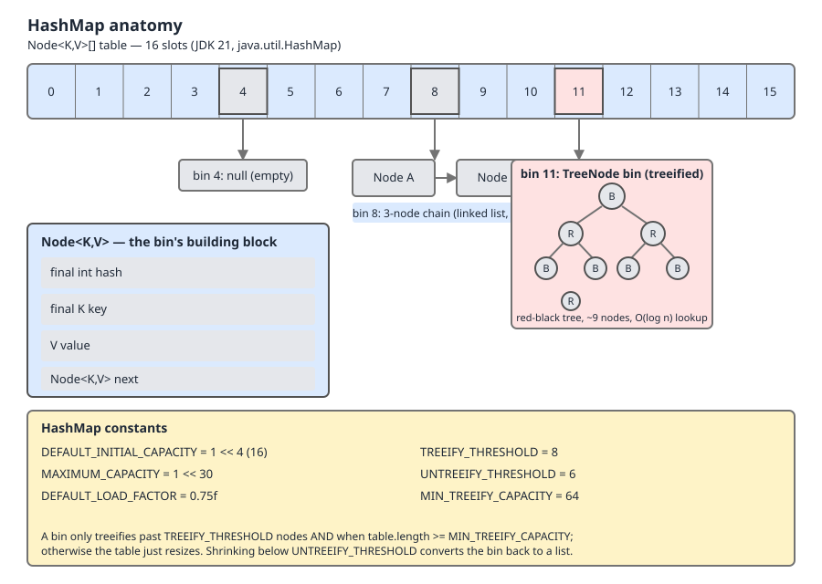

# 02 Java Collections — `HashMap` — INTERNALS (§3.6 `HashMap` source walk — the six constants, the field set and `Node`)

**Target version: Java 21 LTS.** | [Index](../00-index.md)
Previous: [priority-queue/05-build-my-priority-queue-c-variants-and-diff.md](../priority-queue/05-build-my-priority-queue-c-variants-and-diff.md) · Next: [hash-map/01b-internals-a2-hash-spread-and-sizing.md](01b-internals-a2-hash-spread-and-sizing.md)

`HashMap` is 2587 lines of source in JDK 21, and roughly a third of the behaviour people ask about in interviews is decided by **six `static final` numbers declared in the first fifty lines of the class body**. This file walks those six, the six instance fields they steer, and the `Node` those fields point at. Nothing here is about the hash function itself — the spread `h ^ (h >>> 16)` and `tableSizeFor` are the next file's subject.

## The shape of the class, before the details

| Layer | What it is | Where |
|---|---|---|
| Six `static final` constants | Tuning numbers, fixed at compile time, shared by every `HashMap` in the JVM | lines 238–275 |
| Six instance fields | `table`, `entrySet`, `size`, `modCount`, `threshold`, `loadFactor` | lines 390–428 |
| `Node<K,V>` | The plain bin node — four fields, one of them the cached hash | line 281 |
| `TreeNode<K,V>` | The red-black replacement for a long bin, `extends LinkedHashMap.Entry` | line 1966 |

Read top-down: the constants decide when the fields change, the fields decide what the table looks like, the table is an array of `Node`.

---

## The six constants as one designed set

### Mental model

Do not read the six constants as six independent knobs someone tuned separately. Read them as **one interlocking mechanism with three moving parts**: a sizing policy (`DEFAULT_INITIAL_CAPACITY`, `MAXIMUM_CAPACITY`, `DEFAULT_LOAD_FACTOR`), a treeify policy (`TREEIFY_THRESHOLD`, `MIN_TREEIFY_CAPACITY`), and a hysteresis band that stops the two policies oscillating against each other (`UNTREEIFY_THRESHOLD`). Change one and the source's own javadoc tells you what breaks — the comments literally say "should be at least 4 * TREEIFY_THRESHOLD" and "should be less than TREEIFY_THRESHOLD". They are constrained relative to each other, not absolutely.

### Why they exist

Before Java 8, `HashMap` had only three of them: initial capacity, maximum capacity, load factor. A bin was always a linked list, so a bin with `n` colliding keys cost O(n) to search, and a hostile client that could pick keys (HTTP form parameter names, JSON object keys) could force every key into one bin and turn an O(1) map into an O(n) one — the 2011 hash-collision denial-of-service class of attack. Java 8 added treeification, and treeification needs three more numbers to say *when* to tree, *when to stop*, and *when the table is simply too small for treeing to be the right answer*. The attack itself is carried in [`04c-internals-d3-collision-dos.md`](04c-internals-d3-collision-dos.md).

### When they matter to you, and when they do not

They matter when you are sizing a map you know the population of, when you are explaining a resize spike in a profile, or when you are asked in an interview why 0.75. They do **not** matter as tuning surface: all six are **package-private `static final`, not `public`**, there is no getter, no setter, and **no system property for any of them**. You cannot move them from application code and you cannot move them with a JVM flag. The only knob the JDK exposes is the per-instance `loadFactor` constructor argument — and `Map.of` / `Map.copyOf` do not even offer that, because `ImmutableCollections` is a different implementation entirely.

### The mechanism, line by line

```java
    /**
     * The default initial capacity - MUST be a power of two.
     */
    static final int DEFAULT_INITIAL_CAPACITY = 1 << 4; // aka 16
```
— `java.base/java/util/HashMap.java`, JDK 21, line 238. (leaf 3.6.1)

`1 << 4` is `16`. Written as a shift rather than as `16` to make the power-of-two requirement syntactically visible: the whole indexing scheme is `hash & (table.length - 1)`, which is only equivalent to `hash % table.length` when the length is a power of two, because `16 - 1 = 0b1111` is a clean low-bit mask. The `MUST` in the javadoc is load-bearing, not stylistic.

```java
    /**
     * The maximum capacity, used if a higher value is implicitly specified
     * by either of the constructors with arguments.
     * MUST be a power of two <= 1<<30.
     */
    static final int MAXIMUM_CAPACITY = 1 << 30;
```
— `java.base/java/util/HashMap.java`, JDK 21, line 245. (leaf 3.6.2)

`1 << 30 = 1,073,741,824`. Why not `1 << 31`? Because in a 32-bit signed `int`, `1 << 31` is `-2,147,483,648` — `Integer.MIN_VALUE`. The capacity must be a *positive* power of two, and it is also used directly as an array length, so `1 << 31` would be an impossible `new Node[negative]`. Even `1 << 30` is theoretical: 1,073,741,824 `Node` references at 4 bytes each under compressed oops is a **4 GB array of pointers**, before a single `Node` object is allocated. Two places read it — `tableSizeFor` clamps to it, and `resize()` at line 690 does:

```java
        if (oldCap > 0) {
            if (oldCap >= MAXIMUM_CAPACITY) {
                threshold = Integer.MAX_VALUE;
                return oldTab;
            }
```
— `java.base/java/util/HashMap.java`, JDK 21, lines 688–692. (leaf 3.6.2)

At maximum capacity the map sets `threshold` to `Integer.MAX_VALUE` — a value it can never reach, since `size` is an `int` — and returns the *old* table unchanged. From that point the map never grows again and simply degrades into longer and longer bins (treeified ones, so O(log n) rather than O(n)).

```java
    /**
     * The load factor used when none specified in constructor.
     */
    static final float DEFAULT_LOAD_FACTOR = 0.75f;
```
— `java.base/java/util/HashMap.java`, JDK 21, line 250. (leaf 3.6.3)

The arithmetic nobody remembers: `16 × 0.75 = 12`, so `threshold` on a default map is **12**, and the map resizes on the **13th** `put` of a distinct key — not the 17th, not when the table is full. It never gets full. The engineering summary of 0.75 is a space/time midpoint: lower means more empty slots (memory wasted, fewer collisions), higher means longer bins (memory saved, more probing). The probabilistic argument — why 0.75 makes a bin of 8 a one-in-sixteen-million event under a Poisson model — is worked in [`04b-internals-d2-poisson-and-hysteresis.md`](04b-internals-d2-poisson-and-hysteresis.md); it is not repeated here.

```java
    static final int TREEIFY_THRESHOLD = 8;
```
— `java.base/java/util/HashMap.java`, JDK 21, line 260, javadoc elided (quoted below). (leaf 3.6.4)

> The bin count threshold for using a tree rather than list for a bin. Bins are converted to trees when adding an element to a bin with at least this many nodes. The value must be greater than 2 and should be at least 8 to mesh with assumptions in tree removal about conversion back to plain bins upon shrinkage.

Two constraints stated by the JDK itself: `> 2` is hard (a red-black tree of fewer nodes is pure overhead), `>= 8` is a soft coupling to the untreeify path.

```java
    static final int UNTREEIFY_THRESHOLD = 6;
```
— `java.base/java/util/HashMap.java`, JDK 21, line 267, javadoc elided (quoted below). (leaf 3.6.5)

> The bin count threshold for untreeifying a (split) bin during a resize operation. Should be less than TREEIFY_THRESHOLD, and at most 6 to mesh with shrinkage detection under removal.

**Insight:** 6 and 8 are not two thresholds, they are one threshold with a **hysteresis band of two nodes**. If both were 8, a bin sitting exactly at 8 would treeify on every insert and untreeify on every removal — paying a full tree build and a full tree teardown per operation, forever. The gap of two means a bin must genuinely shrink by three before the map spends anything undoing the tree. This is the same trick as a thermostat's deadband.

```java
    static final int MIN_TREEIFY_CAPACITY = 64;
```
— `java.base/java/util/HashMap.java`, JDK 21, line 275, javadoc elided (quoted below). (leaf 3.6.6)

> The smallest table capacity for which bins may be treeified. (Otherwise the table is resized if too many nodes in a bin.) Should be at least 4 * TREEIFY_THRESHOLD to avoid conflicts between resizing and treeification thresholds.

`4 × 8 = 64` — the source derives this one from `TREEIFY_THRESHOLD` in its own comment. The reasoning: in a 16-slot table a bin of 8 is not evidence of a bad hash function, it is evidence of a small table. Resizing splits that bin cheaply and probably fixes it; building a red-black tree does not fix it and costs more. So below capacity 64, "bin reached 8" is routed to `resize()` instead of `treeifyBin()`.



Look at three things in that picture: most slots are `null` even at the resize point (that is the 0.75 doing its job), a bin is a *singly* linked chain reachable only forward, and the blown-up `Node` carries a `hash` alongside the key — the map does not go back to the key to get it.

### The set, as a table

| Constant | Value | Read by | What breaks if you moved it |
|---|---|---|---|
| `DEFAULT_INITIAL_CAPACITY` | `1 << 4` = 16 | `resize()` when `threshold == 0` | Not a power of two ⇒ `hash & (n-1)` stops being a modulo and whole index ranges become unreachable |
| `MAXIMUM_CAPACITY` | `1 << 30` = 1,073,741,824 | `tableSizeFor`, `resize()`, both `int` constructors | `1 << 31` is negative ⇒ `new Node[negative]` |
| `DEFAULT_LOAD_FACTOR` | `0.75f` | no-arg and `int` constructors, `resize()` | Higher ⇒ longer bins, treeify fires far more often; lower ⇒ resizes far more often |
| `TREEIFY_THRESHOLD` | 8 | `putVal` bin-length check | `<= 2` breaks tree-removal assumptions; `< 8` makes treeing common enough to cost more than it saves |
| `UNTREEIFY_THRESHOLD` | 6 | `split()`, `removeTreeNode()` | `>= TREEIFY_THRESHOLD` ⇒ treeify/untreeify thrash on every insert-remove pair at the boundary |
| `MIN_TREEIFY_CAPACITY` | 64 | `treeifyBin()` | Too low ⇒ small tables tree instead of resizing, which is strictly worse; too high ⇒ small hostile maps stay O(n) |

**Version:** all six are byte-for-byte identical in JDK 8 (lines 236–273), JDK 17 (lines 238–275) and JDK 21 (lines 238–275) — verified against the three source trees. All six except the first three *arrived* in Java 8, together with treeification. Java 7 had only `DEFAULT_INITIAL_CAPACITY`, `MAXIMUM_CAPACITY` and `DEFAULT_LOAD_FACTOR`.

**Interview:** "Why 8 and 6, not 8 and 8?" — Hysteresis. A two-node deadband stops a bin at the boundary from paying a tree build and teardown on every insert/remove pair.

> The six `HashMap` constants are a single co-designed policy — powers of two for masked indexing, 0.75 for the space/time midpoint, and 8/6/64 as a treeify trigger, an untreeify deadband and a "resize instead" floor — and none of them is reachable, settable or flaggable from application code.

---

## The overloaded `threshold` field

### Mental model

`threshold` is a **union type crammed into an `int`**, discriminated by whether `table` is `null`. When `table != null` it means what its name says: the size at which to resize. When `table == null` it means something completely different: *the capacity to allocate the first time anyone touches this map*. And `0` is a third thing — a sentinel meaning "no capacity requested, use 16".

### Why it exists

`HashMap` allocates lazily: `new HashMap<>(1_000_000)` that is never written to must not cost 4 MB. So the constructor has to remember the requested capacity somewhere until the first `put`. The JDK's options were an extra `int` field on every map instance — 4 bytes × every `HashMap` in every heap in the world, for a value that is dead after the first write — or reuse a field that is provably meaningless before the table exists. They reused the field.

### The mechanism

The six instance fields, verbatim, javadoc elided except where it is the point:

```java
    transient Node<K,V>[] table;
    transient Set<Map.Entry<K,V>> entrySet;
    transient int size;
    transient int modCount;
    int threshold;
    final float loadFactor;
```
— `java.base/java/util/HashMap.java`, JDK 21, lines 390, 396, 401, 410, 421, 428. (leaf 3.6.7)

- `table` — the bin array, `null` until first write, always a power-of-two length once allocated.
- `entrySet` — a cached view object, created on first `entrySet()` call. `keySet()` and `values()` are cached in `AbstractMap`'s fields instead, not here.
- `size` — mapping count. `size()` returns this field; it is never computed by walking.
- `modCount` — structural modification counter, read by every iterator to throw `ConcurrentModificationException`. Bumped by insert, remove and **resize**.
- `threshold` — see below.
- `loadFactor` — `final`, per-instance, the only exposed tunable in the whole class.

**`transient` on four, not on `threshold` and `loadFactor`.** Serialization does not write the bin array (it would bake in a capacity and a hash layout that may be wrong on the reading JVM — `String.hashCode` is specified, but user `hashCode`s are not stable across processes). Instead `writeObject` emits `threshold`, `loadFactor` (both marked `@serial`) and the entries; `readObject` rebuilds the table by re-inserting. Full treatment in [`../utilities/06-serialization.md`](../utilities/06-serialization.md).

Now the overload, and note that the JDK states it in a **plain comment, not in the specified javadoc** — so it is invisible in generated docs:

```java
    /**
     * The next size value at which to resize (capacity * load factor).
     *
     * @serial
     */
    // (The javadoc description is true upon serialization.
    // Additionally, if the table array has not been allocated, this
    // field holds the initial array capacity, or zero signifying
    // DEFAULT_INITIAL_CAPACITY.)
    int threshold;
```
— `java.base/java/util/HashMap.java`, JDK 21, lines 413–421. (leaf 3.6.8)

The two writers of the overloaded meaning:

```java
    public HashMap(int initialCapacity, float loadFactor) {
        if (initialCapacity < 0)
            throw new IllegalArgumentException("Illegal initial capacity: " +
                                               initialCapacity);
        if (initialCapacity > MAXIMUM_CAPACITY)
            initialCapacity = MAXIMUM_CAPACITY;
        if (loadFactor <= 0 || Float.isNaN(loadFactor))
            throw new IllegalArgumentException("Illegal load factor: " +
                                               loadFactor);
        this.loadFactor = loadFactor;
        this.threshold = tableSizeFor(initialCapacity);
    }
```
— `java.base/java/util/HashMap.java`, JDK 21, line 445. (leaf 3.6.8)

Read what it does **not** do: it never assigns `table`. `new HashMap<>(1000)` allocates no array at all, and parks `tableSizeFor(1000) == 1024` in `threshold` as a pending capacity. Note also `Float.isNaN(loadFactor)` — `NaN <= 0` is false, so the NaN check is a separate clause, not redundant.

```java
    public HashMap() {
        this.loadFactor = DEFAULT_LOAD_FACTOR; // all other fields defaulted
    }
```
— `java.base/java/util/HashMap.java`, JDK 21, line 476. (leaf 3.6.8)

`threshold` stays at its default `0`, and `0` is the third meaning: "no capacity requested".

The single reader that decodes all three meanings, in `resize()`:

```java
        if (oldCap > 0) {
            // (grow path elided - covered in 02-internals-b-resize.md)
        }
        else if (oldThr > 0) // initial capacity was placed in threshold
            newCap = oldThr;
        else {               // zero initial threshold signifies using defaults
            newCap = DEFAULT_INITIAL_CAPACITY;
            newThr = (int)(DEFAULT_LOAD_FACTOR * DEFAULT_INITIAL_CAPACITY);
        }
        if (newThr == 0) {
            float ft = (float)newCap * loadFactor;
            newThr = (newCap < MAXIMUM_CAPACITY && ft < (float)MAXIMUM_CAPACITY ?
                      (int)ft : Integer.MAX_VALUE);
        }
        threshold = newThr;
```
— `java.base/java/util/HashMap.java`, JDK 21, lines 688–707, grow branch elided. (leaf 3.6.8)

Trace both constructors through it:

- `new HashMap<>(1000)`: `oldCap == 0`, `oldThr == 1024` ⇒ `newCap = 1024`, `newThr` still `0` ⇒ `ft = 1024f × 0.75f = 768.0f` ⇒ `threshold = 768`. The overload is now discharged; from here `threshold` means what its name says.
- `new HashMap<>()`: `oldCap == 0`, `oldThr == 0` ⇒ `newCap = 16` and `newThr = (int)(0.75f × 16) = 12` in the same branch, so the `newThr == 0` fix-up is skipped ⇒ `threshold = 12`.

### Observing it

```java
import java.lang.reflect.Field;
import java.util.HashMap;
import java.util.Map;

public class Anatomy {

    static final Field TABLE, THRESHOLD;
    static {
        try {
            TABLE = HashMap.class.getDeclaredField("table");
            THRESHOLD = HashMap.class.getDeclaredField("threshold");
            TABLE.setAccessible(true);
            THRESHOLD.setAccessible(true);
        } catch (ReflectiveOperationException e) {
            throw new ExceptionInInitializerError(e);
        }
    }

    static String snapshot(Map<?, ?> m) throws IllegalAccessException {
        Object[] tab = (Object[]) TABLE.get(m);
        int thr = THRESHOLD.getInt(m);
        return "size=" + m.size()
             + " table=" + (tab == null ? "null" : "Node[" + tab.length + "]")
             + " threshold=" + thr;
    }

    /** A key that counts every call to hashCode(). */
    static final class CountingKey {
        static int hashCalls = 0;
        private final int id;
        CountingKey(int id) { this.id = id; }
        @Override public int hashCode() { hashCalls++; return id; }
        @Override public boolean equals(Object o) {
            return o instanceof CountingKey k && k.id == id;
        }
    }

    public static void main(String[] args) throws Exception {
        var sized = new HashMap<String, String>(1000);
        System.out.println("new HashMap<>(1000) before any put : " + snapshot(sized));
        sized.put("a", "1");
        System.out.println("new HashMap<>(1000) after one put  : " + snapshot(sized));

        var def = new HashMap<Integer, Integer>();
        System.out.println("new HashMap<>()     before any put : " + snapshot(def));
        for (int i = 1; i <= 13; i++) {
            def.put(i, i);
            if (i == 12 || i == 13) {
                System.out.println("after put #" + i + "                     : " + snapshot(def));
            }
        }

        var counting = new HashMap<CountingKey, Integer>();
        for (int i = 0; i < 12; i++) counting.put(new CountingKey(i), i);
        System.out.println("counting map before resize        : " + snapshot(counting));
        CountingKey.hashCalls = 0;
        counting.put(new CountingKey(12), 12);   // triggers resize 16 -> 32
        System.out.println("counting map after resize         : " + snapshot(counting));
        System.out.println("hashCode() calls during that put  : " + CountingKey.hashCalls);
    }
}
```

Run with `java --add-opens java.base/java.util=ALL-UNNAMED Anatomy.java` (JDK 21 — the strong encapsulation of `java.util` means plain `setAccessible` is refused without it). Real output:

```
new HashMap<>(1000) before any put : size=0 table=null threshold=1024
new HashMap<>(1000) after one put  : size=1 table=Node[1024] threshold=768
new HashMap<>()     before any put : size=0 table=null threshold=0
after put #12                     : size=12 table=Node[16] threshold=12
after put #13                     : size=13 table=Node[32] threshold=24
counting map before resize        : size=12 table=Node[16] threshold=12
counting map after resize         : size=13 table=Node[32] threshold=24
hashCode() calls during that put  : 1
```

**Pitfall:** A heap dump or a debugger stopped on a freshly constructed `new HashMap<>(1000)` shows `threshold = 1024` and `table = null`. The field's javadoc says "the next size value at which to resize", so the natural conclusion is that this map resizes at 1024 entries. **It resizes at 768.** The symptom is a capacity-planning calculation that is 33% off, and a "why did this map resize, I sized it" bug report. The fix: `threshold` before the first write is a *pending capacity*, not a threshold — multiply it by `loadFactor` yourself, or just do one `put` before you read it. Nothing in the field's name or its `@serial` javadoc says this; only an unrendered `//` comment does.

> `threshold` holds the resize trigger once `table` is non-null, the pending initial capacity while `table` is null, and `0` as a sentinel for "use `DEFAULT_INITIAL_CAPACITY`" — three meanings in one `int`, discriminated by `table == null`.

---

## `Node<K,V>` and its four fields

### Mental model

A `Node` is a **singly linked list cell that happens to implement `Map.Entry`**. Not a container, not a wrapper — the entry *is* the list cell. That is why `Map.Entry` objects handed out by `entrySet()` iteration are live views into the table: `entry.setValue(v)` writes straight through to the map, because the entry is the node.

### Why it exists in this exact shape

Four fields, no more, because it is allocated once per mapping and a fifth field would be 4 bytes multiplied by every entry in every map in the heap. Everything a lookup needs must be reachable from the node without a second dereference — hence the cached `hash` sitting inline rather than a call back into the key.

### Mechanism

```java
    static class Node<K,V> implements Map.Entry<K,V> {
        final int hash;
        final K key;
        V value;
        Node<K,V> next;

        Node(int hash, K key, V value, Node<K,V> next) {
            this.hash = hash;
            this.key = key;
            this.value = value;
            this.next = next;
        }
```
— `java.base/java/util/HashMap.java`, JDK 21, lines 281–291. (leaf 3.6.9)

- `static` nested, not inner — no synthetic `this$0` reference back to the enclosing map, saving 4 bytes per entry and a whole class of leaks.
- `hash` is `final` — the *spread* hash, `HashMap.hash(key)`, frozen at construction.
- `key` is `final` — a mapping's key never changes identity; `put` of an existing key overwrites `value` only.
- `value` is mutable — that is what `put`-over-existing and `setValue` write.
- `next` is mutable — bin chaining, and `null` for the last node in a bin. There is no `prev`; bins are forward-only, which is why removal from a bin must walk from the head.

A second `hashCode` lives on this class and it is not the field:

```java
        public final int hashCode() {
            return Objects.hashCode(key) ^ Objects.hashCode(value);
        }
```
— `java.base/java/util/HashMap.java`, JDK 21, lines 298–300. (leaf 3.6.9)

**Pitfall:** `node.hashCode()` and `node.hash` are different numbers computed from different inputs. `hashCode()` is the `Map.Entry` contract hash — key XOR value, used when an entry is put into a `HashSet<Map.Entry<K,V>>` or compared for entry equality. `hash` is the spread *key* hash used for bin indexing and never involves the value. Reading a debugger and seeing them disagree is not a bug.

### The subclass ladder

| Class | Extends | Extra fields over `Node` | Used when |
|---|---|---|---|
| `HashMap.Node` | — | — | Default bin node |
| `LinkedHashMap.Entry` | `HashMap.Node` | `before`, `after` | Any `LinkedHashMap` |
| `HashMap.TreeNode` | `LinkedHashMap.Entry` | `parent`, `left`, `right`, `prev`, `red` | Treeified bin, line 1966 |

`TreeNode extends LinkedHashMap.Entry` even in a plain `HashMap` — an inheritance oddity that exists so `LinkedHashMap` can reuse `HashMap`'s treeification without a parallel hierarchy. The memory consequences (32 B → 40 B → 56 B) are laid out in [`../cost-and-memory/02-internals-memory-headers.md`](../cost-and-memory/02-internals-memory-headers.md).

> A `HashMap.Node` is a static four-field cell — frozen spread hash, frozen key, mutable value, forward-only `next` — that doubles as the `Map.Entry` handed to callers.

---

## The cached `hash` field

### Mental model

The map **memoises the user's hash function on first contact and never trusts it again**. Every subsequent operation — lookup, chain walk, resize, treeify, split — reads the memo. A `HashMap` calls a key's `hashCode()` exactly once per key-object that crosses the API boundary, and zero times for keys already in the table.

### Working the argument (leaf 3.6.10)

**Step 1 — it is written once.** `hash` is `final`, assigned in the `Node` constructor from `HashMap.hash(key)`. Nothing in the class reassigns it; the compiler will not let it.

**Step 2 — it short-circuits the chain walk.** Both `getNode` and `putVal` test `e.hash == hash` *before* touching the key. An `int` compare against a field in the same cache line as the object header rejects nearly every non-matching node for free. Without the cache each chain step would be a virtual call into user code, and `equals` would then have to be called on candidates that the hash alone could have eliminated.

**Step 3 — resize is the load-bearing case.** `resize()` walks every node and computes `e.hash & (newCap - 1)` for tree splits and `e.hash & oldCap` for the low/high chain split. It reads the field; it never reaches into the key. **A resize therefore executes zero lines of user code.** The counting harness above proves it: growing a 12-entry map to 32 slots on the 13th put registered exactly **1** `hashCode()` call — the one for the brand-new key being inserted — and **0** for the twelve nodes being rehomed.

**Step 4 — the deep consequence.** Because the hash is frozen at insert, a key whose `hashCode()` changes after insertion fails *predictably*: the node stays in the bin its old hash chose, `get` computes the new hash, lands in a different bin, and returns `null`. The entry is stranded but the table is intact — `size` is right, iteration still yields it, no infinite loop, no corruption. Without the cache the same mutation would relocate entries mid-resize and could genuinely tear the table. The cache converts an unbounded correctness hazard into a bounded, debuggable one. The mutable-key trap itself is in [`../contracts/02-equals-hashcode-contract.md`](../contracts/02-equals-hashcode-contract.md).

**Step 5 — the price.** 4 bytes per node, inside the 32-byte `Node`: `12 B header + 4 hash + 4 key ref + 4 value ref + 4 next ref = 28 B`, aligned up to **32 B**. That is 12.5% of the node spent on a memo. It buys the elimination of every user-code call on the hot path. The full memory ladder is in [`../cost-and-memory/02-internals-memory-headers.md`](../cost-and-memory/02-internals-memory-headers.md).

**Version trap:** the `final` on `hash` is itself a Java 8 change. Java 7's `HashMap.Entry` declared a **non-final `int hash`**, and Java 7's `transfer` reassigned it during a resize when alternative hashing was enabled — `e.hash = null == e.key ? 0 : hash(e.key);` — which means a Java 7 resize *did* call user `hashCode()` on every entry. If an interviewer insists a resize rehashes by calling `hashCode`, they are describing Java 7.

**Interview:** "Does resizing a `HashMap` call `hashCode()` again?" — No, since Java 8. The spread hash is cached `final` on each `Node`, and `resize()` derives the new index from `e.hash & oldCap`. Java 7 did re-call it.

> The cached `hash` is a 4-byte per-node memo of the spread key hash that makes chain walks branch on an `int`, makes resize entirely free of user code, and turns post-insert key mutation into a contained failure rather than a corrupt table.

---

## Pitfalls

### Reading `threshold` on a freshly sized map as the resize point

**Wrong**

```java
var m = new HashMap<String, String>(1000);
// debugger / heap dump shows: table = null, threshold = 1024
// conclusion drawn: "this map resizes at 1000+ entries, I sized it right"
```
The map's table is `Node[1024]` after the first put and its threshold is then `768`. Entry 769 triggers a full rehash into `Node[2048]` — the resize the sizing was meant to avoid.

**Right**

```java
var m = HashMap.<String, String>newHashMap(1000);   // Java 19+
// allocates capacity 2048, threshold 1536 - genuinely holds 1000 without resizing
```
`newHashMap(n)` (added in Java 19) does the `n / 0.75` division for you. Pre-19, write `new HashMap<>((int) Math.ceil(1000 / 0.75))`.

**Why people believe it:** the field's rendered javadoc says exactly "the next size value at which to resize", and the correction lives in a `//` comment that javadoc does not render.

### Expecting a bin of 8 to become a tree

**Wrong**

```java
// 8 keys all colliding into one bin of a default 16-slot map
// expectation: bin is now a red-black tree, lookups are O(log n)
```
Capacity 16 < `MIN_TREEIFY_CAPACITY` (64), so `treeifyBin` calls `resize()` instead and the bin stays a linked list.

**Right**

A bin treeifies only when **both** conditions hold: the bin reaches `TREEIFY_THRESHOLD` (8) *and* `table.length >= MIN_TREEIFY_CAPACITY` (64). Below 64 the map grows the table instead.

**Why people believe it:** every blog post quotes "8" and stops there; the 64 is the second half of the same rule.

### Treating `node.hashCode()` as the bin hash

**Wrong**

```java
// assuming entry.hashCode() tells you which bin the entry is in
int bin = entry.hashCode() & (capacity - 1);   // wrong bin, includes the value
```

**Right**

The bin index comes from the spread *key* hash: `(h = key.hashCode()) ^ (h >>> 16)`, then `& (capacity - 1)`. `Node.hashCode()` is `Objects.hashCode(key) ^ Objects.hashCode(value)` and exists purely for the `Map.Entry` equality contract.

**Why people believe it:** both are called "the hash of the entry" in casual speech, and both are `int`.

---

## Cheat sheet

| Item | Value / fact |
|---|---|
| `DEFAULT_INITIAL_CAPACITY` | `1 << 4` = 16, line 238 |
| `MAXIMUM_CAPACITY` | `1 << 30` = 1,073,741,824, line 245 |
| `DEFAULT_LOAD_FACTOR` | `0.75f`, line 250 |
| `TREEIFY_THRESHOLD` | 8, line 260 |
| `UNTREEIFY_THRESHOLD` | 6, line 267 — 2-node hysteresis band |
| `MIN_TREEIFY_CAPACITY` | 64 = 4 × 8, line 275 |
| Default map resizes on put # | 13 (16 × 0.75 = 12) |
| Constant visibility | package-private `static final`, no flag, no property |
| Fields | `table`, `entrySet`, `size`, `modCount` (all `transient`); `threshold`, `loadFactor` (both `@serial`) |
| `threshold` when `table == null` | pending capacity; `0` ⇒ use 16 |
| `new HashMap<>(1000)` at construction | `table == null`, `threshold == 1024` |
| `new HashMap<>(1000)` after 1 put | `table == Node[1024]`, `threshold == 768` |
| `Node` fields | `final int hash`, `final K key`, `V value`, `Node<K,V> next` |
| `Node` footprint | 12 + 4 + 4 + 4 + 4 = 28 → **32 B** aligned |
| `Node.hashCode()` | `Objects.hashCode(key) ^ Objects.hashCode(value)` — not the bin hash |
| `hashCode()` calls per resize | **0** (Java 8+); Java 7 called it per entry |
| Constants across JDK 8 / 17 / 21 | identical |

---

## Self-test

**Q1.** A default `HashMap` is filled with distinct keys. On which `put` does the table first grow, and to what?

<details><summary>Answer</summary>

The 13th. `threshold` is `(int)(0.75f × 16) = 12`; `putVal` grows when `++size > threshold`, so size 13 triggers `resize()` and the table becomes `Node[32]` with `threshold = 24`. The table is never "full" — it grows at 75% occupancy of slots, not at 100%.

</details>

**Q2.** `new HashMap<>(1000)` is constructed and never written to. What are `table` and `threshold`?

<details><summary>Answer</summary>

`table == null` — no array is allocated by any constructor. `threshold == 1024`, which is `tableSizeFor(1000)`, the *pending capacity*, not a resize trigger. After the first `put`, `resize()` decodes it: `newCap = 1024`, `threshold = (int)(1024 × 0.75f) = 768`.

</details>

**Q3.** Why is `MAXIMUM_CAPACITY` `1 << 30` rather than `1 << 31`?

<details><summary>Answer</summary>

`1 << 31` in a signed 32-bit `int` is `Integer.MIN_VALUE` = −2,147,483,648. Capacity is used as an array length and as the operand of `hash & (n-1)`, both of which require a positive power of two. `1 << 30` = 1,073,741,824 is already a 4 GB reference array under compressed oops, so the limit is practical as well as arithmetic.

</details>

**Q4.** Why is `UNTREEIFY_THRESHOLD` 6 and not 8?

<details><summary>Answer</summary>

Hysteresis. With both at 8, a bin oscillating around 8 nodes would build a red-black tree on every insert and tear it down on every removal. The two-node deadband means a bin must shrink to 6 before untreeifying, so an insert-remove pair at the boundary costs nothing. The JDK's own javadoc says it "should be less than TREEIFY_THRESHOLD".

</details>

**Q5.** A bin in a 16-slot table reaches 8 nodes. Is it treeified?

<details><summary>Answer</summary>

No. `treeifyBin` checks `table.length >= MIN_TREEIFY_CAPACITY` (64) first; at 16 it calls `resize()` instead. In a small table a long bin is evidence of a small table, not of a bad hash function, and splitting is cheaper and more likely to help than building a tree.

</details>

**Q6.** How many times does `HashMap` call a key's `hashCode()` while doubling a 1,000,000-entry table?

<details><summary>Answer</summary>

Zero. Each `Node` caches the spread hash in a `final int hash`, and `resize()` splits bins using `e.hash & oldCap` and `e.hash & (newCap - 1)`. This was different in Java 7, whose `Entry.hash` was non-final and was reassigned in `transfer` when alternative hashing was on.

</details>

**Q7.** Why is `table` `transient` but `threshold` not?

<details><summary>Answer</summary>

The bin array's layout depends on hash values that may not be reproducible in the deserializing JVM, and serializing it would bake in a capacity. So `writeObject` emits `threshold` and `loadFactor` (both `@serial`) plus the entries, and `readObject` rebuilds the table by re-inserting each mapping — which recomputes every hash in the new process.

</details>

**Q8.** What is the difference between `Node.hash` and `Node.hashCode()`?

<details><summary>Answer</summary>

`Node.hash` is the spread key hash, `(h = key.hashCode()) ^ (h >>> 16)`, cached `final`, used for bin indexing and chain-walk short-circuiting. `Node.hashCode()` is `Objects.hashCode(key) ^ Objects.hashCode(value)` — the `Map.Entry` contract hash, which involves the value and is never used for indexing.

</details>

**Q9.** Which of the six constants can an application change at runtime, and how?

<details><summary>Answer</summary>

None. All six are package-private `static final` with no accessor and no backing system property. The only exposed tuning surface is the per-instance `loadFactor` argument to `new HashMap<>(int, float)`, and even that cannot exceed or replace the treeify constants.

</details>

**Q10.** Why does `TreeNode` extend `LinkedHashMap.Entry` rather than `HashMap.Node` directly?

<details><summary>Answer</summary>

So that `LinkedHashMap`, which needs `before`/`after` links on every node, can reuse `HashMap`'s treeification code unchanged. The cost is that a `TreeNode` in a plain `HashMap` carries two unused link fields — part of why a `TreeNode` is 56 bytes against `Node`'s 32.

</details>

---

**Leaves covered:** 3.6.1, 3.6.2, 3.6.3, 3.6.4, 3.6.5, 3.6.6, 3.6.7, 3.6.8, 3.6.9, 3.6.10 (10 leaves)
**Leaves deferred:** none
**Diagrams included:** D-85
**Target version:** Java 21 LTS
**Lines:** 572
