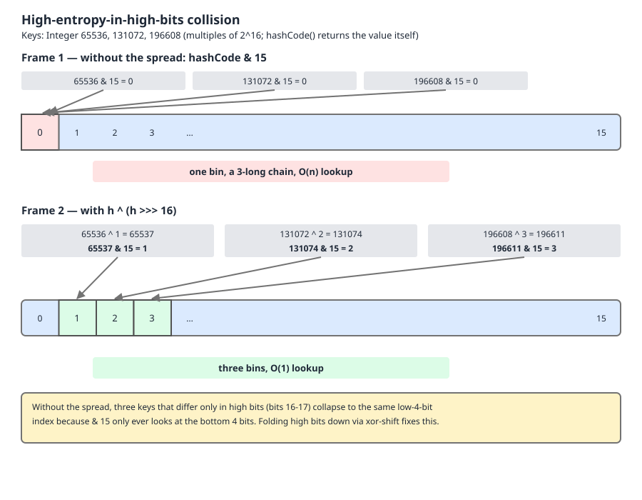
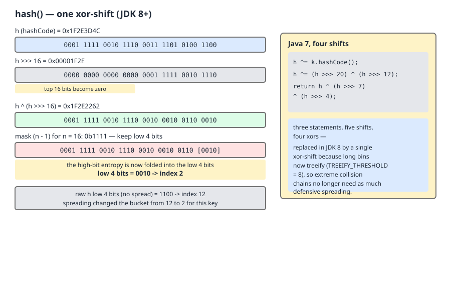
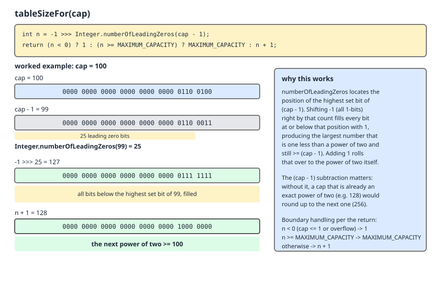

# 02 Java Collections — `HashMap` — INTERNALS (§3.6 `HashMap` source walk — `hash()`, the spread, and `tableSizeFor`)

**Target version: Java 21 LTS.** | [Index](../00-index.md)
Previous: [hash-map/01-internals-a-constants-and-hash.md](01-internals-a-constants-and-hash.md) · Next: [hash-map/02-internals-b-put-and-get.md](02-internals-b-put-and-get.md)

---

## The one idea this file hangs on

There are exactly two mainstream ways to turn a 32-bit `hashCode` into a bucket index.

**Prime modulus.** Make the table length a prime, index with `hash % length`. Division by a prime folds *every* bit of the hash into the result — the high bits participate for free. You never need to pre-mix the hash. You pay a hardware division on every single lookup, and resizing means finding the next prime and rehashing every entry through a fresh modulo.

**Power of two plus a mask.** Make the table length `2^k`, index with `(n - 1) & hash`. That is one `AND` instruction. But a mask is a *truncation*: it keeps bits `0..k-1` and throws bits `k..31` on the floor. Any key distribution whose variation lives above bit `k-1` lands entirely in one bucket. So you must mix the high bits down into the low bits yourself, before masking.

The JDK picked the second design. `HashMap.hash()` — three lines of bit-twiddling — is the price of that choice. It is not a hash function. It is a *repair* applied to somebody else's hash function, to compensate for the fact that the index operation is going to discard 28 of the 32 bits.

Hold that: **the spread exists because the index is a mask.** Everything below follows from it.

| Design | Index op | High bits used? | Pre-mix needed? | Resize | Used by |
|---|---|---|---|---|---|
| Prime modulus | `(h & 0x7FFFFFFF) % len` | Yes, implicitly | No | Rehash all, next prime | `Hashtable` (JDK 21, line 354) |
| Power of two + mask | `(n - 1) & h` | Only if mixed down | **Yes** | Single bit test per node | `HashMap`, `ConcurrentHashMap`, `HashSet` |

---

## 1. Power-of-two capacity, and why the index is a mask

### Mental model

A power-of-two table length turns "which bucket" from an arithmetic question into a *slicing* question. `n = 16` means the mask is `0b1111`; the index is literally the bottom nibble of the hash, read off like a field in a packed struct. No division, no remainder, no sign handling. The table length stops being a number you compute against and becomes a bit-width.

### Why it exists

Hash tables before it used prime moduli because prime moduli distribute badly-behaved hashes well. That is a good property bought with a bad instruction. `HashMap` inverted the trade: take the cheapest possible index operation, and fix the distribution separately.

### When the other design wins

If you cannot control the hash function and cannot pre-mix (a C hash table over opaque keys, a database bucketing scheme where the hash is fixed by a wire format), prime modulus is safer — it is robust to hashes with dead low bits without any cooperation. `HashMap` can pre-mix because it controls both `hash()` and the index calculation, so it takes the fast index.

### Mechanism — proving the three consequences

**(a) The mask is `mod` for non-negative values, and *correct* where `%` is not.**

For `n = 2^k`, `h mod n` is by definition the value of the low `k` bits of `h` — which is exactly `h & (n - 1)`, because `n - 1` is `k` ones. That equivalence is standard for `h >= 0`.

The interesting half is `h < 0`. Java's `%` is *remainder*, not modulus: it takes the sign of the dividend.

```
-7 % 16  = -7     ← negative. ArrayIndexOutOfBoundsException as an index.
-7 & 15  =  9     ← in range, always.
```

(both printed by the harness in §5). The mask reinterprets the two's-complement bit pattern and keeps the low bits; the sign bit is simply one of the bits it discards. So `&` is not merely faster than `%` here — it is the only one of the two that is *correct without extra work*. `Hashtable`, which uses modulo, has to strip the sign first:

```java
    public synchronized boolean containsKey(Object key) {
        Entry<?,?> tab[] = table;
        int hash = key.hashCode();
        int index = (hash & 0x7FFFFFFF) % tab.length;
```

— `java.base/java/util/Hashtable.java`, JDK 21, line 351–354. (leaf 3.6.16)

Note what `& 0x7FFFFFFF` costs beyond a cycle: it maps `Integer.MIN_VALUE` and `0` to the same index, and generally folds the negative half of the hash space onto the positive half. `HashMap`'s mask has no such fold.

**(b) Cost.** `AND` is a single-cycle ALU operation and on most targets folds into the address computation for the array load. Integer division is microcoded, takes tens of cycles, and is not pipelined — a dependent chain of divisions does not overlap.

> **Unverified:** the "tens of cycles" figure. The qualitative claim (mask ≈ one instruction; hardware integer division ≈ an order of magnitude more, and non-pipelined) is safe and is why the JDK made this choice. A precise cycle count would require citing an instruction-latency table for a named microarchitecture, which is not done here. Do not quote a number in an interview; quote the shape.

**(c) Resize collapses to one bit test.** Doubling `16 → 32` widens the mask from `0b01111` to `0b11111` — exactly one new bit enters, and that bit's positional value is `oldCap` (16). Every existing entry's low four bits are unchanged, so its index either stays at `j` or becomes `j + 16`, decided solely by whether bit 4 of its hash is set:

```java
if ((e.hash & oldCap) == 0) { /* stays at index j */ } else { /* moves to j + oldCap */ }
```

No rehash, no modulo, no call into user code, and the two output chains preserve relative order. The full walk of `resize()` (line 683) is in [`03-internals-c-resize.md`](03-internals-c-resize.md); this file's job is only to establish *why the property exists* — it exists because the mask grows one bit at a time.

**Insight:** all three consequences are the same fact wearing different hats. "The index is a suffix of the hash's bits" gives you the cheap `AND`, the sign-safety, and the split-in-two resize simultaneously. Prime modulus gives you none of the three and needs no `hash()`.

**Interview:** *"Why must `HashMap`'s capacity be a power of two?"* — So the index is `(n-1) & hash` instead of a modulo: one instruction, correct for negative hashes without an `abs`, and resize becomes a single `(hash & oldCap)` bit test per node instead of a full rehash. The cost is that the index sees only the low bits, which is precisely why `hash()` has to spread the high bits down.

> **Definition.** Power-of-two capacity is the invariant that makes bucket selection a bit-mask rather than a division — buying a one-instruction index, sign-safety, and an O(1)-per-node resize split, at the cost of requiring an explicit high-bit spread.

---

## 2. Why spread at all — high-bit entropy and catastrophic collision

### Mental model

The mask is a keyhole four bits wide. If a key family varies only in bits far away from that keyhole, every key in the family looks identical through it. The map does not degrade gracefully; it degenerates to a single bucket — a list (or, since Java 8, a tree) holding everything.

### Why it exists

Real `hashCode` implementations put entropy wherever the encoding happens to put it. `Integer.hashCode()` returns the value itself, so a key set of large round numbers has all-zero low bits. `Float.hashCode` is `floatToIntBits`, so small consecutive whole numbers differ only in the exponent field, high in the word. Neither is a *bad* `hashCode` — both satisfy the equals/hashCode contract perfectly. They are simply hostile to a low-bit mask.

### Mechanism — worked, with `Integer` keys that are multiples of 65536

Take `65536 = 2^16`, `131072 = 2·2^16`, `196608 = 3·2^16`. `Integer.hashCode()` is the identity, so those are the hashes. In a 16-slot table, `n - 1 = 15 = 0b1111`:

```
 65536 = 0000 0000 0000 0001 0000 0000 0000 0000   & 15 → 0
131072 = 0000 0000 0000 0010 0000 0000 0000 0000   & 15 → 0
196608 = 0000 0000 0000 0011 0000 0000 0000 0000   & 15 → 0
```

Bits 0..15 are zero *by construction* — that is what "multiple of 2^16" means. Every bit that distinguishes these keys sits at position 16 or above, and the mask keeps positions 0..3. All three land in bin 0, and so does every other multiple of 65536, forever, at every table size up to 65536.

Now apply `h ^ (h >>> 16)`. The shift drags bits 16..31 down onto bits 0..15, where the mask can see them:

```
 65536 >>> 16 = 1  →  65536 ^ 1 =  65537  → & 15 → 1
131072 >>> 16 = 2  → 131072 ^ 2 = 131074  → & 15 → 2
196608 >>> 16 = 3  → 196608 ^ 3 = 196611  → & 15 → 3
```

Three keys, three bins. The xor is safe to apply unconditionally: where the low bits already carry entropy, xoring the high bits in does not destroy it (xor is a bijection for any fixed operand), it only adds.



Read the diagram left to right: the three 32-bit words are identical in their bottom half, the mask window sits over that bottom half, and only after the shifted copy is xored in does the window see anything different.

### Runnable proof, scaled up

```java
import java.util.HashSet;
import java.util.Set;

public class Spread {

    static int spread(int h) {
        return h ^ (h >>> 16);
    }

    static long distinctBins(int[] keys, int n, boolean withSpread) {
        Set<Integer> bins = new HashSet<>();
        for (int k : keys) {
            int h = withSpread ? spread(k) : k;
            bins.add((n - 1) & h);
        }
        return bins.size();
    }

    public static void main(String[] args) {
        for (int k : new int[] { 65536, 131072, 196608 }) {
            System.out.printf("key=%-7d raw&15=%-3d spread=%-7d spread&15=%d%n",
                    k, k & 15, spread(k), spread(k) & 15);
        }

        int[] keys = new int[1000];
        for (int i = 0; i < 1000; i++) {
            keys[i] = (i + 1) * 65536;
        }

        for (int n : new int[] { 16, 64, 1024, 2048 }) {
            System.out.printf("table n=%-5d bins without spread=%-5d with spread=%d%n",
                    n, distinctBins(keys, n, false), distinctBins(keys, n, true));
        }
    }
}
```

Real output, JDK 21:

```
key=65536   raw&15=0   spread=65537   spread&15=1
key=131072  raw&15=0   spread=131074  spread&15=2
key=196608  raw&15=0   spread=196611  spread&15=3
table n=16    bins without spread=1     with spread=16
table n=64    bins without spread=1     with spread=64
table n=1024  bins without spread=1     with spread=1000
table n=2048  bins without spread=1     with spread=1000
```

One thousand keys in **one** bin without the spread, at every table size — the table can grow to 2048 slots and it will still be a single 1000-long structure, because growing the table only widens a window over bits that are all zero. With the spread, perfect separation from n=1024 upward.

**Pitfall:** "resizing fixes bad distribution." It does not. Resize widens the mask by one bit; if the hash has no entropy in the newly exposed bit, the split does nothing and you have doubled the array for free. The 2048-slot row above is the evidence.

**Interview:** *"Why does `HashMap` not just use `key.hashCode()` directly?"* — Because the index keeps only the low `log2(n)` bits; a `hashCode` whose entropy is above that boundary maps every key to one bucket, and no amount of resizing fixes it. `hash()` xors the top 16 bits down so they participate.

> **Definition.** The spread is a one-step fold of the high half of the hash onto the low half, ensuring bits the mask would otherwise discard still influence the bucket index.

---

## 3. `hash()` — the single xor-shift

### Mechanism and source

```java
    static final int hash(Object key) {
        int h;
        return (key == null) ? 0 : (h = key.hashCode()) ^ (h >>> 16);
    }
```

— `java.base/java/util/HashMap.java`, JDK 21, line 336. (leaf 3.6.11)

Byte-for-byte identical in JDK 8 (line 337) and JDK 17 — verified by reading all three sources. This method has not changed since it was introduced.

Line by line:

- `int h;` — a scratch local, declared separately so the ternary can both assign and use it in one expression.
- `(key == null) ? 0` — no `hashCode()` call on null; the literal `0` is the hash of the null key (§4).
- `(h = key.hashCode())` — one virtual call into user code. This is the only place `HashMap` invokes `hashCode`, and its result is cached in `Node.hash`, so it happens once per `put`, not once per comparison.
- `^ (h >>> 16)` — `>>>` is the *logical* shift: it feeds in zeros, not sign bits. That matters. With `>>` (arithmetic), a negative hash would shift in ones, and `h ^ 0xFFFF____` would invert the top half rather than mix it. `>>> 16` moves bits 16..31 into positions 0..15 with zeros above, so the xor leaves the top half of `h` untouched and mixes only downward.

Note the asymmetry: after the transform, bits 16..31 of the result are unchanged from the original, and bits 0..15 are `original_low ^ original_high`. It is a *half* avalanche, deliberately.



Follow the three-row stack on the left: the original word, the word shifted right by 16 with a zero-filled top half, and the xor of the two — then the mask window over the bottom four bits. The right-hand panel is Java 7's chain, quoted in §3.1.

### Where the result is consumed

```java
    final Node<K,V> getNode(Object key) {
        Node<K,V>[] tab; Node<K,V> first, e; int n, hash; K k;
        if ((tab = table) != null && (n = tab.length) > 0 &&
            (first = tab[(n - 1) & (hash = hash(key))]) != null) {
```

— `java.base/java/util/HashMap.java`, JDK 21, lines 573–577. (leaf 3.6.16)

`(n - 1) & (hash = hash(key))` — the mask and the spread appear in the same expression. That single line is the whole design in miniature.

**Pitfall:** believing `hash()` is a hash function you can lean on. It is not — it adds no entropy, it only redistributes what `hashCode()` already produced. A `hashCode()` that returns a constant is still a constant after the spread. `hash()` fixes *placement*, never *quality*.

> **Definition.** `HashMap.hash()` is a one-instruction-pair spread — `h ^ (h >>> 16)` — that folds the high 16 bits of a key's `hashCode` into the low 16, so the power-of-two index mask does not discard them.

---

### 3.1 Why one xor-shift and not a full avalanche

Java 7 mixed far harder. Verified against the OpenJDK `jdk7u` source:

```java
final int hash(Object k) {
    int h = hashSeed;
    if (0 != h && k instanceof String) {
        return sun.misc.Hashing.stringHash32((String) k);
    }
    h ^= k.hashCode();
    h ^= (h >>> 20) ^ (h >>> 12);
    return h ^ (h >>> 7) ^ (h >>> 4);
}

static int indexFor(int h, int length) { return h & (length-1); }
```

Count the work honestly:

| | Java 7 | Java 8+ (through 21) |
|---|---|---|
| Shifts | 5 (`>>>20, >>>12, >>>7, >>>4`, plus reuse) | 1 |
| XORs | 4 (excluding the seed xor) | 1 |
| Field loads | 1 (`hashSeed`, an instance field) | 0 |
| Branches | 2 (`0 != h`, `instanceof String`) | 1 (null check) |
| Alternate path | `sun.misc.Hashing.stringHash32` for `String` under alternative hashing | none |
| Method kind | instance method | `static final` |

The class javadoc for `hash()` is the JDK's own answer, and it should be quoted rather than paraphrased (lines 317–335, quoted in full):

> Computes key.hashCode() and spreads (XORs) higher bits of hash to lower. Because the table uses power-of-two masking, sets of hashes that vary only in bits above the current mask will always collide. (Among known examples are sets of Float keys holding consecutive whole numbers in small tables.) So we apply a transform that spreads the impact of higher bits downward. There is a tradeoff between speed, utility, and quality of bit-spreading. Because many common sets of hashes are already reasonably distributed (so don't benefit from spreading), and because we use trees to handle large sets of collisions in bins, we just XOR some shifted bits in the cheapest possible way to reduce systematic lossage, as well as to incorporate impact of the highest bits that would otherwise never be used in index calculations because of table bounds.

Three things are stated there, and each is load-bearing:

1. **A named real failure case:** `Float` keys holding consecutive whole numbers in small tables. `Float.hashCode(f)` is `floatToIntBits(f)`; for small whole numbers the mantissa is nearly empty and all the variation sits in the exponent, high in the word. Measured, JDK 21, keys `1.0f .. 64.0f`:

   ```
   n=16    Float 1..64: bins raw=1   spread=4
   n=64    Float 1..64: bins raw=1   spread=16
   n=256   Float 1..64: bins raw=1   spread=48
   n=1024  Float 1..64: bins raw=1   spread=64
   ```

   Note the honest shape of that: the spread is *not* a cure at `n=16` — 64 keys into 4 bins is still bad. It is a large improvement (1 bin → 4, then 4 → 16 → 48 → 64 as the table grows), and it restores the property that growing the table helps. That is precisely "utility", not "quality of bit-spreading".

2. **An explicit tradeoff between speed, utility and quality of bit-spreading.** The JDK is not claiming its mix is good. It is claiming it is the cheapest mix that removes *systematic* lossage.

3. **"because we use trees to handle large sets of collisions in bins."** This is the causal chain. Treeification (§ `04-internals-d-treeify.md`) caps a degenerate bin at O(log n) instead of O(n). Once the worst case is bounded structurally, the hash function no longer has to prevent the worst case by itself — so the JDK spends one xor instead of four. **Treeification is what bought the cheap mix.**

**Insight:** the argument runs backwards from how people usually tell it. Java 8 did not get a weaker hash *despite* the collision problem; it got a weaker hash *because* Java 8 solved the collision problem in the bin structure, freeing the hash to optimise for speed.

The other Java 7 answer to the same problem was **randomised hashing**: the `hashSeed` field plus the `jdk.map.althashing.threshold` system property, which switched `String` keys to a seeded hash once a bin got long, defeating attacker-precomputed collision sets. It was **removed** in Java 8 when treeification landed — same reason, structural fix beats a hash-function fix. The full treatment of collision-DoS is leaf 3.6.36 in [`04c-internals-d3-collision-dos.md`](04c-internals-d3-collision-dos.md).

**Interview:** *"Java 7's hash did four shifts, Java 8's does one — is Java 8 worse?"* — Weaker mix, yes; worse map, no. Java 8 bounds a degenerate bin at O(log n) by treeifying it, so the hash no longer has to be the sole defence against clustering and can be optimised for cost. The JDK's own javadoc says exactly this.

---

## 4. Null keys hash to zero

`hash(null)` short-circuits to the literal `0` before any `hashCode()` call. Therefore `index = (n - 1) & 0 = 0` for every `n`: **a null key is always in bin 0**, at every table size, forever, and it never moves during a resize (`0 & oldCap == 0`).

Matching it is the interesting part. `getNode`'s comparison is:

```java
                if (e.hash == hash &&
                    ((k = e.key) == key || (key != null && key.equals(k))))
```

— `java.base/java/util/HashMap.java`, JDK 21, lines 584–585. (leaf 3.6.14)

The `key != null` guard sits on the `equals` arm, so a null key can only be matched by the identity arm `(k = e.key) == key`. That is correct and total: `null == null` is true, and `Map` semantics permit at most one null key, so one node in bin 0 covers it.

Bin 0 is not otherwise special — the null key just joins whatever chain already lives there, costing at most one extra node. This is not a performance concern; it is a "why is there an entry at index 0 in this heap dump" concern.

The real trap is downstream, in which implementations tolerate nulls at all:

| Implementation | Null key | Null value |
|---|---|---|
| `HashMap` | one allowed | any number allowed |
| `LinkedHashMap` | one allowed | any number allowed |
| `Hashtable` | `NullPointerException` | `NullPointerException` |
| `ConcurrentHashMap` | `NullPointerException` | `NullPointerException` |
| `Map.of(...)` / `Map.copyOf` | `NullPointerException` | `NullPointerException` |
| `TreeMap` | `NullPointerException` unless the comparator tolerates null | allowed |

The full null-policy matrix across the whole framework, including `List` and `Set`, is in [`../framework/06-matrices-and-choosing.md`](../framework/06-matrices-and-choosing.md) — not reproduced here.

> **Definition.** A null key bypasses `hashCode()` entirely, takes the literal hash `0`, and therefore permanently occupies bucket 0, matched only by reference identity.

---

## 5. `tableSizeFor` — rounding up to the next power of two

### Mental model

The power-of-two invariant has to be enforced somewhere. `new HashMap<>(100)` cannot allocate 100 slots. `tableSizeFor` is the funnel: give it any requested capacity, it returns the smallest power of two that is at least as large. The trick is that it does this with no loop and no branch on magnitude — it finds the highest set bit, smears ones all the way down from it, and adds one.

### Why it exists

Before it (and in JDK 8, verified below) the same job was done by an unrolled bit-smearing loop. The behaviour is identical; the modern form exists because the smear can be replaced by a single hardware instruction.

### Mechanism and source

```java
    static final int tableSizeFor(int cap) {
        int n = -1 >>> Integer.numberOfLeadingZeros(cap - 1);
        return (n < 0) ? 1 : (n >= MAXIMUM_CAPACITY) ? MAXIMUM_CAPACITY : n + 1;
    }
```

— `java.base/java/util/HashMap.java`, JDK 21, line 377. (leaf 3.6.15)

(The syllabus writes the return with a literal ellipsis, `(n < 0) ? 1 : ...n + 1`. The real return has the `MAXIMUM_CAPACITY` clamp in the middle, as quoted above.)

Every piece:

- **`cap - 1` first.** This is what makes an already-power-of-two input return itself. `tableSizeFor(16)`: `16 - 1 = 15`, `nlz(15) = 28`, `-1 >>> 28 = 15`, `+1 = 16`. Without the `- 1`: `nlz(16) = 27`, `-1 >>> 27 = 31`, `+1 = 32` — you would double every exact request.
- **`Integer.numberOfLeadingZeros(cap - 1)`** returns how many zero bits sit above the highest set bit. For `99 = 0b1100011`, the highest set bit is position 6, so 25 bits above it are zero: `nlz(99) = 25`.
- **`-1 >>> k`.** `-1` is `0xFFFFFFFF`. Logically shifted right by `k`, it becomes `32 - k` ones packed at the bottom. With `k = 25`: 7 ones = `127`. That is exactly "every bit at or below the highest set bit of `cap - 1`, filled".
- **`n + 1`** carries that all-ones mask over the top: `127 + 1 = 128`.
- **`(n < 0) ? 1`.** The only way `n` is negative is `k = 0`, i.e. `cap - 1` has bit 31 set, i.e. `cap <= 0`. Then `-1 >>> 0 = -1`. So `tableSizeFor(0) = 1` and `tableSizeFor(-5) = 1` — though `new HashMap<>(-5)` throws `IllegalArgumentException` at line 446, before `tableSizeFor` is ever reached (line 455).
- **`(n >= MAXIMUM_CAPACITY) ? MAXIMUM_CAPACITY`** clamps at `1 << 30` — necessary because `n + 1` for a `cap` above `1 << 30` would overflow to `Integer.MIN_VALUE`.



The four rows are the four steps in order; watch the ones smear leftward from bit 0 up to bit 6 in row three, then the carry ripple in row four that leaves a single bit at position 7.

### Version note — JDK 8's five-shift form

```java
    static final int tableSizeFor(int cap) {
        int n = cap - 1;
        n |= n >>> 1;
        n |= n >>> 2;
        n |= n >>> 4;
        n |= n >>> 8;
        n |= n >>> 16;
        return (n < 0) ? 1 : (n >= MAXIMUM_CAPACITY) ? MAXIMUM_CAPACITY : n + 1;
    }
```

— `java/util/HashMap.java`, JDK 8, lines 378–386. (leaf 3.6.15)

Read the shifts as a doubling cascade: after `n |= n >>> 1` the top *two* bits below the leading one are set, after `>>> 2` the top four, then eight, sixteen, thirty-two. Five steps smear any 32-bit value. Same result, five shifts and five ors instead of one intrinsic call. The one-liner replaced it in the JDK 9 era because `Integer.numberOfLeadingZeros` is a HotSpot intrinsic that compiles to a single `CLZ`/`LZCNT` instruction; the return line is unchanged between the two versions.

### Worked table — every row run and confirmed on JDK 21

| `cap` | `cap - 1` | `nlz(cap-1)` | `-1 >>> nlz` | result |
|---|---|---|---|---|
| 0 | -1 | 0 | -1 | **1** (negative branch) |
| 1 | 0 | 32 | -1 | **1** (negative branch) |
| 2 | 1 | 31 | 1 | **2** |
| 3 | 2 | 30 | 3 | **4** |
| 10 | 9 | 28 | 15 | **16** |
| 16 | 15 | 28 | 15 | **16** |
| 17 | 16 | 27 | 31 | **32** |
| 100 | 99 | 25 | 127 | **128** |
| 1000 | 999 | 22 | 1023 | **1024** |
| `1<<30` | 1073741823 | 2 | 1073741823 | **1073741824** (clamped) |
| `Integer.MAX_VALUE` | 2147483646 | 1 | 2147483647 | **1073741824** (clamped) |
| -5 | -6 | 0 | -1 | **1** (negative branch) |

The `cap = 1` row deserves a second look, because it is the one that surprises people. `cap - 1 = 0`, and `Integer.numberOfLeadingZeros(0)` is 32 — but Java takes `int` shift distances modulo 32, so `-1 >>> 32` is `-1 >>> 0`, which is `-1`. `n` is negative, the `(n < 0) ? 1` guard fires, and the answer is 1. Correct, but by the negative branch rather than by the arithmetic. That guard is doing double duty: it covers `cap <= 0` *and* `cap == 1`.

**Pitfall:** `new HashMap<>(100)` does not give you room for 100 entries. `tableSizeFor(100) = 128`, and the resize threshold is `128 × 0.75 = 96`. The 97th `put` resizes. Size for the load factor: `(int) (expected / 0.75f) + 1`, which is what `HashMap.newHashMap(int)` (added in Java 19) does for you.

**Interview:** *"What does `new HashMap<>(1000)` actually allocate?"* — Nothing yet; the table is lazily allocated on first `put`. `tableSizeFor(1000) = 1024` is stashed in `threshold`, and the first `put` turns that into a 1024-slot table with `threshold` recomputed to 768.

> **Definition.** `tableSizeFor` rounds a requested capacity up to the next power of two by smearing ones below the request's highest set bit and incrementing — branch-free apart from the zero and clamp guards.

---

## Pitfalls

### Assuming a bigger table fixes a clustered hash

**Wrong**

```java
int[] keys = new int[1000];
for (int i = 0; i < 1000; i++) keys[i] = (i + 1) * 65536;
// "the table will grow to 2048 slots, that'll spread them out"
```

Bins occupied at n=2048 using the raw `hashCode`: **1**. Growing the table only widens a window over bits that are all zero. Measured output is in §2.

**Right**

Fix the distribution at the source — either the `hashCode`, or (as the JDK does) with a spread before masking:

```java
int index = (n - 1) & (h ^ (h >>> 16));
```

Bins occupied at n=1024 with the spread: **1000**.

**Why people believe it:** load factor and resize are presented as *the* answer to collisions, and for uniformly distributed hashes they are. Resize fixes *density*; it cannot fix *entropy in the wrong bits*.

### Assuming `hash()` improves a bad `hashCode`

**Wrong**

```java
record Point(int x, int y) { @Override public int hashCode() { return 42; } }
// "HashMap's internal hash() will mix that up"
```

`42 ^ (42 >>> 16)` is `42`. Every `Point` lands in the same bin. The map is a tree of 42s.

**Right**

```java
record Point(int x, int y) { }  // the record's generated hashCode combines both components
```

**Why people believe it:** "`HashMap` has its own hash function" gets read as "`HashMap` re-hashes your key". It does not — `hash()` is a permutation of the bits you supplied, and a permutation of a constant is a constant.

### Reaching for `%` when writing your own table

**Wrong**

```java
int index = key.hashCode() % table.length;   // -7 % 16 == -7
```

Throws `ArrayIndexOutOfBoundsException` for any key with a negative `hashCode` — which is roughly half of them.

**Right**

```java
int index = (table.length - 1) & (h ^ (h >>> 16));   // table.length a power of two
```

or, if the length must be arbitrary, `Math.floorMod(h, table.length)`.

**Why people believe it:** `%` is the textbook hash-table index and is correct in languages where `%` is a true modulus. Java's `%` takes the sign of the dividend.

---

## Cheat sheet

| Item | Value / form | Note |
|---|---|---|
| `hash(key)` | `(key == null) ? 0 : (h = key.hashCode()) ^ (h >>> 16)` | line 336, unchanged since JDK 8 |
| Shift type | `>>>` logical | `>>` would invert the top half for negative hashes |
| Work | 1 shift + 1 xor | Java 7: 5 shifts + 4 xors + seed load + branch |
| Index | `(n - 1) & hash` | `n` a power of two; keeps low `log2(n)` bits |
| `Hashtable` index | `(hash & 0x7FFFFFFF) % tab.length` | sign strip + division; line 354 |
| Null key hash | literal `0` | always bin 0; matched by `==`, not `equals` |
| `tableSizeFor(cap)` | `-1 >>> nlz(cap-1)`, then `+1` | line 377; clamp at `1<<30` |
| `tableSizeFor` edge | `0 → 1`, `1 → 1`, `16 → 16`, `100 → 128`, `MAX_VALUE → 1<<30` | negative branch covers `cap <= 1` |
| JDK 8 `tableSizeFor` | five `n \|= n >>> k` steps | replaced by the `nlz` intrinsic (JDK 9 era) |
| Resize split test | `(e.hash & oldCap) == 0` | stay at `j`, else `j + oldCap` |
| Why the cheap mix | trees bound a degenerate bin at O(log n) | JDK's own javadoc reason |
| Removed in Java 8 | `hashSeed` / `jdk.map.althashing.threshold` | superseded by treeification |
| Right-size idiom | `HashMap.newHashMap(n)` (Java 19+) | else `(int)(n / 0.75f) + 1` |

---

## Self-test

**Q1.** `Integer.hashCode()` is the identity function. Why is that not automatically a good hash for `HashMap`, and what specifically saves it?

<details><summary>Answer</summary>

The identity is a fine hash in the sense that distinct integers get distinct hashes. The problem is *where the distinguishing bits live*. `HashMap` indexes with `(n - 1) & hash`, keeping only the low `log2(n)` bits. A key set whose members are all multiples of `2^16` has zeros in bits 0..15 by construction, so the mask sees identical values for all of them — one bucket, at any table size up to 65536. `hash()`'s `h ^ (h >>> 16)` folds bits 16..31 onto bits 0..15, so the mask sees them. Measured: 1000 multiples of 65536 occupy 1 bin without the spread at every table size tested, and 1000 bins with it at n=1024.

</details>

**Q2.** Why `>>>` and not `>>` in `h ^ (h >>> 16)`?

<details><summary>Answer</summary>

`>>>` shifts in zeros; `>>` shifts in copies of the sign bit. For a negative `hashCode`, `h >> 16` would have `0xFFFF` in its top half, and xoring that with `h` would *invert* bits 16..31 of the result rather than leaving them alone. The intent is a one-directional fold — high bits mix down, low bits do not disturb high bits — and only the logical shift gives that.

</details>

**Q3.** Java 7 mixed with five shifts and four xors; Java 8 through 21 use one of each. Justify the reduction using the JDK's own stated reason.

<details><summary>Answer</summary>

The `hash()` javadoc says it directly: "Because many common sets of hashes are already reasonably distributed (so don't benefit from spreading), and because we use trees to handle large sets of collisions in bins, we just XOR some shifted bits in the cheapest possible way." Treeification bounds a degenerate bin at O(log n) instead of O(n), so the hash function is no longer the sole defence against clustering. Once the structural worst case is capped, the mix can be optimised for cost. The javadoc names the tradeoff explicitly: "speed, utility, and quality of bit-spreading." Java 7's other defence — the `hashSeed` randomised hashing controlled by `jdk.map.althashing.threshold` — was removed in Java 8 for the same reason.

</details>

**Q4.** Does the single xor-shift fully fix the `Float`-keys case the JDK javadoc names?

<details><summary>Answer</summary>

No, and it is worth being honest about it. Measured on JDK 21 with keys `1.0f .. 64.0f`: without the spread, 1 bin at every table size. With the spread: 4 bins at n=16, 16 at n=64, 48 at n=256, 64 at n=1024. It is a large improvement and it restores the property that growing the table helps — but at small table sizes 64 keys into 4 bins is still poor. That is exactly what "utility" rather than "quality of bit-spreading" means in the javadoc.

</details>

**Q5.** Trace `tableSizeFor(100)` through every step.

<details><summary>Answer</summary>

`cap - 1 = 99 = 0b1100011`. `Integer.numberOfLeadingZeros(99) = 25` (highest set bit is position 6, so 25 zeros above it). `-1 >>> 25` logically shifts `0xFFFFFFFF` right 25, leaving `32 - 25 = 7` ones = `127 = 0b1111111`. `n = 127` is neither negative nor `>= 1<<30`, so return `127 + 1 = 128`.

</details>

**Q6.** Why does `tableSizeFor` subtract 1 from `cap` before doing anything else?

<details><summary>Answer</summary>

So an exact power of two maps to itself. `tableSizeFor(16)`: `15`, `nlz(15) = 28`, `-1 >>> 28 = 15`, `+1 = 16`. Without the subtraction: `nlz(16) = 27`, `-1 >>> 27 = 31`, `+1 = 32` — every exact request would be doubled.

</details>

**Q7.** What does `tableSizeFor(0)` return, and by which branch?

<details><summary>Answer</summary>

`1`, via the `(n < 0) ? 1` guard. `cap - 1 = -1`, `numberOfLeadingZeros(-1) = 0` (bit 31 is set), `-1 >>> 0 = -1`, so `n` is negative. `tableSizeFor(-5)` returns 1 the same way — though `new HashMap<>(-5)` throws `IllegalArgumentException` at line 446 before `tableSizeFor` is called at line 455.

</details>

**Q8.** Why is `(n-1) & hash` not merely *faster* than `hash % n`, but *more correct*?

<details><summary>Answer</summary>

Java's `%` is remainder, not modulus — it takes the sign of the dividend. `-7 % 16` is `-7`, an invalid array index; roughly half of all `hashCode` values are negative. `-7 & 15` is `9`, always in range, because the mask simply keeps the low bits of the two's-complement pattern and discards the sign bit along with everything else above the mask. `Hashtable` uses modulo and therefore must write `(hash & 0x7FFFFFFF) % tab.length` — an extra sign-strip that also folds the negative half of the hash space onto the positive half.

</details>

**Q9.** Where does a null key live, and how is it matched?

<details><summary>Answer</summary>

`hash(null)` short-circuits to the literal `0`, so `index = (n-1) & 0 = 0` at every table size — bucket 0, always, and it never migrates on resize since `0 & oldCap == 0`. Matching goes through `((k = e.key) == key || (key != null && key.equals(k)))`: the `key != null` guard blocks the `equals` arm, so the null key is found only by the reference-identity arm. `Map` semantics allow at most one null key, so this is one node. `HashMap` and `LinkedHashMap` permit it; `Hashtable`, `ConcurrentHashMap` and `Map.of` throw `NullPointerException`; `TreeMap` throws unless the comparator tolerates null.

</details>

**Q10.** State the causal chain from "capacity is a power of two" to "`resize()` needs no rehash".

<details><summary>Answer</summary>

Power-of-two capacity means the index is the low `k` bits of the hash. Doubling the table adds exactly one bit to that window, and the new bit's positional value is `oldCap`. Every entry's low `k` bits are unchanged, so its new index is either the same `j` or `j + oldCap`, decided by `(e.hash & oldCap) == 0`. No `hashCode()` call, no modulo, no comparison against other keys — a single bit test per node, and the two output chains preserve relative order. Full walk in `03-internals-c-resize.md`.

</details>

---

**Leaves covered:** 3.6.11, 3.6.12, 3.6.13, 3.6.14, 3.6.15, 3.6.16 (6 leaves)
**Leaves deferred:** none
**Diagrams included:** D-86, D-87, D-88
**Target version:** Java 21 LTS
**Lines:** 580
