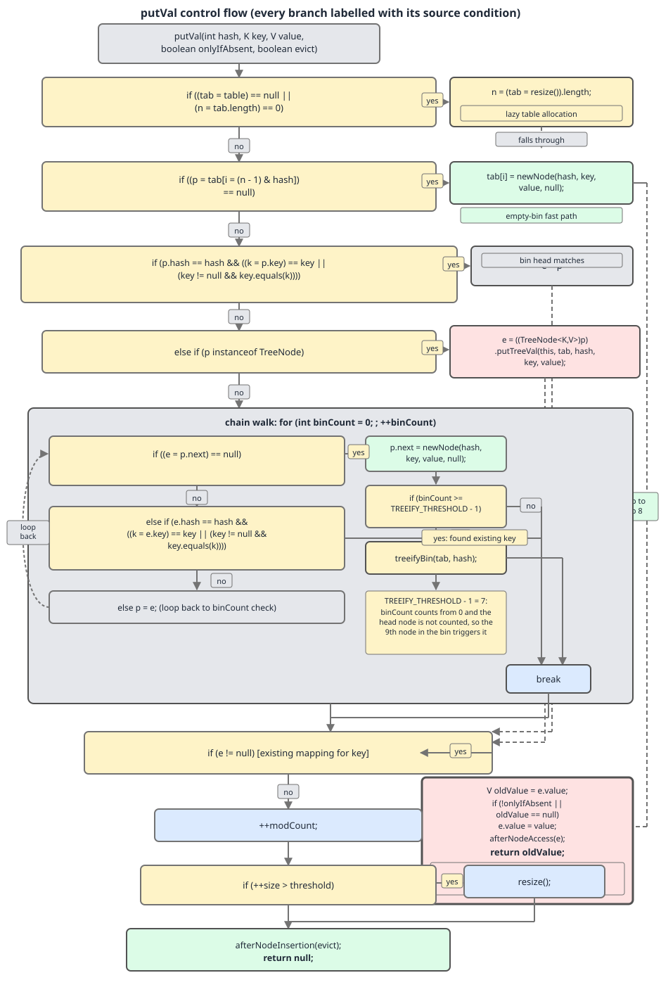

# 02 Java Collections — `HashMap` — INTERNALS (§3.6 `HashMap` source walk — `getNode`, key matching and `putVal`)

**Target version: Java 21 LTS.** | [Index](../00-index.md)
Previous: [hash-map/01b-internals-a2-hash-spread-and-sizing.md](01b-internals-a2-hash-spread-and-sizing.md) · Next: [hash-map/02b-internals-b2-bincount-and-treeifybin.md](02b-internals-b2-bincount-and-treeifybin.md)

The previous file produced a spread hash and a power-of-two table. This file spends that hash. Two methods do the work — `getNode` reads and `putVal` writes — and between them they explain nearly every surprising thing `HashMap` does.

## The read and write primitives

| Method | Line (JDK 21) | Entered from | Job | Can it resize? |
|---|---|---|---|---|
| `getNode(Object key)` | 573 | `get`, `containsKey`, `getOrDefault` | Locate a node or return `null` | No |
| `putVal(int, K, V, boolean, boolean)` | 631 | `put`, `putIfAbsent`, `putAll`, `merge`, `compute*` | Insert or update | Yes — on two different paths |
| `treeifyBin(Node[], int)` | 761 | `putVal` only | Handle an over-long bin | Yes — see [02b](02b-internals-b2-bincount-and-treeifybin.md) |

Before any of it makes sense, the coding style needs an excuse. The class comment gives one:

```java
     * The concurrent-programming-like SSA-based coding style helps
     * avoid aliasing errors amid all of the twisty pointer operations.
```
— `java.base/java/util/HashMap.java`, JDK 21, lines 231–232.

SSA means every value is assigned to a local exactly once and then read from that local. That is why you see `(tab = table) != null` instead of the two-line version: the field `table` is read once into `tab`, and every later expression uses `tab`. If the code read `table` twice it could observe two different arrays under concurrent misuse, and the resulting bug would be a torn traversal rather than a clean failure. The style is defensive, not clever.

---

## `getNode` — the read path

### Mental model first

A bin is a mailbox on a wall of mailboxes. `getNode` computes which mailbox from the hash, looks inside, and — critically — **peeks at the top envelope without opening the mailbox properly**. Only if the top envelope is the wrong one does it commit to rummaging, and only then does it check whether the mailbox is actually a filing cabinet (a tree) rather than a stack.

That peek-first shape is the whole method. It exists because the overwhelmingly common bin is a bin of one.

**Why it exists.** Pre-Java-8 `HashMap.getEntry` had the same job but no tree branch and no cached-hash check outside the loop; it entered a `for` loop unconditionally. The Java 8 rewrite hoisted the single-node case out of the loop, because Poisson analysis of a load-factor-0.75 table (quoted in the class comment) says roughly 61% of bins are empty and roughly 30% hold exactly one node. Optimising for "one node" optimises for almost everything.

**When it applies, and when it does not.** Every read goes through `getNode`. It never applies to ordered lookup — if you need "the smallest key ≥ k", `getNode` cannot help and `TreeMap.ceilingKey` is the method you want, at O(log n) instead of O(1). And it cannot tell you whether a key is absent; see the gotcha below.

### How it works, line by line

The `&&` chain in the guard is three separate safety checks fused into one expression: the table exists, it is non-empty, and the target bin is non-empty. Any failure falls straight through to `return null` with no loop and no user code executed. Inside the guard the head node is compared, then — and only if there is a second node — the bin is classified as tree or list.

```java
    public V get(Object key) {
        Node<K,V> e;
        return (e = getNode(key)) == null ? null : e.value;
    }
```
— `java.base/java/util/HashMap.java`, JDK 21, lines 562–565. (leaf 3.6.17)

```java
    final Node<K,V> getNode(Object key) {
        Node<K,V>[] tab; Node<K,V> first, e; int n, hash; K k;
        if ((tab = table) != null && (n = tab.length) > 0 &&
            (first = tab[(n - 1) & (hash = hash(key))]) != null) {
            if (first.hash == hash && // always check first node
                ((k = first.key) == key || (key != null && key.equals(k))))
                return first;
            if ((e = first.next) != null) {
                if (first instanceof TreeNode)
                    return ((TreeNode<K,V>)first).getTreeNode(hash, key);
                do {
                    if (e.hash == hash &&
                        ((k = e.key) == key || (key != null && key.equals(k))))
                        return e;
                } while ((e = e.next) != null);
            }
        }
        return null;
    }
```
— `java.base/java/util/HashMap.java`, JDK 21, lines 573–592. (leaf 3.6.17)

Line by line:

- `Node<K,V>[] tab; Node<K,V> first, e; int n, hash; K k;` — every local declared up front and uninitialised. This is the SSA style: each will be assigned exactly once, inside a condition.
- `(tab = table) != null` — the field `table` is `null` until the first `put`, because `HashMap` allocates lazily. A `get` on a brand-new map does not allocate anything.
- `(n = tab.length) > 0` — belt and braces; a zero-length table cannot be masked against.
- `(first = tab[(n - 1) & (hash = hash(key))]) != null` — three things in one expression. `hash(key)` is the spread hash from `01b`; it is computed **exactly once** and stashed in the local `hash`, which every later comparison reuses. `(n - 1) &` is the power-of-two masking. The array load lands in `first`. If the bin is empty, the whole guard fails and we return `null` having touched no user code at all.
- `if (first.hash == hash && ...)` with the source's own comment `// always check first node` — the head is compared **outside any loop** and **before** the `TreeNode` test. A one-node bin costs one array load, one `int` compare and one reference compare. No loop is ever entered.
- `if ((e = first.next) != null)` — the guard on everything below. A bin of one has `next == null`, so it exits here. **Insight:** the `instanceof TreeNode` check is *inside* this guard, so on the common path the type test never executes. That ordering is deliberate: a treeified bin always keeps its `next` links (treeification builds a doubly-linked overlay before building the tree, see [02b](02b-internals-b2-bincount-and-treeifybin.md)), so "more than one node" is a sound precondition for "might be a tree".
- `return ((TreeNode<K,V>)first).getTreeNode(hash, key);` — hand off to the tree. `getTreeNode` is one line: `return ((parent != null) ? root() : this).find(h, k, null);` (line 2048). The bin head is *usually* the tree root, but `Iterator.remove` can leave a non-root at the head, hence the walk-up. The tree search itself belongs to `04-internals-d-treeify.md`.
- The `do/while` — a plain chain walk. It starts at `e = first.next` because the head was already rejected.
- `return null` — reached when the table is null, the bin is empty, or the walk ran off the end.

### Minimal concrete example — the gotcha, proven

`getNode` returns `null` for "no such key" *and* for "key present, value is null". `get` cannot tell them apart, and `getOrDefault` does not rescue you: it returns the stored `null`, not your default.

```java
import java.util.HashMap;
import java.util.Map;

public class NullValueProbe {
    public static void main(String[] args) {
        Map<String, String> m = new HashMap<>();
        m.put("present", null);

        System.out.println("get(\"present\")            = " + m.get("present"));
        System.out.println("get(\"absent\")             = " + m.get("absent"));
        System.out.println("containsKey(\"present\")    = " + m.containsKey("present"));
        System.out.println("containsKey(\"absent\")     = " + m.containsKey("absent"));
        System.out.println("getOrDefault(\"present\",X) = " + m.getOrDefault("present", "X"));
        System.out.println("getOrDefault(\"absent\", X) = " + m.getOrDefault("absent", "X"));

        String prev = m.putIfAbsent("present", "written");
        System.out.println("putIfAbsent returned      = " + prev);
        System.out.println("value after putIfAbsent   = " + m.get("present"));
    }
}
```

Real output, JDK 21.0.7:

```
get("present")            = null
get("absent")             = null
containsKey("present")    = true
containsKey("absent")     = false
getOrDefault("present",X) = null
getOrDefault("absent", X) = X
putIfAbsent returned      = null
value after putIfAbsent   = written
```

**Pitfall:** believing `getOrDefault(k, d)` means "give me `d` if the value would be null". It means "give me `d` if the *key* is absent". The symptom is a `NullPointerException` a few lines later on a value you were sure could not be null. The fix is `containsKey` for the distinction, or — far better — never store `null` values.

> **Definition.** `getNode` is `HashMap`'s single read primitive: mask the spread hash to a bin, test the head node inline, and only for a multi-node bin dispatch to either a tree search or a chain walk — returning `null` indistinguishably for "absent" and "mapped to null".

**Version note.** The signature changed. JDK 8 declared `final Node<K,V> getNode(int hash, Object key)` (line 567 of `/tmp/jdk8src/java/util/HashMap.java`) and `get` called it as `getNode(hash(key), key)`. JDK 17 (line 565) and JDK 21 (line 573) declare `final Node<K,V> getNode(Object key)` and compute the hash inside. Behaviourally identical; it just removed a repeated `hash(key)` from six call sites.

---

## The `==`-before-`equals` short-circuit

### Mental model first

The node comparison is a three-stage filter, and the stages are ordered cheapest-first with the only expensive one — the one that calls *your* code — last and guarded.

```
e.hash == hash  &&  ( (k = e.key) == key  ||  (key != null && key.equals(k)) )
   stage 1                stage 2                     stage 3
```

**Why it exists.** Stage 3 is an arbitrary user method. It could be a deep `String` comparison, a reflective `record` comparison, or something pathological. Stages 1 and 2 are single machine comparisons that reject or accept without entering user code. Filtering hard before the expensive test is the entire performance story of the bin walk.

**When it applies, and when it does not.** It applies identically in `getNode` and `putVal` — the same expression appears in both, three times in total. It does nothing for you in a treeified bin, where `find` uses hash *ordering* and a `comparableClassFor` tiebreak instead of a linear scan.

### Working the argument through

**Stage 1 — `e.hash == hash`.** An `int` compare against a `final` field cached in the node at insertion time. Note carefully: the cached `hash` is the **spread** hash, not the raw `hashCode()`, and both sides of the comparison are spread. Since `spread` is a pure function, two keys with equal `hashCode()` necessarily have equal cached `hash`, so this stage never produces a false negative. It rejects every node whose hash differs, without touching user code. This is precisely why `Node.hash` exists as a field at all (see `01-internals-a-constants-and-hash.md`).

**Stage 2 — `(k = e.key) == key`.** One reference comparison. It hits far more often than people expect: interned string literals, enum constants, `Integer` values in the `-128..127` autobox cache (see `../contracts/04-generics-and-boxing.md`), `Boolean.TRUE`, and the very common case where the caller is holding the same object it put in. When it hits, stage 3 never runs.

**Stage 3 — `key.equals(k)`.** Guarded by `key != null`, so a `null` key never NPEs here — it simply fails stages 2 and 3 unless the stored key is also `null` (in which case stage 2 succeeds by identity). Note the receiver is the *lookup* key, not the stored key, so the `equals` implementation that runs is the caller's.

### Minimal concrete example — counting the user-code calls

```java
import java.util.HashMap;
import java.util.Map;

public class EqualsCounter {

    static int equalsCalls = 0;

    /** Key whose hash is under our control so we can force or avoid collisions. */
    static final class Key {
        final String name;
        final int fixedHash;

        Key(String name, int fixedHash) {
            this.name = name;
            this.fixedHash = fixedHash;
        }

        @Override public int hashCode() { return fixedHash; }

        @Override public boolean equals(Object o) {
            equalsCalls++;
            return o instanceof Key k && k.name.equals(name) && k.fixedHash == fixedHash;
        }
    }

    public static void main(String[] args) {
        Map<Key, String> m = new HashMap<>();
        Key a = new Key("a", 1);
        Key b = new Key("b", 1);   // same hash as a -> same bin
        Key c = new Key("c", 1);
        m.put(a, "A");
        m.put(b, "B");
        m.put(c, "C");

        equalsCalls = 0; m.get(a);
        System.out.println("get(a) by identity, a is bin head : equals calls = " + equalsCalls);
        equalsCalls = 0; m.get(c);
        System.out.println("get(c) by identity, c is 3rd node : equals calls = " + equalsCalls);
        equalsCalls = 0; m.get(new Key("c", 1));
        System.out.println("get(equal copy of c)              : equals calls = " + equalsCalls);
        equalsCalls = 0; m.get(new Key("zz", 99));
        System.out.println("get(absent, non-colliding hash)   : equals calls = " + equalsCalls);
        equalsCalls = 0; m.get(new Key("zz", 1));
        System.out.println("get(absent, COLLIDING hash)       : equals calls = " + equalsCalls);
    }
}
```

Real output, JDK 21.0.7:

```
get(a) by identity, a is bin head : equals calls = 0
get(c) by identity, c is 3rd node : equals calls = 2
get(equal copy of c)              : equals calls = 3
get(absent, non-colliding hash)   : equals calls = 0
get(absent, COLLIDING hash)       : equals calls = 3
```

Read those five numbers carefully, because the middle one is the honest one:

- **0** for a head hit by identity — stage 2 answers it.
- **2** for `c` held by identity but sitting third — stage 2 saves the call *only for the matching node*. The two preceding nodes `a` and `b` share the hash, so stage 1 passes for them, stage 2 fails, and stage 3 runs. **Identity is not a free pass down the chain**; it only skips the final `equals`. Most write-ups claim an identity lookup costs zero `equals` calls, which is true only when the key is the bin head.
- **3** for an equal-but-not-identical copy — every node needs stage 3.
- **0** for an absent key whose hash lands elsewhere — the guard fails at the bin load. Stage 1 is not even reached.
- **3** for an absent key that collides — the full walk, all user code, nothing found. This is the shape of a hash-collision DoS.

### The correctness dependency, argued from the source

Stage 1 short-circuits with `&&`. If `e.hash != hash`, stage 3 is **never evaluated**, no matter what `equals` would have said. Therefore: *an object whose `hashCode` disagrees with its `equals` is mechanically unreachable.* Not "undefined behaviour", not "may misbehave" — unreachable, by the `&&`.

And in the other direction, stage 2 is an `||` short-circuit before stage 3, so a key that is `==` to the stored key is found even if its `equals` is broken.

```java
import java.util.HashMap;
import java.util.Map;

public class ContractProbe {

    /** equals says yes to an identical name, but hashCode is random per instance. */
    static final class BadHash {
        final String name;
        BadHash(String name) { this.name = name; }
        @Override public boolean equals(Object o) {
            return o instanceof BadHash b && b.name.equals(name);
        }
        @Override public int hashCode() { return System.identityHashCode(this); }
    }

    /** equals always returns false, hashCode is stable. */
    static final class NeverEqual {
        @Override public boolean equals(Object o) { return false; }
        @Override public int hashCode() { return 42; }
    }

    public static void main(String[] args) {
        Map<BadHash, String> m1 = new HashMap<>();
        BadHash stored = new BadHash("k");
        m1.put(stored, "V");
        BadHash lookalike = new BadHash("k");
        System.out.println("stored.equals(lookalike)  = " + stored.equals(lookalike));
        System.out.println("m1.get(lookalike)         = " + m1.get(lookalike));
        System.out.println("m1.get(stored)            = " + m1.get(stored));

        Map<NeverEqual, String> m2 = new HashMap<>();
        NeverEqual n = new NeverEqual();
        m2.put(n, "V");
        System.out.println("n.equals(n)               = " + n.equals(n));
        System.out.println("m2.get(n) (same ref)      = " + m2.get(n));
        System.out.println("m2.get(new NeverEqual())  = " + m2.get(new NeverEqual()));
        m2.put(n, "V2");
        System.out.println("size after re-put(n)      = " + m2.size());
    }
}
```

Real output, JDK 21.0.7:

```
stored.equals(lookalike)  = true
m1.get(lookalike)         = null
m1.get(stored)            = V
n.equals(n)               = false
m2.get(n) (same ref)      = V
m2.get(new NeverEqual())  = null
size after re-put(n)      = 1
```

`equals` returns `true` and `get` returns `null` — the contract violation made concrete. And `NeverEqual` is not even reflexive, yet re-putting the same reference still updates in place rather than duplicating, because stage 2 got there first. See `../contracts/02-equals-hashcode-contract.md`.

**Interview:** *"Why must `equals` and `hashCode` agree?"* — Because `HashMap`'s node test is `e.hash == hash && (... || key.equals(k))`; the `&&` short-circuits on the cached hash, so a key with a disagreeing `hashCode` never reaches the `equals` call and is unfindable.

> **Definition.** The node comparison is a cheapest-first three-stage filter — cached `int` hash, then reference identity, then user `equals` — whose short-circuit ordering is simultaneously the read path's main optimisation and the mechanical reason the `equals`/`hashCode` contract is mandatory rather than advisory.

---

## `putVal` — the write path

### Mental model first

`putVal` is a fork with a shared tail. The fork asks "is there already a node for this key?" — and the two answers lead to *structurally different* endings. Update returns early from the middle of the method. Insert falls through to the tail that bumps `modCount`, bumps `size`, and may resize.

Everything surprising about `put` follows from where that early return sits.

**Why it exists as one method.** `put`, `putIfAbsent`, `putAll`, `merge` and the `compute*` family all need the same locate-or-create logic; the two `boolean` parameters are how they differ.

| Parameter | `put` | `putIfAbsent` | `putMapEntries` (copy ctor / `putAll`) | Effect |
|---|---|---|---|---|
| `onlyIfAbsent` | `false` | `true` | `false` | Gates `if (!onlyIfAbsent \|\| oldValue == null)` |
| `evict` | `true` | `true` | `false` from the constructor, `true` from `putAll` | Relayed to `afterNodeInsertion(evict)` |

**When it applies, and when it does not.** Every mutation that adds or updates a mapping goes through `putVal`. Removal does not — `removeNode` (line 819) is the mirror method and owns the third `LinkedHashMap` hook, `afterNodeRemoval`.

### How it works

The method has four bin-shaped cases in order: empty bin, head match, tree bin, chain walk. The diagram traces all four plus the shared tail.



*Read the diagram left-to-right along the top row: that is the fast path, and it is the path almost every insert takes. Every downward branch is a rarer case. The `binCount` box on the chain-walk branch is walked in [02b](02b-internals-b2-bincount-and-treeifybin.md).*

```java
    final V putVal(int hash, K key, V value, boolean onlyIfAbsent,
                   boolean evict) {
        Node<K,V>[] tab; Node<K,V> p; int n, i;
        if ((tab = table) == null || (n = tab.length) == 0)
            n = (tab = resize()).length;
        if ((p = tab[i = (n - 1) & hash]) == null)
            tab[i] = newNode(hash, key, value, null);
        else {
            Node<K,V> e; K k;
            if (p.hash == hash &&
                ((k = p.key) == key || (key != null && key.equals(k))))
                e = p;
            else if (p instanceof TreeNode)
                e = ((TreeNode<K,V>)p).putTreeVal(this, tab, hash, key, value);
            else {
                for (int binCount = 0; ; ++binCount) {
                    if ((e = p.next) == null) {
                        p.next = newNode(hash, key, value, null);
                        if (binCount >= TREEIFY_THRESHOLD - 1) // -1 for 1st
                            treeifyBin(tab, hash);
                        break;
                    }
                    if (e.hash == hash &&
                        ((k = e.key) == key || (key != null && key.equals(k))))
                        break;
                    p = e;
                }
            }
            if (e != null) { // existing mapping for key
                V oldValue = e.value;
                if (!onlyIfAbsent || oldValue == null)
                    e.value = value;
                afterNodeAccess(e);
                return oldValue;
            }
        }
        ++modCount;
        if (++size > threshold)
            resize();
        afterNodeInsertion(evict);
        return null;
    }
```
— `java.base/java/util/HashMap.java`, JDK 21, lines 631–676. (leaves 3.6.19, 3.6.20)

- `if ((tab = table) == null || (n = tab.length) == 0) n = (tab = resize()).length;` — lazy allocation. The first `put` on a `new HashMap<>()` is what actually creates the 16-slot array; `resize()` doubles as the allocator. Its return value is captured into `tab` and `n` re-read from it — SSA discipline again.
- **The empty-bin fast path (leaf 3.6.20).** `if ((p = tab[i = (n - 1) & hash]) == null) tab[i] = newNode(hash, key, value, null);` — the mask, the array load and the index are all computed once, into `i` and `p`. When the bin is empty the entire body is one allocation and one array store: no comparison, no `equals`, no loop, no `instanceof`. Given roughly 61% of bins are empty at load factor 0.75, this is the modal insert. Note the call is `newNode`, not `new Node<>` — a hook so `LinkedHashMap` can allocate its own `Entry` subclass.
- `if (p.hash == hash && ...) e = p;` — head match, the same three-stage filter dissected above. `e` is now the found node.
- `else if (p instanceof TreeNode) e = ((TreeNode<K,V>)p).putTreeVal(...)` — tree insert (line 2133). It returns the existing node if the key is present and `null` if it inserted; that contract is exactly what lets the shared tail below work unchanged for both branches.
- `for (int binCount = 0; ; ++binCount)` — the chain walk, entered only when the bin is a non-empty list whose head did not match. It appends on reaching the tail, breaks on a match, and counts its hops so it can decide whether the bin has grown long enough to treeify. The `binCount` arithmetic and `treeifyBin` are walked in [02b](02b-internals-b2-bincount-and-treeifybin.md); all that matters here is that both exits leave `e` set correctly for the tail — the node on a match, `null` on an append.
- `if (e != null) { ... return oldValue; }` — **the structural key to the whole method.** On the update path this returns *before* `++modCount`, *before* `++size`, and *before* the resize test. Replacing a value therefore changes nothing structural.
- `if (!onlyIfAbsent || oldValue == null) e.value = value;` — for `put`, `onlyIfAbsent` is `false` so the left disjunct is `true` and the write always happens. For `putIfAbsent`, the write happens **when the existing value is `null`**. That is documented and almost universally misremembered; the probe above printed `value after putIfAbsent = written`.
- `afterNodeAccess(e)` and `afterNodeInsertion(evict)` — two of `HashMap`'s three empty hooks (`void afterNodeAccess(Node<K,V> p) { }` at line 1941, `void afterNodeInsertion(boolean evict) { }` at line 1942). They exist solely for `LinkedHashMap`: the first moves a node to the tail in access-order mode, the second calls `removeEldestEntry`. The third, `afterNodeRemoval` (line 1943), is called from `removeNode` and is leaf 3.6.45's business in a later file. Because the copy constructor passes `evict = false`, `new LinkedHashMap<>(existingMap)` deliberately does not evict while it is being populated — see `../linked-hash-map/01-internals.md`.
- `++modCount; if (++size > threshold) resize();` — the insert-only tail.

### Minimal concrete example — updating an existing key does not invalidate an iterator

```java
import java.util.ConcurrentModificationException;
import java.util.HashMap;
import java.util.Map;

public class ModCountProbe {
    public static void main(String[] args) {
        Map<String, Integer> m = new HashMap<>();
        m.put("a", 1);
        m.put("b", 2);
        m.put("c", 3);

        try {
            for (Map.Entry<String, Integer> e : m.entrySet()) {
                m.put("a", 99);              // existing key -> value replace only
            }
            System.out.println("replace existing key during iteration : no exception, a=" + m.get("a"));
        } catch (ConcurrentModificationException ex) {
            System.out.println("replace existing key during iteration : CME");
        }

        try {
            for (Map.Entry<String, Integer> e : m.entrySet()) {
                m.put("d", 4);               // brand-new key -> ++modCount
            }
            System.out.println("insert new key during iteration       : no exception");
        } catch (ConcurrentModificationException ex) {
            System.out.println("insert new key during iteration       : CME");
        }
    }
}
```

Real output, JDK 21.0.7:

```
replace existing key during iteration : no exception, a=99
insert new key during iteration       : CME
```

**Insight:** `modCount` counts *structural* modifications, and the source's definition of structural is exactly "the early return was not taken". Rewriting values in place during iteration is legal and always has been. This is single-threaded-only and says nothing about thread safety, but it is the correct answer to a common interview question.

**Interview:** *"Can you modify a `HashMap` while iterating it?"* — You can change the value of a key that already exists (`put` on a present key, or `entry.setValue`) because `putVal` returns before `++modCount`. You cannot add a new key or remove one except through `Iterator.remove`.

> **Definition.** `putVal` is `HashMap`'s single write primitive: locate the bin, resolve to an existing node or create one, and take one of two structurally different exits — an early return that only rewrites a value, or a fall-through tail that bumps `modCount` and `size` and may trigger a resize.

**Version note.** `putVal`'s body is **byte-for-byte identical** in JDK 8 (lines 625–670), JDK 17 (lines 623–668) and JDK 21 (lines 631–676) — verified by `diff` on the extracted method bodies. "Did `HashMap.put` change since Java 8?" is a real interview question and the answer is no; what changed in 8 was the introduction of trees, and nothing since.

---

## Pitfalls

### Assuming `getOrDefault` protects you from `null` values

**Wrong**
```java
Map<String, String> m = new HashMap<>();
m.put("k", null);
String v = m.getOrDefault("k", "fallback");
System.out.println(v.length());   // NullPointerException
```
Output: `Exception in thread "main" java.lang.NullPointerException`. `getOrDefault` returned `null`, not `fallback`.

**Right**
```java
Map<String, String> m = new HashMap<>();
m.put("k", null);
String v = m.containsKey("k") && m.get("k") != null ? m.get("k") : "fallback";
System.out.println(v.length());   // 8
```
Better still: do not store `null` values. Absence and null-ness are two states and `HashMap` can only cheaply report one.

**Why people believe it:** the name says "or default", and in every other collection API a default is what you get when the value is unusable. Here the default is keyed on *presence*, which `getNode` reports by returning a node rather than by returning a value.

### Believing an identity-held key costs zero `equals` calls

**Wrong**
```java
// belief: because putVal/getNode test (k = e.key) == key first,
// looking up a key you already hold never calls equals at all
m.get(c);   // c is the exact reference stored, third in a colliding bin
// measured: equals was called 2 times, not 0
```

**Right**
```java
// the == short-circuit only skips equals for the MATCHING node.
// Nodes walked past share the spread hash, so stage 1 passes and stage 3 runs.
// To actually avoid the walk, avoid the collision: give the key a good hashCode.
m.get(headKey);   // measured: 0 equals calls, because no node is walked past
```

**Why people believe it:** the short-circuit is real and is usually described per-node, then silently generalised to the whole lookup. It is a property of one comparison, not of the traversal.

### Thinking any `put` during iteration throws `ConcurrentModificationException`

**Wrong**
```java
for (Map.Entry<String,Integer> e : m.entrySet()) {
    m.put(existingKey, 99);   // "this must throw"
}
```
It does not throw. `putVal` returns from `if (e != null)` before `++modCount`.

**Right**
```java
for (Map.Entry<String,Integer> e : m.entrySet()) {
    e.setValue(99);           // the intended API for the same effect
}
```
Both are legal single-threaded; `setValue` states the intent. Adding a *new* key inside the loop throws, as it should.

**Why people believe it:** "don't modify a collection while iterating" is taught as an absolute. The fail-fast machinery is narrower than the slogan: it tracks structural changes only.

---

## Cheat sheet

| Item | Value / fact |
|---|---|
| `getNode` signature, JDK 21 | `final Node<K,V> getNode(Object key)` — hash computed inside |
| `getNode` signature, JDK 8 | `final Node<K,V> getNode(int hash, Object key)` — hash passed in |
| `putVal` body, JDK 8 vs 17 vs 21 | byte-for-byte identical |
| Node comparison | `e.hash == hash && ((k = e.key) == key \|\| (key != null && key.equals(k)))` |
| Stage order | cached `int` hash → reference `==` → user `equals` (guarded by `key != null`) |
| One-node bin read cost | 1 array load + 1 `int` compare + 1 ref compare; no loop, no `instanceof` |
| `instanceof TreeNode` in `getNode` | guarded by `first.next != null` — never runs on a one-node bin |
| `equals` calls, identity hit at bin head | 0 |
| `equals` calls, identity hit 3rd in bin | **2** — `==` saves only the matching node's call |
| `equals` calls, absent key, no collision | 0 — guard fails at the bin load |
| `get` returns `null` | for absent key AND for key mapped to `null`; use `containsKey` |
| `getOrDefault` | returns the stored `null`, not the default, when the key is present |
| Empty-bin insert | `tab[i] = newNode(hash, key, value, null)` — one alloc, one store, ~61% of bins |
| Update path | early `return oldValue` — no `modCount`, no `size`, no `resize` |
| `onlyIfAbsent` | `put` → `false`; `putIfAbsent` → `true`, and it **does** overwrite a `null` value |
| `evict` | `false` from the copy constructor, `true` from `put`/`putAll` |
| Hooks | `afterNodeAccess` (1941), `afterNodeInsertion` (1942), `afterNodeRemoval` (1943) — all empty |
| Broken `hashCode` | key is unreachable — `&&` short-circuits before `equals` |
| Broken `equals` (always false) | key still found by `==` if you hold the same reference |
| Bin length at treeify call | 9, not 8 — see [02b](02b-internals-b2-bincount-and-treeifybin.md) |

---

## Self-test

**Q1.** Why is `if (first instanceof TreeNode)` placed inside `if ((e = first.next) != null)` rather than before it?

<details><summary>Answer</summary>

Because a bin of one node can never be a tree, and one-node bins are the common case (~30% of bins at load factor 0.75, with ~61% empty). Putting the type test behind the "has a second node" guard keeps `instanceof` off the fast path entirely. It is sound because treeification builds a doubly-linked `TreeNode` list via `prev`/`next` *before* building the tree, so a treeified bin head always has a non-null `next`.

</details>

**Q2.** A key is found by identity but sits third in its bin. How many times is `equals` called, and why is the usual answer wrong?

<details><summary>Answer</summary>

Twice — measured, not two-zero. The usual claim is zero, generalising the `==` short-circuit from one comparison to the whole lookup. The `==` test only helps for the *matching* node. The two preceding nodes share the bin, so they share the spread hash, so stage 1 (`e.hash == hash`) passes for them, stage 2 (`==`) fails, and stage 3 (`equals`) runs. Identity is not a free pass down the chain.

</details>

**Q3.** Explain, from the source rather than the javadoc, why an object whose `hashCode` disagrees with its `equals` cannot be found in a `HashMap`.

<details><summary>Answer</summary>

The node test is `e.hash == hash && (identity || equals)`. `&&` short-circuits. If the lookup key's spread hash differs from the stored node's cached `hash`, the right-hand side is never evaluated, so `equals` is never called, so its opinion is irrelevant. Additionally, a differing hash usually means a different bin, so the walk never even reaches the node. Verified: a class with `equals` by name and `hashCode` by identity returns `true` from `stored.equals(lookalike)` while `map.get(lookalike)` returns `null`.

</details>

**Q4.** A key's `equals` always returns `false`, even against itself. Can you still `get` it? Can you accidentally store it twice?

<details><summary>Answer</summary>

You can `get` it if you hold the same reference, because stage 2 (`(k = e.key) == key`) is an `||` short-circuit that fires before `equals` is consulted. And re-putting that same reference updates in place rather than duplicating — measured `size` stays 1. A *different* instance is unfindable, since only `equals` could match it and it always says no.

</details>

**Q5.** Does `map.put(existingKey, newValue)` inside a for-each loop over `entrySet()` throw `ConcurrentModificationException`? Justify from `putVal`.

<details><summary>Answer</summary>

No. When the key is found, `putVal` enters `if (e != null)`, rewrites `e.value`, calls `afterNodeAccess(e)` and `return oldValue` — all *before* `++modCount`. The iterator's `modCount` snapshot is still valid. Inserting a *new* key falls through to `++modCount` and does throw. Verified: the first loop completes with `a=99`, the second throws.

</details>

**Q6.** `putIfAbsent` on a key that is present but mapped to `null`. What happens?

<details><summary>Answer</summary>

The value is overwritten and `null` is returned. The gate is `if (!onlyIfAbsent || oldValue == null)`; `putIfAbsent` passes `onlyIfAbsent = true`, so the left disjunct is false, but `oldValue == null` is true and the write proceeds. Documented, and almost universally misremembered. Verified output: `putIfAbsent returned = null`, `value after putIfAbsent = written`.

</details>

**Q7.** What do `evict` and `onlyIfAbsent` actually control, and who passes what?

<details><summary>Answer</summary>

`onlyIfAbsent` gates the value overwrite on the update path: `put` passes `false` (always overwrite), `putIfAbsent` passes `true` (overwrite only when the existing value is `null`). `evict` is relayed unchanged to `afterNodeInsertion(evict)`, an empty method on `HashMap` and the `removeEldestEntry` trigger on `LinkedHashMap`; `put` and `putAll` pass `true`, the `Map` copy constructor's `putMapEntries` passes `false` so a `new LinkedHashMap<>(m)` does not evict while it is still being built.

</details>

**Q8.** Did `HashMap.put` change between Java 8 and Java 21?

<details><summary>Answer</summary>

No. `putVal`'s body is byte-for-byte identical in JDK 8 (lines 625–670), JDK 17 (623–668) and JDK 21 (631–676). The trees and the `putVal`/`getNode` structure all arrived in Java 8; nothing since has altered the write path. The one visible change in this area is `getNode`'s signature, which lost its `int hash` parameter after JDK 8.

</details>

---

**Leaves covered:** 3.6.17, 3.6.18, 3.6.19, 3.6.20 (4 leaves)
**Leaves deferred:** none — 3.6.21 and 3.6.22 are in [02b-internals-b2-bincount-and-treeifybin.md](02b-internals-b2-bincount-and-treeifybin.md)
**Diagrams included:** D-89
**Target version:** Java 21 LTS
**Lines:** 594
