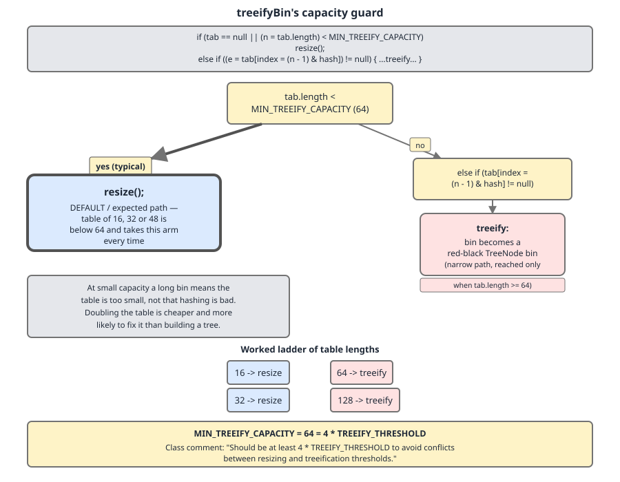

# 02 Java Collections — `HashMap` — INTERNALS (§3.6 `HashMap` source walk — `binCount` and `treeifyBin`)

**Target version: Java 21 LTS.** | [Index](../00-index.md)
Previous: [hash-map/02-internals-b-put-and-get.md](02-internals-b-put-and-get.md) · Next: [hash-map/03-internals-c-resize.md](03-internals-c-resize.md)

[02](02-internals-b-put-and-get.md) walked `putVal` down to its chain-walk branch and stopped there. This file finishes the branch: how the loop counts, when it decides a bin has grown too long, and what happens next — which is very often *not* what the method name suggests.

Two constants govern everything here.

| Constant | Value | Line (JDK 21) | Role |
|---|---|---|---|
| `TREEIFY_THRESHOLD` | 8 | 260 | Bin length at which `putVal` calls `treeifyBin` — but see the off-by-one below |
| `MIN_TREEIFY_CAPACITY` | 64 | 275 | Table capacity below which `treeifyBin` resizes instead of treeifying |
| `UNTREEIFY_THRESHOLD` | 6 | 267 | Bin length at or below which a split half reverts to a list (owned by `03-internals-c-resize.md`) |

---

## `binCount` and the treeify test

### Mental model first

`binCount` is **not** the length of the bin. It is *the number of `next` hops taken so far*, starting from a head node that has already been rejected. Two facts — the counter starts at zero, and the head is never visited by the loop — each push the effective threshold up, and together they mean the constant named `8` fires at nine.

**Why it exists.** The loop has to walk the chain anyway to find the tail. Counting hops while walking is free, so `HashMap` gets its "is this bin pathologically long?" signal for zero extra work — no separate length field, no periodic scan. The counter is local to one insert and discarded immediately.

**When it applies, and when it does not.** Only on the chain-walk branch, and only on the *append* exit of that branch. A tree bin never reaches this code (`putTreeVal` handles it). A head match never reaches it. And crucially, an insert that *updates* an existing key never reaches the test either — see the second ordering fact below.

### Working the arithmetic through

Before the loop, `p` is the head node. On the iteration where `binCount == b`:

- `p` is node number `b + 1` (1-based, head is node 1).
- `e = p.next` is node number `b + 2`, or `null` if `p` was the tail.
- If `e == null`, the bin held `b + 1` nodes and the append makes it `b + 2`.

| `binCount` when `p.next == null` | nodes before append | nodes after append | `binCount >= 7`? |
|---|---|---|---|
| 0 | 1 | 2 | no |
| 4 | 5 | 6 | no |
| 5 | 6 | 7 | no |
| 6 | 7 | 8 | no |
| **7** | **8** | **9** | **yes → `treeifyBin`** |

`TREEIFY_THRESHOLD - 1` is `7`, and the source comment is `// -1 for 1st` — the "1st" being the head node the loop never counted. So the bin is **9 nodes long** when `treeifyBin` is called, not 8, despite the constant being named `TREEIFY_THRESHOLD = 8`.

Here is the loop on its own, excerpted from `putVal`:

```java
                for (int binCount = 0; ; ++binCount) {
                    if ((e = p.next) == null) {
                        p.next = newNode(hash, key, value, null);
                        if (binCount >= TREEIFY_THRESHOLD - 1) // -1 for 1st
                            treeifyBin(tab, hash);
                        break;
                    }
                    if (e.hash == hash &&
                        ((k = e.key) == key || (key != null && key.equals(k))))
                        break;
                    p = e;
                }
```
— `java.base/java/util/HashMap.java`, JDK 21, lines 646–657, excerpted from `putVal` (quoted whole in [02](02-internals-b-put-and-get.md)). (leaf 3.6.21)

- `for (int binCount = 0; ; ++binCount)` — no termination condition; both exits are explicit `break`s. `binCount` is incremented at the *end* of each iteration, so its value inside the body is the number of hops already completed.
- `if ((e = p.next) == null)` — the append exit. `p` is the tail.
- `p.next = newNode(hash, key, value, null);` — link the new node. Again `newNode`, not `new Node<>`, so `LinkedHashMap` can substitute its `Entry`.
- `if (binCount >= TREEIFY_THRESHOLD - 1) treeifyBin(tab, hash);` — the test, evaluated *after* the append, so the bin already has its ninth node when `treeifyBin` looks at it.
- `if (e.hash == hash && (...)) break;` — the match exit. Note it `break`s **without testing `binCount`**, because no node was added and the bin did not grow. Only appends can trigger treeification.
- `p = e;` — advance.

Two ordering facts fall out of this:

1. `treeifyBin(tab, hash)` is called **before** the `break`, and therefore before `++size` and before `if (++size > threshold) resize()` in the shared tail. A bin can be treeified and then, one statement later, the table can resize and split that very tree apart — a split half of 6 or fewer reverts to a list at `UNTREEIFY_THRESHOLD`. See `03-internals-c-resize.md`.
2. `treeifyBin` receives `tab` and `hash`, not the bin index. It re-derives the index itself with `(n - 1) & hash` — necessary, because if it resizes, the old index is meaningless.

**Insight:** the `- 1` in `binCount >= TREEIFY_THRESHOLD - 1` looks like it *lowers* the bar to 7. It does not. It compensates for a counter that starts one behind, and the net effect *raises* the real bin length to 9.

**Interview:** *"At what bin length does `HashMap` treeify?"* — The constant is 8, the test is `binCount >= 7`, and the actual bin length at the call is 9, because `binCount` counts hops from an already-rejected head. And on a default-sized map it does not treeify then at all — see below.

> **Definition.** `binCount` counts `next` hops from an already-rejected head node, so the condition `binCount >= TREEIFY_THRESHOLD - 1` fires when the just-appended node makes the bin nine nodes long — the `- 1` compensating for the head the loop never visits, not lowering the threshold.

---

## `treeifyBin`'s capacity guard

### Mental model first

The method is misnamed. Its first branch does not treeify anything — it resizes and returns. `treeifyBin` really means *"this bin is too long, deal with it"*, and doubling the table is its **preferred** remedy. Building a tree is the fallback for when doubling has already been tried and the bin is still long.

The headline consequence, measured below: **a default-constructed `HashMap` fed nothing but colliding keys grows its first tree at the eleventh entry, not the ninth.**

**Why it exists.** A long bin has two possible causes, and they need opposite cures. Either the table is too small — too few bins for the keys you have, a *capacity* problem — or the hash function is bad, keys genuinely colliding after spreading, a *distribution* problem. Resizing fixes the first and does nothing for the second; treeifying fixes the second at permanent memory cost and does nothing for the first. `MIN_TREEIFY_CAPACITY` is how the code guesses which one it is facing.

**When each branch wins.**

| Situation | Branch taken | Cost | Effect on the long bin |
|---|---|---|---|
| Capacity < 64 | `resize()` | O(n) rehash, no permanent memory | Expected to halve it on the lo/hi split — unless keys truly collide, in which case nothing |
| Capacity ≥ 64, bin ≥ 9 | treeify | O(n) walk + ~24 bytes/node forever | O(log n) worst-case lookup in that bin, permanently |



*The left branch is the one people forget exists, and on a default-constructed map it is the branch taken first — twice in a row before the tree ever appears.*

### The argument, worked through

At capacity 16 the mask `(n - 1) &` keeps only 4 bits of the hash. Nine keys landing in one bin out of 16 is entirely consistent with a *perfectly good* hash function and simply too few bins — with 16 bins and only ~12 entries before the resize threshold, clustering is unremarkable. Building a red-black tree here costs the same O(n) walk that a resize costs, plus roughly 24 extra bytes per node **forever** (`parent`, `left`, `right`, `red`, on top of the `prev` overlay), and it does not add a single bin. Doubling to 32 costs one O(n) pass and, on the lo/hi split, is expected to halve that bin. Resizing strictly dominates.

At capacity 64 the calculus flips, and the source names the ratio:

```java
     * The smallest table capacity for which bins may be treeified.
     * (Otherwise the table is resized if too many nodes in a bin.)
     * Should be at least 4 * TREEIFY_THRESHOLD to avoid conflicts
     * between resizing and treeification thresholds.
```
— `java.base/java/util/HashMap.java`, JDK 21, lines 270–274 (javadoc for `MIN_TREEIFY_CAPACITY`, line 275).

`64 = 4 × TREEIFY_THRESHOLD`. With 64 bins and load factor 0.75 the table holds at most 48 entries before it resizes again. A bin of 9 out of at most 48 entries spread over 64 bins is no longer explainable by table size — under a decent hash the Poisson probability of that is vanishing. It is explainable only by adversarial or broken hashing, and a tree, with its O(log n) worst case, is the right defence. The "conflicts between resizing and treeification thresholds" the comment warns about is exactly the thrash you would get with a smaller ratio: treeify, resize, split, untreeify, treeify again.

```java
    final void treeifyBin(Node<K,V>[] tab, int hash) {
        int n, index; Node<K,V> e;
        if (tab == null || (n = tab.length) < MIN_TREEIFY_CAPACITY)
            resize();
        else if ((e = tab[index = (n - 1) & hash]) != null) {
            TreeNode<K,V> hd = null, tl = null;
            do {
                TreeNode<K,V> p = replacementTreeNode(e, null);
                if (tl == null)
                    hd = p;
                else {
                    p.prev = tl;
                    tl.next = p;
                }
                tl = p;
            } while ((e = e.next) != null);
            if ((tab[index] = hd) != null)
                hd.treeify(tab);
        }
    }
```
— `java.base/java/util/HashMap.java`, JDK 21, lines 761–781. (leaf 3.6.22)

- `if (tab == null || (n = tab.length) < MIN_TREEIFY_CAPACITY) resize();` — the guard, and the whole point of the leaf. Note it calls `resize()` with the bin **still over-long**, and nothing re-checks afterwards; the over-length is simply tolerated until the next insert into that bin. Recursion is not a risk because each `resize()` doubles capacity, so at most two calls separate 16 from 64.
- `else if ((e = tab[index = (n - 1) & hash]) != null)` — re-derive the bin index from the hash, since the caller passed the hash rather than the index. The `!= null` is defensive; `putVal` only calls this after appending to a non-empty bin.
- `TreeNode<K,V> hd = null, tl = null;` — head and tail of the list being built. Not the tree yet.
- `TreeNode<K,V> p = replacementTreeNode(e, null);` — a hook, overridden by `LinkedHashMap` so it can allocate a `TreeNode` that also carries the `before`/`after` overlay. This is why the code allocates through a method instead of writing `new TreeNode<>`. The `null` argument is the `next` link, stitched up manually below.
- The `do/while` with `p.prev = tl; tl.next = p;` — builds a **doubly-linked list** of `TreeNode`s, in the original bin order, before any tree structure exists.
- `if ((tab[index] = hd) != null) hd.treeify(tab);` — install the new head, then build the red-black tree from the list.

**Insight:** the two-phase shape — list first, tree second — is not incidental. The `prev`/`next` overlay survives inside the treeified bin, which is what makes `untreeify` cheap during a resize split, and what makes `getNode`'s `if ((e = first.next) != null)` guard sound for tree bins ([02](02-internals-b-put-and-get.md)). A `TreeNode` is simultaneously a list node and a tree node for its whole life. The tree build itself is `04-internals-d-treeify.md`.

### Minimal concrete example — observing the transition

Feed a map keys that all hash to 0, and reflect on the runtime class of the bin-0 head after each insert. Run both a default map and one pre-sized past 64.

```java
import java.lang.reflect.Field;
import java.util.HashMap;

public class TreeifyProbe {

    /** Every instance hashes to 0, so every key lands in bin 0 whatever the capacity. */
    record Collider(int id) {
        @Override public int hashCode() { return 0; }
    }

    static Object[] table(HashMap<?, ?> m) throws Exception {
        Field f = HashMap.class.getDeclaredField("table");
        f.setAccessible(true);
        return (Object[]) f.get(m);
    }

    static void trace(String label, HashMap<Collider, String> m) throws Exception {
        System.out.println(label);
        for (int i = 1; i <= 12; i++) {
            m.put(new Collider(i), "v" + i);
            Object[] tab = table(m);
            System.out.printf("  entries=%2d  capacity=%2d  bin0 head=%s%n",
                              m.size(), tab.length, tab[0].getClass().getSimpleName());
        }
        System.out.println();
    }

    public static void main(String[] args) throws Exception {
        trace("default new HashMap<>() (capacity starts at 16):", new HashMap<>());
        trace("new HashMap<>(128) (capacity starts at 128):", new HashMap<>(128));
    }
}
```

Run it with `java --add-opens java.base/java.util=ALL-UNNAMED TreeifyProbe.java`. Real output, JDK 21.0.7:

```
default new HashMap<>() (capacity starts at 16):
  entries= 7  capacity=16  bin0 head=Node
  entries= 8  capacity=16  bin0 head=Node
  entries= 9  capacity=32  bin0 head=Node
  entries=10  capacity=64  bin0 head=Node
  entries=11  capacity=64  bin0 head=TreeNode
  entries=12  capacity=64  bin0 head=TreeNode

new HashMap<>(128) (capacity starts at 128):
  entries= 7  capacity=128  bin0 head=Node
  entries= 8  capacity=128  bin0 head=Node
  entries= 9  capacity=128  bin0 head=TreeNode
  entries=10  capacity=128  bin0 head=TreeNode
```

(Entries 1–6 of each run are omitted from the paste above; every one of them reads `bin0 head=Node` at the starting capacity.)

Trace the default run against the source:

- Entries 1–8: bin grows to 8. On each append `binCount` peaks at 6, below 7. No call.
- **Entry 9:** `binCount == 7`, bin is now 9 long, `treeifyBin` fires. Capacity 16 < 64 → `resize()` to 32. The bin does **not** split, because every key masks to bin 0 at any capacity. Head is still `Node`.
- **Entry 10:** append makes the bin 10 long, `binCount == 8 >= 7`, `treeifyBin` fires again. Capacity 32 < 64 → `resize()` to 64. Still `Node`.
- **Entry 11:** `treeifyBin` fires, capacity 64 ≥ 64, and the tree is finally built. Head becomes `TreeNode`.

The pre-sized run confirms the other half in isolation: with the capacity guard satisfied from the start, the transition lands exactly at **9 entries**, precisely as the `binCount` arithmetic predicts.

> **Definition.** `treeifyBin` is `HashMap`'s over-long-bin handler: below `MIN_TREEIFY_CAPACITY = 64` it calls `resize()` and treeifies nothing, on the reasoning that a small table's long bin is a capacity symptom rather than a hash symptom; at or above 64 it relinks the bin as a doubly-linked `TreeNode` list and then builds a red-black tree from it.

**Version note.** `treeifyBin`, `TREEIFY_THRESHOLD` and `MIN_TREEIFY_CAPACITY` all arrived in Java 8 (JEP 180) and are unchanged in 17 and 21. `putVal`'s body — including the `binCount` loop quoted above — is byte-for-byte identical across JDK 8, 17 and 21, verified by `diff` on the extracted method bodies.

---

## Pitfalls

### Believing `TREEIFY_THRESHOLD = 8` means "a tree at 8 nodes in a bin"

**Wrong**
```java
// expectation: 8 colliding keys in a default map produces a TreeNode bin
HashMap<Collider, String> m = new HashMap<>();
for (int i = 1; i <= 8; i++) m.put(new Collider(i), "v");
// measured: bin head is still Node. And still Node at 9. And still Node at 10.
```

**Right**
```java
HashMap<Collider, String> m = new HashMap<>(128);   // capacity >= 64 up front
for (int i = 1; i <= 9; i++) m.put(new Collider(i), "v");
// measured: bin head is now TreeNode -- 9 nodes, capacity guard satisfied
```
Two independent corrections stack here: `binCount` does not count the head, so the trigger is 9 nodes not 8; and below capacity 64 `treeifyBin` resizes instead of treeifying.

**Why people believe it:** the constant is named for the threshold, and the comparison reads `>= TREEIFY_THRESHOLD - 1`, which looks like it *lowers* the bar. It does not — it compensates for a counter that starts one behind.

### Benchmarking treeification on a small default map

**Wrong**
```java
Map<Collider, String> m = new HashMap<>();
for (int i = 0; i < 10; i++) m.put(new Collider(i), "v");
// "trees don't help, lookups are still linear" -- you never built a tree.
```
Ten colliding keys in a default map leaves you at capacity 64 with a 10-node **linked list**. You measured the resize branch twice.

**Right**
```java
Map<Collider, String> m = new HashMap<>(128);
for (int i = 0; i < 10; i++) m.put(new Collider(i), "v");
// now the bin is a red-black tree from the 9th insert onward
```

**Why people believe it:** every write-up describes `treeifyBin` as the treeification routine and skips the first branch, so the capacity guard is invisible until you reflect on the table and see `Node` where you expected `TreeNode`.

### Assuming a treeified bin stays a tree

**Wrong**
```java
// "once it treeifies, that bin is a tree for good"
```
`treeifyBin` runs *before* `++size` and the `size > threshold` resize test in `putVal`'s tail. The very next statement can resize, split the bin, and untreeify a half that falls to `UNTREEIFY_THRESHOLD = 6` or fewer nodes.

**Right**
```java
// Treat treeification as a per-bin, per-moment state, not a permanent upgrade.
// The only thing that keeps a bin a tree is that it keeps being long.
```

**Why people believe it:** the transition is usually presented as one-directional because the untreeify path lives in `split`, a different method in a different part of the source.

---

## Cheat sheet

| Item | Value / fact |
|---|---|
| `TREEIFY_THRESHOLD` | 8 (line 260) |
| `UNTREEIFY_THRESHOLD` | 6 (line 267) |
| `MIN_TREEIFY_CAPACITY` | 64 (line 275) = 4 × `TREEIFY_THRESHOLD` |
| The test | `if (binCount >= TREEIFY_THRESHOLD - 1) treeifyBin(tab, hash);` |
| What `binCount` counts | `next` hops from an already-rejected head; head is never counted |
| Source comment on the `- 1` | `// -1 for 1st` |
| Bin length when `treeifyBin` is called | **9**, not 8 |
| Which exit tests `binCount` | the append exit only — a key match `break`s without testing |
| Default map, all-colliding keys | first `TreeNode` at the **11th** entry (16→32 at 9, 32→64 at 10, tree at 11) |
| Pre-sized ≥ 64 map, all-colliding keys | first `TreeNode` at the **9th** entry |
| `treeifyBin` below capacity 64 | calls `resize()`, treeifies nothing, leaves the bin over-long |
| Recursion bound on that resize | at most 2 doublings from 16 to 64 |
| `treeifyBin` arguments | `(tab, hash)` — re-derives the index, because a resize invalidates it |
| Allocation hook | `replacementTreeNode(e, null)`, overridden by `LinkedHashMap` |
| Build order | doubly-linked `TreeNode` list via `prev`/`next` first, then `hd.treeify(tab)` |
| Why two-phase | the list overlay survives, making `untreeify` cheap and `first.next != null` sound |
| Ordering vs `size` | `treeifyBin` runs before `++size > threshold` — a bin can treeify then be split |
| Memory cost of a `TreeNode` | ~24 bytes/node more than a `Node`, permanently |
| Version | all of this is Java 8 (JEP 180); unchanged in 17 and 21 |

---

## Self-test

**Q1.** `TREEIFY_THRESHOLD` is 8 and the test is `binCount >= TREEIFY_THRESHOLD - 1`. How many nodes are in the bin when `treeifyBin` is called, and why?

<details><summary>Answer</summary>

Nine. `binCount` starts at 0 and counts `next` hops, and the loop is only entered when the head node failed to match — so the head is never counted. When `(e = p.next) == null` fires with `binCount == 7`, `p` is the 8th node, the bin held 8, and the newly appended node makes 9. The source comment `// -1 for 1st` names exactly this: the `- 1` compensates for the uncounted head, so the net effect raises the real length to 9 rather than lowering the bar to 7.

</details>

**Q2.** You insert 10 keys that all return `hashCode() == 0` into a `new HashMap<>()`. Is bin 0 a tree? Trace it.

<details><summary>Answer</summary>

No. Capacity starts at 16. The 9th insert makes the bin 9 long and calls `treeifyBin`, which finds `16 < MIN_TREEIFY_CAPACITY` and resizes to 32 — the bin does not split, since every key masks to bin 0 at any capacity. The 10th insert repeats: `treeifyBin`, `32 < 64`, resize to 64. Only the **11th** insert finds capacity 64 and actually builds the tree. Verified by reflecting on `table[0].getClass()` after each `put`.

</details>

**Q3.** Why does `treeifyBin` prefer resizing over treeifying below capacity 64?

<details><summary>Answer</summary>

A long bin has two possible causes with opposite cures. At capacity 16 the mask keeps only 4 bits, so 9 keys in one bin is consistent with a perfectly good hash and simply too few bins — a capacity problem, cured by doubling, which costs one O(n) pass and is expected to halve the bin on the lo/hi split. A tree costs the same O(n) walk plus ~24 bytes per node permanently and adds no bins. At capacity 64 with load factor 0.75 the table holds at most 48 entries; a bin of 9 is then no longer explainable by table size, so it is a hash problem, and a tree's O(log n) worst case is the right defence. `MIN_TREEIFY_CAPACITY = 64 = 4 × TREEIFY_THRESHOLD`, and the javadoc says the ratio exists "to avoid conflicts between resizing and treeification thresholds".

</details>

**Q4.** An insert finds the key already present three nodes down a 12-node bin. Does `treeifyBin` get called?

<details><summary>Answer</summary>

No. The `binCount` test lives only on the append exit, inside `if ((e = p.next) == null)`. A key match takes the other `break`, which does not test `binCount` at all — correctly, because no node was added and the bin did not grow. Only appends can trigger treeification, so a bin that is already over-long stays over-long under pure updates.

</details>

**Q5.** Why does `treeifyBin` take `(tab, hash)` rather than `(tab, index)`?

<details><summary>Answer</summary>

Because it may resize. The first branch calls `resize()`, after which the caller's index — computed against the old capacity — is meaningless. Taking the hash lets the method re-derive the index with `(n - 1) & hash` against whatever capacity is current when it reaches the treeify branch. It is also why nothing re-checks the bin length after the resize branch: the method simply returns and the over-length is tolerated until the next insert into that bin.

</details>

**Q6.** `treeifyBin` builds a doubly-linked list of `TreeNode`s before calling `hd.treeify(tab)`. Why not build the tree directly?

<details><summary>Answer</summary>

Because a `TreeNode` is simultaneously a list node and a tree node for its whole life, and the `prev`/`next` overlay has to exist independently of the tree structure. Keeping it makes `untreeify` cheap during a resize split — you already have the list, you just re-wrap the nodes — and it is what makes `getNode`'s `if ((e = first.next) != null)` guard sound for tree bins, since a treeified head always has a non-null `next`. Building the tree directly would destroy the ordering information needed to revert.

</details>

**Q7.** Can a bin be treeified and then stop being a tree during the very same `put` call?

<details><summary>Answer</summary>

Yes. `treeifyBin` is called before the `break`, which is before the shared tail's `++size` and `if (++size > threshold) resize()`. So a `put` can treeify a bin and then immediately resize, splitting that bin into lo and hi halves; a half of `UNTREEIFY_THRESHOLD = 6` or fewer nodes reverts to a plain list. Treeification is a per-bin, per-moment state, not a permanent upgrade.

</details>

**Q8.** Why does `treeifyBin` allocate via `replacementTreeNode(e, null)` rather than `new TreeNode<>(...)`?

<details><summary>Answer</summary>

It is a hook. `LinkedHashMap` overrides it to allocate a `TreeNode` that also carries the `before`/`after` doubly-linked overlay that maintains encounter order. If `treeifyBin` hard-coded `new TreeNode<>`, treeifying a bin in a `LinkedHashMap` would silently drop those nodes out of the insertion-order chain. The same pattern is why `putVal` calls `newNode` rather than `new Node<>`.

</details>

---

**Leaves covered:** 3.6.21, 3.6.22 (2 leaves)
**Leaves deferred:** none
**Diagrams included:** D-90
**Target version:** Java 21 LTS
**Lines:** 385
