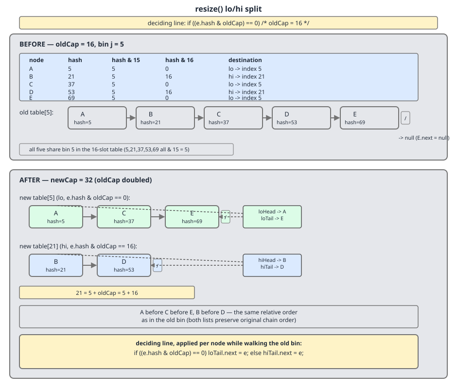
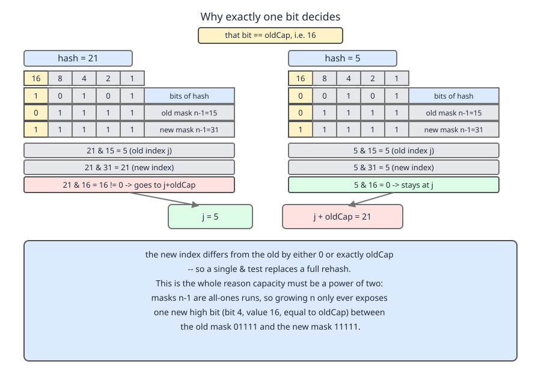

# 02 Java Collections — `HashMap` — INTERNALS (§3.6 `HashMap` source walk — the transfer loop, the lo/hi split and order preservation)

**Target version: Java 21 LTS.** | [Index](../00-index.md)
Previous: [hash-map/03-internals-c-resize.md](03-internals-c-resize.md) · Next: [hash-map/03b-internals-c2-concurrent-resize-and-tree-split.md](03b-internals-c2-concurrent-resize-and-tree-split.md)

---

The previous file left `resize()` at the point where the new `Node[]` has been allocated and published to `table`, and `threshold` has been set to match. Everything below is the back half of the same method — the part guarded by `if (oldTab != null)`, which runs only when there were entries to move.

## The transfer loop, verbatim

```java
        if (oldTab != null) {
            for (int j = 0; j < oldCap; ++j) {
                Node<K,V> e;
                if ((e = oldTab[j]) != null) {
                    oldTab[j] = null;
                    if (e.next == null)
                        newTab[e.hash & (newCap - 1)] = e;
                    else if (e instanceof TreeNode)
                        ((TreeNode<K,V>)e).split(this, newTab, j, oldCap);
                    else { // preserve order
                        Node<K,V> loHead = null, loTail = null;
                        Node<K,V> hiHead = null, hiTail = null;
                        Node<K,V> next;
                        do {
                            next = e.next;
                            if ((e.hash & oldCap) == 0) {
                                if (loTail == null)
                                    loHead = e;
                                else
                                    loTail.next = e;
                                loTail = e;
                            }
                            else {
                                if (hiTail == null)
                                    hiHead = e;
                                else
                                    hiTail.next = e;
                                hiTail = e;
                            }
                        } while ((e = next) != null);
                        if (loTail != null) {
                            loTail.next = null;
                            newTab[j] = loHead;
                        }
                        if (hiTail != null) {
                            hiTail.next = null;
                            newTab[j + oldCap] = hiHead;
                        }
                    }
                }
            }
        }
        return newTab;
    }
```

— `java.base/java/util/HashMap.java`, JDK 21, lines 712–759. (leaves 3.6.24, 3.6.26)

The loop bounds are `oldCap`, not `newCap` — the upper half of the new table starts empty by construction and is filled only by hi-piles. Three supporting facts before the split itself:

**`oldTab[j] = null;` fires immediately**, before the bin is even inspected. That is GC help: rehoming a four-million-entry table does not require both arrays to keep every node reachable at once, so the old `Node[]` becomes collectable slot by slot rather than all at the end. *Gotcha:* it is also the write that makes an unsynchronised concurrent resize destructive — a racing thread reading `oldTab` finds `null` where a live entry was, so `get` returns `null` for a key that is present. Forward pointer only; leaf 3.6.27 is the next file's.

**The single-node fast path** `if (e.next == null) newTab[e.hash & (newCap - 1)] = e;`. Under a Poisson(0.75) occupancy model roughly 53% of bins are empty and 30% hold exactly one node, so among *occupied* bins the singleton is the clear majority and this branch dominates the loop. It uses the full new mask rather than the `& oldCap` test, because for one node a single `&` beats initialising four local references and entering a do-while.

**The `TreeNode` branch** delegates to `((TreeNode<K,V>)e).split(this, newTab, j, oldCap)`, defined at line 2297. `split` performs the same lo/hi partition over the tree's `next` chain and untreeifies either half that falls to `UNTREEIFY_THRESHOLD` or below. It is walked in [`03b-internals-c2-concurrent-resize-and-tree-split.md`](03b-internals-c2-concurrent-resize-and-tree-split.md), which owns leaf 3.6.29.

---

## 1. The lo/hi split

### Mental model

When the table doubles, **a bin never scatters**. Every node in old bin `j` lands in exactly one of two new bins: `j` or `j + oldCap`. Nowhere else is reachable. So the transfer is not a rehash-and-redistribute; it is a *zip-unzip* — walk the chain once, deal each node into one of two piles, hang the two piles on two slots, done.

### Why it exists

Java 7 recomputed `indexFor(e.hash, newCapacity)` for every node and pushed the result onto the head of whatever bin came out. Correct, but it discarded structure that a power-of-two table hands you for free, and head insertion reversed every chain (§3). The lo/hi split exploits the structure: one `&` and one branch per node, and **two array stores per bin** instead of one per node — a real difference when a bin holds eight entries.

### Mechanism, worked

Take `oldCap = 16`, old bin index `j = 5`, five keys whose spread hashes are 5, 21, 37, 53, 69.

Step 1 — confirm they really are all in bin 5 under the old mask `15 = 0b01111`:

| hash | binary | `hash & 15` |
|---|---|---|
| 5 | `0000101` | 5 |
| 21 | `0010101` | 5 |
| 37 | `0100101` | 5 |
| 53 | `0110101` | 5 |
| 69 | `1000101` | 5 |

All five agree in the low four bits — that is precisely what "same bin" means.

Step 2 — apply the split test `hash & oldCap`, i.e. `hash & 16 = 0b10000`:

| hash | bit 4 | `hash & 16` | pile |
|---|---|---|---|
| 5 | 0 | 0 | lo |
| 21 | 1 | 16 | hi |
| 37 | 0 | 0 | lo |
| 53 | 1 | 16 | hi |
| 69 | 0 | 0 | lo |

Step 3 — lo → `newTab[5]`, hi → `newTab[5 + 16] = newTab[21]`.

Step 4 — check against the full new mask `31 = 0b11111`, which is what a lookup will actually use after the resize: `5&31 = 5`, `37&31 = 5`, `69&31 = 5`; `21&31 = 21`, `53&31 = 21`. The shortcut and the honest computation agree, which is the whole point of the shortcut.



### Running it against a real `HashMap`

For the demo to be trustworthy the keys must have hashes we control. `HashMap` does not use `key.hashCode()` directly — it applies the spread `h ^ (h >>> 16)`. For any `h` below 65536, `h >>> 16` is `0`, so the spread is the identity and **the cached `Node.hash` equals the `hashCode()` we return**. All five hashes here are under 100, so a record returning the raw value gives exactly the bins we predicted.

```java
import java.lang.reflect.Field;
import java.util.HashMap;

public class SplitDemo {
    record Key(int h) {
        @Override public int hashCode() { return h; }
        @Override public String toString() { return "K" + h; }
    }

    static void dump(String label, HashMap<Key,String> m) throws Exception {
        Field f = HashMap.class.getDeclaredField("table");
        f.setAccessible(true);
        Object[] tab = (Object[]) f.get(m);
        System.out.println(label + "  (table length = " + (tab == null ? 0 : tab.length) + ")");
        if (tab == null) return;
        Field nextF = null, keyF = null;
        for (int i = 0; i < tab.length; i++) {
            Object e = tab[i];
            if (e == null) continue;
            if (nextF == null) {
                Class<?> nc = e.getClass();
                nextF = nc.getDeclaredField("next"); nextF.setAccessible(true);
                keyF  = nc.getDeclaredField("key");  keyF.setAccessible(true);
            }
            StringBuilder sb = new StringBuilder("  bin[" + i + "] = ");
            for (Object n = e; n != null; n = nextF.get(n))
                sb.append(keyF.get(n)).append(" -> ");
            sb.append("null");
            System.out.println(sb);
        }
    }

    public static void main(String[] args) throws Exception {
        HashMap<Key,String> m = new HashMap<>(16);      // capacity 16, threshold 12
        int[] hs = {5, 21, 37, 53, 69};
        for (int h : hs) m.put(new Key(h), "v" + h);
        System.out.println("spread check: h ^ (h>>>16) for each hash");
        for (int h : hs)
            System.out.println("  h=" + h + "  spread=" + (h ^ (h >>> 16))
                    + "  h&15=" + (h & 15) + "  h&16=" + (h & 16) + "  h&31=" + (h & 31));
        dump("BEFORE resize:", m);

        for (int i = 1000; i < 1008; i++) m.put(new Key(i), "x");   // pushes size past 12
        dump("AFTER resize (table doubled to 32):", m);
    }
}
```

`java --add-opens java.base/java.util=ALL-UNNAMED SplitDemo.java`, JDK 21. Real output:

```
spread check: h ^ (h>>>16) for each hash
  h=5  spread=5  h&15=5  h&16=0  h&31=5
  h=21  spread=21  h&15=5  h&16=16  h&31=21
  h=37  spread=37  h&15=5  h&16=0  h&31=5
  h=53  spread=53  h&15=5  h&16=16  h&31=21
  h=69  spread=69  h&15=5  h&16=0  h&31=5
BEFORE resize:  (table length = 16)
  bin[5] = K5 -> K21 -> K37 -> K53 -> K69 -> null
AFTER resize (table doubled to 32):  (table length = 32)
  bin[5] = K5 -> K37 -> K69 -> null
  bin[8] = K1000 -> null
  bin[9] = K1001 -> null
  bin[10] = K1002 -> null
  bin[11] = K1003 -> null
  bin[12] = K1004 -> null
  bin[13] = K1005 -> null
  bin[14] = K1006 -> null
  bin[15] = K1007 -> null
  bin[21] = K21 -> K53 -> null
```

The prediction holds exactly: `K5 K37 K69` at index 5, `K21 K53` at index 21, and both chains still in the order they were inserted. (The filler keys 1000–1007 land at 8–15 because `1000 & 31 = 8`; they exist only to push `size` past the threshold of 12.)

**Gotcha:** rerun this with hashes at or above 65536 and the spread stops being the identity — your hand-computed bins will be wrong. Compute `h ^ (h >>> 16)` first, then mask.

**Interview:** *"How does `HashMap` rehash entries when the table grows?"* — It does not rehash. `Node.hash` is cached and `final`; the transfer tests one bit, `e.hash & oldCap`, and sends the node to `j` or `j + oldCap`.

> **The lo/hi split** partitions each old bin into two chains by the single bit `e.hash & oldCap`, hanging the zero-bit chain back on index `j` and the one-bit chain on index `j + oldCap`, in one pass, with no per-node index arithmetic and no call into user code.

---

## 2. Why exactly one bit decides

### Mental model

The bucket index is a *window* onto the low bits of the hash. Doubling the table widens the window by exactly one bit. Everything already inside the window is unchanged; the only new information is the single bit that just came into view, and that bit is worth `oldCap`.

### The argument, step by step

1. The index is `hash & (n - 1)`, and `n` is always a power of two — `HashMap` guarantees this at construction via `tableSizeFor` and preserves it via `oldCap << 1`. So `n - 1` is a mask of exactly `log2(n)` consecutive one-bits: `n = 16` → `n - 1 = 0b01111`.
2. Doubling to `2n` makes the mask `2n - 1 = 0b11111`. That is the old mask **plus exactly one additional one-bit**, at bit position `log2(n)`. The numeric value of a one-bit at position `log2(n)` is `2^log2(n) = n` — that is, `oldCap`.
3. The two masks `n - 1` and `n` are disjoint and their union is `2n - 1`, so for any hash:
   `hash & (2n - 1) = (hash & (n - 1)) | (hash & n)`
   The left term is the *old* index `j`, unchanged. The right term is either `0` or `n`. Nothing else can appear.
4. Substituting: the new index is `j | 0 = j`, or `j | n = j + n`. The `|` becomes `+` because bit `log2(n)` is guaranteed clear in `j` — `j < n` by construction. Two outcomes, and the single expression `(e.hash & oldCap) == 0` distinguishes them. No `%`, no re-invocation of `hashCode()`, no re-application of the spread; `Node.hash` was cached at insertion and is `final`.
5. **The corollary that makes it click:** a bin does not disperse, it *bifurcates*, and the two halves land `oldCap` slots apart — never adjacent, never nearby. With well-spread hashes bit `log2(n)` is a fair coin, so about half the nodes move and half stay. A resize does not shuffle the table; it **interleaves** it. Old bins `j` and `j+1` produce four new bins `j`, `j+1`, `j+oldCap`, `j+oldCap+1`, and can never collide with each other.



### What this property costs

It is **bought** by the power-of-two capacity, and that is not free. Masking uses only the low bits of the hash, so a `hashCode()` whose entropy sits in the high bits collides catastrophically — which is exactly why `HashMap` needs the `h ^ (h >>> 16)` spread at all. The trade is argued in full in [`01b-internals-a2-hash-spread-and-sizing.md`](01b-internals-a2-hash-spread-and-sizing.md), which owns the mask-versus-modulo comparison (leaf 3.6.16).

The counterexample is the legacy sibling. `java.util.Hashtable` uses a non-power-of-two length and computes `(hash & 0x7FFFFFFF) % tab.length`, so on rehash it runs an integer division per entry and the destination bears no relation to the source — no split, no reuse of the old index, no locality.

| Table sizing | Index expression | Cost per entry on resize | Destination predictable from old index? |
|---|---|---|---|
| `HashMap` — power of two | `hash & (n-1)` | one `&` and one branch | yes: `j` or `j + oldCap` |
| `Hashtable` — arbitrary length | `(hash & 0x7FFFFFFF) % len` | one integer division | no |
| `ConcurrentHashMap` — power of two | `(hash ^ (hash >>> 16)) & HASH_BITS & (n-1)` | the same lo/hi split, done per-bin under a bin lock | yes: `j` or `j + oldCap` |

**Insight:** the lo/hi split is not a clever trick bolted onto `HashMap`; it is the *reason* the power-of-two constraint pays for itself. Take the constraint away and you lose the mask, the one-bit test, and the predictable destinations all at once.

**Interview:** *"Why must `HashMap`'s capacity be a power of two?"* — So that `hash & (n-1)` replaces `hash % n`, **and** so that doubling exposes exactly one new mask bit, which turns rehashing into a one-bit test per entry with only two possible destinations.

> **Exactly one bit decides** because `2n - 1` is `n - 1` with one extra one-bit whose value is `n`; masking against the wider mask therefore leaves the old index intact and adds either `0` or `oldCap`.

---

## 3. Order preservation — what it fixed, and what it did not

### Mental model

Java 7 moved nodes by **pushing them onto the head** of the destination bin. Java 8 moves them by **appending to the tail** of a pile it is building. Head insertion reverses; tail insertion preserves. That is the entire difference, and it is two lines of code.

### Java 7's transfer

```java
void transfer(Entry<?,?>[] newTable, boolean rehash) {
    Entry<?,?>[] src = table;
    int newCapacity = newTable.length;
    for (int j = 0; j < src.length; j++) {
        Entry<K,V> e = (Entry<K,V>)src[j];
        while(null != e) {
            Entry<K,V> next = e.next;
            if (rehash) {
                e.hash = null == e.key ? 0 : hash(e.key);
            }
            int i = indexFor(e.hash, newCapacity);
            e.next = (Entry<K,V>)newTable[i];
            newTable[i] = e;
            e = next;
        }
    }
}
```

— `java/util/HashMap.java`, OpenJDK `jdk7u`. (leaf 3.6.26, contrast material)

The two lines that matter are `e.next = newTable[i]; newTable[i] = e;`. Walk `A → B → C`, all landing in the same new bin `i`, which starts `null`:

| step | assignment | bin contents after |
|---|---|---|
| move `A` | `A.next = null`, bin = `A` | `A` |
| move `B` | `B.next = A`, bin = `B` | `B → A` |
| move `C` | `C.next = B`, bin = `C` | `C → B → A` |

Reversed. Every resize, every bin. Note also `if (rehash) e.hash = hash(e.key)` — Java 7 could recompute the hash during transfer, calling back into user `hashCode()` mid-rehash. Java 8 removed that possibility entirely by making `Node.hash` `final` and computing it once at insertion.

### Java 8's version

The `else { // preserve order` comment quoted at the top of this file is in the JDK source verbatim. The mechanism is `loTail.next = e; loTail = e;` — append at the tail — with `loHead` captured on the first node so the finished pile can be hung on the slot afterwards. Two head/tail pairs, one per destination, and one `loTail.next = null` / `hiTail.next = null` at the end to terminate each chain (without which the last lo node would still point at whatever followed it in the old bin).

### Demonstrating both

Java 7 cannot be run here, so the honest thing is to model both algorithms over a plain `Node` chain and let them race. The code below is a faithful transcription of the two quoted methods; it is **not** the JDK, and it needs no reflection.

```java
import java.util.function.BiConsumer;

public class TransferOrder {
    static final class Node {
        final int hash; final String key; Node next;
        Node(int hash, String key) { this.hash = hash; this.key = key; }
    }
    static String render(Node[] tab) {
        StringBuilder sb = new StringBuilder();
        for (int i = 0; i < tab.length; i++) {
            if (tab[i] == null) continue;
            sb.append("bin[").append(i).append("] = ");
            for (Node n = tab[i]; n != null; n = n.next) sb.append(n.key).append(" ");
            sb.append(" | ");
        }
        return sb.isEmpty() ? "(empty)" : sb.toString();
    }

    /** Models java.util.HashMap.transfer(Entry[], boolean), Java 7: head insertion. */
    static void java7Transfer(Node[] src, Node[] newTab) {
        int newCapacity = newTab.length;
        for (int j = 0; j < src.length; j++) {
            Node e = src[j];
            while (e != null) {
                Node next = e.next;
                int i = e.hash & (newCapacity - 1);   // indexFor(e.hash, newCapacity)
                e.next = newTab[i];
                newTab[i] = e;
                e = next;
            }
        }
    }

    /** Models the lo/hi split inside java.util.HashMap.resize(), Java 8+: tail insertion. */
    static void java8Split(Node[] src, Node[] newTab) {
        int oldCap = src.length;
        for (int j = 0; j < oldCap; j++) {
            Node e = src[j];
            if (e == null) continue;
            src[j] = null;
            Node loHead = null, loTail = null, hiHead = null, hiTail = null, next;
            do {
                next = e.next;
                if ((e.hash & oldCap) == 0) {
                    if (loTail == null) loHead = e; else loTail.next = e;
                    loTail = e;
                } else {
                    if (hiTail == null) hiHead = e; else hiTail.next = e;
                    hiTail = e;
                }
            } while ((e = next) != null);
            if (loTail != null) { loTail.next = null; newTab[j] = loHead; }
            if (hiTail != null) { hiTail.next = null; newTab[j + oldCap] = hiHead; }
        }
    }

    static Node[] freshTable(int[] hashes, String[] keys, int cap) {
        Node[] tab = new Node[cap];
        for (int i = hashes.length - 1; i >= 0; i--) {   // build in order by prepending from the end
            Node n = new Node(hashes[i], keys[i]);
            int idx = hashes[i] & (cap - 1);
            n.next = tab[idx];
            tab[idx] = n;
        }
        return tab;
    }

    static void run(String label, BiConsumer<Node[], Node[]> algo, int[] hashes, String[] keys) {
        Node[] old = freshTable(hashes, keys, 16);
        System.out.println("  before: " + render(old));
        Node[] neu = new Node[32];
        algo.accept(old, neu);
        System.out.println("  " + label + ": " + render(neu));
    }

    public static void main(String[] args) {
        System.out.println("Case 1 - all three stay in the same new bin (hashes 5, 37, 69):");
        int[] h1 = {5, 37, 69}; String[] k1 = {"A", "B", "C"};
        run("Java 7 head insertion ", TransferOrder::java7Transfer, h1, k1);
        run("Java 8 lo/hi split    ", TransferOrder::java8Split,    h1, k1);

        System.out.println("\nCase 2 - the five-node bin from D-92 (hashes 5, 21, 37, 53, 69):");
        int[] h2 = {5, 21, 37, 53, 69}; String[] k2 = {"A", "B", "C", "D", "E"};
        run("Java 7 head insertion ", TransferOrder::java7Transfer, h2, k2);
        run("Java 8 lo/hi split    ", TransferOrder::java8Split,    h2, k2);
    }
}
```

`java TransferOrder.java`, JDK 21. Real output:

```
Case 1 - all three stay in the same new bin (hashes 5, 37, 69):
  before: bin[5] = A B C  | 
  Java 7 head insertion : bin[5] = C B A  | 
  before: bin[5] = A B C  | 
  Java 8 lo/hi split    : bin[5] = A B C  | 

Case 2 - the five-node bin from D-92 (hashes 5, 21, 37, 53, 69):
  before: bin[5] = A B C D E  | 
  Java 7 head insertion : bin[5] = E C A  | bin[21] = D B  | 
  before: bin[5] = A B C D E  | 
  Java 8 lo/hi split    : bin[5] = A C E  | bin[21] = B D  |
```

Case 2 is the sharpest form. Both algorithms put the **same nodes in the same two bins** — `{A,C,E}` at index 5 and `{B,D}` at index 21, because both compute the same index — but Java 7 hands back `E C A` and `D B` while Java 8 hands back `A C E` and `B D`. The difference is purely the direction of linkage, and it matches D-92 exactly.

### Saying precisely what is preserved

**Pitfall, stated up front because this is the single most-overread claim in the topic:** "Java 8 preserves order" does **not** mean `HashMap` iteration order is stable. What the split guarantees is narrower and exact:

> The relative order of nodes that end up **in the same bin** is the same after the split as before it.

`HashMap` iteration walks `table[0]`, `table[1]`, … in index order and follows each chain, so a node that moves from index 5 to index 21 is now visited *later* relative to nodes at indexes 6–20. Iteration order is unspecified by the `Map` contract, it changes across resizes, and it depends on the keys' hash codes. If you need order, use `LinkedHashMap` (insertion or access order) or `TreeMap` (key order).

### Why the JDK bothered

Not for the user — the user was never promised anything. Three real reasons:

1. **The tree machinery depends on it.** `TreeNode.split` partitions along the same `next` chain and untreeifies halves that shrink; `treeifyBin` builds its list in bin order before calling `treeify`. If transfer scrambled the chain, "the bin's order" would stop being a meaningful thing for those routines to preserve or to reconstruct from. The class comment states it directly: bins are kept "in the same relative access/traversal order (i.e., field `Node.next`) to better preserve locality, and to slightly simplify handling of splits and traversals that invoke `iterator.remove`" — JDK 21, lines 214–218.
2. **Locality.** Nodes allocated near each other in time tend to be near each other in memory. Keeping insertion order in the chain keeps chain traversal cache-friendlier than a reversed or scrambled order would.
3. **It removed the Java 7 infinite-loop symptom.** Head insertion under a concurrent resize could build a cycle inside a bin, spinning a CPU at 100% inside `get`. Tail insertion cannot form that particular cycle. That story — and why `HashMap` is nonetheless still not thread-safe — is leaf 3.6.27, in [`03b-internals-c2-concurrent-resize-and-tree-split.md`](03b-internals-c2-concurrent-resize-and-tree-split.md).

> **Order preservation** in `resize()` means the split appends rather than prepends, so nodes sharing a destination bin keep their relative order — a structural invariant the tree code relies on, not an iteration-order guarantee for callers.

---

## Version notes

The transfer half of `resize()` is the same logic in JDK 8 (method at line 677), JDK 17 (line 675) and JDK 21 (line 683) — same lo/hi split, same `// preserve order` comment, same `TreeNode.split` delegation, all three verified in the sources. The break is at Java 7, which had `transfer(Entry[], boolean)`: per-node `indexFor`, head insertion, no lo/hi concept, and a `rehash` flag that could re-invoke user `hashCode()` mid-transfer. Anyone quoting "`HashMap` reverses lists on resize" is describing Java 7 and has been wrong since 2014.

---

## Pitfalls

### Believing "Java 8 preserves order" means iteration order is stable

**Wrong**

```java
Map<Integer,String> m = new HashMap<>(4);
for (int i = 1; i <= 6; i++) m.put(i, "v" + i);   // triggers two resizes
System.out.println(m.keySet());                   // prints [1, 2, 3, 4, 5, 6]
```

It prints in order here only because small `Integer` keys hash to their own value and land in ascending bins. That is a property of the keys, not of `HashMap`. Swap in `String` keys and the order is arbitrary, and it changes when the table grows.

**Right**

```java
Map<Integer,String> m = new LinkedHashMap<>(4);
for (int i = 1; i <= 6; i++) m.put(i, "v" + i);
System.out.println(m.keySet());   // [1, 2, 3, 4, 5, 6] — guaranteed by the doubly-linked list
```

`LinkedHashMap` threads a separate `before`/`after` list through its entries. Resizing relinks the bins and never touches that list, so the order is a contract rather than an accident.

**Why people believe it:** the JDK source comment literally reads `// preserve order`, and every blog post about the Java 8 rewrite repeats it. Both are true statements about *within-bin chain order during a split*, not about iteration.

### Hand-computing bins without applying the spread

**Wrong**

```java
record Key(int h) { @Override public int hashCode() { return h; } }
// belief: new Key(65541) lands in bin 65541 & 15 = 5
```

`HashMap` stores `h ^ (h >>> 16)`, not `h`. For 65541 that is `65541 ^ 1 = 65540`, and `65540 & 15 = 4`, not 5. Any demo built on the naive assumption puts nodes in the wrong bins and then "disproves" the split.

**Right**

```java
int spread = h ^ (h >>> 16);
int bin = spread & (capacity - 1);   // 65541 -> spread 65540 -> bin 4
```

For hashes below 65536 the two agree, because `h >>> 16` is 0 and the spread is the identity — which is exactly why `SplitDemo` above uses hashes under 100 and says so.

**Why people believe it:** most worked examples in circulation use small hash values, where the spread is invisible, so the step is easy to forget when scaling the example up.

### Assuming a resize redistributes a bin across many new slots

**Wrong** — "after doubling from 16 to 32, the five entries in bin 5 get spread over the 32 new buckets."

**Right** — they land in bin 5 or bin 21, and nowhere else: `hash & 31 = (hash & 15) | (hash & 16)`, the low part is frozen at 5, and the only new contribution is 0 or 16.

**Why people believe it:** "rehashing" sounds like recomputing a hash and starting over. Nothing is rehashed — `Node.hash` is `final` and cached, and only one previously-masked-off bit becomes visible.

---

## Cheat sheet

| Fact | Value / rule |
|---|---|
| Transfer loop location | `resize()`, JDK 21 lines 712–759, inside `if (oldTab != null)` |
| Loop bound | `j < oldCap` — the upper half of the new table is filled only by hi-piles |
| GC help | `oldTab[j] = null` before the bin is touched |
| Single-node fast path | `newTab[e.hash & (newCap - 1)] = e` — full mask, no lo/hi setup |
| Why the fast path matters | Poisson(0.75): ~53% of bins empty, ~30% hold exactly one node |
| Tree bin | `((TreeNode)e).split(this, newTab, j, oldCap)` — line 2297 |
| Split test | `(e.hash & oldCap) == 0` |
| Destinations | lo → `newTab[j]` · hi → `newTab[j + oldCap]` |
| Why one bit | `2n-1` = `n-1` plus one bit of value `n`; `hash & (2n-1) = (hash & (n-1)) \| (hash & n)` |
| Expected split | ~50/50 with well-spread hashes; destinations always `oldCap` apart, never adjacent |
| Worked example | oldCap 16, bin 5, hashes 5/21/37/53/69 → `5,37,69` at 5; `21,53` at 21 |
| Rehashing on resize | none — `Node.hash` is `final` and cached; no user code runs |
| Chain termination | `loTail.next = null` / `hiTail.next = null` before hanging each pile |
| Order guarantee | relative order **within a bin** survives; iteration order does not — use `LinkedHashMap`/`TreeMap` |
| Java 7 reversal | `e.next = newTable[i]; newTable[i] = e;` → `A B C` becomes `C B A`; five-node case, head: `E C A`/`D B` vs Java 8 `A C E`/`B D` |
| Java 7 rehash flag | `transfer(Entry[], boolean rehash)` could call user `hashCode()` mid-move; gone in 8 |
| `Hashtable` contrast | `(hash & 0x7FFFFFFF) % len` — a division per entry, destination unrelated to source |

---

## Self-test

**Q1.** Prove that after a doubling, an entry from old bin `j` can only land at `j` or `j + oldCap`.

<details><summary>Answer</summary>

The index is `hash & (n-1)` with `n` a power of two, so `n-1` is `log2(n)` one-bits. After doubling, the mask is `2n-1`, which is `n-1` with one extra one-bit at position `log2(n)`, of numeric value `n`. The two masks are disjoint and union to `2n-1`, so `hash & (2n-1) = (hash & (n-1)) | (hash & n) = j | (0 or n)`. Since `j < n`, bit `log2(n)` is clear in `j`, so the `|` is a `+`. Hence `j` or `j + n`, and nothing else is reachable.

</details>

**Q2.** Why does the transfer loop set `oldTab[j] = null` before processing the bin, and what does that cost?

<details><summary>Answer</summary>

GC help: the old array releases each bin as it is rehomed, so resizing a very large map does not require both arrays to keep every node reachable simultaneously — the old `Node[]` becomes collectable slot by slot. The cost is that in an unsynchronised concurrent resize, a racing reader traversing `oldTab` sees `null` at a slot whose entries are in flight and gets a `null` result for a key that is present. That is not a correctness cost against the contract `HashMap` actually offers, which is single-threaded-or-externally-synchronised.

</details>

**Q3.** A colleague says "since Java 8, `HashMap` preserves insertion order." What is right and what is wrong about that?

<details><summary>Answer</summary>

Right: the lo/hi split appends with `loTail.next = e` (tail insertion) rather than Java 7's `e.next = newTable[i]` (head insertion), so nodes that end up in the same bin keep their relative order instead of being reversed. Wrong: that says nothing about iteration order. Iteration walks bins by index, and a resize moves entries from bin `j` to bin `j + oldCap`, changing when they are visited relative to everything in between. `HashMap` iteration order remains unspecified. `LinkedHashMap` is the collection that gives the guarantee.

</details>

**Q4.** Why does the single-node fast path use `e.hash & (newCap - 1)` instead of the `& oldCap` test the rest of the loop uses?

<details><summary>Answer</summary>

Both are correct; the full mask is cheaper for one node. The lo/hi test only pays off when it lets you build two chains without recomputing an index per node — but that requires initialising four local references (`loHead`, `loTail`, `hiHead`, `hiTail`) and entering a do-while. For a single node that setup costs more than one extra `&`. Since roughly 30% of bins hold exactly one node under Poisson(0.75) and about 53% are empty, this branch is the common case among occupied bins and is worth specialising.

</details>

**Q5.** Does `resize()` ever call back into user code?

<details><summary>Answer</summary>

No. `Node.hash` is `final`, computed once at insertion from `key.hashCode()` and the spread. The transfer uses only that cached `int`, so neither `hashCode()` nor `equals()` runs during a resize. Java 7's `transfer(Entry[], boolean rehash)` could, via `e.hash = hash(e.key)` under the `rehash` flag — a mutable-key hazard Java 8 removed by making the field final.

</details>

**Q6.** Why do `loTail.next = null` and `hiTail.next = null` exist? What breaks without them?

<details><summary>Answer</summary>

Because the nodes were never detached from the original chain — only re-linked into two interleaved piles. The last node placed in the lo pile still has whatever `next` it had in the old bin, which may be a node that went to the hi pile. Without the explicit termination, `newTab[j]`'s chain would run off into hi-pile nodes (and could form a cycle between the two chains), so lookups in bin `j` would traverse entries that belong to bin `j + oldCap`. The two assignments cut each pile loose before it is published.

</details>

**Q7.** Both the Java 7 and Java 8 algorithms put the same five nodes in the same two bins in the demo output. If the destinations are identical, what exactly did the Java 8 rewrite buy?

<details><summary>Answer</summary>

Three things, none of them the destination. (1) Cost: one `&` and one branch per node plus two array stores per bin, versus a per-node index computation and a per-node array store. (2) Order: tail insertion leaves `A C E` / `B D` where head insertion leaves `E C A` / `D B`, and the preserved chain order is what `TreeNode.split`, `treeifyBin` and `iterator.remove` are written against. (3) Safety: head insertion under a concurrent resize could link a bin into a cycle, producing the notorious 100%-CPU spin inside `get`; tail insertion cannot form that cycle — though the map is still not thread-safe.

</details>

---

**Leaves covered:** 3.6.24, 3.6.25, 3.6.26 (3 leaves)
**Leaves deferred:** none
**Diagrams included:** D-92, D-93
**Target version:** Java 21 LTS
**Lines:** 566
