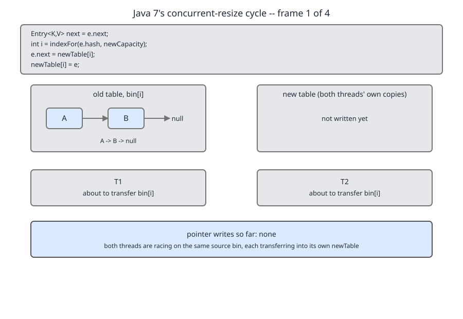
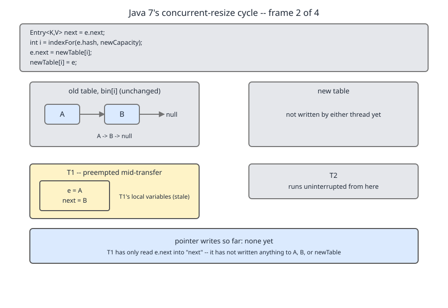
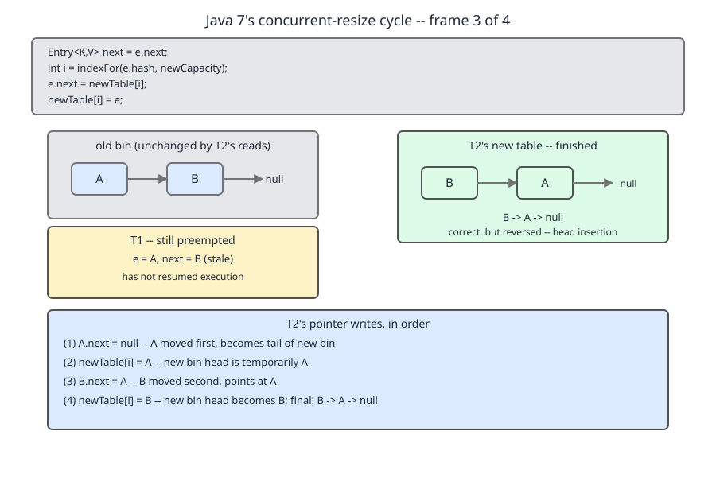
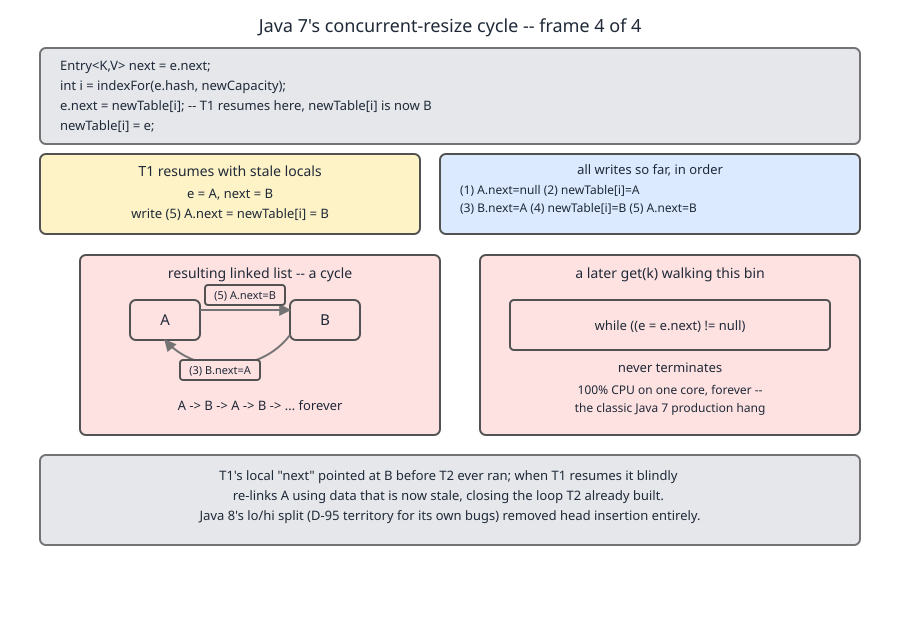
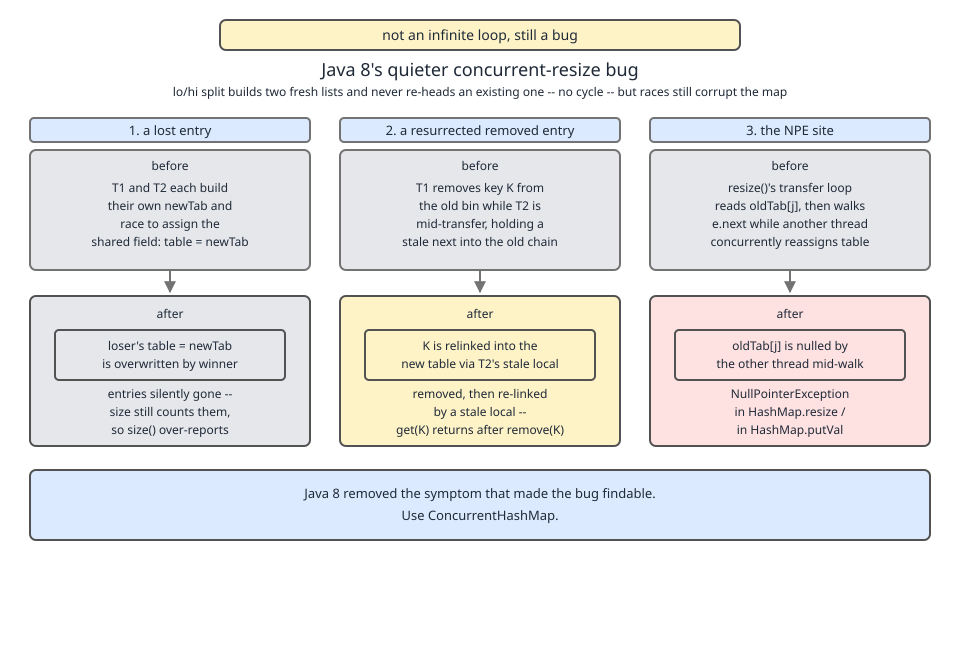

# 02 Java Collections — `HashMap` — INTERNALS (§3.6 `HashMap` source walk — what a concurrent resize actually does)

**Target version: Java 21 LTS.** | [Index](../00-index.md)
Previous: [hash-map/03a-internals-c1-lo-hi-split.md](03a-internals-c1-lo-hi-split.md) · Next: [hash-map/03c-internals-c3-tree-split.md](03c-internals-c3-tree-split.md)

`03a-internals-c1-lo-hi-split.md` walked the lo/hi split on a single thread and left it correct. This file breaks it two ways — once loudly (Java 7), once quietly (Java 8 onward). `TreeNode.split`, the one path a treeified bin takes through the same machinery, is in [03c-internals-c3-tree-split.md](03c-internals-c3-tree-split.md).

---

## 1. The Java 7 concurrent-resize infinite loop

### Mental model first

Picture two people re-shelving the same shelf of books into a bigger bookcase, and the rule is *put each book on the front of its new shelf*. Person A picks up book 1, notes that book 2 is behind it, and then goes to lunch mid-reach. Person B re-shelves the whole shelf, which — because of the front-insertion rule — leaves the new shelf in reverse order. Person A comes back, still holding book 1, still believing book 2 is behind it, and puts book 1 on the front. Now book 1 points at book 2, and book 2 points at book 1. The shelf is a loop. Nobody notices, because putting books away does not read the shelf. The next person who *looks something up* walks the shelf forever.

That is the whole bug. It is not exotic. It needs no unusual hardware, no reordering, no visibility subtlety — plain interleaving of two threads at one instruction boundary is enough.

### Why it exists

Java 7 resized by calling `transfer`, which moved every node from the old table into the new one **in place** — the same `Entry` objects, re-linked. It never allocated new nodes and it never built an intermediate list. That is cheap and it is exactly why it is fragile: every step of the move is a visible mutation of a structure another thread is also walking.

### When it bites, and when it does not

It bites when two or more threads call a mutating method on the same unsynchronised `HashMap` and at least one of them triggers a resize. It does not bite a map that is written by one thread and then safely published; it does not bite `Hashtable` or `Collections.synchronizedMap` (both serialise the whole method); it does not bite `ConcurrentHashMap`, which locks per bin during transfer. The sibling that wins here is `ConcurrentHashMap`, unconditionally — see `../concurrent-collections/02-internals-chm-a.md`.

### How it works — the Java 7 source

```java
void transfer(Entry<?,?>[] newTable, boolean rehash) {
    Entry<?,?>[] src = table;
    int newCapacity = newTable.length;
    for (int j = 0; j < src.length; j++) {
        Entry<K,V> e = (Entry<K,V>)src[j];
        while(null != e) {
            Entry<K,V> next = e.next;
            if (rehash) {
                e.hash = null == e.key ? 0 : hash(e.key);
            }
            int i = indexFor(e.hash, newCapacity);
            e.next = (Entry<K,V>)newTable[i];
            newTable[i] = e;
            e = next;
        }
    }
}
```
— `jdk/src/share/classes/java/util/HashMap.java`, OpenJDK `jdk7u`. (leaf 3.6.27)

Line by line:

- `Entry<?,?>[] src = table` — snapshot the old array into a local. Only a local; the field can still change under you.
- `int newCapacity = newTable.length` — cached because `indexFor` needs it every iteration.
- `for (int j = 0; ...)` — outer loop over old bins.
- `Entry<K,V> e = src[j]` — the head of the bin we are about to drain.
- `Entry<K,V> next = e.next` — **save the rest of the chain before we clobber `e.next`.** This is the line the race hinges on: after it, the thread's view of "what comes after `e`" is frozen in a local, and nothing will ever refresh it.
- `if (rehash) e.hash = ...` — Java 7 recomputed hashes when the alternative-hashing switch flipped. Irrelevant to the race; gone entirely in Java 8.
- `int i = indexFor(e.hash, newCapacity)` where `static int indexFor(int h, int length) { return h & (length-1); }` — the same power-of-two masking Java 21 still uses.
- `e.next = newTable[i]` — **head insertion, step 1.** The node we are moving now points at whatever was already at the head of the destination bin.
- `newTable[i] = e` — **head insertion, step 2.** The node becomes the new head.
- `e = next` — advance using the *frozen* local.

Those last three lines are the whole story. Head insertion is why every bin came out **reversed** after a Java 7 resize, and it is why an interleaved second writer can make a node point backwards into the chain it came from.

### The pointer sequence, frame by frame

Setup: old bin `j` holds `A → B → null`, and both `A` and `B` rehash to the same new index `i`.



*Frame 1.* Both threads are inside `transfer`, on the same bin, before either has written anything. The chain is intact and the new bin `i` is empty.



*Frame 2.* **T1** executes `Entry next = e.next` with `e = A`. Its locals are now `e = A`, `next = B`. The scheduler preempts it here — **after the read, before any write**. Note what is in the picture and what is not: T1 has changed nothing on the heap. Its entire contribution to the bug is two stack slots.



*Frame 3.* **T2** runs the loop to completion:

| Iteration | `e` | `next` | Write | Effect |
|---|---|---|---|---|
| 1 | `A` | `B` | **(1)** `A.next = newTable[i]` | `A.next = null` |
| 1 | `A` | `B` | **(2)** `newTable[i] = A` | bin `i` is `A → null` |
| 2 | `B` | `null` | **(3)** `B.next = newTable[i]` | `B.next = A` |
| 2 | `B` | `null` | **(4)** `newTable[i] = B` | bin `i` is `B → A → null` |

T2's result is **correct but reversed** — `B → A → null`. Reversal is not the bug; it is just what head insertion does.



*Frame 4.* **T1 resumes**, still holding `e = A`, `next = B`. It has no way to know the world moved. It executes write **(5)** `A.next = newTable[i]` — and `newTable[i]` is now `B`. So `A.next = B`.

Combine write (5) with write (3): `A.next == B` and `B.next == A`. **The bin is a two-node cycle.** T1 then writes `newTable[i] = A` and advances to `e = next = B`; whether T1's own loop terminates depends on scheduling, and it does not matter — the damage is committed to the heap.

**Insight:** no write in that sequence is individually wrong. Every one of the five is exactly what the single-threaded algorithm prescribes. The cycle is built entirely out of correct operations applied to a stale local.

### The kill, and why the forensics mislead

Nothing has thrown yet. The map still answers `size()`. Then, possibly minutes or hours later, an entirely innocent `get(k)` for any key hashing to bin `i` runs:

```java
while (null != e) {
    if (e.hash == hash && (e.key == key || key.equals(e.key))) return e.value;
    e = e.next;
}
```

It never reaches `null`. There is no loop bound, no iteration counter, no interruption point. The thread pins one core at 100% and stops making progress, silently, forever.

This is why the bug became the canonical war story. The symptom appears in a thread dump as a thread parked in `HashMap.get` or `HashMap.getEntry` burning CPU — often minutes or hours after the write that corrupted the map, and often in a thread that only ever *reads*. A team hunting the bug looks at the reader, which is innocent, and never at the two writers that raced during a resize an hour ago in a different subsystem.

**Interview:** *"Why was the Java 7 `HashMap` infinite loop so hard to diagnose?"* — because the thread that hangs is a **reader**, the thread that caused it is a **writer**, and they are separated by an arbitrary amount of time; the thread dump shows a stack parked in `HashMap.get` with no exception, no log line, and nothing suspicious in the code you are staring at.

### Proof — modelling both algorithms

You cannot run Java 7 on this machine, and this program is **not** the JDK. It reimplements the two quoted algorithms over a tiny `Entry` class of our own, performs the interleaving deterministically rather than hoping a scheduler cooperates, and then walks the resulting chain with a hop cap.

```java
// Models the Java 7 transfer() and the Java 8 lo/hi split over a plain chain.
// This is NOT the JDK; it reproduces the two quoted algorithms on our own nodes.
public class CycleDemo {

    static final class Entry {
        final String key; final int hash; Entry next;
        Entry(String key, int hash) { this.key = key; this.hash = hash; }
        @Override public String toString() { return key; }
    }

    static int indexFor(int h, int length) { return h & (length - 1); }

    // ---- Java 7: head insertion, interleaved deterministically ----
    static Entry[] java7Interleaved(Entry head, int newCapacity) {
        Entry[] newTable = new Entry[newCapacity];

        // T1 enters the loop, reads its locals, then is preempted before any write.
        Entry t1e = head;                  // A
        Entry t1next = t1e.next;           // B

        // T2 runs the whole bin to completion.
        for (Entry e = head; e != null; ) {
            Entry next = e.next;
            int i = indexFor(e.hash, newCapacity);
            e.next = newTable[i];          // writes (1) and (3)
            newTable[i] = e;               // writes (2) and (4)
            e = next;
        }
        System.out.println("  after T2: newTable[1] chain = " + walk(newTable[1], 8));

        // T1 resumes with its stale locals and performs one more head insertion.
        int i = indexFor(t1e.hash, newCapacity);
        t1e.next = newTable[i];            // write (5): A.next = B
        newTable[i] = t1e;
        // (T1 would continue with e = t1next; the cycle already exists.)
        return newTable;
    }

    // ---- Java 8: lo/hi, fresh lists, tail insertion ----
    static Entry[] java8Interleaved(Entry head, int oldCap) {
        Entry[] newTab = new Entry[oldCap << 1];

        Entry t1e = head;
        Entry t1next = t1e.next;

        splitLoHi(head, newTab, 1, oldCap);   // T2 runs the whole bin

        // T1 resumes with stale locals and runs its own lo/hi pass from A.
        // It builds FRESH lists; it never re-heads an existing chain.
        Entry t1LoHead = null, t1LoTail = null, t1HiHead = null, t1HiTail = null;
        for (Entry e = t1e; e != null; ) {
            Entry next = (e == t1e) ? t1next : e.next;
            if ((e.hash & oldCap) == 0) {
                if (t1LoTail == null) t1LoHead = e; else t1LoTail.next = e;
                t1LoTail = e;
            } else {
                if (t1HiTail == null) t1HiHead = e; else t1HiTail.next = e;
                t1HiTail = e;
            }
            e = next;
        }
        if (t1LoTail != null) { t1LoTail.next = null; newTab[1] = t1LoHead; }
        if (t1HiTail != null) { t1HiTail.next = null; newTab[1 + oldCap] = t1HiHead; }
        return newTab;
    }

    static void splitLoHi(Entry head, Entry[] newTab, int j, int oldCap) {
        Entry loHead = null, loTail = null, hiHead = null, hiTail = null;
        for (Entry e = head, next; e != null; e = next) {
            next = e.next;
            if ((e.hash & oldCap) == 0) {
                if (loTail == null) loHead = e; else loTail.next = e;
                loTail = e;
            } else {
                if (hiTail == null) hiHead = e; else hiTail.next = e;
                hiTail = e;
            }
        }
        if (loTail != null) { loTail.next = null; newTab[j] = loHead; }
        if (hiTail != null) { hiTail.next = null; newTab[j + oldCap] = hiHead; }
    }

    static String walk(Entry e, int cap) {
        StringBuilder sb = new StringBuilder();
        int hops = 0;
        while (e != null) {
            if (hops++ >= cap) {
                return sb.append("... ABORTED after ").append(cap).append(" hops").toString();
            }
            sb.append(e.key).append(" -> ");
            e = e.next;
        }
        return sb.append("null (terminated in ").append(hops).append(" hops)").toString();
    }

    public static void main(String[] args) {
        // Bin j=1 of a table of capacity 2, holding A -> B -> null.
        // hash 1 and hash 9 both map to index 1 under capacity 4 (1 & 3 == 1,
        // 9 & 3 == 1), so both land in the same destination bin.
        System.out.println("Java 7 head-insertion transfer, T1 preempted after reading locals:");
        Entry a7 = new Entry("A", 1), b7 = new Entry("B", 9);
        a7.next = b7;
        Entry[] t7 = java7Interleaved(a7, 4);
        System.out.println("  A.next = " + a7.next + " ; B.next = " + b7.next);
        System.out.println("  get() walk of newTable[1], hop cap 20: " + walk(t7[1], 20));

        System.out.println();
        System.out.println("Java 8 lo/hi split, same interleaving:");
        Entry a8 = new Entry("A", 1), b8 = new Entry("B", 9);
        a8.next = b8;
        Entry[] t8 = java8Interleaved(a8, 2);
        System.out.println("  A.next = " + a8.next + " ; B.next = " + b8.next);
        System.out.println("  newTab[1] walk, hop cap 20: " + walk(t8[1], 20));
        System.out.println("  newTab[3] walk, hop cap 20: " + walk(t8[3], 20));
    }
}
```

Real output, JDK 21.0.7:

```
Java 7 head-insertion transfer, T1 preempted after reading locals:
  after T2: newTable[1] chain = B -> A -> null (terminated in 2 hops)
  A.next = B ; B.next = A
  get() walk of newTable[1], hop cap 20: A -> B -> A -> B -> A -> B -> A -> B -> A -> B -> A -> B -> A -> B -> A -> B -> A -> B -> A -> B -> ... ABORTED after 20 hops

Java 8 lo/hi split, same interleaving:
  A.next = B ; B.next = null
  newTab[1] walk, hop cap 20: A -> B -> null (terminated in 2 hops)
  newTab[3] walk, hop cap 20: null (terminated in 0 hops)
```

The Java 7 walk does not terminate; the cap is the only reason the program exits. The same interleaving through the Java 8 algorithm terminates in two hops with both entries present. That difference is the subject of the next section — and it is narrower than it looks.

**Pitfall:** the wrong belief is *"the Java 7 `HashMap` infinite loop was fixed in Java 8, so an unsynchronised `HashMap` is now safe to share."* The symptom of believing it is the entire Java 8 failure set below: lost entries, resurrected entries, torn `size`, and exceptions from inside `HashMap` — quieter, later, and much harder to attribute than a pegged core. The fix is `ConcurrentHashMap`, or a lock you actually hold on every access. There is no third option and no "mostly reads" exemption.

> **Definition.** The Java 7 concurrent-resize loop is a heap-level cycle created when one thread's stale `next` local is used to head-insert a node into a bin a second thread has already reversed; the cycle is silent until a later read walks the bin and never terminates.

---

## 2. Java 8's quieter bug

> **Not an infinite loop, still a bug.** Java 8 removed the symptom that made the bug findable, not the bug.

### Why there is no cycle

The Java 8+ `resize()` builds two **fresh** lists per bin — `loHead`/`loTail` and `hiHead`/`hiTail` — by **tail** insertion, and only publishes them into `newTab` after the bin is fully drained. It never re-heads an existing chain, so there is no write of the shape "point this node at the current head of a bin another thread just rewrote". That single structural change is what killed the cycle. It fixed nothing else.

### What remains

**1. Lost entries.** Two threads each enter `resize()`, each allocate their own array, each assign it to the same field:

```java
        Node<K,V>[] newTab = (Node<K,V>[])new Node[newCap];
        table = newTab;
```
— `java.base/java/util/HashMap.java`, JDK 21, lines 710–711. (leaf 3.6.28)

Two unsynchronised writes to `table`; one wins. Everything the loser had already transferred lives in an array nobody references, and it is garbage the moment the loser's frame exits. Critically, `size` was **never decremented** — the entries were moved, not removed. So `size()` over-reports and the map behaves as though entries evaporated: `containsKey` says no, `size()` counts them anyway.

**2. Resurrected removed entries.** `removeNode` unlinks by writing into the *old* chain:

```java
                    p.next = node.next;
```
— `java.base/java/util/HashMap.java`, JDK 21, line 850. (leaf 3.6.28)

A concurrent transfer that already read `next = e.next` before that write still holds a reference to `node`, and will relink it into the new table's lo or hi list. The entry comes back from the dead: `remove(k)` returned the old value — so the caller has every right to believe it is gone — and a later `get(k)` returns it again.

**3. Exceptions from inside `HashMap`.** The transfer loop reads a bin head and immediately nulls the slot:

```java
                if ((e = oldTab[j]) != null) {
                    oldTab[j] = null;
```
— `java.base/java/util/HashMap.java`, JDK 21, lines 715–716. (leaf 3.6.28)

Two threads on the same `j` means the second read can see `null`, which is benign — it just skips. The destructive case is that `table` is reassigned under a thread that is mid-walk: its `oldTab` and `newTab` locals no longer describe the same map, `newTab[j + oldCap]` can index past the end of an array sized for a different capacity, and the chain it is walking is being mutated by the other thread simultaneously. `NullPointerException` and `ArrayIndexOutOfBoundsException` thrown from inside `HashMap.resize` and `HashMap.putVal` are the observed shapes.

**Unverified:** I could not pin a specific JDK bug ID or a captured stack trace to any one of those lines, so no stack trace is reproduced here. The *class* of failure is certain and derives directly from the quoted source; the exact frame and exception type for a given interleaving are not something to assert without a real report.

**4. Torn `size` and unreliable fail-fast.** `++size` is a read-modify-write, not atomic, so two concurrent puts can lose an increment — `size()` then *under*-reports and `resize()` fires late, degrading every bin. `modCount` is racy in the same way, which means fail-fast detection is itself unreliable: a `ConcurrentModificationException` may or may not be thrown for a given race. That is precisely why the javadoc says fail-fast behaviour "cannot be guaranteed" and that it must not be depended upon for correctness.



Three distinct failures in one picture: an entry stranded in the loser's array, a removed node relinked into the winner's, and the `oldTab`/`newTab` mismatch that throws. Note that none of the three is a loop, and none of them pegs a core — which is exactly the problem.

**Pitfall:** the wrong belief is *"I only ever read from this map after startup, so I do not need synchronisation."* Unsafe **publication** is the trap. Without a happens-before edge between the thread that populated the map and the threads that read it, a reader can observe a stale `table` reference or a partially initialised table even with zero concurrent writes — the writes are done, they are just not guaranteed visible. The fix is a `final` field assigned in the constructor, a `volatile` field, `Map.copyOf(...)`, or `ConcurrentHashMap`. Memory-model detail lives in `../concurrent-collections/01-thread-safety-and-wrappers.md`; it is not re-derived here.

### Choosing, in one table

| Option | Read cost | Write cost | Iteration safety | Compound-action safety | Right answer when |
|---|---|---|---|---|---|
| Unsynchronised `HashMap` | O(1), no sync | O(1), no sync | Fail-fast, best effort only | None | Confined to one thread, or fully built then safely published |
| `Collections.synchronizedMap` | O(1) + monitor per call | O(1) + monitor per call | **Not** safe — you must hand-synchronise on the wrapper around the whole iteration | Only inside your own `synchronized` block | Retrofitting an existing `Map` field with minimal change and low contention |
| `ConcurrentHashMap` | O(1), lock-free reads | O(1), per-bin lock | Weakly consistent, never throws CME | Yes, via `compute`/`merge`/`putIfAbsent` | The default for any genuinely shared mutable map |
| `Map.copyOf` / `Map.of` | O(1), no sync | Throws `UnsupportedOperationException` | Trivially safe (immutable) | N/A | Read-only after construction — the strongest option available |

Do not build `ConcurrentHashMap` from `synchronizedMap` plus care; its per-bin locking and its atomic compound operations are the point. See `../concurrent-collections/02-internals-chm-a.md`.

> **Definition.** Java 8's concurrent-resize behaviour is not a liveness failure but a safety failure: unsynchronised concurrent mutation can lose entries, resurrect removed ones, tear `size`, and throw from inside `HashMap` — all without ever hanging a thread.

---

## Pitfalls

### Believing a shared `HashMap` is safe now that the Java 8 loop is gone

**Wrong**

```java
// "Java 8 fixed the resize loop, so this is fine."
static final Map<String, Session> SESSIONS = new HashMap<>();

void onLogin(String id, Session s)  { SESSIONS.put(id, s); }   // many threads
Session lookup(String id)           { return SESSIONS.get(id); }
```
No hang. Instead, over days: `SESSIONS.size()` drifts above the real count, a logged-out user's session answers `get`, and one morning a `NullPointerException` surfaces from `java.util.HashMap.putVal`.

**Right**

```java
static final Map<String, Session> SESSIONS = new ConcurrentHashMap<>();

void onLogin(String id, Session s)  { SESSIONS.put(id, s); }
Session lookup(String id)           { return SESSIONS.get(id); }
// and for read-modify-write, the atomic form, never get-then-put:
Session touch(String id)            { return SESSIONS.computeIfPresent(id, (k, v) -> v.renew()); }
```

**Why people believe it:** the Java 7 loop was *the* famous `HashMap` concurrency bug, and "it was fixed in Java 8" is literally true of that specific failure mode. The fix removed a liveness failure and left every safety failure in place, but the safety failures were never the story anyone told.

### Believing a read-only `HashMap` needs no synchronisation

**Wrong**

```java
class Config {
    private Map<String, String> settings;                       // not final
    Config() { settings = new HashMap<>(); load(settings); }    // published unsafely
    String get(String k) { return settings.get(k); }            // other threads
}
```
No thread writes after construction, yet a reader can see `settings == null`, or a non-null map whose `table` field it has not yet seen — a race with no concurrent writer anywhere in the program.

**Right**

```java
class Config {
    private final Map<String, String> settings;                 // final = safe publication
    Config() {
        Map<String, String> m = new HashMap<>();
        load(m);
        this.settings = Map.copyOf(m);                          // immutable as well
    }
    String get(String k) { return settings.get(k); }
}
```

**Why people believe it:** "data races need two writers" is a natural and completely wrong intuition. One writer and one reader with no happens-before edge is a data race, and the JMM gives the reader no guarantee about what it sees.

### Trusting `ConcurrentModificationException` to catch concurrent misuse

**Wrong**

```java
// "If two threads clash, I'll see a CME in the logs and fix it then."
for (Map.Entry<String, Session> e : SESSIONS.entrySet()) { audit(e); }
```
`modCount` is a plain non-volatile `int`. A racing writer's increment may never be visible to the iterating thread, so the check silently passes and the iteration walks a half-transferred table.

**Right**

```java
// Detection is not a substitute for a memory model. Use a map that is actually safe.
for (Map.Entry<String, Session> e : CONCURRENT_SESSIONS.entrySet()) { audit(e); }
// Weakly consistent: never throws CME, never walks a corrupt structure.
```

**Why people believe it:** fail-fast is reliable enough on a *single* thread that people generalise it. The javadoc is explicit that it "cannot be guaranteed" and is a bug-detection aid only.

## Cheat sheet

| Thing | Value / fact | JDK 21 line |
|---|---|---|
| Java 7 resize insertion order | Head insertion — reverses every bin, enables the cycle | — |
| Java 8+ resize insertion order | Tail insertion into fresh lo/hi lists, published at the end | 683 (`resize`) |
| Writes that close the Java 7 cycle | (3) `B.next = A` by T2, then (5) `A.next = B` by T1 | — |
| Java 7 symptom | `get` spins at 100% CPU, no exception, in a **reader** thread | — |
| Java 8+ symptoms | Lost entries, resurrected entries, torn `size`, NPE/AIOOBE from `HashMap` | 710–711, 715–716, 850 |
| Why no Java 8 cycle | Fresh lists, tail insertion, no re-heading of a live chain | 683 |
| Lost-entry mechanism | Two `table = newTab` writes; loser's transfers unreachable, `size` not decremented | 710–711 |
| Resurrection mechanism | `removeNode` writes `p.next = node.next` on the old chain; stale `next` relinks it | 850 |
| `modCount` / CME | Racy; fail-fast "cannot be guaranteed" per javadoc | — |
| Correct fix | `ConcurrentHashMap`, or a lock held on **every** access | — |

## Self-test

**Q1.** In the Java 7 race, T1 performs only one write before the cycle exists. Which one, and why is that enough?

<details><summary>Answer</summary>

Write (5), `A.next = newTable[i]`, executed after T2 finished. By then `newTable[i] == B`, so it sets `A.next = B`. T2 had already set `B.next = A` in write (3). Two nodes each pointing at the other is a cycle. T1's write is individually correct — it is exactly what head insertion prescribes — but it is applied against a table T1's locals no longer describe.

</details>

**Q2.** Why does the Java 8 lo/hi algorithm not produce a cycle under the same interleaving?

<details><summary>Answer</summary>

Because it never re-heads a live chain. Each thread builds two *fresh* lists by tail insertion (`loTail.next = e`) and publishes them into `newTab` only after draining the bin. There is no write of the form "point this node at whatever is currently at the head of a bin", which is the only shape that can point a node backwards into a chain another thread reversed. The interleaved run in `CycleDemo` terminates in two hops.

</details>

**Q3.** A thread dump shows one thread pegging a core inside `HashMap.getEntry` and nothing else looks wrong. Where is the actual bug, and why is the dump misleading?

<details><summary>Answer</summary>

The bug is in whichever threads mutated the map concurrently during an earlier resize — possibly hours earlier, in unrelated code. The hanging thread is a pure reader walking a bin that was turned into a cycle by writes (3) and (5). Nothing threw, nothing logged, and the corrupting writes left no trace, so every clue points at the innocent party.

</details>

**Q4.** A service using an unsynchronised shared `HashMap` on JDK 21 reports `size() == 1042` but an iteration yields 1038 entries. Explain the mechanism.

<details><summary>Answer</summary>

Two threads resized concurrently. Each allocated its own `newTab` and each executed `table = newTab` (line 711); one assignment won. The four entries the loser had already transferred live only in its now-unreferenced array. Nothing decremented `size`, because from `resize`'s point of view the entries were moved, not removed. Iteration walks the winner's table and sees 1038; `size` still says 1042.

</details>

**Q5.** `remove(k)` returned a non-null value, and a later `get(k)` returns that same value. How?

<details><summary>Answer</summary>

`removeNode` unlinked the node by writing `p.next = node.next` on the old chain (line 850). A concurrent `resize` had already read `next = e.next` into a local *before* that write, so it still held a reference to the removed node and relinked it into the new table's lo or hi list. The node is back in the map, reachable by `get`, having been correctly removed from a chain that no longer matters.

</details>

**Q6.** A map is fully populated in a constructor and never written again. Name the failure that is still possible, and the cheapest fix.

<details><summary>Answer</summary>

Unsafe publication. Without a happens-before edge, a reading thread can see a null or stale reference to the map, or a non-null map whose internal `table` write it has not yet observed — a data race with exactly one writer. Cheapest fix: make the field `final` and assign it in the constructor, which the JMM's final-field freeze guarantees. `Map.copyOf` on top makes the immutability structural as well.

</details>

**Q7.** Why can you not rely on `ConcurrentModificationException` to tell you a `HashMap` is being misused across threads?

<details><summary>Answer</summary>

`modCount` is a plain non-volatile `int` incremented without synchronisation. A racing writer's increment may never become visible to the iterating thread, so the comparison passes and no exception is thrown — while the iteration walks a structure that is being transferred underneath it. The javadoc states fail-fast behaviour "cannot be guaranteed" precisely for this reason; it is a debugging aid, not a correctness mechanism.

</details>

## Open questions

- **Unverified:** the exact exception type and stack frame produced by a concurrent `resize` on JDK 21 for a given interleaving. The failure class (`NullPointerException` / `ArrayIndexOutOfBoundsException` originating inside `HashMap.resize` or `HashMap.putVal`) is derivable from lines 710–716, but no specific JDK bug ID or captured trace was confirmed, so none is reproduced. Settling it would need a cited bug report or a reproducer run to failure.

---

**Leaves covered:** 3.6.27, 3.6.28 (2 leaves)
**Leaves deferred:** none — 3.6.29 (`TreeNode.split`) is in [03c-internals-c3-tree-split.md](03c-internals-c3-tree-split.md)
**Diagrams included:** D-94 (frames a–d), D-95
**Target version:** Java 21 LTS
**Lines:** 483
