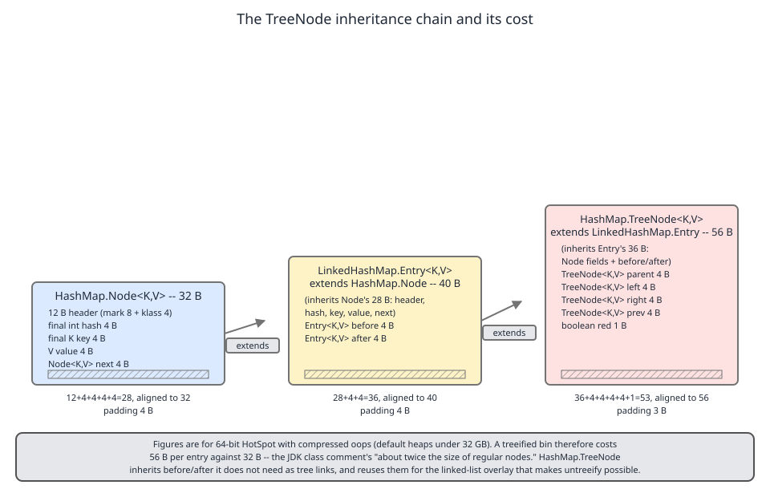
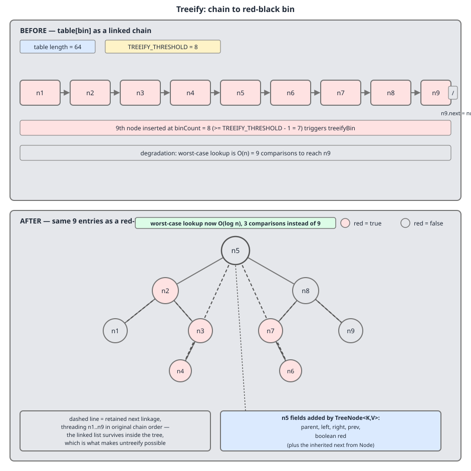

# 02 Java Collections — `HashMap` — INTERNALS (§3.6 `HashMap` source walk — `TreeNode`, the inheritance chain and the two-phase treeify)

**Target version: Java 21 LTS.** | [Index](../00-index.md)
Previous: [hash-map/03c-internals-c3-tree-split.md](03c-internals-c3-tree-split.md) · Next: [hash-map/04a-internals-d1-puttreeval-and-comparable.md](04a-internals-d1-puttreeval-and-comparable.md)

---

## 1. `TreeNode` and the inheritance chain

### 1.1 Mental model

`java.util.HashMap` — the base class — declares a nested class that **extends a class from its own subclass's file**. `HashMap.TreeNode` extends `LinkedHashMap.Entry`, which extends `HashMap.Node`. Read cold, that looks like a layering mistake: the parent depending upward on the child.

It is not a mistake. Hold this picture instead: there is exactly **one** tree-node type in the JDK, and it has to work inside two different maps. A plain `HashMap` bin and a `LinkedHashMap` bin both treeify by the same code path — `treeifyBin` lives in `HashMap` and `LinkedHashMap` does not override it. So the tree node has to be assignable into a `LinkedHashMap`'s access-order and insertion-order doubly-linked list *and* into a plain `HashMap`'s bare bin. The JDK's answer was to make the single `TreeNode` inherit from the **richest** node type, and let a plain `HashMap` carry two `before`/`after` references that will stay `null` forever.

The javadoc says so outright:

> Entry for Tree bins. Extends LinkedHashMap.Entry (which in turn extends Node) so can be used as extension of either regular or linked node.

— `java.base/java/util/HashMap.java`, JDK 21, lines 1962–1964. (leaf 3.6.30)

That is a deliberate 8-bytes-per-tree-node tax, paid once in the type system to avoid two parallel `TreeNode` hierarchies or a generic node parameter threaded through every method in both classes.

### 1.2 Why it exists

Before Java 8 there was no `TreeNode` at all. A `HashMap` bin was a singly-linked chain, full stop, and a bin with *n* colliding keys cost O(n) per lookup. Java 8 added the tree bin as a **worst-case bound**, and at that moment the JDK needed a node type with red-black links. The two candidate designs were:

| Design | Cost |
|---|---|
| Two `TreeNode` classes — one in `HashMap`, one in `LinkedHashMap` | Duplicated red-black balancing code (~400 lines) in two places, kept in sync by hand |
| One generic `TreeNode<N extends Node>` | Generic self-types propagate into `treeifyBin`, `split`, `find`, `putTreeVal`, `removeTreeNode`, and every `instanceof` site |
| One `TreeNode extends LinkedHashMap.Entry` | 8 wasted bytes per tree node in plain `HashMap` — and tree nodes are rare |

The third won because tree bins are supposed to almost never exist. Paying memory on a path that should not be taken is the cheapest of the three.

### 1.3 When it matters, and when it does not

It matters when you are reading the source and the chain confuses you, and when you are doing memory arithmetic on a map that is genuinely treeified (bad `hashCode`, adversarial keys, or a key type with a deliberately narrow hash). It does not matter for capacity planning of a healthy map: with a decent `hashCode` you will never allocate a single `TreeNode`, so the chain costs you nothing at runtime. If you need sorted iteration, the sibling that wins is `TreeMap` — a treeified `HashMap` bin does *not* give you ordered iteration (see §2.5), and never will.

### 1.4 The mechanism — the three declarations

```java
    static class Node<K,V> implements Map.Entry<K,V> {
        final int hash;
        final K key;
        V value;
        Node<K,V> next;
```
— `java.base/java/util/HashMap.java`, JDK 21, line 281. (leaf 3.6.30)

`hash` is the spread hash cached at insert so lookups never recompute `hashCode()`; it is `final`. `key` is `final` — a key's identity cannot change in place. `value` is mutable, which is what makes `put` on an existing key a field write rather than a node allocation. `next` is the singly-linked bin chain, and it is the field that survives treeification unchanged — remember it.

```java
    static class Entry<K,V> extends HashMap.Node<K,V> {
        Entry<K,V> before, after;
        Entry(int hash, K key, V value, Node<K,V> next) {
            super(hash, key, value, next);
        }
    }
```
— `java.base/java/util/LinkedHashMap.java`, JDK 21, line 205. (leaf 3.6.30)

`before`/`after` are the *map-wide* doubly-linked list that gives `LinkedHashMap` its iteration order. They are orthogonal to `next`: `next` links within one bin, `before`/`after` link across the whole map. The constructor does nothing but delegate — this class is pure field addition.

```java
    static final class TreeNode<K,V> extends LinkedHashMap.Entry<K,V> {
        TreeNode<K,V> parent;  // red-black tree links
        TreeNode<K,V> left;
        TreeNode<K,V> right;
        TreeNode<K,V> prev;    // needed to unlink next upon deletion
        boolean red;
        TreeNode(int hash, K key, V val, Node<K,V> next) {
            super(hash, key, val, next);
        }
```
— `java.base/java/util/HashMap.java`, JDK 21, line 1966. (leaf 3.6.30)

`parent`, `left`, `right`, `red` are the ordinary red-black tree fields. `prev` is the interesting one, and its comment tells you why it exists: the inherited `next` chain is still live in a tree bin, and unlinking a node from a **singly**-linked list needs its predecessor. Rather than walk the chain to find it, each tree node caches it. `prev` is 4 of the 24 extra bytes and it buys O(1) removal from the overlay list.

Note `static final`: `TreeNode` cannot be subclassed, so every `instanceof TreeNode` guard in `HashMap` (`getNode`, `putVal`, `removeNode`, `resize`) is an exact-class test the JIT can compile to a single klass-pointer compare and often fold away entirely after profiling.

**Insight:** a plain `HashMap`'s tree nodes carry `before` and `after` that are permanently `null`. Eight bytes per node of pure inheritance tax, levied on the map type that will never read them. The reflection dump in §2.6 prints `head.before = null` to make it concrete.

### 1.5 The picture

Draw the three classes to scale and the tax is obvious at a glance.



Look at the middle band: for a plain `HashMap`, that 8-byte `before`/`after` slice is dead weight sitting between the fields it actually uses.

### 1.6 `[NUM]` The byte arithmetic

Figures are 64-bit HotSpot with compressed oops — the default for any heap under 32 GB. Object header is 12 bytes (8-byte mark word + 4-byte compressed klass pointer); every reference is 4 bytes; objects align to 8.

| Class | Fields added | Raw size | Aligned | Padding |
|---|---|---|---|---|
| `HashMap.Node` | `hash` 4, `key` 4, `value` 4, `next` 4 | `12 + 4 + 4 + 4 + 4 = 28` | **32** | 4 |
| `LinkedHashMap.Entry` | `before` 4, `after` 4 | `28 + 8 = 36` | **40** | 4 |
| `HashMap.TreeNode` | `parent` 4, `left` 4, `right` 4, `prev` 4, `red` 1 | `36 + 17 = 53` | **56** | 3 |

So a treeified entry is **56 bytes against 32** — `56 − 32 = 24` extra bytes, `56 / 32 = 1.75`, a **75% surcharge** per entry.

The class comment rounds that up:

> Because TreeNodes are about twice the size of regular nodes, we use them only when bins contain enough nodes to warrant use (see TREEIFY_THRESHOLD).

— `java.base/java/util/HashMap.java`, JDK 21, lines 177–179. (leaf 3.6.30)

"About twice" is 1.75 in practice on compressed oops. Under `-XX:-UseCompressedOops` (heaps ≥ 32 GB) every reference becomes 8 bytes and the klass pointer becomes 8, so the ratio shifts — the ladder there is 48 / 64 / 96, and 96/48 is exactly the "twice" the comment claims. The comment is not wrong, it is written for the uncompressed case.

Worked totals:

- A single bin of 9 that treeifies: `9 × 24 = 216` extra bytes.
- A map under sustained collision attack holding 10,000 keys in one bin: `10_000 × 24 = 240 KB` extra.

240 KB is real but trivially cheaper than the O(n²) total lookup cost it prevents. **That is the whole tradeoff: 75% more memory on the affected bin, in exchange for a bounded O(log n) worst case instead of O(n).** For the adversarial version of that scenario see [04c-internals-d3-collision-dos.md](04c-internals-d3-collision-dos.md).

The full memory ladder for every collection node type — including why `boolean red` costs 0 net bytes because HotSpot's field-layout packer slots it into existing padding rather than forcing a round to 64 — lives in [../cost-and-memory/02-internals-memory-headers.md](../cost-and-memory/02-internals-memory-headers.md) (leaves 3.15.9–3.15.12).

### 1.7 Version check

The `TreeNode` declaration and its exact field list are **unchanged between JDK 8 and JDK 21**. JDK 8 has the identical five fields, identical comments, at `java/util/HashMap.java` line 1807; JDK 21 has them at line 1966. Nothing about treeification's node layout has moved in thirteen years.

**Interview:** *"Did HashMap's treeification change after Java 8?"* No. The tree bin was added in Java 8 and `TreeNode`'s structure, `TREEIFY_THRESHOLD` (8), `UNTREEIFY_THRESHOLD` (6) and `MIN_TREEIFY_CAPACITY` (64) are all byte-identical in Java 21.

### 1.8 Definition

> `HashMap.TreeNode` is a `static final` bin node that extends `LinkedHashMap.Entry` — so a single tree-node type serves both map classes — carrying red-black links (`parent`, `left`, `right`, `red`) and a `prev` back-pointer on top of the inherited `hash`/`key`/`value`/`next` and `before`/`after`, for 56 bytes against a plain `Node`'s 32.

---

## 2. The two-phase treeify and the surviving `next` overlay

### 2.1 Mental model

Treeification does not *replace* the linked list with a tree. It **overlays** a tree on top of a list that stays exactly where it was.

Picture the bin as a row of nine beads on a string. Phase one swaps each bead for a bigger bead — same string, same order, and now the string runs both ways. Phase two ties red-black rope between the beads. The string is never cut. When the bin later untreeifies, or splits during a resize, or is iterated, the code follows the string, not the rope.

### 2.2 Why it exists

The tree alone would be enough for lookup. It is not enough for everything else `HashMap` does to a bin:

- `resize()` must split a bin into a low half and a high half, in order. A tree traversal to do that would be O(n log n) and would lose relative order.
- `untreeify` must rebuild a plain chain when the bin shrinks below `UNTREEIFY_THRESHOLD`. Rebuilding order from a tree means an in-order walk that produces *hash* order, not the order the entries went in.
- `HashIterator` walks `tab[i]` then `e.next` until null. If tree bins had no `next`, iteration would need a whole second code path with an explicit stack.

Keeping the list alive makes all three fall out for free. The price is `prev` plus the bookkeeping to maintain both structures on every mutation.

### 2.3 The mechanism — phase one, in `treeifyBin`

```java
        else if ((e = tab[index = (n - 1) & hash]) != null) {
            TreeNode<K,V> hd = null, tl = null;
            do {
                TreeNode<K,V> p = replacementTreeNode(e, null);
                if (tl == null)
                    hd = p;
                else {
                    p.prev = tl;
                    tl.next = p;
                }
                tl = p;
            } while ((e = e.next) != null);
            if ((tab[index] = hd) != null)
                hd.treeify(tab);
        }
```
— `java.base/java/util/HashMap.java`, JDK 21, lines 765–779; the `MIN_TREEIFY_CAPACITY` guard above this branch is omitted here and is covered in [02b-internals-b2-bincount-and-treeifybin.md](02b-internals-b2-bincount-and-treeifybin.md) (leaf 3.6.22). (leaf 3.6.30)

Line by line. `e` starts at the bin head. `hd`/`tl` are the head and tail of the list being built. `replacementTreeNode(e, null)` allocates a `TreeNode` copying `e`'s hash, key and value — it is a virtual call, and `LinkedHashMap` overrides it to return a node already spliced into the map-wide `before`/`after` list. `tl == null` means this is the first node, so it becomes `hd`. Otherwise `p.prev = tl; tl.next = p` links the new node **both ways** to its predecessor. The loop advances along the *old* chain's `next`. When it ends, `tab[index] = hd` publishes the new all-`TreeNode` chain, and only then does `hd.treeify(tab)` run.

Note what phase one is: a straight linear rewrite of the bin into `TreeNode`s in the same order, with `prev` filled in. No comparison has happened yet. No tree exists yet.

### 2.4 The mechanism — phase two, in `treeify`

```java
        final void treeify(Node<K,V>[] tab) {
            TreeNode<K,V> root = null;
            for (TreeNode<K,V> x = this, next; x != null; x = next) {
                next = (TreeNode<K,V>)x.next;
                x.left = x.right = null;
                if (root == null) {
                    x.parent = null;
                    x.red = false;
                    root = x;
                }
```
— `java.base/java/util/HashMap.java`, JDK 21, lines 2071–2081; the body that follows descends the tree comparing hashes and calls `balanceInsertion`, and its comparison logic is leaf 3.6.31 in [04a-internals-d1-puttreeval-and-comparable.md](04a-internals-d1-puttreeval-and-comparable.md). (leaf 3.6.30)

The loop variable is `x`, and it advances by `x.next` — **the list built in phase one is the iteration order of the tree build**. Each node's `left`/`right` are cleared, the first node becomes a black root, and every subsequent node is inserted and rebalanced. Crucially `treeify` never touches `next` or `prev`. The list is read, not consumed.



Follow the dashed line in that figure: it visits all nine nodes and it is still there after the solid red-black edges appear. Both structures are live simultaneously.

### 2.5 The consequences

Because the list survives:

- `TreeNode.split` during a resize is a linear walk of `next`, not a tree traversal — leaf 3.6.29, [03c-internals-c3-tree-split.md](03c-internals-c3-tree-split.md).
- `untreeify` rebuilds a plain chain in one pass in the list's order.
- `HashIterator` needs no tree case at all. It walks `next` in a tree bin exactly as in a plain bin.

Which yields the observable fact almost nobody predicts: **iteration within a treeified bin is not sorted.** It is close to insertion order — with one wrinkle, see §2.7.

### 2.6 Runnable proof

One program proves all of it: that the head is really a `TreeNode`, that the tree is real, that the `next` and `prev` chains are intact, and that iteration follows the chain rather than the tree.

```java
import java.lang.reflect.Field;
import java.util.HashMap;
import java.util.Map;

public class TreeBinOverlay {

    /** Key whose hashCode is a fixed constant, so every instance lands in one bin. */
    record Colliding(int id) {
        @Override public int hashCode() { return 42; }
    }

    public static void main(String[] args) throws Exception {
        // Capacity 64 == MIN_TREEIFY_CAPACITY, so treeifyBin trees rather than resizes.
        // Load factor 10f keeps the table from resizing while we insert.
        Map<Colliding, Integer> map = new HashMap<>(64, 10f);
        for (int i = 0; i < 9; i++) {
            map.put(new Colliding(i), i);
        }

        Field tableField = HashMap.class.getDeclaredField("table");
        tableField.setAccessible(true);
        Object[] table = (Object[]) tableField.get(map);
        System.out.println("table.length          = " + table.length);

        int index = (table.length - 1) & spread(42);
        Object head = table[index];
        System.out.println("bin index             = " + index);
        System.out.println("bin head runtime type = " + head.getClass().getName());

        Class<?> treeNode = head.getClass();
        Class<?> node = treeNode.getSuperclass().getSuperclass(); // TreeNode -> LHM.Entry -> Node
        System.out.println("superclass chain      = " + treeNode.getSimpleName()
                + " -> " + treeNode.getSuperclass().getName()
                + " -> " + node.getName());

        Field left   = treeNode.getDeclaredField("left");
        Field right  = treeNode.getDeclaredField("right");
        Field parent = treeNode.getDeclaredField("parent");
        Field red    = treeNode.getDeclaredField("red");
        Field prev   = treeNode.getDeclaredField("prev");
        Field next   = node.getDeclaredField("next");
        Field key    = node.getDeclaredField("key");
        Field before = treeNode.getSuperclass().getDeclaredField("before");
        for (Field f : new Field[]{left, right, parent, red, prev, next, key, before}) {
            f.setAccessible(true);
        }

        System.out.println("head.parent           = " + parent.get(head));
        System.out.println("head.red              = " + red.get(head));
        System.out.println("head.left  key        = " + keyOf(left.get(head), key));
        System.out.println("head.right key        = " + keyOf(right.get(head), key));
        System.out.println("head.before           = " + before.get(head)
                + "   (LinkedHashMap field, unused by plain HashMap)");

        System.out.print("walk of `next` chain  = ");
        StringBuilder sb = new StringBuilder();
        for (Object n = head; n != null; n = next.get(n)) {
            sb.append(((Colliding) key.get(n)).id()).append(' ');
        }
        System.out.println(sb.toString().trim());

        System.out.print("walk back via `prev`  = ");
        Object tail = head;
        while (next.get(tail) != null) tail = next.get(tail);
        StringBuilder back = new StringBuilder();
        for (Object n = tail; n != null; n = prev.get(n)) {
            back.append(((Colliding) key.get(n)).id()).append(' ');
        }
        System.out.println(back.toString().trim());

        System.out.print("keySet() iteration    = ");
        map.keySet().forEach(k -> System.out.print(k.id() + " "));
        System.out.println();
    }

    private static String keyOf(Object n, Field key) throws Exception {
        return n == null ? "null" : String.valueOf(((Colliding) key.get(n)).id());
    }

    /** Reproduction of HashMap.hash(Object). */
    private static int spread(int h) {
        return h ^ (h >>> 16);
    }
}
```

Run with `java --add-opens java.base/java.util=ALL-UNNAMED TreeBinOverlay` on JDK 21. Real output:

```
table.length          = 64
bin index             = 42
bin head runtime type = java.util.HashMap$TreeNode
superclass chain      = TreeNode -> java.util.LinkedHashMap$Entry -> java.util.HashMap$Node
head.parent           = null
head.red              = false
head.left  key        = 6
head.right key        = 0
head.before           = null   (LinkedHashMap field, unused by plain HashMap)
walk of `next` chain  = 3 0 1 2 4 5 6 7 8
walk back via `prev`  = 8 7 6 5 4 2 1 0 3
keySet() iteration    = 3 0 1 2 4 5 6 7 8
```

Read that output carefully. The head is a `TreeNode` with `parent == null` and `red == false` — it is the black root, and it has both children, so the tree is genuinely built. `before` is `null`, the inheritance tax made visible. The `next` walk reaches all nine keys and `keySet()` reproduces it exactly, so iteration follows the list. And the `prev` walk from the tail reverses it perfectly, so the doubly-linked overlay is consistent in both directions.

### 2.7 The gotcha — the order is *not* quite insertion order

The chain reads `3 0 1 2 4 5 6 7 8`, not `0 1 2 3 4 5 6 7 8`. Keys `0`–`8` were inserted in order, so what moved `3` to the front?

`moveRootToFront`. The bin head slot `tab[index]` must hold the tree **root**, because every tree operation starts by reading `tab[index]` and expecting a root. `treeify`'s balancing chose key `3` as the final root, and `moveRootToFront` then spliced it out of the middle of the list and relinked it at the head:

```java
        static <K,V> void moveRootToFront(Node<K,V>[] tab, TreeNode<K,V> root) {
            int n;
            if (root != null && tab != null && (n = tab.length) > 0) {
                int index = (n - 1) & root.hash;
                TreeNode<K,V> first = (TreeNode<K,V>)tab[index];
                if (root != first) {
                    Node<K,V> rn;
                    tab[index] = root;
                    TreeNode<K,V> rp = root.prev;
                    if ((rn = root.next) != null)
                        ((TreeNode<K,V>)rn).prev = rp;
                    if (rp != null)
                        rp.next = rn;
                    if (first != null)
                        first.prev = root;
                    root.next = first;
                    root.prev = null;
                }
                assert checkInvariants(root);
            }
        }
```
— `java.base/java/util/HashMap.java`, JDK 21, lines 1990–2010. (leaf 3.6.30)

It is a textbook doubly-linked-list splice: unhook `root` from between `rp` and `rn`, then push it in front of `first`. One method keeping **two** structures consistent — it fixes the table slot for the tree and repairs `prev`/`next` for the list in the same six statements. Every rebalancing that changes the root triggers it, so the list order drifts by exactly the root promotions that have happened.

So the accurate statement is: **a treeified bin iterates in insertion order with the current root promoted to the front — never in tree/sorted order.** The relative order of everything else is preserved.

`root()` is the companion:

```java
        final TreeNode<K,V> root() {
            for (TreeNode<K,V> r = this, p;;) {
                if ((p = r.parent) == null)
                    return r;
                r = p;
            }
        }
```
— `java.base/java/util/HashMap.java`, JDK 21, lines 1979–1985. (leaf 3.6.30)

Six lines walking `parent` upward until it is `null`. It exists because the "root is at the head" invariant has one documented hole:

> The root of a tree bin is normally its first node. However, sometimes (currently only upon Iterator.remove), the root might be elsewhere, but can be recovered following parent links (method TreeNode.root()).

— `java.base/java/util/HashMap.java`, JDK 21, lines 202–205. (leaf 3.6.30)

That is the whole explanation for the `(parent != null) ? root() : this` guard readers hit in `getTreeNode`: cheap check for the normal case, `root()` walk for the `Iterator.remove` case.

### 2.8 Definition

> Treeification is two phases: `treeifyBin` linearly converts the bin's `Node`s into a doubly-linked chain of `TreeNode`s in place, then `treeify` builds a red-black tree **over** that chain without consuming it — so a tree bin is permanently both a tree and a list, which is why split, untreeify and iteration all remain simple linear walks of `next`.

---

## Pitfalls

### Believing treeification makes `HashMap` faster

**Wrong**

```java
// "Lower the load factor to force more treeification and get O(log n) buckets."
Map<String, Integer> m = new HashMap<>(1 << 20, 0.1f);
```

A lower load factor makes the table *bigger*, which spreads keys further apart and makes treeification **less** likely, not more. The map now wastes 8 MB of table array and treeifies exactly as often as before: never, assuming `String.hashCode` is doing its job. There is no JVM flag to tune treeification either — `TREEIFY_THRESHOLD`, `UNTREEIFY_THRESHOLD` and `MIN_TREEIFY_CAPACITY` are `static final` fields with no system-property override.

**Right**

```java
// Size the map for the entries you have; fix the hashCode if lookups are slow.
Map<String, Integer> m = new HashMap<>(expectedSize / 3 * 4 + 1);
```

Treeification is **damage control**, not an optimisation. It costs 75% more memory per node (56 vs 32 bytes) and a slower insert path — every `putTreeVal` does comparisons and possibly a rebalance where a chain did a pointer append. What it buys is a bounded O(log n) worst case when the `hashCode` is bad or adversarial. On a healthy map, bins are 0, 1 or 2 entries deep and a tree is never built. If your `HashMap` is slow, the fix is the `hashCode`, not the load factor.

**Why people believe it:** "Java 8 improved HashMap to O(log n) buckets" is the headline everyone remembers from the Java 8 release notes, and it sounds like a feature you should try to get. It is a floor under pathological behaviour, not a ceiling raised on normal behaviour.

### Expecting a treeified bin to iterate in sorted order

**Wrong**

```java
Map<Colliding, Integer> map = new HashMap<>(64, 10f);
for (int i = 8; i >= 0; i--) map.put(new Colliding(i), i);
// "The bin is a red-black tree now, so this must come out ordered."
map.keySet().forEach(k -> System.out.print(k.id() + " "));
```

It does not. The real output is `5 8 7 6 4 3 2 1 0` — reverse-insertion order (`8 7 6 5 4 3 2 1 0`) with the root, key `5`, promoted to the front by `moveRootToFront`. Iteration walks `next`; the tree's ordering is invisible to `HashIterator`.

**Right**

```java
// If you need order, use the collection that guarantees it.
Map<Colliding, Integer> map = new TreeMap<>(Comparator.comparingInt(Colliding::id));
```

`TreeMap` is ordered by contract. A treeified `HashMap` bin is ordered only *internally*, only by spread hash with a `Comparable`/identity tiebreak, and only within one bin out of `table.length` — none of which is exposed to iteration.

**Why people believe it:** "the bucket becomes a red-black tree" and "`TreeMap` is a red-black tree" use the same words, so people transfer `TreeMap`'s ordering guarantee onto the bin. The data structure is the same; the contract is not.

---

## Cheat sheet

| Item | Value |
|---|---|
| Chain | `HashMap.TreeNode` → `LinkedHashMap.Entry` → `HashMap.Node` → `Map.Entry` |
| Why the odd chain | One tree-node type usable by both `HashMap` and `LinkedHashMap` |
| `Node` fields | `final int hash`, `final K key`, `V value`, `Node next` |
| `LinkedHashMap.Entry` adds | `before`, `after` (map-wide order list) |
| `TreeNode` adds | `parent`, `left`, `right`, `prev`, `boolean red` |
| Sizes (compressed oops) | `Node` 32 B · `Entry` 40 B · `TreeNode` 56 B |
| Arithmetic | `12+4+4+4+4=28→32` · `28+8=36→40` · `36+17=53→56` |
| Surcharge | `56−32 = 24 B/entry`; `56/32 = 1.75` = **75%** |
| Bin of 9 treeified | `9 × 24 = 216 B` extra |
| 10,000 keys, one bin | `10_000 × 24 = 240 KB` extra |
| Plain `HashMap` waste | `before` + `after` = 8 B/tree-node, always `null` |
| Treeify phase 1 | `treeifyBin` — linear `Node`→`TreeNode` rewrite, sets `prev`/`next` |
| Treeify phase 2 | `hd.treeify(tab)` — red-black build, walks `next`, never clears it |
| `next` after treeify | Still live; bin is tree **and** doubly-linked list |
| Bin iteration order | Insertion order, root promoted to front by `moveRootToFront` — never sorted |
| Why `prev` exists | O(1) unlink from the singly-linked `next` overlay on removal |
| `root()` | Walks `parent` up; needed because `Iterator.remove` can leave root off-head |
| `moveRootToFront` | Restores `tab[index] == root` and repairs `prev`/`next` in one splice |
| Class modifier | `static final` — no subclass, `instanceof TreeNode` is monomorphic |
| JDK 8 vs 21 | Identical declaration; JDK 8 line 1807, JDK 21 line 1966 |

---

## Self-test

**Q1.** Why does `java.util.HashMap` — the superclass — declare a nested class that extends `LinkedHashMap.Entry`, a class in its subclass?

<details><summary>Answer</summary>

Because `treeifyBin` lives in `HashMap` and is not overridden by `LinkedHashMap`, so a single `TreeNode` type must be valid in both maps. Making it extend the richer `LinkedHashMap.Entry` means one class serves both, at the cost of 8 dead bytes (`before`/`after`) per tree node in a plain `HashMap`. The alternatives were two duplicated red-black hierarchies or a self-typed generic threaded through every tree method. The javadoc at HashMap.java:1960 states this reason explicitly.

</details>

**Q2.** Derive the size of a `HashMap.TreeNode` on 64-bit HotSpot with compressed oops, showing each step.

<details><summary>Answer</summary>

Header 12 (8 mark + 4 klass). `Node` adds `hash` 4 + `key` 4 + `value` 4 + `next` 4 = 28, aligned to **32**. `LinkedHashMap.Entry` adds `before` 4 + `after` 4 → 36, aligned to **40**. `TreeNode` adds `parent` 4 + `left` 4 + `right` 4 + `prev` 4 + `red` 1 = 17 → 53, aligned to **56**. So 56 vs 32: +24 bytes, a 75% surcharge. The class comment says "about twice", which is exact only without compressed oops (48/64/96).

</details>

**Q3.** After a bin treeifies, what happens to the `next` pointers of the nodes in it?

<details><summary>Answer</summary>

Nothing — they stay live. `treeifyBin` builds a doubly-linked chain of `TreeNode`s (setting both `next` and the new `prev`) *before* calling `treeify`, and `treeify` only reads `next` to drive its loop; it never nulls it. A tree bin is simultaneously a red-black tree and a doubly-linked list. That is why `split`, `untreeify` and `HashIterator` can all be plain linear walks.

</details>

**Q4.** Why does `TreeNode` need `prev` when it already inherits `next`?

<details><summary>Answer</summary>

The inherited `next` is singly-linked, and removing a node from a singly-linked list requires its predecessor. Without `prev` that means an O(n) walk from the bin head on every tree removal. `prev` caches it, making the unlink O(1). The source comment says so: `// needed to unlink next upon deletion`. It costs 4 of the 24 extra bytes.

</details>

**Q5.** You treeify a bin by inserting keys 0 through 8 in order, all with the same hash. Iteration prints `3 0 1 2 4 5 6 7 8`. Explain the `3`.

<details><summary>Answer</summary>

Red-black balancing during `treeify` made key `3` the root, and `moveRootToFront` then spliced it out of the middle of the overlay list and relinked it at the head, because `tab[index]` must hold the tree root. Relative order of the other eight is untouched. So bin iteration is insertion order with the current root promoted to the front — never tree/sorted order.

</details>

**Q6.** `getTreeNode` starts with `(parent != null) ? root() : this`. Why the check?

<details><summary>Answer</summary>

Normally the bin head *is* the root (`moveRootToFront` guarantees it), so `parent == null` and the guard costs one field read. But the class comment at HashMap.java:202–205 documents one hole: after `Iterator.remove` the root can be somewhere other than the head. `root()` recovers it by walking `parent` upward until it hits `null`.

</details>

**Q7.** Does lowering the load factor make treeification more likely?

<details><summary>Answer</summary>

No — the opposite. A lower load factor triggers resizing earlier, so the table is larger and keys are spread across more bins, making any single bin less likely to reach `TREEIFY_THRESHOLD`. Treeification is driven by collisions in one bin, which is a `hashCode` quality problem, not a load-factor problem. There is also no JVM flag to tune the thresholds; they are `static final`.

</details>

**Q8.** Did the treeification mechanism change between Java 8 and Java 21?

<details><summary>Answer</summary>

No. `TreeNode`'s declaration and its five added fields are byte-identical (JDK 8 HashMap.java:1807, JDK 21 HashMap.java:1966), as are `TREEIFY_THRESHOLD` = 8, `UNTREEIFY_THRESHOLD` = 6 and `MIN_TREEIFY_CAPACITY` = 64. Treeification was introduced in Java 8 and has not been restructured since.

</details>

**Q9.** Why is `TreeNode` declared `static final`, and what does that buy?

<details><summary>Answer</summary>

`static` because it holds no reference to an enclosing map instance (the map is passed in as a parameter where needed) — an inner class would add a hidden 4-byte field to every node. `final` because no subclass exists, so every `instanceof TreeNode` in `getNode`, `putVal`, `removeNode` and `resize` is an exact-class test the JIT compiles to a single klass-pointer compare and can often fold away after profiling.

</details>

---

**Leaves covered:** 3.6.30 (1 leaf)
**Leaves deferred:** none — 3.6.31 and 3.6.32 are in [04a-internals-d1-puttreeval-and-comparable.md](04a-internals-d1-puttreeval-and-comparable.md)
**Diagrams included:** D-91, D-96
**Target version:** Java 21 LTS
**Lines:** 537
