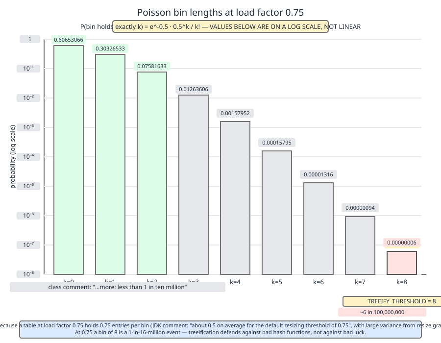
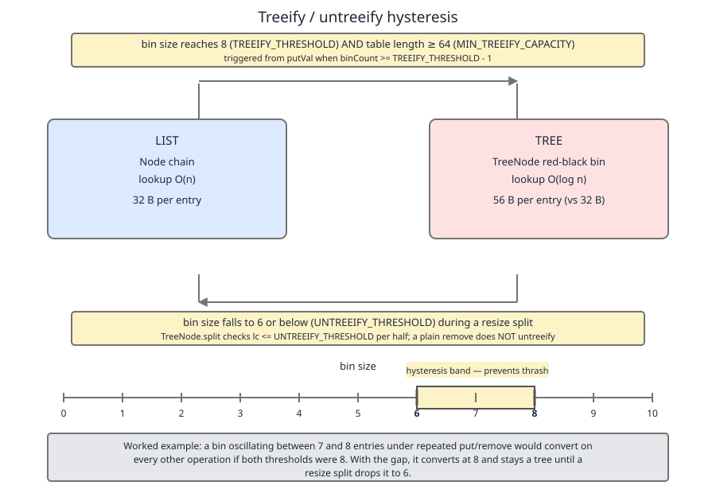

# 02 Java Collections — `HashMap` — INTERNALS (§3.6 `HashMap` source walk — the Poisson argument for 0.75 and 8, and the hysteresis at 6)

**Target version: Java 21 LTS.** | [Index](../00-index.md)
Previous: [hash-map/04a-internals-d1-puttreeval-and-comparable.md](04a-internals-d1-puttreeval-and-comparable.md) · Next: [hash-map/04c-internals-d3-collision-dos.md](04c-internals-d3-collision-dos.md)

Two magic numbers sit at the top of `HashMap.java`: `0.75f` and `8`, with `6` a few lines below them. Every `HashMap` article repeats them; almost none derive them. This file derives both, from the probability model the JDK authors actually wrote into the class comment, and then shows why the third number is 6 rather than 8.

---

## Load factor 0.75 and `TREEIFY_THRESHOLD = 8` (leaf 3.6.33)

### Mental model first

Picture throwing darts at a wall of numbered pigeonholes, blindfolded. You throw *n* darts at *m* holes. Most holes get zero or one dart; a few get two; the chance any single hole gets eight is fantastically small — and it stays small even as you scale *n* and *m* together, because what governs the shape of the pile-up is not the raw counts but their **ratio**, `λ = n/m`. That ratio is exactly what `HashMap` calls the load factor. The whole Poisson argument is the arithmetic of the darts.

The critical word is *blindfolded*. The model assumes throws land independently and uniformly. Hash codes chosen by an adversary, or by a careless `hashCode()`, are not darts — they are a hand placing every ball in the same hole. Hold that thought; it is the pitfall at the end of this section.

### Why the number exists at all

Before Java 8, a `HashMap` bin was a linked list, full stop. A bin of *k* entries cost *k* comparisons to search, and there was no ceiling. Java 8 added the red-black tree fallback so that a degenerate bin degrades to O(log k) rather than O(k). But `TreeNode` is roughly twice the size of `Node` — it carries `parent`, `left`, `right`, `prev` and a `red` flag on top of the four `Node` fields — so you do not want tree bins in the common case. The authors needed a threshold high enough that a well-hashed map *never* reaches it, and low enough that a pathological bin gets rescued before it hurts. The Poisson table is the calculation that fixes that number.

### When this reasoning applies, and when it does not

| Situation | Does the Poisson table apply? | What governs instead |
|---|---|---|
| Well-distributed `hashCode()`, non-adversarial keys | Yes — treeify effectively never fires | The table below |
| `hashCode()` returning a constant, or a low-entropy field | No — every key lands in one bin | Chain length grows linearly; treeify fires immediately |
| Attacker-chosen keys (HTTP params, JSON keys) | No — the uniformity premise is deliberately violated | See [`04c-internals-d3-collision-dos.md`](04c-internals-d3-collision-dos.md) |
| Table smaller than `MIN_TREEIFY_CAPACITY = 64` | Irrelevant — treeify is suppressed, the table resizes instead | Leaf 3.6.21, [`02b-internals-b2-bincount-and-treeifybin.md`](02b-internals-b2-bincount-and-treeifybin.md) |

### How it works — the source `[SOURCE]`

> Because TreeNodes are about twice the size of regular nodes, we
> use them only when bins contain enough nodes to warrant use
> (see TREEIFY_THRESHOLD). And when they become too small (due to
> removal or resizing) they are converted back to plain bins.  In
> usages with well-distributed user hashCodes, tree bins are
> rarely used.  Ideally, under random hashCodes, the frequency of
> nodes in bins follows a Poisson distribution
> (http://en.wikipedia.org/wiki/Poisson_distribution) with a
> parameter of about 0.5 on average for the default resizing
> threshold of 0.75, although with a large variance because of
> resizing granularity. Ignoring variance, the expected
> occurrences of list size k are (exp(-0.5) * pow(0.5, k) /
> factorial(k)). The first values are:
>
> 0:    0.60653066
> 1:    0.30326533
> 2:    0.07581633
> 3:    0.01263606
> 4:    0.00157952
> 5:    0.00015795
> 6:    0.00001316
> 7:    0.00000094
> 8:    0.00000006
> more: less than 1 in ten million

— `java.base/java/util/HashMap.java`, JDK 21, lines 177–200, class comment. (leaf 3.6.33)

The derivation behind that formula `[PROVE]`:

1. Throw *n* keys independently and uniformly into *m* bins. For one fixed bin, each key is a Bernoulli trial with success probability `1/m`, so the bin's occupancy is `Binomial(n, 1/m)`.
2. As `m → ∞` with `n/m` held at λ, `Binomial(n, 1/m) → Poisson(λ)`. The Poisson limit is the standard rare-events approximation and is already excellent at `m = 16`.
3. So `P(bin holds exactly k) = e^(-λ) · λ^k / k!`. Substituting `λ = 0.5` gives the class comment's expression verbatim.

**Insight — λ = 0.5 is *not* the load factor.** The comment says "about 0.5 on average for the default resizing threshold of 0.75", and those are two different numbers. The six words that explain the gap are *"although with a large variance because of resizing granularity"*. Work it: a `HashMap` doubles capacity when `size` exceeds `capacity × 0.75`. The instant after doubling, the occupancy has halved to `0.75 / 2 = 0.375`; it then climbs back to 0.75 before the next resize. Time-averaged over that sawtooth, occupancy is roughly `(0.375 + 0.75) / 2 = 0.5625`, which the comment rounds down to 0.5. **λ = 0.5 is the time-averaged load; the peak load, immediately before a resize, is 0.75.** The published table therefore describes the *typical* moment, not the *worst* moment, and understates bin lengths at the worst moment by roughly a factor of 20 at k = 8 (see the computed numbers below).



Read the chart on its log axis: each additional element in a bin costs roughly a factor of ten in probability once `k > λ`, and the k = 8 bar — the treeify trigger — sits five orders of magnitude below the k = 3 bar. That cliff is the whole argument.

### Reproducing the table by computing it

```java
public class Poisson {
    static double factorial(int k) {
        double f = 1.0;
        for (int i = 2; i <= k; i++) f *= i;
        return f;
    }

    static double p(double lambda, int k) {
        return Math.exp(-lambda) * Math.pow(lambda, k) / factorial(k);
    }

    /** P(X >= t), computed as 1 minus the head; stable for the small t we care about. */
    static double tail(double lambda, int t) {
        double head = 0.0;
        for (int k = 0; k < t; k++) head += p(lambda, k);
        return 1.0 - head;
    }

    public static void main(String[] args) {
        System.out.println("lambda = 0.5, the class-comment table:");
        for (int k = 0; k <= 10; k++)
            System.out.printf("%2d:    %.8f%n", k, p(0.5, k));
        System.out.printf("P(X >= 8) at lambda=0.5  = %.10e%n", tail(0.5, 8));
        System.out.printf("P(X >= 8) at lambda=0.75 = %.10e%n", tail(0.75, 8));
        System.out.printf("p(k=8)    at lambda=0.5  = %.10e%n", p(0.5, 8));
        System.out.printf("p(k=8)    at lambda=0.75 = %.10e%n", p(0.75, 8));
        System.out.printf("bins of >=8 in 1e6 bins, lambda=0.5  : %.6f%n", 1_000_000 * tail(0.5, 8));
        System.out.printf("bins of >=8 in 1e6 bins, lambda=0.75 : %.6f%n", 1_000_000 * tail(0.75, 8));

        System.out.printf("%n%-6s %-6s %-18s %-14s%n", "lf", "lambda", "P(len >= 8)", "slots/entry");
        for (double lf : new double[] {0.5, 0.75, 1.0, 2.0})
            System.out.printf("%-6.2f %-6.2f %-18.10e %-14.2f%n", lf, lf, tail(lf, 8), 1.0 / lf);
    }
}
```

Real output, JDK 21.0.7+8-LTS-245:

```
lambda = 0.5, the class-comment table:
 0:    0.60653066
 1:    0.30326533
 2:    0.07581633
 3:    0.01263606
 4:    0.00157951
 5:    0.00015795
 6:    0.00001316
 7:    0.00000094
 8:    0.00000006
 9:    0.00000000
10:    0.00000000
P(X >= 8) at lambda=0.5  = 6.2196908623e-08
P(X >= 8) at lambda=0.75 = 1.2784691462e-06
p(k=8)    at lambda=0.5  = 5.8761418390e-08
p(k=8)    at lambda=0.75 = 1.1728668790e-06
bins of >=8 in 1e6 bins, lambda=0.5  : 0.062197
bins of >=8 in 1e6 bins, lambda=0.75 : 1.278469

lf     lambda P(len >= 8)        slots/entry
0.50   0.50   6.2196908623e-08   2.00
0.75   0.75   1.2784691462e-06   1.33
1.00   1.00   1.0249196675e-05   1.00
2.00   2.00   1.0967189679e-03   0.50
```

Every published digit matches **except k = 4**: the comment prints `0.00157952`, the true value is `0.0015795069…`, which rounds to `0.00157951`. The comment is off by one in its last digit — a transcription slip that has survived unchanged since Java 8. The remaining nine rows are exact.

### `[NUM]` — what `6e-8` actually means

- `p(8) = 5.8761e-8` at λ = 0.5, i.e. about **6 in 100,000,000** — the figure marked on the diagram.
- Tail: `P(X ≥ 8) = 6.2197e-8`.
- In a table of **1,000,000 bins** — a `HashMap` holding ~500,000 entries at λ = 0.5 — the expected number of bins long enough to treeify is `1_000_000 × 6.2197e-8 = 0.0622`. **Fewer than one bin in fifteen such maps.**
- At the peak of the sawtooth, λ = 0.75, the same table expects `1_000_000 × 1.2785e-6 = 1.28` treeify-eligible bins. Twenty times more, still about one bin.

So on a well-hashed map, treeification **effectively never fires**. The red-black tree code — some 700 lines of `HashMap.java` — exists almost entirely for keys whose hashes are not random at all.

### Why 0.75, and not something else

| Load factor | λ | `P(bin length ≥ 8)` | Array slots per entry | Verdict |
|---|---|---|---|---|
| 0.50 | 0.50 | 6.220e-8 | 2.00 | Chains shortest, but doubles the array; resizes 1.5× more often for the same entry count |
| **0.75** (default) | 0.75 | 1.278e-6 | 1.33 | Collisions still negligible; 33 % slot overhead. The chosen knee |
| 1.00 | 1.00 | 1.025e-5 | 1.00 | No wasted slots, but ~8× more long bins and average chain length rises noticeably |
| 2.00 | 2.00 | 1.097e-3 | 0.50 | Roughly 1 bin in 900 hits 8 — treeification becomes a routine event, not an emergency |

Two costs pull in opposite directions and 0.75 is where the curves cross usefully: below it you buy shorter chains with array memory and extra resizes, above it you buy memory with longer chains and a probability of long bins that climbs about an order of magnitude per 0.25 of load. Note also that the resize cost per entry is amortised O(1) at every load factor — what changes is the *constant*, so the array-memory axis is the one that actually moves. Choosing a non-default load factor in real code is leaf 3.6.40 in a later file; the arithmetic above is the input to that decision, not the advice.

### Why 8, specifically

Two constraints meet at 8, and only one of them is statistical.

**The statistical constraint (from above):** at λ = 0.5, `P(≥ 8)` is `6e-8`. Any threshold at or above 8 is *free* on a healthy map — the code path is never entered, so it costs nothing but the `TreeNode` class definition. At 7 it would already be 15× more likely to fire; at 6, 200× more.

**The structural constraint (from the source):**

```java
    /**
     * The bin count threshold for using a tree rather than list for a
     * bin.  Bins are converted to trees when adding an element to a
     * bin with at least this many nodes. The value must be greater
     * than 2 and should be at least 8 to mesh with assumptions in
     * tree removal about conversion back to plain bins upon
     * shrinkage.
     */
    static final int TREEIFY_THRESHOLD = 8;
```

— `java.base/java/util/HashMap.java`, JDK 21, lines 252–260. (leaf 3.6.33)

"Must be greater than 2" is a red-black-tree correctness floor. "Should be at least 8 to mesh with assumptions in tree removal about conversion back to plain bins upon shrinkage" is the hysteresis requirement — the threshold must leave room *below* it for `UNTREEIFY_THRESHOLD`, which is the next section. So 8 is jointly the smallest value that is statistically free and structurally large enough.

**And the honest cost side.** A red-black tree of 8 elements has height 3 or 4; a linear walk of 8 nodes costs 4.5 comparisons on average, 8 in the worst case. The asymptotic win *at exactly 8* is essentially nil, and the tree pays for it with double-size nodes, pointer chasing across a worse cache layout, and a `compareTo`/identity-hash tie-break per level. Treeification pays off at a bin of 100 or 10,000, not at 8. **8 is the trigger point, not the point at which trees start helping** — it is a tripwire placed where it can never be crossed by accident, so that anything crossing it is by definition abnormal and worth the conversion.

**Pitfall:** the wrong belief is *"the Poisson table proves `HashMap` lookups are O(1)"*. It proves nothing of the sort. The table's own premise is the phrase **"under random hashCodes"**, and that premise is the entire load-bearing assumption. A `hashCode()` that returns a constant, a key type with 12 bits of real entropy, or an attacker choosing keys to collide, all violate it completely — and the model then says nothing at all. The symptom is a service that benchmarks beautifully on synthetic data and collapses on adversarial input. See [`04c-internals-d3-collision-dos.md`](04c-internals-d3-collision-dos.md) for what that collapse looks like in production.

> **Definition.** `TREEIFY_THRESHOLD = 8` is the bin length at which a `HashMap` bin converts from a linked list to a red-black tree, chosen because under the Poisson model with λ ≈ 0.5 implied by the 0.75 load factor a bin reaches 8 with probability ~6 × 10⁻⁸, making the conversion free on well-hashed data and reserved for pathological hashing.

---

## `UNTREEIFY_THRESHOLD = 6` — the hysteresis band (leaf 3.6.34)

### Mental model first

A house thermostat set to a single temperature would click the boiler on and off every few seconds as the room drifted across that one line. Real thermostats use a **deadband**: heat on below 19 °C, off above 21 °C, and nothing happens in between. `HashMap` does exactly this. Tree up at 8, list down at 6, and a bin sitting between them keeps whatever representation it already has. The 6-to-8 band is the deadband, and its only job is to make the state depend on history as well as on the current size.

### Why it exists

Both conversions are O(n) *and allocation-heavy*. `treeify` walks the list and calls `replacementTreeNode` for each element; `untreeify` walks the tree and calls `replacementNode` for each element. Neither mutates in place — each builds a whole fresh set of node objects and relinks them. With a single shared threshold, a bin oscillating across that one value pays a full O(n) rebuild on **every other operation**, and the map's cost model silently changes from amortised O(1) to O(n) per op.

### The source, both sides `[SOURCE]`

Treeify, from `putVal`:

```java
                for (int binCount = 0; ; ++binCount) {
                    if ((e = p.next) == null) {
                        p.next = newNode(hash, key, value, null);
                        if (binCount >= TREEIFY_THRESHOLD - 1) // -1 for 1st
                            treeifyBin(tab, hash);
                        break;
                    }
```

— `java.base/java/util/HashMap.java`, JDK 21, lines 646–651, inside `putVal`. (leaf 3.6.34)

Untreeify, from `TreeNode.split`:

```java
            if (loHead != null) {
                if (lc <= UNTREEIFY_THRESHOLD)
                    tab[index] = loHead.untreeify(map);
                else {
                    tab[index] = loHead;
                    if (hiHead != null) // (else is already treeified)
                        loHead.treeify(tab);
                }
            }
```

— `java.base/java/util/HashMap.java`, JDK 21, lines 2324–2331, inside `TreeNode.split`; the `hiHead` half at lines 2333–2340 is the mirror image. (leaf 3.6.34)

Note the asymmetric operators. Going up it is `binCount >= TREEIFY_THRESHOLD - 1`, and `binCount` is zero-based over the *existing* nodes, so the bin actually holds 9 nodes counting the new one when `treeifyBin` runs — that off-by-one is leaf 3.6.22 in [`02b-internals-b2-bincount-and-treeifybin.md`](02b-internals-b2-bincount-and-treeifybin.md). Going down it is `lc <= UNTREEIFY_THRESHOLD`, a plain count of 6 or fewer. Up on `>=`, down on `<=`, and a two-wide gap between them.



The shaded band is the point of the picture: a bin whose size is 6, 7 or 8 has no determined representation. It is a list if it grew into the band from below and a tree if it shrank into the band from above.

### `[PROVE]` — costing the single-threshold world

Charge each conversion `size` node allocations, since that is literally what `treeify`/`untreeify` do, and run two oscillating workloads through both threshold pairs.

```java
public class Hysteresis {
    /**
     * Model one bin as a size counter plus a representation flag.
     * treeifyAt:   convert LIST -> TREE when size reaches this.
     * untreeifyAt: convert TREE -> LIST when size falls to this or below.
     * Each conversion is O(size) and allocates `size` fresh node objects,
     * so we charge `size` node allocations per flip.
     */
    static long run(int treeifyAt, int untreeifyAt, int[] sizes) {
        boolean tree = false;
        long allocatedNodes = 0;
        for (int size : sizes) {
            if (!tree && size >= treeifyAt) {
                tree = true;
                allocatedNodes += size;
            } else if (tree && size <= untreeifyAt) {
                tree = false;
                allocatedNodes += size;
            }
        }
        return allocatedNodes;
    }

    public static void main(String[] args) {
        // Amplitude 1: the bin oscillates 7 <-> 8, one element at a time, 1000 times.
        int[] osc1 = new int[2000];
        for (int i = 0; i < osc1.length; i++) osc1[i] = (i % 2 == 0) ? 8 : 7;

        // Amplitude 2: the bin sweeps 6 -> 7 -> 8 -> 7 -> 6, repeatedly.
        int[] osc2 = new int[2001];
        int s = 6, dir = 1;
        for (int i = 0; i < osc2.length; i++) {
            osc2[i] = s;
            s += dir;
            if (s == 8 || s == 6) dir = -dir;
        }

        System.out.println("workload            single-threshold(8,7)  JDK(8,6)");
        System.out.printf("amplitude-1 (7<->8)  %-22d %d%n", run(8, 7, osc1), run(8, 6, osc1));
        System.out.printf("amplitude-2 (6..8)   %-22d %d%n", run(8, 7, osc2), run(8, 6, osc2));
    }
}
```

Real output, JDK 21.0.7+8-LTS-245:

```
workload            single-threshold(8,7)  JDK(8,6)
amplitude-1 (7<->8)  15000                  8
amplitude-2 (6..8)   7500                   7000
```

`[NUM]` The amplitude-1 row is the whole argument. With thresholds one apart, 2000 operations cost **15,000 node allocations** — roughly 7.5 allocations *per operation*, every one of them a fresh `Node` or `TreeNode` for the GC. With the JDK's two-wide gap, the same 2000 operations cost **8** allocations: the bin treeifies once on the first put and never converts again, because it never falls to 6. Amplitude-2 shows the flip side honestly — once the workload's swing *equals* the gap, the deadband stops helping and both configurations thrash. **The gap must strictly exceed the largest single-operation size change**; here that change is 1, so 2 is the minimum gap that works, and 2 is what the JDK uses.

### The caveat most write-ups get wrong

The `lc <= UNTREEIFY_THRESHOLD` test lives **only inside `TreeNode.split`**, and `split` is called only from `resize`. The source says so directly:

```java
        /**
         * Splits nodes in a tree bin into lower and upper tree bins,
         * or untreeifies if now too small. Called only from resize;
```

— `java.base/java/util/HashMap.java`, JDK 21, lines 2287–2289, javadoc on `TreeNode.split` (the remainder of the javadoc, describing the `index` and `bit` parameters, is cut here). (leaf 3.6.34)

So a plain `remove()` **does not** shrink a tree bin back to a list at 6. There is a second untreeify site, in `removeTreeNode`, and its guard is *structural* rather than count-based:

```java
            if (root == null
                || (movable
                    && (root.right == null
                        || (rl = root.left) == null
                        || rl.left == null))) {
                tab[index] = first.untreeify(map);  // too small
                return;
            }
```

— `java.base/java/util/HashMap.java`, JDK 21, lines 2207–2214, inside `TreeNode.removeTreeNode`. (leaf 3.6.34)

That condition asks whether the root is missing a right child, a left child, or a left-left grandchild — a shape test for "this tree is too shallow to be worth keeping", which for a red-black tree fires at around 3 or 4 nodes, well below 6. It never mentions `UNTREEIFY_THRESHOLD`. The companion file [`03c-internals-c3-tree-split.md`](03c-internals-c3-tree-split.md) (leaf 3.6.29) measured on JDK 21.0.7 that a 13-node tree bin stays a `TreeNode` all the way down to 4 nodes and untreeifies at 3; reading this guard, that is exactly what it should do, and my reading agrees.

**Insight:** the LIST↔TREE oscillation the 6-to-8 band protects against is therefore *not* a put/remove oscillation at all. It is a **resize-boundary** oscillation: as the table grows, a fat bin splits into two halves of just-around-threshold size, and without the gap each half would flip representation on every subsequent doubling.

### The general form `[PROVE]`

Any system that switches between two representations at a size threshold needs **two** thresholds, not one, and the gap between them must strictly exceed the largest size change a single operation can cause. That is the entire content of hysteresis, and the same shape recurs everywhere: a thermostat's deadband, TCP's slow-start threshold sitting below the congestion window that triggered the loss, and — as the degenerate case — `ArrayList`, whose backing array grows on `add` but never shrinks on `remove`, an infinite gap that eliminates thrash at the cost of never reclaiming memory until you call `trimToSize()`.

**Interview:** *"Why is `UNTREEIFY_THRESHOLD` 6 and not 8?"* — So a bin hovering at the boundary does not pay an O(n) allocating rebuild on alternating operations; the two-node gap is the minimum deadband for a structure whose size changes one element at a time.

> **Definition.** `UNTREEIFY_THRESHOLD = 6` is the bin length at or below which a tree bin reverts to a linked list during a resize split, set two below `TREEIFY_THRESHOLD` so that the 6-to-8 band forms a hysteresis deadband and no bin can be forced to convert on every operation.

### Have these numbers ever changed?

No. `DEFAULT_LOAD_FACTOR = 0.75f`, `TREEIFY_THRESHOLD = 8`, `UNTREEIFY_THRESHOLD = 6` and `MIN_TREEIFY_CAPACITY = 64` sit at JDK 8 lines 248, 258, 265 and 273, and at JDK 21 lines 250, 260, 267 and 275 — a two-line offset from unrelated edits above them. Diffing JDK 8 lines 246–275 against JDK 21 lines 248–277, and JDK 8 lines 175–198 (the Poisson passage) against JDK 21 lines 177–200, both come back **byte-identical**, including the `0.00157952` rounding slip at k = 4. The constants and the argument for them have not moved since tree bins were introduced in Java 8.

---

## Pitfalls

### Reading the Poisson table as a guarantee about your map

**Wrong**

```java
record BadKey(String id) {
    @Override public int hashCode() { return 42; }   // "it's just a cache key"
    @Override public boolean equals(Object o) {
        return o instanceof BadKey b && id.equals(b.id);
    }
}

Map<BadKey, Integer> m = new HashMap<>();
for (int i = 0; i < 100_000; i++) m.put(new BadKey("k" + i), i);
// Every key lands in one bin. The Poisson table said P(len >= 8) = 6e-8.
// Actual bin length: 100000. Lookups are O(log n) at best, via the tree fallback.
```

**Right**

```java
record GoodKey(String id) { }   // record hashCode() mixes every component
```

The `[PROVE]` premise was "under random hashCodes". A record's generated `hashCode()` derives from `String.hashCode()` and spreads; a constant `hashCode()` makes the model vacuous. The tree fallback rescues correctness-of-latency here, but the table's numbers describe nothing about this map.

**Why people believe it:** the table appears in the JDK's own source comment, in a section that reads like a proof, and the qualifier "under random hashCodes" is nine words in the middle of a paragraph.

### Expecting `remove()` to untreeify a bin at 6 nodes

**Wrong**

```java
// A tree bin of 13. Remove down to 5 and it "should" be a list again — 5 <= 6.
for (int i = 0; i < 8; i++) map.remove(keys.get(i));
// Reflectively inspecting the bin still shows HashMap$TreeNode at size 5.
```

**Right**

The count-based `lc <= UNTREEIFY_THRESHOLD` test lives in `TreeNode.split`, which the javadoc at line 2289 says is "Called only from resize". `remove()` goes through `removeTreeNode`, whose guard is the structural shape test at lines 2207–2214 and fires near 3 nodes. To get a count-driven untreeify you need a resize, not a removal.

**Why people believe it:** `UNTREEIFY_THRESHOLD` is a top-level constant sitting next to `TREEIFY_THRESHOLD`, which makes the two look like a symmetric pair of state-machine edges. They are not.

---

## Cheat sheet

| Item | Value | JDK 21 line | Note |
|---|---|---|---|
| `DEFAULT_LOAD_FACTOR` | `0.75f` | 250 | Unchanged since JDK 8 (line 248) |
| `TREEIFY_THRESHOLD` | `8` | 260 | Unchanged since JDK 8 (line 258) |
| `UNTREEIFY_THRESHOLD` | `6` | 267 | Unchanged since JDK 8 (line 265) |
| `MIN_TREEIFY_CAPACITY` | `64` | 275 | Below this, resize instead of treeify |
| Poisson λ | `0.5` | 177–200 | Time-averaged load, not the 0.75 peak |
| `P(k = 8)` at λ = 0.5 | `5.876e-8` | — | ≈ 6 in 100,000,000 |
| `P(k ≥ 8)` at λ = 0.5 | `6.220e-8` | — | 0.062 bins per 1,000,000 |
| `P(k ≥ 8)` at λ = 0.75 | `1.278e-6` | — | 1.28 bins per 1,000,000 (worst moment) |
| Treeify test | `binCount >= TREEIFY_THRESHOLD - 1` | 649 | Bin holds 9 counting the new node |
| Untreeify test (resize) | `lc <= UNTREEIFY_THRESHOLD` | 2325, 2334 | `TreeNode.split` only |
| Untreeify test (remove) | root shape: missing child/grandchild | 2207–2214 | Fires near 3, ignores the constant |
| Hysteresis gap | `8 − 6 = 2` | — | Must exceed max per-op size change (1) |
| Class-comment erratum | k = 4 prints `0.00157952` | 195 | True value rounds to `0.00157951` |

---

## Self-test

**Q1.** The load factor is 0.75, so why does the class comment use λ = 0.5?

<details><summary>Answer</summary>

Because λ is the *time-averaged* occupancy over a resize cycle, not the peak. A `HashMap` doubles when `size > capacity × 0.75`, which drops occupancy to 0.375 immediately afterwards; it then climbs back to 0.75. The mean over the sawtooth is about `(0.375 + 0.75)/2 = 0.5625`, rounded to 0.5. The comment nods at this with "large variance because of resizing granularity". At the peak moment λ really is 0.75, where `P(len ≥ 8)` is `1.278e-6` — twenty times the table's `6.220e-8`.

</details>

**Q2.** In a `HashMap` with a table of 1,000,000 bins at λ = 0.5, how many bins do you expect to be treeify-eligible?

<details><summary>Answer</summary>

`1_000_000 × P(X ≥ 8) = 1_000_000 × 6.2197e-8 = 0.062`. Fewer than one bin, in fact about one bin across fifteen such maps. On well-hashed data treeification essentially never fires.

</details>

**Q3.** Why is `TREEIFY_THRESHOLD` 8 and not, say, 16 — surely 16 is even safer statistically?

<details><summary>Answer</summary>

Statistically yes, but the point of the threshold is to *catch* pathological bins, and a higher trigger means a longer linear walk before the rescue engages. 8 is the smallest value where the probability under random hashing is already negligible (`6e-8`), so raising it buys nothing and delays the rescue. The source adds a second reason at line 256: the value "should be at least 8 to mesh with assumptions in tree removal about conversion back to plain bins upon shrinkage" — it must leave room below itself for `UNTREEIFY_THRESHOLD`.

</details>

**Q4.** Does converting a bin of exactly 8 to a red-black tree make lookups meaningfully faster?

<details><summary>Answer</summary>

Barely. A tree of 8 has height 3–4; a linear walk of 8 averages 4.5 comparisons. The tree also costs double-size nodes, worse cache locality, and a `compareTo` or identity-hash tie-break per level. Treeification pays off at 100 or 10,000 nodes in a bin. 8 is a tripwire placed where random hashing cannot reach it, so that anything crossing it is by definition abnormal — not the point where trees start winning.

</details>

**Q5.** Both thresholds were set to 8. Describe a workload that would make this pathological, and quantify the damage.

<details><summary>Answer</summary>

A bin held at the boundary with alternating put and remove — size oscillating 7↔8. Every conversion is O(n) and allocates a fresh node per element (`replacementTreeNode` / `replacementNode` build new objects; they do not mutate in place), so the bin rebuilds itself on every other operation. The measured model in this file charges 15,000 node allocations for 2000 operations under thresholds one apart, versus 8 allocations under the JDK's 8/6 pair.

</details>

**Q6.** You remove entries from a 13-node tree bin until only 5 remain. Is it a list again?

<details><summary>Answer</summary>

No. The `lc <= UNTREEIFY_THRESHOLD` count test is inside `TreeNode.split`, which the javadoc at line 2289 says is "Called only from resize". `remove()` reaches `removeTreeNode`, whose guard (lines 2207–2214) is a structural shape test — root missing a right child, a left child, or a left-left grandchild — which fires around 3 nodes. A 13-node bin stays a tree down to 4 and untreeifies at 3.

</details>

**Q7.** State the hysteresis rule in a form that generalises beyond `HashMap`.

<details><summary>Answer</summary>

Any structure that switches representation at a size threshold needs two thresholds, and the gap between them must strictly exceed the largest size change a single operation can cause. `HashMap` changes size by 1 per operation, so the minimum workable gap is 2, which is exactly `8 − 6`. The same shape appears in thermostat deadbands, TCP's slow-start threshold sitting below the window that triggered loss, and `ArrayList`'s never-shrinking backing array (an infinite gap: no thrash, no reclamation without `trimToSize()`).

</details>

**Q8.** Have `DEFAULT_LOAD_FACTOR`, `TREEIFY_THRESHOLD` or `UNTREEIFY_THRESHOLD` changed between Java 8 and Java 21?

<details><summary>Answer</summary>

No. All three, plus `MIN_TREEIFY_CAPACITY = 64` and the entire Poisson passage in the class comment, are byte-identical between JDK 8 (lines 175–198 and 246–275) and JDK 21 (lines 177–200 and 248–277); only the line numbers shift by two. Even the `0.00157952` rounding slip at k = 4 survives unchanged.

</details>

---

**Leaves covered:** 3.6.33, 3.6.34 (2 leaves)
**Leaves deferred:** none
**Diagrams included:** D-97, D-98
**Target version:** Java 21 LTS
**Lines:** 486
