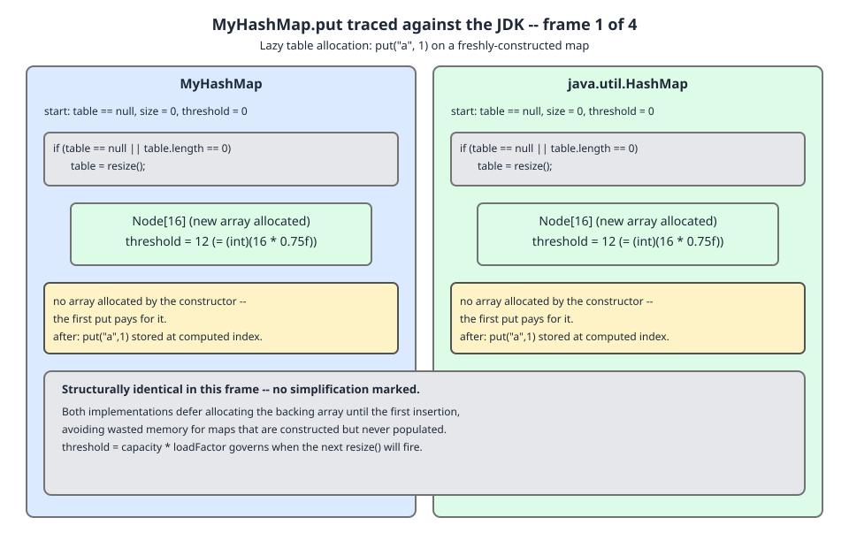
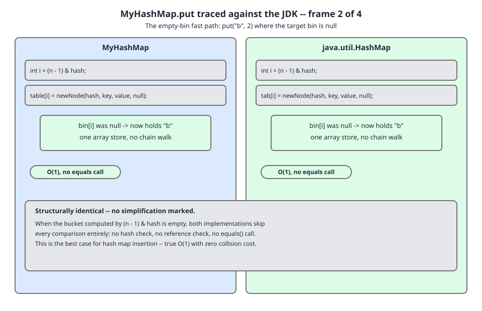
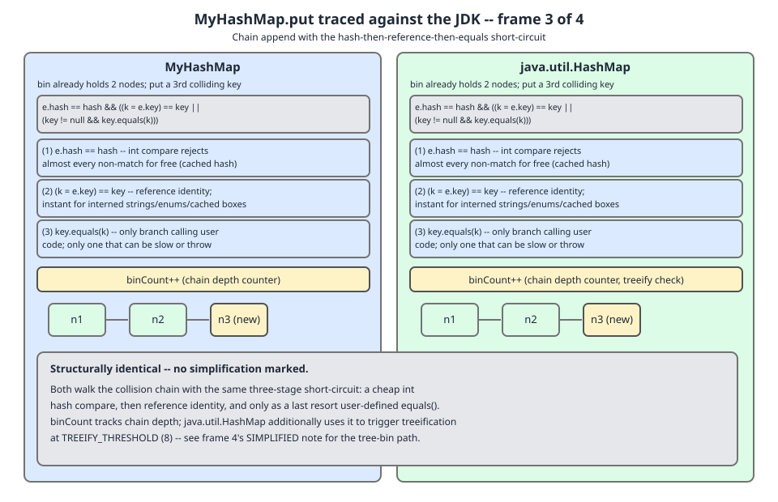
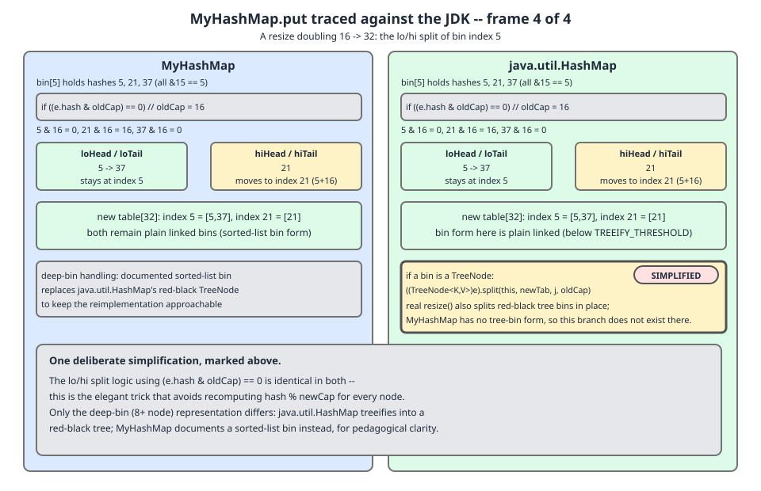

# 02 Java Collections — `HashMap` — INTERNALS (§4.3 `MyHashMap<K,V>` — lazy allocation, the extension surface, and the `put` trace)

**Target version: Java 21 LTS.** | [Index](../00-index.md)
Previous: [hash-map/06-build-my-hash-map.md](06-build-my-hash-map.md) · Next: [hash-map/07-build-my-hash-map-b-put-get-resize.md](07-build-my-hash-map-b-put-get-resize.md)

---

Two things finish the skeleton: the constructors, which do almost nothing on purpose, and the seven-member seam that makes `MyLinkedHashMap` possible in file 10. Then the four frames of D-146 give you the shape of `put` before file 07 gives you its code.

**How the code blocks assemble.** `MyHashMap.java` is the concatenation, in order, of every code block labelled `// MyHashMap.java` in [06](06-build-my-hash-map.md), followed by every such block in this file, then [07](07-build-my-hash-map-b-put-get-resize.md), [08](08-build-my-hash-map-c-treeify-and-defaults.md) and [09](09-build-my-hash-map-d-views-and-iterator.md); file 09 closes the class.

---

## 1. Constructors, and lazy allocation with `threshold` doing double duty

**Mental model.** A freshly constructed `HashMap` owns no array. The `threshold` field, which normally means "resize when `size` exceeds this", temporarily means something completely different: *the capacity to allocate on first use*. One `int` field, two meanings, disambiguated by whether `table` is `null`. It is a hack, it is documented as a hack in the JDK's own comment, and it saves an allocation on every map created and never written to.

**Why it exists.** Maps get created speculatively — one per request, one per cache-miss path, one per builder — and a large fraction never receive an entry. Spring, Jackson and Hibernate each allocate thousands per second. An eagerly allocated 16-slot `Node[]` is sixteen references plus a header, and it is pure garbage if nothing is ever put.

**When you would not do it.** If your map is guaranteed to be populated immediately, laziness costs a branch on the first `put` and buys nothing. `ArrayList` makes the same trade with `EMPTY_ELEMENTDATA` versus `DEFAULTCAPACITY_EMPTY_ELEMENTDATA`, for the same reason.

**How it works.** The JDK's comment above `threshold` (line 420) is the whole story: *"if the table array has not been allocated, this field holds the initial array capacity, or zero signifying `DEFAULT_INITIAL_CAPACITY`."* Three states:

| `table` | `threshold` | Meaning |
|---|---|---|
| `null` | `0` | No capacity requested — allocate 16 on first `put` |
| `null` | `> 0` | Capacity requested — allocate exactly `threshold` slots on first `put` |
| non-null | `> 0` | Normal — resize when `size` exceeds `threshold` |

`resize()` (file 07) is the single place that reads all three, which is why `resize()` is the *allocator* as well as the grower. There is no separate `initTable`.

```java
// MyHashMap.java
    public MyHashMap() {
        this.loadFactor = DEFAULT_LOAD_FACTOR;
    }

    public MyHashMap(int initialCapacity) {
        this(initialCapacity, DEFAULT_LOAD_FACTOR);
    }

    public MyHashMap(int initialCapacity, float loadFactor) {
        if (initialCapacity < 0)
            throw new IllegalArgumentException("Illegal initial capacity: " + initialCapacity);
        if (initialCapacity > MAXIMUM_CAPACITY)
            initialCapacity = MAXIMUM_CAPACITY;
        if (loadFactor <= 0 || Float.isNaN(loadFactor))
            throw new IllegalArgumentException("Illegal load factor: " + loadFactor);
        this.loadFactor = loadFactor;
        this.threshold = tableSizeFor(initialCapacity);
    }

    @SuppressWarnings("this-escape")
    public MyHashMap(Map<? extends K, ? extends V> m) {
        this.loadFactor = DEFAULT_LOAD_FACTOR;
        putMapEntries(m);
    }

    final void putMapEntries(Map<? extends K, ? extends V> m) {
        int s = m.size();
        if (s <= 0) return;
        if (table == null) {
            double dt = Math.ceil(s / (double) loadFactor);
            int t = (dt < MAXIMUM_CAPACITY) ? (int) dt : MAXIMUM_CAPACITY;
            if (t > threshold) threshold = tableSizeFor(t);
        } else if (s > threshold) {
            resize();
        }
        for (Map.Entry<? extends K, ? extends V> e : m.entrySet())
            putVal(spread(e.getKey()), e.getKey(), e.getValue(), false, false);
    }
```

The no-arg constructor sets *only* `loadFactor`. `threshold` stays at its default 0, the "signify `DEFAULT_INITIAL_CAPACITY`" state. The three-arg path stores `tableSizeFor(initialCapacity)` in `threshold` — a capacity, not a threshold — and `resize()` overwrites it with `capacity * loadFactor` the moment it allocates.

`putMapEntries` mirrors the JDK's version at line 502, including the `Math.ceil(s / loadFactor)` pre-sizing that `new HashMap<>(otherMap)` gets and `new HashMap<>(n)` does not. Note the last argument: `putVal(..., evict = false)`. Bulk construction must not evict, or copy-constructing an LRU cache would start throwing entries away mid-copy.

**`@SuppressWarnings("this-escape")` is not cosmetic.** JDK 21 added `-Xlint:this-escape` (JDK-8015831), and it fires here because `putMapEntries` reaches `putVal`, which calls the overridable `newNode` — so a `MyLinkedHashMap` under construction could see its own `newNode` invoked before its constructor body has run. The JDK has the identical hazard and does not annotate it only because `java.util` is not compiled with that lint. The honest reading: this is a real leak of `this`, benign here only because `MyLinkedHashMap.newNode` touches `head` and `tail`, which are `null` whether or not the subclass constructor has run. Add a subclass field that `newNode` reads and initialises in its constructor, and you have a bug that fires exactly once, at construction, and never reproduces afterwards.

Real output, `Demo` section 2:

```
after new MyHashMap<>(100): table=null, threshold=128
after first put:            table=len 128, threshold=96
after new MyHashMap<>():    table=null, threshold=0
after first put:            table=len 16, threshold=12
```

`threshold` reads 128 (a capacity) before the first `put` and 96 (a real threshold, 128 × 0.75) after. That is the double-duty trick, observable in four lines.

**Pitfall:** reading `map.threshold` in a debugger on a fresh map and concluding "this map resizes at 128 entries". It resizes at 96. Until the first write, that field is not a threshold at all.

**Interview:** *"How many objects does `new HashMap<>()` allocate?"* — One, the map itself. The `Node[]` arrives on the first `put`.

> **Definition.** Lazy table allocation defers the `Node[]` until the first write, and overloads `threshold` to carry the pending initial capacity while `table` is `null`, so an unused map costs one object instead of two.

---

## 2. The extension surface, introduced now and unused until file 10

**Mental model.** `HashMap` has a seam cut through it. Everywhere a node could be created, `HashMap` calls a factory method instead of `new`; everywhere the structure changes, it calls a notification hook that does nothing. `LinkedHashMap` is not a rewrite — it is those seven members overridden. Cutting the seam now, while nothing needs it, is the difference between building `HashMap` and understanding it.

**Why it exists.** JDK 1.4 added `LinkedHashMap`. The alternatives were to copy `HashMap` wholesale, or to make `HashMap` know about linkage. Both are bad. The factory-plus-hook seam lets `LinkedHashMap` be about 700 lines instead of 2,500 — and, the part that matters, it means `LinkedHashMap` automatically inherits every future `HashMap` fix. Treeification landed in Java 8 and `LinkedHashMap` got it free.

**When you would not do this.** If nothing will ever subclass, virtual factory calls are pure indirection and every allocation site becomes harder to read. The JDK pays it for exactly one subclass inside `java.util`, plus whatever users write.

**How it works.** Seven members, three groups.

**Allocation — `newNode` and `replacementNode`** (JDK lines 1908 and 1913). Every site that would write `new Node<>(...)` calls `newNode`; every site that converts an existing node into a different node type calls `replacementNode`. `MyLinkedHashMap` overrides the first to also link the new entry at the tail, and the second to transfer the `before`/`after` pointers from the discarded node to its replacement.

**Notification — the three `afterNode*` hooks** (JDK lines 1941–1943), empty in `HashMap`:

```
// Callbacks to allow LinkedHashMap post-actions
void afterNodeAccess(Node<K,V> p) { }
void afterNodeInsertion(boolean evict) { }
void afterNodeRemoval(Node<K,V> p) { }
```

In file 10 these become, respectively: move-to-tail for access order, evict-the-eldest for LRU, and unlink-from-the-doubly-linked-list. The `boolean evict` parameter exists solely so bulk construction can suppress eviction.

**Field access — `table`, `size`, `modCount`, `threshold`**, package-private, as decided in [file 06 §3](06-build-my-hash-map.md).

```java
// MyHashMap.java
    Node<K, V> newNode(int hash, K key, V value, Node<K, V> next) {
        return new Node<>(hash, key, value, next);
    }

    Node<K, V> replacementNode(Node<K, V> p, Node<K, V> next) {
        return new Node<>(p.hash, p.key, p.value, next);
    }

    void afterNodeAccess(Node<K, V> p) { }
    void afterNodeInsertion(boolean evict) { }
    void afterNodeRemoval(Node<K, V> p) { }

    @Override public int size() { return size; }
    @Override public boolean isEmpty() { return size == 0; }
```

Five method bodies, three of them empty, and they are the reason the next four files never mention linkage once.

**Insight:** `afterNodeAccess` is called from `putVal` when a key *already exists* — not from `get`. `LinkedHashMap` therefore has to override `get` itself (line 534) to call the hook. That is why `get` on an access-ordered `LinkedHashMap` is a *structural* operation that bumps `modCount`, and why iterating one while calling `get` throws `ConcurrentModificationException`. File 10 demonstrates it.

**Pitfall:** overriding `newNode` and forgetting `replacementNode`. Nothing breaks until a bin treeifies; then the tree's nodes are plain `Node`s while the linked overlay still points at the originals, and iteration silently disagrees with the map's contents. File 08's `treeifyBinAt` is the only caller of `replacementNode` in this build, and it exists precisely to make that path exercisable.

**Interview:** *"How does `LinkedHashMap` keep insertion order without slowing `HashMap` down?"* — It overrides two node factories and three no-op hooks; the hash table code is unchanged, and the cost to plain `HashMap` is five monomorphic virtual calls that HotSpot inlines to nothing.

> **Definition.** The extension surface is the pair of overridable node factories plus three empty structural-change hooks through which `HashMap` routes all allocation and all mutation notification, so a subclass can bolt on an orthogonal data structure without reimplementing the hash table.

---

## 3. The `put` path in overview — D-146, all four frames

The code is in [file 07](07-build-my-hash-map-b-put-get-resize.md); the shape is here, because you should know where you are going before you read `putVal`. Each frame puts our line beside the JDK's.

**Frame 1 — the map has no table yet.** `putVal` reads `table`, finds `null`, and calls `resize()`, which is the allocator as well as the grower. It is a single branch at the top of the method and it never fires again for the life of the map. This frame is the payoff of §1: the constructor did nothing, so the first `put` has to do the allocating, and the three-state `threshold` encoding tells it how big.



**Frame 2 — the target bin is empty.** `(n - 1) & hash` picks a slot, the slot is `null`, and the whole insertion is one array store: `tab[i] = newNode(hash, key, value, null)`. No `equals` call, no chain walk, no comparison of any kind. Under a healthy load factor this is the overwhelmingly common case, and it is the honest reason `HashMap.put` is called O(1) — most puts are one mask, one array read, one array write. Note that even here the allocation goes through `newNode`, not `new`.



**Frame 3 — the bin is occupied.** Now the three-stage short-circuit runs against each node in turn: compare the cached `int` hashes; if equal, compare references with `==`; only if that fails, call `equals`. Cheapest test first, most expensive last, and the `==` stage is what makes interned-`String` and enum keys effectively free. The chain walk also counts its steps in `binCount`, because reaching the eighth node is what triggers treeification — the walk is doing two jobs at once.



**Frame 4 — the insert pushed `size` past `threshold`.** `resize()` doubles the capacity and redistributes. Because capacity is a power of two, each old bin `j` splits into exactly two destinations — `j` and `j + oldCap` — selected by the single bit `e.hash & oldCap`, and both halves preserve their relative order. The frame also marks the one deliberate simplification in this build: where the JDK's resize calls `TreeNode.split` to divide a tree bin in place, ours flattens a sorted bin back to a chain and rebuilds. Cost: a re-sort of the bin on each resize. Benefit: about 120 lines you do not write, and a `split` fast path you do not have to get right. File 08 states the diff precisely and file 10b measures it.



---

## Pitfalls

### Assuming a fresh `HashMap` has allocated its table

**Wrong**

```java
MyHashMap<String, Integer> m = new MyHashMap<>(100);
System.out.println(m.table.length);   // NullPointerException
```

**Right**

```java
MyHashMap<String, Integer> m = new MyHashMap<>(100);
System.out.println(m.table == null ? "not yet allocated" : "len " + m.table.length);
m.put("first", 1);
System.out.println("len " + m.table.length);   // len 128
```

**Why people believe it:** every diagram of `HashMap` ever drawn shows an array, and the constructor takes a capacity argument. Nothing in the API suggests the argument is parked in a field rather than acted on.

### Reading `threshold` on a fresh map as a resize point

**Wrong**

```java
MyHashMap<String, Integer> m = new MyHashMap<>(100);
System.out.println("resizes at " + m.threshold);   // prints 128 -- wrong
```

**Right**

```java
MyHashMap<String, Integer> m = new MyHashMap<>(100);
m.put("k", 1);                                     // forces allocation
System.out.println("resizes at " + m.threshold);   // prints 96 -- correct
```

**Why people believe it:** the field is named `threshold` and holds a plausible-looking number. Its second meaning is documented only in a comment inside the JDK source.

### Overriding `newNode` without `replacementNode`

**Wrong**

```java
// A subclass that links nodes into a list, but only on the newNode path:
@Override Node<K, V> newNode(int h, K k, V v, Node<K, V> n) {
    Entry<K, V> p = new Entry<>(h, k, v, n);
    linkNodeAtEnd(p);
    return p;
}
// replacementNode left inherited -> the treeify path produces plain Nodes,
// the overlay keeps pointing at the discarded originals, and iteration
// silently disagrees with the map's contents.
```

**Right**

```java
@Override Node<K, V> replacementNode(Node<K, V> p, Node<K, V> next) {
    Entry<K, V> q = (Entry<K, V>) p;
    Entry<K, V> t = new Entry<>(q.hash, q.key, q.value, next);
    transferLinks(q, t);
    return t;
}
```

**Why people believe it:** `newNode` runs on every insert and `replacementNode` only during treeification, which needs eight colliding keys to trigger. The bug is invisible in every small test.

### Calling an overridable method from a constructor

**Wrong**

```java
public MyHashSet(Collection<? extends E> c) {
    map = new MyHashMap<>(Math.max((int) (c.size() / 0.75f) + 1, 16));
    addAll(c);              // AbstractCollection.addAll -> this.add -> overridable
}
```

**Right**

```java
public MyHashSet(Collection<? extends E> c) {
    map = new MyHashMap<>(Math.max((int) (c.size() / 0.75f) + 1, 16));
    for (E e : c) map.put(e, PRESENT);   // no virtual dispatch on a half-built this
}
```

**Why people believe it:** `java.util.HashSet`'s own collection constructor calls `addAll`, and it has done so since 1.2. It is safe there only because `HashSet.add` is effectively final in practice — and JDK 21's `-Xlint:this-escape` will now tell you about it. File 10 uses the explicit loop.

---

## Cheat sheet

| Item | Rule | JDK 21 line |
|---|---|---|
| `new HashMap<>()` allocates | one object; the `Node[]` waits for the first `put` | 683 |
| `table == null, threshold == 0` | allocate 16 on first put | 683 |
| `table == null, threshold > 0` | allocate `threshold` slots on first put | 683 |
| `table != null` | `threshold == capacity * loadFactor` | 683 |
| `resize()` role | allocator *and* grower; there is no `initTable` | 683 |
| `putMapEntries` | pre-sizes to `ceil(s / loadFactor)`, passes `evict = false` | 502 |
| `loadFactor` | `final`; no setter, ever | 428 |
| Node factories | `newNode`, `replacementNode` | 1908, 1913 |
| Hooks | `afterNodeAccess`, `afterNodeInsertion(boolean evict)`, `afterNodeRemoval` | 1941–1943 |
| `afterNodeAccess` caller | `putVal` on an existing key — **not** `get` | 631 |
| `LinkedHashMap.get` | overridden to fire the hook; access order makes `get` structural | LHM 534 |
| `-Xlint:this-escape` | new in JDK 21; fires on constructors reaching overridable methods | — |
| put fast path | empty bin → one array store, zero `equals` calls | 631 |
| put comparison order | `hash ==` → `key ==` → `key.equals` | 631 |
| resize split | `(e.hash & oldCap) == 0` → stay at `j`, else move to `j + oldCap` | 723 |

---

## Self-test

**Q1.** `new MyHashMap<>(100)` then one `put`. What are `table.length` and `threshold`, and why is `threshold` different before and after?

<details><summary>Answer</summary>

`table.length == 128`, `threshold == 96`. Before the `put`, `threshold` held `tableSizeFor(100) == 128` — a *capacity*, parked there because `table` was still `null`. The first `put` calls `resize()`, which sees `table == null && threshold > 0`, allocates `threshold` slots (128), then overwrites `threshold` with `128 * 0.75f == 96`, its normal meaning. One field, two meanings, disambiguated by whether `table` is null.

</details>

**Q2.** Why is `resize()` the allocator as well as the grower, rather than having a separate `initTable()`?

<details><summary>Answer</summary>

Because the two operations differ only in where the new capacity comes from. `resize()` already has to compute `newCap` and `newThr` from the current state and install a fresh array; the "allocate from scratch" case is just the branch where `oldCap == 0`, reading the pending capacity out of `threshold` instead of doubling. Merging them means `putVal` has exactly one line for "no table yet" and one for "over threshold", both calling the same method, and there is only one place in the class that ever writes `table`.

</details>

**Q3.** `-Xlint:this-escape` fires on the `MyHashMap(Map)` constructor. What is the actual hazard, and why is it benign here?

<details><summary>Answer</summary>

`putMapEntries` reaches `putVal`, which calls `newNode` — overridable. If a subclass is being constructed, `newNode` runs before the subclass constructor body, so it can observe subclass fields at their default values. It is benign in this build only because `MyLinkedHashMap.newNode` touches `head` and `tail`, which are `null` whether or not the subclass constructor has run. Add a subclass field that `newNode` reads and that the subclass constructor initialises, and you get a bug that fires once, at construction, and never reproduces.

</details>

**Q4.** Why are `newNode` and `replacementNode` methods rather than `new Node<>(...)` at each call site?

<details><summary>Answer</summary>

To give `LinkedHashMap` a seam. Every node allocation funnels through two overridable factories, so a subclass can substitute a richer node type and perform per-allocation bookkeeping — for `LinkedHashMap`, appending to the doubly linked list — without touching `putVal`, `compute`, `merge`, `treeifyBin` or `resize`. The payoff is that `LinkedHashMap` inherits every future `HashMap` improvement, which is how it got treeification for free in Java 8.

</details>

**Q5.** `afterNodeInsertion` takes a `boolean evict`. What breaks if you always pass `true`?

<details><summary>Answer</summary>

Copy construction. `new LinkedHashMap<>(someMap)` on an LRU subclass would run `removeEldestEntry` after each copied entry, so a 100-entry source copied into a cache with capacity 10 would evict as it went and you would end up with the last 10 entries in iteration order rather than a faithful copy. `putMapEntries` therefore passes `evict = false`, and it is the only caller that does.

</details>

**Q6.** In frame 3, why compare `hash` before `==` before `equals`, rather than just calling `equals`?

<details><summary>Answer</summary>

Cost ordering. Comparing two cached `int`s is one instruction and eliminates almost every non-matching node — different keys in the same bin usually have different spread hashes, since they collided on the masked low bits only. If the hashes match, `==` catches the interned-`String`, enum, boxed-small-`Integer` and same-object cases without a call. Only when both cheap tests pass do you pay for `equals`, which for a long `String` is a character-by-character loop. Reversing the order would make every chain walk pay the expensive test first.

</details>

**Q7.** Frame 4 marks a deliberate simplification. What is it, and what does it cost?

<details><summary>Answer</summary>

The JDK's `resize()` calls `TreeNode.split` to divide a tree bin into its lo and hi halves in place, preserving the red-black structure and untreeifying either half that drops to six or fewer nodes. Ours flattens the sorted bin back to a plain chain, runs the ordinary lo/hi split on it, and then re-treeifies any resulting bin still at or above eight nodes — which means re-sorting. The cost is an extra O(b log b) per long bin per resize, where b is the bin length; the benefit is roughly 120 lines of `split`, `untreeify` and `moveRootToFront` that do not have to exist or be correct.

</details>

---

**Leaves covered:** 4.3.3 (1 leaf, plus the extension surface that files 07–10 depend on)
**Leaves deferred:** none — 4.3.1–4.3.2 are in [06-build-my-hash-map.md](06-build-my-hash-map.md), 4.3.4–4.3.6 in [07-build-my-hash-map-b-put-get-resize.md](07-build-my-hash-map-b-put-get-resize.md), 4.3.7–4.3.8 in [08-build-my-hash-map-c-treeify-and-defaults.md](08-build-my-hash-map-c-treeify-and-defaults.md), 4.3.9–4.3.10 in [09-build-my-hash-map-d-views-and-iterator.md](09-build-my-hash-map-d-views-and-iterator.md), 4.3.11–4.3.12 in [10-build-my-hash-map-e-set-linked-and-diff.md](10-build-my-hash-map-e-set-linked-and-diff.md), 4.3.13–4.3.14 in [10b-build-my-hash-map-g-diff-and-collision-dos.md](10b-build-my-hash-map-g-diff-and-collision-dos.md)
**Diagrams included:** D-146a, D-146b, D-146c, D-146d
**Target version:** Java 21 LTS
**Lines:** 356
