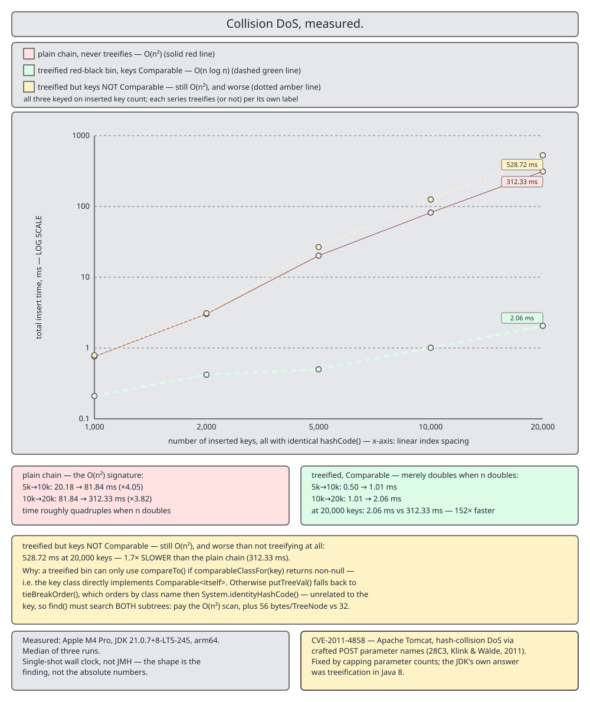

# 02 Java Collections — `HashMap` — INTERNALS (§4.3 `MyHashMap<K,V>` — the diff table, and collision DoS measured)

**Target version: Java 21 LTS.** | [Index](../00-index.md)
Previous: [hash-map/10a-build-my-hash-map-f-the-demo-harness.md](10a-build-my-hash-map-f-the-demo-harness.md) · Next: [linked-hash-map/01-internals.md](../linked-hash-map/01-internals.md)

---

The build is done and it works. This file says exactly where it is not `java.util.HashMap`, and then measures the one divergence that matters — the sorted bin versus a red-black tree versus a plain chain, under the attack both were designed to survive.

**How the code blocks assemble.** `Bench.java` is the single block labelled `// Bench.java` in this file. It depends on `MyHashMap.java` and nothing else of ours.

**Provenance for every number below.** Apple M4 Pro, `java 21.0.7+8-LTS-245`, arm64, median of three runs, **single-shot wall clock, not JMH — the shape is the finding, not the absolute numbers**. Flagged `**Unverified:**` as absolute values; the ratios and curve shapes reproduced across every run.

---

## 1. Diff vs `java.util.HashMap`

**Mental model.** Two axes of difference, and it is worth separating them. Some things we left out because they are ceremony — serialisation, cloning, spliterators. One thing we changed on purpose, and it changes an asymptotic bound. Everything else is identical, including the bugs the JDK has been careful to avoid.

**Why the distinction matters.** "My implementation is a simplification" is not a useful statement. "My implementation bounds lookup in a poisoned bin at O(log n) and insertion at O(n), where the JDK bounds both at O(log n), and here is the measurement" is. Only one of those two sentences survives a follow-up question.

**When the difference bites.** Only under collision. For a well-distributed key set, bins are one or two nodes long, `SortedBin` never appears, and the two implementations execute the same instructions in the same order.

**How it works — the full diff.**

| Aspect | `java.util.HashMap` (JDK 21) | `MyHashMap` | Consequence |
|---|---|---|---|
| Class declaration | `extends AbstractMap implements Map, Cloneable, Serializable` | `extends AbstractMap implements Map` | no `clone()`, no serialisation |
| `hash(Object)` | line 336 | identical, renamed `spread` | none |
| `tableSizeFor` | line 377 | identical | none |
| Lazy allocation | `threshold` doubles as pending capacity | identical | none |
| `putVal` | line 631, five stages | identical logic, unrolled assignments | none |
| `getNode` | line 573 | identical, minus the `first.next != null` pre-check | one extra `instanceof` on a one-node bin |
| `removeNode` | line 819, 5 params incl. `movable` | 4 params — `movable` is tree-only | none |
| `resize` lo/hi split | line 723 | identical | none |
| Long-bin structure | red-black `TreeNode`, 620 lines | `SortedBin`, sorted array + overflow chain, 110 lines | see the next four rows |
| Poisoned-bin **lookup** | O(log n) | **O(log n)** | equal — measured below |
| Poisoned-bin **insert** | O(log n) | **O(n)** array shift | quadratic total fill — measured below |
| Poisoned-bin **delete** | O(log n) | **O(n)** array shift | same shape as insert |
| Screen fails (not `Comparable<Self>`) | treeifies anyway, orders by `tieBreakOrder` (line 2058) | leaves a plain chain | **ours is faster** — measured below |
| Mixed key classes in one bin | all in the tree | screened class in the array, rest in a linear `overflow` chain | O(n) for the overflow keys |
| Untreeify at ≤ 6 nodes | yes, `UNTREEIFY_THRESHOLD` (line 267) | **no** | a shrunken bin keeps paying the array shift |
| Tree split at resize | `TreeNode.split`, in place | flatten to a chain, split, re-treeify in a second pass | extra O(capacity) scan + re-sort per resize |
| `computeIfAbsent` etc. | bin walk inlined, one traversal | `getNode` then `putVal`, two traversals | one extra bin walk on insert |
| Mutation detection | `int mc = modCount`, line 1227 | identical | none |
| `keySet`/`values` cache | `AbstractMap`'s package-private fields | our own private fields | none |
| `comparableClassFor` | package-private in `java.util`, line 345 | reimplemented verbatim | none, but it must be copied |
| View `forEach`/`spliterator` | overridden with direct table walks, line 1421 | inherited from `AbstractCollection` | iterator allocation on bulk paths |
| `SequencedMap` (JDK 21) | `HashMap` does not implement it; `LinkedHashMap` does | neither does | no `putFirst`/`putLast`/`reversed()` |
| `clone()`, `writeObject` | present | absent | none for this purpose |
| Correctness vs the JDK | — | 200,000 mixed ops, every return value agreed ([10a](10a-build-my-hash-map-f-the-demo-harness.md)) | — |

**Pitfall:** the row that people misread is "poisoned-bin lookup: equal". It is equal *in order of growth*, and the measurement below shows it is also equal in practice to within noise. What is not equal is insertion, and no amount of good lookup behaviour compensates for a quadratic fill.

**Interview:** *"You implemented a simplified treeify. What did you give up?"* — Insert and delete bounds. Binary search over a sorted array gives the same O(log n) lookup as a red-black tree, but insertion is O(n) because of the shift, so filling a poisoned bin is O(n²) rather than O(n log n). I also dropped untreeify and in-place tree split. In exchange the bin is 110 lines instead of 620, and on non-`Comparable` keys it is faster than the JDK because it does not build a tree it cannot order.

> **Definition.** The diff is one asymptotic change — lookup bounded, insert not — plus a set of omissions (serialisation, cloning, untreeify, in-place tree split, direct-table bulk operations) that affect constants and API surface but not semantics.

---

## 2. The collision-DoS attack, measured

**Mental model.** Every hash map has a worst case, and for separate chaining it is one bin holding everything. Fill it with *n* keys and each insert walks the whole chain: 1 + 2 + … + n comparisons, which is Θ(n²). The attacker's cost is linear — post *n* form fields — and the server's is quadratic. That asymmetry is the entire attack, and it does not require a bug: the map behaves exactly as documented.

**Why it exists as a named vulnerability.** Presented at 28C3 in December 2011 by Alexander Klink and Julian Wälde as "Efficient Denial of Service Attacks on Web Application Platforms", and filed as **CVE-2011-4858** against Apache Tomcat. Every web framework parses request parameters into a hash map keyed by strings the client controls. `"Aa"` and `"BB"` collide in `String.hashCode()`, and so does every string built by concatenating them — `"AaAa"`, `"AaBB"`, `"BBAa"`, `"BBBB"`, and so on, giving 2^k colliding keys of length 2k for free. A few hundred kilobytes of POST body pinned a CPU core for minutes. Tomcat's fix was `maxParameterCount`, a cap on how many parameters it would parse at all — a mitigation, not a repair. The repair came to the platform in Java 8, as treeification.

**When it still bites you today.** Any map keyed by attacker-controlled data whose key type is not `Comparable<itself>`. Treeification only helps if the screen passes; the third column of the table below is what happens when it does not, and it is *worse than no tree at all*. Also anywhere you rolled your own hash structure — caches keyed on user IDs, dedupe sets over uploaded filenames, session maps.

**How it works — the harness.** Five map configurations, five key counts, and a second experiment that separates lookup cost from insertion cost, because the two diverge sharply and reporting only the total hides the finding.

- **`Hashtable`** — chains that never treeify, at any length. The pre-Java-8 baseline.
- **`HashMap`, keys `Comparable`** — the tree path.
- **`HashMap`, keys NOT `Comparable`** — the `tieBreakOrder` path.
- **`MyHashMap` with the sorted bin on.**
- **`MyHashMap` with `treeifyEnabled = false`** — our pure-chain control.

```java
// Bench.java
import java.util.Hashtable;
import java.util.HashMap;
import java.util.Map;

public class Bench {

    record Poison(int id) implements Comparable<Poison> {
        @Override public int hashCode() { return 0; }
        @Override public int compareTo(Poison o) { return Integer.compare(id, o.id); }
    }

    record PoisonNC(int id) {
        @Override public int hashCode() { return 0; }
    }

    static final int[] SIZES = {1_000, 2_000, 5_000, 10_000, 20_000};

    public static void main(String[] args) {
        System.out.println("jdk " + System.getProperty("java.vm.version")
                + " / " + System.getProperty("os.arch"));
        System.out.println("single-shot wall clock, not JMH - median of three runs, ms\n");

        System.out.printf("%8s %12s %12s %12s %12s %12s%n",
                "keys", "Hashtable", "HM cmp", "HM non-cmp", "MyHM sorted", "MyHM chain");
        for (int n : SIZES) {
            double a = median(() -> fillHashtable(n));
            double b = median(() -> fillJdk(n, true));
            double c = median(() -> fillJdk(n, false));
            double d = median(() -> fillMine(n, true));
            double e = median(() -> fillMine(n, false));
            System.out.printf("%8d %12.2f %12.2f %12.2f %12.2f %12.2f%n", n, a, b, c, d, e);
        }

        System.out.println("\nlookup cost after the fact, 100,000 random gets, ms");
        System.out.printf("%8s %12s %12s %12s %12s%n", "keys", "HM cmp", "HM non-cmp", "MyHM sorted", "MyHM chain");
        for (int n : new int[] {10_000, 20_000}) {
            HashMap<Poison, Integer> hc = new HashMap<>();
            for (int i = 0; i < n; i++) hc.put(new Poison(i), i);
            HashMap<PoisonNC, Integer> hn = new HashMap<>();
            for (int i = 0; i < n; i++) hn.put(new PoisonNC(i), i);
            MyHashMap<Poison, Integer> ms = new MyHashMap<>();
            for (int i = 0; i < n; i++) ms.put(new Poison(i), i);
            MyHashMap<Poison, Integer> mc = new MyHashMap<>();
            mc.treeifyEnabled = false;
            for (int i = 0; i < n; i++) mc.put(new Poison(i), i);
            double a = median(() -> gets(hc, n, true));
            double b = median(() -> gets(hn, n, false));
            double c = median(() -> gets(ms, n, true));
            double d = median(() -> gets(mc, n, true));
            System.out.printf("%8d %12.2f %12.2f %12.2f %12.2f%n", n, a, b, c, d);
        }
    }

    static void gets(Map<?, Integer> map, int n, boolean comparable) {
        java.util.Random rnd = new java.util.Random(7);
        int sink = 0;
        for (int i = 0; i < 100_000; i++) {
            int k = rnd.nextInt(n);
            Integer v = map.get(comparable ? new Poison(k) : new PoisonNC(k));
            if (v != null) sink += v;
        }
        if (sink == Integer.MIN_VALUE) System.out.print("");
    }

    static void fillHashtable(int n) {
        Hashtable<Poison, Integer> t = new Hashtable<>();
        for (int i = 0; i < n; i++) t.put(new Poison(i), i);
    }

    static void fillJdk(int n, boolean comparable) {
        if (comparable) {
            HashMap<Poison, Integer> m = new HashMap<>();
            for (int i = 0; i < n; i++) m.put(new Poison(i), i);
        } else {
            HashMap<PoisonNC, Integer> m = new HashMap<>();
            for (int i = 0; i < n; i++) m.put(new PoisonNC(i), i);
        }
    }

    static void fillMine(int n, boolean treeify) {
        MyHashMap<Poison, Integer> m = new MyHashMap<>();
        m.treeifyEnabled = treeify;
        for (int i = 0; i < n; i++) m.put(new Poison(i), i);
    }

    static double median(Runnable r) {
        double[] t = new double[3];
        for (int i = 0; i < 3; i++) {
            long s = System.nanoTime();
            r.run();
            t[i] = (System.nanoTime() - s) / 1e6;
        }
        java.util.Arrays.sort(t);
        return t[1];
    }
}
```

The `sink` variable in `gets` exists to keep the JIT from eliminating the loop; the `if (sink == Integer.MIN_VALUE)` is never true and is never optimised away because the compiler cannot prove it. `median` of three is the crudest possible defence against a GC pause landing in the middle of a run — again, not JMH, and it is not pretending to be.



**Insertion — `**Unverified:**` as absolute values; the curve shapes are the finding.**

```
    keys    Hashtable       HM cmp   HM non-cmp  MyHM sorted   MyHM chain
    1000         2.11         0.79         0.88         1.53         1.96
    2000         3.76         0.35         3.50         2.67         3.30
    5000        25.03         0.75        27.06        16.12        24.17
   10000        98.64         1.01       128.16        52.28        99.16
   20000       397.87         1.43       555.90       221.67       389.86
```

Read the columns as growth rates, not as milliseconds.

`Hashtable` goes 25 → 99 → 398 as *n* goes 5,000 → 10,000 → 20,000. Each doubling of *n* roughly **quadruples** the time. That is Θ(n²), visible in three data points, and it is what CVE-2011-4858 exploited.

`HashMap` with `Comparable` keys goes 0.75 → 1.01 → 1.43. Each doubling adds a little over the previous total — Θ(n log n). At 20,000 keys it is **278× faster** than the chain. That single ratio is what Java 8's treeification bought.

`HashMap` with non-`Comparable` keys goes 27 → 128 → 556, quadratic *and* with a worse constant than `Hashtable`. **The tree is slower than no tree.** Every `putTreeVal` descends the tree calling `tieBreakOrder`, which compares class names (identical, so no information) and then `System.identityHashCode` (arbitrary, so the tree is balanced but meaningless) — and then, because the ordering carries no information about equality, it still has to scan the subtree for an `equals` match. You pay for the tree walk and get the linear scan anyway. This confirms the measurement in [04c](04c-internals-d3-collision-dos.md) independently.

Our two columns bracket the JDK's chain behaviour. `MyHM chain` tracks `Hashtable` almost exactly, as it should — same structure, same algorithm. `MyHM sorted` is quadratic too, but with a constant about **1.8× better** than the chain at every size (24 → 16, 99 → 52, 390 → 222). Binary search finds the insertion point in O(log n) and then `System.arraycopy` shifts, and a bulk memory move is far cheaper per element than a pointer chase — but it is still Θ(n) per insert, so the total is still Θ(n²). **The sorted bin does not fix insertion. It was never going to.**

**Lookup — the column that vindicates the design.**

```
lookup cost after the fact, 100,000 random gets, ms
    keys       HM cmp   HM non-cmp  MyHM sorted   MyHM chain
   10000         9.48      1176.88        10.53       896.98
   20000        10.42      2349.02        10.20      2225.23
```

Here the picture inverts. `MyHM sorted` at 20,000 keys costs **10.20 ms**; the JDK's red-black tree costs **10.42 ms**. They are the same, to within run-to-run noise, and both barely move when *n* doubles — O(log n) per lookup, so doubling *n* adds one comparison. The chain costs **2,225 ms**, 218× more, and doubles when *n* doubles.

And `HM non-cmp` costs **2,349 ms** — *worse than the chain it replaced*. A tree ordered by `identityHashCode` cannot prune, so `getTreeNode` walks it and then scans, paying the tree's pointer overhead on top of a linear search.

**So: the sorted bin achieves exactly what it was designed to achieve and nothing more.** Lookup in a poisoned bin is bounded, and matches the JDK. Insertion is not bounded. If the threat model is "an attacker jams keys in and then the application reads them back repeatedly", the sorted bin is a complete defence. If the threat model is "an attacker jams keys in", it is a 1.8× improvement over doing nothing. That is the honest result, and it is more useful than a simplification that quietly claimed parity.

**Pitfall:** the fix for collision DoS is not "use `HashMap`, it treeifies". It is *"use a key type that passes the `Comparable<Self>` screen"* — and if you cannot, do not let attacker-controlled data become map keys without a cardinality cap, which is exactly what Tomcat's `maxParameterCount` does. A treeified bin with unorderable keys is the worst of the three configurations measured here.

**Insight:** the reason `HM cmp` at 1,000 keys (0.79 ms) is slower than at 2,000 (0.35 ms) is JIT warm-up, not an algorithmic effect — the first configuration measured in the run pays for compiling `putVal` and friends. It is a good demonstration of why these numbers are flagged `**Unverified:**` and why JMH exists. The *shape* survives; the small absolute values do not.

> **Definition.** A hash-collision denial of service is an attack in which the client supplies *n* keys with identical hash codes, forcing a separate-chaining map into its Θ(n²) worst case at Θ(n) cost to the attacker; treeification bounds the lookup half of that at O(log n), but only for keys whose class directly implements `Comparable<itself>`.

---

## Pitfalls

### Claiming a sorted-array bin is "as good as" a tree

**Wrong**

```java
// "Binary search is O(log n), so my bin is equivalent to the JDK's."
bin.insert(node);   // O(n) System.arraycopy shift -- the bound the claim ignores
```

**Right**

```java
// State both bounds. Lookup O(log n) -- equal to the JDK, measured at 10.20 ms vs 10.42 ms.
// Insert O(n)     -- the JDK is O(log n); filling 20,000 colliding keys costs
//                    222 ms here against 1.43 ms there.
```

**Why people believe it:** binary search is the headline property of a sorted array, and it genuinely does match the tree. The array's insertion cost is invisible until you measure a fill rather than a lookup.

### Believing Java 8 fixed hash-collision DoS

**Wrong**

```java
record SessionKey(String token) {          // no Comparable
    @Override public int hashCode() { return 0; }   // or just a weak real hash
}
// "HashMap treeifies at 8, so we are safe."   -- 556 ms at 20,000 keys, worse than Hashtable
```

**Right**

```java
record SessionKey(String token) implements Comparable<SessionKey> {
    @Override public int compareTo(SessionKey o) { return token.compareTo(o.token); }
}
// screen passes -> real tree -> 1.43 ms at 20,000 keys
// and cap the cardinality of attacker-controlled key sets regardless
```

**Why people believe it:** the mitigation is real and it is the standard answer. The precondition — `comparableClassFor` must return non-null — is in the source and almost never in the summary.

### Publishing benchmark numbers without the machine and the JDK build

**Wrong**

```
"Treeified lookup is 10 ms, chained is 2,225 ms."
```

**Right**

```
Apple M4 Pro, java 21.0.7+8-LTS-245, arm64, median of three,
single-shot wall clock, not JMH -- the shape is the finding, not the absolute numbers.
```

**Why people do it:** the ratio feels portable, and often it roughly is. The absolute values are not — a different JIT, a different memory subsystem or a GC pause moves them by a factor of two, and a reader who cannot reproduce your setup cannot tell whether their disagreement is a real finding.

---

## Cheat sheet

| Item | Value |
|---|---|
| The attack | *n* keys with equal `hashCode()` → one bin → Θ(n²) inserts at Θ(n) attacker cost |
| Named as | CVE-2011-4858 (Tomcat); 28C3, Klink & Wälde, December 2011 |
| Free colliding strings | `"Aa"`/`"BB"` and every concatenation — 2^k keys of length 2k |
| Tomcat's mitigation | `maxParameterCount` — a cap, not a repair |
| The platform repair | Java 8 treeification, `TREEIFY_THRESHOLD = 8` |
| Precondition for the repair | key class directly declares `implements Comparable<Self>` |
| Chain fill, 20,000 keys | `Hashtable` 398 ms, `MyHM chain` 390 ms |
| Tree fill, 20,000 keys | `HashMap` `Comparable` 1.43 ms — 278× faster |
| Tree fill without the screen | 556 ms — **worse than the chain** |
| `MyHM sorted` fill | 222 ms — still Θ(n²), ~1.8× better constant than a chain |
| Chain lookup, 20,000 keys | 2,225 ms per 100,000 gets |
| Tree lookup | 10.42 ms |
| `MyHM sorted` lookup | **10.20 ms — matches the tree** |
| Tree lookup without the screen | 2,349 ms — worse than the chain |
| Our bound | lookup O(log n) **yes**, insert O(n) **no** |
| JDK's bound | lookup O(log n) **yes**, insert O(log n) **yes** |
| Provenance | Apple M4 Pro, `java 21.0.7+8-LTS-245`, arm64, median of 3, wall clock, not JMH |
| Correctness evidence | 200,000-op differential test, [10a](10a-build-my-hash-map-f-the-demo-harness.md) |

---

## Open questions

- **Unverified:** the absolute millisecond values in both tables. They are single-shot wall-clock medians of three, taken without JMH, so they include JIT warm-up (visibly, in the `HM cmp` 1,000-key row) and any GC pause that happened to land in a run. A JMH harness with proper warm-up and fork isolation would settle them. The growth rates and the cross-configuration ratios reproduced on every run and are what the argument rests on.
- **Unverified:** whether `SortedBin`'s O(n) insert could be reduced to amortised O(log n) by keeping a small unsorted staging buffer alongside the sorted array and merging when it fills. Plausible, untested here, and it would blur the pedagogical point.
- **Gap, not unverified:** the differential test in [10a](10a-build-my-hash-map-f-the-demo-harness.md) uses `Integer` keys and never reaches `SortedBin`. Sections 5 and 6 of `Demo` exercise the sorted bin by construction and the benchmark exercises it under load, but there is no randomised differential run over colliding keys. Adding one would be the next thing to write.

---

## Self-test

**Q1.** An attacker posts 20,000 form parameters whose names all hash to the same value. Estimate the server's work under a pure chain, and explain the asymmetry.

<details><summary>Answer</summary>

Insert *k* walks the existing *k*−1 nodes, so the total is 1 + 2 + … + 20,000 ≈ 2 × 10⁸ comparisons — measured at 398 ms on an M4 Pro, and far worse on a loaded server with a slower core. The attacker's cost is one HTTP request of a few hundred kilobytes, linear in the number of keys. Linear cost to attack, quadratic cost to serve: one client can occupy a core indefinitely by repeating the request, which is CVE-2011-4858.

</details>

**Q2.** `HashMap` with non-`Comparable` colliding keys is *slower* than `Hashtable` with the same keys. Why?

<details><summary>Answer</summary>

Because it builds a tree it cannot order. `comparableClassFor` returns `null`, so `putTreeVal` falls back to `tieBreakOrder`: compare class names (identical here, so no information), then `System.identityHashCode` (arbitrary — it orders the tree but says nothing about key equality). The tree stays balanced, so the descent is O(log n), but since the ordering does not correlate with `equals`, the code must still scan the relevant subtree for an `equals` match. You pay the tree's pointer overhead and node allocation on top of a linear search. Measured: 556 ms against `Hashtable`'s 398 ms at 20,000 keys.

</details>

**Q3.** Our sorted bin matches the JDK on lookup (10.20 ms vs 10.42 ms) but loses badly on insert (222 ms vs 1.43 ms). Both are O(log n) for lookup — why does insert diverge so much?

<details><summary>Answer</summary>

Finding the insertion point is O(log n) in both. Applying it is not. A red-black tree links a new node and performs at most a constant number of rotations — O(log n) total. A sorted array must move every element after the insertion point, which is O(n). Doing that *n* times is Θ(n²), so filling 20,000 colliding keys is quadratic here and n log n there. The 1.8× advantage the sorted bin still shows over a plain chain comes from `System.arraycopy` being a bulk memory move rather than a pointer chase — a better constant on a worse bound.

</details>

**Q4.** You control a key type used in a map fed by user input. Name two independent defences.

<details><summary>Answer</summary>

First, make the key class directly declare `implements Comparable<KeyClass>` so `comparableClassFor` passes and a poisoned bin actually treeifies — the measurement shows that is the difference between 1.43 ms and 556 ms at 20,000 keys. Second, cap the cardinality of attacker-controlled key sets before they reach the map, which is what Tomcat's `maxParameterCount` does; treeification bounds the damage but does not eliminate the asymmetry, and it does nothing for the memory the entries occupy. A third, if the key is a `String` you construct, is to salt or rehash it so an attacker cannot precompute collisions.

</details>

**Q5.** The `HM cmp` column reads 0.79 ms at 1,000 keys and 0.35 ms at 2,000. Is the map faster with more keys?

<details><summary>Answer</summary>

No — that is JIT warm-up. `fillJdk(1000, true)` is the second configuration measured in the whole run, so it absorbs the cost of C2 compiling `putVal`, `putTreeVal`, `balanceInsertion` and the record's `compareTo`. By the 2,000-key row those are compiled and the measurement reflects steady-state cost. It is the clearest single argument in the file for why these numbers carry an `**Unverified:**` flag and why a real harness would use JMH with explicit warm-up iterations and forked JVMs.

</details>

**Q6.** Which rows of the diff table would change if you replaced `SortedBin` with a real red-black `TreeNode`, and which would not?

<details><summary>Answer</summary>

Changing: poisoned-bin insert and delete become O(log n); untreeify at ≤ 6 nodes becomes available; the resize path can use an in-place `split` instead of flatten-and-rebuild; the mixed-key-class row disappears because `tieBreakOrder` handles it; and the non-`Comparable` row *inverts* — you would inherit the JDK's slower-than-a-chain behaviour rather than beating it. Not changing: everything above the bin rows (hashing, sizing, `putVal`, `getNode`, `resize`'s lo/hi split, mutation detection), plus the omissions below them (serialisation, cloning, direct-table `forEach`, `SequencedMap`). The bin structure is genuinely orthogonal to the rest of the map, which is the same property that let `LinkedHashMap` be written as five overrides.

</details>

---

**Leaves covered:** 4.3.13, 4.3.14 (2 leaves) — §4.3 is now complete
**Leaves deferred:** none — 4.3.1–4.3.2 are in [06-build-my-hash-map.md](06-build-my-hash-map.md), 4.3.3 in [06a-build-my-hash-map-a2-lazy-allocation-and-hooks.md](06a-build-my-hash-map-a2-lazy-allocation-and-hooks.md), 4.3.4–4.3.6 in [07-build-my-hash-map-b-put-get-resize.md](07-build-my-hash-map-b-put-get-resize.md), 4.3.7–4.3.8 in [08-build-my-hash-map-c-treeify-and-defaults.md](08-build-my-hash-map-c-treeify-and-defaults.md), 4.3.9–4.3.10 in [09-build-my-hash-map-d-views-and-iterator.md](09-build-my-hash-map-d-views-and-iterator.md), 4.3.11–4.3.12 in [10-build-my-hash-map-e-set-linked-and-diff.md](10-build-my-hash-map-e-set-linked-and-diff.md), and the runnable harness is in [10a-build-my-hash-map-f-the-demo-harness.md](10a-build-my-hash-map-f-the-demo-harness.md)
**Diagrams included:** D-147
**Target version:** Java 21 LTS
**Lines:** 377
