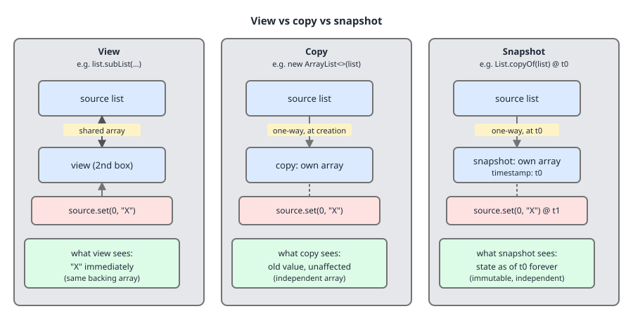
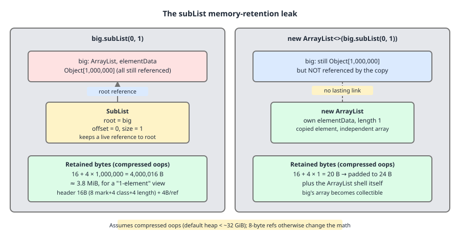

# 02 Java Collections — Immutability and views — INTERMEDIATE (§2.3.1–2.3.5)

**Target version: Java 21 LTS.** | [Index](../00-index.md)
Previous: [specialised-maps/04b-internals-weak-hash-map.md](../specialised-maps/04b-internals-weak-hash-map.md) · Next: [immutable-collections/01b-map-views-and-arrays-aslist.md](01b-map-views-and-arrays-aslist.md)

---

## The map of this folder before the streets

Everything in `immutable-collections/` answers one question: **when you hand a collection to somebody else, what exactly did you hand over?** There are four answers, and the folder is organised around them.

| Kind | Independent of source? | Reads see later source edits? | Writes allowed? | Canonical example | Where covered |
|---|---|---|---|---|---|
| **View** | No — shares storage | Yes | Through the view: sometimes. Direct: sometimes | `list.subList(1,4)`, `map.keySet()` | this file, [01b](01b-map-views-and-arrays-aslist.md) |
| **Unmodifiable view** | No — shares storage | Yes | No through the view; yes via the source | `Collections.unmodifiableList(list)` | this file (framing), later files (detail) |
| **Copy** | Yes | No | Yes | `new ArrayList<>(src)` | this file |
| **Snapshot / immutable** | Yes | No | No, ever | `List.copyOf(src)`, `List.of(...)` | later files in this folder |

The protection ladder that follows: (1) **mutable, shared** — `ArrayList`, `HashMap`, no protection at all; (2) **mutable, viewed** — `subList`, `keySet`, `values`, `entrySet`, `headMap`, live windows; (3) **unmodifiable wrapper** — blocks writes *through the wrapper only*, the source can still change under you; (4) **truly immutable** — `List.of`, `Map.of`, `List.copyOf`, nothing can change it from anywhere.

This file establishes rung 1-vs-2-vs-copy-vs-snapshot (§2.3.1) and then spends the rest of its length on the single most trap-laden view in the JDK: `ArrayList.subList` (§2.3.2–2.3.5). The three `Map` views, `TreeMap`'s range views and `Arrays.asList` are in [01b](01b-map-views-and-arrays-aslist.md).

---

## §2.3.1 View, copy, snapshot — the distinction stated once

Picture three people looking at a whiteboard. The **view** person is looking through a window cut in a wall: they see whatever is on the board *right now*, and if they have a marker they can reach through and write on the board itself — nothing was duplicated, there is one board. The **copy** person photographed the board and walked away with a *second whiteboard* they transcribed it onto; they can scribble all over their board, and the two diverge from the instant of transcription. The **snapshot** person also walked away with the photograph — but it is a photograph. Frozen at a point in time, and nobody, including them, can alter it. That is the entire content of §2.3.1; everything else in this folder is a special case.

### Why the distinction exists

Before views, the only way to talk about "the middle five elements" or "the keys of this map" was to build a new collection and copy the elements in. That is O(n) time, O(n) extra memory, and — worse — *stale*: your copy of `map.keySet()` silently disagrees with the map five lines later. The Collections Framework's answer was to make derived collections **views by default**: `keySet()`, `values()`, `entrySet()`, `subList()`, `headMap()` are all O(1) to create and always current.

The cost of that default is the cost this whole file documents: a view has a lifetime coupled to its source, and if the source moves in a way the view cannot track, the view must fail rather than lie.

### When to reach for each

| You want | Use | Because |
|---|---|---|
| To read or edit a region of a live list in place | view (`subList`) | O(1), no copy, writes reach the source |
| To pass a region to code that will keep it, or outlive the source | copy (`new ArrayList<>(sub)`) | breaks the coupling *and* the retention (§2.3.5) |
| To publish a value across threads or into a cache | snapshot (`List.copyOf`) | independent *and* unwritable, so no defensive copy at every read |
| To stop *your* caller writing, but keep your own writes visible | unmodifiable view | one-directional block, no copy cost |

The sibling that wins when the view loses is always **the copy**, and the cost is always **O(n) time plus O(n) memory once**. If the region is small relative to the parent, the copy is the cheap option (§2.3.5 makes this quantitative).



### Concrete example

```java
List<String> src  = new ArrayList<>(List.of("a", "b", "c"));
List<String> view = Collections.unmodifiableList(src);   // shares storage
List<String> copy = new ArrayList<>(src);                // independent, mutable
List<String> snap = List.copyOf(src);                    // independent, immutable

src.set(1, "B!");                                        // mutate the source only

System.out.println("src  = " + src);
System.out.println("view = " + view);
System.out.println("copy = " + copy);
System.out.println("snap = " + snap);
```

Real output, JDK 21.0.7+8-LTS-245, macOS/aarch64:

```
src  = [a, B!, c]
view = [a, B!, c]
copy = [a, b, c]
snap = [a, b, c]
```

**Insight:** `Collections.unmodifiableList` is not a copy and never was. It is a *view* whose write methods throw. `view` above tracked `src.set(1, "B!")` perfectly. This is why "I returned an unmodifiable list, so my internal state is safe" is false: the caller cannot write, but the caller *can* observe every subsequent write you make, including a half-finished one.

**Interview:** "What's the difference between `Collections.unmodifiableList(x)` and `List.copyOf(x)`?" — the first is a live read-through view that rejects writes; the second is an independent immutable snapshot. Only the second is safe to publish.

**Version note (Java 10+):** `List.copyOf`, `Set.copyOf`, `Map.copyOf` are the snapshot idiom. Before Java 10 the idiom was `Collections.unmodifiableList(new ArrayList<>(src))` — copy first, then wrap. That still works and is exactly equivalent in guarantee, just two allocations and more characters. Interviewers who learned Java 8 still ask for the old form.

> **View** shares storage with its source and tracks it; a **copy** is independent and mutable, diverging from the instant it is taken; a **snapshot** is independent and unmodifiable, frozen at the instant it is taken.

---

## §2.3.2 `subList(from, to)` — a live offset window

A `subList` is not a list of elements. It is a **triple of integers pointing into somebody else's array**: which array (`root`), where it starts (`offset`), how long it is (`size`). Reading index `i` of the sublist means reading index `offset + i` of the parent's `elementData`. That is the entire mechanism, and every behaviour in §2.3.2–2.3.5 falls out of it.

### Why it exists

`subList` is the framework's replacement for the "pass an array plus a `from` and a `to`" convention that infects C and pre-Collections Java. Instead of every range-consuming method growing two extra `int` parameters, the range is packaged as a `List` and any list-consuming method works on it unchanged. `Collections.sort(list.subList(3, 9))`, `list.subList(3, 9).clear()`, `Collections.reverse(list.subList(3, 9))` — all range operations for free, no new API.

### When to reach for it, and when not

Reach for it for a **short-lived, in-place** range operation: sort a range, reverse a range, clear a range, scan a range. Do not reach for it when the result must be *stored*, *returned to a caller*, *cached*, or *outlive the next structural mutation of the parent* — in every one of those cases wrap it (`new ArrayList<>(parent.subList(a, b))`) and pay the O(k) copy. §2.3.3 explains the correctness reason, §2.3.5 the memory reason.

### The mechanism, from the source

`ArrayList.java:1194-1220` (JDK 21):

```java
private static class SubList<E> extends AbstractList<E> implements RandomAccess {
    private final ArrayList<E> root;
    private final SubList<E> parent;
    private final int offset;
    private int size;

    public SubList(ArrayList<E> root, int fromIndex, int toIndex) {
        this.root = root;
        this.parent = null;
        this.offset = fromIndex;
        this.size = toIndex - fromIndex;
        this.modCount = root.modCount;
    }

    private SubList(SubList<E> parent, int fromIndex, int toIndex) {
        this.root = parent.root;
        this.parent = parent;
        this.offset = parent.offset + fromIndex;
        this.size = toIndex - fromIndex;
        this.modCount = parent.modCount;
    }
```

Line by line:

- `root` — the *actual* `ArrayList`, never another `SubList`. Element access always goes straight to the top; there is no chain to walk on the read path, so `get` stays O(1) no matter how deeply you nest sublists.
- `parent` — `null` for a sublist of a real list, and the enclosing `SubList` for a sublist of a sublist. It exists **only** for size bookkeeping (see `updateSizeAndModCount` in §2.3.3), never for element access.
- `offset` — the absolute index in `root.elementData` of this window's element 0. The nested constructor composes it (`parent.offset + fromIndex`), which is why nesting flattens rather than layering.
- `size` — the window length. Not `final`; it changes when you mutate through the window.
- `modCount` — inherited from `AbstractList`, seeded from the source's `modCount` at construction. This is the stale-detection stamp, and §2.3.3 is entirely about it.

Note what is *not* there: no element storage of any kind. A `SubList` is one header plus four small fields regardless of how many elements it spans.

Index translation, `ArrayList.java:1222-1234`:

```java
public E set(int index, E element) {
    Objects.checkIndex(index, size);
    checkForComodification();
    E oldValue = root.elementData(offset + index);
    root.elementData[offset + index] = element;
    return oldValue;
}

public E get(int index) {
    Objects.checkIndex(index, size);
    checkForComodification();
    return root.elementData(offset + index);
}
```

`Objects.checkIndex(index, size)` bounds-checks against the *window*, not the parent — asking a `subList(2,5)` for index 4 is an `IndexOutOfBoundsException` even though the parent has an element there. Then the comodification stamp is checked. Then `offset + index` is the one line that makes it a view: the write lands in `root.elementData`, the parent's array, and no copy exists to keep in sync.

![SubList header with fields root, parent=null, offset=2, size=3 and modCount, and an arrow from sub.set(0, X) landing in the parent's elementData[2]. Look at the offset arithmetic on the arrow.](../diagrams/D-34-sublist-offset-window.svg)

### Concrete example

```java
List<String> parent = new ArrayList<>(List.of("p0", "p1", "p2", "p3", "p4", "p5"));
List<String> sub = parent.subList(2, 5);          // offset=2, size=3

System.out.println("sub          = " + sub);
sub.set(0, "WRITTEN");                            // -> parent.elementData[2]
System.out.println("parent after sub.set(0,..) = " + parent);
sub.add("INSERTED");                              // append at window end = parent index 5
System.out.println("parent after sub.add       = " + parent);
System.out.println("sub                        = " + sub);
sub.remove(0);                                    // -> parent.remove(2)
System.out.println("parent after sub.remove(0) = " + parent);
System.out.println("sub.size()                 = " + sub.size());
```

Real output, JDK 21.0.7+8-LTS-245, macOS/aarch64:

```
sub          = [p2, p3, p4]
parent after sub.set(0,..) = [p0, p1, WRITTEN, p3, p4, p5]
parent after sub.add       = [p0, p1, WRITTEN, p3, p4, INSERTED, p5]
sub                        = [WRITTEN, p3, p4, INSERTED]
parent after sub.remove(0) = [p0, p1, p3, p4, INSERTED, p5]
sub.size()                 = 3
```

Read the third line carefully. `sub.add("INSERTED")` appended at the *window's* end, which is absolute index `offset + size = 5` — so `"INSERTED"` landed **before** `"p5"` in the parent. A sublist's `add` is an insertion into the middle of the parent, with the O(n) tail shift that implies. It is not an append.

**Gotcha:** the window tracks writes made *through it*, and only those. `sub.size()` went 3 → 4 → 3 across the `add` and the `remove`, staying consistent, because `SubList` updated its own `size` each time. The moment the *parent* is the one mutating, that bookkeeping is bypassed — which is §2.3.3.

> `subList(from, to)` returns a fixed-`offset`, variable-`size` window onto the parent's backing array; every read and write is an `offset + index` redirection into the parent, with no element storage of its own.

---

## §2.3.3 A structural parent change poisons the sublist `[TRAP]` `[SOURCE]`

Once you accept that a `SubList` is `(root, offset, size)`, the failure mode writes itself. Insert an element at parent index 0 and every absolute index shifts by one — the window now covers a *different* set of elements than the caller asked for, and `size` may run off the end. The JDK cannot fix up the window (it has no back-pointer list from parent to children), so it does the only honest thing: it detects the situation and throws.

### The detection mechanism, from the source

`ArrayList.java:1495-1507`:

```java
private void checkForComodification() {
    if (root.modCount != modCount)
        throw new ConcurrentModificationException();
}

private void updateSizeAndModCount(int sizeChange) {
    SubList<E> slist = this;
    do {
        slist.size += sizeChange;
        slist.modCount = root.modCount;
        slist = slist.parent;
    } while (slist != null);
}
```

`checkForComodification` is two lines and explains the whole trap. `modCount` is the sublist's own copy of the stamp it was born with; `root.modCount` is the parent's live counter, incremented by every *structural* `ArrayList` operation (`add`, `remove`, `clear`, `removeRange` at `ArrayList.java:822`). If they differ, somebody restructured the parent behind the window's back and the window refuses to answer. Every non-trivial `SubList` method — `get`, `set`, `size`, `add`, `remove`, `removeRange`, `addAll`, `iterator`, `spliterator`, `toArray` — calls it first.

`updateSizeAndModCount` is why mutating *through* the sublist is fine. When `SubList.remove(index)` runs (`ArrayList.java:1248-1254`) it delegates to `root.remove(offset + index)`, which bumps `root.modCount`, and then immediately calls `updateSizeAndModCount(-1)`. That loop walks `this`, then `this.parent`, then *its* parent, up to the real list, and at each level does two things: adjusts `size` by the delta, and **re-stamps `modCount` from `root.modCount`**. So the child and every ancestor window end the operation both correctly sized and correctly stamped. The parent chain exists for exactly this walk. The asymmetry in one sentence: **a change through the child updates the child's stamp; a change through the parent does not.**

### Non-structural parent changes do NOT poison it `[PROVE]`

`ArrayList.set` (`ArrayList.java:469-474`) is:

```java
public E set(int index, E element) {
    Objects.checkIndex(index, size);
    E oldValue = elementData(index);
    elementData[index] = element;
    return oldValue;
}
```

No `modCount++`. Replacing an element does not move any index, so the window remains exactly as valid as it was, and the stamps stay equal. Working the argument through: `root.modCount` unchanged ⇒ `root.modCount == modCount` still holds ⇒ `checkForComodification` does not throw ⇒ the sublist keeps working, and because it reads through, it *sees* the new value. Proof by run:

```java
List<String> p1 = new ArrayList<>(List.of("a", "b", "c", "d"));
List<String> v1 = p1.subList(1, 3);
p1.add("e");                                  // structural
try {
    System.out.println(v1.get(0));
} catch (ConcurrentModificationException e) {
    System.out.println("CME from v1.get(0) after p1.add: " + e);
}
try {
    System.out.println(v1.size());            // even size() throws
} catch (ConcurrentModificationException e) {
    System.out.println("CME from v1.size() too: " + e);
}

List<String> p2 = new ArrayList<>(List.of("a", "b", "c", "d"));
List<String> v2 = p2.subList(1, 3);
p2.set(1, "B");                               // NON-structural
System.out.println("after p2.set(1,\"B\"): v2 = " + v2 + ", v2.size() = " + v2.size());

List<String> p3 = new ArrayList<>(List.of("d", "c", "b", "a"));
List<String> v3 = p3.subList(1, 3);
p3.sort(null);                                // structural in ArrayList
try {
    System.out.println(v3.get(0));
} catch (ConcurrentModificationException e) {
    System.out.println("CME after p3.sort(null): " + e);
}
```

Real output, JDK 21.0.7+8-LTS-245, macOS/aarch64:

```
CME from v1.get(0) after p1.add: java.util.ConcurrentModificationException
CME from v1.size() too: java.util.ConcurrentModificationException
after p2.set(1,"B"): v2 = [B, c], v2.size() = 2
CME after p3.sort(null): java.util.ConcurrentModificationException
```

Three separate lessons in four lines of output. `size()` throwing is worth noticing: there is no "safe" query you can use to test whether a sublist is still valid. And `sort` throwing is a genuine surprise — sorting permutes, it does not add or remove — but `ArrayList.sort` bumps `modCount` anyway, so it counts as structural for this purpose.

**Version note (Java 21, and a live JDK bug):** `ArrayList.replaceAll` also bumps `modCount` (`ArrayList.java:1785-1788`), with the source carrying `// TODO(8203662): remove increment of modCount from ...`. So `parent.replaceAll(op)` poisons the sublist today, and is scheduled not to. Do not rely on either behaviour.

**Pitfall:** *the wrong belief* — "the CME contract is about concurrency, so single-threaded code is safe." *The symptom* — a `ConcurrentModificationException` from a `subList` operation in strictly single-threaded code, often thrown by `size()` or by a `for` loop's implicit `iterator()`, thousands of lines from the `parent.add` that caused it. *The fix* — treat a `subList` as valid only until the next structural change to the parent; never store one in a field, never return one from a method. Copy at the boundary: `return new ArrayList<>(parent.subList(a, b));`

> A `SubList` compares its birth `modCount` against `root.modCount` on every operation and throws `ConcurrentModificationException` if they differ; mutating through the sublist re-stamps it and its ancestors, mutating the parent structurally does not.

---

## §2.3.4 `list.subList(a, b).clear()` — the idiomatic range delete

`ArrayList` has no public `removeRange`. It exists — `ArrayList.java:817` — but it is `protected`, inherited from `AbstractList`, and callable only from a subclass. `subList(a, b).clear()` is the sanctioned public door to it.

### Why this form and not a loop

The naive alternatives are all worse:

| Form | Element moves | Correctness hazard |
|---|---|---|
| `for (int i = a; i < b; i++) list.remove(a);` | O((b−a) · n) — one full tail shift per removal | none, but quadratic |
| `for (int i = b - 1; i >= a; i--) list.remove(i);` | O((b−a) · n) still | none, but quadratic |
| `list.removeIf(x -> ...)` | O(n) | wrong tool — matches by value, not position; deletes duplicates outside the range |
| `list.subList(a, b).clear()` | **one** `System.arraycopy` of the surviving tail | none |

### The mechanism

`clear()` is inherited from `AbstractList`, which implements it as `removeRange(0, size())`. `SubList.removeRange` (`ArrayList.java:1256-1260`) is:

```java
protected void removeRange(int fromIndex, int toIndex) {
    checkForComodification();
    root.removeRange(offset + fromIndex, offset + toIndex);
    updateSizeAndModCount(fromIndex - toIndex);
}
```

Stamp check first; then translate both ends through `offset` and hand the *absolute* range to the real list; then re-stamp and shrink by the negative delta. `ArrayList.removeRange` (`ArrayList.java:817-831`) does one `modCount++` and one `shiftTailOverGap`, which is a single `System.arraycopy(es, hi, es, lo, size - hi)` plus a null-out loop over the vacated slots so the dropped references become collectable.

**Insight:** so a five-element range delete from the middle of a list is *one* bulk memory move, not five. That is the entire performance argument, and it is why this idiom survives despite reading like a hack.

```java
List<Integer> nums = new ArrayList<>();
for (int i = 0; i < 10; i++) nums.add(i);
System.out.println("before = " + nums);
nums.subList(2, 7).clear();
System.out.println("after subList(2,7).clear() = " + nums);
System.out.println("size = " + nums.size());
```

Real output, JDK 21.0.7+8-LTS-245, macOS/aarch64:

```
before = [0, 1, 2, 3, 4, 5, 6, 7, 8, 9]
after subList(2,7).clear() = [0, 1, 7, 8, 9]
size = 5
```

**Gotcha:** the sublist is *still usable* after `clear()` — it re-stamped itself and now has `size == 0`, so `sub.add("x")` inserts at absolute index `a`. Handy, and surprising the first time.

> `list.subList(a, b).clear()` is the only public route to `ArrayList.removeRange`, and it deletes the half-open range `[a, b)` in a single tail shift rather than one shift per element.

---

## §2.3.5 The retention leak — `subList` holds the whole parent array `[TRAP]` `[NUM]`

A `SubList` has a **strong** reference to `root`, and `root` has a strong reference to its full `elementData`. Therefore a one-element sublist of a million-element list keeps the million-element array reachable. The window is small; the thing it pins is not.

### The arithmetic `[NUM]`

Under **compressed oops** (the HotSpot default for heaps below roughly 32 GB, and confirmed on the machine below via `-XX:+PrintFlagsFinal | grep UseCompressedOops` → `true`), an `Object[]` of length *n* costs:

```
12 bytes header (mark word 8 + compressed klass 4)
+ 4 bytes array length
+ 4n bytes of compressed references
= 16 + 4n bytes, rounded up to an 8-byte boundary
```

For *n* = 1,000,000: `16 + 4 × 1,000,000 = 4,000,016` bytes ≈ **3.81 MiB**. The `SubList` header itself: 12 bytes object header + `root` 4 + `parent` 4 + `offset` 4 + `size` 4 + inherited `modCount` 4 = 32 bytes after padding. So:

- `big.subList(0, 1)` retains **32 + 4,000,016 = 4,000,048 bytes**, i.e. 125,000× its own size.
- `new ArrayList<>(big.subList(0, 1))` retains the `ArrayList` header (16 bytes: 12 + `elementData` 4 + `size` 4, padded) plus an `Object[1]` of `16 + 4 = 20` → 24 padded = **40 bytes**.

Ratio: **100,001 : 1**. These figures are layout arithmetic under the compressed-oops assumption, not measurements; without compressed oops (heap > ~32 GB, or `-XX:-UseCompressedOops`) references are 8 bytes and the array costs `24 + 8n` ≈ 7.63 MiB.



### Proving the retention two ways `[PROVE]`

**Way one — reflection, showing `root` *is* the original list.** This is the exact instrument, and it needs `--add-opens` because `java.util` does not export its internals for reflection:

```java
List<Object> big = new ArrayList<>();
Object shared = new Object();
for (int i = 0; i < 4; i++) big.add(shared);
List<Object> sub = big.subList(0, 1);

Class<?> sl = sub.getClass();
System.out.println("sublist class = " + sl.getName());
for (String name : new String[] { "root", "parent", "offset", "size", "modCount" }) {
    Field f = findField(sl, name);          // walks superclasses; modCount is on AbstractList
    f.setAccessible(true);
    Object v = f.get(sub);
    String desc = name.equals("root") ? "same object as big? " + (v == big) : String.valueOf(v);
    System.out.println("  " + name + " -> " + desc);
}
```

Run as `java --add-opens java.base/java.util=ALL-UNNAMED -cp out Retain reflect`. Real output, JDK 21.0.7+8-LTS-245, macOS/aarch64:

```
sublist class = java.util.ArrayList$SubList
  root -> same object as big? true
  parent -> null
  offset -> 0
  size -> 1
  modCount -> 4
```

`root == big` by reference identity. That is the retention, established without any heap estimation: while `sub` is reachable, `big` is reachable, so `big.elementData` is reachable. Note also that the five field names match the source exactly, and `modCount` is 4 — the four `add` calls.

Way one is the proof; way two is corroboration — a single-shot `Runtime` measurement around a forced GC, with `keep` holding either the sublist or a copy of it and `big` nulled out:

```
$ java -Xmx512m -Xms512m -cp out Retain leak
mode=leak retained-size=1 used-delta=3,670,800 bytes (3.50 MB)
keep still alive: SubList

$ java -Xmx512m -Xms512m -cp out Retain copy
mode=copy retained-size=1 used-delta=-523,512 bytes (-0.50 MB)
keep still alive: ArrayList
```

**What this measurement does establish:** holding the sublist leaves megabytes live after the parent reference is dropped; holding a copy leaves nothing measurable (the negative delta is startup garbage collected during the run, which is exactly why single-shot `Runtime` numbers are not byte-accurate). The order of magnitude — MB versus noise — matches the 100,001 : 1 arithmetic.

**What it does not establish:** the exact retained bytes. `System.gc()` is a hint, `totalMemory() - freeMemory()` counts whole regions, and this is one run on one machine. The 4,000,048-byte figure comes from the layout rules above, not from this transcript.

**Pitfall:** *the wrong belief* — "`subList` is cheap, so returning one from a method is a free optimisation." *The symptom* — a heap dump where a cache or a field holds thousands of tiny `ArrayList$SubList` instances whose retained size is the entire original data set; steadily climbing old-gen occupancy and eventual `OutOfMemoryError`, with no obvious large collection anywhere in the dominator tree until you expand `root`. *The fix* — never let a `subList` escape the method that created it. Copy at the boundary, always:

```java
// leaks the parent array
return big.subList(0, 1);

// retains 40 bytes
return new ArrayList<>(big.subList(0, 1));

// retains 40 bytes and is immutable too
return List.copyOf(big.subList(0, 1));
```

**Interview:** "Why is returning `list.subList(0, 10)` from a public method a bug?" — two reasons in one sentence: it throws `ConcurrentModificationException` after the next structural change to the parent, and it keeps the parent's entire backing array alive.

> A `SubList`'s strong `root` reference makes its retained size the *parent's* retained size, so wrapping it in `new ArrayList<>(...)` is not a copy for safety alone — it is the only way to release the parent array.

---

## Pitfalls

### Believing `ConcurrentModificationException` requires concurrency

**Wrong**

```java
List<String> parent = new ArrayList<>(List.of("a", "b", "c", "d"));
List<String> window = parent.subList(1, 3);
parent.add("e");                    // single thread, no concurrency anywhere
System.out.println(window.size());  // throws ConcurrentModificationException
```

**Right**

```java
List<String> parent = new ArrayList<>(List.of("a", "b", "c", "d"));
List<String> window = new ArrayList<>(parent.subList(1, 3));  // copy, decoupled
parent.add("e");
System.out.println(window.size());  // 2 — independent of the parent
```

**Why people believe it:** the exception is named after the *symptom in multi-threaded code*, where it is the most common cause. The mechanism is a `modCount` stamp comparison, which knows nothing about threads: any structural mutation of the parent, from any thread including the current one, trips it.

### Treating `subList` as a cheap way to hand out a slice

**Wrong**

```java
private final List<Record> all = loadMillion();

public List<Record> firstPage() {
    return all.subList(0, 20);      // 32-byte object, retains ~4 MB, dies on the next all.add
}
```

**Right**

```java
public List<Record> firstPage() {
    return List.copyOf(all.subList(0, 20));   // 20 elements retained, immutable, decoupled
}
```

**Why people believe it:** the O(1) creation cost is real and widely taught, and the `subList` *is* tiny. The retained-size accounting is invisible in code review and only shows up in a heap dump under `root`.

### Assuming a stale sublist always fails loudly

**Wrong**

```java
List<String> parent = new ArrayList<>(List.of("a", "b", "c", "d"));
List<String> sub = parent.subList(1, 3);
parent.add("e");                              // sub is now stale
sub.replaceAll(String::toUpperCase);          // NO exception — writes through anyway
System.out.println(parent);                   // [a, B, C, d, e]
```

**Right**

```java
List<String> parent = new ArrayList<>(List.of("a", "b", "c", "d"));
List<String> sub = parent.subList(1, 3);
sub.replaceAll(String::toUpperCase);          // do the range work first
parent.add("e");                              // then restructure the parent
System.out.println(parent);                   // [a, B, C, d, e] — same result, by design
```

**Why people believe it:** every *other* `SubList` method opens with `checkForComodification()`. `SubList.replaceAll` (`ArrayList.java:1277-1279`) does not — it calls `root.replaceAllRange(operator, offset, offset + size)` directly, and `replaceAllRange` (`ArrayList.java:1790-1798`) only compares `root.modCount` against *itself*, so it can never see the sublist's stale stamp. The stale window silently writes through. Verified by run on JDK 21.0.7+8-LTS-245.

---

## Cheat sheet

| Question | Answer |
|---|---|
| `subList` fields (JDK 21) | `root`, `parent`, `offset`, `size`, `modCount` — `ArrayList.java:1194-1198` |
| `subList` creation cost | O(1) time, 32 bytes, no element copy |
| `subList` read cost | O(1) — `root.elementData[offset + index]`, no chain walk even when nested |
| Mutate *through* the sublist | Legal; child + all ancestors re-stamped and resized by `updateSizeAndModCount` |
| Mutate parent structurally | Sublist poisoned; next op throws `ConcurrentModificationException` |
| Mutate parent with `set(i, x)` | Sublist stays valid and reads the new value (`set` does not bump `modCount`) |
| `parent.sort(...)` | Structural — bumps `modCount` — poisons the sublist |
| `parent.replaceAll(...)` | Bumps `modCount` today (JDK-8203662 TODO to remove); poisons the sublist |
| `sub.replaceAll(...)` when stale | Does **not** throw; writes through the stale window |
| Range delete idiom | `list.subList(a, b).clear()` — one `System.arraycopy`, deletes `[a, b)` |
| Public `removeRange`? | No — `protected` at `ArrayList.java:817`; `subList().clear()` is the door |
| `subList` retained size | The parent's: `16 + 4n` bytes for `Object[n]` under compressed oops |
| n = 1,000,000 | `4,000,016` bytes ≈ 3.81 MiB pinned by a 32-byte sublist |
| Decouple + release | `new ArrayList<>(sub)` (mutable) or `List.copyOf(sub)` (immutable) |
| `Collections.unmodifiableList(x)` | Live read-through **view**; source edits visible |
| `List.copyOf(x)` | Independent immutable **snapshot**; source edits invisible |
| Reflect into `java.util` | `--add-opens java.base/java.util=ALL-UNNAMED` |

---

## Self-test

**Q1.** Given `var sub = parent.subList(2, 5)`, what does `sub.add("x")` do to the parent?

<details><summary>Answer</summary>

It inserts `"x"` at absolute index `offset + size = 2 + 3 = 5`, i.e. in the *middle* of the parent, shifting everything from old index 5 onward one slot right. It is an insertion, not an append, and costs O(n) in the tail length. The sublist's `size` becomes 4 and both it and the parent stay consistent because `SubList.add` calls `updateSizeAndModCount(1)`.

</details>

**Q2.** Why does mutating through a sublist not throw, while mutating the parent does?

<details><summary>Answer</summary>

`SubList` mutators delegate to `root`, which bumps `root.modCount`, and then immediately call `updateSizeAndModCount(delta)` (`ArrayList.java:1500-1507`). That walks `this` → `parent` → … → the top, adjusting each level's `size` and re-assigning `slist.modCount = root.modCount`. So all stamps are equal again when the call returns. A direct `parent.add(...)` bumps `root.modCount` and knows nothing about any sublist, so the child's stale stamp trips `checkForComodification` on its next operation.

</details>

**Q3.** `parent.set(0, "z")` on a list you hold a `subList(1, 3)` of. Does the sublist still work? Does it see the change?

<details><summary>Answer</summary>

It still works, and it would see the change if the changed index were inside the window. `ArrayList.set` (`ArrayList.java:469-474`) contains no `modCount++` — replacing an element moves no index, so the window is still describing the same positions. Index 0 is outside `[1, 3)`, so this particular write is invisible to the sublist; `parent.set(1, "z")` would show up as `sub.get(0) == "z"`.

</details>

**Q4.** Is `parent.sort(null)` safe for an outstanding sublist?

<details><summary>Answer</summary>

No. `ArrayList.sort` increments `modCount` even though sorting is a permutation rather than an insertion or removal, so the sublist is poisoned and its next operation throws `ConcurrentModificationException`. Verified by run on JDK 21.0.7. The reasoning is defensible: after a sort the window covers a different *set* of elements than the caller selected, so silently continuing would be worse than failing.

</details>

**Q5.** Why is `list.subList(a, b).clear()` preferred over a removal loop?

<details><summary>Answer</summary>

`SubList.removeRange` (`ArrayList.java:1256-1260`) translates the range through `offset` and calls `ArrayList.removeRange`, which performs one `modCount++` and one `shiftTailOverGap` — a single `System.arraycopy` of the surviving tail plus a null-out of the vacated slots. A loop of `remove(i)` calls does one full tail shift per element: O((b−a) · n) element moves instead of O(n). It is also the only public route to `removeRange`, which is `protected`.

</details>

**Q6.** How many bytes does `bigList.subList(0, 1)` keep alive if `bigList` has 1,000,000 elements and nothing else references it?

<details><summary>Answer</summary>

Under compressed oops: the `Object[1000000]` costs `12` bytes of header + `4` for the length + `4 × 1,000,000` for the references = `4,000,016` bytes ≈ 3.81 MiB, plus the `ArrayList` header (16) and the `SubList` header (32) — about `4,000,064` bytes. Plus whatever the elements themselves retain. `new ArrayList<>(bigList.subList(0, 1))` retains about 40 bytes instead, a ratio of roughly 100,000 : 1. Without compressed oops the array is `24 + 8n` ≈ 7.63 MiB.

</details>

**Q7.** `Collections.unmodifiableList(src)` — is that a defensive copy?

<details><summary>Answer</summary>

No. It is an unmodifiable *view*: it shares `src`'s storage, rejects writes made through the wrapper, and faithfully reflects every write made through `src`. Handing it out protects you from your caller, not your caller from you. For a genuine snapshot use `List.copyOf(src)` (Java 10+), or `Collections.unmodifiableList(new ArrayList<>(src))` on older releases.

</details>

**Q8.** Name the one `SubList` mutator that fails to detect a stale window, and what it does instead of throwing.

<details><summary>Answer</summary>

`SubList.replaceAll` (`ArrayList.java:1277-1279`). It omits the `checkForComodification()` call that every other non-trivial `SubList` method opens with, and delegates straight to `root.replaceAllRange(operator, offset, offset + size)`. `replaceAllRange` (`ArrayList.java:1790-1798`) guards only against the operator itself restructuring the list — it snapshots `root.modCount` locally and compares against that — so it has no way to notice that the *sublist's* stamp is stale. The result: the write goes through the stale `offset`/`size` window with no exception. Verified by run on JDK 21.0.7+8-LTS-245.

</details>

---

**Leaves covered:** 2.3.1–2.3.5 (5 leaves)
**Leaves deferred:** none
**Diagrams included:** D-33, D-34, D-35
**Target version:** Java 21 LTS
**Lines:** 598
