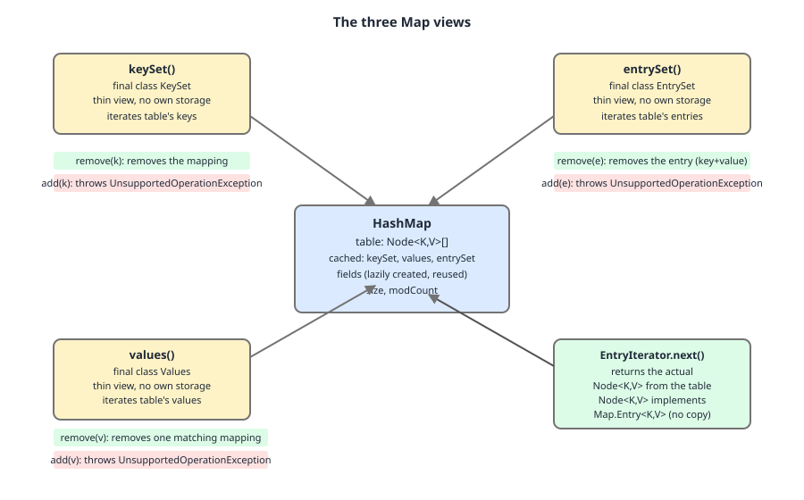

# 02 Java Collections — Immutability and views — INTERMEDIATE (§2.3.6–2.3.9)

**Target version: Java 21 LTS.** | [Index](../00-index.md)
Previous: [immutable-collections/01-views-copies-snapshots.md](01-views-copies-snapshots.md) · Next: [immutable-collections/01c-treemap-range-and-reversed-views.md](01c-treemap-range-and-reversed-views.md)

The three-way **view / copy / snapshot** distinction is defined in
[01-views-copies-snapshots.md](01-views-copies-snapshots.md). This file applies it to the three
`Map` accessors — `keySet()`, `values()`, `entrySet()` — which are one mechanism with three
projections, and which hand you a view whether or not you wanted one. The filename still says
"and-arrays-aslist" from an earlier split; the ordered views (`TreeMap` range views,
`descendingMap`/`reversed()`) now live in
[01c-treemap-range-and-reversed-views.md](01c-treemap-range-and-reversed-views.md) and
`Arrays.asList` in [01d-arrays-aslist.md](01d-arrays-aslist.md).

All transcripts below are real output from **JDK 21.0.7+8-LTS-245, macOS arm64**.

---

## The three views at a glance

Before the mechanism, the shape of the family. All three are *views* — no copying, no
snapshot, writes propagate — but they differ in which direction writes are allowed and what
the returned object's class actually is.

| Accessor | Returned class (JDK 21, measured) | Structural writes through the view | Read-through from source |
|---|---|---|---|
| `HashMap.keySet()` | `java.util.HashMap$KeySet` | `remove` yes, `add` throws | yes |
| `HashMap.values()` | `java.util.HashMap$Values` | `remove` yes (**one**), `add` throws | yes |
| `HashMap.entrySet()` | `java.util.HashMap$EntrySet` | `remove` yes, `add` throws, `Entry.setValue` yes | yes |

None of the three is a copy, and none is a snapshot. Which means the hard question is not
"does it track the map" — it always does — but *what object* each one hands you, and that is
where `entrySet()` differs sharply from its siblings.

---

## The three `Map` views (§2.3.6–2.3.9)

### One mechanism, three projections

Picture a `HashMap` as a single table of `Node` objects, each node holding
`hash / key / value / next`. There is exactly one copy of your data, and it lives in those
nodes. Now imagine three windows cut into the side of that table:

- the **key** window shows you only the `key` field of each node,
- the **value** window shows you only the `value` field,
- the **entry** window shows you the *whole node*.

None of the three windows owns anything. Each is a thin object holding nothing but an
implicit reference to the enclosing map — `HashMap.KeySet`, `HashMap.Values` and
`HashMap.EntrySet` are all declared as non-static inner classes, so each instance carries a
`HashMap.this` pointer and no other state. Every method on them is a redirect.

That is why "`keySet()`, `values()`, `entrySet()`" is **one concept, not three**. They share
the mechanism entirely and differ only in which field the window exposes — and one
consequence of that field choice, which is the interesting part.

### Why they exist

Before them, the alternative was `Enumeration` over keys plus a separate `get` per key —
`Hashtable.keys()` still shows the old shape. That forces a second hash lookup per element
just to reach the value you already walked past. `entrySet()` exists so that iterating a map
and reading both halves costs one traversal, not `n` extra lookups. This is why the
canonical map iteration is `for (var e : map.entrySet())` and not
`for (var k : map.keySet()) { var v = map.get(k); }` — the latter doubles the hash work.

### When to reach for which

- `entrySet()` — default. You want keys and values, or you want to write values back.
- `keySet()` — you want keys only, or you want key-set algebra: `map.keySet().retainAll(allowed)`
  prunes the map to allowed keys in one call.
- `values()` — you want values only. Accept that it is a `Collection`, not a `Set`: duplicates
  are expected, and `contains` costs O(n) rather than O(1).

If you want a **snapshot** rather than a view — because you are about to mutate the map while
walking it — none of these give you one. Copy explicitly: `List.copyOf(map.keySet())`.

### How they work — the source

The accessors cache their view object, so repeated calls return the identical instance. From
`HashMap.java`:

```java
// HashMap.java:396
transient Set<Map.Entry<K,V>> entrySet;

// HashMap.java:911-918
public Set<K> keySet() {
    Set<K> ks = keySet;
    if (ks == null) {
        ks = new KeySet();
        keySet = ks;
    }
    return ks;
}

// HashMap.java:1097-1100
public Set<Map.Entry<K,V>> entrySet() {
    Set<Map.Entry<K,V>> es;
    return (es = entrySet) == null ? (entrySet = new EntrySet()) : es;
}
```

Line by line: the field `entrySet` (`:396`) is `transient` — views are not serialized, they
are rebuilt on demand, which is only sound because they hold no data. `keySet()` reads the
cached field into a local, and only allocates a `KeySet` on the first call, storing it back.
`entrySet()` does the same with a compressed conditional. Two consequences: the view is
allocated lazily (a `HashMap` you only ever `get` from never pays for one), and
`m.keySet() == m.keySet()` is `true`. Neither field is volatile and neither accessor is
synchronized — that is safe only because `HashMap` is not thread-safe to begin with.

Now the three view bodies. `KeySet` (`HashMap.java:988-1022`), reduced to the methods that
matter:

```java
// HashMap.java:988-998
final class KeySet extends AbstractSet<K> {
    public final int size()                 { return size; }
    public final void clear()               { HashMap.this.clear(); }
    public final Iterator<K> iterator()     { return new KeyIterator(); }
    public final boolean contains(Object o) { return containsKey(o); }
    public final boolean remove(Object key) {
        return removeNode(hash(key), key, null, false, true) != null;
    }
    public final Spliterator<K> spliterator() {
        return new KeySpliterator<>(HashMap.this, 0, -1, 0, 0);
    }
}
```

`size()` returns the *map's* `size` field directly — the view has no count of its own.
`clear()` delegates to `HashMap.this.clear()`, which is why clearing a key set empties the
map. `contains(o)` becomes `containsKey(o)`, so it is an O(1) hash probe. `remove(key)` calls
`removeNode(hash(key), key, null, false, true)`: the third argument `null` is the value to
match and the fourth `false` means *do not* match on value, so any node with that key is
unlinked — the mapping is gone, not just the key.

There is no `add`. `KeySet` extends `AbstractSet`, whose `add` is `AbstractCollection.add`
throwing `UnsupportedOperationException`. **This is not a special check — it is the absence
of an override.** Which is the honest reason `add` cannot work: a key with no value would not
be a mapping.

`Values` (`HashMap.java:1048-1079`) is where the interesting divergence sits:

```java
// HashMap.java:1048-1055
final class Values extends AbstractCollection<V> {
    public final int size()                 { return size; }
    public final void clear()               { HashMap.this.clear(); }
    public final Iterator<V> iterator()     { return new ValueIterator(); }
    public final boolean contains(Object o) { return containsValue(o); }
    public final Spliterator<V> spliterator() {
        return new ValueSpliterator<>(HashMap.this, 0, -1, 0, 0);
    }
}
```

Two things are *missing* relative to `KeySet`, and both absences are the whole story.

First, `contains` delegates to `containsValue`, not to a hash probe — because the table is
indexed by key hash, values are unindexed:

```java
// HashMap.java:882-894
public boolean containsValue(Object value) {
    Node<K,V>[] tab; V v;
    if ((tab = table) != null && size > 0) {
        for (Node<K,V> e : tab) {
            for (; e != null; e = e.next) {
                if ((v = e.value) == value ||
                    (value != null && value.equals(v)))
                    return true;
            }
        }
    }
    return false;
}
```

The outer `for` walks every bucket in `table`; the inner `for` walks every node in that
bucket's chain. Total work is `table.length + size` comparisons in the worst case, with no
early exit other than finding the value. That is a **structural** O(n) — it is O(n) because
the loop is written over the whole table, not because of any measured timing. The proof is the
code shape; no benchmark is needed or offered.

Second, `Values` declares **no `remove`**. So `values().remove(v)` resolves to
`AbstractCollection.remove`:

```java
// AbstractCollection.java:273-291
public boolean remove(Object o) {
    Iterator<E> it = iterator();
    if (o==null) {
        while (it.hasNext()) {
            if (it.next()==null) {
                it.remove();
                return true;
            }
        }
    } else {
        while (it.hasNext()) {
            if (o.equals(it.next())) {
                it.remove();
                return true;
            }
        }
    }
    return false;
}
```

`return true` sits **inside** the loop, immediately after the first `it.remove()`. There is
no continuation. That is the proof of §2.3.7's "removes *one* matching mapping": the method
is a linear scan that stops at the first hit. `it.remove()` is `HashIterator.remove`
(`HashMap.java:1614-1623`), which calls `removeNode(p.hash, p.key, null, false, false)` on
the node just returned — so the mapping whose *value* matched is deleted by its *key*.

`EntrySet` (`HashMap.java:1102-1140`) exposes the node itself:

```java
// HashMap.java:1102-1122
final class EntrySet extends AbstractSet<Map.Entry<K,V>> {
    public final int size()                 { return size; }
    public final void clear()               { HashMap.this.clear(); }
    public final Iterator<Map.Entry<K,V>> iterator() {
        return new EntryIterator();
    }
    public final boolean contains(Object o) {
        if (!(o instanceof Map.Entry<?, ?> e))
            return false;
        Object key = e.getKey();
        Node<K,V> candidate = getNode(key);
        return candidate != null && candidate.equals(e);
    }
    public final boolean remove(Object o) {
        if (o instanceof Map.Entry<?, ?> e) {
            Object key = e.getKey();
            Object value = e.getValue();
            return removeNode(hash(key), key, value, true, true) != null;
        }
        return false;
    }
}
```

`contains` is O(1): it probes by the candidate's key via `getNode`, then compares the whole
entry. `remove` passes `matchValue = true` (the fourth argument) — so removing an entry
requires **both** key and value to match, unlike `keySet().remove` which matches key only.
That asymmetry is deliberate: `entrySet().remove(e)` means "remove this exact mapping".

And the iterator:

```java
// HashMap.java:1636-1639
final class EntryIterator extends HashIterator
    implements Iterator<Map.Entry<K,V>> {
    public final Map.Entry<K,V> next() { return nextNode(); }
}
```

`nextNode()` returns `Node<K,V>`. `EntryIterator.next()` returns it unchanged, widened to
`Map.Entry`. **No wrapper, no copy.** Compare its siblings at `:1626-1634`, which project a
single field: `KeyIterator.next()` is `nextNode().key`, `ValueIterator.next()` is
`nextNode().value`. `EntryIterator` alone hands you the storage object.

That storage object is:

```java
// HashMap.java:281-306
static class Node<K,V> implements Map.Entry<K,V> {
    final int hash;
    final K key;
    V value;
    Node<K,V> next;

    public final K getKey()        { return key; }
    public final V getValue()      { return value; }

    public final V setValue(V newValue) {
        V oldValue = value;
        value = newValue;
        return oldValue;
    }
}
```

`hash` and `key` are `final`; `value` and `next` are not. `setValue` assigns straight to the
node's `value` field — no map method is called, no `modCount` is bumped. That is §2.3.8's
write-through in three lines: the entry *is* the mapping, so writing the entry writes the
map. It also explains why `setValue` during iteration is the one mutation that does not throw
`ConcurrentModificationException` — it changes no structure.

### The picture

Look at the single `Node` chain in the middle: all three views point at it, and the labels on
the arrows show which field each view projects and what `remove` through that view actually
does to the table.



### The comparison

| | `keySet()` | `values()` | `entrySet()` |
|---|---|---|---|
| Type | `Set<K>` | `Collection<V>` | `Set<Map.Entry<K,V>>` |
| Iterator yields | `node.key` | `node.value` | **the `Node` itself** |
| `remove(x)` | deletes the mapping with that key | deletes **exactly one** mapping with that value | deletes the mapping only if key **and** value match |
| `remove` source | `KeySet.remove`, `HashMap.java:993` | inherited `AbstractCollection.remove`, `:273` | `EntrySet.remove`, `HashMap.java:1115` |
| `add` | throws `UnsupportedOperationException` | throws `UnsupportedOperationException` | throws `UnsupportedOperationException` |
| `contains` cost | O(1) — `containsKey` | **O(n)** — `containsValue` walks the table | O(1) — `getNode` then `equals` |
| Element mutable? | no (`key` is `final`) | n/a | yes — `setValue` writes through |
| `clear()` | empties the map | empties the map | empties the map |

### Runnable

```java
import java.util.*;

public class Views {
    public static void main(String[] args) {
        Map<String, Integer> m = new HashMap<>();
        m.put("a", 1);
        System.out.println("keySet   class = " + m.keySet().getClass().getName());
        System.out.println("values   class = " + m.values().getClass().getName());
        System.out.println("entrySet class = " + m.entrySet().getClass().getName());
        System.out.println("keySet() == keySet() -> " + (m.keySet() == m.keySet()));

        // keySet(): remove deletes the mapping, add throws.
        Map<String, Integer> k = new HashMap<>(Map.of("a", 1, "b", 2));
        k.keySet().remove("a");
        System.out.println("after keySet().remove(\"a\") map = " + k);
        try {
            k.keySet().add("z");
        } catch (UnsupportedOperationException e) {
            System.out.println("keySet().add caught: " + e.getClass().getSimpleName());
        }

        // values(): remove kills exactly one of two equal values.
        Map<String, Integer> v = new LinkedHashMap<>();
        v.put("x", 7);
        v.put("y", 7);
        v.put("z", 9);
        System.out.println("before    = " + v);
        System.out.println("remove(7) = " + v.values().remove(7));
        System.out.println("after     = " + v + "  still has a 7 = " + v.containsValue(7));

        // entrySet(): setValue writes through, and the entry is the live Node.
        Map<String, Integer> n = new HashMap<>();
        n.put("a", 1);
        Map.Entry<String, Integer> held = n.entrySet().iterator().next();
        System.out.println("entry class = " + held.getClass().getName());
        n.put("a", 42);
        System.out.println("after map.put(\"a\",42) held.getValue() = " + held.getValue());
        n.remove("a");
        held.setValue(999);
        System.out.println("after remove + setValue: held = " + held + ", map = " + n);
    }
}
```

Real output:

```
keySet   class = java.util.HashMap$KeySet
values   class = java.util.HashMap$Values
entrySet class = java.util.HashMap$EntrySet
keySet() == keySet() -> true
after keySet().remove("a") map = {b=2}
keySet().add caught: UnsupportedOperationException
before    = {x=7, y=7, z=9}
remove(7) = true
after     = {y=7, z=9}  still has a 7 = true
entry class = java.util.HashMap$Node
after map.put("a",42) held.getValue() = 42
after remove + setValue: held = a=999, map = {}
```

`{x=7, y=7, z=9}` losing only `x` is §2.3.7 proved by execution. The last two lines are
§2.3.9's trap made visible: the entry tracked the map's `put` (it *is* the node), then after
`remove` it kept living as a detached object whose `setValue` wrote into memory nothing reads.

### The gotcha (§2.3.9) — and what "retaining a Node" really costs

**Pitfall:** the wrong belief is that a `Map.Entry` from `entrySet()` is a
key-value pair object you may stash in a list, a cache, or a field. The symptom is a
collection of entries that silently disagrees with the map — some elements track later
mutations, some are frozen at the moment their key was removed, and `setValue` on a removed
entry succeeds while changing nothing. The fix: never store the entry. Copy it —
`Map.entry(e.getKey(), e.getValue())` for an immutable pair, or read the two fields out.

Two behaviours worth being exact about, because guesswork here is common:

**Resize does not invalidate a retained node.** `HashMap.resize` relinks existing `Node`
objects into a bigger table; it does not reconstruct them. So a node held across a resize
remains the map's live storage, and mutating it still mutates the map:

```
== retained Node survives a resize ==
keep            = 1=MUTATED
map.get(1)      = MUTATED
same object?    = true
```

That is *worse* than invalidation, not better — the stale reference stays dangerously live.

**Removal detaches it.** `removeNode` unlinks the node from its chain but leaves the object
intact, key and value still readable. `setValue` on it then mutates unreachable memory. The
transcript above (`held = a=999, map = {}`) is exactly this.

**Insight:** `HashMap`'s `EntrySet` declares **no `toArray` override**. `KeySet` and `Values`
both do (`HashMap.java:1000-1006` and `:1057-1063`, routing to `keysToArray`/`valuesToArray`),
but `EntrySet` has none — so `entrySet().toArray()` falls back to `AbstractCollection.toArray`,
which iterates and stores whatever the iterator returned. The array therefore holds the live
nodes. Streams behave the same way, via `EntrySpliterator`. Measured:

```
toArray()[0] class   = java.util.HashMap$Node
after setValue via array element, map = {a=555}
stream element class = java.util.HashMap$Node
```

This is a real divergence from `EnumMap`, which the sibling file in this set found building
snapshots. Measured on the same JVM:

```
EnumMap iterator element class = java.util.EnumMap$EntryIterator$Entry
EnumMap toArray()[0] class      = java.util.AbstractMap$SimpleEntry
```

So `EnumMap.entrySet().toArray()` gives you detached `AbstractMap.SimpleEntry` copies —
snapshots — while `HashMap.entrySet().toArray()` gives you live storage. **Do not generalise
either behaviour across `Map` implementations.** `Map.Entry`'s contract deliberately leaves
entry lifetime undefined outside iteration, and implementations use that latitude differently.

**Interview:** "What does `entrySet()` return for a `HashMap`?" — the actual `HashMap.Node`
objects; `Node implements Map.Entry`, `EntryIterator.next()` is literally `return nextNode()`,
so `setValue` writes the table directly and retaining an entry beyond its iteration is a bug.

> The three `Map` accessors return cached, stateless inner-class views over the one underlying
> table, differing only in which field they project — and because `entrySet()` projects the
> whole `HashMap.Node`, its elements are live storage, not pairs you may keep.

---

## Pitfalls

### Believing `values().remove(v)` removes every mapping with that value

**Wrong**

```java
Map<String, Integer> m = new LinkedHashMap<>();
m.put("x", 7); m.put("y", 7); m.put("z", 9);
m.values().remove(7);
System.out.println(m);                      // {y=7, z=9}
System.out.println(m.containsValue(7));     // true
```

**Right**

```java
Map<String, Integer> m = new LinkedHashMap<>();
m.put("x", 7); m.put("y", 7); m.put("z", 9);
m.values().removeIf(v -> v.equals(7));      // or removeAll(Set.of(7))
System.out.println(m);                      // {z=9}
```

**Why people believe it:** `Set.remove` on a `Set` really does remove "the" element, because
sets have no duplicates. `values()` is a `Collection`, not a `Set`, and `Values` declares no
`remove` at all, so it inherits `AbstractCollection.remove` (`AbstractCollection.java:273`),
whose `return true` is inside the scan loop — first hit wins, then it stops.

### Retaining a `Map.Entry` from `entrySet()`

**Wrong**

```java
Map<String, Integer> m = new HashMap<>(Map.of("a", 1));
Map.Entry<String, Integer> held = m.entrySet().iterator().next();
m.remove("a");
held.setValue(999);
System.out.println(held + " | " + m);       // a=999 | {}
```

**Right**

```java
Map<String, Integer> m = new HashMap<>(Map.of("a", 1));
Map.Entry<String, Integer> snap = m.entrySet().stream()
        .findFirst()
        .map(e -> Map.entry(e.getKey(), e.getValue()))   // immutable copy
        .orElseThrow();
m.remove("a");
System.out.println(snap + " | " + m);       // a=1 | {}
```

**Why people believe it:** `Map.Entry` reads like a value type — a pair. For `HashMap` it is
the storage: `Node implements Map.Entry` (`HashMap.java:281`) and `EntryIterator.next()` is
`return nextNode()` (`:1638`). Worse, `EntrySet` has no `toArray` override, so
`toArray()` and streams also hand out live nodes — while `EnumMap` in the same JDK hands out
`AbstractMap$SimpleEntry` copies, which is exactly why the behaviour feels inconsistent.

---

## Cheat sheet

| Claim | Truth (JDK 21) | Source |
|---|---|---|
| view classes | `HashMap$KeySet` / `$Values` / `$EntrySet`, non-static inner, no state | `HashMap.java:988/1048/1102` |
| allocation | lazy, then cached in a `transient` field — so `m.keySet() == m.keySet()` | `HashMap.java:396`, `:911-918` |
| `keySet().remove(k)` | deletes the mapping (`matchValue = false`) | `HashMap.java:993` |
| `add` on any of the three | `UnsupportedOperationException` — **no override exists**, not a guard | inherited `AbstractCollection.add` |
| `values().remove(v)` | deletes **one** matching mapping, then stops | `AbstractCollection.java:273-291` |
| why only one | `Values` declares no `remove`; the inherited scan `return`s on first hit | `AbstractCollection.java:284-287` |
| remove all matching values | `values().removeIf(...)` or `values().removeAll(Set.of(v))` | — |
| `values().contains(v)` | **O(n)** — `containsValue` walks every bucket and chain | `HashMap.java:882-894` |
| `keySet().contains(k)` | O(1) — `containsKey` | `HashMap.java:992` |
| `entrySet().contains(e)` | O(1) — `getNode` then `equals` | `HashMap.java:1108` |
| `entrySet().remove(e)` | needs key **and** value to match (`matchValue = true`) | `HashMap.java:1115` |
| `clear()` on any view | empties the whole map | `HashMap.java:990/1050/1104` |
| `entry.setValue(v)` | writes the node's `value` field; bumps no `modCount`, so never throws CME | `HashMap.java:302-306`, `:1604` |
| `entrySet()` element class | `java.util.HashMap$Node` — the map's storage | `HashMap.java:1638` |
| `Node`'s final fields | `hash` and `key`; `value` and `next` are mutable | `HashMap.java:282-285` |
| `entrySet().toArray()` | live `Node`s — `EntrySet` has **no** `toArray` override | `HashMap.java:1102-1140` |
| `keySet().toArray()` / `values().toArray()` | copies, via `keysToArray`/`valuesToArray` | `HashMap.java:1000-1006`, `:1057-1063` |
| `EnumMap.entrySet().toArray()` | `AbstractMap$SimpleEntry` **copies** — liveness is per-implementation | measured |
| retained entry across `resize` | stays live and mutating — `resize` relinks the same `Node`s | measured |
| retained entry after `remove` | detached but readable; `setValue` writes unreachable memory | measured |
| safe way to keep a pair | `Map.entry(e.getKey(), e.getValue())`; snapshot a view with `List.copyOf` | — |

---

## Self-test

**Q1.** A map has `{x=7, y=7, z=9}`. What does `map.values().remove(7)` return, and what is the map afterwards?

<details><summary>Answer</summary>

Returns `true`; the map becomes `{y=7, z=9}` (with `LinkedHashMap` ordering — with `HashMap`
one of the two `7` mappings goes, which one is unspecified). `HashMap.Values`
(`HashMap.java:1048-1079`) declares no `remove`, so the call lands on
`AbstractCollection.remove` (`AbstractCollection.java:273-291`), a linear scan whose
`return true` is inside the loop right after the first `it.remove()`. First match wins and the
scan stops. Use `values().removeIf(...)` or `values().removeAll(Set.of(7))` to remove all.

</details>

**Q2.** Prove `values().contains(v)` is O(n) without running a benchmark.

<details><summary>Answer</summary>

`Values.contains(o)` is `return containsValue(o);` (`HashMap.java:1052`). `containsValue`
(`:882-894`) is a nested loop: the outer `for (Node<K,V> e : tab)` visits every bucket of
`table`, the inner `for (; e != null; e = e.next)` visits every node in that bucket's chain.
Worst case it touches `table.length + size` positions with no index to short-circuit on,
because the table is hashed by *key*, not value. The cost is O(n) by the shape of the code —
a structural argument, not a timing one. Contrast `KeySet.contains` (`:992`), which is
`containsKey` and probes one bucket.

</details>

**Q3.** What exactly does `entrySet().iterator().next()` return for a `HashMap`, and why is retaining it a bug?

<details><summary>Answer</summary>

`java.util.HashMap$Node` — the map's own storage object. `Node implements Map.Entry`
(`HashMap.java:281`) and `EntryIterator.next()` is `return nextNode();` (`:1638`), with no
wrapper. So `getValue()` tracks later `put`s to that key, and `setValue` writes the table
directly (`:302-306`). Retaining it is a bug because the object's relationship to the map is
undefined afterwards: a `resize` relinks the same node objects, so the reference stays live
and mutating; a `remove` detaches the node but leaves it readable, so `setValue` on it
succeeds and writes memory nothing reads. Copy instead:
`Map.entry(e.getKey(), e.getValue())`.

</details>

**Q4.** `HashMap.entrySet().toArray()` — live entries or copies? What about `EnumMap`?

<details><summary>Answer</summary>

`HashMap`: **live**. `EntrySet` (`HashMap.java:1102-1140`) has no `toArray` override — unlike
`KeySet` (`:1000-1006`) and `Values` (`:1057-1063`), which route to
`keysToArray`/`valuesToArray`. So it inherits `AbstractCollection.toArray`, which stores
whatever the iterator returned: `HashMap$Node`. Streams behave identically. Measured, calling
`setValue` on an array element mutates the map.

`EnumMap`: **copies**. Its `toArray()[0]` is `java.util.AbstractMap$SimpleEntry`, a detached
snapshot, even though its iterator yields `EnumMap$EntryIterator$Entry`. So entry liveness is
per-implementation, not a `Map` guarantee — never generalise it.

</details>

**Q5.** Why does `entrySet().remove(e)` need both key and value to match, when `keySet().remove(k)` needs only the key?

<details><summary>Answer</summary>

Both funnel into the same private method with a different `matchValue` argument.
`KeySet.remove` (`HashMap.java:993-995`) calls
`removeNode(hash(key), key, null, false, true)` — the fourth argument `false` means "do not
match on value", so any node with that key is unlinked. `EntrySet.remove`
(`HashMap.java:1115-1122`) extracts both halves and calls
`removeNode(hash(key), key, value, true, true)` — `matchValue = true`, so the node's current
value must also equal the entry's. The semantics follow from what the argument *is*:
"remove this key" versus "remove this exact mapping". So
`entrySet().remove(Map.entry("a", 1))` on `{a=2}` removes nothing and returns `false`.

</details>

**Q6.** Why does calling `entry.setValue(v)` while iterating a `HashMap` not throw `ConcurrentModificationException`?

<details><summary>Answer</summary>

Because it makes no structural change and touches no counter.
`Node.setValue` (`HashMap.java:302-306`) is three lines — save the old value, assign
`value = newValue`, return the old. It calls no map method and does not touch `modCount`. The
iterator's fail-fast check is `if (modCount != expectedModCount) throw new
ConcurrentModificationException();` at `HashMap.java:1604`, inside `nextNode()`; since
`modCount` never moved, the check passes. This is why `entrySet()`'s Javadoc explicitly
carves out "the `setValue` operation on a map entry returned by the iterator" from the list of
modifications that make iteration undefined (`HashMap.java:1086-1088`), and it is the sanctioned
way to bulk-rewrite values in place. Contrast `map.put` on a *new* key during iteration, which
does bump `modCount` and does throw.

</details>

---

**Leaves covered:** 2.3.6–2.3.9 (4 leaves)
**Leaves deferred:** none
**Diagrams included:** D-36
**Target version:** Java 21 LTS
**Lines:** 632
