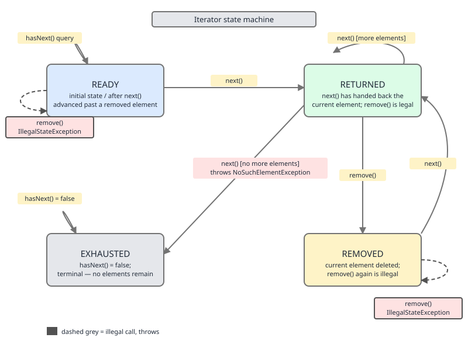

# 02 Java Collections — Iteration — BASICS (§1.5 Iteration)

**Target version: Java 21 LTS.** | [Index](../00-index.md)
Previous: [contracts/05-wildcards-and-pecs.md](../contracts/05-wildcards-and-pecs.md) · Next: [iteration/02-fail-fast-fail-safe.md](02-fail-fast-fail-safe.md)

Every collection traversal in Java funnels through one of four small interfaces — `Iterator`, `ListIterator`, `Enumeration`, `Spliterator` — and the enhanced-for loop is sugar over the first. This file covers how that sugar desugars, the state machine every `Iterator` obeys, what `remove` costs per implementation, the three ways to walk a `Map` (and why two of them are wasteful), and the four legal ways to mutate a collection while iterating it. `modCount`/`expectedModCount` mechanics and the full fail-fast/fail-safe/weakly-consistent taxonomy are deferred to `02-fail-fast-fail-safe.md` — here they are only named at the point they matter.

## Hierarchy before details

| Interface | Core methods | Direction | Supports mutation | Fail-fast? | When to use |
|---|---|---|---|---|---|
| `Iterator<E>` | `hasNext()`, `next()`, `remove()` | forward only | `remove()` only | yes, on most `java.util` collections | default traversal; the enhanced-for target |
| `ListIterator<E>` | adds `hasPrevious()`, `previous()`, `set()`, `add()`, `nextIndex()`, `previousIndex()` | both directions | `remove()`, `set()`, `add()` | yes | `List`-only; in-place replace or insert during a walk |
| `Enumeration<E>` | `hasMoreElements()`, `nextElement()` | forward only | none | no (no concept of it) | legacy pre-Collections classes (`Vector`, `Hashtable`, `StringTokenizer`) |
| `Spliterator<E>` | `tryAdvance()`, `trySplit()`, `forEachRemaining()`, `estimateSize()`, `characteristics()` | forward, splittable | none | source-dependent | parallel streams, bulk traversal — covered in the streams notes |

**Insight:** `Iterator` and `ListIterator` are the only two with a `remove` you should reach for; `Enumeration` predates the `Collection` framework entirely (Java 1.0) and `Spliterator` (Java 8) exists to be split across threads, not to be hand-rolled.

## 1.5.1 Enhanced-for desugaring `[SOURCE]`

**Mental model.** `for (String s : list)` is not a language primitive — the compiler rewrites it before bytecode generation. There are exactly two rewrite rules, chosen by the static type of the thing you loop over.

**Why it exists.** Java needed loop syntax that reads declaratively ("for each element") without adding a new runtime abstraction. JLS §14.14.2 reuses the existing `Iterable`/array machinery instead of inventing one.

**When to reach for it, and when not.** Use it whenever you don't need the index, don't need to remove elements, and don't need to know your position. Drop to an explicit `Iterator` when you need `remove()`; drop to an indexed loop when you need the index or must go backwards.

**How it works.** For any expression whose static type implements `Iterable<T>`, the compiler emits an `Iterator<T>`, calls `hasNext()` as the loop guard, and calls `next()` once per iteration to bind the loop variable. For an array type `T[]`, the compiler instead emits a classic indexed loop bounded by `array.length`, captured once into a local so it isn't re-read every iteration.


**Example.**
```java
import java.util.List;

public final class DesugarDemo {

    public static int sumList(List<Integer> nums) {
        int total = 0;
        for (int n : nums) {          // desugars to an Iterator<Integer> loop
            total += n;
        }
        return total;
    }

    public static int sumArray(int[] nums) {
        int total = 0;
        for (int n : nums) {          // desugars to an indexed loop over nums.length
            total += n;
        }
        return total;
    }
}
```

**Gotcha.** The two rewrites have different costs: the array form is a plain indexed loop (no allocation), while the `Iterable` form allocates an `Iterator` object per loop entry unless the JIT proves it can be scalar-replaced. For hot loops over primitive arrays this is one reason array access can outrun `ArrayList<Integer>` access — boxing aside.

**Interview:** be ready to write out the desugared form of both cases from memory; interviewers use this to check you know the loop isn't magic.

> The enhanced-for loop is compiler sugar: `Iterable` targets desugar to an `Iterator` `hasNext`/`next` loop, array targets desugar to an indexed loop bounded by a captured `length`.

## 1.5.2 The `Iterator` state machine

**Mental model.** An `Iterator` is a tiny state machine with a cursor sitting between elements. Each call to `next()` advances the cursor and hands you the element just crossed; `remove()` deletes that just-returned element and is only legal immediately after `next()`.

**Why it exists.** Separating "where am I" (the iterator) from "what am I iterating" (the collection) lets one collection support many independent, simultaneous traversals without any of them storing traversal state internally.

**When to reach for it, and when not.** Reach for the raw `Iterator` when you need conditional removal during a single forward pass. Don't reach for it when `removeIf` (§1.5.6) already expresses the same intent — it is both terser and, for `ArrayList`, faster.

**How it works.** Internally most implementations track a `cursor` (next index to return) and a `lastRet` (index last returned, or -1 if none/removed). `next()` reads at `cursor`, advances it, and sets `lastRet = cursor - 1`. `remove()` requires `lastRet != -1`; it deletes the element at `lastRet`, resets `lastRet` to -1, and rolls `cursor` back by one so a subsequent `next()` doesn't skip an element. Calling `remove()` twice in a row, or before any `next()`, finds `lastRet == -1` and throws `IllegalStateException`.



**Example.**
```java
import java.util.ArrayList;
import java.util.Iterator;
import java.util.List;

public final class IteratorStateDemo {

    public static void removeEvens(List<Integer> nums) {
        Iterator<Integer> it = nums.iterator();
        while (it.hasNext()) {
            int n = it.next();
            if (n % 2 == 0) {
                it.remove();          // legal: lastRet was just set by next()
            }
        }
    }

    public static void illegalDoubleRemove(List<Integer> nums) {
        Iterator<Integer> it = nums.iterator();
        it.next();
        it.remove();
        it.remove();                  // throws IllegalStateException: lastRet already -1
    }
}
```

**Gotcha.** `remove()` before any `next()` call, or two `remove()` calls back to back, both throw `IllegalStateException` — not because the collection is broken, but because the iterator has no "last returned element" to delete.

> `Iterator` is a cursor-based state machine where `remove()` is only legal exactly once per `next()`, enforced by an internal "last returned" pointer that resets to none after use.

## 1.5.3 `Iterator.remove` is optional `[TRAP]`

**Mechanism.** `Iterator.remove()` is a default method in the interface that throws `UnsupportedOperationException` by default; concrete iterators override it only if the backing collection is structurally mutable. `ArrayList`, `LinkedList`, `HashMap`/`HashSet`, `TreeMap`/`TreeSet` all override it and support removal.

**Gotcha.** the `List.of` factories, `Collections.unmodifiableList(List)`, and iterators from `Arrays.asList(E[])` (fixed-size, not truly immutable, but still no `remove`) all throw `UnsupportedOperationException` from `remove()` — the loop runs fine right up until you call it.

> `Iterator.remove()` is an optional operation; whether it works depends entirely on the backing collection, and calling it on an immutable or fixed-size one throws `UnsupportedOperationException`, not a compile error.

## 1.5.4 `Iterator.remove` cost per implementation

**Mental model.** "Iterator remove" is not one operation with one cost — it inherits the removal cost of whatever backing structure the iterator sits on top of, plus (for hashed/tree structures) the cost of finding the node the cursor is already standing on.

**Why it exists.** The API is deliberately structure-agnostic so callers can write one removal loop that works identically over a list, a hash table, or a tree — the cost difference is invisible at the call site, which is exactly why you must know it.

**When to reach for it, and when not.** Prefer `LinkedList` or a `HashMap`/`HashSet`-backed structure when you expect to remove many elements mid-traversal; an `ArrayList` iterator-remove loop that deletes a large fraction of the list degenerates to O(n²) because each `remove()` shifts the tail.

**How it works.**

| Backing collection | `Iterator.remove()` cost | Why |
|---|---|---|
| `ArrayList` | O(n) | shifts all elements after the removed index down by one, via `System.arraycopy` |
| `LinkedList` | O(1) | unlinks the current node; the iterator already holds a direct reference to it |
| `HashMap` / `HashSet` | O(1) amortized | the iterator holds the current bucket node; unlinking is pointer surgery, no rehash |
| `TreeMap` / `TreeSet` | O(log n) | removal from a red-black tree may rebalance, costing a tree-height walk |
| Immutable (`List.of`, etc.) | unsupported — throws `UnsupportedOperationException` | no backing mutation is ever possible |
| `CopyOnWriteArrayList` | unsupported on its iterator — throws `UnsupportedOperationException` | the snapshot iterator is read-only by design; see `02-fail-fast-fail-safe.md` |

**Example.**
```java
import java.util.LinkedList;
import java.util.Iterator;
import java.util.List;

public final class RemoveCostDemo {

    public static void removeAllNegatives(List<Integer> nums) {
        // O(1) per removal if nums is a LinkedList, O(n) per removal if ArrayList
        Iterator<Integer> it = nums.iterator();
        while (it.hasNext()) {
            if (it.next() < 0) {
                it.remove();
            }
        }
    }

    public static void main(String[] args) {
        List<Integer> list = new LinkedList<>(List.of(1, -2, 3, -4, 5));
        removeAllNegatives(list);
        System.out.println(list); // [1, 3, 5]
    }
}
```

**Gotcha.** The escape hatch for the `ArrayList` O(n)-per-removal trap is `removeIf` (§1.5.6), which does a single O(n) compaction pass instead of n shifts — always prefer it over a manual iterator-remove loop on an `ArrayList` when the loop body is a pure predicate.

> `Iterator.remove()` costs exactly what removal already costs on the backing structure — O(n) shift for `ArrayList`, O(1) unlink for `LinkedList`/hash tables, O(log n) rebalance for trees, and outright unsupported on immutable or copy-on-write collections.

## 1.5.5 `ListIterator` bidirectional traversal and mutation

**Mechanism.** `ListIterator` extends `Iterator` with `hasPrevious()`/`previous()` for backward movement and `set(E)`/`add(E)` for in-place replacement and insertion — all relative to the cursor position, obtainable via `list.listIterator()` or `list.listIterator(int startIndex)`.

**Gotcha.** `set()` follows the same "only right after `next()`/`previous()`" rule as `remove()` — call it twice, or before any `next()`/`previous()`, and it throws `IllegalStateException`. `add()` is looser: it can be called any time and does not disturb a subsequent `remove()`/`set()` legality window in the way `remove()` does.

```java
import java.util.ArrayList;
import java.util.List;
import java.util.ListIterator;

List<String> names = new ArrayList<>(List.of("ann", "bob", "cid"));
ListIterator<String> lit = names.listIterator();
while (lit.hasNext()) {
    String s = lit.next();
    if (s.equals("bob")) {
        lit.set("BOB");           // in-place replace, no shift
        lit.add("bobby");         // insert right after "BOB"
    }
}
// names == [ann, BOB, bobby, cid]
```

> `ListIterator` is `Iterator` plus reverse traversal and in-place `set`/`add`, available only on `List` implementations, letting you replace or insert during a single pass without a second collection.

## 1.5.6 `removeIf` `[SOURCE]`

**Mental model.** `removeIf` is the collection saying "give me a predicate and I'll remove everything that matches, in one internal pass" — no external iterator, no manual state tracking, no chance of forgetting `remove()`.

**Why it exists.** Manual iterator-remove loops are a common source of bugs (calling `remove()` at the wrong time, or removing via the collection's own `remove(Object)` mid-iteration, which throws `ConcurrentModificationException`). `removeIf`, added in Java 8 as a default method on `Collection`, makes the "correct by construction" version the default API.

**When to reach for it, and when not.** Reach for it any time removal is expressible as a pure predicate over each element. Don't reach for it when you need to also transform surviving elements, need indices, or need to stop early — it always visits every element once.

**How it works.** `Collection.removeIf`'s default implementation is a plain iterator-remove loop. `ArrayList` overrides it with a two-pass, bitset-driven implementation: pass one walks the backing array evaluating the predicate and records matches in a `BitSet` (no shifting yet); pass two compacts the array once, copying only the surviving elements down in a single linear sweep. This turns what would be O(n) removals of O(n) each (O(n²) worst case) into a single O(n) pass.

**Example.**
```java
import java.util.ArrayList;
import java.util.List;

public final class RemoveIfDemo {

    public static void main(String[] args) {
        List<Integer> nums = new ArrayList<>(List.of(1, 2, 3, 4, 5, 6));
        nums.removeIf(n -> n % 2 == 0);   // single O(n) pass, bitset-compact for ArrayList
        System.out.println(nums);          // [1, 3, 5]
    }
}
```

**Gotcha.** `removeIf` still throws `UnsupportedOperationException` on immutable collections — "one pass" doesn't mean "always allowed," it means "always correct when allowed." Compare with the naive loop at 1.5.14, which is the manual equivalent minus the bitset optimization.

> `removeIf` removes every element matching a predicate in a single correct-by-construction pass, and on `ArrayList` specifically does it via a bitset mark phase followed by one compaction sweep instead of per-element shifting.

## 1.5.7 `forEach` vs for loop `[TRAP]`

**Mental model.** `forEach(Consumer)` looks like a drop-in replacement for a for loop, but it is a single method call handed a lambda — which changes what `break`, exceptions, and concurrent-modification detection each mean.

**Why it exists.** `Iterable.forEach` (Java 8 default method) exists to let functional-style consumers avoid writing out the iterator boilerplate, and to give collections a hook to override with a faster internal-iteration path.

**When to reach for it, and when not.** Reach for it for a full, unconditional pass with no early exit. Don't reach for it when you need `break`/`continue`-with-label semantics, or need to `throw` a checked exception (the `Consumer` functional interface's `accept` method declares no checked exceptions, so any checked exception must be wrapped).

**How it works.** There is no `break` — `Consumer<T>.accept` returns `void` and the loop is entirely inside the library method, so the only way to stop early is to throw (typically an unchecked exception, or a custom sentinel) and catch it outside. Any checked exception thrown from the lambda body must be caught and rethrown wrapped, since `accept(T)` isn't declared to throw checked exceptions. For fail-fast collections, `forEach`'s modCount check happens once, after the whole pass completes (via `checkForComodification`-style validation at the end), not after every single element the way a manual iterator loop checks on every `next()` call.

**Example.**
```java
import java.util.List;

public final class ForEachTrapDemo {

    public static void main(String[] args) {
        List<Integer> nums = List.of(1, 2, 3, 4, 5);
        try {
            nums.forEach(n -> {
                if (n == 3) {
                    throw new RuntimeException("found 3"); // only way to "break"
                }
                System.out.println(n);
            });
        } catch (RuntimeException stop) {
            System.out.println("stopped: " + stop.getMessage());
        }
    }
}
```

**Gotcha.** Because the comodification check runs only at the end of `forEach`, a structural mutation that happens and then gets "fixed" back to the original size before the pass finishes can slip past detection entirely — a manual iterator loop, which checks on every `next()`, would have thrown immediately. See `02-fail-fast-fail-safe.md` for the full `modCount` mechanics behind this.

> `forEach` runs the whole traversal inside one library call with no `break`, forces any checked exception in the lambda to be wrapped, and — on fail-fast collections — validates structural consistency only once at the end rather than on every step.

## 1.5.8 `Iterable.forEach` default vs `ArrayList`'s override

**Mechanism.** `Iterable`'s default `forEach` is implemented as `for (T t : this) action.accept(t);` — it goes through the public `Iterator`. `ArrayList` overrides it to walk the backing `Object[]` directly by index, skipping iterator allocation entirely, and still performs a single `modCount` check per element plus one final check.

**Gotcha.** The override is why `arrayList.forEach(action)` is measurably faster than `arrayList.iterator()` + manual loop for hot paths — no `Iterator` object is allocated — but the two are not behaviorally identical: the override still detects concurrent structural modification, just without ever exposing an `Iterator` you could call `remove()` on.

> `ArrayList.forEach` bypasses `Iterator` allocation by walking its backing array directly by index, trading the generic default implementation for a specialized, allocation-free one that still preserves comodification checks.

## 1.5.9 `Enumeration` and `Enumeration.asIterator()` `[RESEARCH]`

**Mechanism.** `Enumeration<E>` predates the Collections Framework (Java 1.0) and is used by legacy classes `Vector`, `Hashtable`, and `StringTokenizer`. Its two methods, `hasMoreElements()` and `nextElement()`, map directly onto `Iterator`'s `hasNext()`/`next()`, but it has no `remove()` and is never fail-fast. Java 9 added a default method, `Enumeration.asIterator()`, that returns an `Iterator<E>` view adapting `hasMoreElements`/`nextElement` — that adapter's `remove()` throws `UnsupportedOperationException` since `Enumeration` has no removal concept to forward to.

**Gotcha.** The adapter is one-way and read-only — wrapping an `Enumeration` never gives you removal capability the original type didn't have.

> `Enumeration` is the pre-Collections traversal interface with no `remove` and no fail-fast behavior, and Java 9's `asIterator()` default method wraps it as a read-only `Iterator` whose `remove()` always throws.

## 1.5.10 `Collections.enumeration`/`Collections.list` for legacy interop

**Mechanism.** `Collections.enumeration(Collection<T>)` wraps a modern collection as an `Enumeration` for APIs that still demand one; `Collections.list(Enumeration<T>)` goes the other direction, draining an `Enumeration` into a new `ArrayList`.

**Gotcha.** `Collections.list` fully drains the `Enumeration` — it is single-use and cannot be replayed after conversion, matching `Enumeration`'s own forward-only, non-resettable nature.

> `Collections.enumeration`/`Collections.list` are the two conversion functions bridging modern collections and the legacy `Enumeration` interface, with `list` consuming its input in the process.

## 1.5.11 Iterating a `Map`: three ways, three costs

**Mental model.** A `Map` has no native "walk" — every traversal goes through one of three views (`entrySet()`, `keySet()`, `values()`), and two of the three do meaningfully different amounts of work for the same logical result.

**Why it exists.** `Map` deliberately exposes structural views rather than a single iteration method, because sometimes you only need keys, only need values, or need both — forcing one shape for all three would waste allocation in the common cases.

**When to reach for it, and when not.** Default to `entrySet()` whenever you need both the key and the value. Reach for `keySet()` alone only when you truly don't need values. Never reach for `keySet()` + `get(k)` when you need both — it is a strict cost regression with no upside.

**How it works.** `entrySet()` walks the map's internal table once, handing back the `Map.Entry` node already sitting at each slot — one table walk, one node touch per entry, cost O(n). `keySet()` + `get(k)` walks the table once for the keys, then for every key performs a second independent `hash(k)` + probe/lookup to fetch the value — one walk plus n extra hash lookups, cost O(2n) in operation count (still O(n) asymptotically, but literally double the work). `values()` walks the table once and returns just the value from each node touched, no key extraction — one walk, cost O(n), the cheapest option when keys aren't needed.


**Example.**
```java
import java.util.HashMap;
import java.util.Map;

public final class MapWalkDemo {

    public static void printCorrect(Map<String, Integer> scores) {
        for (Map.Entry<String, Integer> e : scores.entrySet()) {   // n operations
            System.out.println(e.getKey() + " = " + e.getValue());
        }
    }

    public static void printWasteful(Map<String, Integer> scores) {
        for (String key : scores.keySet()) {                       // n + n = 2n operations
            System.out.println(key + " = " + scores.get(key));
        }
    }

    public static int sumValues(Map<String, Integer> scores) {
        int total = 0;
        for (int v : scores.values()) {                             // n operations, no keys
            total += v;
        }
        return total;
    }
}
```

**Gotcha.** The `keySet()` + `get(k)` pattern is the single most common `Map`-iteration anti-pattern in code review — it compiles cleanly, reads fine, and silently doubles hashing/probing cost on every traversal. The escape hatch is simply reaching for `entrySet()` by habit whenever both key and value are needed.

> `Map` offers three traversal views — `entrySet()` (one walk, n operations, both key and value), `keySet()` plus `get` (one walk plus n extra lookups, 2n operations, key and value but wastefully), and `values()` (one walk, n operations, value only) — and `entrySet()` is the correct default whenever both are needed.

## 1.5.12 `descendingIterator` on `Deque` and `NavigableSet`

**Mechanism.** `Deque.descendingIterator()` and `NavigableSet.descendingIterator()` return an `Iterator` that walks the collection tail-to-head instead of head-to-tail — for `ArrayDeque` this is O(1) to obtain and O(1) per step just like the forward iterator; for `TreeSet` it walks the red-black tree in reverse in-order.

**Gotcha.** It returns a plain `Iterator`, not a `ListIterator` — so it supports `remove()` (deleting the just-returned element) but has no `set()`/`add()`, and no `hasPrevious()` to go back forward again mid-walk.

> `descendingIterator()` gives a reverse-order, forward-only `Iterator` (with `remove()` but no `set`/`add`) over a `Deque` or `NavigableSet`, at the same per-step cost as the corresponding forward iterator.

## 1.5.13 Iterating while mutating: the four legal strategies

**Mental model.** Mutating a collection mid-traversal is not universally forbidden — it is forbidden through the wrong channel. Four channels are legal because each one keeps the traversal's notion of "current state" consistent with the mutation.

**Why it exists.** The dangerous case is a mutation the iterator doesn't know about — calling `list.remove(x)` directly while a separate iterator is mid-walk desynchronizes the iterator's cached state from the collection's real state (detected via `modCount`, detailed in `02-fail-fast-fail-safe.md`). All four legal strategies route the mutation through a channel the traversal itself controls or accounts for.

**When to reach for it, and when not.** Pick the strategy matching what you need: iterator-remove for a single predicate-driven pass with early access to other iterator state, `removeIf` for a pure predicate with no other logic, collect-then-remove when the removal decision depends on data gathered across multiple elements, index-loop-backwards when you must use index-based `list.remove(int)` calls directly.

**How it works.**

| Strategy | Mechanism | Best for |
|---|---|---|
| Iterator `remove()` | mutate via the same iterator that's walking, so its internal cursor stays in sync | single-pass predicate removal, needs iterator elsewhere in loop body |
| `removeIf` | collection-internal single pass, no separate iterator to desync | pure predicate, no other per-element logic needed |
| Collect then remove | gather matches into a second list during a read-only pass, mutate the original after the pass ends | removal decision depends on cross-element state (e.g. "remove duplicates of the first occurrence") |
| Index loop backwards | plain `for (int i = list.size() - 1; i >= 0; i--)` calling `list.remove(i)` directly | index-based conditional removal without an iterator at all |

**Example.**
```java
import java.util.ArrayList;
import java.util.HashSet;
import java.util.List;
import java.util.Set;

public final class MutateWhileIteratingDemo {

    // Strategy 3: collect then remove — decision depends on cross-element state
    public static void removeDuplicates(List<String> names) {
        Set<String> seen = new HashSet<>();
        List<String> duplicates = new ArrayList<>();
        for (String n : names) {
            if (!seen.add(n)) {
                duplicates.add(n);
            }
        }
        names.removeAll(duplicates);
    }

    // Strategy 4: index loop backwards
    public static void removeShortNamesBackwards(List<String> names) {
        for (int i = names.size() - 1; i >= 0; i--) {
            if (names.get(i).length() < 3) {
                names.remove(i);
            }
        }
    }
}
```

> The four collision-free ways to remove while walking a collection are: iterator `remove()`, `removeIf`, collect-then-remove, and a backwards index loop — each keeps the traversal's view of the collection consistent with the mutation instead of desynchronizing it.

## 1.5.14 Index-loop-backwards is the only safe index direction `[TRAP]`

**Mechanism.** Removing at index `i` in an `ArrayList` shifts every subsequent element left by one. A forward index loop that just removed index `i` then advances to `i + 1` — but the element that used to be at `i + 1` has now shifted into slot `i`, so it gets silently skipped. A backward loop is immune: removing at `i` only shifts elements at indices greater than `i`, none of which the loop has visited yet or will re-visit incorrectly, since it next moves to `i - 1`.

**Gotcha.** The forward version doesn't throw or warn — it just quietly skips every element immediately following a removed one, producing a wrong answer that passes code review unless the reviewer traces indices by hand.

> Removing by index while iterating forward skips the element that shifts into the just-vacated slot, while iterating backward is immune because only already-visited indices ever shift — making backward the only safe direction for index-based removal.

## 1.5.15 Nested iteration over the same collection

**Mechanism.** Two independent `Iterator` instances obtained from the same collection (e.g. for a nested loop computing all pairs) are entirely safe as long as neither one structurally mutates the collection — each iterator holds its own cursor and its own snapshot of the `modCount` it last checked against, and read-only traversal never touches `modCount` at all.

**Gotcha.** The safety evaporates the instant either loop calls a structural mutator (`remove`, `add`, `clear`) — even one not going through an iterator — because that increments the shared `modCount` and the other iterator's next `hasNext()`/`next()` call will detect the mismatch. See `02-fail-fast-fail-safe.md` for the mechanism.

> Nested iteration over one collection with two separate iterators is safe precisely because no mutation occurs — each iterator tracks its own cursor independently, and the moment either side mutates structurally, the shared `modCount` desynchronizes both.

## 1.5.16 Weakly-consistent iterators — a third category

**Mechanism.** Fail-fast iterators (most `java.util` collections) throw `ConcurrentModificationException` on detecting concurrent structural change; fail-safe iterators (like `CopyOnWriteArrayList`'s) iterate a private snapshot and never see later changes at all. Weakly-consistent iterators — used by `ConcurrentHashMap`, `ConcurrentLinkedQueue`, and other `java.util.concurrent` collections — sit between the two: they never throw `ConcurrentModificationException`, are guaranteed to reflect the state at iterator-creation time, and may (but aren't guaranteed to) reflect modifications made after creation, without ever returning an element twice or throwing due to structural changes made during the walk.

**Gotcha.** "Weakly consistent" is not "eventually consistent" — there's no guarantee later updates will ever become visible to an in-progress iterator, only a guarantee that visible-or-not, the iteration itself stays safe and terminates cleanly.

> Weakly-consistent iterators, used throughout `java.util.concurrent`, never throw on concurrent modification and never duplicate elements, but make no promise about whether concurrent updates become visible during the walk — the full three-way fail-fast/fail-safe/weakly-consistent comparison is in `02-fail-fast-fail-safe.md`.

## Pitfalls

### "Calling `list.remove(x)` inside a for-each loop is fine, it's just one call"

**Wrong**
```java
import java.util.ArrayList;
import java.util.List;

List<Integer> nums = new ArrayList<>(List.of(1, 2, 3, 4));
for (int n : nums) {
    if (n == 2) {
        nums.remove(Integer.valueOf(2)); // throws ConcurrentModificationException
    }
}
```

**Right**
```java
import java.util.ArrayList;
import java.util.List;

List<Integer> nums = new ArrayList<>(List.of(1, 2, 3, 4));
nums.removeIf(n -> n == 2); // single correct-by-construction pass
```

**Why people believe it:** it's a single, ordinary-looking method call that "obviously" only removes one element — nothing about the syntax hints that the enhanced-for loop underneath is holding an iterator whose `modCount` snapshot the direct `remove` call just invalidated.

### "`Iterator.remove()` works the same on every collection"

**Wrong**
```java
import java.util.Iterator;
import java.util.List;

List<Integer> nums = List.of(1, 2, 3);
Iterator<Integer> it = nums.iterator();
it.next();
it.remove(); // throws UnsupportedOperationException — List.of is immutable
```

**Right**
```java
import java.util.ArrayList;
import java.util.Iterator;
import java.util.List;

List<Integer> nums = new ArrayList<>(List.of(1, 2, 3));
Iterator<Integer> it = nums.iterator();
it.next();
it.remove(); // fine — ArrayList's iterator overrides remove()
```

**Why people believe it:** `Iterator` declares `remove()` as if it were a universal capability, and most day-to-day code uses mutable `ArrayList`/`HashMap`, so the optional, throws-by-default nature of the method rarely surfaces until an immutable collection reaches the same code path.

### "Removing by forward index loop is the same as removing by backward index loop"

**Wrong**
```java
import java.util.ArrayList;
import java.util.List;

List<Integer> nums = new ArrayList<>(List.of(1, 2, 2, 3));
for (int i = 0; i < nums.size(); i++) {
    if (nums.get(i) == 2) {
        nums.remove(i); // skips the second '2' — it shifted into slot i
    }
}
// nums == [1, 2, 3]  -- one '2' survived unintentionally
```

**Right**
```java
import java.util.ArrayList;
import java.util.List;

List<Integer> nums = new ArrayList<>(List.of(1, 2, 2, 3));
for (int i = nums.size() - 1; i >= 0; i--) {
    if (nums.get(i) == 2) {
        nums.remove(i);
    }
}
// nums == [1, 3]
```

**Why people believe it:** index loops feel direction-agnostic in every other context (summing, printing, searching), so it's easy to assume removal is equally direction-agnostic — the asymmetry only exists because removal, uniquely, shifts later elements.

## Cheat sheet

| Situation | Use |
|---|---|
| Need both key and value from a `Map` | `entrySet()` — O(n), never `keySet()` + `get` |
| Need only values from a `Map` | `values()` — O(n), skips key extraction |
| Removing by predicate, no other loop logic | `removeIf` — single pass, bitset-compact on `ArrayList` |
| Removing with extra per-element logic | manual `Iterator.remove()` |
| Removal decision needs cross-element context | collect matches, then `removeAll`/`retainAll` after the pass |
| Removing by index directly | loop backwards from `size() - 1` to `0` |
| Need to replace elements in place while walking a `List` | `ListIterator.set()` |
| Need reverse traversal of a `Deque`/`NavigableSet` | `descendingIterator()` |
| Legacy API demands an `Enumeration` | `Collections.enumeration(collection)` |
| Have an `Enumeration`, need a modern `List` | `Collections.list(enumeration)` |

| `Iterator.remove()` cost | Collection |
|---|---|
| O(1) | `LinkedList`, `HashMap`/`HashSet` |
| O(log n) | `TreeMap`/`TreeSet` |
| O(n) | `ArrayList` |
| unsupported | immutable collections, `CopyOnWriteArrayList` |

## Self-test

**Q1.** What does `for (String s : list)` desugar to, and what does `for (int i : arr)` desugar to differently?

<details><summary>Answer</summary>

`for (String s : list)` desugars to an explicit `Iterator<String>` loop calling `hasNext()`/`next()`. `for (int i : arr)` desugars to a classic indexed loop bounded by `arr.length` captured once into a local — arrays have no `Iterator`, so the compiler falls back to index-based access instead.

</details>

**Q2.** Why does calling `iterator.remove()` twice in a row throw `IllegalStateException`?

<details><summary>Answer</summary>

`remove()` deletes the element identified by an internal "last returned" pointer, which is only set by `next()` (or `previous()` for `ListIterator`) and is cleared back to "none" after a successful `remove()`. The second call finds no last-returned element and throws, because there is nothing left to identify what to delete.

</details>

**Q3.** Rank `entrySet()`, `keySet()` + `get(k)`, and `values()` by the number of hash operations performed for an n-entry map, and explain the gap.

<details><summary>Answer</summary>

`entrySet()` and `values()` both perform n operations — one table walk, one node touch per entry, no re-hashing. `keySet()` + `get(k)` performs roughly 2n operations — the same table walk for the keys, plus an independent `hash(k)` + probe/lookup per key to fetch the corresponding value. The gap exists because `keySet()` throws away the value already sitting at each node during the walk, then pays to look it up again.

</details>

**Q4.** Why is `Iterator.remove()` O(1) on `LinkedList` but O(n) on `ArrayList`?

<details><summary>Answer</summary>

`LinkedList`'s iterator already holds a direct reference to the current node, so removal is a constant-time unlink of that node's neighbors. `ArrayList` stores elements contiguously in an array, so removing any element except the last requires shifting every subsequent element down by one via `System.arraycopy`, which is O(n) in the number of elements after the removal point.

</details>

**Q5.** What specifically does `ArrayList.removeIf` do differently from a naive iterator-remove loop, and why is it faster?

<details><summary>Answer</summary>

`ArrayList.removeIf` runs a two-pass algorithm: pass one evaluates the predicate against every element and records matches in a `BitSet` without shifting anything; pass two compacts the backing array in a single linear sweep, copying only surviving elements down once. A naive iterator-remove loop instead shifts the tail of the array on every single match, so removing k elements costs O(k * n) in the worst case versus `removeIf`'s single O(n) pass.

</details>

**Q6.** Why doesn't `forEach` support `break`, and what must you do to stop iteration early?

<details><summary>Answer</summary>

`forEach` takes a `Consumer<T>` whose `accept` method returns `void` and is called once per element entirely inside the library's own loop — there is no loop construct in your code to attach a `break` to. To stop early you must throw an exception (typically unchecked, or a custom sentinel type) from inside the lambda and catch it outside the `forEach` call.

</details>

**Q7.** Give one legal way to remove elements from a `List` while iterating that does not use `Iterator.remove()` or `removeIf()`.

<details><summary>Answer</summary>

Loop by index backwards, from `size() - 1` down to `0`, calling `list.remove(i)` directly. Because removal only shifts elements at indices greater than the one removed, and the loop is walking downward, no not-yet-visited or already-correctly-visited element is ever skipped.

</details>

**Q8.** Why does a forward index loop that removes matching elements by index silently skip elements, while nothing throws?

<details><summary>Answer</summary>

Removing at index `i` shifts every element after it left by one, so the element that used to sit at `i + 1` now sits at `i`. A forward loop that just processed `i` advances to `i + 1` next, skipping over the element that shifted into slot `i`. No exception fires because `list.remove(int)` called directly (not through an iterator) is a perfectly legal call — it just produces a logically wrong result.

</details>

**Q9.** How does a weakly-consistent iterator (e.g. on `ConcurrentHashMap`) differ from both a fail-fast and a fail-safe iterator?

<details><summary>Answer</summary>

A fail-fast iterator throws `ConcurrentModificationException` on detecting concurrent structural change. A fail-safe iterator (e.g. `CopyOnWriteArrayList`) iterates a private snapshot taken at creation time and never observes later changes at all. A weakly-consistent iterator does neither extreme: it never throws due to concurrent modification, is guaranteed to reflect the collection's state as of iterator creation, and may or may not reflect later concurrent updates, without ever duplicating an element or corrupting the walk.

</details>

**Q10.** Why is `Enumeration.asIterator()`'s `remove()` guaranteed to throw `UnsupportedOperationException`?

<details><summary>Answer</summary>

`Enumeration` has no concept of removal at all — it only exposes `hasMoreElements()` and `nextElement()`. The `asIterator()` adapter can only forward to methods that exist on the wrapped `Enumeration`, and since there is no removal method to forward to, its `remove()` implementation has no choice but to throw `UnsupportedOperationException`.

</details>

---

**Leaves covered:** 1.5.1–1.5.16 (16 leaves)
**Leaves deferred:** none
**Diagrams included:** D-09, D-11, D-12
**Target version:** Java 21 LTS
**Lines:** 600
