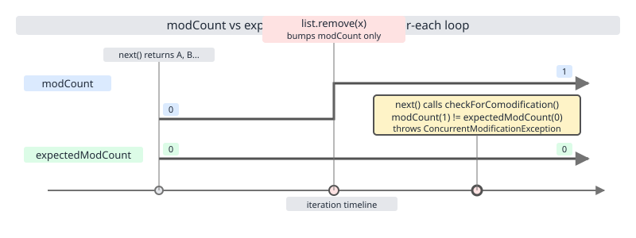
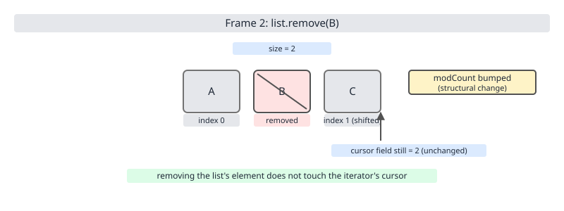
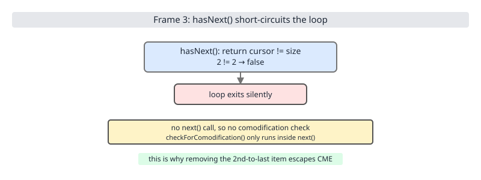

# 02 Java Collections — Iteration — INTERMEDIATE (§2.2 Fail-fast, fail-safe, weakly consistent)

**Target version: Java 21 LTS.** | [Index](../00-index.md)
Previous: [iteration/01-basics-iteration.md](01-basics-iteration.md) · Next: [iteration/03-internals-spliterator.md](03-internals-spliterator.md)

Every JDK iterator makes one of three completely different promises about what happens when the underlying collection changes mid-traversal: it can detect the change and blow up (fail-fast — `ArrayList`, `HashMap`), it can ignore the change entirely because it is walking a private copy taken at creation time (snapshot / fail-safe — `CopyOnWriteArrayList`), or it can keep walking the live structure without ever throwing, seeing some subset of the concurrent edits (weakly consistent — `ConcurrentHashMap`). Picking the wrong mental model for a given class is one of the most common sources of silent data loss and intermittent `ConcurrentModificationException` in production Java code, and the mechanism behind the first category — a pair of integer counters called `modCount` and `expectedModCount` — is deceptively simple to state and easy to reason about incorrectly.

## Hierarchy before details

| Category | Guarantee | One representative class |
|---|---|---|
| Fail-fast | Detects structural modification during iteration, throws `ConcurrentModificationException` on a best-effort basis | `ArrayList` |
| Snapshot (fail-safe) | Iterates a private array copy taken at iterator-creation time; concurrent mutations are invisible to the traversal | `CopyOnWriteArrayList` |
| Weakly consistent | Never throws `ConcurrentModificationException`; traverses the live structure and may or may not observe concurrent edits, but visits each element at most once | `ConcurrentHashMap` |

The full comparison — including memory cost and whether `iterator.remove()` even works — is table D-32 at §2.2.11–2.2.12, once both fail-safe and weakly-consistent iterators have been introduced individually.

## 2.2.1–2.2.2 `modCount`, `expectedModCount`, and `checkForComodification` `[SOURCE]`

**Mental model.** Think of every fail-fast collection as carrying a hidden odometer, `modCount`, that ticks up by one on every structural change. When you ask for an iterator, the iterator writes down the odometer reading into its own private field, `expectedModCount`. Every time you call `next()`, the iterator peeks at the live odometer and compares it to the number it wrote down. If they disagree, someone else turned the wheel while you were looking away, and the iterator refuses to continue.

**Why it exists.** `ArrayList`, `LinkedList`, `HashMap`, `HashSet`, and the other non-concurrent collections were never designed to be safely mutated while an iteration is in progress — doing so can corrupt internal array indices or hash-bucket chains and produce results that are wrong in ways far worse than an exception (skipped elements, duplicated elements, infinite loops, `ArrayIndexOutOfBoundsException`). `modCount` turns a silent, hard-to-reproduce corruption bug into a loud, reproducible one.

**When to reach for it, and when not.** You never reach for `modCount` directly — it is `protected` on `AbstractList` and package-private on `HashMap`, purely internal machinery. You reach for the *behavior* it produces: write code so that no thread ever performs a structural modification on a shared, non-concurrent collection while another thread (or the same thread's iterator) is mid-traversal. If you need concurrent read/write, reach for a class from §2.2.11 or §2.2.12 instead, not for a workaround around fail-fast checks.

**How it works.** `AbstractList` declares `protected transient int modCount = 0;`, inherited by `ArrayList`, `LinkedList`, `Vector`, and friends. `HashMap` declares its own `transient int modCount;` independently (it does not extend `AbstractList`). Every structural mutator — `add`, `remove`, `clear`, and (as §2.2.3 details) a few surprising others — increments it. When `iterator()` is called, the returned `Itr` (or `HashIterator`) captures `int expectedModCount = modCount;` as an instance field at construction time. From then on, every `next()` call runs a guard before touching data:

```java
// java.util.ArrayList.Itr, Java 21
final void checkForComodification() {
    if (modCount != expectedModCount)
        throw new ConcurrentModificationException();
}
```



**Example.**

```java
import java.util.ArrayList;
import java.util.ConcurrentModificationException;
import java.util.List;

public class ModCountDemo {
    public static void main(String[] args) {
        List<String> list = new ArrayList<>(List.of("A", "B", "C", "D"));
        var it = list.iterator(); // expectedModCount captured as 0 here

        list.remove("B"); // structural change: modCount becomes 1, expectedModCount still 0

        try {
            it.next(); // checkForComodification: 1 != 0
        } catch (ConcurrentModificationException e) {
            System.out.println("caught: " + e.getClass().getSimpleName());
        }
    }
}
```

**Gotcha.** `checkForComodification()` only runs *inside* `next()` (and `remove()`, `forEachRemaining()`). If you never call `next()` again after the offending mutation — because the loop happens to end first — the exception never fires. That silent escape is exactly leaf 2.2.5, next.

> `modCount`/`expectedModCount` is a cheap, best-effort structural-change detector compared once per `next()` call, not a lock, not a guarantee, and not free of blind spots.

## 2.2.3 What counts as a structural modification `[TRAP] [SOURCE]`

**Mental model.** "Structural" means the *shape* of the collection changed — elements were added or removed, so existing indices or bucket positions may no longer mean what they meant a moment ago. Overwriting a value in place, where the shape is untouched, is not structural — except when the JDK decided it should be treated as if it were.

**Why it exists.** The whole point of `modCount` is to protect against traversals over a collection whose element positions have shifted underneath the cursor. A `set(i, x)` that swaps element `i` in place does not shift anything, so it is safe for an in-flight iterator to ignore.

**When to reach for it, and when not.** Use this distinction to predict, before running code, whether a given mutation inside a loop will explode. If the operation only replaces values at fixed positions, it is safe from *inside* the loop body of a `for`/`for-each` using indices, but you should still route it through `ListIterator.set` when iterating, per §2.2.1 of `01-basics-iteration.md`'s legal-mutation catalogue, rather than mutating the backing collection directly by reference.

**How it works.** The dividing line is not "add/remove" cleanly — it has one well-known exception baked into the source. Compare:

| Operation | Bumps `modCount`? | Why |
|---|---|---|
| `add`, `remove`, `clear`, `addAll`, `removeAll`, `retainAll`, `removeIf` | Yes | Element positions shift or the backing array is resized |
| `List.set(int, E)` | No | In-place value replacement, no shift |
| `Map.put(existingKey, v)` (value replacement) | No | Same key, same bucket slot, no structural change |
| `List.replaceAll(UnaryOperator)` | No | Implemented as repeated `set(i, value)` calls internally, so no shape change |
| `List.sort(Comparator)` | **Yes** `[TRAP]` | Reorders elements in place — the JDK treats this as structural even though size never changes |

The `sort` case is the trap: nothing is added or removed, yet `ArrayList.sort` explicitly does `modCount++` because an in-flight iterator's cursor would otherwise point at a completely different logical element after the array behind it was rearranged.

```java
// java.util.ArrayList.sort, Java 21 (relevant excerpt)
@Override
@SuppressWarnings("unchecked")
public void sort(Comparator<? super E> c) {
    final int expectedModCount = modCount;
    Arrays.sort((E[]) elementData, 0, size, c);
    if (modCount != expectedModCount)
        throw new ConcurrentModificationException();
    modCount++;
}
```

**Gotcha.** Because `sort` bumps `modCount` *after* sorting, any iterator obtained before the `sort` call and used after it will throw on its next `next()`, even though you "only sorted" — there was no add or remove in sight.

> A structural modification is any operation that can change what index or bucket an existing element occupies, including in-place reordering like `sort`, not merely operations that change `size()`.

## 2.2.4 Single-threaded CME: the classic `for (x : list) list.remove(x)`

**Mechanism.** The most common way developers meet `ConcurrentModificationException` has nothing to do with threads: `for (String s : list) { if (cond) list.remove(s); }` desugars to using `list.iterator()` and calling `list.remove(s)` directly on the *list*, not on the iterator. That call bumps `modCount` without touching the iterator's `expectedModCount`, so the very next `hasNext()`/`next()` pair sees the mismatch and throws — usually on the second matching removal, since after the first removal the indices shift and the iteration can skip an element too.

**Gotcha.** This is single-threaded, deterministic, and 100% reproducible — it is not a concurrency bug, it is a bug in the loop itself, and the fix is `Iterator.remove()` or `Collection.removeIf()`, not synchronization.

```java
import java.util.ArrayList;
import java.util.List;

public class ClassicCmeDemo {
    public static void main(String[] args) {
        List<Integer> nums = new ArrayList<>(List.of(1, 2, 3, 4, 5, 6));
        for (Integer n : nums) {
            if (n % 2 == 0) {
                nums.remove(n); // throws ConcurrentModificationException on next iteration
            }
        }
    }
}
```

> Calling a mutator on the collection itself, rather than on the iterator that is walking it, is a structural modification the iterator did not authorize and will detect on its next step.

## 2.2.5 The hidden case: removing the second-to-last element `[PROVE] [TRAP]`

**Mental model.** `hasNext()` on `ArrayList.Itr` is nothing more than `return cursor != size;` — a comparison of two plain integers, with no `modCount` check at all. If a structural modification happens to make that comparison come out `false` right when it otherwise would have been `true`, the loop simply ends. Silently. No exception, because `checkForComodification()` only runs inside `next()`, and `next()` is never called again.

**Why it exists.** This is not a deliberate escape hatch — it is a side effect of `hasNext()` being deliberately cheap (no comodification check, just an integer compare) combined with `remove()` on the *list* being deliberately unaware of any iterator watching it. The two design choices, each reasonable alone, combine into a genuine correctness hole.

**When to reach for it, and when not.** Never rely on this behavior. It is presented here purely so you can recognize it when a real bug produces a "missing last element, no exception" symptom instead of the CME you expected. If you see elements silently vanish from the tail of a collection during a same-collection-mutation bug, suspect this exact mechanism before looking anywhere else.

**How it works — traced step by step on `[A, B, C]` (size 3):**

![Frame 1: next() returns B, cursor advances to 2, list still [A, B, C] with size 3](../diagrams/D-31a-second-to-last-remove-frame1.svg)

Frame 1 — after two calls to `next()` (returning `A` then `B`), `cursor == 2`, `size == 3`, `hasNext()` would currently read `2 != 3` → `true`.



Frame 2 — the loop body calls `list.remove(B)` (on the list, not the iterator, per the classic bug in §2.2.4). `size` drops to `2`. `modCount` is bumped. The iterator's `cursor` field is untouched — it is still `2`, because only the iterator's own `next()`/`remove()` ever write to `cursor`.



Frame 3 — the `for`-loop's implicit `hasNext()` check now evaluates `cursor != size` as `2 != 2`, which is `false`. The loop exits. `next()` is never called a third time, `checkForComodification()` never runs, no exception is thrown, and `C` — the actual last element — is never visited.

**Example — proof that it produces no exception and drops the tail element:**

```java
import java.util.ArrayList;
import java.util.List;

public class SecondToLastEscapeDemo {
    public static void main(String[] args) {
        List<String> list = new ArrayList<>(List.of("A", "B", "C"));
        for (String s : list) {
            System.out.println("visited: " + s);
            if (s.equals("B")) {
                list.remove(s); // removes the SECOND-TO-LAST element
            }
        }
        // Output:
        // visited: A
        // visited: B
        // (no CME, and "C" is never printed — loop exits silently)
        System.out.println("final list: " + list); // [A, C]
    }
}
```

**Gotcha.** This escape only happens for the second-to-last element specifically, because that is the one removal that makes `cursor` and the post-removal `size` collide exactly. Remove the third-to-last element the same way and the next `next()` call still fires and throws normally.

> Because `hasNext()` compares raw integers with no comodification check, removing the second-to-last element via the collection (not the iterator) can make the loop terminate one element early with no exception and no warning.

## 2.2.6 CME is a best-effort bug detector, not a guarantee `[SOURCE]`

**Mechanism.** The `ConcurrentModificationException` javadoc is explicit that this is a debugging aid, not a contract: "the fail-fast behavior of iterators should be used only to detect bugs" and "fail-fast operations throw `ConcurrentModificationException` on a best-effort basis," because "it is, generally speaking, impossible to make any hard guarantees in the presence of unsynchronized concurrent modification."

**Gotcha.** §2.2.5 is a direct, concrete instance of "best-effort, not guaranteed" — a real structural modification that the mechanism fails to catch. Under genuine multithreaded races the gaps are wider still: two threads can interleave in ways that leave `modCount` unchanged in net effect while the internal array is still corrupted, or that throw `ArrayIndexOutOfBoundsException` instead of `ConcurrentModificationException` because the corruption was caught mid-resize rather than at the `modCount` check.

> `ConcurrentModificationException` is a best-effort diagnostic for programmer bugs, explicitly not a correctness mechanism you are permitted to depend on or catch as part of normal control flow.

## 2.2.7 `ArrayList.forEach` and `removeIf` check `modCount` once, at the end `[SOURCE] [TRAP]`

**Mechanism.** Unlike the classic iterator, which checks `modCount` before *every* element, `ArrayList.forEach(Consumer)` checks it once per loop iteration as part of the loop condition, and then again after the loop — meaning if the `Consumer` itself performs a structural modification partway through, several more elements are still processed with the corrupted/resized backing array before the exception is finally thrown at the end.

```java
// java.util.ArrayList.forEach, Java 21
@Override
public void forEach(Consumer<? super E> action) {
    Objects.requireNonNull(action);
    final int expectedModCount = modCount;
    final Object[] es = elementData;
    final int size = this.size;
    for (int i = 0; modCount == expectedModCount && i < size; i++)
        action.accept(elementAt(es, i));
    if (modCount != expectedModCount)
        throw new ConcurrentModificationException();
}
```

**Gotcha.** The loop condition `modCount == expectedModCount && i < size` does stop the *iteration* promptly once a mismatch appears, but by the time it stops, the `Consumer`'s side effects for every element visited so far — including the one that triggered the mutation — have already run and cannot be undone. `removeIf` follows the identical pattern: it runs the whole first pass collecting removal decisions, mutates in a second pass, and only then validates `modCount`, so a `Predicate` with a hidden side effect on the same list produces the exception only after all of its effects have already landed.

> `forEach` and `removeIf` on `ArrayList` detect comodification only after their side effects have already executed, so the exception arrives too late to prevent the damage it is reporting.

## 2.2.8 `HashMap` iteration + `put` — existing key is legal, new key is not `[TRAP]`

**Mechanism.** `map.put(existingKey, newValue)` during iteration over `map.entrySet()`/`keySet()`/`values()` only overwrites the value slot inside the existing bucket entry — no bucket chain is touched, no resize is triggered, so `modCount` is not incremented and the iteration continues without error. `map.put(newKey, value)`, by contrast, inserts a new node into a bucket chain (and can trigger a table resize), which is unambiguously structural and bumps `modCount`.

**Gotcha.** The two calls look identical at the call site — `map.put(k, v)` — so whether a given `put` inside a loop is safe depends entirely on whether `k` already exists in the map, a fact that is easy to get wrong when the key comes from another data source at runtime.

```java
// java.util.HashMap.HashIterator.nextNode, Java 21
final Node<K,V> nextNode() {
    Node<K,V>[] t;
    Node<K,V> e = next;
    if (modCount != expectedModCount)
        throw new ConcurrentModificationException();
    if (e == null)
        throw new NoSuchElementException();
    if ((next = (current = e).next) == null && (t = table) != null) {
        do {} while (index < t.length && (next = t[index++]) == null);
    }
    return e;
}
```

> `HashMap.put` on a key already present is a value replacement, not a structural change, but `put` on any absent key is, so whether an in-loop `put` is CME-safe depends on the key's presence, not on the call syntax.

## 2.2.9 `Iterator.remove` keeps `expectedModCount` in sync

**Mechanism.** `Itr.remove()` calls the backing `ArrayList.this.remove(lastRet)`, which bumps `modCount` just like any structural removal — but then immediately does `expectedModCount = modCount;` to resynchronize its own private copy, so the very next `next()` call sees matching counters and proceeds normally.

```java
// java.util.ArrayList.Itr.remove, Java 21
public void remove() {
    if (lastRet < 0)
        throw new IllegalStateException();
    checkForComodification();

    try {
        ArrayList.this.remove(lastRet);
        cursor = lastRet;
        lastRet = -1;
        expectedModCount = modCount;
    } catch (IndexOutOfBoundsException ex) {
        throw new ConcurrentModificationException();
    }
}
```

**Gotcha.** This resync is exactly why `Iterator.remove()` is the one legal in-loop mutation catalogued as strategy 1 in `01-basics-iteration.md`'s four legal mutate-while-iterating strategies — it is the only mutator that knows about, and updates, the specific iterator instance calling it.

> `Iterator.remove()` is fail-fast-safe because it updates the same iterator's `expectedModCount` in the same call that bumps the shared `modCount`, leaving the two counters equal again.

## 2.2.10 `ListIterator.add` also resyncs

**Mechanism.** `ListIterator.add(E)` performs a genuine structural insertion — it bumps `modCount` — but, like `Iterator.remove()`, it is a method on the iterator itself, so it resynchronizes `expectedModCount` to the new `modCount` value in the same call before returning control to the loop.

**Gotcha.** This makes `ListIterator.add` and `Iterator.remove` the two mutator escape hatches that are always safe from inside a loop over the same collection; every other add/remove path, including `set`'s sibling `ListIterator.set` which is not structural at all, must go through the iterator object currently walking the collection, not the collection reference itself. See `01-basics-iteration.md` for the full enumeration of all four legal strategies (`Iterator.remove`, `ListIterator.add`/`set`, building a separate result collection, and snapshotting into a defensive copy before mutating the original).

> `ListIterator.add`, like `Iterator.remove`, is exempt from triggering `ConcurrentModificationException` on its own iterator because it updates `expectedModCount` as part of the same call that performs the structural change.

## 2.2.11 Fail-safe by snapshot: `CopyOnWriteArrayList` / `CopyOnWriteArraySet` `[TRAP]`

**Mental model.** Picture taking a photograph of the list the instant you ask for an iterator, then walking through the photograph while the real list keeps changing in front of you. Nothing that happens to the live list after the shutter clicks can ever appear in — or corrupt — the photograph you are holding.

**Why it exists.** Some workloads are read-heavy with rare writes and need iteration to never throw and never block writers — event-listener lists are the textbook case, where the list is iterated constantly (firing events) and mutated rarely (listener registration/deregistration), and a writer must never be blocked by, or interfered with by, an in-progress iteration.

**When to reach for it, and when not.** Reach for `CopyOnWriteArrayList` when reads/iterations vastly outnumber writes and the collection is small to moderate in size. Do not reach for it when writes are frequent or the collection is large — every single structural mutation (`add`, `remove`, `set`) copies the *entire* backing array, an O(n) cost per write regardless of how small the actual change is, which turns a hot write path into a memory-churning liability.

**How it works.** The class holds a `volatile Object[] array` field. Every mutator takes a lock, copies the array, mutates the copy, and swaps the volatile reference — never touching the array any existing iterator is holding. `iterator()` hands out a small `COWIterator` wrapper whose fields are just a `private final Object[] snapshot` (the array reference as it stood the instant `iterator()` was called) and a `private int cursor`; every `hasNext()`/`next()` call reads only from `snapshot`, never from the live list's current array.

**Example.**

```java
import java.util.List;
import java.util.concurrent.CopyOnWriteArrayList;

public class CopyOnWriteDemo {
    public static void main(String[] args) {
        List<String> listeners = new CopyOnWriteArrayList<>(List.of("A", "B", "C"));
        for (String s : listeners) {
            System.out.println("iterating: " + s);
            listeners.add("D-added-during-iteration"); // never seen by this iteration, never throws
        }
        System.out.println("after loop: " + listeners); // now contains three D-added entries
    }
}
```

**Gotcha.** `iterator.remove()`, `iterator.set()`, and `iterator.add()` throw `UnsupportedOperationException` on a `COWIterator` — the snapshot has no connection back to the live array, so there is nothing for the iterator to legitimately mutate on your behalf. Any modification must go through the list itself, outside the loop, or after collecting the elements to remove into a separate structure first.

> `CopyOnWriteArrayList`'s iterator walks a private, immutable array snapshot taken at construction time, so it can never see and never throw on concurrent structural changes, at the cost of an O(n) full-array copy on every single write and an iterator that cannot mutate the list it came from.

## 2.2.12 Weakly consistent: `ConcurrentHashMap`, `ConcurrentSkipListMap`, `ConcurrentLinkedQueue`, the blocking queues

**Mental model.** Instead of a photograph, picture walking through the live structure itself while other threads actively rearrange it around you, with a house rule that guarantees you will never be shown the same room twice and will never be handed a rulebook error (`ConcurrentModificationException`) — but nobody promises you'll see every renovation that happened while you walked through, or that the rooms you do see reflect any single instant in time.

**Why it exists.** True concurrent collections must support genuinely concurrent reads and writes from many threads without a global lock; refusing to iterate under contention (fail-fast) or copying the whole structure on every write (fail-safe by snapshot) are both unacceptable for a high-throughput concurrent map or queue. Weak consistency is the compromise that keeps both reads and writes lock-light while still making a real, useful, testable promise.

**When to reach for it, and when not.** Reach for these classes whenever multiple threads read and write the same collection concurrently and you do not need iteration to reflect one exact instant in time — caches, work queues, concurrent registries. Do not reach for them expecting snapshot semantics: if your logic genuinely requires "the exact state at time T, nothing added or removed since," you need `CopyOnWriteArrayList`/`Set` (§2.2.11) or an explicit external copy, not a weakly consistent structure.

**How it works.** `ConcurrentHashMap`'s iterator walks the live bucket/bin array directly, using per-bin traversal state, and never checks any `modCount`-equivalent counter at all — there is nothing to compare against, because the contract never promised to detect changes. Concretely: an element inserted before the iterator reaches its bucket is guaranteed to be seen at most once; an element inserted after the iterator has passed that bucket may or may not be seen; an element removed after the iterator has already read it will still have been returned once. `ConcurrentLinkedQueue` and the blocking queues make an analogous promise over their linked-node structure.

**D-32 — the three iterator categories.**

| | Fail-fast | Snapshot (fail-safe) | Weakly consistent |
|---|---|---|---|
| Example classes | `ArrayList`, `HashMap`, `HashSet`, `LinkedList` | `CopyOnWriteArrayList`, `CopyOnWriteArraySet` | `ConcurrentHashMap`, `ConcurrentSkipListMap`, `ConcurrentLinkedQueue`, `LinkedBlockingQueue` |
| Sees concurrent updates? | N/A — throws instead of continuing once detected | Never — frozen at snapshot time | Sometimes — best-effort, at-most-once per element |
| Can throw `ConcurrentModificationException`? | Yes, best-effort | No | No, never |
| Does `iterator.remove()` work? | Yes, and resyncs `expectedModCount` | No — throws `UnsupportedOperationException` | Yes, removes from the live structure |
| Memory cost | O(1) extra per iterator (two `int` fields) | O(n) copy on every write | O(1) extra per iterator; no copying |

**Example.**

```java
import java.util.Map;
import java.util.concurrent.ConcurrentHashMap;

public class WeaklyConsistentDemo {
    public static void main(String[] args) {
        Map<String, Integer> map = new ConcurrentHashMap<>(Map.of("a", 1, "b", 2, "c", 3));
        for (Map.Entry<String, Integer> e : map.entrySet()) {
            System.out.println("saw: " + e.getKey());
            map.put("z" + e.getKey(), 99); // never throws, may or may not be visited later in this loop
        }
        System.out.println("final size: " + map.size());
    }
}
```

**Gotcha.** "Never throws" is easy to mistake for "safe to depend on for a consistent count" — `size()` on `ConcurrentHashMap` during concurrent writes is itself only an approximation for the same underlying reason, and code that assumes an iteration total equals a business invariant (e.g., "every entry inserted before the loop started must be counted") can be silently wrong without any exception ever appearing in logs.

> Weakly consistent iterators traverse the live structure without locking it and without ever throwing `ConcurrentModificationException`, guaranteeing each element is visited at most once but making no promise about whether concurrent insertions or removals are reflected in any given traversal.

## 2.2.13 `Collections.synchronizedList` iterators are still fail-fast `[TRAP]`

**Mechanism.** `Collections.synchronizedList(list)` wraps every individual method call (`get`, `add`, `remove`, `size`) in a lock acquire/release pair, but `iterator()` itself is just one more synchronized call — it returns the *underlying* list's ordinary fail-fast iterator, with no lock held once `iterator()` returns. Nothing inside the loop is synchronized unless you say so yourself.

**Gotcha.** The javadoc is explicit that the caller must manually synchronize on the returned list object for the *entire* duration of the iteration, or another thread's individually-synchronized `add`/`remove` call — each safe and thread-safe in isolation — will still bump `modCount` mid-loop and throw exactly as in the unsynchronized case.

```java
import java.util.ArrayList;
import java.util.Collections;
import java.util.List;

public class SynchronizedListIterationDemo {
    public static void main(String[] args) {
        List<Integer> list = Collections.synchronizedList(new ArrayList<>(List.of(1, 2, 3)));
        synchronized (list) { // REQUIRED — the iteration itself is not synchronized otherwise
            for (Integer i : list) {
                System.out.println(i);
            }
        }
    }
}
```

> `Collections.synchronizedList` synchronizes each individual call, not an iteration as a whole, so callers must wrap the entire loop in a `synchronized (list)` block themselves or the iterator remains just as fail-fast, and just as breakable, as the unwrapped list's.

## 2.2.14 `Vector`/`Hashtable` iterators are fail-fast, but their `Enumeration`s are not `[TRAP] [RESEARCH]`

**Mechanism.** `Vector` and `Hashtable` predate the Collections Framework (Java 1.0 vs. 1.2) and originally exposed only `Enumeration`, which has no comodification checking whatsoever — it is a raw index walk with undefined behavior under concurrent structural change. When the Collections Framework retrofitted `List`/`Map` onto these classes, their `iterator()`/`listIterator()` methods were implemented as genuinely fail-fast, sharing the same `AbstractList.Itr`-style machinery as `ArrayList`. `elements()` still returns the old, non-fail-fast `Enumeration`.

**Gotcha.** The current Java 21 javadoc for `Vector` states this explicitly: the iterators returned by `iterator` and `listIterator` are fail-fast, while "the Enumerations returned by the `elements` method are not fail-fast" and produce undefined results if the vector is structurally modified during enumeration. This means two ways of walking the exact same `Vector` instance carry two entirely different safety guarantees.

> On `Vector` and `Hashtable`, `iterator()`/`listIterator()` are ordinary fail-fast iterators, but the legacy `elements()` `Enumeration` performs no comodification check at all and its behavior under concurrent structural change is explicitly undefined by the Java 21 javadoc.

## 2.2.15 `EnumMap`/`IdentityHashMap` iterator quirks `[TRAP] [RESEARCH]`

**Mechanism.** `EnumMap` iterators, like `ConcurrentHashMap`'s, are weakly consistent — the javadoc states they never throw `ConcurrentModificationException` and may or may not reflect concurrent modifications, which is a different guarantee than the fail-fast behavior most `Map` implementations give you and easy to assume incorrectly by analogy with `HashMap`. See `../specialised-maps/02-internals-enum-map-set.md` for the full internal array-based representation `EnumMap` uses to make this and its ordering guarantees possible.

**Gotcha.** `IdentityHashMap` uses reference equality (`==`) rather than `.equals()` for both keys and its structural-modification detection, so code that inserts two objects that are `.equals()` but not the same reference will see both survive as distinct entries — a surprise for anyone iterating it with `HashMap` assumptions in mind.

**Version-stale folklore, corrected.** You will read that `EnumMap`'s entry iterator hands out one *reused*, mutating `Entry`, so that collecting entries into a `List` leaves you holding `n` references to one object. False, and not even a version trap: `EntryIterator.next()` does `lastReturnedEntry = new Entry(index++); return lastReturnedEntry;` — a fresh `Entry` per call, identical in `java.base/java/util/EnumMap.java` at JDK 21 line 567, JDK 17 line 564, JDK 25 line 568 and JDK 8 line 572. The field exists to support `remove()`, not to avoid allocation: `remove()` reads `lastReturnedEntry.index`, repairs it after `super.remove()`, then nulls the field. If an interviewer asserts the reuse model, name the `remove()` bookkeeping — that is what the field is for. (Some third-party primitive-map libraries do reuse a mutable entry deliberately, which is the likely origin of the folklore.)

> `EnumMap` iterators are weakly consistent rather than fail-fast, `IdentityHashMap` compares keys by reference rather than by `equals()`, and — contrary to a widely-repeated claim — `EnumMap.EntryIterator.next()` allocates a fresh `Entry` on every call, with `lastReturnedEntry` serving `remove()` bookkeeping rather than caching a return value.

## 2.2.16 The debugger-triggered CME

**Mechanism.** A very common "impossible" CME report turns out to be self-inflicted by tooling: pausing at a breakpoint with a live "watch" expression or auto-evaluated variable view that calls `.toString()` on a collection (which internally iterates it) while another thread concurrently mutates that same collection. The debugger's own read-only-looking inspection is itself a full iteration, competing with the running program's writes.

**Gotcha.** This produces a CME that never occurs when the debugger is detached and the program runs normally, which sends developers looking for a race condition in application code that does not actually manifest without the debugger's own interference.

> A `ConcurrentModificationException` that only appears while debugging, and never under normal execution, is frequently caused by the debugger's own variable-inspection iterating a collection that a running thread is concurrently mutating.

## 2.2.17 Recovering from CME correctly: never catch it `[TRAP]`

**Mechanism.** Because `ConcurrentModificationException` is explicitly a best-effort bug detector (§2.2.6) rather than a normal, expected runtime condition, catching it and continuing (`catch (ConcurrentModificationException e) { /* retry */ }`) does not make the underlying race or logic bug go away — it hides it, and the collection may already be left in a state that is inconsistent in ways the exception never fully describes.

**Gotcha.** The correct response to seeing a CME in logs or tests is to fix the mutation pattern — route it through `Iterator.remove()`/`ListIterator.add()`, switch to a `CopyOnWriteArrayList`/`ConcurrentHashMap`-family class, or take an explicit defensive copy before mutating — never to wrap the loop in a `try/catch` that swallows the exception.

> `ConcurrentModificationException` should never be caught and suppressed; it is a signal to fix the mutation pattern, and catching it only hides a bug that a best-effort detector was specifically trying to surface.

## Pitfalls

### "My loop didn't throw, so nothing was removed unsafely"

**Wrong**

```java
import java.util.ArrayList;
import java.util.List;

public class WrongBelief {
    public static void main(String[] args) {
        List<String> list = new ArrayList<>(List.of("A", "B", "C"));
        for (String s : list) {
            if (s.equals("B")) {
                list.remove(s);
            }
        }
        System.out.println(list); // [A, C] -- looks fine, but "C" was NEVER visited by the loop body
    }
}
```

**Right**

```java
import java.util.ArrayList;
import java.util.List;

public class RightApproach {
    public static void main(String[] args) {
        List<String> list = new ArrayList<>(List.of("A", "B", "C"));
        var it = list.iterator();
        while (it.hasNext()) {
            String s = it.next();
            if (s.equals("B")) {
                it.remove(); // updates expectedModCount, safe, and every element is still visited
            }
        }
        System.out.println(list); // [A, C], and "C" was correctly visited during the loop
    }
}
```

**Why people believe it:** the absence of an exception is read as proof of correctness, but §2.2.5 shows the absence of an exception can itself be the bug — the second-to-last-element escape terminates the loop one element early with no signal at all.

### "CHM/EnumMap iterators are fail-fast like everything else in `java.util`"

**Wrong**

```java
import java.util.Map;
import java.util.concurrent.ConcurrentHashMap;

public class WrongBelief2 {
    public static void main(String[] args) {
        var chm = new ConcurrentHashMap<String, Integer>(Map.of("a", 1));
        for (var e : chm.entrySet()) {
            chm.put("b", 2); // expected: ConcurrentModificationException -- never happens
        }
        System.out.println(chm); // runs to completion, no exception, size may be 1 or 2
    }
}
```

**Right**

```java
import java.util.concurrent.ConcurrentHashMap;
import java.util.Map;

public class RightApproach2 {
    public static void main(String[] args) {
        var chm = new ConcurrentHashMap<String, Integer>(Map.of("a", 1));
        // Take an explicit snapshot count/copy BEFORE the loop if you need a stable view.
        var snapshotKeys = java.util.Set.copyOf(chm.keySet());
        for (String k : snapshotKeys) {
            chm.put("b", 2); // fine: mutating the live map, iterating the separate snapshot
        }
        System.out.println(chm.size());
    }
}
```

**Why people believe it:** most `java.util` collections the reader meets first (`ArrayList`, `HashMap`) are fail-fast, so the pattern is over-generalized to every collection with an `iterator()` method, including the `java.util.concurrent` family that deliberately opts out of fail-fast semantics.

### "Synchronizing the collection means iterating it is thread-safe"

**Wrong**

```java
import java.util.Collections;
import java.util.ArrayList;
import java.util.List;

public class WrongBelief3 {
    public static void main(String[] args) throws InterruptedException {
        List<Integer> list = Collections.synchronizedList(new ArrayList<>(List.of(1, 2, 3)));
        Thread writer = new Thread(() -> list.add(4)); // individually synchronized, "safe" in isolation
        writer.start();
        for (Integer i : list) { // NOT synchronized as a block -- CME possible mid-loop
            System.out.println(i);
        }
        writer.join();
    }
}
```

**Right** — wrap the whole loop, not just each call, in a `synchronized (list)` block as shown in the §2.2.13 example, so the writer thread's `add(4)` cannot interleave with any step of the traversal.

**Why people believe it:** `Collections.synchronizedList` reads as "makes this list thread-safe," and each call genuinely is atomic, so it is natural to assume a sequence of calls (a `for`-each loop) inherits the same atomicity, when only each individual call does.

## Cheat sheet

| Situation | What happens | Fix |
|---|---|---|
| `for (x : list) list.remove(x)` | CME on next `next()` (usually) | `Iterator.remove()` or `removeIf` |
| Remove the second-to-last element via the list, not the iterator | Loop silently ends one element early, no CME | Same fix — always mutate through the iterator |
| `list.set(i, v)` during iteration | No `modCount` bump, safe | N/A |
| `list.sort(cmp)` then keep using an old iterator | CME `[TRAP]` — sort bumps `modCount` | Get a fresh iterator after sorting |
| `map.put(existingKey, v)` during iteration | Safe, no structural change | N/A |
| `map.put(newKey, v)` during iteration | CME | Collect keys first, mutate after the loop |
| `ArrayList.forEach`/`removeIf` mutated mid-pass | Exception arrives after side effects already ran | Don't mutate inside the `Consumer`/`Predicate` |
| Need iteration immune to concurrent writers, snapshot semantics | `CopyOnWriteArrayList`/`Set` | O(n) copy per write; `iterator.remove()` throws `UnsupportedOperationException` |
| Need concurrent read/write, no snapshot needed | `ConcurrentHashMap`, `ConcurrentSkipListMap`, `ConcurrentLinkedQueue` | Weakly consistent, never throws, no stable point-in-time view |
| `Collections.synchronizedList` loop | Still fail-fast unless a `synchronized (list)` block wraps the whole loop | Wrap the entire loop, not each call |
| `Vector`/`Hashtable` via `elements()` | Not fail-fast — undefined behavior under concurrent structural change | Use `iterator()`/`listIterator()` instead |
| CME only appears while debugging | Likely the debugger's own watch/`toString()` iterating concurrently | Disable auto-evaluation of collection watches while another thread runs |

## Self-test

**Q1.** Why does `List.sort(Comparator)` bump `modCount` even though it never changes the list's size?

<details><summary>Answer</summary>

Because sorting reorders elements in place, so an iterator's `cursor` index would afterward point at a completely different logical element than it did before the sort, even though no element was structurally added or removed. The JDK treats any operation that can change what element occupies a given index or bucket as structural, and `ArrayList.sort` explicitly does `modCount++` after the underlying `Arrays.sort` call for exactly this reason.

</details>

**Q2.** Walk through why removing the second-to-last element of a 3-element `ArrayList` via `list.remove(x)` inside a `for`-each loop produces no `ConcurrentModificationException`.

<details><summary>Answer</summary>

After `next()` has returned the second element, `cursor == 2`. Calling `list.remove(x)` on the list itself (not the iterator) removes that element, drops `size` to `2`, and bumps `modCount`, but never touches the iterator's `cursor` field, which stays at `2`. The `for`-each loop's next step calls `hasNext()`, which evaluates `cursor != size` as `2 != 2` → `false`. The loop exits without ever calling `next()` again, and since `checkForComodification()` only runs inside `next()`, it never executes, so no exception is thrown — and the true last element is never visited.

</details>

**Q3.** Is `map.put("k", newValue)` during iteration over `map.entrySet()` safe if `"k"` is already a key in the map? What if it is not?

<details><summary>Answer</summary>

Safe if `"k"` already exists: this overwrites the value in the existing bucket entry in place, which is not a structural change, so `modCount` is not incremented and iteration continues normally. Unsafe if `"k"` is a new key: inserting a brand-new node into a bucket chain (and potentially triggering a resize) is structural, bumps `modCount`, and will throw `ConcurrentModificationException` on the iterator's next `next()` call.

</details>

**Q4.** Why can `ArrayList.forEach`'s `Consumer` produce several rounds of side effects before a `ConcurrentModificationException` is finally thrown, instead of failing immediately at the mutating call?

<details><summary>Answer</summary>

`forEach`'s loop condition is `modCount == expectedModCount && i < size`, checked once per iteration of its own internal `for` loop rather than via a dedicated pre-check inside `next()` like the `Itr` class uses. If the `Consumer.accept(element)` call performs a structural mutation, the current iteration still completes (the side effect has already run), the condition is then re-evaluated and found false, the loop stops, and only afterward does the trailing `if (modCount != expectedModCount) throw new ConcurrentModificationException();` fire — by which point the Consumer's effects for that call, and any calls already in flight, have executed and cannot be rolled back.

</details>

**Q5.** What does `CopyOnWriteArrayList.iterator().remove()` do, and why?

<details><summary>Answer</summary>

It throws `UnsupportedOperationException`. The iterator (`COWIterator`) holds a reference to a private array snapshot taken at construction time, with no connection back to the live list's current backing array, so there is no way for the iterator to identify or mutate a corresponding element in the live structure. Any modification must be performed on the list object itself, not through the iterator.

</details>

**Q6.** A `ConcurrentHashMap` iteration runs to completion with no exception while another thread concurrently inserts new entries. Does that guarantee every entry present at the end of the map is reflected in what the iteration returned?

<details><summary>Answer</summary>

No. Weakly consistent iterators guarantee each element is visited at most once and never throw `ConcurrentModificationException`, but make no promise about whether entries inserted concurrently during the traversal are seen — an entry inserted into a bucket the iterator has already passed may simply never be observed by that particular iteration, with no error or signal of any kind.

</details>

**Q7.** Why is wrapping a loop's body in a `try`/`catch` that swallows `ConcurrentModificationException` always the wrong fix?

<details><summary>Answer</summary>

`ConcurrentModificationException` is explicitly documented as a best-effort bug detector, not a normal or recoverable runtime condition. Catching and suppressing it does not repair the underlying mutation-pattern bug, and the collection may already be left in a state whose consistency the exception never fully described in the first place — the correct fix is to change how the mutation happens (`Iterator.remove()`, `ListIterator.add()`, a concurrent/copy-on-write collection, or a defensive copy), not to hide the symptom.

</details>

**Q8.** Why are `Vector.iterator()` and `Vector.elements()` different in their comodification behavior even though they walk the same underlying array?

<details><summary>Answer</summary>

`Vector` predates the Collections Framework; `elements()` returns the original, pre-1.2 `Enumeration` type, which was never designed with any comodification checking and has explicitly undefined behavior under concurrent structural change. When `List`/`Iterator` support was retrofitted onto `Vector` in Java 1.2, `iterator()`/`listIterator()` were implemented as genuinely fail-fast, using the same `modCount`-based machinery as `ArrayList`. The two access methods on the same object therefore carry two different, independently documented guarantees.

</details>

---

**Leaves covered:** 2.2.1–2.2.17 (17 leaves)
**Leaves deferred:** none
**Diagrams included:** D-30, D-31, D-32 (D-32 rendered as a Markdown table)
**Target version:** Java 21 LTS
**Lines:** 599
