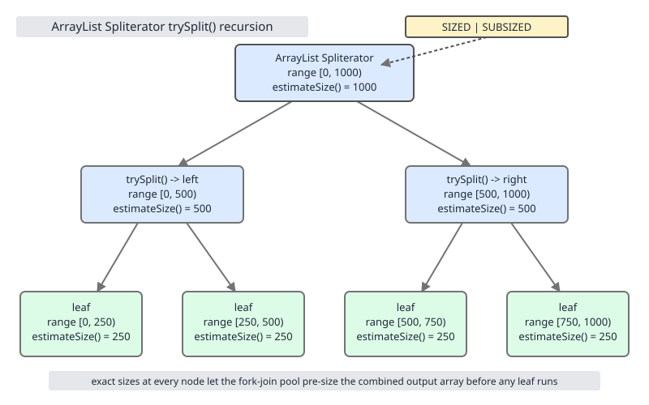
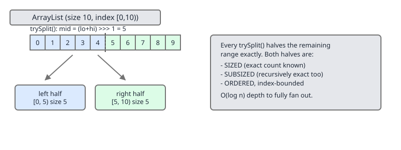
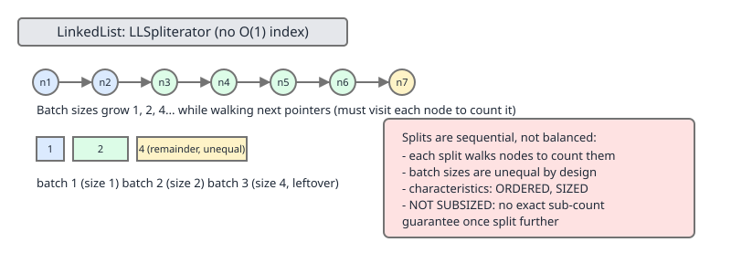
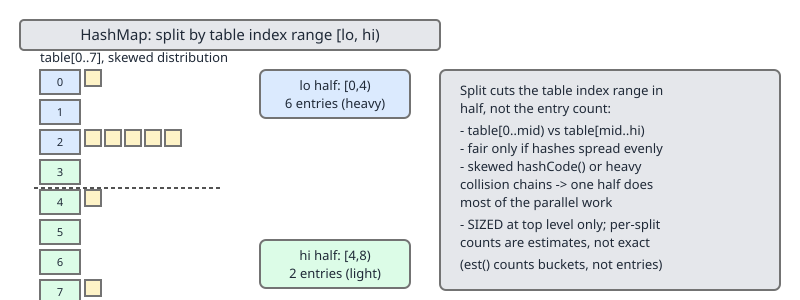
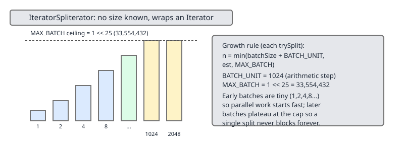

# 02 Java Collections — Iteration — INTERNALS (§3.13 `Spliterator`, parallelism, and the stream bridge)

**Target version: Java 21 LTS.** | [Index](../00-index.md)
Previous: [iteration/02-fail-fast-fail-safe.md](02-fail-fast-fail-safe.md) · Next: [sequenced-collections/01-sequenced-collections.md](../sequenced-collections/01-sequenced-collections.md)

`Iterator` gives you one element at a time and cannot be handed to two threads. `Spliterator` ("splitting iterator") adds one operation on top — `trySplit()` — that carves off a prefix of the source and returns it as a second spliterator, so a fork-join pool can recurse on both halves in parallel. Everything a `Stream` does — sequential or parallel, sized or estimated, ordered or not — is negotiated through the eight boolean `characteristics()` a spliterator reports, and every collection's split quality (`ArrayList` splits perfectly, `LinkedList` splits badly, `HashMap` splits depending on load) is the single biggest lever on whether `parallelStream()` helps or hurts. This file is the mechanism underneath `Collection.spliterator()`, `stream()`, and `parallelStream()`; the operations that consume the resulting stream (`collect`, `reduce`, `Collectors`) are covered in `../utilities/05-streams-and-collectors.md`, and the iterator/fail-fast machinery a spliterator wraps is covered in `../array-list/03-internals-c-views-and-iterators.md` and `iteration/02-fail-fast-fail-safe.md`.

## Hierarchy before details

| Type | Role |
|---|---|
| `Spliterator<T>` | Reference-type traversal + split contract: `tryAdvance`, `trySplit`, `estimateSize`, `characteristics`. |
| `Spliterator.OfInt` / `OfLong` / `OfDouble` | Primitive specializations extending `Spliterator.OfPrimitive`; avoid boxing on `IntStream`/`LongStream`/`DoubleStream`. |
| `Spliterators` | Static factory/adapter class: wraps arrays, `Iterator`s, and unknown-size sources into spliterators. |
| `StreamSupport` | Bridges a `Spliterator` into a `Stream`, `IntStream`, `LongStream`, or `DoubleStream`, the one public entry point for hand-built spliterators. |
| `Collection.spliterator()` / `stream()` / `parallelStream()` | Default `spliterator()` returns `Spliterators.spliterator(this, 0)`, overridden by `ArrayList`, `HashSet`, `TreeSet`, `LinkedList`, `ConcurrentHashMap`, the `List.of` family; `stream()`/`parallelStream()` are `StreamSupport.stream(spliterator(), false/true)`. |



## 3.13.1 Why `Spliterator` exists `[PROVE]`

**Mental model.** An `Iterator` is a cursor: `hasNext()`/`next()` only ever move forward one step, on one thread. There is no operation that says "give me the back half of what's left." A `Spliterator` is that cursor plus a scalpel.

**Why it exists.** Fork-join parallelism (`java.util.concurrent.ForkJoinPool`, since Java 7) works by recursively splitting a task until each piece is small enough to run directly, then merging results. To feed a `Stream.parallel()` pipeline into that model, the source needs a data structure that can hand off a *provable, disjoint* chunk of itself to another thread while keeping the rest for the caller. `Iterator` cannot do this: it exposes no way to partition its remaining elements, and even if you tried to fake it by having two iterators walk the same backing store, most iterators are fail-fast single-cursor objects with no thread-safety story.

**When to reach for it, and when not.** You reach for `Spliterator` directly only when: (a) writing a custom collection that should support `parallelStream()` well, or (b) adapting a non-`Collection` source (an array, a legacy enumeration, an I/O channel) into a `Stream`. For everyday collection use you never call `trySplit()` yourself — `Stream.parallel()` does it for you via the fork-join common pool.

**How it works.** `trySplit()` returns a new `Spliterator` covering some prefix of the remaining elements, or `null` if the source refuses or cannot split further (too small, or an inherently sequential structure like a linked list beyond a batch boundary). The caller processes the returned spliterator on one thread/task and the original (now covering only the suffix) on another — recursively, until pieces are small or `trySplit()` returns `null`.

**Example.**
```java
import java.util.Arrays;
import java.util.List;
import java.util.Spliterator;
import java.util.stream.StreamSupport;

public final class SpliteratorProof {
    public static void main(String[] args) {
        List<Integer> source = Arrays.asList(1, 2, 3, 4, 5, 6, 7, 8);
        Spliterator<Integer> left = source.spliterator();
        Spliterator<Integer> right = left.trySplit();
        System.out.println(StreamSupport.stream(right, false).toList()); // [1, 2, 3, 4]
        System.out.println(StreamSupport.stream(left, false).toList());  // [5, 6, 7, 8]
    }
}
```

**Gotcha.** `trySplit()` mutates the receiver: after the call, `left` no longer covers the elements handed to `right`. Calling `trySplit()` again keeps consuming `left`'s remaining range — it is a destructive, stateful operation, not a pure query.

> A `Spliterator` is an `Iterator` augmented with `trySplit()`, `estimateSize()`, and `characteristics()`, giving fork-join parallelism a way to divide a source that a plain `Iterator` cannot provide.

## 3.13.2 `tryAdvance` vs `forEachRemaining` and the bulk-traversal fast path

**Mechanism.** `tryAdvance(Consumer<? super T> action)` is the `Iterator`-equivalent single-step: it consumes exactly one element and returns `true`, or returns `false` if exhausted. `forEachRemaining(Consumer<? super T> action)` is a default method that loops `tryAdvance` until `false` — but nearly every concrete spliterator (`ArrayList`'s, arrays', `HashMap`'s) overrides it with a direct bulk loop over the backing array/table, skipping the per-element `tryAdvance` call overhead and its modcount check on every single step.

**Gotcha.** If you write a custom spliterator and only implement `tryAdvance`, it still works correctly via the default `forEachRemaining`, but it pays a virtual-call-per-element tax that the JDK's own spliterators avoid; override `forEachRemaining` too whenever the backing structure allows a tight bulk loop.

> `tryAdvance` is the one-element primitive; `forEachRemaining` is the bulk fast path that well-behaved spliterators override to avoid per-element overhead.

## 3.13.3 `trySplit` contract `[PROVE]`

**Mental model.** Think of `trySplit()` as tearing a deck of cards in half: you keep one half, hand the other to your neighbor, and each of you may tear your half again.

**Why it exists.** Fork-join needs a uniform recursive-split protocol that works whether the source is an array, a linked structure, a hash table, or an unbounded generator — `trySplit()` is that single method every source implements according to its own shape.

**When to reach for it, and when not.** Called by the stream implementation, never by application code in normal use. Reach for it directly only in tests or when hand-rolling a fork-join-style traversal outside `Stream`.

**How it works — the three outcomes.**

| Outcome | Meaning | Example |
|---|---|---|
| Returns a non-null `Spliterator` covering a **prefix** | Receiver now covers only the remaining **suffix**; both together still cover exactly the original elements, no overlap, no gap | `ArrayList`, arrays, `TreeSet` |
| Returns `null` | Source declines to split further (too small, no natural split point, already fully consumed) | `LinkedList` below its batch floor, any spliterator on a 0- or 1-element source |
| Repeated calls converge | Each successful split should roughly halve remaining size, so recursion terminates in `O(log n)` splits | Well-behaved sources; badly-behaved ones (see 3.13.7) violate this |


**Example.**
```java
import java.util.List;
import java.util.Spliterator;
import java.util.concurrent.atomic.AtomicInteger;

public final class TrySplitContractDemo {
    public static void main(String[] args) {
        List<Integer> source = List.of(1, 2, 3, 4, 5, 6, 7, 8, 9, 10);
        AtomicInteger seen = new AtomicInteger();
        splitRecursively(source.spliterator(), seen);
        System.out.println("total elements visited: " + seen.get()); // 10
    }

    private static void splitRecursively(Spliterator<Integer> s, AtomicInteger seen) {
        Spliterator<Integer> prefix = s.trySplit();
        if (prefix != null) {
            splitRecursively(prefix, seen);
            splitRecursively(s, seen);
        } else {
            s.forEachRemaining(v -> seen.incrementAndGet());
        }
    }
}
```

**Gotcha.** A spliterator that returns non-null from `trySplit()` but whose two halves are **not** disjoint, or together don't cover the original range, silently corrupts parallel stream results — this is the exact contract a hand-rolled `Spliterator` (3.13.16) must not violate, and there is no runtime check for it.

> `trySplit()` must return a disjoint, non-overlapping prefix and leave the receiver covering exactly the remaining suffix, or return `null` when it cannot split — violating this silently corrupts parallel results.

## 3.13.4–3.13.5 The eight characteristics and per-collection bitsets `[RESEARCH]`

**Mental model.** Characteristics are a bitmask of promises the spliterator makes about the data it walks — the stream pipeline reads these bits once and picks faster code paths wherever a promise lets it skip work.

**Why it exists.** Without declared characteristics, every stream operation would have to assume the worst case (unordered, unsized, may contain nulls, may see concurrent mutation) and pay for defensive checks and buffering it usually doesn't need.

**When to reach for it, and when not.** Read `characteristics()` (or `hasCharacteristics(int)`) when diagnosing why a stream operation is slower or faster than expected on a given source; never hand-set characteristics on a JDK collection's own spliterator — only relevant when writing your own (3.13.16).

**How it works.** `characteristics()` returns an `int` bitmask from constants on `Spliterator`. `hasCharacteristics(int)` tests a subset.

**Example.**
```java
import java.util.List;
import java.util.Spliterator;

public final class CharacteristicsDemo {
    public static void main(String[] args) {
        Spliterator<Integer> s = List.of(1, 2, 3).spliterator();
        System.out.println(s.hasCharacteristics(Spliterator.SIZED));      // true
        System.out.println(s.hasCharacteristics(Spliterator.SORTED));     // false
        System.out.println(s.hasCharacteristics(Spliterator.IMMUTABLE));  // true
    }
}
```

**D-125 — the eight characteristics and what each buys.**

| Characteristic | Meaning | Pipeline optimisation enabled | Which collections report it |
|---|---|---|---|
| `ORDERED` | Traversal has a defined encounter order that must be preserved unless explicitly relaxed (`unordered()`) | `forEachOrdered`, `limit`, `skip`, sequential `collect` produce the source's order; without it these ops can short-circuit or reorder for speed | `ArrayList`, `LinkedList`, `TreeSet`, arrays, `LinkedHashSet`; **not** `HashSet`/`HashMap` |
| `DISTINCT` | Every element compares unequal via `equals` | `Stream.distinct()` becomes a no-op instead of a hash-set dedup pass | `HashSet`, `TreeSet`, `Map.keySet()` of any `Map` |
| `SORTED` | Elements arrive in a natural or comparator-defined order | `Stream.sorted()` becomes a no-op | `TreeSet`, `TreeMap` views |
| `SIZED` | `estimateSize()` returns the exact remaining count | Fork-join can pre-size intermediate buffers; `count()` can skip traversal entirely | `ArrayList`, arrays, `HashSet`, `LinkedList` (until split) |
| `NONNULL` | Source guarantees no `null` elements | Null-checking filters can be elided | `IntStream`/primitive streams; `ConcurrentHashMap` views (nulls forbidden by the map itself) |
| `IMMUTABLE` | Backing structure cannot be structurally modified during traversal | No need to check for concurrent modification at all — strongest fail-fast guarantee is "impossible by construction" | `List.of`, `Set.of`, `Map.of` factory results and their spliterators |
| `CONCURRENT` | Backing structure permits concurrent modification without throwing, and the spliterator reflects a weakly-consistent view | Traversal never throws `ConcurrentModificationException`; no defensive copying needed | `ConcurrentHashMap`, `ConcurrentLinkedQueue`, `CopyOnWriteArrayList` |
| `SUBSIZED` | If `SIZED` and the spliterator splits, **both resulting halves are also `SIZED`** | Combined with `SIZED`, lets every level of the fork-join split tree pre-size its slice of the output array — the property that makes toArray()-backed collectors allocate once | `ArrayList`, arrays; **not** `HashSet`/`HashMap` (their splits are ranges of table buckets, not element counts, so child sizes are not exact) |

**Per-collection table (3.13.5).**

| Collection | `spliterator()` characteristics | Split quality |
|---|---|---|
| `ArrayList` | `ORDERED \| SIZED \| SUBSIZED` | Excellent — exact array-index midpoint halves |
| `HashSet` | `SIZED \| DISTINCT` | Balanced only if table load is even; no `ORDERED`, no `SUBSIZED` |
| `TreeSet` | `ORDERED \| SORTED \| SIZED \| DISTINCT` | Balanced tree-range splits |
| `LinkedList` | `ORDERED \| SIZED` | Poor — falls back to `IteratorSpliterator` batching (3.13.9), no `SUBSIZED` |
| `ConcurrentHashMap` (keySet/values/entrySet) | `CONCURRENT \| NONNULL` (no `SIZED` — size is a moving target under concurrent writers) | Table-segment splits, weakly consistent |
| `List.of` / `Set.of` factory results | adds `IMMUTABLE` to the above | Same shape as the mutable equivalent, plus the immutability guarantee |

**Gotcha.** `SIZED` without `SUBSIZED` is common and easy to miss: `LinkedList`'s top-level spliterator knows its total size (`SIZED`) but its splits are batches walked one node at a time, not size-exact halves, so it does not report `SUBSIZED`.

> The eight characteristics are a bitmask contract the spliterator makes to the stream pipeline; each bit unlocks a specific optimisation (skip dedup, skip sort, skip CME checks, pre-size buffers), and `SIZED + SUBSIZED` together are what let the whole split tree pre-size its output.

## 3.13.6 `SIZED | SUBSIZED` and pre-sized fork-join output `[PROVE]`

**Mechanism.** When a terminal operation like `collect(Collectors.toList())` or `toArray()` runs on a `SIZED | SUBSIZED` source, the fork-join merge can allocate one right-sized array up front and have every leaf task write directly into its known slice — no intermediate `ArrayList` growth, no copy-and-merge step. Without `SUBSIZED`, each split's children may not know their exact sizes, so the collector falls back to per-leaf buffering (e.g., `ArrayList`s that grow) followed by a merge/copy pass.

**Gotcha.** This is invisible functionally — the result is identical either way — but it is a real allocation and copy cost difference under `-Xss`/GC pressure on large parallel `toArray()`/`toList()` calls; see `../utilities/05-streams-and-collectors.md` for the collector-merge cost model.

> `SIZED | SUBSIZED` together are what let a fork-join `toArray()`/`collect()` pre-size its output once instead of buffering per-leaf and merging.

## 3.13.7 `ArrayList.parallelStream()` scales, `LinkedList.parallelStream()` does not `[PROVE]`

**Mechanism.** Both must satisfy the same `trySplit()` contract, but their backing stores dictate the cost of computing a split point: `ArrayList` splitting is cutting a ruler at the midpoint tick, `LinkedList` splitting is walking a chain counting knots because there is no tick to jump to. Prefer `ArrayList.parallelStream()` for CPU-bound per-element work over large collections; for a `LinkedList`, copy into an `ArrayList` first if parallelism actually matters. The actual JDK source, `ArrayList.ArrayListSpliterator.trySplit()` (Java 21, `java.util.ArrayList`):
```java
public Spliterator<E> trySplit() {
    int hi = getFence(), lo = index, mid = (lo + hi) >>> 1;
    return (lo >= mid) ? null :
        new ArrayListSpliterator<>(root, lo, index = mid, expectedModCount);
}
```
`lo` and `hi` are array indices; the midpoint is arithmetic, `O(1)`, and exact — this is why `ArrayList` reports `SUBSIZED`.

`LinkedList.LLSpliterator.trySplit()` (Java 21, `java.util.LinkedList`):
```java
public Spliterator<E> trySplit() {
    Node<E> p;
    int s = getEst();
    if (s > 1 && (p = current) != null) {
        int n = batch + BATCH_UNIT;
        if (n > s)
            n = s;
        if (n > MAX_BATCH)
            n = MAX_BATCH;
        Object[] a = new Object[n];
        int j = 0;
        do { a[j++] = p.item; } while ((p = p.next) != null && j < n);
        current = p;
        batchSize = j;
        est = s - j;
        return Spliterators.spliterator(a, 0, j, Spliterator.ORDERED);
    }
    return null;
}
```
Splitting requires physically walking `n` nodes and copying their values into a fresh array — `O(n)` per split, and the returned piece is a plain array spliterator (`ORDERED` only, no `SIZED` propagation guarantee beyond that batch), not a live view of the list.

**Gotcha.** `LinkedList`'s split cost means parallelizing it can be **slower** than a sequential stream once you add fork-join scheduling overhead on top of the `O(n)` walk-to-split cost — there is no scenario where `LinkedList.parallelStream()` beats `ArrayList.parallelStream()` for equivalent data and workload.

> `ArrayList` splits in O(1) via index arithmetic and reports `SUBSIZED`; `LinkedList` must walk and copy nodes to split, costs O(n) per split, and this is the mechanical reason its `parallelStream()` does not scale.

## 3.13.8 `HashMap` splits the table by index range `[SOURCE]`

**Mechanism.** `HashMap`'s spliterator (and `HashSet`'s, which delegates to a backing `HashMap`) tracks a range of table-array indices `[origin, fence)`. `trySplit()` bisects that index range, not the entry count — each half gets roughly half the buckets, not necessarily half the entries.

**Gotcha.** If keys hash unevenly (a poor or attacker-influenced hash, or simply a table with long collision chains in one region), one half of an index-range split can hold far more entries than the other, producing an unbalanced fork-join tree even though the *bucket* split looked even — see D-124c below for the skewed-table picture.

> `HashMap`/`HashSet` split by contiguous table-index range; split balance therefore depends on how evenly entries are actually distributed across buckets, not on any promise the map makes.

## Good splits vs bad splits `[SOURCE]`

**Mental model.** A good split is a coin flip that lands exactly on heads-or-tails every time — equal halves, cheap to compute; a bad split is tearing a phone book by feel, unequal and slow to locate.

**Why it exists.** `trySplit()` is a uniform contract (3.13.3), but nothing forces the two halves it returns to be equal in size or cheap to produce — split *quality* is a per-collection property that decides whether `parallelStream()` is worth calling at all.

**When to reach for it, and when not.** Judge a collection's split quality before parallelizing it: array-backed and range-indexable sources (`ArrayList`, `TreeSet`, `TreeMap`) are safe defaults; node-walked or unevenly-distributed sources (`LinkedList`, a skewed `HashMap`) are not, regardless of how large `N` is.

**How it works — four shapes of split quality.**






**Example.**
```java
import java.util.LinkedList;
import java.util.List;
import java.util.Spliterator;
import java.util.stream.Collectors;
import java.util.stream.IntStream;

public final class SplitQualityDemo {
    public static void main(String[] args) {
        List<Integer> linked = IntStream.range(0, 100_000).boxed()
                .collect(Collectors.toCollection(LinkedList::new));
        Spliterator<Integer> s = linked.spliterator();
        int splits = 0;
        while (s.trySplit() != null) {
            splits++; // each call walks and copies a batch (3.13.7) -- unlike ArrayList's O(1) split
        }
        System.out.println("LinkedList trySplit calls: " + splits);
    }
}
```

**Gotcha.** `LinkedList` still terminates its splitting eventually (batches shrink toward the `MAX_BATCH`-bounded walk), so it is not *unsplittable* — it is splittable at O(n) cost per split, which is the difference that erases any parallel win (3.13.7).

> Split quality — equal halves, computed cheaply — is a per-collection property independent of the uniform `trySplit()` contract; judge it before deciding to parallelize, not after measuring a slow run.

## 3.13.9 `IteratorSpliterator` — the generic fallback `[SOURCE]` `[NUM]` `[RESEARCH]`

**Mechanism.** When a source has no native spliterator (`Collection.spliterator()`'s default, or `Spliterators.spliteratorUnknownSize`), the JDK falls back to wrapping the plain `Iterator` and manufacturing splits by copying elements into arithmetically-growing arrays — some parallelism is better than none, at the cost of an eager per-batch array copy. This is what a custom collection gets automatically if it never overrides `spliterator()`; write a native one instead (3.13.16) when the source is large and parallelism actually matters. Batch constants and split logic (Java 21, `java.util.Spliterators.IteratorSpliterator`):
```java
static final int BATCH_UNIT = 1 << 10;  // batch array size increment
static final int MAX_BATCH  = 1 << 25;  // max batch array size

public Spliterator<T> trySplit() {
    Iterator<? extends T> i;
    long s;
    if ((i = it) == null) {
        i = it = collection.iterator();
        s = est = (long) collection.size();
    } else {
        s = est;
    }
    if (s > 1 && i.hasNext()) {
        int n = batch + BATCH_UNIT;
        if (n > s) {
            n = (int) s;
        }
        if (n > MAX_BATCH) {
            n = MAX_BATCH;
        }
        Object[] a = new Object[n];
        int j = 0;
        do { a[j++] = i.next(); } while (i.hasNext() && j < n);
        batch = j;
        if (est != Long.MAX_VALUE) {
            est -= j;
        }
        return new ArraySpliterator<>(a, 0, j, characteristics);
    }
    return null;
}
```
`BATCH_UNIT = 1024` and `MAX_BATCH = 1 << 25` (33,554,432): each successful split's batch size grows by `1024` elements over the previous one, capped at ~33.5 million, so early splits are cheap and small while later ones amortize the per-split overhead over larger chunks.

**Gotcha.** Every batch is a fresh `Object[]` copy of the source elements — for a huge backing `Iterable` with no native spliterator, `parallelStream()` pays real allocation and copy cost proportional to the elements visited, on top of whatever the source `Iterator` itself costs to advance.

> `IteratorSpliterator` is the generic fallback that turns any plain `Iterator` into a splittable source by copying arithmetically-growing batches (`BATCH_UNIT = 1024`, `MAX_BATCH = 1 << 25`) into arrays, trading copy cost for at-least-some parallelism.

## 3.13.10 Writing your own via `Spliterators` factories

**Mechanism.** `Spliterators.spliterator(Object[] array, int additionalCharacteristics)` and `Spliterators.spliterator(Collection<? extends T> c, int characteristics)` wrap a known-size source directly. `Spliterators.spliteratorUnknownSize(Iterator<? extends T> iterator, int characteristics)` wraps an `Iterator` whose remaining size is unknown, falling back to `IteratorSpliterator`-style batching internally.

**Gotcha.** Passing characteristics you cannot actually guarantee (e.g., claiming `SORTED` for data that isn't) is not checked at the call site — the pipeline trusts you and downstream operations like `sorted()` may silently skip work they should have done, producing wrong output with no exception.

> Use `Spliterators.spliterator(Object[], int)` or `Spliterators.spliterator(Collection, int)` for known-size sources, and `Spliterators.spliteratorUnknownSize(Iterator, int)` when the size cannot be determined up front.

## 3.13.11 `StreamSupport.stream(spliterator, parallel)`

**Mechanism.** `StreamSupport.stream(Spliterator<T> spliterator, boolean parallel)` (and the primitive overloads for `IntStream`/`LongStream`/`DoubleStream`) is the single public bridge from a raw `Spliterator` into the `Stream` API — this is what every `Collection.stream()`/`parallelStream()` calls internally, and it is the entry point a hand-built spliterator (3.13.16) must go through.

**Gotcha.** Passing `parallel = true` does not guarantee actual multithreaded execution — a spliterator whose `trySplit()` always returns `null` runs entirely on the calling thread regardless of the flag, just inside the fork-join machinery's sequential path.

> `StreamSupport.stream(spliterator, parallel)` is the one supported way to turn a `Spliterator` into a `Stream`, sequential or parallel.

## 3.13.12 Late binding and the fail-fast contract of a spliterator

**Mechanism.** A spliterator is *late-binding* if it does not capture the source's state until the first traversal/split method (`tryAdvance`, `forEachRemaining`, `trySplit`) is actually called — changes made to the source between `spliterator()` and that first call are visible. Once bound, `IMMUTABLE` and `CONCURRENT` spliterators must never throw `ConcurrentModificationException` (the guarantee is structural: nothing can mutate an immutable source, and a concurrent source is designed to tolerate mutation); all other spliterators *may* throw CME on detecting structural modification, mirroring the fail-fast `Iterator`s covered in `iteration/02-fail-fast-fail-safe.md`.

**Gotcha.** "May throw" is not "must throw" — a non-`CONCURRENT`, non-`IMMUTABLE` spliterator that fails to detect a modification (e.g., a mutation that happens not to change size or hit the sampled modcount check) simply produces undefined/inconsistent results instead of an exception; CME on such sources is a best-effort diagnostic, not a safety net.

> Late binding means the source is captured at first use, not at `spliterator()` call time; `IMMUTABLE`/`CONCURRENT` spliterators must never throw CME, all others may but are not guaranteed to.

## 3.13.13 The parallel-stream decision rule `[TRAP]` `[X-REF 04]`

**Mental model.** Parallelizing a stream is only a net win when the total work you're distributing (`N` elements times `Q`, the per-element cost) is large enough to outweigh the fixed overhead of splitting, task scheduling, and merging.

**Why it exists.** The JDK's own `Stream.parallel()` heuristics (and the `ForkJoinPool.common()` sizing) assume CPU-bound, independent, non-blocking per-element work — anything that violates those assumptions turns "parallel" into "slower and more dangerous."

**When to reach for it, and when not.** Reach for `parallelStream()` when `N × Q` is large (roughly: thousands+ of elements with non-trivial per-element computation, on a multi-core machine) and the source splits well (`ArrayList`, arrays — see 3.13.7). Do not reach for it for small collections (fork-join overhead dominates), for I/O-bound or blocking per-element work, or for `LinkedList`/`HashMap`-with-poor-distribution sources.

**How it works.** `parallelStream()` submits work to `ForkJoinPool.commonPool()` by default — the **same shared pool** used by every other `parallelStream()`/`CompletableFuture.supplyAsync()` call in the JVM unless a custom executor is used. A blocking operation (I/O, `Thread.sleep`, lock acquisition) inside a parallel stream's lambda occupies one of that shared pool's worker threads for the duration of the block, starving every other concurrent user of the common pool application-wide — not just your own code.

**Example.**
```java
import java.util.List;
import java.util.concurrent.ForkJoinPool;
import java.util.concurrent.TimeUnit;
import java.util.concurrent.locks.LockSupport;

public final class CommonPoolStarvationDemo {
    public static void main(String[] args) {
        System.out.println("common pool parallelism: " + ForkJoinPool.getCommonPoolParallelism());
        // BAD: blocking call inside a parallel stream ties up common-pool threads
        // that every other unrelated parallelStream() in this JVM also depends on.
        List.of(1, 2, 3, 4, 5, 6, 7, 8).parallelStream()
                .forEach(id -> LockSupport.parkNanos(TimeUnit.MILLISECONDS.toNanos(100)));
    }
}
```

**Gotcha.** `ForkJoinPool.getCommonPoolParallelism()` defaults to `Runtime.getRuntime().availableProcessors() - 1`; on a small container (e.g., a 2-vCPU pod), that is a common pool of parallelism `1`, meaning `parallelStream()` barely parallelizes at all while still paying full split/merge overhead — check core count before assuming parallel streams help in containerized deployments. See `../utilities/05-streams-and-collectors.md` (`X-REF 04`) for collector-side merge cost under parallel `collect`.

> Parallelize a stream only when `N × Q` is large and the source splits well; a blocking call inside a parallel stream lambda starves the shared common `ForkJoinPool` for every other parallel stream and `CompletableFuture` in the same JVM.

## 3.13.14 `Collectors.toList` on a parallel stream and the merge cost `[PROVE]`

**Mechanism.** `Collectors.toList()`'s default implementation is not `CONCURRENT`, so under a parallel stream each leaf task accumulates into its own container and the results are merged pairwise up the fork-join tree — the merge itself (`List.addAll` chains) is sequential work proportional to total size, so a badly-split or small source can spend more time merging than the parallel per-element work saved.

**Gotcha.** Reaching for `Collectors.toConcurrentMap`/an explicit `CONCURRENT`-characteristic collector avoids the merge step by writing directly into one shared structure, but only helps when the shared structure's own synchronization cost is cheaper than the merge it replaces — measure, don't assume.

> Non-concurrent collectors merge per-leaf results sequentially up the fork-join tree; that merge cost can erase the benefit of parallelizing a small or unevenly-split source.

## 3.13.15 `forEachOrdered` vs `forEach` on a parallel stream over an `ORDERED` source

**Mechanism.** `forEach` on a parallel `ORDERED` stream still visits every element, but makes no promise about which thread processes which element *or* the order side effects land in — it is the fastest terminal traversal because it never re-serializes results. `forEachOrdered` forces the pipeline to buffer and re-sequence results so the action runs in encounter order, at the cost of that buffering/merge work — effectively giving up most of the parallelism benefit for ordering.

**Gotcha.** Calling `forEachOrdered` on a parallel stream just to "be safe" defeats the point of parallelizing in the first place if the source is `ORDERED`; if you don't actually need order-preserving side effects, use `forEach`, or call `.unordered()` upstream to let the pipeline relax ordering constraints entirely for other operations too.

> `forEach` on a parallel `ORDERED` stream makes no ordering guarantee and is fast; `forEachOrdered` restores encounter order at the cost of the re-sequencing work that largely cancels the parallel speedup.

## 3.13.16 Writing a `Spliterator` for a custom collection `[BUILD]`

**Mental model.** A ring buffer of fixed capacity has no native JDK spliterator; writing one means answering three questions honestly: what do I know about size, what do I promise about content, and how do I split without breaking either promise.

**Why it exists.** A hand-rolled spliterator is the mechanism by which any custom data structure gets first-class, well-behaved `Stream`/`parallelStream()` support instead of falling back to the generic `IteratorSpliterator` (3.13.9) with its per-batch copy cost.

**When to reach for it, and when not.** Write one when the structure is large, its layout supports a genuinely cheap split (contiguous array-backed, or otherwise indexable), and parallel traversal is an expected usage pattern. Skip it for small, rarely-iterated, or inherently sequential (linked-node) structures — the default `Collection.spliterator()` fallback is good enough there.

**How it works.** Implement `Spliterator<T>` directly: `tryAdvance`, `trySplit`, `estimateSize`, `characteristics`, and (for the fast path) `forEachRemaining`.

**Example — a complete spliterator for a fixed-capacity circular buffer.**
```java
import java.util.Objects;
import java.util.Spliterator;
import java.util.function.Consumer;
import java.util.stream.Stream;
import java.util.stream.StreamSupport;

public final class RingBuffer<T> {
    private final Object[] elements;
    private final int head;
    private final int size;

    public RingBuffer(Object[] backingArray, int head, int size) {
        this.elements = backingArray;
        this.head = head;
        this.size = size;
    }
    public Stream<T> stream() {
        return StreamSupport.stream(new RingBufferSpliterator<>(elements, head, 0, size), false);
    }
    public Stream<T> parallelStream() {
        return StreamSupport.stream(new RingBufferSpliterator<>(elements, head, 0, size), true);
    }

    static final class RingBufferSpliterator<T> implements Spliterator<T> {
        private final Object[] elements;
        private final int head;
        private int index;
        private int fence;

        RingBufferSpliterator(Object[] elements, int head, int index, int fence) {
            this.elements = elements;
            this.head = head;
            this.index = index;
            this.fence = fence;
        }
        @SuppressWarnings("unchecked")
        private T at(int i) {
            return (T) elements[(head + i) % elements.length];
        }
        @Override
        public boolean tryAdvance(Consumer<? super T> action) {
            Objects.requireNonNull(action);
            if (index >= fence) {
                return false;
            }
            action.accept(at(index++));
            return true;
        }
        @Override
        public void forEachRemaining(Consumer<? super T> action) {
            Objects.requireNonNull(action);
            for (int i = index; i < fence; i++) {
                action.accept(at(i));
            }
            index = fence;
        }
        @Override
        public Spliterator<T> trySplit() {
            int mid = (index + fence) >>> 1;
            if (index >= mid) {
                return null;
            }
            int lo = index;
            index = mid;
            return new RingBufferSpliterator<>(elements, head, lo, mid);
        }
        @Override
        public long estimateSize() {
            return fence - index;
        }
        @Override
        public int characteristics() {
            return ORDERED | SIZED | SUBSIZED | IMMUTABLE;
        }
    }
}
```

**Gotcha.** This spliterator claims `IMMUTABLE`, which is only correct if `RingBuffer` truly never mutates `elements` after construction (as modeled here); claiming `IMMUTABLE` for a structure that can actually change under the reader is the exact silent-corruption trap called out in 3.13.3 — the characteristic bit is a promise the JDK trusts without verifying.

> Implementing a custom `Spliterator` means correctly answering size (`estimateSize`/`SIZED`), content promises (`ORDERED`/`DISTINCT`/`SORTED`/`IMMUTABLE`/`NONNULL`), and a genuinely disjoint `trySplit` — get any of the three wrong and `Stream` will trust the lie.

## Pitfalls

### "`parallelStream()` is always faster than `stream()`"

**Wrong**
```java
import java.util.List;

public final class AlwaysFasterWrong {
    public static void main(String[] args) {
        // Fork-join submission/scheduling overhead on 5 elements typically
        // costs more than the sequential sum would have taken outright.
        long sum = List.of(1, 2, 3, 4, 5).parallelStream().mapToLong(Integer::longValue).sum();
        System.out.println(sum);
    }
}
```

**Right**
```java
import java.util.List;

public final class AlwaysFasterRight {
    public static void main(String[] args) {
        // Small N: sequential stream avoids fork-join overhead entirely.
        long sum = List.of(1, 2, 3, 4, 5).stream().mapToLong(Integer::longValue).sum();
        System.out.println(sum);
    }
}
```

**Why people believe it:** "parallel" reads as a synonym for "faster" in everyday English, and the API makes switching a one-word change (`stream()` to `parallelStream()`), so it feels like a free upgrade with no visible cost model attached.

### "Claiming `SORTED`/`IMMUTABLE` on a custom spliterator that doesn't actually satisfy it just gets ignored if wrong"

**Wrong**
```java
import java.util.List;
import java.util.Spliterator;
import java.util.Spliterators;
import java.util.stream.StreamSupport;

public final class FalseSortedWrong {
    public static void main(String[] args) {
        Integer[] unsorted = {3, 1, 2};
        // Falsely claims SORTED -- the data is NOT actually sorted.
        Spliterator<Integer> lying = Spliterators.spliterator(
                unsorted, Spliterator.SORTED | Spliterator.ORDERED);
        List<Integer> result = StreamSupport.stream(lying, false).sorted().toList();
        System.out.println(result); // [3, 1, 2] -- sorted() trusted the lie
    }
}
```

**Right**
```java
import java.util.List;
import java.util.Spliterator;
import java.util.Spliterators;
import java.util.stream.StreamSupport;

public final class FalseSortedRight {
    public static void main(String[] args) {
        Integer[] unsorted = {3, 1, 2};
        // Only claim characteristics that are actually true.
        Spliterator<Integer> honest = Spliterators.spliterator(unsorted, Spliterator.ORDERED);
        List<Integer> result = StreamSupport.stream(honest, false).sorted().toList();
        System.out.println(result); // [1, 2, 3]
    }
}
```

**Why people believe it:** characteristics look like metadata/hints rather than load-bearing contracts, and there is no `assert` or runtime validation anywhere in the pipeline that would catch the lie — the silent wrong-answer failure mode is easy to miss in a quick smoke test on already-sorted sample data.

## Cheat sheet

| Question | Answer |
|---|---|
| Can I split an `Iterator`? What does `trySplit()` return? | No, that is why `Spliterator` exists (3.13.1); a disjoint prefix or `null` (3.13.3) |
| Which two characteristics let fork-join pre-size output? | `SIZED` + `SUBSIZED` (3.13.6) |
| Best/worst-splitting standard collections? | `ArrayList` O(1) index split / `LinkedList` O(n) walk-to-split (3.13.7) |
| `HashMap` split balance depends on? Generic fallback? | Even distribution across table-index ranges (3.13.8); `IteratorSpliterator` `BATCH_UNIT=1024`/`MAX_BATCH=1<<25` (3.13.9), `Spliterators.spliterator`/`spliteratorUnknownSize` (3.13.10) |
| Bridge to `Stream`? Must `IMMUTABLE`/`CONCURRENT` throw CME? | `StreamSupport.stream(spliterator, parallel)` (3.13.11); never (3.13.12) |
| Decision rule / danger for `parallelStream()`? | Large `N × Q` + good split; blocking ops starve the shared `commonPool()` JVM-wide (3.13.13) |
| `forEach` vs `forEachOrdered`? Custom spliterator must get right? | Fast/unordered vs re-sequenced/ordered (3.13.15); size, content promises, genuinely disjoint split (3.13.16) |

## Self-test

**Q1.** Why can't a plain `Iterator` be used to feed a fork-join parallel decomposition?

<details><summary>Answer</summary>

Because `Iterator` exposes no operation to partition its remaining elements — it is a single forward-only cursor with `hasNext()`/`next()` and no way to hand off a disjoint chunk to another thread. `Spliterator` adds exactly that missing operation, `trySplit()`, which returns a prefix while the receiver keeps the suffix.

</details>

**Q2.** Which two characteristics together let a fork-join `toArray()`/`collect(toList())` pre-size its output array, and which common collection has `SIZED` but not the other one?

<details><summary>Answer</summary>

`SIZED` and `SUBSIZED` together. `LinkedList` has `SIZED` (it knows total size) but not `SUBSIZED`, because its splits are batch-walked, not size-exact halves.

</details>

**Q3.** Explain, mechanically, why `ArrayList.parallelStream()` scales but `LinkedList.parallelStream()` typically does not.

<details><summary>Answer</summary>

`ArrayList.ArrayListSpliterator.trySplit()` computes a midpoint from array indices in O(1) — `mid = (lo + hi) >>> 1` — and both halves stay array-index views with exact sizes. `LinkedList.LLSpliterator.trySplit()` must physically walk up to `batch + BATCH_UNIT` nodes and copy their values into a fresh array before it can return a split, an O(n) operation per split; that walk-and-copy cost, plus fork-join scheduling overhead, typically outweighs any parallel speedup.

</details>

**Q4.** Under what condition must a spliterator never throw `ConcurrentModificationException`, and under what condition may it?

<details><summary>Answer</summary>

`IMMUTABLE` and `CONCURRENT` spliterators must never throw CME — an immutable source cannot be structurally modified at all, and a concurrent source is designed to tolerate modification without failing. Any other spliterator (the ordinary fail-fast case) may throw CME on detecting structural modification, but is not guaranteed to catch every such modification.

</details>

**Q5.** What is the actual decision rule for whether `parallelStream()` will help, and what is the specific danger of a blocking operation inside one?

<details><summary>Answer</summary>

Parallelizing helps only when `N × Q` (element count times per-element cost) is large enough to outweigh split/schedule/merge overhead, and the source splits well. A blocking operation (I/O, sleep, lock wait) inside the stream's lambda occupies a thread from the shared `ForkJoinPool.commonPool()` for the duration of the block, starving every other unrelated `parallelStream()`/`CompletableFuture` in the same JVM that also depends on that shared pool — not just the current call.

</details>

---

**Leaves covered:** 3.13.1–3.13.16 (16 leaves)
**Leaves deferred:** none
**Diagrams included:** D-123, D-124, D-125 (D-125 rendered as a Markdown table)
**Target version:** Java 21 LTS
**Lines:** 600
