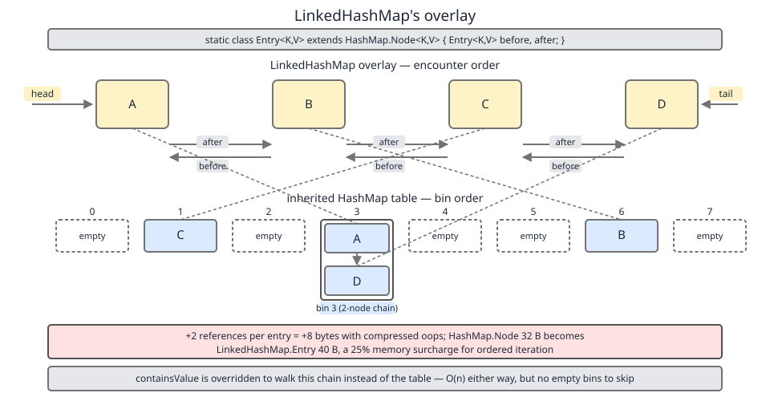

# 02 Java Collections — `LinkedHashMap` — INTERNALS (§3.7 `LinkedHashMap` source walk — the overlay and the four allocation overrides)

**Target version: Java 21 LTS.** | [Index](../00-index.md)
Previous: [hash-map/10b-build-my-hash-map-g-diff-and-collision-dos.md](../hash-map/10b-build-my-hash-map-g-diff-and-collision-dos.md) · Next: [linked-hash-map/01a-internals-a2-hooks-and-access-order.md](01a-internals-a2-hooks-and-access-order.md)

---

## The one idea in this class

`LinkedHashMap` adds **no table, no hashing, no lookup logic**. It adds **two references per entry and seven overridden methods**. The map underneath is a `HashMap` in every respect — same bins, same `hash()` spread, same resize doubling, same treeify at eight nodes in a bin of sixty-four. Lookup cost, memory layout of the table, collision behaviour: all inherited, all unchanged.

What it adds is a **doubly-linked chain drawn through the same node objects**, giving iteration a second traversal order to follow instead of array-scan order. There is **one object per entry, not two**. The chain is an overlay, not a parallel structure.

This file covers the overlay itself and the four allocation overrides that keep it consistent while `HashMap`, which knows nothing about it, mutates the table underneath. The three `afterNode*` hooks, access order and `removeEldestEntry` are in [`01a-internals-a2-hooks-and-access-order.md`](01a-internals-a2-hooks-and-access-order.md).

### The node hierarchy

This file introduces a family, so the map before the streets:

| Class | Extends | Adds | Shallow size (64-bit, compressed oops) |
|---|---|---|---|
| `HashMap.Node<K,V>` | — | `hash`, `key`, `value`, `next` | 32 B |
| `LinkedHashMap.Entry<K,V>` | `HashMap.Node` | `before`, `after` | 40 B |
| `HashMap.TreeNode<K,V>` | **`LinkedHashMap.Entry`** | `parent`, `left`, `right`, `prev`, `red` | 56 B |

**Insight:** `HashMap.TreeNode` extends `LinkedHashMap.Entry`, not `HashMap.Node`. A plain `HashMap`'s tree nodes therefore carry `before`/`after` fields they never read. That looks like a wart, and it is the reason `LinkedHashMap` needs no parallel class hierarchy for treeified bins — a `TreeNode` is already a chain-capable entry. The 8-byte tax on `HashMap`'s tree nodes buys `LinkedHashMap` its whole design.

The byte ladder is derived in [`../hash-map/04-internals-d-treeify.md`](../hash-map/04-internals-d-treeify.md) (leaf 3.6.30) and [`../cost-and-memory/02-internals-memory-headers.md`](../cost-and-memory/02-internals-memory-headers.md) (3.15.9–3.15.12); not re-derived here.

---

## The overlay itself (leaves 3.7.1, 3.7.2)

### Mental model

Picture the `HashMap` table as a row of pigeonholes, each holding a short list. Now draw a single ribbon that threads through every occupied pigeonhole in the order you filled them — crossing bin boundaries freely, ignoring the array entirely. `head` is where the ribbon starts, `tail` where it ends. Iteration follows the ribbon; lookup ignores it.

### Why it exists

`HashMap` iteration order is table-scan order, which is a function of hash values and current capacity — it changes on resize and is not part of the contract. Before Java 1.4 the only ordered `Map` in `java.util` was `TreeMap`, which costs O(log n) per operation and demands a `Comparable` key or a `Comparator`. `LinkedHashMap` gives you insertion-ordered iteration at `HashMap` prices, with no ordering constraint on the key type at all.

### When to reach for it, and when not

Reach for it when you need **deterministic encounter order** (config maps, JSON round-tripping, reproducible test output, LRU caches). Do not reach for it when iteration order is irrelevant and you are memory-bound — the sibling that wins there is `HashMap`, at 32 B per entry instead of 40 B, and with no chain to maintain on every insert and remove. When you need *sorted* rather than *encounter* order, `TreeMap` wins and `LinkedHashMap` cannot help.

### The mechanism

```java
    static class Entry<K,V> extends HashMap.Node<K,V> {
        Entry<K,V> before, after;
        Entry(int hash, K key, V value, Node<K,V> next) {
            super(hash, key, value, next);
        }
    }
```
— `java.base/java/util/LinkedHashMap.java`, JDK 21, line 205. (leaf 3.7.1)

Five lines. `before`/`after` are the chain; `next` — inherited, untouched — is still the *bin* chain. A single entry participates in two lists at once with two different meanings for "next", and confusing them is the standard reading error. `next` walks within one bucket; `after` walks the whole map.

```java
    transient LinkedHashMap.Entry<K,V> head;

    transient LinkedHashMap.Entry<K,V> tail;

    final boolean accessOrder;
```
— `java.base/java/util/LinkedHashMap.java`, JDK 21, lines 218, 223 and 231 (javadoc between the fields elided from the quote). (leaf 3.7.2)

Both endpoints are `transient`: serialization writes entries in encounter order via `internalWriteEntries` and rebuilds the chain on read through `newNode`, so the pointers themselves are never on the wire. `accessOrder` is `final` — the ordering mode is fixed at construction and there is no setter, which is why converting an insertion-order map to access-order means building a new map.

The javadoc on the two endpoints supplies the vocabulary the rest of the class uses: `head` is *"The head (**eldest**) of the doubly linked list"*, `tail` is *"The tail (**youngest**) of the doubly linked list"*. Those two words are exactly the words `removeEldestEntry` uses. Eldest means *at `head`*, and on an access-order map "eldest" means *least recently used* — which is the entire LRU idea, spelled out in the field comments. `removeEldestEntry` itself is leaf 3.7.9, in [`01a-internals-a2-hooks-and-access-order.md`](01a-internals-a2-hooks-and-access-order.md).



Look at the boxes: there is one row of them, not two. The table arrows below and the ribbon arrows above land on the *same* objects.

### Concrete

```java
var m = new LinkedHashMap<String, Integer>();
m.put("zebra", 1);   // whatever bin its hash lands in
m.put("ant", 2);     // some other bin, probably earlier in the table
m.put("moth", 3);
System.out.println(m.keySet());                 // [zebra, ant, moth] — ribbon order
System.out.println(new HashMap<>(m).keySet());  // [ant, moth, zebra] — table order
```

### Gotcha

The overlay costs 8 bytes per entry *and* four extra pointer writes per insertion and per removal. On a 10-million-entry map that is 80 MB of pure ordering metadata. Cache-locality is worse too: iterating the ribbon chases pointers across the heap in allocation order, whereas `HashMap` iteration walks a contiguous array and only chases within bins.

> **Definition.** `LinkedHashMap.Entry` is a `HashMap.Node` carrying two extra references that thread every live entry into one doubly-linked list, giving the map a stable encounter order independent of the table.

---

## `newNode` and the four allocation overrides (leaf 3.7.6) `[PROVE]`

This is the keystone. Everything else in the class follows from it.

### Mental model

`HashMap` does not build its own nodes. It asks a factory for one, stores whatever it is handed, and never looks at the type again. `LinkedHashMap` answers that call with a wider node that has already spliced itself into the ribbon.

### Why it exists

The alternative designs are worse. Wrapping every `HashMap` entry in a second list-node object would double allocation and force a lookup on every iteration step. Reimplementing the table would duplicate two thousand lines of tuned code. Overriding the allocation seam costs four short methods and gives correctness on every insertion path that exists or will ever be added to `HashMap`.

### When this pattern applies, and when not

This is the template for extending `HashMap` from inside `java.util`. It does not apply to you: the seams are package-private, so from outside the JDK the sibling that wins is composition — a `HashMap<K, YourNode>` plus your own list, which is exactly what §4.6.2 in [`02-build-lru-by-hand.md`](02-build-lru-by-hand.md) builds.

### The argument, worked

**Step 1 — `HashMap` never allocates a node directly.** Every insertion site in `putVal` calls a factory method:

```java
        if ((p = tab[i = (n - 1) & hash]) == null)
            tab[i] = newNode(hash, key, value, null);
```
— `java.base/java/util/HashMap.java`, JDK 21, line 637 (inside `putVal`, line 631).

```java
                    if ((e = p.next) == null) {
                        p.next = newNode(hash, key, value, null);
```
— `java.base/java/util/HashMap.java`, JDK 21, line 648.

There is no `new Node<>(...)` anywhere on the put path. There are further `newNode` call sites at lines 1240, 1338 and 1409 — `computeIfAbsent`, `compute` and `merge` respectively.

**Step 2 — the factory is overridable.** `HashMap.newNode` (line 1908) is package-private and non-final. A subclass in the same package `java.util` — which `LinkedHashMap` is — can override it. Nothing outside `java.util` can, which is why you cannot build a `LinkedHashMap` equivalent from outside the JDK without reimplementing the table.

**Step 3 — the override does two jobs in five lines.**

```java
    Node<K,V> newNode(int hash, K key, V value, Node<K,V> e) {
        LinkedHashMap.Entry<K,V> p =
            new LinkedHashMap.Entry<>(hash, key, value, e);
        linkNodeAtEnd(p);
        return p;
    }
```
— `java.base/java/util/LinkedHashMap.java`, JDK 21, line 280. (leaf 3.7.6)

It allocates the wider node type *and* splices it into the chain before handing it back. `HashMap` receives a `Node`, stores it in the bin, and is none the wiser.

**Step 4 — therefore every insertion path maintains the overlay for free.** `put`, `putAll`, `computeIfAbsent`, `compute`, `merge`, `putIfAbsent`, the copy constructor, `readObject`, and `resize`'s rehashing (which moves existing nodes and so does not need to allocate at all) — all correct, with **zero lines in `HashMap` that know the overlay exists**. That is the whole extension mechanism.

**Step 5 — there are four overrides, not one, and two of them behave differently.**

```java
    Node<K,V> replacementNode(Node<K,V> p, Node<K,V> next) {
        LinkedHashMap.Entry<K,V> q = (LinkedHashMap.Entry<K,V>)p;
        LinkedHashMap.Entry<K,V> t =
            new LinkedHashMap.Entry<>(q.hash, q.key, q.value, next);
        transferLinks(q, t);
        return t;
    }

    TreeNode<K,V> newTreeNode(int hash, K key, V value, Node<K,V> next) {
        TreeNode<K,V> p = new TreeNode<>(hash, key, value, next);
        linkNodeAtEnd(p);
        return p;
    }

    TreeNode<K,V> replacementTreeNode(Node<K,V> p, Node<K,V> next) {
        LinkedHashMap.Entry<K,V> q = (LinkedHashMap.Entry<K,V>)p;
        TreeNode<K,V> t = new TreeNode<>(q.hash, q.key, q.value, next);
        transferLinks(q, t);
        return t;
    }
```
— `java.base/java/util/LinkedHashMap.java`, JDK 21, lines 287, 295 and 301. (leaf 3.7.6)

| Override | Called from | Situation | Chain action |
|---|---|---|---|
| `newNode` | `putVal`, `computeIfAbsent`, `compute`, `merge` | brand-new key, list bin | `linkNodeAtEnd` — go to the end |
| `newTreeNode` | `TreeNode.putTreeVal` | brand-new key, bin already a tree | `linkNodeAtEnd` — go to the end |
| `replacementNode` | `TreeNode.untreeify` | same key, tree node → list node | `transferLinks` — inherit position |
| `replacementTreeNode` | `HashMap.treeifyBin` | same key, list node → tree node | `transferLinks` — inherit position |

**The distinction is the subtlest thing in the class.** A `new*` call is an *insertion*: a key that was not in the map now is, so it belongs at the end of encounter order. A `replacement*` call is a *substitution*: the same logical entry is being re-boxed into a different node class because its bin changed shape. Encounter order must not notice. Sending a treeified entry to the tail would silently scramble iteration order every time a bin crossed eight nodes.

```java
    private void transferLinks(LinkedHashMap.Entry<K,V> src,
                               LinkedHashMap.Entry<K,V> dst) {
        LinkedHashMap.Entry<K,V> b = dst.before = src.before;
        LinkedHashMap.Entry<K,V> a = dst.after = src.after;
        if (b == null)
            head = dst;
        else
            b.after = dst;
        if (a == null)
            tail = dst;
        else
            a.before = dst;
    }
```
— `java.base/java/util/LinkedHashMap.java`, JDK 21, line 259.

Copy both links onto the new node, then repoint the two neighbours — or the endpoint fields, if the node was `head` or `tail`. Note it does **not** null out `src.before`/`src.after`; the dead node is dropped by the caller and collected.

And the linker itself:

```java
    // link at the end of list
    private void linkNodeAtEnd(LinkedHashMap.Entry<K,V> p) {
        if (putMode == PUT_FIRST) {
            LinkedHashMap.Entry<K,V> first = head;
            head = p;
            if (first == null)
                tail = p;
            else {
                p.after = first;
                first.before = p;
            }
        } else {
            LinkedHashMap.Entry<K,V> last = tail;
            tail = p;
            if (last == null)
                head = p;
            else {
                p.before = last;
                last.after = p;
            }
        }
    }
```
— `java.base/java/util/LinkedHashMap.java`, JDK 21, line 236. (leaf 3.7.3, first half)

`linkNodeAtEnd` is *part of* leaf 3.7.3; that leaf's other half, `afterNodeInsertion` and its call to `removeEldestEntry`, is in [`01a-internals-a2-hooks-and-access-order.md`](01a-internals-a2-hooks-and-access-order.md). The method is covered here because it is meaningless without the four overrides that call it.

**Correction to the syllabus, and a version trap.** Leaf 3.7.3 names this method `linkNodeLast`. That was correct through JDK 17 and is wrong for JDK 21:

| JDK | Method name | Body | Line |
|---|---|---|---|
| 8 | `linkNodeLast` | no `if` at all — the `else` arm only | `java/util/LinkedHashMap.java`:222 |
| 17 | `linkNodeLast` | identical to JDK 8 | `java.base/java/util/LinkedHashMap.java`:223 |
| 21 | `linkNodeAtEnd` | adds the `putMode == PUT_FIRST` branch | `java.base/java/util/LinkedHashMap.java`:236 |

The `else` arm of the JDK 21 method **is** the entire JDK 8 method, character for character. The rename and the new branch arrived with `SequencedMap`'s `putFirst`/`putLast` in Java 21. Almost every write-up on the internet still says `linkNodeLast` and shows the branchless body; that is JDK 17 knowledge. `PUT_FIRST` is leaf 3.7.14, in [`01b-internals-b-lru-and-sequenced.md`](01b-internals-b-lru-and-sequenced.md).

### Step 6 — prove it runs

The interesting claim is step 5: that treeifying and untreeifying a bin leaves encounter order untouched. Force it.

```java
import java.util.*;

public class TreeifyOverlay {
    // Comparable key with a controllable hashCode, so a whole bin collides.
    record Key(int id, int bucket) implements Comparable<Key> {
        @Override public int hashCode() { return bucket; }
        @Override public int compareTo(Key o) { return Integer.compare(id, o.id); }
        @Override public String toString() { return "K" + id; }
    }

    static String shape(HashMap<?,?> m) throws Exception {
        var f = HashMap.class.getDeclaredField("table"); f.setAccessible(true);
        Object[] tab = (Object[]) f.get(m);
        if (tab == null) return "table=null";
        int trees = 0;
        for (Object o : tab)
            if (o != null && o.getClass().getSimpleName().equals("TreeNode")) trees++;
        return "table.length=" + tab.length + " treeBins=" + trees + " size=" + m.size();
    }

    public static void main(String[] a) throws Exception {
        // capacity 128, so MIN_TREEIFY_CAPACITY (64) is already satisfied
        LinkedHashMap<Key,String> m = new LinkedHashMap<>(128);
        List<Key> ord = new ArrayList<>();
        for (int i = 0; i < 6; i++) { Key k = new Key(i, 3); m.put(k, "v" + i); ord.add(k); }
        Key sp = new Key(100, 7); m.put(sp, "spacer"); ord.add(sp);   // a different bin, mid-sequence
        for (int i = 6; i < 14; i++) { Key k = new Key(i, 3); m.put(k, "v" + i); ord.add(k); }

        System.out.println("1 after treeify   : " + shape(m));
        System.out.println("  encounter       : " + m.keySet());
        System.out.println("  == insertion?   : " + new ArrayList<>(m.keySet()).equals(ord));

        for (int i = 13; i >= 5; i--) m.remove(new Key(i, 3));
        System.out.println("2 after 9 removes : " + shape(m));

        // force a resize (threshold 128*0.75 = 96) -> split() untreeifies the small tree bin
        for (int i = 1000; i < 1100; i++) m.put(new Key(i, i), "f");
        System.out.println("3 after resize    : " + shape(m));
        System.out.println("  first 7 encounter: " + new ArrayList<>(m.keySet()).subList(0, 7));
    }
}
```

Run with `--add-opens java.base/java.util=ALL-UNNAMED` (the reflective peek at `table` needs it; the map itself does not). Real output, JDK 21.0.7+8-LTS-245:

```
1 after treeify   : table.length=128 treeBins=1 size=15
  encounter       : [K0, K1, K2, K3, K4, K5, K100, K6, K7, K8, K9, K10, K11, K12, K13]
  == insertion?   : true
2 after 9 removes : table.length=128 treeBins=1 size=6
3 after resize    : table.length=256 treeBins=0 size=106
  first 7 encounter: [K0, K1, K2, K3, K4, K100, K1000]
```

Line 1: the bin treeified (`treeBins=1`), which ran `replacementTreeNode` six times and `newTreeNode` for the eight later colliders — and encounter order still equals insertion order, spacer `K100` still sitting between `K5` and `K6` even though it lives in a different bin. Line 3: the resize untreeified the shrunken bin (`treeBins=0`), running `replacementNode` on five nodes — and `K0..K4, K100` are still in order, in front of the filler. Four overrides, all exercised, overlay intact.

### Gotcha

Untreeification does not happen on removal alone. Between steps 2 and 3 the bin was down to five nodes and still a tree — `treeBins=1`. `HashMap` only untreeifies from `split()` during a resize, or from `removeTreeNode` when the red-black tree gets structurally tiny. A shrinking map can therefore keep paying `TreeNode`'s 56 bytes per entry long after the bin stopped needing a tree.

> **Definition.** `newNode`, `newTreeNode`, `replacementNode` and `replacementTreeNode` are `HashMap`'s node-allocation seams; `LinkedHashMap` overrides all four so that every node the table ever creates is chain-aware — new nodes going to the end, substituted nodes inheriting their predecessor's position.

---

## Pitfalls

### Assuming there is one allocation override

**Wrong**
```java
// "LinkedHashMap just overrides newNode."
class MyLinked<K,V> extends HashMap<K,V> {          // hypothetical, inside java.util
    @Override Node<K,V> newNode(int h, K k, V v, Node<K,V> e) { /* link at end */ }
    // no newTreeNode, no replacementNode, no replacementTreeNode
}
```
Encounter order is correct until some bin reaches eight nodes in a table of sixty-four. Then `treeifyBin` re-boxes every node in that bin, the overridden `newNode` is never consulted, and the chain silently loses those entries.

**Right** — four overrides. `newNode` and `newTreeNode` call `linkNodeAtEnd`; `replacementNode` and `replacementTreeNode` call `transferLinks` to inherit the departing node's position.

**Why people believe it:** treeification is rare in practice, so the bug never surfaces in a small test — and `newNode` is the only one most articles quote.

### Reading `next` as the iteration pointer

**Wrong**
```java
// "e.next walks the map in encounter order"
```
`next` is `HashMap.Node`'s field and walks *within one bucket*. Following it from `head` visits the head's bin-mates, in bin order, then stops.

**Right** — `after` walks the whole map in encounter order; `LinkedHashIterator` (line 1003) reads `after`, never `next`. Two fields, two lists, one object.

**Why people believe it:** both are called "next" in ordinary speech, and both are non-null pointers on the same object.

### Expecting `head` and `tail` to survive serialization

**Wrong**
```java
// "the chain is a field, so it round-trips with the object"
```
Both are declared `transient`. Nothing about them is written.

**Right** — `internalWriteEntries` streams the entries by walking `head`/`after`, and `readObject` replays them through `putVal` → `newNode` → `linkNodeAtEnd`, rebuilding the chain in the order it was written. The order round-trips; the pointers do not.

**Why people believe it:** the round-trip *works*, so it is easy to assume the direct mechanism rather than the replay.

### Trying to flip a map to access order after construction

**Wrong**
```java
var m = new LinkedHashMap<String,Integer>();
// ... later, wanting LRU behaviour
// there is no m.setAccessOrder(true)
```

**Right**
```java
var lru = new LinkedHashMap<String,Integer>(16, 0.75f, true);
lru.putAll(m);   // rebuild; encounter order of m is preserved as the initial order
```

**Why people believe it:** most `java.util` configuration knobs are constructor-only, but the field being `final` is easy to miss when the three-arg constructor is itself little known.

### Budgeting `LinkedHashMap` at `HashMap` prices

**Wrong**
```java
// "it's a HashMap with ordering, so same memory"
```
40 B per entry versus 32 B, plus a `TreeNode` ladder that starts higher. On ten million entries that is 80 MB of pure ordering metadata, before values.

**Right** — budget +25% per entry, and measure. If order is only needed at read time, `new ArrayList<>(map.entrySet())` plus a sort can be cheaper than paying the overlay on every write.

**Why people believe it:** two references sound free next to a key and a value, and the table array — the part people picture — genuinely is identical.

---

## Cheat sheet

| Thing | Fact |
|---|---|
| What is added | `before`, `after` per entry; `head`, `tail`, `accessOrder` per map |
| Objects per entry | **one** — the overlay threads the existing node, it does not wrap it |
| Node sizes | `Node` 32 B → `LinkedHashMap.Entry` 40 B → `TreeNode` 56 B |
| Hierarchy oddity | `HashMap.TreeNode` extends `LinkedHashMap.Entry`, so `HashMap`'s tree nodes carry unused `before`/`after` |
| `next` vs `after` | `next` = within one bin; `after` = whole map in encounter order |
| `head` / `tail` | `transient` — rebuilt on deserialization via `newNode` |
| `accessOrder` | `final` — constructor-only, no setter |
| Javadoc vocabulary | `head` = eldest, `tail` = youngest — the words `removeEldestEntry` uses |
| Allocation overrides | `newNode` 280, `replacementNode` 287, `newTreeNode` 295, `replacementTreeNode` 301 |
| `new*` vs `replacement*` | `linkNodeAtEnd` (insertion → go to end) vs `transferLinks` (substitution → inherit position) |
| Why four, not one | treeify and untreeify re-box nodes; missing those two scrambles order at bin size 8 |
| Why the seam works | `HashMap.newNode` is package-private and non-final; `putVal` never writes `new Node<>` |
| `newNode` call sites in `HashMap` | 637, 648 (`putVal`), 1240 (`computeIfAbsent`), 1338 (`compute`), 1409 (`merge`) |
| JDK 21 rename | `linkNodeLast` (8:222, 17:223) → `linkNodeAtEnd` (21:236), with a new `PUT_FIRST` branch |
| JDK 8 body | exactly the `else` arm of the JDK 21 method |
| Untreeify timing | only on `split()` during resize, or a structurally tiny tree in `removeTreeNode` — not on plain removal |
| Cost of the overlay | +8 B/entry, +4 pointer writes per insert and per remove, worse iteration locality |

---

## Self-test

**Q1.** `HashMap` contains no reference to `before` or `after`, yet `computeIfAbsent` on a `LinkedHashMap` correctly appends to the chain. How?

<details><summary>Answer</summary>

`HashMap` never writes `new Node<>(...)`. Every insertion site — including `computeIfAbsent` at `HashMap.java`:1240 — calls the package-private, non-final factory `newNode(hash, key, value, next)`. `LinkedHashMap` overrides it (line 280) to allocate a `LinkedHashMap.Entry` and call `linkNodeAtEnd(p)` before returning. The subclass hijacks allocation, so every path that inserts is automatically chain-correct without `HashMap` knowing the chain exists.

</details>

**Q2.** Why do `replacementNode` and `replacementTreeNode` call `transferLinks` instead of `linkNodeAtEnd`?

<details><summary>Answer</summary>

Because they are substitutions, not insertions. They run when a bin treeifies or untreeifies, re-boxing an *existing* logical entry into a different node class. Sending it to the tail would move it in encounter order, so iteration order would silently change every time a bin crossed the treeify or untreeify threshold. `transferLinks` copies `before`/`after` onto the new node and repoints the two neighbours (or `head`/`tail`), leaving the position unchanged.

</details>

**Q3.** A `HashMap` that never uses `LinkedHashMap` still allocates tree nodes carrying `before` and `after`. Why is that not a bug?

<details><summary>Answer</summary>

`HashMap.TreeNode` extends `LinkedHashMap.Entry`, deliberately. It costs a plain `HashMap` 8 bytes per tree node — and tree nodes are rare, only appearing in bins that reached eight entries. In exchange, `LinkedHashMap` needs no parallel tree-node class: `newTreeNode` and `replacementTreeNode` can hand a `TreeNode` straight to `linkNodeAtEnd`/`transferLinks`, which take a `LinkedHashMap.Entry`. Without the inheritance, treeified bins in a `LinkedHashMap` would need a whole second `TreeNode` hierarchy.

</details>

**Q4.** Which JDK renamed `linkNodeLast`, to what, and why?

<details><summary>Answer</summary>

JDK 21 renamed it to `linkNodeAtEnd` and added a `putMode == PUT_FIRST` branch. It was `linkNodeLast` in JDK 8 (`java/util/LinkedHashMap.java`:222) and JDK 17 (line 223), with no conditional at all — the JDK 8 body is exactly the `else` arm of the JDK 21 method. The change came with `SequencedMap` and its `putFirst`/`putLast`, which need the linker to be able to prepend. Almost every online write-up still shows the JDK 17 form.

</details>

**Q5.** In the treeify program, why does the bin still report `treeBins=1` after nine removals leave only six entries, and what finally untreeifies it?

<details><summary>Answer</summary>

`HashMap` does not untreeify on ordinary removal. `removeTreeNode` untreeifies only when the red-black tree becomes structurally tiny (root's child or grandchild missing), and `split()` untreeifies during a resize when a half lands at or below `UNTREEIFY_THRESHOLD` (6). In the program, adding 100 filler keys pushes past the threshold of 96, `resize()` runs, `split()` untreeifies the shrunken bin, and `replacementNode` fires on five nodes — after which `treeBins=0` and encounter order is still `K0..K4, K100`.

</details>

**Q6.** `head` and `tail` are `transient`, yet a serialized `LinkedHashMap` deserializes with its encounter order intact. Explain.

<details><summary>Answer</summary>

`internalWriteEntries` walks `head`/`after` and streams the key-value pairs in encounter order. `readObject` replays them through the normal insertion path, which calls `newNode`, which calls `linkNodeAtEnd` — so the chain is rebuilt in exactly the order it was written. The *order* is serialized; the pointers are not, which is correct since object identities differ after a round-trip.

</details>

**Q7.** You need ordered iteration over 10 million entries but memory is tight. What is the argument against `LinkedHashMap`, and what wins instead?

<details><summary>Answer</summary>

The overlay is +8 B per entry — 80 MB at that scale — plus four extra pointer writes per insert and per remove, plus worse iteration locality (pointer-chasing in allocation order versus a contiguous array scan). If order is only needed at read time, a plain `HashMap` with a one-off `new ArrayList<>(map.entrySet())` and a sort at the point of use is cheaper. `LinkedHashMap` wins when order is needed *continuously* or when you want LRU eviction, which the overlay makes O(1).

</details>

---

**Leaves covered:** 3.7.1, 3.7.2, 3.7.6 (3 leaves)
**Leaves deferred:** none — 3.7.3, 3.7.4, 3.7.5, 3.7.7, 3.7.8 and 3.7.9 are in [01a-internals-a2-hooks-and-access-order.md](01a-internals-a2-hooks-and-access-order.md); 3.7.10 to 3.7.17 are in [01b-internals-b-lru-and-sequenced.md](01b-internals-b-lru-and-sequenced.md)
**Diagrams included:** D-100
**Target version:** Java 21 LTS
**Lines:** 472
