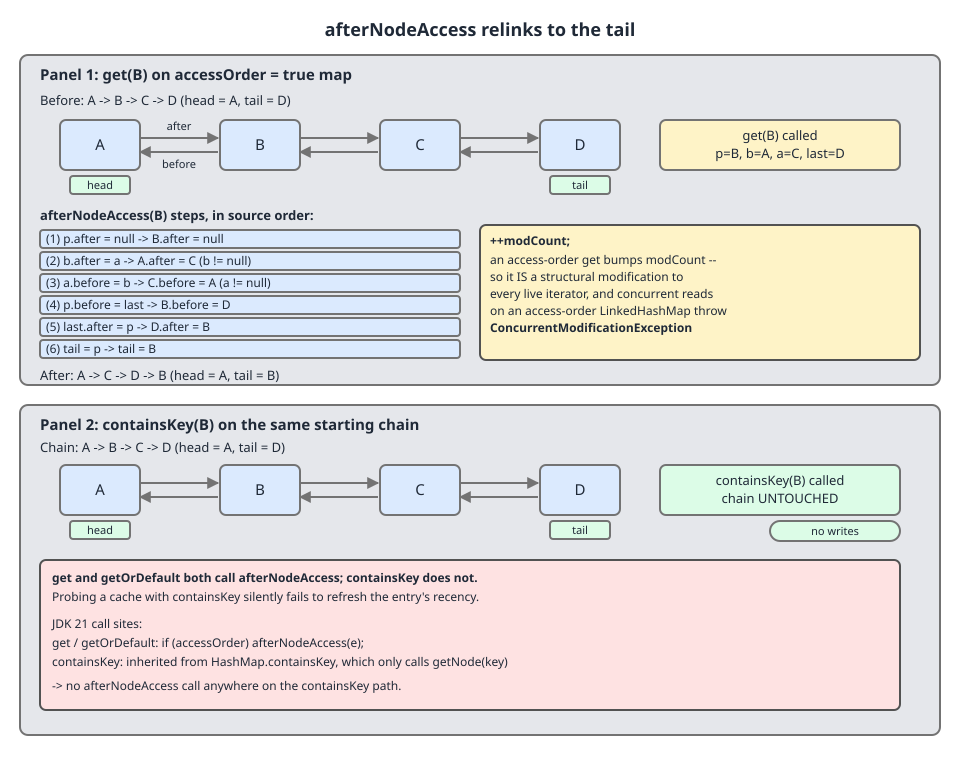

# 02 Java Collections — `LinkedHashMap` — INTERNALS (§3.7 `LinkedHashMap` source walk — `afterNodeAccess`, and what counts as an access)

**Target version: Java 21 LTS.** | [Index](../00-index.md)
Previous: [linked-hash-map/01-internals.md](01-internals.md) · Next: [linked-hash-map/01a1-internals-a3-insertion-removal-and-containsvalue.md](01a1-internals-a3-insertion-removal-and-containsvalue.md)

---

## Where this picks up

[`01-internals.md`](01-internals.md) established the overlay — `before`/`after` on every entry, `head`/`tail` on the map — and the four allocation overrides that keep the chain correct while `HashMap` builds and re-boxes nodes underneath. That covered *construction*.

This file covers the one hook that makes `LinkedHashMap` more than an ordered map, and the question that follows immediately from it. `afterNodeAccess` is what turns a chronological log into a recency ranking; "what counts as an access" is the question every LRU bug in production turns out to be an answer to.

`HashMap` declares all three hooks as empty methods:

```java
    void afterNodeAccess(Node<K,V> p) { }
    void afterNodeInsertion(boolean evict) { }
```
— `java.base/java/util/HashMap.java`, JDK 21, lines 1941–1942 (`afterNodeRemoval` follows at 1943; leaf 3.6.45 in [`../hash-map/05b-internals-e2-views-hooks-and-hashtable.md`](../hash-map/05b-internals-e2-views-hooks-and-hashtable.md)).

Three no-ops in the superclass. `afterNodeAccess` is filled in below; `afterNodeInsertion` and `afterNodeRemoval` are in [`01a1-internals-a3-insertion-removal-and-containsvalue.md`](01a1-internals-a3-insertion-removal-and-containsvalue.md).

---

## `afterNodeAccess` — the six pointer writes (leaf 3.7.4)

### Mental model

A queue at a counter where being served sends you to the back. On an access-order map, touching an entry is not a read — it is a re-queue.

### Why it exists

Without it, `LinkedHashMap` could only do insertion order, and LRU would be impossible: the head would always be the *oldest inserted* entry, not the *least recently used* one. `afterNodeAccess` is the single method that turns a chronological log into a recency ranking, and it does it in constant time — which is the whole reason an LRU built on `LinkedHashMap` beats scanning a `HashMap` for a timestamp minimum.

### When it fires, and when you do not want it

It fires only when `accessOrder` is `true` (or on the `putFirst`/`putLast` paths). You do not want access order for a config map, a JSON round-trip, or anything you iterate concurrently with reads — see the `ConcurrentModificationException` below. The sibling that wins for a plain ordered map is the default `accessOrder == false` constructor, where this method compiles to a failed branch test.

### The mechanism

```java
    // Called after update, but not after insertion
    void afterNodeAccess(Node<K,V> e) {
        LinkedHashMap.Entry<K,V> last;
        LinkedHashMap.Entry<K,V> first;
        if ((putMode == PUT_LAST || (putMode == PUT_NORM && accessOrder)) && (last = tail) != e) {
            // move node to last
            LinkedHashMap.Entry<K,V> p =
                (LinkedHashMap.Entry<K,V>)e, b = p.before, a = p.after;
            p.after = null;
            if (b == null)
                head = a;
            else
                b.after = a;
            if (a != null)
                a.before = b;
            else
                last = b;
            if (last == null)
                head = p;
            else {
                p.before = last;
                last.after = p;
            }
            tail = p;
            ++modCount;
        }
    }
```
— `java.base/java/util/LinkedHashMap.java`, JDK 21, line 336. The `else if (putMode == PUT_FIRST …)` arm that follows in the source is excerpted out; it belongs to leaf 3.7.14 in [`01b-internals-b-lru-and-sequenced.md`](01b-internals-b-lru-and-sequenced.md). (leaf 3.7.4)

Walk it on the chain `A → B → C → D` with `get("B")`, so `p = B`, `b = A`, `a = C`, `last = tail = D`:

| # | Source | Effect | The other arm |
|---|---|---|---|
| 1 | `p.after = null` | `B.after = null` | — |
| 2 | `b.after = a` | `A.after = C` | if `b == null`, `head = a` — B was the head |
| 3 | `a.before = b` | `C.before = A` | if `a == null`, `last = b` |
| 4 | `p.before = last` | `B.before = D` | — |
| 5 | `last.after = p` | `D.after = B` | if `last == null`, `head = p` — map had one entry |
| 6 | `tail = p` | `tail = B` | — |

Then `++modCount`. Result: `A → C → D → B`.

Six writes, no allocation, no table access, no hashing — O(1) with a tiny constant, which is exactly why an LRU on this class is cheap.

On write 3, the `a == null` arm sets `last = b`, meaning "the accessed node *was* the tail, so the new tail candidate is its predecessor". But the guard `(last = tail) != e` already rejected the case where `e` is the tail, and the `&&` binds across the whole `||` group, so it applies on the `PUT_LAST` path too. **Unverified:** that arm appears unreachable in JDK 21; I could not construct an input that executes it. Details in [Open questions](#open-questions).



The numbers on the arrows are the six rows of the table above, in source order. The lower half of the diagram is the same `get` replaced by `containsKey` — nothing moves, which is the subject of leaf 3.7.8 below.

### The payload: `++modCount`

**An access-order `get` is a structural modification.** Every live iterator's `expectedModCount` goes stale, so reading the map while iterating it throws:

```java
var lru = new LinkedHashMap<String,Integer>(16, 0.75f, true);
lru.put("A", 1); lru.put("B", 2); lru.put("C", 3); lru.put("D", 4);
try {
    for (String k : lru.keySet()) lru.get(k);   // reading. only reading.
    System.out.println("no exception (unexpected)");
} catch (ConcurrentModificationException e) {
    System.out.println("ConcurrentModificationException: " + e.getMessage());
}

var ins = new LinkedHashMap<String,Integer>();               // accessOrder = false
ins.put("A", 1); ins.put("B", 2); ins.put("C", 3);
for (String k : ins.keySet()) ins.get(k);
System.out.println("same loop on an insertion-order map: completed, order " + ins.keySet());
```

Real output, JDK 21.0.7+8-LTS-245:

```
ConcurrentModificationException: null
same loop on an insertion-order map: completed, order [A, B, C]
```

**Insight:** the guard `(last = tail) != e` means accessing the entry that is *already* the tail does nothing at all — no pointer writes, no `modCount` bump. Measured (`mod()` reflectively reads `HashMap.modCount`; see the harness in the next section):

```java
var t = new LinkedHashMap<String,Integer>(16, 0.75f, true);
t.put("A", 1); t.put("B", 2); t.put("C", 3); t.put("D", 4);
System.out.println("before: " + t.keySet() + " modCount=" + mod(t));
t.get("D"); t.get("D"); t.get("D");
System.out.println("after 3x get(\"D\"): " + t.keySet() + " modCount=" + mod(t));
```

```
before: [A, B, C, D] modCount=4
after 3x get("D"): [A, B, C, D] modCount=4
```

So hammering the same hot key in a loop is free after the first call — and, relevant to the CME above, a single-element access-order map can be iterated with `get` safely, because every `get` hits the tail.

### Concurrency

Two threads calling `get` on a shared access-order `LinkedHashMap` are both *writing* six pointers each, unsynchronised. A read-only-looking workload corrupts the chain: interleave two relinks and you can produce a cycle, or orphan a live entry so that iteration silently skips it while `get` still finds it through the table. `Collections.synchronizedMap` — or a `ConcurrentHashMap` with a different eviction strategy — is mandatory. Leaf 3.7.11 in [`01b-internals-b-lru-and-sequenced.md`](01b-internals-b-lru-and-sequenced.md) develops this.

**Version note.** JDK 8's `afterNodeAccess` (`java/util/LinkedHashMap.java`:305, with the `// move node to last` comment on the method signature rather than inside the body) guards with plain `if (accessOrder && (last = tail) != e)`. JDK 17 (line 306) is identical to JDK 8. JDK 21's guard adds the `putMode` states. Behaviour for ordinary `get` and `put` is unchanged: with `putMode == PUT_NORM`, `(PUT_NORM == PUT_LAST || (PUT_NORM == PUT_NORM && accessOrder))` reduces to `accessOrder`. The extra states exist solely for `putFirst`/`putLast`, which arrived with `SequencedMap` in Java 21 — the same release that renamed `linkNodeLast` to `linkNodeAtEnd` (version table in [`01-internals.md`](01-internals.md)).

**Interview:** *"What is the time complexity of moving an entry to the front of an LRU built on `LinkedHashMap`?"* — O(1): six pointer writes in `afterNodeAccess`, no allocation and no table access, which is why the class is the standard answer to the LRU-cache question.

> **Definition.** `afterNodeAccess` is the hook `HashMap` calls after an existing mapping is read or updated; on an access-order map it unlinks the entry and relinks it at the tail in six pointer writes, and bumps `modCount` because encounter order changed.

---

## `get` relinks, `containsKey` does not (leaf 3.7.8) `[TRAP]` `[RESEARCH]`

### Mental model

There is no such thing as "an access" in general. There is only *the set of methods that route through `afterNodeAccess`* — and that set is neither "the read methods" nor "the methods that take a key". It has to be read off the source, method by method.

### Why it matters

Every LRU bug in production is a disagreement between what the programmer thinks counts as a use of a cache entry and what the map thinks. The table below is the reconciliation.

### When you need this list, and when you do not

You need it the moment `accessOrder` is `true`. On an insertion-order map every row collapses to "no" and the whole distinction evaporates — which is a good argument for not reaching for access order unless you actually want eviction, since it turns a documented read API into a partly-undocumented write API.

### Established from the source, not from recall

`get` and `getOrDefault` are **overridden** in `LinkedHashMap`, and each one calls the hook:

```java
    public V get(Object key) {
        Node<K,V> e;
        if ((e = getNode(key)) == null)
            return null;
        if (accessOrder)
            afterNodeAccess(e);
        return e.value;
    }

    public V getOrDefault(Object key, V defaultValue) {
       Node<K,V> e;
       if ((e = getNode(key)) == null)
           return defaultValue;
       if (accessOrder)
           afterNodeAccess(e);
       return e.value;
   }
```
— `java.base/java/util/LinkedHashMap.java`, JDK 21, lines 534 and 546 (javadoc between the two methods elided). (leaf 3.7.8)

Note the redundant `if (accessOrder)` — `afterNodeAccess` re-tests it anyway. It is there to keep the insertion-order path from making the call at all.

`containsKey` is **not overridden**. Grepping `LinkedHashMap.java` for `containsKey` in JDK 21 returns five hits: line 44 (class javadoc prose), line 531 (a javadoc cross-reference inside `get`'s doc), line 702 (`LinkedKeySet.contains`, which delegates to the outer `containsKey`), and lines 1126–1127 inside `ReverseOrderLinkedHashMapView`, which forward to `base.containsKey`. **There is no `public boolean containsKey` declaration in the file.** The inherited implementation is:

```java
    public boolean containsKey(Object key) {
        return getNode(key) != null;
    }
```
— `java.base/java/util/HashMap.java`, JDK 21, line 601.

No hook call, and no hook call available — `getNode` is `HashMap`'s and never touches the overlay.

### The full access surface, measured

Every row below was produced by running the operation against a fresh access-order map `[A, B, C, D]` and printing the resulting key order and `modCount`.

```java
import java.util.*;
import java.util.function.*;

public class AccessSurface {
    static LinkedHashMap<String,Integer> fresh() {
        var m = new LinkedHashMap<String,Integer>(16, 0.75f, true); // accessOrder = true
        m.put("A", 1); m.put("B", 2); m.put("C", 3); m.put("D", 4);
        return m;
    }
    static int mod(LinkedHashMap<?,?> m) {
        try { var f = HashMap.class.getDeclaredField("modCount"); f.setAccessible(true); return f.getInt(m); }
        catch (Exception e) { throw new RuntimeException(e); }
    }
    static void probe(String label, Consumer<LinkedHashMap<String,Integer>> op) {
        var m = fresh();
        int before = mod(m);
        op.accept(m);
        System.out.printf("%-34s -> %-16s modCount %d -> %d%n", label, m.keySet(), before, mod(m));
    }
    public static void main(String[] a) {
        System.out.println("baseline (no op)                   -> " + fresh().keySet());
        probe("get(\"B\")",                  m -> m.get("B"));
        probe("getOrDefault(\"B\", 0)",      m -> m.getOrDefault("B", 0));
        probe("containsKey(\"B\")",          m -> m.containsKey("B"));
        probe("put(\"B\", 99)  [existing]",  m -> m.put("B", 99));
        probe("put(\"E\", 5)   [new]",       m -> m.put("E", 5));
        probe("putIfAbsent(\"B\", 99)",      m -> m.putIfAbsent("B", 99));
        probe("replace(\"B\", 99)",          m -> m.replace("B", 99));
        probe("merge(\"B\",1,Integer::sum)", m -> m.merge("B", 1, Integer::sum));
        probe("compute(\"B\",(k,v)->v+1)",   m -> m.compute("B", (k, v) -> v + 1));
        probe("computeIfAbsent(\"B\",k->9)", m -> m.computeIfAbsent("B", k -> 9));
        probe("computeIfPresent(\"B\",..)",  m -> m.computeIfPresent("B", (k, v) -> v + 1));
        probe("containsValue(2)",            m -> m.containsValue(2));
        probe("values().contains(2)",        m -> m.values().contains(2));
        probe("forEach((k,v)->{})",          m -> m.forEach((k, v) -> {}));
        probe("entrySet() traversal",        m -> { for (var e : m.entrySet()) { int i = e.getValue(); } });
        probe("toString()",                  m -> m.toString());
        probe("entry.setValue(9) on B",      m -> { for (var e : m.entrySet()) if (e.getKey().equals("B")) e.setValue(9); });
    }
}
```

Run with `--add-opens java.base/java.util=ALL-UNNAMED` for the reflective `modCount` read. Real output, JDK 21.0.7+8-LTS-245:

```
baseline (no op)                   -> [A, B, C, D]
get("B")                           -> [A, C, D, B]     modCount 4 -> 5
getOrDefault("B", 0)               -> [A, C, D, B]     modCount 4 -> 5
containsKey("B")                   -> [A, B, C, D]     modCount 4 -> 4
put("B", 99)  [existing]           -> [A, C, D, B]     modCount 4 -> 5
put("E", 5)   [new]                -> [A, B, C, D, E]  modCount 4 -> 5
putIfAbsent("B", 99)               -> [A, C, D, B]     modCount 4 -> 5
replace("B", 99)                   -> [A, C, D, B]     modCount 4 -> 5
merge("B",1,Integer::sum)          -> [A, C, D, B]     modCount 4 -> 5
compute("B",(k,v)->v+1)            -> [A, C, D, B]     modCount 4 -> 5
computeIfAbsent("B",k->9)          -> [A, C, D, B]     modCount 4 -> 5
computeIfPresent("B",..)           -> [A, C, D, B]     modCount 4 -> 5
containsValue(2)                   -> [A, B, C, D]     modCount 4 -> 4
values().contains(2)               -> [A, B, C, D]     modCount 4 -> 4
forEach((k,v)->{})                 -> [A, B, C, D]     modCount 4 -> 4
entrySet() traversal               -> [A, B, C, D]     modCount 4 -> 4
toString()                         -> [A, B, C, D]     modCount 4 -> 4
entry.setValue(9) on B             -> [A, B, C, D]     modCount 4 -> 4
```

| Operation | Counts as an access? | Route |
|---|---|---|
| `get(k)` | **yes** | overridden, calls `afterNodeAccess` |
| `getOrDefault(k, d)` | **yes** | overridden, calls `afterNodeAccess` |
| `put(k, v)` on existing key | **yes** | `putVal`'s update branch calls `afterNodeAccess(e)` (`HashMap.java`:663) |
| `put(k, v)` on new key | goes to the tail, but not via the hook | `newNode` → `linkNodeAtEnd`; hence the comment *"Called after update, but not after insertion"* |
| `putIfAbsent` when present | **yes** | same `putVal` update branch, `HashMap.java`:663 |
| `replace(k, v)` | **yes** | `HashMap.java`:1166 / :1178 |
| `merge` when present | **yes** | `HashMap.java`:1400 |
| `compute` when present | **yes** | `HashMap.java`:1329 |
| `computeIfAbsent` when present | **yes** | `HashMap.java`:1223 — surprising: it computes nothing yet still re-queues |
| `computeIfPresent` | **yes** | `HashMap.java`:1273 |
| `containsKey(k)` | **no** | not overridden; `getNode(key) != null` |
| `containsValue(v)` | **no** | overridden, but only to walk the chain — no hook (leaf 3.7.7, next file) |
| `values().contains(v)` | **no** | delegates to `containsValue` |
| `forEach`, iteration, `toString` | **no** | `LinkedHashIterator` (line 1003) reads `after`, never calls the hook |
| `Entry.setValue(v)` | **no** | writes the field directly; no hook, no `modCount` |

The `computeIfAbsent`-when-present row and the `Entry.setValue` row are the two nobody expects. Read together they are almost paradoxical: a method that *writes nothing* refreshes the entry, and a method that *overwrites the value* does not.

**Pitfall: "probing an LRU cache with `containsKey` before `get` is harmless."**

*Wrong belief:* `containsKey` and `get` are the same lookup, so checking first costs nothing.

*Symptom:* hit rate collapses. A `containsKey`-only existence check lets a genuinely hot key sit at the head and get evicted while it is still in active use; and a `containsKey`-then-`get` idiom performs the table lookup twice while counting only one of them as an access, so half the CPU on the read path is wasted.

*Fix:* one `get`, null-checked — or `getOrDefault(k, sentinel)` when `null` is a legal stored value.

```java
// Wrong: two lookups, one access, and containsKey-only paths never refresh the entry.
if (cache.containsKey(k)) { return cache.get(k); }
return compute(k);

// Right: one lookup, one access.
V v = cache.get(k);
if (v != null) return v;
return compute(k);
```

**Interview:** *"On an access-order `LinkedHashMap`, does `containsKey` refresh the entry?"* — No. `containsKey` is inherited from `HashMap` and never reaches `afterNodeAccess`; only `get`, `getOrDefault` and successful updates of an existing mapping through `putVal` do.

> **Definition.** On an access-order `LinkedHashMap`, "access" means precisely *the set of methods that route through `afterNodeAccess`* — `get`, `getOrDefault`, and any successful update of an existing mapping — and explicitly not existence checks, value scans, iteration, or `Entry.setValue`.

---

## Version behaviour of these two members

| Member | JDK 8 line | JDK 17 | JDK 21 | Changed? |
|---|---|---|---|---|
| `afterNodeAccess` | 305 | 306 | 336 | **guard gained `putMode`; `PUT_FIRST` arm added in 21** |
| `get` | 438 | 439 | 534 | body identical except `getNode(hash(key), key)` → `getNode(key)`, a `HashMap` signature change in Java 9+ |
| `getOrDefault` | 450 | same | 546 | same one-line difference |
| `containsKey` | not present | not present | not present | never overridden in any version |

Everything above is unchanged since Java 8 except the `putMode` machinery added in 21 and that one `getNode` refactor in 9. The `putMode` constants (`PUT_NORM`/`PUT_FIRST`/`PUT_LAST`, lines 330–333), `putFirst` (392), `putLast` (409) and `ReverseOrderLinkedHashMapView` are all Java 21 `SequencedMap` additions — leaves 3.7.13–3.7.15 in [`01b-internals-b-lru-and-sequenced.md`](01b-internals-b-lru-and-sequenced.md).

---

## Pitfalls

### Believing `containsKey` refreshes an LRU entry

**Wrong**
```java
var cache = new LinkedHashMap<String,String>(16, 0.75f, true);
cache.put("A","1"); cache.put("B","2"); cache.put("C","3");
if (cache.containsKey("A")) { /* "A is hot, we just checked" */ }
System.out.println(cache.keySet());   // [A, B, C] — A is still the eldest, first to be evicted
```

**Right**
```java
String v = cache.get("A");            // one lookup, and it counts
if (v != null) System.out.println("hit: " + v);
System.out.println(cache.keySet());   // [B, C, A] — A is now the youngest
```

**Why people believe it:** `containsKey` and `get` do the identical table lookup and are documented next to each other; nothing in `containsKey`'s javadoc mentions ordering, and the ordering side effect lives in a method that is not `containsKey`'s to call.

### Calling `get` while iterating an access-order map

**Wrong**
```java
var lru = new LinkedHashMap<String,Integer>(16, 0.75f, true);
lru.put("A",1); lru.put("B",2); lru.put("C",3);
for (String k : lru.keySet()) System.out.println(lru.get(k));
// java.util.ConcurrentModificationException
```

**Right**
```java
for (var e : lru.entrySet()) System.out.println(e.getValue());  // no hook, no modCount bump
```

**Why people believe it:** `get` is a read. On an access-order map it is a six-pointer write plus `++modCount`, and the iterator's fail-fast check cannot distinguish it from a `put`.

### Treating `Entry.setValue` as an update that counts

**Wrong**
```java
for (var e : lru.entrySet())
    if (e.getKey().equals(hot)) e.setValue(newValue);   // "I just updated it, so it's fresh"
// order unchanged: [A, B, C, D]
```

**Right**
```java
lru.put(hot, newValue);   // goes through putVal's update branch -> afterNodeAccess -> moves to tail
```

**Why people believe it:** `setValue` mutates the same field `put` mutates. It just does it directly on the node, bypassing `putVal` entirely — so no hook, and no `modCount` bump either.

### Expecting `computeIfAbsent` on a present key to be a pure no-op

**Wrong**
```java
// "the key is there, so the mapping function never runs and nothing happens"
lru.computeIfAbsent(k, key -> expensive(key));
```
Nothing is computed — but the entry moves to the tail and `modCount` bumps, so the call is a structural modification and invalidates live iterators.

**Right** — if you want a genuine no-op probe, use `containsKey`; if you want the access to count, that is what the method already does, and say so in a comment so the next reader is not surprised.

**Why people believe it:** the method name promises conditional work, and the condition is false. The relink happens on the *lookup* half, at `HashMap.java`:1223, before the condition is even considered.

### Sharing an access-order map across threads because "we only read it"

**Wrong**
```java
static final Map<String,Session> CACHE = new LinkedHashMap<>(64, 0.75f, true);
// many threads, get() only
```
Every `get` is six unsynchronised pointer writes. Two interleaved relinks can cycle the chain, orphan a live entry so iteration skips it while `get` still finds it, or corrupt `head`/`tail`.

**Right**
```java
static final Map<String,Session> CACHE =
    Collections.synchronizedMap(new LinkedHashMap<>(64, 0.75f, true));
```
or drop access order and use `ConcurrentHashMap` with a different eviction strategy.

**Why people believe it:** "readers don't need locks" is correct for `HashMap` and for an insertion-order `LinkedHashMap`. Setting `accessOrder = true` silently converts `get` into a mutator, and no signature changes to warn you.

---

## Cheat sheet

| Thing | Fact |
|---|---|
| `HashMap`'s hook stubs | empty bodies, `HashMap.java`:1941–1943 |
| `afterNodeAccess` | `LinkedHashMap.java`:336 |
| Its guard | `(putMode == PUT_LAST \|\| (putMode == PUT_NORM && accessOrder)) && (last = tail) != e` |
| Cost when it fires | 6 pointer writes + `++modCount`; O(1), no allocation, no table access, no hashing |
| The six writes | `p.after=null`, `b.after=a`, `a.before=b`, `p.before=last`, `last.after=p`, `tail=p` |
| `A→B→C→D`, `get(B)` | becomes `A→C→D→B` |
| Accessing the current tail | complete no-op — no writes, no `modCount` bump; repeated `get` of a hot key is free |
| Method comment | *"Called after update, but not after insertion"* |
| Counts as access | `get`, `getOrDefault`, and `put`/`putIfAbsent`/`replace`/`merge`/`compute`/`computeIfAbsent`/`computeIfPresent` on an **existing** key |
| Does **not** count | `containsKey`, `containsValue`, `values().contains`, `forEach`, iteration, `toString`, `Entry.setValue` |
| Most surprising yes | `computeIfAbsent` on a present key — computes nothing, still relinks (`HashMap.java`:1223) |
| Most surprising no | `Entry.setValue` — overwrites the value, no hook, no `modCount` |
| `put` of a new key | reaches the tail via `newNode`/`linkNodeAtEnd`, not via the hook |
| `get` inside iteration, access-order | `ConcurrentModificationException` |
| Same loop, insertion-order | completes normally — hook is a failed branch test |
| `containsKey` | never overridden in JDK 8, 17 or 21; inherited `getNode(key) != null` |
| Redundant `if (accessOrder)` in `get` | avoids making the call at all on insertion-order maps |
| Two threads `get`-ing a shared access-order map | both writing — needs `synchronizedMap` |
| JDK 8/17 guard | plain `accessOrder && (last = tail) != e` |
| JDK 9 change to `get` | `getNode(hash(key), key)` → `getNode(key)` |

---

## Self-test

**Q1.** `for (String k : lru.keySet()) lru.get(k);` throws `ConcurrentModificationException` on an access-order map but not an insertion-order one. Why?

<details><summary>Answer</summary>

On an access-order map, `get` calls `afterNodeAccess`, which unlinks the node and relinks it at the tail — and ends with `++modCount`. The iterator's fail-fast check compares `modCount` against its `expectedModCount` on the next `next()` and throws. On an insertion-order map, `accessOrder` is `false`, the guard fails, and `afterNodeAccess` does nothing at all.

Edge case: if the map has exactly one entry, or if every `get` happens to hit the current tail, the guard `(last = tail) != e` short-circuits, no bump occurs, and the loop succeeds by accident.

</details>

**Q2.** Which of `containsKey`, `getOrDefault`, `Entry.setValue` and `computeIfAbsent`-on-a-present-key count as an access?

<details><summary>Answer</summary>

`getOrDefault` and `computeIfAbsent`-on-a-present-key do; `containsKey` and `Entry.setValue` do not. `getOrDefault` is overridden in `LinkedHashMap` and calls the hook. `computeIfAbsent` reaches `afterNodeAccess(old)` at `HashMap.java`:1223 even though it computes nothing. `containsKey` is not overridden — it is `HashMap`'s `return getNode(key) != null;`. `Entry.setValue` writes the value field directly, bypassing `putVal`, so no hook and no `modCount` bump.

</details>

**Q3.** Walk `afterNodeAccess` on the chain `A → B → C → D` for `get("B")`. Name the six writes and the final state.

<details><summary>Answer</summary>

With `p = B`, `b = A`, `a = C`, `last = tail = D`:

1. `p.after = null` → `B.after = null`
2. `b.after = a` → `A.after = C` (else-arm would be `head = a`)
3. `a.before = b` → `C.before = A` (else-arm would be `last = b`)
4. `p.before = last` → `B.before = D`
5. `last.after = p` → `D.after = B` (else-arm would be `head = p`)
6. `tail = p` → `tail = B`

Then `++modCount`. Final chain: `A → C → D → B`, `head = A`, `tail = B`.

</details>

**Q4.** Two threads each call `get(k)` on a shared access-order `LinkedHashMap`, no writes anywhere. Is that safe?

<details><summary>Answer</summary>

No. On an access-order map `get` performs six unsynchronised pointer writes plus `++modCount`. Interleaved relinks can create a cycle in the chain, orphan a live entry so iteration silently skips it while `get` still finds it via the table, or corrupt `head`/`tail`. Wrap in `Collections.synchronizedMap`, or use `ConcurrentHashMap` with a different eviction strategy. On an insertion-order map, by contrast, concurrent `get` is safe in the same sense a `HashMap`'s is — the hook is a no-op.

</details>

**Q5.** Why does `get` test `if (accessOrder)` when `afterNodeAccess` tests it again on the very first line of its guard?

<details><summary>Answer</summary>

To avoid the call entirely on insertion-order maps, which are the common case. The redundant test lets HotSpot keep `get` small and leaves nothing on the hot path for a plain ordered map — the hook is not even invoked, so there is no chance of a megamorphic dispatch at that site. It is a deliberate duplication for inlining, not a correctness check.

</details>

**Q6.** What is the *cheapest* possible `get` on an access-order map, and why?

<details><summary>Answer</summary>

`get` of the key that is currently the tail. The guard `(last = tail) != e` fails, so the body never runs: zero pointer writes, no `modCount` bump. Measured — three consecutive `get("D")` calls on `[A, B, C, D]` left both the order and `modCount` unchanged at 4. Practical consequence: a tight loop re-reading one hot key pays the relink only once, and a one-entry access-order map can be iterated with `get` without throwing.

</details>

**Q7.** JDK 8's guard is `accessOrder && (last = tail) != e`; JDK 21's is `(putMode == PUT_LAST || (putMode == PUT_NORM && accessOrder)) && (last = tail) != e`. Did behaviour change for ordinary `get`?

<details><summary>Answer</summary>

No. Outside `putFirst`/`putLast`, `putMode` is `PUT_NORM`, so the expression reduces to `(false || (true && accessOrder))` = `accessOrder` — exactly the JDK 8 guard. The extra states exist only so `putFirst` and `putLast`, added with `SequencedMap` in Java 21, can force a relink to head or tail regardless of `accessOrder`. JDK 17 is byte-identical to JDK 8 here.

</details>

**Q8.** `map.containsKey(k) ? map.get(k) : compute(k)` on an access-order cache. Name both defects.

<details><summary>Answer</summary>

First, it does the table lookup twice — `containsKey` calls `getNode`, then `get` calls `getNode` again — so the hit path costs double for no benefit. Second, only the `get` counts as an access, so on the *miss* path the entry is never touched and, worse, any code path that stops after `containsKey` (a bare existence check elsewhere in the codebase) lets a hot key sit at the head and age out. Replace with a single `get` and a null check, or `getOrDefault` if `null` is a legal stored value.

</details>

---

## Open questions

- **The apparently-unreachable arm of `afterNodeAccess`.** At JDK 21 line ~350, the `if (a != null) a.before = b; else last = b;` conditional has an `else` branch that assumes the accessed node was the tail. But the method guard is `(putMode == PUT_LAST || (putMode == PUT_NORM && accessOrder)) && (last = tail) != e`, and `&&` binds across the whole `||` group, so `e == tail` is excluded on both the access-order path and the `PUT_LAST` path before the body runs. I tried: `get` on the tail (guard rejects, body never entered), `putLast` on the key already last (same), and single-entry maps (same). I found no JDK bug report or CSR explaining why the branch is retained; it reads as defensive residue carried forward from the JDK 8 shape, where the guard was already equally exclusive. **What would settle it:** a JDK-internal caller that invokes `afterNodeAccess` with `putMode` set and `e == tail` bypassing the guard — or a `hotspot`/`core-libs` mailing-list thread on the `PUT_FIRST`/`PUT_LAST` patch. Until then the claim in the text is marked **Unverified** rather than asserted as dead code.

---

**Leaves covered:** 3.7.4, 3.7.8 (2 leaves)
**Leaves deferred:** none — 3.7.3, 3.7.5, 3.7.7 and 3.7.9 are in [01a1-internals-a3-insertion-removal-and-containsvalue.md](01a1-internals-a3-insertion-removal-and-containsvalue.md); 3.7.10 to 3.7.17 are in [01b-internals-b-lru-and-sequenced.md](01b-internals-b-lru-and-sequenced.md) onward
**Diagrams included:** D-101
**Target version:** Java 21 LTS
**Lines:** 533
