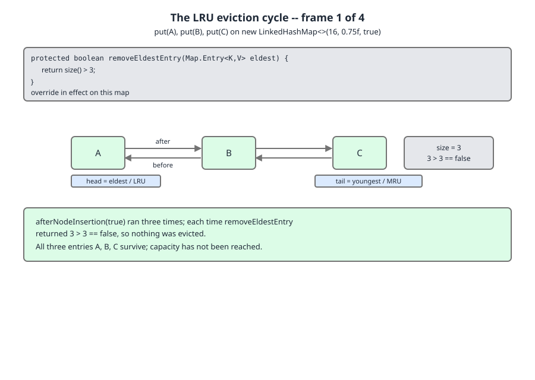
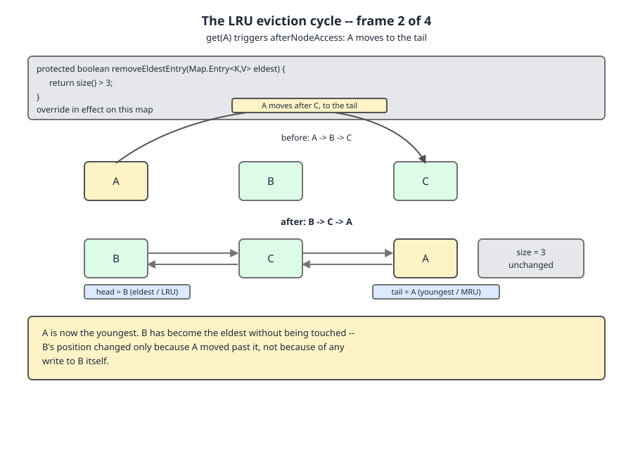
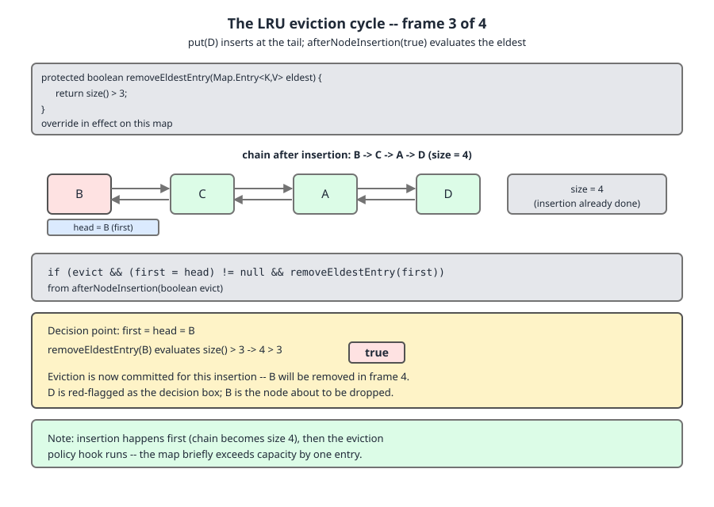
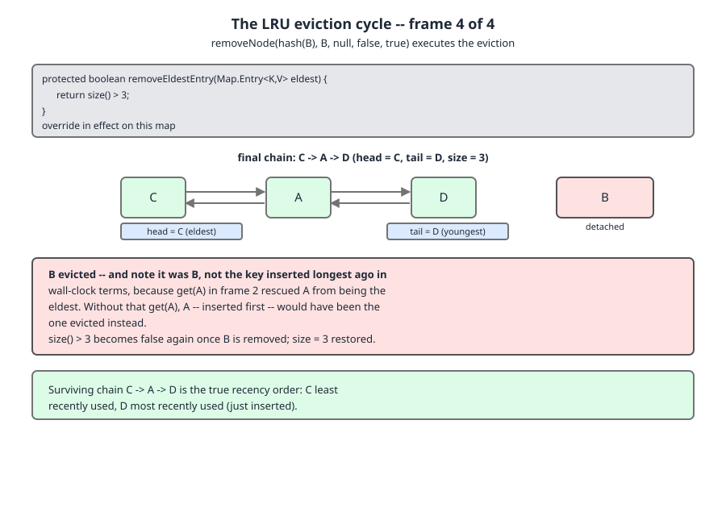

# 02 Java Collections — `LinkedHashMap` — INTERNALS (§3.7 `LinkedHashMap` source walk — the ten-line LRU and its five bugs)

**Target version: Java 21 LTS.** | [Index](../00-index.md)
Previous: [linked-hash-map/01a1-internals-a3-insertion-removal-and-containsvalue.md](01a1-internals-a3-insertion-removal-and-containsvalue.md) · Next: [linked-hash-map/01b1-internals-b2-access-order-is-a-write.md](01b1-internals-b2-access-order-is-a-write.md)

---

## §3.7.10 The LRU cache in ten lines, and the bugs in the naive version `[BUILD]` `[TRAP]`

### Mental model

An LRU cache asks two questions, and they want two different data structures.

*"Is this key present, and what is its value?"* wants a hash table — O(1) by key, no order.
*"Which key is least recently used?"* wants a doubly-linked list ordered by recency — O(1) to move a node to the end, O(1) to read the front, no lookup by key.

Build those separately and you must keep two structures pointing at each other, which is the hundred-and-fifty-line interview exercise in §4.6.2 ([02-build-lru-by-hand.md](02-build-lru-by-hand.md)). `LinkedHashMap` has already done it: its `Entry` is *simultaneously* a bucket-chain node (`hash`, `key`, `value`, `next`, inherited from `HashMap.Node`) and a list node (`before`, `after`). One object, two structures, no bookkeeping between them.

That leaves exactly one thing missing — a policy that says *when* to drop the front of the list. That is `removeEldestEntry`, and it is nine words of code.

### Why it exists

`HashMap` has no notion of eviction and no notion of "front". `Hashtable` had neither. Before `LinkedHashMap` arrived in Java 1.4, a bounded cache in Java meant a `HashMap` plus your own `LinkedList` plus a second `HashMap` from key to list node — three objects to keep consistent, and the classic bug was forgetting to unlink from the list on `remove`. `LinkedHashMap` collapses all three into one class and hands you a single protected hook.

### When to reach for it, and when not

Reach for it when the bound is a count, the workload is single-threaded (or externally locked), and you want zero dependencies. Do not reach for it when you need a size bound in *bytes*, per-entry TTL, refresh-ahead, weak values, or concurrency — those are Caffeine's job (leaf 3.7.17, in [01c-internals-c-sequenced-and-caching.md](01c-internals-c-sequenced-and-caching.md)). `LinkedHashMap` gives you count-bounded LRU and nothing else. And if more than one thread will touch it, read [01b1-internals-b2-access-order-is-a-write.md](01b1-internals-b2-access-order-is-a-write.md) before you ship it: on an access-order map even `get` is a write.

### How it works — the source

Two methods, both `LinkedHashMap` overrides of `HashMap` hooks, and both short.

```java
    void afterNodeInsertion(boolean evict) { // possibly remove eldest
        LinkedHashMap.Entry<K,V> first;
        if (evict && (first = head) != null && removeEldestEntry(first)) {
            K key = first.key;
            removeNode(hash(key), key, null, false, true);
        }
    }
```
— `java.base/java/util/LinkedHashMap.java`, JDK 21, line 322. (leaf 3.7.10)

`HashMap.putVal` calls this as its last statement, so eviction happens *after* the new entry is in the table. `head` is the eldest surviving entry — the least-recently-inserted one under insertion order, the least-recently-*accessed* one under access order. `evict` is `false` only during deserialization and during the `Map`-copying constructor (which calls `putMapEntries(m, false)`), which is why a `LinkedHashMap(Map)` copy does not evict as it fills — bulk-load a bounded cache with a loop of `put` calls, never a copy constructor, or it starts life above its bound and, per the next section, stays there.

```java
    protected boolean removeEldestEntry(Map.Entry<K,V> eldest) {
        return false;
    }
```
— `java.base/java/util/LinkedHashMap.java`, JDK 21, line 604. (leaf 3.7.10)

`protected`, so overriding it means subclassing. Returning `false` unconditionally is what makes a plain `LinkedHashMap` an unbounded map.

The javadoc above line 604 carries the JDK's own LRU recipe, so the canonical version is source and not folklore:

```java
    protected boolean removeEldestEntry(Map.Entry eldest) {
       return size() > MAX_ENTRIES;
    }
```
— `java.base/java/util/LinkedHashMap.java`, JDK 21, lines 575–580, from the javadoc of `removeEldestEntry` (raw `Map.Entry`, as in the original text). (leaf 3.7.10)

Three sentences of that javadoc carry the whole contract:

> This method is invoked by `put` and `putAll` after inserting a new entry into the map. It provides the implementor with the opportunity to remove the eldest entry each time a new one is added. This is useful if the map represents a cache: it allows the map to reduce memory consumption by deleting stale entries.

— `java.base/java/util/LinkedHashMap.java`, JDK 21, lines 563–568 (javadoc prose). (leaf 3.7.10)

And the parameter doc names the access-order subtlety that the whole cache depends on:

> The least recently inserted entry in the map, or if this is an access-ordered map, the least recently accessed entry. This is the entry that will be removed if this method returns `true`.

— `java.base/java/util/LinkedHashMap.java`, JDK 21, lines 594–597 (`@param eldest`). (leaf 3.7.10)

The other half of the machinery is `get`, which is what makes "recently used" mean anything:

```java
    public V get(Object key) {
        Node<K,V> e;
        if ((e = getNode(key)) == null)
            return null;
        if (accessOrder)
            afterNodeAccess(e);
        return e.value;
    }
```
— `java.base/java/util/LinkedHashMap.java`, JDK 21, line 534. (leaf 3.7.10)

`afterNodeAccess` relinks the node to the tail with six pointer writes — walked in detail in [01a-internals-a2-hooks-and-access-order.md](01a-internals-a2-hooks-and-access-order.md) §3.7.4. Its closing `++modCount` is the subject of the next file.

And the flag those two methods pivot on:

```java
    final boolean accessOrder;
```
— `java.base/java/util/LinkedHashMap.java`, JDK 21, line 231. (leaf 3.7.10)

`final`, set once in a constructor. There is no setter and no way to flip it after construction. The only constructor that sets it to `true`:

```java
    public LinkedHashMap(int initialCapacity,
                         float loadFactor,
                         boolean accessOrder) {
        super(initialCapacity, loadFactor);
        this.accessOrder = accessOrder;
    }
```
— `java.base/java/util/LinkedHashMap.java`, JDK 21, line 494. (leaf 3.7.10)

Every other constructor — the no-arg, the `int`, the `int, float`, the `Map` copy — assigns `accessOrder = false` in its body. Four constructors that silently give you insertion order, one that lets you ask for access order. Bug 3 lives in that ratio.

### The eviction cycle, on the diagram

Capacity 3, `accessOrder = true`, `removeEldestEntry` returning `size() > 3`. Follow the four frames.



Frame 1 — `put A`, `put B`, `put C`. Each `put` runs `newNode` → `linkNodeAtEnd`, so the chain grows at the tail: `A → B → C`. Each `put` then calls `afterNodeInsertion(true)`, which evaluates `removeEldestEntry(head)`. On the third `put` that is `3 > 3`, which is `false`. Note the asymmetry: the bound is expressed with a strict `>`, so the map is allowed to *reach* three, not to reach four and stay there.



Frame 2 — `get(A)`. `accessOrder` is `true`, so `get` calls `afterNodeAccess(A)`. A is unlinked from the head and relinked at the tail: `B → C → A`. `head` is now B. Nothing happened to B — it did not move, it was not read, it was not written. It became the eldest purely because someone else got younger. This is the frame people skip, and it is the one the eviction answer turns on.



Frame 3 — `put D`. Insertion happens *first*: D is linked at the tail, giving `B → C → A → D`, and `size` is momentarily 4. Only then does `putVal`'s last line call `afterNodeInsertion(true)`, which reads `first = head = B` and asks `removeEldestEntry(B)` → `4 > 3` → `true`.



Frame 4 — `removeNode(hash(B), B, null, false, true)` unlinks B from its bucket chain and, via `afterNodeRemoval` (line 308), from the `before`/`after` chain. Final state `C → A → D`, `size` back to 3. **The evicted key is B, not A** — A was inserted first in wall-clock terms and survived, because the `get` in frame 2 rescued it. That is the whole point of access order, and it is the single sentence that distinguishes an LRU from a FIFO.

### The `[BUILD]` — a correct, generic LRU

```java
import java.util.LinkedHashMap;
import java.util.Map;

public class LruCache<K, V> extends LinkedHashMap<K, V> {
    private final int maxEntries;

    public LruCache(int maxEntries) {
        // pre-size so the table never resizes at the bound; accessOrder = true
        super((int) (maxEntries / 0.75f) + 1, 0.75f, true);
        if (maxEntries <= 0) throw new IllegalArgumentException("maxEntries must be > 0");
        this.maxEntries = maxEntries;
    }

    @Override
    protected boolean removeEldestEntry(Map.Entry<K, V> eldest) {
        return size() > maxEntries;
    }
}
```

The pre-sizing is not decoration. A cache that lives at a fixed bound forever is the one workload where a resize is pure loss: a `HashMap` amortises rehash cost over unbounded growth, but a cache at bound *N* stops growing at *N* and never gets the amortisation. Measured on JDK 21 by reflecting on `HashMap.table`:

```
initialCapacity=16  table sizes seen: [16, 32, 64, 128, 256]  resizes=4  final size=100
initialCapacity=134 table sizes seen: [256]                   resizes=0  final size=100
bound 3, presized: table=8 size=3
```

Four full rehashes avoided for a bound of 100. `(int)(maxEntries / 0.75f) + 1` is the same arithmetic `HashMap.newHashMap(int)` performs; the derivation is in [../hash-map/05-internals-e-sizing-and-iteration.md](../hash-map/05-internals-e-sizing-and-iteration.md) §3.6. On Java 19+ you can spell it `LinkedHashMap.newLinkedHashMap(maxEntries)` instead, but that factory returns a plain `LinkedHashMap` with `accessOrder = false`, so it is useless for a subclassed LRU — you still need the explicit three-arg `super` call.

Exercising it, and this is the real transcript of frames 1–4:

```java
LruCache<String, Integer> c = new LruCache<>(3);
c.put("A", 1); c.put("B", 2); c.put("C", 3);
c.get("A");
c.put("D", 4);
```

```
put A      -> [A] size=1
put B      -> [A, B] size=2
put C      -> [A, B, C] size=3
get(A)=1 -> [B, C, A] size=3
put D      -> [C, A, D] size=3
get(B)=null  (B evicted)
```

### Two structural facts about the eviction

**Eviction happens after insertion, so the map transiently holds `maxEntries + 1` entries.** Instrumenting `removeEldestEntry` to print `size()` at the moment it is called, on a bound of 3:

```
size observed inside removeEldestEntry on the 4th put = 4
size after put returns = 3
```

If `maxEntries` was chosen to fit a memory budget exactly, the budget must accommodate one extra entry plus the transient node allocation.

**Exactly one entry is evicted per insertion.** `afterNodeInsertion` is an `if`, not a `while`, and `removeNode` does not re-enter it. The consequence is stronger than the usual telling. Because each `put` adds one entry and evicts at most one, the net size change is **zero** — so a map that is *already* over its bound never shrinks toward the bound at all. Filling to 10 and then behaving as if the bound had dropped to 3:

```
filled at bound 10, size=10 keys=[1, 2, 3, 4, 5, 6, 7, 8, 9, 10]
put 11 -> size=10 keys=[2, 3, 4, 5, 6, 7, 8, 9, 10, 11]
put 12 -> size=10 keys=[3, 4, 5, 6, 7, 8, 9, 10, 11, 12]
put 13 -> size=10 keys=[4, 5, 6, 7, 8, 9, 10, 11, 12, 13]
put 14 -> size=10 keys=[5, 6, 7, 8, 9, 10, 11, 12, 13, 14]
put 15 -> size=10 keys=[6, 7, 8, 9, 10, 11, 12, 13, 14, 15]
put 16 -> size=10 keys=[7, 8, 9, 10, 11, 12, 13, 14, 15, 16]
```

Size pins at 10 forever. It is often said that such a map "drains one entry per subsequent put" — it does evict one *existing* entry per put, but it admits a new one in the same operation, so the size never falls. **Insight:** a mutable bound on a `LinkedHashMap` cache is a trap. Lowering it is a no-op until you also evict the excess yourself, because the hook can only ever offset the insertion that triggered it.

### The gotcha — five bugs

**Bug 1 — no size bound.** The mechanism: `removeEldestEntry` is `protected` and returns `false`. Extending `LinkedHashMap` gives you the *order* behaviour immediately, so the class looks finished, but the eviction is opt-in and you have not opted in.

```java
// WRONG: named like a cache, behaves like a HashMap with extra pointers
static class NotACache<K, V> extends LinkedHashMap<K, V> {
    NotACache() { super(16, 0.75f, true); }   // accessOrder set, no override
}
```

```
after 100000 puts, size = 100000
```

Symptom: a slow heap leak, and a "cache" whose hit rate is suspiciously perfect right up to the `OutOfMemoryError`. Two extra references per entry over a `HashMap` (see 3.7.15 in [01c](01c-internals-c-sequenced-and-caching.md)) means it leaks about 33% faster than the `HashMap` you were trying to improve on. Fix: override `removeEldestEntry`, as in `LruCache` above.

**Pitfall:** *"I extended `LinkedHashMap` with `accessOrder = true`, so it is an LRU cache."* Access order determines the *eviction order*; it does not cause eviction. The symptom is unbounded growth with a correct-looking access order. Fix: `accessOrder = true` and a `removeEldestEntry` override are both required; either alone is useless.

**Bug 2 — wrong constructor argument order.** The safe failure first:

```java
super(16, true, 0.75f);   // does not compile
```
```
error: incompatible types: boolean cannot be converted to float
```

`javac` catches it, because there is no `(int, boolean, float)` overload. The dangerous sibling is the one that *does* compile:

```java
super(16, 0.75f);         // compiles. accessOrder = false. silently a FIFO.
```

That is the real bug in this pair. Dropping the third argument does not produce an error, an unused-parameter warning, or a deprecation note — it selects a different constructor whose body assigns `accessOrder = false`. Same class, same override, opposite policy.

**Bug 3 — `accessOrder` forgotten.** Same root cause as bug 2, reached by the no-arg, one-arg, or `Map`-copy constructor. The consequence is not a crash; it is a hit rate. With `accessOrder = false`, `get` never calls `afterNodeAccess`, `head` never moves, and the map evicts the *oldest-inserted* key regardless of how hot it is:

```java
static class FifoByAccident<K, V> extends LinkedHashMap<K, V> {
    private final int maxEntries;
    FifoByAccident(int maxEntries) {
        super((int) (maxEntries / 0.75f) + 1, 0.75f);  // two-arg: accessOrder = false
        this.maxEntries = maxEntries;
    }
    @Override protected boolean removeEldestEntry(Map.Entry<K, V> eldest) {
        return size() > maxEntries;
    }
}
```

Both maps get an identical workload — bound 3; insert `hot`, `x`, `y`; read `hot` three times; insert `z`:

```
accessOrder=true  [y, hot, z]  hot still present? true
accessOrder=false [x, y, z]    hot still present? false
```

The insertion-ordered map threw away the only key anyone was reading. This is the bug that hurts in production precisely because nothing breaks — every `get` returns a correct value or a correct miss, the map stays at its bound, no exception is thrown. You find out from a hit-rate graph, or from the load on whatever the cache was in front of.

**Bug 4 — not thread-safe.** Developed in full in [01b1-internals-b2-access-order-is-a-write.md](01b1-internals-b2-access-order-is-a-write.md) §3.7.11, because on an access-order map the unsafety has a different and much less obvious shape than "concurrent writes corrupt a `HashMap`": there are no reads to be safe with.

**Bug 5, the one nobody lists — modifying the map from inside `removeEldestEntry`.** The javadoc states a constraint here, and it is precise:

> This method typically does not modify the map in any way, instead allowing the map to modify itself as directed by its return value. It *is* permitted for this method to modify the map directly, but if it does so, it *must* return `false` (indicating that the map should not attempt any further modification). The effects of returning `true` after modifying the map from within this method are unspecified.

— `java.base/java/util/LinkedHashMap.java`, JDK 21, lines 583–589 (javadoc of `removeEldestEntry`). (leaf 3.7.10)

So direct modification is *allowed* — it is not, as often claimed, forbidden — but it obliges you to return `false`. Two ways to get this wrong, both run on JDK 21.

Modify *and* return `true` — the hook removes the second-eldest itself, then also answers "yes, remove the eldest", on a bound of 3:

```java
@Override protected boolean removeEldestEntry(Map.Entry<String, Integer> e) {
    if (active && size() > 3) {
        Iterator<String> it = keySet().iterator();
        it.next();
        String second = it.next();
        remove(second);   // permitted by the javadoc
        return true;      // NOT permitted after modifying: must be false
    }
    return false;
}
```
```
keys=[C, D] size()=2
```

Two entries gone for one insertion. The map sits *below* its bound and stays there, so the cache silently runs at two-thirds of the capacity you provisioned. No exception, no warning — "unspecified" in practice means "your bound quietly means something else".

Calling `put` inside the hook is worse:

```java
@Override protected boolean removeEldestEntry(Map.Entry<Integer, Integer> e) {
    if (size() > 3) { put(-size(), 0); return false; }   // returns false, still fatal
    return false;
}
```
```
threw java.lang.StackOverflowError
```

`put` → `putVal` → `afterNodeInsertion` → `removeEldestEntry` → `put`, and the `return false` never gets a chance to matter because the recursion is in the call, not the answer. **Pitfall:** *"the javadoc permits modifying the map, so I can `put` a tombstone entry from the hook."* It permits *removal*; any insertion re-enters `afterNodeInsertion` and recurses until the stack dies. The symptom is a `StackOverflowError` from deep inside `HashMap.putVal` with no application frames in the repeating cycle. Fix: `removeEldestEntry` returns a boolean and does nothing else — put side effects in an overridden `put`, or on the `afterNodeRemoval` path, never in the predicate.

> **Definition.** A `LinkedHashMap` LRU cache is a subclass constructed with `accessOrder = true` whose `removeEldestEntry` returns `size() > maxEntries`, relying on `get` to relink the accessed node to the tail so that `head` — the entry `afterNodeInsertion` offers to the hook after every insertion — is always the least recently *accessed* entry.

---

## Version note — has the LRU recipe changed since Java 8?

Checked against `/tmp/jdk8src/java/util/LinkedHashMap.java`, not recalled.

| Element | JDK 8 | JDK 21 | Behaviour change? |
|---|---|---|---|
| `afterNodeInsertion(boolean)` | line 297 | line 322 | **None.** Byte-for-byte identical bodies |
| `removeEldestEntry` | line 508 (`return false;`), javadoc example line 481 | line 604, javadoc example lines 575–580 | **None.** Same body, same example, same modification clause |
| `LinkedHashMap(int, float, boolean)` | line 398 | line 494 | **None.** Same body |
| `final boolean accessOrder` | line 217 | line 231 | None |
| `get(Object)` | line 438 | line 534 | Cosmetic: JDK 8 calls `getNode(hash(key), key)`, JDK 21 calls `getNode(key)`. Same `if (accessOrder) afterNodeAccess(e);` |

So: **the ten-line LRU recipe has not changed since Java 8** — and, since `afterNodeInsertion` and the three-arg constructor date to Java 1.4, not since then either. What changed in Java 21 is the `SequencedMap` scaffolding around it (`putMode` in the `afterNodeAccess` guard, a `reversed` field on the iterator), which is tabulated in [01b1](01b1-internals-b2-access-order-is-a-write.md) and covered as leaves 3.7.13–3.7.14 in [01c](01c-internals-c-sequenced-and-caching.md). Answer the interview question with "no", and be able to name the scaffolding as the thing that *did* change.

---

## Pitfalls

### Believing `accessOrder = true` makes a bounded cache

**Wrong**
```java
static class NotACache<K, V> extends LinkedHashMap<K, V> {
    NotACache() { super(16, 0.75f, true); }
}
// 100_000 puts
```
```
after 100000 puts, size = 100000
```
Access order is set, iteration order is textbook LRU, and the map grew to 100,000 entries.

**Right**
```java
static class LruCache<K, V> extends LinkedHashMap<K, V> {
    private final int maxEntries;
    LruCache(int maxEntries) {
        super((int) (maxEntries / 0.75f) + 1, 0.75f, true);
        this.maxEntries = maxEntries;
    }
    @Override protected boolean removeEldestEntry(Map.Entry<K, V> eldest) {
        return size() > maxEntries;
    }
}
```
`removeEldestEntry` is the only thing that causes eviction; `accessOrder` only chooses *which* entry `afterNodeInsertion` offers to it.

**Why people believe it:** every tutorial's LRU snippet sets `accessOrder = true` on the constructor line, and that is the line people copy. The override is three lines further down and looks like boilerplate.

### Dropping the third constructor argument

**Wrong**
```java
super((int) (maxEntries / 0.75f) + 1, 0.75f);   // compiles cleanly
```
Bound 3; insert `hot`, `x`, `y`; read `hot` three times; insert `z`:
```
accessOrder=false [x, y, z]    hot still present? false
```
The hottest key in the workload was evicted.

**Right**
```java
super((int) (maxEntries / 0.75f) + 1, 0.75f, true);
```
```
accessOrder=true  [y, hot, z]  hot still present? true
```

**Why people believe it:** the two-arg and three-arg constructors differ by one optional-looking boolean, four of the five constructors default it to `false`, and there is no compiler diagnostic. Getting the *order* wrong (`super(16, true, 0.75f)`) fails to compile and is therefore harmless; getting it *absent* is silent.

### Lowering `maxEntries` at runtime and expecting the map to shrink

**Wrong**
```java
mutableBoundCache.bound = 3;   // was 10, map currently holds 10 entries
for (int i = 11; i <= 16; i++) mutableBoundCache.put(i, i);
```
```
put 11 -> size=10   put 12 -> size=10   put 13 -> size=10
put 14 -> size=10   put 15 -> size=10   put 16 -> size=10
```

**Right** — evict the excess explicitly, because the hook can only offset the insertion that triggered it:
```java
void setBound(int newBound) {
    this.bound = newBound;
    Iterator<K> it = keySet().iterator();
    while (size() > newBound && it.hasNext()) { it.next(); it.remove(); }
}
```

**Why people believe it:** "evict the eldest each time a new one is added" reads like a convergent process. It is not — `afterNodeInsertion` is an `if`, not a `while`, so one insertion buys at most one eviction and the net size change is zero.

### Reading the javadoc as forbidding modification inside `removeEldestEntry`

**Wrong** — the widely repeated version of the rule is "never touch the map from the hook", which is both stricter than the spec and misses the actual hazard. The spec permits removal; it is *returning `true` afterwards* that is unspecified, and on a bound of 3 that produces:
```
keys=[C, D] size()=2
```
Two entries evicted for one insertion, and the cache runs permanently below its bound.

**Right**
```java
@Override protected boolean removeEldestEntry(Map.Entry<K, V> eldest) {
    if (size() <= maxEntries) return false;
    audit(eldest);          // side effects are fine
    // if you evict anything here yourself, you MUST return false
    return true;            // so: evict nothing here, and let the map do it
}
```
Never call `put` from the hook under any return value — `put` → `putVal` → `afterNodeInsertion` → `removeEldestEntry` → `put` gives `java.lang.StackOverflowError`.

**Why people believe it:** the clause is buried in the fifth paragraph of a long javadoc, and the permissive half of it (`it *is* permitted for this method to modify the map directly`) is set in italics that most rendered views flatten.

---

## Cheat sheet

| Thing | Value / behaviour | Source (JDK 21) |
|---|---|---|
| Eviction trigger | `afterNodeInsertion(boolean evict)`, called last by `HashMap.putVal` | line 322 |
| Eviction predicate | `protected boolean removeEldestEntry(Map.Entry)`, default `return false` | line 604 |
| The recipe | `return size() > MAX_ENTRIES;` (from the javadoc itself) | lines 575–580 |
| Entries evicted per `put` | exactly one — `if`, not `while` | line 324 |
| Over-bound map shrinks? | **no** — one in, one out, net zero; size pins at the old value | line 322 |
| Transient size at the bound | `maxEntries + 1` (insert first, evict second) | line 322 |
| `evict == false` when | deserialization and the `LinkedHashMap(Map)` constructor | line 324 |
| Only access-order constructor | `LinkedHashMap(int, float, boolean)` | line 494 |
| Other constructors | all four assign `accessOrder = false` | lines 445–478 area |
| `accessOrder` mutability | `final`, no setter | line 231 |
| `get` in access order | calls `afterNodeAccess` (details in [01b1](01b1-internals-b2-access-order-is-a-write.md)) | line 534 |
| Hook may modify the map? | yes, but then it **must** return `false`; `put` from it recurses to `StackOverflowError` | lines 583–589 |
| Pre-size a bounded cache | `(int)(maxEntries / 0.75f) + 1` — avoids rehashes it will never amortise | — |
| Recipe changed since Java 8? | no — `afterNodeInsertion`, `removeEldestEntry` and the constructor are byte-identical | JDK 8 lines 297 / 508 / 398 |

---

## Self-test

**Q1.** Capacity 3, access order, `removeEldestEntry` returns `size() > 3`. After `put A, put B, put C, get(A), put D`, which key was evicted and why is it not A?

<details><summary>Answer</summary>

B. `get(A)` called `afterNodeAccess(A)`, which unlinked A from the head and relinked it at the tail, leaving the chain `B → C → A`. `put D` appended D (`B → C → A → D`, size 4), then `afterNodeInsertion(true)` read `first = head`, which is now B, and `removeEldestEntry(B)` evaluated `4 > 3` → `true`. Real output: `put D -> [C, A, D]`. A was inserted longest ago in wall-clock terms but was rescued by the `get`; "eldest" means least recently *accessed* under access order, exactly as the `@param eldest` javadoc says.

</details>

**Q2.** Does `removeEldestEntry` see `size()` as `maxEntries` or `maxEntries + 1` when it fires?

<details><summary>Answer</summary>

`maxEntries + 1`. `afterNodeInsertion` is the last statement of `putVal`, so the new entry is already in the table and counted. Instrumented on a bound of 3: `size observed inside removeEldestEntry on the 4th put = 4`, `size after put returns = 3`. That is why the predicate is `size() > max` and not `size() >= max`, and why a memory budget must accommodate one extra entry.

</details>

**Q3.** You lower a cache's `maxEntries` from 10 to 3 while it holds 10 entries. How many puts until `size()` is 3?

<details><summary>Answer</summary>

Never. `afterNodeInsertion` is an `if`, not a loop, and `removeNode` does not re-enter it, so each `put` admits one entry and evicts at most one — a net size change of zero. Measured across six puts: `put 11 -> size=10` … `put 16 -> size=10`. The map does churn (the eldest key changes every put) but it never shrinks. You must evict the excess yourself with an explicit iterator loop.

</details>

**Q4.** The javadoc permits `removeEldestEntry` to modify the map. What exactly does it permit, and what breaks if you overstep?

<details><summary>Answer</summary>

It permits direct modification *provided the method then returns `false`*; "the effects of returning `true` after modifying the map from within this method are unspecified" (lines 583–589). Note this contradicts the common summary that modification is forbidden. Overstepping in the two available directions: removing an extra entry and *also* returning `true` drops two entries per insertion, so on a bound of 3 the map settles at `size()=2` and silently runs below the capacity you provisioned. Calling `put` from the hook recurses `put → putVal → afterNodeInsertion → removeEldestEntry → put` and dies with `StackOverflowError` regardless of what it returns, because the recursion is in the call and not the answer.

</details>

**Q5.** Why pre-size the table in a bounded cache, when `HashMap` resizing is amortised O(1)?

<details><summary>Answer</summary>

Amortisation needs unbounded growth to amortise over. A cache pinned at *N* entries pays the rehashes on the way up to *N* and then never grows again, so the cost is never spread. Measured for a bound of 100 on JDK 21: `initialCapacity=16` walks tables `[16, 32, 64, 128, 256]` — four full rehashes — while `initialCapacity=134` allocates `[256]` once and never resizes. Same final table, four rehashes of difference. `LinkedHashMap.newLinkedHashMap(n)` (Java 19+) does the same arithmetic but returns `accessOrder = false`, so a subclassed LRU still needs the explicit three-arg `super`.

</details>

**Q6.** `super(16, true, 0.75f)` and `super(16, 0.75f)` are both wrong in an LRU subclass. Which is the more dangerous, and why?

<details><summary>Answer</summary>

`super(16, 0.75f)`. The transposed-argument version does not compile — `error: incompatible types: boolean cannot be converted to float` — so it costs you thirty seconds. The two-arg version compiles cleanly, selects a constructor whose body assigns `accessOrder = false`, and turns the cache into a FIFO with no diagnostic of any kind. The failure is a hit-rate regression, not an exception: with bound 3 and a workload that reads `hot` three times, the LRU keeps `[y, hot, z]` and the accidental FIFO keeps `[x, y, z]`, having evicted the only key anyone was reading.

</details>

**Q7.** Has the ten-line LRU recipe changed between Java 8 and Java 21?

<details><summary>Answer</summary>

No. `afterNodeInsertion` (JDK 8 line 297, JDK 21 line 322), `removeEldestEntry` including its modification clause (508 / 604) and the three-arg constructor (398 / 494) have byte-identical bodies; `get` differs only cosmetically (`getNode(hash(key), key)` became `getNode(key)`). What changed in Java 21 is `SequencedMap` scaffolding around the recipe — a `putMode` term in `afterNodeAccess`'s guard and a `reversed` field on `LinkedHashIterator` — tabulated in [01b1](01b1-internals-b2-access-order-is-a-write.md). Since the recipe dates to Java 1.4, the honest answer is "no, and not since 1.4 either".

</details>

---

**Leaves covered:** 3.7.10 (1 leaf)
**Leaves deferred:** none — 3.7.11 and 3.7.12 are in [01b1-internals-b2-access-order-is-a-write.md](01b1-internals-b2-access-order-is-a-write.md)
**Diagrams included:** D-102 (frames a–d)
**Target version:** Java 21 LTS
**Lines:** 519
