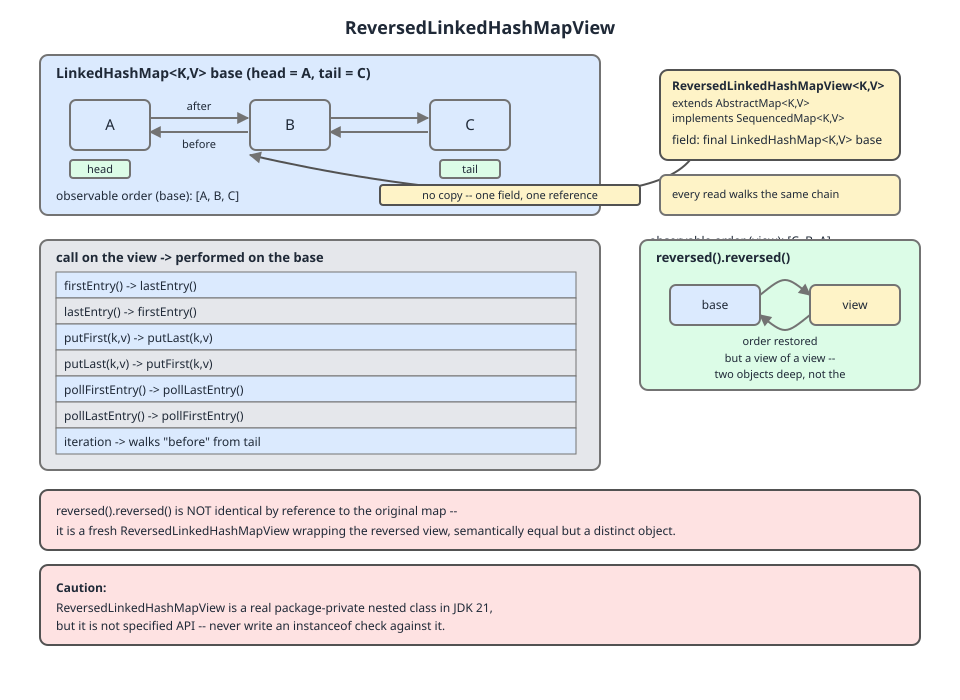

# 02 Java Collections — `LinkedHashMap` — INTERNALS (§3.7 `LinkedHashMap` source walk — the `SequencedMap` surface and `putFirst`)

**Target version: Java 21 LTS.** | [Index](../00-index.md)
Previous: [linked-hash-map/01b1-internals-b2-access-order-is-a-write.md](01b1-internals-b2-access-order-is-a-write.md) · Next: [linked-hash-map/01c1-internals-c2-memory-set-and-caffeine.md](01c1-internals-c2-memory-set-and-caffeine.md)

---

`LinkedHashMap` has known where its first and last entries are since 1.4. The `head` and `tail` fields have always been there. What it could not do until Java 21 was *say so*. Getting the eldest entry meant `map.entrySet().iterator().next()` — a three-object incantation that reads like an accident. Getting the youngest meant iterating the entire map and keeping the last thing you saw, O(n) for a value sitting one field away.

Java 21 gave those two positions names. That is the whole of what `SequencedMap` does for this class: it supplies a vocabulary. It does not supply a mechanism. Read the source and the shape of the retrofit is unmistakable — of the ten `SequencedMap` members, `LinkedHashMap` overrides only the two write methods and `reversed()` itself. The four entry accessors that everyone reaches for first — `firstEntry`, `lastEntry`, `pollFirstEntry`, `pollLastEntry` — are **inherited interface defaults**, implemented on top of `entrySet()` and `reversed()`, allocating on every call, and returning snapshot copies rather than the live nodes. That is not a criticism of the design; it is the price of retrofitting an interface onto a class hierarchy that shipped in 1998. But it is a set of facts you can only get from the source, and it changes what you write.

The interfaces themselves — `SequencedCollection`, `SequencedSet`, `SequencedMap`, JEP 431, and the retrofit map across the whole framework — are §1.9 in [`../sequenced-collections/01-sequenced-collections.md`](../sequenced-collections/01-sequenced-collections.md). This file is `LinkedHashMap`'s *implementation* of them. The memory cost of the overlay, `LinkedHashSet`, and why a production cache is not this class are next door in [`01c1-internals-c2-memory-set-and-caffeine.md`](01c1-internals-c2-memory-set-and-caffeine.md).

---

## 1. The `SequencedMap` surface, and what is actually overridden

### Mental model

Think of `SequencedMap` as an interface written for `LinkedHashMap` but implemented mostly *without* it. The interface author had to make `firstEntry()` work for any sequenced map, including ones with no linked list at all, so the default is written in the only vocabulary every map already has: `entrySet()` and an iterator. `LinkedHashMap` then declines to override it. The result is an API whose method names promise O(1) field access and whose bodies deliver an iterator walk that happens to stop after one step.

### Why it exists

Before Java 21 there was no way to *name* an end of a `Map`. `SortedMap` had `firstKey`/`lastKey`, `NavigableMap` had `firstEntry`/`lastEntry`, `Deque` had both ends — but nothing spanned `LinkedHashMap`, `TreeMap` and `ArrayDeque`, so no generic method could say "give me the front". JEP 431 fixed the type system. `LinkedHashMap` was one of the classes retrofitted, and every member below is `@since 21` except the two sized factories.

### When to reach for it, and when not

Reach for `firstEntry`/`pollFirstEntry` when you want the eldest entry once, readably. Do **not** reach for them on a hot path: they allocate, they are asymmetric in cost between the two ends, and `pollFirstEntry` on an insertion-order map is a queue operation you would be better off giving to `ArrayDeque`. Do not reach for `putFirst`/`putLast` on an access-order map at all — §2 is about why.

### How it works — the surface, from the source

Grep the class for the four entry accessors and you find them in exactly one place:

```
$ grep -n 'firstEntry\|lastEntry' LinkedHashMap.java
  1228:        public Entry<K, V> firstEntry() {
  1232:        public Entry<K, V> lastEntry() {
  1236:        public Entry<K, V> pollFirstEntry() {
  1240:        public Entry<K, V> pollLastEntry() {
```

Lines 1228–1241 are all inside `ReversedLinkedHashMapView`. There is no `firstEntry` on `LinkedHashMap` itself. Built from the source rather than the javadoc, here is the complete surface:

| Member | On `LinkedHashMap` | Line | What it actually does | Cost | Objects allocated per call |
|---|---|---|---|---|---|
| `putFirst(K,V)` | **overridden** | 392 | sets `putMode = PUT_FIRST`, calls `put`, restores in `finally` | O(1) amortised | 0 (beyond the node) |
| `putLast(K,V)` | **overridden** | 409 | sets `putMode = PUT_LAST`, calls `put`, restores in `finally` | O(1) amortised | 0 (beyond the node) |
| `reversed()` | **overridden** | 1093 | `new ReversedLinkedHashMapView<>(this)` | O(1) | 1 (24 B) |
| `sequencedKeySet()` | **overridden** | 640 | returns the cached `keySet`, else `new LinkedKeySet(false)` | O(1) | 1, once, then cached |
| `sequencedValues()` | **overridden** | 789 | returns the cached `values`, else `new LinkedValues(false)` | O(1) | 1, once, then cached |
| `sequencedEntrySet()` | **overridden** | 894 | returns the cached `entrySet`, else `new LinkedEntrySet(false)` | O(1) | 1, once, then cached |
| `firstEntry()` | inherited default | `SequencedMap`:151 | `entrySet().iterator()`, one `next()`, wrap in a holder | O(1) | 2 (56 B) |
| `lastEntry()` | inherited default | `SequencedMap`:168 | `reversed().entrySet().iterator()`, one `next()`, wrap | O(1) | 4 (104 B) |
| `pollFirstEntry()` | inherited default | `SequencedMap`:187 | as `firstEntry`, then `it.remove()` | O(1) | 2 |
| `pollLastEntry()` | inherited default | `SequencedMap`:212 | as `lastEntry`, then `it.remove()` | O(1) | 4 |

The two defaults that matter, verbatim:

```java
    default Map.Entry<K,V> firstEntry() {
        var it = entrySet().iterator();
        return it.hasNext() ? new NullableKeyValueHolder<>(it.next()) : null;
    }
```

```java
    default Map.Entry<K,V> lastEntry() {
        var it = reversed().entrySet().iterator();
        return it.hasNext() ? new NullableKeyValueHolder<>(it.next()) : null;
    }
```

— `java.base/java/util/SequencedMap.java`, JDK 21, lines 151 and 168. (leaf 3.7.13)

And the polling pair, which are the same two bodies with an `it.remove()` spliced in:

```java
    default Map.Entry<K,V> pollFirstEntry() {
        var it = entrySet().iterator();
        if (it.hasNext()) {
            var entry = new NullableKeyValueHolder<>(it.next());
            it.remove();
            return entry;
        } else {
            return null;
        }
    }

    default Map.Entry<K,V> pollLastEntry() {
        var it = reversed().entrySet().iterator();
        if (it.hasNext()) {
            var entry = new NullableKeyValueHolder<>(it.next());
            it.remove();
            return entry;
        } else {
            return null;
        }
    }
```

— `java.base/java/util/SequencedMap.java`, JDK 21, lines 187 and 212. (leaf 3.7.13)

Note the ordering inside `pollFirstEntry`: the holder is built *before* `it.remove()`. It has to be — after removal the node's `value` is still readable but the entry is detached, and copying first makes the return value trivially safe.

Three consequences fall straight out.

**(a) `firstEntry()` hands you a snapshot, not the entry.** `NullableKeyValueHolder` is an immutable record-like carrier in `jdk.internal.util`. The `SequencedMap` javadoc says so at the `@implSpec` for `firstEntry`: "If the iterator has an element, it returns **an unmodifiable copy** of that element." So the two idioms that look interchangeable are not:

```java
var m = new LinkedHashMap<String, Integer>();
m.put("a", 1); m.put("b", 2); m.put("c", 3);

Map.Entry<String, Integer> snapshot = m.firstEntry();
System.out.println("firstEntry() class = " + snapshot.getClass().getName());
try {
    snapshot.setValue(99);
} catch (UnsupportedOperationException e) {
    System.out.println("firstEntry().setValue -> UnsupportedOperationException");
}

Map.Entry<String, Integer> live = m.entrySet().iterator().next();
System.out.println("entrySet iterator entry class = " + live.getClass().getName());
live.setValue(99);
System.out.println("after live setValue, map = " + m);
```

Real output, JDK 21.0.7:

```
firstEntry() class = jdk.internal.util.NullableKeyValueHolder
firstEntry().setValue -> UnsupportedOperationException
entrySet iterator entry class = java.util.LinkedHashMap$Entry
after live setValue, map = {a=99, b=2, c=3}
```

The pre-21 incantation is *more* powerful than the method that replaced it. If you want a write-through handle on the eldest entry, `firstEntry()` cannot give you one; keep the iterator.

**(b) `lastEntry()` allocates a whole view object, and `firstEntry()` does not.** The `lastEntry` default routes through `reversed()`, and `LinkedHashMap.reversed()` is a bare `new` with no cache field anywhere in sight:

```java
    public SequencedMap<K, V> reversed() {
        return new ReversedLinkedHashMapView<>(this);
    }

    static class ReversedLinkedHashMapView<K, V> extends AbstractMap<K, V>
                                                 implements SequencedMap<K, V> {
        final LinkedHashMap<K, V> base;

        ReversedLinkedHashMapView(LinkedHashMap<K, V> lhm) {
            base = lhm;
        }
```

— `java.base/java/util/LinkedHashMap.java`, JDK 21, lines 1093–1102. (leaf 3.7.13)

Contrast that with `sequencedEntrySet()` at line 894, which reads the `entrySet` field and only allocates when it is `null`. The entry-set view is cached on the map; the reversed view is not. Confirmed by running it:

```
m.entrySet() == m.entrySet()   -> true
m.reversed()  == m.reversed()  -> false
```



**Correction to the diagram.** D-103 annotates `reversed().reversed()` as producing "a view of a view, two objects deep, not the original map returned by identity". The source says the opposite:

```java
        public SequencedMap<K, V> reversed() {
            return base;
        }
```

— `java.base/java/util/LinkedHashMap.java`, JDK 21, line 1224. (leaf 3.7.13)

The view's `reversed()` returns the base map **by identity**, so `m.reversed().reversed() == m` is `true` — verified by running it, output `true`. Double reversal is free and allocates nothing. The diagram's `reversed().reversed()` annotation overstates the cost; every other element of the picture is correct.

The rest of the view's ordered surface is pure delegation with the ends swapped:

```java
        public Entry<K, V> firstEntry() {
            return base.lastEntry();
        }

        public Entry<K, V> lastEntry() {
            return base.firstEntry();
        }

        public Entry<K, V> pollFirstEntry() {
            return base.pollLastEntry();
        }

        public Entry<K, V> pollLastEntry() {
            return base.pollFirstEntry();
        }
```

— `java.base/java/util/LinkedHashMap.java`, JDK 21, lines 1228–1241. (leaf 3.7.13)

**Insight:** trace `m.reversed().firstEntry()` and you find a loop that is not a loop. The view's `firstEntry()` calls `base.lastEntry()`; `base.lastEntry()` is the `SequencedMap` default, which calls `base.reversed()` — allocating a **second** `ReversedLinkedHashMapView`. That view's `entrySet()` is `base.sequencedEntrySet().reversed()`, and `LinkedEntrySet.reversed()` at line 970 returns `new LinkedEntrySet(true)` when the receiver is the forward set. Then an iterator, then the holder. Five objects for one field read:

| Call | Objects | Which ones | Bytes/call, measured |
|---|---|---|---|
| `m.entrySet().iterator().next()` | 1 | iterator | 32 |
| `m.firstEntry()` | 2 | iterator, `NullableKeyValueHolder` | 56 |
| `m.reversed()` | 1 | `ReversedLinkedHashMapView` | 24 |
| `m.lastEntry()` | 4 | view, `LinkedEntrySet(true)`, iterator, holder | 104 |
| `m.reversed().firstEntry()` | 5 | 2 views, `LinkedEntrySet(true)`, iterator, holder | 128 |

Measured with `com.sun.management.ThreadMXBean.getThreadAllocatedBytes` over 10⁶ calls after 20 000 warm-up iterations, on JDK 21.0.7 with `-XX:-DoEscapeAnalysis` so that scalar replacement does not hide the allocations. The four separate object sizes sum exactly to the totals (24 + 24 + 24 + 32 + 24 = 128), which is the cross-check that the object count is right. **Unverified:** with escape analysis on — the default — the JIT can and often does eliminate most of these; the table is the allocation the source *specifies*, not necessarily what a warmed-up JIT emits. No CPU-time figures are published here.

**(c) The write side got a real implementation and the read side did not.** `putFirst` and `putLast` are overridden at lines 392 and 409 with genuine `LinkedHashMap` machinery, while all four entry accessors are left as interface defaults. That asymmetry is the shape of the whole retrofit: positioning a write required touching the linked list, so it was implemented; reading an end could be expressed in terms of an iterator, so it was not.

### Gotcha

`lastEntry()` on a **huge** `LinkedHashMap` is still O(1) — the reversed iterator starts at `tail` and stops after one step. It is not the O(n) that the pre-21 "iterate to find the last" idiom was. The cost is four objects, not n steps. Do not over-correct.

### Definition

> `LinkedHashMap`'s `SequencedMap` implementation is three real overrides — `putFirst`, `putLast`, `reversed` — plus three cached view accessors, with the four entry accessors inherited as `entrySet()`/`reversed()`-based interface defaults that allocate and return unmodifiable snapshots.

**Version trap:** none of this exists before Java 21. Grepping JDK 8's `LinkedHashMap.java` for `putFirst`, `putMode` and `reversed` returns **no matches at all** — the absence is the evidence. JDK 8's equivalent of `linkNodeAtEnd` is `linkNodeLast` at line 222, with no `putMode` branch, because there was no `putMode`. That version trap is developed in [`01-internals.md`](01-internals.md). `newLinkedHashMap(int)` (line 1074) and `newLinkedHashSet(int)` are `@since 19`, two releases earlier.

---

## 2. `putFirst` on an access-order map

### Mental model

`putFirst` is not `put` with a hint. It is `put` running under a temporarily changed *ordering mode*. For the duration of one call, the map stops behaving like an access-order map and behaves like an explicitly-positioned one — and on an LRU cache, the head is the eviction end, so `putFirst` means "put this at the front of the queue to die".

### Why it exists

`SequencedMap` needed a way to insert at a named end for classes where insertion position is meaningful. `LinkedHashMap` already had one insertion path through `put`; rather than duplicate it, the implementors threaded a mode flag through it.

### When to reach for it, and when not

Reach for `putFirst` on an **insertion-order** `LinkedHashMap` where you genuinely want front-insertion — a most-recent-first history list, for instance. Never call it on an access-order map. If you find yourself wanting to, `ArrayDeque` or a hand-rolled list (§4.6.2, [`02-build-lru-by-hand.md`](02-build-lru-by-hand.md)) is the honest answer.

### How it works

```java
    public V putFirst(K k, V v) {
        try {
            putMode = PUT_FIRST;
            return this.put(k, v);
        } finally {
            putMode = PUT_NORM;
        }
    }

    public V putLast(K k, V v) {
        try {
            putMode = PUT_LAST;
            return this.put(k, v);
        } finally {
            putMode = PUT_NORM;
        }
    }
```

— `java.base/java/util/LinkedHashMap.java`, JDK 21, lines 392 and 409. (leaf 3.7.14)

```java
    static final int PUT_NORM = 0;
    static final int PUT_FIRST = 1;
    static final int PUT_LAST = 2;
    transient int putMode = PUT_NORM;
```

— `java.base/java/util/LinkedHashMap.java`, JDK 21, lines 330–333. (leaf 3.7.14)

`putMode` is instance state, not a parameter, which is why the `finally` is load-bearing: an exception from a user `hashCode()` or `equals()` mid-`put` must not leave the map stuck in `PUT_FIRST` forever. It is also why `putFirst` is not thread-safe even under external synchronisation of `put` alone — the mode is visible to any concurrent `put` on the same instance. `transient` keeps it out of serialisation.

Two paths through `put`:

**Absent key.** `put` → `putVal` → `newNode` → `linkNodeAtEnd`, whose first branch is the whole point:

```java
    private void linkNodeAtEnd(LinkedHashMap.Entry<K,V> p) {
        if (putMode == PUT_FIRST) {
            LinkedHashMap.Entry<K,V> first = head;
            head = p;
            if (first == null)
                tail = p;
            else {
                p.after = first;
                first.before = p;
            }
        } else {
```

— `java.base/java/util/LinkedHashMap.java`, JDK 21, line 236; the `else` arm (link at tail) is cut here and is the pre-21 `linkNodeLast` body. (leaf 3.7.14)

**Present key.** `putVal` takes the update path and calls `afterNodeAccess(e)`. Read the guard:

```java
    void afterNodeAccess(Node<K,V> e) {
        LinkedHashMap.Entry<K,V> last;
        LinkedHashMap.Entry<K,V> first;
        if ((putMode == PUT_LAST || (putMode == PUT_NORM && accessOrder)) && (last = tail) != e) {
            // move node to last
```

```java
        } else if (putMode == PUT_FIRST && (first = head) != e) {
            // move node to first
```

— `java.base/java/util/LinkedHashMap.java`, JDK 21, lines 336–339 and 360; the two relink bodies are cut, and are covered in [`01a-internals-a2-hooks-and-access-order.md`](01a-internals-a2-hooks-and-access-order.md). (leaf 3.7.14)

The `accessOrder` flag appears exactly once, guarded by `putMode == PUT_NORM &&`. Under `PUT_FIRST` that conjunct is false, the first arm cannot fire, and control reaches the second arm which moves the node to the **head**. So `accessOrder` is not merely overridden — it is *excluded from consideration*. On an access-order map, `putFirst(k, v)` for an existing key marks that key as the **least** recently used, the exact inverse of what `get(k)` or `put(k, v)` would have done.

### Runnable proof

```java
static class Lru<K, V> extends LinkedHashMap<K, V> {
    private final int cap;
    Lru(int cap) { super(16, 0.75f, true); this.cap = cap; }
    @Override protected boolean removeEldestEntry(Map.Entry<K, V> eldest) {
        return size() > cap;
    }
}

var lru = new Lru<String, Integer>(3);
lru.put("A", 1); lru.put("B", 2); lru.put("C", 3);
lru.get("A");                       // A is now the most recently used
System.out.println("after get(A):         " + lru);
lru.putFirst("A", 10);              // "keep the hot key at the front"
System.out.println("after putFirst(A,10): " + lru);
lru.put("D", 4);
System.out.println("after put(D,4):       " + lru + "   containsKey(A)=" + lru.containsKey("A"));

var lru2 = new Lru<String, Integer>(3);
lru2.put("A", 1); lru2.put("B", 2); lru2.put("C", 3);
System.out.println("before:               " + lru2);
lru2.putFirst("Z", 26);             // absent key, cache already full
System.out.println("after putFirst(Z,26): " + lru2 + "   containsKey(Z)=" + lru2.containsKey("Z"));

var io = new LinkedHashMap<String, Integer>();   // insertion-order, for contrast
io.put("A", 1); io.put("B", 2); io.put("C", 3);
io.putFirst("C", 30);
System.out.println("after putFirst(C,30): " + io);
```

Real output, JDK 21.0.7:

```
after get(A):         {B=2, C=3, A=1}
after putFirst(A,10): {A=10, B=2, C=3}
after put(D,4):       {B=2, C=3, D=4}   containsKey(A)=false
before:               {A=1, B=2, C=3}
after putFirst(Z,26): {A=1, B=2, C=3}   containsKey(Z)=false
```
```
after putFirst(C,30): {C=30, A=1, B=2}
```

Two results, both worse than expected.

The first: `get("A")` moved A to the tail (safe end). `putFirst("A", 10)` dragged it back to the head. One more insertion and A — the key someone deliberately "protected" — is the one evicted.

The second is stranger and it is the one the syllabus asked to be checked rather than assumed. `putFirst("Z", 26)` on a full access-order cache **inserts nothing that survives**. `putFirst` is still `put`, so `afterNodeInsertion` still fires, so `removeEldestEntry` still fires — and the eldest entry is now Z itself, which was just linked at the head. Z is inserted and immediately evicted in the same call. The map is bit-for-bit unchanged and `putFirst` returns `null`, indistinguishable from a successful insertion of a previously-absent key. A silent no-op write.

**Pitfall: `putFirst` is not "`put` with a position hint".**

- **Wrong belief:** `putFirst(k, v)` stores the mapping and, as a bonus, nudges it toward the front; the map's ordering mode still governs.
- **Symptom:** a Java-21 "modernisation" replaces `cache.put(k, v)` with `cache.putFirst(k, v)` to "keep hot keys at the front", and the cache hit rate falls. On a full cache, some `putFirst` calls store nothing at all. Nothing throws; nothing logs.
- **Fix:** on an access-order map, never call `putFirst` or `putLast`. The ordering mode already manages position, and these two methods bypass it by construction.

The `putFirst` javadoc reads: "If this map already contains a mapping for this key, the mapping is relocated if necessary so that it is **first in encounter order**." That is precisely accurate and still misleading, because on an access-order map "first in encounter order" means "least recently used" means "next to be evicted". The javadoc describes the position; the reader hears a priority.

**Interview:** *"What does `putFirst` do on an access-order `LinkedHashMap`?"* — It moves the entry to the head, and on an access-order map the head is the eviction end, so it is the exact opposite of an access; on a full LRU it can even insert and immediately evict the entry you just wrote.

### Definition

> `putFirst`/`putLast` set a transient `putMode` field, delegate to `put`, and restore the mode in a `finally`; `putMode` short-circuits the `accessOrder` test in `afterNodeAccess`, making them explicit position commands that override — rather than cooperate with — the map's ordering mode.

---

## Pitfalls

### Assuming `firstEntry()` gives you a handle on the entry

**Wrong**

```java
var m = new LinkedHashMap<String, Integer>();
m.put("a", 1);
m.firstEntry().setValue(99);        // "update the eldest in place"
```
```
Exception in thread "main" java.lang.UnsupportedOperationException: not supported
	at java.base/jdk.internal.util.NullableKeyValueHolder.setValue(NullableKeyValueHolder.java:126)
```

**Right**

```java
var m = new LinkedHashMap<String, Integer>();
m.put("a", 1);
m.entrySet().iterator().next().setValue(99);   // the live LinkedHashMap.Entry
System.out.println(m);                          // {a=99}
```

The `SequencedMap` default returns "an unmodifiable copy" (its own `@implSpec` wording) wrapped in a `NullableKeyValueHolder`. The entry-set iterator hands back the real node.

**Why people believe it:** `NavigableMap.firstEntry()` on a `TreeMap` returns a live, settable entry, and the two methods have the same name and signature. The `SequencedMap` default is the odd one out.

### Using `putFirst` to protect a hot key in an LRU cache

**Wrong**

```java
var lru = new Lru<String, Integer>(3);          // super(16, 0.75f, true) + removeEldestEntry
lru.put("A", 1); lru.put("B", 2); lru.put("C", 3);
lru.putFirst("A", 10);                          // "keep A at the front"
lru.put("D", 4);
System.out.println(lru + " containsKey(A)=" + lru.containsKey("A"));
```
```
{B=2, C=3, D=4} containsKey(A)=false
```

**Right**

```java
var lru = new Lru<String, Integer>(3);
lru.put("A", 1); lru.put("B", 2); lru.put("C", 3);
lru.put("A", 10);                               // plain put: PUT_NORM + accessOrder -> tail
lru.put("D", 4);
System.out.println(lru + " containsKey(A)=" + lru.containsKey("A"));
```
```
{C=3, A=10, D=4} containsKey(A)=true
```

On an access-order map the head is the eviction end. `put` respects `accessOrder` and moves the entry to the tail; `putFirst` sets `putMode = PUT_FIRST`, which excludes the `accessOrder` test entirely and moves it to the head.

**Why people believe it:** "first" reads as "most important" in English and as "front of the queue" in every UI. In an LRU the front of the queue is the exit.

### Expecting `putFirst` on a full LRU to insert something

**Wrong**

```java
var lru = new Lru<String, Integer>(3);
lru.put("A", 1); lru.put("B", 2); lru.put("C", 3);
lru.putFirst("Z", 26);
System.out.println(lru + " containsKey(Z)=" + lru.containsKey("Z"));
```
```
{A=1, B=2, C=3} containsKey(Z)=false
```

**Right** — if you want Z retained, insert it at the recency-safe end:

```java
var lru = new Lru<String, Integer>(3);
lru.put("A", 1); lru.put("B", 2); lru.put("C", 3);
lru.put("Z", 26);
System.out.println(lru + " containsKey(Z)=" + lru.containsKey("Z"));
```
```
{B=2, C=3, Z=26} containsKey(Z)=true
```

`putFirst` links the new node at the head, then `put`'s ordinary `afterNodeInsertion` fires `removeEldestEntry`, whose eldest entry is now Z itself. Inserted and evicted in one call, returning `null` — indistinguishable from success.

**Why people believe it:** nothing throws, nothing logs, and the return value of a first-time insertion is `null` either way.

---

## Cheat sheet

| Fact | Value |
|---|---|
| Overridden on `LinkedHashMap` | `putFirst` (392), `putLast` (409), `reversed` (1093), `sequencedKeySet` (640), `sequencedValues` (789), `sequencedEntrySet` (894) |
| Inherited `SequencedMap` defaults | `firstEntry` (151), `lastEntry` (168), `pollFirstEntry` (187), `pollLastEntry` (212) |
| `firstEntry()` return type | `jdk.internal.util.NullableKeyValueHolder` — unmodifiable snapshot; `setValue` throws |
| Live, settable entry | `map.entrySet().iterator().next()` |
| Allocations: `firstEntry` / `lastEntry` | 2 objects (56 B) / 4 objects (104 B) — asymmetric |
| `m.reversed().firstEntry()` | 5 objects, 128 B; allocates two view objects |
| `entrySet()` cached on the map? | yes. `reversed()`? **no** — fresh view per call |
| `m.reversed().reversed() == m` | `true` — view's `reversed()` returns `base` by identity (line 1224) |
| `putMode` constants | `PUT_NORM = 0`, `PUT_FIRST = 1`, `PUT_LAST = 2`; `transient int putMode` (330–333) |
| `afterNodeAccess` guard | `putMode == PUT_LAST \|\| (putMode == PUT_NORM && accessOrder)` → tail; `putMode == PUT_FIRST` → head |
| `putFirst` on access-order map | moves existing key to the **eviction** end; on a full LRU an absent key is inserted then immediately evicted |
| `putFirst` on insertion-order map | relinks existing key at the head; safe and useful |
| Both ends, O(1)? | yes — `lastEntry()` starts at `tail`; the cost is 4 objects, not n steps |
| `@since` | `SequencedMap` surface, `putMode`, `ReversedLinkedHashMapView`: **21**. `newLinkedHashMap`: **19** |
| JDK 8 | no `putFirst`, no `putMode`, no `reversed`; `linkNodeLast` (line 222) with no mode branch |

---

## Self-test

**Q1.** Which of `firstEntry`, `lastEntry`, `putFirst`, `putLast` are actually overridden on `LinkedHashMap`, and what does the answer tell you about the retrofit?

<details><summary>Answer</summary>

Only `putFirst` (line 392) and `putLast` (line 409). All four entry accessors — `firstEntry`, `lastEntry`, `pollFirstEntry`, `pollLastEntry` — are inherited `SequencedMap` defaults; grepping `LinkedHashMap.java` finds those names only inside `ReversedLinkedHashMapView` (1228–1241). The write side needed real linked-list surgery so it was implemented; the read side could be expressed in terms of `entrySet()` and `reversed()`, so it was left to the interface. The retrofit gave the class a vocabulary, not a mechanism.

</details>

**Q2.** Why does `map.firstEntry().setValue(v)` throw while `map.entrySet().iterator().next().setValue(v)` succeeds?

<details><summary>Answer</summary>

`SequencedMap.firstEntry()`'s default wraps the iterator's element in a `jdk.internal.util.NullableKeyValueHolder` — an unmodifiable snapshot, as its own `@implSpec` says ("returns an unmodifiable copy of that element"). `setValue` on the holder throws `UnsupportedOperationException`. The entry-set iterator returns the live `java.util.LinkedHashMap$Entry`, whose `setValue` writes through to the map. Note `TreeMap.firstEntry()` (from `NavigableMap`) *is* live, which is where the confusion comes from.

</details>

**Q3.** `m.lastEntry()` allocates twice as much as `m.firstEntry()`. Why, and is either one O(n)?

<details><summary>Answer</summary>

Neither is O(n) — both stop after one iterator step. `firstEntry()` uses `entrySet()`, which is cached on the map, so it allocates only an iterator and the holder: 2 objects, 56 B measured. `lastEntry()`'s default goes through `reversed()`, and `LinkedHashMap.reversed()` is a bare `new ReversedLinkedHashMapView<>(this)` with no cache field (line 1093), so it allocates the view, then `LinkedEntrySet(true)` from the view's `entrySet()`, then an iterator, then the holder: 4 objects, 104 B. The asymmetry is caching, not complexity.

</details>

**Q4.** How many objects does `m.reversed().firstEntry()` allocate, and why is that surprising? What does `m.reversed().reversed()` cost?

<details><summary>Answer</summary>

Five, 128 B measured. `m.reversed()` allocates view V1. `V1.firstEntry()` delegates to `base.lastEntry()`, which is the `SequencedMap` default, which calls `base.reversed()` — allocating a **second** view V2. V2's `entrySet()` is `base.sequencedEntrySet().reversed()`, and `LinkedEntrySet.reversed()` (line 970) returns `new LinkedEntrySet(true)`. Then an iterator, then the holder. The surprise is that reversing once and asking for the front costs more than asking the original map for its back, because the delegation bounces through `reversed()` a second time. By contrast `m.reversed().reversed()` costs one view and returns `base` by identity (line 1224), so `== m` is `true`.

</details>

**Q5.** On an access-order `LinkedHashMap`, what does `putFirst(k, v)` do to a key that is already present, and how does the source produce that behaviour?

<details><summary>Answer</summary>

It moves the entry to the **head** — the eviction end — marking it least recently used, the inverse of `get` or `put`. `putFirst` sets `putMode = PUT_FIRST` and calls `put`; the update path calls `afterNodeAccess`, whose first arm requires `putMode == PUT_LAST || (putMode == PUT_NORM && accessOrder)`. Under `PUT_FIRST` both disjuncts are false — `accessOrder` is only consulted when `putMode == PUT_NORM` — so control falls to the `else if (putMode == PUT_FIRST ...)` arm at line 360, which relinks the node at the head.

</details>

**Q6.** What happens when you call `putFirst` with an absent key on a full access-order LRU with a `removeEldestEntry` override?

<details><summary>Answer</summary>

Nothing survives. `linkNodeAtEnd`'s `PUT_FIRST` branch links the new node at the head; then, because `putFirst` is just `put`, `afterNodeInsertion` fires `removeEldestEntry`, whose eldest entry is the node just inserted at the head. It is evicted in the same call. Verified: `putFirst("Z", 26)` on `{A=1, B=2, C=3}` at capacity 3 leaves the map exactly `{A=1, B=2, C=3}` with `containsKey("Z") == false`. The call returns `null`, which is also what a successful first-time insertion returns — so the no-op is silent.

</details>

**Q7.** Why is the `finally` in `putFirst` load-bearing rather than defensive?

<details><summary>Answer</summary>

`putMode` is instance state, not a parameter. If `put` throws part-way through — a user `hashCode()` or `equals()` raising, or an `OutOfMemoryError` during a resize — and the mode were not restored, the map would stay in `PUT_FIRST` permanently and every subsequent ordinary `put` would insert at the head and ignore `accessOrder`. The `finally` bounds the mode change to exactly one call. The same fact is why `putFirst` is not safe under partial external synchronisation: a concurrent `put` on the same instance can observe the temporarily-changed mode.

</details>

---

## Open questions

- **Allocation counts under escape analysis.** The 56/104/128-byte figures were measured with `-XX:-DoEscapeAnalysis` to expose the allocations the source specifies. With the default JIT settings, scalar replacement can eliminate some or all of the short-lived iterators, views and holders. How much survives in a real warmed-up application was **not** measured, and the table should be read as an upper bound rather than a steady-state cost.

---

**Leaves covered:** 3.7.13, 3.7.14 (2 leaves)
**Leaves deferred:** none — 3.7.15, 3.7.16 and 3.7.17 are in [01c1-internals-c2-memory-set-and-caffeine.md](01c1-internals-c2-memory-set-and-caffeine.md)
**Diagrams included:** D-103
**Target version:** Java 21 LTS
**Lines:** 565
