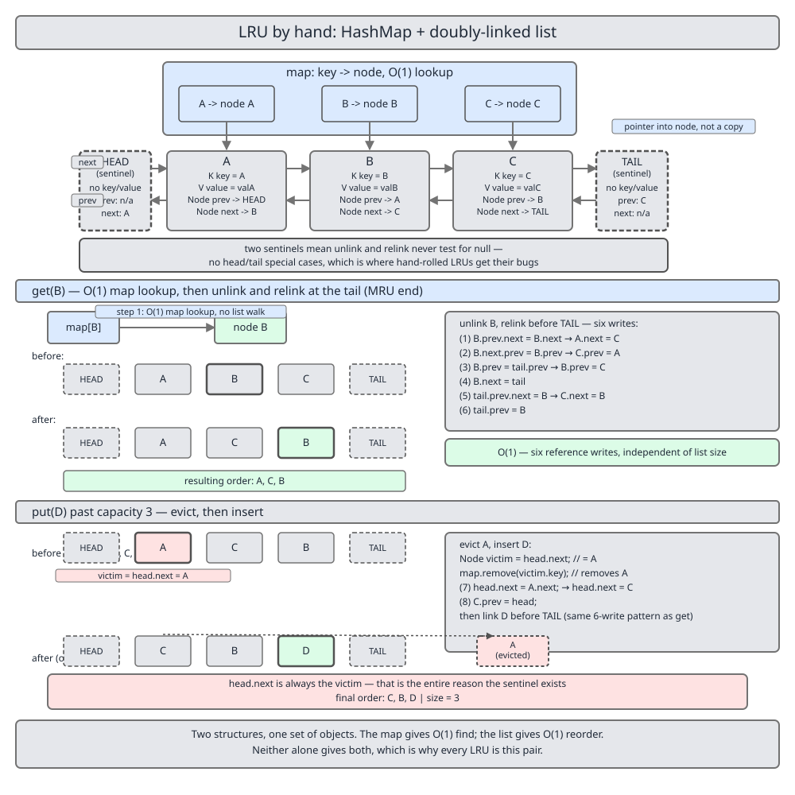

# 02 Java Collections — `LinkedHashMap` — INTERNALS (§4.6.2 An LRU cache without `LinkedHashMap`)

**Target version: Java 21 LTS.** | [Index](../00-index.md)
Previous: [linked-hash-map/01c1-internals-c2-memory-set-and-caffeine.md](01c1-internals-c2-memory-set-and-caffeine.md) · Next: [linked-hash-map/02a-build-lru-b-proof-and-cost.md](02a-build-lru-b-proof-and-cost.md)

---

Every prior file in this folder read `LinkedHashMap`'s source. This one throws the class away and rebuilds its cache behaviour from a `HashMap` and a linked list you own, because the fused version — one `Entry` that is simultaneously a hash-bucket node and a list node — hides the very thing worth learning. Pulled apart into two objects with an arrow between them, the mechanism is visible: you can point at the hash lookup, point at the six pointer writes, and say which one costs what.

**Code on this page.** Two labelled `java` blocks, two files, one block each, in the order they appear: `LruCache.java` (the complete cache) and `LruDemo.java` (the runnable walk). Unlabelled blocks are illustrative fragments, not part of either file. Both files compile under `javac -Xlint:all` with zero warnings, and every printed line below is real output of `java LruDemo`. The correctness proof against `java.util.LinkedHashMap`, the broken-eviction case study and the memory bill continue in [02a-build-lru-b-proof-and-cost.md](02a-build-lru-b-proof-and-cost.md), which owns `BrokenLruCache.java` and `LruProofDemo.java`.

---

## The four ways to build a bounded LRU, before any of them is built

An LRU cache needs two operations to be fast at once: **find a key**, and **move a known entry to the end of a recency order**. Every design below is an answer to "which structure gives me both?", and three of the four get one of them wrong.

| Approach | Lookup | Recency update | Eviction | LOC | When you would actually choose it |
|---|---|---|---|---|---|
| `LinkedHashMap(16, 0.75f, true)` + `removeEldestEntry` | O(1) | O(1) — `afterNodeAccess` relinks in place | O(1) — `afterNodeInsertion` drops `head` | ~10 | Always, unless you need a policy the hook cannot express. 40 B/entry, in the JDK, already debugged. |
| `HashMap<K, Node>` + your own doubly-linked list | O(1) | O(1) — six pointer writes | O(1) — `head.next` | ~150 | You need a policy hook `removeEldestEntry` cannot express (per-entry TTL, weighted size, an eviction listener), or you are being interviewed. 64 B/entry. |
| `ArrayList<K>` holding recency order | O(1) via a side map | **O(n)** — `remove(Object)` scans, then every later element shifts | O(1) — `remove(0)`, itself O(n) | ~40 | Never for a cache. The approach candidates reach for first, because a list *looks* like an order. |
| `TreeMap<Long, K>` keyed on an access counter | O(1) via a side map | **O(log n)** — remove the old counter, insert a new one | O(log n) — `pollFirstEntry` | ~60 | Never for plain LRU. Earns its place only when you need *range* queries over access times, e.g. "evict everything untouched since T". |

The `LinkedHashMap` recipe in row 1 is written out, with its five classic bugs, in [01b-internals-b-lru-and-sequenced.md](01b-internals-b-lru-and-sequenced.md); it is not repeated here. Rows 3 and 4 are the instructive failures: both keep recency in a *separate* ordered structure keyed by something other than the entry's own address, so every access must *search* for the entry's current position before moving it. Row 2 never searches — the hash lookup hands over the position. **Insight:** the four rows differ in one variable only — what you hold after the hash lookup. Hold the *value* and recency becomes a search problem; hold the *node* and it becomes two assignments.

---

## §4.6.2a One set of nodes, indexed two ways `[BUILD]`

### Mental model

Picture one pile of small objects, each holding a key, a value, and two arrows, and two different ways of reaching into that pile. The hash table reaches in *by key* — constant time, no order. The doubly-linked list reaches in *by neighbour* — no search at all, but you must already be holding a node to move it. Neither index owns the nodes; both point at the same pile. So the structure is not "a map plus a list". It is **one set of node objects, indexed two ways**, and the two indexes are chosen so that the output of one is exactly the input the other needs.

That resolves into a single line of Java, and it is the line most hand-rolled attempts get wrong: `private final Map<K, Node<K,V>> map;` — **not** `Map<K, V>`.

The map's value type is the *node*, not the cached value. A hit therefore hands you the list position for free, and "move this entry to the most-recently-used end" becomes pointer arithmetic on an object you already have, with no traversal anywhere. Store `Map<K, V>` instead and you have kept the values and thrown away the addresses; the only way back to a key's list position is to walk the list, and your O(1) cache is an O(n) cache with extra steps.

### Why it exists

Before this pattern the choice was a hash table with no order (fast lookup, no policy) or an ordered structure with no hash (a policy you cannot look up in). Fusing them is the oldest trick in cache implementation, and `LinkedHashMap` is the fusion done at the class level: `LinkedHashMap.Entry extends HashMap.Node` and *adds* `before`/`after` (JDK 21, line 205), so one object sits in both indexes at once and the arrow between them disappears.

### When to reach for the hand-rolled version, and when not

Reach for `LinkedHashMap` when the policy is "bound the entry count" — that is exactly what `removeEldestEntry` expresses, in ten lines, at 40 bytes per entry. Reach for the hand-rolled version when the policy is anything else: a per-entry TTL that needs the node to carry a timestamp, a weighted bound where a 2 MB value counts more than a 2 KB one, an eviction callback, or a second index over the same nodes. Reach for neither in production under concurrency — go to Caffeine ([01c1-internals-c2-memory-set-and-caffeine.md](01c1-internals-c2-memory-set-and-caffeine.md)).

### How it works — the node, and why it cannot be a record

`Node` (declared in full in the class below) is `private static final` with four fields — `K key; V value; Node<K,V> prev; Node<K,V> next;` — and every one of them is written during normal operation: `value` on a re-`put`, `prev` and `next` on every single `get`. A record's components are implicitly `final`, so `record Node<K,V>(K key, V value, Node<K,V> prev, Node<K,V> next)` would force a fresh allocation per access *and* a rewrite of the neighbours' final components, which is impossible without rebuilding the list. This is the cleanest available example of when a record is the wrong tool: **records model values, and a list node is not a value — it is a mutable position.** `static` matters too: a non-static inner class would carry a synthetic reference to the enclosing `LruCache`, 4 more bytes per entry for nothing.

### The gotcha

`key` is stored on the node as well as being the map's key, which looks redundant and is not: eviction starts from `head.next`, so it discovers the *node* first and needs the key to call `map.remove`. Drop `key` from the node to save 4 bytes and eviction becomes impossible without a full map scan. `HashMap.Node` keeps the key for the same reason, and `LinkedHashMap.afterNodeInsertion` uses it:

```java
void afterNodeInsertion(boolean evict) { // possibly remove eldest
    LinkedHashMap.Entry<K,V> first;
    if (evict && (first = head) != null && removeEldestEntry(first)) {
        K key = first.key;
        removeNode(hash(key), key, null, false, true);
    }
}
```
— `java.base/java/util/LinkedHashMap.java`, JDK 21, line 322.

### Definition

> An LRU cache is a hash index from key to *list node* over a doubly-linked list held in recency order, so that a lookup yields the position that the recency update needs.

---

## §4.6.2b The sentinel pair — two wasted objects that delete every branch `[BUILD]`

### Mental model

Give the list a permanent first node and a permanent last node that hold no key and no value and are never returned to a caller. They exist so that **every real node always has a non-null `prev` and a non-null `next`**, for the whole lifetime of the cache. There is no such thing as "the node at the front" any more; there is only "the node after `head`".

This is the single best design decision in the class, and its payoff is measured in branches that do not exist.

### Why it exists

Without sentinels the list owns two mutable fields, `head` and `tail`, and removing a node must ask two questions — am I the first? am I the last? — because the answers change *which variable* gets written: a neighbour's pointer, or the list's own field. Four branches, four places to forget a case. With sentinels the answer is always "a neighbour's pointer", because there is always a neighbour.

### When to reach for them, and when not

Always, for an internal doubly-linked list; skip them only when users hold the first node directly. The cost is two `Node` objects — 64 bytes for the whole cache, not per entry. Note that `java.util.LinkedHashMap` does *not* use sentinels: it keeps null-terminated `head`/`tail` and pays the branches, which is why `afterNodeAccess` is 20 lines of `if (b == null) head = a; else b.after = a;` rather than two assignments. Defensible in a class that must also serialise and clone; not the choice to copy.

### How it works — the same removal, written twice

With sentinels, removing a node is two unconditional writes, and no field of the container is touched:

```java
n.prev.next = n.next;
n.next.prev = n.prev;
```

Null-terminated, the same removal is four branches, and two of its paths write the container's own `head`/`tail` fields rather than a neighbour's pointer:

```java
if (n.prev == null) {
    head = n.next;            // container state, mutated from a list-surgery helper
} else {
    n.prev.next = n.next;
}
if (n.next == null) {
    tail = n.prev;            // and again
} else {
    n.next.prev = n.prev;
}
```

Two writes against four branches — and the second version carries a hazard the first cannot: a bug in it corrupts the container, not one node. The sentinel form is the one published in the class below; the null-terminated form is what `java.util.LinkedHashMap.afterNodeAccess` is made of.

### The invariant to write down and never break

- `head.next` is always the **least** recently used real node; `tail.prev` is always the **most** recently used.
- `head.prev` and `tail.next` stay `null` forever, and nothing ever reads them.
- An empty cache is exactly `head.next == tail && tail.prev == head`.
- Both sentinels are non-null from the end of the constructor until the object dies, so **no method in the class ever null-checks a `prev` or a `next`.**

Everything else in the class follows from those four lines. `unlink` is two writes because of them; `linkBeforeTail` is four writes because of them; `evict` needs no emptiness special case beyond the guard that says the caller made a mistake.

### The gotcha

Sentinels remove null checks; they do not remove *ordering* mistakes. In `linkBeforeTail` no write may destroy a value a later write still needs — `tail.prev.next = n` has to precede `tail.prev = n`, or the fifth write reaches the node it just installed instead of the old MRU node and the list quietly loses everything before it. Swap those two lines and nothing throws; `size()` still looks right, because `size()` reads the map.

### Definition

> A sentinel is a permanently-present node holding no data whose only job is to guarantee that every real node has a neighbour, converting boundary conditions into ordinary cases.

---

## The complete class

```java
// LruCache.java
import java.util.ArrayList;
import java.util.HashMap;
import java.util.Iterator;
import java.util.List;
import java.util.Map;

/**
 * A fixed-capacity least-recently-used cache: a HashMap from key to list node,
 * plus a sentinel-terminated doubly-linked list holding recency order.
 * head.next is always the least recently used entry; tail.prev the most recently used.
 * Not thread-safe.
 */
public final class LruCache<K, V> implements Iterable<K> {

    /** Mutable on every access, so it cannot be a record. */
    private static final class Node<K, V> {
        K key;
        V value;
        Node<K, V> prev;
        Node<K, V> next;

        Node(K key, V value) {
            this.key = key;
            this.value = value;
        }
    }

    private final Map<K, Node<K, V>> map;
    private final int capacity;
    private final Node<K, V> head;   // sentinel: head.next == LRU
    private final Node<K, V> tail;   // sentinel: tail.prev == MRU

    public LruCache(int capacity) {
        if (capacity < 1) {
            throw new IllegalArgumentException("capacity must be >= 1, was " + capacity);
        }
        this.capacity = capacity;
        this.map = HashMap.newHashMap(capacity);
        this.head = new Node<>(null, null);
        this.tail = new Node<>(null, null);
        this.head.next = this.tail;
        this.tail.prev = this.head;
    }

    /** Returns the value and records the access, or null if absent. */
    public V get(K key) {
        Node<K, V> node = map.get(key);
        if (node == null) {
            return null;
        }
        moveToTail(node);
        return node.value;
    }

    /** Inserts or replaces; returns the previous value, or null. Evicts the LRU entry if full. */
    public V put(K key, V value) {
        Node<K, V> existing = map.get(key);
        if (existing != null) {                 // case 1: present
            V old = existing.value;
            existing.value = value;
            moveToTail(existing);
            return old;
        }
        if (map.size() == capacity) {           // case 3: absent and full
            evict();
        }
        Node<K, V> node = new Node<>(key, value);   // case 2: absent, room to spare
        map.put(key, node);
        linkBeforeTail(node);
        return null;
    }

    /** Removes the mapping; returns the removed value, or null. Does not count as an access. */
    public V remove(K key) {
        Node<K, V> node = map.remove(key);
        if (node == null) {
            return null;
        }
        unlink(node);
        node.prev = null;
        node.next = null;
        return node.value;
    }

    /** A probe: deliberately does NOT count as an access. */
    public boolean containsKey(K key) {
        return map.containsKey(key);
    }

    public int size() {
        return map.size();
    }

    public int capacity() {
        return capacity;
    }

    /** Keys in recency order, least recently used first. Snapshot, not a live view. */
    public List<K> keys() {
        List<K> out = new ArrayList<>(map.size());
        for (Node<K, V> n = head.next; n != tail; n = n.next) {
            out.add(n.key);
        }
        return out;
    }

    @Override
    public Iterator<K> iterator() {
        return keys().iterator();
    }

    @Override
    public String toString() {
        StringBuilder sb = new StringBuilder("LruCache[LRU..MRU]{");
        for (Node<K, V> n = head.next; n != tail; n = n.next) {
            if (n != head.next) {
                sb.append(", ");
            }
            sb.append(n.key).append('=').append(n.value);
        }
        return sb.append('}').toString();
    }

    // --- list surgery: two writes each, no null checks, no head/tail special cases ---

    private void unlink(Node<K, V> n) {
        n.prev.next = n.next;   // write 1
        n.next.prev = n.prev;   // write 2
    }

    private void linkBeforeTail(Node<K, V> n) {
        n.prev = tail.prev;     // write 3
        n.next = tail;          // write 4
        tail.prev.next = n;     // write 5
        tail.prev = n;          // write 6
    }

    private void moveToTail(Node<K, V> n) {
        unlink(n);
        linkBeforeTail(n);
    }

    /** Drops head.next: from the map and the list, together, always. */
    private void evict() {
        Node<K, V> victim = head.next;
        if (victim == tail) {
            throw new IllegalStateException("evict() on an empty cache");
        }
        map.remove(victim.key);  // write 7 + 8 live in unlink
        unlink(victim);
        victim.prev = null;
        victim.next = null;
    }
}
```

Three details in there are decisions, not accidents.

**`HashMap.newHashMap(capacity)`, not `new HashMap<>(capacity)`.** The second one sizes the *table* to `capacity` buckets, which with load factor 0.75 resizes at `0.75 × capacity` entries — that is, always, before the cache is even full. `newHashMap` sizes for the expected *mapping count*:

```java
public static <K, V> HashMap<K, V> newHashMap(int numMappings) {
    if (numMappings < 0) {
        throw new IllegalArgumentException("Negative number of mappings: " + numMappings);
    }
    return new HashMap<>(calculateHashMapCapacity(numMappings));
}
```
— `java.base/java/util/HashMap.java`, JDK 21, line 2580.

`calculateHashMapCapacity` is `(int) Math.ceil(numMappings / 0.75)` (line 2563). **Version note:** `newHashMap` is Java 19+; before it the idiom was the same arithmetic by hand, `new HashMap<>((int) (capacity / 0.75f) + 1)`, which is why that expression is scattered through every pre-19 codebase. Sizing mechanics in full: [../hash-map/05-internals-e-sizing-and-iteration.md](../hash-map/05-internals-e-sizing-and-iteration.md).

**`containsKey` is a probe and does not record an access.** Both answers are defensible — a probe lets monitoring ask "is this cached?" without perturbing the policy; counting it makes `containsKey` behave like `get` — so the choice must be documented either way. This class chooses probe, which matches `java.util.LinkedHashMap`, where `get` calls `afterNodeAccess` and `containsKey` deliberately does not (leaf 3.7.8; [01a-internals-a2-hooks-and-access-order.md](01a-internals-a2-hooks-and-access-order.md)). Choosing the opposite would have broken the property test in [02a-build-lru-b-proof-and-cost.md](02a-build-lru-b-proof-and-cost.md) — proof that the choice is observable.

**`keys()` and `toString()` exist to make the class testable.** A cache whose recency order you cannot read is a cache you cannot prove correct. Both are snapshots, not live views: `iterator()` returns the snapshot's iterator, so it neither throws `ConcurrentModificationException` nor reflects later changes — a smaller promise than the JDK's, and an honest one.

---

## §4.6.2c `get`, write by write

`get` is a hash lookup followed by `moveToTail`, and `moveToTail` is `unlink` then `linkBeforeTail`: **six pointer writes, no branches, no traversal.** Take the list `HEAD ⇄ A ⇄ B ⇄ C ⇄ TAIL` and call `get(B)`.



The map lookup, off to the left, costs one hash and one bucket probe and yields the node for `B` and nothing more. Then, in `unlink(B)`:

1. `B.prev.next = B.next` → `A.next = C`
2. `B.next.prev = B.prev` → `C.prev = A`

`B` is now out of the list; its own `prev`/`next` still point at `A` and `C`, stale and about to be overwritten. Then, in `linkBeforeTail(B)`:

3. `B.prev = tail.prev` → `B.prev = C`
4. `B.next = tail`
5. `tail.prev.next = B` → `C.next = B`
6. `tail.prev = B`

Writes 3 and 4 point `B` at its new neighbours; 5 and 6 point the new neighbours back at `B`. The order inside each pair is free, but 5 must precede 6.

The already-MRU case needs no special handling: if `B` is already `tail.prev`, writes 1 and 2 unlink it and writes 3 through 6 put it straight back — six wasted writes for a correct result, and no branch. `LinkedHashMap` takes the other trade and tests for it, `(last = tail) != e`, inside:

```java
// Called after update, but not after insertion
void afterNodeAccess(Node<K,V> e) {
```
— `java.base/java/util/LinkedHashMap.java`, JDK 21, line 336.

Eviction is the same two writes from `unlink`, applied to `head.next`. After `get(B)` the order is `A, C, B`, so `put("D", 4)` at capacity 3 takes `victim = head.next = A`:

7. `head.next = A.next` → `head.next = C`
8. `C.prev = head`

plus `map.remove("A")`, which is the other half of the eviction and the half people forget. The demo below prints both walks.

```java
// LruDemo.java
public final class LruDemo {

    public static void main(String[] args) {
        structuralWalk();
        putCases();
    }

    private static void structuralWalk() {
        System.out.println("== 1. get(B) and the eviction on put(D), capacity 3 ==");
        LruCache<String, Integer> c = new LruCache<>(3);
        c.put("A", 1);
        c.put("B", 2);
        c.put("C", 3);
        System.out.println("after put A,B,C     : " + c);
        System.out.println("keys() LRU-first    : " + c.keys());
        System.out.println("get(B)              : " + c.get("B"));
        System.out.println("after get(B)        : " + c);
        System.out.println("containsKey(A) probe: " + c.containsKey("A") + "  (order unchanged: " + c.keys() + ")");
        c.put("D", 4);
        System.out.println("after put(D)        : " + c);
        System.out.println("A still cached?     : " + c.containsKey("A") + "   size=" + c.size());
    }

    private static void putCases() {
        System.out.println();
        System.out.println("== 2. put's three cases, capacity 3 ==");
        LruCache<String, Integer> c = new LruCache<>(3);
        c.put("A", 1);
        c.put("B", 2);
        System.out.println("case 2 (absent, room) : " + c + " size=" + c.size());
        Integer old = c.put("A", 11);
        System.out.println("case 1 (present)      : " + c + " size=" + c.size() + " previous=" + old);
        c.put("C", 3);
        c.put("D", 4);
        System.out.println("case 3 (absent, full) : " + c + " size=" + c.size());
        System.out.println("remove(C)             : " + c.remove("C") + " -> " + c + " size=" + c.size());
        System.out.println("remove(C) again       : " + c.remove("C"));
        try {
            new LruCache<String, Integer>(0);
        } catch (IllegalArgumentException e) {
            System.out.println("new LruCache<>(0)     : IllegalArgumentException: " + e.getMessage());
        }
    }
}
```

```text
== 1. get(B) and the eviction on put(D), capacity 3 ==
after put A,B,C     : LruCache[LRU..MRU]{A=1, B=2, C=3}
keys() LRU-first    : [A, B, C]
get(B)              : 2
after get(B)        : LruCache[LRU..MRU]{A=1, C=3, B=2}
containsKey(A) probe: true  (order unchanged: [A, C, B])
after put(D)        : LruCache[LRU..MRU]{C=3, B=2, D=4}
A still cached?     : false   size=3
```

The third and fourth lines are writes 1 through 6; the sixth and seventh are writes 7 and 8 plus the `map.remove`.

---

## §4.6.2d `put`'s three cases, and the one that breaks

`put` has exactly three shapes.

**Case 1 — key present.** Overwrite `value`, `moveToTail`, return the old value. This case must **not** allocate a `Node`, must **not** touch `size` (the map already has the mapping), and must **not** evict — a re-`put` of an existing key cannot push the cache over its bound, and evicting here would silently shrink a full cache by one on every update. Every one of those three "must nots" is a bug someone has shipped.

**Case 2 — key absent, below capacity.** Allocate, `map.put`, `linkBeforeTail`. Nothing else. **Case 3 — key absent, at capacity.** Here the order of operations is a real decision. **Evict first, then insert** is what this class does, and it means the cache never holds more than `capacity` entries at any instant — including in the middle of `put`, which matters if anything can observe the map (a monitoring thread, a `toString` in a debugger, a subclass hook). The alternative, insert-then-evict, is what `LinkedHashMap` does: `putVal` inserts, then `afterNodeInsertion` calls `removeEldestEntry`, which is why the recipe's predicate reads `size() > maxEntries` and not `>=`, and why the map transiently holds `maxEntries + 1` entries ([01b-internals-b-lru-and-sequenced.md](01b-internals-b-lru-and-sequenced.md)).

Evict-first has exactly one hazard, and it is the reason people avoid it: if the incoming key were itself the eviction victim, evicting first would delete the mapping you are about to install. **It cannot be.** Case 3 is reached only after `map.get(key)` returned `null`, so `key` is absent from the map; the victim is `head.next`, a node in the list and therefore in the map; a key absent from the map cannot be the key of a node present in it. The guard is the case analysis itself, not a runtime check.

**The bug to name out loud: evicting from the list without removing from the map.** `unlink(head.next)` alone leaves the key in the map forever, and two symptoms follow immediately — `size()` climbs past `capacity` because `size()` reads the map, and `get` on an evicted key returns a value that should be gone *and relinks the dead node into the list*, so the bound is lost in both indexes. That case study, with output, opens [02a-build-lru-b-proof-and-cost.md](02a-build-lru-b-proof-and-cost.md). The rule that prevents it: `map.remove(victim.key)` and `unlink(victim)` are one operation with two statements, living in one method, `evict()`, the only place either appears.

`remove(K)` obeys the same rule from the other direction — `map.remove` *and* `unlink`, then return the old value or `null` — and nulls the departing node's pointers, which turns relinking through a stale reference from silent corruption into an immediate `NullPointerException`.

```text
== 2. put's three cases, capacity 3 ==
case 2 (absent, room) : LruCache[LRU..MRU]{A=1, B=2} size=2
case 1 (present)      : LruCache[LRU..MRU]{B=2, A=11} size=2 previous=1
case 3 (absent, full) : LruCache[LRU..MRU]{A=11, C=3, D=4} size=3
remove(C)             : 3 -> LruCache[LRU..MRU]{A=11, D=4} size=2
remove(C) again       : null
new LruCache<>(0)     : IllegalArgumentException: capacity must be >= 1, was 0
```

Read the third line against the second. `put("A", 11)` moved `A` to the MRU end, making the order `B, A`; `put("C", 3)` filled the cache to `B, A, C`; `put("D", 4)` then evicted `B`, the least recently used, leaving `A, C, D`. `A` survived *because* the re-`put` in case 1 counted as an access. That is the whole policy, visible in one line of output.

### Definition

> `put` on an LRU cache is three cases — present, absent-with-room, absent-and-full — and the third is the only one that may evict, exactly once, before or after the insert but never both.

---

## Two supporting facts

**`size()` reads the map, not the list.** The map is the authority on membership at O(1); counting the list would be O(n). Those two numbers agreeing is the class's central invariant, and `keys().size() == size()` is the cheap assertion that checks it.

**`capacity < 1` is rejected in the constructor, with the value in the message**, while `evict()` on an empty list throws `IllegalStateException` — two exceptions because they are two different faults, bad input versus a broken invariant. **Pitfall:** `new LruCache<>(0)` looks harmless, and a class that accepts it stores nothing while reporting success on every `put`.

---

## Pitfalls

### Mapping keys to values instead of keys to nodes

**Wrong**

```java
private final Map<K, V> map = new HashMap<>();
private final LinkedList<K> recency = new LinkedList<>();

public V get(K key) {
    V v = map.get(key);
    if (v == null) {
        return null;
    }
    recency.remove(key);   // O(n): LinkedList.remove(Object) scans
    recency.addLast(key);
    return v;
}
```

The lookup is O(1) and the recency update is O(n), so the cache is O(n) per hit. At capacity 10,000 with a 90% hit rate this is measurably slower than no cache at all for cheap-to-recompute values, and the profiler blames `LinkedList.remove`, which looks like an innocent line.

**Right**

```java
private final Map<K, Node<K, V>> map = new HashMap<>();

public V get(K key) {
    Node<K, V> node = map.get(key);
    if (node == null) {
        return null;
    }
    moveToTail(node);      // six pointer writes, no scan
    return node.value;
}
```

The map's value type carries the list position, so nothing is searched for.

**Why people believe it:** "map from key to value" is what a cache *is*, semantically, and `LinkedList` advertises O(1) removal — which is true of `remove` given a node or an iterator, and false of `remove(Object)`, which must find the node first.

### Half-unlinking a node

**Wrong**

```java
private void unlink(Node<K, V> n) {
    n.prev.next = n.next;   // forward chain repaired
}                           // backward chain still points at n
```

Forward iteration from `head` looks perfect, so `toString()`, `keys()`, and every test that reads the list left-to-right pass. The corruption only surfaces later: `n.next.prev` still points at the removed node, so the next `linkBeforeTail` near that position writes through a dead node and drops a live entry — and it surfaces at a `put` far from the `get` that caused it.

**Right**

```java
private void unlink(Node<K, V> n) {
    n.prev.next = n.next;
    n.next.prev = n.prev;
}
```

**Why people believe it:** every debugging tool they have — print the list, iterate the list, assert on the list — traverses in one direction, so a doubly-linked list with a broken back chain passes every check they know how to write.

---

## Cheat sheet

| Item | Value |
|---|---|
| Structure | `Map<K, Node<K,V>>` + sentinel-terminated doubly-linked list |
| Map value type | the **node**, never the value |
| `head.next` | least recently used |
| `tail.prev` | most recently used |
| `get` cost | 1 hash lookup + 6 pointer writes, no branches |
| `unlink` | 2 writes with sentinels, 4 branches without |
| Thread safety | none — 64 B/entry vs `LinkedHashMap`'s 40 B (see 02a) |
| `linkBeforeTail` | 4 writes; write 5 (`tail.prev.next = n`) must precede write 6 (`tail.prev = n`) |
| `put` cases | present / absent-with-room / absent-and-full |
| Case 1 must not | allocate, change size, or evict |
| Eviction | `map.remove(victim.key)` **and** `unlink(victim)`, in one method, always together |
| Evict-first is safe because | case 3 is reached only when the key is absent, so it cannot be the victim |
| `LinkedHashMap` order | insert first, then evict — transiently `maxEntries + 1` |
| Pre-sizing | `HashMap.newHashMap(capacity)` (19+); `new HashMap<>((int)(capacity / 0.75f) + 1)` before |
| `Node` as a record | impossible — `prev`/`next`/`value` are mutated on every access |
| `containsKey` here | a probe, not an access (same split as `LinkedHashMap`) |

---

## Self-test

**Q1.** Why is the map's value type `Node<K,V>` rather than `V`, and what is the asymptotic cost of getting it wrong?

<details><summary>Answer</summary>

Because the recency update needs the entry's *position* in the list, and the hash lookup is the only O(1) way to obtain it. With `Map<K, V>` the position is unknown after a lookup, so moving the key to the MRU end requires finding it first — O(n) by scanning the recency structure. The cache remains O(1) for lookup and becomes O(n) per access overall, which defeats the purpose.

</details>

**Q2.** Give the six pointer writes of `get(B)` on `HEAD ⇄ A ⇄ B ⇄ C ⇄ TAIL`, in order, with the concrete assignment each one performs.

<details><summary>Answer</summary>

`unlink(B)`: (1) `B.prev.next = B.next` → `A.next = C`; (2) `B.next.prev = B.prev` → `C.prev = A`. Then `linkBeforeTail(B)`: (3) `B.prev = tail.prev` → `B.prev = C`; (4) `B.next = tail`; (5) `tail.prev.next = B` → `C.next = B`; (6) `tail.prev = B`. Write 5 must precede write 6, or write 5 reaches `B` itself instead of the old MRU node.

</details>

**Q3.** What exactly do the two sentinel nodes buy, and what do they cost?

<details><summary>Answer</summary>

They buy the guarantee that every real node has a non-null `prev` and `next` for the object's whole lifetime, which turns `unlink` into two unconditional writes instead of four branches, removes all head/tail special cases, and keeps list surgery from having to mutate cache-level fields. They cost two `Node` objects — 64 bytes total for the entire cache, not per entry — and the small confusion of a list whose first element is `head.next` rather than `head`.

</details>

**Q4.** Why can `Node` not be a `record`?

<details><summary>Answer</summary>

A record's components are implicitly `final`; `Node` mutates `prev` and `next` on every access and `value` on every overwrite. Modelling it as a record would force allocating a fresh node per access *and* rewriting the neighbours' final components, which is impossible without rebuilding the list. Records model immutable values; a list node is a mutable position.

</details>

**Q5.** In `put`, is it safe to evict before inserting? Prove it.

<details><summary>Answer</summary>

Yes. The evicting branch is reached only after `map.get(key)` returned `null`, so `key` is not in the map. The victim is `head.next`, which is a node in the list and therefore has its key in the map. A key absent from the map cannot equal the key of a node present in it, so the incoming key is never the victim. Evict-first additionally guarantees the cache never holds more than `capacity` entries at any observable instant, unlike `LinkedHashMap`, which inserts first and transiently holds `maxEntries + 1`.

</details>

**Q6.** A colleague's hand-rolled cache reports `size()` of 5 with `capacity` 2. What is the bug, and what is the second symptom you should expect?

<details><summary>Answer</summary>

Eviction unlinks the victim from the list but never calls `map.remove(victim.key)`, and `size()` reads the map. The second symptom: `get` on an evicted key finds the orphaned node in the map, returns its value, and — because `moveToTail` unlinks and relinks unconditionally — splices the dead node back into the list, so the list grows past the bound as well and the cache becomes unbounded in both indexes.

</details>

---

**Leaves covered:** 4.6.2 (part 1 of 2, continued in 02a) (1 leaf)
**Leaves deferred:** none
**Diagrams included:** D-148
**Target version:** Java 21 LTS
**Lines:** 599
