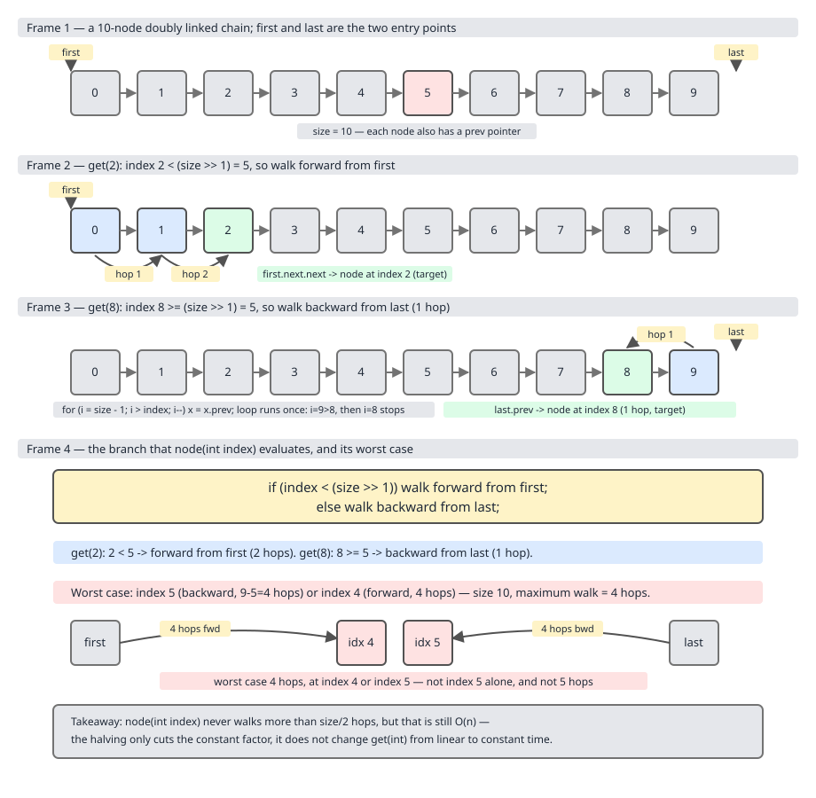
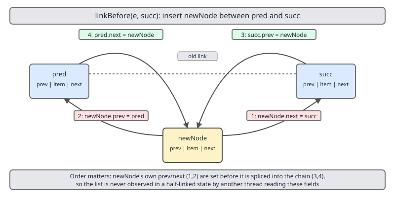
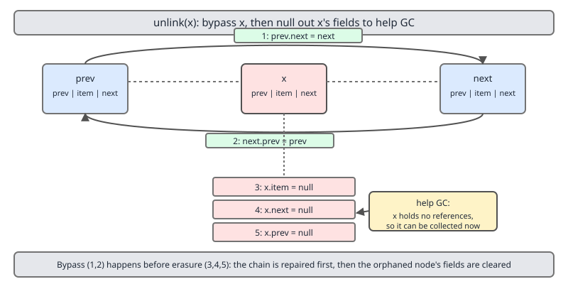
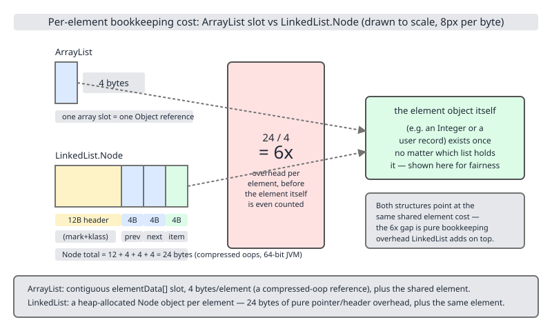

# 02 Java Collections — `LinkedList` — INTERNALS (§3.3 `LinkedList` source walk)

**Target version: Java 21 LTS.** | [Index](../00-index.md)
Previous: [array-list/09-build-my-array-list-e-spliterator-diff-and-benchmark.md](../array-list/09-build-my-array-list-e-spliterator-diff-and-benchmark.md) · Next: [linked-list/02-build-my-linked-list.md](02-build-my-linked-list.md)

`ArrayList` is one object holding one array. `LinkedList` is *n+1* objects holding 3n references. Everything in this file follows from that sentence — the O(1) splice that is genuinely O(1), the O(n) walk you must pay to reach the splice point, and the six-fold memory bill that makes the walk slow in wall-clock terms rather than just in big-O terms.

## The type surface

| Declared | Where | Consequence |
|---|---|---|
| `extends AbstractSequentialList<E>` | line 91 | `get`/`add`/`remove` by index are defined in terms of `listIterator(index)`, not the reverse. See [../framework/08-abstract-skeletons.md](../framework/08-abstract-skeletons.md) for why inheriting `AbstractList` instead would have made iteration O(n²). |
| `implements List<E>` | line 92 | Indexed API, but **no** `RandomAccess` marker — and `Collections` branches on that (§3.3.12 below). |
| `implements Deque<E>` | line 92 | Full double-ended queue surface; also `SequencedCollection` transitively, so `reversed()` exists since Java 21. |
| `implements Cloneable, Serializable` | line 92 | `size`, `first`, `last` are all `transient`; serialization writes the elements, not the node graph. |

All citations: `java.base/java/util/LinkedList.java`, JDK 21.

## `Node<E>` and the three fields — supporting fact (3.3.1)

The whole state of a `LinkedList` is three fields plus a chain of one private static nested class:

```java
transient int size = 0;      // line 94
transient Node<E> first;     // line 99
transient Node<E> last;      // line 104

private static class Node<E> {   // line 981
    E item;
    Node<E> next;
    Node<E> prev;

    Node(Node<E> prev, E element, Node<E> next) {
        this.item = element;
        this.next = next;
        this.prev = prev;
    }
}
```

No sentinel/header node — the JDK uses `null` terminators at both ends, which is why every link and unlink method has an explicit `if (pred == null)` / `if (next == null)` branch instead of writing unconditionally. The commented-out `dataStructureInvariants()` at line 106 states the contract exactly: either `size == 0 && first == null && last == null`, or `first.prev == null && last.next == null`.

`Node` is `static`, so it holds no outer-`LinkedList` reference — worth noticing, because the *non*-static `ListItr` does.

> **Definition.** A `LinkedList` is a null-terminated doubly-linked chain of `Node<E>` records, addressed only through the `first`, `last` and `size` fields on the list object.

---

### `node(int index)` — the bidirectional shortcut

**Mental model.** A tape you can crank from either end. Ask for a position and the list first decides which end is nearer, then cranks from there. The decision costs one shift and one compare; it halves the walk, and it does not change the complexity class at all.

**Why it exists.** A singly-linked list has one entry point, so `get(i)` costs `i` hops and `get(size-1)` costs `n-1`. Once you are paying 4 extra bytes per node for a `prev` pointer anyway (you need it for O(1) `removeLast` and `descendingIterator`), the second entry point is free — so the JDK spends it on halving the worst-case walk.

**When it helps, and when it does not.** It helps ends-biased access (`getLast`, `remove(size-1)`), which is exactly the `Deque` workload. It does not help *midpoint* access, which is the worst case for both directions, and midpoint access is precisely what people reach for `LinkedList` to do. Sibling: `ArrayList.get(i)` is one bounds check and one array load at any index — no walk, no branch.

**Mechanism.** Line 577:

```java
Node<E> node(int index) {
    // assert isElementIndex(index);

    if (index < (size >> 1)) {
        Node<E> x = first;
        for (int i = 0; i < index; i++)
            x = x.next;
        return x;
    } else {
        Node<E> x = last;
        for (int i = size - 1; i > index; i--)
            x = x.prev;
        return x;
    }
}
```

Read the two loop bounds and count hops, do not guess. Forward: `i` runs `0 .. index-1`, so **`index` hops**. Backward: `i` runs `size-1` down to `index+1`, so **`size - 1 - index` hops**.

On a 10-element list (`size = 10`, `size >> 1 == 5`):

- `get(2)`: `2 < 5`, forward branch, **2 hops** from `first`.
- `get(8)`: `8 < 5` is false, backward branch, `size - 1 - index = 10 - 1 - 8 =` **1 hop** from `last` (which is index 9).
- Worst case: maximise `min(index, size-1-index)`. Forward branch peaks at `index = 4` → 4 hops. Backward branch is cheapest at `index = 5` → `10-1-5 =` **4 hops**. So the worst case is **4 hops, at index 4 or index 5** — `⌊(size-1)/2⌋`, not `size/2`.



```java
import java.util.LinkedList;
import java.util.List;

public final class NodeDirection {
    static int hops(int size, int index) {
        return index < (size >> 1) ? index : size - 1 - index;
    }

    public static void main(String[] args) {
        List<String> chain = new LinkedList<>(
                List.of("a", "b", "c", "d", "e", "f", "g", "h", "i", "j"));
        for (int i = 0; i < chain.size(); i++) {
            System.out.printf("get(%d) = %s  hops=%d  direction=%s%n",
                    i, chain.get(i), hops(chain.size(), i),
                    i < (chain.size() >> 1) ? "forward" : "backward");
        }
    }
}
```

**Gotcha.** `size >> 1` on the *current* size means the split point moves as the list grows, so hop counts are not stable across a loop that also inserts. And the shortcut tempts people into `for (int i = 0; i < list.size(); i++) list.get(i)`, which is Θ(n²/4) — the halving makes it four times faster than the naive quadratic, which is still quadratic. Iterate with the `for-each` loop or `listIterator`.

**Insight:** the shortcut is a constant-factor win only. It is the single most-quoted `LinkedList` "optimisation" and it buys a factor of two on a term that is already the wrong shape.

> **Definition.** `node(int)` is the private index-to-node resolver that walks from `first` when `index < (size >> 1)` and from `last` otherwise, costing `min(index, size-1-index)` pointer dereferences.

---

### Link and unlink — the pointer surgery and the GC-help nulling

**Mental model.** Splicing a carriage into a train. Four couplings get rewritten in a fixed order; removing a carriage rewrites two, then *unbolts* the removed carriage's own three couplings so the yard crane can scrap it. That unbolting is the part interviewers ask about.

**Why it exists as six methods.** The `null`-terminator design means head, tail and interior are three genuinely different cases, and each of insert/remove needs its own: `linkFirst` (136), `linkLast` (151), `linkBefore` (166), `unlinkFirst` (182), `unlinkLast` (201), `unlink` (220). A sentinel-node design would collapse all six into two; the JDK trades six small methods for one fewer object and no null checks on the hot `item` read.

**When this is the reason to use `LinkedList`.** When you already hold the position — an iterator sitting there. Otherwise you pay `node(int)` first, and the O(1) splice is a rounding error on an O(n) operation. That is §3.3.9.

**Mechanism — `linkBefore`, line 166.** Four writes, in this order:

```java
void linkBefore(E e, Node<E> succ) {
    // assert succ != null;
    final Node<E> pred = succ.prev;
    final Node<E> newNode = new Node<>(pred, e, succ);   // 1+2: new node's prev and next
    succ.prev = newNode;                                  // 3
    if (pred == null)
        first = newNode;                                  // 4a: inserting at head
    else
        pred.next = newNode;                              // 4b
    size++;
    modCount++;
}
```

The new node is fully wired by its constructor *before* anything already in the chain is touched — so at no point is a live node pointing at a half-built one. This ordering is what makes the structure safe to read from the same thread mid-splice (it is *not* thread-safe across threads; there is no `volatile` and no fence anywhere in this class).



**Mechanism — `unlink`, line 220.** Two bypass writes, then three erasures:

```java
E unlink(Node<E> x) {
    // assert x != null;
    final E element = x.item;
    final Node<E> next = x.next;
    final Node<E> prev = x.prev;

    if (prev == null) {
        first = next;
    } else {
        prev.next = next;
        x.prev = null;
    }

    if (next == null) {
        last = prev;
    } else {
        next.prev = prev;
        x.next = null;
    }

    x.item = null;
    size--;
    modCount++;
    return element;
}
```

Read the null-outs precisely, because the syllabus phrasing is loose. `x.item = null` is **unconditional**. `x.prev = null` and `x.next = null` happen **only in the `else` branches** — in the `if` branches the field being cleared was already `null` (that is what the branch tested), so there is nothing to clear. The net effect is what "help GC" means: the departing node ends up with all three references null.



**Insight:** why bother nulling a node that is itself about to be collected? Because it may *not* be. Any live `ListIterator` or `Iterator` positioned at or beside `x` keeps `x` reachable. Without the null-outs, that one stranded node would keep `item` and the *entire rest of the chain in both directions* alive — a single retained iterator would pin the whole list. Nulling makes the leak bounded at one node. `unlinkFirst` (182) and `unlinkLast` (201) carry the literal comment `// help GC` on their single null-out; `unlink` does the same work without the comment.

```java
import java.util.Iterator;
import java.util.LinkedList;
import java.util.List;

public final class UnlinkErasure {
    public static void main(String[] args) {
        LinkedList<String> list = new LinkedList<>(List.of("a", "b", "c", "d"));
        Iterator<String> it = list.iterator();
        it.next();          // a
        it.next();          // b
        it.remove();        // unlink(b): b.prev, b.next, b.item all become null
        System.out.println(list);            // [a, c, d]
        System.out.println(list.size());     // 3
        // The iterator survives; it is now positioned so that next() yields c.
        System.out.println(it.next());       // c
    }
}
```

**Gotcha.** Every one of the six methods bumps `modCount`, including `linkFirst`/`linkLast`. So `addLast` during a `for-each` throws `ConcurrentModificationException` even though it structurally cannot disturb the iterator's position — the modCount check is coarser than the actual hazard.

> **Definition.** Link/unlink are the six private splice primitives that rewrite at most four references in a fixed safe order; `unlink` additionally nulls the departing node's `item`, `next` and `prev` so a surviving iterator cannot pin the rest of the chain.

## `ListItr` — supporting fact (3.3.5)

Line 882, a non-static inner class holding exactly three pieces of position state plus the fail-fast guard:

```java
private class ListItr implements ListIterator<E> {
    private Node<E> lastReturned;
    private Node<E> next;
    private int nextIndex;
    private int expectedModCount = modCount;
```

`next` is the node that `next()` will return; `lastReturned` is what `remove()`/`set()` act on; `nextIndex` exists only to answer `nextIndex()`/`hasNext()` without walking. Construction is `next = (index == size) ? null : node(index)` — you pay the walk once, then every subsequent `add`/`remove` through this iterator is a true O(1) splice with no `node(int)` call. **This is the only place `LinkedList`'s advertised O(1) insertion is actually reachable through the public API.** `DescendingIterator` (line 1003) is a four-line adapter that wraps `new ListItr(size())` and swaps `next`/`previous`; `descendingIterator()` is at line 996, `@since 1.6`.

## The `Deque` surface — supporting fact (3.3.6)

`addFirst`/`addLast`/`offerFirst`/`offerLast`/`peek`/`peekFirst`/`peekLast`/`poll`/`pollFirst`/`pollLast`/`push`/`pop`/`removeFirstOccurrence`/`removeLastOccurrence` — all genuinely O(1), all delegating to `linkFirst`/`linkLast`/`unlinkFirst`/`unlinkLast`. **`LinkedList` permits null elements; `ArrayDeque` does not** (`ArrayDeque` uses `null` as its own empty-slot sentinel and throws `NullPointerException`). That is the one functional reason to pick `LinkedList` over `ArrayDeque` for queue work — and it is a bad one, because a null in a queue is almost always a modelling error; use `Optional` or a sentinel object instead. `push`/`pop` map to `addFirst`/`removeFirst`, so a `LinkedList` used as a stack grows at the *head*, the opposite end from `ArrayList`-as-stack.

---

### Memory per element and cache locality

**Mental model.** `ArrayList` is a row of seats bolted to the floor. `LinkedList` is n people scattered across a stadium, each holding a note saying where the next one sits. Reading the array is a scan; reading the chain is a scavenger hunt.

**Mechanism — the `Node` bill.** Under the default 64-bit HotSpot configuration with compressed oops (heaps under ~32 GB, `-XX:+UseCompressedOops`, on by default):

| Component | Compressed oops | No compressed oops (heap ≥ 32 GB or `-XX:-UseCompressedOops`) |
|---|---|---|
| `Node` object header (mark + klass) | 12 B | 16 B |
| `item` reference | 4 B | 8 B |
| `next` reference | 4 B | 8 B |
| `prev` reference | 4 B | 8 B |
| Subtotal | 24 B | 40 B |
| 8-byte alignment padding | 0 B (already aligned) | 0 B |
| **Per-element overhead** | **24 B** | **40 B** |
| `ArrayList` equivalent (one array slot) | **4 B** | **8 B** |

Six-to-one either way, and that is *before* the element object itself, which both structures pay identically. Header arithmetic is derived in [../cost-and-memory/02-internals-memory-headers.md](../cost-and-memory/02-internals-memory-headers.md) — not repeated here. Caveat: `ArrayList`'s 4 B/slot is the ideal; its array is over-allocated by up to 50% after a growth, so the realistic figure is 4–6 B.



**Mechanism — cache locality (3.3.8).** A 64-byte cache line holds 16 `ArrayList` slots, so a sequential array scan takes one cache miss per 16 elements and the hardware prefetcher sees the stride and hides even those. A `Node` chain has no stride: `x = x.next` cannot be issued until the load of `x.next` returns, so misses serialise into a dependency chain at roughly 80–100 ns each on a main-memory hit. Two `Node`s allocated back-to-back *are* adjacent in the TLAB — a freshly built list scans respectably — but any interleaved allocation, and any GC compaction or copy, destroys that adjacency permanently. This is why `LinkedList` benchmarks look tolerable on a list you just built and terrible on one that has been mutated for a while.

**Gotcha.** GC cost scales with reference count, not byte count. A 1M-element `LinkedList` presents 3M references for the collector to trace against `ArrayList`'s 1M — three times the mark work, plus 24 MB of extra live set to copy.

> **Definition.** Each `LinkedList` element costs a 24-byte `Node` (12-byte header + three 4-byte compressed references) against `ArrayList`'s 4-byte array slot, and pays a dependent cache miss per hop because the chain has no prefetchable stride.

---

### Why `LinkedList` loses even at mid-insertion

**Mental model.** The textbook compares an O(1) splice against an O(n) shift and declares a winner. The textbook forgot that you have to *find* the splice point, and that the O(n) shift is a single `memmove` running at multiple gigabytes per second while the O(n) find is a chain of dependent cache misses.

**Why the belief exists.** "Insert in the middle is O(1) for a linked list" is true *about the splice*. `list.add(size/2, x)` is not the splice; it is `node(size/2)` — up to `⌊(size-1)/2⌋` pointer dereferences — followed by the splice. Total: O(n) with a terrible constant. `ArrayList.add(size/2, x)` is `System.arraycopy` of half the array, an intrinsic that compiles to a vectorised block move.

**The measurement.** Plain timed loop, warmup then 6 measured reps averaged — **this is not JMH**, so treat it as an order-of-magnitude result, not a precision figure. Each rep builds a list from empty by inserting `n` times at `list.size() / 2`. JDK 21.0.7 (Oracle, aarch64), Apple silicon, macOS 26.5, default heap and GC, compressed oops on.

```java
import java.util.ArrayList;
import java.util.LinkedList;
import java.util.List;

public final class MidInsert {
    static long run(List<Integer> list, int n) {
        long t0 = System.nanoTime();
        for (int i = 0; i < n; i++) {
            list.add(list.size() / 2, i);
        }
        return System.nanoTime() - t0;
    }

    static void bench(int n) {
        long al = 0, ll = 0;
        for (int rep = 0; rep < 12; rep++) {
            long a = run(new ArrayList<>(), n);
            long l = run(new LinkedList<>(), n);
            if (rep >= 6) { al += a; ll += l; }
        }
        System.out.printf("n=%-8d ArrayList %8.1f ms   LinkedList %8.1f ms   ratio %.1fx%n",
                n, al / 6 / 1e6, ll / 6 / 1e6, (double) ll / al);
    }

    public static void main(String[] args) {
        for (int w = 0; w < 3; w++) {
            run(new ArrayList<>(), 20_000);
            run(new LinkedList<>(), 20_000);
        }
        for (int n : new int[] {1_000, 10_000, 50_000, 100_000}) {
            bench(n);
        }
    }
}
```

Actual output:

| n (insertions at midpoint) | `ArrayList` | `LinkedList` | Ratio |
|---|---|---|---|
| 1,000 | 0.1 ms | 0.3 ms | 5.2× |
| 10,000 | 1.2 ms | 36.2 ms | 29.9× |
| 50,000 | 28.7 ms | 892.9 ms | 31.1× |
| 100,000 | 137.8 ms | 3670.8 ms | 26.6× |

Both are quadratic in `n` — the ratio is flat at roughly 30× once the lists outgrow L2. That flat ratio *is* the finding: the two structures are in the same complexity class for this operation, and `LinkedList` loses the constant by a factor of thirty. The 5× at n=1000 is the cache-resident case, which is the only regime where the textbook claim is even close.

**Interview:** "When is `LinkedList` faster than `ArrayList` for middle insertion?" — Effectively never, because you must walk to the position first; both are O(n) and `ArrayList`'s O(n) is one `memmove`. The honest answer names the one exception below and then says you cannot reach it.

**The one genuine win (3.3.10).** An *intrusive* list: your object already carries `prev`/`next`, you hold a direct reference to the node, and you unlink it in true O(1) with no search — the pattern behind LRU caches, kernel run queues, and `LinkedHashMap`'s own internal chain. `java.util.LinkedList` does not expose `Node`; it is `private static class Node` at line 981 with no accessor. The only sliver of it available to you is a long-lived `ListIterator`, which is fragile (any structural change through another path invalidates it via `modCount`). **So: never.** Use `ArrayList` for sequences and `ArrayDeque` for queues and stacks; if you need intrusive removal, write your own nodes.

> **Definition.** `LinkedList`'s O(1) insertion is unreachable through the indexed API, because reaching the index costs an O(n) dependent-load walk that is roughly thirty times slower than `ArrayList`'s vectorised O(n) `memmove`.

## `LLSpliterator` — supporting fact (3.3.11, and the leaf is wrong)

`spliterator()` is at line 1183, `@since 1.8`; `LLSpliterator` at 1188. **Correction to the syllabus phrasing:** it *does* report sizes. Line 1271:

```java
public int characteristics() {
    return Spliterator.ORDERED | Spliterator.SIZED | Spliterator.SUBSIZED;
}
```

The real weakness is the *splitting strategy*, not the characteristic set. `trySplit()` (line 1220) does not halve the chain — it cannot, without walking to the midpoint. Instead it copies a **prefix** into an array and returns an array spliterator over it, with `BATCH_UNIT = 1 << 10` (1024) and `MAX_BATCH = 1 << 25` (33,554,432), growing the batch by `BATCH_UNIT` each call. So a parallel stream over a 1M-element `LinkedList` yields splits of 1024, then 2048, then 3072, each call taking one `BATCH_UNIT` more than the last: unbalanced by construction, sequential in the splitting itself, and allocating an `Object[]` per split. `Spliterators.spliterator(a, 0, j, Spliterator.ORDERED)` is what the prefix is wrapped in — note the returned sub-spliterator is over an array, so from there parallelism is fine; it is getting there that is serial. Net: `list.parallelStream()` on a `LinkedList` is close to worthless. Copy to an `ArrayList` first, or do not parallelise.

## The non-`RandomAccess` branch in `Collections` — supporting fact (3.3.12)

`LinkedList` does not implement `RandomAccess`, so `Collections` takes its iterator-based path. The thresholds are, from `java.base/java/util/Collections.java`, JDK 21, lines 106–108:

```java
private static final int BINARYSEARCH_THRESHOLD   = 5000;
private static final int REVERSE_THRESHOLD        =   18;
private static final int SHUFFLE_THRESHOLD        =    5;
```

| Method | Branch (line) | `LinkedList` behaviour |
|---|---|---|
| `binarySearch` | `if (list instanceof RandomAccess \|\| list.size() < BINARYSEARCH_THRESHOLD)` — line 215 | Under 5000: `indexedBinarySearch`, i.e. `get(i)` per probe — O(n log n) total. At 5000+: `iteratorBinarySearch`, which repositions a `ListIterator` — still O(n log n) but without re-walking from an end each time. |
| `reverse` | `if (size < REVERSE_THRESHOLD \|\| list instanceof RandomAccess)` — line 385 | Under 18: index `swap` loop. At 18+: two `ListIterator`s walking inward with `set`, O(n). |
| `shuffle` | `if (size < SHUFFLE_THRESHOLD \|\| list instanceof RandomAccess)` — line 484 | Under 5: index `swap` loop. At 5+: `toArray`, Fisher–Yates on the array, then dump back through a `ListIterator`. |

**Insight:** the thresholds are inverted from intuition. The *small* case uses the index path even for a linked list, because O(n²) on 17 elements is cheaper than allocating iterators. Marking a class `RandomAccess` when it is not — a wrapper mistake — silently downgrades all three to quadratic.

## Pitfalls

### Believing `list.add(i, x)` is O(1) on a `LinkedList`

**Wrong**

```java
LinkedList<Integer> list = new LinkedList<>();
for (int i = 0; i < 100_000; i++) {
    list.add(list.size() / 2, i);   // "O(1) insert, right?"
}
```

Measured above: 3670.8 ms, against 137.8 ms for the identical `ArrayList` loop. Each call runs `node(size/2)`, which is up to `⌊(size-1)/2⌋` dependent pointer loads.

**Right**

```java
List<Integer> list = new ArrayList<>(100_000);
for (int i = 0; i < 100_000; i++) {
    list.add(list.size() / 2, i);   // one vectorised memmove per call
}
```

Or, if the position is already known and you are walking anyway, hold the iterator so the splice is genuinely O(1):

```java
LinkedList<Integer> list = new LinkedList<>(List.of(1, 2, 3, 4));
ListIterator<Integer> it = list.listIterator(2);   // one walk, paid once
for (int i = 0; i < 3; i++) {
    it.add(-i);                                     // O(1) each, no node(int)
}
```

**Why people believe it:** the complexity table in every data-structures course lists "insert at position: O(1)" for a doubly-linked list. That row is about the splice given a node pointer. The Java API never gives you a node pointer.

### Assuming `unlink` leaks nothing, so iterators are free to hold

**Wrong**

```java
LinkedList<byte[]> list = new LinkedList<>();
for (int i = 0; i < 1000; i++) list.add(new byte[1_000_000]);
Iterator<byte[]> it = list.iterator();
it.next();
list.clear();          // clear() nulls every node's item/next/prev — fine
// but a ListItr you keep across a rebuild still pins its lastReturned node
```

**Right**

```java
LinkedList<byte[]> list = new LinkedList<>();
for (int i = 0; i < 1000; i++) list.add(new byte[1_000_000]);
Iterator<byte[]> it = list.iterator();
it.next();
it = null;             // drop the iterator before dropping the list
list.clear();
```

**Why people believe it:** the `// help GC` comment reads as if the JDK has solved the problem. It has bounded it — an unlinked node retains nothing beyond itself — but a *live* iterator still holds a live node, and a live node in a still-linked chain reaches the entire list in both directions.

### Reaching for `LinkedList` as a queue

**Wrong**

```java
Queue<Task> queue = new LinkedList<>();   // 24 B/element, cache-hostile
```

**Right**

```java
Queue<Task> queue = new ArrayDeque<>();   // circular array, ~4 B/element, contiguous
```

**Why people believe it:** `LinkedList` was the only `Queue` implementation before `ArrayDeque` arrived in Java 6, so a decade of tutorials teach it. The only behavioural difference that ever matters is that `LinkedList` permits null elements and `ArrayDeque` throws `NullPointerException` — and needing nulls in a queue is a design smell, not a reason.

## Cheat sheet

| Item | Value | Source line |
|---|---|---|
| Fields | `transient int size`, `transient Node<E> first`, `transient Node<E> last` | 94, 99, 104 |
| `Node<E>` | `E item`, `Node<E> next`, `Node<E> prev`; `private static` | 981 |
| Terminators | `null` at both ends; no sentinel node | 106 (invariant comment) |
| `node(int)` branch | `index < (size >> 1)` → forward, else backward | 577 |
| Hop cost | `min(index, size-1-index)`; worst `⌊(size-1)/2⌋` | 577 |
| Splice primitives | `linkFirst` 136, `linkLast` 151, `linkBefore` 166 | — |
| Unsplice primitives | `unlinkFirst` 182, `unlinkLast` 201, `unlink` 220 | — |
| GC help | `item` always nulled; `prev`/`next` nulled in the non-end branches | 220–241 |
| `ListItr` state | `lastReturned`, `next`, `nextIndex`, `expectedModCount` | 882 |
| Per-element memory | 24 B (compressed oops) / 40 B (no compressed oops) vs 4 B / 8 B array slot | — |
| Spliterator | `ORDERED \| SIZED \| SUBSIZED`; `BATCH_UNIT` 1024, `MAX_BATCH` 33,554,432 | 1188, 1220, 1271 |
| `spliterator()` added | Java 8 | 1183 |
| `reversed()` added | Java 21 (`SequencedCollection`) | 1285 |
| `descendingIterator()` added | Java 6 | 996 |
| `Collections` thresholds | `BINARYSEARCH` 5000, `REVERSE` 18, `SHUFFLE` 5 | `Collections.java` 106–108 |
| Mid-insert measured ratio | ~30× slower than `ArrayList` at n ≥ 10,000 | benchmark above |
| Verdict | Use `ArrayList` for lists, `ArrayDeque` for queues/stacks | — |

## Self-test

**Q1.** On a 10-element `LinkedList`, how many pointer hops does `get(8)` cost, and how many does the worst case cost?

<details><summary>Answer</summary>

`get(8)`: `8 < (10 >> 1) == 5` is false, so the backward branch runs `for (int i = size - 1; i > index; i--)`, i.e. `i = 9` only — **1 hop** from `last`. The worst case is `max over index of min(index, size-1-index)` = **4 hops**, reached at index 4 (forward, 4 hops) and index 5 (backward, `10-1-5 = 4` hops). The worst case is `⌊(size-1)/2⌋`, not `size/2`.

</details>

**Q2.** `unlink` sets `x.item = null` unconditionally but `x.prev = null` only sometimes. Why is that not a bug?

<details><summary>Answer</summary>

`x.prev = null` sits inside the `else` of `if (prev == null)`. If `prev` was already `null`, `x` was the head and the field needs no clearing. So the departing node always ends with all three references null; the JDK just skips the writes that would be no-ops. Same structure for `x.next`.

</details>

**Q3.** Why does the JDK bother nulling a node's fields when the node is about to be garbage anyway?

<details><summary>Answer</summary>

It may not be garbage. A live `Iterator`/`ListIterator` can hold the unlinked node as its `lastReturned` or `next`. Without the null-outs, that one reachable node would keep `item` alive plus, through `next`/`prev`, the entire remaining chain in both directions. Nulling bounds the retention to a single empty node.

</details>

**Q4.** Both `ArrayList.add(size/2, x)` and `LinkedList.add(size/2, x)` are O(n). Why is `LinkedList` about 30× slower in practice?

<details><summary>Answer</summary>

`ArrayList`'s O(n) is `System.arraycopy`, an intrinsic that compiles to a vectorised block move over contiguous memory with hardware prefetch. `LinkedList`'s O(n) is `node(int)`: a chain of *dependent* loads, each of which may be a cache miss and none of which the prefetcher can predict because the chain has no stride. Same complexity class, thirty-fold constant.

</details>

**Q5.** Does `LinkedList`'s spliterator report `SIZED` and `SUBSIZED`? What is actually wrong with parallel streams over it?

<details><summary>Answer</summary>

Yes — `characteristics()` returns `ORDERED | SIZED | SUBSIZED` (line 1271). The problem is `trySplit()` (line 1220): it cannot halve the chain without walking, so it copies a *prefix* into an `Object[]` of size `batch + BATCH_UNIT` (starting at 1024, capped at `MAX_BATCH = 1 << 25`) and returns an array spliterator over it. Splits are unbalanced and produced serially, plus an array allocation each. Copy to an `ArrayList` before parallelising.

</details>

**Q6.** `Collections.reverse` on a 17-element `LinkedList` uses the indexed swap loop, but on an 18-element one it uses two `ListIterator`s. Why is the small case not the iterator case?

<details><summary>Answer</summary>

`REVERSE_THRESHOLD` is 18 (`Collections.java` line 107) and the branch is `if (size < REVERSE_THRESHOLD || list instanceof RandomAccess)`. Below 18 the quadratic `get`/`set` work is smaller than the cost of allocating and stepping two `ListIterator`s. Above it the O(n²) term dominates and the iterator path wins.

</details>

**Q7.** Name the one situation where a doubly-linked list genuinely beats an array list, and explain why `java.util.LinkedList` cannot deliver it.

<details><summary>Answer</summary>

An intrusive list: you hold a direct reference to the node and unlink it in true O(1) with no search — LRU eviction, scheduler run queues, `LinkedHashMap`'s internal chain. `java.util.LinkedList.Node` is `private static` (line 981) with no accessor and no method returning one, so the API never lets you hold a position except through a `ListIterator`, which any structural change elsewhere invalidates via `modCount`. Write your own nodes instead.

</details>

**Q8.** Why does `LinkedList` extend `AbstractSequentialList` rather than `AbstractList`?

<details><summary>Answer</summary>

`AbstractList` implements `iterator()` in terms of `get(int)`. For a linked list every `get(i)` is an O(i) walk, so a full iteration would be O(n²). `AbstractSequentialList` inverts the dependency: it implements `get`/`set`/`add`/`remove` in terms of `listIterator(index)`, so a single traversal stays O(n). Derived in [../framework/08-abstract-skeletons.md](../framework/08-abstract-skeletons.md).

</details>

---

**Leaves covered:** 3.3.1–3.3.12 (12 leaves)
**Leaves deferred:** none
**Diagrams included:** D-74, D-75, D-76
**Target version:** Java 21 LTS
**Lines:** 518
