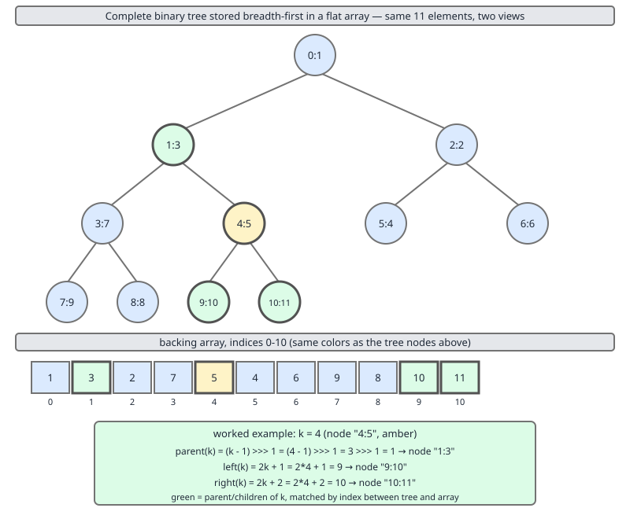
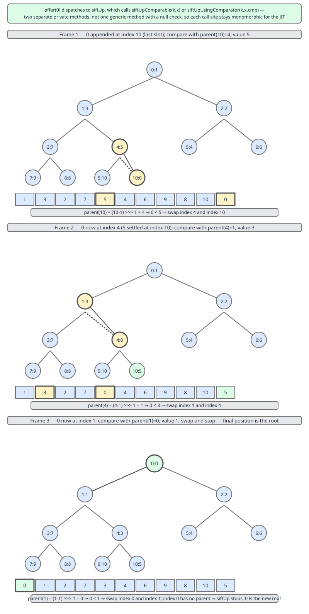
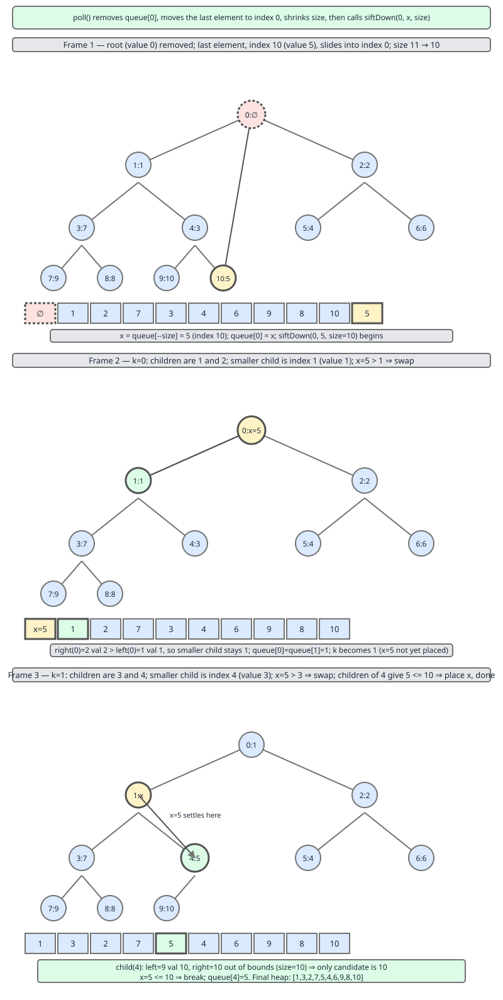
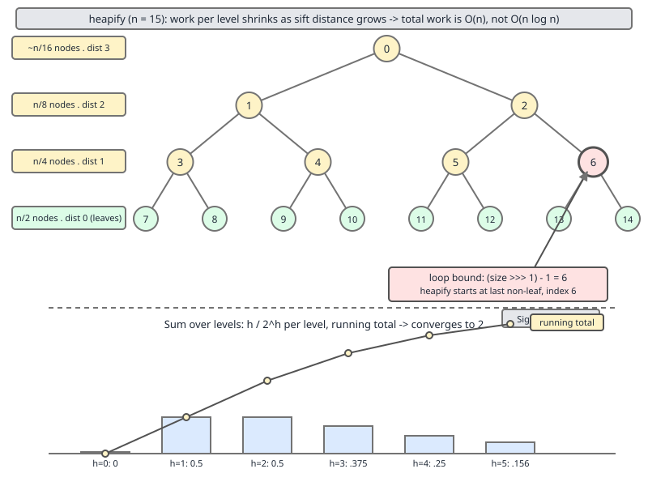

# 02 Java Collections — `PriorityQueue` — INTERNALS (§3.5.1–3.5.10 the heap, `siftUp`, `siftDown` and `heapify`)

**Target version: Java 21 LTS.** | [Index](../00-index.md)
Previous: [array-deque/03-build-my-array-deque-b-grow-iterator-and-diff.md](../array-deque/03-build-my-array-deque-b-grow-iterator-and-diff.md) · Next: [priority-queue/01b-internals-removeat-and-iteration.md](01b-internals-removeat-and-iteration.md)

`PriorityQueue` is a binary heap flattened into an `Object[]`, and the flattening is the whole trick: a complete binary tree has no gaps, so you can store it level by level in an array and compute the parent and child links with shifts instead of following pointers. No `Node` objects, no 24 bytes per element, no cache misses walking down a chain — 4 bytes per element with compressed oops, and a child is always within a short distance of its parent in memory.

It maintains exactly one property: every node is `<=` all of its descendants. That is precisely enough to make `peek()` O(1) and no more. In particular it is **not sorted**, which is where most misuse starts; that half of the story, along with `removeAt` and the iterator, is in [01b](01b-internals-removeat-and-iteration.md).

This file covers the field set, the array-to-tree mapping, `offer`/`siftUp`, `poll`/`siftDown`, and `heapify` with the constructor fast paths. Everything below is quoted from `java.base/java/util/PriorityQueue.java` in **JDK 21.0.7**, with line numbers, and every number in the transcripts is measured on that build.

---

## The field set and the one constant

```java
@SuppressWarnings("unchecked")
public class PriorityQueue<E> extends AbstractQueue<E>
    implements java.io.Serializable {

    private static final int DEFAULT_INITIAL_CAPACITY = 11;
```
— lines 86–93. (leaf 3.5.1)

**Eleven.** Not 10, not 16. It has been 11 since `PriorityQueue` shipped in Java 5, and the value is arbitrary — there is no bit trick, no power-of-two requirement, nothing derived. Eleven elements is a complete tree of depth 3 with three slots on the bottom level, which is a plausible story for the choice but is not documented as the reason.

Note `@SuppressWarnings("unchecked")` on the *class*, not on individual methods. Every element read is `(E) queue[i]` on an `Object[]`, so the suppression would otherwise be on twenty methods.

```java
    transient Object[] queue; // non-private to simplify nested class access

    int size;

    @SuppressWarnings("serial") // Conditionally serializable
    private final Comparator<? super E> comparator;

    transient int modCount;     // non-private to simplify nested class access
```
— lines 103, 108, 115, 121, Javadoc elided. (leaf 3.5.2)

| Field | Declared as | Line | Notes |
|---|---|---|---|
| `queue` | `transient Object[]` | 103 | Capacity is `queue.length`; the heap occupies `[0, size)` |
| `size` | `int` (package-private) | 108 | A real field here, unlike `ArrayDeque`'s derived size |
| `comparator` | `private final Comparator<? super E>` | 115 | `null` means natural ordering — and that `null` is load-bearing, see `siftUp` |
| `modCount` | `transient int` | 121 | Present, unlike `ArrayDeque` — so the iterator is properly fail-fast |

Three details worth fixing now. `comparator` is `final`, so the ordering of a `PriorityQueue` can never change after construction — there is no `setComparator`, and that is what makes the heap invariant meaningful for the queue's whole lifetime. It carries `@SuppressWarnings("serial")` because a `Comparator` field in a `Serializable` class is only serializable if the *actual* comparator instance is; a lambda comparator makes the whole queue unserializable at runtime with no compile-time warning at all. And `queue` is `transient` while `size` is not, so serialization writes `size` through the default mechanism and the elements through an explicit `writeObject`.

`extends AbstractQueue<E>` supplies `add`, `remove()`, `element()`, `addAll` and `clear` in terms of `offer`, `poll` and `peek` — which is why the class has only three real entry points.

---

### The array-embedded binary heap

**Mental model.** Number the nodes of a complete binary tree in breadth-first order starting at 0: root 0, its children 1 and 2, their children 3, 4, 5, 6, then the next level, then the next. Because the tree is complete — every level full except possibly the last, which fills left to right — those numbers have no gaps, so they *are* array indices. And because the numbering is regular, the links are arithmetic:

```
parent of k  =  (k - 1) >>> 1
left  of k   =  2k + 1
right of k   =  2k + 2
```

That is the entire data structure. There is no tree object anywhere in `PriorityQueue`.

**Why it exists.** A pointer-based heap costs a node per element — at `HashMap.Node` size, 32 bytes, plus three references to maintain — and every `siftDown` step is a dependent load, so a heap of a million elements takes roughly twenty cache misses per `poll`. The array version costs one reference slot per element, and a parent and its children are within `2k + 2` of each other, which for the top several levels means the same cache line. It is the `ArrayList`-versus-`LinkedList` argument applied to a tree.

**When it does not work.** When the tree is *not* complete. A red-black tree cannot be flattened this way, because it has gaps at arbitrary positions and the index arithmetic would address holes. That is the structural reason `TreeMap` uses real nodes and `PriorityQueue` does not — and, downstream, the reason a heap has no `floor`/`ceiling`/range views: the array encodes only the parent-child relation, never the sorted sequence.

**How it works.** The JDK writes the mapping into the field comment:

```java
    /**
     * Priority queue represented as a balanced binary heap: the two
     * children of queue[n] are queue[2*n+1] and queue[2*(n+1)].  The
     * priority queue is ordered by comparator, or by the elements'
     * natural ordering, if comparator is null: For each node n in the
     * heap and each descendant d of n, n <= d.  The element with the
     * lowest value is in queue[0], assuming the queue is nonempty.
     */
```
— lines 95–102. (leaf 3.5.3)

Read the invariant precisely: **for each node `n` and each descendant `d`, `n <= d`.** It says nothing about siblings, nothing about cousins, and nothing about the order of any two nodes not on the same root-to-leaf path. `queue[0]` is the minimum; `queue[1]` and `queue[2]` are in no particular order relative to each other; `queue[3]` may well be smaller than `queue[2]`.

`(k - 1) >>> 1` uses the *unsigned* shift, and that matters at the root: `k = 0` gives `(0 - 1) >>> 1 = -1 >>> 1 = 2147483647`, a large positive number rather than the `-1` that `>> 1` would produce. Neither is a valid index, so both would be a bug — which is why every caller guards with `while (k > 0)` before computing the parent. The unsigned shift keeps the expression total and non-negative for every input rather than relying on that guard alone.



Work the diagram's arithmetic for `k = 4`: parent is `(4 - 1) >>> 1 = 3 >>> 1 = 1`, children are `2·4 + 1 = 9` and `2·4 + 2 = 10`. Now check it in the tree drawing — index 4 is the second node on level 2, its parent is index 1, and its children are the last two slots of an 11-element heap. The arithmetic and the picture are the same fact.

**Insight:** the mapping is why a heap has no pointer to maintain, and therefore why `siftUp` and `siftDown` can move an element several levels with one array write per level instead of four pointer writes per level. The "swap with parent" you see in textbooks is not even a swap in the JDK — it is a one-directional shift, below.

**Interview:** "How is a `PriorityQueue` laid out?" — A complete binary tree stored breadth-first in an `Object[]`; parent of `k` is `(k - 1) >>> 1`, children are `2k + 1` and `2k + 2`; the only invariant is that every node is `<=` all of its descendants, which is why `peek` is O(1) and iteration is unsorted.

> A `PriorityQueue` is a complete binary tree flattened breadth-first into an `Object[]`, with the parent-child links computed by shifts, maintaining exactly one property: every node is less than or equal to all of its descendants.

---

### `offer` and `siftUp`, and why there are two copies of it

**Mental model.** Insertion appends at the first free slot — index `size`, the next position in breadth-first order — which keeps the tree complete but almost certainly violates the invariant on the path back to the root. `siftUp` repairs exactly that one path: compare with the parent, and while the new element is smaller, pull the parent *down* into the hole and move the hole up. When the parent is no longer greater, drop the element into the hole. At most `log₂(n)` steps, one array write per step.

**Why it exists.** Appending at the end is the only insertion point that preserves completeness, and completeness is what the index arithmetic depends on. Everything else follows.

**How it works** — `grow` first, because `offer` calls it:

```java
    private void grow(int minCapacity) {
        int oldCapacity = queue.length;
        // Double size if small; else grow by 50%
        int newCapacity = ArraysSupport.newLength(oldCapacity,
                minCapacity - oldCapacity, /* minimum growth */
                oldCapacity < 64 ? oldCapacity + 2 : oldCapacity >> 1
                                           /* preferred growth */);
        queue = Arrays.copyOf(queue, newCapacity);
    }
```
— lines 291–299. (leaf 3.5.4)

The same `< 64 ? +2 : ×1.5` policy as `ArrayDeque`, and the same reasoning: get a small queue to a useful size quickly, then switch to the memory-friendlier 1.5× factor. Unlike `ArrayDeque`, `PriorityQueue` delegates the overflow handling to `jdk.internal.util.ArraysSupport.newLength`, which is shared with `ArrayList`, `Vector` and the `java.io` streams and which clamps against `SOFT_MAX_ARRAY_LENGTH`. And unlike a deque, there is no un-wrap step — the heap always occupies `[0, size)`, so a plain `copyOf` is the whole job. Measured ladder from a default-constructed queue:

```
fresh capacity     = 11
capacity ladder    = 11 -> 24 -> 50 -> 102 -> 153 -> 229 -> 343 -> 514 -> 771
```

11 + 13 = 24, 24 + 26 = 50, 50 + 52 = 102 — the `+2` policy, slightly over doubling — then 102 + 51 = 153, and 1.5× from there.

```java
    public boolean offer(E e) {
        if (e == null)
            throw new NullPointerException();
        modCount++;
        int i = size;
        if (i >= queue.length)
            grow(i + 1);
        siftUp(i, e);
        size = i + 1;
        return true;
    }
```
— lines 323–332. (leaf 3.5.5)

Six lines, and the order of them is the interesting part. The null check comes first, for the same representational reason as `ArrayDeque`'s: `peek()` returning `null` means empty, and `queue[0] == null` is how `poll` recognises an empty queue. `modCount++` next, so a concurrent iterator fails fast even if the sift throws. `siftUp(i, e)` is called with `size` as the target index and the element as a *value* — note that `queue[i]` is not written before the call; `siftUp` places the element itself, which is what lets it avoid swaps. And `size = i + 1` happens last, after the sift has succeeded: if the comparison throws, `size` is unchanged and the queue is left consistent.

```java
    private void siftUp(int k, E x) {
        if (comparator != null)
            siftUpUsingComparator(k, x, queue, comparator);
        else
            siftUpComparable(k, x, queue);
    }

    private static <T> void siftUpComparable(int k, T x, Object[] es) {
        Comparable<? super T> key = (Comparable<? super T>) x;
        while (k > 0) {
            int parent = (k - 1) >>> 1;
            Object e = es[parent];
            if (key.compareTo((T) e) >= 0)
                break;
            es[k] = e;
            k = parent;
        }
        es[k] = key;
    }

    private static <T> void siftUpUsingComparator(
        int k, T x, Object[] es, Comparator<? super T> cmp) {
        while (k > 0) {
            int parent = (k - 1) >>> 1;
            Object e = es[parent];
            if (cmp.compare(x, (T) e) >= 0)
                break;
            es[k] = e;
            k = parent;
        }
        es[k] = x;
    }
```
— lines 635–670. (leaf 3.5.6)

**It is not a swap.** The textbook loop swaps the element with its parent and repeats, which is two writes per level. This writes the parent *down* into `es[k]` and then moves `k` up, leaving the incoming element in a register the whole time; only when the loop ends does it write the element once. For a sift of `d` levels: `d + 1` array writes instead of `2d`, and `d` comparisons either way. The hole moves up; the element never moves until it lands.

`key.compareTo((T) e) >= 0` breaks on `>= 0`, meaning **equal stops the climb**. An element equal to its parent stays below it — which is one half of why the heap is not stable, taken up in [02](02-internals-b-traps.md).

**The duplication is deliberate, and it is about the JIT.** The two bodies are character-for-character identical except that one calls `Comparable.compareTo` on the element and the other calls `Comparator.compare` on a captured comparator. The class comment at lines 626–632 says so:

```java
    /**
     * To simplify and speed up coercions and comparisons, the
     * Comparable and Comparator versions are separated into different
     * methods that are otherwise identical. (Similarly for siftDown.)
     */
```

Written as one method with an `if (comparator != null)` *inside* the loop, the branch would sit in the hot path. Written as one method taking a `Comparator` and wrapping natural ordering in `Comparator.naturalOrder()`, that single call site would see whatever comparator implementations the application uses — often three or four distinct ones in the same JVM — and go megamorphic, at which point HotSpot stops inlining and emits a virtual dispatch per comparison. Split, each method's call site is monomorphic per receiver type, so the comparison inlines into the loop and the loop can then be unrolled. It is one of the clearest examples in `java.util` of source-level duplication bought with JIT behaviour.



Follow the hole across the three frames rather than the element. In each frame the parent's value has moved *down* one level and the hole has moved *up*; the incoming element appears only in the final frame, written once.

**Interview:** "Why does `PriorityQueue` have `siftUpComparable` and `siftUpUsingComparator` when they are the same code?" — So each call site stays monomorphic and the comparison inlines. A single generic path would either put a branch in the loop or make the comparator call megamorphic across an application's several comparator types, and HotSpot would stop inlining it.

> `offer` appends at index `size` to keep the tree complete, then `siftUp` walks the single path to the root shifting parents *down* into the hole — `d + 1` array writes for a `d`-level climb — and the method is duplicated into `Comparable` and `Comparator` variants so each call site stays monomorphic.

---

### `poll` and `siftDown`, and the child you must pick first

**Mental model.** The minimum is `queue[0]`, so removal is easy to *find* and awkward to *repair*: taking the root leaves a hole at the top, and the only element you can move without breaking completeness is the last one. So `poll` moves the last element to the root and sinks it. Sinking is harder than climbing, because a node has two children and you must sink through the *smaller* one — otherwise you place a value above a child smaller than it and the invariant is still violated one level down.

**How it works.**

```java
    public E poll() {
        final Object[] es;
        final E result;

        if ((result = (E) ((es = queue)[0])) != null) {
            modCount++;
            final int n;
            final E x = (E) es[(n = --size)];
            es[n] = null;
            if (n > 0) {
                final Comparator<? super E> cmp;
                if ((cmp = comparator) == null)
                    siftDownComparable(0, x, es, n);
                else
                    siftDownUsingComparator(0, x, es, n, cmp);
            }
        }
        return result;
    }
```
— lines 571–589. (leaf 3.5.7)

The emptiness test is `queue[0] != null`, folded into the assignment that also fetches the result — one array load doing both jobs, the same trick `ArrayDeque.pollFirst` uses, and the reason nulls are banned. `n = --size` both decrements the size and names the last index; `es[n] = null` releases that slot so the moved element is not reachable twice. The `if (n > 0)` guard covers the single-element case, where the last element *is* the root and there is nothing to sink. Note that `poll` inlines the comparator dispatch rather than calling the private `siftDown(int, E)` wrapper — one less frame on the hottest path in the class.

```java
    private static <T> void siftDownComparable(int k, T x, Object[] es, int n) {
        // assert n > 0;
        Comparable<? super T> key = (Comparable<? super T>)x;
        int half = n >>> 1;           // loop while a non-leaf
        while (k < half) {
            int child = (k << 1) + 1; // assume left child is least
            Object c = es[child];
            int right = child + 1;
            if (right < n &&
                ((Comparable<? super T>) c).compareTo((T) es[right]) > 0)
                c = es[child = right];
            if (key.compareTo((T) c) <= 0)
                break;
            es[k] = c;
            k = child;
        }
        es[k] = key;
    }
```
— lines 683–701. (leaf 3.5.8)

`half = n >>> 1` is the index of the first leaf: in a complete tree of `n` nodes, indices `[n/2, n)` have no children, so the loop condition `k < half` reads "still a non-leaf" and needs no separate bounds check on `child`.

The smaller-child selection is the two lines that matter. `child` is assumed to be the left one; then, **only if a right child exists** (`right < n` — the last non-leaf may have just one), the two children are compared and `c`/`child` are reassigned to the right one if the left is larger. That is one comparison to pick the child plus one to decide whether to descend: **two comparisons per level, not one.** It is why `siftDown` costs roughly `2 log₂ n` comparisons while `siftUp` costs `log₂ n`, and therefore why `offer` is cheaper than `poll` in practice even though both are O(log n).

`if (key.compareTo((T) c) <= 0) break` — `<=` again, so equal stops the descent. And as in `siftUp`, the loop shifts the child *up* into the hole rather than swapping.



The diagram marks the smaller-child pick explicitly in each frame — that is the step people leave out when writing a heap from memory, and it is the one that silently produces a structure that mostly works.

**Insight:** the asymmetry between the two sifts explains a real cost model. Filling a heap with `n` offers is `O(n log n)` worst case but close to `O(n)` in practice, because a random new element is usually large and stops after one or two comparisons. Draining it with `n` polls is `Θ(n log n)` with no such luck, because the element moved to the root is by construction one of the largest and sinks nearly all the way back down. A heap sort's cost is dominated by the drain, not the build — which is what `heapify` exploits, next.

> `poll` returns `queue[0]`, moves the last element into the hole and sinks it; each level costs *two* comparisons — one to choose the smaller child, one to decide whether to descend — so `poll` is about twice as comparison-heavy per level as `offer`.

---

### `heapify` in O(n), and the constructor fast paths

**Mental model.** Building a heap by offering `n` elements one at a time is `O(n log n)`. Building it in place from an arbitrary array is `O(n)` — and the reason is a counting argument, not a cleverer algorithm. Sift *down* from the last non-leaf backwards to the root. Half the nodes are leaves and cost nothing. A quarter are one level above the leaves and can sink at most one level. An eighth can sink at most two. The work is `Σ (n/2^{h+1}) · h` over heights `h`, and that sum converges.

**How it works.**

```java
    private void heapify() {
        final Object[] es = queue;
        int n = size, i = (n >>> 1) - 1;
        final Comparator<? super E> cmp;
        if ((cmp = comparator) == null)
            for (; i >= 0; i--)
                siftDownComparable(i, (E) es[i], es, n);
        else
            for (; i >= 0; i--)
                siftDownUsingComparator(i, (E) es[i], es, n, cmp);
    }
```
— lines 725–736. (leaf 3.5.9)

`i = (n >>> 1) - 1` is the last non-leaf, and the loop runs *backwards* to 0. Backwards is essential: when `siftDownComparable(i, es[i], es, n)` runs, both subtrees of `i` are already valid heaps, which is the precondition `siftDown` needs. Forwards it would be sinking into unheapified subtrees and the result would be wrong. Note the comparator test is hoisted *outside* the loop — the same monomorphism discipline, applied at the loop level.

**Working the bound.** Index the levels by height `h`, where leaves have `h = 0`. A complete tree has at most `⌈n / 2^{h+1}⌉` nodes at height `h`, and a node at height `h` can sink at most `h` levels, each level costing a bounded number of comparisons. Total work is bounded by

```
Σ_{h=0}^{log n}  (n / 2^{h+1}) · h   =   (n/2) · Σ_{h=0}^{log n} h / 2^h
```

and the series `Σ_{h≥0} h / 2^h` converges to **2** — the standard identity `Σ h x^h = x/(1-x)²` at `x = 1/2` gives `(1/2)/(1/4) = 2`. So the total is bounded by `(n/2) · 2 = n`. Linear, with a small constant.

The counterintuitive part is that this is *not* the same sum as the insert-one-at-a-time build. There, each element enters at a leaf position and climbs, and half of all nodes are at the bottom level where the climb is the *longest* — so the expensive case is the common one, and the sum is `Θ(n log n)`. `heapify` inverts the distribution: the expensive case, sinking from near the root, applies to the fewest nodes. Same tree, same per-level cost, opposite distribution.

The same series is derived at more length in [array-list/04](../array-list/04-amortised-analysis.md), which owns leaf 3.2.13 and measures the comparison count landing near `2n` rather than near `n log n = 20n` — the `2` being exactly the constant this sum converges to. If the two derivations ever disagree, that file is the authority.



The bar chart is the argument. Each bar is `h / 2^h`; the running total climbs to 2 and stops. That constant 2 is the whole O(n) result.

**The constructor fast paths** (leaf 3.5.10). `new PriorityQueue<>(Collection)` has three routes:

```java
    private void initFromPriorityQueue(PriorityQueue<? extends E> c) {
        if (c.getClass() == PriorityQueue.class) {
            this.queue = ensureNonEmpty(c.toArray());
            this.size = c.size();
        } else {
            initFromCollection(c);
        }
    }

    private void initElementsFromCollection(Collection<? extends E> c) {
        Object[] es = c.toArray();
        int len = es.length;
        if (c.getClass() != ArrayList.class)
            es = Arrays.copyOf(es, len, Object[].class);
        if (len == 1 || this.comparator != null)
            for (Object e : es)
                if (e == null)
                    throw new NullPointerException();
        this.queue = ensureNonEmpty(es);
        this.size = len;
    }

    private void initFromCollection(Collection<? extends E> c) {
        initElementsFromCollection(c);
        heapify();
    }
```
— lines 254–284.

| Argument | Route | `heapify` called? | Why |
|---|---|---|---|
| a `PriorityQueue` of exactly class `PriorityQueue` | `initFromPriorityQueue` | **no** | its array is already heap-ordered by the same comparator |
| a `SortedSet` | `initElementsFromCollection` | **no** | ascending order is a valid heap, trivially |
| any other `Collection` | `initFromCollection` | **yes** | arbitrary order, O(n) repair |
| a `PriorityQueue` *subclass* | `initFromCollection` | **yes** | a subclass may have overridden `toArray`, so its order cannot be trusted |

The `getClass() == PriorityQueue.class` test rather than `instanceof` is the interesting one: `instanceof` would accept a subclass whose `toArray` returns the elements in some other order, and the constructor would then build a queue that silently violates its invariant with no exception ever thrown. The `getClass() != ArrayList.class` test next door is the array-covariance defence — `c.toArray()` is not contractually required to return an `Object[]`, so a `String[]` could come back and the first `offer` of a non-`String` would throw `ArrayStoreException` from deep inside `siftUp`. Same hole as [D-02](../diagrams/D-02-array-covariance-hole.svg).

The null check is subtler: it runs only when `len == 1` **or** a comparator is present. Otherwise the nulls are caught by `heapify`'s first `compareTo` call, which throws `NullPointerException` anyway; the explicit loop exists for the two cases where no comparison would happen — a single element, which `heapify` skips entirely — or where a tolerant comparator might let one slip through.

Measured. The same nine-element input three ways:

```
heapify array      = [1, 3, 2, 4, 8, 7, 6, 9, 5]
offer-loop array   = [1, 3, 2, 4, 8, 7, 6, 9, 5]
both valid heaps   = true
from TreeSet array = [1, 2, 3, 4, 5, 6, 7, 8, 9]
```

Two things there. `heapify` and the offer loop happen to agree on this input, which is a coincidence and not a guarantee — a heap is not unique, and the two routes are only required to produce *some* valid heap. And the `TreeSet` route stored the sorted array untouched: an ascending sequence satisfies "every node `<=` its descendants" for free, so no work was done at all.

> `heapify` sinks from the last non-leaf backwards to the root, and is O(n) because the number of nodes at height `h` falls as `n/2^{h+1}` while the maximum sink distance only rises as `h` — and `Σ h/2^h` converges to 2. The `Collection` constructor skips it entirely for a `PriorityQueue` of exactly that class, or for a `SortedSet`.

---

## Pitfalls

### Assuming `heapify` and an offer loop produce the same array

**Wrong**

```java
var a = new PriorityQueue<>(List.of(9, 4, 7, 1, 8, 2, 6, 3, 5));
var b = new PriorityQueue<Integer>();
List.of(9, 4, 7, 1, 8, 2, 6, 3, 5).forEach(b::offer);
assertEquals(a.toString(), b.toString());
```

On this particular input both give `[1, 3, 2, 4, 8, 7, 6, 9, 5]` — measured — so the assertion passes and the test looks correct. Change one element and it fails, because a valid heap is not unique and the two construction routes are only required to produce *some* heap satisfying the invariant.

**Right**

```java
// compare drained order, which IS specified
static <E extends Comparable<E>> List<E> drain(PriorityQueue<E> q) {
    List<E> out = new ArrayList<>(q.size());
    PriorityQueue<E> copy = new PriorityQueue<>(q);
    while (!copy.isEmpty()) out.add(copy.poll());
    return out;
}
assertEquals(drain(a), drain(b));
```

**Why people believe it:** the coincidence is common at small sizes, and nothing in the API hints that the array layout is unspecified.

### Reaching for an offer loop when you have the whole collection

**Wrong**

```java
PriorityQueue<Event> q = new PriorityQueue<>(comparator);
for (Event e : allEvents) q.offer(e);        // O(n log n), plus ~9 array copies
```

For a million events starting from the default capacity of 11, that is `Θ(n log n)` comparisons *and* the full growth ladder — every element copied between two and three times over as the array climbs 11 → 24 → 50 → 102 and onward.

**Right**

```java
PriorityQueue<Event> q = new PriorityQueue<>(allEvents.size(), comparator);
q.addAll(allEvents);                          // still O(n log n), but one allocation
```

or, when the comparator is natural ordering, let the `Collection` constructor take the `heapify` path:

```java
PriorityQueue<Event> q = new PriorityQueue<>(allEvents);   // O(n), one allocation
```

**Why people believe it:** `addAll` on a `PriorityQueue` really is an offer loop — `AbstractQueue.addAll` calls `add` per element — so the only route to the O(n) build is the `Collection` constructor. That asymmetry is undocumented and surprising.

### Serializing a `PriorityQueue` with a lambda comparator

**Wrong**

```java
var q = new PriorityQueue<Task>(Comparator.comparingInt(Task::prio));
new ObjectOutputStream(out).writeObject(q);
```

Output, measured — the lambda's synthetic class name, and nothing else to go on:

```
java.io.NotSerializableException: SerTest$$Lambda/0x0000007001000bf0
```

The queue itself is `Serializable`, the field is declared `Comparator<? super E>`, and nothing warns you at compile time — the JDK marks the field `@SuppressWarnings("serial") // Conditionally serializable` precisely because the compiler cannot tell.

**Right**

```java
// a named, serializable comparator
static final class ByPriority implements Comparator<Task>, Serializable {
    private static final long serialVersionUID = 1L;
    @Override public int compare(Task a, Task b) {
        return Integer.compare(a.prio(), b.prio());
    }
}
var q = new PriorityQueue<Task>(new ByPriority());
```

**Why people believe it:** `PriorityQueue implements java.io.Serializable`, so the type says yes. Serializability of a collection is always conditional on its contents — and here also on its comparator.

---

## Cheat sheet

| Fact | Value |
|---|---|
| `DEFAULT_INITIAL_CAPACITY` | **11** (line 93) — arbitrary, unchanged since Java 5 |
| Fields | `Object[] queue` (transient), `int size`, `final Comparator comparator`, `transient int modCount` |
| Base class | `AbstractQueue<E>`; `add`/`remove()`/`element()`/`addAll` derive from `offer`/`poll`/`peek` |
| Invariant | for every node `n` and descendant `d`, `n <= d`. Nothing about siblings |
| Index mapping | parent `(k - 1) >>> 1`, left `2k + 1`, right `2k + 2` |
| First leaf | index `size >>> 1` |
| Growth | `ArraysSupport.newLength(old, min, old < 64 ? old + 2 : old >> 1)` |
| Capacity ladder | 11 → 24 → 50 → 102 → 153 → 229 → 343 → 514 → 771 |
| `offer` order of operations | null check, `modCount++`, grow, `siftUp`, **then** `size = i + 1` |
| `siftUp` cost | `log₂ n` comparisons, `d + 1` array writes — shifts parents down, no swaps |
| `siftDown` cost | ~`2 log₂ n` comparisons — one to pick the smaller child, one to descend |
| Equal elements | `>= 0` in `siftUp`, `<= 0` in `siftDown` — equal stops the move, hence no stability |
| Why two sift methods | JIT monomorphism; a merged version goes megamorphic on `Comparator` |
| `heapify` | `for (i = (n >>> 1) - 1; i >= 0; i--) siftDown(i, es[i])`, **backwards**, O(n) |
| O(n) proof | `Σ (n/2^{h+1})·h = (n/2)·Σ h/2^h`, and `Σ h/2^h = 2` |
| Ctor fast path | skips `heapify` for `getClass() == PriorityQueue.class` or a `SortedSet` |
| `addAll` | an offer loop, `O(n log n)` — only the `Collection` constructor gets you O(n) |
| Nulls | rejected — `queue[0] == null` is the emptiness test |
| Serialization | `queue` is transient; a lambda comparator makes the queue unserializable at runtime |

---

## Self-test

**Q1.** Why is the parent computed with `>>>` rather than `>>`?

<details><summary>Answer</summary>

For `k = 0`, `(0 - 1) >> 1` is `-1` and `(0 - 1) >>> 1` is `2147483647`. Neither is a valid index, so the guard `while (k > 0)` in `siftUp` is what actually keeps the code safe — but the unsigned shift keeps the expression total and non-negative for every input, so it cannot silently produce a negative index if a future caller forgets the guard. Defensive arithmetic rather than a correctness requirement of the current callers.

</details>

**Q2.** `siftUp` and `siftDown` are each written twice, character for character identical except the comparison. Why not one method?

<details><summary>Answer</summary>

JIT monomorphism, and the class comment at lines 626–632 says so. A merged method needs either an `if (comparator != null)` inside the loop — a branch in the hottest code in the class — or a uniform `Comparator` path with natural ordering wrapped in `Comparator.naturalOrder()`. The second is worse: a real application uses several comparator implementations, so that one call site sees several receiver types, goes megamorphic, and HotSpot stops inlining the comparison. Split, each method's call site is monomorphic per receiver type, so the comparison inlines into the loop and the loop can be unrolled.

</details>

**Q3.** Why is `poll` roughly twice as comparison-heavy per level as `offer`?

<details><summary>Answer</summary>

Because sinking has to choose a direction and climbing does not. `siftUp` compares the element with its single parent: one comparison per level. `siftDown` compares the two children with each other to find the smaller (`right < n && c.compareTo(es[right]) > 0`), then compares the element with that child to decide whether to descend: two comparisons per level. On top of that, the element `poll` sinks is the *last* element of the heap, which is by construction one of the largest, so it typically sinks nearly the full depth — whereas a random element offered into a heap is usually large and stops after one or two levels.

</details>

**Q4.** Work out why `heapify` is O(n) while `n` successive `offer` calls are O(n log n).

<details><summary>Answer</summary>

Both do the same amount of work *per level moved*; the difference is how the movement is distributed over the nodes. In `heapify`, a node at height `h` can sink at most `h` levels, and a complete tree has at most `n/2^{h+1}` nodes at height `h` — so the expensive nodes are the rare ones. Total work is `Σ_h (n/2^{h+1})·h = (n/2)·Σ_h h/2^h`, and `Σ_{h≥0} h/2^h = 2` (from `Σ h x^h = x/(1-x)²` at `x = 1/2`), giving a bound of `n`. In the offer loop, each element enters at a *leaf* position and climbs, and half of all nodes are leaves — so the longest possible movement applies to the largest group of nodes, and the sum is `Θ(n log n)`. Same tree, inverted distribution.

</details>

**Q5.** `new PriorityQueue<>(collection)` — when does it skip `heapify`, and why is the test `getClass() == PriorityQueue.class` rather than `instanceof PriorityQueue`?

<details><summary>Answer</summary>

It skips `heapify` in two cases: the argument is a `PriorityQueue` of *exactly* that class, so its array is already heap-ordered; or the argument is a `SortedSet`, whose ascending order trivially satisfies "every node `<=` its descendants". The exact-class test matters because a `PriorityQueue` subclass may override `toArray` and return the elements in some other order — `instanceof` would accept it, the constructor would adopt the array unheapified, and the queue would silently violate its invariant. Note the matching defence next door: `getClass() != ArrayList.class` triggers `Arrays.copyOf(es, len, Object[].class)`, because `toArray()` is not contractually required to return an `Object[]` and a narrower array would blow up with `ArrayStoreException` inside a later `siftUp`.

</details>

**Q6.** Why does `offer` set `size = i + 1` *after* `siftUp` rather than before, while `modCount++` happens first?

<details><summary>Answer</summary>

Exception safety, from both directions. `siftUp` calls `compareTo` or `compare`, either of which can throw — `ClassCastException` on a non-`Comparable` element, `NullPointerException` from a comparator, or any application exception from a user comparator. If `size` had already been incremented, the queue would claim an element sitting in an arbitrary position with the invariant broken, and every subsequent operation would read a corrupt heap. Set last, an exception leaves `size` unchanged and the queue exactly as it was. `modCount++` goes first for the opposite reason: a live iterator must fail fast whether or not the insertion succeeded, because the array *was* touched.

</details>

**Q7.** You have a `List` of a million elements and want a min-heap over them. Compare the three ways.

<details><summary>Answer</summary>

`new PriorityQueue<>(list)` is O(n): one `toArray`, one defensive `Arrays.copyOf` unless the list is exactly an `ArrayList`, and one `heapify`. `new PriorityQueue<>(list.size()); q.addAll(list)` is `O(n log n)` — `AbstractQueue.addAll` is an offer loop — but at least it allocates the array once. The default-constructor offer loop is `O(n log n)` *plus* the whole growth ladder from capacity 11, so roughly nine `Arrays.copyOf` calls and every element copied two to three times over. Only the first route reaches the linear build, and only when the comparator is natural ordering, since the `Collection` constructor takes no comparator argument.

</details>

**Q8.** A queue is built from a `TreeSet` of `1..9`. What is in the backing array, and why was no work done?

<details><summary>Answer</summary>

`[1, 2, 3, 4, 5, 6, 7, 8, 9]` — measured — exactly the `TreeSet`'s ascending iteration order, stored untouched. `initElementsFromCollection` copies the array and stops; `heapify` is never called, because an ascending sequence already satisfies the heap invariant: for any index `k`, `queue[k] <= queue[2k+1]` and `queue[k] <= queue[2k+2]` follow immediately from `2k+1 > k` and ascending order. A sorted array is always a valid heap; the converse is emphatically false.

</details>

---

**Leaves covered:** 3.5.1–3.5.10 (10 leaves)
**Leaves deferred:** none — 3.5.11, 3.5.12 and 3.5.13 are covered in [01b-internals-removeat-and-iteration.md](01b-internals-removeat-and-iteration.md)
**Diagrams included:** D-80, D-81, D-82, D-83
**Target version:** Java 21 LTS
**Lines:** 563
