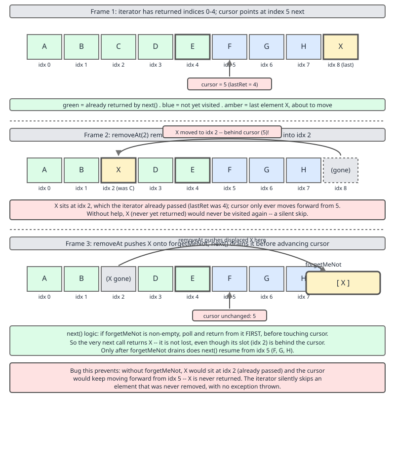

# 02 Java Collections — `PriorityQueue` — INTERNALS (§3.5.11–3.5.13 `removeAt`, `forgetMeNot`, and why iteration is not sorted)

**Target version: Java 21 LTS.** | [Index](../00-index.md)
Previous: [priority-queue/01-internals-a-heap.md](01-internals-a-heap.md) · Next: [priority-queue/02-internals-b-traps.md](02-internals-b-traps.md)

Part two of the `PriorityQueue` source walk. [01](01-internals-a-heap.md) covered the array-embedded heap, `offer`/`siftUp`, `poll`/`siftDown` and the O(n) `heapify`. This file covers what happens when you remove something that is *not* the minimum, the surprising machinery the iterator needs as a result, and the single most consequential fact about the class: the sequence you can see is not the sequence you get.

Everything below is quoted from `java.base/java/util/PriorityQueue.java` in **JDK 21.0.7**, with line numbers.

---

### `removeAt`, and the element that ends up behind the cursor

**Mental model.** Removing an arbitrary element from the middle of a heap is `removeAt(i)`: move the last element into slot `i` and repair. The repair may need to sink it *or* to climb it, because slot `i` is somewhere in the middle and the last element could well be smaller than `i`'s parent. And if it climbs, it has just moved to a position *before* `i` — behind an iterator that has already passed `i`. That element would then never be returned.

**Why it exists.** `Iterator.remove()`, `remove(Object)` and `removeIf` all need arbitrary-position removal, and the `Iterator` contract promises every element is handed out exactly once. A heap's repair step can move an element arbitrarily far in either direction, so the iterator cannot simply adjust its cursor the way `ArrayDeque`'s does.

**When it matters.** Any time you remove through an iterator, or use `removeIf`, or call `remove(Object)` while iterating. Also any time you write your own heap and wonder why the JDK's iterator has a spare deque in it.

**How it works.**

```java
    E removeAt(int i) {
        // assert i >= 0 && i < size;
        final Object[] es = queue;
        modCount++;
        int s = --size;
        if (s == i) // removed last element
            es[i] = null;
        else {
            E moved = (E) es[s];
            es[s] = null;
            siftDown(i, moved);
            if (es[i] == moved) {
                siftUp(i, moved);
                if (es[i] != moved)
                    return moved;
            }
        }
        return null;
    }
```
— lines 603–621. (leaf 3.5.11)

A three-way outcome encoded in one return value.

1. `s == i` — the element being removed *was* the last one. Null the slot; nothing to repair.
2. Otherwise, move the last element in and `siftDown(i, moved)`. If it sank, `es[i]` now holds something else, so `es[i] == moved` is false and the method returns `null`: nothing before `i` changed.
3. If it did **not** sink, `es[i] == moved` is true, so try `siftUp(i, moved)`. If that moved it, `es[i] != moved`, and the moved element now sits at some index `< i`. Return it.

So the contract is: **`null` means "nothing before index `i` was disturbed"; a non-null return is the element that was relocated backwards past `i`.** The Javadoc states it at lines 592–602 — "Occasionally, in order to maintain the heap invariant, it must swap a later element of the list with one earlier than i. Under these circumstances, this method returns the element that was previously at the end of the list and is now at some position before i. This fact is used by iterator.remove so as to avoid missing traversing elements."

Note the `es[i] == moved` identity comparisons. Not `equals` — reference identity, because the question is "is this the same object I put there", and two equal-but-distinct elements must not be confused.

The iterator's side:

```java
        private ArrayDeque<E> forgetMeNot;
        private E lastRetElt;

        public boolean hasNext() {
            return cursor < size ||
                (forgetMeNot != null && !forgetMeNot.isEmpty());
        }

        public void remove() {
            if (expectedModCount != modCount)
                throw new ConcurrentModificationException();
            if (lastRet != -1) {
                E moved = PriorityQueue.this.removeAt(lastRet);
                lastRet = -1;
                if (moved == null)
                    cursor--;
                else {
                    if (forgetMeNot == null)
                        forgetMeNot = new ArrayDeque<>();
                    forgetMeNot.add(moved);
                }
            } else if (lastRetElt != null) {
                PriorityQueue.this.removeEq(lastRetElt);
                lastRetElt = null;
            } else {
                throw new IllegalStateException();
            }
            expectedModCount = modCount;
        }
```
— lines 496, 502, 511–516 and 536–556.

`moved == null` is the ordinary case: something sank into `lastRet`, so the cursor steps back one to visit it. `moved != null` is the awkward case: the element is now behind the cursor, so it is stashed on a lazily-allocated `ArrayDeque<E> forgetMeNot` and delivered after the main array walk finishes. `hasNext()` accounts for both queues, which is why it is not simply `cursor < size`.

The field's own comment is worth reading, at lines 484–495: "A queue of elements that were moved from the unvisited portion of the heap into the visited portion as a result of 'unlucky' element removals during the iteration. … We expect that most iterations, even those involving removals, will not need to store elements in this field." Hence the lazy allocation: the common path never creates the deque at all.

`lastRetElt` handles removal of an element that *came from* `forgetMeNot` and therefore has no array index — hence `removeEq`, an identity-based (`==`) scan rather than the `equals`-based `remove(Object)`. And note the `ArrayDeque<E>` inside `PriorityQueue.Itr`: one `java.util` collection reaching for another, which is also why `forgetMeNot` cannot hold nulls and never needs to.



A measured case, found by searching random heaps for one where `removeAt` actually returns non-null — the situation is rare enough that a hand-picked example usually misses it:

```
input   = [18, 6, 46, 34, 25, 80, 73, 47, 33, 95, 12]
heap    = [6, 12, 46, 33, 18, 80, 73, 47, 34, 95, 25]
removeAt(5) returned 25
after   = [6, 12, 25, 33, 18, 46, 73, 47, 34, 95]
visited (with remove at step 5) = [6, 12, 46, 33, 18, 80, 73, 47, 34, 95, 25]  count 11
```

Trace it. The iterator's sixth `next()` returns `80` at index 5, and `remove()` calls `removeAt(5)`. The last element, `25`, moves into slot 5. `siftDown` cannot move it — index 5's children would be 11 and 12, past the new size of 10 — so `es[5] == moved` holds and `siftUp` runs. `25` is smaller than its parent `46` at index 2, so `46` shifts down into slot 5 and `25` lands at index 2. Index 2 is behind the cursor, which had already returned `46` as its third element. `removeAt` returns `25`; the iterator stashes it; the walk then continues through the array (`73`, `47`, `34`, `95`) and finishes by draining the stash, delivering all eleven.

**Insight:** compare the two fixes for the same class of problem. `ArrayDeque.delete` also relocates an unvisited element into visited territory, but always by exactly one position in a direction it can report as a boolean — so its iterator just steps the cursor back. A heap repair can move an element several levels in one go, to an index the iterator has no way to compute, so the element itself has to be carried. Same bug, two different shapes of fix, decided by how far the displacement can be.

**Pitfall:** the wrong belief is that a heap iterator can be a plain `for (int i = 0; i < size; i++)` because the array is contiguous. The symptom is `removeIf` and `Iterator.remove` silently dropping elements — no exception, no warning, just a collection that quietly retains items the predicate should have deleted and skips items the caller should have seen. The fix is `removeAt`'s return value plus somewhere to put the displaced element.

**Interview:** "What is `forgetMeNot` in `PriorityQueue.Itr`?" — A lazily-allocated `ArrayDeque` holding elements that a mid-iteration removal pushed *backwards* past the cursor. `removeAt` returns such an element instead of `null`; the iterator stashes it and delivers it after the array walk, so the `Iterator` contract of "each element exactly once" survives structural repair.

> `removeAt(i)` returns `null` when nothing before `i` moved, and returns the relocated element when the repair climbed it past `i`; the iterator stashes that element on a lazily-created `forgetMeNot` deque so that no element is skipped.

---

### Iteration is array order, and array order is not sorted order

**Mental model.** The heap invariant constrains only root-to-leaf paths. Two nodes in different subtrees have no defined relationship, so the array is not sorted, not nearly sorted, and not sorted-with-a-few-swaps. The only thing you can rely on is `queue[0]`.

**Why it matters.** Because `Itr.next()` is a bare array walk, and *everything* that reads a `Collection` as a sequence goes through it: `toString`, the enhanced-for loop, `forEach`, `stream()`, `toArray()`, `new ArrayList<>(pq)`, `String.join`, Jackson's serializer, an assertion in a test. Each one gives heap order.

**How it works.**

```java
        public E next() {
            if (expectedModCount != modCount)
                throw new ConcurrentModificationException();
            if (cursor < size)
                return (E) queue[lastRet = cursor++];
            if (forgetMeNot != null) {
                lastRet = -1;
                lastRetElt = forgetMeNot.poll();
                if (lastRetElt != null)
                    return lastRetElt;
            }
            throw new NoSuchElementException();
        }
```
— lines 519–534. (leaf 3.5.13)

`queue[lastRet = cursor++]`. No comparison, no ordering, no lookahead. `PriorityQueue` does not override `toString`, so `AbstractCollection.toString` walks that iterator; it does not override `spliterator` in a way that reorders either — `PriorityQueueSpliterator` (line 843) splits the index range at its midpoint, so parallel streams see heap order in arbitrary chunks. Measured:

```
array after offers  = [1, 3, 2, 5, 9, 8, 7]
toString            = [1, 3, 2, 5, 9, 8, 7]
iteration order     = [1 3 2 5 9 8 7]
poll order          = 1 2 3 5 7 8 9
```

Inserted in the order `5, 1, 8, 3, 9, 2, 7`. The first element is right — it is always the minimum — and everything after it is a trap: `3` before `2`, `9` before `8` and `7`.

**The lookup methods have the same root cause** (leaf 3.5.12):

```java
    private int indexOf(Object o) {
        if (o != null) {
            final Object[] es = queue;
            for (int i = 0, n = size; i < n; i++)
                if (o.equals(es[i]))
                    return i;
        }
        return -1;
    }
```
— lines 339–347.

O(n), not O(log n), and there is no way to do better: pruning a search needs to know which subtree a value could be in, and the invariant says nothing about that. `contains(Object)` is `indexOf(o) >= 0`. `remove(Object)` is `indexOf` followed by `removeAt`, so O(n) to find and O(log n) to repair — the find dominates. Measured on the seven-element queue above, `contains(6)` is `false` (6 was never inserted) and `remove(8)` is `true`, leaving `[1, 3, 2, 5, 9, 7]` with `peek()` still `1`.

| Operation | Cost | Why |
|---|---|---|
| `peek` | O(1) | `queue[0]` |
| `offer` | O(log n), `log₂ n` comparisons | one path to the root |
| `poll` | O(log n), ~`2 log₂ n` comparisons | one path down, two comparisons per level |
| `contains` / `indexOf` | **O(n)** | nothing to prune on |
| `remove(Object)` | **O(n)** find + O(log n) repair | `indexOf` then `removeAt` |
| `iterator()` / `toString` / `stream` | O(n), **unsorted** | bare array walk |
| construction from a `Collection` | O(n) | `heapify` |
| construction by offer loop | O(n log n) | plus the growth ladder |

**Interview:** "Is `PriorityQueue` iteration sorted?" — No. Only element 0 is guaranteed; `iterator()`, `toString`, `forEach`, `stream()` and `toArray()` all give heap order, which constrains root-to-leaf paths only. The single sorted view a heap offers is a destructive drain by repeated `poll`.

> The heap invariant orders only root-to-leaf paths, so array order is meaningful at index 0 and nowhere else; `Itr.next()` is `queue[cursor++]`, which makes every sequence-reading API on the class — including `toString`, `stream` and `toArray` — unsorted.

---

## Pitfalls

### Reading a `PriorityQueue` as if it were sorted

**Wrong**

```java
PriorityQueue<Integer> pq = new PriorityQueue<>(List.of(5, 1, 8, 3, 9, 2, 7));
System.out.println(pq);
System.out.println(pq.stream().toList());
System.out.println(new ArrayList<>(pq));
```

Output — all three the same, and none of them sorted:

```
[1, 2, 5, 3, 9, 8, 7]
[1, 2, 5, 3, 9, 8, 7]
[1, 2, 5, 3, 9, 8, 7]
```

Only index 0 is meaningful. The rest is heap order.

**Right**

```java
// drain it, which is the only sorted view a heap offers
List<Integer> sorted = new ArrayList<>(pq.size());
PriorityQueue<Integer> copy = new PriorityQueue<>(pq);   // O(n), keeps the original
while (!copy.isEmpty()) sorted.add(copy.poll());         // O(n log n)

// or sort a snapshot, if you only need the order once
List<Integer> snapshot = new ArrayList<>(pq);
snapshot.sort(null);                                     // TimSort, O(n log n)
```

**Why people believe it:** the first element *is* always the minimum, so the printed output looks plausible at small sizes and on lucky inputs, and `toString` is the first thing anyone does in a REPL. `TreeSet` and `TreeMap` sitting in the same package and really iterating in order reinforces it.

### Asserting on `toString` or on iteration order in a test

**Wrong**

```java
@Test void ordersByPriority() {
    var q = new PriorityQueue<Integer>();
    List.of(5, 1, 8, 3).forEach(q::offer);
    assertEquals("[1, 3, 8, 5]", q.toString());     // passes today
}
```

Output: green, and worthless. The array layout is unspecified — nothing in the javadoc promises it, `heapify` and an offer loop can legitimately disagree on it, and a future JDK could change `siftUp`'s shift order without breaking any contract. The test locks in an implementation detail and will fail on an upgrade for no real reason.

**Right**

```java
@Test void ordersByPriority() {
    var q = new PriorityQueue<Integer>();
    List.of(5, 1, 8, 3).forEach(q::offer);
    List<Integer> drained = new ArrayList<>();
    while (!q.isEmpty()) drained.add(q.poll());
    assertEquals(List.of(1, 3, 5, 8), drained);     // the specified behaviour
}
```

**Why people believe it:** `assertEquals` on `toString` is the fastest thing to write, and it passes, so nothing pushes back. The habit is harmless for `ArrayList` and `LinkedHashSet`, whose iteration order *is* specified, and transfers silently to the one place it is wrong.

### Trusting `remove(Object)` to be cheap

**Wrong**

```java
// a scheduler that cancels tasks by removing them
PriorityQueue<Task> pending = new PriorityQueue<>(comparator);
void cancel(Task t) { pending.remove(t); }          // O(n) per cancel
```

With 100,000 pending tasks and a cancellation rate proportional to the queue, this is quadratic. The symptom is a scheduler that is fine in staging and pathological in production, with the time attributed to `PriorityQueue.indexOf` in a profile — a method most people do not know exists.

**Right**

```java
// tombstone: mark cancelled, skip on poll
record Task(long id, int prio, AtomicBoolean cancelled) {}

Task next() {
    Task t;
    while ((t = pending.poll()) != null && t.cancelled().get()) {
        // discard the tombstone; O(log n) each, amortised over the cancellations
    }
    return t;
}
```

or keep a side `HashMap<Task,Integer>` of array positions and maintain it through `siftUp`/`siftDown` — an indexed heap, which is what Dijkstra implementations do and which [02](02-internals-b-traps.md) works through.

**Why people believe it:** `remove` on a `PriorityQueue` *sounds* like it should exploit the ordering, and O(log n) is what the rest of the class advertises. The ordering runs along root-to-leaf paths only, so there is nothing to prune on.

---

## Cheat sheet

| Fact | Value |
|---|---|
| `removeAt(i)` returns | `null` = nothing before `i` moved; non-null = that element climbed past `i` |
| The three cases | `s == i` null the slot; sank ⟹ `null`; climbed past `i` ⟹ return it |
| Identity tests | `es[i] == moved` / `es[i] != moved` — reference, never `equals` |
| `forgetMeNot` | lazily-allocated `ArrayDeque<E>` in `Itr`, holds elements relocated behind the cursor |
| `hasNext()` | `cursor < size \|\| (forgetMeNot != null && !forgetMeNot.isEmpty())` |
| `moved == null` in `remove()` | `cursor--`, revisit the slot |
| `moved != null` in `remove()` | stash on `forgetMeNot`, deliver after the array walk |
| `lastRetElt` + `removeEq` | removal of a `forgetMeNot` element; identity scan, no array index |
| Contrast with `ArrayDeque` | there the displacement is one slot in a known direction, so `dec(cursor)` suffices |
| `Itr.next()` | `queue[lastRet = cursor++]` — no ordering |
| Iteration order | **heap order, not sorted.** Same for `toString`, `forEach`, `stream`, `toArray` |
| Guaranteed | index 0 is the minimum. Nothing else |
| `indexOf` / `contains` | O(n) linear scan over `[0, size)` |
| `remove(Object)` | O(n) find + O(log n) repair |
| Spliterator | `PriorityQueueSpliterator`, midpoint index split — chunks of heap order |
| The one sorted view | a destructive drain by repeated `poll` |
| Safe test assertion | drained order. Never `toString`, never iteration order |

---

## Self-test

**Q1.** What exactly does a non-null return from `removeAt` mean, and what breaks without `forgetMeNot`?

<details><summary>Answer</summary>

It means the element moved from the end of the array into slot `i` did not sink but *climbed*, and now sits at some index strictly less than `i` — behind an iterator whose cursor is past `i`. Without `forgetMeNot` that element is never returned, silently violating the `Iterator` contract. Measured case: heap `[6, 12, 46, 33, 18, 80, 73, 47, 34, 95, 25]`, `removeAt(5)` deletes 80, the last element 25 moves into slot 5, cannot sink (its children would be past the new size), and climbs past its parent 46 to slot 2. `removeAt` returns 25, the iterator stashes it, and the walk delivers all eleven elements.

</details>

**Q2.** `ArrayDeque`'s iterator solves the same problem by stepping its cursor back. Why can `PriorityQueue`'s not do that?

<details><summary>Answer</summary>

Because the displacement is unbounded. `ArrayDeque.delete` shifts the shorter side by exactly one position, and reports which side, so the iterator knows the displaced element is exactly one slot behind and `dec(cursor)` reaches it. A heap's `siftUp` can lift an element several levels in one call, to an index the iterator has no way to compute from what it knows — and the element's new position is not even adjacent to the cursor's path. So the element itself has to be carried rather than re-derived. Same bug, different shape of fix, and the deciding factor is how far the displacement can reach.

</details>

**Q3.** Why does `removeAt` compare with `==` rather than `equals`?

<details><summary>Answer</summary>

Because the question is "is the object I placed at index `i` still there", which is an identity question. With `equals`, two distinct but equal elements in the heap — entirely legal, `PriorityQueue` permits duplicates — would make `es[i] == moved` appear true when a *different* equal object had sunk into the slot, and `siftUp` would then be called on the wrong element. The same reasoning drives `removeEq`, the identity-based scan the iterator uses to delete a `forgetMeNot` element, which has no index to work from.

</details>

**Q4.** Someone writes `assertEquals("[1, 3, 8, 5]", queue.toString())` and it passes. Why is the test wrong anyway?

<details><summary>Answer</summary>

It asserts on unspecified behaviour. The array layout of a heap is not part of the contract: `heapify` and an offer loop can produce different valid heaps from the same input, and a future JDK could change the shift order in `siftUp` without breaking any documented promise. The test locks in an implementation detail and will fail on a JDK upgrade for no functional reason. The specified behaviour is the order elements come out of `poll`, so drain into a list and assert on that.

</details>

**Q5.** Why is `contains` O(n) on a structure that is described as ordered?

<details><summary>Answer</summary>

Because the ordering is only along root-to-leaf paths. To prune a search you need to be able to say "the value cannot be in this subtree", and the heap invariant gives you only "everything in this subtree is `>=` the root of it" — which rules out subtrees whose root already exceeds the target, but says nothing that lets you choose *between* the two children. So a search that has not found the value at a node must descend into both children whenever both roots are `<=` the target, and in the worst case that is every node. `indexOf` does not even attempt it; it is a flat `for (int i = 0; i < size; i++)` over the array.

</details>

**Q6.** A `removeIf` on a `PriorityQueue` deletes half the elements. Is the result still a valid heap, and is every element tested exactly once?

<details><summary>Answer</summary>

Yes to both, and the second one is only true because of `forgetMeNot`. `PriorityQueue` does not override `removeIf`, so it inherits `Collection.removeIf`, which walks `iterator()` and calls `it.remove()` on matches. Each `remove()` goes through `removeAt`, which repairs the invariant by sifting, so the heap stays valid throughout. And each element is tested exactly once because the iterator either steps its cursor back (when something sank into the vacated slot) or stashes the displaced element for later delivery. Drop either compensation and the predicate is silently not applied to some elements.

</details>

**Q7.** `forgetMeNot` is an `ArrayDeque<E>`. Why is it safe for it never to check for nulls?

<details><summary>Answer</summary>

Because `PriorityQueue` already rejects nulls at `offer`, so no element in the heap can be null, so nothing null can ever be handed to `forgetMeNot.add`. That is the same representational ban as `ArrayDeque`'s own — `ArrayDeque` would throw `NullPointerException` on a null anyway — and the two prohibitions have the same origin: both classes use a `null` array slot as the marker for "no element here". The `next()` code even relies on it: `lastRetElt = forgetMeNot.poll(); if (lastRetElt != null) return lastRetElt;` treats a null poll as "the stash is empty", which is only sound because a stored null is impossible.

</details>

---

**Leaves covered:** 3.5.11, 3.5.12, 3.5.13 (3 leaves)
**Leaves deferred:** none — 3.5.1–3.5.10 are covered in [01-internals-a-heap.md](01-internals-a-heap.md)
**Diagrams included:** D-84
**Target version:** Java 21 LTS
**Lines:** 377
